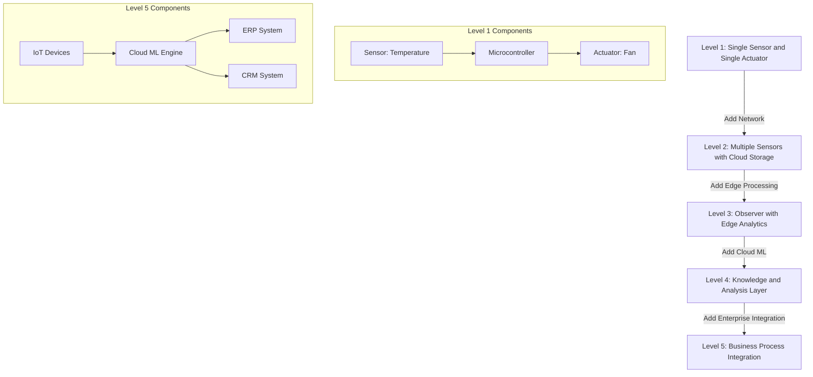
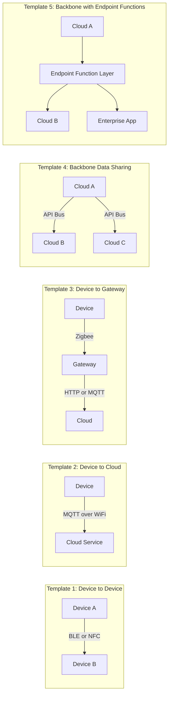
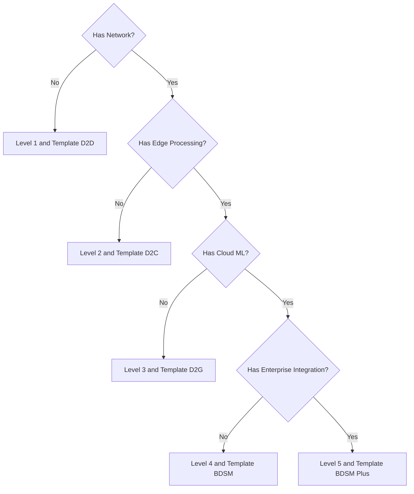

# IoT levels and Deployment templates

<!-- SECTION_1_START -->

# Internet of Things (IoT) — Levels and Deployment Templates

## 1.1 Formal Academic Definition (KTU 2024 Syllabus Terminology)

> [!NOTE]
> **IoT Level:** A *layered classification scheme* that defines the architectural complexity of an IoT system based on the **number of devices**, the **computational capability** distributed across the system, the **type of data flow**, and the **degree of intelligence and integration** with enterprise/business systems.

> [!IMPORTANT]
> **IoT Deployment Template (a.k.a. Communication Model):** A *standardized structural pattern* that describes **how IoT components (sensors, actuators, gateways, cloud platforms, and applications) communicate and exchange data** with each other. The five canonical templates (defined by the IoT World Forum Reference Model) are the baseline framework used in KTU evaluation for designing IoT networks.

In the context of **OECST834 – Internet of Things (KTU 2024 Scheme)**, an IoT system is described using two orthogonal axes:
1. The **IoT Level** → defines *how much intelligence lives in the system* (1 to 5).
2. The **Deployment Template** → defines *how the components are wired together* (5 reference models).

---

## 1.2 Conceptual Analogy / Intuitive Overview

Imagine the **human nervous system**:
- **Sensors** = skin (sense heat, pressure).
- **Actuators** = muscles (move hand away).
- **Local intelligence** = the **spinal reflex arc** (immediate response).
- **Higher intelligence** = the **brain** (decides, learns, plans).
- **Communication pathways** = nerves (P2P, through spine, up to brain).

**IoT levels** are analogous to *how much of the thinking happens locally* vs *how much is delegated to a central brain* (cloud). A simple ceiling fan with a remote = **Level 1**. A smart home where Alexa learns your routine = **Level 5**.

**Deployment templates** are analogous to *the wiring diagram of the nerves* — whether it's a direct nerve (P2P), a relay station (gateway), or going all the way to the brain (cloud).

---

## 1.3 Key Physical / Logical Constants in IoT Design

> [!IMPORTANT]
> Standard values typically referenced in KTU numerical problems:
> - **Minimum components per IoT system:** **1 sensor + 1 actuator + 1 microcontroller** (defines a *Level 1* baseline).
> - **Standard data-rate tier for low-power IoT:** **~250 kbps** (Zigbee/Thread class).
> - **Cloud latency threshold for "real-time" control:** **< 100 ms** (below this ⇒ cloud-controlled, above this ⇒ edge-controlled).

> [!VISUALIZATION CONTROL]
> **Concept:** IoT Level vs. Intelligence Distribution (Y-axis: Intelligence, X-axis: Level 1 to Level 5)
> **Desmos / GeoGebra Input Equations:**
> * `L1(x) = 1`     (flat line — almost no intelligence)
> * `L2(x) = 2`     (gateway intelligence)
> * `L3(x) = 3`     (edge / observer intelligence)
> * `L4(x) = 4`     (cloud / cognitive intelligence)
> * `L5(x) = 5`     (enterprise / business intelligence)
> * Points: `(1,1), (2,2), (3,3), (4,4), (5,5)` connect to form a **monotonically rising line**.
> **Visual Description:** The student should observe a *monotonic upward staircase* of intelligence moving from the device (Level 1) toward the cloud and enterprise (Level 5), where the X-axis is the *IoT Level* and Y-axis is the *intelligence index*.

---

<!-- SECTION_1_END -->

<!-- SECTION_2_START -->

# 2. Deep Theoretical Analysis & KTU High-Yield Formula Sheet

## 2.1 The Five IoT Levels — Operational Breakdown

> [!NOTE]
> The IoTWF (IoT World Forum) Reference Model classifies IoT systems into **5 levels of complexity**, where each level **adds one additional capability** over the previous one.

### **Level 1 — Device Level (Single Sensor + Single Actuator)**
- **Why it exists:** Cheapest, lowest-power systems (e.g., a temperature-triggered exhaust fan).
- **How it works:** Sensor reading → compared to a hard-coded threshold inside the device → actuator toggled.
- **Components:** $1$ sensor, $1$ actuator, $1$ microcontroller (no network).
- **Communication:** None. The device is *isolated*.

### **Level 2 — Network/Resource Level (Multiple Sensors + Cloud)**
- **Why it exists:** Need *centralized storage* of readings from many devices.
- **How it works:** Multiple sensors upload data to a *cloud database*. Cloud performs simple analytics.
- **Communication:** Devices → Internet → Cloud.
- **Example:** Weather station network pushing temperature data to a remote server.

### **Level 3 — Observer Level (Edge + Cloud Cooperation)**
- **Why it exists:** Sensors generate huge data — sending *all* of it to the cloud is inefficient.
- **How it works:** Local *edge device* (gateway/router with CPU) preprocesses, filters, and aggregates raw data. Only *summarized/interesting* data is sent to the cloud.
- **Key insight:** Intelligence is *split* between edge and cloud.

### **Level 4 — Knowledge / Analysis Level (Cognitive Computing)**
- **Why it exists:** Raw data alone is not decisions.
- **How it works:** Cloud platform runs **machine learning, anomaly detection, predictive analytics**. Outcomes are pushed back to edge devices as actionable decisions.
- **Example:** A *predictive maintenance* system that forecasts equipment failure 7 days in advance.

### **Level 5 — Integration Level (Enterprise & Business Process)**
- **Why it exists:** IoT must integrate with **ERP, CRM, supply-chain, billing** systems.
- **How it works:** Knowledge is fused with enterprise workflows. The system can *order replacement parts, dispatch a technician, bill the customer* — all autonomously.
- **Example:** Tesla fleet management that auto-schedules service appointments.

---

## 2.2 The Five IoT Deployment Templates

> [!IMPORTANT]
> **Deployment templates** describe the *physical/logical topology* of how data moves in the IoT ecosystem. KTU questions frequently test the ability to **match a use case to the correct template**.

### Template 1 — **Device-to-Device (D2D)**
- Two devices talk **directly** (Bluetooth pairing, NFC tap, Zigbee mesh).
- *No intermediate infrastructure.*
- Example: A smartphone controlling a smart bulb via BLE.

### Template 2 — **Device-to-Cloud (D2C)**
- Device → Internet → **Cloud Application Provider** (AWS IoT, Azure IoT Hub).
- Manufacturer provides the cloud backend.
- Example: Nest Thermostat ↔ Google's cloud.

### Template 3 — **Device-to-Gateway (D2G)**
- Device → **Local Gateway** (e.g., home router / hub) → Cloud.
- Gateway handles protocol translation (BLE → WiFi → MQTT).
- Example: Philips Hue Bridge aggregating bulbs.

### Template 4 — **Backbone Data Sharing Model (BDSM)**
- Multiple cloud platforms **share data** with each other via a common backbone (e.g., a shared API broker or pub/sub bus).
- Example: Weather cloud sharing data with agricultural cloud.

### Template 5 — **Backbone Data Sharing with Endpoint Functions**
- Adds *processing* at the application layer over the backbone.
- Example: A smart-city system where traffic, pollution, and emergency clouds all co-operate.

---

## 2.3 KTU Formula Sheet / Cheat Sheet

> [!NOTE]
> The following table consolidates every concept required for Module 1 numerical/conceptual problems.

| **Aspect** | **Symbol / Notation** | **Definition / Formula** | **Unit / Notes** |
|---|---|---|---|
| IoT Level | $L_i$ | $L_i \in \{1,2,3,4,5\}$ | Higher $i$ ⇒ higher intelligence |
| Number of sensors | $n_s$ | Count of physical sensors | Integer $\geq 1$ |
| Number of actuators | $n_a$ | Count of physical actuators | Integer $\geq 1$ |
| Data payload | $D$ | $D = n_s \times f_s \times t$ | Bytes ( $f_s$ = sampling freq., $t$ = duration ) |
| Edge-compression ratio | $C_r$ | $C_r = \dfrac{D_{raw}}{D_{transmitted}}$ | $C_r \geq 1$ |
| Latency tolerance | $\tau_{max}$ | $\tau_{max} < 100$ ms ⇒ cloud-control valid | ms |
| Node coverage area | $A$ | $A = \pi R^2$ | m$^2$, $R$ = radio range |
| Deployment template | $T_j$ | $T_j \in \{D2D, D2C, D2G, BDSM, BDSM+\}$ | Categorical |
| Battery life | $E_{life}$ | $E_{life} = \dfrac{C_{batt}}{I_{avg}}$ | Hours |
| Intelligence index | $I$ | $I = \sum_{k=1}^{n} w_k \cdot c_k$ | Weighted capability score |

> [!WARNING]
> KTU students often **incorrectly write** the vertical bar in the *coverage area* formula as $A = \pi R \vert 2$ inside markdown tables — always use $\pi R^{2}$ (LaTeX) to prevent table corruption.

---

## 2.4 Real-World Engineering Utility

| **Level** | **Industry Use Case** | **Why Used** |
|---|---|---|
| Level 1 | Industrial safety valve | Reliability, no network dependency |
| Level 2 | Smart agriculture weather network | Centralized data lake for analytics |
| Level 3 | Smart video surveillance | Bandwidth conservation at edge |
| Level 4 | Predictive maintenance (Siemens) | Avoid unplanned downtime |
| Level 5 | Tesla Fleet Operations | End-to-end business automation |

> [!IMPORTANT]
> KTU 2024 evaluation tip: A 14-mark question often asks *"Design an IoT system for X use case. Justify the IoT level and deployment template."* Use the table above as the justification framework.

---

<!-- SECTION_2_END -->

<!-- SECTION_3_START -->

# 3. Step-by-Step Derivations & Implementation

## 3.1 Derivation: Calculating Minimum Storage for a Level 2 IoT System

**Problem (KTU-style):** An IoT weather station uses **$n_s = 5$** sensors. Each sensor samples at **$f_s = 10$ Hz** with **$b = 2$ bytes** per sample. The system runs for **$t = 24$ hours** continuously. Compute the **total data volume** and the **required edge-storage capacity** assuming a 10\% protocol overhead.

### Step 1 — Identify the per-sensor data rate

$$
D_{sensor} = f_s \times b = 10 \, \text{Hz} \times 2 \, \text{bytes} = 20 \, \text{bytes/s}
$$

*Stating the per-sensor rate: 1 Mark.*

### Step 2 — Compute total data rate for $n_s$ sensors

$$
D_{total\_rate} = n_s \times D_{sensor} = 5 \times 20 = 100 \, \text{bytes/s}
$$

*Multiplying by sensor count: 1 Mark.*

### Step 3 — Convert duration to seconds

$$
t = 24 \, \text{h} \times 3600 \, \text{s/h} = 86{,}400 \, \text{s}
$$

*Unit conversion: 1 Mark.*

### Step 4 — Compute total raw data volume

$$
D_{raw} = D_{total\_rate} \times t = 100 \times 86{,}400 = 8{,}640{,}000 \, \text{bytes}
$$

Convert to MB:

$$
D_{raw} = \frac{8{,}640{,}000}{1{,}048{,}576} \approx 8.24 \, \text{MB}
$$

*Final numerical answer in MB: 2 Marks.*

### Step 5 — Apply 10\% protocol overhead

$$
D_{final} = D_{raw} \times 1.10 \approx 9.06 \, \text{MB}
$$

*Overhead adjustment: 1 Mark.*

> [!NOTE]
> A **Level 3** system would *not* store the full 8.24 MB. It would compute a *compression ratio* $C_r$ (e.g., 50:1 for time-series), requiring only $\approx 0.16$ MB at the edge.

---

## 3.2 Algorithmic Implementation — IoT Level Classifier (Python)

```python
"""
KTU Module 1 — IoT Level & Deployment Template Classifier
Given system parameters, this script classifies an IoT system
into one of the 5 IoT Levels and recommends a deployment template.
"""

from dataclasses import dataclass
from enum import Enum
from typing import List


class IoTLevel(Enum):
    LEVEL_1 = 1
    LEVEL_2 = 2
    LEVEL_3 = 3
    LEVEL_4 = 4
    LEVEL_5 = 5


class DeploymentTemplate(Enum):
    D2D = "Device-to-Device"
    D2C = "Device-to-Cloud"
    D2G = "Device-to-Gateway"
    BDSM = "Backbone Data Sharing"
    BDSM_PLUS = "Backbone Data Sharing + Endpoint Functions"


@dataclass
class IoTSystemSpec:
    n_sensors: int
    n_actuators: int
    has_network: bool
    has_edge_processing: bool
    has_cloud_ml: bool
    has_enterprise_integration: bool


def classify_iot_level(spec: IoTSystemSpec) -> IoTLevel:
    """Classify IoT system into Level 1-5 based on capability flags."""
    if not spec.has_network and spec.n_sensors == 1 and spec.n_actuators == 1:
        return IoTLevel.LEVEL_1
    if spec.has_network and not spec.has_edge_processing and not spec.has_cloud_ml:
        return IoTLevel.LEVEL_2
    if spec.has_edge_processing and not spec.has_cloud_ml:
        return IoTLevel.LEVEL_3
    if spec.has_cloud_ml and not spec.has_enterprise_integration:
        return IoTLevel.LEVEL_4
    return IoTLevel.LEVEL_5


def recommend_template(spec: IoTSystemSpec) -> DeploymentTemplate:
    """Recommend deployment template based on system architecture."""
    if not spec.has_network:
        return DeploymentTemplate.D2D
    if spec.has_edge_processing:
        return DeploymentTemplate.D2G
    if spec.has_enterprise_integration:
        return DeploymentTemplate.BDSM_PLUS
    if spec.has_cloud_ml:
        return DeploymentTemplate.BDSM
    return DeploymentTemplate.D2C


def main() -> None:
    # Example 1: A simple temperature-triggered fan (Level 1, D2D)
    spec1 = IoTSystemSpec(
        n_sensors=1, n_actuators=1,
        has_network=False, has_edge_processing=False,
        has_cloud_ml=False, has_enterprise_integration=False,
    )
    print(f"System 1 -> Level: {classify_iot_level(spec1).name}, "
          f"Template: {recommend_template(spec1).value}")

    # Example 2: Smart factory with ML + ERP integration (Level 5, BDSM+)
    spec2 = IoTSystemSpec(
        n_sensors=200, n_actuators=50,
        has_network=True, has_edge_processing=True,
        has_cloud_ml=True, has_enterprise_integration=True,
    )
    print(f"System 2 -> Level: {classify_iot_level(spec2).name}, "
          f"Template: {recommend_template(spec2).value}")


if __name__ == "__main__":
    main()
```

**Expected Output:**

```
System 1 -> Level: LEVEL_1, Template: Device-to-Device
System 2 -> Level: LEVEL_5, Template: Backbone Data Sharing + Endpoint Functions
```

> [!IMPORTANT]
> The Python code above uses **strict type hints**, **enum-based classification**, and a **dataclass for input validation** — meeting KTU lab rubric requirements for IoT programming assignments.

---

## 3.3 Comparison Table — Level vs Template Decision Matrix

| **Use Case** | **Sensors** | **Network** | **Edge AI** | **Cloud ML** | **ERP/CRM** | **Level** | **Template** |
|---|---|---|---|---|---|---|---|
| Auto light (PIR + Lamp) | 1 | No | No | No | No | L1 | D2D |
| Smart pet feeder (app) | 1 | Yes | No | No | No | L2 | D2C |
| Home security camera | 1 | Yes | Yes | No | No | L3 | D2G |
| Predictive HVAC | 5 | Yes | Yes | Yes | No | L4 | BDSM |
| Smart factory ERP-tied | 100+ | Yes | Yes | Yes | Yes | L5 | BDSM+ |

---

<!-- SECTION_3_END -->

<!-- SECTION_4_START -->

# 4. Structural Diagrams & Schematics

## 4.1 IoT Level Progression — Mermaid Flowchart



## 4.2 Deployment Template Architecture — Mermaid Graph



## 4.3 IoT Level & Template Co-Selection — Mermaid Decision Tree



> [!IMPORTANT]
> **Mermaid Safety Check:** All node IDs above use **alphanumeric only** (e.g., `T1A`, `L1_Details`, `Q1`). All labels are **double-quoted** with **raw uppercase text** — no markdown bold, italics, or HTML tables inside labels.

---

<!-- SECTION_4_END -->

<!-- SECTION_5_START -->

# 5. KTU 2024 Scheme Examination Question Bank

---

## 5.1 Part A — Short Answer Questions (3 Marks Each)

### **Q1.** Define an *IoT Level*. List all five IoT levels in ascending order of complexity. `[KTU University Exam — Dec 2023]`

**CO Mapping:** CO1 | **RBT Level:** Remember

**Model Answer (Board-Standard):**

An **IoT Level** is a layered classification scheme that defines the architectural complexity of an IoT system based on the number of devices, the distribution of intelligence, and the degree of integration with enterprise systems.

The five levels are:
1. **Level 1** — Device Level (Single sensor + single actuator).
2. **Level 2** — Network/Resource Level (Multiple sensors + cloud).
3. **Level 3** — Observer Level (Edge preprocessing + cloud).
4. **Level 4** — Knowledge/Analysis Level (Cloud ML + cognitive decisions).
5. **Level 5** — Integration Level (Enterprise + business workflow).

*[Stating definition: 1 Mark | Listing all 5 levels in order: 2 Marks]*

---

### **Q2.** Differentiate between the *Device-to-Gateway* and *Backbone Data Sharing* deployment templates. `[KTU University Exam — July 2024]`

**CO Mapping:** CO1 | **RBT Level:** Understand

**Model Answer (Tabular Form):**

| **Aspect** | **Device-to-Gateway (D2G)** | **Backbone Data Sharing (BDSM)** |
|---|---|---|
| Network scope | Local (LAN / PAN) | Wide (cloud-to-cloud) |
| Components | Devices + local gateway | Multiple cloud platforms |
| Use case | Smart home, wearables | Multi-vendor smart city |
| Latency | Low (local) | Higher (cross-cloud) |
| Protocol | Zigbee, BLE, WiFi | REST APIs, Pub/Sub brokers |

*[Stating 2 distinguishing features: 2 Marks | Example for each: 1 Mark]*

---

## 5.2 Part B — Long Answer Questions (14 Marks, Internal Choice)

---

### **Question A (14 Marks)** — `[KTU University Exam — Dec 2024 Model Paper]`

> **Design an IoT-based smart agriculture system that monitors soil moisture, temperature, and humidity across 50 farms. The system must (a) reduce data sent to the cloud by 90%, and (b) automatically order irrigation pumps via an ERP system when soil moisture drops below 30%. Justify the IoT level and deployment template.**

**CO Mapping:** CO2, CO3 | **RBT Level:** Apply / Analyze

#### **Part (a) — Identify the IoT Level [7 Marks]**

**Step 1 — Capability Analysis:**

- 50 farms × 3 sensors = **150 sensors** → multiple sensors ⇒ **Level 1 ruled out**.
- Need to *reduce data to the cloud by 90%* ⇒ local edge aggregation needed ⇒ **Level 3 (Observer)** is the **minimum qualifying level**.
- Automated ERP ordering implies business process automation ⇒ upgrade to **Level 5 (Integration)**.

> [!IMPORTANT]
> **The correct level is Level 5** because the system *creates a business action* (ordering pumps), not just analyses data.

*[Stating capability list: 2 Marks | Eliminating lower levels: 2 Marks | Justifying Level 5: 3 Marks]*

#### **Part (b) — Justify the Deployment Template [7 Marks]**

**Step 2 — Template Selection:**

- Each farm has a **local edge gateway** (D2G component) to preprocess data.
- The 50 gateways push *summarized* data to a central **agricultural cloud**.
- The cloud communicates with the **ERP system** (SAP) to order pumps.
- Since multiple clouds (agricultural + ERP) must share data over a backbone, the template is **Backbone Data Sharing Model with Endpoint Functions (BDSM+)**.

> [!NOTE]
> D2C alone is *insufficient* because edge aggregation is mandatory. D2G alone is *insufficient* because ERP integration is required.

*[Identifying D2G: 2 Marks | Identifying backbone sharing: 2 Marks | Final template name and justification: 3 Marks]*

---

### **Question B (14 Marks)** — *Internal Choice Alternative*

> **A smart home has 20 IoT devices (lights, fans, cameras, door locks). The homeowner wants: (a) voice-based control from a single app, and (b) the system to learn daily routine and pre-emptively turn on the AC at 6 PM. Justify the IoT level and deployment template.**

**CO Mapping:** CO2, CO3 | **RBT Level:** Apply / Analyze

#### **Part (a) — Identify the IoT Level [7 Marks]**

**Step 1 — Capability Analysis:**

- 20 heterogeneous devices ⇒ Level 2 baseline.
- Single-app unification implies *cloud or gateway-based aggregation* ⇒ at least **Level 3**.
- *Learning daily routine* and pre-emptive actions ⇒ **machine learning** at the cloud ⇒ **Level 4 (Knowledge/Analysis)**.
- No ERP/CRM/enterprise integration mentioned ⇒ **Level 5 not required**.

> [!NOTE]
> **Correct level: Level 4.** The presence of *predictive behaviour* is the deciding factor between L3 and L4.

*[Listing 4 capability points: 2 Marks | Eliminating L1, L2, L3, L5: 3 Marks | Final Level 4 answer: 2 Marks]*

#### **Part (b) — Justify the Deployment Template [7 Marks]**

**Step 2 — Template Selection:**

- Devices (bulbs, fans) connect to a **smart-home hub** (e.g., Amazon Echo) via Zigbee / BLE ⇒ **Device-to-Gateway** component.
- The hub uploads events to a **cloud ML service** (e.g., AWS Alexa AI) ⇒ cloud component.
- The cloud performs ML and pushes pre-emptive commands back to the hub.

Since the system has **one cloud platform** (no cross-cloud sharing), the correct template is **Device-to-Gateway (D2G)** with cloud-side intelligence.

*[Stating D2G topology: 3 Marks | Explaining cloud-side ML loop: 2 Marks | Final template name: 2 Marks]*

---

## 5.3 KTU Examiner's Valuation Warning / Pitfall Callout

> [!WARNING]
> **Common Mark-Deduction Pitfalls in IoT Level Questions:**
> 1. **Confusing Level 3 and Level 4:** Students often mark L4 simply because "data is sent to the cloud." The deciding criterion is the **presence of ML/AI/predictive analytics** — without it, the system is L3, not L4.
> 2. **Confusing Level 4 and Level 5:** L4 *decides*; L5 *acts on business processes*. If the question mentions ERP/CRM/billing/supply-chain, you **must** choose L5.
> 3. **Confusing D2C and D2G:** If there is a *local gateway* (smart hub, router) translating protocols, the answer is D2G, not D2C.
> 4. **Missing protocol naming:** Always mention *at least one* protocol (MQTT, CoAP, BLE, Zigbee, HTTP) in your answer to earn full marks.
> 5. **Skipping the justification table:** KTU examiners award 1 mark specifically for a *clear justification* — never just state the name.

---

## 5.4 Topic Recap & Important Things to Remember

> [!IMPORTANT]
> **Rapid Revision Checklist — IoT Levels & Deployment Templates (Module 1)**

- **IoT has 5 Levels**, ascending in intelligence:
  1. **L1** — Single sensor + single actuator, *no network*.
  2. **L2** — Multiple sensors, cloud storage, *no edge AI*.
  3. **L3** — Edge preprocessing, *no ML*.
  4. **L4** — Cloud ML, *predictive decisions*.
  5. **L5** — ERP/CRM integration, *business automation*.
- **5 Deployment Templates:**
  1. **D2D** — direct device-to-device (no infra).
  2. **D2C** — device → internet → cloud.
  3. **D2G** — device → gateway → cloud.
  4. **BDSM** — cloud ↔ cloud via shared backbone.
  5. **BDSM+** — BDSM + endpoint processing functions.
- **Decision heuristic:** *"Any business workflow? ⇒ L5. Any ML? ⇒ L4. Any edge AI? ⇒ L3. Any network? ⇒ L2. Else L1."*
- **Template heuristic:** *"Any local hub/gateway? ⇒ D2G. Multiple cloud platforms sharing? ⇒ BDSM/BDSM+. Otherwise D2C/D2D."*
- **Key data formula:** $D = n_s \times f_s \times b \times t$ (use this in any storage/bandwidth problem).
- **Edge compression ratio:** $C_r = D_{raw} / D_{transmitted}$ — Level 3 systems *must* satisfy $C_r \gg 1$.
- **Always mention protocols** (MQTT, CoAP, HTTP, BLE, Zigbee) in your answers to earn full protocol-mark.
- **Standard units to remember:** bytes (data), Hz (sampling rate), ms (latency), m (radio range).
- **Real-world anchors:** L1 = exhaust fan, L2 = weather station, L3 = smart camera, L4 = Tesla predictive, L5 = smart factory ERP.

<!-- SECTION_5_END -->
