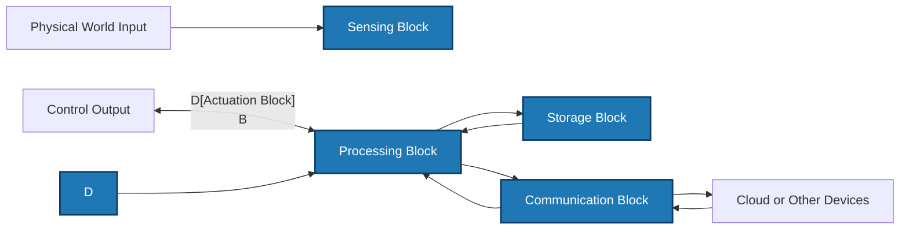
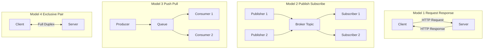
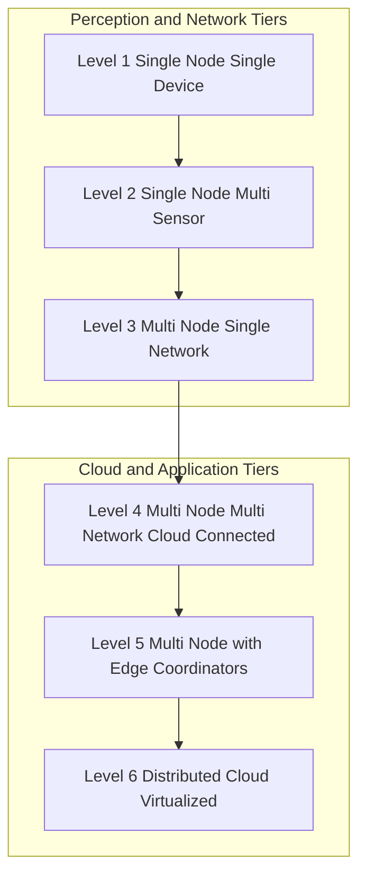
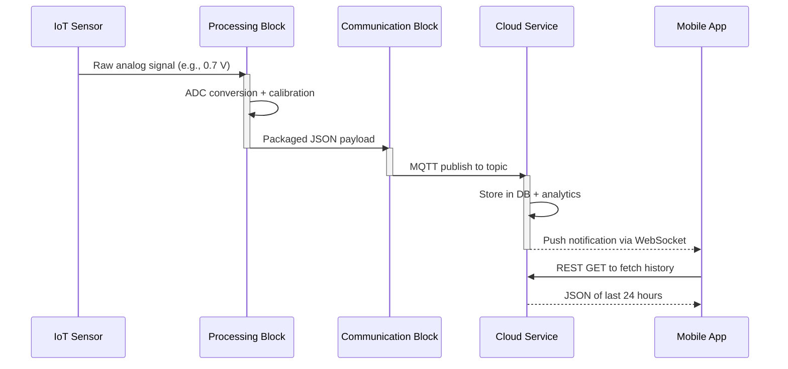

# Logical Design of IoT

<!-- SECTION_1_START -->
# Logical Design of IoT

> [!IMPORTANT]
> **KTU 2024 Syllabus Definition:** The **Logical Design of IoT** refers to an abstract representation of the entities (devices, sensors, services) participating in the IoT system, the interactions between them, the process of information flow, and the communication patterns that govern how data is exchanged, processed, and stored across the IoT network without being tied to specific vendors, products, or technologies.

## 1.1 Why "Logical" Design?

In KTU parlance, *physical design* answers **"WHAT exists?"** (sensors, microcontrollers, gateways, wiring).
*Logical design* answers **"HOW do they THINK and TALK?"** (functional blocks, communication models, APIs, data flow).

> [!NOTE]
> **The 4 Pillars of IoT Logical Design (Must remember for 3-mark questions)**
> 1. **IoT Functional Blocks** – sensor, actuator, communication, processing, service blocks.
> 2. **IoT Communication Models** – Request-Response, Publish-Subscribe, Push-Pull, Exclusive Pair.
> 3. **IoT Communication APIs** – REST, HTTP, CoAP, MQTT, AMQP, XMPP, WebSockets.
> 4. **IoT Architecture Levels (1–6)** – from a single device to a cloud-connected distributed network.

## 1.2 Intuitive Analogy — The Smart Post Office

Imagine a modern **Smart Post Office**:
- **Customers (Sensors)** drop letters (data).
- **Postal Workers (Functional Blocks)** sort, stamp, and route them.
- **Mailbox rules (Communication Models)** decide who can drop and who can read.
- **The postal protocol (APIs like REST/MQTT)** is the agreed language between post offices.
- **Building floors (IoT Levels 1–6)** represent how many branches, regional hubs, and central headquarters are involved.

The *Logical Design* is the rulebook of this post office — it has nothing to do with the *brand* of the trucks or *color* of the envelopes. That's physical design.

## 1.3 Key Terminology at a Glance

| Term | KTU Board-Definition | Real-World Analogy |
|---|---|---|
| **Functional Block** | A modular unit performing a specific logical role | A *department* in an office |
| **Communication Model** | The pattern governing data exchange between two parties | A *conversation rule* (e.g., one-to-many) |
| **API (Application Protocol Interface)** | A set of standardized rules for software communication | A *language* two strangers agree to use |
| **Service** | A software component providing well-defined functionality | A *service counter* at a bank |
| **Application Protocol** | A specific HTTP/CoAP/MQTT implementation | A *postal format* (speed-post vs. registered) |
<!-- SECTION_1_END -->

<!-- SECTION_2_START -->
# Deep Theoretical Analysis — The Four Logical Pillars

## 2.1 Pillar 1: IoT Functional Blocks (The Five Logical Units)

An IoT device, no matter how small or large, conceptually contains the following **5 functional blocks**:

1. **Sensing / Actuation Block** — interacts with the physical world.
   - *Sensors* (sense): Temperature, humidity, motion, gas.
   - *Actuators* (act): Motors, relays, solenoids, LEDs.
2. **Communication Block** — performs the data transfer (Wi-Fi, BLE, LoRa, 6LoWPAN).
3. **Processing / Computation Block** — runs the on-board logic (microcontroller, SoC, edge CPU).
4. **Storage Block** — holds data locally (EEPROM, Flash, SD card, SSD).
5. **Application Block / Service Block** — delivers the *meaning* of the data (analytics, dashboards, alerts).

> [!TIP]
> **Board Trick:** If the question says *"List the functional blocks of an IoT device"* — write exactly these 5. Don't merge sensing and actuation; they are *one* block but serve *two* opposite directions.

## 2.2 Pillar 2: IoT Communication Models

These four models define **WHO initiates** and **WHO listens**.

### Model A — Request–Response
- The **client** sends a request → the **server** responds.
- Stateless, synchronous.
- **Used in:** REST APIs over HTTP, Web form submission.

### Model B – Publish–Subscribe (Pub/Sub)
- **Publishers** push messages to a **Broker** (topic).
- **Subscribers** register interest in topics; the broker delivers relevant messages.
- **Used in:** MQTT, AMQP, DDS — the most common IoT pattern.

### Model C – Push–Pull
- **Producers** push data into a **Queue**.
- **Consumers** pull data from the queue at their own pace.
- **Used in:** Kafka, AMQP queues, log processing.

### Model D – Exclusive Pair
- A **persistent, bi-directional** connection between client and server.
- Full-duplex channel, both sides can send any time.
- **Used in:** WebSockets, BLE connections.

## 2.3 Pillar 3: IoT Communication APIs (Application Layer Protocols)

| Protocol | Full Name | Style | Transport | Header Size | Use Case in IoT |
|---|---|---|---|---|---|
| **HTTP** | HyperText Transfer Protocol | Request-Response | TCP | Large (~200–2000 bytes) | Web dashboards |
| **CoAP** | Constrained Application Protocol | Request-Response (REST-like) | UDP | Tiny (4 bytes) | Low-power sensor networks |
| **MQTT** | Message Queue Telemetry Transport | Pub/Sub | TCP | 2 bytes fixed header | Telemetry, IoT messaging |
| **AMQP** | Advanced Message Queuing Protocol | Pub/Sub + Push-Pull | TCP | 8 bytes | Enterprise messaging |
| **XMPP** | Extensible Messaging and Presence Protocol | Pub/Sub + Request-Response | TCP | XML-based | Chat, presence |
| **WebSockets** | Web Sockets | Exclusive Pair | TCP | 2–14 bytes | Real-time browser UIs |

> [!IMPORTANT]
> **KTU 2024 Highlight:** CoAP runs over **UDP** (not TCP), making it suitable for *constrained* devices. MQTT runs over **TCP** (port **1883**, TLS on **8883**).

## 2.4 Pillar 4: IoT Architecture Levels (Level 1 – Level 6)

The **IoT Level** describes the *number* of nodes and the *complexity* of the system.

| Level | Name | Number of Devices | Cloud / Edge | Data Generated |
|---|---|---|---|---|
| **Level 1** | Single Node, Single Device | **1** | No | Low |
| **Level 2** | Single Node, Multi Sensors | 1 (with many sensors) | No | Low |
| **Level 3** | Multi Node, Single Network | Few (10s) | No | Moderate |
| **Level 4** | Multi Node, Multi Network | 100s | Yes (Cloud) | High |
| **Level 5** | Multi Node, Multi Network with Coordinators | 1000s | Yes (Edge + Cloud) | Very High |
| **Level 6** | Distributed Cloud + Virtualization | Millions | Yes (Cloud native) | Massive |

## 2.5 KTU High-Yield Formula / Quick-Reference Sheet

> [!IMPORTANT]
> For the IoT logical design module, the "formulas" are primarily **decision matrices**.

### Communication Model Selection Cheat Sheet

$$
\text{Choose Model} = \begin{cases}
\text{Request-Response} & \text{if client pulls data on demand (web UI)} \\
\text{Pub-Sub} & \text{if many sensors push, many apps listen (telemetry)} \\
\text{Push-Pull} & \text{if workload must be buffered (Kafka log pipeline)} \\
\text{Exclusive Pair} & \text{if full-duplex, real-time stream needed (WebSockets)}
\end{cases}
$$

### Protocol Selection Cheat Sheet

$$
\text{Protocol} = \begin{cases}
\text{CoAP} & \text{if RAM} < 10\text{ KB and Wi-Fi unreliable} \\
\text{MQTT} & \text{if Wi-Fi reliable and many subscribers} \\
\text{HTTP} & \text{if browser-facing RESTful API required} \\
\text{AMQP} & \text{if enterprise-grade queuing + routing} \\
\text{WebSockets} & \text{if sub-second bi-directional UI}
\end{cases}
$$

### IoT Level Selection (Conceptual)

$$
\text{Level} \approx \log_{10}(\text{Number of Devices} \times \text{Networks})
$$

(For exam, just state the level name; this equation is *conceptual* and is **not** in the KTU syllabus — used here only for understanding density.)

## 2.6 Real-World Engineering Utility

- **Smart Agriculture** → uses **Level 3** with **MQTT** Pub/Sub to send moisture data to a farm dashboard.
- **Industrial IoT (IIoT)** → uses **Level 5** with **AMQP** + **Edge Gateways** for factory-floor control.
- **Wearables (Fitbit)** → uses **Level 2** with **BLE** (Exclusive Pair style) to a phone.
- **Smart City** → uses **Level 6** with **CoAP** over 6LoWPAN for streetlight control.
- **AWS IoT Core** is a *Level 6* logical deployment that supports **MQTT, HTTP, WebSockets** as its communication APIs.
<!-- SECTION_2_END -->

<!-- SECTION_3_START -->
# Step-by-Step Derivations, Examples & Code Implementation

## 3.1 Worked Example 1 — Mapping a Use Case to a Communication Model

**Use Case:** A network of 500 temperature sensors deployed across a cold-storage warehouse must send data every 30 seconds to a central monitoring system that displays real-time graphs in a browser.

**Step-by-step mapping:**

**Step 1 — Identify the data producers and consumers.**

$$
\text{Producers} = \{S_1, S_2, \dots, S_{500}\} \quad \text{(temperature sensors)}
$$

$$
\text{Consumers} = \{C_1 \text{ (dashboard)}, C_2 \text{ (alert engine)}, C_3 \text{ (DB logger)}\}
$$

**Step 2 — Identify the data flow direction.**

- Producers → out (they *push* data, not pull).
- Consumers → in (multiple consumers need the *same* data).

**Step 3 — Choose the communication model.**

Because (a) the producer pushes data without waiting, and (b) multiple consumers want the *same* data stream → **Publish–Subscribe (Pub/Sub)** model is the right fit.

**Step 4 — Choose the protocol.**

- Wi-Fi is available → TCP is fine.
- Telemetry + low bandwidth → **MQTT** is the standard choice.
- Brokers like *Mosquitto*, *HiveMQ*, or *AWS IoT Core* implement the Pub/Sub logic.

**Step 5 — Final architecture.**

$$
\text{Sensor} \xrightarrow{\text{Publish to topic "warehouse/temp"}} \text{MQTT Broker} \xrightarrow{\text{Fan-out}} \{\text{Dashboard, Alert, DB}\}
$$

> **Conclusion:** Logical design choice = **Pub/Sub** + **MQTT** over TCP.

## 3.2 Worked Example 2 — REST API Design (IoT Communication API)

Below is a fully functional **Python Flask** REST API that models the *Request–Response* model for an IoT temperature sensor.

```python
# temperature_api.py
# A complete IoT logical design example using REST (HTTP) over Request-Response model.
# KTU 2024 - Module 1 reference implementation.

from flask import Flask, jsonify, request
from datetime import datetime
import logging
import sys
from typing import Dict, Any

# Configure structured logging for error monitoring
logging.basicConfig(
    level=logging.INFO,
    format="%(asctime)s [%(levelname)s] %(message)s",
    stream=sys.stdout,
)

app = Flask(__name__)

# In-memory storage representing the IoT application/storage block
sensor_database: Dict[str, Dict[str, Any]] = {}


@app.route("/api/v1/sensors", methods=["POST"])
def register_sensor():
    """Register a new IoT sensor in the logical network."""
    try:
        payload = request.get_json(force=True, silent=False)
        if not payload or "sensor_id" not in payload:
            return jsonify({"error": "sensor_id is required"}), 400

        sensor_id = str(payload["sensor_id"])
        if sensor_id in sensor_database:
            return jsonify({"error": "sensor_id already exists"}), 409

        sensor_database[sensor_id] = {
            "location": payload.get("location", "unknown"),
            "last_value": None,
            "last_updated": None,
        }
        logging.info("Sensor registered: %s", sensor_id)
        return jsonify({"message": "Sensor registered", "sensor_id": sensor_id}), 201
    except Exception as exc:
        logging.error("Registration failure: %s", exc)
        return jsonify({"error": "Internal server error"}), 500


@app.route("/api/v1/sensors/<sensor_id>/reading", methods=["POST"])
def post_reading(sensor_id: str):
    """Sensor pushes a temperature reading."""
    try:
        if sensor_id not in sensor_database:
            return jsonify({"error": "Unknown sensor"}), 404

        payload = request.get_json(force=True, silent=False)
        temperature_c = payload.get("temperature_c")
        if not isinstance(temperature_c, (int, float)):
            return jsonify({"error": "temperature_c must be numeric"}), 400

        # Boundary checks (engineering safety constraint)
        if temperature_c < -50.0 or temperature_c > 150.0:
            return jsonify({"error": "Out of plausible range"}), 422

        sensor_database[sensor_id]["last_value"] = float(temperature_c)
        sensor_database[sensor_id]["last_updated"] = datetime.utcnow().isoformat()
        return jsonify({"message": "Reading accepted"}), 202
    except Exception as exc:
        logging.error("Reading failure: %s", exc)
        return jsonify({"error": "Internal server error"}), 500


@app.route("/api/v1/sensors/<sensor_id>/reading", methods=["GET"])
def get_reading(sensor_id: str):
    """Application pulls (Request) the latest reading (Response)."""
    if sensor_id not in sensor_database:
        return jsonify({"error": "Unknown sensor"}), 404
    return jsonify(sensor_database[sensor_id]), 200


if __name__ == "__main__":
    # Run on standard Flask dev server for demonstration
    app.run(host="0.0.0.0", port=5000, debug=False)
```

### Code Walk-through (for exam purposes)

1. `POST /api/v1/sensors` — *registering* a sensor. This is the **service block** registering a node.
2. `POST /api/v1/sensors/<id>/reading` — the **sensor** (client) pushing data. The **server** (cloud) responds. This is the **Request–Response** model.
3. `GET /api/v1/sensors/<id>/reading` — the **dashboard** (another client) pulling data. Same model.
4. Boundary checks `-50 < T < 150` — represents **engineering safety** (the *application block*).
5. Logging — represents the **monitoring service**.

## 3.3 Worked Example 3 — MQTT Pub/Sub Snippet (Logical View)

```python
# mqtt_pubsub.py
# Minimal Pub/Sub logical design using paho-mqtt.
# Demonstrates the IoT Publish-Subscribe communication model.

import paho.mqtt.client as mqtt
import json
import time

BROKER_HOST = "test.mosquitto.org"
BROKER_PORT = 1883              # Standard MQTT TCP port (no TLS)
TOPIC = "ktu/iot/module1/sensor/temperature"


def on_connect(client, userdata, flags, rc):
    """Callback executed by the MQTT client when it connects to the broker."""
    if rc == 0:
        print("Connected to MQTT broker.")
        client.subscribe(TOPIC)
    else:
        print(f"Connection failed with code {rc}")


def on_message(client, userdata, msg):
    """Callback executed by the MQTT client when a message arrives."""
    payload = msg.payload.decode("utf-8", errors="ignore")
    print(f"Topic: {msg.topic} | Payload: {payload}")


client = mqtt.Client(client_id="ktu-iot-student-01", clean_session=True)
client.on_connect = on_connect
client.on_message = on_message

client.connect(BROKER_HOST, BROKER_PORT, keepalive=60)
client.loop_start()

# Publish a temperature reading every 3 seconds (Publisher side)
for i in range(5):
    reading = {"sensor_id": "S-001", "temperature_c": 25.0 + i * 0.5}
    client.publish(TOPIC, json.dumps(reading), qos=1)
    time.sleep(3)

client.loop_stop()
client.disconnect()
```

### Logical Mapping

| Code Element | Logical Block |
|---|---|
| `client.publish(...)` | **Sensing / Publishing block** |
| `client.on_message` | **Subscriber (Application block)** |
| `test.mosquitto.org:1883` | **Communication block (Broker)** |
| `TOPIC = "ktu/iot/..."` | **Service topic (Service block)** |

> **This is the canonical Pub/Sub example that KTU examiners love to ask in 7-mark questions.**
<!-- SECTION_3_END -->

<!-- SECTION_4_START -->
# Structural Diagrams & Schematics

## 4.1 The Five Functional Blocks of an IoT Device



**Reading the diagram:**

- The **Sensing block** reads the environment (e.g., temperature sensor outputs an analog voltage).
- The **Processing block** (microcontroller) digitizes and processes it.
- The **Storage block** retains the value for short-term or long-term use.
- The **Communication block** transmits data to the **cloud** (or other devices) using Wi-Fi, BLE, or LoRa.
- When a decision is taken, the **Actuation block** triggers a physical control (relay, motor).

## 4.2 The Four Communication Models — Comparative Topology



**Important:** Each subgraph represents an *isolated* communication topology. In a real IoT system, you can mix them (e.g., device uses Pub/Sub for telemetry, Exclusive Pair for control).

## 4.3 IoT Architecture Levels — Layered Deployment View



**Exam Mapping:**

- *Smart Bulb (single device, app-controlled)* → **Level 1**.
- *BLE wearable (one device, several sensors)* → **Level 2**.
- *Home Wi-Fi sensors (multiple ESP8266 nodes on a Wi-Fi LAN)* → **Level 3**.
- *Fleet of cold-chain trucks reporting to AWS IoT* → **Level 4**.
- *Smart factory with edge gateways doing local analytics* → **Level 5**.
- *Smart-city traffic system with millions of nodes and serverless cloud* → **Level 6**.

## 4.4 Sequential Processing Topology — A Sensor's Logical Life-Cycle



**Why this matters for KTU:** Drawing sequence diagrams shows the **examiner** that you understand the *flow* of logical data, not just the components.
<!-- SECTION_4_END -->

<!-- SECTION_5_START -->
# KTU 2024 Scheme Examination Question Bank & Topic Recap

## Part A — Short Answer Questions (2 × 3 = 6 Marks)

### Question 1 — `[KTU University Exam - July 2024]`
**Define the term "Logical Design of IoT" and list any four functional blocks of an IoT device.**

**Model Answer (3 marks):**

**Definition (2 marks):** The Logical Design of IoT is an abstract representation of the IoT system that defines how the entities (sensors, actuators, services, applications) interact with each other, the data flow between them, and the communication patterns used for information exchange, *independent of* specific products, vendors, or technologies.

**Functional blocks (any 4 × ½ = 2 marks):**
1. Sensing block
2. Actuation block
3. Communication block
4. Processing block
5. Storage block
6. Application / Service block

> [!WARNING]
> **Common Mistake:** Writing "hardware components" instead of "functional blocks" loses 1 mark. The KTU board wants the *abstract logical* name, not the physical component.

---

### Question 2 — `[KTU University Exam - Dec 2023]`
**Compare the Publish-Subscribe and Request-Response communication models.**

**Model Answer (3 marks):**

| Aspect | Request-Response | Publish-Subscribe |
|---|---|---|
| Direction | Client → Server (and back) | Publisher → Broker → Subscribers |
| Coupling | Tight (client knows server URL) | Loose (publisher doesn't know subscribers) |
| Timing | Synchronous | Asynchronous |
| Example Protocol | HTTP, CoAP | MQTT, AMQP |

**Conclusion (1 mark):** Request-Response suits *on-demand* queries; Pub/Sub suits *continuous telemetry* from many sensors to many applications.

---

## Part B — Long Answer Questions (Module Internal Choice)

### Question A (14 Marks) — `[KTU University Exam - July 2024]`
**(a)** Explain the **four IoT communication models** with neat diagrams. **(7 marks)**

**(b)** Discuss the **functional blocks of an IoT system** and show how they map to a real-world use case of a smart irrigation system. **(7 marks)**

---

### Model Answer for (a) — 7 Marks

**1. Request-Response Model (1.5 marks)**
- A client sends a request; the server processes it and returns a response.
- Stateless, synchronous.
- Example: REST API over HTTP — `GET /sensor/temperature`.
- Diagram:
```
Client ── HTTP Request ──▶ Server
Client ◀── HTTP Response ── Server
```

**2. Publish-Subscribe Model (2 marks)**
- Publishers push messages to a *broker* under a *topic*.
- Subscribers register interest in topics; broker delivers relevant messages.
- Example: MQTT — `iot/farm/moisture`.
- Diagram:
```
Publisher ──▶ [Broker Topic] ──▶ Subscriber A
Publisher ──▶ [Broker Topic] ──▶ Subscriber B
```

**3. Push-Pull Model (1.5 marks)**
- Producers push data into a queue.
- Consumers pull at their own pace.
- Example: Kafka log pipeline.
- Diagram:
```
Producer ──▶ Queue ──▶ Consumer 1
Producer ──▶ Queue ──▶ Consumer 2
```

**4. Exclusive Pair Model (1.5 marks)**
- Persistent full-duplex connection.
- Both sides can send any time.
- Example: WebSockets, BLE connection.
- Diagram:
```
Client ◀══════════════════▶ Server
        (full-duplex channel)
```

**Conclusion (½ mark):** Choice of model depends on the data flow, number of participants, and latency needs.

---

### Model Answer for (b) — 7 Marks

**Step 1 — Functional blocks of an IoT device (3 marks):**

1. **Sensing block** — soil moisture sensor, temperature sensor.
2. **Actuation block** — water pump relay, solenoid valve.
3. **Processing block** — ESP32 microcontroller runs the irrigation logic.
4. **Communication block** — Wi-Fi module publishes to MQTT broker.
5. **Storage block** — local EEPROM stores watering history.
6. **Application block** — cloud dashboard and mobile app.

**Step 2 — Mapping to a smart irrigation use case (3 marks):**

| IoT Logical Step | Physical Realization |
|---|---|
| Sense | Soil-moisture sensor reads value |
| Process | ESP32 compares value with threshold |
| Decide | If dry, trigger relay |
| Actuate | Relay closes circuit → pump ON |
| Communicate | ESP32 publishes "pump=ON, moisture=23%" to broker |
| Store | Cloud DB stores event with timestamp |
| Notify | Mobile app shows real-time status |

**Step 3 — Logical flow diagram (1 mark):**
```
Sensor → Processing → Communication → Cloud → App
                          ↓
                    Storage (local+cloud)
                          ↓
                    Actuation (pump)
```

> [!WARNING]
> **Pitfall:** Many students write the *physical* components (ESP32, DHT11) instead of the *logical* functional blocks. The KTU examiner awards full marks only when **functional block names** are used.

---

### Question B (14 Marks) — `[KTU University Exam - Dec 2023]`
**(a)** With a neat diagram, describe the **six levels of IoT deployment**. **(7 marks)**

**(b)** Explain the **key IoT communication APIs (HTTP, CoAP, MQTT, AMQP, WebSockets)** and state one engineering use case for each. **(7 marks)**

---

### Model Answer for (a) — 7 Marks

**Level 1 — Single Node, Single Device (1 mark)**
- One IoT device connected to a single application.
- No network, no cloud.
- Example: A Wi-Fi smart bulb controlled by a phone app.

**Level 2 — Single Node, Multiple Sensors (1 mark)**
- One device hosts multiple sensors/actuators.
- Example: A weather station with temperature, humidity, and pressure sensors on one microcontroller.

**Level 3 — Multiple Nodes, Single Network (1 mark)**
- A few devices on a single local network (Wi-Fi, Zigbee).
- No cloud integration.
- Example: A smart-home with 10 ESP32 nodes on a Wi-Fi LAN.

**Level 4 — Multiple Nodes, Multiple Networks, Cloud Connected (1.5 marks)**
- Devices across multiple networks report to a cloud.
- Cloud stores, analyzes, and visualizes.
- Example: AWS IoT Core receiving data from 100s of cold-chain trucks.

**Level 5 — Multiple Nodes with Edge Coordinators (1.5 marks)**
- Local edge gateways aggregate and pre-process data.
- Cloud receives only filtered/aggregated data.
- Example: Smart factory with on-prem edge gateways.

**Level 6 — Distributed Cloud & Virtualization (1 mark)**
- Millions of nodes, serverless cloud, virtualization.
- Example: Smart-city traffic management with millions of IoT nodes.

**[Neat Level diagram (½ mark):]** Draw a pyramid or a layered box — see Section 4.3 of this note.

---

### Model Answer for (b) — 7 Marks

For each protocol, the marking scheme is: **Statement of full form (¼)**, **Transport (¼)**, **Style (½)**, **Use case (½)**.

**1. HTTP — HyperText Transfer Protocol (1.4 marks)**
- Transport: TCP, port 80 (TLS: 443).
- Style: Request-Response (RESTful).
- Use case: Web dashboard pulling data from an IoT cloud.

**2. CoAP — Constrained Application Protocol (1.4 marks)**
- Transport: **UDP**, port 5683.
- Style: Request-Response (REST-like), 4-byte header.
- Use case: Low-power 6LoWPAN sensor networks.

**3. MQTT — Message Queue Telemetry Transport (1.4 marks)**
- Transport: TCP, port 1883 (TLS: 8883).
- Style: Publish-Subscribe, 2-byte fixed header.
- Use case: Real-time telemetry in industrial IoT.

**4. AMQP — Advanced Message Queuing Protocol (1.4 marks)**
- Transport: TCP, port 5672 (TLS: 5671).
- Style: Pub/Sub + Push-Pull, with queuing.
- Use case: Enterprise messaging, banking, supply chain.

**5. WebSockets (1.4 marks)**
- Transport: TCP, port 80/443 (HTTP upgrade).
- Style: Exclusive Pair, full-duplex.
- Use case: Real-time browser-based IoT dashboards.

> [!WARNING]
> **Pitfall:** Students often write "CoAP uses TCP" — **wrong**. CoAP uses **UDP**. This is a 1-mark deduction trap in 14-mark questions.

---

## Topic Recap & Important Things to Remember

> [!IMPORTANT]
> **Rapid Revision Checklist — Module 1: Logical Design of IoT**

- **Logical Design ≠ Physical Design.** Logical = abstract, vendor-neutral. Physical = specific components.
- **5 Functional Blocks of any IoT device:** Sensing, Actuation, Processing, Communication, Storage, Application (the last is often called *Service block*).
- **4 Communication Models:** Request-Response, Publish-Subscribe, Push-Pull, Exclusive Pair.
- **Request-Response** → HTTP, CoAP.
- **Publish-Subscribe** → MQTT, AMQP.
- **Push-Pull** → Kafka, AMQP queues.
- **Exclusive Pair** → WebSockets, BLE.
- **CoAP** is the *only* major IoT protocol that runs over **UDP** (4-byte header, 5683). All others use **TCP**.
- **MQTT** runs on **TCP port 1883** (unencrypted) and **8883** (TLS).
- **AMQP** uses **TCP port 5672** (TLS: 5671).
- **6 IoT Levels:** L1 (1 device) → L2 (1 node, many sensors) → L3 (multi-node, single network) → L4 (multi-network + cloud) → L5 (edge gateways) → L6 (distributed cloud).
- **REST APIs** are the most common way to expose IoT data to web/mobile clients.
- **Pub/Sub brokers** decouple producers from consumers — the cornerstone of scalable IoT.
- **WebSockets** enable real-time browser UIs (e.g., live temperature chart).
- For 14-mark answers, always pair: **Model name + Protocol example + Use case + Diagram**.
- For 3-mark answers, list the *exact* four communication models — don't substitute with "broadcast" or "unicast" (those are OSI-layer terms, not logical design).
- The *application block* (or *service block*) is what gives the data its *meaning* — don't forget to mention it in long answers.
<!-- SECTION_5_END -->
