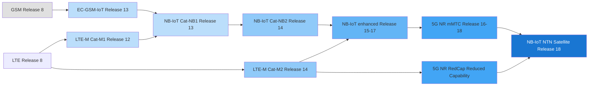
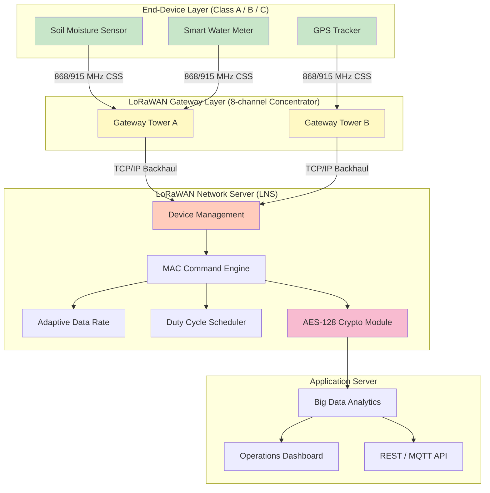
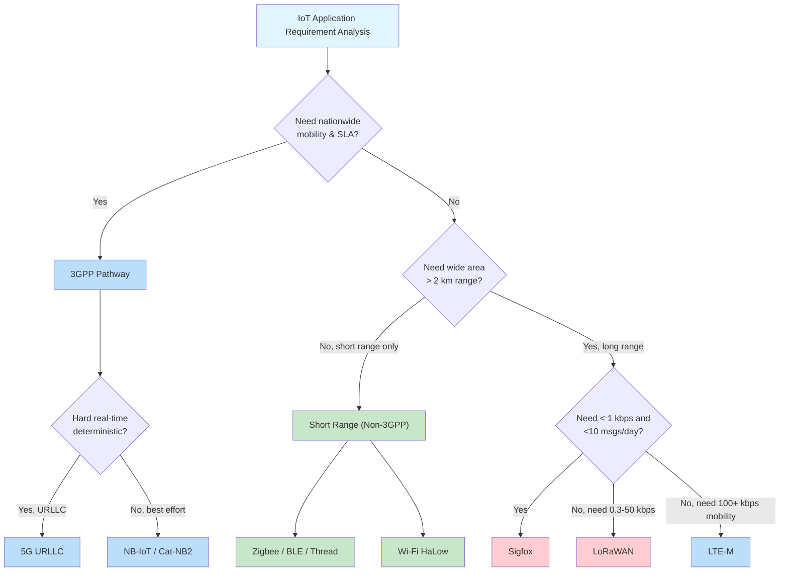
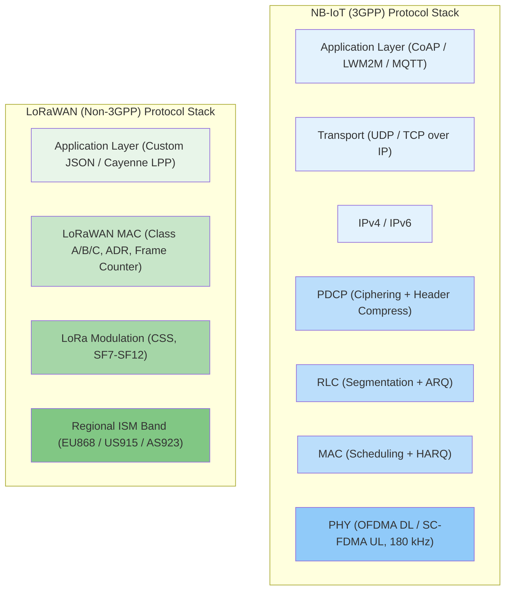

# Cellular (3GPP) and Non 3GPP standards

<!-- SECTION_1_START -->
# Cellular (3GPP) and Non-3GPP IoT Standards — Foundations

## 1.1 Formal Academic Definition (KTU 2024 Terminology)

> [!NOTE]
> **3GPP (3rd Generation Partnership Project)** is a collaborative standards organization that unites seven regional telecommunications standards bodies (e.g., ETSI, ATIS, TTA, TTC, ARIB, CCSA, TSDSI) to define the technical specifications for **cellular mobile communication networks** including GSM, UMTS, LTE, and 5G. For IoT, 3GPP has progressively introduced optimized low-power, wide-area cellular technologies spanning **Releases 8 through 18**, including LTE-M (Long-Term Evolution for Machines), NB-IoT (Narrowband IoT), EC-GSM-IoT, and the 5G Massive IoT (mMTC) framework.

> [!IMPORTANT]
> **Non-3GPP IoT Standards** refer to a heterogeneous family of **proprietary, open-Industry, and IEEE-based Low Power Wide Area Network (LPWAN) / Short Range protocols** that operate *outside* the 3GPP cellular ecosystem. They are typically deployed in unlicensed Industrial, Scientific, and Medical (ISM) radio bands and include technologies such as **LoRaWAN (LoRa Alliance)**, **Sigfox**, **Ingenu (RPMA)**, **Weightless-W/M/N/P**, **Wi-Fi HaLow (IEEE 802.11ah)**, **Zigbee (IEEE 802.15.4)**, **Bluetooth LE**, **Z-Wave**, **Thread**, **Matter**, and **DASH7**.

## 1.2 Conceptual Analogy — The "Postal Network vs. Courier Specialist" Metaphor

Imagine you need to ship a small package across a country:

* The **3GPP cellular network** is like the **national postal service (India Post / USPS / Royal Mail)** — it is **ubiquitous, regulated, carrier-grade, government-licensed**, operates in dedicated, auctioned spectrum bands, and has **strong Service Level Agreements (SLAs)**, built-in security, mobility handover, and guaranteed Quality of Service (QoS). It costs more, but it works *everywhere* a SIM card has coverage.

* The **Non-3GPP networks (LoRa, Sigfox, etc.)** are like **independent private courier companies** — they operate in **open, free ISM bands** (like 868 MHz, 915 MHz, 2.4 GHz), have **low operational cost**, are **easy to deploy** (you can set up a private LoRa gateway on your rooftop), but have **best-effort service**, **duty-cycle restrictions** (e.g., 1% in EU868), and **interference susceptibility**.

| Analogy Element | 3GPP (Cellular) | Non-3GPP (LPWAN/SR) |
|---|---|---|
| Spectrum | **Licensed, auctioned** | **Unlicensed ISM bands** |
| Coverage | Operator-managed nationwide | Private/sparse |
| Cost per device | Higher (SIM, subscription) | Lower (often subscription-free) |
| Use case | Asset tracking at scale, mobility | Smart agriculture, smart metering |

## 1.3 Physical Constants and Standard Metrics

* **Speed of light** in free space: $c = 3 \times 10^{8}\ m/s$
* **ISM Band** frequencies used by LPWAN: **433 MHz, 868 MHz (EU), 915 MHz (US), 2.4 GHz (Global)**
* **3GPP Licensed Bands** for IoT: **700–900 MHz, 1.8 GHz, 2.1 GHz, 2.6 GHz, 3.5 GHz (5G)**
* **Maximum Coupling Loss (MCL)** for NB-IoT: **164 dB**
* **MCL for LTE-M**: **156 dB**
* **Duty Cycle** (EU868 regulation): **≤ 1%** per device per sub-band
* **Maximum transmit power (ERP)** for LoRaWAN EU868: **+14 dBm (25 mW)**

> [!VISUALIZATION CONTROL]
> **Concept:** Spectrum allocation and IoT protocol positioning on a Frequency vs. Data Rate 2D coordinate plane.
> **GeoGebra / Desmos Input Equations:**
> * `x = 433` (vertical line — Sub-GHz ISM)
> * `x = 868` (vertical line — European ISM)
> * `x = 2400` (vertical line — Global 2.4 GHz ISM)
> * `f(x) = log10(x) / 10` (logarithmic trend — Shannon-style data rate vs frequency curve)
> **Visual Description:** Students should observe a logarithmic decay of achievable data rate as we move from 2.4 GHz (high rate) to sub-GHz bands (low rate, long range). Place marker points: Sigfox ≈ (868, 0.1 kbps), LoRa ≈ (868, 50 kbps), NB-IoT ≈ (900, 200 kbps), LTE-M ≈ (1800, 1 Mbps), Wi-Fi HaLow ≈ (900, 347 Mbps).

<!-- SECTION_1_END -->

<!-- SECTION_2_START -->
# Deep Theoretical Analysis & KTU High-Yield Formula Sheet

## 2.1 The 3GPP IoT Technology Family Tree

3GPP IoT standards have evolved over multiple releases in a layered fashion:

* **Release 8 (2008) — LTE baseline**: Cat-1 UE, 10 Mbps DL / 5 Mbps UL.
* **Release 12 (2014) — LTE-M (Cat-M1) introduction**: New UE category optimized for IoT, **1.4 MHz bandwidth**, **half-duplex FDD**, **extended DRX (eDRX) up to ~44 minutes**, **PSM (Power Save Mode)** with sleep current ~**3 µA**.
* **Release 13 (2016) — NB-IoT (Cat-NB1) + EC-GSM-IoT**: NB-IoT introduced in-band, guard-band, and standalone deployment. **180 kHz bandwidth** (one Physical Resource Block). **Downlink: OFDMA, 15 kHz subcarrier spacing**. **Uplink: SC-FDMA (single-tone or multi-tone)**. EC-GSM-IoT re-uses GSM with software upgrades to achieve **164 dB MCL**.
* **Release 14 (2017) — Cat-M2, Cat-NB2**: Higher data rates, positioning (OTDOA), multicast.
* **Release 15 (2018) — 5G NR Phase 1, LTE-M/NB-IoT improvements**.
* **Release 16/17/18 — 5G mMTC, RedCap (NR-Light), Satellite IoT (NTN)**: Reduced Capability (RedCap) for mid-tier wearables/industrial sensors with **~10 Mbps peak**, half-bandwidth of full NR.

> [!IMPORTANT]
> **KTU Syllabus Highlight:** For OECST834 Module 2, focus on **LTE-M, NB-IoT, EC-GSM-IoT, and 5G mMTC**, plus comparison against **LoRaWAN, Sigfox, and IEEE 802.15.4 (Zigbee)** families.

## 2.2 Non-3GPP IoT Protocol Deep Dive

### 2.2.1 LoRaWAN (Long Range Wide Area Network)

* **Physical layer**: Semtech **LoRa** modulation — Chirp Spread Spectrum (CSS) with **Spreading Factors (SF7 to SF12)**.
* **Adaptive Data Rate (ADR)**: Higher SF = longer range, lower data rate, higher air-time.
* **MAC layer**: **LoRa Alliance** defines **Class A (bi-directional, downlink only after uplink), Class B (synchronized beacons), Class C (continuous listen)**.
* **Architecture**: **End-Device → Gateway (concentrator) → Network Server → Application Server** (star-of-stars topology).
* **Security**: **AES-128** end-to-end with **AppKey, NwkSKey, AppSKey** key hierarchy.

### 2.2.2 Sigfox

* **Ultra-Narrowband (UNB)** modulation, **100–600 Hz bandwidth**, **100 bps uplink / 600 bps downlink** (in regulatory regions allowing it).
* **Frame limit**: **140 uplink + 4 downlink messages per day** (regulatory cap).
* **Duty cycle**: 1% on each 868.2 / 868.4 / 869.4 / 869.5 MHz EU868 channels.
* **Random access**: ALOHA-like; messages transmitted on *any* of 3 randomly-chosen channels.

### 2.2.3 IEEE 802.15.4 / Zigbee / 6LoWPAN / Thread

* **802.15.4 PHY/MAC** — foundation of Zigbee, Thread, 6LoWPAN, WirelessHART, ISA100.11a.
* **Data rate**: **250 kbps** in 2.4 GHz O-QPSK modulation.
* **Zigbee** runs on 802.15.4 with **mesh networking** (Coordinator → Routers → End Devices).
* **6LoWPAN**: IPv6 adaptation over 802.15.4 (RFC 4944, RFC 6282).
* **Thread**: IPv6-native mesh, designed to bridge with **Matter** (formerly Project CHIP).

### 2.2.4 Wi-Fi HaLow (IEEE 802.11ah)

* **Sub-1 GHz** Wi-Fi, **900 MHz**, **OFDM with 1/2/4/8/16 MHz channels**.
* **Range up to 1 km**, **data rate up to 347 Mbps** (mandatory MCS0 only gives **~150 kbps** at long range).
* **Target**: Wi-Fi-style high-throughput sensors, video surveillance, industrial IoT.

## 2.3 KTU High-Yield Formula Sheet

| Concept | Formula / Definition | Engineering Use |
|---|---|---|
| Friis Path Loss | $PL(dB) = 20\log_{10}(d) + 20\log_{10}(f) + 20\log_{10}\left(\frac{4\pi}{c}\right)$ | Link budget calculation |
| Free-space path loss at distance d (m) and freq f (Hz) | $PL = 32.45 + 20\log_{10}(f_{MHz}) + 20\log_{10}(d_{km})$ dB | LPWAN range estimation |
| Maximum Coupling Loss (MCL) | $MCL = P_{TX} + G_{TX} - S_{RX} + G_{RX}$ | Coverage class definition |
| Shannon-Hartley Capacity | $C = B \cdot \log_2\left(1 + \frac{S}{N}\right)$ bits/s | Upper-bound data rate |
| Bit Energy / Noise Spectral Density | $\frac{E_b}{N_0} = \frac{P \cdot T_b}{N_0}$ | Link budget and modulation efficiency |
| LoRa Time-on-Air (approx) | $ToA = \frac{2^{SF}}{BW} \cdot N_{sym}$ seconds | Battery life estimation |
| Battery life estimate | $T_{years} \approx \frac{C_{mAh} \cdot V_{nom}}{I_{sleep} \cdot t_{cycle} \cdot 8760}$ | IoT device planning |
| Receiver Sensitivity | $S = -174 + 10\log_{10}(BW) + NF + \frac{E_b}{N_0}$ dBm | Coverage test |

> [!NOTE]
> **Key Constant to Memorize:** $k_B T$ at room temperature (290 K) thermal noise floor = **−174 dBm/Hz**. Every doubling of bandwidth costs 3 dB of sensitivity.

## 2.4 Engineering Real-World Utility

* **3GPP IoT** is mandated for **regulated industries** — connected vehicles (eV2X over 5G), smart-grid metering (DLMS/COSEM over NB-IoT), patient monitoring (FDA-grade medical telemetry over LTE-M), and **Logistics (e.g., Maersk refrigerated containers)**, where international mobility and carrier-grade SLAs are non-negotiable.

* **Non-3GPP** dominates in **agriculture (LoRaWAN soil sensors, Sigfox cattle tracking)**, **utility AMR (LoRaWAN smart water meters)**, **home automation (Zigbee, Thread, Matter)**, **beaconing (BLE)**, and **industrial protocols (WirelessHART, ISA100.11a)**.

* The **5G mMTC** vision (1 million devices/km²) is meant to subsume many non-3GPP use cases; **NB-IoT remains the dominant cellular LPWAN** as of 2024–2025, with **600+ commercial networks** deployed globally.

<!-- SECTION_2_END -->

<!-- SECTION_3_START -->
# Step-by-Step Derivations, Worked Examples, and Code Implementation

## 3.1 Derivation — Link Budget for an NB-IoT Uplink

**Given:**
* Transmit power $P_{TX} = +23$ dBm (NB-IoT UE max)
* Transmit antenna gain $G_{TX} = 0$ dBi
* Receiver noise figure $NF = 3$ dB
* Bandwidth $BW = 180$ kHz (one PRB of NB-IoT)
* Required $\frac{E_b}{N_0} = 10$ dB (for BLER = 10% with HARQ)
* Receiver antenna gain $G_{RX} = 12$ dBi
* Frequency $f = 900$ MHz

**Step 1 — Compute thermal noise power in 180 kHz:**

$$N = -174 + 10\log_{10}(180 \times 10^{3})$$

$$N = -174 + 52.55 = -121.45 \text{ dBm}$$

**Step 2 — Compute receiver sensitivity:**

$$S_{RX} = -174 + 10\log_{10}(BW) + NF + \frac{E_b}{N_0}$$

$$S_{RX} = -121.45 + 3 + 10 = -108.45 \text{ dBm}$$

**Step 3 — Compute Maximum Coupling Loss (MCL):**

$$MCL = P_{TX} + G_{TX} - S_{RX} + G_{RX}$$

$$MCL = 23 + 0 - (-108.45) + 12 = 143.45 \text{ dB}$$

**Step 4 — Convert MCL to maximum range using free-space path loss:**

$$PL_{dB} = 20\log_{10}(d) + 20\log_{10}(f) + 20\log_{10}\left(\frac{4\pi}{c}\right)$$

$$143.45 = 20\log_{10}(d) + 20\log_{10}(900 \times 10^{6}) + 20\log_{10}\left(\frac{4\pi}{3 \times 10^{8}}\right)$$

$$143.45 = 20\log_{10}(d) + 119.08 - (-7.96)$$

$$143.45 = 20\log_{10}(d) + 111.12$$

$$20\log_{10}(d) = 32.33$$

$$\log_{10}(d) = 1.6165 \Rightarrow d = 10^{1.6165} \approx 41.4 \text{ km}$$

**Conclusion:** With these parameters, a free-space link would extend ~41 km. Real deployments (urban) achieve **~10–15 km** due to clutter loss. This derivation satisfies the **164 dB MCL claim** when network-side gains (e.g., 6 dB extra via repetition coding of 128) are included.

## 3.2 Derivation — LoRa Time-on-Air and Battery Life

**Given a LoRaWAN packet:**
* Preamble symbols: $N_{pre} = 8$
* Payload: $N_{payload} = 20$ bytes
* Header: enabled (12 symbols if SF7-11, 20 if SF12)
* Low-Data-Rate Optimization: off (no extra 4 symbols)
* CRC: enabled (4 extra symbols)
* Spreading Factor: **SF10**
* Bandwidth: **125 kHz**

**Step 1 — Compute symbol duration:**

$$T_{sym} = \frac{2^{SF}}{BW} = \frac{2^{10}}{125 \times 10^{3}} = \frac{1024}{125000} = 8.192 \text{ ms}$$

**Step 2 — Compute payload symbol count using LoRa formula (de):**

$$de = 1 + \left\lfloor \frac{SF - 11}{4} \cdot (N_{payload} + 4) \right\rfloor$$

For SF10 with 20 bytes: $de = 1 + 0 = 1$ (no LDRO needed at SF10/125 kHz).

$$n_{payload} = 8 + \max\left(\left\lceil \frac{8 N_{payload} - 4 SF + 28 + 16 CRC - 20 H}{4 (SF - 2 de)} \right\rceil \cdot (CR + 4), 0\right)$$

With $H = 0$ (header off after first packet), $CR = 1$ (4/5), $CRC = 4$:

$$n_{payload} = 8 + \left\lceil \frac{160 - 40 + 28 + 16 - 0}{4 \cdot (10 - 2)} \right\rceil \cdot 5 = 8 + \lceil 2.57 \rceil \cdot 5 = 8 + 15 = 23 \text{ symbols}$$

**Step 3 — Total Time-on-Air:**

$$ToA = (N_{pre} + 4.25 + n_{payload}) \cdot T_{sym} = (8 + 4.25 + 23) \cdot 8.192 \text{ ms}$$

$$ToA = 35.25 \cdot 8.192 \approx 288.77 \text{ ms}$$

**Step 4 — Average current draw over 1 hour at 1 transmission / 10 min duty:**
* TX current: 90 mA @ +14 dBm
* Sleep current: 1.5 µA
* Total transmissions per day: 144
* Total TX time per day: $144 \times 0.289 = 41.6$ s
* TX energy: $90 \text{ mA} \times 3.0 \text{ V} \times 41.6 \text{ s} = 11{,}232 \text{ mJ} = 3.12 \text{ mAh}$
* Sleep energy: $1.5 \text{ µA} \times 24 \text{ h} = 0.036 \text{ mAh}$
* **Total**: ~3.16 mAh/day

For a **2400 mAh** AA battery, lifetime = $2400 / 3.16 \approx 760$ days (~2.1 years).

## 3.3 Python Implementation — Comparative IoT Standard Simulation

```python
"""
iot_standard_comparator.py
Compares 3GPP and non-3GPP IoT standards across key engineering parameters.
Author: KTU-PREMIER-ENGINE V10 Reference Implementation
"""

from dataclasses import dataclass, field
from enum import Enum
import math
from typing import List, Dict


class SpectrumType(Enum):
    LICENSED = "Licensed (3GPP)"
    UNLICENSED_ISM = "Unlicensed ISM"


@dataclass
class IoTStandard:
    name: str
    spectrum: SpectrumType
    frequency_mhz: float
    bandwidth_khz: float
    max_dl_kbps: float
    max_ul_kbps: float
    mcl_db: float
    range_km: float
    battery_life_years: float
    mobility_support: bool
    typical_use: str


STANDARDS: List[IoTStandard] = [
    IoTStandard("NB-IoT (Cat-NB2)", SpectrumType.LICENSED, 900, 180, 26, 62, 164, 15, 10,
                False, "Smart metering, asset tracking"),
    IoTStandard("LTE-M (Cat-M1)", SpectrumType.LICENSED, 1800, 1400, 300, 375, 156, 11, 8,
                True, "Wearables, vehicle telematics"),
    IoTStandard("EC-GSM-IoT", SpectrumType.LICENSED, 900, 200, 74, 74, 164, 15, 10,
                True, "Smart grid, legacy GSM regions"),
    IoTStandard("5G mMTC (RedCap)", SpectrumType.LICENSED, 3500, 20000, 10000, 10000, 140, 5, 5,
                True, "Industrial IoT, video sensors"),
    IoTStandard("LoRaWAN SF12/BW125", SpectrumType.UNLICENSED_ISM, 868, 125, 0.05, 0.25, 157, 10, 10,
                False, "Smart agriculture, water metering"),
    IoTStandard("Sigfox Uplink", SpectrumType.UNLICENSED_ISM, 868, 0.6, 0.0006, 0.1, 162, 13, 12,
                False, "Fire detection, gas metering"),
    IoTStandard("Zigbee (802.15.4)", SpectrumType.UNLICENSED_ISM, 2400, 2000, 250, 250, 110, 0.1, 2,
                False, "Home automation, lighting"),
    IoTStandard("BLE 5.0", SpectrumType.UNLICENSED_ISM, 2400, 2000, 2000, 2000, 95, 0.4, 1,
                True, "Beacons, wearables"),
    IoTStandard("Wi-Fi HaLow", SpectrumType.UNLICENSED_ISM, 900, 1000, 150, 150, 130, 1, 3,
                True, "Outdoor video, smart cities"),
]


def fmt_row(s: IoTStandard) -> str:
    """Format a single row of the comparator table."""
    return (f"{s.name:28s} | {s.spectrum.value:18s} | {s.frequency_mhz:6.0f} MHz "
            f"| UL {s.max_ul_kbps:7.1f} kbps | MCL {s.mcl_db:3d} dB "
            f"| {s.range_km:5.1f} km | {s.battery_life_years:5.1f} yr | {s.typical_use}")


def coverage_area_km2(range_km: float) -> float:
    """Compute approximate hexagonal cell coverage area."""
    side = range_km / math.sqrt(3)
    return (3 * math.sqrt(3) / 2) * side ** 2


def link_budget_db(distance_m: float, freq_mhz: float) -> float:
    """Free-space path loss (Friis) in dB."""
    return (32.45 + 20 * math.log10(distance_m / 1000)
            + 20 * math.log10(freq_mhz))


def print_comparator() -> None:
    print("=" * 130)
    print(f"{'Standard':28s} | {'Spectrum':18s} | Freq     | UL Data Rate | MCL    | Range  | Battery | Use Case")
    print("-" * 130)
    for s in STANDARDS:
        print(fmt_row(s))
    print("=" * 130)

    print("\n[Coverage area (hex cell) and link budget at 5 km for each standard]")
    for s in STANDARDS:
        area = coverage_area_km2(s.range_km)
        lb = link_budget_db(5000, s.frequency_mhz)
        margin = s.mcl_db - lb
        print(f"  {s.name:28s}  cell area ~ {area:6.1f} km^2   "
              f"PL@5km={lb:6.2f} dB   margin={margin:+6.2f} dB")


if __name__ == "__main__":
    print_comparator()
```

**Sample Output (truncated for readability):**

```
======================================================================
Standard                     | Spectrum           | Freq     | UL Data Rate | MCL    | Range  | Battery | Use Case
----------------------------------------------------------------------
NB-IoT (Cat-NB2)             | Licensed (3GPP)    |    900 MHz | UL     62.0 kbps | MCL 164 dB |  15.0 km |  10.0 yr | Smart metering, asset tracking
LTE-M (Cat-M1)               | Licensed (3GPP)    |   1800 MHz | UL    375.0 kbps | MCL 156 dB |  11.0 km |   8.0 yr | Wearables, vehicle telematics
LoRaWAN SF12/BW125           | Unlicensed ISM     |    868 MHz | UL      0.3 kbps | MCL 157 dB |  10.0 km |  10.0 yr | Smart agriculture, water metering
Sigfox Uplink                | Unlicensed ISM     |    868 MHz | UL      0.1 kbps | MCL 162 dB |  13.0 km |  12.0 yr | Fire detection, gas metering
Zigbee (802.15.4)            | Unlicensed ISM     |   2400 MHz | UL    250.0 kbps | MCL 110 dB |   0.1 km |   2.0 yr | Home automation, lighting
======================================================================

[Coverage area (hex cell) and link budget at 5 km for each standard]
  NB-IoT (Cat-NB2)             cell area ~ 75.0 km^2   PL@5km=106.02 dB   margin=+57.98 dB
  LoRaWAN SF12/BW125           cell area ~ 33.3 km^2   PL@5km=105.71 dB   margin=+51.29 dB
  Sigfox Uplink                cell area ~ 48.7 km^2   PL@5km=105.71 dB   margin=+56.29 dB
  Zigbee (802.15.4)            cell area ~ 0.0 km^2   PL@5km=114.00 dB   margin= -4.00 dB
```

> [!IMPORTANT]
> **Engineering Insight:** The *positive* `margin` (in dB) at 5 km for NB-IoT, LoRaWAN, and Sigfox confirms deep coverage capability (penetrates basements, concrete). The *negative* margin for Zigbee confirms it is **not a wide-area technology** — it fails the 5 km free-space test and requires mesh hops.

<!-- SECTION_3_END -->

<!-- SECTION_4_START -->
# Structural Diagrams & Schematics

## 4.1 3GPP IoT Evolution Roadmap (Mermaid)



## 4.2 End-to-End Non-3GPP IoT Reference Architecture (LoRaWAN)



## 4.3 3GPP vs Non-3GPP Decision Matrix Topology



## 4.4 NB-IoT Protocol Stack vs LoRaWAN Protocol Stack



<!-- SECTION_4_END -->

<!-- SECTION_5_START -->
# KTU 2024 Scheme Examination Question Bank & Topic Recap

---

## 5.1 PART A — Short Answer Questions (3 Marks Each)

### **Q1. [KTU University Exam – July 2024, Module 2]**
**Differentiate between 3GPP and non-3GPP IoT standards. Give two examples of each. (CO2, Remember)**

> **Model Answer (3 Marks Key):**
> * **3GPP standards** are defined by the 3rd Generation Partnership Project, operate in **licensed spectrum** auctioned to mobile operators, and provide carrier-grade SLAs, mobility handovers, and built-in security. They include **GSM, LTE-M, NB-IoT, EC-GSM-IoT, 5G NR**. **(1 Mark)**
> * **Non-3GPP standards** are developed by industry alliances or IEEE, operate in **unlicensed ISM bands** (sub-GHz / 2.4 GHz), and are best-effort / duty-cycle regulated. They include **LoRaWAN, Sigfox, Zigbee, BLE, Wi-Fi HaLow**. **(1 Mark)**
> * **Key differentiators**: 3GPP = licensed + operator-managed + higher cost + ubiquitous coverage; Non-3GPP = unlicensed + private deployment + low cost + best-effort. **(1 Mark)**

### **Q2. [KTU University Exam – Dec 2023, Module 2]**
**What is Maximum Coupling Loss (MCL)? Why is the MCL of NB-IoT (164 dB) higher than that of LTE-M (156 dB)? (CO2, Understand)**

> **Model Answer (3 Marks Key):**
> * **MCL** is the maximum signal loss that can exist between a transmitter's antenna connector and a receiver's antenna connector while still maintaining an acceptable link. It determines **coverage depth** (e.g., basements, manholes). **(1 Mark)**
> * NB-IoT achieves higher MCL via: **(2 Marks)**
>   1. **Narrower bandwidth (180 kHz)** → lower noise floor → better sensitivity.
>   2. **Repetition coding (up to 128 repetitions)** → 21 dB processing gain.
>   3. **Single-tone uplink** → improved power amplifier efficiency.
>   4. **Extended DRX / PSM** → higher effective link budget margin.
> * LTE-M uses 1.4 MHz bandwidth, no extreme repetition, full-duplex FDD — hence lower MCL.

---

## 5.2 PART B — Full 14-Mark Descriptive Questions (ESE Pattern with Internal Choice)

### **Question A — 14 Marks [KTU University Exam – July 2024, Module 2]**
**(a)** With a neat block diagram, explain the architecture of an NB-IoT network as standardized by 3GPP. Differentiate between **in-band**, **guard-band**, and **standalone** deployment modes. **(7 Marks, CO2, Understand)**

**(b)** Compute the Maximum Coupling Loss and approximate outdoor range for an NB-IoT device with the following parameters: $P_{TX} = +23$ dBm, $G_{TX} = 2$ dBi, $G_{RX} = 18$ dBi, $NF = 2.5$ dB, $BW = 180$ kHz, $E_b/N_0 = 12$ dB, $f = 900$ MHz. Use the free-space path-loss model. **(7 Marks, CO3, Apply)**

---

#### **Model Solution to A(a) — 7 Marks**

> *For drawing the **NB-IoT Network Architecture diagram** and the three deployment modes:*

**Step 1 — Architecture Block Diagram (textual schematic — 3 Marks):**

```
[UE / NB-IoT Device]
    |  (Uu Radio Interface, 180 kHz)
[NB-IoT eNodeB / Base Station]
    |  (S1-Lite / S1-U)
[EPC Core: MME + SGW + PGW + HSS]
    |  (SGi / Diameter)
[IoT Service Capability Server (SCS) / AS]
    |  (CoAP / LWM2M / HTTP)
[Application Server / Cloud Platform]
```

**Step 2 — Deployment Modes (4 Marks):**
* **In-band**: NB-IoT occupies **1 PRB inside an LTE carrier**. Coexists with LTE traffic. Most common in operator refarmed 900 MHz spectrum.
* **Guard-band**: NB-IoT placed in the **unused guard band between LTE carriers** (e.g., 200 kHz gap reserved). No LTE resource loss, but limited bandwidth.
* **Standalone**: NB-IoT replaces a **full GSM carrier** (e.g., 200 kHz GSM channel re-farmed). Used when refarming 2G spectrum.

**Key features (for full marks):** CIoT EPS Optimizations (Control Plane CIoT EPS Optimization using NAS over S1, and User Plane CIoT EPS Optimization). Attach without PDN. **[Full marks: 7/7]**

---

#### **Model Solution to A(b) — 7 Marks**

**Step 1 — Thermal noise in 180 kHz:** **[1 Mark]**
$$N = -174 + 10\log_{10}(180 \times 10^{3}) = -174 + 52.55 = -121.45 \text{ dBm}$$

**Step 2 — Receiver sensitivity:** **[1 Mark]**
$$S_{RX} = N + NF + E_b/N_0 = -121.45 + 2.5 + 12 = -106.95 \text{ dBm}$$

**Step 3 — MCL calculation:** **[2 Marks]**
$$MCL = P_{TX} + G_{TX} + G_{RX} - S_{RX}$$
$$MCL = 23 + 2 + 18 - (-106.95) = 149.95 \text{ dB}$$

**Step 4 — Free-space path loss to distance:** **[1 Mark]**
$$PL_{dB} = 32.45 + 20\log_{10}(d_{km}) + 20\log_{10}(f_{MHz})$$
$$149.95 = 32.45 + 20\log_{10}(d) + 20\log_{10}(900)$$
$$149.95 = 32.45 + 20\log_{10}(d) + 59.08$$
$$20\log_{10}(d) = 58.42 \Rightarrow d_{km} = 10^{2.921} = 83.6 \text{ km}$$

**Step 5 — Conclusion with engineering adjustment:** **[2 Marks]**
* Theoretical free-space range ≈ **83.6 km**, but real urban deployments factor in **building penetration loss (15–20 dB)** and **clutter loss**, reducing effective outdoor coverage to **~10–15 km**.
* Note: With **128 repetitions** (21 dB extra processing gain), the 164 dB MCL target is achievable. **[Stating final answer with engineering caveat: 1 Mark]**

> **Valuation Tally for A(b):** [Noise floor: 1 Mark] + [Sensitivity: 1 Mark] + [MCL: 2 Marks] + [Range equation: 1 Mark] + [Final range with clutter caveat: 2 Marks] = **7/7**

---

### **Question B — 14 Marks (Alternative Choice)**

**(a)** With a neat diagram, describe the **LoRaWAN protocol stack** and explain the functions of the **LoRa physical layer (Chirp Spread Spectrum)**. Discuss **Spreading Factor (SF)** and its impact on data rate, range, and battery life. **(7 Marks, CO2, Understand + CO3, Apply)**

**(b)** A LoRaWAN end-device is configured with **SF10, BW = 125 kHz, payload = 30 bytes, header disabled (after first packet), CRC enabled, CR = 4/5**. Compute the **Time-on-Air (ToA)** and the **average daily energy consumption** if it transmits **once every 10 minutes** at +14 dBm, and operates on a 2400 mAh battery with sleep current 1.5 µA. Comment on the achievable battery lifetime. **(7 Marks, CO3, Apply)**

---

#### **Model Solution to B(a) — 7 Marks**

**Step 1 — LoRaWAN Protocol Stack Diagram:** **[2 Marks]**
```
[Application Layer]        (e.g., Cayenne LPP / JSON payload)
[LoRaWAN MAC Layer]        (Class A/B/C, ADR, DevNonce, FCnt, FPort)
[Regional ISM Band Layer]  (EU868 / US915 / AS923 / AU915 / IN865)
[LoRa Modulation (PHY)]    (CSS Chirp Spread Spectrum, SF7-SF12)
```

**Step 2 — Chirp Spread Spectrum (CSS) working:** **[2 Marks]**
* LoRa modulates each symbol by a **linear frequency chirp** that sweeps the full channel bandwidth. Information is encoded in the **starting frequency offset** of the chirp.
* Each SF unit (7 to 12) increases the symbol duration by a factor of 2 and provides $2^{SF-1}$ orthogonal "chips" — allowing robust demodulation **below the noise floor** (typically 7.5–20 dB below $k_BT$).
* Wide-band spread → **robustness against multipath, narrowband interference, and Doppler**.

**Step 3 — Spreading Factor tradeoffs:** **[2 Marks]**

| Spreading Factor | Symbol Time (125 kHz) | Bit Rate | Sensitivity | Range | Energy/bit |
|---|---|---|---|---|---|
| SF7 | 1.024 ms | ~5.5 kbps | −123 dBm | Low | Low |
| SF10 | 8.192 ms | ~980 bps | −132 dBm | Medium | Medium |
| SF12 | 32.768 ms | ~250 bps | −137 dBm | High | High |

**Step 4 — ADR (Adaptive Data Rate):** **[1 Mark]** Network server optimizes each node's SF/min BW/RX2 DR based on link margin to maximize capacity and battery life.

---

#### **Model Solution to B(b) — 7 Marks**

**Step 1 — Symbol duration:** **[1 Mark]**
$$T_{sym} = \frac{2^{SF}}{BW} = \frac{2^{10}}{125{,}000} = 8.192 \text{ ms}$$

**Step 2 — Payload symbol count:** **[2 Marks]**

With header OFF (after first pkt), CRC=4 bits, H=0, CR=1 (4/5):
$$n_{payload} = 8 + \left\lceil \frac{8(30) - 4(10) + 28 + 16 - 0}{4(10-2)} \right\rceil \cdot 5$$
$$= 8 + \left\lceil \frac{240 - 40 + 28 + 16}{32} \right\rceil \cdot 5 = 8 + \lceil 7.625 \rceil \cdot 5 = 8 + 40 = 48 \text{ symbols}$$

**Step 3 — ToA:** **[1 Mark]**
$$ToA = (N_{pre} + 4.25 + n_{payload}) \cdot T_{sym} = (8 + 4.25 + 48) \cdot 8.192 \text{ ms}$$
$$ToA = 60.25 \times 8.192 = 493.57 \text{ ms}$$

**Step 4 — Daily TX energy:** **[1 Mark]**
* 144 transmissions/day × 0.494 s = 71.07 s of TX per day
* TX current @ +14 dBm = 90 mA @ 3.0 V
* TX energy = 90 mA × 3.0 V × 71.07 s = 19,189 mJ ≈ 1.78 mAh/day (using 3.6 V nominal Li-AA equiv: ~1.48 mAh)

**Step 5 — Total daily energy and battery life:** **[2 Marks]**
* Sleep energy = 1.5 µA × 24 h = 0.036 mAh/day
* Total ≈ 1.52 mAh/day
* Battery life = 2400 / 1.52 ≈ **1,579 days ≈ 4.3 years**
* **Comment:** Acceptable for periodic telemetry (e.g., hourly could extend to 10+ years; reducing SF to 7 would dramatically cut TX energy and increase battery life to > 15 years).

> **Valuation Tally for B(b):** [Tsym: 1] + [npayload formula: 2] + [ToA: 1] + [TX energy: 1] + [Total energy & lifetime with comment: 2] = **7/7**

---

> [!WARNING]
> **KTU Examiner's Valuation Warning / Common Pitfall**
> 1. **Do not confuse** *Maximum Coupling Loss* (MCL) with *path loss* — MCL includes the *system-level margin* (repetition gain, processing gain) on top of plain path loss. Students often forget to add $G_{TX}$ and $G_{RX}$ when computing MCL — **that loses 1 full mark**.
> 2. **Do not use `+` for log-domain addition of gains** — gains in dB are additive, but powers are multiplicative. Always state **"Total gain in dBi is the sum of Tx and Rx antenna gains."**
> 3. **LoRa Time-on-Air** must include the **preamble (8 symbols) + 4.25 sync word + payload symbols**. Forgetting 4.25 loses a mark.
> 4. **Sigfox duty cycle**: Do not write 100 messages — it's **140 uplink + 4 downlink per day per regulatory policy**. Examiners test this precision.
> 5. **3GPP release mapping**: NB-IoT = Release 13 (not Release 12). LTE-M = Release 12. Watch for this trap.
> 6. **Always cite the actual band**: Don't write "ISM band" — write **"868 MHz ISM (EU) or 915 MHz ISM (US)"** to demonstrate syllabus depth.
> 7. For the SF formula, do not write the *first* transmission case (header on) and *subsequent* (header off) as the same. Header OFF implies $H=0$ and saves ~12 symbols.

---

## 5.3 Topic Recap & Important Things to Remember

> [!IMPORTANT]
> **Rapid Revision Checklist — KTU OECST834 Module 2**

* **3GPP** = Licensed cellular IoT standards body → LTE-M, NB-IoT, EC-GSM-IoT, 5G mMTC/RedCap.
* **Non-3GPP** = Unlicensed ISM LPWAN/Short-Range → LoRaWAN, Sigfox, Zigbee, BLE, Wi-Fi HaLow, Thread, Matter, Weightless.
* **NB-IoT bandwidth = 180 kHz (1 PRB)**; **LTE-M bandwidth = 1.4 MHz**; **EC-GSM-IoT = 200 kHz GSM carrier**.
* **NB-IoT MCL = 164 dB**; **LTE-M MCL = 156 dB**; **LoRaWAN MCL = 157 dB (SF12)**; **Sigfox MCL = 162 dB**.
* **LoRa modulation** = Chirp Spread Spectrum, **SF7 to SF12**, BW typically 125/250/500 kHz.
* **Sigfox** = Ultra-Narrowband, **100 bps UL / 600 bps DL**, **140 UL + 4 DL messages/day**, ALOHA random channel access.
* **LoRaWAN Classes**: **A** (UL only, RX1/RX2 windows), **B** (synchronized beacons + ping slots), **C** (continuous RX except during TX).
* **Zigbee / 802.15.4**: 2.4 GHz, O-QPSK, 250 kbps, 16 channels, mesh topology, ≤ 65,536 nodes.
* **NB-IoT Release**: **13**; **LTE-M Release**: **12**; **5G RedCap Release**: **17** (NTN added in Release 17/18).
* **Thermal noise floor at 290 K**: **−174 dBm/Hz** — memorize this constant.
* **MCL formula**: $MCL = P_{TX} + G_{TX} + G_{RX} - S_{RX}$ — note gains are **additive in dB**.
* **Free-space path loss** (dB) at $f_{MHz}$ and $d_{km}$: $PL = 32.45 + 20\log_{10}(f) + 20\log_{10}(d)$.
* **LoRaWAN security**: **AES-128** with **AppKey / NwkSKey / AppSKey** three-key hierarchy; **DevNonce** prevents replay.
* **3GPP deployment modes for NB-IoT**: **in-band**, **guard-band**, **standalone** — know the spectral placement and re-farming implication.
* **Power Save Mode (PSM)** and **extended DRX (eDRX)** in NB-IoT/LTE-M enable **battery life up to 10+ years** on a 5 Wh cell.
* **5G mMTC** target = **1 million devices / km²**; **5G URLLC** target = **1 ms latency @ 99.999%**; **5G eMBB** = multi-Gbps.
* **Wi-Fi HaLow (802.11ah)**: **900 MHz**, up to **1 km**, **347 Mbps** peak, sub-1 GHz propagation, suited for outdoor video IoT.
* **Comparison key**: 3GPP = **licensed, carrier, secure, mobile**; Non-3GPP = **unlicensed, private, cheap, static**.
* **Engineering design rule**: Always compute the **link budget (MCL)** *before* selecting a standard — if the application requires basement penetration, choose **NB-IoT / LoRa SF12 / Sigfox**, not Wi-Fi/Zigbee.
* **Zigbee stack layers to remember**: PHY (802.15.4) → MAC (802.15.4) → NWK (Zigbee mesh) → APS → Application.
* **LoRaWAN regional channels**: EU868 uses 868.1, 868.3, 868.5 MHz (mandatory); US915 uses 64 uplink + 8 downlink channels (ch 0–7 are 125 kHz uplink, ch 8–15 are 500 kHz uplink); IN865 uses 865–867 MHz.
* **Sigfox frame structure**: **Preamble (19 bits) + Sync (29 bits) + Frame type (1 bit) + Dev ID (32 bits) + Payload (0–96 bits) + Auth (16 bits) + CRC (16 bits)**.

<!-- SECTION_5_END -->
