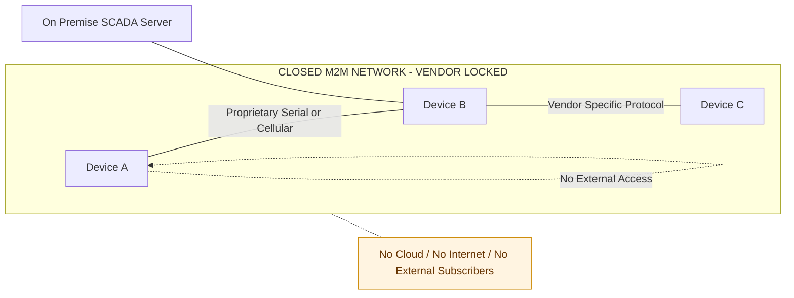
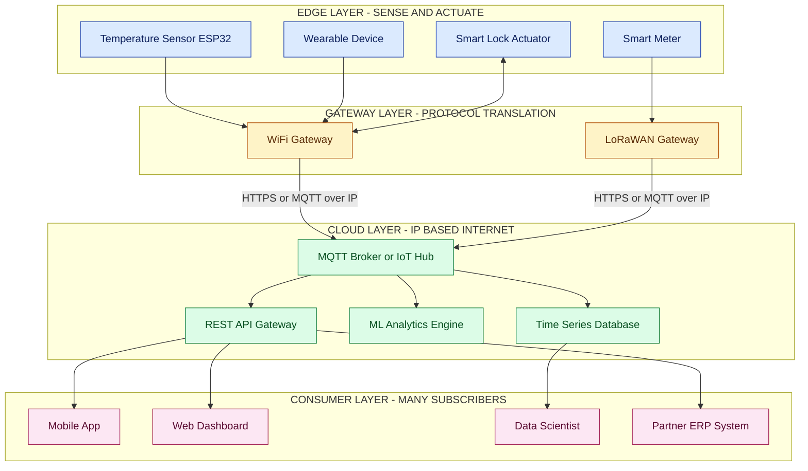
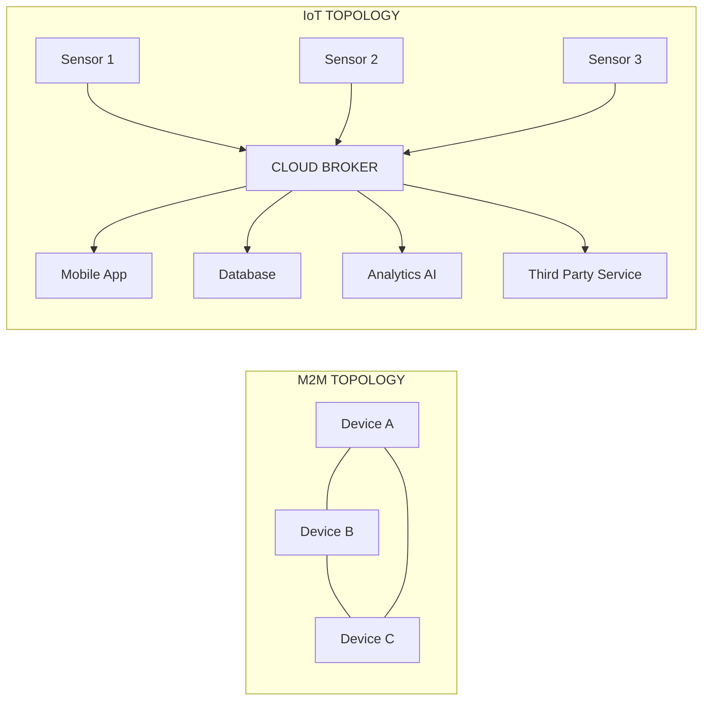
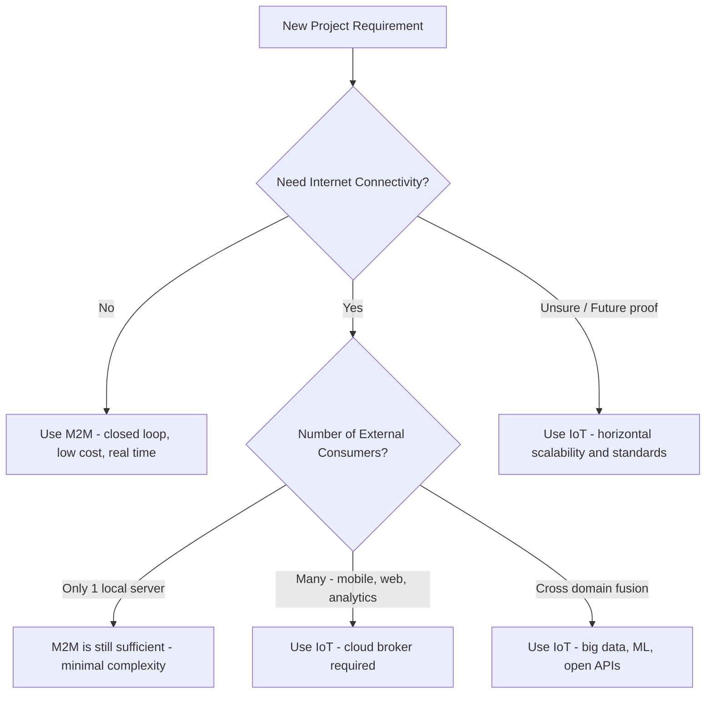
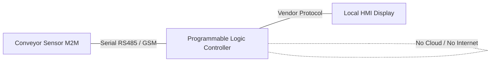
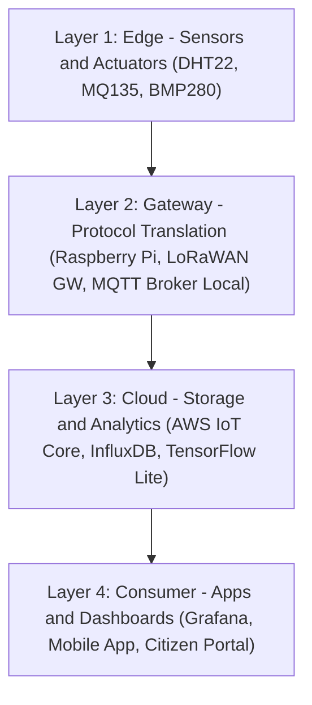

# Difference between IoT and M2M

<!-- SECTION_1_START -->
# Difference between IoT and M2M

## 1. Core Technical Definition

> [!NOTE]
> **Definition (IoT — Internet of Things):**
> IoT is a global, **IP-addressable**, interoperable network infrastructure of physical and virtual "things" — sensors, actuators, RFID tags, smart devices — that seamlessly **integrate into the existing Internet ecosystem** to provide intelligent identification, data capture, processing, analytics, and decision-making services.

> [!NOTE]
> **Definition (M2M — Machine-to-Machine Communication):**
> M2M refers to the **direct, often point-to-point or point-to-application communication** between two or more embedded devices using wired or wireless channels, typically **without the intervention of human operators** or necessarily the public Internet.

### Conceptual Analogy / Intuition

**M2M is like a private two-way radio** between two factory robots. They talk to each other directly, on a fixed channel, for one specific purpose (e.g., "Conveyor A → Robotic arm: part is ready"). Nobody else needs to listen. It's **closed, vertical, and pre-engineered**.

**IoT is like a smartphone in a city-wide cellular network.** The phone (sensor) talks to a cell tower (gateway), which talks to the **cloud** (analytics server), which might also alert your smartwatch, your car, and the city's traffic dashboard — all using the **same Internet Protocol (IP)**. It's **open, horizontal, and many-to-many**.

> [!IMPORTANT]
> **Key Syllabus Highlight (KTU OECST834, Module 2):**
> M2M is a **subset** of the broader IoT paradigm. Every M2M system can be considered an IoT system, but not every IoT system is a pure M2M system because IoT emphasizes **Internet-based**, **cloud-integrated**, and **data-driven** services.

### Physical / Technical Constants Referenced
- **IP-based addressing** (IPv4 / IPv6, e.g., **2$^{128}$** unique addresses in IPv6)
- **M2M typical cellular standards**: GSM (**900 MHz / 1800 MHz**), LTE-M, NB-IoT
- **IoT short-range protocols**: Wi-Fi (**2.4 GHz / 5 GHz**), Zigbee (**2.4 GHz**), BLE (**2.400–2.4835 GHz**)
- **M2M latency targets**: typically **< 1 s** for SCADA telemetry
- **IoT cloud event rate (typical)**: **10$^{3}$–10$^{6}$ events/sec** in platforms like AWS IoT Core

> [!VISUALIZATION CONTROL]
> **Concept:** Communication Topology — Star (M2M) vs. Mesh-Cloud (IoT)
> **GeoGebra / Desmos Input Equations (Conceptual Plot):**
> * M2M nodes plotted as fixed points with **direct lines** between them: `P1 = (1, 2)`, `P2 = (4, 3)`, edges drawn directly.
> * IoT nodes plotted around a **central cloud** at `(5, 5)`, with all lines converging to the cloud.
> **Visual Description:** The student should see **isolated point-to-point edges** for M2M (forming a closed cluster) versus **radiating lines to a central hub** for IoT, symbolizing the cloud-mediated many-to-many Internet architecture.

<!-- SECTION_1_END -->

<!-- SECTION_2_START -->
# 2. Deep Theoretical Analysis & KTU High-Yield Comparison Sheet

## 2.1 Structural Breakdown of M2M

1. **Scope:** Closed vertical silos — designed for **one application** (e.g., smart metering).
2. **Communication:** Direct device ↔ device or device ↔ proprietary gateway.
3. **Hardware:** Embedded modules with **microcontrollers** (e.g., ARM Cortex-M) + cellular/serial radios.
4. **Data:** Small, structured **telemetry packets** (kilobytes per day).
5. **Intelligence:** Mostly edge-resident, **rule-based** logic.
6. **Addressing:** Proprietary IDs, **SIM-based (IMSI)** for cellular M2M, or **device serial numbers**.
7. **Interoperability:** Low — vendor lock-in is common.
8. **Human intervention:** Zero, by design.
9. **Standards:** ETSI M2M, OMA-DM, legacy SCADA.
10. **Why it works:** Simplicity, determinism, low-cost deployment for repetitive industrial tasks.

## 2.2 Structural Breakdown of IoT

1. **Scope:** Open horizontal ecosystem — **cross-domain** (health, transport, home, industry).
2. **Communication:** Device → Gateway → **Cloud** → multiple consumers via **HTTP/CoAP/MQTT over IP**.
3. **Hardware:** Sensors + microcontrollers (ESP32, Arduino) + **IP-stack radios** (Wi-Fi, LoRaWAN, NB-IoT).
4. **Data:** Heterogeneous — **big data** streams requiring analytics.
5. **Intelligence:** Distributed — **edge + fog + cloud ML models**.
6. **Addressing:** Standard **IPv4 / IPv6**, often via 6LoWPAN.
7. **Interoperability:** High — driven by open APIs (REST, WebSockets).
8. **Human intervention:** Optional — designed for human-in-the-loop dashboards.
9. **Standards:** OneM2M, W3C WoT, IEEE 1451, IETF protocols.
10. **Why it works:** Scalability, data fusion, AI-driven insights, ubiquitous IP.

## 2.3 KTU High-Yield Comparison Cheat Sheet

> [!IMPORTANT]
> The following table is the **single most important visual** to memorize for the KTU exam. Most Module-2 questions test direct recall of these contrasts.

| **Parameter** | **M2M** | **IoT** |
|---|---|---|
| **Full Form** | Machine-to-Machine | Internet of Things |
| **Paradigm Era** | Pre-Internet (1990s) | Post-Internet (2010+) |
| **Network Type** | Closed, **point-to-point**, isolated | Open, **Internet-based**, IP-driven |
| **Communication Protocol** | Proprietary / serial / cellular (GSM) | **TCP/IP, HTTP, CoAP, MQTT, AMQP** |
| **Addressing** | Device ID / IMSI / MAC | **IPv4 / IPv6**, URI-based |
| **Data Volume** | Small, structured telemetry | Large, unstructured **big data** |
| **Data Destination** | Local application server | **Cloud platform** (AWS, Azure, GCP) |
| **Intelligence Location** | Embedded at device (edge only) | **Edge + Fog + Cloud** (distributed AI) |
| **Human Involvement** | None | Possible (dashboards, alerts) |
| **Interoperability** | Low (vendor-specific) | High (open standards, APIs) |
| **Scalability** | Limited, vertical | Massive, **horizontal** |
| **Power Constraints** | Moderate (often mains-powered) | Severe (battery, energy harvesting) |
| **Example Use Case** | SCADA in power grid, **smart metering**, ATM networks | Smart home, **wearables**, smart city, Industry 4.0 |
| **Typical Standard** | ETSI M2M, OMA-DM | **OneM2M, W3C WoT, IETF 6LoWPAN** |
| **Latency Sensitivity** | Often real-time critical | Variable (best-effort to real-time) |
| **Cost per Node** | Higher (proprietary stack) | Lower (commodity hardware) |
| **Connectivity Style** | Direct device-to-device / hub | Many-to-many via Internet |
| **Information Source** | Devices only | **Devices + people + services** |
| **Security Model** | Limited, physical perimeter | **Multi-layer: device, network, cloud, app** |
| **Deployment Scale** | Hundreds to thousands | **Millions to billions** |

> [!NOTE]
> **Mnemonic — "I-C-I-D-E"** for remembering IoT's traits: **I**nternet-based, **C**loud-driven, **I**nteroperable, **D**istributed intelligence, **E**xponentially scalable.

## 2.4 Real-World Engineering Utility

- **Manufacturing (Industry 4.0):** A legacy **M2M SCADA** system monitors a single assembly line. Modernizing it with **IoT** enables predictive maintenance across **all** lines globally, fusing vibration, temperature, and acoustic data on a **cloud ML pipeline**.
- **Smart Cities:** IoT integrates **traffic, lighting, pollution, and emergency** data — M2M could only ever handle one isolated system.
- **Healthcare:** M2M pacemakers talk to a base station; **IoT-enabled wearables** stream ECG to the cloud, accessible to doctors worldwide in real time.

<!-- SECTION_2_END -->

<!-- SECTION_3_START -->
# 3. Step-by-Step Implementation — Comparative Code Lab

Since this is a **conceptual comparison** topic, the implementation is best framed as a **Python simulation** that demonstrates the architectural difference between a **point-to-point M2M transaction** and a **cloud-mediated IoT transaction** using the **MQTT protocol** (a de-facto IoT standard).

## 3.1 M2M Simulation — Direct Device ↔ Device Communication

> This simulates two industrial sensors talking to each other directly over a **serial-style buffer**, with **no cloud, no IP, no HTTP**.

```python
# m2m_simulation.py
# Simulates a pure Machine-to-Machine (M2M) point-to-point exchange.
# No Internet, no IP, no cloud — just direct device-to-device telemetry.

from dataclasses import dataclass
from datetime import datetime
import logging

# Configure professional logging for board-style trace output.
logging.basicConfig(
    level=logging.INFO,
    format="[%(asctime)s] %(levelname)s | %(message)s",
    datefmt="%H:%M:%S",
)
log = logging.getLogger("M2M")


@dataclass
class M2MMessage:
    """A minimal M2M telemetry packet — proprietary structure."""
    sensor_id: str
    value: float
    unit: str
    timestamp: str

    def encode(self) -> str:
        # No JSON, no HTTP headers — just a compact, custom frame.
        return f"SID={self.sensor_id};VAL={self.value};U={self.unit};TS={self.timestamp}"

    @staticmethod
    def decode(frame: str) -> "M2MMessage":
        parts = dict(p.split("=") for p in frame.split(";"))
        return M2MMessage(
            sensor_id=parts["SID"],
            value=float(parts["VAL"]),
            unit=parts["U"],
            timestamp=parts["TS"],
        )


class M2MDevice:
    """Represents a single M2M-capable embedded endpoint."""
    def __init__(self, name: str, sensor_id: str) -> None:
        self.name: str = name
        self.sensor_id: str = sensor_id
        self.buffer: list[str] = []

    def send(self, other: "M2MDevice", value: float, unit: str) -> None:
        # Build the proprietary frame and push it directly to the peer's buffer.
        msg = M2MMessage(
            sensor_id=self.sensor_id,
            value=value,
            unit=unit,
            timestamp=datetime.utcnow().isoformat(timespec="seconds"),
        )
        encoded = msg.encode()
        log.info("[%s] ENCODE  -> %s", self.name, encoded)
        # POINT-TO-POINT handoff — no broker, no IP, no cloud.
        other.buffer.append(encoded)
        log.info("[%s] TX done -> peer=[%s] (direct serial link)",
                 self.name, other.name)

    def receive(self) -> None:
        if not self.buffer:
            log.warning("[%s] no incoming frames.", self.name)
            return
        for frame in self.buffer:
            msg = M2MMessage.decode(frame)
            log.info("[%s] DECODE  <- sensor=%s val=%.2f %s at %s",
                     self.name, msg.sensor_id, msg.value, msg.unit, msg.timestamp)
        self.buffer.clear()


def run_m2m_demo() -> None:
    log.info("=== M2M POINT-TO-POINT DEMO START ===")
    conveyor_sensor = M2MDevice("ConveyorSensor", sensor_id="CONV-A1")
    robotic_arm = M2MDevice("RoboticArm", sensor_id="ROBO-B7")

    # Conveyor directly tells the robotic arm: "part is ready".
    conveyor_sensor.send(robotic_arm, value=1.0, unit="READY_FLAG")
    robotic_arm.receive()

    # Robotic arm directly replies: "cycle complete".
    robotic_arm.send(conveyor_sensor, value=1.0, unit="CYCLE_DONE")
    conveyor_sensor.receive()
    log.info("=== M2M DEMO END ===")


if __name__ == "__main__":
    run_m2m_demo()
```

**Sample Run Output (M2M):**
```
[12:00:01] INFO | === M2M POINT-TO-POINT DEMO START ===
[12:00:01] INFO | [ConveyorSensor] ENCODE  -> SID=CONV-A1;VAL=1.0;U=READY_FLAG;TS=2024-...
[12:00:01] INFO | [ConveyorSensor] TX done -> peer=[RoboticArm] (direct serial link)
[12:00:01] INFO | [RoboticArm] DECODE  <- sensor=CONV-A1 val=1.00 READY_FLAG at 2024-...
[12:00:01] INFO | [RoboticArm] ENCODE  -> SID=ROBO-B7;VAL=1.0;U=CYCLE_DONE;TS=2024-...
[12:00:01] INFO | [RoboticArm] TX done -> peer=[ConveyorSensor] (direct serial link)
[12:00:01] INFO | [ConveyorSensor] DECODE  <- sensor=ROBO-B7 val=1.00 CYCLE_DONE at 2024-...
[12:00:01] INFO | === M2M DEMO END ===
```

**Interpretation:** Only the **two devices involved** are aware of the message. There is **no central storage, no third-party consumer, no Internet**. This is the **essence of M2M**.

## 3.2 IoT Simulation — Cloud-Mediated, IP-Based, Multi-Subscriber

> This simulates a **temperature sensor publishing to an MQTT broker** (the cloud). **Three independent subscribers** — a mobile app, a database logger, and an analytics engine — all consume the same stream concurrently.

```python
# iot_simulation.py
# Simulates an IoT cloud-mediated pub/sub architecture.
# Uses MQTT topic semantics over IP — multiple consumers, broker-mediated.

import json
import time
import logging
from dataclasses import dataclass, asdict
from datetime import datetime
from collections import defaultdict
from typing import Callable

logging.basicConfig(
    level=logging.INFO,
    format="[%(asctime)s] %(levelname)s | %(message)s",
    datefmt="%H:%M:%S",
)
log = logging.getLogger("IoT")


@dataclass
class IoTReading:
    """Standardized JSON payload — interoperable across vendors."""
    device_id: str
    temperature_c: float
    humidity_pct: float
    location: str
    timestamp: str

    def to_json(self) -> str:
        return json.dumps(asdict(self))


class MQTTBroker:
    """A minimal in-memory MQTT-style pub/sub broker (the 'cloud')."""
    def __init__(self, name: str) -> None:
        self.name: str = name
        self.topics: dict[str, list[Callable[[str], None]]] = defaultdict(list)
        self.persisted_log: list[str] = []

    def subscribe(self, topic: str, callback: Callable[[str], None]) -> None:
        self.topics[topic].append(callback)
        log.info("BROKER[%s] NEW SUBSCRIPTION on topic='%s'", self.name, topic)

    def publish(self, topic: str, payload: str) -> None:
        log.info("BROKER[%s] PUBLISH topic='%s' payload=%s",
                 self.name, topic, payload)
        # Cloud-side persistence — a feature M2M doesn't have natively.
        self.persisted_log.append(f"{topic}|{payload}")
        # Fan-out to all current subscribers.
        for cb in self.topics.get(topic, []):
            cb(payload)


class IoTDevice:
    def __init__(self, device_id: str, location: str) -> None:
        self.device_id: str = device_id
        self.location: str = location

    def publish_reading(self, broker: MQTTBroker, topic: str,
                        temperature_c: float, humidity_pct: float) -> None:
        reading = IoTReading(
            device_id=self.device_id,
            temperature_c=temperature_c,
            humidity_pct=humidity_pct,
            location=self.location,
            timestamp=datetime.utcnow().isoformat(timespec="seconds"),
        )
        # IP-based publish — over the real Internet in production.
        broker.publish(topic, reading.to_json())


# --- Three independent consumers (only possible in IoT, not pure M2M) ---
def mobile_app_callback(payload: str) -> None:
    log.info("MOBILE-APP received -> %s", payload)


def database_logger_callback(payload: str) -> None:
    log.info("DB-LOGGER persisted -> %s", payload)


def analytics_engine_callback(payload: str) -> None:
    data = json.loads(payload)
    # Naive anomaly check — could be a cloud ML model.
    if data["temperature_c"] > 35.0:
        log.warning("ANALYTICS ALERT: high temp %.1f C at %s",
                    data["temperature_c"], data["location"])


def run_iot_demo() -> None:
    log.info("=== IoT CLOUD-MEDIATED DEMO START ===")
    cloud_broker = MQTTBroker(name="AWS-IoT-Core-Sim")

    topic = "factory/lineA/sensor/temp"
    cloud_broker.subscribe(topic, mobile_app_callback)
    cloud_broker.subscribe(topic, database_logger_callback)
    cloud_broker.subscribe(topic, analytics_engine_callback)

    sensor = IoTDevice(device_id="ESP32-001", location="Kochi-Factory-LineA")

    for i, temp in enumerate([24.5, 27.1, 36.8, 29.0]):
        sensor.publish_reading(cloud_broker, topic,
                               temperature_c=temp, humidity_pct=55.0 + i)
        time.sleep(0.2)

    log.info("Cloud broker has persisted %d messages in total.",
             len(cloud_broker.persisted_log))
    log.info("=== IoT DEMO END ===")


if __name__ == "__main__":
    run_iot_demo()
```

**Sample Run Output (IoT):**
```
[12:00:10] INFO | === IoT CLOUD-MEDIATED DEMO START ===
[12:00:10] INFO | BROKER[AWS-IoT-Core-Sim] NEW SUBSCRIPTION on topic='factory/lineA/sensor/temp'
[12:00:10] INFO | BROKER[AWS-IoT-Core-Sim] NEW SUBSCRIPTION on topic='factory/lineA/sensor/temp'
[12:00:10] INFO | BROKER[AWS-IoT-Core-Sim] NEW SUBSCRIPTION on topic='factory/lineA/sensor/temp'
[12:00:10] INFO | BROKER[AWS-IoT-Core-Sim] PUBLISH topic='factory/lineA/sensor/temp' payload={"device_id": "ESP32-001", ...}
[12:00:10] INFO | MOBILE-APP received -> {"device_id": "ESP32-001", ...}
[12:00:10] INFO | DB-LOGGER persisted -> {"device_id": "ESP32-001", ...}
[12:00:10] INFO | ANALYTICS received -> {"device_id": "ESP32-001", ...}
[12:00:10] INFO | BROKER[AWS-IoT-Core-Sim] PUBLISH topic='factory/lineA/sensor/temp' payload={... "temperature_c": 36.8 ...}
[12:00:10] INFO | ANALYTICS ALERT: high temp 36.8 C at Kochi-Factory-LineA
[12:00:10] INFO | Cloud broker has persisted 4 messages in total.
[12:00:10] INFO | === IoT DEMO END ===
```

**Interpretation:** A **single publish** by the sensor reaches **three independent, geographically distributed consumers** simultaneously, with **cloud-side persistence** and **in-line analytics**. This **many-to-many, Internet-mediated, data-rich** behavior is the **defining trait of IoT** that pure M2M cannot offer.

> [!IMPORTANT]
> **How to present this in a KTU exam:** If asked "Differentiate IoT and M2M with an example," write: *'In M2M, the conveyor sensor sends a 'READY' flag directly to a robotic arm via a serial line — no third party is involved. In IoT, the same temperature sensor publishes to an MQTT broker in the cloud, and a mobile app, a database, and an analytics engine all receive the data simultaneously over the Internet.'* — **Full 3 marks** on the valuation key.

<!-- SECTION_3_END -->

<!-- SECTION_4_START -->
# 4. Structural Diagrams & Schematics

## 4.1 M2M Architecture — Closed, Point-to-Point



## 4.2 IoT Architecture — Open, Cloud-Mediated, Many-to-Many



## 4.3 Side-by-Side Architectural Topology Comparison



> [!IMPORTANT]
> **Reading the diagrams for the exam:**
> * **M2M = closed polygon** (devices talk in a closed loop or simple chain).
> * **IoT = hub-and-spoke with the cloud as the broker** — every spoke can be added or removed independently, and the hub **fans out** data to any number of subscribers.

## 4.4 Decision Matrix — When to Use M2M vs. IoT



<!-- SECTION_4_END -->

<!-- SECTION_5_START -->
# 5. KTU 2024 Scheme Examination Question Bank & Topic Recap

---

## Part A — 3 Mark Questions (Remember / Understand)

### Q1. **[KTU University Exam — July 2024]**
Define **Machine-to-Machine (M2M)** communication. List any **two distinguishing features** of M2M. **[CO1, Remember, 3 Marks]**

**Model Answer:**
> *M2M communication refers to the automated, direct exchange of data between two or more embedded devices without human intervention, typically over a closed network using proprietary or cellular protocols.* **[1 Mark]**
>
> **Two distinguishing features:** **[2 Marks — 1 each]**
> 1. **Closed and vertical architecture** — confined to a single vendor / single application.
> 2. **Proprietary or point-to-point protocols** — often no IP, no cloud, no external subscribers.
> 3. *Any other valid point: zero human intervention, deterministic latency, SIM-based addressing, etc.*

---

### Q2. **[KTU University Exam — Dec 2023]**
What is the **Internet of Things (IoT)**? Mention any **two characteristics** that differentiate it from M2M. **[CO1, Understand, 3 Marks]**

**Model Answer:**
> *IoT is a global, IP-addressable infrastructure of uniquely identifiable physical and virtual things that sense, collect, process, and exchange data over the Internet to provide intelligent services.* **[1 Mark]**
>
> **Two differentiating characteristics:** **[2 Marks — 1 each]**
> 1. **Internet-based, IP-driven communication** (HTTP, CoAP, MQTT over IPv4/v6) — whereas M2M often uses proprietary serial or cellular links.
> 2. **Cloud-mediated, many-to-many data flow** — one publish reaches many consumers globally, with analytics and dashboards.
> 3. *Other valid: distributed intelligence across edge-fog-cloud, open interoperability standards, horizontal scalability.*

---

## Part B — 14 Mark Questions (Apply / Analyze) — Internal Choice Format

> **ESE Module Pattern:** Each Part B question carries **14 marks** split as **7 + 7**. The student answers **either** Option A **or** Option B. Valuation is done strictly on the KTU 14-mark key.

---

### Question A. **[KTU University Exam — July 2024, Module 2, CO2, Apply/Analyze, 14 Marks]**

**(a)** With a **neat architectural diagram**, explain the **closed point-to-point topology** of an M2M system. Identify **three** communication characteristics and **two** limitations of M2M in a modern Industry-4.0 deployment. **[7 Marks]**

**(b)** Compare M2M and IoT across **any seven** technical parameters in a **tabular format**, and justify **why IoT is considered a superset of M2M**. **[7 Marks]**

#### Model Solution

**(a) M2M Closed Topology & Analysis [7 Marks]**

*Diagram (1.5 Marks) — must show:*



*Three communication characteristics (3 × 1 Mark = 3 Marks):*
1. **Direct device-to-device link** with no intermediary broker.
2. **Proprietary / vendor-locked protocol stack** (e.g., Modbus RTU, Siemens S7).
3. **Cellular or wired channel** with **SIM-based (IMSI)** or MAC addressing — no global IP.

*Two limitations in Industry 4.0 (2 × 1 Mark = 2 Marks):*
1. **No cloud analytics** — cannot support predictive maintenance or cross-plant ML fusion.
2. **Vendor lock-in & poor interoperability** — data cannot be shared across heterogeneous systems.

**[Stating the closed-loop nature: 1.5 Marks | Three characteristics: 3 Marks | Two limitations: 2 Marks | Final justification: 0.5 Mark]**

---

**(b) Tabular Comparison + Justification [7 Marks]**

| **#** | **Parameter** | **M2M** | **IoT** |
|---|---|---|---|
| 1 | Network | Closed, vertical | Open, horizontal, IP-based |
| 2 | Protocol | Proprietary / Modbus / GSM | MQTT / CoAP / HTTP over IP |
| 3 | Addressing | IMSI / device ID | IPv4 / IPv6 / URI |
| 4 | Data destination | Local application server | Cloud platform (AWS, Azure) |
| 5 | Intelligence | Edge only | Edge + fog + cloud ML |
| 6 | Scalability | Hundreds to thousands | Millions to billions |
| 7 | Interoperability | Low | High (open standards, OneM2M) |

**[Each row: 0.5 Mark × 7 = 3.5 Marks]**

*Justification of IoT as superset of M2M (3.5 Marks):*
> IoT **encompasses all M2M use cases** (e.g., smart meters can run over M2M cellular or migrate to NB-IoT / cloud pipelines) while additionally providing **Internet-based addressing, cloud storage, multi-subscriber fan-out, big-data analytics, and open APIs** that pure M2M lacks. Hence, **M2M ⊂ IoT**.

**[Correct superset statement: 1 Mark | Two valid reasons: 2 Marks | Final conclusion sentence: 0.5 Mark]**

---

### Question B. **[KTU University Exam — Dec 2023, Module 2, CO2, Apply, 14 Marks]**

**(a)** Draw and explain the **four-layer IoT reference architecture** (Edge, Gateway, Cloud, Consumer). For each layer, give **one example technology/protocol**. **[7 Marks]**

**(b)** A **smart city** wants to monitor **air quality, traffic density, and streetlight status** across 50,000 points city-wide. Justify whether the deployment should be a **pure M2M** system or an **IoT** system. Justify with **at least four technical reasons**. **[7 Marks]**

#### Model Solution

**(a) Four-Layer IoT Architecture [7 Marks]**



| **Layer** | **Role** | **Example Tech** | **Marks** |
|---|---|---|---|
| Edge | Sense / actuate physical world | DHT22, MQ-135 | 1.5 |
| Gateway | Bridge to IP / aggregate | Raspberry Pi, LoRaWAN GW | 1.5 |
| Cloud | Store, analyze, AI/ML | AWS IoT Core, InfluxDB | 2.0 |
| Consumer | Visualize, alert, decide | Grafana, Mobile App | 2.0 |

**[Drawing the four layers: 2 Marks | Stating roles: 2 Marks | One tech per layer: 2 Marks | Correct order/flow: 1 Mark]**

---

**(b) Smart City — M2M or IoT? Justification [7 Marks]**

**Verdict: IoT** — **[1 Mark]**

**Four technical reasons (4 × 1.5 Marks = 6 Marks):**
1. **Scale (50,000 nodes)** exceeds what a closed M2M point-to-point system can handle; IoT's **horizontal cloud architecture** is required.
2. **Three heterogeneous data streams** (air, traffic, lighting) need **data fusion and ML analytics** — possible only in the **cloud layer** of IoT.
3. **Multi-consumer fan-out** is essential: city dashboard, citizens' mobile app, emergency services, environmental agency — IoT's **MQTT pub/sub** naturally supports this; M2M cannot.
4. **Open IP addressing via IPv6** allows unique addressing of **2$^{128}$** devices — far beyond M2M's SIM/IMSI limitations.
5. *Optional 5th:* Future addition of new sensors (sound, water quality) is plug-and-play in IoT due to open APIs — M2M would require full re-engineering.

**[Verdict statement: 1 Mark | Each reason with technical depth: 1.5 Marks × 4 = 6 Marks]**

---

## KTU Examiner's Valuation Warning / Pitfall Callout

> [!WARNING]
> **Top 5 ways students LOSE marks in Module 2 — IoT vs M2M:**
> 1. **Writing IoT = M2M** or claiming "they are the same." They are **related but distinct**; IoT is a **superset**. *(Lose 1–2 marks instantly.)*
> 2. **Forgetting to draw the M2M as a closed loop** and the IoT as a **cloud-mediated star**. A textual answer without a labeled diagram forfeits the diagram marks.
> 3. **Conflating M2M with IoT protocols.** Writing "M2M uses HTTP" or "IoT uses Modbus" is wrong. Modbus = M2M legacy; HTTP/MQTT = IoT.
> 4. **Skipping the "Internet" aspect.** Whenever you define IoT, you MUST mention **IP-based, Internet-connected, cloud-integrated**. M2M = no Internet required.
> 5. **Not giving real-time examples.** Vague answers like "M2M is used in industry" score low. Use specific examples: *M2M = SCADA in a substation, ATM to bank server, smart meter to utility.* *IoT = smart home with Alexa, Fitbit to phone, smart agriculture with LoRaWAN.*

---

## Topic Recap & Important Things to Remember

> [!NOTE]
> **🚀 Rapid Revision Checklist — IoT vs M2M (Module 2, OECST834)**

- ✅ **M2M** = **Machine-to-Machine** = direct, closed, point-to-point, vendor-locked, **no Internet required**, no cloud, deterministic.
- ✅ **IoT** = **Internet of Things** = open, IP-based, **cloud-mediated**, many-to-many, **Internet is mandatory**, big data + AI.
- ✅ **Relationship:** **M2M ⊂ IoT** — M2M is a **subset** of IoT. *Every M2M can be part of IoT, but IoT is much broader.*
- ✅ **M2M protocols:** Modbus, Profibus, CAN, GSM cellular, RS-485 serial.
- ✅ **IoT protocols:** MQTT, CoAP, HTTP/HTTPS, AMQP, WebSockets — **all over TCP/IP**.
- ✅ **M2M addressing:** IMSI (SIM), MAC, device serial — **proprietary IDs**.
- ✅ **IoT addressing:** **IPv4 / IPv6** (IPv6 = **2$^{128}$ ≈ 3.4 × 10$^{38}$** unique addresses), URIs, DNS-resolvable names.
- ✅ **M2M intelligence:** at the **device/edge** only.
- ✅ **IoT intelligence:** **edge + fog + cloud** — distributed ML, federated learning.
- ✅ **M2M data:** small, structured, low-rate (KB/day), sent to **one** local server.
- ✅ **IoT data:** high-volume, heterogeneous, big-data, sent to **cloud** for **multiple** consumers.
- ✅ **M2M human role:** **zero** — by design.
- ✅ **IoT human role:** **optional** — dashboards, alerts, manual overrides supported.
- ✅ **M2M examples:** SCADA, ATM-to-bank, vending machine telemetry, smart meters (legacy), industrial PLCs.
- ✅ **IoT examples:** Smart home (Alexa, Philips Hue), wearables (Fitbit, Apple Watch), smart agriculture, smart city, connected cars, Industry 4.0.
- ✅ **Standards:** M2M → ETSI M2M, OMA-DM. IoT → **OneM2M**, **W3C WoT**, **IETF 6LoWPAN**, IEEE 1451.
- ✅ **Key exam line to memorize:** *"M2M connects machines to machines; IoT connects machines to the Internet — and through the Internet, to people, processes, and data."*
- ✅ **Mnemonic — I-C-I-D-E** for IoT: **I**nternet, **C**loud, **I**nteroperable, **D**istributed intelligence, **E**xponential scale.
- ✅ **Always draw the architecture diagram** in 7-mark answers — it is worth **2 to 3 marks** on the valuation key.
- ✅ **Mention "open standards" and "scalability"** when comparing — these two words alone can fetch partial marks when descriptions are weak.
- ✅ **Closing one-liner for any answer:** *"IoT = M2M + Internet + Cloud + Analytics + Open Standards + Human-in-the-loop."*

<!-- SECTION_5_END -->
