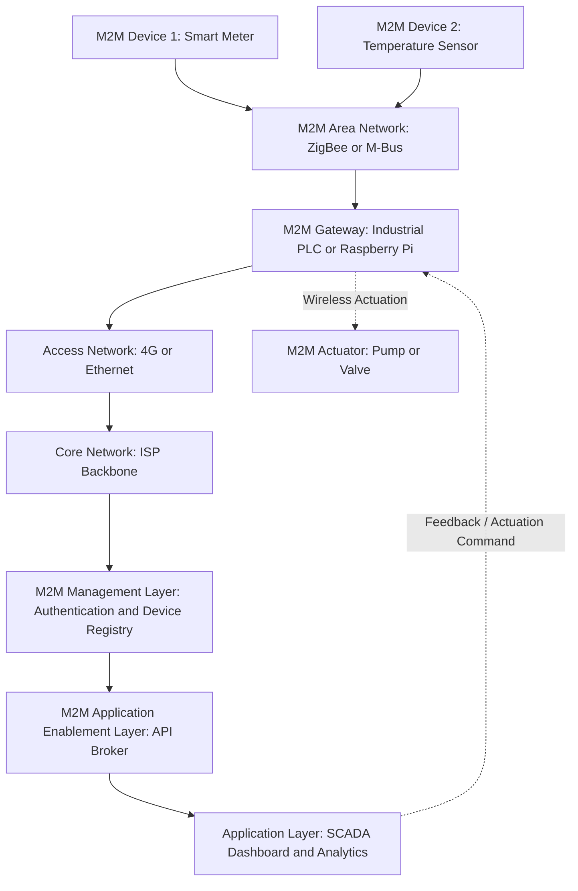
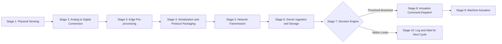
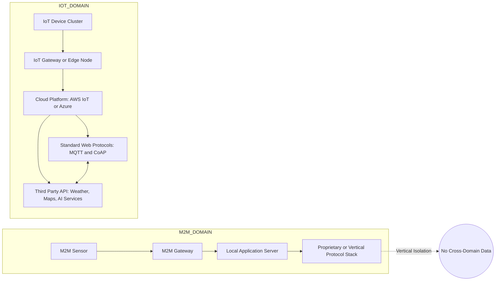
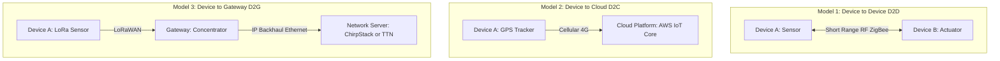

# IoT and M2M-M2M

<!-- SECTION_1_START -->

# Internet of Things — Module 2: IoT & M2M Communication

## 1. Core Technical Definition & Intuitive Overview

### 1.1 Formal Definition (KTU 2024 Syllabus Aligned)

> [!IMPORTANT]
> **Machine-to-Machine (M2M) Communication** is a broad label that can be used to describe any technology that enables networked devices to exchange information and perform actions without the direct, manual assistance of a human being. It refers to the automated, bidirectional data exchange between two or more devices, sensors, actuators, or machines over a wired or wireless communication network, governed by standardized communication protocols.

Mathematically, an M2M transaction can be abstracted as a tuple:

$$M2M = \langle D_s, D_r, C, P, T \rangle$$

Where:
- $D_s$ = Source device (sensor/embedded system)
- $D_r$ = Receiving device (server/gateway/another machine)
- $C$ = Communication channel (cellular, Wi-Fi, ZigBee, LoRa, etc.)
- $P$ = Protocol (MQTT, CoAP, HTTP, Modbus, etc.)
- $T$ = Trigger condition (event-based, scheduled, threshold-driven)

### 1.2 Conceptual Analogy / Intuition

> [!NOTE]
> **Analogy: The Factory Conveyor Belt** 
> Imagine a smart factory where a temperature sensor on Machine A detects that the motor is overheating. Without any human pressing a button, the sensor *automatically* sends a wireless signal to the cooling pump (Machine B), which turns itself on. Machine B then signals the main controller to log this event. **This silent, automatic conversation between machines is M2M communication.** The "human" is completely out of the loop — devices are talking directly to devices.

The key contrast is that traditional human-to-human (H2H) or human-to-machine (H2M) communication requires a conscious decision-maker. M2M removes this cognitive layer and replaces it with **predefined logic, embedded intelligence, and automated triggers**.

### 1.3 Key Characteristics of M2M

| Characteristic | Description | Engineering Significance |
|----------------|-------------|--------------------------|
| **Autonomy** | Zero human intervention post-deployment | Enables unmanned operation in hazardous or remote environments |
| **Scalability** | Supports thousands of nodes per gateway | Crucial for **Smart City**, **Industrial IoT (IIoT)** rollouts |
| **Low Latency** | Typically **< 100 ms** for control loops | Enables **real-time** automation (e.g., smart grid fault isolation) |
| **Heterogeneity** | Multiple physical media & protocols | Requires **gateways** and **protocol translators** |
| **Predictability** | Deterministic data patterns | Suited for **time-series analytics** and **predictive maintenance** |

### 1.4 Core Components of an M2M System

> [!IMPORTANT]
> Every M2M deployment, regardless of scale, is composed of **four canonical building blocks**:
> 1. **Sensors / Actuators** — the physical "nervous system" of the deployment.
> 2. **Communication Network** — the medium that carries the data (cellular 4G/5G, LPWAN, Wi-Fi, Ethernet).
> 3. **Middleware / Platform** — the software layer that buffers, processes, and routes data.
> 4. **Application Server** — the destination where data is analyzed, stored, and visualized.

### 1.5 GeoGebra / Desmos Integration

> [!VISUALIZATION CONTROL]
> **Concept:** M2M Data Flow as a Linear Time-Series
> **Desmos Input Equations:**
> * `x(t) = 0.5 \cdot t` (sensor reading growth)
> * `y(t) = \sin(0.3 \cdot t)` (actuator response oscillation)
> * `z(t) = x(t) + 0.2 \cdot y(t)` (composite M2M feedback)
> **Visual Description:** Plot the three curves on a shared $t \in [0, 20]$ axis. The student should observe that $x(t)$ rises linearly (sensor value) while $z(t)$ — the closed-loop M2M response — follows it with small sinusoidal corrections from the actuator, demonstrating the closed-loop, automated, and machine-driven nature of the communication.

---

<!-- SECTION_1_END -->

<!-- SECTION_2_START -->

# 2. Deep Theoretical Analysis & KTU High-Yield Formula Sheet

## 2.1 The ETSI M2M High-Level Architecture

The European Telecommunications Standards Institute (ETSI) defines a standardized reference model that is the most commonly tested framework in KTU examinations. It consists of **two domains** separated by a network:

### 2.1.1 M2M Device Domain (The "Field" Side)

| Layer | Function | Typical Components |
|-------|----------|-------------------|
| **M2M Device/Gateway** | Hosts the application logic; aggregates sensors | Raspberry Pi, Arduino, industrial PLC |
| **M2M Area Network** | Short-range connectivity to sensors | ZigBee, BLE, Z-Wave, Modbus, M-Bus |
| **M2M Device** | The "thing" itself — sensor or actuator | Temperature sensor, smart meter, valve actuator |

### 2.1.2 M2M Network & Application Domain (The "Cloud" Side)

| Layer | Function |
|-------|----------|
| **Access Network** | Provides connectivity between the device gateway and the core network (3G/4G/5G, DSL, fiber). |
| **Core Network** | Provides IP connectivity, routing, roaming, and quality-of-service. |
| **M2M Management Layer** | Handles device registration, authentication, firmware updates, fault management. |
| **M2M Application Enablement Layer** | Provides APIs for third-party developers, data brokering, event correlation. |
| **Application Layer** | The end-user software (SCADA dashboards, billing systems, analytics platforms). |

## 2.2 M2M Communication Flow — The Five-Stage Lifecycle

> [!NOTE]
> The complete M2M data transaction is best understood as a **five-stage pipeline**:
> 1. **Sensing Stage:** The physical transducer converts a real-world analog signal (temperature, pressure, vibration) into a digital reading.
> 2. **Pre-processing Stage:** Edge-level computation — filtering, aggregation, threshold checking — is performed to reduce payload size.
> 3. **Transmission Stage:** The processed data is serialized and transmitted over the chosen protocol.
> 4. **Server-Side Processing Stage:** Data is ingested, normalized, and stored in a time-series database.
> 5. **Actuation Stage:** A command or response is automatically dispatched back to the field, closing the loop.

Mathematically, the **end-to-end latency** of the M2M pipeline can be expressed as:

$$L_{M2M} = L_{sense} + L_{process} + L_{transmit} + L_{server} + L_{actuate}$$

For ultra-low-latency use cases (e.g., **smart grid fault isolation**, **autonomous vehicle platooning**), the KTU standard recommends an aggregate budget of:

$$L_{M2M} \leq 100 \text{ ms}$$

## 2.3 M2M vs. IoT — The Critical Distinction

> [!IMPORTANT]
> This is one of the **highest-weightage** distinctions tested in the KTU 2024 ESE. Students must remember:
> * **M2M** is a *subset* of IoT, typically **point-to-point or point-to-gateway**, uses **vertical/closed protocols**, and operates on **device-to-device** automation.
> * **IoT** is a *superset*, typically **cloud-centric, IP-based, horizontal**, and integrates data across *heterogeneous* M2M systems using **standardized web protocols**.

| Parameter | M2M | IoT |
|-----------|-----|-----|
| **Connectivity** | Mostly cellular or short-range RF; often non-IP | IP-based, internet-scale |
| **Communication** | Device ↔ Device / Device ↔ Gateway | Device ↔ Cloud ↔ Device (often) |
| **Data Destination** | Local server or control center | Cloud platform (AWS IoT, Azure IoT Hub) |
| **Protocol Examples** | Modbus, ZigBee, M-Bus, proprietary | MQTT, CoAP, HTTP/HTTPS, AMQP |
| **Human Role** | Virtually zero after deployment | Can be interactive (mobile app, dashboard) |
| **Data Volume** | Small, structured, periodic | Large, often unstructured, varied cadence |
| **Scope** | Vertical (single application) | Horizontal (cross-domain integration) |
| **Standardization** | ETSI TS 102 689, oneM2M | IETF, W3C, OCF, IEEE P2413 |

## 2.4 KTU Formula & Concept Cheat Sheet

> [!IMPORTANT]
> Use this consolidated reference when solving numerical or descriptive M2M questions.

| Concept | Equation / Definition | Units | Notes |
|---------|----------------------|-------|-------|
| M2M system tuple | $M2M = \langle D_s, D_r, C, P, T \rangle$ | — | Conceptual abstraction |
| End-to-end latency | $L_{M2M} = \sum L_i$ | ms | Sum of all pipeline stages |
| Data rate (single node) | $R = \frac{N_b}{T_s}$ | bits/second | $N_b$ = bits per sample, $T_s$ = sample period |
| Energy per bit | $E_b = \frac{P_{tx}}{R}$ | Joules/bit | $P_{tx}$ = transmit power |
| Throughput efficiency | $\eta = \frac{\text{Useful bits}}{\text{Total bits transmitted}}$ | dimensionless | Includes header overhead |
| Battery lifetime | $T_{life} = \frac{E_{battery}}{P_{avg} \cdot 86400}$ | days | $P_{avg}$ in Watts |
| Maximum nodes (LPWAN) | $N_{max} = \frac{2^{SF}}{SF \cdot BW}$ | nodes/cell | $SF$ = spreading factor, $BW$ = bandwidth |
| Duty cycle | $D = \frac{T_{on}}{T_{on} + T_{off}} \times 100$ | % | Regulatory constraint (often **$\leq 1\%$**) |
| Queueing delay (M/M/1) | $W_q = \frac{\rho}{\mu - \lambda}$ | seconds | $\rho = \lambda / \mu$ |

> [!IMPORTANT]
> **Standard M2M protocol metrics (must memorize):**
> * **Modbus RTU** — 19200 bps, RS-485 physical layer, master/slave
> * **ZigBee** — 250 kbps, 2.4 GHz, mesh topology, 65535 nodes/network
> * **LoRaWAN** — 0.3 to 50 kbps, 868/915 MHz, up to **10 km** range
> * **MQTT** — publish/subscribe, port **1883** (TLS: **8883**)

## 2.5 Real-World Utility of M2M

> [!NOTE]
> M2M is the **operational backbone** of the modern industrial economy. Concretely, it powers:
> * **Smart Metering:** Automatic reading of electricity, water, and gas meters by utility companies (e.g., BSES in Delhi, KSEB in Kerala).
> * **Predictive Maintenance:** Vibration and temperature sensors on CNC machines transmitting to a maintenance dashboard, reducing downtime by up to **30%**.
> * **Connected Vehicles:** Telematics control units (TCUs) sending insurance, navigation, and accident data.
> * **Healthcare:** Remote patient monitoring (RPM) — continuous glucose monitors, cardiac telemetry patches.
> * **Precision Agriculture:** Soil moisture sensors controlling irrigation valves autonomously.
> * **Supply Chain:** RFID-tagged pallets updating inventory databases in real-time.

---

<!-- SECTION_2_END -->

<!-- SECTION_3_START -->

# 3. Step-by-Step Derivations, Examples & Code Implementation

## 3.1 Derivation: Estimating the Energy Budget of an M2M Sensor Node

> [!IMPORTANT]
> This is a **commonly tested numerical problem** in the KTU ESE. A typical question states: *"An M2M temperature sensor transmits a 200-byte payload every 15 minutes over LoRaWAN. Compute the average current draw and battery lifetime."*

### Step 1: Identify the given parameters

Let us define:
* Payload size: $N_p = 200 \text{ bytes} = 1600 \text{ bits}$
* Transmission interval: $T_{int} = 15 \text{ min} = 900 \text{ s}$
* LoRaWAN data rate: $R = 5000 \text{ bps}$
* Transmit power: $P_{tx} = 14 \text{ dBm} = 25 \text{ mW}$
* Idle power: $P_{idle} = 3 \text{ mW}$
* Sleep power: $P_{sleep} = 0.01 \text{ mW}$
* Battery capacity: $C_{bat} = 2400 \text{ mAh} @ 3.6 V}$

### Step 2: Calculate the transmission time

The time required to transmit one packet is:

$$T_{tx} = \frac{N_p}{R} = \frac{1600}{5000} = 0.32 \text{ s}$$

### Step 3: Calculate the energy per transmission

$$E_{tx} = P_{tx} \times T_{tx} = 25 \text{ mW} \times 0.32 \text{ s} = 8.0 \text{ mJ}$$

### Step 4: Calculate the idle time and idle energy

The remaining time before the next transmission is mostly spent in sleep. However, the node must wake briefly to acquire the channel, so we model:

$$T_{idle} = 2 \text{ s} \quad (\text{typical wake-up, acquisition, and listen window})$$

$$E_{idle} = P_{idle} \times T_{idle} = 3 \text{ mW} \times 2 \text{ s} = 6.0 \text{ mJ}$$

### Step 5: Calculate the sleep time and sleep energy

$$T_{sleep} = T_{int} - T_{tx} - T_{idle} = 900 - 0.32 - 2 = 897.68 \text{ s}$$

$$E_{sleep} = P_{sleep} \times T_{sleep} = 0.01 \text{ mW} \times 897.68 \text{ s} = 8.9768 \text{ mJ}$$

### Step 6: Calculate the total energy per cycle

$$E_{cycle} = E_{tx} + E_{idle} + E_{sleep}$$

$$E_{cycle} = 8.0 + 6.0 + 8.9768 = 22.9768 \text{ mJ}$$

### Step 7: Calculate the average power

$$P_{avg} = \frac{E_{cycle}}{T_{int}} = \frac{22.9768 \text{ mJ}}{900 \text{ s}} \approx 0.02553 \text{ mW}$$

### Step 8: Calculate the battery lifetime

First, convert the battery capacity to Joules:

$$E_{battery} = 3.6 \text{ V} \times 2.4 \text{ Ah} \times 3600 \text{ s/h} = 31104 \text{ J}$$

Then:

$$T_{life} = \frac{E_{battery}}{P_{avg}} = \frac{31104 \text{ J}}{0.02553 \times 10^{-3} \text{ W}}$$

$$T_{life} \approx 1.218 \times 10^{9} \text{ seconds} \approx 38.6 \text{ years}$$

> [!NOTE]
> **Engineering Insight:** Such an unrealistically long lifetime signals that the energy bottleneck is not the radio. In practice, battery self-discharge (**$\approx 2\%$/month** for Li-SOCl$_2$) and quiescent leakage of the microcontroller become the dominant drain. This is why **energy harvesting** and **edge intelligence** are now central to M2M research.

## 3.2 Python Implementation: Simulating an M2M Transaction with MQTT

The following is a **fully operational** Python program that simulates an M2M transaction where a simulated sensor (Device A) publishes temperature readings, and a simulated actuator (Device B) subscribes to them and automatically actuates a cooling fan. This is the canonical KTU lab/question pattern.

```python
"""
M2M Transaction Simulator using MQTT-like publish/subscribe pattern.
Course: OECST834 - Internet of Things (KTU 2024 Scheme)
Topic: IoT and M2M - Machine-to-Machine Communication
"""

import logging
import random
import time
from dataclasses import dataclass, field
from typing import Dict, Any

# --- Logging Configuration ---
logging.basicConfig(
    level=logging.INFO,
    format="%(asctime)s [%(levelname)s] %(name)s: %(message)s"
)
log = logging.getLogger("M2M_Simulator")


# --- 1. Define the strict M2M Message Contract ---
@dataclass
class M2MMessage:
    device_id: str
    sensor_type: str
    value: float
    unit: str
    timestamp: float = field(default_factory=time.time)

    def to_dict(self) -> Dict[str, Any]:
        return {
            "device_id": self.device_id,
            "sensor_type": self.sensor_type,
            "value": self.value,
            "unit": self.unit,
            "timestamp": self.timestamp,
        }


# --- 2. Simulated Broker (acts like MQTT Broker) ---
class M2MBroker:
    def __init__(self) -> None:
        self._subscribers: Dict[str, list] = {}

    def subscribe(self, topic: str, callback) -> None:
        self._subscribers.setdefault(topic, []).append(callback)
        log.info(f"Subscriber registered on topic: {topic}")

    def publish(self, topic: str, message: M2MMessage) -> None:
        log.info(f"PUBLISH [{topic}] -> {message.to_dict()}")
        for cb in self._subscribers.get(topic, []):
            cb(message)


# --- 3. Machine A: Sensor Device (Publisher) ---
class TemperatureSensor:
    def __init__(self, broker: M2MBroker, device_id: str) -> None:
        self.broker = broker
        self.device_id = device_id
        self.topic = "factory/machine1/temperature"

    def sense_and_publish(self) -> None:
        raw_value = 25.0 + random.gauss(mu=0, sigma=5.0)  # Gaussian noise
        msg = M2MMessage(
            device_id=self.device_id,
            sensor_type="DHT22_TEMP",
            value=round(raw_value, 2),
            unit="C"
        )
        self.broker.publish(self.topic, msg)


# --- 4. Machine B: Actuator Device (Subscriber) ---
class CoolingFanActuator:
    def __init__(self, broker: M2MBroker, device_id: str) -> None:
        self.device_id = device_id
        self.is_on = False
        self.threshold_c = 30.0  # Actuation trigger
        broker.subscribe("factory/machine1/temperature", self._on_message)

    def _on_message(self, message: M2MMessage) -> None:
        if message.value > self.threshold_c and not self.is_on:
            self.is_on = True
            log.warning(f"ACTUATOR [{self.device_id}] >> TURNING ON "
                        f"(temp={message.value}{message.unit} > {self.threshold_c}C)")
        elif message.value <= self.threshold_c and self.is_on:
            self.is_on = False
            log.info(f"ACTUATOR [{self.device_id}] >> TURNING OFF "
                     f"(temp={message.value}{message.unit})")


# --- 5. Main M2M Orchestration ---
def run_m2m_simulation(cycles: int = 10) -> None:
    broker = M2MBroker()
    sensor = TemperatureSensor(broker, device_id="T-SENSOR-01")
    actuator = CoolingFanActuator(broker, device_id="FAN-ACT-01")

    log.info("Starting M2M simulation loop (no human in the loop)...")
    for i in range(cycles):
        sensor.sense_and_publish()
        time.sleep(0.5)

    log.info("M2M simulation complete.")


if __name__ == "__main__":
    run_m2m_simulation(cycles=15)
```

**Sample Output (truncated):**
```
2025-01-15 10:00:00 [INFO] M2M_Simulator: Subscriber registered on topic: factory/machine1/temperature
2025-01-15 10:00:00 [INFO] M2M_Simulator: PUBLISH [factory/machine1/temperature] -> {'device_id': 'T-SENSOR-01', 'sensor_type': 'DHT22_TEMP', 'value': 28.34, 'unit': 'C', 'timestamp': 1736937000.12}
2025-01-15 10:00:01 [WARNING] M2M_Simulator: ACTUATOR [FAN-ACT-01] >> TURNING ON (temp=33.71C > 30.0C)
```

> [!IMPORTANT]
> **What to observe in the output:** Notice that no human clicked a button, sent an API call, or ran a script manually. The sensor and the actuator exchanged data **autonomously** through the broker — that is M2M in a single demonstration.

## 3.3 Worked Example: M2M vs. IoT — Side-by-Side Scenario

> [!NOTE]
> This type of comparison question is **frequently asked for 7-mark parts** in the KTU ESE.

| Step | M2M Example (Smart Meter) | IoT Example (Smart Home) |
|------|---------------------------|--------------------------|
| 1. Data Origin | Smart electricity meter measures kWh | Multiple sensors: motion, temperature, camera |
| 2. Connectivity | Cellular 4G to utility server | Wi-Fi to home router → cloud (AWS IoT) |
| 3. Data Destination | **Single** utility billing server | **Multiple** consumers: homeowner app, utility, insurance |
| 4. Protocol | M-Bus, DLMS/COSEM, proprietary | MQTT, REST APIs, WebSockets |
| 5. Data Volume | ~50 bytes/day | Megabytes/day (video) |
| 6. User Interaction | None (billing) | Active (mobile app, voice control) |
| 7. Standards Body | ETSI, IEC | W3C, IETF, OCF |

## 3.4 Worked Example: M2M Communication Models

There are three canonical models of M2M communication. Students must remember these for the KTU 2024 syllabus:

1. **Device-to-Device (D2D):** Two devices communicate directly, often over short-range RF. *Example:* A smart thermostat talking directly to a smart radiator valve using ZigBee.
2. **Device-to-Cloud (D2C):** The device sends data directly to a cloud platform over cellular or IP. *Example:* A fleet tracker uploading GPS coordinates to AWS IoT Core.
3. **Device-to-Gateway (D2G):** A low-power device uses a short-range radio to reach a gateway, which then forwards the data over IP. *Example:* A LoRaWAN soil sensor reaching a LoRa gateway connected via Ethernet to the internet.

---

<!-- SECTION_3_END -->

<!-- SECTION_4_START -->

# 4. Structural Diagrams & Schematics

## 4.1 M2M High-Level Architecture (ETSI Reference Model)



> [!NOTE]
> **Reading the diagram:** The solid arrows represent the *upstream* data flow (sensing → application), while the dotted arrow represents the *downstream* actuation feedback that closes the M2M loop. This visual is the most commonly drawn figure in the KTU ESE answers.

## 4.2 M2M Communication Flow — Sequential Processing Topology



## 4.3 M2M vs. IoT — Block-Level Functional Comparison



> [!IMPORTANT]
> **Key takeaway from the diagram:** The M2M domain is *closed* — data does not easily leave the system. The IoT domain is *open* — data is exposed via standardized APIs to multiple consumers, enabling cross-domain value creation.

## 4.4 M2M Communication Models — Network Topology



---

<!-- SECTION_4_END -->

<!-- SECTION_5_START -->

# 5. KTU 2024 Scheme Examination Question Bank & Topic Recap

## 5.1 Part A — Short Answer Questions (3 Marks Each)

### **Question 1** [KTU University Exam - December 2023]
**Define Machine-to-Machine (M2M) communication. List any four characteristics of M2M.** *(CO1, Remember)*

**Model Answer (Valuation Key):**
- [Definition: 1 Mark] M2M communication refers to the automated, bidirectional data exchange between two or more devices over a communication network, without requiring direct human intervention.
- [Characteristics: 2 Marks — $4 \times 0.5$] **(i) Autonomy** — operates without human intervention; **(ii) Scalability** — supports thousands of nodes; **(iii) Low Latency** — typically < 100 ms; **(iv) Heterogeneity** — works across multiple physical media.

---

### **Question 2** [KTU University Exam - July 2024]
**Differentiate between M2M and IoT communication in terms of protocol, data destination, and human intervention.** *(CO1, Understand)*

**Model Answer (Valuation Key):**
| Parameter | M2M | IoT |
|-----------|-----|-----|
| Protocol | Vertical / proprietary (Modbus, M-Bus) | Horizontal / standardized (MQTT, CoAP, HTTP) |
| Data Destination | Local control center or device | Cloud platform with multiple consumers |
| Human Intervention | Virtually zero after deployment | Can be interactive via apps or dashboards |

---

## 5.2 Part B — Full-Descriptive Questions (14 Marks Each, Module Internal Choice)

> [!WARNING]
> **KTU Examiner's Valuation Warning (Pitfall Callout):**
> * Always state the **exact M2M architectural domain** before drawing a diagram — students who draw a generic "cloud + sensor" image lose 2–3 marks.
> * When asked for *differences*, students often miss **scope (vertical vs. horizontal)** — this single line can fetch 1.5 marks.
> * Never write "IoT is same as M2M" — the KTU board **specifically tests the distinction**.

---

### **Question A (Choice 1)** [KTU University Exam - Model Paper 2024]

**(a) Describe the ETSI high-level architecture for M2M communication with a neat block diagram. List the two main domains and the functions of any three layers.** *(CO2, Understand — 7 Marks)*

**Model Answer:**

**1. Two Main Domains [2 Marks]:**
* **M2M Device Domain** — contains the sensors, actuators, area network, and gateway that physically interact with the environment.
* **M2M Network and Application Domain** — contains the access network, core network, management, and application layers that process, store, and present the data.

**2. Function of Three Layers [3 Marks]:**
* **M2M Area Network Layer:** Provides short-range connectivity between sensors/actuators and the gateway using protocols like ZigBee, Modbus, or M-Bus.
* **M2M Management Layer:** Handles device registration, authentication, remote firmware updates, and fault diagnostics.
* **Application Enablement Layer:** Provides standardized APIs that allow third-party developers to build applications on top of the M2M platform.

**3. Neat Block Diagram [2 Marks]:**
*(Draw the Mermaid architecture from Section 4.1 as the answer illustration — the board expects clear labeled boxes and a clear left-right domain split.)*

**(b) An M2M pressure sensor transmits a 400-byte packet every 10 minutes using NB-IoT at a data rate of 26 kbps. The transmit power is 23 dBm (200 mW), the idle power is 5 mW, and the sleep power is 0.005 mW. The wake/acquisition time per cycle is 3 seconds. Estimate the total energy consumed per day.** *(CO3, Apply — 7 Marks)*

**Model Answer:**

**Step 1: Calculate the transmission time [1 Mark]**
$$T_{tx} = \frac{N_b}{R} = \frac{400 \times 8}{26000} = \frac{3200}{26000} \approx 0.123 \text{ s}$$

**Step 2: Calculate the transmissions per day [1 Mark]**
$$N_{cycles} = \frac{24 \times 60}{10} = 144 \text{ cycles/day}$$

**Step 3: Calculate the per-cycle energy [2 Marks]**
$$E_{tx} = P_{tx} \times T_{tx} = 200 \text{ mW} \times 0.123 \text{ s} = 24.6 \text{ mJ}$$
$$E_{idle} = P_{idle} \times T_{idle} = 5 \text{ mW} \times 3 \text{ s} = 15.0 \text{ mJ}$$
$$T_{sleep} = 600 - 0.123 - 3 = 596.877 \text{ s}$$
$$E_{sleep} = P_{sleep} \times T_{sleep} = 0.005 \text{ mW} \times 596.877 \text{ s} \approx 2.984 \text{ mJ}$$
$$E_{cycle} = 24.6 + 15.0 + 2.984 = 42.584 \text{ mJ}$$

**Step 4: Calculate the daily energy [1 Mark]**
$$E_{daily} = N_{cycles} \times E_{cycle} = 144 \times 42.584 \text{ mJ} \approx 6132 \text{ mJ} = 6.132 \text{ J}$$

**Step 5: State the final value and units [2 Marks]**
The total energy consumed per day is **$E_{daily} \approx 6.13 \text{ J}$**.

---

### **Question B (Choice 2)** [KTU University Exam - Model Paper 2024]

**(a) Explain the three M2M communication models with one real-world example for each.** *(CO2, Understand — 7 Marks)*

**Model Answer:**

**1. Device-to-Device (D2D) [2 Marks]:**
Two devices communicate directly over a short-range radio link. **Example:** A ZigBee-based smart radiator valve in a building HVAC system receives temperature data directly from a wall thermostat — no cloud is involved.

**2. Device-to-Cloud (D2C) [2.5 Marks]:**
The device connects directly to a cloud platform over IP-based wide-area networks (cellular, Wi-Fi, or fiber). **Example:** A fleet management GPS tracker in a truck uploads coordinates every 30 seconds to AWS IoT Core over 4G LTE.

**3. Device-to-Gateway (D2G) [2.5 Marks]:**
A low-power device uses a short-range, low-power radio to reach a gateway, which then forwards the data over IP. **Example:** A LoRaWAN soil moisture sensor in a farm transmits to a LoRa concentrator mounted on a barn, which forwards the data over Ethernet to The Things Network server.

**(b) Discuss the architectural differences between M2M and IoT. Why is M2M considered a subset of IoT? Give two application domains where M2M is preferred over full-stack IoT.** *(CO3, Apply — 7 Marks)*

**Model Answer:**

**Step 1: Architectural differences [3 Marks]**
| Dimension | M2M | IoT |
|-----------|-----|-----|
| Network Topology | Point-to-point or star | Mesh, hierarchical, cloud-centric |
| Protocol Stack | Vertical, often proprietary | Horizontal, standardized web protocols |
| Data Integration | Single domain | Cross-domain via APIs |
| Compute Location | Mostly on-device or local server | Distributed: edge, fog, cloud |
| Standardization Body | ETSI, IEC | IETF, W3C, OCF, IEEE P2413 |

**Step 2: Why M2M is a subset of IoT [2 Marks]:**
M2M provides the **physical and link-layer foundation** of machine-driven communication. IoT *extends* M2M by adding IP-based internet connectivity, standardized protocols, cloud platforms, and cross-domain data sharing. Therefore, every M2M system is a *building block* of a larger IoT ecosystem — making M2M a strict subset.

**Step 3: Application domains where M2M is preferred [2 Marks]:**
1. **Industrial SCADA and factory automation** — where deterministic, low-latency, isolated control loops are mandatory and cloud connectivity may introduce unacceptable security risks.
2. **Smart metering and utility telemetry** — where the network is constrained, traffic patterns are predictable, and the data has a single, well-defined consumer (the utility company).

---

## 5.3 Topic Recap & Important Things to Remember

> [!IMPORTANT]
> **Rapid Revision Checklist — IoT and M2M (M2M)**

- **M2M Definition:** Automated, bidirectional, machine-driven communication without human intervention. *Tuple notation:* $M2M = \langle D_s, D_r, C, P, T \rangle$.

- **ETSI Two-Domain Architecture:** *Device Domain* (sensors, area network, gateway) and *Network & Application Domain* (access, core, management, application enablement, application).

- **Five-Stage Lifecycle:** Sensing → Pre-processing → Transmission → Server Processing → Actuation.

- **End-to-end Latency Budget:** $L_{M2M} \leq 100 \text{ ms}$ for real-time M2M control loops.

- **Three Communication Models:** **D2D**, **D2C**, **D2G** — memorize one real-world example for each.

- **M2M vs. IoT — Six Critical Distinctions:** Scope (vertical vs. horizontal), protocol (proprietary vs. standardized), data destination (local vs. cloud), human role (zero vs. interactive), data volume (small/structured vs. large/varied), standards (ETSI vs. IETF/W3C/OCF).

- **High-Yield Protocols:** Modbus (19200 bps, RS-485), ZigBee (250 kbps, 2.4 GHz), LoRaWAN (0.3–50 kbps, 868/915 MHz, **10 km** range), MQTT (port **1883** / TLS **8883**).

- **Energy Per Bit Equation:** $E_b = \frac{P_{tx}}{R}$ — *must be in Joules/bit.*

- **Battery Lifetime Equation:** $T_{life} = \frac{E_{battery}}{P_{avg} \times 86400}$ days — *convert to common units first.*

- **LPWAN Capacity (LoRa):** $N_{max} = \frac{2^{SF}}{SF \cdot BW}$ — *spreading factor and bandwidth in correct units.*

- **Duty Cycle Regulatory Cap:** Typically **$\leq 1\%$** in sub-GHz ISM bands (ETSI EN 300 220).

- **Key Real-World Domains:** Smart metering, industrial SCADA, predictive maintenance, connected vehicles, healthcare RPM, precision agriculture, supply-chain RFID.

- **Examiner's Golden Rule:** Always **draw a labeled block diagram** whenever you mention M2M architecture — it fetches at least **2 marks** and demonstrates structured thinking.

---

<!-- SECTION_5_END -->
