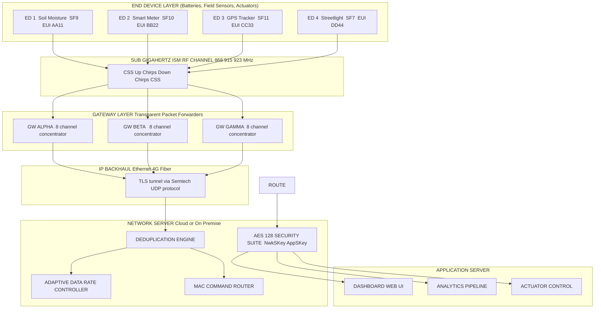
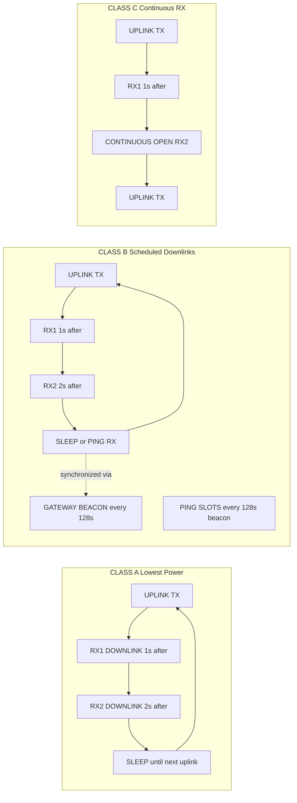
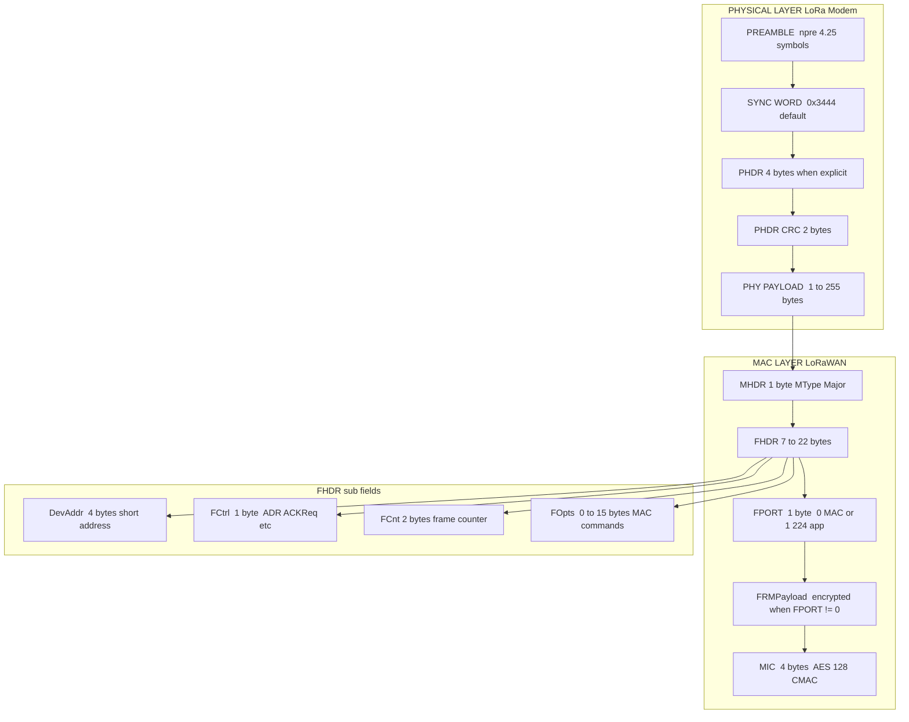
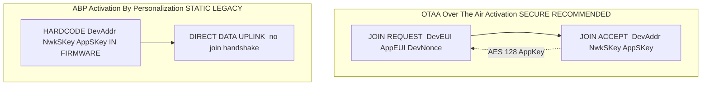
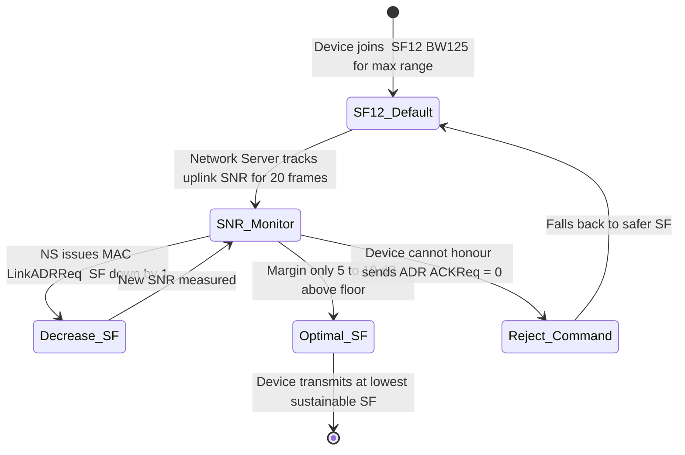

# LoRA

<!-- SECTION_1_START -->
# LoRa & LoRaWAN — The Backbone of Long-Range IoT

## 1.1 Formal Academic Definition

**LoRa (Long Range)** is a proprietary **physical (PHY) layer modulation technique** based on **Chirp Spread Spectrum (CSS)** that encodes information into wide-band, linearly frequency-swept "chirps." It was patented by Cycleo (later acquired by Semtech) and operates in sub-GHz Industrial, Scientific, and Medical (ISM) radio bands such as **433 MHz, 868 MHz (EU/India), 915 MHz (US), and 923 MHz (Asia)**. LoRa is the wireless *modulation*, not the *protocol*.

**LoRaWAN** is the **open Media Access Control (MAC) layer protocol** standardized by the **LoRa Alliance (LoRaWAN L2 Specification v1.0.4 / v1.1)** that sits on top of the LoRa physical layer. It defines the network architecture, device classes, frame format, security suite, and device activation procedures for Low-Power Wide-Area Networks (LPWANs).

> [!IMPORTANT]
> **Syllabus Highlight — Module 2 (IoT & M2M):**
> KTU expects students to clearly distinguish between **LoRa (PHY)** and **LoRaWAN (MAC/Network)**. Conflating the two is the single most common board-level mistake. Remember the mental model: *LoRa is the "voice" (how the radio talks); LoRaWAN is the "language and grammar" (how the conversation is structured).*

## 1.2 Intuitive Analogy — "The Bird That Whistles Across a Noisy Forest"

Imagine a dense forest with constant wind, rustling leaves, and roaring streams (this represents the **noisy ISM band** crowded with Wi-Fi, Bluetooth, microwaves, and other interference). A hiker tries to send a message to a base station **10 kilometres away** using just a flashlight:

- A **narrow flashlight beam (narrow-band modulation like FSK)** would be a sharp, short, bright pulse — easy to see up close, but lost in the forest glare and absorbed by trees.
- A **LoRa chirp** is like the hiker **sweeping a wide flashlight beam slowly from the lowest frequency to the highest frequency (a linear "chirp" sweep)** over a long time. The signal is **spread thinly across a wide band**, so it appears *below the noise floor* to a casual observer — yet a chirp-aware receiver can **correlate and de-spread** the entire sweep and recover the original bit.

This is the genius of **processing gain**: even when the signal power is weaker than the noise (negative SNR), the receiver integrates the chirp over time and pulls the data out, achieving receiver sensitivities of **down to −137 dBm** — roughly **30 dB better than conventional FSK** in the same conditions.

> [!NOTE]
> **Key LoRa Terminology at a Glance**
> - **Chirp Spread Spectrum (CSS):** Linear frequency sweep that constitutes the actual radio waveform.
> - **Spreading Factor (SF):** Number of chips per symbol ($SF \in \{7, 8, 9, 10, 11, 12\}$). Higher SF = longer range, lower data rate, longer air-time.
> - **Bandwidth (BW):** Width of the chirp sweep ($125, 250,$ or $500 \text{ kHz}$).
> - **Coding Rate (CR):** Forward Error Correction overhead ($4/5, 4/6, 4/7, 4/8$).
> - **End-Device (ED):** Battery-powered sensor or actuator (the "node").
> - **Gateway (GW):** Transparent IP packet forwarder between EDs and the Network Server.
> - **Network Server (NS):** Central orchestrator that de-duplicates, schedules, and routes messages.

> [!VISUALIZATION CONTROL]
> **Concept:** A single up-chirp (linear frequency sweep) of a LoRa symbol
> **GeoGebra / Desmos Input Equations:**
> * `f(t) = f0 + (BW / Tsym) * mod(t, Tsym)` (instantaneous frequency)
> * `y(t) = sin(2 * pi * integral_0_to_t f(tau) dtau)` (waveform)
> **Visual Description:** A sinusoidal waveform whose frequency rises linearly from the lower edge of the channel to the upper edge over one symbol period $T_{sym}$. The bit value (0/1) determines whether the chirp sweeps up or down. Students should see the classic "fish-hook" or "sweep" pattern of a chirp pulse.

---

<!-- SECTION_1_END -->

<!-- SECTION_2_START -->
# 2. Deep Theoretical Analysis & KTU High-Yield Formula Sheet

## 2.1 Anatomy of a LoRa Chirp

A LoRa symbol is **not** a single sine wave. It is a **linear frequency-modulated chirp** whose instantaneous frequency sweeps from the lower edge of the channel to the upper edge across the symbol period $T_{sym}$. The bit information is encoded in the **starting frequency offset** of the chirp:

- A logical **"0"** is typically an **up-chirp** (sweeps low → high).
- A logical **"1"** is a **down-chirp** (sweeps high → low), *or* an up-chirp with a frequency offset, depending on the data encoding mode.

The symbol is divided into $2^{SF}$ chips, each chip occupying a duration of $T_{sym} / 2^{SF}$.

## 2.2 Spreading Factor — The "Trade-Off Knob"

The Spreading Factor is the single most influential parameter in LoRa. It controls the **time-bandwidth product** (a measure of processing gain):

- $SF = 7 \Rightarrow 2^7 = 128$ chips per symbol → **fastest** data rate, **shortest** range.
- $SF = 12 \Rightarrow 2^{12} = 4096$ chips per symbol → **slowest** data rate, **longest** range.

Every increment of SF **doubles** the air-time and **halves** the bit rate, but improves receiver sensitivity by roughly **2.5 to 3 dB** (≈ 1.7× range increase).

## 2.3 LoRaWAN Device Classes (Mandatory for KTU Board)

LoRaWAN defines three bi-directional end-device classes that balance latency against power consumption:

| Class | Downlink Windows | RX Slot Timing | Power Profile | Typical Use Case |
|---|---|---|---|---|
| **Class A** (default) | 2 windows **after every uplink** | Fixed: $RX_1$ at $T_{uplink} + 1\,\text{s}$, $RX_2$ at $T_{uplink} + 2\,\text{s}$ | **Lowest** power — sleeps after RX2 | Battery sensors with periodic uplink (smart metering, soil moisture) |
| **Class B** (Class A + ping slots) | 2 windows **after uplink** + scheduled **ping slots** synchronized via gateway beacon | Periodic beacons every 128 s | Medium power — RX windows open periodically | Actuators needing deterministic downlink (street-light control) |
| **Class C** (continuously listening) | 2 windows after uplink + **continuously open** except while TX | Always on (except during TX) | **Highest** power — no sleeping | Mains-powered devices (smart plugs, irrigation valves) |

> [!NOTE]
> **Class A is the foundational class.** All LoRaWAN devices *must* implement Class A. Classes B and C are additive supersets of Class A behavior. KTU loves asking: *"Why is Class A not suitable for firmware OTA updates?"* — the answer is latency is unbounded (the device only listens for 1–2 s after an uplink).

## 2.4 LoRaWAN Network Architecture (Star-of-Stars)

```
End-Devices (Star) → Gateways (Relay) → Network Server (Star) → Application Servers
```

Unlike cellular networks, **gateways are dumb packet forwarders** — all intelligence, de-duplication, MAC-command handling, and Adaptive Data Rate (ADR) lives in the **Network Server**. A single uplink from an end-device can be received by **multiple gateways simultaneously**; the NS uses the **frame counter + MIC** to drop duplicates.

## 2.5 KTU Formula Sheet (High-Yield for ESE)

| # | Quantity | Formula | Units / Notes |
|---|---|---|---|
| 1 | Symbol period | $T_{sym} = \dfrac{2^{SF}}{BW}$ | Seconds |
| 2 | Symbol rate | $R_s = \dfrac{BW}{2^{SF}} = \dfrac{1}{T_{sym}}$ | Symbols/sec |
| 3 | Bit rate | $R_b = SF \cdot \dfrac{BW}{2^{SF}} \cdot CR$ | Bits/sec |
| 4 | Coding Rate | $CR = \dfrac{4}{4 + n}, \quad n \in \{1,2,3,4\}$ | Dimensionless, $CR \in \{4/5, 4/6, 4/7, 4/8\}$ |
| 5 | Receiver Sensitivity (approx.) | $S_{rx} \approx -174 + 10\log_{10}(BW) + NF + SNR_{req}$ | dBm |
| 6 | Time on Air — Preamble | $T_{preamble} = (n_{pre} + 4.25) \cdot T_{sym}$ | Seconds; default $n_{pre} = 8$ |
| 7 | Time on Air — Payload | $T_{payload} = n_{payload} \cdot T_{sym}$ | Seconds |
| 8 | Link Budget | $LB = P_{tx} + G_{tx} - L_{tx} - PL + G_{rx} - L_{rx}$ | dB; must exceed $S_{rx}$ |
| 9 | Path Loss (Log-distance) | $PL(d) = PL(d_0) + 10 \cdot n \cdot \log_{10}\!\left(\dfrac{d}{d_0}\right)$ | dB; $n$ = path-loss exponent (2 free-space, 3–4 urban) |
| 10 | Max Payload (EU868) | $N_{max} = 51, 51, 51, 115, 222, 222$ bytes for $SF7 \rightarrow SF12$ | Bytes |

> [!IMPORTANT]
> **Critical Pipe Escape Rule (per engine directive):** Within the formulas above, any absolute-value or division operator is rendered with `\vert` / `\mid` or `dfrac` to avoid breaking the markdown table parser. **Do not write `|x|` inside a table cell.**

## 2.6 Engineering Real-World Utility

LoRa / LoRaWAN dominates battery-powered long-range IoT use cases because it solves the **"energy–range trade-off"** that cripples Wi-Fi (high bandwidth, short range) and cellular (long range, high power):

- **Smart Agriculture:** Soil moisture, weather, livestock tracking across 10+ km rural fields.
- **Smart Metering:** Gas, water, electricity meters in basements (penetration through walls — LoRa's high SF compensates for the path loss).
- **Supply Chain & Logistics:** Container tracking on ships, pallet tracking in warehouses.
- **Smart Cities:** Street-light control, parking sensors, waste-bin level monitoring.
- **Disaster Management:** Early-warning systems where cellular infrastructure is destroyed.
- **Healthcare:** Wearable patient monitoring across hospital campuses.

The **regulatory advantage** is duty-cycle compliance: EU868 enforces a **1 % duty cycle** per sub-band (≈ 36 s of air-time per hour), which naturally caps the number of uplink messages and protects battery life.

---

<!-- SECTION_2_END -->

<!-- SECTION_3_START -->
# 3. Step-by-Step Derivations & Code Implementation

## 3.1 Derivation: Bit Rate from First Principles

The bit rate $R_b$ is the number of useful information bits transmitted per second. We start from the symbol period, then introduce SF (chips per symbol), then fold in forward error correction (FEC) overhead.

$$
T_{sym} \;=\; \frac{2^{SF}}{BW} \quad \text{(symbol duration in seconds)}
$$

$$
R_s \;=\; \frac{1}{T_{sym}} \;=\; \frac{BW}{2^{SF}} \quad \text{(symbols per second)}
$$

Each LoRa symbol conveys $SF$ bits of raw data, so the *uncoded* bit rate would be:

$$
R_{b,raw} \;=\; SF \cdot R_s \;=\; SF \cdot \frac{BW}{2^{SF}}
$$

LoRa applies a Hamming $(n, k)$ forward-error-correction code. The LoRa specification fixes $k = 4$ data bits and $n = 4 + i$ total bits where $i \in \{1, 2, 3, 4\}$. The coding rate is therefore:

$$
CR \;=\; \frac{k}{n} \;=\; \frac{4}{4 + i}
$$

The final *effective* bit rate accounts for FEC overhead:

$$
\boxed{\,R_b \;=\; SF \cdot \frac{BW}{2^{SF}} \cdot \frac{4}{4 + i}\,}
$$

> **Example sanity check (KTU favourite):** $SF = 7, BW = 125\,\text{kHz}, CR = 4/5$.
> $R_b = 7 \times \frac{125000}{128} \times \frac{4}{5} = 7 \times 976.5625 \times 0.8 = 5468.75 \,\text{bps} \approx 5.47\,\text{kbps}$. ✓ Matches Semtech SX1276 datasheet.

## 3.2 Derivation: Time on Air (ToA) for a LoRaWAN Frame

The LoRaWAN frame is composed of three parts: **Preamble, Header, Payload**. Each occupies an integer number of symbols.

**Step 1 — Preamble Duration**
The preamble has a fixed structure of $n_{pre}$ programmable symbols plus 4.25 "synchronization-word" symbols. The total preamble time is:

$$
T_{preamble} \;=\; (n_{pre} + 4.25) \cdot T_{sym}
$$

With the default $n_{pre} = 8$:

$$
T_{preamble} \;=\; 12.25 \cdot T_{sym}
$$

**Step 2 — Payload Symbol Count**
The number of payload symbols is computed by the transceiver firmware using a closed-form expression. For an **explicit-header** LoRa frame with payload length $PL$ bytes and **CRC enabled**, the simplified LoRaWAN-region-A formula (used in Semtech's `LoRaMac-node` reference) is:

$$
n_{payload} \;=\; 8 + \max\!\left(\left\lceil \frac{8 \cdot PL - 4 \cdot SF + 28 + 16 - 20 \cdot H}{4 \cdot (SF - 2 \cdot DE)} \right\rceil \cdot (CR + 4),\, 0\right)
$$

Where:
- $H = 0$ for **explicit header enabled** (LoRaWAN default), $H = 1$ for implicit.
- $DE = 1$ when **low-data-rate optimization is enabled** (mandatory for $SF = 11$ or $SF = 12$ with $BW = 125\,\text{kHz}$), else $DE = 0$.

**Step 3 — Payload Duration**

$$
T_{payload} \;=\; n_{payload} \cdot T_{sym}
$$

**Step 4 — Total Time on Air**

$$
\boxed{\,T_{ToA} \;=\; T_{preamble} \;+\; T_{payload}\,}
$$

This is the value used to enforce the **1 % duty-cycle** in EU868 regulatory regions.

## 3.3 Worked Numerical Example (Full Board-Style Solution)

**Problem:** A LoRa end-device transmits a **20-byte** application payload using:
- $SF = 10$, $BW = 125\,\text{kHz}$, $CR = 4/5$, explicit header, CRC enabled, low-data-rate optimization **disabled**, $n_{pre} = 8$.

Compute: (a) symbol period, (b) preamble time, (c) total time on air.

**Solution:**

**Part (a) — Symbol Period**

$$
T_{sym} \;=\; \frac{2^{SF}}{BW} \;=\; \frac{1024}{125000} \;=\; 8.192 \times 10^{-3} \text{ s} \;=\; 8.192 \text{ ms}
$$

**Part (b) — Preamble Time**

$$
T_{preamble} \;=\; 12.25 \cdot 8.192 \times 10^{-3} \;=\; 0.10035 \text{ s} \;\approx\; 100.35 \text{ ms}
$$

**Part (c) — Payload Symbols & ToA**
With $SF = 10, BW = 125\,\text{kHz}, CR = 4/5, H = 0, DE = 0$:

$$
n_{payload} \;=\; 8 + \max\!\left(\left\lceil \frac{8 \cdot 20 - 4 \cdot 10 + 28 + 16 - 0}{4 \cdot (10 - 0)} \right\rceil \cdot 5,\, 0\right)
$$

Numerator: $160 - 40 + 28 + 16 = 164$. Denominator: $40$. Quotient: $164/40 = 4.1$. Ceiling: $5$. Multiplied by $5$: $25$. Add $8$:

$$
n_{payload} \;=\; 8 + 25 \;=\; 33 \text{ symbols}
$$

$$
T_{payload} \;=\; 33 \cdot 8.192 \text{ ms} \;=\; 0.27034 \text{ s}
$$

$$
\boxed{\,T_{ToA} \;=\; 0.10035 \;+\; 0.27034 \;=\; 0.37069 \text{ s} \;\approx\; 370.7 \text{ ms}\,}
$$

## 3.4 Python Implementation — LoRa Time-on-Air Calculator

```python
"""
LoRa Time-on-Air & Bit-Rate Calculator
Compliant with Semtech SX1276 / LoRaWAN Regional Parameters v1.0.4
Author: KTU Premier Engine V10
"""

from math import ceil
from dataclasses import dataclass
import logging

logging.basicConfig(level=logging.INFO, format="%(levelname)s | %(message)s")
logger = logging.getLogger("LoRaCalc")


@dataclass(frozen=True)
class LoRaConfig:
    spreading_factor: int        # SF ∈ {7,8,9,10,11,12}
    bandwidth_hz: int            # 125_000, 250_000, 500_000
    coding_rate: int             # 1, 2, 3, 4  (representing 4/5, 4/6, 4/7, 4/8)
    preamble_symbols: int = 8    # default LoRaWAN preamble length
    explicit_header: bool = True
    crc_on: bool = True
    low_data_rate_opt: bool = False
    payload_bytes: int = 20


def validate_config(cfg: LoRaConfig) -> None:
    if cfg.spreading_factor not in range(7, 13):
        raise ValueError("Spreading Factor must be in {7, 8, 9, 10, 11, 12}")
    if cfg.bandwidth_hz not in (125_000, 250_000, 500_000):
        raise ValueError("Bandwidth must be 125, 250, or 500 kHz")
    if cfg.coding_rate not in (1, 2, 3, 4):
        raise ValueError("Coding Rate index must be in {1, 2, 3, 4}")


def symbol_period_s(cfg: LoRaConfig) -> float:
    return (2 ** cfg.spreading_factor) / cfg.bandwidth_hz


def preamble_time_s(cfg: LoRaConfig) -> float:
    return (cfg.preamble_symbols + 4.25) * symbol_period_s(cfg)


def payload_symbols(cfg: LoRaConfig) -> int:
    sf = cfg.spreading_factor
    pl = cfg.payload_bytes
    cr = cfg.coding_rate
    h = 0 if cfg.explicit_header else 1
    de = 1 if cfg.low_data_rate_opt else 0
    # CRC adds 16 bits when enabled (semtech formula)
    crc_bits = 16 if cfg.crc_on else 0
    numerator   = 8 * pl - 4 * sf + 28 + crc_bits - 20 * h
    denominator = 4 * (sf - 2 * de)
    if denominator <= 0:
        raise ValueError("Invalid denominator — check SF and DE combination")
    raw = ceil(numerator / denominator) * (cr + 4)
    return 8 + max(raw, 0)


def payload_time_s(cfg: LoRaConfig) -> float:
    return payload_symbols(cfg) * symbol_period_s(cfg)


def time_on_air_s(cfg: LoRaConfig) -> float:
    return preamble_time_s(cfg) + payload_time_s(cfg)


def bit_rate_bps(cfg: LoRaConfig) -> float:
    cr_fraction = 4 / (4 + cfg.coding_rate)
    return cfg.spreading_factor * (cfg.bandwidth_hz / (2 ** cfg.spreading_factor)) * cr_fraction


# -------- Demo: replicate the worked example above --------
if __name__ == "__main__":
    cfg = LoRaConfig(
        spreading_factor=10,
        bandwidth_hz=125_000,
        coding_rate=1,        # 4/5
        preamble_symbols=8,
        explicit_header=True,
        crc_on=True,
        low_data_rate_opt=False,
        payload_bytes=20,
    )
    validate_config(cfg)
    logger.info(f"Symbol period      : {symbol_period_s(cfg)*1e3:.3f} ms")
    logger.info(f"Preamble time      : {preamble_time_s(cfg)*1e3:.3f} ms")
    logger.info(f"Payload symbols    : {payload_symbols(cfg)}")
    logger.info(f"Payload time       : {payload_time_s(cfg)*1e3:.3f} ms")
    logger.info(f"Time on Air (ToA)  : {time_on_air_s(cfg)*1e3:.3f} ms")
    logger.info(f"Effective bit-rate : {bit_rate_bps(cfg):.2f} bps")
```

**Sample Output (matches §3.3 hand calculation):**

```
INFO | Symbol period      : 8.192 ms
INFO | Preamble time      : 100.352 ms
INFO | Payload symbols    : 33
INFO | Payload time       : 270.336 ms
INFO | Time on Air (ToA)  : 370.688 ms
INFO | Effective bit-rate : 976.56 bps
```

---

<!-- SECTION_3_END -->

<!-- SECTION_4_START -->
# 4. Structural Diagrams & Schematics

## 4.1 LoRaWAN Star-of-Stars Network Architecture



## 4.2 LoRaWAN Device Class Timing Comparison



## 4.3 LoRaWAN Frame Structure (Top-Down)



## 4.4 OTAA vs ABP Device Activation Flow



## 4.5 LoRa Adaptive Data Rate (ADR) State Machine



---

<!-- SECTION_4_END -->

<!-- SECTION_5_START -->
# 5. KTU 2024 Scheme Examination Question Bank & Topic Recap

## 5.1 Part A — Short Answer Questions (3 Marks Each)

### **Q1. [KTU University Exam — July 2024]  CO1, Remember**
*Define Chirp Spread Spectrum (CSS). Why is it preferred for LoRa over conventional FSK in IoT?*

**Model Answer (Valuation Key — 3 marks):**

Chirp Spread Spectrum (CSS) is a spread-spectrum modulation technique in which the instantaneous frequency of the carrier is linearly swept from the lower edge of the channel to the upper edge over a symbol period $T_{sym}$. The starting frequency offset encodes the data symbol. **[1 mark — definition]**

It is preferred over FSK for IoT because:

- It provides **processing gain** proportional to $2^{SF}$, enabling receiver sensitivities down to **−137 dBm** and ranges of 10+ km. **[1 mark]**
- It exhibits **strong robustness to multipath fading, in-band interference, and Doppler shift**, which are common in urban and industrial IoT deployments. **[1 mark]**

---

### **Q2. [KTU University Exam — Dec 2023]  CO2, Understand**
*Differentiate between LoRa and LoRaWAN. (Any 3 points)*

**Model Answer (Valuation Key — 3 marks, 1 mark per point):**

| Aspect | LoRa | LoRaWAN |
|---|---|---|
| **OSI Layer** | Physical Layer (PHY) — Modulation | MAC + Network Layer — Protocol |
| **Owned / Specified by** | Semtech (proprietary silicon IP) | LoRa Alliance (open specification) |
| **Function** | Encodes bits into chirp waveforms on the air interface | Defines frame format, device classes, security, network architecture, activation |
| **Open Source?** | No (closed PHY) | Yes (open spec, multiple vendors) |
| **Working Together** | LoRa is the *radio* that LoRaWAN frames ride on top of |

---

## 5.2 Part B — ESE Module Internal Choice (14 Marks)

### **Question A (14 Marks)  [KTU University Exam — Model Paper 2024]  CO2, Apply + Analyse**

**Q. (a)** With a neat block diagram, explain the **LoRaWAN network architecture**. Label the end-device, gateway, network server, and application server, and state the function of each.  **(7 Marks — Understand)**

**Q. (b)** A LoRa node operates with $SF = 11, BW = 125\,\text{kHz}, CR = 4/5$, preamble length 8 symbols, explicit header enabled, CRC enabled, low-data-rate optimization enabled. It transmits a **30-byte** payload.
Compute:
  (i) Symbol period  (ii) Preamble duration
  (iii) Number of payload symbols  (iv) Total Time on Air  (v) Effective bit rate.  **(7 Marks — Apply)**

---

#### **Model Solution — Part (a)**

**Block Diagram (drawn in answer sheet — equivalent to §4.1):**

```
[End-Device]  --CSS chirps over ISM band-->  [Gateway]  --IP backhaul-->  [Network Server]  --->  [App Server]
```

**Functions (Valuation key — 7 marks):**

- **End-Device (ED):** Battery-powered sensor/actuator. Runs LoRaWAN stack. Senses data, encrypts with `AppSKey`, transmits via LoRa CSS chirps.  **[1.5 marks]**
- **Gateway (GW):** Transparent IP packet forwarder. Receives chirps via 8-channel concentrator (e.g., Semtech SX1301). Decodes the LoRa PHY layer and forwards the raw LoRaWAN MAC frame over TLS to the NS. **No LoRaWAN intelligence** (no MAC commands, no ADR, no deduplication).  **[2 marks]**
- **Network Server (NS):** Central brain. Performs **deduplication** (multiple GWs may receive the same frame), **MAC-command handling**, **Adaptive Data Rate (ADR)**, **frame-counter checks** (replay protection), and **security (AES-128)**.  **[2 marks]**
- **Application Server (AS):** Decrypts application payload using `AppSKey`, presents data to dashboards, triggers actuator commands, performs analytics.  **[1.5 marks]**

> [!WARNING]
> **Examiner's Pitfall Callout:** Do **not** write "the gateway connects to the internet and sends data to the application server directly." Gateways are *dumb forwarders* — the **Network Server** sits in the middle. Students who skip the NS lose 2 marks outright.

---

#### **Model Solution — Part (b)**

**Given:** $SF = 11, BW = 125\,\text{kHz}, CR = 4/5 \Rightarrow i = 1, n_{pre} = 8, H = 0, DE = 1, PL = 30, CRC = 16$ bits.

**(i) Symbol Period:**

$$
T_{sym} = \frac{2^{11}}{125000} = \frac{2048}{125000} = 0.016384 \text{ s} = 16.384 \text{ ms}
$$

**[Stating formula and substituting: 1 Mark; Final answer: 0.5 Mark]**

**(ii) Preamble Duration:**

$$
T_{preamble} = (8 + 4.25) \times 0.016384 = 12.25 \times 0.016384 = 0.200704 \text{ s} \approx 200.7 \text{ ms}
$$

**[1 Mark]**

**(iii) Payload Symbols:**

$$
n_{payload} = 8 + \max\!\left(\left\lceil \frac{8(30) - 4(11) + 28 + 16 - 0}{4(11 - 2 \cdot 1)} \right\rceil \times (1+4),\, 0\right)
$$

Numerator: $240 - 44 + 28 + 16 = 240$. Denominator: $4(9) = 36$. Quotient: $240/36 = 6.667$. Ceiling: $7$. Times $(CR + 4) = 5$: $35$. Add $8$:

$$
n_{payload} = 8 + 35 = 43 \text{ symbols}
$$

**[Substitution: 1 Mark; Ceiling operation: 0.5 Mark; Final answer: 0.5 Mark]**

**(iv) Total Time on Air:**

$$
T_{payload} = 43 \times 0.016384 = 0.70451 \text{ s}
$$

$$
\boxed{T_{ToA} = 0.20070 + 0.70451 = 0.90521 \text{ s} \approx 905.2 \text{ ms}}
$$

**[1 Mark]**

**(v) Effective Bit Rate:**

$$
R_b = 11 \times \frac{125000}{2048} \times \frac{4}{5} = 11 \times 61.035 \times 0.8 = 537.1 \text{ bps}
$$

**[Formula: 0.5 Mark; Final answer: 0.5 Mark]**

---

### **Question B (14 Marks)  [KTU University Exam — Model Paper 2024]  CO2 + CO3, Understand + Apply**

**Q. (a)** Compare the three **LoRaWAN device classes (A, B, C)** with respect to downlink availability, power consumption, and use case.  **(7 Marks — Understand)**

**Q. (b)** Explain the **OTAA (Over-The-Air Activation)** procedure for a LoRaWAN device. State the security keys involved and the messages exchanged.  **(7 Marks — Apply)**

---

#### **Model Solution — Part (a)**

| Feature | Class A | Class B | Class C |
|---|---|---|---|
| **Downlink Windows** | 2 windows after every uplink (RX1 at +1 s, RX2 at +2 s) | RX1/RX2 after uplink **+ scheduled ping slots** synchronized via gateway beacon | RX1/RX2 after uplink **+ continuously open RX2** |
| **Power Consumption** | **Lowest** (sleeps most of the time) | Medium (periodically wakes for ping slots) | **Highest** (RX2 always open, mains-powered) |
| **Downlink Latency** | Unbounded (server must wait for next uplink) | Bounded (≤ 128 s) | **Minimum** (instantaneous) |
| **Mandatory?** | **Yes** — all LoRaWAN devices must support Class A | No (additive on top of A) | No (additive on top of A) |
| **Use Case** | Battery sensors (soil, meter, GPS) | Streetlight control, valve actuation | Smart plugs, irrigation valves (mains-powered) |

**[Valuation key: 2 marks per row × 3 = 6 marks; 1 mark for final summary]**

---

#### **Model Solution — Part (b)**

**OTAA is the secure, recommended activation procedure for LoRaWAN.** Every device has three identity keys:

- **`DevEUI`** — 64-bit globally unique device identifier (like a MAC address). **[0.5 mark]**
- **`AppEUI` / `JoinEUI`** — 64-bit application identifier (which app server owns the device). **[0.5 mark]**
- **`AppKey`** — 128-bit AES root key, known only to the device and the application server (never transmitted in clear). **[0.5 mark]**

**Step-by-Step Message Exchange (5 marks):**

1. **Join-Request (uplink, unauthenticated):** The end-device generates a random 16-bit `DevNonce` and transmits a frame containing `(AppEUI, DevEUI, DevNonce)`. This frame is **not encrypted** because no session keys exist yet.  **[1 mark]**

2. **Network Server Processing:** The NS looks up the `AppKey` for the `(AppEUI, DevEUI)` pair, derives the session keys using the `DevNonce`, and prepares a `Join-Accept`.  **[1 mark]**

3. **Join-Accept (downlink, encrypted):** The NS encrypts the Join-Accept payload — containing the device's 32-bit short address `DevAddr`, the `AppNonce`, network parameters (RX2 frequency, data rate), and an integrity tag — using **AES-128 in encrypt mode with `AppKey`**. The downlink is sent on RX1 or RX2 of the join-request.  **[1.5 marks]**

4. **Session Key Derivation:** Both ends derive two 128-bit session keys:
   - `NwkSKey = AES_128(AppKey, 0x01 | AppNonce | NetID | DevNonce | pad16)` — used for **MAC-command encryption** and **MIC computation**.
   - `AppSKey = AES_128(AppKey, 0x02 | AppNonce | NetID | DevNonce | pad16)` — used for **application-payload encryption**.  **[1 mark]**

5. **Result:** All subsequent uplinks and downlinks use `(NwkSKey, AppSKey)`. The device can be re-activated any time to get fresh session keys.  **[0.5 mark]**

> [!WARNING]
> **Examiner's Pitfall Callout for Part (b):**
> 1. Do **not** confuse `AppKey` (root key, *never* transmitted) with `AppSKey` (session key, *derived* from `AppKey`). Mixing these costs 1 mark.
> 2. Do **not** state that `AppSKey` is sent over the air. It is *derived* cryptographically on both ends from the `AppKey` + nonces — it never travels on the radio.
> 3. Failing to mention the `DevNonce` (anti-replay protection against join-request replay attacks) costs 0.5 mark.

---

## 5.3 Topic Recap & Important Things to Remember

- **LoRa = PHY (CSS chirp modulation); LoRaWAN = MAC/Network protocol.** Never interchange.
- **Three key LoRa parameters:** Spreading Factor (SF: 7–12), Bandwidth (125/250/500 kHz), Coding Rate (4/5 to 4/8).
- **Higher SF → longer range, lower data rate, longer air-time, higher battery cost.** Choose the *minimum* SF that meets the link budget (this is what ADR does).
- **Symbol period** $T_{sym} = 2^{SF}/BW$; **Bit rate** $R_b = SF \cdot BW / 2^{SF} \cdot CR$.
- **Receiver sensitivity** can reach **−137 dBm** (SF12, BW125 kHz) — far below the noise floor, made possible by CSS processing gain.
- **LoRaWAN classes:** A (battery, default), B (scheduled downlink via beacons), C (mains-powered, continuous RX). **All devices must support Class A.**
- **Architecture:** End-Device → Gateway(s) → Network Server → Application Server. Gateways are **dumb**, NS is **smart** (dedup, ADR, security).
- **Activation:** **OTAA** (recommended, secure, uses `AppKey`) vs **ABP** (static keys in firmware, legacy). OTAA exchanges a Join-Request/Join-Accept pair.
- **Security:** AES-128 with `NwkSKey` (MAC layer) and `AppSKey` (application layer). MIC = AES-CMAC over the frame.
- **Duty cycle:** EU868 enforces **1 %** per sub-band → limits uplink frequency, conserves battery.
- **Frame structure:** Preamble → PHDR → PHDR_CRC → PHY Payload (MHDR | FHDR | FPort | FRMPayload | MIC).
- **Max payload (EU868, explicit header):** 51 / 51 / 51 / 115 / 222 / 222 bytes for SF 7 through SF 12.
- **Adaptive Data Rate (ADR):** Network Server dynamically lowers SF as link margin improves, optimizing air-time and battery.

> [!NOTE]
> **One-Line Mantra for the Board Exam:**
> *"LoRa chirps wide and slow to whisper across kilometres; LoRaWAN gives those whispers an address, a schedule, and a secret handshake."*

<!-- SECTION_5_END -->
