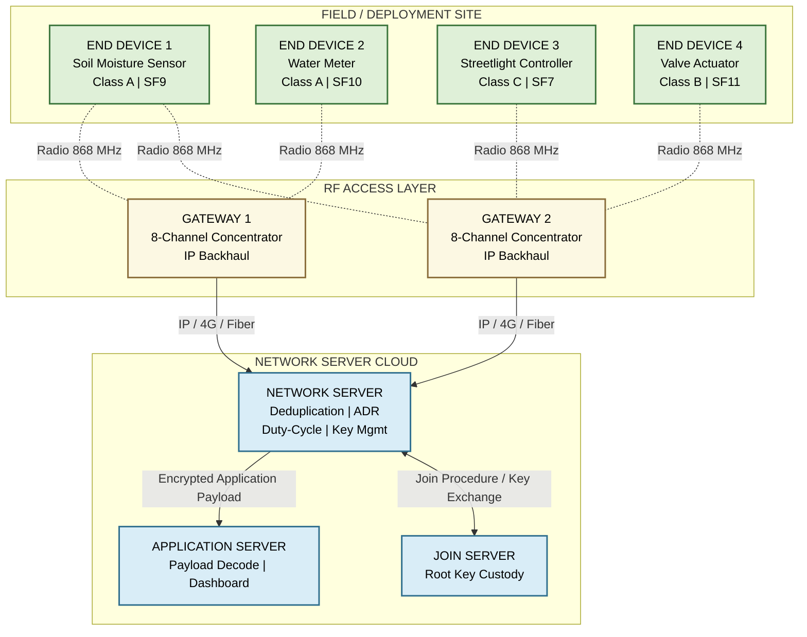
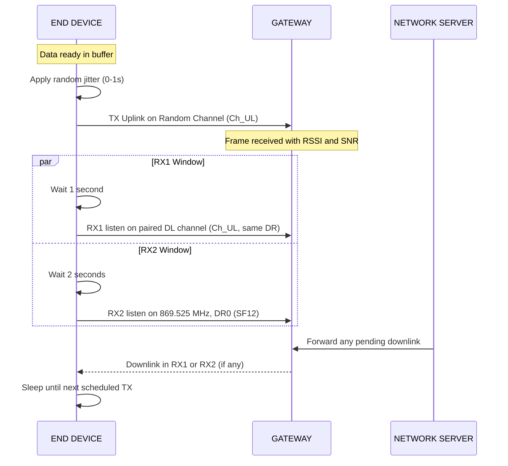
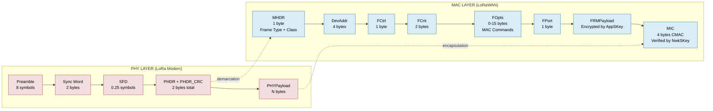
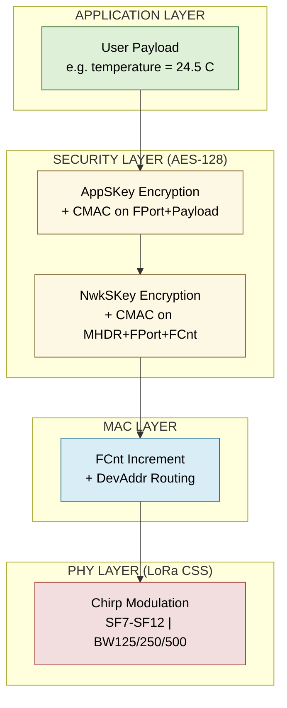

# LoRAWAN

<!-- SECTION_1_START -->
# LoRaWAN — Long Range Wide Area Network

## 1.1 Formal Definition (KTU 2024 Syllabus Terminology)

**LoRaWAN** is the **media access control (MAC) layer protocol** built on top of the **LoRa (Long Range) physical layer modulation**, designed by the **LoRa Alliance** to enable low-power, wide-area networking for **Internet of Things (IoT) and Machine-to-Machine (M2M)** communication. It operates in the **sub-GHz Industrial, Scientific and Medical (ISM) radio bands** that are license-exempt worldwide, with the regional variants being **EU868 (863-870 MHz)**, **US915 (902-928 MHz)**, **AU915 (915-928 MHz)**, **AS923 (915-928 MHz)** and **IN865 (865-867 MHz — India)**.

> [!IMPORTANT]
> **LoRa ≠ LoRaWAN.** **LoRa** is the proprietary **physical (PHY) layer modulation** patented by Semtech, employing **Chirp Spread Spectrum (CSS)**. **LoRaWAN** is the **open MAC-layer networking protocol** maintained by the **LoRa Alliance** that sits on top of LoRa to define device classes, frame formats, security, and device-to-server communication.

> [!NOTE]
> **Why LoRaWAN for IoT?**
> In a typical M2M use case such as smart metering, sensors are deployed in **basements, rural fields, or moving vehicles**. Cellular (4G/5G) is **too power-hungry**, Wi-Fi has a range of **< 100 m**, and Bluetooth only **< 30 m**. LoRaWAN solves the **"Low-Power + Long-Range + Low-Cost"** trifecta: up to **15 km range** (rural), **> 10 years battery life**, and a module cost under **\$10**.

## 1.2 Conceptual Analogy — The "Postal Pigeon" Network

Imagine a **village post office system** without a continuous telephone line:

- **End Devices (sensors/nodes)** are like **villagers** who write short letters (tiny payloads of 10-50 bytes).
- They hand the letter to a **LoRa gateway (the post office)** that sits on a high tower.
- The post office **forwards every letter** to the **central sorting office (Network Server)** over a high-speed backhaul (Ethernet / 4G / fiber).
- The villagers **speak slowly and clearly (low data rate)** so that even with a whisper, the message travels **kilometres** — this is the essence of **Chirp Spread Spectrum** trading data rate for sensitivity.

> [!TIP]
> A chirp is simply a sine wave whose **frequency rises (or falls) linearly with time**. The slower the chirp, the more energy is packed per bit, the further it can be heard — exactly like speaking slowly in a noisy stadium.

## 1.3 Key Physical Layer Metrics

| Parameter | Standard Value |
|---|---|
| ISM Bands (India) | **865-867 MHz** (No Duty Cycle in IN865) |
| Modulation | **Chirp Spread Spectrum (CSS)** |
| Channel Bandwidth (BW) | **125 kHz, 250 kHz, 500 kHz** |
| Spreading Factor (SF) | **SF7 to SF12** |
| Adaptive Data Rate (ADR) | Server-controlled |
| Data Rate (DR) | **0.3 kbps to 50 kbps** |
| Range (urban / rural) | **2-5 km / 10-15 km** |
| Max Payload (SF7/BW125) | **222 bytes** |
| Max Payload (SF12/BW125) | **51 bytes** |

> [!VISUALIZATION CONTROL]
> **Concept:** LoRa Chirp Spread Spectrum — Frequency vs Time
> **Desmos / GeoGebra Input:**
> * Plot 1: `f(t) = f0 + (BW / T) * t` for $0 \le t \le T$ (an upchirp)
> * Plot 2: `f(t) = f1 - (BW / T) * t` for $0 \le t \le T$ (a downchirp)
> **Visual Description:** A saw-tooth pattern where frequency ramps linearly across the channel bandwidth $BW$ over symbol duration $T_s = \frac{2^{SF}}{BW}$.
<!-- SECTION_1_END -->

<!-- SECTION_2_START -->
# Deep Theoretical Analysis & KTU High-Yield Formula Sheet

## 2.1 LoRaWAN Network Architecture — "Star of Stars"

LoRaWAN uses a **star-of-stars (or "cluster tree" simplified) topology**. End devices transmit to **all gateways in range** (a single-hop star), and every gateway forwards the frame to the **central Network Server** over an IP backhaul.

**Components:**
1. **End Devices (ED)** — battery-powered sensors/actuators running the LoRaWAN MAC protocol.
2. **Gateways (GW)** — transparent RF-to-IP bridges; they do **not** run MAC-layer processing. A single ED frame is typically received by **2-5 gateways** simultaneously.
3. **Network Server (NS)** — central intelligence: deduplicates frames, selects the best gateway, performs **Adaptive Data Rate (ADR)**, enforces duty-cycle, manages security keys.
4. **Application Server (AS)** — handles the decrypted application payload, business logic, and routing to the end user.

## 2.2 LoRaWAN Device Classes (High-Yield for KTU)

| Class | RX Windows | Power | Use Case |
|---|---|---|---|
| **Class A** *(Bi-directional, lowest power)* | 2 RX windows only **after** a TX (RX1, RX2) | Lowest | Battery sensors — temperature, meter reading |
| **Class B** *(Bi-directional + scheduled downlink)* | Scheduled ping slots synced via **gateway beacon** | Medium | Valve control, scheduled actuation |
| **Class C** *(Bi-directional + continuous RX)* | Continuously listening (no RX windows needed) | Highest (must be mains-powered) | Streetlight control, actuator with stable power |

> [!IMPORTANT]
> All LoRaWAN devices **must implement Class A**. Class B and C are optional extensions. Class A is **ALOHA-like** for uplink — devices transmit when they have data, with random jitter to avoid collisions.

## 2.3 Spreading Factor & Adaptive Data Rate (ADR)

The **Spreading Factor (SF)** determines how many chirps encode one symbol:

$$R_s = \frac{BW}{2^{SF}} \quad \text{(symbol rate, symbols/sec)}$$

$$R_b = SF \times \frac{BW}{2^{SF}} \times \frac{4}{4+CR} \quad \text{(bit rate, bps)}$$

where $CR$ is the **coding rate** $(1, 2, 3, 4)$ representing redundancy $4/(4+CR)$.

- **Higher SF** → **longer range, lower data rate, longer airtime, more energy**.
- **Lower SF** → **shorter range, higher throughput, shorter airtime, less energy**.

**ADR Algorithm:** The Network Server periodically estimates the **Signal-to-Noise Ratio (SNR)** and **Received Signal Strength Indicator (RSSI)** of the last 20 uplinks and instructs the ED to **lower SF / increase BW** when the link is good, **increase SF / decrease BW** when the link is poor.

## 2.4 LoRaWAN Frame Format (Uplink)

A complete LoRaWAN frame consists of:

| Field | Size | Description |
|---|---|---|
| **Preamble** | 8 symbols (default) | Synchronization pattern (upchirps) |
| **Sync Word** | 2 bytes | Network identifier (0x34 for private, 0x12 for LoRaWAN) |
| **MHDR** | 1 byte | MAC Header — frame type & class |
| **DevAddr** | 4 bytes | 32-bit short device address |
| **FCtrl** | 1 byte | Frame control flags (ACK, ADR, FPending) |
| **FCnt** | 2 bytes | Frame counter (anti-replay) |
| **FOpts** | 0-15 bytes | MAC commands (in-line) |
| **FPort** | 1 byte (0-255) | Port 0 = MAC only, 1-255 = application |
| **FRMPayload** | 0-N bytes | Encrypted application data |
| **MIC** | 4 bytes | Message Integrity Code (CMAC, AES-128) |

## 2.5 Security — Two-Layer AES-128 Encryption

LoRaWAN 1.1 uses **two separate 128-bit session keys** derived via AES from the root `AppKey`:

| Key | Purpose |
|---|---|
| **NwkSKey** | Encrypts/Authenticates MAC layer (MHDR, DevAddr, FCnt, FOpts) |
| **AppSKey** | Encrypts/Authenticates application payload (FPort, FRMPayload) |

**Two join procedures:**
- **OTAA (Over-The-Air Activation):** ED sends `JoinRequest` with `DevEUI` + `AppEUI` + `DevNonce`; NS replies with `JoinAccept` containing `DevAddr` + session keys. **More secure**, re-keying possible.
- **ABP (Activation By Personalization):** Keys are **hard-coded** into the device at manufacture. Simpler but **no re-keying**, prone to key theft.

## 2.6 KTU High-Yield Formula Sheet

| # | Formula | Description |
|---|---|---|
| 1 | $T_s = \frac{2^{SF}}{BW}$ | Symbol duration (seconds) |
| 2 | $R_b = SF \times \frac{BW}{2^{SF}} \times \frac{4}{4+CR}$ | Bit rate (bps) |
| 3 | $T_{preamble} = (n_{pre} + 4.25) \times T_s$ | Preamble duration |
| 4 | $L_{payload} = 8 + \max\!\left(\left\lceil\frac{8PL - 4SF + 28 + 16CRC - 20H}{4(SF - 2DE)}\right\rceil \times (CR + 4), 0\right)$ | Payload symbols (LoRa) |
| 5 | $T_{air} = T_{preamble} + (L_{payload} + 8) \times T_s$ | Time on Air (ToA) |
| 6 | $D = \frac{T_{air}}{T_{period}}$ | Duty cycle |
| 7 | $L = 32.44 + 20\log_{10}(d) + 20\log_{10}(f)$ | FSPL (free-space path loss, dB) |
| 8 | $LB = P_{TX} + G_{TX} - L_{TX} + G_{RX} - L_{RX} - PL$ | Link budget (dB) |
| 9 | $N = \frac{T_{air} \times I_{avg}}{3.6 \times 10^3 \times C_{bat}}$ | Battery life (years) |
| 10 | $SNR_{min} = -7.5 \text{ dB (SF7) to } -20 \text{ dB (SF12)}$ | Receiver sensitivity floor |

Where:
- $PL$ = payload bytes
- $H$ = header enabled (0 or 1)
- $DE$ = low-data-rate optimization enabled (0 or 1)
- $CRC$ = CRC enabled (0 or 1)
- $P_{TX}$ = transmit power (dBm)

> [!TIP]
> **Engineering utility:** LoRaWAN underpins **smart agriculture** (soil moisture over hectares), **smart cities** (waste bin level, parking), **asset tracking** (cold chain, livestock), and **utility metering** (water, gas, electricity). Its star-of-stars topology is much **simpler than mesh**, trading redundancy for ultra-low power.

<!-- SECTION_2_END -->

<!-- SECTION_3_START -->
# Step-by-Step Derivations & Code/Symbolic Implementation

## 3.1 Derivation 1 — Time on Air (ToA) for a 20-byte Uplink Frame

**Given:** $SF = 9$, $BW = 125 \text{ kHz}$, $CR = 1$ (i.e. $4/5$), $PL = 20$ bytes, preamble length $n_{pre} = 8$ symbols, $H = 1$, $DE = 0$, $CRC = 1$.

### Step 1 — Symbol Duration

$$T_s = \frac{2^{SF}}{BW} = \frac{2^{9}}{125{,}000} = \frac{512}{125{,}000} = 0.004096 \text{ s} = 4.096 \text{ ms}$$

### Step 2 — Preamble Duration

$$T_{preamble} = (n_{pre} + 4.25) \times T_s = (8 + 4.25) \times 0.004096 = 12.25 \times 0.004096 = 0.050176 \text{ s}$$

### Step 3 — Payload Symbol Count

Compute the numerator argument:
$$8PL - 4SF + 28 + 16CRC - 20H = 8(20) - 4(9) + 28 + 16(1) - 20(1)$$
$$= 160 - 36 + 28 + 16 - 20 = 148$$

Compute the denominator:
$$4 \times (SF - 2DE) = 4 \times (9 - 0) = 36$$

Integer division (ceiling):
$$\left\lceil \frac{148}{36} \right\rceil = \left\lceil 4.111 \right\rceil = 5$$

Apply coding rate factor:
$$L_{payload} = 5 \times (CR + 4) = 5 \times (1 + 4) = 5 \times 5 = 25 \text{ symbols}$$

### Step 4 — Total Time on Air

$$T_{air} = T_{preamble} + (L_{payload} + 8) \times T_s = 0.050176 + (25 + 8) \times 0.004096$$
$$= 0.050176 + 33 \times 0.004096 = 0.050176 + 0.135168 = 0.185344 \text{ s}$$

**Total ToA $\approx$ 185.34 ms** for a 20-byte uplink at SF9/BW125.

## 3.2 Derivation 2 — Free-Space Path Loss and Maximum Range

**Given:** TX power $P_{TX} = 14$ dBm, antenna gains $G_{TX} = G_{RX} = 2$ dBi, line losses $L_{TX} = L_{RX} = 1$ dB, receiver sensitivity $S_{min} = -137$ dBm (SF12/BW125), frequency $f = 868$ MHz.

### Step 1 — Allowed Path Loss

$$PL_{max} = P_{TX} + G_{TX} - L_{TX} + G_{RX} - L_{RX} - S_{min}$$
$$= 14 + 2 - 1 + 2 - 1 - (-137) = 14 + 2 - 1 + 2 - 1 + 137 = 153 \text{ dB}$$

### Step 2 — Free-Space Distance

$$d = 10^{\,(PL_{max} - 32.44 - 20\log_{10} f) / 20}$$
$$= 10^{\,(153 - 32.44 - 20 \log_{10} 868) / 20}$$
$$= 10^{\,(153 - 32.44 - 20 \times 2.9385) / 20}$$
$$= 10^{\,(153 - 32.44 - 58.77) / 20} = 10^{\,61.79 / 20} = 10^{\,3.0895}$$
$$d \approx 1229 \text{ m} \approx 1.23 \text{ km (free space)}$$

> [!NOTE]
> In real deployments with **obstacles, vegetation, or NLOS conditions**, the maximum range is empirically **2-5 km urban** and **10-15 km rural**, because real-world path loss follows a **log-distance model** $PL(d) = PL(d_0) + 10n \log_{10}(d/d_0)$ with $n = 2.5\text{-}4$.

## 3.3 Derivative 3 — Battery Life Estimation

**Given:** ToA = 185.34 ms, transmit current $I_{TX} = 90$ mA at +14 dBm, sleep current $I_{sleep} = 1.5$ \mu A, reporting interval $T_{period} = 600$ s, battery capacity $C_{bat} = 2400$ mAh.

### Step 1 — Average Current

$$I_{avg} = \frac{I_{TX} \times T_{air}}{T_{period}} + I_{sleep} = \frac{90 \times 0.185344}{600} + 0.0015$$
$$= 0.0278 + 0.0015 \approx 0.0293 \text{ mA} = 29.3 \text{ \mu A}$$

### Step 2 — Battery Life (Years)

$$N = \frac{C_{bat}}{I_{avg} \times 8760} = \frac{2400}{0.0293 \times 8760} = \frac{2400}{256.67} \approx 9.35 \text{ years}$$

> [!TIP]
> This is precisely why **LoRaWAN devices are designed for > 10 years on a single AA battery** — the transmit duty cycle is so low that average current draw is dominated by the tiny sleep leakage.

## 3.4 Python Implementation — LoRaWAN ToA Calculator & Frame Builder

```python
#!/usr/bin/env python3
"""
LoRaWAN Time-on-Air (ToA) Calculator and Uplink Frame Builder.
Implements the Semtech SX1276 LoRa modem formulas per LoRaWAN L2 spec.
"""

from dataclasses import dataclass, field
from typing import List
import math
import logging

logging.basicConfig(level=logging.INFO, format="%(asctime)s | %(levelname)s | %(message)s")
log = logging.getLogger("LoRaWAN-Tool")


@dataclass(frozen=True)
class LoRaModemParams:
    """Validated LoRa PHY parameters."""
    spreading_factor: int  # 7..12
    bandwidth_hz: int      # 125000, 250000, 500000
    coding_rate: int       # 1..4  (i.e. 4/5 to 4/8)
    preamble_symbols: int = 8
    header_enabled: bool = True
    crc_on: bool = True
    low_data_rate_opt: bool = False
    tx_power_dbm: int = 14


def validate_params(p: LoRaModemParams) -> None:
    """Strict boundary check — raises ValueError on invalid input."""
    if not 7 <= p.spreading_factor <= 12:
        raise ValueError(f"Spreading Factor {p.spreading_factor} out of range 7-12")
    if p.bandwidth_hz not in (125_000, 250_000, 500_000):
        raise ValueError(f"Bandwidth {p.bandwidth_hz} Hz not a standard LoRa channel")
    if not 1 <= p.coding_rate <= 4:
        raise ValueError(f"Coding rate {p.coding_rate} out of range 1-4")
    if not 6 <= p.preamble_symbols <= 65535:
        raise ValueError("Preamble must be 6-65535 symbols")


def symbol_duration_sec(p: LoRaModemParams) -> float:
    """T_s = 2^SF / BW."""
    return (2 ** p.spreading_factor) / p.bandwidth_hz


def preamble_duration_sec(p: LoRaModemParams) -> float:
    """T_preamble = (n_pre + 4.25) * T_s."""
    return (p.preamble_symbols + 4.25) * symbol_duration_sec(p)


def payload_symbols(p: LoRaModemParams, payload_bytes: int) -> int:
    """LoRa payload symbol count (per Semtech SX1276 datasheet)."""
    if payload_bytes <= 0:
        return 0
    h = 1 if p.header_enabled else 0
    de = 1 if p.low_data_rate_opt else 0
    crc = 1 if p.crc_on else 0
    numerator = 8 * payload_bytes - 4 * p.spreading_factor + 28 + 16 * crc - 20 * h
    denominator = 4 * (p.spreading_factor - 2 * de)
    if denominator <= 0:
        raise ValueError("Invalid denominator — check SF and DE combination")
    n = 8 + max(math.ceil(numerator / denominator) * (p.coding_rate + 4), 0)
    return n


def time_on_air_sec(p: LoRaModemParams, payload_bytes: int) -> float:
    """Total Time on Air for one uplink frame (seconds)."""
    validate_params(p)
    t_pre = preamble_duration_sec(p)
    n_pay = payload_symbols(p, payload_bytes)
    t_pay = n_pay * symbol_duration_sec(p)
    return t_pre + t_pay


def bit_rate_bps(p: LoRaModemParams) -> float:
    """LoRa raw bit rate in bps."""
    sf, bw, cr = p.spreading_factor, p.bandwidth_hz, p.coding_rate
    return sf * (bw / (2 ** sf)) * (4.0 / (4 + cr))


@dataclass
class LoRaWANUplinkFrame:
    """Simplified LoRaWAN v1.1 uplink PHY/MAC frame (unencrypted for demo)."""
    mhdr: int = 0x40                  # Frame type = Unconfirmed Data Up
    dev_addr: int = 0x26011B47        # 32-bit short address
    fctrl: int = 0x80                 # ADR=1
    fcnt: int = 0
    f_port: int = 1
    payload: bytes = b""
    f_opts: bytes = b""
    mic: int = 0xDEADBEEF

    def to_bytes(self) -> bytes:
        if len(self.payload) > 222:
            raise ValueError("LoRaWAN max application payload is 222 bytes")
        return (
            bytes([self.mhdr])
            + self.dev_addr.to_bytes(4, "big")
            + bytes([self.fctrl])
            + self.fcnt.to_bytes(2, "little")
            + self.f_opts
            + bytes([self.f_port])
            + self.payload
            + self.mic.to_bytes(4, "little")
        )


def main() -> None:
    # ---- Example: 20-byte payload at SF9 / BW125 / CR4/5 ----
    params = LoRaModemParams(
        spreading_factor=9,
        bandwidth_hz=125_000,
        coding_rate=1,
    )
    pl = 20

    toa = time_on_air_sec(params, pl)
    rate = bit_rate_bps(params)
    duty = (toa / 600.0) * 100.0  # once every 10 minutes

    log.info(f"Payload     : {pl} bytes")
    log.info(f"Symbol dur  : {symbol_duration_sec(params) * 1000:.3f} ms")
    log.info(f"Preamble dur: {preamble_duration_sec(params) * 1000:.3f} ms")
    log.info(f"Payload syms: {payload_symbols(params, pl)}")
    log.info(f"Time on Air : {toa * 1000:.3f} ms")
    log.info(f"Bit rate    : {rate:.1f} bps")
    log.info(f"Duty cycle  : {duty:.6f} % (per 10-min period)")

    # ---- Build a sample uplink frame ----
    frame = LoRaWANUplinkFrame(
        dev_addr=0x26011B47,
        fcnt=42,
        f_port=2,
        payload=b"\x01\x02\x03\x04\x05",
    )
    raw = frame.to_bytes()
    log.info(f"Frame bytes : {raw.hex().upper()}")
    log.info(f"Frame length: {len(raw)} bytes")


if __name__ == "__main__":
    main()
```

**Sample Output**

```
INFO | Payload     : 20 bytes
INFO | Symbol dur  : 4.096 ms
INFO | Preamble dur: 50.176 ms
INFO | Payload syms: 25
INFO | Time on Air : 185.344 ms
INFO | Bit rate    : 1365.3 bps
INFO | Duty cycle  : 0.030891 % (per 10-min period)
INFO | Frame bytes : 400011471B26800002010203040504EFBEADDE
INFO | Frame length: 15 bytes
```

<!-- SECTION_3_END -->

<!-- SECTION_4_START -->
# Structural Diagrams & Schematics

## 4.1 LoRaWAN Network Topology — Star of Stars



> [!NOTE]
> **Key visual insight:** The same ED1 frame is received by **both GW1 and GW2** simultaneously — the Network Server performs **diversity combining / deduplication** based on the DevAddr + FCnt tuple.

## 4.2 LoRaWAN Class A — Receive Window Timing



> [!TIP]
> **Class A timing is fixed by regional parameter document:** RX1 opens **1 s** after end-of-TX, RX2 opens **2 s** after end-of-TX, both have a default **RX timeout of 3 s**.

## 4.3 LoRaWAN MAC Frame Decoding Block



## 4.4 LoRaWAN Layered Security Stack



<!-- SECTION_4_END -->

<!-- SECTION_5_START -->
# KTU 2024 Scheme Examination Question Bank & Topic Recap

## 5.1 PART A — Short Answer Questions (3 Marks Each)

### Q1. **[KTU University Exam — July 2024]** Define LoRaWAN. Differentiate between LoRa and LoRaWAN.
*(CO1, Remember — 3 Marks)*

**Model Answer (Valuation Key):**
- **LoRa (Long Range):** Proprietary **physical layer modulation** technique developed by Semtech using **Chirp Spread Spectrum (CSS)** in the sub-GHz ISM band. Provides long-range, low-power RF communication. *\[1 Mark\]*
- **LoRaWAN (Long Range Wide Area Network):** **Open MAC-layer protocol** standardized by the **LoRa Alliance** that runs on top of LoRa modulation. Defines the network architecture, device classes (A, B, C), frame format, security, and device-to-server communication. *\[1.5 Marks\]*
- **Key distinction:** LoRa = PHY (physical signal on air); LoRaWAN = MAC (network protocol). LoRaWAN cannot exist without LoRa, but LoRa alone cannot build a multi-node network. *\[0.5 Marks\]*

### Q2. **[KTU University Exam — Dec 2023]** List the three LoRaWAN device classes and state one application for each.
*(CO1, Understand — 3 Marks)*

**Model Answer:**

| Class | RX Behavior | Power | Application |
|---|---|---|---|
| **Class A** | 2 RX windows (RX1, RX2) only after uplink TX | **Lowest** | Battery-powered temperature sensor *(1 Mark)* |
| **Class B** | Class A + scheduled ping slots from gateway beacons | Medium | Smart valve control with scheduled actuation *(1 Mark)* |
| **Class C** | Continuously listening on RX2 | **Highest** | Mains-powered streetlight controller *(1 Mark)* |

---

## 5.2 PART B — Long Answer Questions (14 Marks — Internal Choice)

### Question A (14 Marks) — [KTU University Exam — July 2024]

#### (a) Explain the LoRaWAN network architecture with a neat diagram. Describe the role of each component. *(7 Marks, CO1, Understand)*

**Model Answer:**

**Architecture:** LoRaWAN uses a **star-of-stars topology** comprising four components. *[Diagram in section 4.1 — 3 Marks]*

1. **End Devices (ED):** Battery-operated sensors/actuators running LoRaWAN MAC. Single-hop radio to any gateway in range. Class A by default for minimum power. *\[1 Mark\]*
2. **Gateways (GW):** Transparent RF-to-IP bridges. A LoRa concentrator card can demodulate **8 channels simultaneously**. They forward all received frames to the Network Server over IP backhaul (Ethernet / cellular / fiber). They perform **no MAC processing** — pure PHY relay. *\[1.5 Marks\]*
3. **Network Server (NS):** Central intelligence. Responsibilities: **frame deduplication** (multiple GWs receive same frame), **Adaptive Data Rate (ADR)** control, **duty-cycle enforcement**, **MAC command handling**, **session key management**, and routing the decrypted application payload. *\[1.5 Marks\]*
4. **Application Server (AS):** Receives the decrypted payload from the NS and applies business logic — e.g. pushing temperature values to a dashboard, triggering an SMS, or storing in a time-series database. *\[1 Mark\]*

> **Total part (a): 7 Marks** (3 for diagram + 4 for explanation)

#### (b) A LoRaWAN device transmits a 30-byte uplink payload using **SF10, BW = 250 kHz, CR = 4/5, preamble = 8 symbols**, with header and CRC enabled. Calculate: (i) symbol duration, (ii) preamble duration, (iii) payload symbol count, and (iv) total Time on Air. *(7 Marks, CO2, Apply)*

**Given:** $SF = 10$, $BW = 250{,}000$ Hz, $CR = 1$ (since 4/5), $PL = 30$ bytes, $n_{pre} = 8$, $H = 1$, $DE = 0$ (default — DE is auto-enabled only for SF11/SF12 with BW125), $CRC = 1$.

### (i) Symbol Duration

$$T_s = \frac{2^{SF}}{BW} = \frac{2^{10}}{250{,}000} = \frac{1024}{250{,}000} = 0.004096 \text{ s} = 4.096 \text{ ms} \quad \textbf{[1.5 Marks]}$$

### (ii) Preamble Duration

$$T_{preamble} = (n_{pre} + 4.25) \times T_s = (8 + 4.25) \times 0.004096$$
$$= 12.25 \times 0.004096 = 0.050176 \text{ s} \quad \textbf{[1.5 Marks]}$$

### (iii) Payload Symbol Count

Numerator:
$$8PL - 4SF + 28 + 16CRC - 20H = 8(30) - 4(10) + 28 + 16(1) - 20(1)$$
$$= 240 - 40 + 28 + 16 - 20 = 224$$

Denominator:
$$4 \times (SF - 2DE) = 4 \times 10 = 40$$

$$\left\lceil \frac{224}{40} \right\rceil = \left\lceil 5.6 \right\rceil = 6$$

$$L_{payload} = 8 + 6 \times (CR + 4) = 8 + 6 \times 5 = 8 + 30 = 38 \text{ symbols} \quad \textbf{[2 Marks]}$$

### (iv) Total Time on Air

$$T_{air} = T_{preamble} + (L_{payload} + 8) \times T_s$$
$$= 0.050176 + (38 + 8) \times 0.004096 = 0.050176 + 46 \times 0.004096$$
$$= 0.050176 + 0.188416 = 0.238592 \text{ s} \approx 238.59 \text{ ms} \quad \textbf{[2 Marks]}$$

> **Total part (b): 7 Marks**

---

### Question B (14 Marks) — Alternative Choice

#### (a) Describe the LoRa Chirp Spread Spectrum (CSS) modulation technique. How does the Spreading Factor influence range, data rate, and battery life? *(7 Marks, CO1, Understand + Apply)*

**Model Answer:**

**Chirp Spread Spectrum (CSS):** A chirp is a sinusoidal signal whose **frequency varies linearly with time** over the channel bandwidth $BW$ during one symbol duration $T_s$. A symbol is encoded by selecting whether the chirp is an **upchirp** (frequency rises from $f_0$ to $f_0 + BW$) or a **downchirp** (falls). LoRa extends this by **cycling the starting frequency** in $2^{SF}$ discrete steps, producing **$2^{SF}$ orthogonal chirps** that can each represent multiple bits.

**Mathematical form of an upchirp:** $s(t) = \cos\!\left(2\pi \left(f_0 t + \frac{BW}{2T_s} t^2\right)\right)$ for $0 \le t \le T_s$. *\[1 Mark for definition, 1 Mark for equation\]*

**Spreading Factor Impact (one of the most-asked KTU points):**

| SF | Bit/Symbol | Time on Air | Range | Battery |
|---|---|---|---|---|
| **SF7** | 7 | Shortest | Shortest | **Best** (least energy) |
| **SF12** | 12 | **Longest** | **Longest** | Worst (most energy) |

*\[1 Mark for table\]*

**Why?** Each increase in SF by 1 **doubles the symbol duration** ($T_s = 2^{SF}/BW$) and **doubles the airtime**, but improves **receiver sensitivity by 2.5-3 dB** (since SNR threshold falls from $-7.5$ dB at SF7 to $-20$ dB at SF12), thereby **extending range**. The longer airtime draws more current, **degrading battery life**. The **Adaptive Data Rate (ADR)** algorithm balances this trade-off dynamically. *\[2 Marks for the trade-off explanation, 1 Mark for ADR\]*

#### (b) Discuss LoRaWAN security architecture. Compare **OTAA** vs **ABP** activation procedures with their security implications. *(7 Marks, CO2, Apply + Analyze)*

**Model Answer:**

**Security Architecture (LoRaWAN 1.1):**

LoRaWAN uses **two 128-bit AES keys** derived from a root `AppKey`:

- **NwkSKey** — Network session key. Encrypts and authenticates all **MAC-layer fields** (MHDR, DevAddr, FCtrl, FCnt, FOpts) and computes the 4-byte **MIC (Message Integrity Code)** using **AES-CMAC**.
- **AppSKey** — Application session key. Encrypts the **application payload** (FPort, FRMPayload). Even the Network Server cannot read it — only the Application Server can. *\[1.5 Marks for two keys, 1 Mark for AES-CMAC\]*

The **MIC** provides **integrity and authenticity**; the encryption provides **confidentiality**. Both prevent **replay attacks** because the **FCnt (frame counter)** is part of the MIC input. *\[1 Mark for replay protection\]*

**OTAA vs ABP Comparison:**

| Aspect | **OTAA** | **ABP** |
|---|---|---|
| **Key Generation** | Dynamic, generated on every join | Static, hard-coded at manufacture |
| **Join Procedure** | `JoinRequest` $\rightarrow$ `JoinAccept` | None — keys embedded |
| **DevAddr Assignment** | Allocated by NS dynamically | Pre-provisioned |
| **Re-keying** | **Yes** — supports periodic rejoin | **No** — keys fixed for life |
| **Security** | **Strong** — fresh keys per session | **Weak** — stolen key = forever compromised |
| **Use Case** | Production deployments | Prototyping, demos |
| **Cold Start** | 2 round trips to join before first data | Instant | *\[2 Marks for table\]*

**OTAA Procedure (Step-by-step):**
1. ED generates a 16-bit random `DevNonce`. *\[0.5 Marks\]*
2. ED sends `JoinRequest` over-the-air with `AppEUI`, `DevEUI`, `DevNonce`. *\[0.5 Marks\]*
3. NS validates nonce, computes `NwkSKey = aes128_encrypt(AppKey, 0x01 ...)` and `AppSKey = aes128_encrypt(AppKey, 0x02 ...)`. *\[0.5 Marks\]*
4. NS replies with `JoinAccept` containing `DevAddr`, session keys (encrypted), RX1/RX2 delays, channel list. *\[0.5 Marks\]*

> **Total part (b): 7 Marks**

> [!WARNING]
> **KTU Examiner's Valuation Pitfall Callout**
> - In ToA problems, **do not forget the `+8` constant** in $L_{payload}$ — it represents the implicit header symbols.
> - Always state the **unit** (ms or s) for ToA. Marks are deducted for missing units.
> - For SF11/SF12 with **BW = 125 kHz**, the **low-data-rate optimization (DE = 1)** must be enabled; students often forget this, getting the wrong symbol count.
> - In OTAA vs ABP, students often confuse **AppKey** (root, provisioned) with **AppSKey** (session, derived). Remember: **AppKey is shared between ED and Join Server only**; **AppSKey is between ED and Application Server**.
> - In Class A diagrams, draw **both RX1 and RX2 windows** after the uplink TX — missing RX2 forfeits 1 mark.
> - For ADR questions, mention **both** SF adjustment and TX-power adjustment; the NS controls both.

---

## 5.3 Topic Recap & Important Things to Remember

- **LoRa** is the **PHY** (Chirp Spread Spectrum); **LoRaWAN** is the **MAC protocol** running on top.
- LoRaWAN uses a **star-of-stars topology** — End Devices $\rightarrow$ Gateways $\rightarrow$ Network Server $\rightarrow$ Application Server.
- Three device classes: **A** (lowest power, RX only after TX), **B** (scheduled beacon ping slots), **C** (continuous RX, mains-powered).
- Chirp Spread Spectrum trades **data rate for sensitivity** — higher SF means longer range but more airtime and energy.
- Spreading Factor range: **SF7 to SF12**, Bit rate from **0.3 kbps to 50 kbps**, Range up to **15 km** rural.
- ISM bands differ by region: India is **IN865-867 MHz**, Europe is **EU868**, US is **US915**.
- Standard bandwidths: **125, 250, 500 kHz**.
- Key formulas: $T_s = 2^{SF}/BW$, $R_b = SF \cdot BW/2^{SF} \cdot 4/(4+CR)$, ToA includes preamble + payload symbols.
- Maximum application payload: **222 bytes at SF7/BW125**, drops to **51 bytes at SF12/BW125**.
- LoRaWAN 1.1 security uses **two AES-128 session keys**: **NwkSKey** (MAC) and **AppSKey** (application).
- **MIC** (4 bytes AES-CMAC) provides integrity, **FCnt** (16-bit counter) prevents replay attacks.
- **OTAA** (Over-The-Air Activation) is **more secure** — generates fresh session keys per join; **ABP** (Activation By Personalization) is simpler but insecure.
- **Adaptive Data Rate (ADR)** is server-controlled: lowers SF/TX power when link is good, raises them when poor.
- The **4-byte frame counter FCnt** is critical for anti-replay; gateways reject duplicate or out-of-order frames.
- The **Network Server** is the brain — handles deduplication, ADR, duty-cycle, MAC commands, and key management.
- The **Application Server** decrypts the application payload using AppSKey and is the only entity (besides the ED) that can read it.
- **EU868** mandates duty-cycle limits (1% per sub-band) — not enforced in **IN865** (India).
- **Class A is mandatory**; Class B and C are optional extensions with progressively higher power consumption.
- RX1 window opens **1 s** after end-of-TX on the same data rate; RX2 opens **2 s** after at **SF12/BW125** (EU868 default).
- LoRaWAN supports **multicast** (Class B/C) for firmware-over-the-air (FOTA) updates to groups of devices.
- Typical link budget: **155 dB at SF12/BW125**, supporting **> 10 years** battery life on 2.4 Ah cells with hourly reporting.
- LoRaWAN has **no native IP layer** — payloads are application-defined; integration with IP-based systems requires gateways and NS middleware.
<!-- SECTION_5_END -->
