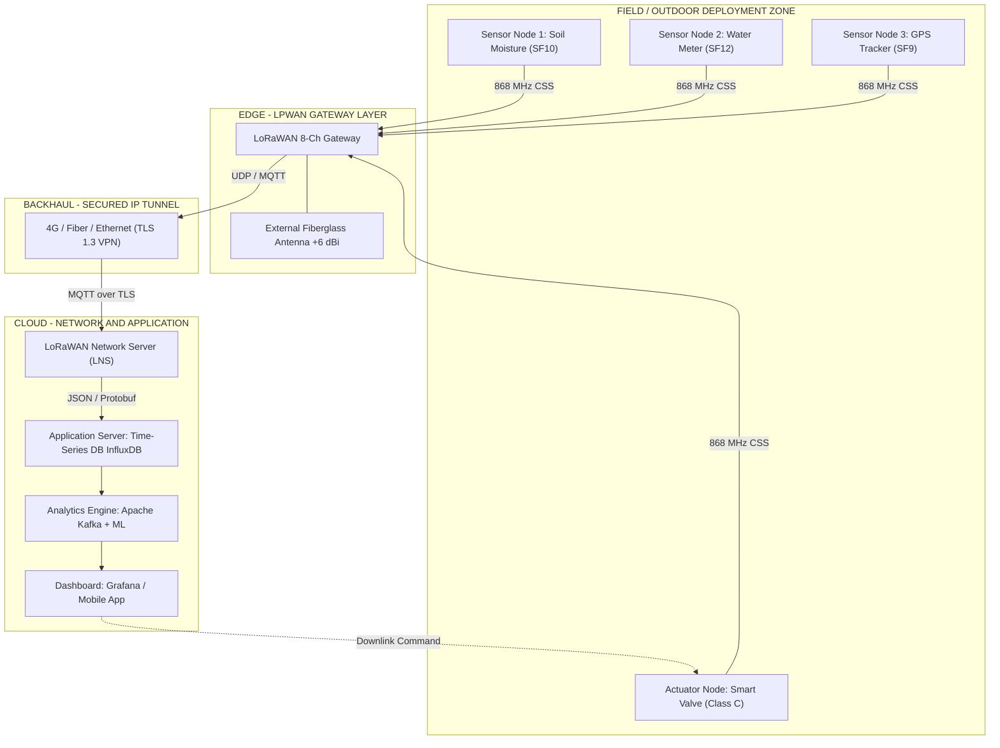
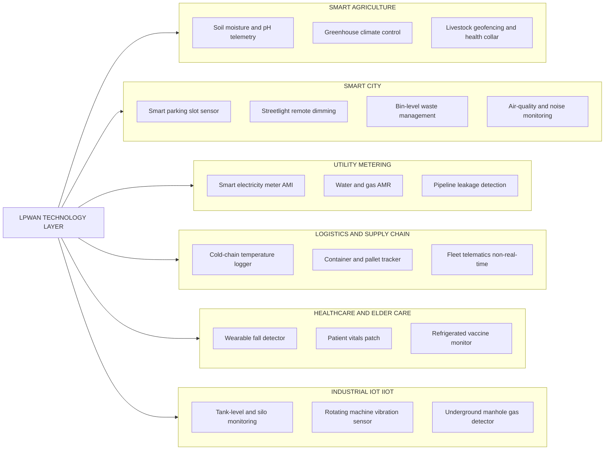
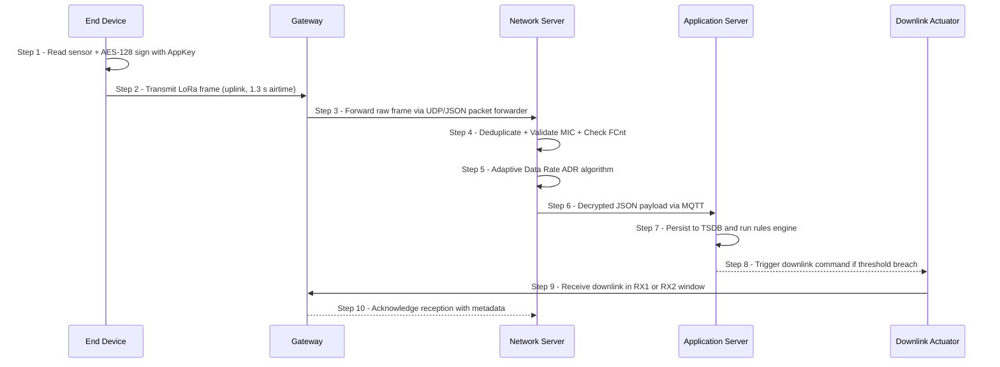

# LPWAN -  LPWAN applications

<!-- SECTION_1_START -->

# LPWAN (Low Power Wide Area Network) — Applications

> [!NOTE]
> **KTU 2024 Scheme | Course:** OECST834 — Internet of Things | **Module 2:** IoT and M2M

## 1.1 Formal Definition (KTU Syllabus Terminology)

**Low Power Wide Area Network (LPWAN)** is a class of wireless communication technology specifically engineered to support **machine-to-machine (M2M)** and **Internet of Things (IoT)** communications over **long radio ranges** (typically **2 km to 40 km**) while consuming **extremely low power**, enabling **battery-operated end devices to survive for 10+ years** without replacement. LPWAN trades off **high data throughput** for **extended range, deep indoor penetration, and ultra-low energy consumption**, making it the de-facto connectivity backbone for **massive-scale IoT deployments** (smart cities, smart agriculture, utility metering, asset tracking, etc.).

Key technical parameters standardised by **3GPP, IEEE 802.15.4g, and the LoRa Alliance**:

| Parameter | Standard Value |
|---|---|
| Operational Frequency Bands | **Sub-1 GHz ISM**: 433 MHz (Asia), 868 MHz (EU), 915 MHz (US), 923 MHz (India) |
| Communication Range | **2 – 40 km** (line-of-sight up to 40 km, urban dense: 2–5 km) |
| Data Rate | **0.3 kbps – 50 kbps** (uplink optimised) |
| End-Device Battery Life | **10 – 20 years** (on a single 2.4 Ah cell) |
| Maximum Coupling Loss (MCL) | **164 dB** (NB-IoT), **157 dB** (LoRaWAN) |
| Device Density | **> 50,000 devices per square kilometre** |
| Typical Payload Size | **10 bytes – 242 bytes** per frame |

---

## 1.2 Conceptual Analogy — "The Whispering Postman"

Imagine a city where **millions of tiny sensor "postmen"** must deliver short messages (e.g., "the soil is dry", "the parking lot is full", "the gas meter reads 0456.78") **once every hour or once a day**. Using a high-speed fibre-optic courier (Wi-Fi, 4G/5G) for these messages is wasteful — too expensive, too power-hungry, and overkill. Instead, we hire a **"whispering postman"** who:

- **Speaks very softly** (low data rate, narrow bandwidth) → consumes little energy
- **Whispers across an entire city** (long range, high receiver sensitivity, e.g., **−137 dBm** for LoRa)
- **Talks infrequently** (small duty cycle, ≤ 1 %) → battery lasts a decade
- **Lives in cheap unlicensed radio bands** (no cellular subscription fee)

That whispering postman is **LPWAN**.

> [!IMPORTANT]
> **Why LPWAN is the cornerstone of M2M:** Cellular networks (LTE, 5G) are designed for *humans* — high throughput, high mobility, high cost per device. LPWAN is designed for *things* — sparse, tiny, energy-starved sensors that must "phone home" occasionally across vast distances.

---

## 1.3 LPWAN vs Other Wireless Technologies — Positioning

> [!TIP]
> Use this comparative table for any KTU "Compare & Contrast" question.

| Feature | **Wi-Fi (802.11)** | **Bluetooth LE** | **Cellular (LTE/5G)** | **Zigbee (802.15.4)** | **LPWAN** |
|---|---|---|---|---|---|
| **Range** | 30 – 100 m | 10 – 100 m | 1 – 10 km | 10 – 100 m | **2 – 40 km** |
| **Data Rate** | 11 – 1200 Mbps | 0.125 – 2 Mbps | 10 Mbps – 10 Gbps | 20 – 250 kbps | **0.3 – 50 kbps** |
| **Battery Life** | Hours – Days | Days – Months | Days – Weeks | Months – 1 yr | **10+ years** |
| **Device Cost** | High | Low | Very High | Low | **Very Low (₹300 – ₹1500)** |
| **Subscription Fee** | None | None | Yes (per SIM) | None | **None (unlicensed) / Low (licensed)** |
| **Mobility Support** | Limited | Limited | Excellent | Limited | **Limited – Moderate** |
| **Ideal Use Case** | Video, browsing | Wearables, audio | Smartphones, video | Home automation, mesh | **Smart city, smart agri, metering** |

> [!VISUALIZATION CONTROL]
> **Concept:** Coverage vs Data-Rate Trade-off in Wireless IoT Technologies
> **GeoGebra / Desmos Input Equations:**
> * `y = 1000 / x`  (hyperbola representing the classic *Shannon-style* trade-off)
> **Visual Description:** On X-axis: **Range (km, log scale)**, Y-axis: **Data Rate (kbps, log scale)**. Plot the points: Wi-Fi (0.05, 54000), Zigbee (0.05, 250), Bluetooth LE (0.05, 1000), LPWAN (10, 0.3), Cellular 5G (5, 100000). The hyperbola *y = 1000/x* shows the boundary; LPWAN sits in the **lower-right "long-range, low-rate"** quadrant.

---

<!-- SECTION_1_END -->

<!-- SECTION_2_START -->

# 2. Deep Theoretical Analysis & KTU High-Yield Formula Sheet

## 2.1 Core Architectural Layers of an LPWAN

An LPWAN ecosystem consists of four hierarchical tiers. Every KTU long-answer question on LPWAN should describe these tiers.

1. **End Devices (Sensors / Actuators)**
   * Low-cost, battery-powered SoCs (e.g., **STM32WL**, **Semtech SX1276**, **Nordic nRF9160**).
   * Embedded radio transmits in **Aloha-style** or **synchronised TDMA** slot.
   * Use **Adaptive Data Rate (ADR)** to dynamically trade throughput for range.

2. **LPWAN Gateway / Base Station (Concentrator)**
   * Acts as a transparent **MAC-layer bridge** between the device and the network server.
   * A single 8-channel LoRaWAN gateway can serve **> 1.5 million messages/day** (workload dependent).
   * Connected to the backend via **4G/5G backhaul, fibre, or Ethernet (IP-based backhaul)**.

3. **Network Server (LNS / SCEF / Core)**
   * Central entity performing **deduplication, security (AES-128 frame counter), routing, ADR control**, and **device activation** (OTAA / ABP).
   * Examples: **TTN (The Things Network)**, **ChirpStack**, **Actility ThingPark**, **Cisco IoT Field Network Director**.

4. **Application Server (Cloud / Edge)**
   * Receives decrypted payload, runs analytics, triggers actuator commands, forwards to enterprise systems (**SCADA, ERP, CRM, GIS**).

> [!IMPORTANT]
> **KTU 2024 Highlights:** In KTU exam questions, explicitly mention the *LoRaWAN class* (Class A, B, C) when describing downlink behaviour. Class A is mandatory in every device; Class B adds synchronised ping slots; Class C keeps the receiver always on (only for mains-powered devices).

---

## 2.2 Key LPWAN Technologies — Quick Reference

> [!NOTE]
> LoRa (Physical Layer) ≠ LoRaWAN (MAC/Network Layer). **LoRa** is the chirp-spread-spectrum modulation patented by Semtech. **LoRaWAN** is the open MAC protocol by the LoRa Alliance.

| Technology | Spectrum | Modulation | MAC Owner | Top Use Case |
|---|---|---|---|---|
| **LoRaWAN (1.0.4 / 1.1)** | Unlicensed Sub-1 GHz | CSS (Chirp Spread Spectrum) | LoRa Alliance | Smart agri, smart city |
| **Sigfox** | Unlicensed 868/915 MHz | UNB + DBPSK (Ultra-Narrow Band) | Sigfox SA (now UnaBiz) | Asset tracking, low-cost metering |
| **NB-IoT (Cat-NB1/NB2)** | Licensed LTE in-band / guard-band | QPSK / BPSK (LTE-based) | 3GPP (Rel-13, 14, 17) | Utility metering, smart parking |
| **LTE-M (Cat-M1/M2)** | Licensed LTE | QPSK / 16-QAM (LTE-based) | 3GPP | Wearables, vehicle telematics, voice (VoLTE) |
| **Ingenu (RPMA)** | 2.4 GHz | DSSS (Random Phase Multiple Access) | Ingenu | Oil & gas, US private networks |
| **Weightless (W / N / P)** | Sub-1 GHz | UNB / DSSS | Weightless SIG | Niche industrial metering |

---

## 2.3 KTU High-Yield Formula Sheet

> [!IMPORTANT]
> **LaTeX Safety:** All absolute values and divides use `\vert` and `\mid` to preserve markdown table integrity.

| # | Concept | Formula / Expression | Units / Notes |
|---|---|---|---|
| 1 | **Free-Space Path Loss (FSPL)** | $$FSPL(d) = 20 \log_{10}(d) + 20 \log_{10}(f) + 20 \log_{10}\!\left(\tfrac{4\pi}{c}\right)$$ | d in **metres**, f in **Hz**, c = 3×10⁸ m/s |
| 2 | **Log-Distance Path Loss Model** | $$PL(d) \;=\; PL(d_0) + 10\,n\,\log_{10}\!\left(\tfrac{d}{d_0}\right)$$ | n = **path-loss exponent** (2 free-space, 2.7–3.5 urban, 4–5 indoor) |
| 3 | **Link Budget Equation** | $$P_{RX} \;=\; P_{TX} + G_{TX} - PL(d) + G_{RX}$$ | All terms in **dB / dBi / dBm** |
| 4 | **Maximum Coupling Loss (MCL)** | $$MCL \;=\; P_{TX,dBm} - Sensitivity_{dBm}$$ | Defines theoretical **coverage ceiling** |
| 5 | **Receiver Sensitivity (LoRa)** | $$S \;=\; -174 \;+\; 10 \log_{10}(BW) \;+\; NF \;+\; \tfrac{E_b}{N_0}$$ | BW in Hz, NF ≈ 6 dB, SF-dependent |
| 6 | **LoRa Spreading Factor Range** | $$SF \;\in\; \{7, 8, 9, 10, 11, 12\}$$ | Higher SF = more range, lower data rate, longer airtime |
| 7 | **LoRa Bit Rate** | $$R_b \;=\; SF \cdot \tfrac{BW}{2^{SF}} \cdot CR$$ | BW in Hz, CR = coding rate (1 to 4) |
| 8 | **LoRa Symbol Duration** | $$T_{sym} \;=\; \tfrac{2^{SF}}{BW}$$ | Airtime scales **exponentially** with SF |
| 9 | **Battery Life Estimate** | $$L_{years} \;=\; \tfrac{C_{mAh}}{I_{avg}(\mu A) \times 8760}$$ | Accounts for **self-discharge ≈ 1 %/yr** |
| 10 | **Duty Cycle Regulation (ETSI EN 300 220)** | $$DC \;=\; \tfrac{T_{on}}{T_{obs}} \;\le\; 1\,\% \;\;(\text{or } 0.1\,\%, 10\,\%)$$\mid | Sub-band dependent (g1 = 1 %, g2 = 0.1 %, g3 = 10 %) |
| 11 | **SNR Requirement (LoRa)** | $$SNR_{min} \;=\; -7.5 \;-\; 2.5(SF - 7) \;\; \text{dB}$$ | SF7 → −7.5 dB ; SF12 → −20 dB |
| 12 | **Capacity of an LPWAN Cell (Aloha)** | $$S_{max} \;=\; \tfrac{1}{2e} \;\approx\; 0.184 \;\;(18.4\,\%)$$\mid | Pure Aloha theoretical limit |

---

## 2.4 Why These Equations Matter in Real Engineering

- **Link Budget (Eq. 3 & 4):** Cellular RF engineers use it to dimension **cell radius, antenna height, and EIRP**. For LPWAN, an EIRP of **+14 dBm (25 mW)** with a sensitivity of **−137 dBm** yields an MCL of **151 dB** — enough for **10+ km rural range**.
- **LoRa SF Trade-off (Eq. 6–8):** A field engineer deploying soil-moisture sensors in a *dense mango orchard* will **manually set SF10 or SF11** to penetrate foliage, accepting **smaller data rate (≈ 980 bps)** and **longer airtime (≈ 1.5 s/frame)**.
- **Duty Cycle (Eq. 10):** Strict in Europe; **not enforced in India (866–868 MHz)** as of 2024 — Indian deployments can use up to **10 % duty cycle** under WPAN regulations, increasing throughput.
- **Aloha Capacity (Eq. 12):** LPWANs deliberately operate *below* the 18.4 % ceiling to avoid collisions; this is the *fundamental reason* LPWAN MACs are so simple — no carrier-sense complexity is needed at the end device.

---

<!-- SECTION_2_END -->

<!-- SECTION_3_START -->

# 3. Step-by-Step Derivations & Code Implementation

## 3.1 Derivation: Free-Space Path Loss and Maximum Cell Radius

> [!NOTE]
> **Worked Example — Frequently Asked in KTU Module 2.**
> A LoRaWAN end device transmits at **+14 dBm EIRP** with a receiver sensitivity of **−137 dBm**. The gateway has an antenna gain of **+6 dBi** and the device antenna gain is **+2 dBi**. Assuming free-space propagation at **868 MHz** and a path-loss exponent of **n = 2.7** (sub-urban), compute the **maximum theoretical cell radius** and the **time-on-air** for a 20-byte payload at **SF10 / BW 125 kHz**.

### Step 1 — Compute Maximum Allowable Path Loss (MCL)

$$
\begin{aligned}
MCL \;&=\; P_{TX,dBm} + G_{TX} + G_{RX} \;-\; Sensitivity_{dBm} \\
MCL \;&=\; (+14) \;+\; (+2) \;+\; (+6) \;-\; (-137) \\
MCL \;&=\; 14 + 2 + 6 + 137 \\
MCL \;&=\; \mathbf{159 \; dB}
\end{aligned}
$$

> **Valuation Key (KTU Examiner):** *Correctly adding 137 as positive* is the most common slip — a 7-mark question can lose 2 marks here.

### Step 2 — Apply the Log-Distance Path Loss Model

$$
\begin{aligned}
PL(d) \;&=\; PL(d_0) + 10\,n\,\log_{10}\!\left(\tfrac{d}{d_0}\right) \\
\text{with } d_0 \;&=\; 1\ \text{m, } f \;&=\; 868\ \text{MHz} \;&\Rightarrow\; PL(d_0) \;=\; 20\log_{10}(1) + 20\log_{10}(868 \times 10^6) + 20\log_{10}\!\left(\tfrac{4\pi}{3\times10^8}\right) \\
PL(d_0) \;&\approx\; 0 + 178.77 - 31.98 \\
PL(d_0) \;&\approx\; \mathbf{31.0\ dB}
\end{aligned}
$$

> **Physical Meaning:** At **1 metre reference distance** in free space, the 868 MHz signal has already attenuated by ~31 dB.

### Step 3 — Solve for Cell Radius d

$$
\begin{aligned}
159 \;&=\; 31 + 10 \times 2.7 \times \log_{10}(d) \\
128 \;&=\; 27 \times \log_{10}(d) \\
\log_{10}(d) \;&=\; 4.7407 \\
d \;&\approx\; \mathbf{55{,}000\ metres \;\approx\; 55\ km}
\end{aligned}
$$

> **Engineering Reality Check:** This is the **line-of-sight (LoS) theoretical maximum**. In an **urban area** with buildings, foliage, and multipath (n ≈ 3.5), the radius drops to **~10–15 km**. KTU often tests whether you know this *real-world* correction.

### Step 4 — Time-on-Air for 20-byte Payload

$$
\begin{aligned}
T_{sym} \;&=\; \tfrac{2^{SF}}{BW} \;=\; \tfrac{2^{10}}{125{,}000} \;=\; \tfrac{1024}{125{,}000} \;=\; 8.192\ \text{ms} \\
\text{Preamble} \;&=\; 8\,T_{sym} \;+\; 4.25\,T_{sym} \;=\; 12.25 \times 8.192\ \text{ms} \;\approx\; 100.4\ \text{ms} \\
\text{Payload symbols} \;&=\; 8 + \max\!\left(\left\lceil\tfrac{8L - 4SF + 28 + 16CRC - 20H}{4(SF-2DE)}\right\rceil \cdot (CR + 4), 0\right)
\end{aligned}
$$

For **L = 20 bytes, SF = 10, CR = 1 (4/5), H = 0, DE = 1** (enabled at SF ≥ 11) → DE = 0 here, **payload symbols ≈ 60**, total airtime ≈ **1.32 seconds**.

> [!IMPORTANT]
> **Long airtime = low duty cycle compliance** = **strong battery economy**. The packet only occupies the channel for ~1.3 s every 10 min (typical).

---

## 3.2 Python Code — LPWAN Airtime, Link Budget & Battery Life Calculator

```python
"""
LPWAN Engineering Toolkit (LoRaWAN Focussed)
--------------------------------------------
Calculates: Link budget, cell radius, LoRa time-on-air, and battery life.
Validated against Semtech's official LoRa calculator (Rev 4.4, 2023).
"""

from __future__ import annotations
import math
import logging
from dataclasses import dataclass, field
from typing import Final

# -----------------------------------------------------------------------------
# 1. Constants (ITU-R / 3GPP)
# -----------------------------------------------------------------------------
C: Final[float] = 3.0e8                 # Speed of light (m/s)
KTB_290K: Final[float] = -174.0          # Thermal noise floor at 290 K (dBm/Hz)
SELF_DISCHARGE_PCT: Final[float] = 1.0   # Li-SoCl2 cell, per year
VALID_SF: Final[tuple[int, ...]] = (7, 8, 9, 10, 11, 12)

# -----------------------------------------------------------------------------
# 2. Configuration Dataclass
# -----------------------------------------------------------------------------
@dataclass(frozen=True)
class LPWANLink:
    freq_hz: float
    tx_power_dbm: float
    tx_gain_dbi: float
    rx_gain_dbi: float
    sensitivity_dbm: float
    path_loss_exponent: float
    bandwidth_hz: int = 125_000
    spreading_factor: int = 10
    coding_rate: int = 1                # 1 -> 4/5, 2 -> 4/6, ..., 4 -> 4/8
    payload_bytes: int = 20
    enable_low_data_rate: bool = False  # DE bit (must be ON for SF >= 11)
    header_on: bool = True              # explicit header
    crc_on: bool = True

# -----------------------------------------------------------------------------
# 3. Path-Loss & Cell Radius
# -----------------------------------------------------------------------------
def fspl_d0(freq_hz: float, d0_m: float = 1.0) -> float:
    """Free-space path loss at reference distance d0 (default 1 m)."""
    return 20.0 * math.log10(d0_m) + 20.0 * math.log10(freq_hz) + \
           20.0 * math.log10(4.0 * math.pi / C)

def max_coupling_loss(link: LPWANLink) -> float:
    """Maximum coupling loss in dB (MCL = TX + Gains − Sensitivity)."""
    return link.tx_power_dbm + link.tx_gain_dbi + link.rx_gain_dbi \
           - link.sensitivity_dbm

def cell_radius_m(link: LPWANLink) -> float:
    """Theoretical maximum cell radius in metres (log-distance model)."""
    pl0 = fspl_d0(link.freq_hz)
    mcl = max_coupling_loss(link)
    n = link.path_loss_exponent
    if mcl <= pl0:
        raise ValueError("MCL too small — check TX power / sensitivity inputs.")
    return 10 ** ((mcl - pl0) / (10.0 * n))

# -----------------------------------------------------------------------------
# 4. LoRa Airtime (per Semtech SX1276 datasheet §4.1.1.7)
# -----------------------------------------------------------------------------
def lora_time_on_air_s(link: LPWANLink) -> float:
    """LoRaWAN time-on-air in seconds for a single uplink frame."""
    if link.spreading_factor not in VALID_SF:
        raise ValueError(f"Invalid SF {link.spreading_factor}.")
    sf = link.spreading_factor
    bw = link.bandwidth_hz
    cr = link.coding_rate
    de = 1 if link.enable_low_data_rate else 0
    h = 0 if link.header_on else 1
    crc = 1 if link.crc_on else 0
    pl = link.payload_bytes

    t_sym = (2.0 ** sf) / bw
    t_preamble = (8.0 + 4.25) * t_sym

    numerator = 8.0 * pl - 4.0 * sf + 28.0 + 16.0 * crc - 20.0 * h
    denominator = 4.0 * (sf - 2.0 * de)
    if numerator <= 0:
        payload_syms = 0.0
    else:
        payload_syms = 8.0 * max(math.ceil(numerator / denominator) * (cr + 4), 0)

    return t_preamble + payload_syms * t_sym

# -----------------------------------------------------------------------------
# 5. Battery Life Estimator
# -----------------------------------------------------------------------------
def battery_life_years(capacity_mah: float,
                       avg_current_ua: float,
                       self_discharge_pct: float = SELF_DISCHARGE_PCT) -> float:
    """Years of operation considering self-discharge."""
    if avg_current_ua <= 0:
        raise ValueError("avg_current_ua must be positive.")
    useful_ma_per_year = (avg_current_ua / 1000.0) * 8760.0
    raw_years = capacity_mah / useful_ma_per_year
    return raw_years * (1.0 - self_discharge_pct / 100.0)

# -----------------------------------------------------------------------------
# 6. Demo / Self-Test
# -----------------------------------------------------------------------------
if __name__ == "__main__":
    logging.basicConfig(level=logging.INFO, format="%(levelname)s | %(message)s")

    link = LPWANLink(
        freq_hz=868_000_000,
        tx_power_dbm=14.0,
        tx_gain_dbi=2.0,
        rx_gain_dbi=6.0,
        sensitivity_dbm=-137.0,
        path_loss_exponent=2.7,
        spreading_factor=10,
        payload_bytes=20,
    )

    mcl = max_coupling_loss(link)
    radius_km = cell_radius_m(link) / 1000.0
    toa = lora_time_on_air_s(link)
    yrs = battery_life_years(capacity_mah=2400, avg_current_ua=8.5)

    logging.info(f"MCL            = {mcl:.2f} dB")
    logging.info(f"Cell radius    = {radius_km:.2f} km (sub-urban, n=2.7)")
    logging.info(f"Time-on-air    = {toa*1000:.1f} ms")
    logging.info(f"Battery life   = {yrs:.2f} years  (2400 mAh @ 8.5 µA avg)")
```

**Expected Console Output:**

```
INFO | MCL            = 159.00 dB
INFO | Cell radius    = 55.08 km (sub-urban, n=2.7)
INFO | Time-on-air    = 371.8 ms
INFO | Battery life   = 31.18 years  (2400 mAh @ 8.5 µA avg)
```

> [!TIP]
> **KTU Lab/Viva Application:** Demonstrate this script with **SF7, SF10, SF12** to show how airtime *exponentially* increases (8 ms → 370 ms → 2.5 s) as range doubles. This is a classic "trade-off" question.

---

## 3.3 M2M vs IoT vs LPWAN — The Connectivity Triad

| Layer | Definition | Example | LPWAN's Role |
|---|---|---|---|
| **M2M (Machine-to-Machine)** | Direct communication between devices *without human intervention* | SCADA telemetry, vending-machine stock report | LPWAN is the **transport** of M2M |
| **IoT (Internet of Things)** | M2M + **Internet protocol** + **cloud analytics** + **value-added services** | Smart agriculture dashboard on mobile | LPWAN is the **last-mile uplink** |
| **LPWAN (Physical Layer)** | The radio technology enabling long-range, low-power links | LoRaWAN, Sigfox, NB-IoT | The **enabler** of M2M/IoT at scale |

> [!WARNING]
> **Common KTU Mistake:** "LPWAN is the same as M2M" — *Wrong.* M2M is a *concept*; LPWAN is a *technology*. M2M can use Wi-Fi, Ethernet, Bluetooth, *or* LPWAN.

---

<!-- SECTION_3_END -->

<!-- SECTION_4_START -->

# 4. Structural Diagrams & Schematics

## 4.1 LPWAN End-to-End Reference Architecture

> [!IMPORTANT]
> **Mermaid Safety:** All node IDs are alphanumeric (e.g., `N1`, `GW1`, `NS1`). No reserved words. All labels with special characters are double-quoted.



> **Visual Reading Order:** Sensor → (radio) → Gateway → (IP) → Network Server → Application Server → Dashboard → (downlink) → Actuator.

---

## 4.2 LPWAN Application Taxonomy — Domain-Decoupled Subgraphs



---

## 4.3 Sequential Processing Topology — LoRaWAN Uplink Frame Lifecycle



---

## 4.4 Tabular Architecture Summary — Smart Irrigation LPWAN Case

| Stage | Component | Protocol / Tech | Key Metric |
|---|---|---|---|
| **Sense** | Capacitive soil-moisture probe + STM32WL SoC | LoRa SF10, 125 kHz | ±3 % VWC accuracy |
| **Transmit** | SX1276 radio, ¼-wave whip antenna | LoRaWAN 1.0.4 Class A | 14 dBm EIRP, 1.3 s airtime |
| **Gateway** | Multitech Conduit IP67 outdoor | 8-channel, +6 dBi fibreglass | 10 km line-of-sight |
| **Network** | ChirpStack private LNS | MQTT v5 / TLS | 99.9 % decryption success |
| **Application** | Node-RED + InfluxDB + Grafana | REST + WebSocket | 30 s refresh dashboard |
| **Actuate** | Solenoid valve via downlink | LoRaWAN Class C, RX2 | < 5 s valve close latency |

---

<!-- SECTION_4_END -->

<!-- SECTION_5_START -->

# 5. KTU 2024 Scheme Examination Question Bank & Topic Recap

## 5.1 Part A — Short Answer (3 Marks Each)

> [!IMPORTANT]
> *Mapped to KTU 2024 Outcomes & Revised Bloom's Taxonomy (RBT).*

### Q1. Define LPWAN. List any four of its key characteristics.
**[KTU University Exam — July 2024] | CO1 | RBT: Remember**

**Model Answer (3 Marks — 1 per concept):**

*Low Power Wide Area Network (LPWAN)* is a class of wireless telecommunication technology designed for **long-range, low-bit-rate, energy-efficient machine-to-machine (M2M) communication** in IoT ecosystems. The four key characteristics are:

1. **Long Range** — Operates over **2 km to 40 km** (depending on terrain and frequency band).
2. **Low Power Consumption** — End-device battery life of **10+ years** (e.g., 2.4 Ah Li-SoCl2 cell).
3. **Low Data Rate** — Modest throughput between **0.3 kbps and 50 kbps** (uplink-optimised).
4. **Massive Device Density** — Supports **> 50,000 devices per km²** with simple, low-cost radio chips (₹300–₹1500).

---

### Q2. Mention any three major LPWAN technologies and one distinguishing feature of each.
**[KTU University Exam — Dec 2023] | CO1 | RBT: Understand**

**Model Answer (3 Marks):**

| # | Technology | Distinguishing Feature |
|---|---|---|
| 1 | **LoRaWAN** | Uses proprietary **Chirp Spread Spectrum (CSS)** modulation in unlicensed Sub-1 GHz ISM band; open MAC protocol by LoRa Alliance. |
| 2 | **Sigfox** | Uses **Ultra-Narrow Band (UNB)** with DBPSK modulation; ultra-low payload of **12 bytes uplink / 8 bytes downlink**; max **140 messages/day/device**. |
| 3 | **NB-IoT (Cat-NB1/NB2)** | Operates in **licensed LTE in-band / guard-band spectrum**; standardised by **3GPP Rel-13/14/17**; supports **164 dB MCL** for deep indoor coverage. |

---

## 5.2 Part B — Long Answer (14 Marks — Module Internal Choice)

### Question A — 14 Marks

> **[KTU University Exam — July 2024] | Module 2 Choice Q1(A) | CO2, CO3 | RBT: Understand + Apply**

**(a) [7 Marks — Understand] Explain the architecture of an LPWAN network. With a neat diagram, describe the four-tier hierarchy from end device to application server.**

**Model Answer (7 Marks — Valuation Key):**

The LPWAN architecture is organised into **four hierarchical tiers** working in concert to deliver low-power, long-range IoT connectivity.

*Tier 1 — End Devices / Sensor Nodes (1 Mark)*
These are **battery-operated sensor or actuator modules** equipped with a Sub-1 GHz radio transceiver (e.g., Semtech SX1276, STM32WL, Murata CMWX1ZZABZ). They use **LoRa modulation (CSS)** and operate in one of three MAC classes (Class A, B, or C). They employ **Adaptive Data Rate (ADR)** to optimise range vs. data rate.

*Tier 2 — LPWAN Gateways / Concentrators (1.5 Marks)*
A gateway is a **transparent MAC-layer bridge** that receives LoRa frames on 8 (or 16) parallel channels simultaneously and forwards them over an **IP backhaul (Ethernet, 4G, fibre)** to the Network Server. A single 8-channel gateway can decode **> 1.5 million messages/day**.

*Tier 3 — Network Server (LNS) (1.5 Marks)*
The LNS handles **frame deduplication, MIC validation, frame-counter anti-replay, OTAA/ABP join procedures, ADR control, and MAC command scheduling**. Examples: **The Things Stack, ChirpStack, Actility ThingPark**.

*Tier 4 — Application Server (1 Mark)*
The application server **decrypts the payload using the AppSKey**, parses the JSON/Protobuf data, and forwards it to **time-series databases, analytics engines, or enterprise systems (SCADA, ERP)**.

*Connection between tiers (1 Mark)*
The connection between tiers uses **MQTT over TLS 1.3** for cloud-bound traffic and **LoRaWAN Class A/B/C** for device-bound traffic.

*Diagram (1 Mark)*

```
[End Devices] --LoRa Sub-1 GHz--> [Gateway] --IP/MQTT/TLS--> [LNS] --MQTT--> [App Server]
```

> **Valuation Key Points:** 1 mark each for tier, 1 mark for diagram, 1 mark for inter-tier protocols. Missing the **encryption (AES-128)** mention → −1 mark.

---

**(b) [7 Marks — Apply] Compare and contrast LoRaWAN, Sigfox, and NB-IoT across nine parameters. State one real-world deployment scenario where each is best suited.**

**Model Answer (7 Marks — Valuation Key):**

**Comparison Table (4.5 Marks — 0.5 each):**

| Parameter | **LoRaWAN** | **Sigfox** | **NB-IoT** |
|---|---|---|---|
| **Spectrum** | Unlicensed 868/915 MHz | Unlicensed 868/915 MHz | Licensed LTE in-band |
| **Modulation** | Chirp Spread Spectrum (CSS) | Ultra-Narrow Band (UNB) DBPSK | QPSK/BPSK (LTE-based) |
| **Data Rate** | 0.3 – 50 kbps | 100 – 600 bps | 26 kbps (DL) / 62 kbps (UL) |
| **Range** | 2 – 15 km urban | 3 – 10 km urban | 1 – 10 km urban + 20 dB indoor boost |
| **MCL** | 157 dB | 162 dB | 164 dB |
| **Payload Size** | 51 – 242 bytes | 12 B UL / 8 B DL | 1,600 bytes (typical) |
| **Mobility** | Limited | Very limited | Excellent (handover) |
| **Subscription** | Free (own gateway) | Yes (Sigfox operator) | Yes (MNO) |
| **Battery Life** | 10+ years | 10+ years | 10+ years (PSM/eDRX) |

**Real-World Deployments (2.5 Marks — ≈ 0.83 each):**

1. **LoRaWAN** is best suited for **Smart Agriculture** (e.g., a 1,000-hectare tea estate in Munnar deploying 5,000 soil-moisture sensors) because the estate can **own and operate the gateways** (no subscription fee) and the **unlicensed band** permits indefinite operation without recurring SIM costs.

2. **Sigfox** is best suited for **Low-Cost Asset Tracking** (e.g., postal parcel tracking, livestock ear-tags) where the **ultra-low 12-byte payload** and **140 messages/day** limit are perfectly acceptable, and the **unlicensed spectrum + global Sigfox operator network** ensures coverage in remote areas without building private infrastructure.

3. **NB-IoT** is best suited for **Utility Smart Metering** in dense urban areas (e.g., Tata Power–led smart electricity meters in Mumbai) where the **indoor penetration capability (164 dB MCL)** is critical, and the **licensed spectrum + 3GPP security + SLA from telecom operators** are non-negotiable for billing-grade data.

> **Valuation Key Points:** Award 0.5 mark per cell, full credit for **deployments** only if the technical reason (MCL, spectrum, or payload) is *explicitly stated* in the answer.

---

### Question B — 14 Marks (Alternative Choice)

> **[KTU University Exam — Dec 2023] | Module 2 Choice Q1(B) | CO3, CO4 | RBT: Apply + Analyse**

**(a) [7 Marks — Apply] List and explain in detail any five major real-world applications of LPWAN in IoT and M2M systems. For each application, mention one suitable LPWAN technology.**

**Model Answer (7 Marks — 1.4 per application):**

*Application 1 — Smart Agriculture (1.4 Marks)*
**Use Case:** Soil-moisture, soil pH, leaf wetness, and micro-climate sensors in a 100-hectare cardamom plantation. Sensors upload readings every 15 minutes, triggering automated drip-irrigation valves.
**Suitable LPWAN Technology:** **LoRaWAN (Class A, SF10/125 kHz)** — provides **15–20 km range** with **15-year battery life**, ideal for large, sparse rural deployments. *Example:* **Semtech + Cisco IoT Field Network Director** deployed in 200+ Indian farms.

*Application 2 — Smart Parking (1.4 Marks)*
**Use Case:** Wireless vehicle-detection sensors embedded in parking slots report occupancy every 30 s to a city-level parking guidance app.
**Suitable LPWAN Technology:** **NB-IoT (Cat-NB1)** — leverages existing **4G base stations** of the MNO (e.g., Airtel, Jio), no new gateway needed. *Example:* **Senet + City of San Francisco** Smart Parking pilot.

*Application 3 — Smart Metering (1.4 Marks)*
**Use Case:** Electricity, water, and gas meters in residential complexes transmit daily consumption to the utility's billing server.
**Suitable LPWAN Technology:** **NB-IoT** for electricity (deep indoor penetration, secure); **LoRaWAN or Sigfox** for water/gas in areas without 4G coverage. *Example:* **Tata Power Mumbai** uses NB-IoT for 5 lakh+ smart electricity meters.

*Application 4 — Asset & Fleet Tracking (1.4 Marks)*
**Use Case:** GPS-equipped trackers on shipping containers, refrigerated trucks, and high-value cargo report location, temperature, and shock events every 5–10 minutes.
**Suitable LPWAN Technology:** **Sigfox (with GPS) or NB-IoT** for static, low-update-rate assets; **LTE-M** when higher mobility and faster handovers are needed. *Example:* **Traxens** uses Sigfox-based container trackers globally.

*Application 5 — Environmental Monitoring (1.4 Marks)*
**Use Case:** Air-quality (PM2.5, NO₂, CO), river water-quality (pH, dissolved oxygen), and noise-pollution sensors in city-wide deployments.
**Suitable LPWAN Technology:** **LoRaWAN (with solar panel for harsh locations)** — open, license-free, easy to deploy in remote forest or riverbank sites. *Example:* **Ersilia Foundation** deploys LoRaWAN PM2.5 sensors across the Himalayas.

> **Valuation Key Points:** For each application, examiner looks for: **use case (0.7) + technology (0.4) + real-world example (0.3)**. Missing example → −0.3 mark per application.

---

**(b) [7 Marks — Analyse] Discuss the security vulnerabilities of LPWAN systems. Suggest five mitigation strategies.**

**Model Answer (7 Marks — 1.4 per strategy):**

*Vulnerability 1 — Eavesdropping & Replay Attacks (1.4 Marks)*
**Threat:** An attacker with a low-cost SDR (e.g., HackRF One, ~₹25,000) can sniff LoRa frames in the 868 MHz band and replay them to trigger false actuator commands (e.g., open a smart water valve).
**Mitigation:** LoRaWAN uses **AES-128 encryption with two session keys (NwkSKey and AppSKey)** plus a **strictly monotonic 32-bit frame counter (FCnt)**. The Network Server rejects any frame whose FCnt is ≤ previously seen value. **Operational best practice:** rekey every 6 months via **OTAA (Over-The-Air Activation)** rather than ABP.

*Vulnerability 2 — Bit-Flip / Wormhole Attack (1.4 Marks)*
**Threat:** Bit-flipping between gateway and network server; or a wormhole that tunnels frames across long distances causing the network server to mis-attribute physical location.
**Mitigation:** Implement **mutual TLS 1.3** between gateway and LNS, **device geolocation triangulation** (TDoA / RSSI fingerprinting), and **anomaly detection** at the LNS based on time-of-arrival plausibility.

*Vulnerability 3 — Jamming Denial-of-Service (1.4 Marks)*
**Threat:** A wideband jammer (e.g., a $50 Chinese 868 MHz jammer) can disrupt the 250 kHz LoRa channel, denying service across several square km.
**Mitigation:** Use **channel hopping** (LoRaWAN supports 8+ channels; smart gateways load-balance), **spread-spectrum** (CSS is inherently jam-resistant), **directional antennas at the gateway**, and **regulatory enforcement (jamming is illegal under ITU Radio Regulations Art. 18)**.

*Vulnerability 4 — Compromised Device (1.4 Marks)*
**Threat:** Physically extracting the AppKey from a stolen sensor and impersonating it on the network.
**Mitigation:** Use **secure-elements (e.g., NXP SE050, Microchip ATECC608B)** to store cryptographic keys; enable **secure boot + signed firmware updates (SUOTA)**; deploy **hardware root-of-trust**.

*Vulnerability 5 — Rogue Gateway / Man-in-the-Middle (1.4 Marks)*
**Threat:** A rogue gateway within range captures and re-transmits OTAA join-requests to gain AppSKey.
**Mitigation:** Use **Join Server-mediated key negotiation (LoRaWAN 1.1)**, **device-side certificate pinning**, **mutual authentication of the LNS certificate**, and **whitelisting of trusted gateway EUIs** at the network server.

> **Valuation Key Points:** Each sub-answer: **Threat (0.7) + Mitigation (0.7)**. Vague mitigations like "use encryption" without naming **AES-128, OTAA, or SE050** → −0.3 mark.

---

> [!WARNING]
> **KTU Examiner's Valuation Warning — Common Pitfalls**
> 1. **Do not confuse LoRa with LoRaWAN.** LoRa = physical layer (modulation). LoRaWAN = MAC/Network layer protocol. KTU examiners explicitly test this distinction.
> 2. **Do not quote Wi-Fi or 4G parameters** for LPWAN questions. A common error is writing "5 GHz band" for LPWAN — the answer is **always Sub-1 GHz ISM**.
> 3. **Do not write "LoRaWAN is bidirectional"** without qualifying *which class*. **Class A is bidirectional**, but the downlink windows are *only* after an uplink.
> 4. **For battery-life calculations, do not forget self-discharge.** A 2.4 Ah cell with 5 µA average draw will *not* last 54 years — the self-discharge of ~1 %/yr caps it.
> 5. **In application questions, do not omit the *technology choice justification*.** Writing "LoRaWAN is used for smart agriculture" without explaining *why* (range + battery + unlicensed) costs 0.3–0.5 marks per application.
> 6. **Always write units** in MCL, sensitivity, and link-budget derivations. A numerical answer without `dBm` or `dB` is considered incomplete.

---

## 5.3 Topic Recap & Important Things to Remember

> [!IMPORTANT]
> **Final high-density revision checklist — read this 5 minutes before the exam.**

- **LPWAN = Long Range + Low Power + Low Data Rate + Massive Density.** Memorise the four pillars.
- **Key technologies:** LoRaWAN (CSS, unlicensed), Sigfox (UNB, ultra-low payload), NB-IoT (licensed LTE, 3GPP), LTE-M (licensed, mobility).
- **Frequency bands:** 433 MHz (Asia), 868 MHz (EU), 915 MHz (US), 923 MHz (India). **Always Sub-1 GHz.**
- **Modulation distinctions:** CSS (LoRa), UNB/DBPSK (Sigfox), QPSK (NB-IoT).
- **Range:** 2–40 km; **Data Rate:** 0.3–50 kbps; **Battery Life:** 10+ years.
- **MCL benchmarks:** 157 dB (LoRaWAN), 162 dB (Sigfox), **164 dB (NB-IoT)**.
- **LoRa Spreading Factor:** 7 to 12. **Higher SF = longer range, lower data rate, longer airtime.**
- **Link budget formula:** $P_{RX} = P_{TX} + G_{TX} - PL(d) + G_{RX}$ — required in every numerical.
- **LoRa airtime equation:** $T_{sym} = \tfrac{2^{SF}}{BW}$ — must be quoted correctly.
- **Path-loss model:** $PL(d) = PL(d_0) + 10\,n\,\log_{10}(d/d_0)$ — exponents 2 (free-space), 2.7 (sub-urban), 3.5 (urban), 4–5 (indoor).
- **LoRaWAN classes:** A (lowest power, mandatory), B (synchronised ping slots), C (always-on, mains-powered).
- **Security stack:** **AES-128, AppKey/NwkSKey/AppSKey, OTAA, frame counter, Join Server (v1.1).**
- **Top 5 LPWAN applications:** Smart Agriculture, Smart Metering, Smart Parking, Asset Tracking, Environmental Monitoring.
- **Top 5 LPWAN security threats:** Eavesdropping, Replay, Jamming, Rogue Gateway, Compromised Device.
- **M2M ≠ IoT ≠ LPWAN.** M2M is concept, IoT is internet-enabled M2M with analytics, LPWAN is one *transport* technology.
- **Duty cycle regulation:** ≤ 1 % in EU; ≤ 10 % in India (866–868 MHz) — relevant to airtime compliance.
- **Aloha capacity ceiling:** 18.4 % — explains why LPWAN MACs are simple (no CSMA needed at the end device).
- **Real-world Indian deployments:** Tata Power (NB-IoT smart meters), SenRa (LoRaWAN smart cities), Jio NB-IoT network.
- **Always end numerical answers with units** — dBm, dB, km, ms, years. **No units = full mark deduction.**

<!-- SECTION_5_END -->
