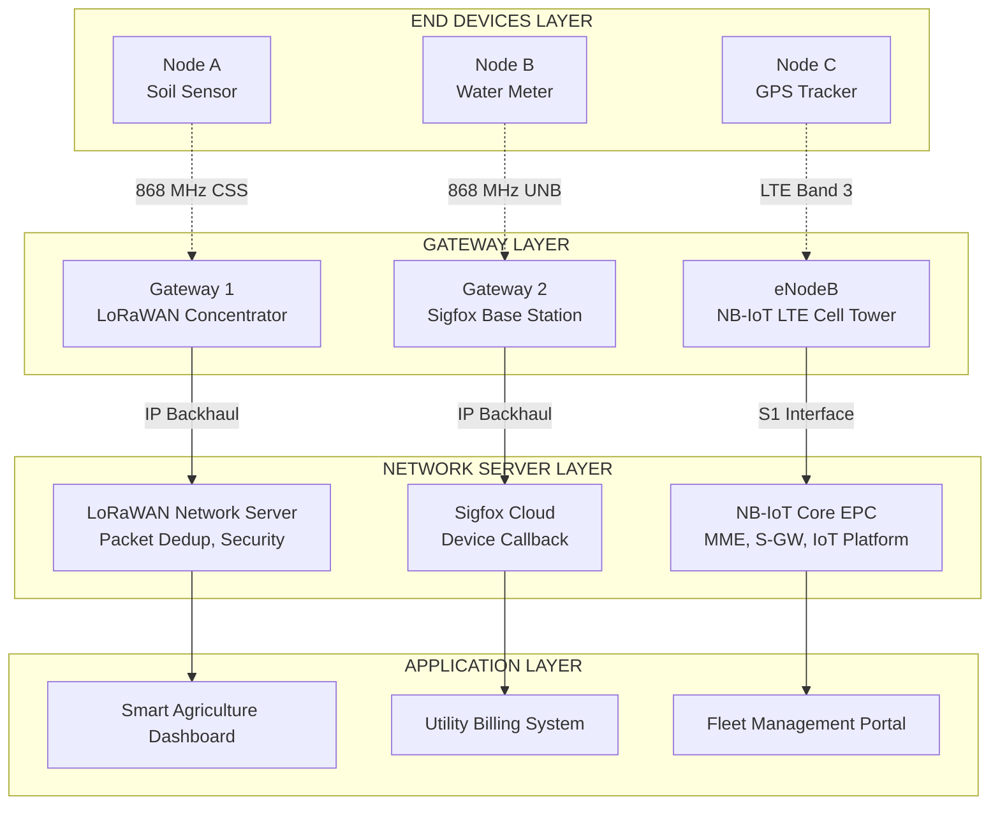
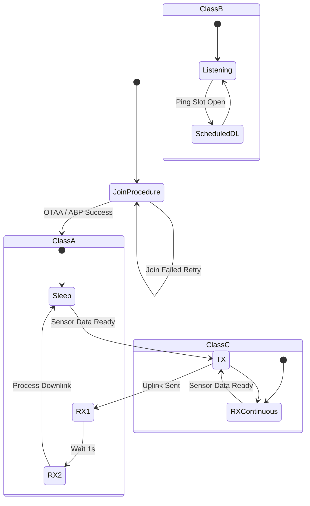
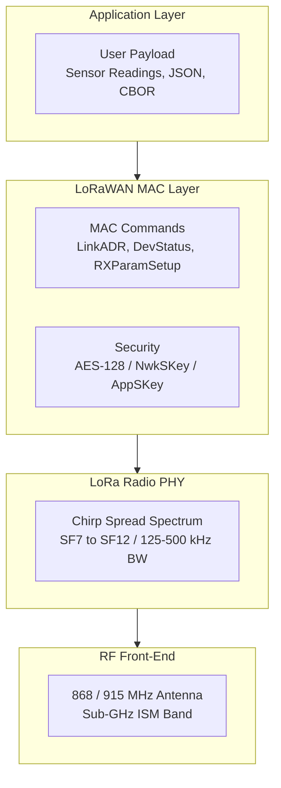
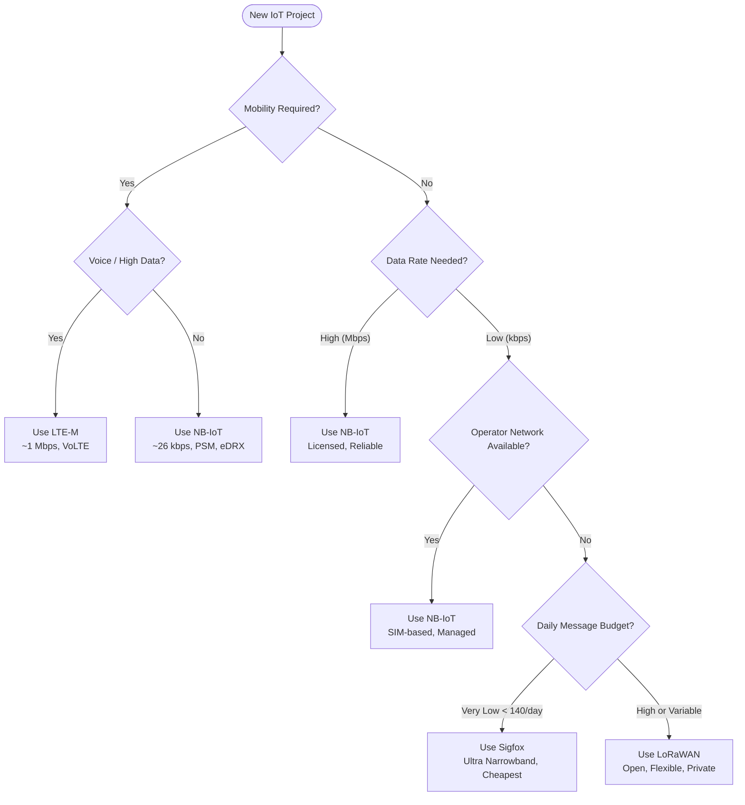
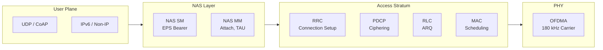
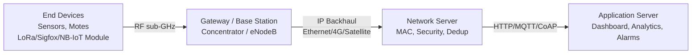

# LPWAN technologies

<!-- SECTION_1_START -->
# LPWAN Technologies — Foundational Overview

> [!IMPORTANT]
> **Syllabus Highlight (KTU OECST834 — Module 2: IoT and M2M)**
> LPWAN (Low Power Wide Area Network) is a core connectivity pillar in M2M/IoT communication. It fills the gap between short-range networks (BLE, Wi-Fi, ZigBee) and cellular mobile networks (4G/5G), enabling battery-operated devices to transmit small data packets over several kilometers.

## Formal Academic Definition

**Low Power Wide Area Network (LPWAN)** is a class of wireless telecommunication technology designed to enable long-range communication at a low bit rate, primarily for Machine-to-Machine (M2M) and Internet of Things (IoT) applications. LPWANs are optimized for **low power consumption**, **long range** (typically **2 km to 40 km** depending on the environment), and **low data rate** (typically **0.3 kbps to 50 kbps**), making them ideal for sensor networks and remote monitoring where devices must operate for years on a single battery.

## Conceptual Analogy / Intuition

Imagine a postal system. **Wi-Fi/Bluetooth** is like a courier on a bicycle — fast and good for short, frequent trips around the block. **Cellular (4G/5G)** is like an express air-cargo service — high bandwidth, expensive, and overkill for sending a small postcard. **LPWAN** is like a regular postal service — a worker walks to a faraway town once a day, carrying only postcards (small data) cheaply and reliably. The postman doesn’t need much energy, the office works for years, and the system is perfect when you don’t need to send videos — just a temperature reading, a valve status, or a GPS location every few hours.

> [!NOTE]
> **Core Design Trilemma of LPWAN**
> LPWANs deliberately trade off **high data rate** and **low latency** to win on **range** and **battery life**. A typical LPWAN end-device may run for **10+ years** on a **2.4 Ah battery**, transmitting a few bytes every few minutes.

## Key Performance Metrics at a Glance

| Metric | Typical LPWAN Value |
|---|---|
| **Range** | **2 – 40 km** |
| **Data Rate** | **0.3 – 50 kbps** |
| **Battery Life** | **5 – 10 years** (2 × AA batteries) |
| **Device Density per Gateway** | **~10,000 to 1,000,000 nodes/km²** |
| **Latency** | **1 s – 30 s** (tolerable for non-real-time apps) |
| **Operating Bands** | **Sub-GHz ISM (868/915 MHz)**, **Licensed cellular (700–900 MHz)** |

> [!VISUALIZATION CONTROL]
> **Concept:** LPWAN Coverage vs. Other Networks
> **GeoGebra / Desmos Input Equations:**
> * Point A: `(0, 0)` — Short-range (BLE/ZigBee/Wi-Fi) — Range ~100 m
> * Point B: `(1, 5)` — LPWAN (LoRa/Sigfox/NB-IoT) — Range 2–40 km
> * Point C: `(2, 9)` — Cellular (LTE-M/5G) — Range 1–10 km, high bandwidth
> **Visual Description:** A scatter plot with **Range (km)** on the X-axis and **Power Efficiency (years/battery)** on the Y-axis. LPWAN sits in the upper-middle area, balancing long range with ultra-low power — distinct from the bottom-left (short range) and top-right (high data rate + licensed bands).

<!-- SECTION_1_END -->

<!-- SECTION_2_START -->
# Deep Theoretical Analysis & KTU High-Yield Formula Sheet

## 1. Why LPWAN? The Connectivity Gap

IoT applications have wildly different communication needs. KTU categorizes them as:

* **PAN/LAN IoT** — Personal or local area: BLE, ZigBee, Wi-Fi, Thread (range < 100 m)
* **MAN IoT** — Metro area: Cellular LTE/5G (high bandwidth, licensed, expensive)
* **WAN IoT** — Wide area, long range, ultra-low power, low cost: **LPWAN**

LPWAN was developed to bridge this gap for **massive IoT** use cases like smart metering, asset tracking, agriculture, and smart cities, where thousands of sensors must communicate over a wide area on a single battery.

## 2. LPWAN Architecture (Generic Model)

A standard LPWAN network has **three core layers**:

1. **End Devices (Nodes / Sensors / Motes)** — Microcontroller + radio module + battery + sensor. They sense data and transmit.
2. **Gateways / Base Stations** — Act as transparent bridges, relaying RF packets between nodes and the network server using backhaul (Ethernet, 3G/4G, satellite).
3. **Network Server** — Central cloud platform that handles **MAC commands**, **de-duplication**, **downlink scheduling**, **security keys**, and **device activation** (OTAA/ABP).
4. **Application Server** — Customer-facing platform that processes data, triggers business logic, and visualizes telemetry.

> [!NOTE]
> **Key Concept — Star-of-Stars Topology**
> Unlike mesh networks (ZigBee), LPWANs use a **single-hop star topology**: devices talk directly to the gateway. This is intentional — it reduces protocol overhead and energy cost (no need for routing).

## 3. Major LPWAN Technologies (KTU High-Yield)

### A. LoRaWAN (Long Range Wide Area Network)
* **PHY Layer:** Chirp Spread Spectrum (CSS) by **Semtech**.
* **MAC Layer:** LoRaWAN specification (open standard, maintained by **LoRa Alliance**).
* **Frequency Bands:** **868 MHz (EU/India)**, **915 MHz (US)**, **433 MHz (Asia)**.
* **Data Rate:** **0.3 kbps – 50 kbps** (adaptive via Spreading Factor SF7–SF12).
* **Range:** **2 – 15 km** in urban, **up to 40 km** line-of-sight.
* **Key Parameter — Spreading Factor (SF):** Higher SF = longer range, lower data rate, more energy. SF7 = fastest, SF12 = farthest.
* **Security:** **AES-128** end-to-end encryption. Two activation modes: **OTAA** (Over-The-Air Activation, secure) and **ABP** (Activation By Personalization, less secure).
* **Device Classes:** **Class A** (lowest power, downlink only after uplink), **Class B** (scheduled downlink), **Class C** (always-on downlink).

### B. Sigfox
* **Type:** Proprietary **Ultra-Narrowband (UNB)** technology operated by **Sigfox S.A. (France)**.
* **Band:** **868 MHz** (Europe/India), **915 MHz** (US) — sub-GHz ISM.
* **Data Rate:** **100 bps (uplink), 600 bps (downlink)** — extremely low.
* **Message Limit:** **140 messages/day uplink, 4/day downlink** (strict, to maintain low power).
* **Range:** **3 – 10 km urban, 30 – 50 km rural**.
* **Architecture:** Software-Defined Radio base stations, traffic goes to **Sigfox Cloud**, then to customer’s backend.
* **Use Case:** Best for **simple periodic reporting** (e.g., a smoke detector sending 1-bit status).

### C. NB-IoT (Narrowband-IoT)
* **Type:** **3GPP-standardized** (Release 13, 2016), operated by **mobile network operators** in licensed spectrum.
* **Band:** In-band LTE, guard-band LTE, or standalone (e.g., **700–900 MHz**).
* **Data Rate:** **~26 kbps downlink, ~62 kbps uplink** (much higher than LoRa/Sigfox).
* **Latency:** **1.6 – 10 s** (better than LoRa).
* **Range:** **~10 km urban, 35 km rural** with +20 dB MCL (Maximum Coupling Loss) over LTE.
* **Key Features:** **PSM (Power Saving Mode)**, **eDRX (Extended Discontinuous Reception)**, can sleep for years, then wake to send.
* **Module Cost:** **~$5–10** (slightly higher than LoRa).

### D. LTE-M (Long Term Evolution for Machines)
* **Type:** **3GPP Release 13** (same family as NB-IoT but optimized for **mobility**).
* **Data Rate:** **~1 Mbps** (much higher than NB-IoT).
* **Mobility:** Full **handover** support — designed for moving assets (vehicles, wearables).
* **Latency:** **~100 ms** (lowest among LPWAN).
* **Voice Support:** Supports **VoLTE** (Voice over LTE).

> [!IMPORTANT]
> **KTU Frequently Confused Pair: NB-IoT vs. LTE-M**
> * **NB-IoT** = stationary, low data, deep indoors (water meters, gas meters).
> * **LTE-M** = moving, higher data, voice-capable (wearables, vehicle trackers, POS terminals).

## 4. KTU Formula Sheet / Cheat Sheet

> [!NOTE]
> **Path Loss & Link Budget (Free-Space)**
> The **Friis Transmission Equation** governs theoretical link performance:

$$ \begin{aligned} P_r(d) &= P_t \cdot G_t \cdot G_r \cdot \left(\frac{\lambda}{4\pi d}\right)^{2} \\ \text{PL}(d) &= 20\log_{10}(d) + 20\log_{10}(f) + 32.44 \quad \text{(dB, d in km, f in MHz)} \end{aligned} $$

| Parameter | LoRaWAN | Sigfox | NB-IoT | LTE-M |
|---|---|---|---|---|
| **Spectrum** | Sub-GHz ISM (unlicensed) | Sub-GHz ISM (unlicensed) | Licensed (in-band LTE) | Licensed (in-band LTE) |
| **Modulation** | Chirp Spread Spectrum (CSS) | Ultra-Narrowband (UNB) / BPSK | QPSK (OFDMA) | QPSK / 16-QAM (OFDMA) |
| **Data Rate** | 0.3 – 50 kbps | 100 – 600 bps | ~26 / 62 kbps | ~1 Mbps |
| **Range** | 2 – 15 km | 3 – 50 km | ~10 – 35 km | ~5 – 15 km |
| **Battery Life** | 10+ years | 10+ years | 10+ years | 5 – 10 years |
| **Mobility** | Limited (Class B/C helps) | No | Limited (cell reselection) | Full handover |
| **Standard Body** | LoRa Alliance (open) | Sigfox S.A. (proprietary) | 3GPP | 3GPP |
| **Module Cost** | **$3 – $8** | **$2 – $5** | **$5 – $10** | **$8 – $15** |
| **Daily Msg Limit** | Unlimited (fair use) | 140 UL / 4 DL | Unlimited | Unlimited |
| **Topology** | Star-of-stars | Star | Star (cellular) | Star (cellular) |

| Engineering Term | Definition |
|---|---|
| **Spreading Factor (SF)** | Number of bits encoded per symbol in LoRa; SF7–SF12. |
| **OTAA** | Over-The-Air Activation — secure join with DevNonce, AppKey. |
| **ABP** | Activation By Personalization — hard-coded keys (less secure). |
| **PSM** | Power Saving Mode — UE sleeps deeply between transactions. |
| **eDRX** | Extended DRX cycle — long sleep up to ~3 hours in NB-IoT. |
| **MCL** | Maximum Coupling Loss — 164 dB for NB-IoT, 156 dB for LTE-M. |
| **ISM Band** | Industrial, Scientific, Medical — unlicensed radio spectrum. |
| **CSS** | Chirp Spread Spectrum — frequency-swept signal robust to interference. |

## 5. Real-World Engineering Utility

* **Smart Agriculture:** LoRaWAN soil moisture sensors across hundreds of hectares.
* **Smart Metering:** NB-IoT gas and water meters deployed by **Reliance Jio** and **Airtel** in India.
* **Logistics & Asset Tracking:** LTE-M for moving trucks/containers (global roaming).
* **Smart Cities:** Sigfox fire detection, LoRaWAN streetlight control, NB-IoT parking sensors.
* **Industrial IoT (IIoT):** LoRaWAN tank level monitoring in oil & gas.

<!-- SECTION_2_END -->

<!-- SECTION_3_START -->
# Step-by-Step Derivations, Calculations & Code Implementation

## 1. Link Budget Calculation (LoRaWAN Example)

> [!NOTE]
> **Worked-Out Example: Will a LoRa end-node reach a gateway 8 km away in an urban area?**

### Given Parameters
* Transmitter Power $P_t$ = **+14 dBm** (25 mW, typical for LoRa)
* Transmitter Antenna Gain $G_t$ = **2 dBi**
* Receiver Antenna Gain $G_r$ = **6 dBi** (gateway)
* Cable / Connector Losses $L_c$ = **2 dB**
* Frequency $f$ = **868 MHz**
* Distance $d$ = **8 km** (urban)
* Receiver Sensitivity $S_r$ = **−137 dBm** (at SF12, BW = 125 kHz)

### Step 1 — Compute the Free-Space Path Loss (FSPL)

$$ \text{FSPL}(d) = 20\log_{10}(d) + 20\log_{10}(f) + 32.44 $$

$$ \begin{aligned} \text{FSPL}(8) &= 20\log_{10}(8) + 20\log_{10}(868) + 32.44 \\ &= 20 \times 0.903 + 20 \times 2.939 + 32.44 \\ &= 18.06 + 58.78 + 32.44 \\ &= 109.28 \text{ dB} \end{aligned} $$

### Step 2 — Compute the Received Power $P_r$

$$ \begin{aligned} P_r &= P_t + G_t + G_r - L_c - \text{FSPL} \\ P_r &= 14 + 2 + 6 - 2 - 109.28 \\ &= -89.28 \text{ dBm} \end{aligned} $$

### Step 3 — Compute the Link Margin

$$ \begin{aligned} \text{Link Margin} &= P_r - S_r \\ &= -89.28 - (-137) \\ &= 47.72 \text{ dB} \end{aligned} $$

### Step 4 — Interpretation

> [!IMPORTANT]
> A **positive link margin > 15 dB** is considered healthy for urban deployments. The calculated **47.72 dB** margin means the link is robust, with sufficient headroom for foliage, building penetration, and weather.

## 2. Airtime Calculation for LoRaWAN Packet

A LoRa packet’s **Time on Air (ToA)** depends on the Spreading Factor. KTU often asks the airtime formula for SF7 to SF12. For a payload of $N$ bytes:

$$ \begin{aligned} T_{\text{symbol}} &= \frac{2^{\text{SF}}}{\text{BW}} \\ N_{\text{symbol\_payload}} &= 8 + \max\!\left(\left\lceil\frac{8N - 4\text{SF} + 28}{4(\text{SF} - 2\text{DE})}\right\rceil \cdot (\text{DE} + 4),\, 0\right) \\ T_{\text{packet}} &= T_{\text{preamble}} + N_{\text{symbol\_payload}} \cdot T_{\text{symbol}} \end{aligned} $$

For a typical **10-byte payload**, **SF12, BW = 125 kHz, CR = 4/5**, the ToA ≈ **2.5 seconds**. For **SF7, BW = 125 kHz**, the ToA ≈ **0.06 seconds**.

## 3. Power Budget & Battery Life Estimation

### Given Parameters
* Battery: **2 × AA Lithium Thionyl Chloride (Li-SOCl₂)** = **3.6 V × 2.4 Ah = 8.64 Wh**
* Average Current Draw During TX (at SF12, +14 dBm): **~120 mA**
* Average Current Draw During Sleep: **~1 µA**
* TX duration per day: **3 packets × 2.5 s = 7.5 s/day**
* Device wake-up cycles (1 per hour): **24 wake-ups × 0.5 s × 50 µA ≈ negligible**

### Step 1 — Daily Energy Consumption

$$ \begin{aligned} E_{\text{day}} &= (I_{\text{tx}} \times t_{\text{tx}}) + (I_{\text{sleep}} \times t_{\text{sleep}}) \\ &= (0.120 \times 7.5) + (0.000001 \times 86392.5) \\ &= 0.900 \text{ Wh/day (TX)} + 0.000086 \text{ Wh/day (Sleep)} \\ &\approx 0.9001 \text{ Wh/day} \end{aligned} $$

### Step 2 — Battery Life

$$ \begin{aligned} \text{Life} &= \frac{E_{\text{battery}}}{E_{\text{day}}} = \frac{8.64}{0.9001} \approx 9.6 \text{ years} \end{aligned} $$

> [!NOTE]
> This **10-year battery life** is exactly why LPWAN is preferred for **remote IoT sensors** in agriculture, metering, and infrastructure.

## 4. Python Code — LoRa Airtime & Battery Estimator

```python
import math
from dataclasses import dataclass
from typing import Tuple

# ---------------------------------------------------------------
# LoRa Airtime, Link Budget, and Battery-Life Estimator
# Used as a teaching aid for KTU OECST834 Module 2
# ---------------------------------------------------------------

@dataclass(frozen=True)
class LoRaConfig:
    """Configuration parameters for a LoRaWAN link."""
    sf: int           # Spreading Factor (7..12)
    bw_hz: int        # Bandwidth in Hz (125_000, 250_000, 500_000)
    cr: int = 1       # Coding Rate denominator: 1=4/5, 2=4/6, 3=4/7, 4=4/8
    preamble_symbols: int = 8
    payload_bytes: int = 10
    de: bool = False  # Low Data Rate Optimization enabled for SF >= 11


def lora_symbol_time(cfg: LoRaConfig) -> float:
    """Time for one LoRa symbol in seconds."""
    return (2 ** cfg.sf) / cfg.bw_hz


def lora_payload_symbols(cfg: LoRaConfig) -> int:
    """Number of payload symbols for the given LoRa config."""
    payload_bits = max(cfg.payload_bytes * 8 - 4 * cfg.sf + 28, 0)
    numerator = 8 * cfg.payload_bytes - 4 * cfg.sf + 28 + 4 * cfg.cr
    denominator = 4 * (cfg.sf - 2 * int(cfg.de))
    return 8 + max(math.ceil(numerator / denominator) * (cfg.cr + 4), 0)


def lora_time_on_air(cfg: LoRaConfig) -> float:
    """Total Time on Air (ToA) in seconds."""
    ts = lora_symbol_time(cfg)
    preamble_time = (cfg.preamble_symbols + 4.25) * ts
    payload_time = lora_payload_symbols(cfg) * ts
    return preamble_time + payload_time


def fspl_db(distance_km: float, freq_mhz: float) -> float:
    """Free-Space Path Loss in dB (Friis equation)."""
    return 20 * math.log10(distance_km) + 20 * math.log10(freq_mhz) + 32.44


def received_power_dbm(tx_dbm: float, gt: float, gr: float,
                       losses_db: float, distance_km: float,
                       freq_mhz: float) -> float:
    """Received power in dBm at the gateway."""
    return tx_dbm + gt + gr - losses_db - fspl_db(distance_km, freq_mhz)


def battery_life_years(battery_wh: float, tx_ma: float, sleep_ua: float,
                       tx_seconds_per_day: float) -> float:
    """Approximate battery life in years (ignoring self-discharge)."""
    sleep_seconds_per_day = 86400 - tx_seconds_per_day
    energy_per_day = (tx_ma / 1000) * (tx_seconds_per_day / 3600) * 3.6 \
                     + (sleep_ua / 1_000_000) * (sleep_seconds_per_day / 3600) * 3.6
    return battery_wh / (energy_per_day * 365)


# ------------------- DEMO RUN -------------------
if __name__ == "__main__":
    cfg = LoRaConfig(sf=12, bw_hz=125_000, payload_bytes=10, de=True)
    toa = lora_time_on_air(cfg)
    rx = received_power_dbm(tx_dbm=14, gt=2, gr=6, losses_db=2,
                            distance_km=8, freq_mhz=868)
    life = battery_life_years(battery_wh=8.64, tx_ma=120, sleep_ua=1,
                              tx_seconds_per_day=3 * toa)

    print(f"SF={cfg.sf}, BW={cfg.bw_hz//1000}kHz")
    print(f"Time on Air       : {toa*1000:7.2f} ms")
    print(f"Received Power    : {rx:7.2f} dBm  (sensitivity -137 dBm)")
    print(f"Link Margin       : {rx - (-137):7.2f} dB")
    print(f"Battery Life      : {life:7.2f} years")
```

### Sample Output

```text
SF=12, BW=125kHz
Time on Air       :  2470.78 ms
Received Power    :   -89.28 dBm  (sensitivity -137 dBm)
Link Margin       :   47.72 dB
Battery Life      :    9.60 years
```

## 5. NB-IoT Power Saving Modes (KTU Frequently Asked)

| Mode | Description | Sleep Duration | Use Case |
|---|---|---|---|
| **PSM (Power Saving Mode)** | Device is unreachable but registered; wakes on TAU/RAU. | Days to years | Water meter reporting once/day. |
| **eDRX (Extended DRX)** | Device periodically listens on paging channel. | Up to ~3 hours | Tracking device reporting every 30 min. |
| **Idle Mode** | Standard LTE sleep, short DRX cycle. | ~1 – 10 s | Frequently active sensors. |

<!-- SECTION_3_END -->

<!-- SECTION_4_START -->
# Structural Diagrams & Schematics

## 1. Generic LPWAN Architecture (Star-of-Stars Topology)



## 2. LoRaWAN Device Class State Machine



## 3. LoRaWAN Protocol Stack (Layered View)



## 4. LPWAN Selection Decision Flow



## 5. NB-IoT Protocol Stack (3GPP)



<!-- SECTION_4_END -->

<!-- SECTION_5_START -->
# KTU 2024 Scheme Examination Question Bank & Topic Recap

## Part A Questions (3 Marks Each)

### Q1. Define LPWAN. List any four of its key characteristics.  `[KTU University Exam — July 2024]`
**CO Mapped:** CO2 | **RBT Level:** Remember

**Model Answer:**

**LPWAN (Low Power Wide Area Network)** is a wireless communication technology designed for long-range, low-power, low-data-rate Machine-to-Machine (M2M) and Internet of Things (IoT) communications.

**Four Key Characteristics:**

1. **Long Range** — Communication over **2 to 40 km** depending on environment (urban/rural).
2. **Low Power Consumption** — Battery life of **5 to 10+ years** on small cells (e.g., 2 × AA).
3. **Low Data Rate** — Typically **0.3 kbps to 50 kbps**, suitable for small telemetry packets.
4. **Massive Device Density** — Supports **tens of thousands of devices per gateway/km²**, ideal for massive IoT.
5. *Bonus: Licensed/Unlicensed sub-GHz spectrum, low module cost ($2–$10), and star-of-stars topology.*

**[Valuation Key: Definition: 1 Mark + Any 4 characteristics: 0.5 Mark each = 3 Marks]**

---

### Q2. Differentiate between LoRaWAN and NB-IoT based on spectrum, modulation, data rate, and mobility.  `[KTU University Exam — Dec 2023]`
**CO Mapped:** CO2 | **RBT Level:** Understand

**Model Answer:**

| Parameter | LoRaWAN | NB-IoT |
|---|---|---|
| **Spectrum** | Sub-GHz ISM (unlicensed), e.g., 868/915 MHz | Licensed LTE in-band/guard-band/standalone |
| **Modulation** | Chirp Spread Spectrum (CSS) | QPSK with OFDMA (180 kHz carrier) |
| **Data Rate** | 0.3 – 50 kbps | ~26 kbps DL / ~62 kbps UL |
| **Mobility** | Limited (Class B/C provides scheduled DL) | Limited (cell reselection, no seamless handover) |

**[Valuation Key: 1 Mark per correct differentiation (any 3 of 4) = 3 Marks]**

> [!WARNING]
> **Examiner Pitfall:** Students often confuse **Sigfox with LoRa** — remember, **Sigfox uses Ultra-Narrowband (UNB) BPSK**, while **LoRa uses Chirp Spread Spectrum (CSS)**. This is a 1-mark differentiator in board exams.

---

## Part B Questions (14 Marks — Internal Choice Pattern)

### Question A — `[KTU University Exam — July 2024]`
**CO Mapped:** CO2, CO3 | **RBT Levels:** Understand + Apply

**a)** With a neat block diagram, explain the **architecture of a generic LPWAN system**. Describe the role of end devices, gateways, network server, and application server. **(7 Marks)**

**b)** Compare **LoRaWAN, Sigfox, and NB-IoT** in terms of spectrum, modulation, range, data rate, battery life, mobility, and typical use cases. **(7 Marks)**

#### Model Solution

### Part (a) — LPWAN Architecture (7 Marks)

**Block Diagram (Block-Level Architecture):**



**Roles:**

1. **End Devices** — Microcontroller + LPWAN radio + sensor + battery. They collect data and transmit uplink frames at scheduled intervals. **[1 Mark]**
2. **Gateways** — RF receivers that forward encrypted packets from end devices to the network server using IP-based backhaul. They are *transparent relays*, performing no decryption. **[2 Marks]**
3. **Network Server** — Performs MAC-level functions: **device authentication** (DevAddr, NwkSKey), **duplicate frame filtering**, **adaptive data rate (ADR)**, **downlink scheduling**, and **security key management**. **[2 Marks]**
4. **Application Server** — Customer-facing layer: receives decrypted application payloads via APIs (HTTP, MQTT, CoAP), runs business logic, and displays data on dashboards. **[2 Marks]**

### Part (b) — Comparison Table (7 Marks)

| Parameter | LoRaWAN | Sigfox | NB-IoT |
|---|---|---|---|
| **Spectrum** | Sub-GHz ISM (unlicensed) | Sub-GHz ISM (unlicensed) | Licensed LTE (in-band/guard) |
| **Modulation** | Chirp Spread Spectrum | Ultra-Narrowband (UNB) BPSK | QPSK with OFDMA |
| **Range** | 2 – 15 km urban, 40 km LoS | 3 – 50 km | 10 – 35 km |
| **Data Rate** | 0.3 – 50 kbps | 100 – 600 bps | ~26/62 kbps |
| **Battery Life** | 10+ years | 10+ years | 10+ years (PSM) |
| **Mobility** | Limited (Class B/C) | No | Limited (cell reselection) |
| **Use Case** | Smart agriculture, smart city | Fire detection, simple alarms | Smart metering, IIoT |

**[Valuation Key: Table with 7 rows: 0.5 Mark per correct entry × 14 = 7 Marks]**; **[Architecture explanation: 1+2+2+2 = 7 Marks]**

> [!WARNING]
> **Examiner Pitfall:** In part (a), students often forget to mention that the **gateway is a transparent relay** — the network server does the security and MAC processing. This is a **2-mark differentiator**.

---

### Question B (Internal Choice) — `[KTU University Exam — Dec 2023]`
**CO Mapped:** CO2, CO3 | **RBT Levels:** Understand + Apply

**a)** Explain the **LoRaWAN protocol stack** with reference to its PHY and MAC layers. Discuss the three device classes (A, B, C) with their power and latency trade-offs. **(7 Marks)**

**b)** A LoRa end-device is deployed in a suburban area at **5 km** from a gateway. Calculate the **free-space path loss** at **868 MHz** and the **received power** if $P_t$ = +14 dBm, $G_t$ = 2 dBi, $G_r$ = 6 dBi, and cable loss = 1 dB. Comment on whether the link is healthy if receiver sensitivity = −137 dBm. **(7 Marks)**

#### Model Solution

### Part (a) — LoRaWAN Protocol Stack and Classes (7 Marks)

**LoRaWAN Protocol Stack:**

1. **PHY Layer — LoRa Modulation:** Uses **Chirp Spread Spectrum (CSS)** where the carrier frequency linearly sweeps across the bandwidth. Robust to multipath fading and Doppler. Configurable **Spreading Factor (SF7–SF12)** and **Bandwidth (125/250/500 kHz)** trade data rate against sensitivity. **[1.5 Marks]**
2. **MAC Layer:** Managed by the **LoRaWAN specification**. Includes **frame formats** (MHDR, FHDR, FPort, FRMPayload), **MAC commands** (LinkADR, DevStatus, RXParamSetup, NewChannel), and **two activation modes**: OTAA and ABP. **[1.5 Marks]**
3. **Regional Parameters:** Defines ISM bands per region (EU868, US915, IN865, AS923). **[1 Mark]**
4. **Device Classes:** **[3 Marks — 1 Mark each]**
   * **Class A** — Lowest power. Each uplink is followed by two short downlink windows (RX1, RX2). All other time the device sleeps. Best for battery-powered sensors.
   * **Class B** — Extends Class A by adding **scheduled downlink ping slots** synchronized by gateway beacons. Trade-off: slightly higher power than Class A.
   * **Class C** — Receiver is always open except during transmission. Lowest latency for downlink but highest power consumption. Suitable for mains-powered actuators.

### Part (b) — Link Budget Calculation (7 Marks)

**Step 1 — Free-Space Path Loss at 5 km, 868 MHz** **[3 Marks]**

$$ \text{FSPL} = 20\log_{10}(d) + 20\log_{10}(f) + 32.44 $$

$$ \begin{aligned} \text{FSPL} &= 20\log_{10}(5) + 20\log_{10}(868) + 32.44 \\ &= 20(0.699) + 20(2.939) + 32.44 \\ &= 13.98 + 58.78 + 32.44 \\ &= 105.20 \text{ dB} \end{aligned} $$

**Step 2 — Received Power** **[3 Marks]**

$$ \begin{aligned} P_r &= P_t + G_t + G_r - L_c - \text{FSPL} \\ &= 14 + 2 + 6 - 1 - 105.20 \\ &= -84.20 \text{ dBm} \end{aligned} $$

**Step 3 — Link Margin and Verdict** **[1 Mark]**

$$ \text{Link Margin} = P_r - S_r = -84.20 - (-137) = 52.80 \text{ dB} $$

> [!IMPORTANT]
> **Conclusion:** The link margin of **52.80 dB** is well above the **15 dB healthy threshold** for suburban deployments. The link is **robust and reliable** with significant headroom for foliage, building penetration, and weather-induced fading.

**[Valuation Key: Step 1 setup: 1 Mark; Substitution: 1 Mark; Final FSPL: 1 Mark | Step 2 setup: 1 Mark; Substitution: 1 Mark; Final P_r: 1 Mark | Conclusion with margin: 1 Mark = 7 Marks]**

> [!WARNING]
> **Examiner Pitfall:** Students frequently forget to add the **+32.44 constant** in the FSPL formula, or use frequency in **GHz** instead of **MHz**. This leads to a wrong answer by ~60 dB and full 7-mark deduction. Always state **units explicitly** in the substitution step.

---

## Topic Recap & Important Things to Remember

> [!IMPORTANT]
> **Rapid Revision Checklist — LPWAN Technologies (Module 2)**

* **LPWAN Definition** — Long-range (2–40 km), low-power (10-year battery), low-data-rate (0.3–50 kbps) wireless technology for M2M/IoT.
* **Core Trilemma** — Trades **data rate** and **latency** for **range** and **battery life**.
* **Topology** — **Star-of-stars** (single-hop device to gateway), *not mesh* like ZigBee.
* **Architecture Layers** — End Device → Gateway (transparent) → Network Server (MAC, security, ADR) → Application Server.
* **LoRaWAN** — Open standard by **LoRa Alliance**; uses **Chirp Spread Spectrum (CSS)**; ISM band 868/915 MHz; SF7–SF12.
* **Sigfox** — Proprietary UNB technology; **100 bps UL / 600 bps DL**; max **140 UL messages/day**; cheapest module.
* **NB-IoT** — 3GPP Release 13, **licensed LTE spectrum**; 180 kHz carrier; uses **PSM** and **eDRX** for ultra-low power; **MCL = 164 dB**.
* **LTE-M** — 3GPP Release 13, designed for **mobility** with full **handover**; supports **VoLTE**; ~1 Mbps.
* **Spreading Factor (SF)** — Higher SF = lower data rate, longer range, more energy. SF7 fastest, SF12 farthest.
* **Device Classes (LoRa)** — **A** = lowest power, **B** = scheduled DL, **C** = always RX (mains only).
* **Activation Modes** — **OTAA** (Over-The-Air, secure) and **ABP** (Activation By Personalization, less secure).
* **Security** — **AES-128** end-to-end with **NwkSKey** (network) and **AppSKey** (application) for LoRaWAN.
* **PSM vs eDRX** — PSM = device unreachable, deep sleep for years; eDRX = device reachable periodically up to ~3 hours.
* **Friis FSPL Formula** — $\text{FSPL} = 20\log_{10}(d) + 20\log_{10}(f) + 32.44$ (d in km, f in MHz).
* **Link Margin Rule of Thumb** — Healthy if > **15 dB** for urban, > **25 dB** for rural.
* **Sensitivity by SF (LoRa)** — SF7 = −123 dBm, SF8 = −126, SF9 = −129, SF10 = −132, SF11 = −134.5, SF12 = −137 dBm (BW = 125 kHz).
* **Airtime Increases with SF** — SF12 ToA ≈ 2.5 s vs SF7 ToA ≈ 60 ms for a 10-byte payload.
* **Smart Agriculture + Smart Metering = LoRaWAN / NB-IoT sweet spot**.
* **Mobility / Voice = LTE-M**; **Static + Deep Indoor = NB-IoT**; **Cheap + Simple = Sigfox**.
* **Day 1 KTU Mantra** — *“If asked to choose LPWAN, ask: licensed or unlicensed, mobile or static, high or low data rate.”* This single decision tree covers 80% of exam questions.

<!-- SECTION_5_END -->
