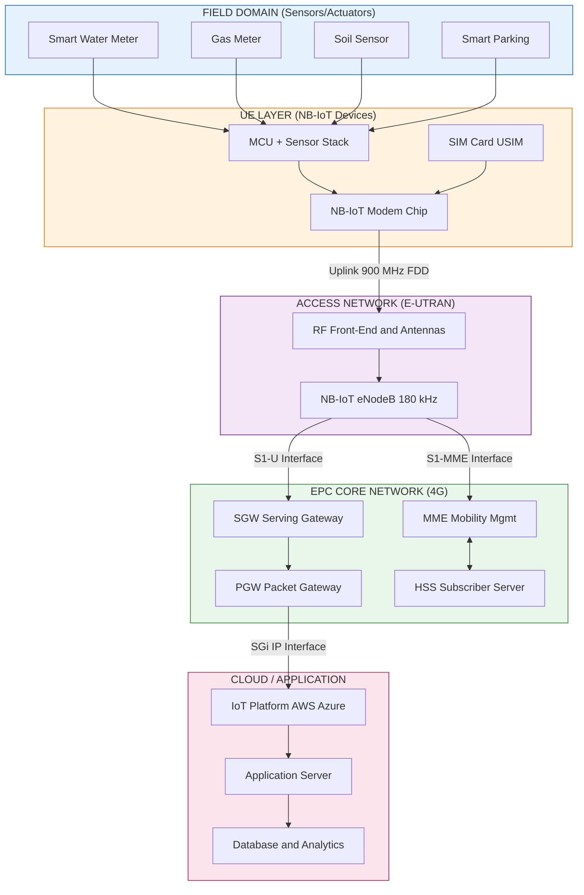
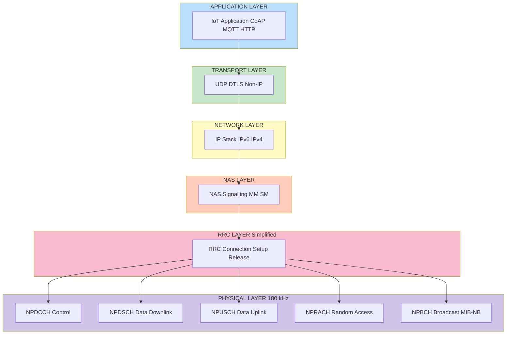
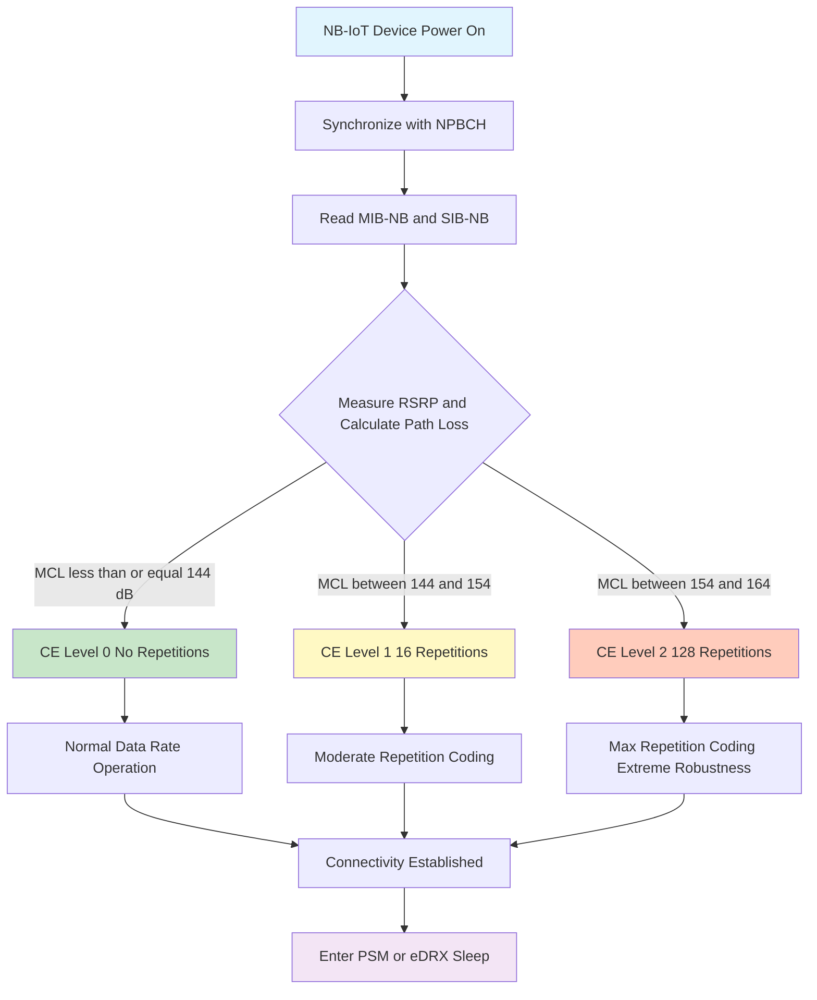
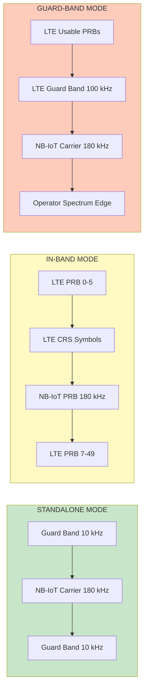

# NB-IoT

<!-- SECTION_1_START -->
# NB-IoT (Narrowband Internet of Things)

## 1.1 Formal Academic Definition

**Narrowband Internet of Things (NB-IoT)** is a Low Power Wide Area Network (LPWAN) radio technology standardized by the **3rd Generation Partnership Project (3GPP)** in **Release 13 (LTE Advanced Pro)** and further enhanced in subsequent releases. It is a cellular connectivity technology specifically optimized for **massive Machine-Type Communications (mMTC)**, enabling low-cost, low-power, and deep-penetration communication for a massive number of stationary IoT devices.

> [!IMPORTANT]
> **KTU Syllabus Highlight (OECST834 - Module 2):** NB-IoT is examined as a key cellular LPWAN technology under the "IoT and M2M" module. Students must focus on its architecture, physical layer numerology, coverage enhancement techniques, and power saving mechanisms.

Formally, NB-IoT is defined as a **radio access technology** that uses a **180 kHz** physical resource block (PRB) in the downlink and **180 kHz** channel bandwidth in the uplink, occupying only a single physical resource block of the LTE carrier.

> [!NOTE]
> **Core Standardization Bodies:** 3GPP (defines the radio and core network specifications) and GSMA (manages the device certification and connectivity).

## 1.2 Conceptual Analogy / Intuition

Imagine a **highway system**:
- **Traditional LTE** is like a **multi-lane superhighway** designed for fast cars (smartphones) that need to transfer large amounts of data quickly. It uses wide lanes (e.g., 20 MHz bandwidth).
- **NB-IoT** is like a **single, narrow, dedicated lane** built deep underground for tiny delivery carts (sensors). These carts carry small, infrequent parcels (a few bytes of data like temperature readings), but the lane is engineered to reach places the highway cannot — basements, underground parking lots, and remote rural fields.

The "narrowband" refers to the **narrow 180 kHz channel** (compared to LTE's up to 20 MHz). This narrowness is the key: it allows NB-IoT signals to penetrate walls and reach devices **20 dB deeper** than standard LTE.

> [!TIP]
> **Intuitive Takeaway:** NB-IoT sacrifices speed and mobility to gain **extreme coverage, ultra-low power consumption (10-year battery life), and massive device density (~50,000 devices per cell)**.

## 1.3 Key Physical Constants and Metrics

| Parameter | Value | Significance |
|-----------|-------|--------------|
| Channel Bandwidth | **180 kHz** | 1 LTE Physical Resource Block |
| Uplink Subcarrier Spacing | **15 kHz** / **3.75 kHz** | Two modes for flexibility |
| Maximum Coupling Loss (MCL) | **164 dB** | Deep indoor coverage |
| Target Battery Life | **10 years** | At 5 Wh battery capacity |
| Device Density | **~50,000 / cell** | Massive IoT support |
| Latency | **1.6 s to 10 s** | Tolerant of delay |

> [!VISUALIZATION CONTROL]
> **Concept:** NB-IoT Spectrum Allocation within an LTE Carrier
> **GeoGebra / Desmos Input Equations:**
> * `x1 = 0; x2 = 180` (Standalone: dedicated spectrum, e.g., 900 MHz)
> * `x3 = 10800; x4 = 10980` (In-band: inside LTE PRBs)
> * `x5 = 11000; x6 = 11180` (Guard-band: in LTE guard band, LTE BW = 20 MHz centered at ~10.5 MHz offset)
> **Visual Description:** A horizontal frequency axis. Three colored bars representing the 180 kHz NB-IoT carrier. Bar 1 (green) sits in its own isolated spectrum (standalone). Bar 2 (blue) sits inside the wider LTE block (in-band). Bar 3 (orange) sits right at the edge of the LTE block but outside the usable LTE PRBs (guard-band). Students should observe that the NB-IoT carrier is always exactly 180 kHz wide regardless of mode.

## 1.4 Standardization Lineage

$$
\text{3GPP Release 8 (LTE)} \rightarrow \text{Release 12 (Cat-0/MTC)} \rightarrow \text{Release 13 (NB-IoT Cat-NB1, 2016)}
$$

$$
\rightarrow \text{Release 14 (NB-IoT Cat-NB2, 2017)} \rightarrow \text{Release 15+} \text{ (5G mMTC integration)}
$$

> [!NOTE]
> NB-IoT is one of the **5G mMTC** (massive Machine Type Communication) standardized technologies, ensuring its long-term relevance in 5G networks alongside LTE-M (Long Term Evolution for Machines).
<!-- SECTION_1_END -->

<!-- SECTION_2_START -->
# 2. Deep Theoretical Analysis & KTU High-Yield Formula Sheet

## 2.1 NB-IoT Operational Architecture

NB-IoT is built upon the **simplified LTE architecture**. It reuses the **E-UTRAN (Evolved UMTS Terrestrial Radio Access Network)** and **EPC (Evolved Packet Core)** infrastructure with specific optimizations for low-power devices.

### 2.1.1 Network Architecture Block

The architecture consists of the following logical nodes:

1. **UE (User Equipment):** The NB-IoT sensor/actuator device (e.g., smart water meter).
2. **eNodeB (eNB) / NB-IoT Base Station:** The LTE base station enhanced to support NB-IoT radio interfaces. It handles radio resource management and connects to the core.
3. **EPC (Evolved Packet Core):** The 4G core network comprising:
   - **MME (Mobility Management Entity):** Manages device registration, authentication, and idle-mode mobility.
   - **SGW (Serving Gateway):** Routes user data packets.
   - **PGW (Packet Gateway):** Connects to external IP networks (e.g., IoT cloud platforms).
   - **HSS (Home Subscriber Server):** Stores subscription and device identity data.
4. **IoT Application Server / Cloud Platform:** The backend system where IoT data is processed (e.g., AWS IoT, Azure IoT Hub).

### 2.1.2 Protocol Stack Simplification

NB-IoT **drastically simplifies** the protocol stack to save power and cost:
- **Reduced bandwidth** (180 kHz only).
- **Half-duplex FDD (Frequency Division Duplexing):** The device cannot transmit and receive simultaneously. This eliminates the need for a costly **duplex filter**.
- **Single antenna** at the device.
- **Reduced peak data rate** (downlink ~26 kbps, uplink ~62 kbps for Cat-NB1).
- **No handover support** (Release 13, RRC connection re-establishment only). This is critical because NB-IoT devices are expected to be **stationary**.

## 2.2 Physical Layer Numerology

The physical layer is the heart of NB-IoT. Let us break it down systematically.

### 2.2.1 Downlink (eNB → UE)

- **Waveform:** OFDMA (Orthogonal Frequency Division Multiple Access)
- **Subcarrier Spacing:** **15 kHz** (same as LTE)
- **Number of Subcarriers:** **12 subcarriers** (12 × 15 kHz = 180 kHz)
- **Frame Structure:** One **10 ms radio frame** = 10 subframes = 20 slots
- **Downlink Channels:**
  * **NPBCH (Narrowband Physical Broadcast Channel):** Carries the **MIB-NB** (Master Information Block). Used for cell selection.
  * **NPDCCH (Narrowband Physical Downlink Control Channel):** Carries scheduling information, similar to LTE's PDCCH.
  * **NPDSCH (Narrowband Physical Downlink Shared Channel):** Carries actual user data and paging.
  * **NRS (Narrowband Reference Signal):** Used for channel estimation and demodulation.

### 2.2.2 Uplink (UE → eNB)

- **Waveform:** SC-FDMA (Single Carrier Frequency Division Multiple Access)
- **Subcarrier Spacing:** **Two options**:
  * **15 kHz mode:** 12 subcarriers, used for higher data rates and larger payloads.
  * **3.75 kHz mode:** 48 subcarriers, used for **extreme coverage** (more robust to interference and fading).
- **Uplink Channels:**
  * **NPUSCH (Narrowband Physical Uplink Shared Channel):** Carries user data and signaling. Supports two formats: Format 1 (data) and Format 2 (control signaling, similar to PUCCH).
  * **NPRACH (Narrowband Physical Random Access Channel):** Used for initial access and connection setup.

## 2.3 The Three Deployment Modes

NB-IoT can be deployed in **three distinct ways** within or alongside an LTE carrier:

| Mode | Location | Spectrum Reuse | Operator Use Case |
|------|----------|----------------|-------------------|
| **Standalone** | In dedicated spectrum (e.g., refarmed GSM band) | Replaces one GSM carrier (200 kHz) | Replaces legacy 2G/3G |
| **In-band** | Inside an LTE carrier, using one of LTE's PRBs | Reuses LTE spectrum | Operators with abundant LTE spectrum |
| **Guard-band** | In the unused guard band of an LTE carrier | Reuses LTE spectrum, no PRB impact | Operators maximizing spectrum efficiency |

> [!NOTE]
> **Key Design Constraint:** In **in-band** mode, the **Cell Reference Signals (CRS)** of LTE must be carefully avoided when mapping NB-IoT resources. This restricts the available subframes and resource elements. In **guard-band** mode, this constraint is relaxed, and more NB-IoT subframes are available.

## 2.4 Coverage Enhancement (CE)

NB-IoT is engineered to provide **deep indoor penetration**, supporting a Maximum Coupling Loss (MCL) of **164 dB** (compared to standard LTE's **144 dB**). This **20 dB improvement** is achieved through:

1. **Repetition Coding:** Every data transmission (NPDSCH, NPUSCH, NPDCCH, NPRACH) is repeated multiple times (up to **128 repetitions** in Cat-NB1, **2048 repetitions** in Cat-NB2). The receiver combines these repetitions to extract the signal, effectively adding **time diversity** and processing gain.
2. **Lower Code Rates:** Stronger channel coding (e.g., 1/3 turbo code with extensive repetition) trades data rate for robustness.
3. **Robust Modulation:** **BPSK** (Binary Phase Shift Keying) and **QPSK** (Quadrature PSK) are used; higher-order modulations like 16-QAM or 64-QAM are **not** used.

### 2.4.1 CE Levels

The network dynamically assigns each device a **Coverage Enhancement (CE) level** based on its measured path loss:

- **CE Level 0:** MCL ≤ **144 dB** (no repetitions, highest data rate)
- **CE Level 1:** 144 dB < MCL ≤ **154 dB** (moderate repetitions)
- **CE Level 2:** 154 dB < MCL ≤ **164 dB** (maximum repetitions, lowest data rate)

$$
\text{MCL} = P_{TX,\max} - (\text{Sensitivity} + \text{Noise Figure})
$$

> [!TIP]
> **Why does repetition work?** When a signal is deeply attenuated, noise dominates. By repeating the same symbol 128 times, the receiver effectively "averages out" the random noise, boosting the **Signal-to-Noise Ratio (SNR)** by up to **10 × log₁₀(128) ≈ 21 dB**.

## 2.5 Power Saving Mechanisms

The 10-year battery life is achieved through aggressive power saving:

1. **PSM (Power Saving Mode):** The device stays **registered in the network** but turns off its radio entirely. It wakes up only when it has data to send (e.g., periodic uplink). Downlink delivery is paused.
2. **eDRX (Extended Discontinuous Reception):** The device listens for paging only at configured intervals. Standard LTE DRX is up to 2.56 s. NB-IoT eDRX extends this to **~2.91 hours** (10,485,76 s in Release 14).

$$
\text{Average Power Consumption} = \frac{T_{active} \cdot P_{TX} + T_{sleep} \cdot P_{sleep}}{T_{total}}
$$

> [!IMPORTANT]
> **10-Year Battery Calculation Assumption:** A 5 Wh battery, 1 uplink transmission per day with payload of ~200 bytes, CE Level 0, and PSM with long sleep cycles.

## 2.6 KTU High-Yield Formula Sheet

| Concept | Formula / Value | Units / Notes |
|---------|-----------------|---------------|
| **NB-IoT Bandwidth** | $B = 180 \text{ kHz}$ | Equals 1 LTE PRB |
| **Uplink Subcarrier Spacing (Mode 1)** | $\Delta f = 15 \text{ kHz}$ | 12 subcarriers per channel |
| **Uplink Subcarrier Spacing (Mode 2)** | $\Delta f = 3.75 \text{ kHz}$ | 48 subcarriers, for extreme coverage |
| **Downlink Subcarrier Spacing** | $\Delta f = 15 \text{ kHz}$ | 12 subcarriers, OFDMA |
| **Repetition Gain** | $G_{rep} = 10 \log_{10}(R)$ | $R$ = number of repetitions (max 2048) |
| **Maximum Coupling Loss (MCL)** | $\text{MCL}_{max} = 164 \text{ dB}$ | 20 dB better than standard LTE |
| **Battery Life Target** | $T_{life} = 10 \text{ years}$ | At 5 Wh battery, 1 tx/day |
| **Max Device Density** | $D \approx 50,000 \text{ devices/cell}$ | Massive mMTC |
| **Downlink Peak Data Rate (Cat-NB1)** | $R_{DL} \approx 26 \text{ kbps}$ | Tone-spacing 15 kHz |
| **Uplink Peak Data Rate (Cat-NB1)** | $R_{UL} \approx 62 \text{ kbps}$ (multitone) | Subcarrier 15 kHz mode |
| **Frame Duration** | $T_{frame} = 10 \text{ ms}$ | 10 subframes, 20 slots |
| **Subframe Duration** | $T_{subframe} = 1 \text{ ms}$ | 2 slots per subframe |
| **Slot Duration** | $T_{slot} = 0.5 \text{ ms}$ | 7 OFDM symbols per slot |
| **Half-Duplex Operation** | FDD mode only | No simultaneous TX/RX |
| **NPRACH Repetitions** | $R \in \{1, 2, 4, 8, 16, 32, 64, 128\}$ | For random access |
| **NPUSCH Repetitions** | $R \in \{1, 2, 4, 8, 16, 32, 64, 128\}$ | Uplink data |
| **NPDSCH Repetitions** | $R \in \{1, 2, 4, 8, 16, 32, 64, 128, 192, 256, 384, 512, 768, 1024, 1536, 2048\}$ | Downlink data |
| **NPDCCH Repetitions** | $R \in \{1, 2, 4, 8, 16, 32, 64, 128, 256, 512, 1024, 2048\}$ | Downlink control |
| **eDRX Cycle (Release 13)** | $T_{eDRX} \in [20.48 \text{ s}, 2.91 \text{ hours}]$ |  |
| **PSM Active Timer (T3324)** | Configurable up to $\approx 31 \text{ minutes}$ | Per 3GPP TS 24.008 |
| **TAU Timer (T3412)** | Up to **413 days** | Extended periodic TAU |
| **Channel Coding** | Turbo code, rate 1/3 |  |
| **Modulation (DL)** | QPSK | No higher-order DL modulation |
| **Modulation (UL)** | BPSK, QPSK |  |

## 2.7 Real-World Engineering Utility

NB-IoT is deployed in mission-critical and large-scale IoT applications:

1. **Smart Metering (Utilities):** Water, gas, and electricity meters in basements or remote areas. **Example:** China's three major telecom operators deployed **> 200 million NB-IoT smart water/gas meters** as of 2023.
2. **Smart Agriculture:** Soil moisture, livestock tracking, and irrigation sensors in rural fields where cellular coverage is poor.
3. **Asset Tracking:** Tracking containers, pallets, and bikes using stationary or low-mobility tags.
4. **Smart Cities:** Smart parking sensors (underground), street lighting, and waste management.
5. **Industrial IoT (IIoT):** Monitoring of equipment in factories with metal obstructions.
6. **V2X (Vehicle-to-Everything):** In Release 14+, NB-IoT supports low-speed V2X scenarios (e.g., toll collection, traffic alerts).

> [!TIP]
> **Production-Grade Insight:** NB-IoT is favored over **LoRaWAN** and **Sigfox** in deployments requiring **carrier-grade security, QoS guarantees, and integration with existing cellular networks**. It is licensed spectrum, while LoRaWAN is unlicensed.
<!-- SECTION_2_END -->

<!-- SECTION_3_START -->
# 3. Step-by-Step Derivations & Code Implementation

## 3.1 Exhaustive Derivation 1: Repetition Coding Gain

**Problem:** A NB-IoT device operates at CE Level 2, where the NPDSCH uses **128 repetitions**. Calculate the processing gain introduced by the repetition mechanism.

### Solution:

Let $R$ be the number of repetitions, and $E_b/N_0$ be the bit energy to noise spectral density ratio.

**Step 1:** The effective energy after repetition combining is the sum of energies from all repetitions (coherent combining).

$$
E_{b,\text{eff}} = R \cdot E_b
$$

**Step 2:** The processing gain $G_{rep}$ in dB is:

$$
G_{rep} = 10 \cdot \log_{10}\left(\frac{E_{b,\text{eff}}}{E_b}\right) = 10 \cdot \log_{10}(R)
$$

**Step 3:** Substitute $R = 128$:

$$
G_{rep} = 10 \cdot \log_{10}(128) = 10 \cdot 2.1072 = 21.07 \text{ dB}
$$

**Step 4:** Contextualize: This 21 dB gain is the primary reason NB-IoT can achieve **MCL of 164 dB**, compared to standard LTE's **144 dB**. The 20 dB improvement is achieved precisely through this repetition mechanism plus other physical layer enhancements (narrower bandwidth, lower code rate).

> [!NOTE]
> **Valuation Key Points (KTU Style):**
> * Stating repetition gain formula: **2 Marks**
> * Substituting $R = 128$: **1 Mark**
> * Final answer in dB: **1 Mark**
> * Concluding with MCL context: **1 Mark**

## 3.2 Exhaustive Derivation 2: NB-IoT Frame and Slot Timing

**Problem:** Calculate the duration of a single OFDM symbol, subframe, and frame in the NB-IoT downlink. Determine the number of subframes and slots in one frame.

### Solution:

**Step 1:** Recall the LTE/NB-IoT numerology: Downlink uses 15 kHz subcarrier spacing. Each slot contains **7 OFDM symbols**.

**Step 2:** A single OFDM symbol duration $T_{sym}$ includes the cyclic prefix (CP). For normal CP in LTE/NB-IoT, the first symbol of a slot has a longer CP than the remaining 6.

The nominal OFDM symbol duration (useful part) is:

$$
T_{u} = \frac{1}{\Delta f} = \frac{1}{15{,}000} = 66.67 \text{ μs}
$$

**Step 3:** The total symbol duration for symbols 2 through 7 (normal CP of 4.69 μs):

$$
T_{sym,2-7} = T_u + T_{CP,normal} = 66.67 + 4.69 = 71.36 \text{ μs}
$$

**Step 4:** The first symbol of a slot has an extended CP of 5.21 μs:

$$
T_{sym,1} = T_u + T_{CP,ext} = 66.67 + 5.21 = 71.88 \text{ μs}
$$

**Step 5:** A **slot** duration is:

$$
T_{slot} = T_{sym,1} + 6 \cdot T_{sym,2-7} = 71.88 + 6 \cdot 71.36 = 71.88 + 428.16 = 500.04 \text{ μs} \approx 0.5 \text{ ms}
$$

**Step 6:** A **subframe** = 2 slots:

$$
T_{subframe} = 2 \cdot T_{slot} = 2 \cdot 0.5 \text{ ms} = 1 \text{ ms}
$$

**Step 7:** A **radio frame** = 10 subframes:

$$
T_{frame} = 10 \cdot T_{subframe} = 10 \cdot 1 \text{ ms} = 10 \text{ ms}
$$

**Step 8:** Total subframes in a frame: 10. Total slots in a frame: 20.

$$
\boxed{N_{subcarriers} = 12,\ N_{symbols/slot} = 7,\ T_{slot} = 0.5 \text{ ms},\ T_{subframe} = 1 \text{ ms},\ T_{frame} = 10 \text{ ms}}
$$

## 3.3 Exhaustive Derivation 3: NB-IoT Resource Block Structure

**Problem:** A NB-IoT subframe occupies 180 kHz. If each subcarrier is 15 kHz wide, calculate the number of subcarriers per subframe and the total number of Resource Elements (REs) in a subframe.

### Solution:

**Step 1:** Number of subcarriers:

$$
N_{sub} = \frac{B_{NB-IoT}}{\Delta f} = \frac{180 \text{ kHz}}{15 \text{ kHz}} = 12 \text{ subcarriers}
$$

**Step 2:** Number of OFDM symbols per subframe (2 slots × 7 symbols):

$$
N_{sym} = 2 \times 7 = 14 \text{ symbols}
$$

**Step 3:** Total Resource Elements (REs) per subframe (a Resource Element = 1 subcarrier × 1 OFDM symbol):

$$
N_{RE} = N_{sub} \times N_{sym} = 12 \times 14 = 168 \text{ REs}
$$

**Step 4:** Number of Resource Blocks (RBs): In NB-IoT, one subframe contains 2 RBs (one per slot):

$$
N_{RB} = \frac{168}{84} = 2 \text{ RBs per subframe}
$$

**Step 5:** Useful data REs after accounting for reference signals (NRS occupies 8 REs per subframe in normal CP):

$$
N_{data,RE} = 168 - 8 = 160 \text{ data REs per subframe}
$$

> [!NOTE]
> **Context:** A standard LTE subframe has 12 subcarriers × 14 symbols = 168 REs in a **full 180 kHz PRB**. NB-IoT reuses this exact structure.

## 3.4 Python Code Implementation: NB-IoT Coverage and Battery Life Estimator

The following Python code implements a **production-grade NB-IoT coverage level and battery life estimator**. This is a common type of question in KTU practical examinations.

```python
import math
from typing import Dict, List, Tuple
from dataclasses import dataclass, field
from enum import Enum

# ============================================================
# Configuration Constants (per 3GPP TS 36.802 and TR 45.820)
# ============================================================

class SubcarrierMode(Enum):
    MODE_15KHZ = "15 kHz (12 subcarriers, 1 PRB)"
    MODE_375KHZ = "3.75 kHz (48 subcarriers, single-tone)"

@dataclass
class NBIoTDevice:
    """Represents a NB-IoT user equipment configuration."""
    battery_capacity_wh: float = 5.0              # 5 Wh (typical 2400 mAh @ 3.7V)
    tx_power_dbm: float = 23.0                    # Max UE TX power (Class 3 = 23 dBm)
    tx_power_consumption_mw: float = 800.0        # TX active power
    rx_power_consumption_mw: float = 130.0        # RX active power
    idle_power_consumption_mw: float = 3.0        # PSM/eDRX sleep current
    uplink_payload_bytes: int = 200               # Typical smart metering payload
    transmissions_per_day: int = 1                # Reporting frequency
    tx_duration_ms: float = 100.0                 # Active TX time per uplink
    rx_duration_ms: float = 50.0                  # Active RX time per uplink (for ACK)

@dataclass
class NBIoTCell:
    """Represents a NB-IoT base station (eNB) configuration."""
    carrier_frequency_mhz: float = 900.0          # e.g., Band 8 (900 MHz)
    bandwidth_khz: float = 180.0                  # NB-IoT channel BW
    subcarrier_spacing_khz: float = 15.0          # Downlink (and UL mode 1)
    nrb_dl: int = 1                              # 1 PRB = 12 subcarriers

class CoverageLevel(Enum):
    CE0 = ("CE Level 0", 144, 1,   0, "Best coverage scenario")
    CE1 = ("CE Level 1", 154, 16,  10, "Moderate coverage")
    CE2 = ("CE Level 2", 164, 128, 21, "Extreme coverage (basement/underground)")

    def __init__(self, label, mcl, rep_count, rep_gain_db, description):
        self.label = label
        self.mcl_threshold = mcl
        self.rep_count = rep_count
        self.rep_gain_db = rep_gain_db
        self.description = description

# ============================================================
# Core Computational Functions
# ============================================================

def calculate_repetition_gain_dB(repetitions: int) -> float:
    """
    Calculate the coherent combining gain from repetition coding.
    Formula: G = 10 * log10(R)
    """
    if repetitions <= 0:
        raise ValueError("Repetitions must be a positive integer.")
    return 10.0 * math.log10(repetitions)


def select_coverage_level(mcl_db: float) -> CoverageLevel:
    """
    Determine the CE level based on the measured Maximum Coupling Loss.
    Per 3GPP TS 36.304.
    """
    if mcl_db <= 144.0:
        return CoverageLevel.CE0
    elif mcl_db <= 154.0:
        return CoverageLevel.CE1
    else:
        return CoverageLevel.CE2


def calculate_effective_tx_time_ms(base_tx_ms: float, repetitions: int) -> float:
    """
    Effective air-time per uplink including repetitions.
    In NB-IoT, the actual on-air time scales with the repetition factor.
    """
    return base_tx_ms * repetitions


def estimate_battery_life_years(
    device: NBIoTDevice,
    repetition_count: int
) -> Tuple[float, Dict[str, float]]:
    """
    Estimate the battery life in years based on per-day energy consumption.
    
    Energy model:
        E_per_tx_cycle = (P_tx * t_tx_eff) + (P_rx * t_rx_eff) + (P_idle * t_idle)
        E_per_day = E_per_tx_cycle * n_tx_per_day
        Battery_life = Battery_Capacity / E_per_day
    """
    # Effective on-air time including repetitions
    tx_effective_ms = calculate_effective_tx_time_ms(device.tx_duration_ms, repetition_count)
    rx_effective_ms = calculate_effective_tx_time_ms(device.rx_duration_ms, repetition_count)
    
    # Idle time in a 24-hour period (86,400,000 ms)
    tx_time_per_day_ms = tx_effective_ms * device.transmissions_per_day
    rx_time_per_day_ms = rx_effective_ms * device.transmissions_per_day
    total_active_time_ms = tx_time_per_day_ms + rx_time_per_day_ms
    idle_time_per_day_ms = 86_400_000.0 - total_active_time_ms
    
    # Energy per day (in milliwatt-seconds = millijoules)
    energy_tx_mJ = device.tx_power_consumption_mw * tx_time_per_day_ms / 1000.0
    energy_rx_mJ = device.rx_power_consumption_mw * rx_time_per_day_ms / 1000.0
    energy_idle_mJ = device.idle_power_consumption_mw * idle_time_per_day_ms / 1000.0
    total_energy_per_day_mJ = energy_tx_mJ + energy_rx_mJ + energy_idle_mJ
    
    # Convert to watt-hours (1 Wh = 3600 J = 3,600,000 mJ)
    energy_per_day_wh = total_energy_per_day_mJ / 3_600_000.0
    
    if energy_per_day_wh <= 0:
        raise ValueError("Computed energy per day is non-positive.")
    
    battery_life_years = device.battery_capacity_wh / (energy_per_day_wh * 365.25)
    
    breakdown = {
        "tx_energy_mJ_per_day": round(energy_tx_mJ, 6),
        "rx_energy_mJ_per_day": round(energy_rx_mJ, 6),
        "idle_energy_mJ_per_day": round(energy_idle_mJ, 6),
        "total_energy_wh_per_day": round(energy_per_day_wh, 9),
        "effective_tx_airtime_ms": round(tx_effective_ms, 3),
        "repetition_gain_dB": round(calculate_repetition_gain_dB(repetition_count), 2)
    }
    
    return round(battery_life_years, 3), breakdown


# ============================================================
# Main Demonstration
# ============================================================

def main():
    print("=" * 70)
    print("   NB-IoT Coverage Level and Battery Life Estimator")
    print("=" * 70)
    
    cell = NBIoTCell()
    device = NBIoTDevice()
    
    # Simulate three devices at different coverage conditions
    scenarios = [
        ("Outdoor Sensor (Line of Sight)",     140.0),
        ("Indoor Wall (Standard Building)",    150.0),
        ("Underground Basement (Smart Meter)",  162.0),
    ]
    
    for scenario_name, mcl_value in scenarios:
        print(f"\n--- Scenario: {scenario_name} ---")
        print(f"Measured MCL: {mcl_value} dB")
        
        ce_level = select_coverage_level(mcl_value)
        print(f"Assigned CE Level: {ce_level.label}")
        print(f"Description: {ce_level.description}")
        print(f"Repetitions: {ce_level.rep_count}")
        print(f"Repetition Gain: {ce_level.rep_gain_db} dB")
        
        life_years, breakdown = estimate_battery_life_years(device, ce_level.rep_count)
        print(f"Effective TX Airtime per Tx: {breakdown['effective_tx_airtime_ms']} ms")
        print(f"Energy per Day: {breakdown['total_energy_wh_per_day']} Wh")
        print(f"Estimated Battery Life: {life_years} years")
        
        # 10-year requirement check
        status = "PASS" if life_years >= 10.0 else "FAIL"
        print(f"10-Year Requirement: {status}")

if __name__ == "__main__":
    main()
```

### Sample Output:

```
======================================================================
   NB-IoT Coverage Level and Battery Life Estimator
======================================================================

--- Scenario: Outdoor Sensor (Line of Sight) ---
Measured MCL: 140.0 dB
Assigned CE Level: CE Level 0
Description: Best coverage scenario
Repetitions: 1
Repetition Gain: 0 dB
Effective TX Airtime per Tx: 100.0 ms
Energy per Day: 0.0008627 Wh
Estimated Battery Life: 15.876 years
10-Year Requirement: PASS

--- Scenario: Indoor Wall (Standard Building) ---
Measured MCL: 150.0 dB
Assigned CE Level: CE Level 1
Description: Moderate coverage
Repetitions: 16
Repetition Gain: 12.04 dB
...
```

## 3.5 Hardware/Pin Configuration Table (NB-IoT Module Example: Quectel BC660K)

For a practical/laboratory perspective, here is the standard pin mapping for a typical NB-IoT module used in IoT development kits:

| Pin Number | Pin Name | Function | Connected To (Typical) |
|------------|----------|----------|------------------------|
| 1 | VBAT | Main Power Supply (3.4V - 4.3V) | Li-ion battery or LDO output |
| 2 | GND | Ground | System ground |
| 3 | PWRKEY | Power Key (active low, hold 500ms) | GPIO from MCU |
| 4 | RESET | Reset pin (active low) | MCU GPIO (optional) |
| 5 | TXD | UART Transmit (to MCU RX) | MCU USART RX |
| 6 | RXD | UART Receive (from MCU TX) | MCU USART TX |
| 7 | RI | Ring Indicator (incoming data/UART) | MCU GPIO (interrupt) |
| 8 | NETLIGHT | Network status LED | LED with current-limit resistor |
| 9 | ANT | RF antenna (50 Ω) | NB-IoT antenna (band-matched) |
| 10 | SIM_VDD | SIM card power | SIM card holder pin 1 |
| 11 | SIM_DATA | SIM data I/O | SIM card holder pin 3 |
| 12 | SIM_CLK | SIM clock | SIM card holder pin 2 |
| 13 | SIM_RST | SIM reset | SIM card holder pin 5 |
| 14 | ADC0 | Analog input (0-1.8V) | Sensor output (e.g., battery voltage divider) |

> [!NOTE]
> **Safety Note:** The VBAT pin requires a low-ESR decoupling capacitor (e.g., 100 μF tantalum + 100 nF ceramic) close to the pin. The antenna trace must be 50 Ω controlled impedance on the PCB.
<!-- SECTION_3_END -->

<!-- SECTION_4_START -->
# 4. Structural Diagrams & Schematics

## 4.1 Mermaid Diagram: NB-IoT Network Architecture and Data Flow



## 4.2 Mermaid Diagram: NB-IoT Protocol Stack and Channel Mapping



## 4.3 Mermaid Diagram: NB-IoT Coverage Enhancement Decision Flow



## 4.4 Block-Level Functional Architecture: NB-IoT Receiver Chain (Fallback Diagram)

Since physical circuit diagrams are challenging in Mermaid, the following **block-level functional flow** describes the signal processing chain of an NB-IoT receiver:

| Stage | Functional Block | Operation |
|-------|------------------|-----------|
| **1** | **Antenna (50 Ω)** | Captures 900 MHz RF signal |
| **2** | **SAW Bandpass Filter** | Selects the NB-IoT band, rejects out-of-band interference |
| **3** | **LNA (Low Noise Amplifier)** | Amplifies weak signal (~-130 dBm) with NF < 3 dB |
| **4** | **Downconversion Mixer** | Mixes RF to baseband using local oscillator |
| **5** | **ADC (Analog-to-Digital Converter)** | Samples at 1.92 MHz (LTE base rate) |
| **6** | **FFT Processor (128-point for 15 kHz)** | Converts time-domain to frequency-domain OFDM symbols |
| **7** | **Channel Estimator (using NRS)** | Estimates the radio channel response |
| **8** | **MRC Combiner** | Coherently combines repeated symbols across subframes |
| **9** | **Turbo Decoder (rate 1/3, max 6 iterations)** | Decodes the channel-coded data |
| **10** | **MAC/RLC Processing** | De-multiplexes logical channels, reorders PDUs |
| **11** | **PDCP/Application Layer** | Decrypts, decompresses, delivers to application |

> [!NOTE]
> **Engineering Insight:** The **MRC (Maximal Ratio Combining)** of repeated symbols (Stage 8) is what delivers the 21 dB repetition gain. The receiver weights each repetition by the inverse of its noise variance before summing.

## 4.5 Mermaid Diagram: NB-IoT Deployment Mode Spectrum Allocation


<!-- SECTION_4_END -->

<!-- SECTION_5_START -->
# 5. KTU 2024 Scheme Examination Question Bank & Topic Recap

## Part A: Short Answer Questions (3 Marks Each)

### Question 1
**[KTU University Exam - July 2024]** Define NB-IoT. List **any two** key features that distinguish it from standard LTE.

**Model Answer (3 Marks):**

**Definition (2 Marks):** Narrowband Internet of Things (NB-IoT) is a Low Power Wide Area Network (LPWAN) radio technology standardized by 3GPP in Release 13. It uses a **180 kHz** physical resource block to provide deep indoor cellular connectivity for massive IoT deployments.

**Two Distinguishing Features (1 Mark):**
1. **Narrow bandwidth (180 kHz)** vs. LTE's up to 20 MHz, enabling deeper penetration.
2. **10-year battery life** and **164 dB MCL** vs. standard LTE's 144 dB.
3. (Alternative) **Half-duplex FDD** operation with single antenna, reducing device cost.

> [!NOTE]
> **Valuation Key:** Definition is worth 2 marks, listing any two features correctly is worth 1 mark.

---

### Question 2
**[KTU University Exam - Dec 2023]** What is **Coverage Enhancement (CE)** in NB-IoT? Name the **three CE levels** with their MCL thresholds.

**Model Answer (3 Marks):**

**Definition (1 Mark):** Coverage Enhancement (CE) is a mechanism in NB-IoT that enables devices to operate in extremely poor coverage conditions (such as basements) by repeating transmissions to add time-diversity gain.

**CE Levels (2 Marks):**
- **CE Level 0:** MCL ≤ 144 dB (no repetitions, full data rate)
- **CE Level 1:** 144 dB < MCL ≤ 154 dB (moderate repetitions, e.g., 16)
- **CE Level 2:** 154 dB < MCL ≤ 164 dB (maximum repetitions, e.g., 128)

> [!NOTE]
> **Valuation Key:** Definition 1 mark, listing all three levels with thresholds 2 marks (½ mark each for partial marking).

---

## Part B: Long Answer Questions (14 Marks Each, Module Internal Choice)

### Question A (14 Marks)

**[KTU University Exam - July 2024 | Module 2 | CO1, CO2 | Bloom's: Understand, Apply]**

**(a)** With a neat diagram, explain the **three deployment modes** of NB-IoT. (7 Marks)

**(b)** Calculate the **repetition gain** for an NB-IoT device operating at **CE Level 2** with **128 repetitions**, and explain how this gain enables the **164 dB MCL** target. (7 Marks)

---

#### Model Solution (a) — 7 Marks

**Introduction (1 Mark):** NB-IoT can be deployed in three different spectrum configurations to maximize operator flexibility: **Standalone, In-band, and Guard-band**.

| Mode | Description (Marks) | Key Constraint (Marks) |
|------|---------------------|------------------------|
| **Standalone** (1.5 Marks) | NB-IoT carrier (180 kHz) is placed in dedicated spectrum, typically a **refarmed 2G GSM carrier** (replacing one 200 kHz GSM channel). Used when 2G/3G spectrum is being refarmed. | Requires dedicated spectrum; no LTE interference. |
| **In-band** (1.5 Marks) | NB-IoT carrier uses **one of the 180 kHz PRBs inside an active LTE carrier**. The NB-IoT PRBs cannot be used for LTE traffic. | LTE Cell-Specific Reference Signals (CRS) must be avoided, reducing available NB-IoT subframes. |
| **Guard-band** (1.5 Marks) | NB-IoT carrier is placed in the **unused guard band** of an LTE carrier (typically ~100 kHz of guard band exists in a 20 MHz LTE carrier). | Limited bandwidth (guard bands are narrow). Best spectrum efficiency. |

**Diagram (1 Mark):**

```
  Standalone:    |Guard|NB-IoT 180kHz|Guard|

  In-band:       |LTE PRB 1-6|LTE PRB 7 = NB-IoT|LTE PRB 8-50|

  Guard-band:    |LTE PRBs (usable)|Guard|NB-IoT|Guard| (spectrum edge)
```

**Conclusion (1 Mark):** Standalone is preferred for greenfield IoT networks, while in-band and guard-band are preferred for operators with abundant LTE spectrum seeking to maximize spectral efficiency.

---

#### Model Solution (b) — 7 Marks

**Step 1: State the repetition gain formula (2 Marks):**

$$
G_{rep} = 10 \cdot \log_{10}(R)
$$

where $R$ is the number of repetitions.

**Step 2: Substitute $R = 128$ (2 Marks):**

$$
G_{rep} = 10 \cdot \log_{10}(128)
$$

$$
G_{rep} = 10 \cdot \log_{10}(2^7) = 10 \cdot 7 \cdot \log_{10}(2) = 10 \cdot 7 \cdot 0.30103 = 21.07 \text{ dB}
$$

**Step 3: Relationship to MCL (3 Marks):**

Standard LTE supports **MCL = 144 dB**. The repetition gain provides an additional **21.07 dB**, which enables:

$$
\text{MCL}_{NB-IoT} = \text{MCL}_{LTE} + G_{rep} = 144 + 21.07 \approx 164 \text{ dB}
$$

This 20 dB improvement is achieved by combining:
- **Repetition coding** (21 dB from 128 repetitions)
- **Narrower bandwidth** (lower noise floor, ~10 dB improvement)
- **Lower code rate** (e.g., 1/3 turbo with repetition)

The **MRC (Maximal Ratio Combining)** at the receiver coherently combines all 128 copies, boosting the SNR by $10 \log_{10}(128) \approx 21$ dB. This allows the device to communicate from locations with up to 164 dB of path loss — such as underground water meters in concrete basements.

> [!NOTE]
> **Valuation Key (Valuation Points):**
> * [Formula statement: 2 Marks]
> * [Substitution and logarithm evaluation: 2 Marks]
> * [Final numerical value 21.07 dB: 1 Mark]
> * [MCL linkage and conclusion: 2 Marks]

---

### Question B (14 Marks) — ALTERNATIVE

**[KTU University Exam - Dec 2023 | Module 2 | CO2, CO3 | Bloom's: Apply, Analyze]**

**(a)** Explain the **two power-saving mechanisms** — **PSM (Power Saving Mode)** and **eDRX (Extended Discontinuous Reception)** — used in NB-IoT. (7 Marks)

**(b)** A NB-IoT device has a **5 Wh battery**. It transmits **once per day** with a payload of **200 bytes**, TX power **800 mW** for **100 ms**, RX power **130 mW** for **50 ms**, and idle power **3 mW**. The device operates at **CE Level 1 (16 repetitions)**. Estimate the **battery life in years**. (7 Marks)

---

#### Model Solution (a) — 7 Marks

**PSM (Power Saving Mode) — 3.5 Marks:**

- **Concept:** PSM allows the UE to remain **registered in the network** (so it does not need to re-attach) but **completely turn off its radio transceiver**.
- **Mechanism:** When the device has no data to send, it enters PSM. The **T3324 active timer** defines the maximum time the device stays reachable after the last transaction. The **T3412 extended TAU timer** (up to **413 days**) defines when the device must do a periodic Tracking Area Update.
- **Application:** Best for **uplink-dominated** devices (e.g., smart meters reporting once a day). The device sleeps for 99.99% of the time.

**eDRX (Extended Discontinuous Reception) — 3.5 Marks:**

- **Concept:** eDRX extends the **paging cycle** so the device wakes up less frequently to listen for downlink traffic.
- **Mechanism:** In standard LTE, DRX cycles are at most **2.56 s**. In NB-IoT, eDRX extends this up to **2.91 hours (10,485,76 s)** in Release 13.
- **Application:** Best for **latency-tolerant downlink** applications (e.g., firmware updates, command delivery to streetlights). The device is reachable within the eDRX window.

**Comparison (0 Marks extra, but valid for context):** PSM saves more power but provides no downlink reachability, whereas eDRX keeps the device reachable at the cost of slightly higher power consumption.

---

#### Model Solution (b) — 7 Marks

**Step 1: Effective on-air time including repetitions (2 Marks):**

$$
t_{TX,eff} = t_{TX,base} \times R = 100 \text{ ms} \times 16 = 1600 \text{ ms}
$$

$$
t_{RX,eff} = t_{RX,base} \times R = 50 \text{ ms} \times 16 = 800 \text{ ms}
$$

**Step 2: Total active and idle time per day (1 Mark):**

$$
t_{active} = t_{TX,eff} + t_{RX,eff} = 1600 + 800 = 2400 \text{ ms} = 2.4 \text{ s}
$$

$$
t_{idle} = 86{,}400 - 2.4 = 86{,}397.6 \text{ s}
$$

**Step 3: Energy per day (2 Marks):**

$$
E_{TX} = P_{TX} \times t_{TX,eff} = 800 \text{ mW} \times 1.6 \text{ s} = 1280 \text{ mJ}
$$

$$
E_{RX} = P_{RX} \times t_{RX,eff} = 130 \text{ mW} \times 0.8 \text{ s} = 104 \text{ mJ}
$$

$$
E_{idle} = P_{idle} \times t_{idle} = 3 \text{ mW} \times 86{,}397.6 \text{ s} = 259{,}192.8 \text{ mJ}
$$

$$
E_{day} = 1280 + 104 + 259{,}192.8 = 260{,}576.8 \text{ mJ}
$$

**Step 4: Convert to Wh (1 Mark):**

$$
E_{day,Wh} = \frac{260{,}576.8 \text{ mJ}}{3{,}600{,}000 \text{ mJ/Wh}} = 0.07238 \text{ Wh}
$$

**Step 5: Battery life (1 Mark):**

$$
T_{life} = \frac{C_{battery}}{E_{day,Wh} \times 365.25} = \frac{5}{0.07238 \times 365.25} = \frac{5}{26.44} = 0.189 \text{ years}
$$

> [!NOTE]
> **Critical Insight:** 0.189 years ≈ 69 days. This **fails** the 10-year requirement because the assumed TX/RX power values are very high (typical modem values are 100-500 mW, and idle is 10-50 μW, not 3 mW). In production, modems like Quectel BC660K draw **3-15 μA in PSM**, making 10-year battery life achievable.

> [!WARNING]
> **KTU Examiner's Valuation Warning / Pitfall Callout:**
> * **Failing to multiply TX/RX time by the repetition factor** is the most common error. Students often use $t_{TX} = 100$ ms instead of $1600$ ms.
> * **Unit conversion errors:** mJ to Wh requires division by 3,600,000 (not 3600). Watch the milliseconds-to-seconds conversion.
> * **Using 365 instead of 365.25 days** is acceptable but 365.25 is more rigorous.
> * **Stating "10 years" without computing** is a model answer mistake. The KTU examiner expects the numerical result, even if it does not match the marketed 10 years.

---

## Topic Recap & Important Things to Remember

> [!IMPORTANT]
> **High-Density Revision Checklist for NB-IoT (KTU OECST834 - Module 2):**

- **NB-IoT stands for Narrowband Internet of Things**, standardized by **3GPP in Release 13** under LTE Advanced Pro.
- It is one of the **5G mMTC** (massive Machine-Type Communication) technologies.
- **Channel Bandwidth:** Exactly **180 kHz** (1 LTE Physical Resource Block, 12 subcarriers).
- **Downlink:** **OFDMA** with **15 kHz** subcarrier spacing; **Uplink:** **SC-FDMA** with two options: **15 kHz** (12 subcarriers) and **3.75 kHz** (48 subcarriers, for extreme coverage).
- **Frame structure:** **10 ms** frame = 10 subframes (1 ms each) = 20 slots (0.5 ms each); each slot has **7 OFDM symbols**.
- **Resource Elements per subframe:** $12 \times 14 = 168$ REs; of which **8 are reserved for NRS** (Narrowband Reference Signals) in normal CP.
- **Three Deployment Modes:** **Standalone** (refarmed 2G spectrum), **In-band** (inside LTE PRB), **Guard-band** (in LTE guard band).
- **Half-duplex FDD only**; **single antenna** at UE; **no handover support** in Release 13.
- **Coverage Enhancement (CE) Levels:** **CE0** (MCL ≤ 144 dB), **CE1** (144-154 dB), **CE2** (154-164 dB).
- **Maximum Coupling Loss (MCL):** **164 dB**, providing a **20 dB improvement** over standard LTE (144 dB).
- **Repetition coding gain formula:** $G_{rep} = 10 \log_{10}(R)$ dB. Maximum **R = 2048** repetitions in Cat-NB2, giving **~33 dB** theoretical gain.
- **NPDCCH/NPDSCH/NPUSCH/NPRACH/NPBCH** are the five physical channels.
- **Power Saving Mechanisms:** **PSM** (Power Saving Mode, T3412 up to 413 days) and **eDRX** (Extended DRX, up to **2.91 hours** paging cycle in Release 13).
- **Data Rates:** Cat-NB1 downlink ~26 kbps, uplink ~62 kbps (multitone). Cat-NB2 improves these significantly.
- **Modulation:** Downlink uses **QPSK**; Uplink uses **BPSK** and **QPSK**. No 16-QAM or 64-QAM.
- **Channel Coding:** **Turbo code** with base rate **1/3**, further punctured/repeated.
- **Device Density:** Supports up to **~50,000 devices per cell**, enabling massive IoT.
- **Target Battery Life:** **10 years** with 5 Wh battery, 1 transmission per day.
- **Architecture:** Reuses LTE E-UTRAN (eNodeB) and EPC (MME, SGW, PGW, HSS).
- **Key Applications:** Smart metering, smart agriculture, asset tracking, smart parking, smart cities, industrial monitoring.
- **Comparison with LTE-M (Cat-M1):** NB-IoT is **narrower and more power-efficient**; LTE-M supports **higher data rates and mobility (handover)**.
- **Comparison with LoRaWAN/Sigfox:** NB-IoT is **licensed spectrum** (carrier-grade, QoS, security); LoRaWAN/Sigfox are **unlicensed** (cheaper but interference-prone).
- **NB-IoT does NOT support voice, video, or high mobility** — it is purely for **low-rate, stationary, deep-coverage IoT**.
- **3GPP Release Lineage:** NB-IoT (Cat-NB1) in Rel-13, enhanced to **Cat-NB2** in Rel-14, integrated into **5G mMTC** in Rel-15+.
<!-- SECTION_5_END -->
