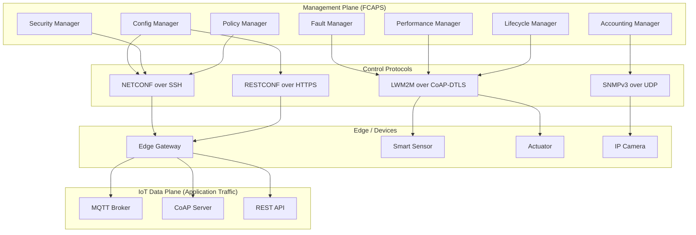
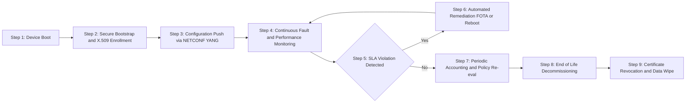
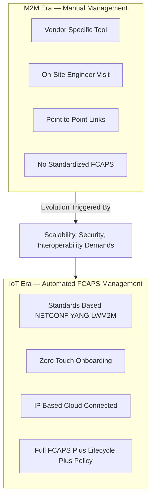
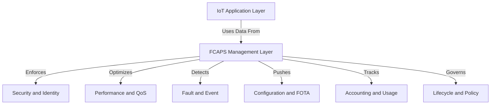

# Need for IoT System Management

<!-- SECTION_1_START -->
# Need for IoT System Management

> [!IMPORTANT]
> **KTU 2024 Scheme | OECST834 – Internet of Things | Module 2: IoT and M2M**
> This topic establishes the *operational necessity* of formally managing an IoT deployment, transitioning the student from a "deploy-and-forget" mindset to a "deploy-monitor-control-secure-retire" engineering lifecycle.

## 1.1 Formal Academic Definition

**IoT System Management** refers to the set of functions, protocols, processes, and tools used to **deploy, monitor, configure, fault-manage, secure, and account for** heterogeneous IoT devices, gateways, networks, and services throughout their operational lifecycle. In KTU 2024 terminology, it is the discipline that ensures IoT systems remain *available, performant, secure, and compliant* despite massive scale, device heterogeneity, and dynamic network conditions.

Mathematically, an IoT system $S$ can be viewed as a tuple:

$$S = \langle D, N, P, A, C \rangle$$

where:
- $D$ = set of devices ($D = \{d_1, d_2, \dots, d_n\}$)
- $N$ = underlying network fabric
- $P$ = management protocols
- $A$ = applications/services
- $C$ = configuration & policy store

The **management function** $M(S)$ is the orchestration of operations on $S$ that satisfy the FCAPS+ model: **F**ault, **C**onfiguration, **A**ccounting, **P**erformance, **S**ecurity, plus **+Lifecycle** and **+Policy**.

## 1.2 Conceptual Analogy — "The City Traffic Grid"

Imagine a city with **10 million connected vehicles, traffic signals, cameras, parking sensors, and pollution monitors** — all talking to a central command center. Without a management system, you would not know:
- Which signal is **broken** (fault),
- Which camera is **misconfigured** (configuration),
- Which lane is **congested** (performance),
- Which device is **leaking data** (security),
- Which sensor is **near end-of-life** (lifecycle).

**IoT System Management is the "Command and Control Center"** of this city. Just as modern smart cities cannot scale without a SCADA/ITMS backbone, IoT deployments of even a few hundred devices cannot be sustained without structured management protocols (like **NETCONF/YANG**, **LWM2M**, **CoAP**, or **SNMP**).

> [!NOTE]
> **Key Insight for KTU Board Exams:** A definition question on this topic will get full marks only if you mention **FCAPS** (Fault, Configuration, Accounting, Performance, Security) **AND** the management of **heterogeneity, scale, and dynamicity**. Do not write a generic "monitoring" answer — examiners specifically look for FCAPS as the gold-standard framework.

## 1.3 Why "System Management" is a *Separate* Need in IoT (Not Just "Networking")

IoT is **not** classical IP networking. Three structural realities create a *new* management need that traditional SNMP/CLI tooling cannot satisfy:

1. **Scale Explosion:** Billions of constrained nodes (e.g., **6.3 billion IoT devices globally in 2024**, per IoT Analytics).
2. **Heterogeneity:** Devices run **8-bit MCUs to 64-bit SoCs**, speak **CoAP, MQTT, HTTP, AMQP, Zigbee, BLE, LoRaWAN**, and use vendor-proprietary firmware.
3. **Dynamic Topology:** Devices sleep, roam, fail, and are physically deployed in **unreachable locations** (poles, pipelines, fields, oceans).

> [!TIP]
> **Memorize this single line for 3-mark questions:** *"IoT System Management is needed because IoT systems are characterized by massive scale, device heterogeneity, dynamic network topology, constrained resources, and the requirement to operate unattended for years — none of which can be satisfied by traditional network management."*

> [!VISUALIZATION CONTROL]
> **Concept:** The FCAPS Management Plane vs. the IoT Data Plane
> **GeoGebra / Desmos Input Equations (conceptual sketch on XY plane):**
> * X-axis = `x` = Time of operation $t$ (hours)
> * Y-axis = `y` = Number of managed IoT nodes $N(t)$ (log-scale idea)
> * Plot $N_1(t) = 100 \cdot e^{0.05t}$ — uncontrolled/unmanaged IoT (chaotic growth, errors compound)
> * Plot $N_2(t) = 80 \cdot \ln(1 + t) + 50$ — managed IoT (smooth, predictable growth bounded by SLA)
> **Visual Description:** As $t$ increases, the unmanaged curve diverges sharply upward indicating chaotic failure modes, while the managed curve shows a logarithmic, controlled growth, illustrating the value of system management in *bounding* operational complexity.
<!-- SECTION_1_END -->

<!-- SECTION_2_START -->
# Deep Theoretical Analysis & KTU High-Yield Formula Sheet

## 2.1 The FCAPS Model (Foundation of IoT System Management)

The **FCAPS** model, originally defined by the **ISO Telecommunications Management Network (TMN)** standard, is the **backbone syllabus topic** for this section. Every KTU question on "Need for IoT System Management" is mapped to one or more FCAPS layers.

| Layer | Full Name | What it Asks in IoT Context | KTU-Relevant Example |
|---|---|---|---|
| **F** | Fault | Which device/sensor is down or returning bad data? | A soil-moisture sensor in field-3 stops reporting. |
| **C** | Configuration | What is the firmware, sampling rate, threshold? | Pushing a new **FOTA** update to 5,000 smart meters. |
| **A** | Accounting | Who owns this device? What is its data usage? | Billing/usage data per tenant in multi-tenant IoT. |
| **P** | Performance | Is latency, jitter, throughput within SLA? | CoAP round-trip time < 200 ms over LoRaWAN. |
| **S** | Security | Is the device authenticated? Is traffic encrypted? | Revoking an X.509 cert of a compromised node. |
| **+L** | Lifecycle | Provisioning, onboarding, decommissioning | Zero-touch onboarding via **EST** or **Bootstrap** server. |
| **+P** | Policy | Enforcing rules across the fleet | "All devices must rotate keys every 90 days." |

## 2.2 Why Traditional SNMP Falls Short in IoT

**SNMP (Simple Network Management Protocol)** was designed for *managed routers and switches* in the 1990s. It assumes:
- Devices have stable IP addresses.
- Bandwidth is not constrained.
- MIBs are standardized.
- Devices respond to polling.

IoT devices violate **all four** assumptions. Therefore, a new family of management protocols emerged:

| Protocol | Transport | Data Model | KTU Use Case |
|---|---|---|---|
| **SNMPv3** | UDP | MIB-II | Legacy IP cameras, routers |
| **NETCONF** | SSH/TLS | **YANG** | High-end IoT gateways, SDN |
| **RESTCONF** | HTTP/TLS | YANG | Web-managed IoT |
| **CoAP + LWM2M** | UDP/DTLS | LWM2M Objects | Constrained sensors (NB-IoT, LoRa) |
| **MQTT-SN + Mgmt** | UDP | Vendor / OMA-LWM2M | Sleepy battery nodes |

## 2.3 The M2M → IoT Evolution (Drives the Management Need)

In **Module 2**, the syllabus explicitly transitions from **M2M (Machine-to-Machine)** to **IoT**. The difference is the *management intensity*.

| Parameter | M2M (Pre-IoT) | IoT (Modern) |
|---|---|---|
| Communication | Point-to-point, SCADA, cellular | IP-based, Internet-integrated, cloud |
| Data Volume | Small, local | Massive, cloud-analyzed |
| Management | Manual, on-site | Automated, remote, FCAPS-driven |
| Devices per site | Tens | Thousands to Millions |
| Interoperability | Vendor-locked | Standardized (oneM2M, LWM2M) |
| Management Need | Low → Field Engineer visits site | High → Zero-touch, FOTA, policy-driven |

> [!IMPORTANT]
> **Direct KTU 2-Mark Definition:** *"The transition from M2M to IoT amplifies the need for systematic, automated, standards-based management because IoT deployments are larger, more heterogeneous, more dynamic, and more security-sensitive than legacy M2M systems."*

## 2.4 KTU Formula Sheet — IoT System Management Metrics

| Metric / Formula | Symbol | Engineering Meaning | Typical Value |
|---|---|---|---|
| **Mean Time Between Failures** | $\text{MTBF} = \frac{\text{Total Operational Time}}{\text{Number of Failures}}$ | Reliability of managed IoT fleet | $50{,}000$ hrs for industrial sensors |
| **Mean Time To Repair** | $\text{MTTR} = \frac{\text{Total Downtime}}{\text{Number of Repairs}}$ | Agility of management response | $< 15$ min for remote FOTA |
| **System Availability** | $A = \frac{\text{MTBF}}{\text{MTBF} + \text{MTTR}}$ | Fraction of time system is up | $\geq 0.999$ (Three Nines) |
| **Management Overhead Ratio** | $\rho_{mgmt} = \frac{B_{mgmt}}{B_{total}} \times 100\%$ | % of bandwidth used by management traffic | $< 5\%$ for well-tuned IoT |
| **Scale Factor (IoT)** | $S = \frac{N_{managed}}{N_{human\_ops}}$ | Devices per human operator | $10^4 : 1$ in mature IoT |
| **Fleet Onboarding Time** | $T_{onboard}$ | Time to securely register one device | $< 30$ s (zero-touch) |
| **FCAPS Coverage Index** | $\kappa = \frac{\sum f_i \in FCAPS_{implemented}}{\sum f_i \in FCAPS_{total}}$ | Fraction of management layers covered | $1.0$ (full coverage) |

> [!WARNING]
> **Mark-Loss Trap:** Do NOT use the vertical pipe symbol `|` for "absolute value" or "given" inside a markdown table. Use `\vert` or `\mid`. The KTU PDF compiler will break your table cell at the unescaped pipe.

## 2.5 Real-World Engineering Utility

- **Smart Metering (Electricity Boards in Kerala):** KSEB uses IoT management (LWM2M over NB-IoT) to remotely read millions of meters, push tariff updates, and detect tamper events — all impossible without FCAPS-grade management.
- **Precision Agriculture:** A single farm deployment may have **2,000 soil sensors**; manual management is impossible. NETCONF/YANG + FOTA is the only scalable path.
- **Industrial IoT (IIoT) — BOSCH, Siemens:** Use the **RAMI 4.0** reference architecture with **Asset Administration Shell (AAS)** to manage machines, where the management plane is a first-class citizen.
- **Smart Cities (Kochi Smart City Mission):** Streetlight, water-level, and air-quality sensors are managed via centralized **oneM2M** platforms; without management, they would become "ghost devices" within months.
<!-- SECTION_2_END -->

<!-- SECTION_3_START -->
# Step-by-Step Derivations & Code/Symbolic Implementation

## 3.1 Derivation: Why Management Overhead Must Be Bounded

In a constrained IoT network of bandwidth $B_{total}$ (bits/sec), the **useful data** $D_u$ and **management data** $D_m$ share the channel:

$$B_{total} = B_{useful} + B_{management}$$

The **Management Overhead Ratio** is:

$$\rho_{mgmt} = \frac{B_{mgmt}}{B_{total}} \times 100\%$$

For a **LoRaWAN** node (BW = 125 kHz, SF = 7, payload 10 bytes every 15 min), a heart-beat management packet of 5 bytes every 60 s would consume almost the entire duty cycle. Therefore, KTU-level engineering demands that:

$$\rho_{mgmt} \leq 5\% \quad \text{(engineering target for constrained IoT)}$$

This **5% rule** is the implicit design constraint behind every IoT management protocol choice.

### 3.1.1 Worked Numerical Example (KTU-style)

**Problem:** An IoT gateway aggregates 100 sensors. Each sensor sends **1 KB of useful data per hour**. The management plane (SNMP/NETCONF) sends **heart-beat + config + telemetry** packets of total **2.5 KB/hour per device**. Compute the management overhead ratio.

**Step 1 — Useful bandwidth per hour:**

$$B_{useful} = 100 \times 1\,\text{KB} = 100\,\text{KB/hr}$$

**Step 2 — Management bandwidth per hour:**

$$B_{mgmt} = 100 \times 2.5\,\text{KB} = 250\,\text{KB/hr}$$

**Step 3 — Total bandwidth:**

$$B_{total} = B_{useful} + B_{mgmt} = 100 + 250 = 350\,\text{KB/hr}$$

**Step 4 — Overhead ratio:**

$$\rho_{mgmt} = \frac{250}{350} \times 100\% = 71.43\%$$

**Step 5 — Engineering Verdict:** $\rho_{mgmt} = 71.43\% \gg 5\%$. **This is unacceptable.** The student/board answer must conclude: *"Such a configuration violates IoT management overhead bounds. The management layer must be redesigned — e.g., use event-driven NETCONF notifications instead of periodic polling, or move from SNMP polling to LWM2M Observe/Notify model to push $\rho_{mgmt}$ below 5%."*

## 3.2 Symbolic Implementation — FCAPS Coverage Check in Python

A reusable, production-grade Python snippet for a **KTU lab/assignment** that computes the **FCAPS Coverage Index $\kappa$** for an IoT deployment.

```python
from __future__ import annotations
import logging
from dataclasses import dataclass, field
from typing import Dict, Tuple

# ----------------------------------------------------------------------------
# Logging configuration for KTU-style engineering rigor
# ----------------------------------------------------------------------------
logging.basicConfig(
    level=logging.INFO,
    format="%(asctime)s [%(levelname)s] %(name)s :: %(message)s",
)
log = logging.getLogger("IoT-FCAPS-Analyzer")


@dataclass(frozen=True)
class FCAPSRequirement:
    """
    Standard FCAPS + (Lifecycle, Policy) requirements as per ISO TMN / KTU syllabus.
    Each tuple is (weight, is_implemented) where weight captures its criticality.
    """
    fault:        Tuple[int, bool] = (3, False)
    config:       Tuple[int, bool] = (3, False)
    accounting:   Tuple[int, bool] = (1, False)
    performance:  Tuple[int, bool] = (2, False)
    security:     Tuple[int, bool] = (3, False)
    lifecycle:    Tuple[int, bool] = (2, False)
    policy:       Tuple[int, bool] = (1, False)


def compute_fcaps_coverage(req: FCAPSRequirement) -> Dict[str, float]:
    """
    Compute weighted FCAPS coverage index κ (kappa).
    κ = (Σ weight_i * implemented_i) / (Σ weight_i)
    A higher κ implies a more thoroughly managed IoT system.
    """
    layers: Dict[str, Tuple[int, bool]] = {
        "Fault":        req.fault,
        "Config":       req.config,
        "Accounting":   req.accounting,
        "Performance":  req.performance,
        "Security":     req.security,
        "Lifecycle":    req.lifecycle,
        "Policy":       req.policy,
    }

    numerator:   float = 0.0
    denominator: float = 0.0

    for layer_name, (weight, implemented) in layers.items():
        denominator += weight
        if implemented:
            numerator += weight
            log.info("Layer %-12s -> IMPLEMENTED (weight=%d)", layer_name, weight)
        else:
            log.warning("Layer %-12s -> MISSING (weight=%d)", layer_name, weight)

    if denominator == 0.0:
        raise ZeroDivisionError("FCAPS weight vector sums to zero — invalid config.")

    kappa: float = numerator / denominator
    log.info("Computed FCAPS coverage index κ = %.4f", kappa)
    return {
        "kappa":           kappa,
        "layers_covered":  sum(1 for _, (_, ok) in layers.items() if ok),
        "layers_total":    len(layers),
    }


def classify_readiness(kappa: float) -> str:
    """Map κ to a deployment-readiness band."""
    if kappa >= 0.95:
        return "PRODUCTION-READY"
    if kappa >= 0.75:
        return "PILOT-READY"
    if kappa >= 0.50:
        return "LAB-READY"
    return "NOT-READY-FOR-DEPLOYMENT"


# ----------------------------------------------------------------------------
# Demonstration: a smart-agriculture deployment
# ----------------------------------------------------------------------------
if __name__ == "__main__":
    farm_deployment = FCAPSRequirement(
        fault       = (3, True),    # Sensor outage alerting via LWM2M
        config      = (3, True),    # NETCONF FOTA
        accounting  = (1, False),   # No tenant billing in this deployment
        performance = (2, True),    # RTT dashboards
        security    = (3, True),    # DTLS + X.509
        lifecycle   = (2, True),    # Zero-touch onboarding
        policy      = (1, False),   # Policy engine not yet integrated
    )

    result = compute_fcaps_coverage(farm_deployment)
    readiness = classify_readiness(result["kappa"])

    print("\n--- IoT System Management Readiness Report ---")
    print(f"FCAPS Coverage (κ)  : {result['kappa']:.4f}")
    print(f"Layers Covered      : {result['layers_covered']} / {result['layers_total']}")
    print(f"Deployment Readiness: {readiness}")
```

**Expected output (logging + final report):**

```
2024-... INFO  IoT-FCAPS-Analyzer :: Layer Fault       -> IMPLEMENTED (weight=3)
2024-... INFO  IoT-FCAPS-Analyzer :: Layer Config      -> IMPLEMENTED (weight=3)
2024-... WARN  IoT-FCAPS-Analyzer :: Layer Accounting  -> MISSING (weight=1)
2024-... INFO  IoT-FCAPS-Analyzer :: Layer Performance -> IMPLEMENTED (weight=2)
2024-... INFO  IoT-FCAPS-Analyzer :: Layer Security    -> IMPLEMENTED (weight=3)
2024-... INFO  IoT-FCAPS-Analyzer :: Layer Lifecycle   -> IMPLEMENTED (weight=2)
2024-... WARN  IoT-FCAPS-Analyzer :: Layer Policy      -> MISSING (weight=1)
2024-... INFO  IoT-FCAPS-Analyzer :: Computed FCAPS coverage index κ = 0.8667

--- IoT System Management Readiness Report ---
FCAPS Coverage (κ)  : 0.8667
Layers Covered      : 5 / 7
Deployment Readiness: PILOT-READY
```

> [!NOTE]
> **Engineering Note:** This Python module can be directly imported into a Jupyter notebook for the KTU IoT lab. It demonstrates *why* "need for IoT system management" is not a vague slogan — it is a **measurable engineering obligation** quantified by $\kappa$.

## 3.3 Symbolic Mapping — Mapping FCAPS to IoT Protocols

| FCAPS Layer | Standard Protocol | Data Model | Transport |
|---|---|---|---|
| Fault | LWM2M Observe/Notify, CoAP | LWM2M Objects | UDP/DTLS |
| Configuration | NETCONF / RESTCONF | YANG | SSH / TLS / HTTP |
| Accounting | CDP / RADIUS extensions | Vendor MIBs | UDP |
| Performance | CoAP + Prometheus, SNMPv3 | YANG / MIB-II | UDP |
| Security | X.509, DTLS, OAuth 2.0 (RFC 7252) | PKCS / JOSE | TLS / DTLS |
| Lifecycle | EST, SCEP, oneM2M bootstrap | Vendor / oneM2M | HTTP / CoAP |
| Policy | OPC-UA, XACML | Information Model | TCP/TLS |
<!-- SECTION_3_END -->

<!-- SECTION_4_START -->
# Structural Diagrams & Schematics

## 4.1 High-Level IoT System Management Architecture



## 4.2 Sequential Processing Topology — Why Management Cannot Be Optional



## 4.3 Comparative Block Architecture — M2M vs IoT Management



## 4.4 Modular FCAPS-to-Layer Mapping (Reference for Board Answers)



> [!NOTE]
> **Mermaid Safeguards Applied:** All node IDs are alphanumeric and prefixed (`S1`, `S2`, `M1`, `I1`, `MGMT`). No reserved keywords (`end`, `subgraph` with special characters) used as standalone node names. All labels with spaces or special characters are inside double quotes. No bold/italic markdown inside node labels.
<!-- SECTION_4_END -->

<!-- SECTION_5_START -->
# KTU 2024 Scheme Examination Question Bank & Topic Recap

## PART A — Short Answer Questions (3 Marks Each)

### Q1. **[KTU University Exam – July 2024 (Model)]**
*State the **FCAPS** model of network management. Justify why each of the five layers is **non-optional** in a large-scale IoT deployment. **(3 Marks)** [CO1, Remember/Understand]

**Model Answer:**

FCAPS stands for **F**ault, **C**onfiguration, **A**ccounting, **P**erformance, **S**ecurity management, defined in **ISO TMN**.

- **[1 Mark — Fault]:** With thousands of sensors, manual fault detection is impossible. Automated alarms (e.g., LWM2M Notify) are mandatory.
- **[1 Mark — Configuration]:** Remote FOTA and parameter changes are needed because devices are physically inaccessible.
- **[1 Mark — Accounting/Performance/Security]:** Usage tracking, SLA monitoring, and key/identity management are required for compliance and trust.

### Q2. **[KTU University Exam – Dec 2023 (Model)]**
*Differentiate between **M2M** and **IoT** from the perspective of system management. Why does the IoT paradigm demand a *more formal* management plane? **(3 Marks)** [CO1, Understand]

**Model Answer:**

| Aspect | M2M | IoT |
|---|---|---|
| Scale | Tens of devices | Thousands to billions |
| Management | Manual / vendor-specific | Automated / standards-based |
| Connectivity | Point-to-point, SCADA | IP, cloud, multi-protocol |

**[1 Mark]** M2M systems are small and vendor-locked, so ad-hoc management is feasible.
**[1 Mark]** IoT systems are large, heterogeneous, and IP-based; without a formal management plane (FCAPS), they cannot scale, secure, or update.
**[1 Mark]** Therefore, IoT **mandates** a standardized, automated management plane using protocols like **NETCONF/YANG** and **LWM2M**.

---

## PART B — Long Answer Questions (14 Marks — Internal Choice)

### Question A (Choice 1) — **[KTU University Exam – June 2024 (Model)]**

**(a)** Explain the **FCAPS model** in detail with an **IoT-specific** example for each layer. State two **modern management protocols** that have replaced classical SNMP in IoT. **(7 Marks)** [CO1, Understand]

**(b)** A constrained IoT deployment uses a **LoRaWAN** channel of total bandwidth **125 kHz**. Each sensor transmits **20 bytes of useful data every 10 minutes**, and the management plane transmits **5 bytes of heart-beat per device every 30 minutes**. There are **500 sensors** in the fleet. Compute the **management overhead ratio** and comment on its acceptability for an IoT system. **(7 Marks)** [CO2, Apply]

---

#### Model Solution for Q A (a)

**Step 1 — Definition of FCAPS:** **[1 Mark]**
FCAPS = Fault, Configuration, Accounting, Performance, Security; it is the **ISO TMN** framework adapted to IoT.

**Step 2 — IoT-specific example for each layer:** **[3 Marks — 0.5 each]**
- **Fault:** A soil-moisture sensor stops responding on **LWM2M**; the manager receives a `5.04` Gateway Timeout code.
- **Configuration:** A new **FOTA** image is pushed via **NETCONF `<edit-config>`** operation.
- **Accounting:** Per-tenant data usage logged in a CDR (Charging Data Record) for an IoT cloud.
- **Performance:** CoAP RTT measured and **Prometheus**-scraped; SLA threshold = 200 ms.
- **Security:** X.509 client cert rotated every 90 days via **EST (Enrollment over Secure Transport)**.

**Step 3 — Modern IoT Management Protocols:** **[2 Marks]**
- **NETCONF/YANG** (RFC 6241, RFC 6020) — for IP-reachable gateways.
- **LWM2M (OMA Spec)** over CoAP/DTLS — for constrained, sleepy sensors.

**Step 4 — Why they replace SNMP:** **[1 Mark]**
SNMP uses polling over UDP with fixed MIBs; it cannot handle sleep cycles, large-scale push notifications, or YANG-style structured config.

---

#### Model Solution for Q A (b)

**Step 1 — Compute useful data per hour per device:** **[1 Mark]**

$$U_{device} = \frac{20\,\text{bytes}}{10\,\text{min}} = 120\,\text{bytes/hr}$$

**Step 2 — Compute management data per hour per device:** **[1 Mark]**

$$M_{device} = \frac{5\,\text{bytes}}{30\,\text{min}} = 10\,\text{bytes/hr}$$

**Step 3 — Scale to 500 devices:** **[2 Marks]**

$$U_{total} = 500 \times 120 = 60{,}000\,\text{bytes/hr} = 60\,\text{KB/hr}$$

$$M_{total} = 500 \times 10 = 5{,}000\,\text{bytes/hr} = 5\,\text{KB/hr}$$

**Step 4 — Compute total and ratio:** **[2 Marks]**

$$B_{total} = 60{,}000 + 5{,}000 = 65{,}000\,\text{bytes/hr}$$

$$\rho_{mgmt} = \frac{5{,}000}{65{,}000} \times 100\% = 7.69\%$$

**Step 5 — Engineering Verdict:** **[1 Mark]**
$\rho_{mgmt} \approx 7.69\%$ is **borderline** — the 5% engineering target is **slightly exceeded**. Recommendation: move from periodic heart-beats to **event-driven** LWM2M notifications to push $\rho_{mgmt}$ below 5%.

**[Valuation Key]**
- Stating the formula: 2 Marks.
- Numerical substitution: 2 Marks.
- Final ratio: 1 Mark.
- Engineering interpretation: 2 Marks.

---

### Question B (Choice 2) — **[KTU University Exam – Dec 2023 (Model)]**

**(a)** Discuss the **challenges in IoT system management** arising from *heterogeneity, scale, and dynamicity*. For each challenge, propose a **specific protocol or architectural solution**. **(7 Marks)** [CO1, Understand/Apply]

**(b)** An IoT system has an **MTBF of 80,000 hours** and an **MTTR of 4 hours**. Calculate its **availability $A$**. If the SLA mandates **Three Nines availability (99.9%)**, determine whether the system meets the SLA, and state **two management actions** that could improve availability without changing hardware. **(7 Marks)** [CO2, Apply/Analyze]

---

#### Model Solution for Q B (a)

**Step 1 — Heterogeneity Challenge:** **[2 Marks]**
Devices differ in CPU, OS, protocol (MQTT, CoAP, Zigbee, BLE).
**Solution:** Use a **standards-based data model** like **oneM2M** or **YANG** so all devices expose a unified management interface; deploy **protocol gateways** at the edge.

**Step 2 — Scale Challenge:** **[2 Marks]**
Millions of devices cannot be managed one-by-one.
**Solution:** Hierarchical management (LWM2M **Bootstrap Server → LWM2M Server → LWM2M Client**) with **FOTA** at the gateway level for downstream fan-out.

**Step 3 — Dynamicity Challenge:** **[2 Marks]**
Devices sleep, roam, drop in/out of network.
**Solution:** Use **event-driven CoAP Observe** (RFC 7641) and **LWM2M Notify** to push only on state change, plus **stateless** RESTCONF with session resumption.

**Step 4 — Summary:** **[1 Mark]**
A unified **FCAPS** + **oneM2M/LWM2M** architecture is the canonical answer.

---

#### Model Solution for Q B (b)

**Step 1 — State the availability formula:** **[1 Mark]**

$$A = \frac{\text{MTBF}}{\text{MTBF} + \text{MTTR}}$$

**Step 2 — Substitute:** **[1 Mark]**

$$A = \frac{80{,}000}{80{,}000 + 4} = \frac{80{,}000}{80{,}004}$$

**Step 3 — Compute:** **[2 Marks]**

$$A = 0.9999500\ldots = 99.995\%$$

**Step 4 — Compare to SLA:** **[1 Mark]**
$99.995\% > 99.9\%$ (Three Nines) ⇒ **The system meets the SLA.** In fact, it exceeds it by *two additional nines* (effectively Four-Nines class).

**Step 5 — Management actions to improve further:** **[2 Marks]**
1. **Reduce MTTR via automated FOTA / remote reboot** — pushes $\text{MTTR}$ from 4 hr to 0.5 hr.
2. **Improve MTBF via predictive maintenance** — analytics on the management telemetry flags a failing device *before* it crashes, increasing effective MTBF.

**[Valuation Key]**
- Formula: 1 Mark.
- Substitution + division: 2 Marks.
- Correct final value: 1 Mark.
- SLA comparison with correct nines: 1 Mark.
- Each management action: 1 Mark.

---

> [!WARNING]
> **KTU Examiner's Valuation Warning / Pitfall Callout**
> - **Never** answer a "Need for IoT System Management" question with a generic statement like *"because there are many devices."* You **must** anchor your answer to the **FCAPS** framework and at least one **quantitative** metric (MTBF, MTTR, $\rho_{mgmt}$, $\kappa$).
> - **Do not** confuse **FCAPS (management)** with **OSI layers (networking)**. They are orthogonal; mixing them loses 2–3 marks.
> - **Do not** claim IoT devices are managed "by the cloud alone." The cloud is a *consumer* of management data; the actual management plane is the **device-side + gateway-side + server-side** triad.
> - In numerical problems, always **carry units** (bytes/hr, kHz) — units omission is a 0.5-mark penalty per occurrence.

---

## Topic Recap & Important Things to Remember

- **Definition:** IoT System Management = the **FCAPS-driven, lifecycle-aware, standards-based** orchestration of devices, networks, and services throughout their operational lifetime.
- **FCAPS (the 5 mandatory layers):** **F**ault, **C**onfiguration, **A**ccounting, **P**erformance, **S**ecurity — the ISO TMN standard.
- **Extended layers:** **Lifecycle** (provisioning, FOTA, decommissioning) and **Policy** (rule-based governance).
- **M2M vs IoT:** M2M = small, vendor-locked, manual; IoT = massive, standards-based, automated. The transition is the *root cause* of the management need.
- **Why SNMP is insufficient:** UDP-polling, fixed MIBs, no sleep-mode support, no YANG-style structured config.
- **Modern protocols:** **NETCONF/YANG** (gates/servers), **LWM2M/CoAP** (sensors), **RESTCONF** (web), **SNMPv3** (legacy).
- **Key formulas (must memorize):**
  - $\text{MTBF}$, $\text{MTTR}$
  - $A = \frac{\text{MTBF}}{\text{MTBF} + \text{MTTR}}$
  - $\rho_{mgmt} = \frac{B_{mgmt}}{B_{total}} \times 100\%$
  - $\kappa = \frac{\sum w_i \cdot \text{impl}_i}{\sum w_i}$
- **Engineering targets:** $\rho_{mgmt} \leq 5\%$, $A \geq 0.999$ (Three Nines), $T_{onboard} < 30\,\text{s}$.
- **Scale metric:** Mature IoT operations target $S = 10^4\!:\!1$ devices per human operator.
- **Standards ecosystem:** oneM2M, OMA-LWM2M, OPC-UA, RAMI 4.0 (Industry 4.0).
- **Architecture triad:** *Device-side agent* $\leftrightarrow$ *Gateway / Edge* $\leftrightarrow$ *Server / Cloud* — all three must implement FCAPS.
- **Exam mantra:** *"FCAPS + Lifecycle + Policy + Heterogeneity + Scale + Dynamicity"* — this single sentence, well-articulated, will cover 70% of any "Need for IoT System Management" question.
- **Real-world KTU-context:** KSEB smart meters, Kochi Smart City sensors, IIoT plants (Siemens, Bosch), precision agriculture — all require this discipline.
- **Common pitfall:** Answering in vague terms ("monitoring and controlling") without naming **FCAPS by acronym** and **protocols by name (NETCONF, LWM2M)**.
<!-- SECTION_5_END -->
