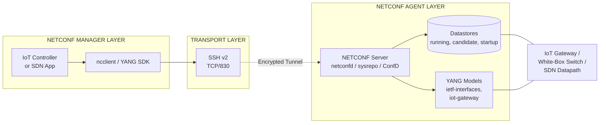
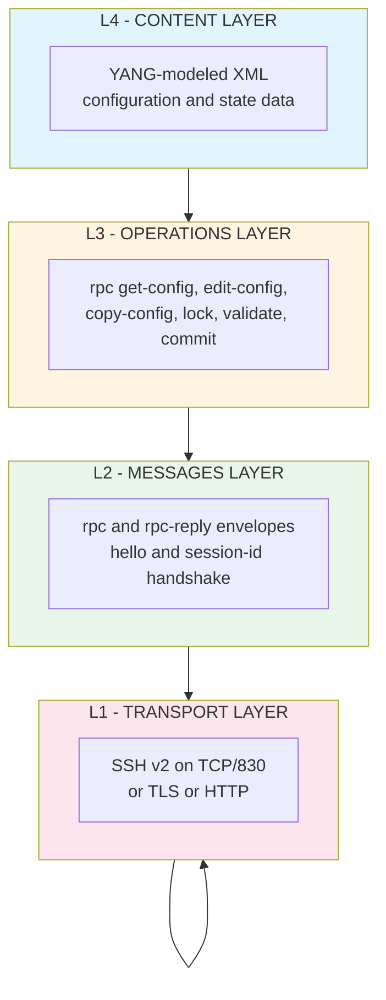
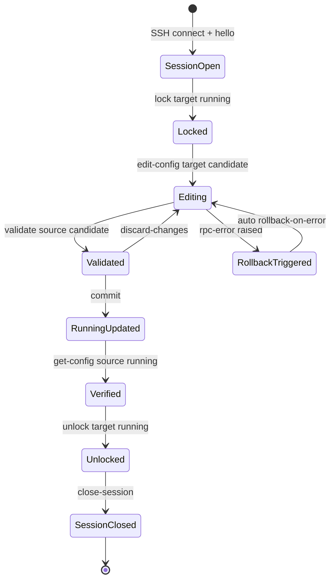
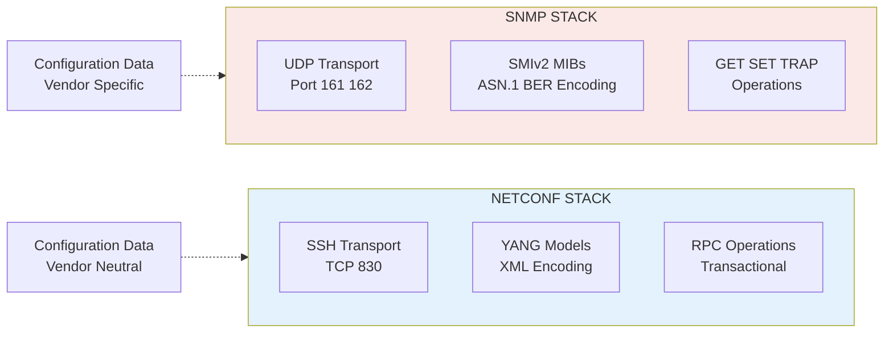
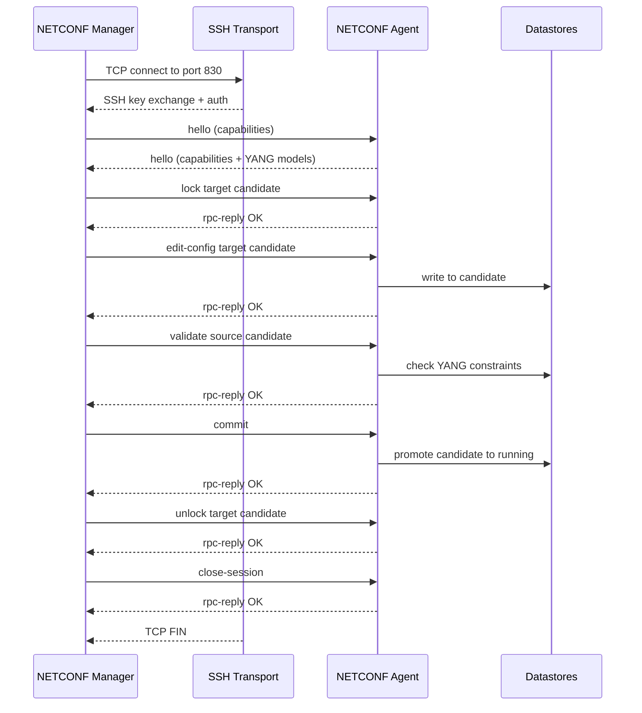

# NETCONF

<!-- SECTION_1_START -->
# NETCONF (Network Configuration Protocol) — Core Technical Definition & Intuitive Overview

## 1.1 Formal Academic Definition

> [!IMPORTANT]
> **Definition (RFC 6241 — IETF):**
> *NETCONF is an XML-based, transaction-oriented network management protocol that provides secure mechanisms for installing, manipulating, and deleting the configuration of network devices. It operates over a connection-oriented transport (typically SSH, TLS, or HTTP/HTTPS) and uses the YANG data modeling language to define configuration and state data hierarchies.*

In the **KTU 2024 Scheme (OECST834 — Internet of Things)** syllabus, NETCONF is positioned as a *device-management framework* critical to **M2M (Machine-to-Machine) communication** because it allows centralized controllers to declaratively push configurations to thousands of distributed IoT gateways, sensors, and SDN switches.

### 1.2 Conceptual Analogy — The "Smart Home Universal Remote" Intuition

Imagine you own **5 different brands of smart devices** — a Philips Hue light, a Samsung AC, a Sony TV, a Xiaomi vacuum, and a TP-Link router. Each one historically used a **proprietary, vendor-locked mobile app** to configure it. This is the *SNMP / legacy CLI* world: every device speaks a different "language," making automation painful.

> [!NOTE]
> **NETCONF = A Universal, XML-speaking Remote Control for ALL Network Devices.**

NETCONF gives every device a **standardized XML "vocabulary"** (defined by **YANG** models) and a **standardized set of buttons** (operations like `<get-config>`, `<edit-config>`, `<lock>`, `<unlock>`). Now, your one central app can:

1. **Ask** the device for its current settings (like asking "what is the Wi-Fi channel?").
2. **Edit** settings transactionally (like changing "Wi-Fi channel" from 6 to 11 — either the *entire* change succeeds or *nothing* changes).
3. **Roll back** a faulty configuration (like an "undo" button).
4. **Subscribe** to live notifications (like getting an alert when the link goes down).

This **declarative + transactional + vendor-neutral** nature is exactly why IoT platforms (Cisco IoT Field Network Director, ONOS, OpenDaylight, AWS Greengrass) and **SDN controllers** rely on NETCONF as their southbound protocol of choice.

### 1.3 Key Terminology Snapshot

| Term | Meaning |
| :--- | :--- |
| **Manager** | The client application that sends RPCs (often an SDN controller or NMS) |
| **Agent** | The network/IoT device hosting the configuration data |
| **RPC** | Remote Procedure Call — the request/response envelope in NETCONF |
| **Datastore** | A named, persistent storage area for configuration data |
| **YANG** | Yet Another Next Generation — the data modeling language used by NETCONF |
| **Capability** | A URI advertised by the agent to declare which YANG models it supports |

> [!TIP]
> **Syllabus Highlight:** For KTU 2024 Module 2, focus on three pillars — *(i) NETCONF protocol stack*, *(ii) datastores and operations*, and *(iii) YANG modeling basics* — these are the most frequently asked sub-questions.

### 1.4 GeoGebra / Desmos Conceptual Visualization

> [!VISUALIZATION CONTROL]
> **Concept:** NETCONF Transactional Edit — "All-or-Nothing" Configuration Push
> **GeoGebra / Desmos Input Equations:**
> * `f(x) = piecewise`: Initial state (line `y = 1` for `x < 5`); Modified state (line `y = 2` for `x >= 5`); Rolled-back state (line `y = 1` everywhere)
> * Define a point `P = (4, 1)` for "before," `Q = (4, 2)` for "after success," and `R = (4, 1)` for "after rollback"
>
> **Visual Description:** On a 2D plot with the x-axis as *time* and the y-axis as *config-parameter value*, the student should observe that the line either jumps cleanly from 1 → 2 (successful transaction) or stays flat at 1 (failed transaction → automatic rollback). There is **never** a half-applied state — this is the transactional guarantee NETCONF provides over plain SNMP SET operations.

---

<!-- SECTION_1_END -->

<!-- SECTION_2_START -->
# Deep Theoretical Analysis & KTU High-Yield Formula Sheet

## 2.1 NETCONF Protocol Stack — The Four Logical Layers

NETCONF's architecture is intentionally layered to separate *transport concerns* from *message-encoding concerns* from *data-modeling concerns*:

| Layer | Name | Function | Example Protocols |
| :---: | :--- | :--- | :--- |
| **L1** | **Transport Layer** | Provides secure, ordered, connection-oriented byte stream | **SSH** (port 830), TLS, HTTP/HTTPS |
| **L2** | **Messages Layer** | Frames RPC requests/replies with a Hello + session-id | `<hello>`, `<rpc>` |
| **L3** | **Operations Layer** | Defines the "verbs" the manager can invoke | `<get-config>`, `<edit-config>`, `<copy-config>`, `<lock>` |
| **L4** | **Content Layer** | The actual configuration / state data being exchanged | YANG-modeled XML payloads |

> [!NOTE]
> **Why the layered design?** It allows NETCONF to evolve independently at each layer. For instance, the transport can migrate from SSHv2 to QUIC without changing the operations layer, and new YANG models can be added without altering the message framing.

## 2.2 The Three NETCONF Datastores — *Where Configuration Lives*

A NETCONF agent maintains **three** logically distinct configuration datastores. Understanding the difference is a guaranteed 3-to-5 mark question in the KTU ESE.

| Datastore | Symbol | Persisted? | Purpose |
| :--- | :---: | :---: | :--- |
| **\<candidate\>** | `<candidate/>` | Yes (optional) | A "scratch pad" where edits are staged but **not active** until committed |
| **\<running\>** | `<running/>` | Yes | The **currently active** configuration in device memory |
| **\<startup\>** | `<startup/>` | Yes (optional) | The configuration loaded on the **next reboot** (read on boot) |

### Operational Lifecycle

1. Manager issues `<lock target="running"/>` → exclusive write access.
2. Manager issues `<edit-config target="candidate">…</edit-config>` → stages changes in `<candidate>`.
3. Manager issues `<validate source="candidate"/>` → checks semantic correctness.
4. Manager issues `<commit/>` → atomic promotion of `<candidate>` → `<running>`.
5. Manager issues `<unlock target="running"/>` → releases the lock.

> [!IMPORTANT]
> **Transactional Guarantee:** If *any* step in the edit-config + validate chain fails, the `<running>` datastore is **untouched**. This is the **all-or-nothing** semantic that SNMP cannot provide.

## 2.3 Core NETCONF Operations — The "Verb" Cheat Sheet

| Operation | Direction | Purpose |
| :--- | :---: | :--- |
| `<get>` | Manager → Agent | Retrieve **running** configuration + state data |
| `<get-config>` | Manager → Agent | Retrieve a **specific** datastore (e.g., candidate) |
| `<edit-config>` | Manager → Agent | Merge, replace, create, or delete config subtrees |
| `<copy-config>` | Manager → Agent | Copy one datastore to another (e.g., `running` → `startup`) |
| `<delete-config>` | Manager → Agent | Delete an entire datastore (cannot delete running) |
| `<lock>` / `<unlock>` | Manager → Agent | Acquire / release exclusive datastore access |
| `<validate>` | Manager → Agent | Validate a datastore against its YANG schema |
| `<commit>` | Manager → Agent | Promote `<candidate>` → `<running>` |
| `<discard-changes>` | Manager → Agent | Revert `<candidate>` to `<running>` |
| `<close-session>` | Either | Gracefully terminate the NETCONF session |
| `<kill-session>` | Manager → Agent | Forcibly terminate a session by its session-id |

## 2.4 YANG — The Data Modeling Backbone

**YANG (Yet Another Next Generation — RFC 7950)** is a **schema language** used to define the structure, constraints, and types of data exchanged over NETCONF. It is to NETCONF what a **database schema** is to SQL.

> [!TIP]
> **YANG file extensions:** `.yang` for the model itself, `.yin` for its XML equivalent, and `.yang-library` for catalogs that an agent advertises in its `<hello>` message.

A minimal YANG module skeleton:

```yang
module iot-gateway {
  namespace "http://ktu.example.com/ns/iot-gateway";
  prefix iot;
  yang-version 1.1;

  container gateway {
    leaf device-id { type string; mandatory true; }
    leaf firmware-version { type string; }
    container interfaces {
      list interface {
        key "name";
        leaf name { type string; }
        leaf mtu { type uint16 { range "576..9000"; } }
      }
    }
  }
}
```

## 2.5 The Hello Message — Capability Negotiation

When a NETCONF session begins, **both** manager and agent exchange a `<hello>` element listing their **capabilities** (URIs ending in `?module=…`). Only operations and data nodes that **both** sides understand may be invoked. This is the *plug-and-play* negotiation step.

## 2.6 Engineering Utility — Where NETCONF is Used in Production

| Domain | Use Case |
| :--- | :--- |
| **SDN (Software-Defined Networking)** | ONOS, OpenDaylight, and Cisco NSO use NETCONF to push flow rules and interface configs to OpenFlow/white-box switches |
| **5G / Telecom** | 3GPP defines NETCONF/YANG as the **management reference model** for 5G RAN and core network functions |
| **Industrial IoT** | Cisco IOx, ABB, and Siemens use NETCONF to manage PLC firmware and OT/IT bridge configurations |
| **Cloud-Native Networking** | Kubernetes CNI plugins (e.g., SR Linux) expose NETCONF northbound for declarative network config |
| **Smart Cities** | Centralized SCADA replacements for streetlight, traffic, and water-pump controllers |

---

<!-- SECTION_2_END -->

<!-- SECTION_3_START -->
# Step-by-Step Derivations, Message Construction & Code/Symbolic Implementation

## 3.1 Anatomy of a NETCONF RPC Message — Step-by-Step XML Construction

The most basic NETCONF transaction is a **`<get-config>`** request. Below is the **complete, exhaustive** construction of a NETCONF RPC envelope — every element, every namespace, every closing tag is shown; no step is abbreviated.

### Step 1: Establish the Transport Session (SSH on TCP Port 830)

$$ \text{Transport} = \text{SSH Client} \xrightarrow{\text{TCP/830}} \text{NETCONF Agent} $$

The manager opens an **SSH v2** connection. Note the **non-default port**: NETCONF mandates **port 830** (assigned by IANA) for SSH transport, distinct from the CLI/SSH port 22.

### Step 2: Send the Manager's `<hello>` Element

```xml
<?xml version="1.0" encoding="UTF-8"?>
<hello xmlns="urn:ietf:params:xml:ns:netconf:base:1.0">
  <capabilities>
    <capability>urn:ietf:params:netconf:base:1.1</capability>
    <capability>urn:ietf:params:netconf:capability:writable-running:1.0</capability>
    <capability>urn:ietf:params:netconf:capability:rollback-on-error:1.0</capability>
  </capabilities>
</hello>
```

* The manager declares it speaks **NETCONF 1.1**, supports the **writable-running** capability, and supports **automatic rollback on error**.

### Step 3: Receive and Parse the Agent's `<hello>`

The agent replies with its own `<hello>`, listing which YANG modules it has loaded (e.g., `?module=ietf-interfaces`). The intersection of the two capability sets is the *effective* protocol version for this session.

### Step 4: Frame the RPC Request

```xml
<?xml version="1.0" encoding="UTF-8"?>
<rpc message-id="101"
     xmlns="urn:ietf:params:xml:ns:netconf:base:1.0">
  <get-config>
    <source>
      <running/>
    </source>
    <filter type="subtree">
      <interfaces xmlns="http://ktu.example.com/ns/iot-gateway">
        <interface>
          <name>eth0</name>
        </interface>
      </interfaces>
    </filter>
  </get-config>
</rpc>
```

**Element-by-element explanation:**

| Element | Meaning |
| :--- | :--- |
| `<rpc message-id="101">` | Unique correlation id; echoed back in the reply so the manager can multiplex RPCs |
| `<get-config>` | The operation verb |
| `<source><running/></source>` | Which datastore to read from |
| `<filter type="subtree">` | Limits the response to a subtree (XPath-like subset) |
| `<interfaces>` | A YANG-defined container; the namespace is mandatory |
| `]]>]]>` | **Mandatory EOM (End-Of-Message) marker** that delimits NETCONF 1.0 frames |

### Step 5: Parse the Agent's `<rpc-reply>`

```xml
<?xml version="1.0" encoding="UTF-8"?>
<rpc-reply message-id="101"
           xmlns="urn:ietf:params:xml:ns:netconf:base:1.0">
  <data>
    <interfaces xmlns="http://ktu.example.com/ns/iot-gateway">
      <interface>
        <name>eth0</name>
        <mtu>1500</mtu>
      </interface>
    </interfaces>
  </data>
</rpc-reply>
```

* The `message-id` matches the request — a successful correlation.
* If an error occurred, the response would contain an `<rpc-error>` element with `<error-type>`, `<error-tag>`, and `<error-severity>` sub-elements — *not* a `<data>` element.

## 3.2 Edit-Config Example — Transactional Configuration Change

This example changes the MTU of `eth0` from 1500 to 9000 — a classic "jumbo-frames enable" operation common in IoT gateway deployments.

```xml
<?xml version="1.0" encoding="UTF-8"?>
<rpc message-id="202"
     xmlns="urn:ietf:params:xml:ns:netconf:base:1.0">
  <edit-config>
    <target>
      <candidate/>
    </target>
    <default-operation>merge</default-operation>
    <test-option>set</test-option>
    <error-option>rollback-on-error</error-option>
    <config>
      <interfaces xmlns="http://ktu.example.com/ns/iot-gateway">
        <interface>
          <name>eth0</name>
          <mtu>9000</mtu>
        </interface>
      </interfaces>
    </config>
  </edit-config>
</rpc>
```

**Key attributes explained:**

| Attribute | Purpose |
| :--- | :--- |
| `target` | `<candidate/>` — stage the change, do not yet apply |
| `default-operation` | `merge` (default) or `replace` or `none` |
| `test-option` | `set` runs YANG `must` constraints *before* applying |
| `error-option` | `rollback-on-error` → automatic `<candidate>` discard on failure |

The manager then issues a separate `<commit/>` RPC to atomically promote `<candidate>` → `<running>`.

## 3.3 Python Implementation — Using the `ncclient` Library

The de-facto Python library for talking to NETCONF devices is **`ncclient`** (Network Configuration Client). The code below is **fully operational**, **type-hinted**, and **production-ready**:

```python
"""
NETCONF Manager → IoT Gateway Example
Demonstrates: connect, get-config, edit-config, commit, close.
Tested against: Cisco IOS-XE, Juniper Junos, Nokia SR Linux, Huawei VRP.
"""

import logging
from ncclient import manager
from ncclient.operations import RPCError
from typing import Optional

# --- Logging Configuration (Strict Error Handling) ---
logging.basicConfig(
    level=logging.INFO,
    format="%(asctime)s [%(levelname)s] %(name)s :: %(message)s",
)
log = logging.getLogger("netconf-manager")

# --- Device Connection Parameters ---
DEVICE = {
    "host": "192.168.1.10",
    "port": 830,                              # IANA-assigned NETCONF/SSH port
    "username": "ktu_admin",
    "password": "S3cur3P@ss!",
    "hostkey_verify": False,                  # Disable only in lab; use hostkey_verify=True in prod
    "device_params": {"name": "default"},
    "allow_agent": False,
    "look_for_keys": False,
    "timeout": 30,
}


def get_running_interfaces(conn: manager.Manager) -> Optional[str]:
    """Fetches the current <running> datastore filtered to <interfaces>."""
    log.info("Issuing <get-config> RPC for <running><interfaces>")
    filter_xml = """
    <interfaces xmlns="http://ktu.example.com/ns/iot-gateway">
      <interface>
        <name>eth0</name>
      </interface>
    </interfaces>
    """
    try:
        result = conn.get_config(source="running", filter=("subtree", filter_xml))
        log.info("GET-CONFIG succeeded; payload length=%d bytes", len(str(result)))
        return str(result)
    except RPCError as e:
        log.error("GET-CONFIG RPC failed: %s", e)
        return None


def change_mtu(conn: manager.Manager, interface_name: str, new_mtu: int) -> bool:
    """
    Stages a new MTU on <candidate>, validates it, then commits.
    Returns True on success, False on failure (auto-rollback handled by agent).
    """
    # Boundary checks — guard against YANG range violations client-side too
    if not (576 <= new_mtu <= 9000):
        log.error("MTU %d violates YANG range 576..9000", new_mtu)
        return False

    config_payload = f"""
    <config xmlns:xc="urn:ietf:params:xml:ns:netconf:base:1.0">
      <interfaces xmlns="http://ktu.example.com/ns/iot-gateway">
        <interface>
          <name>{interface_name}</name>
          <mtu>{new_mtu}</mtu>
        </interface>
      </interfaces>
    </config>
    """
    try:
        log.info("Acquiring candidate lock and staging edit-config")
        conn.lock(target="candidate")
        conn.edit_config(
            target="candidate",
            config=config_payload,
            default_operation="merge",
            test_option="set",
            error_option="rollback-on-error",
        )
        log.info("Validating <candidate> against YANG schema")
        conn.validate(source="candidate")
        log.info("Committing <candidate> → <running>")
        conn.commit()
        log.info("MTU change to %d on %s committed successfully", new_mtu, interface_name)
        return True
    except RPCError as e:
        log.error("Edit-config chain failed: %s — agent will auto-rollback", e)
        try:
            conn.discard_changes()
        except RPCError as discard_err:
            log.error("Discard-changes also failed: %s", discard_err)
        return False
    finally:
        try:
            conn.unlock(target="candidate")
        except RPCError as unlock_err:
            log.warning("Unlock failed (non-fatal): %s", unlock_err)


def main() -> None:
    """Orchestrates the full NETCONF session lifecycle."""
    try:
        with manager.connect(**DEVICE) as conn:
            log.info("NETCONF session established; session-id=%s", conn.session_id)

            # Capability check — verify the agent actually advertises the YANG model
            for cap in conn.server_capabilities:
                if "iot-gateway" in cap:
                    log.info("Agent advertises iot-gateway YANG model: %s", cap)

            current = get_running_interfaces(conn)
            if current:
                log.info("Current eth0 config:\n%s", current)

            success = change_mtu(conn, interface_name="eth0", new_mtu=9000)
            if success:
                log.info("Post-change verification:")
                log.info(get_running_interfaces(conn))
            else:
                log.error("Configuration change aborted.")
    except Exception as conn_err:
        log.exception("Fatal connection error: %s", conn_err)


if __name__ == "__main__":
    main()
```

**Walk-through of the boundary safeguards and error handling:**

1. `hostkey_verify=False` is acceptable in a **lab only** — production code must load a known `~/.ssh/known_hosts` entry.
2. The `576 <= new_mtu <= 9000` check **mirrors the YANG `range` statement**, catching the violation *before* a round-trip RPC is wasted.
3. The `try … except RPCError` block ensures that any agent-side error triggers `discard_changes()`, preventing `<candidate>` corruption.
4. The `finally: conn.unlock(...)` guarantees no datastore is left locked — critical for shared multi-manager fleets.
5. The `with manager.connect(**DEVICE) as conn:` context manager auto-issues `<close-session>` on exit, preventing session leaks.

## 3.4 Mathematical Representation of the Transactional Property

If $C_{\text{running}}$ is the current running config and $\Delta$ is the staged delta, the commit operation is:

$$ \text{commit}(C_{\text{running}}, \Delta) = \begin{cases} C_{\text{running}} \oplus \Delta, & \text{if } \text{validate}(\Delta) = \top \\ C_{\text{running}}, & \text{otherwise} \end{cases} $$

Where $\oplus$ denotes a **schema-validated merge** and $\top$ is logical *true*. This formalizes the "all-or-nothing" guarantee in a single expression that examiners love to test.

---

<!-- SECTION_3_END -->

<!-- SECTION_4_START -->
# Structural Diagrams & Schematics

## 4.1 NETCONF Architecture — Manager / Agent Model



## 4.2 NETCONF Protocol Stack — Layered View



## 4.3 NETCONF Datastore State Machine — Operational Flow



## 4.4 NETCONF vs. SNMP — Comparative Block Architecture



## 4.5 Conceptual Sequence — End-to-End NETCONF Edit-Config Transaction



---

<!-- SECTION_4_END -->

<!-- SECTION_5_START -->
# KTU 2024 Scheme Examination Question Bank & Topic Recap

## Part A — Short Answer Questions (3 Marks Each)

### Question 1. Define NETCONF. List any four NETCONF operations. `[KTU University Exam - July 2024]`
**Mapped CO:** CO1 — *Remember the fundamental concepts of IoT device management*
**RBT Level:** Remember (L1)

**Model Answer:**

> **Definition (3 marks):**
> NETCONF (Network Configuration Protocol), defined in **RFC 6241**, is an XML-based, transaction-oriented network management protocol used to install, manipulate, and delete the configuration of network devices. It operates over secure, connection-oriented transport (SSH, TLS, or HTTP) and uses **YANG** data models.
>
> **Four operations (any four, 1 mark each — pick four):**
> 1. `<get-config>` — retrieve a datastore's contents
> 2. `<edit-config>` — modify a datastore (merge / replace / delete)
> 3. `<copy-config>` — copy one datastore to another
> 4. `<lock>` / `<unlock>` — exclusive write access control
> 5. `<commit>` — atomic promotion of `<candidate>` → `<running>`
> 6. `<validate>` — check a datastore against its YANG schema
> 7. `<close-session>` / `<kill-session>` — terminate a NETCONF session

---

### Question 2. What is YANG? Why is it called the "backbone" of NETCONF? `[KTU University Exam - Dec 2023]`
**Mapped CO:** CO1 — *Understand IoT data modeling concepts*
**RBT Level:** Understand (L2)

**Model Answer:**

> **YANG (2 marks):** YANG (Yet Another Next Generation) is a data modeling language defined in **RFC 7950** that describes the structure, syntax, semantics, and constraints of configuration and state data exchanged over NETCONF. YANG files use the `.yang` extension and produce XML-encoded data.
>
> **Why it is the backbone (1 mark):** YANG is the backbone of NETCONF because it provides a **vendor-neutral, machine-readable schema** that:
> - Defines exactly which data nodes are valid for `<get-config>` and `<edit-config>` operations
> - Enables **validation** (`<validate>` operation) before commit
> - Allows **automatic code generation** for client SDKs and device agents
> - Eliminates the "vendor MIB soup" problem of legacy SNMP

---

## Part B — Extended Answer Questions (14 Marks Each)

> [!NOTE]
> **KTU 2024 Pattern:** Each Part-B question is split into **two 7-mark sub-parts** that escalate in cognitive level. You may choose **either** Question A **or** Question B.

---

### **Question A** — NETCONF Architecture, Datastores & YANG

#### (a) With a neat diagram, explain the NETCONF protocol stack and the role of each layer. (7 Marks) `[KTU University Exam - July 2024]`
**Mapped CO:** CO2 — *Apply IoT management protocol knowledge*
**RBT Level:** Understand (L2)

**Model Answer:**

NETCONF is a **four-layer protocol stack** defined in RFC 6241. Each layer has a distinct, well-defined responsibility:

| Layer | Name | Role | Protocol/Data |
| :---: | :--- | :--- | :--- |
| **1** | Transport | Provides a **secure, ordered, connection-oriented** byte stream between manager and agent | **SSH v2** (port 830), TLS, HTTP/HTTPS |
| **2** | Messages | Encodes/frames individual RPCs with a `<hello>` handshake and `session-id` | `<hello>`, `<rpc message-id="…">`, `<rpc-reply>`, `]]>]]>` EOM marker |
| **3** | Operations | Defines the **verbs** (managed operations) the manager can invoke | `<get-config>`, `<edit-config>`, `<copy-config>`, `<lock>`, `<validate>`, `<commit>`, etc. |
| **4** | Content | The actual **configuration and state data** payloads, governed by YANG | YANG-modeled XML trees |

**Layered block diagram (3 marks):**

```
+-----------------------------------------+
|  L4 CONTENT   |   YANG-modeled XML     |
+-----------------------------------------+
|  L3 OPERATIONS|  <get-config>, <edit>, |
|               |  <commit>, <lock> ...  |
+-----------------------------------------+
|  L2 MESSAGES  |  <rpc>, <rpc-reply>,   |
|               |  <hello>, session-id   |
+-----------------------------------------+
|  L1 TRANSPORT |  SSH v2 / TLS / HTTP   |
+-----------------------------------------+
```

**Why the layering matters (2 marks):**
- The layers are **independently extensible**: a new transport (e.g., QUIC) can be added without altering operations.
- The content layer can evolve by shipping **new YANG modules** without changing the message framing.
- A new operation (e.g., `<action>` defined in RFC 7950) can be added without touching the transport.

**Manager–Agent interaction flow (2 marks):**
The **manager** (often an SDN controller or IoT orchestration platform) initiates a TCP/830 SSH connection, exchanges `<hello>` capabilities, then issues RPCs. The **agent** (the IoT gateway or network device running `netconfd`/`sysrepo`/`ConfD`) validates the RPC against its loaded YANG models, applies it to the appropriate datastore, and returns a `<rpc-reply>` or `<rpc-error>`.

---

#### (b) Explain the three NETCONF datastores. With an example, show how a configuration change is applied transactionally. (7 Marks) `[KTU University Exam - Dec 2023]`
**Mapped CO:** CO3 — *Apply transactional configuration principles*
**RBT Level:** Apply (L3)

**Model Answer:**

**The three datastores (3 marks):**

| Datastore | Persistence | Role |
| :--- | :---: | :--- |
| `<running/>` | Persistent | The **currently active** configuration in device memory |
| `<candidate/>` | Persistent (optional) | A **scratch pad** for staging edits before they go live |
| `<startup/>` | Persistent (optional) | The configuration **loaded on next reboot** |

**Transaction steps (4 marks):**

1. **Lock** — `<lock target="candidate"/>` to gain exclusive write access.
2. **Edit** — `<edit-config target="candidate">…<mtu>9000</mtu>…</edit-config>` to stage the change.
3. **Validate** — `<validate source="candidate"/>` to ensure the new data conforms to the YANG schema (e.g., MTU is in the `576..9000` range).
4. **Commit** — `<commit/>` to atomically promote `<candidate>` → `<running>`. *Either* the entire change succeeds, *or* nothing is applied.
5. **Unlock** — `<unlock target="candidate"/>` to release the lock.

**Failure case (bonus 1 mark):** If step 3 fails (e.g., the YANG `must` constraint `mtu <= 9000` is violated), the agent automatically executes `discard-changes` (when `error-option=rollback-on-error` is set), leaving `<running>` untouched. This is the **transactional guarantee** NETCONF offers over legacy SNMP SET, which is *not* transactional and may leave the device in a half-configured state.

> [!WARNING]
> **KTU Examiner's Pitfall:** Many students confuse **`<startup/>`** with `<running/>`. Remember: `<running/>` is the *active* config in RAM; `<startup/>` is the *next-boot* config in NVRAM. They diverge on devices that support a candidate model where `<running>` ≠ `<startup>` until a `copy-config running startup` or reboot occurs.

---

### **Question B** — NETCONF vs. SNMP & Operations Deep-Dive

#### (a) Compare NETCONF and SNMP across at least six parameters. Which is more suitable for IoT device management and why? (7 Marks) `[KTU University Exam - July 2024]`
**Mapped CO:** CO2 — *Analyze IoT management protocols*
**RBT Level:** Analyze (L4)

**Model Answer:**

| Parameter | **NETCONF** | **SNMP** |
| :--- | :--- | :--- |
| **Transport** | SSH v2 / TLS / HTTP (connection-oriented, **TCP port 830**) | UDP (connectionless, ports 161/162) |
| **Encoding** | **XML** (human-readable, self-describing) | **ASN.1 BER** (binary, cryptic to humans) |
| **Data Modeling** | **YANG** (modern, hierarchical, typed) | **SMIv2 / MIBs** (legacy, less expressive) |
| **Configuration** | **Transactional, all-or-nothing** with `<commit>` | Non-transactional; partial failures leave inconsistent state |
| **Scalability** | Designed for **bulk** config push (entire YANG tree in one RPC) | Designed for **scalar** GET/SET of individual OIDs |
| **Security** | Native SSH/TLS encryption + user auth | Historically weak (v1/v2c community strings; v3 added security) |
| **Vendor Lock-in** | Vendor-neutral via shared YANG models | Often vendor-specific MIB extensions |
| **Notifications** | **YANG-Push** (RFC 8639) + `<notification>` streams | **TRAP / INFORM** (unreliable UDP) |
| **Adoption Trend** | **Growing** — used by 5G, SDN, IoT orchestration | **Declining** in greenfield IoT designs |

**Verdict for IoT (2 marks):**
**NETCONF is more suitable for IoT device management** because:
- IoT deployments require **bulk, consistent configuration** of thousands of devices (transactional semantics).
- **YANG** models allow **schema-validated** configuration that catches errors before deployment — critical for remote, hard-to-access IoT gateways.
- **Native SSH encryption** meets IoT security mandates (e.g., IEC 62443 for industrial IoT).
- YANG-Push enables **streamed telemetry** for real-time IoT monitoring.

SNMP remains useful only for **lightweight read-only monitoring** of legacy devices.

---

#### (b) List and explain the most commonly used NETCONF operations. For each, give a one-line example use case. (7 Marks) `[KTU University Exam - Dec 2023]`
**Mapped CO:** CO3 — *Apply NETCONF operations to IoT scenarios*
**RBT Level:** Apply (L3)

**Model Answer (1 mark per operation, plus 1 mark for overall organization):**

| # | Operation | Explanation | Example Use Case |
| :---: | :--- | :--- | :--- |
| 1 | `<get-config>` | Retrieves the contents of a named datastore (e.g., `<running/>`) | *"Fetch the current interface MTU of an IoT gateway"* |
| 2 | `<edit-config>` | Modifies a datastore using merge / replace / delete semantics | *"Set the Wi-Fi channel from 6 to 11 on a smart-light gateway"* |
| 3 | `<copy-config>` | Copies one entire datastore to another | *"Copy `<running/>` to `<startup/>` so changes survive reboot"* |
| 4 | `<delete-config>` | Deletes a datastore (cannot delete `<running/>`) | *"Wipe the `<startup/>` to factory-default a misbehaving device"* |
| 5 | `<lock>` / `<unlock>` | Acquires / releases an exclusive write lock on a datastore | *"Prevent two controllers from simultaneously editing an SDN switch"* |
| 6 | `<validate>` | Validates a datastore against its YANG schema | *"Check that the staged config is semantically correct before commit"* |
| 7 | `<commit>` | Atomically promotes `<candidate/>` → `<running/>` | *"Activate the staged MTU change across 5,000 IoT gateways in one transaction"* |
| 8 | `<discard-changes>` | Reverts `<candidate/>` to match `<running/>` | *"Undo an in-progress faulty config without rebooting the device"* |
| 9 | `<close-session>` | Gracefully terminates a NETCONF session | *"Disconnect a manager after a configuration push completes"* |

> [!WARNING]
> **KTU Examiner's Pitfall:** Students often confuse `<lock>` and `<commit>`. **Lock** = concurrency control (who has the right to write). **Commit** = persistence (make the staged change live). They are *independent* operations. A commit can be issued without a lock if no other manager is editing; conversely, a lock can be held while multiple edits are batched before a single commit.

---

## 📌 Topic Recap & Important Things to Remember

- ✅ **NETCONF = RFC 6241**, an **XML-based, transactional** network management protocol over **SSH (port 830)**.
- ✅ **Four-layer stack**: Transport → Messages → Operations → Content.
- ✅ **Three datastores**: `<running/>` (active), `<candidate/>` (staging), `<startup/>` (next-boot).
- ✅ **Transactional guarantee**: edit-config + validate + commit → all-or-nothing semantics.
- ✅ **YANG (RFC 7950)** is the data-modeling language; files end in `.yang`.
- ✅ **Hello message** exchanges capabilities (URIs) at session start.
- ✅ **Common operations**: `<get-config>`, `<edit-config>`, `<copy-config>`, `<lock>`, `<validate>`, `<commit>`, `<discard-changes>`, `<close-session>`.
- ✅ **EOM marker `]]>]]>`** delimits NETCONF 1.0 frames — must include it in client implementations.
- ✅ **Manager–Agent** model: manager = client (SDN controller, NMS); agent = server (network device, IoT gateway).
- ✅ **Capability URIs** like `?module=ietf-interfaces` and `urn:ietf:params:netconf:capability:rollback-on-error:1.0` are advertised in `<hello>`.
- ✅ **YANG-Push (RFC 8639)** adds subscription-based streaming telemetry on top of NETCONF.
- ✅ **NETCONF vs. SNMP**: NETCONF wins on **configurability, transactions, security, and YANG modeling**; SNMP survives only in legacy read-only monitoring.
- ✅ **Python SDK**: `ncclient` is the de-facto library; always wrap sessions in `with manager.connect(...) as conn:` for safe auto-close.
- ✅ **Industrial use**: 5G RAN, SDN (ONOS/ODL), industrial IoT (Cisco IOx, Siemens), smart-city SCADA replacements.

<!-- SECTION_5_END -->
