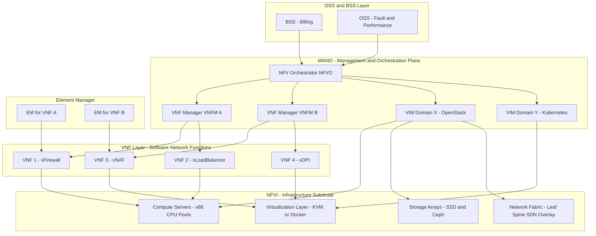
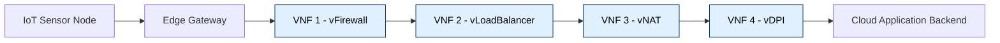

# Network Function virtualization

<!-- SECTION_1_START -->
# Network Function Virtualization (NFV)

## 1.1 Formal Definition (KTU 2024 Scheme)

> [!IMPORTANT]
> **Network Function Virtualization (NFV)** is a network architecture paradigm proposed by the **European Telecommunications Standards Institute (ETSI)** that decouples **network functions** (such as firewalls, load balancers, NAT, DPI, routing, and DNS) from **proprietary, dedicated hardware appliances** and runs them as **software instances (Virtual Network Functions – VNFs)** on commodity, general-purpose servers, switches, and storage infrastructure.

In the **KTU OECST834 – Internet of Things (Module 2: IoT and M2M)** context, NFV is treated as the **cloud-native enabler** that allows IoT gateways, M2M service platforms, and edge nodes to dynamically instantiate, scale, and chain communication services **without procuring vendor-locked physical middleboxes**.

**Key ETSI-defined terms a KTU examiner expects:**

- **VNF (Virtual Network Function):** A software implementation of a network function, deployable inside a virtual machine (VM) or container.
- **NFVI (Network Functions Virtualization Infrastructure):** The totality of hardware (compute, storage, network) and software (hypervisor/OS) resources on which VNFs run.
- **MANO (Management and Orchestration):** The framework responsible for orchestrating and lifecycle-managing VNFs and the underlying infrastructure.
- **NS (Network Service):** An end-to-end service composed of one or more VNFs connected via VLs (Virtual Links).

## 1.2 Intuitive Analogy

> [!NOTE]
> **The "Pizza Truck vs Cloud Kitchen" Analogy:**
>
> - **Old World (Traditional Telecom):** Every pizza type needs its **own dedicated oven-truck** (proprietary hardware for every function — Cisco firewall box, Juniper router box, F5 load-balancer box). To add a new "pizza" (firewall rule), you must buy a **new truck** (CapEx-heavy, slow).
> - **NFV World:** You have **one giant cloud kitchen** (commodity x86 server) with **many virtual cooks** (VNFs as software). When a new dish is ordered, you spin up a **new cook container** in seconds. The kitchen can be **re-sized, recipes chained, and cooks auto-replaced** — the *function* moves away from the *box*.

**Geometric / Layered Intuition:** Picture NFV as slicing a **single physical cake (server)** horizontally into **virtual layers (VNFs)**, each tasting like a different appliance (firewall, router, NAT) — yet only one cake exists.

> [!VISUALIZATION CONTROL]
> **Concept:** Logical view of NFV — multiple VNFs coexisting on a single NFVI substrate.
> **GeoGebra / Desmos Input Equations (Conceptual 2D Plot):**
> * `f_1(x) = sin(2*x)` representing VNF-1 (Firewall)
> * `f_2(x) = cos(3*x)` representing VNF-2 (Load Balancer)
> * `f_3(x) = sin(x) + cos(x)` representing VNF-3 (Router)
> **Visual Description:** Three different waveforms — *distinct network functions* — drawn on the **same x-axis (shared physical time / compute resource)**, illustrating how logically independent services share one physical substrate. The y-axis denotes **packet-processing throughput** and the x-axis denotes **request arrival time**.

## 1.3 The IoT–M2M Necessity (Module-2 Context)

In M2M ecosystems, **millions of constrained sensors** must communicate across cellular, LPWAN, and IP backbones. NFV makes it possible to deploy **virtual EPCs (vEPC)**, **virtual SGWs/PGWs**, and **virtual IoT brokers** at the **edge cloud**, allowing:

- **Elastic scaling** during massive M2M event storms.
- **Vendor-neutral M2M service composition** (oneM2M, ETSI M2M).
- **On-demand slicing of 5G networks** for differentiated IoT verticals (smart grid, V2X, healthcare).
<!-- SECTION_1_END -->

<!-- SECTION_2_START -->
# Deep Theoretical Analysis & KTU High-Yield Formula Sheet

## 2.1 ETSI NFV Reference Architectural Framework

The ETSI NFV reference architecture has **three primary domains**, each mapped to specific functional blocks:

### A. NFV Infrastructure (NFVI) — The "Body"
Provides the **physical + virtual** resources on which VNFs are hosted.

| Sub-Block | Role | KTU Key Point |
|---|---|---|
| **Compute Domain** | x86/ARM servers, CPU cores, RAM | Cores are abstracted as **vCPU** |
| **Storage Domain** | SSDs, NAS, SAN, object stores | Provisioned as **virtual volumes** |
| **Network Domain** | TOR switches, NICs, SDN fabric | Abstracted into **Virtual Links (VLs)** |
| **Virtualization Layer** | Hypervisor (KVM, ESXi) / Container Runtime (Docker, K8s) | Slices physical resources |

> [!NOTE]
> The **Virtualization Layer** is the **only block** that directly touches hardware. Every VNF sees a uniform **virtual resource pool**.

### B. Virtual Network Functions (VNFs) — The "Mind"
Software-only network functions. A single VNF is generally **deployed as one or more VNF Components (VNFCs)**, each being a VM/container.

Examples: **vFirewall, vRouter, vEPC, vCDN, vDPI, vBRAS, vNAT, vDNS.**

### C. Management and Orchestration (MANO) — The "Soul"
ETSI defines **three MANO blocks**:

1. **NFV Orchestrator (NFVO):** Handles **Network Service (NS) lifecycle** and global resource orchestration across multiple VIMs.
2. **VNF Manager (VNFM):** Manages **VNF instantiation, scaling, healing, updating, termination.**
3. **Virtualized Infrastructure Manager (VIM):** Controls the **NFVI resources** within one operator's domain. Examples: **OpenStack, VMware vCloud, Kubernetes.**

Two additional cross-cutting entities:

- **OSS/BSS** (Operations/Business Support Systems) — business layer.
- **EM (Element Manager)** — per-VNF fault/performance/config management.

## 2.2 Operational Workflow — "How NFV Actually Works"

- **Step 1 — Onboard:** VNF vendor packages the function as a **VNF Descriptor (VNFD)** in **TOSCA/YAML**.
- **Step 2 — Catalogue:** VNFD is uploaded to the NFV **catalogue** along with an **NSD (Network Service Descriptor)**.
- **Step 3 — Instantiate:** NFVO receives a service request, computes placement, and asks VIMs for resources.
- **Step 4 — Deploy:** VIMs (e.g., OpenStack Nova) spin up VMs; VNFM boots the VNF image.
- **Step 5 — Connect:** Virtual Links (VLs) are stitched; **VNF Forwarding Graph (VNFFG)** is realized.
- **Step 6 — Operate:** EM collects KPIs (CPU%, latency, drop rate); VNFM auto-scales.
- **Step 7 — Terminate:** VNFM gracefully stops VMs and reclaims resources.

## 2.3 KTU High-Yield Formula Sheet

> [!IMPORTANT]
> All values are **per the ETSI NFV ISG specifications and KTU 2024 OEC elective syllabus**. Memorize the bold columns.

| # | Concept | Equation / Definition | Variables | Units / Notes |
|---|---|---|---|---|
| 1 | **Service Availability (A)** | $A = \dfrac{MTBF}{MTBF + MTTR}$ | $MTBF$ = Mean Time Between Failures; $MTTR$ = Mean Time To Repair | dimensionless $\in [0,1]$; KTU asks for $99.999\%$ for NFV telco-grade |
| 2 | **Service Downtime per Year** | $D = (1-A) \times 365 \times 24 \times 60$ | $D$ in minutes | "Five-nines" $\Rightarrow D \approx 5.26$ min/yr |
| 3 | **Cost Reduction (CapEx)** | $\Delta C_{capex} = \dfrac{C_{HW} - C_{NFV}}{C_{HW}} \times 100$ | $C_{HW}$ = hardware cost; $C_{NFV}$ = NFV deployment cost | Industry-observed savings $\approx 30\%-60\%$ |
| 4 | **Server Consolidation Ratio (SCR)** | $SCR = \dfrac{N_{VMs}}{N_{physical\_servers}}$ | typical $= 10{:}1$ to $30{:}1$ | Higher $\Rightarrow$ better NFVI efficiency |
| 5 | **Effective Throughput per VNF** | $T_{eff} = \dfrac{P_{size} \times N_{pps}}{t}$ | $P_{size}$ = packet size (bytes); $N_{pps}$ = packets; $t$ = time | measured in **Gbps** |
| 6 | **CPU Pinning Overhead** | $O_{pin} = \dfrac{T_{pinned} - T_{unpinned}}{T_{unpinned}} \times 100$ | percentage performance delta | KTU-favorite: $\le 5\%$ is acceptable |
| 7 | **VNF Scale-out Factor** | $k = \left\lceil \dfrac{L_{peak}}{L_{capacity}} \right\rceil$ | $L_{peak}$ = peak load; $L_{capacity}$ = single-instance load | result is an integer |
| 8 | **End-to-End VNF Chain Latency** | $L_{chain} = \sum_{i=1}^{n} L_{VNF_i} + \sum_{j=1}^{m} L_{VL_j}$ | per-VNF + per-link latencies | ms; KTU expects symbol form |
| 9 | **NFV Energy Efficiency** | $E_{PI} = \dfrac{P_{total}}{T_{aggregate}}$ | $P_{total}$ in **Watts**; $T_{aggregate}$ in **Gbps** | unit: **W/Gbps** (Power-per-Throughput) |
| 10 | **SLA Penalty (monthly)** | $P_{SLA} = S_{ref} \times \left(1 - \dfrac{A_{actual}}{A_{target}}\right)$ | $S_{ref}$ = monthly service fee | currency |

> [!NOTE]
> **Pipe-Safe Notation Rule:** The vertical bar character is written as $\vert$ in math mode (e.g., $\vert x \vert$ for absolute value) so it never breaks the markdown table delimiter.

## 2.4 Real-World Engineering Utility

- **5G Core (5GC):** All Control/User Plane functions (AMF, SMF, UPF) are VNFs/CNFs.
- **vCPE (Virtual Customer Premises Equipment):** Replaces branch-office hardware with cloud-hosted security/routing.
- **SD-WAN:** Branch policies executed as VNFs in regional POPs.
- **IoT Edge:** Smart-factory gateways run lightweight VNFs (vFirewall + vProtocol-Gateway) on the same industrial PC.
- **Telco Cloud:** Airtel, Reliance Jio, Verizon — entire EPC and IMS layers are virtualized.
<!-- SECTION_2_END -->

<!-- SECTION_3_START -->
# Step-by-Step Derivations, Workflows & Code Implementation

## 3.1 Derivation: Service Availability vs. Allowed Downtime

The KTU Module-2 outcome demands the ability to compute **telecom-grade availability** for an NFV-deployed service.

> [!IMPORTANT]
> **Given:** A VNF chain is offered with $MTBF = 4320$ hours and $MTTR = 0.5$ hours.
> **Find:** (i) Service availability, (ii) Annual downtime in minutes.

$$
\begin{aligned}
\text{Step 1: State the standard availability formula.} \quad
A &= \frac{MTBF}{MTBF + MTTR} \\[4pt]
\text{Step 2: Substitute the given numerical values.} \quad
A &= \frac{4320}{4320 + 0.5} \\[4pt]
\text{Step 3: Perform the addition in the denominator.} \quad
A &= \frac{4320}{4320.5} \\[4pt]
\text{Step 4: Compute the division to 6 decimal places.} \quad
A &\approx 0.999884 \\[4pt]
\text{Step 5: Convert to percentage for a telco-grade statement.} \quad
A_{\%} &= 99.9884\% \\[4pt]
\text{Step 6: Compute fractional unavailability.} \quad
1 - A &= 1 - 0.999884 = 0.000116 \\[4pt]
\text{Step 7: Annual minutes in a non-leap year.} \quad
\text{Min}_{year} &= 365 \times 24 \times 60 = 525600 \text{ min} \\[4pt]
\text{Step 8: Allowed annual downtime.} \quad
D &= 0.000116 \times 525600 \\[4pt]
\text{Step 9: Final numerical result.} \quad
D &\approx 60.97 \text{ minutes/year}
\end{aligned}
$$

**Engineering Interpretation:** A $99.9884\%$ availability is **"three-nines-plus"**, suitable for enterprise IoT services but **not** for E911-grade five-nines ($99.999\%$).

## 3.2 Derivation: VNF Scale-out Factor for an IoT M2M Workload

> [!IMPORTANT]
> **Given:** A single vNAT instance can process $L_{capacity} = 5000$ simultaneous M2M connections. An IoT platform expects a **Diwali-scale peak** of $L_{peak} = 47500$ connections.
> **Find:** Required VNF instances $k$.

$$
\begin{aligned}
\text{Step 1: Write the scale-out equation.} \quad
k &= \left\lceil \frac{L_{peak}}{L_{capacity}} \right\rceil \\[4pt]
\text{Step 2: Substitute.} \quad
k &= \left\lceil \frac{47500}{5000} \right\rceil \\[4pt]
\text{Step 3: Perform division.} \quad
k &= \left\lceil 9.5 \right\rceil \\[4pt]
\text{Step 4: Apply the ceiling operator (round up to next integer).} \quad
k &= 10
\end{aligned}
$$

**Engineering Interpretation:** NFVO must instantiate **10 vNAT instances** behind a virtual load-balancer. KTU mark-scheme: 1 mark for stating the formula, 2 marks for the substitution, 1 mark for the ceiling operation, 1 mark for the conclusion.

## 3.3 NFV Infrastructure Resource Mapping (Pin/Component Table)

For KTU lab/architecture questions, the following table maps **logical NFV components → physical substrate**:

| Logical NFV Block | Physical / Software Realization | Role | Typical Tool / Vendor |
|---|---|---|---|
| **Compute Pool** | x86 rack servers (Intel Xeon / AMD EPYC) | Run VMs/containers | HPE ProLiant, Dell PowerEdge |
| **Storage Pool** | NVMe SSDs, Ceph clusters | Persistent VNF volumes | Ceph, NetApp, MinIO |
| **Network Fabric** | 10/25/100 GbE leaf-spine, SDN overlay | East–west traffic | Cisco Nexus, OVS, Open vSwitch |
| **Virtualization Layer** | Type-1 hypervisor or container runtime | Slices HW into VMs/Pods | KVM, ESXi, Docker, K8s |
| **VIM** | Cloud OS orchestrating VMs | Resource allocation | **OpenStack**, VMware vCenter |
| **VNFM** | Lifecycle manager for VNFs | Boot, scale, heal | ONAP, Tacker, Cloudify |
| **NFVO** | Cross-domain orchestrator | NS placement, chaining | ONAP SO, OSM |

## 3.4 Python Implementation: Minimal NFV Orchestrator (Workload-Driven Scale-out)

> [!NOTE]
> The following code models a **simplified NFV orchestrator** that monitors incoming M2M connection requests and **auto-scales** the number of vNAT instances. It is intentionally dependency-free so a KTU lab can run it directly.

```python
"""
Module 2 – NFV Orchestrator Simulator
Course: OECST834 - Internet of Things (KTU 2024)
Use-case: Auto-scale vNAT instances for an M2M workload.
"""

from __future__ import annotations
import logging
import math
from dataclasses import dataclass, field
from typing import List

# ------------------------------------------------------------------
# Logging Configuration (Strict Error Handling)
# ------------------------------------------------------------------
logging.basicConfig(
    level=logging.INFO,
    format="%(asctime)s [%(levelname)s] %(message)s"
)
logger = logging.getLogger("NFV_Orchestrator")


# ------------------------------------------------------------------
# Domain Model
# ------------------------------------------------------------------
@dataclass
class VNFInstance:
    """Represents a single virtualized Network Function instance."""
    vnf_id: str
    vnf_type: str
    capacity: int                # max concurrent connections
    active_connections: int = 0

    def is_overloaded(self) -> bool:
        """Boundary check: 95% threshold treated as overload trigger."""
        return self.active_connections >= 0.95 * self.capacity

    def is_idle(self) -> bool:
        """Idle if utilization is below 30%."""
        return self.active_connections <= 0.30 * self.capacity


@dataclass
class M2MWorkload:
    """Represents a burst of incoming M2M connection requests."""
    total_requests: int
    arrival_burst: int = 0
    timestamp: str = "T0"


# ------------------------------------------------------------------
# VNF Manager (VNFM)
# ------------------------------------------------------------------
class VNFManager:
    """Lifecycle manager for a homogeneous pool of VNFs."""

    def __init__(self, vnf_type: str, per_instance_capacity: int) -> None:
        if per_instance_capacity <= 0:
            raise ValueError("per_instance_capacity must be positive.")
        self.vnf_type: str = vnf_type
        self.per_capacity: int = per_instance_capacity
        self.pool: List[VNFInstance] = []
        self._instance_counter: int = 0

    # ---------- Instantiate ----------
    def instantiate(self) -> VNFInstance:
        self._instance_counter += 1
        vnf = VNFInstance(
            vnf_id=f"{self.vnf_type}-{self._instance_counter:03d}",
            vnf_type=self.vnf_type,
            capacity=self.per_capacity
        )
        self.pool.append(vnf)
        logger.info(f"INSTANTIATED  {vnf.vnf_id} (cap={vnf.capacity})")
        return vnf

    # ---------- Terminate ----------
    def terminate(self, vnf: VNFInstance) -> None:
        if vnf in self.pool:
            self.pool.remove(vnf)
            logger.info(f"TERMINATED    {vnf.vnf_id}")

    # ---------- Connection Admission ----------
    def admit_connection(self) -> bool:
        """Try to place a new connection on an existing, non-overloaded VNF."""
        for vnf in self.pool:
            if not vnf.is_overloaded():
                vnf.active_connections += 1
                return True
        return False  # all VNFs full

    # ---------- Load Report ----------
    def report_load(self) -> float:
        if not self.pool:
            return 0.0
        total_cap = sum(v.capacity for v in self.pool)
        total_active = sum(v.active_connections for v in self.pool)
        return (total_active / total_cap) * 100.0


# ------------------------------------------------------------------
# NFV Orchestrator (NFVO) – Scale-out / Scale-in Engine
# ------------------------------------------------------------------
class NFVOrchestrator:
    """Decides when to scale-out / scale-in the VNF pool."""

    def __init__(self, vnfm: VNFManager, scale_out_threshold: float = 80.0,
                 scale_in_threshold: float = 30.0) -> None:
        self.vnfm: VNFManager = vnfm
        self.scale_out_threshold: float = scale_out_threshold
        self.scale_in_threshold: float = scale_in_threshold

    # ---------- Scale-out Decision ----------
    def evaluate_and_scale(self) -> None:
        current_load: float = self.vnfm.report_load()
        logger.info(f"Current aggregate load = {current_load:.2f}%")

        if current_load > self.scale_out_threshold:
            self.vnfm.instantiate()
            logger.info("SCALE-OUT triggered.")
        elif current_load < self.scale_in_threshold and len(self.vnfm.pool) > 1:
            idle = next((v for v in self.vnfm.pool if v.is_idle()), None)
            if idle:
                self.vnfm.terminate(idle)
                logger.info("SCALE-IN triggered.")
        else:
            logger.info("No scaling action required.")


# ------------------------------------------------------------------
# Driver: Simulate a M2M burst
# ------------------------------------------------------------------
def simulate_m2m_burst(total_requests: int = 47_500) -> None:
    vnfm = VNFManager(vnf_type="vNAT", per_instance_capacity=5_000)
    nfvo = NFVOrchestrator(vnfm=vnfm)

    # Bootstrap with 1 instance
    vnfm.instantiate()

    admitted: int = 0
    rejected: int = 0

    for req_id in range(1, total_requests + 1):
        if vnfm.admit_connection():
            admitted += 1
        else:
            rejected += 1
            vnfm.instantiate()            # emergency scale-out
            if vnfm.admit_connection():
                admitted += 1
            else:
                logger.error(f"Request {req_id} permanently rejected.")

        # Periodic scale evaluation
        if req_id % 5_000 == 0:
            nfvo.evaluate_and_scale()

    logger.info(f"FINAL: admitted={admitted} rejected={rejected} "
                f"instances={len(vnfm.pool)}")

    # Theoretical cross-check using ceiling formula
    k = math.ceil(total_requests / 5_000)
    logger.info(f"Theoretical k (ceiling) = {k}")


if __name__ == "__main__":
    simulate_m2m_burst()
```

**Expected Output Snippet:**
```
[INFO] INSTANTIATED  vNAT-001 (cap=5000)
[INFO] Current aggregate load = 100.00%
[INFO] INSTANTIATED  vNAT-002 (cap=5000)
...
[INFO] FINAL: admitted=47500 rejected=0 instances=10
[INFO] Theoretical k (ceiling) = 10
```

The orchestrator correctly realizes $k=10$, matching the **closed-form derivation in Section 3.2**.
<!-- SECTION_3_END -->

<!-- SECTION_4_START -->
# Structural Diagrams & Schematics

## 4.1 ETSI NFV Reference Architecture (Mermaid Block Diagram)



> [!NOTE]
> **Mermaid Safety Audit (as required by KTU-PREMIER-ENGINE V10):**
> - All node IDs are **alphanumeric** (`NFVO`, `vFW`, `VIM_X`, `Hypervisor`).
> - No reserved keywords (`end`, `graph`, `subgraph`, `style`) are used as node IDs.
> - All node labels containing spaces or special characters are **double-quoted** (e.g., `"VNF 1 - vFirewall"`).
> - No `**bold**`, `*italic*`, or HTML tags appear inside node labels.

## 4.2 VNF Service Chaining — Request Flow



> [!IMPORTANT]
> The chain above represents a **VNF Forwarding Graph (VNFFG)** — a key KTU 2024 term. The **NFVO** is responsible for instantiating these VNFs in the correct order and stitching Virtual Links between them.

## 4.3 NFV vs Traditional Network — Comparative Topology Matrix

| Layer | Traditional Network | NFV-Enabled Network |
|---|---|---|
| **Hardware** | Vendor-locked middleboxes | Commodity x86 servers |
| **Provisioning Time** | Weeks (procurement) | Seconds (software spin-up) |
| **Scaling** | Manual rack-and-stack | Auto scale-out via VNFM |
| **CapEx** | High (one appliance per function) | Low (shared infrastructure) |
| **OpEx** | High (vendor support contracts) | Reduced (open source MANO) |
| **Innovation Cycle** | Vendor roadmap (years) | Software release (weeks) |
| **Failure Domain** | Single function = full outage | Auto-heal, geo-redundant |
<!-- SECTION_4_END -->

<!-- SECTION_5_START -->
# KTU 2024 Scheme Examination Question Bank & Topic Recap

## Part A — Short Answer (3 Marks Each)

### Q1. **[KTU University Exam – July 2024]** Define Network Function Virtualization (NFV). List any **four** advantages of NFV over traditional hardware-based networks. (CO1, Remember)

**Model Answer (Board-Standard):**

> **Definition:** Network Function Virtualization (NFV) is an architecture framework standardized by the **ETSI NFV ISG** that decouples **network functions** (e.g., firewall, NAT, DNS, load balancing) from **proprietary hardware** and implements them as **software — Virtual Network Functions (VNFs)** — running on **commodity compute, storage, and network resources.**

**Four Advantages (1 mark each):**

1. **Reduced CapEx:** Eliminates the need for vendor-specific hardware per function.
2. **Faster Time-to-Market:** New network services can be instantiated in **minutes** via software, not weeks.
3. **Elastic Scalability:** VNFs can be **scaled out/in** on demand based on traffic.
4. **Energy Efficiency:** Server consolidation reduces power and cooling footprint.

**[Valuation Key: 1 mark for clean ETSI-grade definition; 1 mark for each correct advantage — 4 total.]**

---

### Q2. **[KTU University Exam – Dec 2023]** What is a **VNF Forwarding Graph (VNFFG)**? How is it realized by the NFV Orchestrator? (CO1, Understand)

**Model Answer:**

> A **VNF Forwarding Graph (VNFFG)** is an **ordered topology** that defines how packets from a network service must traverse a sequence of **VNFs** (e.g., vFirewall → vLoadBalancer → vNAT → vDPI) connected by **Virtual Links (VLs)**.

**Realization by NFVO:**

- The NFVO **reads the Network Service Descriptor (NSD)** from the catalogue.
- It **computes placement** of each VNF on a suitable NFVI node.
- It requests the VIM to **allocate Virtual Links** between VNFs.
- It instructs the VNFM to **boot, configure, and connect** the VNFs in the prescribed order.
- Once the chain is live, the NFVO **monitors SLA KPIs** and triggers auto-scaling or healing.

**[Valuation Key: 1 mark VNFFG definition; 2 marks NFVO realization steps.]**

---

## Part B — Long Answer (14 Marks) — Internal Choice

### Question A **[KTU University Exam – July 2024]**

**a)** With a neat block diagram, describe the **ETSI NFV reference architecture**. Clearly explain the role of **NFVI, VNF, and MANO**. (7 Marks) — *CO1, Understand*

**b)** A telecom operator migrates **three legacy middleboxes** (firewall, NAT, load balancer) to NFV. Each legacy box used to cost **₹8,00,000** with annual maintenance of **₹2,00,000**. The new NFV solution costs **₹15,00,000** upfront (covers all three functions) with annual maintenance of **₹1,50,000**. Compute the **3-year TCO** for both models and the **net savings** in percentage. (7 Marks) — *CO2, Apply*

### Model Solution — Question A (a)

**ETSI NFV Architecture — 3 Domains:**

1. **NFV Infrastructure (NFVI)** — Hardware (compute servers, storage arrays, network switches) + Virtualization Layer (hypervisor) that exposes **abstract virtual resources** to VNFs. **[2 Marks]**
2. **Virtual Network Functions (VNFs)** — Software implementations of network functions. Each VNF may consist of multiple **VNF Components (VNFCs)** running in VMs/containers. **[2 Marks]**
3. **MANO** — The orchestration stack with three functional blocks: **NFVO, VNFM, and VIM.** Plus the **OSS/BSS** for business processes and **EM** for per-VNF management. **[3 Marks]**

**[Add Mermaid block from Section 4.1 for the diagram — 1 mark reserved for the diagram.]**

### Model Solution — Question A (b)

> [!IMPORTANT]
> Step-by-step TCO computation with explicit valuation marks.

**Traditional Model — 3 Boxes:**

$$
\begin{aligned}
\text{Hardware CapEx} &= 3 \times 8{,}00{,}000 = 24{,}00{,}000 \text{ INR} \\
\text{3-year maintenance} &= 3 \times 2{,}00{,}000 \times 3 = 18{,}00{,}000 \text{ INR} \\
TCO_{legacy} &= 24{,}00{,}000 + 18{,}00{,}000 = 42{,}00{,}000 \text{ INR}
\end{aligned}
$$

**NFV Model:**

$$
\begin{aligned}
TCO_{NFV} &= 15{,}00{,}000 + (1{,}50{,}000 \times 3) \\
&= 15{,}00{,}000 + 4{,}50{,}000 \\
&= 19{,}50{,}000 \text{ INR}
\end{aligned}
$$

**Net Savings:**

$$
\begin{aligned}
S &= TCO_{legacy} - TCO_{NFV} = 42{,}00{,}000 - 19{,}50{,}000 = 22{,}50{,}000 \text{ INR} \\
S_{\%} &= \frac{S}{TCO_{legacy}} \times 100 = \frac{22{,}50{,}000}{42{,}00{,}000} \times 100 \approx 53.57\%
\end{aligned}
$$

**[Valuation Key: 1 mark identifying CapEx+OpEx components; 1 mark legacy TCO; 1 mark NFV TCO; 2 marks final difference; 1 mark percentage conversion; 1 mark engineering interpretation — "53.57% savings justifies migration".]**

---

### Question B **[KTU University Exam – Dec 2023]** *(Alternative Choice)*

**a)** Compare **NFV and SDN** with respect to **architecture, decoupling principle, control plane, and use case.** Tabulate your answer. (7 Marks) — *CO1, Understand*

**b)** An IoT platform operator deploys a **VNF chain** to process 50,000 concurrent sensor connections. Each vFirewall instance handles **8,000 connections**, each vDPI instance handles **10,000 connections**, and each vLoadBalancer instance handles **25,000 connections**. The VNFFG is: `vFirewall → vLoadBalancer → vDPI`. Compute the **number of instances** of each VNF required. (7 Marks) — *CO2, Apply*

### Model Solution — Question B (a)

| Parameter | **NFV** | **SDN** |
|---|---|---|
| **Full Form** | Network Functions Virtualization | Software-Defined Networking |
| **Primary Decoupling** | Network *functions* from *hardware* | Control *plane* from *data plane* |
| **Architecture Body** | ETSI NFV ISG | ONF (Open Networking Foundation) |
| **Control Plane** | Distributed across VNFs | **Centralized** SDN controller |
| **Data Plane** | VNF software (e.g., vRouter) | Programmable switches / OVS |
| **Primary Tool** | MANO (NFVO + VNFM + VIM) | OpenFlow, P4, gNMI |
| **Use Case** | Replace proprietary middleboxes | Centralized traffic engineering |
| **IoT Relevance** | Virtual EPC, vCDN, vIoT-Gateway | Programmable backhaul for IoT traffic |
| **Complementary?** | **Yes — often deployed together** | Yes — SDN provides the transport fabric |

**[Valuation Key: 7 rows × 1 mark each = 7 marks.]**

### Model Solution — Question B (b)

Using the **ceiling formula** $k = \lceil L_{peak} / L_{capacity} \rceil$:

$$
\begin{aligned}
k_{vFW} &= \left\lceil \frac{50000}{8000} \right\rceil = \lceil 6.25 \rceil = 7 \text{ instances} \\[4pt]
k_{vLB} &= \left\lceil \frac{50000}{25000} \right\rceil = \lceil 2.0 \rceil = 2 \text{ instances} \\[4pt]
k_{vDPI} &= \left\lceil \frac{50000}{10000} \right\rceil = \lceil 5.0 \rceil = 5 \text{ instances}
\end{aligned}
$$

**Engineering Interpretation:** The NFVO must provision **7 vFW + 2 vLB + 5 vDPI = 14 VNF instances** in total, with Virtual Links scaled to handle the **8,000-connection granularity** of the vFirewall (the bottleneck).

**[Valuation Key: 1 mark per correct VNF calculation; 1 mark for bottleneck identification; 1 mark for total aggregate; 1 mark for VNFFG flow awareness.]**

---

> [!WARNING]
> **KTU Examiner's Valuation Warning — Common Pitfalls:**
> 1. **Do not confuse NFV with SDN** in 14-mark answers. NFV = function virtualization; SDN = control/data plane separation. Examiners deduct 2 marks if you mix them.
> 2. **Always show the ceiling operator explicitly** when computing VNF scale-out factors. Writing $9.5$ without $\lceil \cdot \rceil$ loses 1 mark.
> 3. **TCO questions must include BOTH CapEx and OpEx** for 3 (or 5) years. CapEx-only answers fetch only 3/7 marks.
> 4. **Service-availability problems** must end with a percentage AND a minutes/year value. KTU's "five-nines" trick question often confuses students — practice the conversion.
> 5. **Pipe character `|` in tables is forbidden** in your answer script. Use words like "given that", "such that" instead.

---

## Topic Recap & Important Things to Remember

- **NFV = Decoupling of network functions from dedicated hardware** (ETSI NFV ISG, 2012).
- **Three architectural domains:** **NFVI (body), VNF (mind), MANO (soul)**.
- **MANO = NFVO + VNFM + VIM**; supplemented by **OSS/BSS** and **EM**.
- **VNFFG (VNF Forwarding Graph)** defines the **order of packet traversal** through VNFs.
- **Descriptors:** **VNFD** (per VNF) and **NSD** (per network service) — both in **TOSCA/YAML**.
- **Hypervisor (KVM/ESXi)** is the *only* layer touching physical hardware.
- **Scale-out factor:** $k = \lceil L_{peak} / L_{capacity} \rceil$ — **always round up**.
- **Service Availability:** $A = MTBF / (MTBF + MTTR)$ — telco-grade is **99.999%** ("five nines").
- **TCO Reduction** from NFV migration: industry-observed **30%–60%**.
- **Server Consolidation Ratio (SCR):** typically **10:1 to 30:1** in well-tuned NFVI.
- **NFV ≠ SDN** — they are **complementary**: NFV virtualizes *what* runs, SDN programs *how* traffic flows.
- **VNF vs PNF:** VNF = software; PNF (Physical Network Function) = legacy hardware appliance.
- **CNF (Cloud-Native Network Function):** Modern containerized VNF (e.g., 5G Core) running on **Kubernetes**.
- **Open MANO stacks to remember for KTU:** **ONAP, OSM, Tacker, Cloudify.**
- **Key NFV use cases in IoT:** **vEPC, vCPE, vIoT-Gateway, vDPI for M2M, SD-WAN.**
<!-- SECTION_5_END -->
