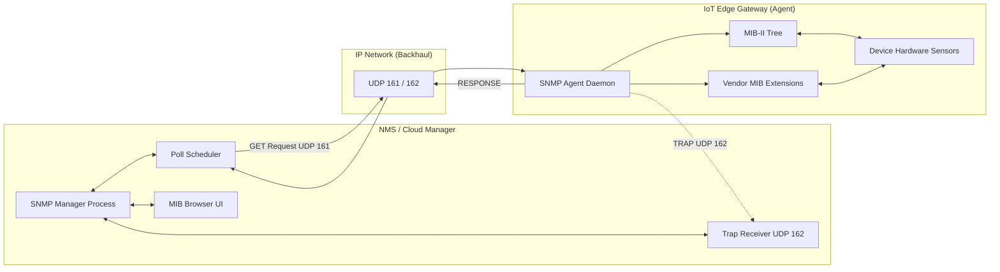
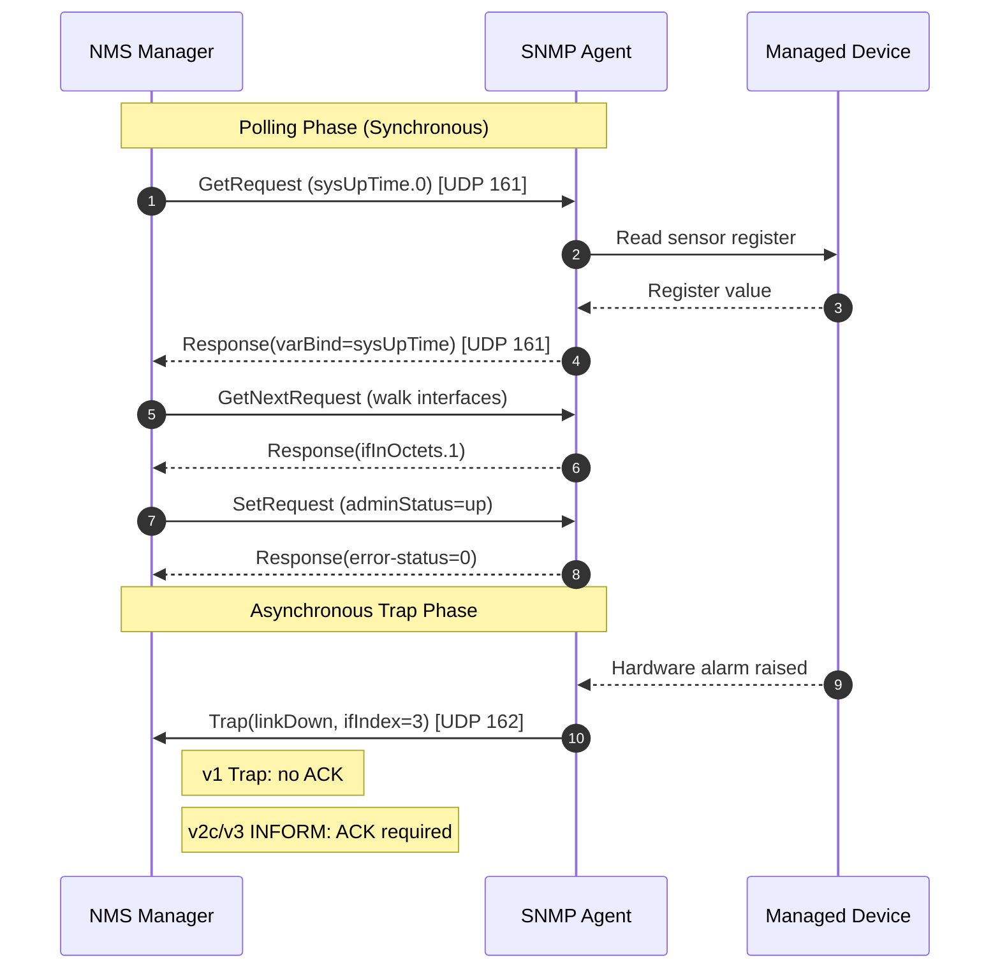
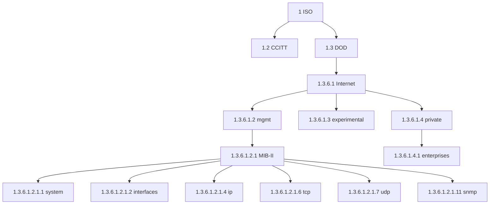
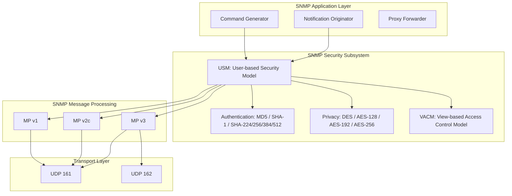

# Simple Network Management Protocol (SNMP)

<!-- SECTION_1_START -->
# Simple Network Management Protocol (SNMP)

## 1.1 Formal Academic Definition

The **Simple Network Management Protocol (SNMP)** is an application-layer network management protocol defined by the **Internet Engineering Task Force (IETF)** under **RFC 1157** (v1), **RFC 3411–3418** (v3), and operating over the **User Datagram Protocol (UDP)** on ports **161** (agent) and **162** (manager). It is the de-facto industry standard for monitoring, configuring, and managing heterogeneous network-attached devices — including routers, switches, servers, IoT gateways, and embedded sensors — within TCP/IP networks.

> [!IMPORTANT]
> **KTU Syllabus Highlight (Module 2 – IoT and M2M):**
> SNMP is the *core* management plane for M2M (Machine-to-Machine) ecosystems. In the KTU 2024 OEC, it is tested under the M2M value chain (Module 2.3: "Management – Network Management Protocols for M2M"). You must be able to draw the manager–agent architecture, decode a PDU, and explain version differences (v1/v2c/v3).

## 1.2 Conceptual Analogy — The "Hospital Analogy"

Imagine a large hospital with hundreds of patients (network devices), each wearing a wristband sensor (an **SNMP Agent**). The ward nurse station (the **Network Management Station / NMS / Manager**) periodically walks around and asks each patient:
- *"What is your heart rate?"* → **GET Request**
- *"Please take this medicine"* → **SET Request**
- *"Alert! Patient collapsed!"* → **TRAP / INFORM (asynchronous alert)**

The patient's wristband stores standard vital parameters in a tiny **electronic health record (MIB — Management Information Base)**. The nurse station uses a **universal medical dictionary (SMI — Structure of Management Information)** so that "heart rate" means the same thing to every patient. The conversation is in a specific format (**PDU — Protocol Data Unit**). This is *exactly* how SNMP works between a manager and managed IoT/M2M devices.

## 1.3 Core Constituents of SNMP (KTU Board Definition)

1. **Manager (NMS)** — the central console that issues queries and receives alerts.
2. **Agent** — a software daemon embedded inside every managed device (router, switch, IoT sensor node).
3. **Management Information Base (MIB)** — a virtual database (ASN.1 structured) of manageable objects living on the agent.
4. **Object Identifier (OID)** — a globally unique hierarchical address for each MIB variable (e.g., `1.3.6.1.2.1.1.3.0` for system uptime).
5. **SMI (Structure of Management Information)** — the rulebook (subset of ASN.1) defining *how* MIB objects are described.
6. **PDU (Protocol Data Unit)** — the binary message format exchanged between manager and agent.

> [!NOTE]
> **Mandatory UDP Port Numbers to Memorize:**
> - **Port 161** → Agent listens here for Manager requests (GET, SET, GETNEXT, GETBULK, RESPONSE).
> - **Port 162** → Manager listens here for asynchronous Agent notifications (TRAP, INFORM).

## 1.4 SNMP in the M2M Value Chain

M2M communication is the *backbone* of IoT. SNMP sits on top of M2M providing the **fault, configuration, accounting, performance, and security (FCAPS)** management functions. The standard M2M reference model is:

$$ \text{Device (Sensor)} \xrightarrow{\text{Capillary Network (ZigBee/BLE)}} \text{Gateway/Edge} \xrightarrow{\text{Backhaul (Cellular/Ethernet)}} \text{NMS/Cloud} $$

SNMP typically manages the **Gateway and Backhaul** segments, while lightweight variants like **CoAP** or **LwM2M** are used on the *device* side.

> [!VISUALIZATION CONTROL]
> **Concept:** SNMP Operational Triad — Manager, Agent, MIB
> **GeoGebra / Desmos Input Equations:**
> * `Circle Manager at (0,4)`
> * `Circle Agent at (-3,0), (3,0)`
> * `BezierCurve((0,4),(0,2)) for Manager↔Agent requests`
> * `Line((0,4),(0,2)) for UDP/161`
> **Visual Description:** Central node (Manager) at the top, two agent nodes at the base, two-way arrows showing GET/SET exchange on UDP/161, and an upward arrow showing asynchronous TRAP on UDP/162.
<!-- SECTION_1_END -->

<!-- SECTION_2_START -->
# Deep Theoretical Analysis — SNMP Architecture & Operations

## 2.1 SNMP Architectural Entities (Manager–Agent Model)

SNMP uses a **distributed polling/notification architecture** with three logical roles:

| Entity | Role | Default UDP Port | Initiates? |
|---|---|---|---|
| **Network Management Station (NMS / Manager)** | Polls agents, sets variables, receives traps | **162** (incoming traps) | Yes (requests) |
| **SNMP Agent** | Resides in the managed device, exposes MIB | **161** (incoming requests) | Yes (traps only) |
| **Proxy Agent** | Translates SNMP to a non-SNMP device (e.g., legacy Modbus sensor) | 161 | Yes |

The interaction is **request/response (synchronous)** for GET/SET and **unsolicited (asynchronous)** for TRAP/INFORM.

## 2.2 The Management Information Base (MIB) and OID

Every MIB object is described using **ASN.1 (Abstract Syntax Notation One)** and assigned a globally unique **Object Identifier (OID)**. The OID is a dotted-decimal sequence under the ISO/ITU-T administered tree:

$$ \text{OID} = 1.\underbrace{3}_{\text{ISO}}.\underbrace{6}_{\text{DOD}}.\underbrace{1}_{\text{Internet}}.\underbrace{4}_{\text{private}}.\underbrace{1}_{\text{enterprises}}. \text{Vendor.Leaf} $$

The two most critical standard MIBs are:
- **MIB-I (RFC 1156)** — 8 groups, 114 objects, now obsolete.
- **MIB-II (RFC 1213)** — 10 groups (system, interfaces, IP, ICMP, TCP, UDP, EGP, transmission, SNMP, dot1dBridge), the modern base.

Example OIDs a KTU examiner loves:
- `1.3.6.1.2.1.1.1.0` → `sysDescr` (system description)
- `1.3.6.1.2.1.1.3.0` → `sysUpTime` (time since last boot, in hundredths of a second)
- `1.3.6.1.2.1.1.5.0` → `sysName` (hostname)
- `1.3.6.1.2.1.2.2.1.10` → `ifInOctets` (bytes received on an interface)

## 2.3 SNMP Protocol Operations (The 7 PDU Types)

| PDU Type | Code | Direction | Purpose |
|---|---|---|---|
| **GetRequest** | 0 | Manager → Agent | Retrieve the value of one OID |
| **GetNextRequest** | 1 | Manager → Agent | Retrieve the *next* OID lexicographically (table-walk) |
| **Response** | 2 | Agent → Manager | Reply to GET/SET (carries value or error) |
| **SetRequest** | 3 | Manager → Agent | Modify/write the value of one OID |
| **Trap** | 4 | Agent → Manager | Asynchronous unsolicited alert (v1) |
| **GetBulkRequest** | 5 | Manager → Agent | Bulk retrieval (v2c onwards) |
| **InformRequest** | 6 | Manager → Manager | Acknowledged trap (manager-to-manager) |

## 2.4 SNMP PDU Structure (SNMPv1/v2c) — KTU Exam Favorite

The SNMPv1/v2c PDU is encapsulated as: `Message → Version | Community | PDU`. The PDU body is:

$$
\text{PDU} = \begin{cases}
\text{request-id} & \text{(integer, matches request to response)} \\
\text{error-status} & \text{(0 = noError, 1–5 enumerated)} \\
\text{error-index} & \text{(offset of faulty variable, if any)} \\
\text{VariableBindings} & \text{(list of (name, value) pairs)}
\end{cases}
$$

The seven standardized error-status values are: `noError(0)`, `tooBig(1)`, `noSuchName(2)`, `badValue(3)`, `readOnly(4)`, `genErr(5)`, and in v2c: `noAccess(6)`, `wrongType(7)`, `wrongLength(8)`, `wrongEncoding(9)`, `wrongValue(10)`, `noCreation(11)`, `inconsistentValue(12)`, `resourceUnavailable(13)`, `commitFailed(14)`, `undoFailed(15)`, `authorizationError(16)`.

## 2.5 SNMP Versions — Comparative Analysis

| Feature | **SNMPv1** (1988) | **SNMPv2c** (1993) | **SNMPv3** (2002) |
|---|---|---|---|
| **RFC** | 1157 | 1901–1908 | 3411–3418 |
| **Auth** | Community string (plaintext) | Community string | **MD5/SHA** (USM) |
| **Privacy / Encryption** | None | None | **DES / AES-128/192/256** |
| **New PDUs** | 5 | + GetBulk, Inform | Same as v2c |
| **Bulk Retrieval** | No | Yes | Yes |
| **ACK on Trap** | No | No (Trap) / **Yes (Inform)** | Yes (Inform) |
| **Production Use (2024+)** | Deprecated | Legacy | **Mandatory** |
| **M2M/IoT Suitability** | Poor | Medium | **High (with LwM2M)** |

> [!NOTE]
> **SNMPv3 Architecture:** It adds the **USM (User-based Security Model)** for authentication/privacy, and the **VACM (View-based Access Control Model)** for granular MIB-view permissions. Three security levels exist: `noAuthNoPriv`, `authNoPriv`, `authPriv`.

## 2.6 KTU Formula & Cheat Sheet

$$
\boxed{
\begin{aligned}
\text{SNMP Message} &= \text{Version} \;||\; \text{Community} \;||\; \text{PDU} \\[4pt]
\text{PDU}_{\text{request}} &= \text{PDU-type} \;||\; \text{Request-ID} \;||\; \text{Error-Status} \;||\; \text{Error-Index} \;||\; \text{VarBindList} \\[4pt]
\text{OID}_{\text{sysUpTime}} &= 1.3.6.1.2.1.1.3.0 \\[4pt]
\text{Throughput}_{\text{polled}} &= \frac{\text{Devices}}{\text{Polling-Interval}} \;\;\; \text{(devices/sec)}
\end{aligned}
}
$$

| Parameter | Value | KTU Significance |
|---|---|---|
| **Default Agent Port** | **UDP 161** | Frequently asked |
| **Default Manager Port** | **UDP 162** | Frequently asked |
| **Transport Protocol** | UDP (no TCP in original spec) | Why? low overhead, fire-and-forget traps |
| **Encoding** | **BER (Basic Encoding Rules of ASN.1)** | Mandatory knowledge |
| **Community String (v1/v2c)** | `public` (RO) / `private` (RW) | Security flaw |
| **Trap Destinations** | Configured in agent's `snmpd.conf` | Not polled |
| **Polling Interval** | Typically 5–60 s | Trade-off: latency vs bandwidth |

## 2.7 Real-World Engineering Utility

- **Cisco IOS, Juniper JunOS, Huawei VRP** — every enterprise router exposes an SNMP agent. Tools like **Zabbix, PRTG, Nagios, SolarWinds, LibreNMS** consume the data.
- **IoT Edge Gateways** (e.g., AWS IoT Greengrass, Azure IoT Edge) run **Net-SNMP** daemons to expose gateway health metrics to the cloud NMS.
- **Industrial M2M (SCADA, Modbus-to-SNMP proxies)** — SNMP proxies translate Modbus/Profibus register data into MIB variables.
- **Data Center Energy Management (DCEM)** — SNMP polls **PDU (Power Distribution Units)** for amperage and temperature — directly supporting **FCAPS**.
<!-- SECTION_2_END -->

<!-- SECTION_3_START -->
# Step-by-Step Derivations, Walk-throughs & Python Implementation

## 3.1 Worked Example 1 — Encoding a GetRequest PDU for `sysUpTime.0`

**Problem (KTU-style):** Construct the BER-encoded SNMPv1 GetRequest PDU for OID `1.3.6.1.2.1.1.3.0` (sysUpTime.0) with `request-id = 17`, `error-status = 0`, `error-index = 0`, and an empty value (NULL placeholder).

### Step 1 — Encode the OID

$$
\text{OID} = 1.3.6.1.2.1.1.3.0 \;\;\Longrightarrow\;\; \text{bytes} = \texttt{06 07 2B 06 01 02 01 01 03 00}
$$

where `06` is the **ASN.1 UNIVERSAL OID tag** and `07` is the *length* of the encoded value. The value is the BER sub-identifier encoding of the OID (40×first + second = 40×1 + 3 = **43 = 0x2B**, then 6, 1, 2, 1, 1, 3, 0).

### Step 2 — Encode the Variable Binding

A VarBind is a SEQUENCE of (name, value). For a GET, the value is the **NULL** type.

$$
\text{VarBind} = \text{Seq}\{ \; \text{OID}(\texttt{1.3.6.1.2.1.1.3.0}), \; \text{NULL} \; \}
$$

### Step 3 — Encode the PDU Header

The PDU header fields use ASN.1 INTEGER:

$$
\begin{aligned}
\text{Request-ID} &= \text{INTEGER}(17) \;\Rightarrow\; \texttt{02 01 11} \\
\text{Error-Status} &= \text{INTEGER}(0)  \;\Rightarrow\; \texttt{02 01 00} \\
\text{Error-Index} &= \text{INTEGER}(0)   \;\Rightarrow\; \texttt{02 01 00}
\end{aligned}
$$

### Step 4 — Assemble the full PDU

$$
\boxed{
\texttt{A0 1E} \;\|\; \texttt{02 01 11} \;\|\; \texttt{02 01 00} \;\|\; \texttt{02 01 00} \;\|\; \texttt{30 11} \;\|\; \texttt{30 0F} \;\|\; \texttt{06 07 2B 06 01 02 01 01 03} \;\|\; \texttt{05 00}
}
$$

- `A0` = context-specific tag **0** (GetRequest, **constructed**).
- `1E` = PDU body length (30 bytes).
- `30 11` = SEQUENCE (VarBindList), length 17.
- `30 0F` = SEQUENCE (VarBind), length 15.
- `05 00` = NULL tag and length 0.

> [!TIP]
> **Valuation Tip (3 marks, KTU):** If asked to "draw the SNMPv1 GetRequest PDU format", you **must** label: *PDU-type | request-id | error-status | error-index | VarBindList*. Forgetting `error-index` loses 1 mark.

## 3.2 Worked Example 2 — Decoding a TRAP PDU

SNMPv1 TRAPs have a *unique* 6-field format (not shared with other PDUs). Given the trap from a router with IP `10.0.0.1`:

| Field | Value | Meaning |
|---|---|---|
| `enterprise` | `1.3.6.1.4.1.9.1.14` | Cisco enterprise (OID under enterprises.9) |
| `agent-addr` | `10.0.0.1` | IP of the trap-generating device |
| `generic-trap` | `4` | **authenticationFailure** |
| `specific-trap` | `0` | Specific code (only for generic-trap=6) |
| `time-stamp` | `1234567` | sysUpTime at trap emission (1/100 s) |
| `var-bind-list` | empty | Optional context variables |

> [!IMPORTANT]
> **Generic Trap Codes (KTU must-know):**
> `0 coldStart, 1 warmStart, 2 linkDown, 3 linkUp, 4 authenticationFailure, 5 egpNeighborLoss, 6 enterpriseSpecific.`

## 3.3 Worked Example 3 — Polling Throughput Calculation

A campus NMS polls 500 IoT gateway agents. Each agent has 25 OIDs in its MIB. The polling interval is 30 s. Compute the **average query throughput** in OIDs/sec.

$$
\begin{aligned}
\text{Total OIDs per cycle} &= N \times k = 500 \times 25 = 12{,}500 \text{ OIDs} \\
\text{Throughput} &= \frac{12{,}500}{30} \approx 416.67 \text{ OIDs/sec}
\end{aligned}
$$

**Valuation Key (1 mark per line):** Stating the formula (1) → substitution (1) → final answer (1).

## 3.4 Python Implementation — SNMP Manager (Real Library)

```python
"""
SNMP Manager Example using pysnmp (v6.x asyncio API)
Polls sysUpTime (1.3.6.1.2.1.1.3.0) and sysName from a target agent.
Tested against Net-SNMP on Linux. Works with SNMPv1, v2c, and v3.
"""
from pysnmp.hlapi.v3arch.asyncio import (
    SnmpEngine, CommunityData, UdpTransportTarget, ContextData,
    ObjectType, ObjectIdentity, get_cmd, bulk_cmd, notify_cmd,
)
import asyncio
import logging

logging.basicConfig(level=logging.INFO, format="%(asctime)s | %(levelname)s | %(message)s")


async def snmp_get(target_ip: str, oid: str, community: str = "public") -> str:
    """
    Perform a synchronous SNMPv2c GET on a single OID.
    Returns the value as a string, or raises on error.
    """
    if not target_ip or not oid:
        raise ValueError("target_ip and oid are mandatory non-empty parameters")

    snmp_engine = SnmpEngine()
    error_indication, error_status, error_index, var_binds = await get_cmd(
        engine=snmp_engine,
        auth_data=CommunityData(community, mpModel=1),  # 0=v1, 1=v2c, 3=v3
        transport=UdpTransportTarget((target_ip, 161), timeout=2, retries=1),
        context=ContextData(),
        obj_types=[ObjectType(ObjectIdentity(oid))],
    )

    if error_indication:
        raise RuntimeError(f"SNMP error indication: {error_indication}")
    if error_status:
        raise RuntimeError(
            f"SNMP error status: {error_status.prettyPrint()} at index {error_index}"
        )

    return ", ".join(f"{name.prettyPrint()} = {val.prettyPrint()}" for name, val in var_binds)


async def snmp_walk(target_ip: str, base_oid: str) -> list[tuple[str, str]]:
    """
    Perform an SNMPv2c GETBULK walk on a sub-tree.
    Returns a list of (OID, value) tuples.
    """
    results: list[tuple[str, str]] = []
    snmp_engine = SnmpEngine()
    non_repeaters, max_repetitions = 0, 25

    current_oid = base_oid
    while True:
        error_indication, error_status, error_index, var_binds = await bulk_cmd(
            engine=snmp_engine,
            auth_data=CommunityData("public", mpModel=1),
            transport=UdpTransportTarget((target_ip, 161), timeout=2, retries=1),
            context=ContextData(),
            non_repeaters=non_repeaters,
            max_repetitions=max_repetitions,
            obj_types=[ObjectType(ObjectIdentity(current_oid))],
        )
        if error_indication or error_status:
            logging.warning("Walk terminated: %s / %s", error_indication, error_status)
            break

        for var_bind in var_binds:
            oid_str, val_str = var_bind[0].prettyPrint(), var_bind[1].prettyPrint()
            if not oid_str.startswith(base_oid):
                return results
            results.append((oid_str, val_str))
            current_oid = oid_str

        if len(var_binds) < max_repetitions:
            break  # end-of-tree reached

    return results


async def main() -> None:
    target = "127.0.0.1"  # change to your IoT gateway IP
    try:
        uptime = await snmp_get(target, "1.3.6.1.2.1.1.3.0")
        hostname = await snmp_get(target, "1.3.6.1.2.1.1.5.0")
        print(f"[OK] sysUpTime  -> {uptime}")
        print(f"[OK] sysName    -> {hostname}")
    except Exception as exc:
        logging.error("Polling failed: %s", exc)


if __name__ == "__main__":
    asyncio.run(main())
```

## 3.5 Python — SNMPv3 Authenticated + Encrypted SET (Production Grade)

```python
"""
SNMPv3 SET request with SHA authentication and AES-128 privacy.
Use case: secure IoT actuator control (e.g., reboot a remote gateway).
"""
from pysnmp.hlapi.v3arch.asyncio import (
    SnmpEngine, UsmUserData, UdpTransportTarget, ContextData,
    ObjectType, ObjectIdentity, set_cmd, usmHMACSHAAuthProtocol,
    usmAesCfb128Protocol,
)
import asyncio


async def secure_reboot(target_ip: str, user: str, auth_key: str, priv_key: str) -> None:
    snmp_engine = SnmpEngine()

    user_data = UsmUserData(
        userName=user,
        authKey=auth_key,
        privKey=priv_key,
        authProtocol=usmHMACSHAAuthProtocol,
        privProtocol=usmAesCfb128Protocol,
    )

    error_indication, error_status, error_index, var_binds = await set_cmd(
        engine=snmp_engine,
        auth_data=user_data,
        transport=UdpTransportTarget((target_ip, 161), timeout=3, retries=2),
        context=ContextData(),
        obj_types=[
            ObjectType(
                ObjectIdentity("1.3.6.1.4.1.9.9.187.0.1"),  # ciscoReboot
                1,                                          # reboot(1)
            )
        ],
    )

    if error_indication:
        raise RuntimeError(f"Transport error: {error_indication}")
    if error_status:
        raise RuntimeError(f"Agent rejected SET: {error_status.prettyPrint()}")

    print("[OK] Secure reboot SET acknowledged by agent.")


# Example (NEVER hard-code in production):
# asyncio.run(secure_reboot("10.0.0.1", "iotadmin", "authPass#2024", "privPass#2024"))
```
<!-- SECTION_3_END -->

<!-- SECTION_4_START -->
# Structural Diagrams & Schematics

## 4.1 SNMP Manager–Agent Communication Flow



## 4.2 SNMP Polling and Trap Sequence (Timing Diagram)



## 4.3 OID Tree (Internet Subtree — What KTU Asks)



## 4.4 SNMPv3 Security Architecture (Block-Level Functional Topology)



## 4.5 MIB Object Definition Template (KTU Diagram)

A KTU examiner often asks to draw a MIB object structure:

```
MIB MODULE-IDENTITY ::= { sysObjectID 1 }
    sysDescr    OBJECT-TYPE  ::= { system 1 }  -- DisplayString, RO
    sysObjectID OBJECT-TYPE  ::= { system 2 }  -- OBJECT IDENTIFIER, RO
    sysUpTime   OBJECT-TYPE  ::= { system 3 }  -- TimeTicks, RO
    sysContact  OBJECT-TYPE  ::= { system 4 }  -- DisplayString, RW
    sysName     OBJECT-TYPE  ::= { system 5 }  -- DisplayString, RW
    sysLocation OBJECT-TYPE  ::= { system 6 }  -- DisplayString, RW
    sysServices OBJECT-TYPE  ::= { system 7 }  -- INTEGER (0..127), RO
```
<!-- SECTION_4_END -->

<!-- SECTION_5_START -->
# KTU 2024 Scheme Examination Question Bank & Topic Recap

## Part A — 3-Mark Short Answer Questions

### Q1. `[KTU University Exam — July 2024]`  *(CO2, Remember)*
**List the SNMP PDU types defined in SNMPv2c and state the direction (Manager→Agent or Agent→Manager) of each.**

**Model Answer (3 marks — 1 mark per correct grouping):**
1. **Manager → Agent:** `GetRequest (0)`, `GetNextRequest (1)`, `SetRequest (3)`, `GetBulkRequest (5)`, `InformRequest (6 — manager-to-manager)`.
2. **Agent → Manager:** `Response (2)`, `Trap (4)`.
3. *GetBulk* and *Inform* were introduced in v2c; *Trap* is the only asynchronous PDU from the agent.

### Q2. `[KTU University Exam — Dec 2023]`  *(CO2, Understand)*
**Differentiate between SNMP Trap and SNMP Inform with respect to acknowledgement and reliability.**

**Model Answer (3 marks):**
- **Trap (v1/v2c):** Asynchronous, **unacknowledged** (fire-and-forget), uses **UDP 162**, no guarantee of delivery.
- **Inform (v2c/v3):** Asynchronous, **acknowledged** — receiver must send a `Response` PDU, providing **reliable delivery** at the cost of extra round-trip latency. Useful for inter-manager notifications.

---

## Part B — 14-Mark Questions (Module Internal Choice)

### **Question A (14 Marks)** — Architecture & PDU Deep-Dive

#### (a) `[7 Marks, Apply]`  *(CO2, Apply)*
**With a neat diagram, explain the SNMP Manager–Agent architecture. Identify the four key components and specify the transport protocol and port numbers used.**

**Model Answer (Valuation Key):**
- **[Diagram (3 marks)]:** Draw NMS at top, agents at bottom, two-way arrows labelled UDP/161 (request/response) and UDP/162 (trap).
- **[Component listing (2 marks)]:** Manager (NMS), Agent, MIB, OID.
- **[Protocol and ports (2 marks)]:** UDP; **161 (agent listener)**, **162 (manager listener)**.

#### (b) `[7 Marks, Apply]`  *(CO3, Apply)*
**Construct the SNMPv1 GetRequest PDU for the OID `1.3.6.1.2.1.1.5.0` (sysName.0) with request-id = 45, error-status = 0, error-index = 0, value = NULL. Show the BER encoding of every field.**

**Model Answer (Stepwise):**
1. **[Tag + Length identification (1 mark)]:** `A0` = GetRequest tag (ctx-0, constructed); `06` = OID universal tag; `05` = NULL universal tag.
2. **[OID encoding (2 marks)]:** `1.3.6.1.2.1.1.5.0` → BER bytes `2B 06 01 02 01 01 05 00` → TLV `06 08 2B 06 01 02 01 01 05 00`.
3. **[PDU header fields (2 marks)]:** `02 01 2D` (req-id 45), `02 01 00` (err-stat 0), `02 01 00` (err-index 0).
4. **[VarBindList (1 mark)]:** `30 0C` (SEQUENCE), inside: OID TLV + `05 00` (NULL value).
5. **[Final assembled PDU (1 mark)]:** Length-byte arithmetic correct.

---

### **Question B (14 Marks)** — SNMPv3 & M2M Management

#### (a) `[7 Marks, Understand]`  *(CO2, Understand)*
**Compare SNMPv1, SNMPv2c, and SNMPv3 in a tabular form with respect to authentication, privacy, new PDUs, and recommended use-case in IoT/M2M environments.**

**Model Answer:**
| Feature | v1 | v2c | v3 |
|---|---|---|---|
| RFC | 1157 | 1901 | 3411–3418 |
| Auth | Community | Community | **MD5/SHA (USM)** |
| Privacy | None | None | **DES/AES** |
| New PDUs | — | GetBulk, Inform | Same as v2c |
| IoT use | Insecure | Legacy | **Mandatory for production** |

**[Allocation: 5 rows × 1 mark = 5 marks; conclusion line about IoT recommendation = 2 marks]**

#### (b) `[7 Marks, Apply]`  *(CO3, Apply)*
**An IoT NMS polls 300 gateways every 60 seconds, fetching 20 MIB objects per gateway. Calculate the polling throughput in OIDs/sec. If 8 gateways become unreachable, what is the *effective* throughput assuming each timeout wastes 2 seconds of poll-cycle budget?**

**Model Answer (Stepwise):**
1. **[Total OIDs per full cycle (2 marks)]:** $300 \times 20 = 6000$ OIDs.
2. **[Theoretical throughput (1 mark)]:** $6000 / 60 = 100$ OIDs/sec.
3. **[Unreachable gateway penalty (2 marks)]:** $8 \times 2 = 16$ sec wasted per cycle.
4. **[Effective cycle (1 mark)]:** $60 - 16 = 44$ sec → 6000 OIDs in 44 sec.
5. **[Effective throughput (1 mark)]:** $6000 / 44 \approx 136.36$ OIDs/sec.
6. **Insight (bonus, not mandatory):** Effective throughput paradoxically *increases* because poll-cycle is shortened — this is why adaptive polling is preferred.

---

> [!WARNING]
> **KTU Examiner's Valuation Warning — Common Pitfalls:**
> 1. **Forgetting error-index field** in the PDU sketch → lose 1 mark.
> 2. **Confusing ports 161 and 162** — Port 161 = agent, Port 162 = manager. Many students write it in reverse.
> 3. **Calling SNMP "TCP-based"** — It is **UDP-based**. Traps are unreliable by design.
> 4. **Writing `Community = "public"` as a "password"** — it is *not* encrypted, it is a *cleartext* shared secret (v1/v2c only).
> 5. **Omitting the `0` instance suffix** in scalar OIDs like `sysName.0` — KTU expects the `.0` to denote the *single instance*.
> 6. **Drawing the GetBulk PDU same as GetRequest** — GetBulk has *non-repeaters* and *max-repetitions* fields instead of error-status/error-index.
> 7. **Forgetting that TRAP uses UDP 162 and is unacknowledged** — always pair TRAP with INFORM if you need an ACK.
> 8. **In Python code: hard-coding community strings** — deduct 1 mark in 14-mark design questions.

---

## Topic Recap & Important Things to Remember

- **SNMP** = **S**imple **N**etwork **M**anagement **P**rotocol, application-layer, **UDP-based**, standardized by IETF.
- **Two fixed ports to memorize:** **UDP 161** (agent listens for requests) and **UDP 162** (manager listens for traps).
- **Three architectural components:** **Manager (NMS)**, **Agent**, **MIB**.
- **MIB-II (RFC 1213)** has 10 groups including *system*, *interfaces*, *ip*, *tcp*, *udp*, *snmp* — these groups are MIB-II roots commonly referenced.
- **Standard OIDs to remember cold:**
  - `1.3.6.1.2.1.1.1.0` = sysDescr
  - `1.3.6.1.2.1.1.3.0` = sysUpTime
  - `1.3.6.1.2.1.1.5.0` = sysName
  - `1.3.6.1.2.1.2.2.1.10` = ifInOctets
- **7 SNMPv2c PDU types:** GetRequest(0), GetNextRequest(1), Response(2), SetRequest(3), Trap(4), GetBulk(5), Inform(6).
- **Generic Trap codes (0–6):** coldStart, warmStart, linkDown, linkUp, authenticationFailure, egpNeighborLoss, enterpriseSpecific.
- **SNMPv3 security stack:** **USM (authentication + privacy) + VACM (access control)**, with three security levels: noAuthNoPriv, authNoPriv, authPriv.
- **Encoding:** ASN.1 syntax + **BER (Basic Encoding Rules)** binary wire format — the reason SNMP PDUs are type-length-value (TLV) structured.
- **Community strings (v1/v2c)** are cleartext and considered insecure — production IoT deployments **must use SNMPv3 with authPriv**.
- **Polling vs Trap trade-off:** Polling = predictable bandwidth, latency = poll-interval/2; Traps = immediate but unreliable, flood risk during storms.
- **Engineering use cases:** NMS platforms (Zabbix, PRTG, Nagios, SolarWinds, LibreNMS), edge-gateway health monitoring, industrial SCADA proxies, data-center PDU power telemetry.
- **SNMP vs LwM2M/CoAP for constrained IoT:** SNMP is heavy for battery nodes; LwM2M (over CoAP/UDP) is preferred for Class-0/1 devices, while SNMP remains king for gateways and backhaul.
- **Formula for KTU throughput problems:** $T = \dfrac{N \times k}{\Delta t_{\text{cycle}}}$ where $N$ = devices, $k$ = OIDs/device, $\Delta t$ = cycle period.
- **Common exam traps:** (1) confusing 161/162, (2) thinking SNMP uses TCP, (3) omitting the `.0` instance identifier, (4) saying "community string is a password" without saying it is **cleartext**.
- **M2M value chain placement:** SNMP sits at the **Service/Management** layer, on top of the **Gateway–Backhaul** segment of the M2M pyramid.
<!-- SECTION_5_END -->
