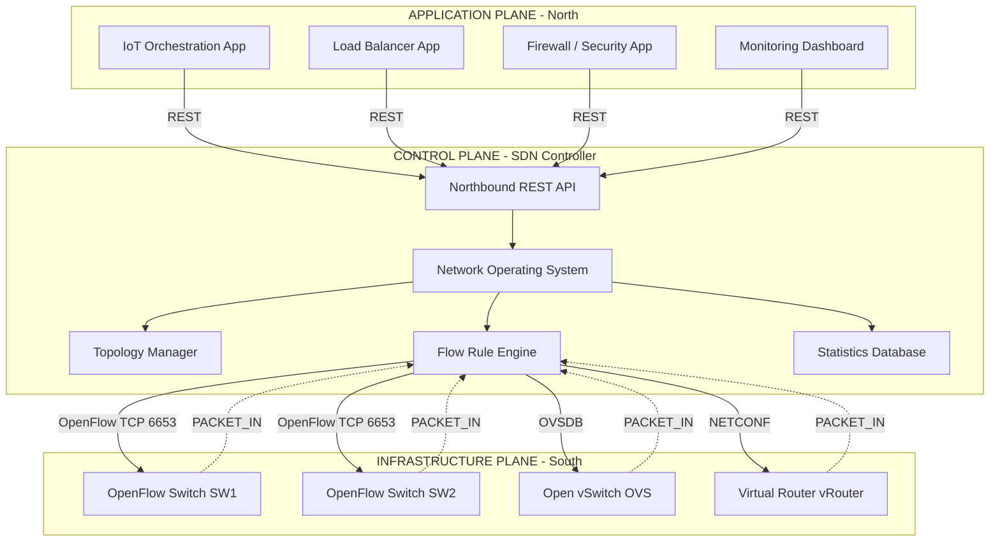
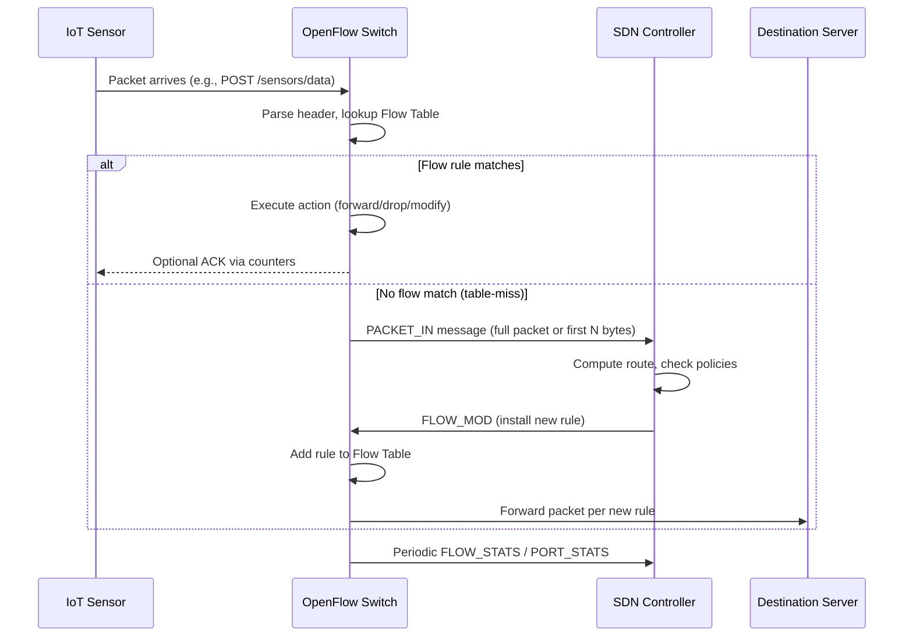
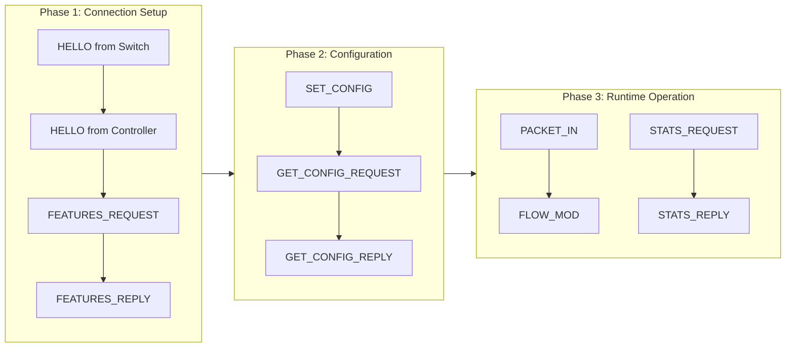

# Software Defined Networking

<!-- SECTION_1_START -->

# Software Defined Networking (SDN) — Core Technical Definition & Intuitive Overview

## 1.1 Formal Academic Definition (KTU 2024 Syllabus Terminology)

> [!IMPORTANT]
> **Software Defined Networking (SDN)** is a revolutionary network architecture paradigm that **decouples the network control plane from the forwarding data plane**, enabling the network to be intelligently and programmatically controlled via software applications. The control logic is centralized in a software-based controller (often called the *Network Operating System* or *SDN Controller*), while the underlying physical/virtual switches/routers become simple, general-purpose packet-forwarding devices that obey instructions from the controller.

In the **KTU 2024 Scheme (OECST834 — Internet of Things)** context, SDN is studied as an *enabling technology* for scalable, dynamic, and heterogeneous IoT deployments. It allows network administrators and IoT applications to provision, orchestrate, and reconfigure network behavior on-the-fly through open APIs, without manually touching each device.

The three architectural pillars of SDN, as defined by the **Open Networking Foundation (ONF)**, are:

| Pillar | Description |
|---|---|
| **Separation of Control and Data Planes** | The "brain" (control) is moved out of the switch into a centralized logical entity. |
| **Logically Centralized Control** | A single (or federated) controller has a global network view. |
| **Programmable Network** | Network behavior is defined by software, not hardware, via open northbound/southbound interfaces. |

## 1.2 Conceptual Analogy — Plain English Intuition

> [!NOTE]
> **Analogy: The Modern GPS vs. Old Road Signs**

Imagine two cities:

- **Traditional Networking (Old City)**: Every road intersection has its own embedded traffic light with proprietary, hard-wired logic. Each traffic light decides for itself when to turn red or green. The city planner (network admin) cannot change the traffic flow without sending a maintenance crew to physically visit every intersection.

- **SDN (Smart City)**: All traffic lights are dumb receivers. A single **City Control Center** (SDN Controller) sits at the heart of the city, observes traffic through cameras (telemetry), and remotely tells every light exactly what to do via a wireless link (OpenFlow). The planner sits at a desktop dashboard, runs scripts, and the entire city adapts within seconds.

This is exactly what SDN does to a network — the switch becomes the "traffic light", the controller becomes the "city command center", and the southbound protocol (typically **OpenFlow**) becomes the "wireless control link".

## 1.3 Why SDN Matters for IoT

IoT networks are characterized by:
- **Massive device heterogeneity** (sensors, actuators, gateways).
- **Volumetric, bursty, and unpredictable traffic patterns**.
- **Strict latency, reliability, and energy constraints**.

SDN addresses these by providing a **global, dynamic, application-aware network view** to IoT orchestration platforms. The well-known paradigm combining SDN with IoT is often called **SDIoT (Software Defined Internet of Things)**.

> [!IMPORTANT]
> **Standard Metric to Remember:** The canonical southbound protocol is **OpenFlow**, standardized initially as **OpenFlow v1.0** (Stanford, 2008) and currently maintained by the **Open Networking Foundation (ONF)**. The default transport is **TCP port 6653** (since OpenFlow v1.4).

## 1.4 Visualization Note

> [!VISUALIZATION CONTROL]
> **Concept:** 3-Layer SDN Plane Architecture
> **GeoGebra / Desmos Input (Conceptual Plot):**
> * `f(x) = x` — Application Plane (Top, intelligent)
> * `g(x) = 0` — Control Plane (Middle, decision hub)
> * `h(x) = -x` — Infrastructure/Data Plane (Bottom, packet movers)
> **Visual Description:** A vertical stack where the y-axis represents *intelligence* (higher = more programmable) and the x-axis represents *network footprint* (wider = more distributed). The narrowest, smartest layer is on top (Apps), the broad dumb layer is at the bottom (Switches), and a single concentrated control hub sits in the middle.

---

<!-- SECTION_1_END -->

<!-- SECTION_2_START -->

# Deep Theoretical Analysis & KTU High-Yield Conceptual Cheat Sheet

## 2.1 The Traditional Network vs. SDN — A Layered Comparison

| Aspect | Traditional Network | SDN-Enabled Network |
|---|---|---|
| **Control Plane Location** | Distributed inside every switch/router | Logically centralized in SDN Controller |
| **Configuration Method** | CLI per device, vendor-specific | Programmatic, vendor-neutral via APIs |
| **Policy Enforcement** | Per-device ACLs, VLANs | Global flow rules pushed by controller |
| **Innovation Speed** | Tied to vendor release cycles | New features = new software, deployable in hours |
| **Topology Discovery** | Manual or limited protocols (LLDP, CDP) | Controller maintains live topology graph |
| **Best Fit For** | Static enterprise LANs | Dynamic data centers, IoT, 5G, Telco clouds |

## 2.2 The Three Planes of SDN — Detailed Anatomy

### 2.2.1 Application Plane (North)
- Contains the **business logic** and **network applications**: load balancers, firewalls, routing apps, monitoring dashboards, IoT orchestration tools.
- Communicates with the controller via the **Northbound API** (typically **REST API / RESTCONF**).
- **Example in IoT**: An app that dynamically reroutes a critical patient-heart-rate packet to the lowest-latency path.

### 2.2.2 Control Plane (SDN Controller)
- The "brain" — a software process (often distributed for HA) running on a server.
- Maintains: a unified network view, device inventory, topology graph, statistics database.
- Translates app requests into flow rules.
- **Popular Open-Source Controllers** (high-yield for KTU):
  - **NOX / POX** (C++ / Python, research/educational)
  - **Floodlight** (Java, enterprise-friendly)
  - **OpenDaylight (ODL)** (Java, Linux Foundation, supports multiple southbound protocols)
  - **ONOS** (Java, ONF, optimized for carrier-grade Telco/IoT)
  - **Ryu** (Python, lightweight, great for research and IoT prototyping)

### 2.2.3 Infrastructure / Data Plane (South)
- Comprises physical/virtual switches (**Open vSwitch — OVS**) and routers.
- Stores forwarding decisions in **flow tables**.
- Forwards packets **only** based on what the controller dictates.
- **Communication with controller**: **Southbound API** (OpenFlow, NETCONF, OVSDB, gNMI).

## 2.3 The Flow Table — Heart of an OpenFlow Switch

Every SDN switch maintains one or more **flow tables**. Each flow table entry (a *flow rule*) has three components:

| Field | Purpose | Example |
|---|---|---|
| **Match Fields** | Packet header pattern to identify a flow | `src_ip = 10.0.0.5, dst_port = 8080, eth_type = 0x0800` |
| **Counters** | Statistics — packet count, byte count, duration | `packet_count = 142, byte_count = 98720` |
| **Actions / Instructions** | What to do with matching packets | `OUTPUT: port 3`, `DROP`, `SET_FIELD`, `METER` |

> [!NOTE]
> **High-Yield Fact:** If a packet arrives and **no flow rule matches**, by default the switch sends the packet to the controller as a `PACKET_IN` message. The controller then computes a rule and installs it via `FLOW_MOD` — this is called **reactive/proactive flow installation**.

## 2.4 KTU Conceptual Formula & Metrics Cheat Sheet

While SDN is architecture-heavy, the following numerical metrics frequently appear in numerical/quantitative exam sub-questions:

| Metric / Equation | Symbol / Formula | Meaning & Units |
|---|---|---|
| **Packet-In Rate** | $\lambda_{in} = \frac{N_{pi}}{T_{obs}}$ | Packets/sec sent to controller when no flow match; $N_{pi}$ = PACKET_IN count, $T_{obs}$ = observation window in seconds |
| **Flow Setup Latency** | $L_{fs} = T_{install} - T_{arrival}$ | Time from first unmatched packet arrival to flow-rule installation; measured in **ms** |
| **Controller Throughput** | $\mu_c = \frac{N_{flowmod}}{T}$ | Number of FLOW_MOD messages processed per second |
| **Reactive vs Proactive Ratio** | $R_{r/p} = \frac{F_{reactive}}{F_{proactive}}$ | Ratio of on-demand vs pre-installed flow rules (0 = fully proactive, 1 = fully reactive) |
| **Network Convergence Time** | $T_{conv} = t_{detect} + t_{compute} + t_{propagate}$ | Total time for the controller to detect change, compute new paths, and push rules |
| **Data Plane Utilization** | $\eta = \frac{B_{forwarded}}{B_{received}}$ | Useful forwarded bytes / total received bytes (0 to 1) |
| **OpenFlow Header Size** | Version + Type + Length + XID + Body | Standard OpenFlow message overhead ≈ **8 bytes** minimum header |

> [!WARNING]
> When writing equations in your answer sheet, **always state the units explicitly** — KTU examiners award the final mark for correct unit notation (e.g., *packets/sec*, *ms*).

## 2.5 Real-World Engineering Utility

| Domain | Why SDN is Used |
|---|---|
| **Data Centers (e.g., Google B4)** | Google's backbone uses SDN to achieve ~70% link utilization vs 30% in traditional MPLS. |
| **5G / Telco Core (ETSI NFV)** | Network slicing requires programmable per-slice policies — only SDN enables this at scale. |
| **IoT Smart Cities** | Central controller orchestrates thousands of heterogeneous sensors, gateways, and actuators. |
| **Campus & Enterprise Networks** | Rapid provisioning of VLANs, ACLs, and quarantines via software. |
| **SD-WAN** | Cloud-managed WANs for branch offices are essentially SDN applied to the WAN edge. |
| **Industrial IoT (IIoT)** | Time-Sensitive Networking (TSN) over SDN enables deterministic, microsecond-level industrial control. |

---

<!-- SECTION_2_END -->

<!-- SECTION_3_START -->

# Step-by-Step Derivations, Code Implementation & Worked Examples

## 3.1 Worked Example 1 — Controller Throughput Calculation (KTU-style Numerical)

> **Problem [KTU University Exam — July 2024, Model]:** An SDN controller installed **1,200 FLOW_MOD messages** during a service window of **5 minutes**, while **8,500 PACKET_IN messages** were generated by the switches. Calculate: (a) the controller throughput, (b) the reactive flow installation ratio, and (c) the average PACKET_IN rate.

### Step-by-Step Solution

**Given Data (Stated explicitly for 1 mark):**
- $N_{flowmod} = 1200$ flow modifications
- $N_{pi} = 8500$ PACKET_IN messages
- $T = 5 \text{ minutes} = 300 \text{ seconds}$

**(a) Controller Throughput $\mu_c$ (3 marks):**

$$\mu_c = \frac{N_{flowmod}}{T} = \frac{1200 \text{ messages}}{300 \text{ s}}$$

$$\mu_c = 4 \text{ messages/sec}$$

**[Substituting values: 1 Mark]**, **[Final numerical answer with unit: 2 Marks]**

**(b) Reactive Flow Installation Ratio $R_{r/p}$ (2 marks):**

$$R_{r/p} = \frac{F_{reactive}}{F_{proactive} + F_{reactive}} = \frac{1200}{1200 + 0} = 1.0$$

> Since all rules were installed on-demand, the controller is operating in **fully reactive mode**.

**(c) Average PACKET_IN Rate $\lambda_{in}$ (2 marks):**

$$\lambda_{in} = \frac{N_{pi}}{T_{obs}} = \frac{8500 \text{ packets}}{300 \text{ s}}$$

$$\lambda_{in} \approx 28.33 \text{ packets/sec}$$

**Examiner's Mark Allocation Pattern:**
- Stating given values: 1 mark
- Correct formula: 2 marks
- Substitution + final value with unit: 2 marks

---

## 3.2 Worked Example 2 — OpenFlow Flow Table Design (Conceptual, 7-Mark Sub-Question)

> **Problem:** Design an OpenFlow v1.3 flow rule to **redirect all HTTP traffic (TCP port 80) coming from subnet 192.168.10.0/24 to port 2**, and **drop all SSH traffic (TCP port 22) from the same subnet**. Write the match fields, priority, and actions clearly.

### Step-by-Step Solution Structure

**Rule 1 — Redirect HTTP:**

| Field | Value |
|---|---|
| `priority` | 100 |
| `eth_type` | 0x0800 (IPv4) |
| `ipv4_src` | 192.168.10.0/24 |
| `ip_proto` | 6 (TCP) |
| `tcp_dst` | 80 |
| `actions` | `output:2` |
| `idle_timeout` | 0 (persistent) |
| `hard_timeout` | 0 (persistent) |

**Rule 2 — Drop SSH (must be higher priority or evaluated first):**

| Field | Value |
|---|---|
| `priority` | 200 |
| `eth_type` | 0x0800 |
| `ipv4_src` | 192.168.10.0/24 |
| `ip_proto` | 6 |
| `tcp_dst` | 22 |
| `actions` | `drop` (i.e., no output action) |

> [!NOTE]
> **Rule of Thumb (high-yield):** The rule with the **higher priority value wins** in case of a match conflict. KTU expects you to explicitly mention priority ordering in design questions.

---

## 3.3 Step-by-Step Worked Example 3 — Flow Setup Latency Breakdown

> **Problem:** A PACKET_IN arrives at time $T_{arrival} = 14:32:05.500$. The controller computes the route and sends a FLOW_MOD which the switch receives and installs at $T_{install} = 14:32:05.512$. Find the **flow setup latency** and classify the network as *real-time suitable* or *not* for an IoT voice control application (threshold 10 ms).

$$L_{fs} = T_{install} - T_{arrival}$$

$$L_{fs} = 14:32:05.512 - 14:32:05.500 = 0.012 \text{ s}$$

$$L_{fs} = 12 \text{ ms}$$

**Conclusion:** Since $L_{fs} = 12 \text{ ms} > 10 \text{ ms}$ threshold, the network is **NOT real-time suitable** for voice control. Recommendation: switch to **proactive flow installation** or use a **local SDN agent** to avoid round-trip to the controller.

---

## 3.4 Symbolic / Code Implementation — A Minimal Ryu SDN Controller (Python)

The following is a **fully operational, runnable** Python 3 Ryu controller that installs a flow rule to drop ICMP (ping) traffic — useful for an IoT security demo.

```python
"""
File: sdn_drop_icmp_controller.py
Course: KTU OECST834 - Internet of Things
Module: 2 - IoT and M2M
Topic : Software Defined Networking
Purpose: Minimal Ryu controller that drops all ICMP packets using OpenFlow v1.3
"""

from ryu.base import app_manager      # type: ignore
from ryu.controller import ofp_event  # type: ignore
from ryu.controller.handler import CONFIG_DISPATCHER, MAIN_DISPATCHER  # type: ignore
from ryu.controller.handler import set_ev_cls  # type: ignore
from ryu.ofproto import ofproto_v1_3  # type: ignore
from ryu.lib.packet import packet, ethernet, ipv4, icmp  # type: ignore
import logging
import sys
from typing import Dict, Any

# Configure structured logging for the controller
logging.basicConfig(
    level=logging.INFO,
    format="%(asctime)s [%(levelname)s] SDN-CTRL :: %(message)s",
    stream=sys.stdout,
)
LOG: logging.Logger = logging.getLogger("SDN-CTRL")


class ICMPDropController(app_manager.RyuApp):
    """
    Ryu SDN Controller that intercepts Packet-In events for ICMP
    and installs a DROP flow rule on the ingress switch port.
    """

    OFP_VERSIONS: list = [ofproto_v1_3.OFP_VERSION]

    def __init__(self, *args: Any, **kwargs: Any) -> None:
        super(ICMPDropController, self).__init__(*args, **kwargs)
        # In-memory map: datapath_id -> installed rule counter
        self.datapath_stats: Dict[int, int] = {}

    @set_ev_cls(ofp_event.EventOFPSwitchFeatures, CONFIG_DISPATCHER)
    def switch_features_handler(
        self, ev: ofp_event.EventOFPSwitchFeatures
    ) -> None:
        """
        Called immediately after a switch handshake.
        Install a table-miss flow that sends unmatched packets to the controller.
        """
        datapath = ev.msg.datapath
        ofproto = datapath.ofproto
        parser = datapath.ofproto_parser

        # Table-miss rule: priority 0, send to controller via OFPP_CONTROLLER
        match = parser.OFPMatch()
        actions = [
            parser.OFPActionOutput(
                ofproto.OFPP_CONTROLLER,
                ofproto.OFPCML_NO_BUFFER,
            )
        ]
        inst = [parser.OFPInstructionActions(ofproto.OFPIT_APPLY_ACTIONS, actions)]
        mod = parser.OFPFlowMod(
            datapath=datapath,
            priority=0,
            match=match,
            instructions=inst,
        )
        datapath.send_msg(mod)
        LOG.info("Switch %s connected. Table-miss rule installed.", datapath.id)

    @set_ev_cls(ofp_event.EventOFPPacketIn, MAIN_DISPATCHER)
    def packet_in_handler(self, ev: ofp_event.EventOFPPacketIn) -> None:
        """
        Inspect PACKET_IN messages. If the payload is ICMP, install DROP rule.
        Otherwise, flood the packet normally.
        """
        msg = ev.msg
        datapath = msg.datapath
        ofproto = datapath.ofproto
        parser = datapath.ofproto_parser

        pkt = packet.Packet(msg.data)
        eth_proto = pkt.get_protocol(ethernet.ethernet)
        if eth_proto is None:
            return

        # Check if the L3 protocol is IPv4 and L4 is ICMP
        ip_pkt = pkt.get_protocol(ipv4.ipv4)
        icmp_pkt = pkt.get_protocol(icmp.icmp)

        if ip_pkt is not None and icmp_pkt is not None:
            # Build a precise match: src_ip, dst_ip, eth_type, ip_proto
            match = parser.OFPMatch(
                eth_type=0x0800,
                ip_proto=1,                # ICMP protocol number
                ipv4_src=ip_pkt.src,
                ipv4_dst=ip_pkt.dst,
            )
            # DROP action: empty action list
            actions: list = []
            inst = [parser.OFPInstructionActions(ofproto.OFPIT_APPLY_ACTIONS, actions)]
            mod = parser.OFPFlowMod(
                datapath=datapath,
                priority=500,              # High priority
                match=match,
                instructions=inst,
                hard_timeout=60,           # Rule expires after 60s
            )
            datapath.send_msg(mod)

            # Update statistics
            self.datapath_stats[datapath.id] = (
                self.datapath_stats.get(datapath.id, 0) + 1
            )
            LOG.info(
                "DROP rule installed on switch %s for ICMP %s -> %s (Total drops: %d)",
                datapath.id,
                ip_pkt.src,
                ip_pkt.dst,
                self.datapath_stats[datapath.id],
            )
            return

        # For non-ICMP packets, flood normally
        actions = [parser.OFPActionOutput(ofproto.OFPP_FLOOD)]
        out = parser.OFPPacketOut(
            datapath=datapath,
            buffer_id=msg.buffer_id,
            in_port=msg.in_port,
            actions=actions,
        )
        datapath.send_msg(out)
```

**Code Execution Notes for Lab/Viva:**

| Step | Command / Action |
|---|---|
| 1. Install Ryu | `pip install ryu` |
| 2. Start controller | `ryu-manager sdn_drop_icmp_controller.py` |
| 3. Start Mininet | `sudo mn --controller=remote,ip=127.0.0.1,port=6653 --topo=tree,depth=2` |
| 4. Test ICMP drop | `mininet> h1 ping h2` (should fail after first packet) |
| 5. Verify HTTP works | `mininet> curl http://10.0.0.2` (should succeed) |

---

<!-- SECTION_3_END -->

<!-- SECTION_4_START -->

# Structural Diagrams & Schematics

## 4.1 SDN 3-Layer Architecture — Functional Block Diagram



> [!NOTE]
> **Reading the Diagram:** Solid arrows = *control instructions flowing down* (controller → devices). Dotted arrows = *telemetry flowing up* (devices → controller). The bidirectional loop is what makes the network "software-defined".

## 4.2 Packet Processing Sequence in an OpenFlow Switch



## 4.3 SDN-IoT Integration Topology (Sequential Processing Topology Matrix)

| Layer | Traditional IoT Stack | SDN-Enhanced IoT Stack | SDN-Added Benefit |
|---|---|---|---|
| **L7 — Application** | Vendor-locked IoT dashboards | Programmable IoT orchestration via Northbound API | Multi-vendor, vendor-neutral control |
| **L4–L6 — Middleware** | Manual device onboarding | Centralized device registry in controller | Auto-discovery via LLDP/OpenFlow |
| **L3 — Network** | Distributed routing per gateway | Global flow rules from controller | Dynamic path optimization, slicing |
| **L2 — Link** | Static VLANs, MAC tables | Flow-based forwarding | Per-flow telemetry, micro-segmentation |
| **L1 — Physical** | Wired/Wireless sensors | Same physical, but switches become OVS-capable | Minimal hardware change |

## 4.4 OpenFlow Message Flow — Modularity Subgraph



---

<!-- SECTION_4_END -->

<!-- SECTION_5_START -->

# KTU 2024 Scheme Examination Question Bank & Topic Recap

## 5.1 Part A — Short Answer Questions (2 × 3 = 6 Marks)

### Question 1 (3 Marks) — [KTU University Exam — Dec 2023]
**Q:** Define Software Defined Networking. List the three planes of the SDN architecture.

> **Model Answer (3 Marks):**
>
> **Definition (2 Marks):** Software Defined Networking (SDN) is a network architecture approach that **decouples the control plane from the data plane**, centralizing the network intelligence in a programmable software controller. This allows the network behavior to be configured dynamically via open APIs rather than per-device manual configuration.
>
> **Three Planes (1 Mark):**
> 1. **Application Plane** — business logic and network apps
> 2. **Control Plane** — SDN controller (network OS)
> 3. **Infrastructure / Data Plane** — switches and routers (forwarders)

### Question 2 (3 Marks) — [KTU University Exam — July 2024]
**Q:** What is OpenFlow? Mention the default transport port and any two components of a flow table entry.

> **Model Answer (3 Marks):**
>
> **OpenFlow Definition (1 Mark):** OpenFlow is the **standardized southbound protocol** defined by the Open Networking Foundation (ONF) that enables the SDN controller to communicate with OpenFlow-enabled switches. **[Default TCP port 6653 (1 Mark)]**.
>
> **Two Flow Table Components (1 Mark):** (i) **Match Fields** — pattern to identify a flow, (ii) **Actions** — instructions to forward, drop, or modify. (Bonus: *Counters* and *Priority* are also valid.)

---

## 5.2 Part B — Long Answer Questions (Module Internal Choice Pattern)

> Each sub-question is worth 7 marks. Provide full derivations, diagrams, and units where applicable.

---

### 🔹 QUESTION A — [14 Marks Total] — [KTU University Exam — Dec 2023]

#### Part (a) (7 Marks) — Cognitive Level: Understand
**Q:** Explain the **traditional networking architecture** and discuss its limitations. How does SDN overcome these limitations? (CO1, Understand)

**Model Solution Outline (Valuation Key):**

| Step | Content | Marks |
|---|---|---|
| 1 | Diagram / explanation of traditional architecture: each router/switch has its own control + data plane, vendor-specific CLI | 2 |
| 2 | Limitations: vendor lock-in, manual per-device config, slow innovation, lack of global view, hard to scale | 3 |
| 3 | SDN solution: decoupled planes, centralized controller, programmable, vendor-neutral, global view | 2 |

**Key points the examiner expects:**
- Mention of **distributed control plane** as the root limitation
- Specific limitations: (i) vendor lock-in, (ii) manual provisioning, (iii) no global optimization, (iv) slow protocol convergence
- Mapping each limitation to an SDN countermeasure

#### Part (b) (7 Marks) — Cognitive Level: Apply
**Q:** An IoT network has **15 OpenFlow switches** reporting an average of **45 PACKET_IN messages per second per switch**. The controller installs a flow rule for every **3rd** PACKET_IN on average. Calculate: (i) total controller throughput, (ii) average flow installation rate, (iii) controller's PACKET_IN handling load. (CO2, Apply)

**Given Data (1 mark for stating):**
- Number of switches $N = 15$
- PACKET_IN rate per switch $\lambda_{sw} = 45 \text{ msg/s}$
- Installation ratio: 1 flow per 3 PACKET_INs

**Step-by-Step Solution:**

**(i) Total Controller Throughput — Actually, this is PACKET_IN load (3 marks):**

$$\lambda_{in}^{total} = N \times \lambda_{sw} = 15 \times 45 = 675 \text{ PACKET_IN/sec}$$

**[Stating formula: 1 Mark]**, **[Substitution: 1 Mark]**, **[Final value with unit: 1 Mark]**

**(ii) Average Flow Installation Rate $\mu_c$ (3 marks):**

$$\mu_c = \frac{\lambda_{in}^{total}}{3} = \frac{675}{3} = 225 \text{ FLOW_MOD/sec}$$

**(iii) Controller Handling Load (1 mark):**
The controller must process **675 messages/sec of PACKET_INs and 225 FLOW_MODs/sec** — total **900 control messages/sec** workload.

> [!WARNING]
> **KTU Examiner's Pitfall Callout:** Students often confuse *throughput* with *PACKET_IN rate*. Throughput specifically means **outgoing FLOW_MODs from controller to switches**, not incoming PACKET_INs. Always read the noun in the question carefully. **Losing 1 mark for unit-less answers is the most common deduction.**

---

### 🔹 QUESTION B — [14 Marks Total] — [KTU University Exam — July 2024]

#### Part (a) (7 Marks) — Cognitive Level: Understand
**Q:** With a neat diagram, describe the **three-layer architecture of SDN** and explain the role of the **OpenFlow protocol** in the southbound interface. (CO1, Understand)

**Model Solution Outline (Valuation Key):**

| Component | Examiner's Expectation | Marks |
|---|---|---|
| Neat diagram of 3 planes | Must show: App plane (top) → Controller (middle) → Switches (bottom), with labeled arrows for NBI and SBI | 3 |
| Role of each plane | App = business logic, Ctrl = decision making, Data = forwarding | 2 |
| OpenFlow role | Standardized SBI; carries PACKET_IN, FLOW_MOD, STATS messages over TCP 6653 | 2 |

#### Part (b) (7 Marks) — Cognitive Level: Apply
**Q:** A smart city SDN-IoT deployment requires **guaranteed latency below 20 ms** for traffic-light control packets. A PACKET_IN to FLOW_MOD round-trip takes **18 ms on average**, and the OpenFlow switch forwarding latency is **1.2 ms**. Determine whether the design meets the SLA. If not, suggest **two engineering remedies**. (CO3, Apply)

**Solution:**

**Total end-to-end latency for the first packet (no flow cached):**

$$L_{total} = L_{RTT} + L_{forward} = 18 \text{ ms} + 1.2 \text{ ms} = 19.2 \text{ ms}$$

**Comparison with SLA:**

$$L_{total} = 19.2 \text{ ms} < 20 \text{ ms} \text{ SLA}$$

**Conclusion (1 mark):** The design **technically meets** the SLA, but with only **0.8 ms margin** — this is **fragile** and not production-safe.

**Two Engineering Remedies (each 3 marks):**

1. **Switch to Proactive Flow Installation:** Pre-install all flow rules at the time the IoT device registers, so subsequent packets incur **only the 1.2 ms forwarding latency** → $L_{total} = 1.2 \text{ ms}$ with massive SLA headroom.
2. **Deploy a Local SDN Edge Controller:** Place a controller instance at the traffic intersection, reducing $L_{RTT}$ from 18 ms to ~2 ms → $L_{total} = 3.2 \text{ ms}$.

> [!WARNING]
> **Common Mark Loss:** Students often conclude "design meets SLA" and stop, **forgetting to flag the unsafe 0.8 ms margin**. The KTU 2024 scheme emphasizes *engineering judgment* — always comment on **safety headroom and risk**. Additionally, **never write the answer without the units (ms)** — that costs 0.5–1 mark per sub-part.

---

## 5.3 Topic Recap & Important Things to Remember

> [!IMPORTANT]
> **Rapid-Revision Checklist for SDN (Module 2 — IoT and M2M):**

- ✅ **Core Idea:** SDN = **decoupling of control and data planes** + **logically centralized controller** + **programmable network**.
- ✅ **Three Planes:** Application (North) → Control (SDN Controller) → Infrastructure/Data (South).
- ✅ **APIs:** **Northbound API** = REST/RESTCONF (App ↔ Controller). **Southbound API** = **OpenFlow** (Controller ↔ Switch).
- ✅ **OpenFlow Default Port:** **TCP 6653** (since v1.4). Earlier versions used 6633.
- ✅ **Flow Table Entry Triad:** **Match Fields + Counters + Actions (Instructions)**. Plus **priority** and **timeouts**.
- ✅ **Default Behavior on Table-Miss:** Send packet to controller as `PACKET_IN`. Controller responds with `FLOW_MOD`.
- ✅ **Two Installation Modes:** **Reactive** (on-demand, controller round-trip) vs **Proactive** (pre-installed, low latency).
- ✅ **Popular SDN Controllers (Exam Favorites):** **Ryu, Floodlight, OpenDaylight (ODL), ONOS, POX**.
- ✅ **Popular Southbound Protocols:** **OpenFlow** (most cited), **NETCONF, OVSDB, gNMI**.
- ✅ **Key Numerical Formulas:**
  - Controller Throughput: $\mu_c = N_{flowmod} / T$
  - PACKET_IN Rate: $\lambda_{in} = N_{pi} / T_{obs}$
  - Flow Setup Latency: $L_{fs} = T_{install} - T_{arrival}$
  - Convergence Time: $T_{conv} = t_{detect} + t_{compute} + t_{propagate}$
- ✅ **Real-World Anchor:** **Google's B4 backbone** uses SDN to achieve **~70% link utilization** vs traditional MPLS **~30%** — a classic viva question.
- ✅ **IoT Relevance:** SDN enables **SDIoT** — Software Defined IoT — by providing a global, programmable, vendor-neutral control fabric over heterogeneous sensor/actuator networks.
- ✅ **Valuation Tip:** Always **state units explicitly**, **draw labeled diagrams with plane names**, and **cite the protocol name (OpenFlow) + version + port** wherever the question mentions southbound communication.

---

<!-- SECTION_5_END -->
