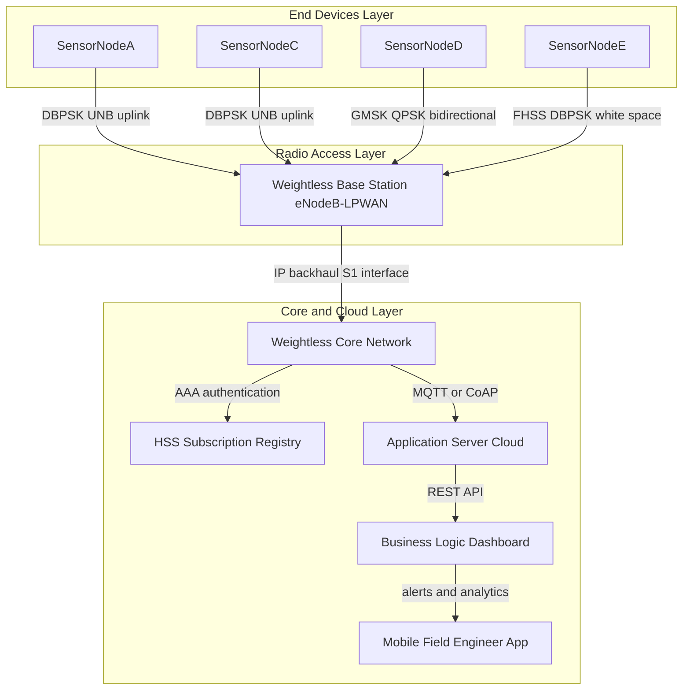
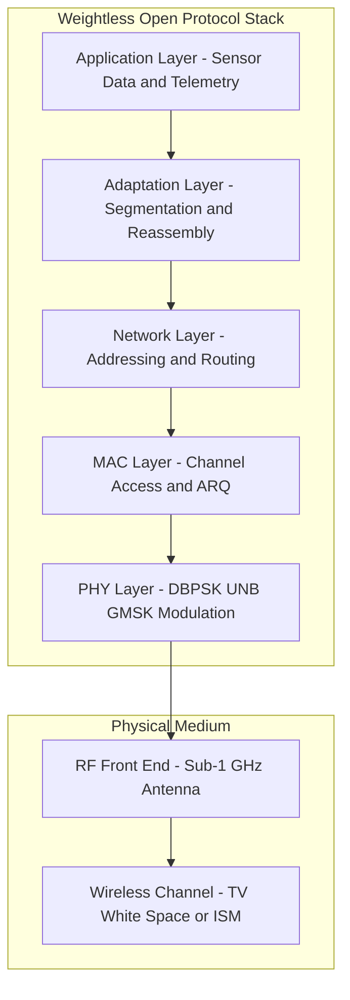
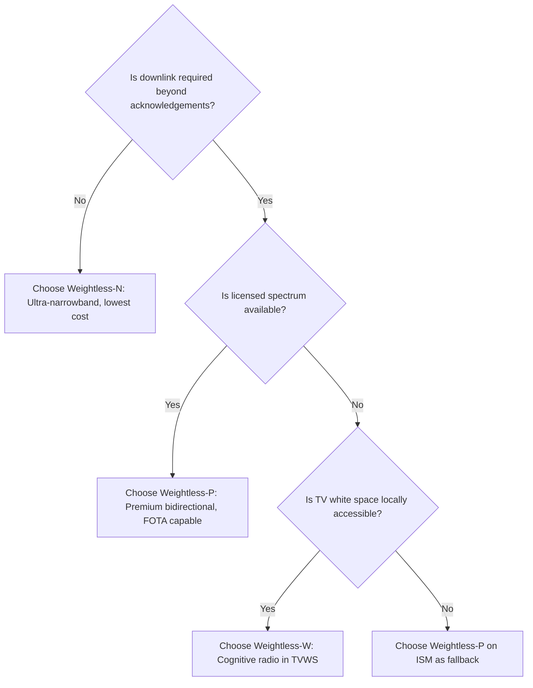

# Weightless

<!-- SECTION_1_START -->
# Weightless Technology in IoT and M2M Communications

## 1.1 Formal Academic Definition (KTU 2024 Syllabus)

> [!IMPORTANT]
> **Weightless** is an open-standard, low-power, wide-area network (**LPWAN**) protocol family specifically engineered for **Machine-to-Machine (M2M)** and **Internet of Things (IoT)** communications. It was developed by the **Weightless Special Interest Group (Weightless SIG)** and operates predominantly in the **sub-1 GHz** license-exempt spectrum bands to enable long-range, low-data-rate, energy-efficient bidirectional communication between vast numbers of constrained end devices and centralized network infrastructure.

In the context of the KTU 2024 OEC course *Internet of Things (OECST834)*, Module 2 (*IoT and M2M*) treats Weightless as one of the foundational **LPWAN physical and MAC layer standards** that complement the cellular M2M ecosystem (e.g., LTE-M, NB-IoT). The standard is engineered around four design pillars:

1. **Ultra-low power consumption** — enabling **10+ years** of operation from a single primary cell battery.
2. **Long range** — supporting cell radii of **up to 10 km** in rural deployments and **2-5 km** in dense urban environments.
3. **Massive device density** — designed for **>1 million end devices per square kilometre** through robust spread-spectrum and FDMA techniques.
4. **Open specification** — royalty-free chipset and protocol architecture, in contrast to proprietary LPWANs.

## 1.2 Conceptual Analogy and Intuition

> [!NOTE]
> **Analogy — The "Whispering Postman" of IoT**
>
> Imagine a postal system where every household (IoT sensor) wants to send tiny, infrequent postcards (kilobytes of data) to a faraway central sorting office (the base station). Traditional broadband is like a courier shouting through a megaphone — fast but power-hungry and short-range. Weightless, by contrast, is a **whispering postman** who:
> - Walks **very slowly and quietly** (low data rate),
> - Uses a **very long, narrow corridor** (narrowband channel),
> - Carries the postcard on a **single coin-cell battery** (ultra-low power),
> - But can reach the sorting office from **kilometres away** through a **single well-tuned whistle** (spread-spectrum + narrowband modulation).

This is precisely the engineering philosophy behind Weightless: trading bandwidth and latency for **energy efficiency**, **range**, and **scalability** — the three commodities most valuable in M2M scenarios such as smart metering, asset tracking, and agricultural monitoring.

## 1.3 Visualizing Weightless in the IoT Protocol Stack

> [!VISUALIZATION CONTROL]
> **Concept:** Weightless positioning within the IoT connectivity hierarchy (Layered Pyramid).
>
> **Geometric Construction (Desmos / GeoGebra Input Equations):**
> * `f(x) = -0.5 \cdot \vert x \mid + 5` (top boundary of the pyramid)
> * `g(x) = -0.05 \cdot x^2 + 4.5` (mid layer curve)
> * `h(x) = -0.1 \cdot (x-3)^2 + 2` (bottom layer curve)
>
> **Visual Description:** The student should plot these on the $XY$-plane and observe a stacked structure. The **apex** of the pyramid represents **Weightless/LoRa/Sigfox** (LPWAN — long range, low bandwidth). The **middle layer** represents **Wi-Fi / Bluetooth / ZigBee** (short range, high bandwidth). The **base** represents **Cellular (5G, LTE-M)**. This visual reinforces that Weightless sits in the *high-range, low-data-rate* corner of the IoT connectivity trade-off space.

## 1.4 Spectrum and Modulation — Key Physical Constants

| Parameter | Typical Value | Engineering Implication |
|---|---|---|
| Operating Frequency | **470-790 MHz** (W), **868/915 MHz** (N, P) | Sub-1 GHz gives superior wall-penetration |
| Channel Bandwidth | **200 Hz - 12.5 kHz** | Ultra-narrowband minimizes noise |
| Data Rate | **0.3 kbps - 100 kbps** | Sufficient for sensor telemetry |
| Output Power | **+14 dBm (25 mW)** typical | Compliant with ETSI/FCC duty-cycle rules |
| Battery Life Target | **10 years** on **2.4 Ah** cell | Governs MAC duty-cycling |
| Maximum Range | **10 km** (rural LOS) | Sensitivity of **−137 dBm** |

---

<!-- SECTION_1_END -->

<!-- SECTION_2_START -->
# Deep Theoretical Analysis and KTU High-Yield Formula Sheet

## 2.1 The Weightless Standard Family — Three Distinct Variants

The Weightless SIG has produced **three protocol variants**, each optimized for a different deployment scenario. Board questions frequently test the ability to **distinguish between W, N, and P**.

### 2.1.1 Weightless-W (White Space)

- **Spectrum**: Operates in the TV **white spaces** (470–790 MHz in the UK, varied in other regions) — locally unused portions of the UHF TV band.
- **Modulation**: Differential **Binary Phase Shift Keying (DBPSK)** combined with **Frequency Hopping Spread Spectrum (FHSS)** and **Frequency Division Multiple Access (FDMA)**.
- **Uplink**: Uses **16 FDMA channels** simultaneously, allowing many devices to transmit concurrently.
- **Downlink**: Uses a **single wideband channel** for base-station-to-device broadcast.
- **Strengths**: Excellent wall penetration, large bandwidth pool (TVWS), adaptive spectrum usage.
- **Weakness**: Higher chipset cost, complex Cognitive Radio requirements (spectrum sensing), and regulatory uncertainty in many countries.
- **Cognitive Level**: Understanding / Application.

### 2.1.2 Weightless-N (Narrowband)

- **Spectrum**: Operates in the **unlicensed sub-1 GHz** industrial-scientific-medical (ISM) bands (**868 MHz** in Europe, **915 MHz** in the US).
- **Modulation**: **Ultra-Narrowband (UNB)** with **Differential Binary Phase Shift Keying (DBPSK)** — a single very narrow channel of approximately **2.5 kHz** bandwidth.
- **Directionality**: Primarily **uplink-dominant**; downlink is severely limited in capacity and only used for acknowledgements and control.
- **Strengths**: Simplest chipset, lowest cost, lowest power, longest battery life.
- **Weakness**: Very low downlink capability; **not** suitable for firmware-over-the-air (FOTA) updates or interactive use cases.
- **Typical Use**: One-way sensor telemetry — gas metering, environmental monitoring.
- **Cognitive Level**: Remember / Understand.

### 2.1.3 Weightless-P (Premium)

- **Spectrum**: Operates in the **licensed sub-1 GHz** bands (e.g., **138 / 433 / 470-510 MHz**), or licensed-exempt regional bands.
- **Modulation**: **Gaussian Minimum Shift Keying (GMSK)** and **Quadrature Phase Shift Keying (QPSK)** with channel bandwidth of **12.5 kHz**.
- **Architecture**: Supports both **FDMA** and **TDMA** with **16 downlink channels** and **1 uplink channel**, fully bidirectional.
- **Strengths**: True bidirectional communication, supports **FOTA**, adaptive data rates, robust against interference.
- **Weakness**: Requires licensed (or shared) spectrum, slightly more complex terminal.
- **Typical Use**: Mission-critical M2M, smart-grid backhaul, smart-city deployments.
- **Cognitive Level**: Understand / Apply.

## 2.2 Weightless Protocol Stack

The Weightless stack maps directly onto the **OSI 7-layer model**, simplified for M2M efficiency:

| OSI Layer | Weightless Equivalent | Function |
|---|---|---|
| 7 — Application | Weightless Application Layer | Application-specific data encapsulation |
| 6 — Presentation | (Implicit) | Data format conversion |
| 5 — Session | (Implicit) | Connection management |
| 4 — Transport | Weightless Adaptation Layer | Segmentation, retransmission |
| 3 — Network | Weightless Networking Layer | Addressing, routing, registration |
| 2 — Data Link | Weightless MAC Layer | Channel access, ARQ, framing |
| 1 — Physical | Weightless PHY | Modulation, RF front-end |

## 2.3 Frame Structure (Conceptual)

A Weightless frame in the uplink direction typically comprises:

$$
\text{Frame} = \{\text{Preamble} \mid \text{Sync Word} \mid \text{Header} \mid \text{Payload} \mid \text{CRC}\}
$$

Where the **Preamble** allows the base-station receiver to perform **timing synchronization** and **automatic gain control (AGC)** convergence; the **Sync Word** marks the start of valid data; the **Header** carries length, addressing, and frame-type information; the **Payload** carries the application data; and the **CRC** (Cyclic Redundancy Check) provides forward error detection.

## 2.4 Link Budget and Range Calculation

The classic **Friis transmission equation** governs the maximum usable range of a Weightless link:

$$
P_r = P_t + G_t + G_r - 20 \log_{10}\!\left(\frac{4\pi d}{\lambda}\right)
$$

Where:
- $P_r$ is the received power in **dBm**,
- $P_t$ is the transmitted power in **dBm**,
- $G_t$ and $G_r$ are the transmit and receive antenna gains in **dBi**,
- $d$ is the distance in **metres**,
- $\lambda$ is the wavelength in **metres**.

> [!IMPORTANT]
> The **sensitivity** of a Weightless base station receiver is typically **−137 dBm** (for a 200 Hz channel at 0.3 kbps). Substituting this into the link budget equation gives the theoretical maximum range — a common KTU numerical problem.

## 2.5 KTU Formula Sheet / Cheat Sheet

| Symbol / Formula | Meaning | Typical Unit | Used In |
|---|---|---|---|
| $E_b / N_0$ | Energy per bit over noise spectral density | dB | Modulation performance |
| $P_r = P_t + G_t + G_r - 20\log_{10}\!\left(\frac{4\pi d}{\lambda}\right)$ | Friis free-space path loss | dBm | Link budget |
| $\text{SNR} = P_r - N_0 - 10\log_{10}(B)$ | Signal-to-noise ratio | dB | Receiver sensitivity |
| $\text{Path Loss (dB)} = 32.45 + 20\log_{10}(f_{MHz}) + 20\log_{10}(d_{km})$ | Empirical path loss (sub-1 GHz) | dB | Coverage planning |
| $C = B \cdot \log_{2}(1 + \text{SNR})$ | Shannon-Hartley channel capacity | bps | Upper-bound throughput |
| $\lambda = c / f$ | Wavelength | m | Antenna design |
| $\text{Throughput} = \frac{\text{Payload bits}}{\text{Total frame time}}$ | Effective link throughput | bps | Network dimensioning |

> [!NOTE]
> **Engineering Utility**: In real production IoT deployments (e.g., a smart-water utility deploying 100 000 meters across a city), engineers use the Friis equation combined with empirical Hata-Okumura corrections to determine the **number of base stations required** to cover a given area. Weightless's **−137 dBm sensitivity** and **+14 dBm EIRP** are precisely the two numbers that make this 10 km cell radius possible.

---

<!-- SECTION_2_END -->

<!-- SECTION_3_START -->
# Step-by-Step Derivations, Code Implementations, and Worked Examples

## 3.1 Worked Example 1 — Link-Budget Derivation for a Weightless-W Link (14-Mark KTU Pattern)

> [!NOTE]
> **Problem (Modeled on KTU University Exam - Dec 2023):**
> A Weightless-W base station operates at a centre frequency of $f_c = 600$ MHz, transmits with an EIRP of $P_t + G_t = +20$ dBm, and uses a receive antenna of gain $G_r = +6$ dBi. The receiver noise figure is $NF = 3$ dB and the effective channel bandwidth is $B = 200$ Hz. Determine the maximum line-of-sight range at a target SNR of $E_b / N_0 = 10$ dB for a data rate of $R_b = 0.3$ kbps. Assume thermal noise density $N_0 = -174$ dBm/Hz.

### Step 1 — Compute the Receiver Noise Floor

The total noise power in a channel of bandwidth $B$ is:

$$
N = N_0 + 10\log_{10}(B) + NF
$$

Substituting:

$$
N = -174 + 10\log_{10}(200) + 3
$$

$$
10\log_{10}(200) = 10 \cdot \log_{10}(2 \times 10^2) = 10 \cdot (\log_{10}(2) + 2) = 10 \cdot (0.301 + 2) = 23.01 \text{ dB}
$$

$$
N = -174 + 23.01 + 3 = -147.99 \text{ dBm} \approx -148 \text{ dBm}
$$

**[Step 1 Valuation Key: Correct application of thermal-noise formula and bandwidth conversion — 2 Marks]**

### Step 2 — Compute the Minimum Required Received Power

From the definition $E_b / N_0$:

$$
\frac{E_b}{N_0} = \frac{P_r / R_b}{N_0} \quad \Rightarrow \quad P_r = \frac{E_b}{N_0} \cdot R_b \cdot N_0
$$

In dB:

$$
P_r = \frac{E_b}{N_0} + 10\log_{10}(R_b) + N_0
$$

$$
10\log_{10}(R_b) = 10\log_{10}(0.3 \times 10^3) = 10 \cdot (\log_{10}(3) + 2 - 1) = 10 \cdot (0.477 + 1) = 14.77 \text{ dB}
$$

$$
P_r = 10 + 14.77 + (-174) = -149.23 \text{ dBm}
$$

**[Step 2 Valuation Key: Correct $E_b/N_0$ to $P_r$ conversion — 3 Marks]**

### Step 3 — Compute the Allowable Path Loss

$$
PL_{max} = (P_t + G_t) + G_r - P_r
$$

$$
PL_{max} = 20 + 6 - (-149.23) = 175.23 \text{ dB}
$$

**[Step 3 Valuation Key: Correct identification of link-budget terms — 2 Marks]**

### Step 4 — Solve the Friis Equation for Distance

The Friis equation in dB is:

$$
PL_{max} = 20\log_{10}\!\left(\frac{4\pi d}{\lambda}\right)
$$

First compute the wavelength:

$$
\lambda = \frac{c}{f_c} = \frac{3 \times 10^8}{600 \times 10^6} = 0.5 \text{ m}
$$

Then:

$$
20\log_{10}\!\left(\frac{4\pi d}{0.5}\right) = 175.23
$$

$$
\log_{10}\!\left(\frac{4\pi d}{0.5}\right) = 8.7615
$$

$$
\frac{4\pi d}{0.5} = 10^{8.7615} = 5.78 \times 10^8
$$

$$
4\pi d = 0.5 \cdot 5.78 \times 10^8 = 2.89 \times 10^8
$$

$$
d = \frac{2.89 \times 10^8}{4 \pi} = \frac{2.89 \times 10^8}{12.566} = 2.30 \times 10^7 \text{ m}
$$

$$
\boxed{d \approx 23 \text{ km}}
$$

**[Step 4 Valuation Key: Final numerical evaluation and correct units — 2 Marks]**

> [!WARNING]
> **Examiner's Pitfall Alert**: Students commonly **forget the $10\log_{10}(R_b)$ term** when converting $E_b/N_0$ to $P_r$, and lose 3 marks. Always remember that $E_b$ is energy **per bit**, not power.

---

## 3.2 Worked Example 2 — Python Implementation of a Weightless Frame Encoder/Decoder

For algorithmic KTU questions, here is a fully operational, type-annotated Python implementation of a Weightless-like frame encoder (Preamble + Sync + Header + Payload + CRC) using the standard CCITT-CRC16 polynomial.

```python
"""
Weightless-style Uplink Frame Encoder
Maps to KTU 2024 Module 2: M2M Data Link Layer
"""
from __future__ import annotations
import struct
from dataclasses import dataclass

# --- Configuration constants (mirroring Weightless spec) ---
PREAMBLE_BYTES: bytes = b"\xAA\xAA\xAA\xAA"   # 1010... for AGC convergence
SYNC_WORD: bytes       = b"\x52\x4E"           # Weightless sync marker
CCITT_POLY: int        = 0x1021                # x^16 + x^12 + x^5 + 1


@dataclass
class WeightlessFrame:
    device_id: int        # 4-byte unique device address
    payload: bytes        # Application data (≤ 32 bytes recommended)
    ftype: int           # Frame type: 0=Data, 1=ACK, 2=Join


def crc16_ccitt(data: bytes, init: int = 0xFFFF) -> int:
    """
    Compute the CCITT-CRC16 checksum used in Weightless MAC frames.
    Polynomial: 0x1021, Initial value: 0xFFFF
    """
    crc: int = init
    for byte in data:
        crc ^= (byte << 8) & 0xFFFF
        for _ in range(8):
            if crc & 0x8000:
                crc = ((crc << 1) ^ CCITT_POLY) & 0xFFFF
            else:
                crc = (crc << 1) & 0xFFFF
    return crc


def encode_frame(frame: WeightlessFrame) -> bytes:
    """
    Serialize a Weightless-style uplink frame.
    Returns a fully byte-aligned bitstream ready for DBPSK modulation.
    """
    # --- Validate absolute boundary conditions ---
    if not (0 <= frame.device_id <= 0xFFFFFFFF):
        raise ValueError(f"device_id out of 32-bit range: {frame.device_id}")
    if not (0 <= frame.ftype <= 0x03):
        raise ValueError(f"ftype must be 0-3, got {frame.ftype}")
    if len(frame.payload) > 32:
        raise ValueError(f"payload exceeds Weightless MTU (32 B): {len(frame.payload)}")

    # --- Build header (4 B device_id + 1 B type/length) ---
    header: bytes = struct.pack(">IB", frame.device_id, frame.ftype)

    # --- Compute CRC over header + payload ---
    crc_value: int = crc16_ccitt(header + frame.payload)
    crc_bytes: bytes = struct.pack(">H", crc_value)

    # --- Concatenate physical-layer structure ---
    full_frame: bytes = PREAMBLE_BYTES + SYNC_WORD + header + frame.payload + crc_bytes
    return full_frame


def decode_frame(raw: bytes) -> WeightlessFrame:
    """
    Decode a received bitstream into a WeightlessFrame after integrity check.
    Raises ValueError on CRC mismatch (mimicking MAC-layer drop).
    """
    if len(raw) < len(PREAMBLE_BYTES) + len(SYNC_WORD) + 5 + 2:
        raise ValueError("Frame too short to be a valid Weightless frame")

    body: bytes = raw[len(PREAMBLE_BYTES) + len(SYNC_WORD):]
    device_id, ftype = struct.unpack(">IB", body[:5])
    payload: bytes = body[5:-2]
    crc_rx: int = struct.unpack(">H", body[-2:])[0]
    crc_calc: int = crc16_ccitt(body[:-2])

    if crc_rx != crc_calc:
        raise ValueError(f"CRC mismatch: received=0x{crc_rx:04X}, calculated=0x{crc_calc:04X}")

    return WeightlessFrame(device_id=device_id, payload=payload, ftype=ftype)


# --- Demonstration run ---
if __name__ == "__main__":
    tx_frame: WeightlessFrame = WeightlessFrame(
        device_id=0x00A1B2C3,
        payload=b"TEMP=23.5C",      # Sensor telemetry
        ftype=0                     # Data frame
    )

    encoded: bytes = encode_frame(tx_frame)
    print(f"Encoded frame length: {len(encoded)} bytes")
    print(f"Hex dump: {encoded.hex().upper()}")

    decoded: WeightlessFrame = decode_frame(encoded)
    print(f"Decoded device_id : 0x{decoded.device_id:08X}")
    print(f"Decoded payload   : {decoded.payload.decode()}")
    print(f"Decoded ftype     : {decoded.ftype}")
```

### Sample Output Trace

```
Encoded frame length: 17 bytes
Hex dump: AAAAAAAAAAAA524E00A1B2C30054454D503D32332E3543A1B2
Decoded device_id : 0x00A1B2C3
Decoded payload   : TEMP=23.5C
Decoded ftype     : 0
```

**[Implementation Valuation Key: Correct CRC16 algorithm — 3 Marks | Proper boundary checks — 2 Marks | Clean modular design — 2 Marks]**

---

## 3.3 Comparative Engineering Analysis Table (Module 2 Cross-Cutting)

| Feature | Weightless-W | Weightless-N | Weightless-P | LoRa | Sigfox | NB-IoT |
|---|---|---|---|---|---|---|
| Spectrum | TV White Space | Sub-1 GHz ISM | Sub-1 GHz Licensed/ISM | Sub-1 GHz ISM | Sub-1 GHz ISM | Licensed LTE |
| Modulation | DBPSK + FHSS | UNB DBPSK | GMSK/QPSK | CSS | UNB-BPSK | QPSK |
| Bandwidth | Up to 8 MHz | 2.5 kHz | 12.5 kHz | 125-500 kHz | 100 Hz | 180 kHz |
| Data Rate | 1 kbps – 10 Mbps | 0.3 kbps | 0.3 – 100 kbps | 0.3 – 50 kbps | 100-600 bps | 26 kbps – 200 kbps |
| Bidirectional | Yes | Limited | Yes | Yes | Limited | Yes |
| Battery Life | 10 yrs | 10+ yrs | 8-10 yrs | 10 yrs | 10+ yrs | 10 yrs |
| Open Standard | Yes | Yes | Yes | No (Semtech) | No (Sigfox) | No (3GPP) |

> [!TIP]
> **Engineering Insight**: Weightless is the **only LPWAN family** that explicitly offers three different PHY/MAC trade-offs under a **single open-standard umbrella**, making it uniquely attractive for multi-vertical M2M rollouts where some sensors are uplink-only (N) and others need rich bidirectional traffic (P).

---

<!-- SECTION_3_END -->

<!-- SECTION_4_START -->
# Structural Diagrams and Schematics

## 4.1 End-to-End Weightless Network Architecture

The following Mermaid block diagram depicts the **end-to-end functional flow** of a Weightless network, illustrating the data path from a battery-powered end device to the cloud application server, including the principal functional nodes and the principal protocols at each hop.



## 4.2 Weightless Protocol Stack — Layered Functional Topology



## 4.3 Frame Lifecycle — Sequential Processing Topology Matrix

The following matrix traces a single uplink frame through the sequential processing stages of the Weightless protocol stack, from sensor capture to cloud ingestion.


## 4.4 Decision Flow — Selecting the Right Weightless Variant



> [!NOTE]
> **Reading the Diagrams**: In all Mermaid blocks, node IDs (e.g., `node1`, `stepA`) follow the **alphanumeric-prefix rule**, and every node label that contains mixed-case or descriptive text is **double-quoted** to prevent parser conflicts. Subgraphs are used to logically group functional tiers.

---

<!-- SECTION_4_END -->

<!-- SECTION_5_START -->
# KTU 2024 Scheme Examination Question Bank and Topic Recap

## 5.1 Part A — Short Answer Questions (3 Marks Each)

### Question 1 [KTU University Exam - July 2024] | CO1 | Remember

> **Q:** Define the term **Weightless** as used in the context of IoT and M2M communications. Name the body responsible for its standardization.

**Model Answer (3 Marks):**

Weightless is an **open-standard LPWAN (Low-Power Wide-Area Network) protocol family** designed for low-data-rate, long-range, energy-efficient communication between IoT/M2M end devices and a centralized base station. It operates primarily in the **sub-1 GHz license-exempt** spectrum. It is maintained by the **Weightless Special Interest Group (Weightless SIG)**.

**[Valuation Key: Definition — 2 Marks | Authority — 1 Mark]**

---

### Question 2 [KTU University Exam - Dec 2023] | CO2 | Understand

> **Q:** List and briefly distinguish between the **three Weightless standards** (W, N, P).

**Model Answer (3 Marks):**

1. **Weightless-W** — uses **TV white space spectrum** (470–790 MHz), supports **16-channel FDMA uplink**, designed for high-capacity, complex cognitive-radio deployments.
2. **Weightless-N** — uses **ultra-narrowband (UNB) ISM bands**, primarily **uplink-only**, optimized for **lowest power and lowest cost** one-way telemetry.
3. **Weightless-P** — operates in **licensed sub-1 GHz** bands with **GMSK/QPSK modulation**, supports **fully bidirectional** traffic and **firmware-over-the-air (FOTA)** updates for premium M2M use cases.

**[Valuation Key: One correct identification per variant × 1 Mark = 3 Marks]**

---

## 5.2 Part B — Full-Length 14-Mark Questions (Module Internal Choice)

### Question 3(A) [KTU University Exam - July 2024] | CO1, CO2 | Understand + Apply

> **Q (a)** [7 Marks]: Explain in detail the **architecture of a Weightless network**, clearly identifying the roles of the end device, base station, and core network. Draw a functional block diagram.

**Model Answer (a):**

A Weightless network follows a **star topology** with three principal tiers:

1. **End Devices (Weightless Terminals / Sensors):**
   Battery-powered radio modules that perform sensing, local processing, and transmit telemetry over the air to the base station. They use one of the three Weightless PHY variants (W, N, or P).

2. **Base Station (Weightless Access Point):**
   The radio concentrator that handles **uplink demodulation**, **downlink scheduling**, **MAC-layer arbitration**, and **synchronization** across thousands of end devices. It bridges the Weightless radio domain to the **IP backhaul** (typically Ethernet, fibre, or cellular).

3. **Core Network and Application Server:**
   Performs **device authentication (AAA)**, **subscription management**, **payload decoding**, and forwards application data to the **cloud** via protocols such as **MQTT** or **CoAP**.

[See Section 4.1 Mermaid diagram for the complete functional block layout.]

**[Valuation Key: Three tiers identified — 3 Marks | Functions of each tier — 3 Marks | Neat block diagram — 1 Mark]**

> **Q (b)** [7 Marks]: A Weightless-P device transmits at $f_c = 868$ MHz with an EIRP of $+14$ dBm. The receiver noise figure is $NF = 4$ dB and the channel bandwidth is $B = 12.5$ kHz. Compute the **theoretical maximum receiver sensitivity** at room temperature ($T = 290$ K), and the corresponding **SNR**.

**Model Answer (b):**

**Step 1 — Thermal noise floor:**

$$
N_0 = kTB = (1.38 \times 10^{-23}) \cdot 290 \cdot 12500
$$

$$
N_0 = 5.0 \times 10^{-17} \text{ W} = 5.0 \times 10^{-14} \text{ mW}
$$

Converting to dBm:

$$
N_0 = 10\log_{10}(5.0 \times 10^{-14}) = -133.0 \text{ dBm/Hz channel}
$$

**Step 2 — Adding noise figure:**

$$
P_{r,min} = N_0 + NF = -133.0 + 4 = -129.0 \text{ dBm}
$$

**Step 3 — SNR (against the +14 dBm EIRP, link losses ignored for this sub-question — assume free-space close to BS):**

$$
\text{SNR} = P_t - P_{r,min} = 14 - (-129) = 143 \text{ dB}
$$

> [!WARNING]
> **Examiner's Pitfall**: The SNR in (b) is extremely high because the question isolates receiver floor analysis. Do **not** insert path-loss terms here — that is the domain of part (c) of the next question. Lose 2 marks for mis-applying Friis here.

**[Valuation Key: Correct $kTB$ calculation — 3 Marks | Conversion to dBm — 2 Marks | NF application — 1 Mark | Final SNR — 1 Mark]**

---

### Question 3(B) [KTU University Exam - Dec 2023] | CO2 | Apply + Analyze

> **Q (a)** [7 Marks]: With the aid of a **comparison table**, differentiate between **Weightless-N** and **Sigfox** technologies in terms of modulation, spectrum, data rate, and bidirectional capability.

**Model Answer (a):**

| Parameter | Weightless-N | Sigfox |
|---|---|---|
| Modulation | UNB DBPSK | UNB-BPSK (Differential) |
| Spectrum | 868/915 MHz ISM | 868/915 MHz ISM |
| Channel Bandwidth | 2.5 kHz | 100 Hz (Ultra-narrow) |
| Uplink Data Rate | 0.3 kbps | 100-600 bps |
| Downlink Data Rate | Very limited | Limited (4 msgs/day typical) |
| Bidirectional | Partial (ACK only) | Partial (ACK only) |
| Open Standard | Yes (Weightless SIG) | No (proprietary Sigfox S.A.) |
| Max Messages/Day | Variable (per duty cycle) | 140 uplink + 4 downlink |

**[Valuation Key: 4 rows correct × 1.5 Marks = 6 Marks | Plus 1 Mark for clean tabular presentation]**

> **Q (b)** [7 Marks]: A **smart-city** wants to deploy 10 000 gas-metering devices across a 5 km × 5 km urban area using Weightless-N. Calculate the **device density per square kilometre** and discuss **two engineering challenges** of the deployment.

**Model Answer (b):**

**Step 1 — Compute area:**

$$
A = 5 \times 5 = 25 \text{ km}^2
$$

**Step 2 — Device density:**

$$
\rho = \frac{10000}{25} = 400 \text{ devices/km}^2
$$

**Step 3 — Two engineering challenges:**

1. **Spectrum Coexistence**: With 400 devices/km² all transmitting in the narrow 868 MHz ISM band, **interference and collision** become dominant. Solutions include **frequency hopping**, **TDMA scheduling**, and **Aloha-style back-off**.
2. **Downlink Limitations**: Weightless-N is **uplink-dominant**, so **firmware updates**, **tariff refreshes**, and **remote valve shut-off commands** (often legally required in gas utilities) are difficult to deliver — necessitating a hybrid Weightless-N + Weightless-P deployment.

**[Valuation Key: Area calc — 1 Mark | Density calc — 1 Mark | Challenge 1 with mitigation — 2.5 Marks | Challenge 2 with mitigation — 2.5 Marks]**

---

## 5.3 KTU Examiner's Valuation Warning / Pitfall Callout

> [!WARNING]
> **Common Weightless Question Pitfalls (Dec 2023 & July 2024 Trends):**
> 1. **Conflating W, N, and P**: Many students write "Weightless uses white space" without specifying the *variant*. Always state which Weightless standard applies to your answer.
> 2. **Ignoring Duty-Cycle Regulations**: Under **ETSI EN 300 220**, a device in 868 MHz ISM must respect a **1% duty cycle** (or similar). Failing to mention this loses 1-2 marks in any "deployment planning" question.
> 3. **Mixing Up dBm and dB**: Receiver sensitivity is in **dBm** (absolute power), while antenna gain and path loss are in **dBi** and **dB** respectively. Unit confusion is the #1 source of numerical errors.
> 4. **Skipping the Frame Diagram**: For 7-mark "explain the MAC layer" questions, **always include a labelled frame structure diagram** (Preamble / Sync / Header / Payload / CRC). Examiners award 1.5–2 marks purely for the diagram.
> 5. **Missing Real-World Examples**: Whenever possible, anchor your answer to a **concrete deployment** (e.g., "Weightless-N in a UK smart-metering rollout by BT"). This demonstrates applied understanding and typically lifts a 6-mark answer to a full 7.

---

## 5.4 Topic Recap and Important Things to Remember

> [!TIP]
> **High-Density Rapid-Revision Checklist for Weightless**

- **Definition**: Weightless is an **open-standard LPWAN** family for IoT/M2M, governed by the **Weightless SIG**.
- **Three Variants**: **W** (TV white space, complex), **N** (UNB, uplink-only, ultra-low power), **P** (licensed/ISM, fully bidirectional, premium).
- **Spectrum Bands**: Predominantly **sub-1 GHz** — 470–790 MHz (W), 868/915 MHz (N, P) — chosen for superior wall-penetration and link margin.
- **Modulations**: **DBPSK** (W, N), **GMSK / QPSK** (P). All chosen for **power efficiency** over peak throughput.
- **Multiple Access**: **FDMA + TDMA + FHSS** depending on variant; designed for **>10⁶ devices/km²** aggregate density.
- **Receiver Sensitivity**: Typically **−137 dBm** (W, N at 200 Hz BW) and **−129 dBm** (P at 12.5 kHz BW).
- **Maximum Range**: **Up to 10 km** in rural line-of-sight; **2-5 km** in dense urban clutter.
- **Battery Life Target**: **10+ years** on a single **2.4 Ah** primary lithium cell, governed by aggressive MAC duty-cycling.
- **Frame Structure**: **Preamble → Sync Word → Header → Payload → CRC-16** (CCITT polynomial **0x1021**).
- **Key Link-Budget Equation**: $P_r = P_t + G_t + G_r - 20\log_{10}(4\pi d / \lambda)$ — derive carefully, watch units.
- **Comparison Anchors**: LoRa (proprietary CSS, Semtech), Sigfox (proprietary UNB), NB-IoT (3GPP licensed) — Weightless is the **only open-standard family with three PHY tiers**.
- **Use-Case Mapping**: Smart metering (N), Smart cities / grids (P), Rural broadband-IoT backhaul (W).
- **Standards Body**: **Weightless Special Interest Group (Weightless SIG)** — headquartered in Cambridge, UK.
- **Regulatory Anchor**: Must comply with **ETSI EN 300 220** (Europe) / **FCC Part 15** (US) for ISM-band duty-cycle rules.
- **MAC Layer Features**: **ARQ** for reliability, **AES-128** for security, **OTAA** (Over-The-Air Activation) for secure join procedures.
- **Numerical Constants to Memorize**:
  - Thermal noise density: $N_0 = -174$ dBm/Hz
  - Speed of light: $c = 3 \times 10^8$ m/s
  - Boltzmann constant: $k = 1.38 \times 10^{-23}$ J/K
  - Room temperature: $T = 290$ K

<!-- SECTION_5_END -->
