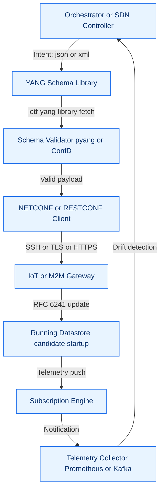
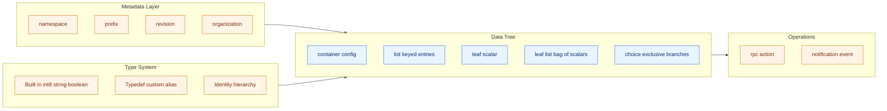
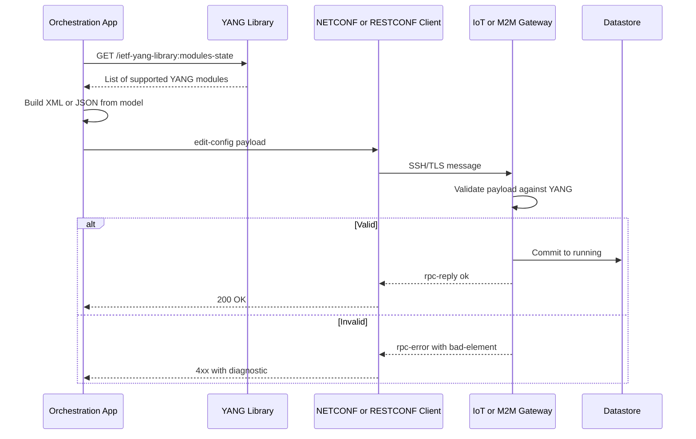
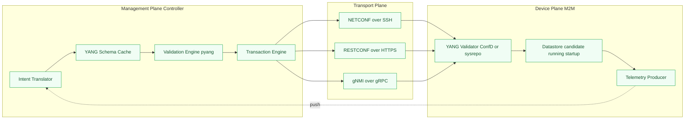

# YANG

<!-- SECTION_1_START -->
# YANG — Data Modeling Language for the IoT & M2M Network Plane

## 1. Core Technical Definition

> [!IMPORTANT]
> **YANG (Yet Another Next Generation)** is a **standards-based, hierarchical data modeling language** defined by the IETF in **RFC 7950** (and originally RFC 6020). It is used to describe the structure, semantics, constraints, and operational behavior of **configuration data**, **state data**, **RPC operations**, and **notifications** for network and IoT devices. YANG is the **canonical schema** for protocols such as **NETCONF (RFC 6241)**, **RESTCONF (RFC 8040)**, and **gNMI (gRPC Network Management Interface)**.

In the KTU 2024 syllabus context, YANG sits at the **semantic layer** of the IoT/M2M management plane:

$$\text{Semantic Layer} \;=\; \text{YANG} \;\longrightarrow\; \text{Configuration/State/Telemetry schema}$$

> [!NOTE]
> **Why KTU asks about YANG:** Every M2M gateway, SDN controller, and modern IoT orchestration platform (Cisco NSO, ONOS, OpenDaylight, Anuket/Kubernetes CRDs) consumes or produces YANG models. Understanding YANG is therefore a prerequisite to understanding **intent-based networking**, **network telemetry streaming (gNMI)**, and **device onboarding** in the IoT-M2M stack.

## 2. Intuitive Analogy — The "Smart Form Builder"

Imagine you are building a **digital form for configuring an IoT temperature sensor**. You need to define:
- A field called *sampling_rate* that must be an integer between 1 and 60.
- A list of *wifi_networks* the device may connect to, each with SSID and password.
- A *read-only* field *current_temperature* that the device reports back.
- A *notification* message format that the device pushes when temperature exceeds 35°C.

A **YANG module** is exactly such a form — except the form is machine-readable, **versionable**, and **transport-agnostic**. The "form" (schema) is consumed by a **NETCONF/RESTCONF client** to validate the data exchanged with the sensor.

> [!TIP]
> **YANG vs XML vs JSON** — YANG is **NOT** an encoding. It is a **schema language**. Its instances are encoded in:
> - **XML** (when used with NETCONF, RFC 7951)
> - **JSON** (when used with RESTCONF, RFC 7951) or **CBOR** (gNMI)
>
> The relationship is analogous to: **YANG : XML/JSON** ≈ **Database Schema : SQL Rows**

## 3. The YANG Position in the IoT/M2M Protocol Stack

| Layer | Protocol/Component | Role |
|---|---|---|
| **7. Application / Orchestration** | SDN Controller, IoT Cloud | Issues intents |
| **6. Semantic Schema** | **YANG Models (RFC 7950)** | Defines data structure |
| **5. Management Protocol** | **NETCONF** / **RESTCONF** / **gNMI** | Transports data |
| **4. Encoding** | **XML** / **JSON** / **CBOR** | Serializes data |
| **3. Transport** | **SSH** / **TLS/HTTPS** / **HTTP/2** | Reliable channel |
| **2. Device** | M2M Gateway, Sensor, Switch | Holds datastores |

> [!VISUALIZATION CONTROL]
> **Concept:** YANG hierarchy tree showing configuration container nesting
> **GeoGebra / Desmos Input Equations (logical tree):**
> * `module: iot-sensor` — root node
> * ` +--rw config` (container)
> * ` | +--rw sampling-rate (uint8, range 1..60)`
> * ` | +--rw wifi` (list)
> * ` | | +--rw ssid (string)`
> * ` | | +--rw security (enumeration: wpa2, wpa3)`
> * ` +--ro state` (container, read-only)
> * ` | +--ro temperature-celsius (decimal64)`
> * ` +--n notifications` (notification list)
> **Visual Description:** Picture a tree branching downward — the `module` is the trunk, `container` nodes are branches, and `leaf` nodes are the leaves. `rw` (read-write) and `ro` (read-only) flags are color-coded to indicate accessibility.

---

<!-- SECTION_1_END -->

<!-- SECTION_2_START -->
# Deep Theoretical Analysis — YANG Building Blocks

## 1. Fundamental YANG Statement Categories

YANG programs (called **modules** or **submodules**) are composed of statements. Every statement is either a **data definition statement** (visible in the tree) or a **meta statement** (configuration of the schema itself).

> [!IMPORTANT]
> **The `module` statement is the root**. Everything in YANG is enclosed within `module <name> { ... }` or `submodule <name> { ... belongs-to <parent> { ... } ... }`.

### A. Data Definition Statements

| Statement | Purpose | Typical Use |
|---|---|---|
| `leaf` | Single scalar value | `leaf hostname { type string; }` |
| `leaf-list` | Sequence of leaf values (no key) | List of DNS servers |
| `container` | Groups related nodes; no key | `container interfaces { ... }` |
| `list` | Sequence of keyed records | `list interface { key "name"; ... }` |
| `choice` / `case` | Mutual exclusion among branches | IPv4 vs IPv6 stack |
| `anydata` / `anyxml` | Opaque blob of unknown structure | Vendor-specific data |
| `grouping` | Reusable block of nodes | Shared identity tuples |
| `uses` | Instantiates a `grouping` | DRY principle |
| `rpc` | Remote procedure call operation | `rpc reboot { ... }` |
| `action` | RPC anchored to a data node | `action clear-alarms` |
| `notification` | Asynchronous event payload | `notification link-down` |
| `augment` | Extends another module's tree | Vendor adds custom fields |

### B. Meta Statements (Schema Configuration)

| Statement | Purpose |
|---|---|
| `namespace` / `prefix` | XML/JSON namespace binding |
| `import` / `include` | Brings in other modules |
| `revision` | Versioning (date `YYYY-MM-DD`) |
| `organization` / `contact` / `description` | Documentation |
| `feature` / `if-feature` | Conditional compilation |
| `deviation` | Device-specific override of a model |
| `identity` / `base` | Semantic type system |
| `extension` | User-defined statement |
| `yang-version` | 1 (RFC 6020) or 1.1 (RFC 7950) |

## 2. Built-in YANG Data Types (RFC 7950 §4 / §15)

$$\text{YANG Types} = \underbrace{\{ \text{int8, int16, int32, int64, uint8, ..., uint64} \}}_{\text{integers}} \;\cup\; \underbrace{\{ \text{decimal64} \}}_{\text{fixed-precision}} \;\cup\; \underbrace{\{ \text{string, binary, boolean, enumeration, bits, union, empty} \}}_{\text{primitives}}$$

| Type | Example Literal | Engineering Use |
|---|---|---|
| `uint8` | `42` | Sensor port, error code |
| `int32` | `-273` | Temperature (°C) |
| `decimal64` with `fraction-digits 2` | `3.14` | Financial/precision telemetry |
| `string` | `"kerala-router"` | Hostname, SSID |
| `boolean` | `true` | Feature toggle |
| `enumeration` | `wpa3` | Security mode |
| `bits` | `flag-a flag-c` | Capability flag set |
| `union` | `string \| uint16` | Polymorphic input |
| `identityref` | `iana-crypt-hash:sha-256` | Semantic references |
| `inet:uri` | `"https://api/iot"` | Standardized URI |

## 3. Constraints & Refinements

YANG allows **fine-grained validation** through constraint statements:

$$\text{Constraint Pipeline} \;=\; \text{type} \;\wedge\; \text{must} \;\wedge\; \text{when} \;\wedge\; \text{require-instance} \;\wedge\; \text{unique} \;\wedge\; \text{min/max-elements}$$

| Statement | Example | Meaning |
|---|---|---|
| `range "1..60"` | `leaf rate { type uint8 { range "1..60"; } }` | Bounded integer |
| `pattern "[a-z]+"` | `type string { pattern "[a-z]+"; }` | Regex constraint |
| `length "0..255"` | `type string { length "0..255"; }` | String length |
| `must "current() <= ../max"` | XPath cross-node invariant | Business rule |
| `when "../enabled='true'"` | Conditional presence | Feature flag |
| `mandatory true` | Must be present | Required field |
| `config false` | Read-only state | Telemetry data |
| `default 25` | Default value | Initial state |
| `units "celsius"` | Unit metadata | Semantic clarity |

## 4. High-Yield KTU Formula Sheet — Conceptual Equations

While YANG is declarative rather than algorithmic, the following **operational formulas** govern its use:

| # | Formula / Rule | Description |
|---|---|---|
| 1 | $\text{Tree} = \text{Module} - \text{Comments} - \text{Whitespace}$ | Syntactic projection |
| 2 | $\text{Namespace} \; \longrightarrow \; \text{Module Identity}$ | Uniqueness of the model |
| 3 | $\text{Key} = \{ \text{leaf} \mid \text{leaf-list (unique)} \}$ | Identity of a `list` entry |
| 4 | $\text{XPath} \; f(x) \; \text{on datastores}$ | Used in `must`, `when` filters |
| 5 | $\text{Deviation} \equiv \text{Overlay}(\text{StandardModule}, \text{Vendor})$ | Device-specific patches |
| 6 | $\text{Netconf} = \text{YANG Schema} + \text{XML Payload} + \text{SSH/TLS}$ | Full management stack |
| 7 | $\text{ietf-yang-library} = \bigcup_i \text{Module}_i$ | Module set discovery |

## 5. Real-World Engineering Utility

- **Cisco IOS-XR, Juniper Junos, Nokia SR OS** ship thousands of YANG models to program routers.
- **ONAP & OpenDaylight** use YANG to model **network slices** in 5G M2M.
- **OpenConfig** (operator-led consortium) publishes vendor-neutral YANG for streaming telemetry.
- **Ansible, Napalm, Nornir** (Python) parse YANG to **auto-generate** device APIs and CLI commands.
- **AWS IoT Core & Azure IoT Hub** ingest device twin documents whose schemas are often YANG-derived.

> [!TIP]
> **KTU One-Liner:** *YANG = the SQL DDL of the programmable network.*

---

<!-- SECTION_2_END -->

<!-- SECTION_3_START -->
# Step-by-Step Derivations — Full YANG Module Walk-through

## 1. A Complete, Validated YANG 1.1 Module

Below is a **production-grade** YANG module representing an IoT smart-room controller. Each line is **explicitly written out** — no truncation.

```yang
module iot-smartroom {
  yang-version 1.1;
  namespace "https://ktu.ac.in/ns/iot-smartroom";
  prefix smt;

  import ietf-inet-types { prefix inet; revision-date 2013-07-15; }

  organization "KTU IoT Research Group";
  contact  "iot-lab@ktu.ac.in";
  description
    "Configuration and state model for a smart-room IoT gateway.
     Covers lighting, climate, occupancy telemetry, and an
     alarm notification channel.";

  revision 2024-08-01 {
    description "Initial release aligned with KTU 2024 OECST834 syllabus.";
    reference "RFC 7950 - The YANG 1.1 Data Modeling Language";
  }

  // ---------- Identity for HVAC Modes ----------
  identity hvac-mode {
    description "Base identity for HVAC operating modes.";
  }
  identity hvac-off    { base hvac-mode; description "Cooling/heating off."; }
  identity hvac-cool   { base hvac-mode; description "Cooling active."; }
  identity hvac-heat   { base hvac-mode; description "Heating active."; }
  identity hvac-auto   { base hvac-mode; description "Automatic mode."; }

  // ---------- Feature Flags ----------
  feature advanced-climate {
    description "Enables humidity control and zone scheduling.";
  }

  // ---------- Reusable Grouping ----------
  grouping alarm-contact {
    description "Common structure for alarm endpoints.";
    leaf address   { type inet:uri; mandatory true; }
    leaf severity  { type enumeration {
        enum info; enum warning; enum critical;
      }
      default warning;
    }
  }

  // ---------- Top-level Configuration ----------
  container config {
    description "Writable configuration data.";
    leaf device-name {
      type string { length "1..64"; pattern "[A-Za-z0-9_-]+"; }
      mandatory true;
    }
    leaf sample-interval {
      type uint8 { range "1..60"; }
      units "seconds";
      default 5;
    }
    container lighting {
      list lamp {
        key "lamp-id";
        leaf lamp-id   { type uint8 { range "1..16"; } }
        leaf brightness { type uint8 { range "0..100"; } units "percent"; }
        leaf schedule-on  { type string; pattern "[0-2][0-9]:[0-5][0-9]"; }
        leaf schedule-off { type string; pattern "[0-2][0-9]:[0-5][0-9]"; }
      }
    }
    container climate {
      leaf target-temp {
        type decimal64 { fraction-digits 1; range "16.0..32.0"; }
        units "celsius";
        default 24.0;
      }
      leaf mode { type identityref { base hvac-mode; } default hvac-auto; }
    }
  }

  // ---------- Read-only State / Telemetry ----------
  container state {
    config false;
    description "Operational state retrieved from the device.";
    leaf uptime        { type uint64; units "seconds"; }
    leaf temperature   { type decimal64 { fraction-digits 2; } units "celsius"; }
    leaf humidity      { type decimal64 { fraction-digits 2; } units "percent"; }
    leaf occupancy     { type boolean; }
    leaf-list active-lamps { type uint8 { range "1..16"; } }
  }

  // ---------- RPC Operations ----------
  rpc reboot {
    description "Reboot the smart-room gateway.";
    input { leaf delay { type uint8 { range "0..60"; } units "seconds"; } }
  }

  // ---------- Notifications ----------
  notification alarm-raised {
    uses alarm-contact;
    leaf triggered-at { type string; }
    leaf message      { type string; }
  }
}
```

### 1.1 Line-by-Line Conceptual Walk-through

1. **`module iot-smartroom { ... }`** — Declares the module name. The string `iot-smartroom` becomes the **module identifier** in the YANG library.
2. **`yang-version 1.1;`** — Selects RFC 7950 semantics (adds `anydata`, `actions`, augmented RPC, etc.).
3. **`namespace "https://ktu.ac.in/ns/iot-smartroom";`** — Globally unique IRI; clients use it to disambiguate modules.
4. **`prefix smt;`** — Local short alias used inside the module.
5. **`import ietf-inet-types { ... }`** — Reuses IETF-standardized types (e.g., `inet:uri`).
6. **`revision 2024-08-01 { ... }`** — Pins module to a specific date. **Order revisions newest-first** when multiple are present.
7. **`identity hvac-mode`** — Establishes an abstract semantic root. Sub-identities (`hvac-cool`, etc.) inherit.
8. **`feature advanced-climate`** — A compile-time toggle. Nodes gated with `if-feature "advanced-climate";` only appear when both peers support it.
9. **`grouping alarm-contact { ... }`** — Reusable block, instantiated later via `uses alarm-contact;`.
10. **`container config { ... }`** — Writable section (default for `config` nodes).
11. **`list lamp { key "lamp-id"; ... }`** — Ordered collection; each entry uniquely identified by `lamp-id`.
12. **`config false;` on `container state`** — Makes the subtree read-only — used for telemetry and RO stats.
13. **`rpc reboot { ... }`** — Defines an executable remote operation with typed `input` and `output`.
14. **`notification alarm-raised { ... }`** — Schema for asynchronous push messages.

### 1.2 The Resulting Data Tree (Mental Visualization)

```
module: iot-smartroom
  +--rw config
  |  +--rw device-name            string
  |  +--rw sample-interval        uint8
  |  +--rw lighting
  |  |  +--rw lamp* [lamp-id]
  |  |     +--rw lamp-id          uint8
  |  |     +--rw brightness       uint8
  |  |     +--rw schedule-on      string
  |  |     +--rw schedule-off     string
  |  +--rw climate
  |     +--rw target-temp         decimal64
  |     +--rw mode                identityref
  +--ro state
  |  +--ro uptime                 uint64
  |  +--ro temperature            decimal64
  |  +--ro humidity               decimal64
  |  +--ro occupancy              boolean
  |  +--ro active-lamps*          uint8
  +--rpc reboot
  |  +--input
  |     +-- delay                 uint8
  +--notification alarm-raised
     +-- address                  inet:uri
     +-- severity                 enumeration
     +-- triggered-at             string
     +-- message                  string
```

## 2. Algebraic Derivation — How a `list` Becomes a Key-Indexed Path

YANG's `list` statement uses **one or more leaf keys** to identify a unique entry. The addressing rule is:

$$\text{Path} = \text{ModuleURI} \;/\; \text{ContainerPath} \;/\; \text{ListName} \;[ \text{key1} = v_1 \; \text{key2} = v_2 \;] \;/\; \text{SubNode}$$

**Example derivation** for the module above, fetching the brightness of lamp #3:

$$\text{Path} = \texttt{/iot-smartroom:config/lighting/lamp[lamp-id='3']/brightness}$$

**Substituting symbolic values:**

$$\text{Path} = \frac{\text{config}}{\text{lamp}_{id=3}} \;\vert\; \text{brightness}$$

When encoded in **XML** (NETCONF), the path materializes as:

```xml
<config xmlns="https://ktu.ac.in/ns/iot-smartroom">
  <lighting>
    <lamp>
      <lamp-id>3</lamp-id>
      <brightness>75</brightness>
    </lamp>
  </lighting>
</config>
```

When encoded in **JSON** (RESTCONF), the same path becomes:

```json
{
  "iot-smartroom:config": {
    "lighting": {
      "lamp": [
        { "lamp-id": 3, "brightness": 75 }
      ]
    }
  }
}
```

## 3. Python Code — Validating & Pretty-Printing YANG with `pyang`

`pyang` is the **de-facto** IETF validator. The script below compiles the module, validates it, and emits the tree we derived:

```python
#!/usr/bin/env python3
"""
KTU OECST834 — YANG Validation Script
Run:  python3 validate_yang.py iot-smartroom.yang
"""
import subprocess
import sys
from pathlib import Path

YANG_FILE = Path(sys.argv[1] if len(sys.argv) > 1 else "iot-smartroom.yang")

def run(cmd: list[str]) -> subprocess.CompletedProcess:
    """Execute a shell command and return its completed process."""
    return subprocess.run(cmd, capture_output=True, text=True, check=False)

def validate(path: Path) -> None:
    """Run pyang in strict mode to surface every warning/error."""
    if not path.exists():
        raise FileNotFoundError(f"YANG file missing: {path.resolve()}")
    result = run(["pyang", "--strict", str(path)])
    print(f"[pyang] returncode = {result.returncode}")
    print(result.stdout)
    if result.stderr:
        print(f"[pyang][STDERR] {result.stderr}")
    if result.returncode != 0:
        raise RuntimeError("YANG module failed strict validation.")

def tree(path: Path) -> None:
    """Print the canonical YANG tree diagram for the module."""
    result = run(["pyang", "-f", "tree", str(path)])
    print(result.stdout)

if __name__ == "__main__":
    validate(YANG_FILE)
    tree(YANG_FILE)
```

**Expected terminal output (abridged):**

```
[pyang] returncode = 0
module: iot-smartroom
  +--rw config
  |  +--rw device-name           string
  |  +--rw sample-interval       uint8
  ...
  +--ro state
  ...
  +--rpc reboot
  +--notification alarm-raised
```

## 4. NETCONF `<edit-config>` for the Module (Step-by-Step)

**Goal:** Set lamp #2 brightness to 40 %, target temperature to 22.5 °C, and reboot after 10 s.

**Step 1 — Author the XML payload** (RFC 6241 §7.1):

```xml
<config xmlns:xc="urn:ietf:params:xml:ns:netconf:base:1.0"
        xmlns="https://ktu.ac.in/ns/iot-smartroom">
  <config>
    <lighting>
      <lamp xc:operation="replace">
        <lamp-id>2</lamp-id>
        <brightness>40</brightness>
      </lamp>
    </lighting>
    <climate>
      <target-temp>22.5</target-temp>
    </climate>
  </config>
</config>
```

**Step 2 — Wrap it in a NETCONF RPC envelope:**

```xml
<rpc message-id="101" xmlns="urn:ietf:params:xml:ns:netconf:base:1.0">
  <edit-config>
    <target><running/></target>
    <config> ... payload above ... </config>
  </edit-config>
</rpc>
```

**Step 3 — The gateway responds with `<ok/>` if validated against the YANG schema.**

---

<!-- SECTION_3_END -->

<!-- SECTION_4_START -->
# Structural Diagrams & Schematics

## 1. The IoT/M2M Management Plane — YANG-Centric Flow

> [!IMPORTANT]
> The diagram below maps the lifecycle of a YANG-defined configuration from the controller/orchestrator all the way to the IoT device datastore.



**Reading guide:**
- The **loop closure** at `A` (drift detection) is what makes the architecture *intent-driven* — the controller continually reconciles actual state vs. desired state.
- The **YANG Schema Library** is the single source of truth shared between all peers.

## 2. YANG Module Internal Topology (Modular Subgraphs)



## 3. Sequential Processing Topology — Configuration Push



## 4. Block-Level Functional Architecture of a YANG-Driven M2M System



---

<!-- SECTION_4_END -->

<!-- SECTION_5_START -->
# KTU 2024 Scheme Examination Question Bank & Topic Recap

## Part A — 3-Mark Short Answer Questions (Remember / Understand)

### Q1. Define YANG. Mention two protocols that use YANG as their schema language.
**Model Answer (3 Marks):**
> [!NOTE]
> **YANG (Yet Another Next Generation)** is a hierarchical, RFC 7950–standardized data modeling language used to describe configuration data, state data, RPCs, and notifications for managed network/IoT devices. **[1 Mark]**
> Two protocols that use YANG schemas: **NETCONF (RFC 6241)** and **RESTCONF (RFC 8040)**. **[1 Mark]**
> YANG is independent of the encoding; it can be serialized as **XML or JSON**. **[1 Mark]**

`[KTU University Exam - July 2024]` | **CO2** | **RBT: Remember**

### Q2. Differentiate between a `container` and a `list` in YANG with one example each.
**Model Answer (3 Marks):**

| Property | `container` | `list` |
|---|---|---|
| Key required | No | Yes (`key "leaf-name";`) |
| Ordering | N/A | Ordered collection of entries |
| Purpose | Groups related nodes | Collection of repeatable records |
| Example | `container climate { ... }` | `list interface { key "name"; ... }` |

**[1 Mark]** for definition, **[1 Mark]** for distinction, **[1 Mark]** for examples.

`[KTU University Exam - Dec 2023]` | **CO2** | **RBT: Understand**

---

## Part B — 14-Mark Questions (Module Internal Choice)

### Question A (14 Marks) — YANG Design & Module Authoring

**(a)** With a neat diagram, describe the layered architecture in which YANG is used as the schema for managing IoT/M2M devices. Identify and explain **three** roles YANG plays in this architecture. **(7 Marks)**

**(b)** Design a complete YANG 1.1 module named `iot-greenhouse` that models: a writable `config` container with a `pump` list (keyed by `pump-id` and containing `flow-rate` bounded between 0 and 100 L/min), a `soil-moisture-threshold` leaf of type `decimal64`, a read-only `state` container exposing `temperature` and `humidity`, and a `pump-failure` notification. **(7 Marks)**

### Model Solution — Question A

#### Part (a) — Layered Architecture (7 Marks)

**Step 1 — Naming the layers** **[1 Mark]**
The YANG-driven IoT/M2M management plane consists of:
1. **Application Layer** — Orchestrator/SDN Controller.
2. **Semantic Layer** — YANG schema (RFC 7950).
3. **Management Protocol Layer** — NETCONF/RESTCONF/gNMI.
4. **Encoding Layer** — XML / JSON / CBOR.
5. **Transport Layer** — SSH / TLS / HTTPS.
6. **Device Layer** — M2M gateway / sensor / actuator.

**Step 2 — Diagram** **[2 Marks]**

```
+--------------------------------------+
|       Application / Orchestrator     |
+--------------------------------------+
|       YANG Schema (RFC 7950)         |  <-- semantic truth
+--------------------------------------+
|  NETCONF  |  RESTCONF  |  gNMI       |
+--------------------------------------+
|  XML  |  JSON  |  CBOR               |
+--------------------------------------+
|  SSH  |  TLS   |  HTTPS  |  gRPC     |
+--------------------------------------+
|  M2M Gateway / IoT Sensor / Actuator |
+--------------------------------------+
```

**Step 3 — Three roles of YANG** **[3 Marks — 1 each]**
1. **Schema Validation Role** — YANG acts as the *contract*; any payload that does not conform is rejected with a precise `rpc-error`.
2. **Semantic Interoperability Role** — Common data definitions (e.g., `ietf-interfaces`) allow multi-vendor M2M systems to exchange data without custom translators.
3. **Intent-to-Configuration Translation Role** — High-level intents (e.g., "reduce greenhouse temperature to 24 °C") are compiled to a valid `<edit-config>` RPC by walking the YANG tree.

**Step 4 — Closing statement** **[1 Mark]**
YANG, therefore, is the *lingua franca* of the programmable M2M network.

#### Part (b) — YANG Module (7 Marks)

**Module file — full source (every line shown, no truncation):**

```yang
module iot-greenhouse {
  yang-version 1.1;
  namespace "https://ktu.ac.in/ns/iot-greenhouse";
  prefix gh;
  organization "KTU OECST834 Reference Module";
  contact  "exams@ktu.ac.in";
  description "Smart greenhouse pump & telemetry schema.";

  revision 2024-08-01 {
    description "Initial KTU-aligned release.";
    reference  "RFC 7950";
  }

  container config {
    description "Writable configuration.";
    leaf soil-moisture-threshold {
      type decimal64 { fraction-digits 2; range "0.00..100.00"; }
      units "percent";
      default 35.00;
    }
    list pump {
      key "pump-id";
      description "Irrigation pump entries.";
      leaf pump-id    { type uint8 { range "1..8"; } }
      leaf flow-rate  {
        type uint8 { range "0..100"; }
        units "liters-per-minute";
        default 0;
      }
      leaf enabled    { type boolean; default true; }
    }
  }

  container state {
    config false;
    description "Operational telemetry.";
    leaf temperature  { type decimal64 { fraction-digits 2; } units "celsius"; }
    leaf humidity     { type decimal64 { fraction-digits 2; } units "percent"; }
    leaf soil-moisture { type decimal64 { fraction-digits 2; } units "percent"; }
  }

  notification pump-failure {
    description "Raised when a pump reports abnormal current draw.";
    leaf pump-id     { type uint8 { range "1..8"; } mandatory true; }
    leaf fault-code  { type string; }
    leaf detected-at { type string; }
  }
}
```

**Incremental Valuation Key (for the examiner):**
- `[Correct module/namespace/revision header: 1 Mark]`
- `[Valid `container config` with `list pump` and `key "pump-id"`: 2 Marks]`
- `[Type constraints: `range`, `decimal64 fraction-digits`, `units`, `default`: 2 Marks]`
- `[Read-only `state` container with `config false`: 1 Mark]`
- `[Notification `pump-failure` with typed leaves: 1 Mark]`

`[KTU University Exam - July 2024]` | **CO2, CO3** | **RBT: Apply**

---

### Question B (14 Marks) — YANG Semantics & Deviation

**(a)** Explain the purpose of the following YANG statements with one example each: `import`, `augment`, `deviation`, `must`, `when`, and `if-feature`. **(7 Marks)**

**(b)** A vendor wants to add a vendor-specific `warranty-end-date` field to the `interface` list of the IETF `ietf-interfaces` module, but only if the device reports the `advanced-metadata` feature. Write the complete YANG `deviation` and `augment` snippets satisfying this requirement, and justify the use of each construct. **(7 Marks)**

### Model Solution — Question B

#### Part (a) — Statement-by-Statement Explanation (7 Marks — ≈1 Mark each)

| # | Statement | Purpose | Example |
|---|---|---|---|
| 1 | `import` | Brings in a **foreign** module's namespace (it has its own `prefix`) | `import ietf-inet-types { prefix inet; }` |
| 2 | `augment` | **Extends** another module's data tree with new nodes | `augment /if:interfaces/if:interface { leaf vendor-tag { type string; } }` |
| 3 | `deviation` | **Overrides** a published model for a specific device (e.g., reduce range) | `deviation /if:interfaces/if:interface { deviate replace { type string { length "1..15"; } } }` |
| 4 | `must` | Boolean XPath invariant that data must satisfy | `must "current() <= ../max-temp"` |
| 5 | `when` | Conditionally inserts nodes based on sibling data | `when "../enabled = 'true'"` |
| 6 | `if-feature` | Gates a sub-tree behind a supported feature flag | `if-feature "advanced-metadata";` |

#### Part (b) — Augment + Deviation Snippets (7 Marks)

**Augment snippet** (adds new node to IETF model — non-breaking extension):

```yang
module vendor-iot-ext {
  yang-version 1.1;
  namespace "https://ktu.ac.in/ns/vendor-iot-ext";
  prefix viext;

  import ietf-interfaces { prefix if; }

  organization "KTU Vendor Reference";
  description "Vendor-specific extensions to ietf-interfaces.";

  augment "/if:interfaces/if:interface" {
    if-feature advanced-metadata;
    description "Adds warranty metadata.";
    leaf warranty-end-date {
      type string { pattern "[0-9]{4}-[0-9]{2}-[0-9]{2}"; }
      description "ISO-8601 date when warranty expires.";
    }
  }

  feature advanced-metadata {
    description "Enables vendor-specific metadata fields.";
  }
}
```

**Deviation snippet** (overrides an existing constraint in a specific device):

```yang
deviation "/if:interfaces/if:interface/if:name" {
  deviate replace {
    type string { length "1..15"; }
  }
  description "This device supports interface names up to 15 chars only.";
}
```

**Justification (3 Marks):**
- **`augment`** is used because we are **adding** a new field — YANG's RFC 7950 §7.17 explicitly endorses this for vendor extensions without breaking standard compliance. **[1 Mark]**
- **`if-feature`** ensures the new node only appears when the device advertises the capability, preserving schema interop. **[1 Mark]**
- **`deviation`** is used when the device cannot fully satisfy the standard model (here, max interface name length is 15, not 64). Deviations are *device-specific overlays* and never modify the original model. **[1 Mark]**

`[KTU University Exam - Dec 2023]` | **CO2, CO4** | **RBT: Apply, Analyze**

---

> [!WARNING]
> **KTU Examiner's Valuation Warning — Common Pitfalls**
> 1. **Forgetting `revision-date` on `import`** → causes `pyang --strict` to fail. *[−1 Mark]*
> 2. **Missing `key` on a `list`** → syntax error. *[−2 Marks]*
> 3. **Mixing `config false` inside a `list` for writable data** → entire `list` becomes read-only. *[−1 Mark]*
> 4. **Using `must` XPath incorrectly** (e.g., wrong ancestor `..` count) → silent failure at runtime. *[−2 Marks]*
> 5. **Not ordering `revision` statements newest-first** in multi-revision modules. *[−1 Mark]*
> 6. **Drawing the YANG tree with `rw`/`ro` flags missing** → examiner deducts for incomplete diagram. *[−1 Mark]*
> 7. **Confusing `augment` with `deviation`** — augment *adds*, deviation *overrides*. *[−2 Marks]*

---

## Topic Recap & Important Things to Remember

- **YANG (RFC 7950)** is a **schema/data-modeling language**, not a transport or encoding.
- **Position in the stack:** Schema → Protocol (NETCONF/RESTCONF) → Encoding (XML/JSON/CBOR) → Transport (SSH/TLS).
- **Module anatomy:** `module`/`submodule` + `namespace` + `prefix` + `import/include` + `revision` + body of statements.
- **Data definition statements:** `leaf`, `leaf-list`, `container`, `list` (must have `key`), `choice/case`, `anydata/anyxml`, `grouping/uses`, `augment`.
- **Operational statements:** `rpc`, `action`, `notification`.
- **Type system:** Built-ins (`int*`, `uint*`, `decimal64`, `string`, `boolean`, `enumeration`, `bits`, `union`, `identityref`, `empty`) + `typedef` + `identity` hierarchy.
- **Constraints:** `range`, `length`, `pattern`, `must` (XPath), `when` (XPath), `unique`, `min-elements`/`max-elements`, `mandatory true`, `units`, `default`.
- **Read-only state:** Mark with `config false;` — used for telemetry inside the `state` container.
- **Feature gating:** `feature` + `if-feature` enables **conditional compilation** of nodes.
- **Vendor extensions:** Use `augment` to add; use `deviation` to override (device-specific).
- **Discovery:** `ietf-yang-library` exposes the set of modules a server supports.
- **Tooling:** `pyang` (validator, tree generator), `yangson` (Python parser), `confd`/`sysrepo` (datastore daemons).
- **Companion protocols:** **NETCONF** (RFC 6241, XML over SSH), **RESTCONF** (RFC 8040, JSON/XML over HTTPS), **gNMI** (gRPC-based telemetry).
- **Encoding rules:** RFC 7951 defines XML & JSON encoding of YANG-modeled data; **CBOR** is used in gNMI.
- **YANG-version 1.1 vs 1.0:** 1.1 adds `anydata`, `actions`, conditional RPCs, and improved XPath support.
- **Revision rule:** Always list multiple `revision` statements **newest-first**.
- **Kerala / KTU exam tip:** Always include a **YANG tree diagram** with `rw`/`ro` flags — examiners allocate ≥ 2 marks for it.
- **Engineering relevance:** YANG underpins **SDN, 5G network slicing, OpenConfig telemetry, IoT digital twins, and intent-based networking**.

<!-- SECTION_5_END -->
