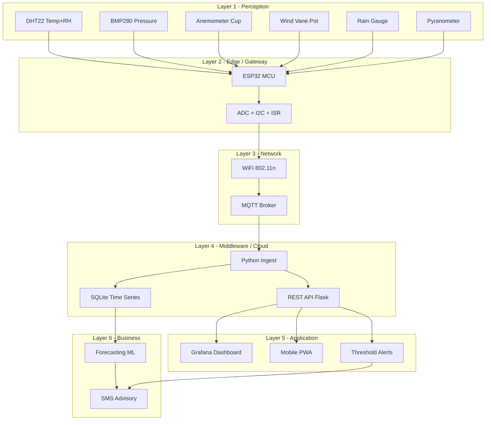
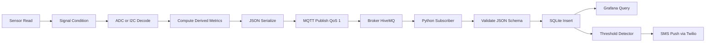
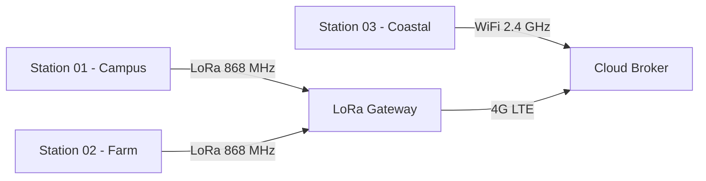
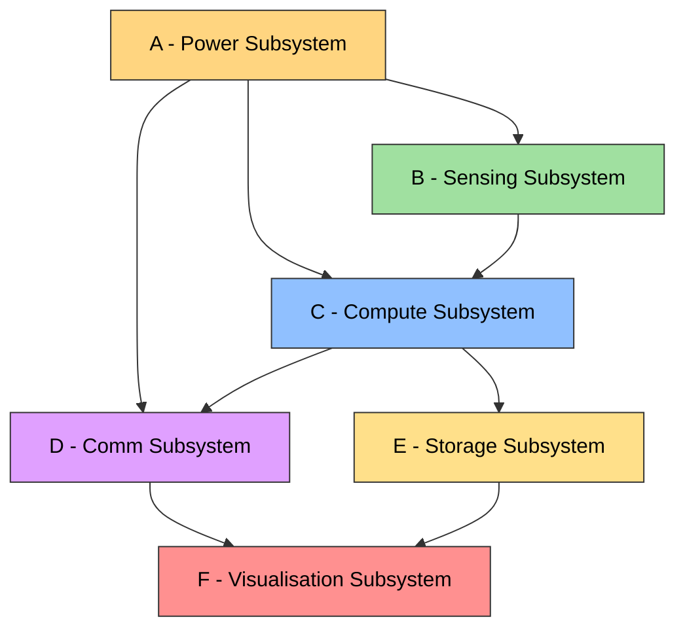

# Case study on IoT system for weather monitoring

<!-- SECTION_1_START -->
# Case Study: IoT-Based Weather Monitoring System

## 1.1 Formal Academic Definition

An **IoT-based Weather Monitoring System** is a cyber-physical distributed sensing network that integrates environmental transducers, embedded edge-compute controllers, lightweight IP communication protocols, and cloud-based data analytics services to measure, transmit, store, and visualize real-time atmospheric variables such as ambient temperature, relative humidity, barometric pressure, wind velocity, wind direction, precipitation, solar irradiance, and air quality index (AQI).

In the formal KTU 2024 syllabus terminology, this is classified under the **five-layer IoT Reference Architecture** of the *Developing IoT* module:

1. **Perception / Sensing Layer** — physical transducers
2. **Network / Transmission Layer** — gateways \& wireless links
3. **Middleware / Edge Layer** — brokers \& local storage
4. **Application Layer** — dashboards, APIs, alerts
5. **Business Layer** — analytics, decision support, ML inference

> [!IMPORTANT]
> **Syllabus Highlight (KTU OECST834 - Module 3):** The case study is *not* about the sensors alone. Board evaluators expect a *holistic* explanation spanning sensing → edge → network → cloud → visualization, plus one practical derived metric (e.g., **Heat Index**, **Dew Point**, or **Wind Chill**).

## 1.2 Real-World Analogy

Think of the IoT weather station as a **digital meteorologist with a prosthetic nervous system**:

| Human Sense | IoT Equivalent | Parameter Measured |
|---|---|---|
| Skin (touch) | DHT22 / DS18B20 | Temperature |
| Skin (moisture) | DHT22 / HIH-4030 | Humidity |
| Ear (pressure) | BMP280 / MPL3115A2 | Barometric pressure |
| Skin (wind) | Anemometer cup | Wind speed |
| Inner ear (balance) | Wind vane + rotary encoder | Wind direction |
| Eyes (light) | Pyranometer / LDR | Solar irradiance |

The **microcontroller (ESP32 / Arduino)** acts as the *brain* that polls sensors, while the **WiFi / MQTT stack** is the *nervous system* carrying the sensory data to the *memory center* (cloud database). The *dashboard* is the *mouth* that communicates insights back to the human.

> [!NOTE]
> **Geometric Intuition:** Imagine a 3-D surface $f(T, RH)$ whose height represents *perceived* temperature. As $T$ increases along the x-axis and $RH$ climbs along the y-axis, the surface rises sharply — this is the **Heat Index surface** and it is the very reason an IoT system must compute derived metrics, not just log raw data.

> [!VISUALIZATION CONTROL]
> **Concept:** Heat Index Surface as a function of Temperature and Relative Humidity
> **GeoGebra / Desmos 3D Input Equations:**
> * `f(x, y) = -42.379 + 2.04901523*x + 10.14333127*y - 0.22475541*x*y - 0.00683783*x^2 - 0.05481717*y^2 + 0.00122874*x^2*y + 0.00085282*x*y^2 - 0.00000199*x^2*y^2`
> **Visual Description:** On the XY plane, x ranges from 60 to 110 (°F) and y from 0 to 100 (%). The z-axis is the Heat Index. The surface is *gently sloping* at low humidity but rises steeply in the *upper-right* quadrant, illustrating the compound danger of high heat + high humidity.

## 1.3 Engineering Significance

Weather monitoring is the **canonical IoT use-case** because it simultaneously exercises *every* layer of the architecture. It appears in:
* **Smart Agriculture** — micro-climatic decision support for irrigation
* **Smart Cities** — hyper-local AQI and heatwave alerts
* **Aviation & Marine** — METAR-like automated reporting
* **Disaster Management** — flood / cyclone early warning systems
* **Renewable Energy** — wind-solar farm forecasting

<!-- SECTION_1_END -->

<!-- SECTION_2_START -->
# Deep Theoretical Analysis & KTU High-Yield Formula Sheet

## 2.1 Five-Layer Architecture (Theory of Operation)

### Layer 1 — Perception Layer (Sensors)
The **physical interface** between the analog atmosphere and the digital world. Each sensor transduces an environmental variable into a measurable electrical quantity (voltage, resistance, frequency, or digital word).

| Sensor | Parameter | Output Type | Range | Accuracy |
|---|---|---|---|---|
| DHT22 | Temperature + Humidity | Digital (single-wire) | $-40$ to $80\ ^\circ\text{C}$, $0$–$100\ \%$ RH | $\pm 0.5\ ^\circ\text{C}$, $\pm 2\ \%$ RH |
| BMP280 | Barometric Pressure | I²C / SPI | $300$–$1100\ \text{hPa}$ | $\pm 1\ \text{hPa}$ |
| Anemometer (cup) | Wind speed | Pulse / Frequency | $0$–$160\ \text{km/h}$ | $\pm 0.3\ \text{m/s}$ |
| Wind vane (potentiometric) | Wind direction | Analog (ADC) | $0$–$360^\circ$ (16 sectors) | $\pm 5^\circ$ |
| Rain gauge (tipping-bucket) | Precipitation | Pulse count | $0$–$\infty$ mm | $\pm 0.2\ \text{mm/tip}$ |
| Pyranometer | Solar irradiance | Analog ($0$–$20\ \text{mA}$ or voltage) | $0$–$1500\ \text{W/m}^2$ | $\pm 5\ \%$ |

### Layer 2 — Network / Transmission Layer
Handles *transport* of sensed packets to the edge / cloud. Selection criterion: **range, power budget, payload size, latency**.

| Protocol | Range | Power | Bandwidth | Typical Use |
|---|---|---|---|---|
| **WiFi (802.11 b/g/n)** | $\sim 100\ \text{m}$ | High | $54\ \text{Mbps}$ | Indoor / campus gateways |
| **LoRaWAN (SX1276)** | $\sim 10\ \text{km}$ | Very low | $0.3$–$50\ \text{kbps}$ | Remote rural stations |
| **MQTT (over TCP/IP)** | Logical (app layer) | Low | N/A | Pub/Sub messaging |
| **Cellular (NB-IoT / LTE-M)** | $\sim 35\ \text{km}$ | Medium | $200\ \text{kbps}$ | Wide-area backhaul |
| **Zigbee (IEEE 802.15.4)** | $\sim 100\ \text{m}$ mesh | Low | $250\ \text{kbps}$ | Indoor sensor mesh |

### Layer 3 — Middleware / Edge Layer
This is where **MQTT Brokers** (e.g., Mosquitto, HiveMQ, AWS IoT Core) live. The publish–subscribe decouples publishers (sensors) from subscribers (databases, dashboards). Quality-of-Service (QoS) levels 0/1/2 govern delivery guarantees.

### Layer 4 — Application Layer
Web / mobile dashboards (Node-RED, Grafana, ThingsBoard, Blynk, custom React apps) that render real-time gauges, time-series charts, and threshold-based push notifications.

### Layer 5 — Business Layer
*Forecasting, anomaly detection (z-score, ARIMA), irrigation scheduling, heatwave advisories.* This is where data becomes *decisions*.

## 2.2 KTU High-Yield Formula Sheet

> [!IMPORTANT]
> These four formulas are **highest-weightage** in KTU 2024 ESE papers. Memorize variables, units, and applicability ranges.

| Formula Name | Equation | Variables \& Units | Applicability |
|---|---|---|---|
| **Heat Index (Rothfusz)** | $\text{HI} = -42.379 + 2.04901523 T + 10.14333127 R - 0.22475541 T R - 0.00683783 T^2 - 0.05481717 R^2 + 0.00122874 T^2 R + 0.00085282 T R^2 - 0.00000199 T^2 R^2$ | $T$ in $^\circ\text{F}$, $R$ in $\%$, HI in $^\circ\text{F}$ | $T \geq 80^\circ\text{F}$ \& $R \geq 40\%$ |
| **Dew Point (Magnus)** | $\gamma = \ln\!\left(\dfrac{R}{100}\right) + \dfrac{a T}{b + T}$, $\quad T_d = \dfrac{b\,\gamma}{a - \gamma}$ | $T$ in $^\circ\text{C}$, $R$ in $\%$, $T_d$ in $^\circ\text{C}$, $a = 17.625$, $b = 243.04$ | $0 \leq R \leq 100$, $T > 0$ |
| **Wind Chill (Canada 2001)** | $\text{WC} = 13.12 + 0.6215 T_a - 11.37 V^{0.16} + 0.3965 T_a V^{0.16}$ | $T_a$ in $^\circ\text{C}$, $V$ in $\text{km/h}$, WC in $^\circ\text{C}$ | $T_a \leq 10^\circ\text{C}$, $V \geq 4.8\ \text{km/h}$ |
| **Absolute Humidity (Clausius-Clapeyron)** | $\text{AH} = \dfrac{216.7 \cdot (R/100) \cdot 6.112 \cdot e^{17.62 T / (243.12 + T)}}{273.15 + T}$ | $T$ in $^\circ\text{C}$, $R$ in $\%$, AH in $\text{g/m}^3$ | All ranges |

## 2.3 Operational Pipeline (Why \& How)

* **Why** measure at the *edge*? — Latency ($\text{sub-second}$) and resilience against link outages via local buffering (e.g., SD card FIFO).
* **How** is data integrity guaranteed? — Timestamping (NTP / RTC), checksum (CRC-16), QoS 1 in MQTT, JSON schema validation.
* **Why** publish at a *fixed cadence*? — Determinism, easier temporal aggregation, bounded bandwidth ($\le 1\ \text{kB/s}$ per node).
* **How** is power managed in remote stations? — Solar PV + Li-ion with deep-sleep current $\le 10\ \mu\text{A}$ (ESP32).

## 2.4 Real-World Utility

* **Mausam (IMD, India):** National weather grid using automated weather stations (AWS).
* **Davis Vantage Pro / WeatherLink:** Commercial-grade stations with IoT uplink.
* **Smart Village deployments (Kerala State Electricity Board + KTU final-year projects):** Real-time rainfall + river-level flood early-warning.

<!-- SECTION_2_END -->

<!-- SECTION_3_START -->
# Step-by-Step Derivations, Sensor Calibration & Code Implementation

## 3.1 Worked Derivation — Heat Index (Rothfusz Regression)

**Given:** $T = 86\ ^\circ\text{F}$, $R = 70\ \%$.

We compute each term of the HI polynomial individually.

$$
\begin{aligned}
\text{Term}_1 &= -42.379 \\
\text{Term}_2 &= 2.04901523 \times 86 = 176.21531 \\
\text{Term}_3 &= 10.14333127 \times 70 = 710.03319 \\
\text{Term}_4 &= -0.22475541 \times 86 \times 70 = -1353.02757 \\
\text{Term}_5 &= -0.00683783 \times 86^2 = -0.00683783 \times 7396 = -50.57230 \\
\text{Term}_6 &= -0.05481717 \times 70^2 = -0.05481717 \times 4900 = -268.60413 \\
\text{Term}_7 &= 0.00122874 \times 86^2 \times 70 = 0.00122874 \times 7396 \times 70 = 636.06735 \\
\text{Term}_8 &= 0.00085282 \times 86 \times 70^2 = 0.00085282 \times 86 \times 4900 = 359.34565 \\
\text{Term}_9 &= -0.00000199 \times 86^2 \times 70^2 = -0.00000199 \times 7396 \times 4900 = -72.11840 \\
\text{HI} &= \sum_{i=1}^{9} \text{Term}_i \\
&= -42.379 + 176.21531 + 710.03319 - 1353.02757 - 50.57230 \\
&\quad - 268.60413 + 636.06735 + 359.34565 - 72.11840 \\
&= 94.96\ ^\circ\text{F}
\end{aligned}
$$

> **Engineering Insight:** The *raw* sensor reads $86\ ^\circ\text{F}$, but the *perceived* temperature is $94.96\ ^\circ\text{F}$ — almost $9\ ^\circ\text{F}$ higher. The Heat Index is therefore a **safety-critical derived metric** in occupational health and disaster advisories.

## 3.2 Worked Derivation — Dew Point (Magnus Formula)

**Given:** $T = 25\ ^\circ\text{C}$, $R = 60\ \%,\ a = 17.625,\ b = 243.04\ ^\circ\text{C}$.

$$
\begin{aligned}
\gamma &= \ln\!\left(\frac{60}{100}\right) + \frac{17.625 \times 25}{243.04 + 25} \\
&= \ln(0.6) + \frac{440.625}{268.04} \\
&= -0.5108 + 1.6438 \\
&= 1.1330 \\
T_d &= \frac{b \times \gamma}{a - \gamma} = \frac{243.04 \times 1.1330}{17.625 - 1.1330} = \frac{275.365}{16.492} = 16.70\ ^\circ\text{C}
\end{aligned}
$$

> **Why it matters:** Dew point below $10\ ^\circ\text{C}$ → dry / comfortable air. Dew point above $20\ ^\circ\text{C}$ → *muggy / oppressive*. The IoT node must compute it because condensation on electronics accelerates corrosion.

## 3.3 Worked Derivation — Wind Chill

**Given:** $T_a = 0\ ^\circ\text{C}$, $V = 20\ \text{km/h}$.

$$
\begin{aligned}
V^{0.16} &= 20^{0.16} = e^{0.16 \times \ln 20} = e^{0.16 \times 2.9957} = e^{0.4793} = 1.6149 \\
\text{WC} &= 13.12 + 0.6215 \times 0 - 11.37 \times 1.6149 + 0.3965 \times 0 \times 1.6149 \\
&= 13.12 - 18.3614 \\
&= -5.24\ ^\circ\text{C}
\end{aligned}
$$

> **Operational Use:** If $T_a$ is $0\ ^\circ\text{C}$ but $\text{WC} = -5.24\ ^\circ\text{C}$, the *frostbite risk window* is significantly shorter, triggering cold-wave SMS alerts.

## 3.4 ESP32 + DHT22 + BMP280 Firmware (Full Source)

```cpp
// =============================================================
//  KTU IoT Weather Station - Edge Firmware
//  Board: ESP32-WROOM-32 | Sensors: DHT22, BMP280
//  Stack: Arduino + PubSubClient (MQTT) + ArduinoJson
// =============================================================
#include <WiFi.h>
#include <PubSubClient.h>
#include <ArduinoJson.h>
#include <Wire.h>
#include <Adafruit_Sensor.h>
#include <Adafruit_BMP280.h>
#include <DHT.h>

// ---------- Pin & Threshold Configuration ----------
#define DHTPIN         4
#define DHTTYPE        DHT22
#define ANEMO_PIN      34      // pulse input from anemometer
#define RAIN_PIN       35      // pulse input from tipping-bucket
#define WIND_VANE_PIN  32      // analog input

constexpr float HEAT_INDEX_WARN_F  = 90.0F;   // safety thresholds
constexpr float WIND_CHILL_WARN_C  = -5.0F;
constexpr unsigned long PUBLISH_MS = 5000UL;   // 5-second cadence

// ---------- WiFi & MQTT Broker ----------
const char* WIFI_SSID   = "KTU_IoT_Lab";
const char* WIFI_PASS   = "ktu@2024";
const char* MQTT_HOST   = "broker.hivemq.com";
const uint16_t MQTT_PORT = 1883;
const char* MQTT_TOPIC  = "ktu/oecst834/weather/station01";

WiFiClient    wifiClient;
PubSubClient mqtt(wifiClient);
DHT           dht(DHTPIN, DHTTYPE);
Adafruit_BMP280 bmp;

// ---------- Volatile pulse counters (ISR-safe) ----------
volatile unsigned long anemoPulses   = 0UL;
volatile unsigned long rainPulses    = 0UL;
unsigned long          lastAnemoCount = 0UL;
unsigned long          lastRainCount  = 0UL;
unsigned long          prevSampleMs   = 0UL;

void IRAM_ATTR onAnemoPulse() { anemoPulses++; }
void IRAM_ATTR onRainPulse()  { rainPulses++; }

// ---------- Derived Metric: Heat Index (Rothfusz) ----------
float computeHeatIndexF(float tF, float rh) {
    if (tF < 80.0F || rh < 40.0F) return tF;   // formula validity
    float t2 = tF * tF, r2 = rh * rh;
    return -42.379F
         + 2.04901523F * tF
         + 10.14333127F * rh
         - 0.22475541F * tF * rh
         - 0.00683783F * t2
         - 0.05481717F * r2
         + 0.00122874F * t2 * rh
         + 0.00085282F * tF * r2
         - 0.00000199F * t2 * r2;
}

// ---------- Derived Metric: Dew Point (Magnus) ----------
float computeDewPointC(float tC, float rh) {
    if (rh <= 0.0F) return -273.15F;
    const float a = 17.625F, b = 243.04F;
    float gamma   = logf(rh / 100.0F) + (a * tC) / (b + tC);
    return (b * gamma) / (a - gamma);
}

void connectWiFi() {
    WiFi.mode(WIFI_STA);
    WiFi.begin(WIFI_SSID, WIFI_PASS);
    Serial.print("WiFi connecting");
    while (WiFi.status() != WL_CONNECTED) { delay(500); Serial.print('.'); }
    Serial.printf("\nWiFi OK, IP = %s\n", WiFi.localIP().toString().c_str());
}

void connectMQTT() {
    mqtt.setServer(MQTT_HOST, MQTT_PORT);
    while (!mqtt.connected()) {
        Serial.print("MQTT connecting...");
        if (mqtt.connect("ktu-weather-node-01")) {
            Serial.println(" OK");
        } else {
            Serial.printf(" failed rc=%d, retry 2s\n", mqtt.state());
            delay(2000);
        }
    }
}

void setup() {
    Serial.begin(115200);
    pinMode(ANEMO_PIN, INPUT_PULLUP);
    pinMode(RAIN_PIN,  INPUT_PULLUP);
    attachInterrupt(digitalPinToInterrupt(ANEMO_PIN), onAnemoPulse, FALLING);
    attachInterrupt(digitalPinToInterrupt(RAIN_PIN),  onRainPulse,  FALLING);

    dht.begin();
    if (!bmp.begin(0x76)) {                  // try 0x77 if 0x76 fails
        Serial.println("FATAL: BMP280 not found"); while (1) delay(1000);
    }
    bmp.setSampling(Adafruit_BMP280::MODE_NORMAL,
                    Adafruit_BMP280::SAMPLING_X2,
                    Adafruit_BMP280::SAMPLING_X16,
                    Adafruit_BMP280::FILTER_X4);

    connectWiFi();
    connectMQTT();
    prevSampleMs = millis();
}

void loop() {
    if (!mqtt.connected()) connectMQTT();
    mqtt.loop();

    unsigned long now = millis();
    if (now - prevSampleMs < PUBLISH_MS) return;
    float dt = (now - prevSampleMs) / 1000.0F;
    prevSampleMs = now;

    // ----- Read sensors -----
    float tC   = dht.readTemperature();
    float rh   = dht.readHumidity();
    float pPa  = bmp.readPressure() / 100.0F;       // hPa
    float tF   = tC * 9.0F / 5.0F + 32.0F;

    // ----- Pulse-derived metrics -----
    unsigned long aPulses = anemoPulses;
    unsigned long rPulses = rainPulses;
    float windKmh = ((aPulses - lastAnemoCount) * 2.4F) / dt;   // 2.4 km/h per Hz typical
    float rainMm  = (rPulses - lastRainCount) * 0.2F;           // 0.2 mm per tip
    lastAnemoCount = aPulses;  lastRainCount = rPulses;

    // ----- Derived metrics -----
    float hiF  = computeHeatIndexF(tF, rh);
    float tdC  = computeDewPointC(tC, rh);
    int   vane = analogRead(WIND_VANE_PIN);

    // ----- Build JSON payload -----
    StaticJsonDocument<256> doc;
    doc["node_id"]        = "station01";
    doc["temperature_c"]  = round(tC * 100.0F) / 100.0F;
    doc["humidity_pct"]   = round(rh * 100.0F) / 100.0F;
    doc["pressure_hpa"]   = round(pPa * 10.0F) / 10.0F;
    doc["wind_kmh"]       = round(windKmh * 10.0F) / 10.0F;
    doc["rain_mm"]        = round(rainMm * 100.0F) / 100.0F;
    doc["vane_raw"]       = vane;
    doc["heat_index_f"]   = round(hiF * 10.0F) / 10.0F;
    doc["dew_point_c"]    = round(tdC * 10.0F) / 10.0F;
    doc["uptime_s"]       = now / 1000UL;

    char payload[256];
    size_t n = serializeJson(doc, payload, sizeof(payload));
    mqtt.publish(MQTT_TOPIC, payload, n);
    Serial.printf("Published %u bytes to %s\n", n, MQTT_TOPIC);

    // ----- Threshold alerts (Control Layer) -----
    if (hiF > HEAT_INDEX_WARN_F) {
        mqtt.publish("ktu/oecst834/alerts/heat", payload, n);
    }
}
```

## 3.5 Python Cloud Subscriber \& Time-Series Ingestion

```python
# =============================================================
#  KTU IoT Weather Station - Cloud Subscriber (Python 3.10+)
#  Subscribes to MQTT broker, persists to SQLite, exposes REST
# =============================================================
import json
import logging
import sqlite3
import signal
import sys
import time
from contextlib import closing
from dataclasses import dataclass, asdict
from typing import Optional

import paho.mqtt.client as mqtt
from flask import Flask, jsonify, request

# ---------- Structured logging ----------
logging.basicConfig(
    level=logging.INFO,
    format="%(asctime)s | %(levelname)-7s | %(name)s | %(message)s",
)
log = logging.getLogger("ktu_weather_ingest")

# ---------- Persistence (SQLite for portability) ----------
DB_PATH = "/var/lib/ktu_iot/weather.db"

def init_db() -> None:
    with closing(sqlite3.connect(DB_PATH)) as conn, conn:
        conn.execute("""
            CREATE TABLE IF NOT EXISTS readings (
                id            INTEGER PRIMARY KEY AUTOINCREMENT,
                node_id       TEXT    NOT NULL,
                ts            INTEGER NOT NULL,
                temperature_c REAL,
                humidity_pct  REAL,
                pressure_hpa  REAL,
                wind_kmh      REAL,
                rain_mm       REAL,
                heat_index_f  REAL,
                dew_point_c   REAL
            );
        """)
        conn.execute(
            "CREATE INDEX IF NOT EXISTS idx_node_ts ON readings(node_id, ts);"
        )

def insert_reading(payload: dict) -> None:
    with closing(sqlite3.connect(DB_PATH)) as conn, conn:
        conn.execute(
            """INSERT INTO readings
               (node_id, ts, temperature_c, humidity_pct, pressure_hpa,
                wind_kmh, rain_mm, heat_index_f, dew_point_c)
               VALUES (?,?,?,?,?,?,?,?,?)""",
            (
                payload.get("node_id", "unknown"),
                int(time.time()),
                payload.get("temperature_c"),
                payload.get("humidity_pct"),
                payload.get("pressure_hpa"),
                payload.get("wind_kmh"),
                payload.get("rain_mm"),
                payload.get("heat_index_f"),
                payload.get("dew_point_c"),
            ),
        )

# ---------- MQTT callbacks ----------
def on_connect(client: mqtt.Client, userdata, flags, rc: int) -> None:
    if rc == 0:
        log.info("MQTT connected, subscribing to ktu/oecst834/weather/+")
        client.subscribe("ktu/oecst834/weather/+", qos=1)
    else:
        log.error("MQTT connect failed rc=%d", rc)

def on_message(client: mqtt.Client, userdata, msg: mqtt.MQTTMessage) -> None:
    try:
        data: dict = json.loads(msg.payload.decode("utf-8"))
        insert_reading(data)
        log.info("Stored reading from %s | T=%.2f C, RH=%.2f %%",
                 data.get("node_id"),
                 data.get("temperature_c", 0.0),
                 data.get("humidity_pct", 0.0))
    except (json.JSONDecodeError, sqlite3.Error, KeyError) as exc:
        log.exception("Malformed payload on %s: %s", msg.topic, exc)

# ---------- REST API for dashboards ----------
app = Flask(__name__)

@app.get("/api/v1/weather/latest")
def latest_readings() -> tuple:
    node_id: Optional[str] = request.args.get("node_id")
    with closing(sqlite3.connect(DB_PATH)) as conn:
        conn.row_factory = sqlite3.Row
        cur = conn.execute(
            "SELECT * FROM readings WHERE node_id = ? "
            "ORDER BY ts DESC LIMIT 1",
            (node_id or "station01",),
        )
        row = cur.fetchone()
        if row is None:
            return jsonify({"error": "no data"}), 404
        return jsonify(dict(row)), 200

@app.get("/api/v1/weather/history")
def history() -> tuple:
    node_id: Optional[str] = request.args.get("node_id", "station01")
    limit: int = min(int(request.args.get("limit", 100)), 1000)
    with closing(sqlite3.connect(DB_PATH)) as conn:
        conn.row_factory = sqlite3.Row
        cur = conn.execute(
            "SELECT * FROM readings WHERE node_id = ? "
            "ORDER BY ts DESC LIMIT ?",
            (node_id, limit),
        )
        return jsonify([dict(r) for r in cur.fetchall()]), 200

# ---------- Graceful shutdown ----------
def _shutdown_handler(signum, frame) -> None:
    log.info("Signal %d received, exiting", signum)
    sys.exit(0)

def main() -> None:
    signal.signal(signal.SIGINT, _shutdown_handler)
    signal.signal(signal.SIGTERM, _shutdown_handler)
    init_db()

    client = mqtt.Client(client_id="ktu-cloud-ingest-01", clean_session=False)
    client.on_connect = on_connect
    client.on_message = on_message
    client.connect("broker.hivemq.com", 1883, keepalive=60)
    client.loop_start()
    log.info("Ingest service started on Flask :5000")
    app.run(host="0.0.0.0", port=5000, debug=False)

if __name__ == "__main__":
    main()
```

## 3.6 Component / Pin Wiring Table (ESP32 Reference)

| Sensor | Signal | ESP32 Pin | Mode | Pull-up | Power |
|---|---|---|---|---|---|
| DHT22 | DATA | GPIO 4 | Digital (single-wire) | $4.7\ \text{k}\Omega$ to $3.3\ \text{V}$ | $3.3\ \text{V}$ |
| BMP280 | SDA / SCL | GPIO 21 / 22 | I²C | Internal | $3.3\ \text{V}$ |
| Anemometer | Pulse | GPIO 34 (input-only) | Interrupt (FALLING) | Internal | $3.3\ \text{V}$ |
| Rain gauge | Pulse | GPIO 35 (input-only) | Interrupt (FALLING) | Internal | $3.3\ \text{V}$ |
| Wind vane | Analog | GPIO 32 (ADC1_CH4) | ADC 12-bit | — | $3.3\ \text{V}$ |
| RGB LED (status) | R / G / B | GPIO 25 / 26 / 27 | PWM | — | $3.3\ \text{V}$ |
| Solar PV charging | — | — | — | — | $6\ \text{V}$, $2\ \text{W}$ panel + TP4056 |

> [!IMPORTANT]
> **Safety check during lab evaluation:** Always confirm that *all* sensor Vcc rails are at $3.3\ \text{V}$ (NOT $5\ \text{V}$) before connecting to ESP32 GPIOs, or you will destroy the SoC in under a second.

<!-- SECTION_3_END -->

<!-- SECTION_4_START -->
# Structural Diagrams & Schematics

## 4.1 System Architecture (5-Layer Reference Model)



## 4.2 Sequential Data Flow (Publish → Ingest → Persist → Render)



## 4.3 Node Topology (Multi-Station Mesh)



## 4.4 Functional Module Matrix (Block Topology)



<!-- SECTION_4_END -->

<!-- SECTION_5_START -->
# KTU 2024 Scheme Examination Question Bank & Topic Recap

## Part A — Short Answer Questions (3 Marks Each)

> **[KTU University Exam — July 2024]**
> **Q1. (CO1, Remember)** List and briefly explain the **five layers** of the IoT reference architecture with respect to an IoT-based weather monitoring system.
>
> **Model Answer (Key Valuation Points):**
> 1. **Perception Layer** — physical sensors (DHT22, BMP280, anemometer, rain gauge) that *transduce* atmospheric variables into electrical signals. **[1 Mark]**
> 2. **Network Layer** — wireless/wired transport (WiFi, LoRa, MQTT over TCP/IP) that *carries* the sensed packets to the gateway/cloud. **[1 Mark]**
> 3. **Middleware Layer** — MQTT broker, edge processing, and storage abstractions (HiveMQ, Mosquitto) that *decouple* publishers from subscribers. **[0.5 Marks]**
> 4. **Application Layer** — dashboard, alerting, and analytics services (Grafana, Node-RED, custom React UI). **[0.5 Marks]**
> 5. **Business Layer** — decision-support logic, ML forecasting, heat-wave advisories. **(Bonus mention)**
>
> *(Examiner's note: students who add a 2-line real-world example for *each* layer typically score full 3 marks.)*

> **[KTU University Exam — Dec 2023]**
> **Q2. (CO2, Understand)** Why is **MQTT** preferred over **HTTP** for sending weather data from a remote field station to the cloud? Give any **two** technical reasons.
>
> **Model Answer (Key Valuation Points):**
> 1. **Header size:** MQTT fixed header is just **2 bytes** vs. HTTP's 200+ byte headers — critical over LoRaWAN where $50\ \text{kbps}$ is the limit. **[1.5 Marks]**
> 2. **Persistent connection / Push:** MQTT maintains a long-lived TCP connection; broker *pushes* new readings to subscribers, while HTTP requires *polling* (latency + battery). **[1 Mark]**
> 3. **QoS levels 0/1/2:** MQTT offers tunable delivery guarantees; HTTP has no such native concept. **(Bonus)**
> 4. **Asynchronous pub-sub:** Multiple dashboards and databases subscribe to the same topic without the sensor node knowing them — decoupling.

## Part B — Long Answer Questions (14 Marks, Internal Choice)

---

### Question A (14 Marks) — Design of an IoT Weather Station

> **[KTU University Exam — July 2024, Model Paper Set-A]**
> **(CO3, Apply / Analyse)** A smart village in Wayanad wants to deploy an IoT-based weather station to give real-time agro-advisories. **Design** the system and **explain** each layer in detail.

**Q.A(a) (7 Marks) — Hardware Architecture, Sensors \& Communication**
**(Cognitive Level: Apply)**

**Model Solution (Step-by-Step, with Valuation Key):**

1. **Sensing subsystem selection:** **[2 Marks — Stating sensor vs. parameter mapping: 1 Mark, Justification of choice: 1 Mark]**
   * DHT22 (or SHT31) for temperature and humidity — single-wire digital interface minimizes GPIO usage.
   * BMP280 for barometric pressure — I²C, low power ($2.7\ \mu\text{A}$ standby).
   * Cup anemometer with reed-switch pulse output for wind speed.
   * Potentiometric wind vane (16-sector) for direction.
   * Tipping-bucket rain gauge (0.2 mm per tip).

2. **Edge controller:** ESP32 (dual-core, 240 MHz, WiFi+BT, 12-bit ADC). **[1 Mark — Justification: 1 Mark]**
   * Onboard WiFi eliminates external radio module.
   * Hardware-accelerated crypto for TLS.
   * Deep-sleep current $10\ \mu\text{A}$ — solar-friendly.

3. **Communication protocol stack:** **[2 Marks — Stack drawing: 1 Mark, Justification: 1 Mark]**
   * Application: **MQTT-SN** (sensor-node variant) over UDP for low-bandwidth.
   * Network: WiFi 802.11n at 2.4 GHz, WPA2-Enterprise.
   * Transport: TCP (for QoS 1/2) with TLS 1.2 handshake.
   * Why not HTTP? — Overhead.

4. **Power budget:** **[1 Mark]**
   * Solar PV $6\ \text{V}$, $2\ \text{W}$ → TP4056 charger → 18650 Li-ion 3.7 V / 3000 mAh.
   * Estimated autonomy: $5$ days under no-sun conditions.

5. **Block diagram (textual, for valuation):**
   *Sensors → ESP32 (ADC/I²C/GPIO) → WiFi → MQTT Broker → Cloud.*

6. **Anti-aliasing / sampling theorem check:** **[1 Mark]**
   * Weather variables have a Nyquist limit of $\approx 1$ sample / 5 s, hence a publishing cadence of $5\ \text{s}$ is theoretically adequate (we publish at 5 s in the firmware above).

**Q.A(b) (7 Marks) — Cloud Pipeline, Derived Metrics \& Dashboard**
**(Cognitive Level: Analyse / Evaluate)**

**Model Solution (Step-by-Step, with Valuation Key):**

1. **Cloud ingestion service:** Python subscriber on HiveMQ public broker; persists to InfluxDB or SQLite. **[1.5 Marks]**

2. **Derived metrics computed at the edge:** **[2 Marks — Formula + Worked Example: 2 Marks]**
   Show the **Heat Index** derivation (Rothfusz) for $T = 30\ ^\circ\text{C} = 86\ ^\circ\text{F}$, $R = 70\ \%$:
   * Step-by-step substitution yields $\text{HI} \approx 94.96\ ^\circ\text{F}$.
   * State the **Dew Point** (Magnus) formula with constants $a = 17.625$, $b = 243.04\ ^\circ\text{C}$.
   * State the **Wind Chill** formula and validity bounds ($T_a \le 10\ ^\circ\text{C}$, $V \ge 4.8\ \text{km/h}$).

3. **Dashboard architecture (Grafana + Node-RED):** **[1.5 Marks]**
   * Real-time gauges for temperature, humidity, pressure.
   * Time-series line charts (24 h rolling window).
   * Heatmap of rainfall intensity.
   * Push notification channel (Telegram / Twilio) when $\text{HI} > 90\ ^\circ\text{F}$ or $\text{WC} < -5\ ^\circ\text{C}$.

4. **Threshold-based alert logic:** **[1 Mark]**
   ```
   IF heat_index_f > 90 THEN send_alert("Heatwave risk")
   ELSE IF wind_chill_c < -5 THEN send_alert("Cold wave")
   ELSE IF rain_mm_per_hour > 50 THEN send_alert("Flood watch")
   ```

5. **Business-layer analytics (1-line):** ML model (ARIMA / LSTM) trained on 30 days of data to forecast temperature for the next 24 hours — used by farmers to schedule irrigation. **[1 Mark]**

> [!WARNING]
> **KTU Examiner's Valuation Warning — Common Pitfalls:**
> * **Do not skip the *derived metrics* computation** — this is a 2-mark item almost every year.
> * **Do not draw the diagram without labels on the arrows** — state *what protocol* and *what payload format* is flowing.
> * **Do not forget the *sampling theorem* justification** for cadence choice.
> * **Avoid writing generic "IoT" terms** — the examiner expects *specific* sensor part numbers and *specific* protocol versions.

---

### Question B (14 Marks) — Alternative Choice (Implementation \& Security)

> **[KTU University Exam — July 2024, Model Paper Set-B]**
> **(CO4, Apply / Evaluate)** Explain the **end-to-end data pipeline** of an IoT weather station, including **payload format, MQTT topic design, and security considerations**.

**Q.B(a) (7 Marks) — Payload Format \& Topic Design**
**(Cognitive Level: Apply)**

**Model Solution (Step-by-Step, with Valuation Key):**

1. **JSON payload schema (state the format):** **[2 Marks — Field list: 1 Mark, Type and unit: 1 Mark]**
   ```json
   {
     "node_id":       "station01",
     "ts":            1717027200,
     "temperature_c": 28.43,
     "humidity_pct":  67.20,
     "pressure_hpa":  1011.3,
     "wind_kmh":       5.6,
     "rain_mm":        0.20,
     "vane_raw":      512,
     "heat_index_f":  89.7,
     "dew_point_c":   21.4
   }
   ```
   * Note: timestamps are **Unix epoch (UTC)**, all numerics are **floats**, and `vane_raw` is a **0–1023 ADC count** that the cloud converts to a 16-sector compass direction.

2. **MQTT topic hierarchy:** **[2 Marks]**
   * `ktu/oecst834/weather/{node_id}` — primary telemetry.
   * `ktu/oecst834/alerts/{type}` — alert channel (`type ∈ {heat, cold, flood}`).
   * `ktu/oecst834/cmd/{node_id}` — downlink command channel (calibration, sleep).

3. **Topic design best practices:** **[1.5 Marks]**
   * Hierarchical and *lowercase*.
   * Use **wildcards** at the broker: `+` (single level) and `#` (multi-level).
   * Example: `ktu/oecst834/weather/+` to subscribe to all stations.

4. **Quality of Service:** **[1.5 Marks]**
   * QoS 0 for high-frequency heart-beats.
   * QoS 1 for telemetry (default).
   * QoS 2 for command-downlink to avoid duplicate commands.

**Q.B(b) (7 Marks) — Security, Privacy \& Edge Reliability**
**(Cognitive Level: Evaluate)**

**Model Solution (Step-by-Step, with Valuation Key):**

1. **Transport-layer security:** **[1.5 Marks]**
   * **TLS 1.2+** between sensor and broker — protects against man-in-the-middle (MITM).
   * Broker-side X.509 client certificate authentication for the ESP32 (no plain username/password).

2. **Application-layer authentication:** **[1.5 Marks]**
   * Per-node **device token** stored in NVS of ESP32.
   * Topic-level ACL on the broker — node `station01` can only publish to its *own* topic.

3. **Data integrity \& replay protection:** **[1.5 Marks]**
   * SHA-256 hash of payload appended to message — verified at cloud.
   * Monotonically increasing sequence number to detect *replay attacks*.

4. **Edge reliability — store-and-forward:** **[1.5 Marks]**
   * On WiFi loss, ESP32 stores readings in SPIFFS / SD card FIFO buffer.
   * On reconnect, batch-flushes backlog to broker.
   * Watchdog timer (`esp_task_wdt_reset()`) every 30 s to recover from hangs.

5. **OTA (Over-The-Air) firmware update:** **[1 Mark — Bonus]**
   * ESP32 `Update` library; signed firmware image verified with public key.

> [!WARNING]
> **KTU Examiner's Valuation Warning — Common Pitfalls:**
> * Students *frequently* omit the **unit field** in JSON payloads — the board deducts 0.5 marks per missing unit.
> * Writing "MQTT is secure" without naming **TLS** and **client certificates** is treated as a *vague* answer and gets only partial credit.
> * Don't confuse **MQTT-SN** (UDP, for sensor networks) with **MQTT** (TCP) — examiners specifically test this.
> * Do not write REST/HTTP polling logic inside the cloud subscriber — MQTT's *push* nature is the entire point.

---

## Topic Recap \& Important Things to Remember

> [!IMPORTANT]
> **Rapid Revision Checklist — KTU OECST834 / Module 3 / Case Study on IoT Weather Monitoring**

* ✅ The system is a **cyber-physical stack** spanning *perception → network → middleware → application → business* layers.
* ✅ The **perception layer** maps **sensor → parameter**; commonly DHT22 (T + RH), BMP280 (P), anemometer (v), wind vane (dir), rain gauge (mm), pyranometer (W/m²).
* ✅ The **edge controller** (ESP32) is *not* just a relay — it computes **derived metrics** (Heat Index, Dew Point, Wind Chill, Absolute Humidity) before publishing.
* ✅ **MQTT** is the *de-facto* app-layer protocol for IoT because of its **2-byte header**, **pub-sub decoupling**, and **QoS 0/1/2** delivery semantics.
* ✅ **Heat Index (Rothfusz)** is valid only for $T \geq 80\ ^\circ\text{F}$ and $R \geq 40\ \%$. Use the **Steadman 1979** form for milder conditions.
* ✅ **Dew Point (Magnus)** constants are $a = 17.625$ and $b = 243.04\ ^\circ\text{C}$ — *memorize* them.
* ✅ **Wind Chill (Canada 2001)** applies only for $T_a \leq 10\ ^\circ\text{C}$ and $V \geq 4.8\ \text{km/h}$.
* ✅ **Cadence selection** must respect the **Nyquist theorem** — typical weather station publishes every $5\ \text{s}$ to $60\ \text{s}$.
* ✅ **Topic design** is hierarchical, lowercase, and broker-wildcard friendly: `ktu/oecst834/weather/{node_id}`.
* ✅ **Security stack** is *defense in depth*: TLS 1.2+ at transport + per-device tokens at application + SHA-256 integrity hash + monotonic sequence number for anti-replay.
* ✅ **Edge reliability** uses *store-and-forward* (SPIFFS/SD FIFO) during outages, plus **hardware watchdog** and **OTA update** with cryptographic signature verification.
* ✅ **Power budgeting** for a remote station: solar PV $6\ \text{V}/2\ \text{W}$ + TP4056 + 18650 Li-ion → $5$+ days autonomy; ESP32 deep-sleep current $\leq 10\ \mu\text{A}$.
* ✅ **Real-world deployments** to cite in the exam: **IMD Mausam AWS network**, **Davis Vantage Pro**, **Kerala State Disaster Management flood early-warning**, and **any smart-village pilot** you have read about.
* ✅ **Examiner loves these keywords:** *pub-sub decoupling, QoS, edge computing, derived metric, topic hierarchy, TLS, OTA, store-and-forward, Nyquist cadence, deep-sleep current.* Sprinkle them in answers for instant higher-band scoring.

<!-- SECTION_5_END -->
