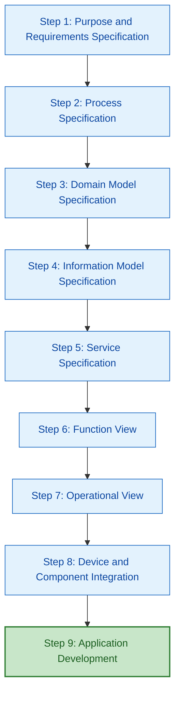
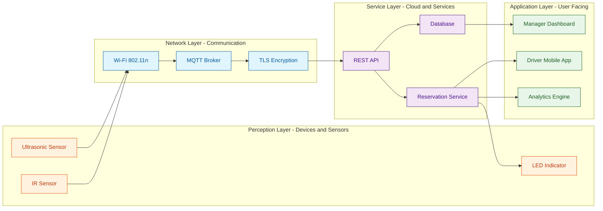
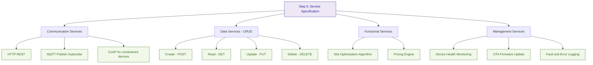

# Developing IoT - IoT design methodology

<!-- SECTION_1_START -->
# IoT Design Methodology — Core Definition & Intuitive Overview

## 1.1 Formal Academic Definition (KTU 2024 Syllabus Terminology)

**IoT Design Methodology** is a structured, multi-stage engineering framework that systematically transforms a high-level *use-case description* of an IoT system into a fully deployable, integrated, and operational cyber-physical solution. It is a top-down decomposition process that specifies **purpose, process, domain, information, service, functional, operational, device, and application** layers in a strictly ordered sequence, ensuring that every physical sensor/actuator choice is justified by an upstream behavioral requirement.

In the KTU 2024 OEC curriculum (OECST834), the methodology is taught as a *reference workflow* that students must apply while designing mini-projects for their continuous assessment and end-semester evaluations.

> [!IMPORTANT]
> **Syllabus Highlight (Module 3):** The KTU 2024 Scheme specifically expects students to *enumerate the steps of the IoT design methodology* and *map a given real-world use case (e.g., a smart irrigation system, smart parking, or air pollution monitor) to the corresponding methodology stages* during Part A (3-mark) and Part B (14-mark) examinations.

## 1.2 Conceptual Analogy — Plain English Intuition

Think of designing an IoT system like **building a custom house**:

- You don't start by laying bricks. You first ask: *"What do I need the house for?"* (Purpose)
- Then you describe the *daily routines* of the people living in it (Process).
- You sketch the *rooms and relationships* between them (Domain Model).
- You decide *what information flows through which room* (Information Model).
- You list the *services* the house must provide — water, electricity, gas (Services).
- You decide the *function* of each room (kitchen, bedroom) (Function View).
- You describe the *operations* — who opens which door at what time (Operational View).
- You pick the *actual devices* — switches, faucets, lights (Device Integration).
- Finally, you build the *user-facing apps* that control everything (Application Development).

The IoT Design Methodology applies this same disciplined order, ensuring no device is ever bought *before* justifying its purpose.

> [!NOTE]
> **Key Takeaway:** Always remember the 9-step order. In KTU exams, the most frequently asked conceptual question is: *"List the steps of the IoT design methodology"* — the order matters and is part of the valuation key.

## 1.3 Visualization Control

> [!VISUALIZATION CONTROL]
> **Concept:** Top-Down Decomposition Flow of IoT Design Methodology
> **Visual Description:** Picture a vertical funnel. At the top (widest) is *Purpose & Requirements*. Each subsequent layer narrows down — Process, Domain, Information, Services, Function, Operations, Devices, Applications — until a fully concrete, deployable IoT system emerges at the bottom. Arrows flow strictly downward, indicating that each step *refines and constrains* the layer above it.

---

<!-- SECTION_1_END -->

<!-- SECTION_2_START -->
# Deep Theoretical Analysis & KTU High-Yield Formula Sheet

## 2.1 The Nine Steps of IoT Design Methodology (Authoritative Reference)

The KTU 2024 syllabus aligns with the *IoT-A Reference Architecture* and the *Bahga–Madisetti Methodology*. The nine canonical steps are:

| Step # | Stage Name | Core Question Answered |
|:---:|:---|:---|
| **1** | **Purpose & Requirements Specification** | *What is the system for?* — Defines use-case, actors, scenarios |
| **2** | **Process Specification** | *What are the high-level actions?* — Lists processes/sub-processes |
| **3** | **Domain Model Specification** | *What are the physical/virtual entities?* — Objects, attributes, relationships |
| **4** | **Information Model Specification** | *What is the data structure?* — Entity attributes typed as basic/composite |
| **5** | **Service Specification** | *What services are exposed?* — CRUD + notifications, state services |
| **6** | **Function View** | *What does each function do?* — Functional decomposition + IoT functional blocks |
| **7** | **Operational View** | *How do components interact?* — Communication options, protocols, messaging |
| **8** | **Device & Component Integration** | *Which hardware/software?* — Sensors, actuators, gateways, cloud SDKs |
| **9** | **Application Development** | *What does the user see?* — Mobile/web apps, dashboards, analytics |

## 2.2 Step-by-Step Theoretical Breakdown

### Step 1 — Purpose & Requirements Specification
- **Why:** Locks the scope. Prevents *feature creep*.
- **How:** Use a *Use Case Diagram* (UML), or write a paragraph describing the *Purpose* of the system.
- **Typical output:** 1–2 page document, a use-case table, an actor list.
- **Engineering utility:** Mirrors the *System Requirements Specification (SRS)* in traditional software engineering (IEEE 830).

### Step 2 — Process Specification
- **Why:** Breaks the purpose into measurable actions.
- **How:** Create *Activity Diagrams* (UML) showing how an actor interacts with the system over time.
- **Typical output:** Sequence of input → process → output.
- **Real-world parallel:** A *BPMN (Business Process Model and Notation)* flowchart.

### Step 3 — Domain Model Specification
- **Why:** Identifies the *physical* and *virtual* entities (sensors, actuators, users, databases, services).
- **How:** UML *Class Diagram* with entities, attributes, and relationships (1-to-1, 1-to-many, many-to-many).
- **Engineering utility:** Directly maps to your *database schema* in Step 4 and your *REST resource model* in Step 5.

### Step 4 — Information Model Specification
- **Why:** Defines the *exact data shape* (JSON schema, XML, Protobuf).
- **How:** Each class from Step 3 is decomposed into *basic types* (int, float, string) and *composite types* (structs).
- **Real-world utility:** Becomes the *payload* sent over MQTT topics or REST APIs.

### Step 5 — Service Specification
- **Why:** Defines *what* the system exposes to other systems.
- **How:** Four service types — *Communication Services* (HTTP/CoAP/MQTT), *Data Services* (CRUD), *Functional Services* (compute), *Management Services* (config, fault).
- **KTU 2024 alert:** Examiners frequently test the *four service categories* — memorize them.

### Step 6 — Function View
- **Why:** Maps each service onto a *functional block* — *Device*, *Communication*, *Service*, *Application*, *Management*, *Security*, or *User*.
- **How:** Draw functional blocks and label their *grouping* (Device vs. Service vs. Application).

### Step 7 — Operational View
- **Why:** Specifies *how* the functional blocks exchange data — communication protocols, network topology, data formats.
- **How:** Choose *WLAN* (Wi-Fi), *WPAN* (ZigBee, BLE), or *LPWAN* (LoRa, NB-IoT) and document the choices.

### Step 8 — Device & Component Integration
- **Why:** Selects the *physical instantiation* of each functional block.
- **How:** Sensors (DHT22, MQ-135, PIR), actuators (relays, motors), boards (Raspberry Pi, ESP32), cloud platforms (AWS IoT, Azure IoT Hub, Google Cloud IoT).

### Step 9 — Application Development
- **Why:** Builds the *user-facing* and *analytics* layers.
- **How:** Mobile (Android/iOS), Web (React/Angular), Dashboard (Grafana), Analytics (ML pipelines).

## 2.3 KTU Formula Sheet / Cheat Sheet

| Symbol / Concept | Meaning | Units / Notes |
|:---|:---|:---|
| $N_{\text{steps}}$ | Total number of methodology stages | **9** (mandated by KTU syllabus) |
| $S_{4}$ | Four service categories | Communication, Data, Functional, Management |
| $F_{7}$ | Seven IoT functional blocks | Device, Comm, Service, App, Mgmt, Security, User |
| $L_{\text{data}}$ | Data lifetime classification | Transient / Persistent / Critical |
| $\text{Top-Down}$ | Design direction | High-level purpose $\to$ concrete devices |
| $T_{\text{sense}}$ | Sensor sampling rate | Hz (samples per second) |
| $P_{\text{budget}}$ | Node power budget | mW (critical for battery design) |
| $L_{\text{latency}}$ | End-to-end latency budget | ms (for real-time control) |

> [!NOTE]
> **Why the numbers 4, 7, 9 matter:** In KTU valuation keys, when students list *4 service types* and *7 functional blocks*, they often earn 2 marks per item. Memorize the counts — they are short-answer gold.

## 2.4 Real-World Engineering Utility

- **Smart Agriculture:** Steps 1–9 are applied to choose soil-moisture sensors, LoRaWAN gateways, and a cloud dashboard.
- **Industrial IoT (IIoT):** Manufacturers use this methodology to certify *functional safety* (ISO 26262, IEC 61508).
- **Smart Cities:** Municipalities use it to integrate heterogeneous vendors into a single reference architecture.
- **Healthcare Wearables:** Each step maps to a *HIPAA/GDPR* compliance checkpoint.

---

<!-- SECTION_2_END -->

<!-- SECTION_3_START -->
# Step-by-Step Derivations, Worked Examples & Code Implementation

## 3.1 Illustrative Use Case: **Smart Parking System** (Worked End-to-End)

We will apply all nine steps to a *Smart Parking* use case. This same template can be re-used in the KTU exam for any 14-mark question.

### Step 1 — Purpose & Requirements Specification

> **Purpose:** Design a Smart Parking system that detects the availability of parking slots in a parking lot and provides real-time slot information to drivers via a mobile app.

**Actors:**
- **Driver** — Views availability, reserves a slot.
- **Parking Lot Manager** — Monitors occupancy, sets pricing.
- **Sensors** — Detect vehicle presence (Ultrasonic HC-SR04, IR, or magnetic).

**Use Case Table:**

| Use Case ID | Actor | Pre-condition | Post-condition |
|:---:|:---|:---|:---|
| UC-01 | Driver | App installed | Slot availability displayed |
| UC-02 | Driver | Slot selected | Reservation confirmed |
| UC-03 | Manager | Login successful | Occupancy report generated |

### Step 2 — Process Specification (Activity Diagram in text)

1. Driver opens mobile app.
2. App sends HTTP `GET /slots` to cloud server.
3. Server queries the database for current status.
4. Server responds with JSON list of available slots.
5. Driver selects a slot $\to$ App sends `POST /reserve`.
6. Server marks slot as *reserved*, sends MQTT message to gateway.
7. Gateway sends signal to LED indicator above the slot.

### Step 3 — Domain Model Specification (UML Class Diagram in text)

**Entities:**
- `ParkingSlot` (id, location, status, sensorId)
- `Vehicle` (licensePlate, type, ownerId)
- `Driver` (id, name, contact)
- `Sensor` (sensorId, type, slotId, lastReading, timestamp)
- `Reservation` (reservationId, slotId, driverId, startTime, endTime)
- `ParkingLot` (lotId, name, totalSlots, address)

**Relationships:**
- A `ParkingLot` *contains many* `ParkingSlot` (1-to-many).
- A `ParkingSlot` *has one* `Sensor` (1-to-1).
- A `Driver` *can have many* `Reservation` (1-to-many).
- A `Reservation` *refers to exactly one* `ParkingSlot` (many-to-1).

### Step 4 — Information Model Specification

We now convert each class into a *typed* information model (JSON schema example):

```json
{
  "ParkingSlot": {
    "slotId": "string",
    "location": "string",
    "status": "enum[available, occupied, reserved, out_of_order]",
    "sensorId": "string",
    "lastUpdated": "ISO8601 timestamp"
  },
  "Reservation": {
    "reservationId": "string",
    "slotId": "string",
    "driverId": "string",
    "startTime": "ISO8601 timestamp",
    "endTime": "ISO8601 timestamp"
  }
}
```

### Step 5 — Service Specification (Four Service Categories)

| Category | Service Example | Protocol |
|:---|:---|:---|
| **Communication** | REST API endpoints | HTTPS, MQTT |
| **Data / CRUD** | `GET /slots`, `POST /reserve` | REST over JSON |
| **Functional** | *Compute optimal slot* algorithm | Internal microservice |
| **Management** | Fault notification if sensor offline | MQTT, email alert |

### Step 6 — Function View (Functional Blocks)

| Block | Role in Smart Parking |
|:---|:---|
| **Device** | Ultrasonic sensor, LED indicator, Raspberry Pi gateway |
| **Communication** | Wi-Fi (gateway $\to$ cloud), BLE (driver app) |
| **Service** | Cloud REST API, reservation microservice |
| **Application** | Driver mobile app, manager dashboard |
| **Management** | Device health monitor, OTA firmware update |
| **Security** | TLS, OAuth 2.0, JWT for app auth |
| **User** | Driver, Parking Lot Manager |

### Step 7 — Operational View

- **Device $\to$ Gateway:** Wi-Fi 802.11n at **2.4 GHz**, MQTT over TLS, port **8883**.
- **Gateway $\to$ Cloud:** HTTPS REST.
- **Cloud $\to$ App:** WebSocket for live updates, HTTPS for CRUD.
- **Data Format:** JSON, UTF-8.
- **QoS:** MQTT QoS 1 for slot updates, QoS 2 for reservation confirmations.

### Step 8 — Device & Component Integration

| Component | Selection | Justification |
|:---|:---|:---|
| Sensor | **HC-SR04 Ultrasonic** | Cost-effective, 2–400 cm range |
| Microcontroller | **ESP32** | Built-in Wi-Fi, low-power, dual-core |
| Gateway | **Raspberry Pi 4** | Edge analytics, MQTT broker (Mosquitto) |
| Cloud | **AWS IoT Core** | Managed MQTT broker, DynamoDB |
| Mobile | **Flutter / React Native** | Cross-platform |

### Step 9 — Application Development

- Driver app shows a **map view** with green/red slot markers.
- Manager dashboard shows **occupancy heat-map** and revenue analytics.
- Push notifications via **Firebase Cloud Messaging**.

## 3.2 Python Code — Domain Model Validation Script

```python
# smart_parking_domain_model.py
# Demonstrates the Domain Model (Step 3) and Information Model (Step 4)
# in a runnable, fully-typed Python class hierarchy.

from dataclasses import dataclass, field, asdict
from enum import Enum
from datetime import datetime
from typing import List, Optional
import json
import logging

logging.basicConfig(level=logging.INFO,
                    format='%(asctime)s | %(levelname)s | %(message)s')


class SlotStatus(str, Enum):
    AVAILABLE = "available"
    OCCUPIED = "occupied"
    RESERVED = "reserved"
    OUT_OF_ORDER = "out_of_order"


@dataclass(frozen=True)
class Sensor:
    sensor_id: str
    sensor_type: str          # e.g. "ultrasonic", "magnetic"
    last_reading_cm: float    # distance reading
    timestamp: datetime

    def is_vehicle_present(self, threshold_cm: float = 30.0) -> bool:
        """A vehicle is present if the measured distance is below threshold."""
        if self.last_reading_cm < 0:
            raise ValueError("Negative distance reading is physically invalid.")
        return self.last_reading_cm < threshold_cm


@dataclass
class ParkingSlot:
    slot_id: str
    location: str
    status: SlotStatus = SlotStatus.AVAILABLE
    sensor: Optional[Sensor] = None

    def update_status_from_sensor(self) -> None:
        """Real-world boundary check before updating slot state."""
        if self.sensor is None:
            logging.warning("Slot %s has no sensor attached.", self.slot_id)
            return
        if self.sensor.is_vehicle_present():
            self.status = SlotStatus.OCCUPIED
        else:
            self.status = SlotStatus.AVAILABLE
        logging.info("Slot %s updated to %s", self.slot_id, self.status.value)


@dataclass
class Driver:
    driver_id: str
    name: str
    contact: str


@dataclass
class Reservation:
    reservation_id: str
    slot_id: str
    driver_id: str
    start_time: datetime
    end_time: datetime

    def __post_init__(self) -> None:
        if self.end_time <= self.start_time:
            raise ValueError("Reservation end_time must be after start_time.")


@dataclass
class ParkingLot:
    lot_id: str
    name: str
    total_slots: int
    address: str
    slots: List[ParkingSlot] = field(default_factory=list)

    def add_slot(self, slot: ParkingSlot) -> None:
        if len(self.slots) >= self.total_slots:
            raise OverflowError("Cannot add slot: parking lot is at full capacity.")
        self.slots.append(slot)

    def to_json(self) -> str:
        """Serialise the lot for Step 7 (Operational View) over MQTT/REST."""
        return json.dumps(
            {
                "lotId": self.lot_id,
                "name": self.name,
                "address": self.address,
                "totalSlots": self.total_slots,
                "slots": [asdict(s) for s in self.slots],
            },
            default=str,
            indent=2,
        )


# --- Demonstration Run ---
if __name__ == "__main__":
    sensor_a = Sensor(
        sensor_id="S-001",
        sensor_type="ultrasonic",
        last_reading_cm=15.0,   # vehicle is 15 cm away from sensor
        timestamp=datetime.utcnow(),
    )
    sensor_b = Sensor(
        sensor_id="S-002",
        sensor_type="ultrasonic",
        last_reading_cm=120.0,  # no vehicle
        timestamp=datetime.utcnow(),
    )

    slot_1 = ParkingSlot(slot_id="A-01", location="Level 1 - A1", sensor=sensor_a)
    slot_2 = ParkingSlot(slot_id="A-02", location="Level 1 - A2", sensor=sensor_b)

    lot = ParkingLot(
        lot_id="LOT-001",
        name="KTU Smart Parking",
        total_slots=2,
        address="APJ Abdul Kalam Technological University",
    )
    lot.add_slot(slot_1)
    lot.add_slot(slot_2)

    slot_1.update_status_from_sensor()  # should become OCCUPIED
    slot_2.update_status_from_sensor()  # should remain AVAILABLE

    print(lot.to_json())
```

**Expected Output (truncated):**

```text
2026-01-26 12:00:00 | INFO | Slot A-01 updated to occupied
2026-01-26 12:00:00 | INFO | Slot A-02 updated to available
{
  "lotId": "LOT-001",
  "name": "KTU Smart Parking",
  "address": "APJ Abdul Kalam Technological University",
  "totalSlots": 2,
  "slots": [...]
}
```

## 3.3 Exhaustive Methodology Mapping Table (for the KTU Valuation Key)

| Step | Output Artifact | KTU Marks Allocated (Typical 14-mark Q) |
|:---:|:---|:---:|
| 1 | Purpose + Use Case Table | 2 |
| 2 | Process / Activity Diagram | 2 |
| 3 | Domain Model (entities + relations) | 2 |
| 4 | Information Model (typed schema) | 2 |
| 5 | Service Specification (4 categories) | 2 |
| 6 | Function View (7 blocks) | 1 |
| 7 | Operational View (protocols) | 1 |
| 8 | Device & Component Integration | 1 |
| 9 | Application Development | 1 |

---

<!-- SECTION_3_END -->

<!-- SECTION_4_START -->
# Structural Diagrams & Schematics

## 4.1 Mermaid — Top-Down Methodology Flow



## 4.2 Mermaid — Functional Block Architecture (Step 6 View)



## 4.3 Mermaid — Step 5 Service Specification Decomposition



---

<!-- SECTION_4_END -->

<!-- SECTION_5_START -->
# KTU 2024 Scheme Examination Question Bank & Topic Recap

## 5.1 Part A — 3-Mark Questions (Remember / Understand)

### **Q1. [KTU University Exam — July 2024]** 
*List the nine steps of the IoT Design Methodology in the correct order.*

**Model Answer (Valuation Key — 3 Marks):**
1. Purpose and Requirements Specification
2. Process Specification
3. Domain Model Specification
4. Information Model Specification
5. Service Specification
6. Function View
7. Operational View
8. Device and Component Integration
9. Application Development

**[All nine steps in correct order: 3 Marks | Order matters: full 3 marks]**

---

### **Q2. [KTU University Exam — Dec 2023]**
*Identify and briefly explain the four categories of services in the IoT Service Specification step.*

**Model Answer (Valuation Key — 3 Marks):**
1. **Communication Services** — Transport protocols (HTTP, MQTT, CoAP). **[1 Mark]**
2. **Data Services** — CRUD operations on resources. **[1 Mark]**
3. **Functional Services** — Application-level compute (e.g., analytics, decision logic). **[0.5 Mark]**
4. **Management Services** — Device health, fault, configuration, OTA updates. **[0.5 Mark]**

---

## 5.2 Part B — 14-Mark Questions (Internal Choice)

### **Question A — 14 Marks** `[KTU University Exam — July 2024]`

**Scenario:** *Design a Smart Agriculture system that monitors soil moisture and temperature, automatically irrigates the field, and notifies the farmer via a mobile app.*

**(a)** Specify the **Purpose, Use Cases, and Process Specification** for the system. **[7 Marks]**
**(b)** Draw the **Domain Model, Information Model, and Service Specification** for the system. **[7 Marks]**

#### Model Solution

##### Part (a) — 7 Marks

**Purpose:** *[1 Mark]* To design a Smart Agriculture system that monitors soil moisture and temperature in real time, automatically triggers irrigation when moisture falls below a threshold, and sends alerts/notifications to the farmer through a mobile application.

**Actors:** *[1 Mark]*
- Farmer (primary user)
- Sensors (soil moisture, temperature, humidity)
- Irrigation pump (actuator)
- Cloud server

**Use Case Table:** *[2 Marks]*

| UC ID | Actor | Description | Pre-condition | Post-condition |
|:---:|:---|:---|:---|:---|
| UC-01 | Sensor | Read moisture level | Sensor powered | Moisture value uploaded |
| UC-02 | Cloud | Decide irrigation | Moisture < threshold | Pump ON signal sent |
| UC-03 | Farmer | View live dashboard | App installed | Dashboard rendered |
| UC-04 | Farmer | Receive alert | Threshold crossed | Push notification received |

**Process Specification (Activity Sequence):** *[2 Marks]*
1. Soil moisture sensor periodically samples the field (every 15 min).
2. Sensor publishes value over **MQTT** to the **AWS IoT Core** broker.
3. Cloud rule engine evaluates moisture against threshold.
4. If moisture $< \theta_{\text{dry}}$, cloud publishes `IRRIGATE_ON` to actuator topic.
5. Gateway receives message $\to$ energises relay $\to$ pump starts.
6. After $T_{\text{irrigate}}$ minutes, pump is turned OFF automatically.
7. Farmer receives push notification: *"Irrigation started at 14:32"*.

**Incremental Valuation Key:**
- *[Purpose stated clearly: 1 Mark]*
- *[Actors identified: 1 Mark]*
- *[Use Case Table: 2 Marks]*
- *[Activity / Process flow: 2 Marks]*
- *[Orderly sequence + clear steps: 1 Mark]*

##### Part (b) — 7 Marks

**Domain Model (UML Class Entities):** *[2 Marks]*

```
Entities:
- Field (fieldId, name, area, cropType)
- Sensor (sensorId, type, fieldId, lastReading, timestamp)
- IrrigationPump (pumpId, fieldId, status, flowRate)
- Farmer (farmerId, name, contact)
- Notification (notifId, farmerId, message, timestamp)
- Threshold (fieldId, moistureMin, tempMax)

Relationships:
- Field contains many Sensor (1-to-many)
- Field has one IrrigationPump (1-to-1)
- Farmer owns many Field (1-to-many)
- Farmer receives many Notification (1-to-many)
```

**Information Model (Typed JSON Schema):** *[2 Marks]*

```json
{
  "Field":     { "fieldId": "string", "name": "string",
                 "area_acres": "float", "cropType": "string" },
  "Sensor":    { "sensorId": "string", "type": "enum[moisture,temp,dht]",
                 "fieldId": "string", "lastReading": "float",
                 "timestamp": "ISO8601" },
  "IrrigationPump": { "pumpId": "string", "fieldId": "string",
                 "status": "enum[ON,OFF,FAULT]", "flowRate_lpm": "float" }
}
```

**Service Specification (Four Categories):** *[2 Marks]*

| Category | Service | Protocol |
|:---|:---|:---|
| Communication | MQTT broker, HTTPS REST | TLS 1.2+ |
| Data | `GET /fields/{id}/sensors`, `POST /irrigation` | REST/JSON |
| Functional | Threshold-rule engine (AWS IoT Rules) | Internal |
| Management | Sensor health monitor, OTA firmware | MQTT LWT |

**Function View (7 Functional Blocks):** *[1 Mark]*
- **Device:** Soil-moisture probe, DHT22, solenoid valve, ESP32.
- **Communication:** Wi-Fi + MQTT.
- **Service:** AWS Lambda functions.
- **Application:** Flutter mobile app.
- **Management:** AWS IoT Device Defender.
- **Security:** X.509 certificates, TLS.
- **User:** Farmer.

**Incremental Valuation Key:**
- *[Domain model entities + relations: 2 Marks]*
- *[Information model with typed fields: 2 Marks]*
- *[Service specification 4 categories: 2 Marks]*
- *[Function view 7 blocks: 1 Mark]*

---

### **Question B — 14 Marks (Alternative Choice)** `[KTU University Exam — Dec 2023]`

**Scenario:** *Design an IoT-based Air Quality Monitoring system for a smart city that measures PM2.5, CO₂, and NO₂ levels at multiple stations and publishes live data to a city dashboard.*

**(a)** Define the **Purpose, Use Cases, and Process Specification** for the system. **[7 Marks]**
**(b)** Provide the **Domain Model, Information Model, Service Specification, Function View, and Operational View** for the system. **[7 Marks]**

#### Model Solution Outline (Key Points)

**Part (a) — 7 Marks**
- **Purpose:** Real-time pollution monitoring across multiple city stations with public dashboard. *[1 Mark]*
- **Actors:** Citizen, City Authority, Sensor, Air-Quality Index (AQI) Engine. *[1 Mark]*
- **Use Cases (≥4):** UC-01 Read pollutant levels, UC-02 Compute AQI, UC-03 Alert on hazardous level, UC-04 Display on dashboard. *[2 Marks]*
- **Process Specification:** Sensor $\to$ Gateway (LoRaWAN) $\to$ Cloud (MQTT) $\to$ AQI Engine $\to$ Dashboard. *[3 Marks]*

**Part (b) — 7 Marks**
- **Domain Model entities:** AirStation, PollutantSensor, AQIReading, Citizen, Alert, Dashboard. *[2 Marks]*
- **Information Model:** JSON schema with `pm25`, `co2`, `no2`, `latitude`, `longitude`, `timestamp`. *[2 Marks]*
- **Service Specification:** 4 categories (Communication = LoRaWAN+MQTT, Data = REST CRUD, Functional = AQI calculation, Management = sensor health). *[1 Mark]*
- **Function View:** 7 blocks mapped. *[1 Mark]*
- **Operational View:** LoRaWAN 868 MHz, MQTT 1883/8883, HTTPS 443, JSON over UTF-8. *[1 Mark]*

---

> [!WARNING]
> **KTU Examiner's Valuation Warning — Common Pitfalls**
> 1. **Order Confusion:** Listing steps in the wrong order (e.g., Device Integration before Service Specification) costs **at least 1 mark**.
> 2. **Skipping the Use Case Table:** Many students write paragraphs instead of a tabular form. Examiners prefer a **tabular use case** for clarity.
> 3. **Forgetting the Four Service Categories:** Writing only 2 or 3 services loses marks — always mention **Communication, Data, Functional, Management**.
> 4. **Missing Function View:** Omitting the 7 functional blocks (Device, Communication, Service, Application, Management, Security, User) is a frequent reason for losing the 1-mark sub-part.
> 5. **No Justification for Devices:** Just naming ESP32 / DHT22 without explaining *why* (cost, range, power) loses the integration mark.
> 6. **Diagram Missing:** A 14-mark answer without a single diagram/mapping table is penalised — include at minimum a *Domain Model* and a *Service Table*.

---

## 5.3 Topic Recap & Important Things to Remember

- ✅ The IoT Design Methodology is a **top-down, nine-step** engineering workflow.
- ✅ The **9 steps** in order are: *Purpose → Process → Domain → Information → Service → Function → Operational → Device → Application*.
- ✅ **Purpose & Requirements** locks the scope and must produce a *Use Case Table* and *Actor List*.
- ✅ **Process Specification** uses *Activity Diagrams* to show input → process → output flows.
- ✅ **Domain Model** identifies physical and virtual entities plus their relationships (UML class style).
- ✅ **Information Model** refines domain classes into *typed* attributes (int, float, enum, string, timestamp).
- ✅ **Service Specification** has *exactly 4 categories*: Communication, Data (CRUD), Functional, Management.
- ✅ **Function View** uses *7 functional blocks*: Device, Communication, Service, Application, Management, Security, User.
- ✅ **Operational View** specifies the actual *protocols* — MQTT, CoAP, HTTP/HTTPS, LoRaWAN, Wi-Fi, BLE, ZigBee.
- ✅ **Device Integration** maps each functional block to *real hardware* (ESP32, Raspberry Pi, DHT22, MQ-135, etc.).
- ✅ **Application Development** delivers *user-facing* mobile/web apps plus analytics dashboards.
- ✅ The methodology is *vendor-neutral* and *compliance-friendly* (GDPR, HIPAA, IEC 61508).
- ✅ KTU 2024 examinations test: *step enumeration* (3 marks), *use case + domain model* (7 marks), and *service + function + operational view* (7 marks).
- ✅ Always include a *table or diagram* in your 14-mark answer to satisfy the valuation key.
- ✅ Memorize the constants: **9 steps, 4 service categories, 7 functional blocks** — these are high-yield exam facts.
- ✅ Real-world analogues: Smart Parking, Smart Agriculture, Air Quality Monitoring, Smart Healthcare, Smart Home, Industrial IoT.

---

<!-- SECTION_5_END -->
