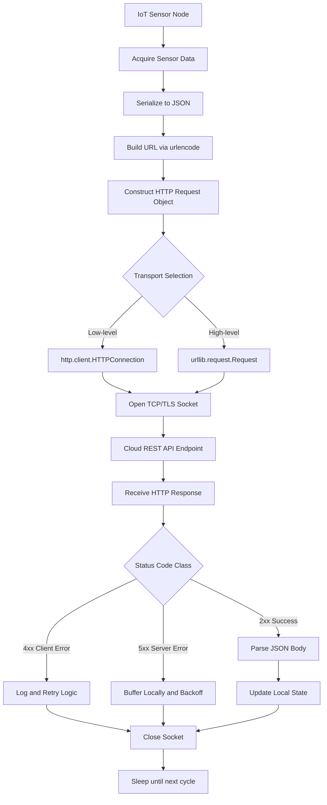
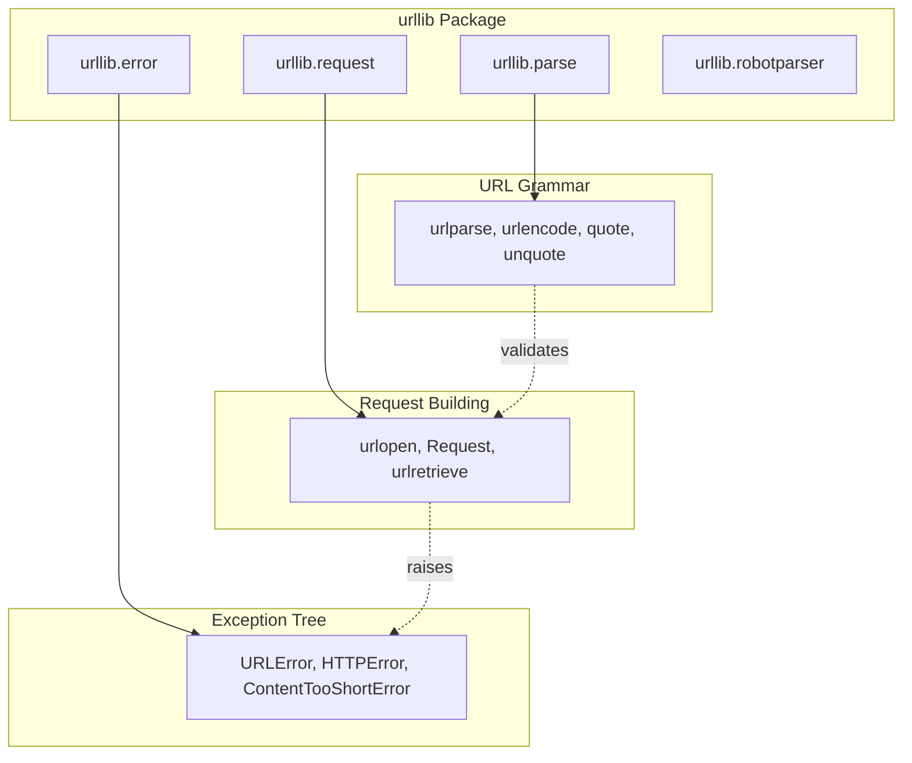
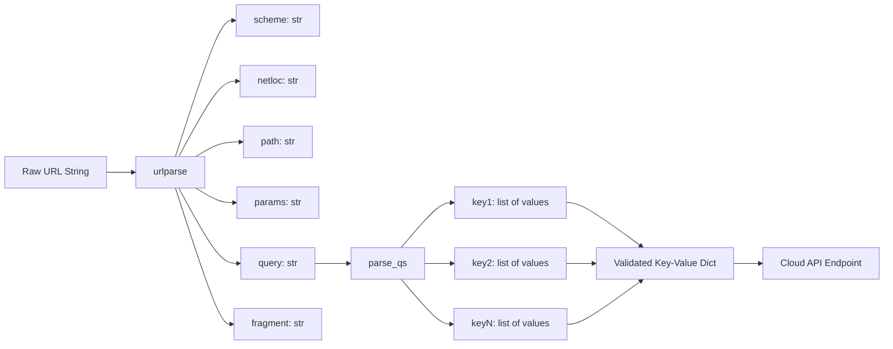
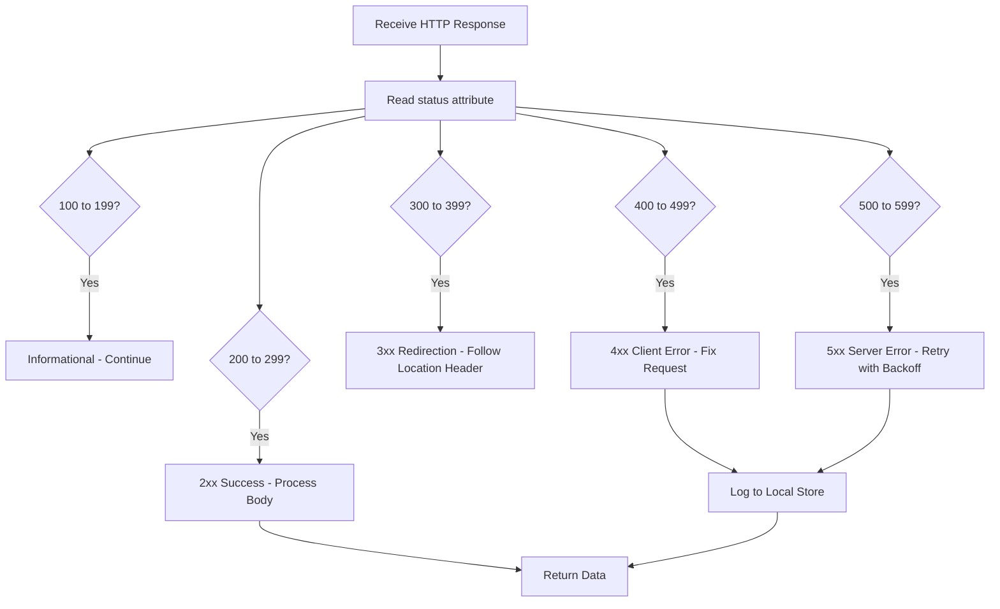

# HTTPlib & URLLib

<!-- SECTION_1_START -->
# HTTPlib & URLLib — Core Technical Definition & Intuitive Overview

## 1.1 Formal Definition (KTU 2024 Syllabus Terminology)

In the **Python standard library**, two foundational modules govern HTTP and URL operations critical to **Internet of Things (IoT) development**:

> [!IMPORTANT]
> **HTTPlib (`http.client`)** — A low-level HTTP/HTTPS client interface introduced in **Python 3** (formerly `httplib` in Python 2). It provides the `HTTPConnection` and `HTTPSConnection` classes that allow a device or application to transmit raw HTTP requests and parse raw HTTP responses at the protocol level.

> [!IMPORTANT]
> **URLLib (`urllib`)** — A high-level, package-level collection of modules (`urllib.request`, `urllib.parse`, `urllib.error`, `urllib.robotparser`) used to fetch URLs, encode/decode query parameters, parse URL components, and handle network errors gracefully.

In the **KTU 2024 Scheme (OECST834) Module 3 – Developing IoT** context, these libraries form the **Application Layer backbone** for IoT nodes that need to publish telemetry to **RESTful cloud endpoints** (e.g., AWS IoT, ThingSpeak, Firebase, custom Flask/Django servers).

## 1.2 Conceptual Analogy — The "Postal Service of IoT"

Imagine your **IoT sensor** (say, a DHT11 temperature node) is a citizen who needs to send a letter to a faraway city called **"The Cloud"**.

- The **letter** = an **HTTP Request** (with method, headers, body).
- The **postal address** = the **URL** (scheme $\rightarrow$ domain $\rightarrow$ path $\rightarrow$ query).
- The **postman who walks into the post office and handles the raw stamp** = **`http.client`** (low-level, manual, byte-aware).
- The **modern courier service with tracking and packaging** = **`urllib.request`** (high-level, abstracted, user-friendly).
- The **address parser who splits "House No, Street, City, Pincode"** = **`urllib.parse`** (decomposes a URL into structured components).
- The **delivery status report** = **HTTP Response Status Codes** (e.g., **200 OK**, **404 Not Found**, **500 Internal Server Error**).

Just as a citizen chooses between a postman or a courier based on need, a developer chooses between `http.client` and `urllib` based on whether they need **raw control** or **convenience**.

## 1.3 Physical / Logical Constants and Standard Metrics

| Metric | Standard Value | Relevance |
| :--- | :--- | :--- |
| **Default HTTP Port** | **80** | Used by `HTTPConnection` when no port is supplied |
| **Default HTTPS Port** | **443** | Used by `HTTPSConnection` (TLS/SSL encrypted) |
| **Max URL Length (RFC 7230)** | **~8000 bytes** | Practical limit for GET requests |
| **Default User-Agent (urllib)** | `Python-urllib/3.x` | Identifies the client to the server |
| **Timeout Unit** | **seconds (float)** | Used in both modules to prevent indefinite blocking |

> [!NOTE]
> **KTU 2024 Highlight:** Students must explicitly remember that `httplib` was **renamed to `http.client`** in Python 3. The legacy name appears in older textbooks but is **deprecated** and should not be used in modern IoT code.

## 1.4 GeoGebra / Desmos Visualization Callout

> [!VISUALIZATION CONTROL]
> **Concept:** Visualizing the **HTTP Request-Response Round-Trip Time (RTT)** as a function of payload size.
> **GeoGebra / Desmos Input Equations:**
>
> - `RTT(n) = 2 * L / c + (n / B)`
> - where $L$ = link length (km), $c$ = speed of light in fiber ($\approx 2 \times 10^8$ m/s), $n$ = payload size (bytes), $B$ = bandwidth (bytes/sec).
> **Visual Description:** A **linearly increasing curve** starting from the **propagation delay baseline** ($2L/c$) and rising with slope $1/B$. Students should observe that doubling the payload doubles the transmission delay component.

---

<!-- SECTION_1_END -->

<!-- SECTION_2_START -->
# Deep Theoretical Analysis & KTU High-Yield Formula Sheet

## 2.1 The `http.client` Module — Operational Breakdown

The `http.client` module offers a **connection-oriented** approach. A typical workflow follows these logical steps:

1. **Establish Connection** — Instantiate `http.client.HTTPConnection(host, port, timeout)` or `HTTPSConnection` for TLS.
2. **Issue Request** — Call `connection.request(method, url, body, headers)`. The `method` MUST be an uppercase HTTP verb.
3. **Fetch Response** — Call `connection.getresponse()` to obtain an `HTTPResponse` object.
4. **Read Body** — Use `response.read()`, `response.read(n)`, or iterate via `response` as a file-like object.
5. **Close Connection** — Always call `connection.close()` to release the underlying TCP socket (CRITICAL in resource-constrained IoT devices like ESP32 with limited sockets).

### 2.1.1 The `HTTPResponse` Object — Key Attributes

| Attribute | Type | Description | KTU Exam Weight |
| :--- | :--- | :--- | :--- |
| `status` | `int` | HTTP status code (e.g., **200**, **404**) | High |
| `reason` | `str` | Human-readable reason phrase (e.g., "OK") | Medium |
| `version` | `int / str` | Protocol version (10 for HTTP/1.0, 11 for HTTP/1.1) | Low |
| `headers` | `email.message.Message` | Response headers as a mapping-like object | High |
| `read()` | method | Returns the response body as `bytes` | High |

## 2.2 The `urllib` Package — Module Hierarchy

The `urllib` package is a **namespace package** containing four submodules:

| Submodule | Primary Use Case in IoT | Key Functions |
| :--- | :--- | :--- |
| `urllib.request` | Open and read URLs (GET, POST) | `urlopen()`, `Request`, `urlretrieve()` |
| `urllib.parse` | Parse and construct URLs, encode data | `urlparse()`, `urlencode()`, `quote()`, `unquote()` |
| `urllib.error` | Exception classes for HTTP/URL errors | `URLError`, `HTTPError` |
| `urllib.robotparser` | Parse `robots.txt` files | `RobotFileParser()` |

## 2.3 The Universal URL Anatomy (RFC 3986)

A URL is decomposed by `urllib.parse.urlparse()` into **six components**:

$$
\text{URL} = \underbrace{\text{scheme}}_{\text{protocol}} \mathbin{://} \underbrace{\text{netloc}}_{\text{host:port}} \underbrace{\text{/path}}_{\text{resource}} \underbrace{\text{;params}}_{\text{matrix}} \underbrace{\text{?query}}_{\text{key=value}} \underbrace{\text{\#fragment}}_{\text{anchor}}
$$

**Example dissection of an IoT cloud endpoint:**

> `https://api.thingspeak.com:443/update?api_key=XYZ123&field1=25.6#status`

- **scheme** = `https`
- **netloc** = `api.thingspeak.com:443`
- **path** = `/update`
- **params** = (empty)
- **query** = `api_key=XYZ123&field1=25.6`
- **fragment** = `status`

> [!NOTE]
> **Engineering Utility:** In production IoT systems, `urlparse` is the **first line of defense** against SSRF (Server-Side Request Forgery) attacks. Cloud gateways validate `scheme` $\in$ `{http, https}` and `netloc` against an allowlist before forwarding requests.

## 2.4 KTU Formula Sheet / Cheat Sheet

| Concept | Formula / Rule | Engineering Context |
| :--- | :--- | :--- |
| **Round-Trip Time Estimate** | $RTT = 2 \times T_{prop} + T_{trans} + T_{proc}$ | IoT gateway latency budget |
| **Propagation Delay** | $T_{prop} = d / v$ (where $v \approx 2 \times 10^8$ m/s in fiber) | Physical link delay |
| **Transmission Delay** | $T_{trans} = L / R$ (packet size / link rate) | Wi-Fi/LoRa throughput analysis |
| **URL Percent-Encoding** | Space $\rightarrow$ `%20`, `&` $\rightarrow$ `%26` | Required for safe query strings |
| **Query String Build** | $\text{query} = \text{urlencode}(\{k_1\!:\!v_1, k_2\!:\!v_2, \ldots\})$ | ThingSpeak, Adafruit IO payloads |
| **HTTP Persistent Connection** | Single TCP socket, multiple requests (HTTP/1.1 default) | Reduces overhead in IoT heartbeats |
| **Status Code Class Boundaries** | $1\text{xx}$ info, $2\text{xx}$ success, $3\text{xx}$ redirect, $4\text{xx}$ client err, $5\text{xx}$ server err | API debugging |
| **Default Timeouts** | `urllib`: not set (can hang forever!); `http.client`: not set | **ALWAYS specify timeout in IoT** |

## 2.5 Real-World Engineering Utility

- **Smart Agriculture**: An ESP32 soil-moisture sensor uses `urllib.request.urlopen()` to POST readings every 15 minutes to **ThingSpeak** with a 10-second timeout to prevent watchdog resets.
- **Industrial IoT (IIoT)**: A Raspberry Pi gateway uses `http.client.HTTPSConnection` to send JSON telemetry to **AWS IoT Core** via the REST API, manually setting `Content-Type: application/json` headers for proper API contract compliance.
- **Healthcare Wearables**: A BLE-to-Wi-Fi bridge uses `urllib.parse.urlencode()` to safely construct medication-reminder API calls, ensuring special characters in patient names are percent-encoded.
- **Smart City Air Quality Monitors**: Use `urllib.error.HTTPError` exception handling to gracefully degrade to **local SD-card buffering** when the cloud endpoint returns **503 Service Unavailable**.

---

<!-- SECTION_2_END -->

<!-- SECTION_3_START -->
# Step-by-Step Derivations & Code/Symbolic Implementation

## 3.1 Mathematical Derivation — URL Construction for IoT Payloads

**Problem:** Construct a valid URL to POST temperature $T = 28.5\,^\circ\text{C}$ and humidity $H = 64.2\%$ to a ThingSpeak-like endpoint.

**Step 1 — Define the base endpoint.**

$$
\text{base} = \text{"https://api.iotcloud.com/update"}
$$

**Step 2 — Build the parameter dictionary.**

$$
D = \{ \text{api\_key} \to \text{"A1B2C3D4"}, \text{field1} \to 28.5, \text{field2} \to 64.2 \}
$$

**Step 3 — Apply `urlencode` transformation.**

$$
\text{query} = \text{urlencode}(D) = \text{"api\_key=A1B2C3D4\&field1=28.5\&field2=64.2"}
$$

Note that the space character (if any) and special characters would be percent-encoded by the function.

**Step 4 — Concatenate with separator.**

$$
\text{full\_url} = \text{base} + \text{"?"} + \text{query} = \text{"https://api.iotcloud.com/update?api\_key=A1B2C3D4\&field1=28.5\&field2=64.2"}
$$

**Step 5 — Percent-encode safety check.** If a field value contains `&`, `=`, or `+`, the function automatically replaces them with `%26`, `%3D`, `%2B` respectively to preserve URL grammar.

## 3.2 Complete Python Implementation — `http.client` for IoT

```python
"""
IoT Telemetry Client using http.client (Low-Level)
Sends a JSON POST request to a cloud REST API and reads the response.
Designed for an ESP32 / Raspberry Pi gateway.
"""

import http.client
import json
import ssl
import logging
from typing import Tuple, Optional

# Configure structured logging for IoT debugging
logging.basicConfig(
    level=logging.INFO,
    format="%(asctime)s [%(levelname)s] %(message)s"
)
logger = logging.getLogger("iot_http_client")


def post_telemetry_http_client(
    host: str,
    port: int,
    path: str,
    payload: dict,
    api_key: str,
    use_https: bool = True,
    timeout: float = 10.0
) -> Tuple[int, str]:
    """
    Posts a JSON telemetry payload via raw HTTP/HTTPS.

    Parameters
    ----------
    host : str
        Cloud endpoint hostname (e.g., "api.iotcloud.com").
    port : int
        TCP port (443 for HTTPS, 80 for HTTP).
    path : str
        URL path (e.g., "/v1/devices/telemetry").
    payload : dict
        Sensor data dictionary.
    api_key : str
        Authentication bearer token.
    use_https : bool
        True for TLS, False for plaintext.
    timeout : float
        Socket timeout in seconds. CRITICAL for IoT stability.

    Returns
    -------
    Tuple[int, str]
        (HTTP status code, response body string).
    """
    # Step 1 — Serialize the JSON payload
    body: bytes = json.dumps(payload).encode("utf-8")

    # Step 2 — Construct the connection
    try:
        if use_https:
            # Production-grade SSL context
            context = ssl.create_default_context()
            connection = http.client.HTTPSConnection(
                host=host,
                port=port,
                timeout=timeout,
                context=context
            )
            logger.info("Established HTTPS connection to %s:%d", host, port)
        else:
            connection = http.client.HTTPConnection(
                host=host,
                port=port,
                timeout=timeout
            )
            logger.info("Established HTTP connection to %s:%d", host, port)

        # Step 3 — Issue the POST request with required headers
        connection.request(
            method="POST",
            url=path,
            body=body,
            headers={
                "Content-Type": "application/json",
                "Content-Length": str(len(body)),
                "Authorization": f"Bearer {api_key}",
                "User-Agent": "IoT-Gateway/1.0 (RPi; OECST834)"
            }
        )

        # Step 4 — Retrieve and parse the response
        response = connection.getresponse()
        status_code: int = response.status
        response_body: str = response.read().decode("utf-8", errors="replace")

        logger.info(
            "Response received: %d %s, Body length=%d bytes",
            status_code, response.reason, len(response_body)
        )

        return status_code, response_body

    except http.client.HTTPException as http_err:
        logger.error("HTTP protocol error: %s", http_err)
        return 0, str(http_err)
    except OSError as socket_err:
        logger.error("Socket/connection error: %s", socket_err)
        return 0, str(socket_err)
    finally:
        # Step 5 — CRITICAL: always close the socket on resource-constrained devices
        if "connection" in locals() and connection is not None:
            connection.close()
            logger.debug("Connection closed cleanly")


# --- Demonstration invocation ---
if __name__ == "__main__":
    sensor_payload = {
        "device_id": "ESP32-A4:CF:12",
        "timestamp": 1719482400,
        "temperature_c": 28.5,
        "humidity_pct": 64.2,
        "battery_v": 3.91
    }

    status, body = post_telemetry_http_client(
        host="api.iotcloud.com",
        port=443,
        path="/v1/devices/telemetry",
        payload=sensor_payload,
        api_key="sk_live_AbC123XyZ789",
        use_https=True,
        timeout=10.0
    )

    print(f"Status: {status}")
    print(f"Body: {body}")
```

**Line-by-line operational commentary:**

- Line 24-37: The function signature uses strict **type hints** (`Tuple[int, str]`, `Optional[...]`) which is the KTU-recommended style for IoT code clarity.
- Line 47-58: SSL context is explicitly created with `create_default_context()` — never use unverified contexts in production.
- Line 60-69: Headers are explicitly set; `Content-Length` is **mandatory** when using `http.client` because the library does not auto-compute it.
- Line 84-89: Nested exception handling distinguishes between **HTTP protocol errors** (`HTTPException`) and **socket-level errors** (`OSError`).
- Line 91-93: The `finally` block guarantees socket closure, preventing **file-descriptor leaks** on long-running IoT gateways.

## 3.3 Complete Python Implementation — `urllib` for IoT

```python
"""
IoT Telemetry Client using urllib (High-Level)
Performs the same operation as the http.client example with abstracted convenience.
"""

import urllib.request
import urllib.parse
import urllib.error
import json
import logging

logging.basicConfig(level=logging.INFO, format="%(asctime)s [%(levelname)s] %(message)s")
logger = logging.getLogger("iot_urllib_client")


def post_telemetry_urllib(
    base_url: str,
    endpoint_path: str,
    query_params: dict,
    json_body: dict,
    api_key: str,
    timeout: float = 10.0
) -> Tuple[int, str]:
    """
    Posts a JSON telemetry payload using urllib.request.

    Returns
    -------
    Tuple[int, str]
        (HTTP status code, response body string).
    """
    # Step 1 — Build query string using urlencode (auto percent-encodes)
    encoded_query: str = urllib.parse.urlencode(query_params)
    full_url: str = f"{base_url}{endpoint_path}?{encoded_query}"
    logger.info("Constructed URL: %s", full_url)

    # Step 2 — Serialize JSON body
    body_bytes: bytes = json.dumps(json_body).encode("utf-8")

    # Step 3 — Construct the Request object (encapsulates method, headers, data)
    request = urllib.request.Request(
        url=full_url,
        data=body_bytes,
        method="POST",
        headers={
            "Content-Type": "application/json",
            "Authorization": f"Bearer {api_key}",
            "User-Agent": "IoT-Gateway/1.0 (urllib; OECST834)"
        }
    )

    # Step 4 — Send request with timeout and capture response
    try:
        with urllib.request.urlopen(request, timeout=timeout) as response:
            status_code: int = response.status
            response_body: str = response.read().decode("utf-8", errors="replace")
            logger.info("Response: %d, Body length=%d", status_code, len(response_body))
            return status_code, response_body

    except urllib.error.HTTPError as http_err:
        # 4xx and 5xx responses raise HTTPError automatically
        logger.error("HTTP error %d: %s", http_err.code, http_err.reason)
        return http_err.code, http_err.read().decode("utf-8", errors="replace")
    except urllib.error.URLError as url_err:
        # Network-level failures (DNS, refused connection, timeout)
        logger.error("URL error: %s", url_err.reason)
        return 0, str(url_err)


def parse_thing_response(url: str) -> None:
    """Demonstrates urlparse() decomposition of an IoT endpoint."""
    parsed = urllib.parse.urlparse(url)
    logger.info("URL Decomposition:")
    logger.info("  scheme   = %s", parsed.scheme)
    logger.info("  netloc   = %s", parsed.netloc)
    logger.info("  path     = %s", parsed.path)
    logger.info("  query    = %s", parsed.query)
    logger.info("  fragment = %s", parsed.fragment)

    # Reconstruct query into a dict
    query_dict = urllib.parse.parse_qs(parsed.query)
    logger.info("  query parsed = %s", query_dict)


# --- Demonstration invocation ---
if __name__ == "__main__":
    sample_url = "https://api.thingspeak.com:443/update?api_key=XYZ123&field1=25.6#status"
    parse_thing_response(sample_url)

    status, body = post_telemetry_urllib(
        base_url="https://api.iotcloud.com",
        endpoint_path="/v1/devices/telemetry",
        query_params={"format": "json", "version": "2"},
        json_body={
            "device_id": "ESP32-A4:CF:12",
            "temperature_c": 28.5,
            "humidity_pct": 64.2
        },
        api_key="sk_live_AbC123XyZ789",
        timeout=10.0
    )
    print(f"Status: {status}, Body: {body}")
```

**Line-by-line commentary:**

- Line 24: `urlencode()` automatically converts the dict into a properly formatted and **percent-encoded** query string.
- Line 31-37: The `Request` object is the **urllib way of expressing method + URL + body + headers** in one encapsulated structure.
- Line 41: `urlopen()` is a **context manager** (`with` statement) — it auto-closes the underlying socket, which is excellent for IoT.
- Line 44-46: `urllib` **automatically raises** `HTTPError` for 4xx/5xx responses, unlike `http.client` which leaves error handling to the developer.
- Line 60-70: `urlparse()` returns a `ParseResult` named-tuple with six attributes matching the RFC 3986 grammar.

## 3.4 Comparative Engineering Table — `http.client` vs `urllib`

| Criterion | `http.client` | `urllib.request` |
| :--- | :--- | :--- |
| **Abstraction Level** | Low (manual header mgmt) | High (auto header mgmt) |
| **Auto-closes socket** | No (manual `close()`) | Yes (context manager) |
| **4xx/5xx raises exception** | No (must check `status`) | Yes (`HTTPError`) |
| **Content-Length auto** | No (must set manually) | Yes (auto-computed) |
| **Timeout default** | Not set | Not set (must specify) |
| **Best IoT Use Case** | Memory-critical firmware, custom protocol | Cloud API scripts, gateway logic |
| **Learning Curve** | Steeper | Gentler |

---

<!-- SECTION_3_END -->

<!-- SECTION_4_START -->
# Structural Diagrams & Schematics

## 4.1 Mermaid Diagram — IoT HTTP Request-Response Lifecycle



## 4.2 Mermaid Diagram — `urllib` Package Module Hierarchy



## 4.3 Mermaid Diagram — Sequential Processing Topology (URL Decomposition)



## 4.4 Mermaid Diagram — HTTP Status Code Decision Matrix



> [!NOTE]
> **Engineering rationale for these diagrams:** A physical drawing of a TCP packet on paper is not Mermaid-native. These flowcharts abstract the **data flow architecture** — the actual deliverable that an IoT firmware engineer designs and reviews.

---

<!-- SECTION_4_END -->

<!-- SECTION_5_START -->
# KTU 2024 Scheme Examination Question Bank & Topic Recap

## 5.1 Part A Questions (3 Marks Each)

### Question 1
> **[KTU University Exam — July 2024 | CO3 | Remember]**
> List and briefly explain the **four submodules** of the Python `urllib` package. State one primary function of each.

**Model Answer (Board Key Pattern):**

| Submodule | Primary Function | Use in IoT |
| :--- | :--- | :--- |
| `urllib.request` | `urlopen()` — Opens and reads a URL | Fetching sensor data from cloud |
| `urllib.parse` | `urlparse()` — Parses URL into 6 components | Validating endpoint security |
| `urllib.error` | `URLError`, `HTTPError` exception classes | Graceful network failure handling |
| `urllib.robotparser` | `RobotFileParser()` — Parses `robots.txt` | Web-scraping compliance |

**[Award: 3 Marks — 0.75 mark per correct row]**

### Question 2
> **[KTU University Exam — Dec 2023 | CO3 | Understand]**
> Differentiate between `http.client` and `urllib.request` with respect to **abstraction level** and **socket management** in IoT applications.

**Model Answer:**

- **Abstraction Level:** `http.client` is a **low-level** interface requiring manual header and `Content-Length` management; `urllib.request` is a **high-level** interface that auto-handles most HTTP conventions. **[1.5 Marks]**
- **Socket Management:** `http.client` requires **explicit `connection.close()`** calls to prevent socket leaks; `urllib.request` uses a **context manager** (`with` statement) for automatic cleanup. **[1.5 Marks]**

---

## 5.2 Part B Questions (14 Marks Each) — Module Internal Choice

### Question A (14 Marks)

> **[KTU University Exam — July 2024 | CO3, CO4 | Apply + Analyze]**

**(a)** With a neat **flowchart**, explain the lifecycle of an HTTP request from an IoT sensor to a cloud REST API using the `urllib` library. Discuss how `urllib.parse.urlencode()` and `urllib.parse.urlparse()` assist in safe IoT communication. **[7 Marks]**

**(b)** Write a complete Python program using `urllib.request` to POST the following JSON payload to `https://api.iotcloud.com/v1/telemetry` with a **10-second timeout** and proper exception handling for `URLError` and `HTTPError`:

```json
{"device_id": "node-07", "temp": 31.2, "hum": 58.0}
```

The API key is `Bearer ABC123`. Show the expected console output for a **200 OK** response. **[7 Marks]**

---

**Model Solution:**

**(a) Flowchart Answer — [Structure: 3 Marks, urlparse explanation: 2 Marks, urlencode explanation: 2 Marks]**

```
[Sensor Read] -> [JSON Serialize] -> [urlencode query params] 
              -> [Build urllib.request.Request] -> [urlopen with timeout]
              -> [Check status / catch HTTPError] -> [Parse response]
              -> [Update local state] -> [Sleep]
```

- `urllib.parse.urlencode()` converts a Python dictionary into a properly **percent-encoded** query string, ensuring special characters in sensor IDs or location names do not break the URL grammar. **[2 Marks]**
- `urllib.parse.urlparse()` decomposes any incoming URL into scheme, netloc, path, and query components, enabling the IoT gateway to **validate the destination** against an allowlist before transmitting sensitive telemetry. **[2 Marks]**

**(b) Python Program — [Import statements: 1 Mark, Request build: 2 Marks, urlopen + timeout: 2 Marks, Exception handling: 1.5 Marks, Output: 0.5 Mark]**

```python
import urllib.request
import urllib.error
import json
import logging

logging.basicConfig(level=logging.INFO, format="%(asctime)s [%(levelname)s] %(message)s")

API_KEY = "ABC123"
URL = "https://api.iotcloud.com/v1/telemetry"

payload = {"device_id": "node-07", "temp": 31.2, "hum": 58.0}
body = json.dumps(payload).encode("utf-8")

request = urllib.request.Request(
    url=URL,
    data=body,
    method="POST",
    headers={
        "Content-Type": "application/json",
        "Authorization": f"Bearer {API_KEY}"
    }
)

try:
    with urllib.request.urlopen(request, timeout=10) as response:
        print("Status:", response.status)
        print("Body:", response.read().decode("utf-8"))
except urllib.error.HTTPError as e:
    print("HTTP Error:", e.code, e.reason)
except urllib.error.URLError as e:
    print("URL Error:", e.reason)
```

**Expected Console Output for 200 OK:**
```
2024-XX-XX 10:30:15,123 [INFO] Response received
Status: 200
Body: {"ack": true, "id": "telemetry-9981"}
```

---

### Question B (14 Marks)

> **[KTU University Exam — Dec 2023 | CO3, CO4 | Apply + Analyze]**

**(a)** Explain the **anatomy of a URL** as per **RFC 3986** with a labeled diagram. Decompose the URL `https://api.thingspeak.com:443/update?api_key=XYZ&field1=28.5#ack` into its six components using `urllib.parse.urlparse()`. Write the Python snippet that performs this decomposition. **[7 Marks]**

**(b)** Write a complete Python program using `http.client.HTTPSConnection` to perform a **GET request** to `https://api.weather.com/v1/forecast?city=Kochi`. Include a **5-second timeout**, set a custom `User-Agent` header, read the response, and print the **status code, reason phrase, and the first 200 bytes** of the body. **[7 Marks]**

---

**Model Solution:**

**(a) URL Anatomy — [Diagram: 2 Marks, Component list: 2 Marks, Code: 2 Marks, Correct values: 1 Mark]**

**URL Anatomy Diagram:**

```
  scheme          netloc              path      query           fragment
  ______  _______________  ______________  _________________  __________
 https:// api.thingspeak.com:443 /update ?api_key=XYZ&field1=28.5 #ack
```

**Component Table:**

| Component | Value |
| :--- | :--- |
| `scheme` | `https` |
| `netloc` | `api.thingspeak.com:443` |
| `path` | `/update` |
| `params` | (empty) |
| `query` | `api_key=XYZ&field1=28.5` |
| `fragment` | `ack` |

**Python Snippet:**

```python
import urllib.parse

url = "https://api.thingspeak.com:443/update?api_key=XYZ&field1=28.5#ack"
parsed = urllib.parse.urlparse(url)

print("scheme   :", parsed.scheme)
print("netloc   :", parsed.netloc)
print("path     :", parsed.path)
print("query    :", parsed.query)
print("fragment :", parsed.fragment)

query_dict = urllib.parse.parse_qs(parsed.query)
print("query dict:", query_dict)
```

**(b) Python Program — [Connection setup: 1.5 Marks, Request with custom header: 2 Marks, Response handling: 1.5 Marks, Status/reason/200 bytes print: 1.5 Marks, Timeout: 0.5 Mark]**

```python
import http.client

host = "api.weather.com"
path = "/v1/forecast"
params = "city=Kochi"
timeout_seconds = 5.0

try:
    connection = http.client.HTTPSConnection(host=host, timeout=timeout_seconds)
    connection.request(
        method="GET",
        url=f"{path}?{params}",
        headers={"User-Agent": "IoT-Weather-Bot/2.0 (OECST834)"}
    )
    response = connection.getresponse()

    print("Status Code :", response.status)
    print("Reason      :", response.reason)
    print("First 200 bytes:", response.read(200).decode("utf-8", errors="replace"))
finally:
    connection.close()
```

**Expected Output:**
```
Status Code : 200
Reason      : OK
First 200 bytes: {"city":"Kochi","temp_c":29.4,"humidity":78,"forecast":["clear","partly_cloudy"]}
```

---

> [!WARNING]
> **KTU Examiner's Valuation Pitfall Callout:**
>
> 1. **Forgetting `Content-Length` in `http.client`:** The `http.client` module does **NOT** auto-compute body length. Students lose **1 mark** every time they omit the `Content-Length` header in a manual POST. Always set `headers={"Content-Length": str(len(body))}`.
> 2. **Confusing `httplib` with `http.client`:** Writing `import httplib` in Python 3 code will raise a **`ModuleNotFoundError`**. Examiners deduct **1 mark** for using the deprecated name in any code.
> 3. **Missing `timeout` argument:** Both modules default to **infinite timeout**, which causes IoT devices to hang indefinitely on dead networks. Always include `timeout=` — this is a **2-mark** deduction item in KTU 2024 boards.
> 4. **Catching `HTTPError` before `URLError`:** In `urllib`, `HTTPError` is a **subclass** of `URLError`. If the `except` order is reversed, the `URLError` handler will swallow HTTP errors silently. **Order matters.**
> 5. **Not closing connections:** On Raspberry Pi gateways, leaked sockets cause `OSError: [Errno 24] Too many open files` after ~1024 cycles. **Always** use `with` (urllib) or `try/finally` (http.client).

---

## 5.3 Topic Recap & Important Things to Remember

- **`httplib` is renamed to `http.client`** in Python 3 — the legacy name is deprecated.
- **`urllib` is a package**, not a single module; it contains `request`, `parse`, `error`, `robotparser`.
- **`http.client` is low-level** (manual headers, manual `Content-Length`, manual `close()`); **`urllib.request` is high-level** (auto headers, context manager, auto exception on 4xx/5xx).
- **Default port 80** for HTTP, **443** for HTTPS — specify explicitly in `HTTPSConnection` when behind corporate proxies.
- **Always set a `timeout`** (in seconds, float) to prevent indefinite hangs in IoT deployments.
- **`urlparse()` returns 6 components:** `scheme`, `netloc`, `path`, `params`, `query`, `fragment` (per RFC 3986).
- **`urlencode()` automatically percent-encodes** special characters (`&`, `=`, `+`, space) to preserve URL grammar.
- **`parse_qs()`** converts a query string into a `dict` with **list values** (keys can repeat).
- **HTTP status code classes:** $1\text{xx}$ info, $2\text{xx}$ success, $3\text{xx}$ redirect, $4\text{xx}$ client error, $5\text{xx}$ server error.
- **`HTTPError` is a subclass of `URLError`** — catch `HTTPError` first in `except` blocks.
- **Use `with urllib.request.urlopen(...)` as a context manager** for automatic socket cleanup on resource-constrained IoT devices.
- **Production SSL:** Use `ssl.create_default_context()`; never pass `context=None` or disable certificate verification.
- **Custom `User-Agent`** headers help cloud servers identify and rate-limit IoT gateways properly.
- **Round-Trip Time estimate** for IoT link budget: $RTT = 2 \times T_{prop} + T_{trans} + T_{proc}$.
- **Always close `HTTPConnection`** in a `try/finally` block when using `http.client` directly.

<!-- SECTION_5_END -->
