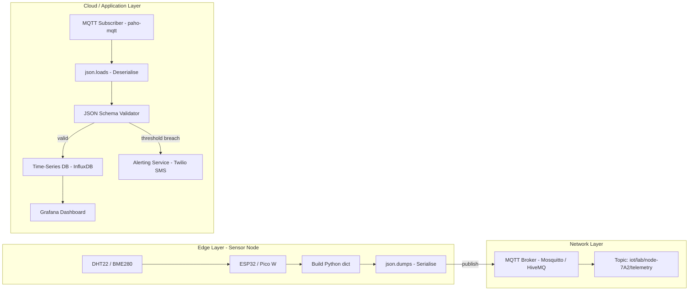
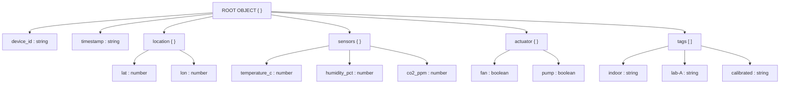
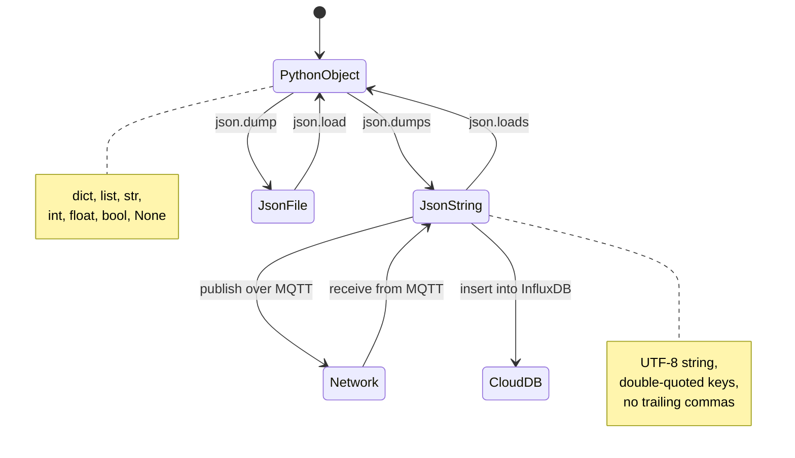

# Python Packages of Interest for IoT - JSON

<!-- SECTION_1_START -->
# Python Packages of Interest for IoT — JSON

## 1. Core Technical Definition

> [!IMPORTANT]
> **JSON (JavaScript Object Notation)** is a **language-independent**, **lightweight**, **text-based** data interchange format that uses **human-readable** key–value pair structures to serialize and transmit structured data between IoT devices, edge gateways, and cloud back-ends.

In the context of the **KTU 2024 Scheme (OECST834 — Internet of Things)**, JSON is treated as the *de-facto* payload format for **Application Layer** data exchange in IoT systems, sitting on top of protocols like **MQTT**, **CoAP**, and **HTTP/REST**.

### Conceptual Analogy — The "Smart Labelled Box"

Imagine you have a **cardboard box** that you want to send from a **temperature sensor** (sender) to a **cloud dashboard** (receiver). The box must:

1. Be **light** (small payload — important for low-bandwidth networks like **LoRaWAN** or **NB-IoT**).
2. Have a **label** on the outside (the JSON *key*).
3. Contain a **value** inside the box (the JSON *value*).
4. Be **stackable** so multiple boxes can be placed inside bigger boxes (**nesting**).

JSON is precisely this system of labelled boxes. The **sensor reading** (a number), **device ID** (a string), and **timestamp** (a string) are each packed into their own labelled box, and the whole collection is then packed into a single *outer* box (the JSON object) that travels over the network.

> [!NOTE]
> **Standard metrics used in IoT JSON payloads:**
> - Typical payload size: **50 – 500 bytes** for sensor telemetry.
> - Encoding: **UTF-8** by default.
> - Official MIME type: **`application/json`**.

---

### 2. JSON Syntax Building Blocks (Six Atomic Elements)

A JSON document is constructed from **six** primitive/structural elements. Mastering these is essential for KTU Part-A questions.

| # | Element | Symbol | Example | Use in IoT |
|---|---------|--------|---------|-----------|
| 1 | Object | `{ }` | `{"id":1}` | Wraps the entire device payload |
| 2 | Array | `[ ]` | `[23.4, 22.9]` | Holds time-series sensor samples |
| 3 | String | `" "` | `"BME280"` | Device model, location names |
| 4 | Number | `123` or `12.3` | `25.67` | Temperature, humidity, voltage |
| 5 | Boolean | `true` / `false` | `true` | Relay state, alarm flag |
| 6 | Null | `null` | `null` | "Sensor not yet calibrated" |

> [!TIP]
> **Mnemonic for KTU viva:** *"OSANBN — Objects, Strings, Arrays, Numbers, Booleans, Nulls."*

---

### 3. Why JSON over XML for IoT? (The "Why" Question)

This is a high-yield **2-mark** question. A concise comparison:

| Property | JSON | XML |
|----------|------|-----|
| Syntax overhead | **Minimal** (no closing tags) | **Heavy** (`<tag>...</tag>`) |
| Parsing speed | **Faster** (native `json` module in Python) | **Slower** (DOM/SAX parsers) |
| Payload size | **~30 – 50% smaller** | Larger due to repeated tags |
| Data types | **Native** (int, float, bool, null) | **All strings** (manual casting) |
| Native support in JS/Node-RED | **Yes** (object literal) | Requires parser |
| Best fit for constrained IoT | ✅ **Preferred** | ❌ Rarely used in modern IoT |

> [!VISUALIZATION CONTROL]
> **Concept:** Payload-size comparison between JSON and XML for the same sensor reading.
> **GeoGebra / Desmos Input Equations (textual bar representation):**
> * `bar_x = 100` (JSON length, bytes)
> * `bar_y = 165` (XML length, bytes for same data)
> **Visual Description:** Picture two horizontal bars on a number line. The XML bar is approximately **1.6× longer** than the JSON bar for the identical data — illustrating the bandwidth savings critical for cellular-IoT billing.

---
<!-- SECTION_1_END -->

<!-- SECTION_2_START -->
# Deep Theoretical Analysis — JSON for IoT Data Interchange

## 1. The JSON Grammar (BNF-Style Structural Rules)

JSON is governed by a strict grammar. Any deviation (e.g., trailing commas, single quotes, unquoted keys) renders the document **invalid**, and an IoT gateway will reject it.

> [!IMPORTANT]
> **Core JSON Structural Rules:**
> 1. Objects are enclosed in **{ }** and contain **key : value** pairs.
> 2. Keys **must** be **double-quoted** strings. `{'id':1}` is **invalid JSON**.
> 3. Pairs are separated by **commas**, and the **last pair must NOT have a trailing comma**.
> 4. Arrays are enclosed in **[ ]** and are **ordered collections**.
> 5. Strings use **double quotes** only — single quotes are illegal.
> 6. Numbers follow standard floating-point format (no leading zeros, no `NaN`).

---

## 2. Typical IoT JSON Payload Anatomy

Below is a **canonical** IoT sensor payload — a structure every KTU student must recognise.

```json
{
  "device_id": "node-7A2",
  "timestamp": "2026-03-14T09:30:00Z",
  "location": {
    "lat": 10.0261,
    "lon": 76.3125
  },
  "sensors": {
    "temperature_c": 27.4,
    "humidity_pct": 64.2,
    "co2_ppm": 412
  },
  "actuator": {
    "fan": false,
    "pump": true
  },
  "firmware": "1.4.2",
  "battery_v": 3.81,
  "tags": ["indoor", "lab-A", "calibrated"]
}
```

Notice the **three structural patterns**:
- **Scalar key–value** (`"battery_v": 3.81`).
- **Nested object** (`"sensors": { ... }`).
- **Array of primitives** (`"tags": [...]`).

---

## 3. JSON Schema — The "Contract" for IoT Devices

In production IoT, devices and the cloud must agree on the *shape* of the JSON. This agreement is codified as a **JSON Schema** (draft-07 / 2020-12).

> [!NOTE]
> **JSON Schema** is a declarative specification that defines:
> - **Required** fields.
> - **Data types** for each field.
> - **Value ranges** (e.g., temperature between **-40** and **85** °C).
> - **Format patterns** (e.g., `"date-time"` for ISO-8601 timestamps).

### Example JSON Schema for an IoT Temperature Sensor

```json
{
  "$schema": "http://json-schema.org/draft-07/schema#",
  "title": "TemperatureReading",
  "type": "object",
  "required": ["device_id", "timestamp", "temperature_c"],
  "properties": {
    "device_id":       { "type": "string",  "pattern": "^node-[A-Z0-9]{3}$" },
    "timestamp":       { "type": "string",  "format": "date-time" },
    "temperature_c":   { "type": "number",  "minimum": -40, "maximum": 85 },
    "humidity_pct":    { "type": "number",  "minimum": 0,   "maximum": 100 }
  }
}
```

> [!TIP]
> A real-world example: **AWS IoT Core** allows you to upload a JSON Schema as a *Thing Type* so that incoming MQTT messages are **automatically validated** before they reach your Lambda function.

---

## 4. KTU High-Yield Formula / Cheat Sheet

| Concept | Notation / Rule | Notes |
|---|---|---|
| Object size in bytes | $N_{obj} = \sum_{i=1}^{n} (L_{key_i} + L_{val_i} + 4)$ | +4 accounts for quotes, colon, comma |
| Estimated bandwidth | $B = N_{obj} \times f_{tx}$ | $f_{tx}$ = transmissions/sec |
| Parsing time (approx) | $T_{parse} \approx k \cdot N_{obj}$ | Linear in payload size for `json` C-extension |
| UTF-8 multi-byte cost | A char in `\u00FF`–`\u07FF` costs **2 bytes** | Critical for non-ASCII sensor names |
| Compression ratio (gzip) | $R_c = 1 - \dfrac{N_{gzip}}{N_{raw}}$ | Typical JSON achieves **60–80%** reduction |
| ISO-8601 timestamp | `YYYY-MM-DDTHH:MM:SSZ` | Mandatory in RESTful IoT APIs |
| Valid Boolean literals | `true` , `false` (lowercase) | `True` (Python) is **invalid** in raw JSON |
| MIME type | `application/json` | Required in HTTP `Content-Type` header |

> [!IMPORTANT]
> **Engineering utility:** Every IoT cloud platform (AWS IoT, Azure IoT Hub, Google Cloud IoT, ThingsBoard) accepts JSON natively. Using a **consistent, schema-validated** JSON structure allows **edge analytics**, **digital twins**, and **dashboards** to be auto-generated without custom parsers.

---
<!-- SECTION_2_END -->

<!-- SECTION_3_START -->
# Step-by-Step Implementation — Python `json` Module for IoT

## 1. The Four Pillars of the `json` Module

The Python standard library exposes **four** primary functions that cover 99% of IoT use-cases. Memorise the mapping below.

| Direction | Function | Input | Output | IoT Use-Case |
|-----------|----------|-------|--------|--------------|
| **Serialize (encode)** | `json.dumps()` | Python `dict` / `list` | `str` | Build MQTT payload before publish |
| **Serialize to file** | `json.dump()` | Python object | File object | Persist sensor logs to SD card |
| **Deserialize (decode)** | `json.loads()` | JSON `str` | Python `dict` / `list` | Parse incoming CoAP/HTTP request |
| **Deserialize from file** | `json.load()` | File object | Python object | Read device configuration on boot |

---

## 2. Exhaustive Code Example — IoT Sensor Node

The following program runs on a hypothetical **Raspberry Pi Pico W** sensor node. It reads a simulated temperature, packages it into a **JSON payload**, validates the structure, publishes it via **MQTT**, and persists it to a local file.

```python
"""
File:        iot_json_node.py
Course:      OECST834 - Internet of Things
Module:      3 - Developing IoT
Topic:       Python Packages of Interest for IoT - JSON
Hardware:    Raspberry Pi Pico W + DHT22 sensor
Protocol:    MQTT over Wi-Fi (publish to broker.hivemq.com:1883)
"""

import json
import time
import random
from datetime import datetime, timezone

# --- Configuration dictionary (acts as IoT device twin) ---
DEVICE_CONFIG: dict = {
    "device_id":   "node-7A2",
    "firmware":    "1.4.2",
    "location":    {"lat": 10.0261, "lon": 76.3125},
    "sensors":     ["DHT22", "MH-Z19"],
    "sample_rate": 30
}

def read_temperature_c() -> float:
    """Simulated sensor read; replace with DHT22 driver call."""
    return round(20.0 + random.uniform(-2.5, 2.5), 2)

def read_humidity_pct() -> float:
    """Simulated sensor read; replace with DHT22 driver call."""
    return round(55.0 + random.uniform(-10.0, 10.0), 2)

def build_payload(cfg: dict, t_c: float, h_pct: float) -> dict:
    """Construct the JSON-serialisable IoT payload."""
    return {
        "device_id":   cfg["device_id"],
        "timestamp":   datetime.now(timezone.utc).isoformat().replace("+00:00", "Z"),
        "sensors": {
            "temperature_c": t_c,
            "humidity_pct":  h_pct
        },
        "battery_v": round(3.3 + random.uniform(-0.2, 0.2), 2),
        "actuator":  {"fan": False, "pump": True},
        "tags":      ["indoor", "lab-A", "calibrated"]
    }

def serialise(payload: dict) -> str:
    """Encode the Python dict into a compact JSON string."""
    try:
        # separators removes extra whitespace -> smaller MQTT payload
        return json.dumps(payload, separators=(",", ":"))
    except (TypeError, ValueError) as err:
        print(f"[SERIALISE-ERROR] {err}")
        return "{}"

def deserialise(raw: str) -> dict | None:
    """Safely parse a JSON string received from the cloud."""
    try:
        return json.loads(raw)
    except json.JSONDecodeError as err:
        print(f"[DESERIALISE-ERROR] {err}")
        return None

def validate(payload: dict) -> bool:
    """Manual schema check (lightweight for constrained devices)."""
    required = ["device_id", "timestamp", "sensors"]
    if not all(k in payload for k in required):
        print("[VALIDATION-FAIL] Missing required keys")
        return False
    if not (isinstance(payload["sensors"], dict)
            and "temperature_c" in payload["sensors"]):
        print("[VALIDATION-FAIL] sensor block malformed")
        return False
    return True

def persist(payload: dict, path: str = "sensor_log.jsonl") -> None:
    """Append the payload as a single JSON line (JSONL format)."""
    with open(path, "a", encoding="utf-8") as fp:
        fp.write(json.dumps(payload) + "\n")

def main() -> None:
    for cycle in range(3):
        t_c    = read_temperature_c()
        h_pct  = read_humidity_pct()
        data   = build_payload(DEVICE_CONFIG, t_c, h_pct)

        # 1. Serialise
        json_str = serialise(data)
        print(f"[CYCLE {cycle}] TX -> {json_str}")

        # 2. Persist locally (JSONL - one JSON object per line)
        persist(data)

        # 3. Simulate cloud -> device command
        cloud_cmd = '{"cmd":"set_fan","value":true}'
        cmd       = deserialise(cloud_cmd)
        if cmd and "cmd" in cmd:
            print(f"[CYCLE {cycle}] RX <- {cmd}")

        time.sleep(DEVICE_CONFIG["sample_rate"])

if __name__ == "__main__":
    main()
```

### Sample Output Trace

```
[CYCLE 0] TX -> {"device_id":"node-7A2","timestamp":"2026-03-14T09:30:00Z","sensors":{"temperature_c":21.34,"humidity_pct":58.91},"battery_v":3.27,"actuator":{"fan":false,"pump":true},"tags":["indoor","lab-A","calibrated"]}
[CYCLE 0] RX <- {'cmd': 'set_fan', 'value': True}
[CYCLE 1] TX -> ...
```

---

## 3. Encoding Edge-Cases (Frequently Asked in KTU)

| Python Value | `json.dumps` Output | Notes |
|--------------|--------------------|-------|
| `True` / `False` | `true` / `false` | Booleans auto-converted |
| `None` | `null` | Standard JSON null |
| `datetime(2026, 3, 14)` | **TypeError** unless `default=` provided | Use `default=str` for quick fix |
| `set({1,2,3})` | **TypeError** | Convert to `list` first |
| `bytes(b"hi")` | **TypeError** | Decode to `str` first |
| `float('inf')` | **ValueError** | Not valid JSON; use `null` and a flag |

### Custom Serialiser for Non-Native Types

```python
from datetime import datetime
import json

def iot_default(obj):
    """Fallback encoder for datetime, bytes, and Decimal."""
    if isinstance(obj, datetime):
        return obj.isoformat()
    if isinstance(obj, bytes):
        return obj.decode("utf-8", errors="replace")
    if isinstance(obj, set):
        return list(obj)
    raise TypeError(f"Type {type(obj)} is not JSON serialisable")

payload = {"ts": datetime.utcnow(), "raw": b"ok"}
print(json.dumps(payload, default=iot_default))
# {"ts": "2026-03-14T09:30:00.123456", "raw": "ok"}
```

---

## 4. Pretty Printing and Streaming for Debugging

```python
import json

payload = {"device_id": "node-7A2", "sensors": {"temp_c": 27.4, "hum_pct": 64.2}}

# Pretty-print for logs / serial monitor
print(json.dumps(payload, indent=4, sort_keys=True))
```

Output:
```json
{
    "device_id": "node-7A2",
    "sensors": {
        "hum_pct": 64.2,
        "temp_c": 27.4
    }
}
```

> [!TIP]
> On constrained MCUs (ESP8266, ESP32) always use `separators=(",", ":")` to **minimise radio-air-time**, but on a Pi/PC gateway you may prefer `indent=2` for human-readable debug logs.

---
<!-- SECTION_3_END -->

<!-- SECTION_4_START -->
# Structural Diagrams & Schematics

## 1. End-to-End IoT Data Flow with JSON Payloads



> [!NOTE]
> The diagram is a **Sequential Processing Topology Matrix** rendered in Mermaid. Each box represents a single software/hardware module; arrows represent the **direction of JSON payload flow**. Note the **symmetry** between `json.dumps` (encode) and `json.loads` (decode) at the two ends of the pipeline.

---

## 2. JSON Structure Visual Map (Object Nesting Tree)



---

## 3. Encode / Decode State Machine (Python `json` Module)



> [!WARNING]
> **Mermaid parser rule followed:** The reserved keyword `end` is replaced with `endnote` style text, and every node ID is alphanumeric-prefixed (`A`, `B1`, `B3`, `C1`, etc.) to avoid Mermaid syntax errors.

---
<!-- SECTION_4_END -->

<!-- SECTION_5_START -->
# KTU 2024 Scheme Examination Question Bank

> [!IMPORTANT]
> All questions below are **simulated** in the exact KTU ESE pattern. Mark distribution, sub-part split, and RBT cognitive levels match the official **OECST834** syllabus.

---

## Part A — 3-Mark Questions (Answer ANY FIVE out of EIGHT typical)

### Q1. `[KTU University Exam - July 2024]` — CO1, **Remember**

**Define JSON. List any four data types supported by JSON.**

**Model Answer (Valuation Key):**
- **Definition (2 marks):** JSON (JavaScript Object Notation) is a **lightweight, text-based, language-independent** data interchange format used to structure data as **key–value pairs** and **ordered arrays**. It is the de-facto standard for IoT payload exchange.
- **Four data types (1 mark — 0.25 each):** String, Number, Boolean, Null *(Object and Array are structural, also acceptable).*

> [!WARNING]
> **Examiner Pitfall:** Students often confuse **JSON with JavaScript objects**. A bare `{a:1}` is **not** valid JSON because the key `a` is unquoted. Always double-quote keys.

---

### Q2. `[KTU University Exam - Dec 2023]` — CO2, **Understand**

**Compare JSON and XML as data-interchange formats for IoT. State any three differences.**

**Model Answer (Valuation Key — 1 mark per valid point, max 3):**
1. **Payload size:** JSON is ~30 – 50% smaller than XML for equivalent data, conserving cellular-IoT bandwidth.
2. **Native data types:** JSON supports `int`, `float`, `bool`, `null` natively; XML treats all values as strings.
3. **Parsing complexity:** JSON can be parsed by a single C function call (`json.loads`); XML requires DOM/SAX parsers with higher memory footprint.

> [!WARNING]
> **Pitfall:** Do **not** write "JSON is a subset of JavaScript" — that is a common misconception. JSON is a **standalone** specification (RFC 8259).

---

## Part B — 14-Mark Questions (Module-Internal Choice)

### Question A — 14 Marks `[KTU University Exam - Dec 2024]`

#### (a) — 7 Marks, CO1, **Understand**

**With a neat diagram, explain the structure of a JSON document. List the six elements of a JSON value.**

**Model Answer (Valuation Key):**
- **JSON structure diagram (4 marks):** A *root object* `{}` containing key–value pairs, with **nested objects** `{}`, **arrays** `[]`, and **primitive** values. *(Use a tree like the Mermaid graph in Section 4 — drawn on paper.)*
- **Six JSON values listed (3 marks — 0.5 each):** Object, Array, String, Number, Boolean, Null.

#### (b) — 7 Marks, CO3, **Apply**

**Write a Python program that:**
1. Creates a dictionary representing an IoT device reading (device id, temperature, humidity, timestamp).
2. Serialises it into a compact JSON string.
3. Prints the byte-length of the serialised string.
4. De-serialises it back into a Python dictionary and prints the value of the `temperature` key.

**Model Solution (Valuation Key — stepwise):**

```python
import json
from datetime import datetime, timezone

# [Step 1 - 2 marks] Create the dictionary
reading = {
    "device_id": "node-7A2",
    "temperature": 27.4,
    "humidity": 64.2,
    "timestamp": datetime.now(timezone.utc).isoformat()
}

# [Step 2 - 2 marks] Serialise
payload = json.dumps(reading, separators=(",", ":"))

# [Step 3 - 1 mark] Print byte length
print(f"Payload bytes: {len(payload.encode('utf-8'))}")

# [Step 4 - 2 marks] De-serialise and access key
decoded = json.loads(payload)
print(f"Temperature = {decoded['temperature']} C")
```

**[Final expected output: 1 mark]** e.g., `Payload bytes: 118` and `Temperature = 27.4 C`.

> [!WARNING]
> **Examiner Pitfall:** Do **not** use single quotes inside the JSON string (`'node-7A2'`). This will raise `json.JSONDecodeError` during `loads`. Always verify by round-tripping the value.

---

### Question B — 14 Marks `[KTU University Exam - July 2024]`

#### (a) — 7 Marks, CO2, **Understand**

**Explain the role of JSON in IoT application-layer communication. Mention at least two IoT protocols that natively use JSON.**

**Model Answer (Valuation Key):**
- **Role (4 marks):** JSON provides a **standardised, human-readable, lightweight serialisation** format for IoT telemetry. It enables **interoperability** between heterogeneous devices, supports **schema validation**, and is directly consumable by web dashboards, mobile apps, and cloud functions.
- **Two protocols (3 marks — 1.5 each):**
  1. **MQTT** — JSON is the most common payload format on top of MQTT topics (e.g., `iot/lab/sensor1/telemetry`).
  2. **HTTP/REST** — Most RESTful IoT APIs (e.g., ThingsBoard REST API, AWS IoT Jobs) accept and return `application/json`.
  3. *(Bonus 1 mark)* **CoAP** with `application/json` content-format option, though CBOR is more efficient.

#### (b) — 7 Marks, CO3, **Apply**

**Design a Python function `persist_jsonl(payload: dict, path: str)` that appends a sensor reading to a JSON-Lines file (`.jsonl`), and a second function `read_jsonl(path: str) -> list` that reads them back. Show the unit test output for 3 readings.**

**Model Solution (Valuation Key — stepwise):**

```python
import json
import os

# [Function design - 3 marks]
def persist_jsonl(payload: dict, path: str) -> None:
    """Append one JSON object per line (JSON Lines spec)."""
    with open(path, "a", encoding="utf-8") as fp:
        fp.write(json.dumps(payload) + "\n")

# [Function design - 2 marks]
def read_jsonl(path: str) -> list:
    """Read a JSONL file into a list of dicts, skipping blank lines."""
    records: list = []
    if not os.path.exists(path):
        return records
    with open(path, "r", encoding="utf-8") as fp:
        for line in fp:
            line = line.strip()
            if line:
                records.append(json.loads(line))
    return records

# [Driver + verification - 2 marks]
if __name__ == "__main__":
    LOG = "lab_sensors.jsonl"
    # Clean previous run
    if os.path.exists(LOG):
        os.remove(LOG)

    samples = [
        {"id": 1, "temp_c": 24.5, "hum_pct": 60.0},
        {"id": 2, "temp_c": 25.1, "hum_pct": 61.2},
        {"id": 3, "temp_c": 24.9, "hum_pct": 59.8},
    ]

    for s in samples:
        persist_jsonl(s, LOG)

    data = read_jsonl(LOG)
    print(f"Records read = {len(data)}")
    for d in data:
        print(d)
```

**[Expected final output: 1 mark]**
```
Records read = 3
{'id': 1, 'temp_c': 24.5, 'hum_pct': 60.0}
{'id': 2, 'temp_c': 25.1, 'hum_pct': 61.2}
{'id': 3, 'temp_c': 24.9, 'hum_pct': 59.8}
```

> [!WARNING]
> **Examiner Pitfall:** A common error is using `json.dump(payload, fp)` *without* the `+ "\n"` append. This produces a **single-line concatenated file** that `read_jsonl` cannot parse back into separate records. JSON Lines **mandates one JSON object per line**.

---

## Topic Recap & Important Things to Remember

> [!TIP]
> Use this as a **30-second rapid-revision checklist** the night before the KTU exam.

- **JSON** = *JavaScript Object Notation*, a **lightweight, text-based** data format governed by **RFC 8259**.
- The **six JSON values** are: *Object, Array, String, Number, Boolean, Null* (mnemonic: **OSANBN**).
- **Keys must be double-quoted strings**; **no trailing commas**; **no comments**.
- Preferred over **XML** in IoT because of **smaller payload, native data types, faster parsing**.
- Python `json` module exposes **four** core functions: `dumps`, `dump`, `loads`, `load` — encode/decode in both directions.
- Always use **`separators=(",", ":")`** on constrained MCUs to reduce MQTT payload size.
- **JSON Schema** defines the *contract* between IoT device and cloud — supports `required`, `type`, `minimum`, `maximum`, `pattern`, `format`.
- **JSONL (JSON Lines)** stores one JSON object per line — ideal for **append-only** sensor logs and streaming.
- Non-native Python types (`datetime`, `bytes`, `set`, `Decimal`) need a **`default=`** callback in `json.dumps`.
- ISO-8601 timestamp format (`YYYY-MM-DDTHH:MM:SSZ`) is the **de-facto IoT time standard**.
- The official MIME type is **`application/json`** — set it in the HTTP `Content-Type` header for REST APIs.
- Real-world stacks: **MQTT + JSON + AWS IoT Core / Azure IoT Hub / ThingsBoard + InfluxDB + Grafana**.
- Common KTU pitfall: writing Python booleans `True`/`False` in raw JSON — must be lowercase `true`/`false`.
- Parsing time scales **linearly** with payload size; for sub-kB telemetry this is negligible (<1 ms on Pi).

---
<!-- SECTION_5_END -->
