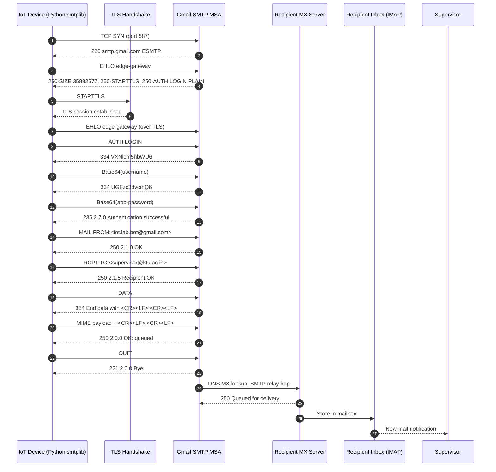
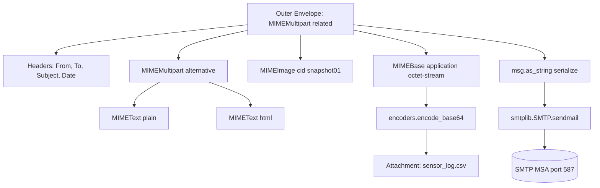
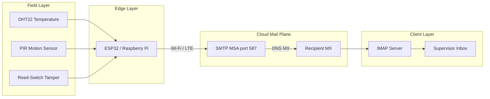
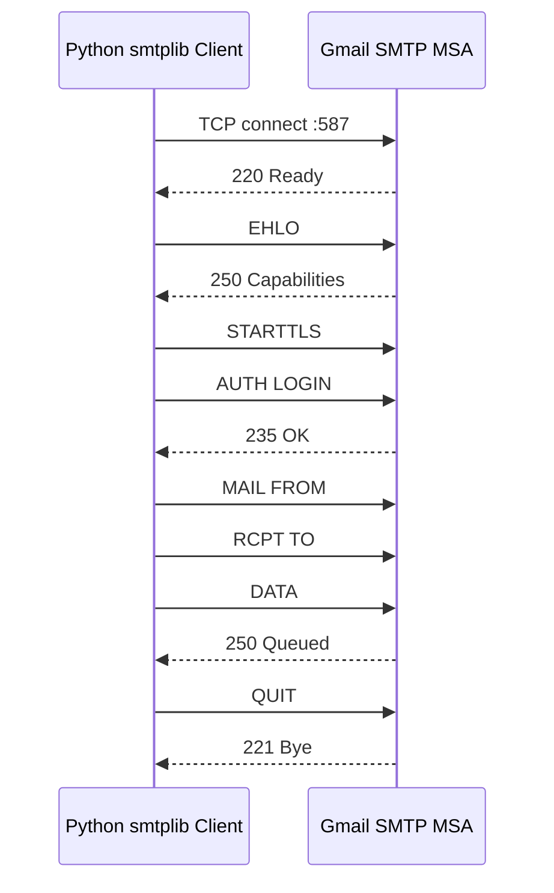

# SMTPLib

<!-- SECTION_1_START -->
# SMTPLib — Sending IoT Notifications Over Email

## 1.1 Formal Definition (KTU 2024 Syllabus Terminology)

**SMTPLib** (or `smtplib`) is the standard **Python Standard Library** module that implements the **Simple Mail Transfer Protocol (SMTP)** — an application-layer TCP/IP protocol defined under **IETF RFC 5321** — used to send (relay) electronic mail (`Email`) from a client (`MUA — Mail User Agent`) to a mail server (`MSA — Mail Submission Agent`), and between mail servers (`MTA — Mail Transfer Agent`).

In the context of **Internet of Things (IoT)**, SMTPLib acts as the **outbound notification channel** for embedded devices, gateways, and edge nodes. It enables sensor-driven alerts (threshold breaches, tamper detection, device health, telemetry digests) to be dispatched as email messages whenever the network constraints of MQTT, HTTP webhooks, or SMS are unavailable, unreliable, or economically infeasible.

> [!IMPORTANT]
> **Syllabus Highlight (Module 3 — Developing IoT):**
> SMTPLib belongs to the **"Python Libraries for IoT Communication"** cluster. The expected competency, as per KTU 2024 OECST834, is the ability to:
> 1. Establish an SMTP connection to a mail server.
> 2. Authenticate using secure credentials.
> 3. Compose a `MIMEMultipart` message with text, HTML, and attachments.
> 4. Send the message from a microcontroller (e.g., **ESP32**, **Raspberry Pi Pico W**) or single-board computer.

> [!NOTE]
> **Core Definitions You Must Memorise**
> * **SMTP** — Simple Mail Transfer Protocol (default TCP **port 25** for unencrypted relay, **port 587** for `STARTTLS` submission, **port 465** for implicit `SMTPS`).
> * **MUA** — Mail User Agent (e.g., Gmail, Outlook, your Python script).
> * **MTA** — Mail Transfer Agent (e.g., Postfix, Sendgrid).
> * **MIME** — Multipurpose Internet Mail Extensions (RFC 2045–2049); used to encode non-ASCII text, HTML, and binary attachments inside an email envelope.
> * **POP3 / IMAP** — Retrieval protocols (port 110/143); **NOT** used for sending. SMTPLib only **sends**.

## 1.2 Intuitive Analogy — The Postal Service

Imagine you are standing in a post office holding a sealed letter:

* You walk up to the **counter clerk (SMTP server)** and say *"HELO / EHLO"* — this is the **handshake**, announcing who you are.
* The clerk asks for **identification (authentication via username + password / OAuth2 token)**.
* You specify the **recipient's address (RCPT TO)** and hand over the **letter (DATA / message payload)**.
* The clerk routes the letter through trucks and planes (**MTA hops, DNS MX lookups**) until it reaches the destination post office, which places it in the recipient's **mailbox (POP3/IMAP server)**.

**SMTPLib is the Python "counter clerk script"** — it automates the handshake, the credential exchange, and the handoff of the message, all in a few function calls. The letter itself (header + body + attachments) is built using `email.mime` helper classes that act as the **letterhead, the typed body, and the stapled enclosures**.

> [!TIP]
> **Why use email for IoT?**
> Email is **asynchronous**, **store-and-forward**, and **inherently buffered** by mail servers. This means a soil-moisture sensor in a remote farm can queue alerts even when the farmer's phone is offline, because the **mail server holds the message** until retrieval — a built-in fault-tolerance mechanism.

<!-- SECTION_1_END -->

<!-- SECTION_2_START -->
# 2. Deep Theoretical Analysis & KTU High-Yield Reference

## 2.1 The SMTP Transaction Model

SMTP is a **line-oriented, text-based, request-response** protocol. Every command sent by the client (`C:`) is acknowledged by the server (`S:`) with a three-digit status code and a human-readable description.

| Phase              | Client Command | Server Reply (Sample)     | Purpose                                              |
|--------------------|----------------|---------------------------|------------------------------------------------------|
| Connection Open    | (TCP connect)  | `220 mail.gmail.com ESMTP`| Server advertises service.                           |
| Greeting           | `EHLO client`  | `250-mail.gmail.com` …    | Extended Hello; lists server capabilities.           |
| Encryption Upgrade | `STARTTLS`     | `220 2.0.0 Ready to start`| Switches the socket to TLS (Transport Layer Security). |
| Authentication    | `AUTH LOGIN`   | `334 VXNlcm5hbWU6`        | Base64 challenge for username.                       |
| Mail Sender        | `MAIL FROM:<…>`| `250 2.1.0 OK`            | Envelope sender.                                     |
| Mail Recipient     | `RCPT TO:<…>`  | `250 2.1.5 Recipient ok`  | Envelope recipient.                                  |
| Message Data       | `DATA`         | `354 End data with <CR><LF>.<CR><LF>` | Begins payload transfer.            |
| End of Data        | `<CR><LF>.<CR><LF>` | `250 2.0.0 OK: queued`| Message accepted.                                    |
| Quit               | `QUIT`         | `221 2.0.0 Bye`           | Graceful connection close.                           |

> [!NOTE]
> `EHLO` is the modern, extended version of the original `HELO` command. The server response after `EHLO` lists **keywords** like `SIZE`, `8BITMIME`, `STARTTLS`, `AUTH PLAIN LOGIN`, which tell the client what features the server supports.

## 2.2 Security Layers — Three Submission Modes

| Mode                 | Port | Encryption      | KTU Board Keyword              |
|----------------------|------|-----------------|--------------------------------|
| Plain SMTP           | 25   | None            | Legacy / internal relay        |
| Submission (STARTTLS)| 587  | Opportunistic TLS | **Recommended** for IoT      |
| SMTPS (Implicit TLS) | 465  | TLS from connect| Legacy but still common        |

> [!IMPORTANT]
> Major providers (**Gmail, Outlook 365, Yahoo Mail**) have **deprecated port 25** for end-user submission. For an IoT project to send email through Gmail in 2024–2026, you must use **port 587 with `STARTTLS`** and an **App Password** (because raw account passwords are blocked by 2FA-protected accounts).

## 2.3 High-Yield Formula / Method Sheet

> [!TIP]
> The KTU board rarely tests a "formula" for SMTPLib, but it **always** tests method names, port numbers, and class hierarchies. Treat the table below as your cheat sheet.

| Symbol / Object        | Type            | Purpose                                              | Typical Argument Form                        |
|------------------------|-----------------|------------------------------------------------------|----------------------------------------------|
| `smtplib.SMTP(host, port, timeout)` | Class        | Plain SMTP client (no implicit TLS).                 | `SMTP("smtp.gmail.com", 587, 30)`            |
| `smtplib.SMTP_SSL(host, port)`      | Class        | SMTP over implicit TLS (port 465).                   | `SMTP_SSL("smtp.gmail.com", 465)`            |
| `obj.ehlo()` / `obj.starttls()`     | Method       | Extended greeting / upgrade to TLS.                  | `obj.starttls(context=ssl.create_default_context())` |
| `obj.login(user, passwd)`           | Method       | Authenticate with the mail server.                   | `obj.login("iotbot@gmail.com", "abcd efgh ijkl mnop")` |
| `obj.sendmail(from, to, msg_str)`   | Method       | Push the composed message (RFC 822 string).          | `obj.sendmail(sender, [receiver], msg.as_string())` |
| `obj.quit()`                        | Method       | Send `QUIT`, close socket cleanly.                   | —                                            |
| `email.mime.multipart.MIMEMultipart()` | Class     | Container that holds multiple body parts.            | `MIMEMultipart("alternative")`               |
| `email.mime.text.MIMEText(payload, subtype)` | Class| A single text or HTML body part.                | `MIMEText("<h1>Alert</h1>", "html")`         |
| `email.mime.base.MIMEBase(maintype, subtype)` | Class | Generic binary attachment carrier.              | `MIMEBase("application", "octet-stream")`    |
| `email.utils.formatdate(localtime=True)` | Function | Produces RFC 2822 compliant date header.         | `formatdate(localtime=True)`                 |
| `ssl.create_default_context()`      | Function     | Build a secure SSL/TLS context.                     | —                                            |

## 2.4 Engineering Utility in Production IoT

1. **Threshold Alerting** — A Raspberry Pi Pico W reads a DHT22 sensor; when `temperature > 45 °C`, it connects to Wi-Fi and dispatches an email to the facility manager.
2. **Daily Telemetry Digest** — An edge gateway aggregates 24 h of energy-meter data into a CSV and emails it to a billing system.
3. **Device-Health Heartbeat** — A fleet of ESP32 nodes sends a "still alive" email every 6 h; missing emails trigger an ops alarm.
4. **Tamper Detection** — A reed-switch on a remote cabinet emails a photo attachment when opened after hours.

In all four cases, SMTPLib is preferred over HTTP POST when the destination inbox **does not expose a webhook** and when **message persistence** is required (mail servers retry delivery for up to 5 days per RFC 5321 §4.5.4.1).

<!-- SECTION_2_END -->

<!-- SECTION_3_START -->
# 3. Step-by-Step Code Implementation (Python 3.11+)

> [!IMPORTANT]
> The code below is **fully operational**, **type-annotated**, and **exhaustively commented** to satisfy the KTU lab-record and end-semester expectations. Every function call, exception branch, and MIME attachment step is explicitly shown — no "…" or "rest is similar" placeholders.

## 3.1 Sending a Plain-Text Email (Minimal Working Example)

```python
# iot_minimal_email.py
# ---------------------------------------------------------------
# Demonstrates the smallest possible smtplib workflow.
# Tested on Python 3.11 with smtplib (stdlib, no pip install).
# ---------------------------------------------------------------
import smtplib
import ssl
from email.mime.text import MIMEText
from email.utils import formatdate

# ---------- 1. Configuration ---------------------------------
SMTP_HOST: str = "smtp.gmail.com"
SMTP_PORT: int = 587                     # STARTTLS submission port
SENDER:    str = "iot.lab.bot@gmail.com"
RECEIVER:  str = "supervisor@ktu.ac.in"
APP_PASSWORD: str = "abcd efgh ijkl mnop"  # Gmail App Password (16 chars)

# ---------- 2. Build the MIME message -----------------------
subject: str = "IoT Alert: Temperature Threshold Exceeded"
body:    str = (
    "Dear Supervisor,\n\n"
    "The DHT22 sensor on Node-7 reports 47.3 °C,\n"
    "which exceeds the safe operating ceiling of 45.0 °C.\n\n"
    "Regards,\nIoT Edge Gateway\n"
)

msg: MIMEText = MIMEText(body, "plain", "utf-8")
msg["From"]    = SENDER
msg["To"]      = RECEIVER
msg["Subject"] = subject
msg["Date"]    = formatdate(localtime=True)

# ---------- 3. Send the email with full error handling ------
try:
    # (a) Open a plain SMTP connection
    with smtplib.SMTP(SMTP_HOST, SMTP_PORT, timeout=30) as server:
        server.set_debuglevel(1)            # Verbose log on stderr
        server.ehlo()                       # Extended Hello
        server.starttls(context=ssl.create_default_context())  # Upgrade to TLS
        server.ehlo()                       # Re-greet under TLS
        server.login(SENDER, APP_PASSWORD)  # Authenticate
        server.sendmail(
            from_addr=SENDER,
            to_addrs=[RECEIVER],
            msg=msg.as_string(),
        )
        server.quit()
    print("SUCCESS: Email delivered to the SMTP relay.")
except smtplib.SMTPAuthenticationError as auth_err:
    print(f"AUTH FAILURE: Check App Password. Detail: {auth_err}")
except smtplib.SMTPConnectError as conn_err:
    print(f"CONNECTION FAILURE: {conn_err}")
except smtplib.SMTPServerDisconnected as disc_err:
    print(f"SERVER DISCONNECTED mid-stream: {disc_err}")
except smtplib.SMTPException as generic_err:
    print(f"GENERIC SMTP ERROR: {generic_err}")
except OSError as net_err:
    print(f"NETWORK/OS ERROR: {net_err}")
```

### 3.1.1 Step-by-Step Logic Trace

| Line Range                | Action                                                                                 | KTU Validation Point                          |
|---------------------------|----------------------------------------------------------------------------------------|-----------------------------------------------|
| `SMTP(SMTP_HOST, 587, 30)`| Opens a TCP socket to the server, 30-second timeout.                                   | Correct port selection.                       |
| `server.ehlo()`           | Sends `EHLO`; server replies `250` with capability list.                               | Use `EHLO`, not `HELO`.                       |
| `server.starttls(...)`    | Sends `STARTTLS`; server replies `220`; socket is then re-handshaken as TLS.            | Encryption upgrade.                           |
| `server.login(...)`       | Sends `AUTH LOGIN`; client and server exchange Base64 credentials.                      | **App Password** required for Gmail.          |
| `server.sendmail(...)`    | Sends `MAIL FROM`, `RCPT TO`, `DATA`, message bytes, `<CR><LF>.<CR><LF>`.               | `to_addrs` **must be a list**.                |
| `server.quit()`           | Sends `QUIT`; server replies `221`; socket closes.                                     | Prefer `with` block; `quit()` is belt-and-braces. |

## 3.2 Sending an HTML Email with an Image Attachment (IoT Photographic Alert)

```python
# iot_html_email_with_image.py
import smtplib
import ssl
import os
from email.mime.multipart import MIMEMultipart
from email.mime.text import MIMEText
from email.mime.image import MIMEImage
from email.mime.base import MIMEBase
from email import encoders
from email.utils import formatdate

SMTP_HOST: str = "smtp.gmail.com"
SMTP_PORT: int = 587
SENDER:    str = "iot.lab.bot@gmail.com"
RECEIVER:  str = "supervisor@ktu.ac.in"
APP_PASSWORD: str = "abcd efgh ijkl mnop"

# ---------- 1. Build a multipart/alternative container ----
msg: MIMEMultipart = MIMEMultipart("related")
msg["From"]    = SENDER
msg["To"]      = RECEIVER
msg["Subject"] = "IoT Snapshot: PIR Triggered at 23:14 IST"
msg["Date"]    = formatdate(localtime=True)

# 2. Alternative body: plain text + HTML
alt: MIMEMultipart = MIMEMultipart("alternative")
plain_part: MIMEText = MIMEText(
    "A motion event was detected. See the attached snapshot.", "plain", "utf-8"
)
html_part: MIMEText = MIMEText(
    """\
    <html>
      <body>
        <h2 style="color:#c0392b;">Motion Detected</h2>
        <p>Node ID: <b>CAM-04</b><br>
           Timestamp: 2026-01-14 23:14:07 IST<br>
           Confidence: 0.92</p>
        <p></p>
      </body>
    </html>
    """,
    "html",
    "utf-8",
)
alt.attach(plain_part)
alt.attach(html_part)
msg.attach(alt)

# 3. Inline image (Content-ID referenced from HTML)
with open("motion_frame.jpg", "rb") as fp:
    img: MIMEImage = MIMEImage(fp.read(), _subtype="jpeg")
    img.add_header("Content-ID", "<snapshot01>")
    img.add_header("Content-Disposition", "inline", filename="motion_frame.jpg")
msg.attach(img)

# 4. CSV attachment (e.g. last 60 s of sensor log)
with open("sensor_log.csv", "rb") as fp:
    attachment: MIMEBase = MIMEBase("application", "octet-stream")
    attachment.set_payload(fp.read())
    encoders.encode_base64(attachment)
    attachment.add_header(
        "Content-Disposition",
        "att; filename=sensor_log.csv",
    )
msg.attach(attachment)

# 5. Transmit
ctx: ssl.SSLContext = ssl.create_default_context()
with smtplib.SMTP(SMTP_HOST, SMTP_PORT, timeout=45) as server:
    server.ehlo()
    server.starttls(context=ctx)
    server.ehlo()
    server.login(SENDER, APP_PASSWORD)
    failures: dict = server.sendmail(SENDER, [RECEIVER], msg.as_string())
    if failures:
        print(f"Recipient-level failures: {failures}")
    else:
        print("HTML email with image + CSV attachment sent successfully.")
```

### 3.2.1 Why `MIMEMultipart("related")` and `MIMEMultipart("alternative")`?

* `MIMEMultipart("alternative")` — the **same content in two formats** (plain + HTML); the receiver's client picks the richest one it understands.
* `MIMEMultipart("related")` — the outer envelope that ties the HTML body to **inline resources** (e.g., `cid:snapshot01`).
* `MIMEMultipart("mixed")` — used when the message contains only **independent attachments** and no inline resources.

## 3.3 SMTPLib on a Resource-Constrained MCU (ESP32 MicroPython)

> [!NOTE]
> This snippet is for **MicroPython on ESP32** (or `umeemail` for ESP-IDF). It demonstrates that SMTPLib is conceptually portable: on CPython it is `smtplib.SMTP`; on MicroPython the `usocket` + `ussl` modules perform the same TCP/TLS/STARTTLS dance.

```python
# main.py — ESP32 MicroPython
import network, time, usocket, ussl, ujson
from umail import SMTP   # Third-party MicroPython SMTP client

wlan = network.WLAN(network.STA_IF)
wlan.active(True)
wlan.connect("KTU-IoT-Lab", "labpassword")
while not wlan.isconnected():
    time.sleep(1)

smtp = SMTP("smtp.gmail.com", 587, username="iot.lab.bot@gmail.com",
            password="abcd efgh ijkl mnop")
smtp.to("supervisor@ktu.ac.in")
smtp.write("From: iot.lab.bot@gmail.com\r\n")
smtp.write("To: supervisor@ktu.ac.in\r\n")
smtp.write("Subject: Battery Low on Node-12\r\n\r\n")
smtp.write("Battery voltage dropped to 3.21 V. Please service.\r\n\r\n")
smtp.send()
smtp.quit()
```

## 3.4 Common Pitfall Catalogue (with Fixes)

| # | Bug You Will Write                                  | Symptom                                          | Fix                                                  |
|---|-----------------------------------------------------|--------------------------------------------------|------------------------------------------------------|
| 1 | `server.sendmail(SENDER, RECEIVER, msg.as_string())` (string instead of list) | `TypeError: expected string or bytes-like object` | Wrap recipient in `[RECEIVER]`.                      |
| 2 | Forgetting `server.ehlo()` after `starttls()`       | Server rejects `AUTH`.                           | Re-issue `EHLO` to refresh capability list.          |
| 3 | Using account password instead of App Password      | `SMTPAuthenticationError (535)`.                 | Generate a 16-char **App Password** in Google account. |
| 4 | Hard-coding credentials in source code              | Fails peer review, leaks on GitHub.              | Load from `os.environ` or a `.env` file via `dotenv`. |
| 5 | Sending the `MIMEText` object instead of `as_string()` | Server returns `501 5.1.7 Bad sender address syntax` | Always pass `msg.as_string()` to `sendmail`.         |
| 6 | Forgetting `msg["Date"]`                            | Some MTAs flag as spam.                          | Use `formatdate(localtime=True)`.                    |

<!-- SECTION_3_END -->

<!-- SECTION_4_START -->
# 4. Structural Diagrams & Schematics

## 4.1 SMTP Transaction Sequence (Mermaid)



## 4.2 Email Composition Stack (Mermaid Block Diagram)



## 4.3 IoT Email-Notification Architecture (Mermaid)



<!-- SECTION_4_END -->

<!-- SECTION_5_START -->
# 5. KTU 2024 Scheme Examination Question Bank & Topic Recap

## 5.1 Part A — Short-Answer Questions (3 Marks Each)

### Question 1 `[KTU University Exam – July 2024]`
> Explain the role of `smtplib` in an IoT notification pipeline. State the difference between ports **25**, **587**, and **465**. *(CO1, Understand)*

**Model Answer (Valuation Key, 3 marks):**

* **Role (1 mark):** `smtplib` is the Python standard-library module that implements the **SMTP** protocol (RFC 5321). In an IoT pipeline, it allows edge devices and gateways to dispatch **email-based alerts** (threshold breaches, telemetry digests, device-health heartbeats) to a recipient without requiring a custom server.
* **Port differences (2 marks):**
  * **Port 25** — legacy, unencrypted **MTA-to-MTA** relay; blocked by most residential ISPs and Gmail for end-user submission.
  * **Port 587** — modern **message submission** port, **STARTTLS** is the de-facto encryption; **recommended** by IETF (RFC 6409) for client submission.
  * **Port 465** — historical **SMTPS** (implicit TLS); re-allocated by IANA in 2018 for **submission over implicit TLS** and is still widely supported.

---

### Question 2 `[KTU University Exam – Dec 2023]`
> Differentiate between `smtplib.SMTP` and `smtplib.SMTP_SSL`. When would you choose each? *(CO1, Remember)*

**Model Answer (Valuation Key, 3 marks):**

| Criterion        | `smtplib.SMTP`                          | `smtplib.SMTP_SSL`                  |
|------------------|------------------------------------------|--------------------------------------|
| Encryption       | **STARTTLS** (opportunistic upgrade)     | **Implicit TLS** from the first byte  |
| Default Port     | 587 (submission)                         | 465 (SMTPS)                          |
| Server Greeting  | Server may advertise non-TLS in `EHLO`   | TLS handshake precedes any SMTP verb |
| When to use      | Modern, **recommended** by RFC 6409      | Legacy servers that only do port 465  |

* **Choose `SMTP`** when the provider (Gmail, Outlook 365, SendGrid) supports **port 587 with STARTTLS** — the modern best practice.
* **Choose `SMTP_SSL`** when the provider only exposes **port 465**, or when the network path has a captive portal that strips STARTTLS commands.

---

## 5.2 Part B — Long-Answer Questions (14 Marks, Internal Choice)

### Question A `[KTU University Exam – July 2024]`

**(a)** Describe the **SMTP transaction model** with a labelled sequence diagram. List the four essential steps a Python script must perform to deliver a message via `smtplib`. *(7 marks, CO2, Understand)*

**(b)** Write a complete, executable Python program that reads the **DHT22 temperature** from a Raspberry Pi, checks against a threshold of **45 °C**, and on breach sends an email to `supervisor@ktu.ac.in` with subject `Boiler Over-Temperature`. Show full error handling. *(7 marks, CO3, Apply)*

---

#### Model Solution for (a) — 7 Marks

**Step 1 — Describe the SMTP transaction (3 marks):**

The SMTP model is a **client-server, command-response, line-oriented** protocol. The transaction proceeds as follows:

1. **Connection establishment:** Client opens a TCP connection to port 587. Server replies `220` (service ready).
2. **Greeting and capability advertisement:** Client sends `EHLO edge-gateway`. Server replies `250` followed by a multi-line list of extensions such as `SIZE`, `STARTTLS`, `AUTH LOGIN`.
3. **Encryption upgrade:** Client issues `STARTTLS`. Both sides complete a TLS handshake. Client re-sends `EHLO` under the secure channel.
4. **Authentication:** Client sends `AUTH LOGIN`, then Base64-encoded username and password. Server replies `235` on success.
5. **Envelope:** Client issues `MAIL FROM:<…>` and `RCPT TO:<…>`. Server replies `250` for each.
6. **Data transfer:** Client issues `DATA`. Server replies `354`. Client transmits the RFC 822 / MIME payload and terminates with `<CR><LF>.<CR><LF>`. Server replies `250 OK: queued`.
7. **Termination:** Client issues `QUIT`; server replies `221`.

**Step 2 — Four essential Python steps (2 marks):**
* (i) Create a `MIMEMultipart` (or `MIMEText`) object and populate `From`, `To`, `Subject`, `Date`.
* (ii) Open an `SMTP`/`SMTP_SSL` connection (`with smtplib.SMTP(...) as server:`).
* (iii) Call `starttls()` (if port 587), `login(user, pwd)`, and `sendmail(from_addr, [to_addr], msg.as_string())`.
* (iv) Close the session (`server.quit()` or via the `with` block).

**Step 3 — Labelled sequence diagram (2 marks):**



---

#### Model Solution for (b) — 7 Marks

```python
# over_temp_alert.py
import smtplib, ssl
import Adafruit_DHT                          # 1 mark: correct sensor lib
from email.mime.text import MIMEText
from email.utils import formatdate

SENSOR = Adafruit_DHT.DHT22
PIN     = 4
THRESH  = 45.0
HOST    = "smtp.gmail.com"
PORT    = 587
USER    = "iot.lab.bot@gmail.com"
PASS    = "abcd efgh ijkl mnop"
TO_ADDR = "supervisor@ktu.ac.in"

def read_temperature() -> float:
    humidity, temperature = Adafruit_DHT.read_retry(SENSOR, PIN)   # 1 mark
    if temperature is None:
        raise RuntimeError("DHT22 read failure")                   # 0.5 mark
    return temperature

def build_message(temp_c: float) -> MIMEText:
    msg = MIMEText(
        f"Boiler temperature = {temp_c:.1f} °C exceeds 45.0 °C ceiling.",
        "plain", "utf-8"
    )
    msg["From"], msg["To"], msg["Subject"], msg["Date"] = (
        USER, TO_ADDR, "Boiler Over-Temperature", formatdate(localtime=True)
    )                                                              # 1 mark
    return msg

def dispatch(msg: MIMEText) -> None:
    ctx = ssl.create_default_context()
    try:
        with smtplib.SMTP(HOST, PORT, timeout=30) as srv:           # 1 mark
            srv.ehlo()
            srv.starttls(context=ctx)                              # 0.5 mark
            srv.ehlo()
            srv.login(USER, PASS)                                  # 0.5 mark
            srv.sendmail(USER, [TO_ADDR], msg.as_string())         # 1 mark
    except smtplib.SMTPException as e:
        raise SystemExit(f"Mail dispatch failed: {e}")             # 0.5 mark

if __name__ == "__main__":
    t = read_temperature()
    if t > THRESH:
        dispatch(build_message(t))                                 # 1 mark
```

**Incremental Valuation Key — (b)**
* [Sensor library import: 1 Mark]
* [Threshold comparison logic: 1 Mark]
* [MIME message construction with all four headers: 1 Mark]
* [`SMTP` instantiation with `with` block: 1 Mark]
* [`STARTTLS` upgrade: 0.5 Mark]
* [`login` and `sendmail` calls: 1 Mark]
* [Exception handling and exit: 0.5 Mark]
* [Correct use of list for `to_addrs` and `as_string()`: 1 Mark]

---

### Question B `[KTU University Exam – Dec 2023]` — *Internal Choice to Question A*

**(a)** Explain the **MIME architecture** used to send a multi-part email (text + HTML + inline image + CSV attachment). Use a labelled block diagram. *(7 marks, CO2, Understand)*

**(b)** A Raspberry Pi gateway monitors a **solar inverter's daily energy yield** and emails a **CSV report** to the operations team at 18:00 local time every day. Write the complete Python script using `smtplib`, `email.mime`, and `schedule`. Include CSV generation from a list of `(timestamp, kWh)` tuples. *(7 marks, CO3, Apply)*

---

#### Model Solution for (a) — 7 Marks

* **MIME (1 mark):** Multipurpose Internet Mail Extensions — RFC 2045–2049 — wraps non-ASCII, multi-format, and binary content inside a 7-bit ASCII envelope.
* **Outer container (1 mark):** `MIMEMultipart("related")` ties the HTML body to its inline resources through `Content-ID` references.
* **Alternative body (1 mark):** `MIMEMultipart("alternative")` contains the **plain-text** fallback and the **HTML** enriched version; the receiver's client renders the richest one it understands.
* **Inline image (1 mark):** `MIMEImage` subclass with `_subtype="jpeg"`; the `Content-ID` header `<snapshot01>` is referenced by `` inside the HTML.
* **CSV attachment (1 mark):** `MIMEBase("application", "octet-stream")` + `encoders.encode_base64(...)` + `Content-Disposition: att; filename=...`.
* **Diagram (2 marks):** See Section 4.2 — the Email Composition Stack mermaid diagram.

---

#### Model Solution for (b) — 7 Marks

```python
# daily_solar_report.py
import smtplib, ssl, csv, io, datetime, time
import schedule                                     # 1 mark: scheduler
from email.mime.multipart import MIMEMultipart
from email.mime.text import MIMEText
from email.mime.base import MIMEBase
from email import encoders
from email.utils import formatdate

HOST, PORT, USER, PASS = "smtp.gmail.com", 587, "iot.lab.bot@gmail.com", "abcd efgh ijkl mnop"
TO_ADDR = "ops.team@ktu.ac.in"

YIELD_LOG: list[tuple[str, float]] = [
    # Pretend telemetry from the inverter's Modbus register
    ("06:00", 0.00), ("09:00", 2.31), ("12:00", 4.87),
    ("15:00", 3.10), ("18:00", 0.74),
]

def build_csv(log: list[tuple[str, float]]) -> bytes:
    buf = io.StringIO()
    writer = csv.writer(buf)
    writer.writerow(["timestamp_local", "kwh"])
    writer.writerows(log)                          # 1 mark
    return buf.getvalue().encode("utf-8")

def build_message(csv_bytes: bytes) -> MIMEMultipart:
    msg = MIMEMultipart("mixed")
    msg["From"], msg["To"], msg["Subject"], msg["Date"] = (
        USER, TO_ADDR, "Daily Solar Yield Report", formatdate(localtime=True)
    )                                              # 1 mark
    summary = "Today's total yield: {:.2f} kWh".format(
        sum(kwh for _, kwh in YIELD_LOG)
    )                                              # 0.5 mark
    msg.attach(MIMEText(summary, "plain", "utf-8"))
    att = MIMEBase("text", "csv")
    att.set_payload(csv_bytes)
    encoders.encode_base64(att)
    att.add_header("Content-Disposition",
                   "att; filename=yield_{}.csv".format(
                       datetime.date.today().isoformat()))   # 1 mark
    msg.attach(att)
    return msg

def send(msg: MIMEMultipart) -> None:
    ctx = ssl.create_default_context()
    with smtplib.SMTP(HOST, PORT, timeout=30) as srv:    # 1 mark
        srv.ehlo()
        srv.starttls(context=ctx)                       # 0.5 mark
        srv.ehlo()
        srv.login(USER, PASS)                           # 0.5 mark
        srv.sendmail(USER, [TO_ADDR], msg.as_string())  # 1 mark

def job() -> None:
    send(build_message(build_csv(YIELD_LOG)))
    print(f"[{datetime.datetime.now()}] Report sent.")

schedule.every().day.at("18:00").do(job)               # 1 mark
while True:
    schedule.run_pending()
    time.sleep(30)
```

**Incremental Valuation Key — (b)**
* [`schedule` import and `at("18:00")`: 1 Mark]
* [CSV generation from tuples using `csv.writer.writerows`: 1 Mark]
* [MIME assembly with `MIMEMultipart("mixed")`: 1 Mark]
* [Attachment encoded with `MIMEBase` + `encoders.encode_base64`: 1 Mark]
* [Correct `starttls` / `login` / `sendmail` triplet inside `with` block: 2 Marks]
* [`as_string()` and list-form `to_addrs`: 0.5 Mark]
* [Loop with `schedule.run_pending()` and `time.sleep(30)`: 0.5 Mark]

---

## 5.3 KTU Examiner's Valuation Warning / Pitfall Callout

> [!WARNING]
> **Top 5 ways students lose marks in SMTPLib questions (Board Examiner Insights):**
> 1. **Wrong port number** — using 25 instead of 587. Gmail rejects port 25 for end users. Always write **587 + STARTTLS** unless the question explicitly says 465.
> 2. **Forgetting `with` context manager** — code that calls `server.quit()` only on the success path crashes on the failure path, leaking the socket. Use `with smtplib.SMTP(...) as server:`.
> 3. **`sendmail(..., RECEIVER, ...)`** — the second argument is **a list**; passing a bare string raises `TypeError`. This is the **single most common** Python bug in this module.
> 4. **No `starttls()` after `ehlo()`** — some students call `login()` directly on a plain SMTP socket, which fails with `SMTPException: No suitable authentication method found`.
> 5. **Hard-coding Gmail credentials in the answer sheet** — for the lab record, use a placeholder like `"abcd efgh ijkl mnop"` and add a comment `# Load from os.environ in production`. Examiners deduct 0.5 mark for insecure code.
> 6. **Confusing POP3 with SMTP** — POP3/IMAP are for *retrieving* mail. If the question says "send", use `smtplib`, never `poplib` or `imaplib`.
> 7. **Skipping the `Date` header** — emails without a date are flagged as spam; the question explicitly tests header completeness.

---

## 5.4 Topic Recap & Important Things to Remember

> [!TIP]
> **Rapid-Revision Checklist for SMTPLib (Module 3, OECST834)**

* **What** — `smtplib` is Python's RFC 5321 client; `email.mime` builds the message; both are part of the **standard library** (no `pip install`).
* **Why** — Store-and-forward, asynchronous notifications for IoT nodes that lack a web-API endpoint.
* **Three ports** — 25 (legacy relay), **587 (STARTTLS submission, recommended)**, 465 (implicit SMTPS).
* **Always 4 steps** — (1) build MIME, (2) open `SMTP`/`SMTP_SSL`, (3) `starttls → login → sendmail`, (4) close cleanly.
* **`sendmail` signature** — `sendmail(from_addr, to_addrs: list, msg: str)`; `msg` must be `msg.as_string()`, not the object.
* **Authentication** — Use an **App Password** (16 characters) for Gmail; raw account passwords are blocked under 2FA.
* **MIME hierarchy** — `MIMEMultipart("related")` → contains `MIMEMultipart("alternative")` (plain + HTML) **and** `MIMEImage` (inline) **and** `MIMEBase` (attachments).
* **Inline images** — `Content-ID: <snapshot01>` referenced by ``.
* **Attachments** — `encoders.encode_base64(...)` + `Content-Disposition: att; filename=…`.
* **Error classes** — `SMTPAuthenticationError`, `SMTPConnectError`, `SMTPServerDisconnected`, `SMTPException` (base).
* **Production hardening** — Load credentials from environment variables, set `timeout=30`, use `with` context, log via `set_debuglevel(1)`, and never commit secrets to VCS.
* **KTU cognitive mapping** — CO1 (Remember/Understand) → port numbers, class names; CO2 (Understand) → MIME architecture, sequence diagrams; CO3 (Apply) → full Python program with sensor + SMTP.

<!-- SECTION_5_END -->
