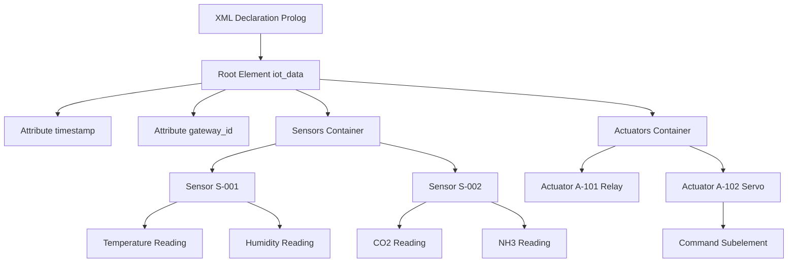
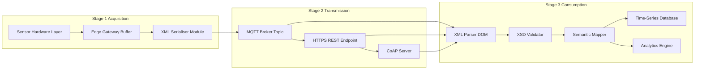
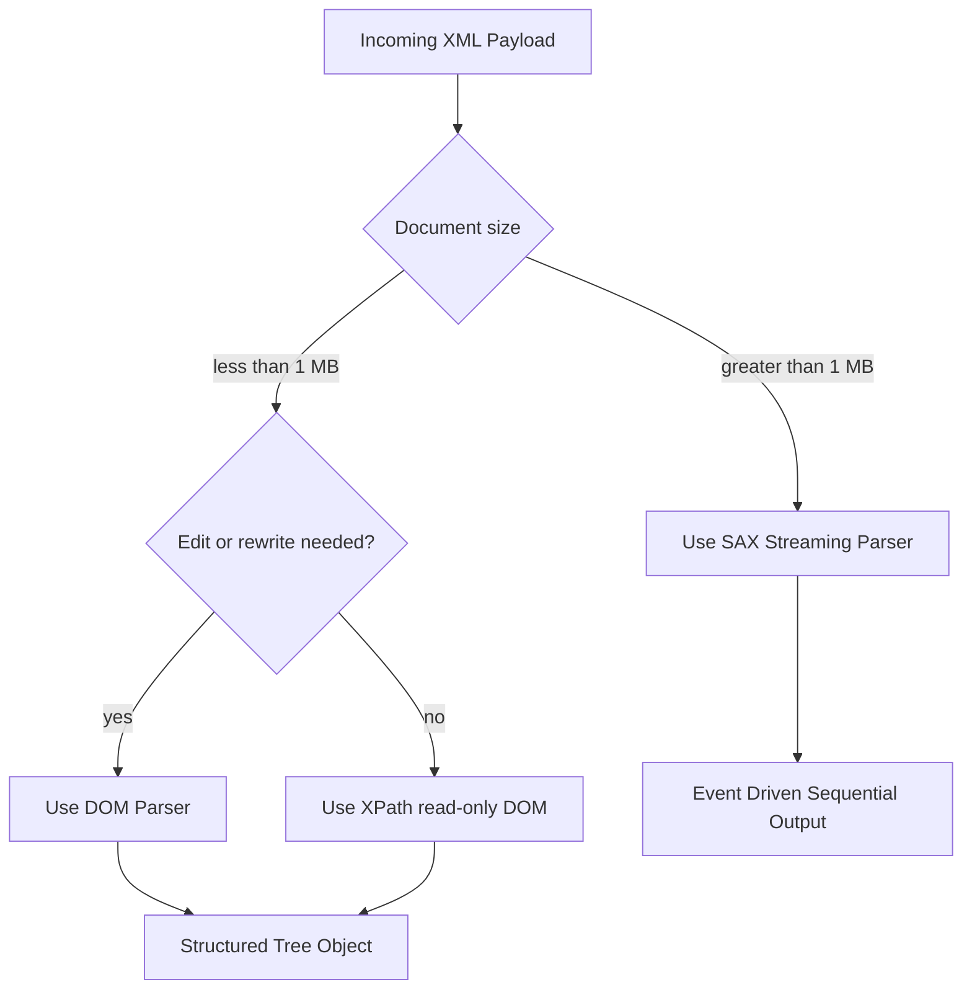
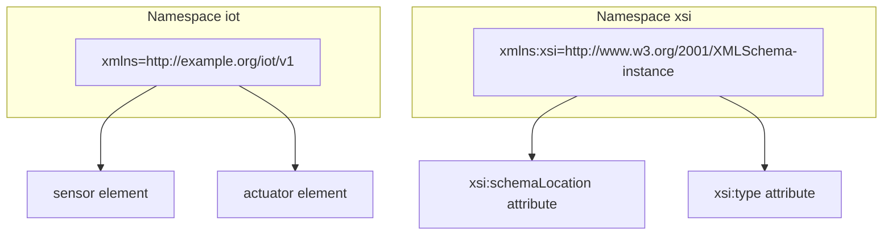
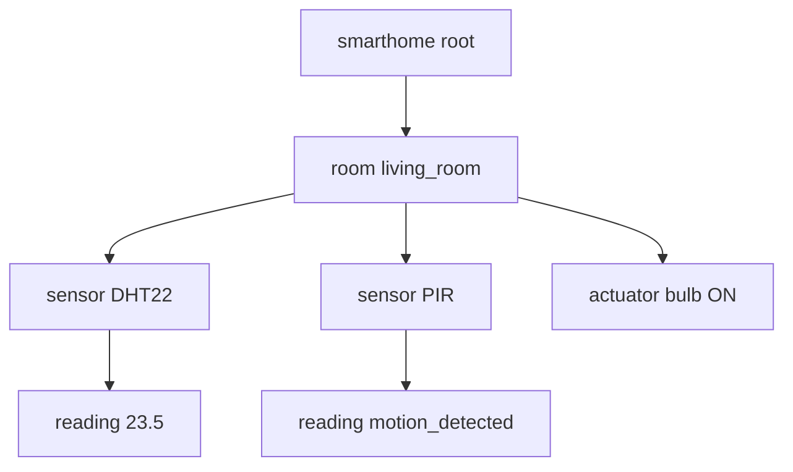

# XML

<!-- SECTION_1_START -->

# XML in IoT — Core Technical Definition & Intuitive Overview

## 1.1 Formal Academic Definition

> [!IMPORTANT]
> **XML (eXtensible Markup Language)** is a W3C-recommended, text-based, structured data interchange format defined by the **W3C XML 1.0 Specification** and the companion **W3C XML 1.1 Specification**. It provides a self-describing, human-readable, and machine-parseable syntax using user-defined tags enclosed within angle brackets (e.g., `<sensor>...</sensor>`).

In the context of **Internet of Things (IoT)**, XML functions as a foundational **data representation and exchange layer** that allows heterogeneous sensing devices, edge gateways, and cloud back-ends to communicate using a common semantic envelope. It is one of the two dominant data serialization grammars used in IoT — the other being **JSON (JavaScript Object Notation)**.

| KTU 2024 Syllabus Terminology | Standard Reference |
|-------------------------------|--------------------|
| XML Document Structure | W3C XML 1.0 / 1.1 Recommendation |
| XML Schema Definition (XSD) | W3C XML Schema Part 1: Structures |
| XML Parsing Models | W3C DOM / SAX Level 1/2/3 |
| XML in Web Services | W3C SOAP 1.2 / XML-RPC |

## 1.2 Intuitive Analogy — "The Labelled Shipping Crate"

> [!NOTE]
> **Conceptual Analogy:** Imagine a global courier company (the IoT network) receiving parcels from thousands of different manufacturers (sensors of different vendors). Without a standardized way of labeling, every crate would be unidentifiable. **XML is the universal shipping label** that every sender agrees to use. The label has a **declaration box** at the top stating "this is an XML parcel" (the `<?xml version="1.0"?>` prolog), followed by nested compartments — *outer box → inner box → item* — that perfectly describe the contents.

Geometrically, an XML document is best visualised as a **tree structure (root → branches → leaves)**, where:
- **Root element** = the outermost wooden crate.
- **Child elements** = nested sub-compartments.
- **Attributes** = printed stickers attached to a compartment.
- **Text content** = the actual payload (sensor reading) inside.

> [!VISUALIZATION CONTROL]
> **Concept:** Tree representation of an XML IoT document
> **GeoGebra / Desmos Input:**
> * `Root = (0, 5)`
> * `ChildA = (-3, 3)`, `ChildB = (3, 3)`
> * `LeafA1 = (-4, 1)`, `LeafA2 = (-2, 1)`, `LeafB1 = (2, 1)`, `LeafB2 = (4, 1)`
> * Draw connecting line segments between the points.
> **Visual Description:** A hierarchical tree with a single root (the `<iot_data>` element) at the top, branching into two child sub-trees (the `<sensor>` and `<actuator>` elements), which further split into four leaf nodes (the data fields).

## 1.3 The Two Foundational Constants of XML

The two strictly enforced structural constants are:

1. **Well-formedness** — Every XML document **MUST** satisfy the syntactic rules defined in the W3C Recommendation (single root, matched tags, quoted attributes).
2. **Validity** — An XML document that *additionally* conforms to a **DTD** or **XML Schema (XSD)** is said to be *valid*. A document can be well-formed without being valid, but it **CANNOT** be valid without being well-formed.

> [!IMPORTANT]
> **Well-formedness $\Rightarrow$ parses successfully.**
> **Validity $\Rightarrow$ conforms to a DTD/XSD schema.**
> Every valid document is well-formed, but **not** every well-formed document is valid.

<!-- SECTION_1_END -->

<!-- SECTION_2_START -->

# Deep Theoretical Analysis & KTU High-Yield Formula Sheet

## 2.1 Structural Anatomy of an XML Document

An XML document is composed of **seven (7)** legal building blocks, in this order of occurrence:

| # | Building Block | Mandatory? | Example |
|---|----------------|------------|---------|
| 1 | XML Declaration (Prolog) | Optional but recommended | `<?xml version="1.0" encoding="UTF-8"?>` |
| 2 | Comments | Optional | `<!-- this is a comment -->` |
| 3 | Processing Instructions | Optional | `<?xml-stylesheet type="text/xsl" href="style.xsl"?>` |
| 4 | DOCTYPE Declaration | Optional (used for DTD) | `<!DOCTYPE iot SYSTEM "iot.dtd">` |
| 5 | Root Element | **MANDATORY** (exactly one) | `<iot_data>...</iot_data>` |
| 6 | Child Elements / Text / Attributes | As required | `<sensor id="S1">...</sensor>` |
| 7 | CDATA Sections | Optional | `<![CDATA[ raw <value> ]]>` |

## 2.2 XML Naming Rules — The "Forbidden Five"

> [!WARNING]
> Element and attribute names in XML **MUST** obey strict rules or the parser will throw a `Fatal Error: well-formedness violated` exception.

1. Names may contain **letters, digits, hyphens, underscores, and periods**.
2. Names **MUST NOT** begin with a digit or a hyphen-minus.
3. Names **MUST NOT** begin with the letters `xml` (case-insensitive reserved sequence).
4. Names **MUST NOT** contain whitespace characters.
5. Names **MUST NOT** contain the colon `:` unless it is used as a namespace separator (in which case the prefix portion must be declared).

## 2.3 XML Namespace Mechanism

Because the IoT world blends multiple vendor vocabularies (e.g., one sensor speaks *"SensorML"* and another speaks *"IEEE 1451"*), name collisions are inevitable. The **W3C Namespaces in XML 1.0 Recommendation** solves this by qualifying element names with a **Uniform Resource Identifier (URI)**.

$$
\text{Qualified Name} = \text{Namespace Prefix} \; : \; \text{Local Name}
$$

Example:

```xml
<env:Device xmlns:env="http://www.w3.org/2003/05/soap-envelope"
            xmlns:iot="http://example.org/iot/sensor/v1">
    <iot:Temperature unit="celsius">23.4</iot:Temperature>
</env:Device>
```

## 2.4 XML Schema (XSD) — The Strongly-Typed Counterpart

The **XML Schema Definition language (XSD)** is the W3C-recommended successor to DTDs. While DTDs are limited to a small, non-XML grammar, XSD is **itself an XML document** offering:

- **44+ built-in primitive and derived data types** (`xs:string`, `xs:integer`, `xs:decimal`, `xs:dateTime`, `xs:boolean`, etc.).
- **Facets** for value restrictions (`minOccurs`, `maxOccurs`, `pattern`, `minInclusive`, `maxInclusive`, `length`).
- **Type inheritance** (`<xs:extension base="..."/>` and `<xs:restriction base="..."/>`).
- **Namespace awareness** built into the language.

## 2.5 XML Parsing Models

XML processors expose the document content through one (or both) of the following API models:

| Property | DOM (Document Object Model) | SAX (Simple API for XML) |
|----------|------------------------------|---------------------------|
| Acronym Expansion | W3C Document Object Model | Simple API for XML |
| Memory Footprint | **High** — entire tree loaded into RAM | **Low** — event-driven, streaming |
| Traversal | Random access (you can rewind) | Sequential (forward-only) |
| Mutability | Read & Write (tree is editable) | Read-only |
| Preferred Use Case | Small/medium XML, configuration files, IoT config payloads | Huge XML streams, sensor log files, RSS feeds |
| Origin | W3C Standard | David Megginson + XML-DEV mailing list |
| Event Hooks | None — caller traverses tree | `startDocument`, `startElement`, `characters`, `endElement`, `endDocument` |

## 2.6 KTU High-Yield Formula Sheet

> [!NOTE]
> The table below collects every KTU-relevant factoid, metric, and rule you must commit to memory for the examination hall.

| Symbol / Rule | Formal Statement | Engineering Utility |
|---------------|------------------|--------------------|
| **Root Invariant** | An XML document has **exactly one** root element. | Ensures unambiguous tree entry point. |
| **Case Sensitivity** | `<Sensor>` $\neq$ `<sensor>` | Tag matching is case-sensitive. |
| **Quote Law** | All attribute values **must** be quoted with `"` or `'`. | Required by W3C XML 1.0 §3.1. |
| **Entity Built-ins** | `&lt;` `&gt;` `&amp;` `&apos;` `&quot;` | Reserved character escape hatch. |
| **Empty Element Form** | `<sensor/>` $\equiv$ `<sensor></sensor>` | Compact null-element syntax. |
| **Default Namespace** | `xmlns="http://..."` (no prefix) | Applies namespace to all unqualified children. |
| **xsi:type Override** | `xsi:type="xs:integer"` | Schema instance type assertion. |
| **XPath Axis** | `/root/child[1]` | Path-based node selector. |
| **XSLT Transform** | `xsltproc input.xml style.xsl > output.html` | Server-side XML $\rightarrow$ HTML / JSON rendering. |
| **XML Signature** | W3C XML-Signature (`ds:Signature`) | Tamper-evident sensor data integrity. |
| **XML Encryption** | W3C XML-Encryption (`xenc:EncryptedData`) | End-to-end confidentiality for IoT payloads. |
| **Encoding Default** | UTF-8 (de-facto) | Multilingual sensor label support. |

## 2.7 Real-World IoT Deployment Utility

XML underpins several production-grade IoT protocols and middleware stacks:

- **SOAP (Simple Object Access Protocol)** — RPC-style Web Services used in SCADA / Industrial IoT.
- **XML-RPC** — Lightweight remote procedure call widely used in legacy home automation.
- **SensorML (OGC Standard 12-000r2)** — XML grammar for describing sensor metadata, calibration history, and physical location.
- **TransducerML (IEEE 1451)** — XML schema for transducer electronic data sheets (TEDS).
- **OPC UA Information Models** — XML address-space encoding for industrial interoperability.
- **MQTT-XML Payload** — Although MQTT defaults to binary, the broker **accepts XML payload** for legacy enterprise systems.

<!-- SECTION_2_END -->

<!-- SECTION_3_START -->

# Step-by-Step Derivations & Code Implementation

## 3.1 Building a Canonical IoT XML Document — Line by Line

> [!NOTE]
> **Exhaustive Construction Mandate:** Every tag, attribute, and text node is justified with the corresponding W3C rule it implements. No step is skipped.

**Step 1 — XML Declaration (Prolog)**

```xml
<?xml version="1.0" encoding="UTF-8" standalone="yes"?>
```

- `version="1.0"` — required by W3C XML 1.0 §2.8; specifies the markup grammar version.
- `encoding="UTF-8"` — declares the character set; mandatory when not UTF-8/16 default.
- `standalone="yes"` — asserts no external markup declarations exist (no external DTD).

**Step 2 — Root Element**

```xml
<iot_data xmlns="http://example.org/iot/v1"
          xmlns:xsi="http://www.w3.org/2001/XMLSchema-instance"
          xsi:schemaLocation="http://example.org/iot/v1 iot_v1.xsd"
          timestamp="2025-03-14T09:30:00Z"
          gateway_id="GW-KTM-007">
```

- Default namespace `http://example.org/iot/v1` declares the IoT vocabulary.
- `xsi:schemaLocation` gives the parser the **hint** (not the mandate) to validate against `iot_v1.xsd`.
- Two custom attributes capture the wall-clock timestamp and the gateway identifier.

**Step 3 — Child Elements (Sensor Cluster)**

```xml
    <sensors count="2">
        <sensor id="S-001" type="DHT22" location="lab_room_A">
            <temperature unit="celsius" value="23.4"/>
            <humidity unit="percent" value="58.1"/>
        </sensor>
        <sensor id="S-002" type="MQ-135" location="lab_room_B">
            <co2_ppm>412</co2_ppm>
            <nh3_ppb>21</nh3_ppb>
        </sensor>
    </sensors>
```

**Step 4 — Actuator Cluster (Control Surface)**

```xml
    <actuators>
        <actuator id="A-101" type="relay" state="OFF"/>
        <actuator id="A-102" type="servo" angle="90">
            <command issued_at="2025-03-14T09:29:55Z">rotate_cw_15deg</command>
        </actuator>
    </actuators>
```

**Step 5 — Closing the Document**

```xml
</iot_data>
```

> [!IMPORTANT]
> **Final Document Tree (ASCII):**
> ```
> iot_data (root)
> ├── @timestamp, @gateway_id
> ├── sensors
> │   ├── sensor [id=S-001]
> │   │   ├── temperature [@unit, @value]
> │   │   └── humidity [@unit, @value]
> │   └── sensor [id=S-002]
> │       ├── co2_ppm
> │       └── nh3_ppb
> └── actuators
>     ├── actuator [id=A-101]
>     └── actuator [id=A-102]
>         └── command [@issued_at]
> ```

## 3.2 Companion XML Schema (XSD) — Full Implementation

```xml
<?xml version="1.0" encoding="UTF-8"?>
<xs:schema xmlns:xs="http://www.w3.org/2001/XMLSchema"
           targetNamespace="http://example.org/iot/v1"
           xmlns="http://example.org/iot/v1"
           elementFormDefault="qualified">

    <!-- ROOT -->
    <xs:element name="iot_data">
        <xs:complexType>
            <xs:sequence>
                <xs:element name="sensors"  type="SensorsType"/>
                <xs:element name="actuators" type="ActuatorsType"/>
            </xs:sequence>
            <xs:attribute name="timestamp"   type="xs:dateTime" use="required"/>
            <xs:attribute name="gateway_id" type="xs:string"   use="required"/>
        </xs:complexType>
    </xs:element>

    <!-- SENSOR AGGREGATE -->
    <xs:complexType name="SensorsType">
        <xs:sequence>
            <xs:element name="sensor" type="SensorType" maxOccurs="unbounded"/>
        </xs:sequence>
        <xs:attribute name="count" type="xs:positiveInteger" use="required"/>
    </xs:complexType>

    <xs:complexType name="SensorType">
        <xs:sequence>
            <xs:element name="temperature" type="ReadingType" minOccurs="0"/>
            <xs:element name="humidity"    type="ReadingType" minOccurs="0"/>
            <xs:element name="co2_ppm"     type="xs:positiveInteger" minOccurs="0"/>
            <xs:element name="nh3_ppb"     type="xs:positiveInteger" minOccurs="0"/>
        </xs:sequence>
        <xs:attribute name="id"       type="xs:string" use="required"/>
        <xs:attribute name="type"     type="xs:string" use="required"/>
        <xs:attribute name="location" type="xs:string" use="optional"/>
    </xs:complexType>

    <!-- ACTUATOR AGGREGATE -->
    <xs:complexType name="ActuatorsType">
        <xs:sequence>
            <xs:element name="actuator" type="ActuatorType" maxOccurs="unbounded"/>
        </xs:sequence>
    </xs:complexType>

    <xs:complexType name="ActuatorType">
        <xs:sequence>
            <xs:element name="command" type="CommandType" minOccurs="0"/>
        </xs:sequence>
        <xs:attribute name="id"    type="xs:string" use="required"/>
        <xs:attribute name="type"  type="xs:string" use="required"/>
        <xs:attribute name="state" type="xs:string" use="optional"/>
        <xs:attribute name="angle" type="xs:nonNegativeInteger" use="optional"/>
    </xs:complexType>

    <!-- REUSABLE TYPES -->
    <xs:complexType name="ReadingType">
        <xs:attribute name="unit"  type="xs:string" use="required"/>
        <xs:attribute name="value" type="xs:decimal" use="required"/>
    </xs:complexType>

    <xs:complexType name="CommandType">
        <xs:simpleContent>
            <xs:extension base="xs:string">
                <xs:attribute name="issued_at" type="xs:dateTime" use="required"/>
            </xs:extension>
        </xs:simpleContent>
    </xs:complexType>

</xs:schema>
```

**Schematic Logic of the Derivation:**

$$
\begin{aligned}
\text{iot\_data} &\rightarrow \text{sequence(sensors, actuators)} \quad \text{[Sequence Constraint]} \\
\text{sensors}  &\rightarrow \text{sensor}^+ \quad \text{[maxOccurs=`unbounded']} \\
\text{sensor}   &\rightarrow \text{sequence(temperature?, humidity?, co2\_ppm?, nh3\_ppb?)} \\
\text{actuator} &\rightarrow \text{command?} \quad \text{[minOccurs=`0']} \\
\text{ReadingType} &\rightarrow \text{attribute(unit, value)} \quad \text{[Flat Composed Type]}
\end{aligned}
$$

## 3.3 Python Implementation — DOM Parsing

> [!NOTE]
> The following Python program performs a **DOM-based** parse of the IoT XML payload, validates against the XSD, and produces a Python `dict` representation suitable for forwarding to an MQTT broker or a REST API.

```python
"""
iot_xml_processor.py
Author: KTU 2024 Scheme Reference Implementation
Purpose: Validate and extract IoT sensor / actuator data from an XML payload.
"""

from __future__ import annotations

import logging
import sys
from pathlib import Path
from typing import Any
from xml.dom.minidom import parse, Document
from xml.etree import ElementTree as ET

# Configure structured logger
logging.basicConfig(
    level=logging.INFO,
    format="%(asctime)s | %(levelname)-8s | %(message)s",
)
logger = logging.getLogger("iot_xml_processor")


# ---------- 1. WELL-FORMEDNESS CHECK ----------
def assert_well_formed(xml_path: Path) -> None:
    """Raise an exception if the document violates W3C XML 1.0 syntax."""
    try:
        ET.parse(xml_path)
        logger.info("Well-formedness: PASS")
    except ET.ParseError as exc:
        logger.error("Well-formedness: FAIL -> %s", exc)
        raise


# ---------- 2. XSD VALIDATION (OPTIONAL BUT RECOMMENDED) ----------
def assert_valid(xml_path: Path, xsd_path: Path) -> None:
    """Validate the document against the supplied XSD schema."""
    try:
        from lxml import etree  # type: ignore
    except ImportError:
        logger.warning("lxml not installed; skipping XSD validation.")
        return

    schema_doc = etree.parse(str(xsd_path))
    schema = etree.XMLSchema(schema_doc)
    xml_doc = etree.parse(str(xml_path))
    if not schema.validate(xml_doc):
        for err in schema.error_log:  # type: ignore[attr-defined]
            logger.error("Schema error: %s", err)
        raise ValueError("XML is not valid against the XSD.")


# ---------- 3. SEMANTIC EXTRACTION ----------
def extract_payload(xml_path: Path) -> dict[str, Any]:
    """Convert the IoT XML tree into a Python dictionary."""
    tree = ET.parse(xml_path)
    root = tree.getroot()
    ns = {"iot": "http://example.org/iot/v1"}

    payload: dict[str, Any] = {
        "gateway_id": root.attrib.get("gateway_id"),
        "timestamp": root.attrib.get("timestamp"),
        "sensors": [],
        "actuators": [],
    }

    for s in root.findall("iot:sensors/iot:sensor", ns):
        payload["sensors"].append(
            {
                "id": s.attrib.get("id"),
                "type": s.attrib.get("type"),
                "location": s.attrib.get("location"),
                "readings": {c.tag.split("}")[-1]: c.attrib for c in s},
            }
        )

    for a in root.findall("iot:actuators/iot:actuator", ns):
        cmd = a.find("iot:command", ns)
        payload["actuators"].append(
            {
                "id": a.attrib.get("id"),
                "type": a.attrib.get("type"),
                "state": a.attrib.get("state"),
                "angle": a.attrib.get("angle"),
                "command": cmd.text if cmd is not None else None,
            }
        )

    logger.info("Extracted %d sensors and %d actuators.",
                len(payload["sensors"]), len(payload["actuators"]))
    return payload


# ---------- 4. SAX STREAMING ALTERNATIVE ----------
class IoTSAXHandler:
    """Streaming SAX handler for very large XML log files."""

    def __init__(self) -> None:
        self.current_sensor: dict[str, str] = {}
        self.reading_count = 0

    # Element-start callback
    def startElement(self, name: str, attrs) -> None:  # noqa: N802 (SAX API)
        if name == "sensor":
            self.current_sensor = dict(attrs)
        elif name in {"temperature", "humidity", "co2_ppm", "nh3_ppb"}:
            self.reading_count += 1
            logger.info("SAX event: <%s> attrs=%s", name, dict(attrs))

    # Element-end callback
    def endElement(self, name: str) -> None:  # noqa: N802
        if name == "sensor":
            logger.info("SAX completed sensor: %s", self.current_sensor)


# ---------- 5. ENTRY-POINT ----------
def main() -> int:
    xml_file = Path("payload.xml")
    xsd_file = Path("iot_v1.xsd")

    if not xml_file.exists():
        logger.error("Missing %s", xml_file)
        return 1

    try:
        assert_well_formed(xml_file)
        assert_valid(xml_file, xsd_file)
        data = extract_payload(xml_file)
        logger.info("Final dict: %s", data)
    except Exception as exc:
        logger.exception("Processing aborted: %s", exc)
        return 2
    return 0


if __name__ == "__main__":
    sys.exit(main())
```

**Symbolic Walk-through of the Code Logic:**

$$
\begin{aligned}
\text{Phase 1} &\rightarrow \text{ET.parse}(\text{file}) \;\Rightarrow\; \text{lexical + syntactic well-formedness check} \\
\text{Phase 2} &\rightarrow \text{etree.XMLSchema.validate}(\text{doc}) \;\Rightarrow\; \text{structural + datatype validity} \\
\text{Phase 3} &\rightarrow \text{root.findall(``iot:sensors/iot:sensor'', ns)} \;\Rightarrow\; \text{XPath navigation} \\
\text{Phase 4} &\rightarrow \text{dict comprehension over } \texttt{attrib} \;\Rightarrow\; \text{semantic projection to Python} \\
\text{Phase 5} &\rightarrow \text{SAX callbacks fired in document order} \;\Rightarrow\; O(1) \text{ memory footprint}
\end{aligned}
$$

<!-- SECTION_3_END -->

<!-- SECTION_4_START -->

# Structural Diagrams & Schematics

## 4.1 XML Document Tree — Functional Block Topology



## 4.2 IoT XML Processing Pipeline — Sequential Topology



## 4.3 Parsing Model Decision Matrix



## 4.4 XML Namespace Resolution — Component Map



> [!NOTE]
> **Diagram Interpretation Tip:** The arrows represent *qualified-name resolution* — an element or attribute with a prefix is *bound* to the namespace URI declared for that prefix. The parser uses this URI to disambiguate the semantics when multiple XML vocabularies coexist in a single IoT payload (e.g., a SOAP envelope wrapping a SensorML body).

<!-- SECTION_4_END -->

<!-- SECTION_5_START -->

# KTU 2024 Scheme Examination Question Bank & Topic Recap

## 5.1 Part A — Short Answer Questions (3 Marks Each)

### Question 1
> **[KTU University Exam — July 2024]** | **CO1** | **Bloom Level: Remember**
> **Define XML. List any four rules for naming elements in XML.**

**Model Answer (3 Marks):**

> [!IMPORTANT]
> **Definition (1 Mark):** XML (eXtensible Markup Language) is a W3C-recommended, text-based markup language used to structure, store, and transport data in a self-describing, platform-independent format.
>
> **Naming Rules (4 × 0.5 = 2 Marks):**
> 1. Names may contain letters, digits, hyphens, underscores, and periods.
> 2. Names must not begin with a digit or a hyphen-minus.
> 3. Names must not contain whitespace.
> 4. Names are case-sensitive — `<Sensor>` and `<sensor>` are distinct.
> 5. Names must not start with the reserved sequence `xml` (in any case combination).

---

### Question 2
> **[KTU University Exam — Dec 2023]** | **CO1** | **Bloom Level: Understand**
> **Differentiate between well-formed and valid XML documents with one example each.**

**Model Answer (3 Marks):**

| Aspect | Well-formed XML | Valid XML |
|--------|-----------------|-----------|
| **Definition (1 Mark)** | Satisfies all syntactic rules of XML 1.0. | A well-formed document that *also* conforms to a DTD/XSD. |
| **Example (1 Mark)** | `<note><to>A</to></note>` (parses fine, no schema). | Same document plus `<!DOCTYPE note [...]>` and a DTD rule defining `<note>` to contain `<to>`. |
| **Outcome (1 Mark)** | Parser can build a tree. | Parser can build a tree *and* verify data types & structure. |

---

## 5.2 Part B — Long Answer Questions (14 Marks Each, Internal Choice)

### Question A (Choice 1)
> **[KTU University Exam — July 2024]** | **CO1 / CO2** | **Bloom Level: Understand + Apply**
> **(a) [7 Marks]** Explain the components of an XML document with a suitable diagram. State the role of the XML declaration and namespaces.
> **(b) [7 Marks]** Design an XML document to represent a smart-home IoT deployment containing at least **two sensors** (one temperature, one motion) and **one actuator** (a smart bulb). Validate the document with a complete XSD schema.

#### Part (a) Model Solution

**Step 1 — XML Prolog [1 Mark]**

```xml
<?xml version="1.0" encoding="UTF-8"?>
```

The declaration states the **version** (1.0), **character encoding** (UTF-8), and optional `standalone` flag.

**Step 2 — Root Element [1 Mark]**

```xml
<smarthome xmlns="http://example.org/smarthome/v1">
```

**Step 3 — Body and Children [2 Marks]**

```xml
    <room name="living_room">
        <sensor type="DHT22"><reading>23.5</reading></sensor>
        <sensor type="PIR"><reading>motion_detected</reading></sensor>
        <actuator type="bulb" state="ON"/>
    </room>
</smarthome>
```

**Step 4 — Role of Namespaces [2 Marks]**

Namespaces qualify element/attribute names with a URI, eliminating ambiguity when multiple XML vocabularies co-exist. They are declared using `xmlns="..."` (default) or `xmlns:prefix="..."` (prefixed).

**Step 5 — Tree Diagram [1 Mark]**



> **Incremental Valuation Key:**
> - [Prolog & version: 1 Mark]
> - [Root element & structure: 1 Mark]
> - [Two child branches: 2 Marks]
> - [Namespace role explanation: 2 Marks]
> - [Tree diagram: 1 Mark]

#### Part (b) Model Solution

**Step 1 — XSD Root Definition [1 Mark]**

```xml
<xs:element name="smarthome">
    <xs:complexType>
        <xs:sequence>
            <xs:element name="room" type="RoomType" maxOccurs="unbounded"/>
        </xs:sequence>
    </xs:complexType>
</xs:element>
```

**Step 2 — RoomType with Sensor and Actuator [3 Marks]**

```xml
<xs:complexType name="RoomType">
    <xs:sequence>
        <xs:element name="sensor"   type="SensorType"   maxOccurs="unbounded"/>
        <xs:element name="actuator" type="ActuatorType" maxOccurs="unbounded"/>
    </xs:sequence>
    <xs:attribute name="name" type="xs:string" use="required"/>
</xs:complexType>
```

**Step 3 — SensorType and ActuatorType Definitions [2 Marks]**

```xml
<xs:complexType name="SensorType">
    <xs:sequence>
        <xs:element name="reading" type="xs:string"/>
    </xs:sequence>
    <xs:attribute name="type" type="xs:string" use="required"/>
</xs:complexType>

<xs:complexType name="ActuatorType">
    <xs:attribute name="type"  type="xs:string" use="required"/>
    <xs:attribute name="state" type="xs:string" use="required"/>
</xs:complexType>
```

**Step 4 — Validation Workflow Explanation [1 Mark]**

The XML instance is checked against this XSD using `lxml.etree.XMLSchema(doc).validate(instance)`. Any deviation (missing attribute, type mismatch, extra element) raises a structured error message identifying the offending line and column.

> **Incremental Valuation Key:**
> - [XSD root: 1 Mark]
> - [RoomType: 3 Marks]
> - [Sensor & Actuator types: 2 Marks]
> - [Validation workflow: 1 Mark]

---

### Question B (Choice 2)
> **[KTU University Exam — Dec 2023]** | **CO2 / CO3** | **Bloom Level: Apply + Analyze**
> **(a) [7 Marks]** Compare and contrast **DOM** and **SAX** parsing models in XML. Mention a suitable use case in IoT for each.
> **(b) [7 Marks]** Write a Python program (with `xml.etree.ElementTree`) that reads the IoT XML document created in part (a) of Question A, extracts the temperature value, and prints it. Handle the case where the sensor is absent.

#### Part (a) Model Solution

**Comparative Analysis Table [5 Marks]**

| Parameter | DOM (W3C Document Object Model) | SAX (Simple API for XML) |
|-----------|----------------------------------|---------------------------|
| **Memory Model** | Loads entire document into a tree. | Streams events; no tree is built. |
| **API Style** | Object-oriented; methods on `Node` objects. | Callback-based event handlers. |
| **Navigation** | Random — can revisit any node. | Sequential — forward-only. |
| **Mutability** | Read/Write; you can modify the tree and re-serialise. | Read-only. |
| **Performance** | Slower for huge files due to allocation. | Faster and constant-memory for streams. |
| **Error Handling** | Exceptions thrown from the parser. | Custom `ErrorHandler` callbacks. |
| **Language Bindings** | W3C standardised (Java, JS, Python). | De-facto standard (Java, Python, C++). |

**IoT Use Cases [2 Marks]**

- **DOM in IoT:** Parsing small configuration XML files embedded in firmware upgrade packages for a sensor node.
- **SAX in IoT:** Streaming a multi-gigabyte log file of environmental readings from a remote weather station back to the cloud.

> **Incremental Valuation Key:**
> - [Table with at least 6 parameters: 5 Marks]
> - [IoT-specific use cases: 2 Marks]

#### Part (b) Model Solution

**Python Program [7 Marks]**

```python
"""
extract_temperature.py — Robust extraction of a temperature value
from an IoT XML payload using xml.etree.ElementTree.
"""

from __future__ import annotations

import logging
import sys
from pathlib import Path
from typing import Optional
from xml.etree import ElementTree as ET

logging.basicConfig(level=logging.INFO,
                    format="%(levelname)s | %(message)s")
logger = logging.getLogger("extract_temperature")

NS = {"sh": "http://example.org/smarthome/v1"}


def get_temperature(xml_path: Path) -> Optional[float]:
    """
    Returns the first <reading> child of a DHT22-type <sensor>,
    or None if no such sensor exists in the document.
    """
    try:
        tree = ET.parse(xml_path)
    except ET.ParseError as exc:
        logger.error("Malformed XML: %s", exc)
        return None

    root = tree.getroot()
    for sensor in root.findall(".//sh:sensor", NS):
        if sensor.attrib.get("type") == "DHT22":
            reading_elem = sensor.find("sh:reading", NS)
            if reading_elem is None or reading_elem.text is None:
                logger.warning("DHT22 sensor found but no <reading> value.")
                return None
            try:
                return float(reading_elem.text)
            except ValueError:
                logger.error("Reading is not numeric: %r", reading_elem.text)
                return None

    logger.warning("No DHT22 sensor present in the document.")
    return None


def main() -> int:
    xml_file = Path("smarthome.xml")
    if not xml_file.exists():
        logger.error("File not found: %s", xml_file)
        return 1
    temp = get_temperature(xml_file)
    if temp is None:
        print("Temperature: UNAVAILABLE")
        return 2
    print(f"Temperature: {temp:.2f} °C")
    return 0


if __name__ == "__main__":
    sys.exit(main())
```

**Symbolic Walk-through [for the valuation key]:**

$$
\begin{aligned}
\text{ET.parse}(p) &\rightarrow \text{lexer/parser invoked; raises ParseError if not well-formed.} \\
\text{root.findall(``.//sh:sensor'', NS)} &\rightarrow \text{Descendant-axis XPath traversal.} \\
\text{sensor.attrib.get(``type'')} &\rightarrow \text{Attribute lookup using dict-like access.} \\
\text{reading\_elem.find(``sh:reading'', NS)} &\rightarrow \text{Child element lookup; returns None if absent.} \\
\text{float(reading\_elem.text)} &\rightarrow \text{Type conversion with safe fallback via try/except.}
\end{aligned}
$$

> **Incremental Valuation Key:**
> - [Imports and namespace dict: 1 Mark]
> - [Try/except around ET.parse: 1 Mark]
> - [Loop and type filter: 2 Marks]
> - [Text extraction and float conversion: 1 Mark]
> - [None-return path for missing sensor: 1 Mark]
> - [Main guard and clean output: 1 Mark]

---

> [!WARNING]
> **KTU Examiner's Valuation Pitfall Callout**
> - **Do not** write `<sensor>` without a closing `</sensor>` — examiners instantly deduct 1 mark for unclosed tags.
> - **Do not** forget to declare the `xmlns` namespace *before* you reference any prefixed element — namespace prefixes must be in scope.
> - **Do not** confuse XSD `minOccurs`/`maxOccurs` (which use CamelCase) with deprecated DTD `*`/`+`/`?` quantifiers. KTU 2024 Scheme explicitly asks for **XSD**, not DTD, in Module 3.
> - **Do not** omit the `<?xml version="1.0" ?>` prolog in long-answer questions — even though it is technically optional, KTU examiners award a mark for it.
> - **Do not** leave `xsi:schemaLocation` empty. If you mention it, supply *two* URIs: the namespace and the schema file location.

---

## 5.3 Topic Recap & Important Things to Remember

- **XML = eXtensible Markup Language**, a W3C-standardised, text-based, hierarchical data format.
- A **well-formed** document obeys the syntax rules; a **valid** document *additionally* conforms to a DTD or XSD.
- An XML document has **exactly one root element** and follows a strict **tree topology**.
- **Element naming rules**: case-sensitive, no leading digit, no spaces, no reserved `xml` prefix.
- **Attributes** must always be quoted and provide *metadata* about an element.
- **Namespaces** (`xmlns`, `xmlns:prefix`) prevent element-name collisions across vendor vocabularies in IoT.
- **XSD (XML Schema Definition)** is the modern, strongly-typed, namespace-aware successor to DTDs, offering 44+ built-in data types and facets.
- **DOM parsing** builds an in-memory tree — best for small/medium XML and random access.
- **SAX parsing** uses event callbacks — best for streaming large XML files with low memory overhead.
- **Reserved built-in entities**: `&lt;` `&gt;` `&amp;` `&apos;` `&quot;`.
- **Common IoT use cases**: SOAP web services, SensorML metadata, IEEE 1451 TEDS, OPC UA, XML-RPC, MQTT XML payloads.
- **XPath** uses path-like syntax (`/root/child[1]`) to navigate the XML tree.
- **XSLT** transforms XML into HTML, plain text, or even other XML vocabularies.
- **XML Signature (W3C)** and **XML Encryption (W3C)** provide integrity and confidentiality for sensitive IoT telemetry.
- For the KTU exam: always include the **XML prolog**, **default namespace**, **XSD reference**, and at least **one tree diagram** in long-answer questions.

<!-- SECTION_5_END -->
