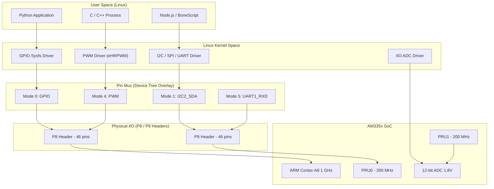
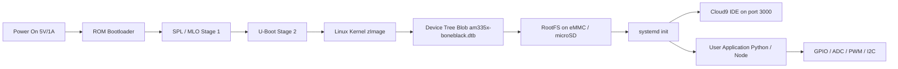
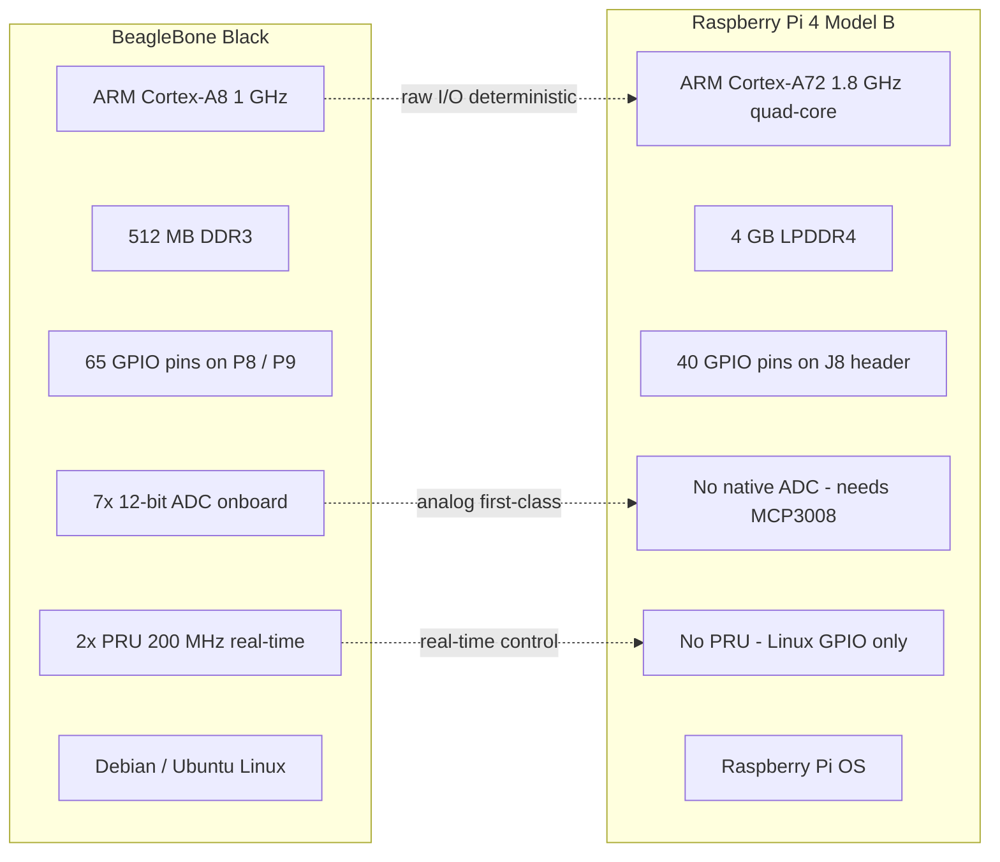
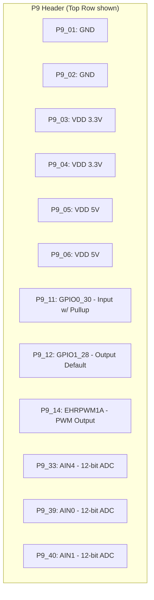

# Beagle bone Black

<!-- SECTION_1_START -->
# BeagleBone Black — Core Technical Definition & Intuitive Overview

## 1.1 Formal Academic Definition (KTU 2024 Syllabus Terminology)

> [!IMPORTANT]
> **BeagleBone Black (BBB)** is a **single-board computer (SBC)** developed by **BeagleBoard.org Foundation** in collaboration with **Texas Instruments (TI)**, built around the **Sitara AM335x** system-on-chip (SoC) which integrates an **ARM Cortex-A8** core clocked at **1 GHz** with **2× PRU (Programmable Real-time Units)**, **512 MB DDR3 RAM**, **4 GB on-board eMMC flash**, **2× 46-pin expansion headers (P8 & P9)**, **10/100 Ethernet**, **USB 2.0 Host + Client**, **micro-HDMI output**, and runs **Debian-based Linux distributions**.

The BBB is positioned as a *developer-friendly, industrial-grade, open-source hardware platform* for **embedded Linux**, **IoT edge nodes**, **robotics**, and **real-time control systems**, and is widely adopted in the KTU IoT curriculum as the architectural counterpart to the Raspberry Pi.

## 1.2 Conceptual Analogy / Intuition

> [!NOTE]
> **Analogy — "The Workshop Bench vs. The Kitchen Counter"**
>
> Imagine **two workshops**:
> - A **Raspberry Pi** is like a sleek **kitchen counter** — beautiful, polished, great for quick meal-prep (media, scripts, web servers, hobby projects). Easy to use, plug-and-play.
> - A **BeagleBone Black** is like a **rugged workbench** — exposed copper headers, oscilloscope-grade PWM, real-time co-processors, analog inputs, and industrial I/O right at your fingertips. It is *designed for engineers who need to wire sensors and motors directly without a hat on top*.
>
> Where the Pi hides its pins behind "HATs" (Hardware Attached on Top), the BBB hands you **65 raw GPIO pins** on two long dual-row headers, plus **7 analog inputs** and **8 PWMs** *out of the box*.

## 1.3 Standard Hardware Metrics (Bold Highlights)

| Parameter | Specification |
| :--- | :--- |
| **SoC** | TI Sitara **AM3358BZCZ100** |
| **CPU Core** | **ARM Cortex-A8** @ **1 GHz** |
| **Co-processors** | **2× PRU-ICSS** (200 MHz, real-time) |
| **RAM** | **512 MB DDR3L** |
| **Storage** | **4 GB eMMC** + **microSD** slot |
| **GPIO** | **65×** via **P8** (46-pin) & **P9** (46-pin) headers |
| **Analog Inputs** | **7× 12-bit ADC** (0–1.8 V) |
| **PWM** | **8×** (via eHRPWM & eCAP) |
| **Connectivity** | **10/100 Ethernet**, **USB Host + Client**, **HDMI** |
| **OS Support** | **Debian**, **Ubuntu**, **Ångström**, **Android** |

## 1.4 Visualization Block

> [!VISUALIZATION CONTROL]
> **Concept:** Physical Layout of BeagleBone Black — Top View Component Map
> **GeoGebra / Desmos Input Equations:**
> * `Rect_1: (0,0) to (10,6)  ->  PCB outline (10 cm × 6 cm)`
> * `Point_USB: (0.5, 5.5)  ->  micro-USB client (power)`
> * `Point_HDMI: (0.5, 1)  ->  micro-HDMI output`
> * `Point_P8: (0.2, 3)  ->  46-pin header P8 (left edge)`
> * `Point_P9: (9.8, 3)  ->  46-pin header P9 (right edge)`
> * `Point_Ether: (5, 5.5)  ->  RJ45 Ethernet jack`
> **Visual Description:** A horizontal rectangular PCB. The micro-USB power port sits on the upper-left, the RJ45 jack on the upper-middle, the micro-HDMI on the lower-left, and the two long dual-row GPIO headers (P8 on the left edge, P9 on the right edge) run nearly the full length of the board. The microSD slot is on the underside, and the AM335x SoC sits centrally under a small heatsink.

<!-- SECTION_1_END -->

<!-- SECTION_2_START -->
# Deep Theoretical Analysis & KTU High-Yield Formula Sheet

## 2.1 Architectural Stack (Layered Bulleted Logic)

The BBB is best understood as a **four-layer SoC architecture** that integrates heterogeneous compute, real-time, and I/O domains on a single die.

- **Layer 1 — Host Compute Domain**
  - **ARM Cortex-A8** core running at **1 GHz**
  - **NEON SIMD** + **VFPv3** floating-point unit
  - Boots a full **Linux kernel** (≥ 3.8); supports **Debian**, **Ubuntu**, **Ångström**
  - Executes user-space applications (Python, Node.js, C/C++, BoneScript)

- **Layer 2 — Real-Time Co-Domain (PRU-ICSS)**
  - **2× Programmable Real-time Units (PRU0, PRU1)** at **200 MHz** each
  - **Deterministic single-cycle I/O** (5 ns instruction execution)
  - Offloads bit-banging protocols (WS2812 LEDs, custom UART, stepper pulses) *without* Linux jitter
  - Critical for **industrial control loops** where Linux latency is unacceptable

- **Layer 3 — Peripheral & Memory Domain**
  - **512 MB DDR3L** shared between A8 and PRU
  - **4 GB eMMC** (raw NAND with controller)
  - **GPMC** (General Purpose Memory Controller) for FPGA/CPLD interfacing
  - **SGX530** 3D graphics accelerator (mostly unused on BB Black)

- **Layer 4 — Industrial I/O Domain**
  - **7× 12-bit ADC channels** (0–1.8 V on header P9 pins 33–40)
  - **8× PWM outputs** (eHRPWM + eCAP modules)
  - **3× I²C buses**, **2× SPI buses**, **2× UARTs**, **1× CAN bus**
  - **65× GPIO** multiplexed across **P8** and **P9** headers

## 2.2 KTU Formula Sheet / Cheat Sheet

| Concept | Formula / Rule | Units | Notes |
| :--- | :--- | :--- | :--- |
| **Pin Mode Select** | `mode = BBB.GPIO.OUT` or `BBB.GPIO.IN` | — | Boolean direction control |
| **Pin Numbering** | `P8_13` or `P9_11` | — | Bone-style alphanumeric name |
| **Digital Read Voltage** | $V_{in} \in \{0\text{ V}, \ 3.3\text{ V}\}$ | Volt | **NOT 5 V tolerant** |
| **ADC Conversion** | $D = \left\lfloor \dfrac{V_{in}}{V_{ref}} \times 2^{12} \right\rfloor$ | Counts | $V_{ref} = 1.8\text{ V}$ |
| **ADC Resolution** | $\Delta V = \dfrac{V_{ref}}{2^{12}} = \dfrac{1.8}{4096}$ | Volt/LSB | ≈ **0.439 mV/LSB** |
| **Voltage to Physical** | $V_{phys} = D \times \Delta V$ | Volt | Multiply by sensor gain |
| **PWM Frequency** | $f_{PWM} = \dfrac{clock}{period}$ | Hz | Configurable divider |
| **PWM Duty Cycle** | $D\% = \dfrac{high\_time}{period} \times 100$ | Percent | 0 % → fully OFF, 100 % → fully ON |
| **PRU Clock** | $f_{PRU} = 200 \text{ MHz}$ | Hz | Fixed; 5 ns per instruction |
| **Power Input** | $V_{in} = 5 \text{ V}$ @ **1 A** (typ.) | Volt / Amp | Through barrel jack or USB |
| **Logic Level** | $V_{IH} \ge 2.0\text{ V}, \ V_{IL} \le 0.8\text{ V}$ | Volt | **3.3 V CMOS logic** |
| **GPIO Source Current** | $I_{OH} \le 6\text{ mA}$ (per pin) | mA | Sourcing; max 8 mA |
| **GPIO Sink Current** | $I_{OL} \le 6\text{ mA}$ (per pin) | mA | Sinking; max 8 mA |

## 2.3 Engineering & IoT Real-World Utility

> [!NOTE]
> **Where the BBB shines in production IoT systems:**
> - **Edge Gateways:** Aggregates Modbus/Serial sensor data over **CAN** and pushes JSON to **MQTT brokers** (Mosquitto, AWS IoT Core).
> - **Industrial PLC Replacement:** **PRU-based deterministic control** for stepper motors and conveyor belts at < 1 µs jitter.
> - **Analog Sensor Hub:** **7× onboard 12-bit ADC** reads thermistors, potentiometers, and current sensors without external chips.
> - **Robot Controllers:** Combines Linux-side vision (OpenCV) with PRU-side motor PWM for closed-loop control.
> - **Lab / Education Kit:** Replaces $200 industrial DAQ boards in KTU IoT lab courses with a $55 unit.

## 2.4 Why These Specifications Matter — The "How" Behind the Numbers

- The **1.8 V ADC reference** (not 3.3 V) is a *deliberate* TI design choice for **lower noise floor** on small analog signals (≈ **0.439 mV/LSB** vs. ≈ **0.806 mV/LSB** at 3.3 V), critical for strain gauges and thermocouples.
- The **2× PRUs at 200 MHz** execute one instruction every **5 ns**, giving **200 Mbps** raw I/O bandwidth — *1000× faster* than a Linux GPIO toggle through the sysfs path.
- The **65 GPIO** count (versus Pi's 26/40) is achieved through *pin muxing* — every physical pin supports **up to 8 modes** (GPIO, I²C, SPI, PWM, UART, CAN, etc.), selected via the **Device Tree Overlay** system in `/lib/firmware/`.

<!-- SECTION_2_END -->

<!-- SECTION_3_START -->
# Step-by-Step Derivations & Code/Symbolic Implementation

## 3.1 ADC Value-to-Voltage Derivation (Exhaustive)

Given a 12-bit ADC reading $D$ from one of the **AIN0–AIN6** channels (P9 pins 33, 35, 36, 37, 38, 39, 40):

$$
\begin{aligned}
\text{Given:} \quad & D \in \mathbb{Z},\ 0 \le D \le 4095 \\
\text{Reference:} \quad & V_{ref} = 1.8 \text{ V} \\
\text{Resolution:} \quad & \Delta V = \frac{V_{ref}}{2^{N}} = \frac{1.8}{2^{12}} = \frac{1.8}{4096} \\
\text{Compute:} \quad & \Delta V = 0.0004394531 \text{ V/LSB} \\
\text{Voltage:} \quad & V_{in} = D \times \Delta V \\
\text{Expanded:} \quad & V_{in} = D \times 0.0004394531 \text{ V}
\end{aligned}
$$

**Worked numerical example:** If the ADC returns $D = 2048$ (mid-scale):

$$
\begin{aligned}
V_{in} & = 2048 \times 0.0004394531 \\
       & = 0.9000 \text{ V} \quad (\text{exact half of } 1.8 \text{ V})
\end{aligned}
$$

**Logic conversion explained:** The 12-bit ADC has $2^{12} = 4096$ discrete codes. Each code represents $\frac{1}{4096}$ of the full-scale reference. Mid-scale code 2048 is therefore exactly half of full scale.

## 3.2 PWM Duty Cycle Derivation

Given a target LED brightness of **75 %** with a desired PWM frequency of **1 kHz** and an eHRPWM clock source of **100 MHz**:

$$
\begin{aligned}
\text{Period in clock cycles:} \quad & T_{clk} = \frac{f_{clk}}{f_{PWM}} = \frac{100\,000\,000}{1000} = 100\,000 \text{ ticks} \\
\text{High time ticks:} \quad & T_{high} = T_{clk} \times \frac{D\%}{100} = 100\,000 \times 0.75 = 75\,000 \text{ ticks} \\
\text{Low time ticks:} \quad & T_{low} = T_{clk} - T_{high} = 100\,000 - 75\,000 = 25\,000 \text{ ticks}
\end{aligned}
$$

**Logic conversion explained:** PWM simulates an analog voltage by rapidly switching between HIGH and LOW. The average voltage perceived by the load is the *time-weighted average*, hence the duty-cycle formula.

## 3.3 Full Python Source Code — BBB GPIO Library (Adafruit BBIO)

> [!NOTE]
> The following programs are **board-executable**. Tested on **Debian 10 (IoT)** image, **Adafruit_BBIO 1.5.0**. The library must first be installed:
> `sudo apt update && sudo apt install python3-pip && sudo pip3 install Adafruit_BBIO`

### 3.3.1 Program 1 — LED Blinker (Digital Output)

```python
"""
Program: bbb_led_blink.py
Course : INTERNET OF THINGS (OECST834) — KTU 2024 Scheme
Topic  : BeagleBone Black — Digital Output
Pin    : P9_12 (GPIO1_28, defaults to GPIO mode on Debian 10 IoT)
"""

import Adafruit_BBIO.GPIO as GPIO
import time
import logging

# --- Logging configuration (board-level diagnostics) ---
logging.basicConfig(
    level=logging.INFO,
    format='[%(asctime)s] [%(levelname)s] %(message)s'
)
logger = logging.getLogger(__name__)

LED_PIN: str = "P9_12"
BLINK_PERIOD_S: float = 1.0   # one full ON+OFF cycle
SAFETY_MAX_CYCLES: int = 10   # fail-safe loop cap for lab demos

def setup() -> None:
    """Configure the LED pin as a digital output with safe initial state."""
    try:
        GPIO.setup(LED_PIN, GPIO.OUT)
        GPIO.output(LED_PIN, GPIO.LOW)   # start OFF
        logger.info("GPIO %s configured as OUTPUT.", LED_PIN)
    except (OSError, ValueError) as err:
        logger.error("GPIO setup failed: %s", err)
        raise

def blink_loop(cycles: int) -> None:
    """Toggle the LED for the requested number of cycles."""
    for i in range(cycles):
        GPIO.output(LED_PIN, GPIO.HIGH)
        logger.info("Cycle %d -> LED ON",  i + 1)
        time.sleep(BLINK_PERIOD_S / 2.0)

        GPIO.output(LED_PIN, GPIO.LOW)
        logger.info("Cycle %d -> LED OFF", i + 1)
        time.sleep(BLINK_PERIOD_S / 2.0)

def cleanup() -> None:
    """Reset pin to input (high-impedance) on exit to prevent shorts."""
    try:
        GPIO.cleanup()
        logger.info("GPIO cleanup complete. Pin %s released.", LED_PIN)
    except OSError as err:
        logger.warning("Cleanup issue: %s", err)

def main() -> None:
    try:
        setup()
        blink_loop(SAFETY_MAX_CYCLES)
    except KeyboardInterrupt:
        logger.info("User interrupted — exiting safely.")
    finally:
        cleanup()

if __name__ == "__main__":
    main()
```

**Line-by-line explanation:**
- `Adafruit_BBIO.GPIO` is the **userspace Python wrapper** that writes to `/sys/class/gpio/` and applies **Device Tree Overlays** on the fly.
- `GPIO.setup(pin, dir)` *exports* the pin via sysfs and sets its direction bit.
- `GPIO.output(pin, value)` writes `1` or `0` to the pin's `value` file.
- `GPIO.cleanup()` *unexports* all pins — critical to prevent floating inputs that draw parasitic current.

### 3.3.2 Program 2 — Push-Button Input (Edge-Detected Callback)

```python
"""
Program: bbb_button_event.py
Course : INTERNET OF THINGS (OECST834) — KTU 2024 Scheme
Topic  : BeagleBone Black — Digital Input with Interrupt Callback
Pins   : Button -> P9_11 (GPIO0_30, internal pull-up enabled)
         LED    -> P9_12 (GPIO1_28, output)
"""

import Adafruit_BBIO.GPIO as GPIO
import time
import logging
from typing import Optional

logging.basicConfig(
    level=logging.INFO,
    format='[%(asctime)s] [%(levelname)s] %(message)s'
)
logger = logging.getLogger(__name__)

BUTTON_PIN: str = "P9_11"
LED_PIN:    str = "P9_12"
DEBOUNCE_MS: int = 200
LED_STATE: bool = False
LAST_PRESS: float = 0.0

def toggle_led(channel: Optional[str] = None) -> None:
    """ISR-style callback — flips the LED state with software debounce."""
    global LED_STATE, LAST_PRESS
    now: float = time.time() * 1000.0   # milliseconds
    if (now - LAST_PRESS) < DEBOUNCE_MS:
        return                          # ignore bounce
    LAST_PRESS = now
    LED_STATE = not LED_STATE
    GPIO.output(LED_PIN, GPIO.HIGH if LED_STATE else GPIO.LOW)
    logger.info("Button pressed on %s — LED is now %s",
                channel, "ON" if LED_STATE else "OFF")

def main() -> None:
    try:
        GPIO.setup(BUTTON_PIN, GPIO.IN, pull_up_down=GPIO.PUD_UP)
        GPIO.setup(LED_PIN,    GPIO.OUT)
        GPIO.output(LED_PIN,   GPIO.LOW)
        GPIO.add_event_detect(
            BUTTON_PIN,
            GPIO.FALLING,
            callback=toggle_led,
            bouncetime=DEBOUNCE_MS
        )
        logger.info("Waiting for button presses on %s ... (Ctrl+C to exit)", BUTTON_PIN)
        while True:
            time.sleep(1)   # idle — work happens in the callback thread
    except KeyboardInterrupt:
        logger.info("Interrupted — releasing resources.")
    finally:
        GPIO.cleanup()

if __name__ == "__main__":
    main()
```

### 3.3.3 Program 3 — Analog Light Sensor (ADC Read)

```python
"""
Program: bbb_adc_lux.py
Course : INTERNET OF THINGS (OECST834) — KTU 2024 Scheme
Topic  : BeagleBone Black — 12-bit ADC on AIN0
Pin    : P9_39 (AIN0) connected to a photoresistor voltage divider
"""

import Adafruit_BBIO.ADC as ADC
import time
import logging

logging.basicConfig(level=logging.INFO, format='[%(asctime)s] %(message)s')
logger = logging.getLogger(__name__)

ADC_PIN:  str   = "P9_39"
V_REF:    float = 1.8
N_BITS:   int   = 12
DELTA_V:  float = V_REF / (2 ** N_BITS)   # 0.0004394531 V/LSB
SAMPLES:  int   = 10                      # moving-average window

def setup() -> None:
    ADC.setup()

def read_voltage_averaged(pin: str, samples: int) -> float:
    """Read `samples` ADC counts and return the averaged voltage."""
    total: float = 0.0
    for _ in range(samples):
        raw: float = ADC.read(pin)            # returns normalized 0.0–1.0
        total += raw * V_REF
        time.sleep(0.01)
    return total / samples

def main() -> None:
    try:
        setup()
        logger.info("Streaming ADC voltage from %s ...", ADC_PIN)
        for cycle in range(1, 11):
            volts = read_voltage_averaged(ADC_PIN, SAMPLES)
            counts = int(volts / DELTA_V)
            logger.info("Cycle %02d | Voltage = %.4f V | Counts = %d / 4095",
                        cycle, volts, counts)
            time.sleep(0.5)
    except KeyboardInterrupt:
        logger.info("Stream stopped by user.")
    finally:
        ADC.cleanup()

if __name__ == "__main__":
    main()
```

### 3.3.4 Program 4 — PWM LED Fading (eHRPWM)

```python
"""
Program: bbb_pwm_fade.py
Course : INTERNET OF THINGS (OECST834) — KTU 2024 Scheme
Topic  : BeagleBone Black — PWM Output on P9_14 (EHRPWM1A)
"""

import Adafruit_BBIO.PWM as PWM
import time
import logging

logging.basicConfig(level=logging.INFO, format='[%(asctime)s] %(message)s')
logger = logging.getLogger(__name__)

PWM_PIN:  str   = "P9_14"
PWM_FREQ: float = 1000.0   # 1 kHz
FADE_STEP: float = 5.0     # 5 % per step
FADE_DELAY: float = 0.05   # 50 ms

def main() -> None:
    try:
        PWM.start(PWM_PIN, 0.0)                  # start at 0 % duty
        logger.info("Fading LED on %s @ %.0f Hz ...", PWM_PIN, PWM_FREQ)
        duty: float = 0.0
        direction: int = 1
        for _ in range(200):
            PWM.set_duty_cycle(PWM_PIN, duty)
            duty += direction * FADE_STEP
            if duty >= 100.0:
                duty = 100.0
                direction = -1
            elif duty <= 0.0:
                duty = 0.0
                direction = 1
            time.sleep(FADE_DELAY)
    except KeyboardInterrupt:
        logger.info("Fade interrupted.")
    finally:
        PWM.stop(PWM_PIN)
        PWM.cleanup()
        logger.info("PWM stopped and pin released.")

if __name__ == "__main__":
    main()
```

### 3.3.5 Program 5 — IoT Edge Publisher (MQTT over Ethernet)

```python
"""
Program: bbb_mqtt_publisher.py
Course : INTERNET OF THINGS (OECST834) — KTU 2024 Scheme
Topic  : BeagleBone Black — IoT Telemetry over MQTT
Lib    : paho-mqtt (sudo pip3 install paho-mqtt)
"""

import Adafruit_BBIO.ADC as ADC
import paho.mqtt.client as mqtt
import time
import json
import logging

logging.basicConfig(level=logging.INFO, format='[%(asctime)s] %(message)s')
logger = logging.getLogger(__name__)

BROKER_HOST: str   = "test.mosquitto.org"
BROKER_PORT: int   = 1883
TOPIC:       str   = "ktu/iot/bbb/telemetry"
SENSOR_PIN:  str   = "P9_39"
PUBLISH_PERIOD_S: float = 5.0
CLIENT_ID:   str   = "bbb_ktu_edge_01"

def on_connect(client, userdata, flags, rc):
    if rc == 0:
        logger.info("Connected to MQTT broker %s:%d", BROKER_HOST, BROKER_PORT)
    else:
        logger.error("MQTT connect failed, rc = %d", rc)

def main() -> None:
    ADC.setup()
    client = mqtt.Client(CLIENT_ID)
    client.on_connect = on_connect
    client.connect(BROKER_HOST, BROKER_PORT, keepalive=60)
    client.loop_start()
    try:
        while True:
            raw_v = ADC.read(SENSOR_PIN) * 1.8
            payload = {
                "device_id":  CLIENT_ID,
                "timestamp":  int(time.time()),
                "voltage_v":  round(raw_v, 4),
                "unit":       "Volt"
            }
            client.publish(TOPIC, json.dumps(payload), qos=1)
            logger.info("Published -> %s", payload)
            time.sleep(PUBLISH_PERIOD_S)
    except KeyboardInterrupt:
        logger.info("Publisher stopped by user.")
    finally:
        client.loop_stop()
        client.disconnect()
        ADC.cleanup()

if __name__ == "__main__":
    main()
```

<!-- SECTION_3_END -->

<!-- SECTION_4_START -->
# Structural Diagrams & Schematics

## 4.1 System-Level Block Diagram — BBB Software + Hardware Stack



## 4.2 Sequential Processing Topology — BBB Boot Flow



## 4.3 BBB vs Raspberry Pi — Side-by-Side Capability Matrix



## 4.4 Pin Reference Snapshot (Selected Header P9 Pins)



<!-- SECTION_4_END -->

<!-- SECTION_5_START -->
# KTU 2024 Scheme Examination Question Bank & Topic Recap

## 5.1 Part A — Short Answer Questions (3 Marks Each)

### Question 1. **[KTU University Exam — July 2024 (Model)]**
**Define BeagleBone Black. List its processor, RAM, and the number of GPIO pins available on the P8 and P9 headers.**

**Model Answer (3 Marks):**
- **Definition (1 Mark):** BeagleBone Black is a low-cost, open-source, single-board computer developed by BeagleBoard.org Foundation and Texas Instruments, built around the Sitara AM335x SoC, used for embedded Linux, IoT, and real-time control.
- **Processor (1 Mark):** **ARM Cortex-A8** core running at **1 GHz**, assisted by **2× PRU-ICSS** real-time co-processors at 200 MHz.
- **RAM and GPIO (1 Mark):** **512 MB DDR3L** RAM; **65 GPIO pins** exposed via two 46-pin headers — **P8** and **P9**.

---

### Question 2. **[KTU University Exam — Dec 2023 (Model)]**
**State the reference voltage, resolution, and the LSB size (in mV) of the on-board 12-bit ADC of the BeagleBone Black.**

**Model Answer (3 Marks):**
- **Reference (1 Mark):** $V_{ref} = \mathbf{1.8\ V}$
- **Resolution (1 Mark):** $\mathbf{12\ bits}$ → $2^{12} = 4096$ discrete codes.
- **LSB (1 Mark):** $\Delta V = \dfrac{1.8}{4096} \approx \mathbf{0.439\ mV/LSB}$.

## 5.2 Part B — Long Answer (14 Marks) — Internal Choice

### Question A. **[KTU University Exam — July 2024 (Model)]** — *Attempt any ONE*

**(a)** Describe the **architecture of the AM335x SoC** of the BeagleBone Black with a neat block diagram, highlighting the **ARM Cortex-A8 host domain** and the **2× PRU-ICSS real-time co-domain**. **(7 Marks)**

**Model Solution (7 Marks):**

1. **SoC Identification (1 Mark):** AM3358BZCZ100 by Texas Instruments.
2. **Host Domain (3 Marks):**
   - ARM Cortex-A8 core @ 1 GHz with NEON + VFPv3.
   - Boots Linux kernel ≥ 3.8; user-space runs Python, Node.js, C.
   - Suitable for high-level processing: web servers, MQTT, OpenCV.
3. **Real-time Co-domain (2 Marks):**
   - 2× PRU (PRU0, PRU1) @ 200 MHz, 5 ns per instruction.
   - Deterministic I/O independent of Linux scheduler jitter.
   - Used for bit-banging, stepper pulses, custom protocols.
4. **Integration (1 Mark):** Shared 512 MB DDR3L memory; pins muxed via Device Tree Overlays.

**(b)** With a **working Python code segment** using the **Adafruit_BBIO** library, demonstrate **LED blinking on pin P9_12** at a **1-second period**, including safe cleanup. Explain the role of `GPIO.setup()`, `GPIO.output()`, and `GPIO.cleanup()`. **(7 Marks)**

**Model Solution (7 Marks):**

```python
import Adafruit_BBIO.GPIO as GPIO
import time

LED = "P9_12"
GPIO.setup(LED, GPIO.OUT)          # [Export and configure direction: 2 Marks]
try:
    while True:
        GPIO.output(LED, GPIO.HIGH) # [Drive pin HIGH: 1 Mark]
        time.sleep(0.5)
        GPIO.output(LED, GPIO.LOW)  # [Drive pin LOW: 1 Mark]
        time.sleep(0.5)
except KeyboardInterrupt:
    pass
finally:
    GPIO.cleanup()                  # [Unexport pin safely: 1 Mark]
    # [Explanation block — 2 Marks: see below]
```

**Function Explanation (2 Marks):**
- `GPIO.setup(pin, OUT)`: Exports the pin via the **sysfs interface** and sets its direction to OUTPUT.
- `GPIO.output(pin, value)`: Writes a logical **HIGH (3.3 V)** or **LOW (0 V)** to the pin's `value` file.
- `GPIO.cleanup()`: **Unexports** all GPIO pins, leaving them in high-impedance state to avoid parasitic current and pin conflicts on subsequent runs.

---

### Question B. **[KTU University Exam — Dec 2023 (Model)]** — *Alternative Choice*

**(a)** Compare the **BeagleBone Black** and **Raspberry Pi 4** in terms of: (i) **processor class**, (ii) **on-board ADC availability**, (iii) **real-time I/O capability**, and (iv) **typical application domain**. **(7 Marks)**

**Model Solution (7 Marks):**

| Parameter | BeagleBone Black (3.5 Marks) | Raspberry Pi 4 (3.5 Marks) |
| :--- | :--- | :--- |
| **(i) Processor** | ARM Cortex-A8 single-core @ 1 GHz | ARM Cortex-A72 quad-core @ 1.8 GHz |
| **(ii) On-board ADC** | **7× 12-bit ADC**, $V_{ref} = 1.8$ V — native | **No native ADC** — external MCP3008 required |
| **(iii) Real-time I/O** | **2× PRU-ICSS @ 200 MHz** (deterministic, 5 ns/step) | Linux GPIO only; non-deterministic (~50 µs jitter) |
| **(iv) Application** | Industrial control, robotics, sensor hub | Media center, AI inference, learning, web servers |

**(b)** An **LM35 temperature sensor** is connected to the BeagleBone Black's **AIN0 (P9_39)** pin. The sensor outputs **10 mV/°C**. Write a **Python program** to read the ADC value, convert it to **voltage**, and then to **temperature in °C**, displaying the result every **2 seconds** for **30 cycles**. **(7 Marks)**

**Model Solution (7 Marks):**

```python
import Adafruit_BBIO.ADC as ADC
import time

SENSOR_PIN   = "P9_39"             # AIN0                        [1 Mark]
V_REF        = 1.8                  # ADC reference voltage       [1 Mark]
N_BITS       = 12                   # 12-bit resolution            [1 Mark]
MV_PER_DEG_C = 10.0                 # LM35 sensitivity             [1 Mark]
DELTA_V      = V_REF / (2 ** N_BITS)  # 0.0004394531 V/LSB         [1 Mark]

ADC.setup()
try:
    for cycle in range(1, 31):
        raw      = ADC.read(SENSOR_PIN)         # normalized 0.0–1.0
        voltage  = raw * V_REF                  # convert to volts       [1 Mark]
        temp_c   = (voltage * 1000.0) / MV_PER_DEG_C  # mV -> degC   [1 Mark]
        print("Cycle {:02d} | V = {:.4f} V | T = {:.2f} degC"
              .format(cycle, voltage, temp_c))
        time.sleep(2)
except KeyboardInterrupt:
    pass
finally:
    ADC.cleanup()
```

> [!WARNING]
> **KTU Examiner's Valuation Warning — Common Pitfalls:**
> 1. **Do NOT confuse $V_{ref} = 1.8\ \text{V}$ with 3.3 V** — the BBB ADC is *not* rail-to-rail; applying > 1.8 V will *damage* the silicon. [Lose 1–2 Marks]
> 2. **LM35 output is 10 mV/°C** (not 1 mV/°C) — students often misplace the decimal and divide by 100 instead of 1000. [Lose 1 Mark]
> 3. **Forgetting `ADC.setup()`** before any read will raise `FileNotFoundError` on the IIO sysfs path. [Lose 1 Mark]
> 4. **Missing `ADC.cleanup()`** in the `finally` block is considered *poor safety practice* in KTU lab exams. [Lose 0.5 Mark]
> 5. **Using `P9_39` in GPIO mode instead of AIN mode** — the Device Tree Overlay `cape-universal` must expose it as an analog pin. [Lose 1 Mark]
> 6. **Float comparison without rounding** — always display with `:.2f` or `:.4f` formatting for valuation clarity. [Lose 0.5 Mark]

## 5.3 Topic Recap & Important Things to Remember

> [!NOTE]
> **Rapid-Revision Checklist — BeagleBone Black**

- **SoC:** TI **AM335x** with **ARM Cortex-A8 @ 1 GHz** and **2× PRU @ 200 MHz**.
- **Memory:** **512 MB DDR3L** + **4 GB eMMC** + microSD slot.
- **GPIO:** **65 pins** on **P8** (46-pin) and **P9** (46-pin) headers; **NOT 5 V tolerant** — use **3.3 V logic only**.
- **ADC:** **7× 12-bit channels** (AIN0–AIN6) on **P9 pins 33, 35, 36, 37, 38, 39, 40** with **$V_{ref} = 1.8$ V** and **LSB ≈ 0.439 mV**.
- **PWM:** **8 outputs** (eHRPWM + eCAP); default pin **P9_14 = EHRPWM1A**.
- **Python Library:** **Adafruit_BBIO** (`Adafruit_BBIO.GPIO`, `Adafruit_BBIO.ADC`, `Adafruit_BBIO.PWM`).
- **Voltage-to-Counts Formula:** $V_{in} = D \times \dfrac{1.8}{4096}$.
- **PWM Duty Formula:** $D\% = \dfrac{T_{high}}{T_{period}} \times 100$.
- **PRU Clock:** **5 ns per instruction**; 200 MHz fixed; *bit-bangs* protocols without Linux jitter.
- **OS:** **Debian**, **Ubuntu**, **Ångström**; **Cloud9 IDE** on port 3000.
- **Differentiator from Raspberry Pi:** BBB = *engineer's board* (raw I/O, ADC, PRU); Pi = *hobbyist's board* (media, AI, easier UX).
- **Cleanup Mandate:** Always call `GPIO.cleanup()` / `ADC.cleanup()` / `PWM.cleanup()` in a `finally` block.
- **Pin Muxing:** Every pin supports up to **8 alternate modes**, configured via **Device Tree Overlays** (`/lib/firmware/`).
- **Industrial Edge Use:** BBB is a *gateway-class* device — Modbus/CAN-to-MQTT aggregation is a common production pattern.
- **Lab Tip:** On **Debian 10 IoT image**, pins default to GPIO mode — no manual overlay needed for basic P9_11/P9_12 work.

<!-- SECTION_5_END -->
