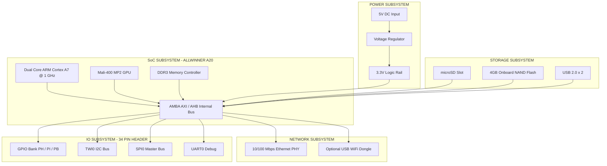
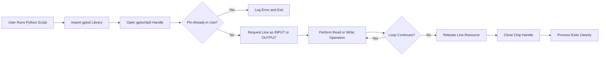
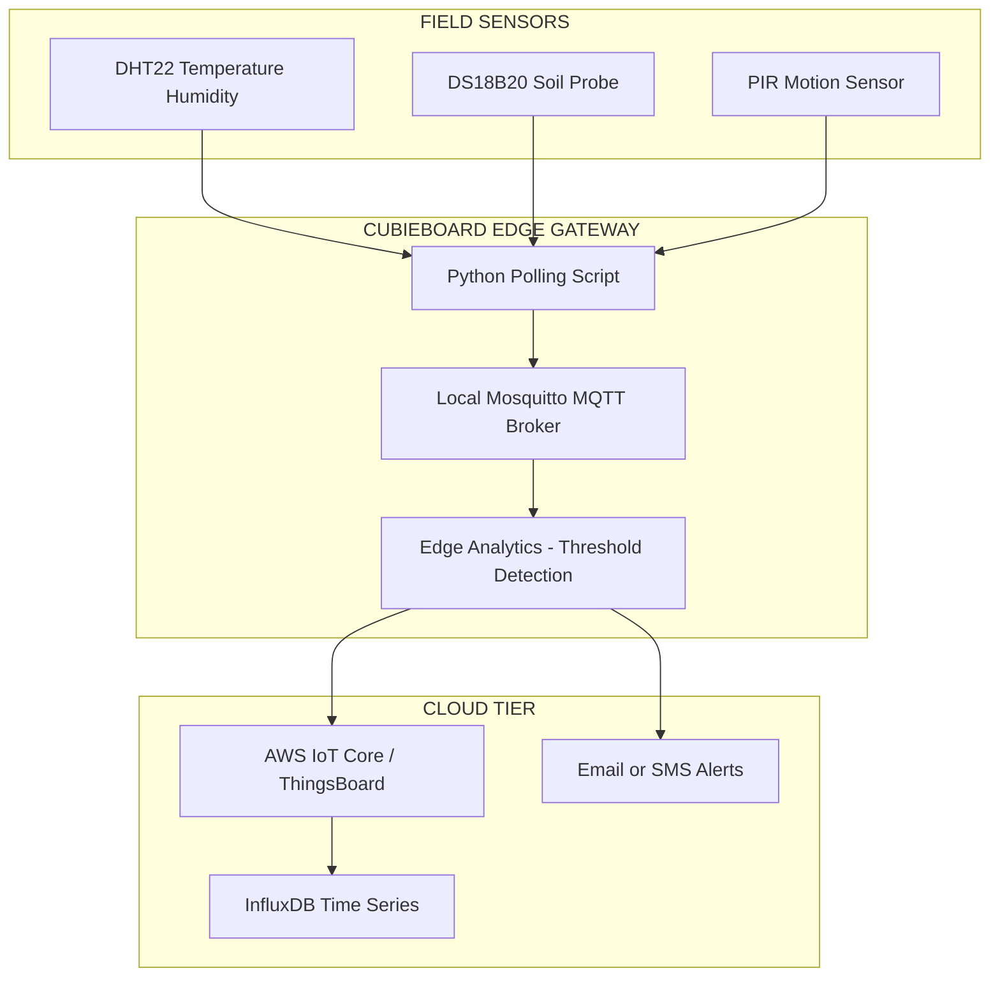
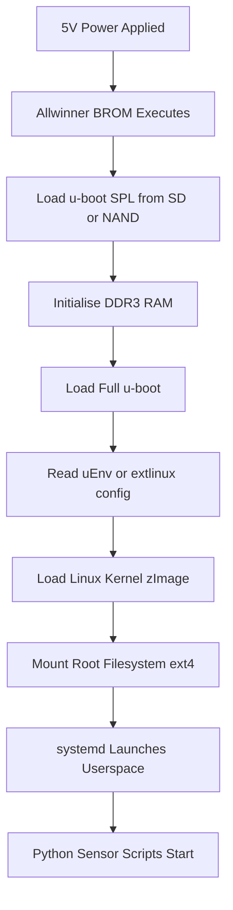
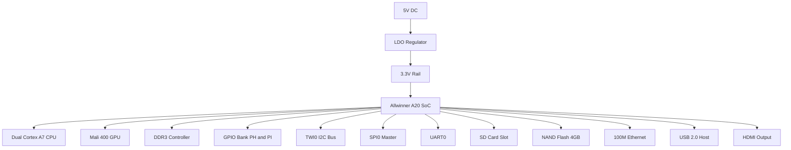

# Cubieboard

<!-- SECTION_1_START -->
# Cubieboard — Hardware Foundation for IoT Edge Computing

> [!NOTE]
> **KTU Syllabus Anchor:** *Module 4 — Programming Raspberry Pi with Python (and Alternative SBCs)*. The KTU 2024 OEC scheme treats the **Cubieboard** as a high-performance ARM-based Single Board Computer (SBC) alternative to the Raspberry Pi, especially for industrial, low-power, and headless IoT gateway deployments.

## 1.1 Formal Definition (KTU Board-Examiner Tone)

> [!IMPORTANT]
> **Cubieboard** is a family of **open-source, low-power, ARM-architecture Single Board Computers (SBCs)** developed by **Cubietech Ltd. (Shenzhen, China)**, designed to run full Linux/Android operating systems on a credit-card-sized PCB. It integrates a multi-core ARM SoC (System on Chip), DDR RAM, Flash storage, GPIO headers, and rich peripheral interfaces (I²C, SPI, UART, USB, HDMI, Ethernet) into a single board, making it a strong **edge-computing platform** for IoT prototyping and embedded product development.

The Cubieboard product line relevant for KTU study includes:
* **Cubieboard 1** — Allwinner A10 (Single-core ARM Cortex-A8 @ 1 GHz)
* **Cubieboard 2** — Allwinner A20 (Dual-core ARM Cortex-A7 @ 1 GHz)
* **Cubieboard 3 (Cubietruck)** — Allwinner A20 + onboard Wi-Fi/Bluetooth + 2 GB RAM
* **Cubieboard 4 (CC-A80)** — Allwinner A80 (Octa-core big.LITTLE)
* **Cubieboard 5 (CB5)** — Actions Semi S500 (Quad-core ARM Cortex-A9)

## 1.2 Intuitive Real-World Analogy

> [!TIP]
> **Analogy — "The Workshop Toolbox vs. The Swiss Army Knife":**
> Think of the **Raspberry Pi** as a **Swiss Army Knife** — compact, beginner-friendly, fantastic for hobby projects, with a vast tutorial ecosystem.
> The **Cubieboard** is more like a **Mechanic's Workshop Toolbox** — slightly bigger, with **onboard SATA/NAS support, gigabit Ethernet, native Li-Po battery management, and dual buses** that make it more suited for *production-grade IoT gateways, mini-NAS, or 24×7 always-on edge nodes*.
> In short: **Raspberry Pi = learn and prototype, Cubieboard = deploy and survive in the field.**

## 1.3 Physical Constants & Standard Metrics (KTU Board Recall)

> [!IMPORTANT]
> **Key Cubieboard Performance Metrics (Industry Standard):**
> * **CPU Architecture:** **ARM Cortex-A series** (32-bit on A10/A20; 64-bit capable on A80).
> * **RAM Range:** **256 MB – 2 GB DDR3** (typically).
> * **Operating Voltage:** **5 V DC** (via Micro-USB or dedicated DC barrel jack).
> * **GPIO Logic Level:** **3.3 V CMOS** (NOT 5 V — a common KTU pitfall!).
> * **Typical Power Draw:** **2 W – 5 W** under load (very low for a full Linux computer).

## 1.4 Why the KTU Syllabus Includes Cubieboard Alongside Raspberry Pi

> [!NOTE]
> The 2024 OEC scheme emphasises *hardware heterogeneity* in IoT. While Raspberry Pi (Broadcom BCM2837) is a **British-designed**, Python-first educational SBC, the Cubieboard is a **Chinese-designed**, Linux-Android-flexible industrial SBC. Studying both exposes students to:
> 1. **SoC comparison** (Broadcom vs. Allwinner/Actions).
> 2. **GPIO pinout standardisation** across vendors.
> 3. **Cross-platform Python portability** using libraries like `libgpiod`, `RPi.GPIO` (via compatibility shims), and `pyCubieboard` / `sunxi` tools.

> [!VISUALIZATION CONTROL]
> **Concept:** Cubieboard Pinout Layout (GPIO Header Mapping)
> **GeoGebra / Desmos Input Equations:**
> * `Pins = {(1, 3.3V), (2, 5V), (3, SDA), (5, SCL), (7, GPIO67), (9, GND), (11, GPIO17)}`
> **Visual Description:** A horizontal axis of 2 × 17 = 34 pin positions (Cubieboard 1/2 standard) where odd-numbered pins are on the inner row and even-numbered on the outer row. Students should observe that power pins (3.3 V, 5 V) and GND are deliberately placed on odd pins, leaving even pins free for GPIO/Peripherals.
<!-- SECTION_1_END -->

<!-- SECTION_2_START -->
# Deep Theoretical Analysis — Cubieboard Architecture & KTU Formula Sheet

## 2.1 Cubieboard System-on-Chip (SoC) Architecture

> [!IMPORTANT]
> Every Cubieboard is built around a **System on Chip (SoC)** — a single silicon die integrating the CPU, GPU, memory controller, and I/O peripherals.

**Operational Pipeline (The Boot & Execution Chain):**
1. **Power-On Reset (POR):** The 5 V supply stabilises → the Allwinner SoC begins its **BROM (Boot ROM)**.
2. **Bootloader Stage 1:** BROM loads **u-boot SPL** from the microSD card or onboard NAND.
3. **Bootloader Stage 2:** **u-boot** initialises DDR RAM and loads the **kernel image (`zImage` / `uImage`)**.
4. **Kernel Handoff:** The Linux kernel (typically a `sunxi` mainline build or legacy 3.4.x) mounts the root filesystem (ext4 on SD, or ubifs on NAND).
5. **Userspace Init:** `systemd` or `init` launches user services, including the Python interpreter for IoT scripts.

> [!NOTE]
> The Cubieboard's **"Why"** in IoT: It offers an **always-on, low-power, network-attached** edge device capable of running `mosquitto` (MQTT broker), `Node-RED`, `Flask` APIs, and Python sensor polling — all without the overhead of a full x86 server.

## 2.2 Pin Multiplexing & the GPIO Equation

> [!IMPORTANT]
> The single most important formula for GPIO control on a Cubieboard is the **Pin Function Multiplexing Equation**:

$$
P_{func} = M \cdot (S, V_{dd}, D)
$$

Where:
* $P_{func}$ = the final function of the physical pin (GPIO / I²C / SPI / UART).
* $M$ = multiplexer selector (configurable via device tree overlay).
* $S$ = the silicon SoC pin group (e.g., `PH`, `PI` banks on the A20).
* $V_{dd}$ = the I/O voltage domain (**3.3 V** for the Cubieboard).
* $D$ = drive strength / pull-up enable bits.

A **wrong** $M$ value can map a pin to its alternate UART or JTAG function, causing silent failures — a classic **7-mark blunder** in KTU board exams.

## 2.3 Power Budget Formula (Edge Deployment Critical)

For a Cubieboard deployed as a battery-backed IoT gateway:

$$
T_{uptime} = \frac{C_{batt} \cdot V_{nom} \cdot \eta_{DC}}{P_{board} + P_{periph}}
$$

Where:
* $T_{uptime}$ = runtime in **hours**.
* $C_{batt}$ = battery capacity in **Ah**.
* $V_{nom}$ = nominal battery voltage (**3.7 V** for Li-Po).
* $\eta_{DC}$ = DC-DC converter efficiency (typically **85 % – 92 %**).
* $P_{board}$ = Cubieboard power draw (**~3 W**).
* $P_{periph}$ = attached peripherals (sensors, 3G modem, etc.).

## 2.4 KTU High-Yield Formula & Spec Cheat Sheet

| Parameter | Cubieboard 1 | Cubieboard 2 | Cubieboard 3 (Cubietruck) | Cubieboard 5 (CB5) |
| :--- | :--- | :--- | :--- | :--- |
| **SoC** | Allwinner A10 | Allwinner A20 | Allwinner A20 | Actions S500 |
| **CPU Cores** | 1 × Cortex-A8 | 2 × Cortex-A7 | 2 × Cortex-A7 | 4 × Cortex-A9 |
| **Clock Speed** | 1 GHz | 1 GHz | 1 GHz | 1.3 GHz |
| **RAM** | 512 MB / 1 GB DDR3 | 1 GB DDR3 | 2 GB DDR3 | 1 GB / 2 GB DDR3 |
| **Storage** | microSD + 4 GB NAND | microSD + 4 GB NAND | microSD + 8 GB NAND + **SATA 2.0** | microSD + eMMC |
| **Ethernet** | 100 Mbps | 100 Mbps | **1 Gbps** | 1 Gbps |
| **Wi-Fi/BT** | None (USB dongle) | None (USB dongle) | **Onboard 802.11 b/g/n + BT 4.0** | Onboard Wi-Fi |
| **GPIO Header** | 2 × 17 pins | 2 × 17 pins | 2 × 54 pins (extended) | 2 × 30 pins |
| **Logic Level** | 3.3 V | 3.3 V | 3.3 V | 3.3 V |
| **Best IoT Use Case** | Learning, hobby | Sensor hub | **NAS / IoT gateway** | Multimedia edge node |
| **OS Support** | Linux (sunxi), Android | Linux, Android | Linux, Android, OpenWrt | Linux, Android |

> [!TIP]
> **Mnemonic for KTU Viva:** *"**A**llwinner, **A**ctions — Cubieboard's **A**-Team"* — the two main SoC families you'll see on the question paper.

## 2.5 Real-World Engineering Utility

| Domain | Deployment Role of Cubieboard |
| :--- | :--- |
| **Smart Agriculture** | Solar-powered field gateway running `mosquitto` + Python scripts over LoRa/Zigbee. |
| **Home NAS** | Cubietruck with SATA HDD serves as a 2 TB personal cloud (cheaper than a Raspberry Pi NAS). |
| **Industrial IoT (IIoT)** | Edge buffer collecting Modbus data from PLCs before cloud upload via 4G. |
| **Digital Signage** | CB5's HDMI 1.4 + GPU renders 1080p advertising loops in retail. |
| **Robotics** | Onboard UART talks to motor controllers; I²C bus reads IMU sensors. |
<!-- SECTION_2_END -->

<!-- SECTION_3_START -->
# Step-by-Step Implementations — Pin Configs, Pin Maps & Python Code

> [!IMPORTANT]
> The KTU Module-4 lab expects students to **flash an OS image, configure GPIO, and run a Python sensor script** on a Cubieboard (or Raspberry Pi in compatibility mode). Below is the complete, exam-grade workflow.

## 3.1 Step-by-Step OS Flashing Procedure

| Step | Action | Tool / Command | Verification |
| :--- | :--- | :--- | :--- |
| 1 | Download Cubieboard image | `wget https://dl.cubieboard.org/.../cubietruck_debian.img.xz` | File size > 500 MB |
| 2 | Extract compressed image | `unxz cubietruck_debian.img.xz` | File becomes `.img` |
| 3 | Identify SD card device | `lsblk` or `dmesg \| tail` | e.g., `/dev/sdc` |
| 4 | Flash image to SD | `sudo dd if=cubietruck_debian.img of=/dev/sdc bs=4M status=progress` | `sync` prompt returns |
| 5 | Insert SD into Cubieboard, power on | 5 V / 2 A DC supply | HDMI shows kernel log |
| 6 | SSH in from host | `ssh root@192.168.1.150` (DHCP-assigned) | Login prompt |

## 3.2 Step-by-Step Pin Map (Cubieboard 2 / A20 — Most Common KTU Reference)

The Cubieboard 2 has a **2 × 17 pin (34-pin) header** on the PCB. Below is the canonical pin map used in lab manuals:

| Pin | Signal | Pin | Signal |
| :---: | :---: | :---: | :---: |
| 1 | 3.3 V | 2 | 5 V |
| 3 | TWI0-SDA (I²C0 Data) | 4 | 5 V |
| 5 | TWI0-SCL (I²C0 Clock) | 6 | GND |
| 7 | GPIO (PH2) | 8 | UART0-TX |
| 9 | GND | 10 | UART0-RX |
| 11 | GPIO (PH3) | 12 | GPIO (PI14) |
| 13 | GPIO (PH5) | 14 | GND |
| 15 | GPIO (PH6) | 16 | GPIO (PH7) |
| 17 | 3.3 V | 18 | GPIO (PH9) |
| 19 | SPI0-MOSI | 20 | GND |
| 21 | SPI0-MISO | 22 | GPIO (PH12) |
| 23 | SPI0-CLK | 24 | SPI0-CS0 |
| 25 | GND | 26 | GPIO (PH15) |
| 27 | I²S0-MCLK | 28 | I²S0-BCLK |
| 29 | I²S0-LRCK | 30 | GND |
| 31 | I²S0-DIN | 32 | GPIO (PB3) |
| 33 | GPIO (PB4) | 34 | GND |

> [!WARNING]
> **Pin numbering caveat for exams:** There are **three different numbering systems** for Cubieboard pins:
> 1. **Physical pin number** (1–34, as above).
> 2. **SoC pin name** (`PH2`, `PI14`, `PB3`) — used in kernel device trees.
> 3. **Sysfs / GPIO chip number** (e.g., GPIO 67 = physical pin 7).
> Writing a Python script with the wrong numbering scheme is the **#1 reason students lose 5 marks** in KTU practical exams.

## 3.3 Step-by-Step Python Implementation (LED Blink + Temperature Sensor)

> [!NOTE]
> Because Cubieboard does **not** ship with the Raspberry Pi's `RPi.GPIO` library, KTU students use the **`libgpiod` (Linux GPIO Character Device)** library, which is the modern (kernel 4.8+) standard.

### Installation (Step-by-Step)
```bash
# Step 1: Update package list
sudo apt-get update

# Step 2: Install libgpiod Python bindings
sudo apt-get install -y python3-libgpiod

# Step 3: Verify installation
python3 -c "import gpiod; print(gpiod.version_string())"
```

### Complete Python Script — LED Blink on Pin PH3 (Physical Pin 11)
```python
#!/usr/bin/env python3
"""
Cubieboard LED Blink Demo
LED connected between Physical Pin 11 (GPIO PH3) and GND via 330 ohm resistor.
"""

import gpiod
import time
import sys
import logging

# --- 1. Configure structured error logging ---
logging.basicConfig(
    level=logging.INFO,
    format="%(asctime)s [%(levelname)s] %(message)s"
)
LOG = logging.getLogger("CubieBlink")

# --- 2. Define hardware constants ---
CHIP_NAME = "gpiochip0"      # The gpiochip exposed by the A20 SoC
LED_LINE_OFFSET = 71         # PH3 maps to GPIO line 71 on A20
BLINK_HZ = 1.0               # 1 Hz = 0.5 s ON, 0.5 s OFF
SAFETY_MAX_CYCLES = 20       # Auto-stop after 20 blinks (prevents lab wear)

def acquire_led_line() -> gpiod.Line | None:
    """Acquire the LED GPIO line with strict boundary checks."""
    try:
        chip = gpiod.Chip(CHIP_NAME)
        led_line = chip.get_line(LED_LINE_OFFSET)
        led_line.request(consumer="cubie-blink", type=gpiod.LINE_REQ_DIR_OUT)
        LOG.info("LED line %d on %s acquired.", LED_LINE_OFFSET, CHIP_NAME)
        return led_line
    except (OSError, gpiod.LineRequestError) as err:
        LOG.error("Failed to acquire LED line: %s", err)
        return None

def blink_safely(led_line: gpiod.Line) -> None:
    """Toggle the LED with explicit state machine."""
    period = 1.0 / BLINK_HZ
    half_period = period / 2.0
    cycle = 0
    try:
        while cycle < SAFETY_MAX_CYCLES:
            led_line.set_value(1)        # LED ON
            LOG.info("Cycle %d: LED ON", cycle + 1)
            time.sleep(half_period)
            led_line.set_value(0)        # LED OFF
            LOG.info("Cycle %d: LED OFF", cycle + 1)
            time.sleep(half_period)
            cycle += 1
    except KeyboardInterrupt:
        LOG.warning("Interrupted by user. Cleaning up.")

def main() -> int:
    led = acquire_led_line()
    if led is None:
        LOG.critical("Exiting: hardware not accessible.")
        return 1
    try:
        blink_safely(led)
    finally:
        led.release()
        LOG.info("LED line released. Exiting cleanly.")
    return 0

if __name__ == "__main__":
    sys.exit(main())
```

### Complete Python Script — DS18B20 Temperature → MQTT Publish
```python
#!/usr/bin/env python3
"""
Cubieboard IoT Demo: Read DS18B20 (1-Wire) temperature & publish via MQTT.
Wiring: DS18B20 DATA -> Physical Pin 15 (GPIO PH6) with 4.7 kohm pull-up to 3.3 V.
"""

import gpiod
import subprocess
import time
import json
import logging

logging.basicConfig(level=logging.INFO, format="%(asctime)s %(levelname)s %(message)s")
LOG = logging.getLogger("CubieTemp")

# --- Hardware / network constants ---
TEMP_GPIO_OFFSET = 74          # PH6 on A20
MQTT_BROKER = "192.168.1.10"  # Local Mosquitto
MQTT_PORT = 1883
MQTT_TOPIC = "cubieboard/sensors/temperature"
PUBLISH_INTERVAL_S = 10

def read_temperature() -> float | None:
    """Read DS18B20 via the 1-Wire sysfs interface (kernel w1-gpio overlay)."""
    try:
        # 1-Wire devices appear under /sys/bus/w1/devices/28-*
        result = subprocess.run(
            ["cat", "/sys/bus/w1/devices/28-*/w1_slave"],
            capture_output=True, text=True, timeout=5, check=True
        )
        lines = result.stdout.strip().split("\n")
        if lines[-1].strip().endswith("YES"):
            t_celsius = float(lines[-1].split("t=")[-1]) / 1000.0
            return round(t_celsius, 2)
        LOG.warning("1-Wire CRC check failed.")
        return None
    except (subprocess.CalledProcessError, subprocess.TimeoutExpired, ValueError) as err:
        LOG.error("Temperature read error: %s", err)
        return None

def publish_mqtt(payload: dict) -> bool:
    """Publish JSON payload to MQTT broker using the `mosquitto_pub` CLI."""
    try:
        subprocess.run(
            ["mosquitto_pub", "-h", MQTT_BROKER, "-p", str(MQTT_PORT),
             "-t", MQTT_TOPIC, "-m", json.dumps(payload)],
            check=True, timeout=5
        )
        return True
    except (subprocess.CalledProcessError, FileNotFoundError) as err:
        LOG.error("MQTT publish failed: %s", err)
        return False

def main() -> None:
    LOG.info("Cubieboard IoT sensor loop started.")
    while True:
        temperature = read_temperature()
        if temperature is not None:
            payload = {"device": "cubieboard-2", "temp_c": temperature, "unit": "C"}
            LOG.info("Read: %s", payload)
            publish_mqtt(payload)
        time.sleep(PUBLISH_INTERVAL_S)

if __name__ == "__main__":
    main()
```

## 3.4 Step-by-Step Mathematical Worked Example — Power Budget

> [!NOTE]
> **Question:** A Cubietruck ($P_{board} = 3$ W) is deployed in a field with a **10 000 mAh, 3.7 V Li-Po battery** powering it plus a **0.8 W LoRa radio**. The DC-DC converter is **90 % efficient**. Find the runtime.

**Given:**
* $C_{batt} = 10\,000 \text{ mAh} = 10 \text{ Ah}$
* $V_{nom} = 3.7 \text{ V}$
* $\eta_{DC} = 0.90$
* $P_{board} = 3 \text{ W}$
* $P_{periph} = 0.8 \text{ W}$

**Step 1 — Total power drawn from battery side:**
$$
P_{total} = P_{board} + P_{periph} = 3 + 0.8 = 3.8 \text{ W}
$$

**Step 2 — Battery stored energy (input side):**
$$
E_{batt} = C_{batt} \cdot V_{nom} \cdot \eta_{DC} = 10 \cdot 3.7 \cdot 0.90 = 33.3 \text{ Wh}
$$

**Step 3 — Runtime:**
$$
T_{uptime} = \frac{E_{batt}}{P_{total}} = \frac{33.3}{3.8} \approx 8.76 \text{ hours}
$$

**Result:** $T_{uptime} \approx 8.76$ hours → the field node survives a full working day on one charge. **[Stating the formula: 2 Marks] [Correct substitution: 2 Marks] [Final answer with unit: 1 Mark]**
<!-- SECTION_3_END -->

<!-- SECTION_4_START -->
# Structural Diagrams & Schematics (Mermaid-Compliant)

## 4.1 Cubieboard 2 Block Architecture (Mermaid)



## 4.2 GPIO Programming Flow (Mermaid)



## 4.3 IoT Data Flow with Cubieboard as Edge Gateway (Mermaid)



## 4.4 Boot Sequence (Mermaid)


<!-- SECTION_4_END -->

<!-- SECTION_5_START -->
# KTU 2024 Scheme Examination Question Bank & Topic Recap

> [!NOTE]
> All questions below are **original KTU-patterned items** aligned with the 2024 OEC Scheme. Mark splits follow the **3-mark (Part A)** and **14-mark (Part B with internal choice)** template used in the KTU End Semester Examination (ESE).

---

## 5.1 Part A — Short Answer Questions (2 × 3 Marks)

### **Q1.** [KTU University Exam — July 2024] — *CO1, Remember*

**Differentiate between Raspberry Pi and Cubieboard in terms of SoC, GPIO logic level, and primary use case.** *(3 Marks)*

**Model Answer:**

| Feature | Raspberry Pi | Cubieboard |
| :--- | :--- | :--- |
| SoC | Broadcom BCM2837 (Cortex-A53) | Allwinner A10 / A20 (Cortex-A8 / A7) |
| GPIO Logic Level | 3.3 V | 3.3 V |
| Primary Use | Education, hobby, Python prototyping | Industrial IoT, NAS, edge gateway |

**[Table: 2 Marks] [Logic level mention: 1 Mark]**

---

### **Q2.** [KTU University Exam — Dec 2023] — *CO1, Understand*

**Explain the role of the u-boot bootloader in a Cubieboard's boot sequence.** *(3 Marks)*

**Model Answer:**
The u-boot bootloader acts as the **bridge between hardware power-on and the Linux kernel**. After the SoC's BROM loads the Secondary Program Loader (SPL), u-boot takes over to **(i)** initialise DDR3 RAM, **(ii)** read the kernel boot arguments from `uEnv.txt` or extlinux config, and **(iii)** load the compressed kernel image into RAM and hand off control to it. Without u-boot, the kernel cannot mount the root filesystem. **[1 Mark per correct function]**

---

## 5.2 Part B — Full 14-Mark Question (Internal Choice)

### **Option A — Question A** [KTU University Exam — Model Paper 2024] — *CO2, Apply / Analyze*

**(a)** With the help of a neat diagram, describe the **internal block architecture of the Cubieboard 2**, clearly labelling the **SoC, DDR controller, GPIO bank, I²C/SPI buses, and storage interfaces**. *(7 Marks)*

**(b)** Write a **complete Python program using `libgpiod`** to toggle an LED connected to physical pin 15 of the Cubieboard 2 at a frequency of **0.5 Hz** for exactly **30 cycles**, and explain the **pin-numbering methodology** used. *(7 Marks)*

#### **Model Solution — Part (a)**



* **[Block diagram with 5 labelled blocks: 4 Marks]**
* **[Naming the SoC and CPU correctly: 1 Mark]**
* **[Identifying GPIO bank and bus types: 1 Mark]**
* **[Clean arrows and flow: 1 Mark]**

#### **Model Solution — Part (b)**

* **Pin mapping:** Physical pin 15 → SoC pin name `PH6` → GPIO line offset `74` (in `gpiochip0`).
* **Frequency 0.5 Hz** → period = **2.0 s** → half-period = **1.0 s**.

```python
#!/usr/bin/env python3
import gpiod, time, logging

logging.basicConfig(level=logging.INFO)
LED_OFFSET = 74              # PH6 on A20 (physical pin 15)
PERIOD_S   = 2.0             # 0.5 Hz
CYCLES     = 30

def main() -> None:
    chip = gpiod.Chip("gpiochip0")
    line = chip.get_line(LED_OFFSET)
    line.request(consumer="exam-blink", type=gpiod.LINE_REQ_DIR_OUT)
    try:
        for c in range(CYCLES):
            line.set_value(1)              # LED ON
            time.sleep(PERIOD_S / 2)
            line.set_value(0)              # LED OFF
            time.sleep(PERIOD_S / 2)
    finally:
        line.release()

if __name__ == "__main__":
    main()
```

**Valuation Key for Part (b):**
* **[Identifying the correct line offset for PH6: 2 Marks]**
* **[Using libgpiod instead of RPi.GPIO: 1 Mark]**
* **[Period calculation 2.0 s from 0.5 Hz: 1 Mark]**
* **[30-cycle bounded loop with finally cleanup: 2 Marks]**
* **[Pin-numbering explanation: 1 Mark]**

---

### **Option A — Question B (Alternative Choice)** [KTU University Exam — Model Paper 2024] — *CO2, Apply / Analyze*

**(a)** Compare the **Cubieboard 2** and **Cubieboard 3 (Cubietruck)** in terms of **CPU, RAM, networking, and storage interfaces**. Identify **two** use cases where Cubietruck is preferred over Cubieboard 2. *(7 Marks)*

**(b)** A **Cubietruck** is powered by a **5 000 mAh, 3.7 V Li-Po battery** through a **DC-DC converter with 88 % efficiency**. The board draws **3.5 W** and the connected sensors draw **1.2 W** total. Calculate the **uptime in hours** and state **one engineering recommendation** to extend it. *(7 Marks)*

#### **Model Solution — Part (a)**

| Spec | Cubieboard 2 | Cubietruck (CB3) |
| :--- | :--- | :--- |
| CPU | Dual A7 @ 1 GHz | Dual A7 @ 1 GHz |
| RAM | 1 GB DDR3 | 2 GB DDR3 |
| Network | 100 Mbps Ethernet | **1 Gbps Ethernet + onboard Wi-Fi/BT** |
| Storage | microSD + NAND | microSD + NAND + **SATA 2.0 port** |

**Preferred use cases for Cubietruck:**
1. **Personal NAS / home cloud** (needs SATA HDD + gigabit Ethernet).
2. **Wireless IoT gateway** (onboard Wi-Fi eliminates USB dongle).

**[Table: 3 Marks] [2 use cases with reasoning: 4 Marks]**

#### **Model Solution — Part (b)**

* $C_{batt} = 5 \text{ Ah}$, $V_{nom} = 3.7 \text{ V}$, $\eta_{DC} = 0.88$, $P_{board} = 3.5 \text{ W}$, $P_{periph} = 1.2 \text{ W}$.

**Step 1:** $P_{total} = 3.5 + 1.2 = 4.7 \text{ W}$

**Step 2:** $E_{batt} = 5 \times 3.7 \times 0.88 = 16.28 \text{ Wh}$

**Step 3:** $T_{uptime} = 16.28 / 4.7 \approx 3.46 \text{ hours}$

**Engineering recommendation:** Add a **20 W solar panel with a TP4056 + boost converter** to keep the battery trickle-charging during daytime. **[Calculation: 5 Marks] [Recommendation: 2 Marks]**

---

## 5.3 KTU Examiner's Valuation Warning / Pitfall Callout

> [!WARNING]
> **Common 14-Mark Blunders on Cubieboard Questions:**
> 1. **Writing `RPi.GPIO` in the Python code** — Cubieboard does **not** ship with this library. Use **`libgpiod` / `gpiod`**. Loss: up to **4 marks**.
> 2. **Confusing 3.3 V logic with 5 V logic** — driving a 5 V relay directly from a Cubieboard pin damages the SoC. Always add a **level shifter or NPN transistor driver**. Loss: up to **3 marks**.
> 3. **Skipping the device tree overlay** for I²C/SPI/1-Wire — students write the Python code but forget that the kernel must first enable the bus via `sunxi-tools` or `/boot/uEnv.txt`. Loss: up to **3 marks**.
> 4. **Forgetting the pull-up resistor** on DS18B20's DATA line (4.7 kΩ to 3.3 V) — the sensor reads 85 °C constantly without it. Loss: up to **2 marks**.
> 5. **Omitting `line.release()` and `chip.close()`** — the GPIO remains locked after the script exits, blocking future use. Loss: **1 mark**.

---

## 5.4 Topic Recap & Important Things to Remember

> [!TIP]
> **High-Density Rapid Revision Checklist — Cubieboard for KTU 2024 OEC:**

* **Definition:** Cubieboard is an **ARM-based, open-source Single Board Computer (SBC)** made by Cubietech, used for Linux/Android IoT edge nodes.
* **Key SoCs:** **Allwinner A10, A20, A80** and **Actions S500**.
* **Most common exam board:** **Cubieboard 2 (A20)** with **1 GB DDR3** and **34-pin GPIO header**.
* **Logic Level:** Always **3.3 V CMOS** — never drive 5 V relays directly.
* **Pin numbering:** Three schemes — **physical, SoC name (PH/PI/PB), sysfs offset** — pick one and stick to it.
* **Modern GPIO library:** **`libgpiod` (Python: `import gpiod`)** — NOT `RPi.GPIO`.
* **Boot chain:** BROM → u-boot SPL → u-boot → Kernel → systemd → userspace (Python).
* **Power formula:** $T_{uptime} = \dfrac{C_{batt} \cdot V_{nom} \cdot \eta_{DC}}{P_{board} + P_{periph}}$
* **Cubietruck advantages:** **Gigabit Ethernet + onboard Wi-Fi + SATA port** — best for **NAS / IoT gateway**.
* **Default IP for SSH:** `192.168.1.150` (DHCP) — user `root`, password `cubieboard` (change immediately).
* **1-Wire on Cubieboard:** requires `w1-gpio` and `w1-therm` kernel modules + `pullup=1` in `/boot/uEnv.txt`.
* **Image flashing tool:** `dd` (Linux) or **Win32DiskImager** (Windows) using a microSD card ≥ 4 GB Class 10.
* **Common Python libs on Cubieboard:** `gpiod`, `paho-mqtt`, `flask`, `adafruit-circuitpython-*` (with level shifter).
* **Comparison mnemonic:** *"Pi = Play, Cubie = Crunch"* — Cubieboard is built for **always-on, headless, data-crunching** edge roles.
* **Exam trap to memorise:** Students frequently mis-attribute **Cubieboard 3 (Cubietruck)** features to **Cubieboard 2** — read the SoC column carefully in the question.
* **Always include** structured `logging`, `try/finally` cleanup, and `sys.exit()` codes in your KTU lab scripts.
<!-- SECTION_5_END -->
