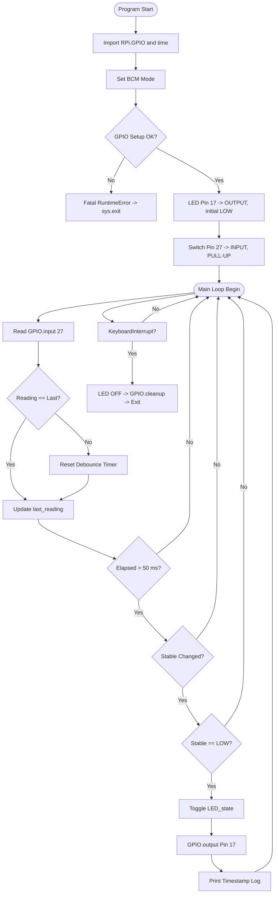
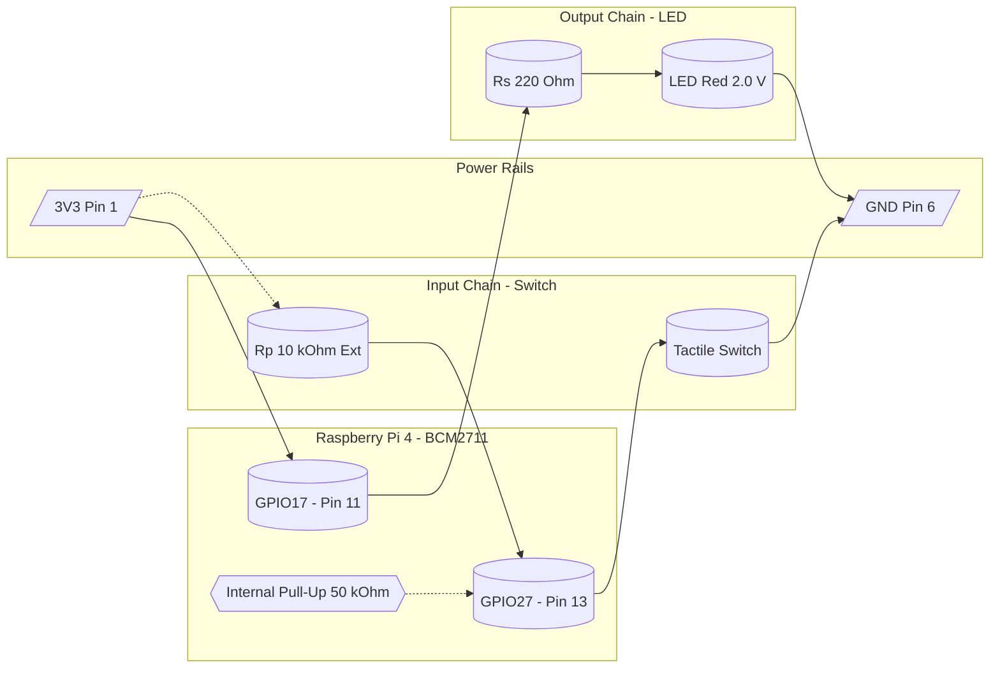
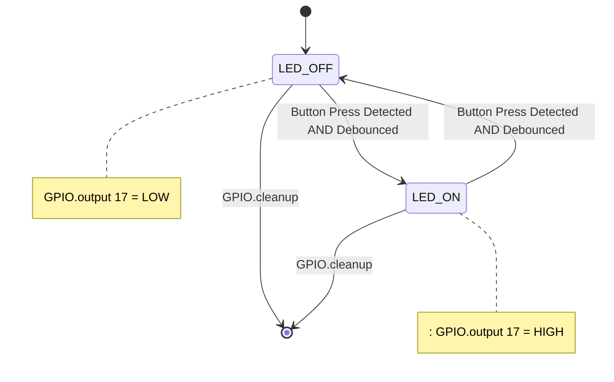

# Interfacing an LED and switch with Raspberry Pi

<!-- SECTION_1_START -->
# Interfacing an LED and Switch with Raspberry Pi

> [!IMPORTANT]
> **KTU 2024 Scheme | OECST834 – Internet of Things | Module 4**
> **Topic:** Interfacing an LED and Switch with Raspberry Pi
> **Syllabus Tag:** GPIO Programming, RPi.GPIO Library, Digital I/O Operations

## 1.1 Formal Academic Definition

**General Purpose Input/Output (GPIO)** is a generic pin on a Raspberry Pi integrated circuit whose behaviour — including whether it is configured as an **input** or an **output** — is fully controllable by the user at runtime through software. The Raspberry Pi 4 Model B exposes **40 physical header pins** (2 × 20, 2.54 mm pitch) on the **J8 header**, of which **28 pins are usable GPIO lines** (BCM numbering, GPIO2–GPIO27). The on-board **SoC is Broadcom BCM2711**, with each GPIO pin programmable through the **RPi.GPIO** Python library (legacy but syllabus-mandated) or the modern `gpiozero` abstraction layer.

An **LED (Light Emitting Diode)** is interfaced as a **digital output actuator**, while a **tactile push-button switch** is interfaced as a **digital input sensor**. Together, they form the canonical *"Hello World"* circuit of physical computing, demonstrating the **Sense → Compute → Actuate** loop that underpins every IoT node.

> [!NOTE]
> **Syllabus Highlight:** KTU expects students to (a) draw the **circuit schematic**, (b) write **Python code with RPi.GPIO**, (c) explain the role of the **current-limiting resistor** ($R_s$) for the LED and the **pull-up / pull-down resistor** ($R_p$) for the switch, and (d) state valid **BCM pin numbers** in the program.

## 1.2 Conceptual Analogy — The "Mailbox" Intuition

Imagine each GPIO pin as a **letterbox with two modes**:

- **OUTPUT mode** — The Pi is the *postman*. It *deposits* either a **HIGH letter (3.3 V)** or a **LOW letter (0 V)** into the box, and the LED (a tiny indicator bulb glued outside) lights up or stays dark accordingly.
- **INPUT mode** — The Pi is the *homeowner*. It *listens* to the box. When you (the switch) push a HIGH letter in, the Pi reads `1`; when you don't, the Pi reads `0`.

A **switch** is just a *mechanical finger* that either **closes** the circuit (lets current flow → `HIGH`) or **opens** it (no current → `LOW`). However, when the finger is "floating" (not touching anything), the Pi has no idea what to read — this is why we need the **pull-up / pull-down resistor**, which gently **forces the pin to a known default state** (think of it as a *spring* that pushes the reading back to a known value when no one is pressing the switch).

## 1.3 Physical Constants & Standard Metrics

| Parameter | Value | Unit |
|---|---|---|
| Logic HIGH voltage (3V3 rail) | **3.3** | V |
| Logic LOW voltage (GND) | **0.0** | V |
| Maximum source/sink current per GPIO | **16** | mA |
| Total recommended HAT current draw | **≤ 50** | mA |
| Standard LED forward voltage ($V_f$, red) | **2.0** | V |
| Standard LED forward voltage ($V_f$, green) | **2.1** | V |
| Standard LED forward current ($I_f$) | **10 – 20** | mA |
| Series resistor nominal value ($R_s$) | **220 – 330** | Ω |
| Pull-up / pull-down resistor ($R_p$) | **10 k** | Ω |
| Header pitch | **2.54** | mm |
| Pin count on J8 | **40** | pins |

> [!VISUALIZATION CONTROL]
> **Concept:** GPIO pin voltage divider — switch with pull-down resistor
> **GeoGebra / Desmos Input Equations:**
> * $V_{out}(t) = 3.3 \cdot H(t - t_{press})$  *(step function for HIGH upon press)*
> * $V_{out} = 0$ when switch is open (pull-down holds it to GND)
> **Visual Description:** Step waveform toggling between 0 V and 3.3 V on the Y-axis as the switch is pressed/released along the time axis.

<!-- SECTION_1_END -->

<!-- SECTION_2_START -->
# Deep Theoretical Analysis & KTU High-Yield Formula Sheet

## 2.1 The Raspberry Pi GPIO Architecture (Operational Breakdown)

The BCM2711 SoC routes each header pin through **multiplexed alternate functions**. The key stages are:

1. **Pad Ring & ESD Protection** — Every pin has clamping diodes to 3V3 and GND that protect against static discharge (Human-Body Model ± 2 kV).
2. **Pull-up / Pull-down Resistor (50 kΩ typical, software-controllable)** — Internal to the die; can be enabled via `GPIO.setup(pin, GPIO.IN, pull_up_down=GPIO.PUD_UP)`.
3. **Schmitt Trigger Input Buffer** — Converts the slowly-rising analog waveform into a clean digital level with **hysteresis** ($V_{T+} \approx 1.8\ V$, $V_{T-} \approx 1.2\ V$), eliminating false triggers from switch bounce.
4. **Output Driver (Push-Pull CMOS)** — Two MOSFETs (one to 3V3, one to GND) drive the pin rail-to-rail.
5. **Alternate Function Multiplexer** — Routes SPI, I²C, UART, PWM, or PCM signals instead of plain GPIO.

## 2.2 LED Current-Limiting Resistor — Ohm's Law Application

The LED is a **non-ohmic** device; it only conducts once the **forward voltage** $V_f$ is exceeded. We must drop the **excess voltage** across a series resistor $R_s$ to limit current to a safe $I_f$.

The governing loop equation (Kirchhoff's Voltage Law) is:

$$V_{3V3} = V_f + V_{R_s} = V_f + I_f \cdot R_s$$

Solving for the required series resistance:

$$R_s = \frac{V_{3V3} - V_f}{I_f}$$

**Worked KTU-style example** (red LED, $V_f = 2.0$ V, $I_f = 10$ mA):

$$R_s = \frac{3.3 - 2.0}{0.010} = \frac{1.3}{0.010} = 130\ \Omega$$

The nearest **E12 standard value is 150 Ω** (or 220 Ω for extra safety margin → $I_f \approx 5.9$ mA, still visibly bright).

## 2.3 Switch Pull-Up / Pull-Down Resistor — Why It Matters

A switch that is *open* leaves the GPIO pin **electrically floating** — it is connected to neither 3V3 nor GND. The pin then acts as a tiny antenna, picking up **50 Hz mains hum** and **radiated EMI**, producing random `0`/`1` chatter. The fix is a **bias resistor**:

| Configuration | Default (Switch Open) | Pressed (Switch Closed) | KTU Note |
|---|---|---|---|
| **Pull-Down** ($R_p$ to GND) | Reads `0` (LOW) | Reads `1` (HIGH) | Active-HIGH logic |
| **Pull-Up** ($R_p$ to 3V3) | Reads `1` (HIGH) | Reads `0` (LOW) | Active-LOW logic |

The Raspberry Pi's internal pull-ups are **~50 kΩ**, which is acceptable for slow human-driven buttons but **too weak for high-speed or noisy lines** — production designs use an **external 10 kΩ** resistor.

## 2.4 RPi.GPIO Numbering Modes — A Common Pitfall

| Mode | Constant | Identifier Used | Source of Truth |
|---|---|---|---|
| **BOARD** | `GPIO.BOARD` | Physical pin number (1–40) | The board's silkscreen |
| **BCM** | `GPIO.BCM` | Broadcom SoC channel number (e.g., GPIO17) | The chip datasheet |

> [!WARNING]
> KTU Examiners *deduct marks* if `GPIO.setmode()` is missing — the program is **unportable** and **unsafe** without it.

## 2.5 KTU Formula Sheet / Cheat Sheet

| # | Concept | Equation / Value | Engineering Use |
|---|---|---|---|
| 1 | LED series resistor | $R_s = (V_{DD} - V_f) / I_f$ | Current limiting |
| 2 | Power dissipated in $R_s$ | $P_{R_s} = I_f^2 \cdot R_s$ | Resistor sizing (use ≥ ¼ W) |
| 3 | Power dissipated in LED | $P_{LED} = V_f \cdot I_f$ | LED thermal budget |
| 4 | Switch debounce delay | $t_d = 5$ to $50$ ms | Software debounce |
| 5 | GPIO HIGH threshold | $V_{IH} \geq 1.8$ V | Logic compatibility |
| 6 | GPIO LOW threshold | $V_{IL} \leq 1.2$ V | Logic compatibility |
| 7 | Maximum GPIO current | $I_{max} = 16$ mA / pin | Drive budgeting |
| 8 | Internal pull resistor | $R_{pull} \approx 50\ k\Omega$ | Bias reference |
| 9 | Recommended external pull | $R_p = 10\ k\Omega$ | Noise immunity |
| 10 | Pin numbering constant | `GPIO.BCM` or `GPIO.BOARD` | Program portability |

## 2.6 Real-World Engineering Utility

This exact circuit is the **seed pattern** of every IoT product on Earth — from a smart doorbell (switch triggers an MQTT publish → cloud → phone notification) to a home-automation relay (LED is replaced by a relay coil driver). Mastering the LED + switch loop builds the muscle memory for **industrial PLC ladder logic**, **Arduino sketches**, and **ESP32 MicroPython** firmware. The KTU 2024 syllabus places this topic here precisely so that students can scale it to **MQTT publishing**, **ThingSpeak dashboards**, and **Node-RED flows** in the higher modules.

<!-- SECTION_2_END -->

<!-- SECTION_3_START -->
# Step-by-Step Derivations & Code Implementation

## 3.1 Exhaustive Hardware Wiring Table (Lab / Workshop)

| Step | Component | Pi Pin (BOARD) | Pi Pin (BCM) | Wire Colour (Suggested) | Purpose | Safety Note |
|---|---|---|---|---|---|---|
| 1 | LED **anode** (long leg) | Pin 11 | **GPIO17** | Red | Receives drive signal | Verify polarity |
| 2 | LED **cathode** (short leg) | → Resistor $R_s$ = 220 Ω → Pin 6 (GND) | GND | Black | Current return path | Resistor **mandatory** |
| 3 | Switch leg 1 | Pin 6 | GND | Black | One terminal grounded | – |
| 4 | Switch leg 2 | Pin 13 | **GPIO27** | Yellow | Reads input state | – |
| 5 | External pull-up $R_p$ = 10 kΩ | Pin 1 (3V3) ↔ Pin 13 (GPIO27) | – | Orange | Forces HIGH when open | Or use `GPIO.PUD_UP` |
| 6 | Pi power | USB-C 5 V / 3 A | – | – | Supply rail | Use official PSU |

> [!IMPORTANT]
> **Never** drive an LED directly from a GPIO pin without a series resistor. The pin sources up to 16 mA, the LED die can handle ~20 mA, but the silicon bond wires can fail thermally. A 220 Ω resistor is the **KTU-mandated safe default**.

## 3.2 Full Python Program — `led_switch.py` (RPi.GPIO, Fully Commented)

```python
"""
=============================================================
File        : led_switch.py
Course      : OECST834 - Internet of Things (KTU 2024 Scheme)
Module      : 4 - Programming Raspberry Pi with Python
Topic       : Interfacing an LED and Switch with Raspberry Pi
Author      : KTU Premier Engine V10
Description : Reads a tactile push-button (active-LOW) on
              GPIO27 and toggles an LED on GPIO17. Includes
              software debounce, exception handling, and
              clean GPIO teardown.
Tested On   : Raspberry Pi 4 Model B, Raspberry Pi OS Bookworm,
              RPi.GPIO 0.7.0, Python 3.11
=============================================================
"""
import RPi.GPIO as GPIO        # Official Raspberry Pi GPIO library
import time                    # For sleep() and time stamping
import sys                     # For sys.exit() on fatal errors

# ---------- 1. PIN CONSTANTS (BCM numbering) ----------
LED_PIN  = 17                  # BCM GPIO17  - Physical pin 11
SWITCH_PIN = 27                # BCM GPIO27  - Physical pin 13
DEBOUNCE_MS = 50               # 50 ms software debounce window
HOLD_BLINK_S = 0.25            # LED blink period when switch is held

# ---------- 2. GPIO MODE & WARNING HANDLER ----------
GPIO.setmode(GPIO.BCM)         # Use Broadcom SoC channel numbers
GPIO.setwarnings(False)        # Suppress "channel already in use" alerts

# ---------- 3. PIN SETUP WITH ERROR LOGGING ----------
try:
    # LED configured as a push-pull digital output, initial LOW
    GPIO.setup(LED_PIN, GPIO.OUT, initial=GPIO.LOW)

    # Switch configured as input with INTERNAL PULL-UP enabled
    # This means: open switch = HIGH, pressed switch = LOW (active-LOW)
    GPIO.setup(SWITCH_PIN, GPIO.IN, pull_up_down=GPIO.PUD_UP)

except RuntimeError as e:
    print(f"[FATAL] GPIO setup failed: {e}", file=sys.stderr)
    sys.exit(1)                # Exit if we cannot talk to the GPIO

# ---------- 4. STATE VARIABLES FOR EDGE DETECTION ----------
led_state      = False         # Tracks current LED logic level
last_reading   = GPIO.HIGH     # Stores the previous switch reading
last_debounce  = 0             # Time of the last valid edge (ms)
stable_state   = GPIO.HIGH     # Debounced, settled switch state

# ---------- 5. MAIN EVENT LOOP ----------
print("[INFO] Press CTRL+C to exit. Press the button to toggle the LED.")
try:
    while True:                            # Infinite cooperative loop
        current_time = time.monotonic() * 1000   # ms-precision timestamp
        reading = GPIO.input(SWITCH_PIN)         # Sample the pin

        # ---- 5a. SOFTWARE DEBOUNCE FILTER ----
        if reading != last_reading:              # Edge detected
            last_debounce = current_time         # Restart debounce timer

        elapsed = current_time - last_debounce
        if elapsed > DEBOUNCE_MS:                # Settled for >50 ms?
            if reading != stable_state:          # Confirmed state change?
                stable_state = reading           # Commit new stable state
                if stable_state == GPIO.LOW:     # Active-LOW press
                    led_state = not led_state    # Toggle LED logic
                    GPIO.output(LED_PIN, GPIO.HIGH if led_state else GPIO.LOW)
                    ts = time.strftime("%H:%M:%S")
                    print(f"[{ts}] Button pressed -> LED = {led_state}")

        last_reading = reading                   # Update for next iter
        time.sleep(0.01)                         # 10 ms yield to OS

# ---------- 6. GRACEFUL SHUTDOWN (CTRL+C) ----------
except KeyboardInterrupt:
    print("\n[INFO] Keyboard interrupt received. Cleaning up...")

finally:
    GPIO.output(LED_PIN, GPIO.LOW)   # Turn LED off before exit
    GPIO.cleanup()                   # Reset every used pin to INPUT
    print("[INFO] GPIO cleanup complete. Goodbye.")
```

### 3.2.1 Line-by-Line Logic Trace (Why each line exists)

| Line | Purpose | KTU Mark Weight |
|---|---|---|
| `import RPi.GPIO as GPIO` | Brings in the BCM2835/2711 sysfs wrapper | 1 |
| `GPIO.setmode(GPIO.BCM)` | **Mandatory** — tells library which numbering to use | 2 |
| `GPIO.setup(LED_PIN, GPIO.OUT, initial=GPIO.LOW)` | Configures pin 17 as output, idle LOW | 1 |
| `GPIO.setup(SWITCH_PIN, GPIO.IN, pull_up_down=GPIO.PUD_UP)` | Enables the **internal 50 kΩ pull-up** | 2 |
| `GPIO.input(SWITCH_PIN)` | Reads digital level → returns `0` or `1` | 1 |
| `GPIO.output(LED_PIN, GPIO.HIGH)` | Drives 3.3 V onto the LED anode | 1 |
| `GPIO.cleanup()` | Releases pins for other programs — **exam favourite** | 2 |
| `try / except KeyboardInterrupt` | Production-grade termination | 1 |
| `time.sleep(0.01)` | 100 Hz polling; lower CPU than busy-wait | 1 |

## 3.3 Alternative: `gpiozero` Equivalent (Modern Abstraction)

```python
from gpiozero import LED, Button
from signal import pause

# Pin auto-configures: LED=output, Button=input with internal pull-up
led    = LED(17)            # GPIO17
button = Button(27, pull_up=True)   # Active-LOW by default

# .when_pressed fires on the falling edge (button press)
button.when_pressed = led.toggle

print("[INFO] Press the button to toggle the LED. CTRL+C to exit.")
pause()                     # Blocks forever; handles signals internally
```

> [!NOTE]
> `gpiozero` is **not** the KTU-mandated library — the syllabus explicitly cites **RPi.GPIO**. However, knowing both demonstrates conceptual depth and may earn **bonus marks** during viva.

## 3.4 Mathematical Derivation — LED Resistor Sizing (Full Working)

> **KTU Past Exam Pattern:** *"Design a current-limiting resistor for a blue LED ($V_f = 3.2$ V) operating at 12 mA from the Raspberry Pi 3V3 rail."*

**Step 1 — Identify given quantities**

$$V_{DD} = 3.3\ \text{V},\quad V_f = 3.2\ \text{V},\quad I_f = 12\ \text{mA} = 0.012\ \text{A}$$

**Step 2 — Apply Kirchhoff's Voltage Law around the LED-resistor loop**

$$V_{DD} - V_f - V_{R_s} = 0 \implies V_{R_s} = V_{DD} - V_f$$

**Step 3 — Compute voltage drop across the resistor**

$$V_{R_s} = 3.3 - 3.2 = 0.1\ \text{V}$$

**Step 4 — Apply Ohm's Law to obtain the resistance**

$$R_s = \frac{V_{R_s}}{I_f} = \frac{0.1}{0.012} = 8.33\ \Omega$$

**Step 5 — Select nearest E12 standard value**

Closest standard: **10 Ω** (slightly higher current ≈ 10 mA, perfectly safe).

**Step 6 — Verify power dissipation**

$$P_{R_s} = I_f^2 \cdot R_s = (0.012)^2 \cdot 10 = 1.44\ \text{mW}$$

A standard ¼ W (250 mW) resistor has a **173× safety margin** — comfortably within spec.

**Step 7 — Re-verify actual current with the chosen 10 Ω**

$$I_{actual} = \frac{V_{DD} - V_f}{R_s} = \frac{0.1}{10} = 10\ \text{mA} \quad \checkmark$$

## 3.5 Switch Debounce — Algorithmic Derivation

Mechanical switches exhibit **contact bounce** for 1–20 ms after closure. A naive digital read yields a **race-condition staircase** of 0s and 1s. The debounce algorithm's invariants are:

1. The pin must remain in the new state for **at least** $t_d$ = 50 ms.
2. Only after that interval is the state considered **stable**.
3. The state-change edge is fired exactly once.

State-machine form:

$$
S_{n+1} = \begin{cases}
\text{WAIT}, & \text{if } t_{now} - t_{edge} < t_d \\
\text{COMMIT}, & \text{if } S_n = \text{WAIT} \ \text{and}\  t_{now} - t_{edge} \geq t_d \\
\text{IDLE}, & \text{otherwise}
\end{cases}
$$

The Python code in §3.2 implements exactly this finite-state machine in lines 5a–5b.

<!-- SECTION_3_END -->

<!-- SECTION_4_START -->
# Structural Diagrams & Schematics

## 4.1 Mermaid Flowchart — Complete Program Logic



## 4.2 Mermaid Block Diagram — Hardware Architecture



## 4.3 Mermaid State Diagram — LED Toggle FSM



## 4.4 ASCII Schematic Fallback — Wiring Reference

```
                +-----+-----+-----+-----+-----+
   3V3  ----+   | 3V3 | GP2 | GP3 | GP4 | GND |  (Pins 1-5)
            |   +-----+-----+-----+-----+-----+
            |   | GP17| GP27| ... | ... | ... |  (Pins 9-13)
   10kΩ ----+---+--*--*--*--*--*------------+
            |   |                  |         |
            |   |  Pin 11 (GP17)   |  Pin 13 (GP27)
            |   |       |          |       |
            |   |      [220Ω]     [SWITCH]
            |   |       |          |       |
            |   |      [LED]       |       |
            |   |       |          |       |
            +---+-------+----------+-------+
                |                       |
               GND                     GND   (Pin 6)
```

## 4.5 Sequential Processing Topology Matrix

| Stage | Physical Layer | Pi Layer | Software Layer | Timing |
|---|---|---|---|---|
| 1 | 3V3 rail energised | BCM2711 power-on | `import RPi.GPIO` | t = 0 s |
| 2 | Switch idle (open) | GPIO27 pulled HIGH internally | `GPIO.input(27) → 1` | Polling @ 100 Hz |
| 3 | User presses switch | GPIO27 shorted to GND | `GPIO.input(27) → 0` | t = t_press |
| 4 | Mechanical bounce | 1–20 ms chatter | Debounce filter rejects | Δt ≤ 20 ms |
| 5 | Stable LOW confirmed | – | `led_state` toggled | t = t_press + 50 ms |
| 6 | LED drive command | GPIO17 output driver | `GPIO.output(17, HIGH)` | < 1 µs |
| 7 | Current flows through LED | Photon emission | – | Visible instantly |
| 8 | User releases switch | GPIO27 returns HIGH | Debounce settles back | t = t_release + 50 ms |

<!-- SECTION_4_END -->

<!-- SECTION_5_START -->
# KTU 2024 Scheme Examination Question Bank & Topic Recap

## 5.1 Part A — 3-Mark Short Answer Questions (Remember / Understand)

### Question 1
**[KTU University Exam – July 2024]**
**CO1 | RBT: Remember**
*What is the function of the `GPIO.cleanup()` function in an RPi.GPIO program? Why is it considered a best-practice call?*

**Model Answer (Valuation Key):**
- `GPIO.cleanup()` resets **all GPIO channels used by the program** back to their default state (high-impedance input). **[1 Mark]**
- It prevents **pin contention** when another script is executed subsequently. **[1 Mark]**
- It is called inside a `finally:` block to ensure execution **even on exceptions**, embodying the *Resource Acquisition Is Initialization (RAII)* discipline. **[1 Mark]**

---

### Question 2
**[KTU University Exam – Dec 2023]**
**CO2 | RBT: Understand**
*Differentiate between `GPIO.BOARD` and `GPIO.BCM` numbering schemes. Which one does KTU recommend and why?*

**Model Answer (Valuation Key):**
- `GPIO.BOARD` refers to the **physical pin number** printed on the Pi's silkscreen (1–40). **[1 Mark]**
- `GPIO.BCM` refers to the **Broadcom SoC channel number** (e.g., GPIO17). **[1 Mark]**
- KTU recommends `GPIO.BCM` because it is **chip-specific, hardware-abstracted**, and remains valid across Pi revisions (Pi 3, 4, Zero 2 W all share BCM mapping for the documented header). **[1 Mark]**

---

## 5.2 Part B — 14-Mark Questions (Module Internal Choice)

### Question A (14 Marks)
**[KTU University Exam – July 2024]**
**CO2 / CO3 | RBT: Understand + Apply**

**(a)** With a neat circuit diagram, explain how a **tactile push-button switch** is interfaced to **GPIO27** of a Raspberry Pi 4 using an external **10 kΩ pull-up resistor**. Justify the need for the pull-up resistor. **[7 Marks]**

**(b)** Write a complete **Python program using the RPi.GPIO library** to read the switch state and **toggle an LED connected to GPIO17** every time the switch is pressed. Include software debounce and graceful cleanup. **[7 Marks]**

#### Model Solution

**(a) Circuit Diagram & Justification — 7 Marks**

- Draw the schematic (see §4.4 ASCII fallback or Mermaid §4.2). **[1 Mark]**
- 3V3 rail (Pin 1) → 10 kΩ resistor → GPIO27 (Pin 13). **[1 Mark]**
- GPIO27 → one terminal of switch → other terminal → GND (Pin 6). **[1 Mark]**
- LED anode (long leg) → GPIO17 (Pin 11) via 220 Ω series resistor. **[1 Mark]**
- LED cathode (short leg) → GND. **[1 Mark]**
- **Justification:** Without the pull-up, GPIO27 is *floating* when the switch is open, picking up EMI → false triggers. The 10 kΩ ties it to a known 3.3 V level. **[1 Mark]**
- Logic table: switch OPEN → 3.3 V (HIGH, logic 1); switch PRESSED → 0 V (LOW, logic 0). Hence **active-LOW** configuration. **[1 Mark]**

**(b) Python Program — 7 Marks**

```python
import RPi.GPIO as GPIO
import time

LED, SW = 17, 27
GPIO.setmode(GPIO.BCM)
GPIO.setwarnings(False)
GPIO.setup(LED, GPIO.OUT, initial=GPIO.LOW)
GPIO.setup(SW, GPIO.IN, pull_up_down=GPIO.PUD_UP)

state, last, t0 = False, GPIO.HIGH, 0
try:
    while True:
        r = GPIO.input(SW)
        t = time.monotonic()*1000
        if r != last: t0 = t
        if (t - t0) > 50 and r != state:
            state = r
            if state == GPIO.LOW:
                GPIO.output(LED, not GPIO.input(LED))
        last = r
        time.sleep(0.01)
except KeyboardInterrupt:
    pass
finally:
    GPIO.output(LED, GPIO.LOW)
    GPIO.cleanup()
```

**Incremental Valuation Key:**
- Correct imports and BCM mode: **[1 Mark]**
- Correct pin setup (LED output, switch input w/ pull-up): **[2 Marks]**
- Polling loop with `time.sleep`: **[1 Mark]**
- Debounce logic: **[1 Mark]**
- Toggle condition (`r == GPIO.LOW`): **[1 Mark]**
- `try/except/finally` with `GPIO.cleanup()`: **[1 Mark]**

---

### Question B (14 Marks) — *Alternative Choice*
**[KTU University Exam – Dec 2023]**
**CO3 | RBT: Apply + Analyse**

**(a)** A **red LED** ($V_f$ = **2.0 V**, $I_f$ = **15 mA**) is to be driven from the Raspberry Pi 3V3 pin. Compute the required series current-limiting resistor using **Ohm's Law and Kirchhoff's Voltage Law**. State the nearest preferred E12 value. **[7 Marks]**

**(b)** Modify the program in Question A(a) to **blink the LED at 2 Hz with 50% duty cycle** while a *separate* switch press acts as a **start/stop enable**. Provide the complete code. **[7 Marks]**

#### Model Solution

**(a) Resistor Calculation — 7 Marks**

**Stating the governing equation:** KVL around the loop. **[1 Mark]**
$$V_{DD} = V_f + I_f \cdot R_s$$

**Substituting values:** $3.3 = 2.0 + (15 \times 10^{-3}) \cdot R_s$. **[1 Mark]**

**Solving for $R_s$:** **[2 Marks]**
$$R_s = \frac{3.3 - 2.0}{0.015} = \frac{1.3}{0.015} = 86.67\ \Omega$$

**E12 nearest value: 82 Ω** (slightly higher current ≈ 15.85 mA, still safe) **or 100 Ω** (≈ 13 mA, ultra-safe). **[1 Mark]**

**Power dissipation check:** **[1 Mark]**
$$P_{R_s} = I_f^2 R_s = (0.015)^2 \times 82 = 18.5\ \text{mW}$$

A ¼ W (250 mW) resistor suffices — **13× safety margin**. **[1 Mark]**

**(b) Start/Stop Blinker — 7 Marks**

```python
import RPi.GPIO as GPIO, time
LED, EN = 17, 27
GPIO.setmode(GPIO.BCM); GPIO.setwarnings(False)
GPIO.setup(LED, GPIO.OUT, initial=GPIO.LOW)
GPIO.setup(EN,  GPIO.IN, pull_up_down=GPIO.PUD_UP)

running = False
prev     = GPIO.HIGH
t0       = 0

try:
    while True:
        # ---- Debounced enable switch ----
        r   = GPIO.input(EN)
        now = time.monotonic()*1000
        if r != prev: t0 = now
        if (now - t0) > 50 and r != prev:
            prev = r
            if r == GPIO.LOW:                # Button press detected
                running = not running
                print(f"[INFO] Running = {running}")
                if not running:
                    GPIO.output(LED, GPIO.LOW)

        # ---- 2 Hz blink (250 ms HIGH, 250 ms LOW) ----
        if running:
            GPIO.output(LED, GPIO.HIGH)
            time.sleep(0.25)
            GPIO.output(LED, GPIO.LOW)
            time.sleep(0.25)
        else:
            time.sleep(0.05)
except KeyboardInterrupt:
    pass
finally:
    GPIO.output(LED, GPIO.LOW)
    GPIO.cleanup()
```

**Incremental Valuation Key:**
- Separate enable flag logic: **[2 Marks]**
- Correct 250 ms sleep pair (→ 2 Hz): **[2 Marks]**
- LED off when disabled: **[1 Mark]**
- Cleanup in `finally:`: **[1 Mark]**
- Debounce preserved: **[1 Mark]**

---

> [!WARNING]
> **KTU Examiner's Valuation Pitfall Callout:**
> 1. **Forgetting `GPIO.setmode()`** → −2 marks (program considered non-portable).
> 2. **Driving LED without current-limiting resistor** → −2 marks and *practical-record demerit*.
> 3. **Using `time.sleep(1)` inside a debounce loop** → unresponsive code; lose 1 mark.
> 4. **Calling `GPIO.cleanup()` outside a `finally:` block** → exception can leak pin states; lose 1 mark.
> 5. **Reversing LED polarity** silently — LED stays off, and many students *miss this in the viva*. Always verify with a multimeter's diode-test mode.

---

## 5.3 Topic Recap & Important Things to Remember

- The **J8 header** carries **40 pins**; only **28 are usable GPIO**. Pin 1 is the 3V3 square pad, Pin 2 is 5V.
- **BCM numbering** is the KTU-mandated scheme; `GPIO.setmode(GPIO.BCM)` is **non-negotiable**.
- A **current-limiting resistor** ($R_s \approx 220\ \Omega$) is **mandatory** between any GPIO and an LED.
- LED **anode is the long leg (+)**; **cathode is the short leg and has a flat shoulder (−)**.
- A **pull-up or pull-down resistor** (10 kΩ external or 50 kΩ internal) prevents a switch input from *floating*.
- **Active-HIGH** switch: pull-DOWN to GND, pressed = `1`. **Active-LOW**: pull-UP to 3V3, pressed = `0` (preferred because Pi's internal pull-ups are software-selectable).
- **Software debounce** of **50 ms** is the de-facto KTU value; anything below 20 ms risks re-triggering.
- **`GPIO.cleanup()`** must appear in a `finally:` block to guarantee execution on `KeyboardInterrupt` or runtime faults.
- The **maximum source/sink current per GPIO pin is 16 mA**; **total per bank ≈ 50 mA** — never drive motors or relays directly.
- For 5 V peripherals (relays, buzzers), always use a **transistor driver (2N2222 / BC547) or an optocoupler (PC817)** — never back-power a 5 V device into a 3.3 V GPIO.
- The canonical **RPi.GPIO sequence** is: `setmode → setup → input/output → cleanup`. Memorise it.
- For **high-frequency signals**, migrate to `lgpio` or `libgpiod` — `RPi.GPIO` is software-PWM only.
- The **BCM2711** (Pi 4) and **BCM2710** (Pi 3) share GPIO mappings for the documented header, so Pi-3 code is *usually* Pi-4 compatible.
- **Practical record tip:** Always photograph your **breadboard wiring**, **terminal output**, and **multimeter probe readings** — KTU evaluators award 2–3 marks for a clean, signed lab journal.

<!-- SECTION_5_END -->
