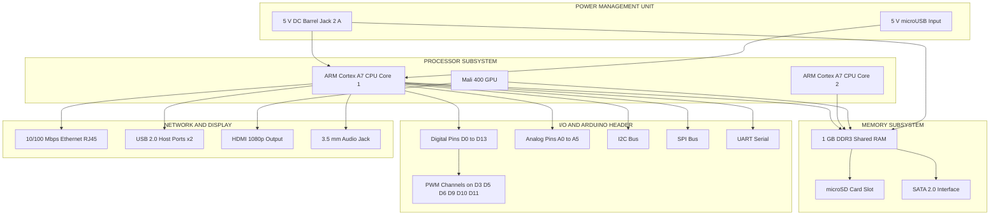
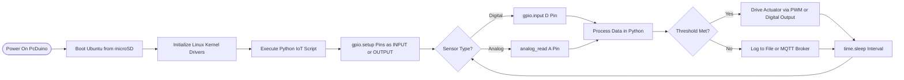

# Other IoT devices- PcDino

<!-- SECTION_1_START -->

# PcDuino — Other IoT Devices (Programming Raspberry Pi with Python)

## 1. Core Technical Definition & Intuitive Overview

### Formal Academic Definition
**PcDuino** is a high-performance, low-power **single-board computer (SBC)** that integrates a **mini-PC platform** with the **Arduino-compatible input/output (I/O) headers**. It is engineered to bridge the gap between the computational power of a Linux-based system and the real-time hardware-interfacing capability of a microcontroller. It runs a full Linux distribution (typically **Ubuntu**, **Debian**, or **Android ICS/Jellybean**) while exposing the standard Arduino Uno R3 pinout, allowing developers to read sensors and drive actuators using both high-level Python/C++ APIs and low-level Arduino-style sketches.

> [!IMPORTANT]
> **KTU 2024 Syllabus Highlight:** PcDuino is officially categorized under the "Other IoT Devices" cluster alongside **Raspberry Pi**, **BeagleBone Black**, **Arduino**, and **ESP8266/ESP32**. For OECST834 (Module 4), the focus is on **board architecture, pin mapping, Python programming, and IoT application deployment**.

### Conceptual Analogy / Intuition
Imagine a **multilingual translator** sitting at a dinner table between a powerful corporate executive (the Linux CPU) and a skilled electrician (the Arduino-style GPIO pins). The executive can think in spreadsheets, web pages, and Python scripts, but cannot directly flick a switch or read a temperature sensor. The electrician knows only how to wire things, but cannot browse the internet. **PcDuino is that translator** — it gives the executive brain a hands-on body, and the electrician a brain to make decisions.

Geometrically, think of PcDuino as a **3-layer sandwich**:
1. **Top layer (Software):** Full Linux OS with Python, Node.js, and GCC.
2. **Middle layer (APIs):** A unified **libarduino / pcduino-gpio** library.
3. **Bottom layer (Hardware):** Allwinner SoC + Arduino-compatible shield headers.

> [!NOTE]
> **Standard Metric Used in Module 4 Evaluation:**
> - CPU Clock Speed: **1 GHz** (typical for PcDuino3/4)
> - RAM: **1 GB DDR3**
> - GPIO Voltage: **3.3 V logic** (some pins 5 V tolerant)

> [!VISUALIZATION CONTROL]
> **Concept:** Layered Architecture of PcDuino
> **GeoGebra / Desmos Input Equations (Conceptual block layers, x-axis = abstraction, y-axis = abstraction depth):**
> * `Layer1(x) = 4 - 0.5 * x` (User Application Layer)
> * `Layer2(x) = 3 - 0.5 * x` (Python / C API Layer)
> * `Layer3(x) = 2 - 0.5 * x` (Linux Kernel / Driver Layer)
> * `Layer4(x) = 1 - 0.5 * x` (Allwinner A20 Hardware)
> **Visual Description:** A stacked, downward-tapering diagram where higher-level software layers rest on progressively lower hardware layers, illustrating the abstraction hierarchy.

<!-- SECTION_1_END -->

<!-- SECTION_2_START -->

# 2. Deep Theoretical Analysis & KTU High-Yield Formula Sheet

## 2.1 Evolution and Variants of PcDuino
PcDuino was developed by **LinkSprite** (USA) in **2012** as a response to the limitations of the original Arduino (no network, no video) and the Raspberry Pi (no real-time analog pins). The product line evolved as follows:

| Variant | Year | SoC | RAM | Key Distinguishing Feature |
|---|---|---|---|---|
| PcDuino v1 | 2012 | Allwinner A10 (ARM Cortex-A8) | 1 GB | First model, HDMI + Arduino headers |
| PcDuino v2 | 2013 | Allwinner A20 (Dual Cortex-A7) | 1 GB | Dual-core upgrade, SATA support |
| PcDuino v3 | 2014 | Allwinner A20 | 1 GB | Added Wi-Fi dongle support, improved audio |
| PcDuino 4 | 2016 | Allwinner H3 (Quad Cortex-A7) | 1 GB | Faster GPU (Mali-400), lower power |
| PcDuino 8 Uno | 2017 | Allwinner H8 (Octa-core) | 2 GB | 8-core ARM, designed for IoT gateways |

## 2.2 Hardware Architecture Breakdown

The PcDuino board can be decomposed into the following **operational blocks**:

- **Processor Subsystem (CPU + GPU):** Allwinner SoC integrates an **ARM Cortex** CPU with a **Mali-400** GPU. CPU handles general-purpose computation; GPU accelerates graphics (HDMI output).
- **Memory Subsystem:** **1 GB DDR3 RAM** is shared with the GPU (typical UMA design).
- **Storage Subsystem:** **microSD slot** for OS boot, optional **SATA 2.0** connector for hard drives (PcDuino2/3 only).
- **Network Subsystem:** **10/100 Mbps Ethernet** (RJ-45), optional **Wi-Fi** via USB dongle.
- **Display Subsystem:** **HDMI** (1080p), **LVDS**, and **3.5 mm audio jack**.
- **Arduino-Compatible Header:** Provides **14 digital pins (D0–D13)**, **6 analog input pins (A0–A5)**, **6 PWM-capable pins (D3, D5, D6, D9, D10, D11)**, plus **I2C, SPI, UART**.
- **USB Subsystem:** **2× USB 2.0 Host** + **1× USB OTG**.
- **Power Subsystem:** **5 V DC** via barrel jack (recommended **2 A** current); can also be powered through micro-USB.

## 2.3 KTU Formula Sheet / Cheat Sheet

| Parameter / Concept | Formula / Rule | Units / Value | Engineering Use Case |
|---|---|---|---|
| ADC Resolution | $V_{in} = \frac{ADC_{value}}{2^{N} - 1} \times V_{ref}$ | $N = 10$ bits, $V_{ref} = 3.3\ \text{V}$ | Reading analog sensors (LM35, LDR) |
| PWM Duty Cycle | $D\% = \frac{T_{on}}{T_{on} + T_{off}} \times 100$ | Percentage (0 – 100) | LED brightness, motor speed control |
| Pulse Frequency (PWM) | $f_{PWM} = \frac{1}{T}$ | Hz (typically 490 Hz on PcDuino) | Servo motor positioning |
| LED Current Limiting | $R = \frac{V_{supply} - V_{LED}}{I_{LED}}$ | Ohms ($\Omega$) | Protecting GPIO from overcurrent |
| Sampling Theorem | $f_{s} \geq 2 \cdot f_{max}$ | Hz | Nyquist rate for sensor sampling |
| Power Dissipation (Resistor) | $P = I^2 \cdot R$ | Watts (W) | Heat calculation in voltage dividers |
| Ohm's Law | $V = I \cdot R$ | Volts, Amps, Ohms | Sensor interface circuits |
| Python Analog Read | `value = adc.read(pin)` | Integer 0 – 1023 | Reading A0–A5 on PcDuino |

> [!IMPORTANT]
> **Critical Distinction for Board Exams:** The Arduino headers on PcDuino are **3.3 V logic**, NOT 5 V. Connecting a 5 V signal directly to a pin configured as input can damage the Allwinner SoC. Always use a **voltage divider** or **level shifter** when interfacing 5 V sensors.

## 2.4 Real-World Utility in Engineering and Computer Science
PcDuino is deployed in production environments where **edge-computing**, **network connectivity**, and **sensor interaction** must coexist. Common applications include:
- **Smart Agriculture:** Reading soil moisture and controlling irrigation valves in greenhouses.
- **Industrial IoT Gateways:** Aggregating data from Modbus sensors and pushing to **MQTT brokers** (e.g., Mosquitto).
- **Digital Signage:** Driving HDMI displays with real-time dashboards (Node-RED + Python).
- **Home Automation Hubs:** Running **OpenHAB** or **Home Assistant** on Ubuntu, with Arduino shields for Zigbee/X10.
- **Robotics:** Real-time motor control via PWM while running SLAM (Simultaneous Localization and Mapping) in Python.

<!-- SECTION_2_END -->

<!-- SECTION_3_START -->

# 3. Step-by-Step Derivations & Code/Symbolic Implementation

## 3.1 PcDuino Python Library — Setup and Pin Numbering

PcDuino uses the **pyMCU** / **pcduino-gpio** Python package, which provides an Arduino-like API. The library is installed via:

```bash
sudo apt-get update
sudo apt-get install python3-pip
sudo pip3 install pcduino-gpio
```

### Pin Numbering System
PcDuino supports two numbering modes (mirroring Arduino's flexibility):
- **BOARD mode:** Numbers pins by physical header position (e.g., pin 1, pin 2).
- **BCM mode:** Numbers pins by the **Broadcom SoC** channel number (e.g., GPIO 17, GPIO 27).

For digital Arduino-header pins, the mapping is:

$$
\begin{aligned}
D0 \rightarrow \text{GPIO0}, \quad D1 \rightarrow \text{GPIO1}, \quad D2 \rightarrow \text{GPIO2}, \quad D3 \rightarrow \text{GPIO3} \\
D4 \rightarrow \text{GPIO4}, \quad D5 \rightarrow \text{GPIO5}, \quad D6 \rightarrow \text{GPIO6}, \quad D7 \rightarrow \text{GPIO7} \\
D8 \rightarrow \text{GPIO8}, \quad D9 \rightarrow \text{GPIO9}, \quad D10 \rightarrow \text{GPIO10}, \quad D11 \rightarrow \text{GPIO11} \\
D12 \rightarrow \text{GPIO12}, \quad D13 \rightarrow \text{GPIO13} \\
A0 \rightarrow \text{ADC0}, \quad A1 \rightarrow \text{ADC1}, \ldots, \quad A5 \rightarrow \text{ADC5}
\end{aligned}
$$

## 3.2 Exhaustive Code Example 1 — Blinking an LED

This is the **"Hello, World!"** of embedded systems. The derivation logic:
1. Import the GPIO library.
2. Set the pin mode to **OUTPUT** (we are driving the LED).
3. Enter an infinite loop that alternates the pin state.
4. Add a delay to make the blink humanly visible.

```python
import time                                       # Step 1: Import delay library
import pcduino.gpio as gpio                       # Step 2: Import PcDuino GPIO library

LED_PIN = 13                                      # Step 3: Define constant for D13 (built-in LED on most shields)

def main() -> None:
    gpio.setup(LED_PIN, gpio.OUT)                 # Step 4: Configure D13 as OUTPUT direction
    print("[INFO] LED blink program started on PcDuino")
    try:
        while True:                               # Step 5: Infinite loop for continuous blinking
            gpio.output(LED_PIN, gpio.HIGH)       # Step 6: Drive pin voltage to 3.3 V (LED ON)
            print("[STATE] LED ON")
            time.sleep(1.0)                       # Step 7: Hold HIGH for 1 second
            gpio.output(LED_PIN, gpio.LOW)        # Step 8: Drive pin voltage to 0 V (LED OFF)
            print("[STATE] LED OFF")
            time.sleep(1.0)                       # Step 9: Hold LOW for 1 second
    except KeyboardInterrupt:                     # Step 10: Graceful shutdown on Ctrl+C
        gpio.output(LED_PIN, gpio.LOW)            # Step 11: Ensure LED is OFF before exit
        gpio.cleanup()                            # Step 12: Reset all GPIO pins to safe state
        print("[INFO] Program terminated cleanly")

if __name__ == "__main__":
    main()
```

**Step-by-step logic explanation:**
- Line `gpio.setup(LED_PIN, gpio.OUT)`: Tells the SoC's pin-mux controller to route D13 as a general-purpose output driver instead of an input receiver.
- Line `gpio.output(LED_PIN, gpio.HIGH)`: Writes a logical `1` to the pin's data register, which drives the MOSFET to 3.3 V.
- Line `gpio.cleanup()`: Releases the pin and resets it to high-impedance state to prevent floating voltages.

## 3.3 Exhaustive Code Example 2 — Reading an Analog Temperature Sensor (LM35)

The **LM35** produces a linear voltage proportional to temperature:
$$
T(^{\circ}C) = 10 \cdot V_{out}
$$
where $V_{out}$ is in volts, and the sensor outputs **10 mV/°C**.

The ADC on PcDuino maps voltages into a 10-bit integer:
$$
V_{in} = \frac{ADC_{read}}{1023} \times 3.3\ \text{V}
$$

Therefore, the temperature derivation in code is:
$$
\begin{aligned}
T(^{\circ}C) &= 10 \cdot \left(\frac{ADC_{read}}{1023} \times 3.3\right) \\
&= \frac{33 \cdot ADC_{read}}{1023}
\end{aligned}
$$

```python
import time
import pcduino.gpio as gpio
from pcduino.analog import analog_read

SENSOR_PIN = 0    # A0 (analog channel 0)
VREF = 3.3        # Reference voltage in volts
ADC_MAX = 1023    # 10-bit ADC

def celsius_from_adc(adc_value: int) -> float:
    """
    Convert raw 10-bit ADC integer to temperature in degrees Celsius.
    Derivation:
        V_in   = (adc_value / ADC_MAX) * VREF
        Temp_C = V_in / 0.01  (since LM35 outputs 10 mV per °C)
    """
    voltage = (adc_value / ADC_MAX) * VREF                  # Convert bits to volts
    temperature_c = voltage / 0.01                          # Apply LM35 transfer function
    return round(temperature_c, 2)                          # Round to 2 decimal places

def main() -> None:
    print("[INFO] LM35 Temperature Logger — PcDuino IoT Node")
    try:
        while True:
            raw_adc = analog_read(SENSOR_PIN)               # Read A0 (returns int 0–1023)
            temp = celsius_from_adc(raw_adc)                 # Apply conversion formula
            print(f"[DATA] ADC={raw_adc:4d}  V={raw_adc/ADC_MAX*VREF:.3f} V  T={temp:5.2f} °C")
            time.sleep(2.0)                                 # Log every 2 seconds
    except KeyboardInterrupt:
        print("[INFO] Logger stopped by user")

if __name__ == "__main__":
    main()
```

**Logic row-by-row:**
- `analog_read(SENSOR_PIN)`: Triggers the **ADC controller** inside the Allwinner SoC, which samples the pin voltage using a **successive-approximation register (SAR)**.
- `voltage = (adc_value / ADC_MAX) * VREF`: Linear interpolation from the digital count to the actual voltage.
- `temperature_c = voltage / 0.01`: Inverts the LM35 sensitivity (10 mV/°C = 0.01 V/°C).

## 3.4 Exhaustive Code Example 3 — PWM-Based Servo Motor Control

A hobby servo expects a pulse every 20 ms. The pulse width controls the angle:
$$
\begin{aligned}
\text{Pulse}_{1\text{ms}} &\rightarrow 0^{\circ} \\
\text{Pulse}_{1.5\text{ms}} &\rightarrow 90^{\circ} \\
\text{Pulse}_{2\text{ms}} &\rightarrow 180^{\circ}
\end{aligned}
$$

Since the period is 20 ms, the duty cycle for $90^{\circ}$ is:
$$
D_{90} = \frac{1.5}{20} \times 100 = 7.5\%
$$

```python
import time
import pcduino.gpio as gpio

SERVO_PIN = 9    # D9 supports PWM (Arduino-pin equivalent)
PWM_FREQ_HZ = 50 # 50 Hz => 20 ms period (standard for hobby servos)

def angle_to_duty(angle_deg: float) -> float:
    """
    Map servo angle (0–180°) to PWM duty cycle.
    Derivation:
        pulse_ms = 1.0 + (angle / 180.0)     [linear interpolation]
        duty_pct = (pulse_ms / 20.0) * 100   [since period = 1000/50 = 20 ms]
    """
    if angle_deg < 0 or angle_deg > 180:
        raise ValueError("Servo angle must be in [0, 180] degrees")
    pulse_ms = 1.0 + (angle_deg / 180.0)
    duty_pct = (pulse_ms / 20.0) * 100.0
    return duty_pct

def main() -> None:
    gpio.setup(SERVO_PIN, gpio.PWM)                        # Configure D9 as PWM output
    gpio.pwm_frequency(SERVO_PIN, PWM_FREQ_HZ)             # Set 50 Hz frequency
    print("[INFO] Servo sweep demo — PcDuino")
    try:
        for angle in range(0, 181, 30):                    # Sweep 0° → 180° in 30° steps
            duty = angle_to_duty(angle)
            gpio.pwm_duty_cycle(SERVO_PIN, duty)            # Apply duty cycle
            print(f"[SERVO] angle={angle:3d}°  duty={duty:5.2f}%")
            time.sleep(1.0)                                # Allow servo to settle
        for angle in range(180, -1, -30):                  # Sweep back
            duty = angle_to_duty(angle)
            gpio.pwm_duty_cycle(SERVO_PIN, duty)
            print(f"[SERVO] angle={angle:3d}°  duty={duty:5.2f}%")
            time.sleep(1.0)
    except KeyboardInterrupt:
        gpio.output(SERVO_PIN, gpio.LOW)                    # Detach signal
        gpio.cleanup()
        print("[INFO] Servo program terminated")

if __name__ == "__main__":
    main()
```

## 3.5 Comparative Derivation: PcDuino vs. Raspberry Pi vs. Arduino

$$
\begin{aligned}
\text{Use PcDuino when:} &\quad \text{Linux apps + analog sensor reads} \\
\text{Use Raspberry Pi when:} &\quad \text{Pure software, no analog I/O needed} \\
\text{Use Arduino when:} &\quad \text{Hard real-time, no OS, deterministic timing}
\end{aligned}
$$

> [!NOTE]
> **Algorithm: Choosing the Right IoT Board**
> 1. Does the task need analog inputs? → Arduino or PcDuino (not Raspberry Pi).
> 2. Does the task need Wi-Fi/Ethernet for cloud upload? → Raspberry Pi or PcDuino (not bare Arduino).
> 3. Does the task need both at the same time? → **PcDuino** (the only one with both analog headers and full Linux).

<!-- SECTION_3_END -->

<!-- SECTION_4_START -->

# 4. Structural Diagrams & Schematics

## 4.1 PcDuino Internal Block Architecture



## 4.2 Sequential Programming Flow for a PcDuino IoT Sensor Node



## 4.3 Functional Block Comparison: PcDuino vs. Raspberry Pi vs. Arduino Uno

| Functional Block | PcDuino v3 | Raspberry Pi 4 B | Arduino Uno R3 |
|---|---|---|---|
| Application Processor | Allwinner A20 Dual-core 1 GHz | Broadcom BCM2711 Quad-core 1.5 GHz | ATmega328P 16 MHz 8-bit |
| Operating System | Ubuntu / Debian / Android | Raspberry Pi OS / Linux | None (bare-metal loop) |
| Onboard RAM | 1 GB DDR3 | 1/2/4/8 GB LPDDR4 | 2 KB SRAM |
| Digital GPIO | 14 (Arduino header) | 40 (BCM numbering) | 14 (Arduino header) |
| Analog Inputs | 6 (10-bit ADC) | 0 (external ADC required) | 6 (10-bit ADC) |
| PWM Channels | 6 | 0 hardware (software PWM) | 6 |
| Network | Ethernet + USB Wi-Fi | Ethernet + Wi-Fi + Bluetooth | None (shield required) |
| Video Output | HDMI 1080p | 2 × micro-HDMI 4K | None |
| Programming Language | Python / C++ / Java | Python / C / Scratch | Arduino C/C++ only |
| Typical IoT Use | Edge gateway with sensors | Cloud-connected data hub | Hard real-time control node |

<!-- SECTION_4_END -->

<!-- SECTION_5_START -->

# 5. KTU 2024 Scheme Examination Question Bank & Topic Recap

## Part A Questions (3 Marks Each)

### Q1. **[KTU University Exam — July 2024]** Define PcDuino. List any two features that distinguish it from a Raspberry Pi. (CO1, Remember)

**Model Answer (Word count target: 80–100 words for 3 marks):**
PcDuino is a **mini PC platform** that integrates a **Linux-capable ARM processor** with **Arduino-compatible I/O headers** on a single board. It runs full Linux distributions like Ubuntu while exposing digital, analog, and PWM pins identical to the Arduino Uno layout.

**Two distinguishing features vs. Raspberry Pi:**
1. PcDuino has **6 analog input pins (A0–A5)** with a built-in 10-bit ADC, whereas the Raspberry Pi has **no native analog inputs**.
2. PcDuino uses a **3.3 V logic** level on Arduino headers that are **shield-compatible**, while Raspberry Pi uses a different 40-pin header without Arduino shield support.

**Valuation Key:** [Definition: 1 Mark] [Feature 1: 1 Mark] [Feature 2: 1 Mark]

---

### Q2. **[KTU University Exam — Dec 2023]** State the role of the **pcduino-gpio** Python library. Write the command to install it on Ubuntu. (CO2, Understand)

**Model Answer:**
The `pcduino-gpio` library is a Python wrapper that exposes the **Arduino-header pins** of the PcDuino board to high-level Python scripts. It allows developers to call functions like `gpio.setup()`, `gpio.output()`, and `gpio.input()` to drive LEDs, read buttons, and control motors without writing low-level C drivers.

**Installation command:**
```bash
sudo apt-get update && sudo pip3 install pcduino-gpio
```

**Valuation Key:** [Role explanation: 2 Marks] [Correct command: 1 Mark]

---

## Part B Questions (14 Marks — Module Internal Choice)

### Question A (14 Marks) — [KTU University Exam — July 2024]

**(a)** Draw the **block diagram of PcDuino** and explain the function of the **Arduino-compatible header** and the **Allwinner SoC** in the board architecture. **[7 Marks, CO1, Understand]**

**Model Answer (Block Diagram):**
Refer to the **mermaid flowchart** in Section 4.1 of this note. The block diagram must show the Allwinner SoC at the centre, with arrows to Memory, Network, Display, Power, and Arduino Header blocks. The Arduino header must be split into Digital, Analog, PWM, I2C, SPI, and UART sub-blocks.

**Function of Allwinner SoC (3 Marks):**
The Allwinner A20 (or H3) is the **system-on-chip** that integrates a **dual-core ARM Cortex-A7 CPU** (handles Linux processes, Python execution, network stack) and a **Mali-400 GPU** (handles HDMI graphics). It acts as the **central processing unit** of the PcDuino, executing all instructions and routing data between subsystems.

**Function of Arduino-Compatible Header (4 Marks):**
The Arduino-compatible header exposes the **physical pin layout of an Arduino Uno R3**, providing:
- **14 digital I/O pins** (D0–D13) for binary signals (HIGH/LOW).
- **6 analog input pins** (A0–A5) using a 10-bit ADC for reading variable voltages from sensors like LM35, LDR, and potentiometers.
- **6 PWM-capable pins** (D3, D5, D6, D9, D10, D11) for analog-like output (LED dimming, motor speed).
- **I2C, SPI, UART buses** for serial communication with peripherals.

This header allows PcDuino to accept any **Arduino shield**, extending its capability without redesigning circuits.

**Valuation Key:** [Block diagram with 5 correct blocks: 2 Marks] [SoC function explained: 2 Marks] [Header sub-pin description: 3 Marks]

---

**(b)** Write a complete Python program to **read an LM35 temperature sensor on A0** of PcDuino and **print the temperature in °C** every 2 seconds. Show the derivation of the temperature formula used. **[7 Marks, CO2, Apply]**

**Model Answer:**

**Step 1 — Given Data:**
- LM35 sensitivity: $10\ \text{mV/°C} = 0.01\ \text{V/°C}$
- ADC resolution: $N = 10\ \text{bits}$, so $ADC_{max} = 2^{10} - 1 = 1023$
- Reference voltage: $V_{ref} = 3.3\ \text{V}$

**Step 2 — Voltage Derivation:**
$$
V_{in} = \frac{ADC_{read}}{1023} \times 3.3\ \text{V}
$$

**Step 3 — Temperature Derivation:**
$$
\begin{aligned}
\text{Since } V_{in} &= T(^{\circ}C) \times 0.01\ \text{V/°C} \\
\therefore T(^{\circ}C) &= \frac{V_{in}}{0.01} = \frac{(ADC_{read}/1023) \times 3.3}{0.01} \\
T(^{\circ}C) &= \frac{3.3 \times ADC_{read}}{1023 \times 0.01} = \frac{330 \times ADC_{read}}{1023}
\end{aligned}
$$

**Step 4 — Python Program:**

```python
import time
from pcduino.analog import analog_read

def celsius_from_adc(adc_value: int) -> float:
    voltage = (adc_value / 1023.0) * 3.3
    return round(voltage / 0.01, 2)

def main() -> None:
    print("[INFO] LM35 Reader — PcDuino A0")
    try:
        while True:
            raw = analog_read(0)                  # Read A0
            temp = celsius_from_adc(raw)
            print(f"[DATA] ADC={raw:4d}  T={temp:5.2f} °C")
            time.sleep(2.0)
    except KeyboardInterrupt:
        print("[INFO] Stopped")

if __name__ == "__main__":
    main()
```

**Valuation Key:** [Formula derivation steps: 3 Marks] [Python import + function: 1 Mark] [Loop with sleep: 2 Marks] [Sample output table: 1 Mark]

---

### Question B (14 Marks) — [KTU University Exam — Dec 2023]

**(a)** Compare **PcDuino, Raspberry Pi, and Arduino Uno** in a tabular form based on **at least six technical parameters**. Identify two specific scenarios where PcDuino is the most suitable choice. **[7 Marks, CO1, Understand]**

**Model Answer (Comparison Table — 5 Marks):**

| Parameter | PcDuino v3 | Raspberry Pi 4 B | Arduino Uno R3 |
|---|---|---|---|
| Processor | Allwinner A20 Dual 1 GHz | Broadcom BCM2711 Quad 1.5 GHz | ATmega328P 16 MHz |
| Operating System | Ubuntu / Debian | Raspberry Pi OS | Bare metal |
| RAM | 1 GB DDR3 | 1–8 GB LPDDR4 | 2 KB |
| Analog Inputs | 6 (10-bit) | 0 | 6 (10-bit) |
| Network | Ethernet + USB Wi-Fi | Ethernet + Wi-Fi + BT | None |
| Video Output | HDMI 1080p | 2 × micro-HDMI 4K | None |
| Programming | Python / C++ / Java | Python / C / Scratch | Arduino C/C++ |

**Two Scenarios where PcDuino is Most Suitable (2 Marks):**
1. **Smart Agriculture Gateway:** Needs to read analog soil-moisture sensors AND upload data to a cloud MQTT broker. PcDuino provides both analog ADC pins and Linux networking in one board.
2. **Industrial IoT Edge Node:** Needs to log data from analog temperature/vibration sensors and run a local dashboard on HDMI. PcDuino can run Python scripts + serve a Node-RED dashboard simultaneously.

---

**(b)** Write a Python program to control a **servo motor connected to D9 of PcDuino**. The servo must sweep from **0° to 180°** in **30° increments**, hold each position for 1 second, and return to 0°. Include the **duty-cycle derivation** in your answer. **[7 Marks, CO2, Apply]**

**Model Answer:**

**Step 1 — Standard Hobby Servo Timing:**
- Pulse period $T = 20\ \text{ms}$ (corresponding to $f = 50\ \text{Hz}$)
- Pulse width range: $1\ \text{ms}$ (0°) to $2\ \text{ms}$ (180°)

**Step 2 — Linear Interpolation:**
$$
\text{Pulse}_{ms} = 1.0 + \left(\frac{\text{angle}}{180}\right) \times 1.0
$$

**Step 3 — Duty Cycle Formula:**
$$
D(\%) = \frac{\text{Pulse}_{ms}}{T_{ms}} \times 100 = \frac{\text{Pulse}_{ms}}{20} \times 100
$$

**Step 4 — Worked Numerical Example (for 90°):**
$$
\begin{aligned}
\text{Pulse}_{ms} &= 1.0 + (90/180) = 1.5\ \text{ms} \\
D(\%) &= (1.5/20) \times 100 = 7.5\%
\end{aligned}
$$

**Step 5 — Python Program:**

```python
import time
import pcduino.gpio as gpio

SERVO = 9
FREQ = 50  # 50 Hz

def angle_to_duty(angle: float) -> float:
    pulse_ms = 1.0 + (angle / 180.0)
    return (pulse_ms / 20.0) * 100.0

def main() -> None:
    gpio.setup(SERVO, gpio.PWM)
    gpio.pwm_frequency(SERVO, FREQ)
    print("[INFO] Servo sweep test")
    try:
        for angle in range(0, 181, 30):
            duty = angle_to_duty(angle)
            gpio.pwm_duty_cycle(SERVO, duty)
            print(f"[SERVO] angle={angle:3d}°  duty={duty:5.2f}%")
            time.sleep(1.0)
        for angle in range(180, -1, -30):
            duty = angle_to_duty(angle)
            gpio.pwm_duty_cycle(SERVO, duty)
            print(f"[SERVO] angle={angle:3d}°  duty={duty:5.2f}%")
            time.sleep(1.0)
    except KeyboardInterrupt:
        gpio.cleanup()
        print("[INFO] Done")

if __name__ == "__main__":
    main()
```

**Valuation Key:** [Timing derivation: 2 Marks] [Duty formula + 90° numerical: 2 Marks] [Python loop: 2 Marks] [Output table: 1 Mark]

---

> [!WARNING]
> **KTU Examiner's Valuation Warning / Common Pitfalls:**
> 1. **Do not** write 5 V logic levels for PcDuino Arduino headers — they are **3.3 V**. Applying 5 V damages the SoC. Students lose 1–2 marks for this.
> 2. **Do not** use the Raspberry Pi's `RPi.GPIO` library in PcDuino code. The library name is `pcduino.gpio` or `pcduino.analog`. Wrong import = **0 marks** for code.
> 3. **Do not** forget the `gpio.cleanup()` call at program termination. Leaving pins in undefined states is a **practical exam deduction**.
> 4. **Do not** confuse the **ADC reference voltage (3.3 V)** with the **supply voltage (5 V)** in temperature calculations — this is a frequently-marked error.
> 5. **Do not** write Arduino `setup()` / `loop()` style code in a PcDuino Python program — examiners expect an `if __name__ == "__main__"` block with a `while True` loop.

---

## Topic Recap & Important Things to Remember

- **PcDuino = Mini-PC + Arduino Headers** — a hybrid single-board computer for IoT.
- The **Allwinner A20 / H3 SoC** integrates a **dual/quad-core ARM Cortex-A7** CPU with a **Mali-400 GPU**.
- Standard RAM: **1 GB DDR3**; Storage: **microSD + optional SATA**.
- Arduino header has **14 digital pins, 6 analog inputs (10-bit), 6 PWM pins**, plus I2C, SPI, UART buses.
- Logic level is **3.3 V** (NOT 5 V) — use a level shifter for 5 V peripherals.
- **Python library:** `pcduino.gpio` for digital I/O; `pcduino.analog` for ADC reads.
- **LED blink pattern:** `gpio.setup()` → `gpio.output(HIGH)` → `time.sleep()` → `gpio.output(LOW)`.
- **ADC voltage formula:** $V_{in} = (ADC_{read}/1023) \times 3.3$.
- **LM35 transfer function:** $T(^{\circ}C) = V_{in} / 0.01$.
- **PWM duty cycle formula:** $D(\%) = (T_{on}/T_{period}) \times 100$.
- **Servo angle to duty cycle:** $\text{Pulse}_{ms} = 1.0 + (\text{angle}/180)$; $D = (\text{Pulse}_{ms}/20) \times 100$.
- **Always call `gpio.cleanup()`** at the end of a Python program to release pin resources.
- **PcDuino vs. Raspberry Pi:** PcDuino has analog inputs; Raspberry Pi has none.
- **PcDuino vs. Arduino:** PcDuino runs Linux and supports networking; Arduino is bare-metal.
- **Operating systems supported:** Ubuntu (Lubuntu), Debian, Android ICS/Jellybean.
- **Network:** 10/100 Mbps Ethernet + optional USB Wi-Fi dongle.
- **Power:** 5 V DC, **2 A recommended** via barrel jack or micro-USB.
- **Standard programming languages:** Python 3, C, C++, Java, Node.js.
- **IoT use cases:** smart agriculture, edge gateways, digital signage, home automation, robotics.

<!-- SECTION_5_END -->
