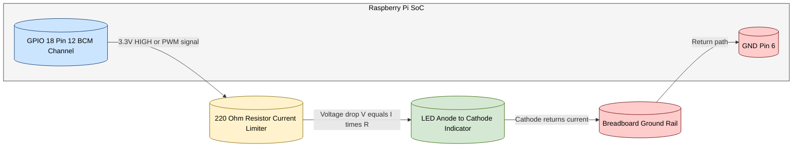
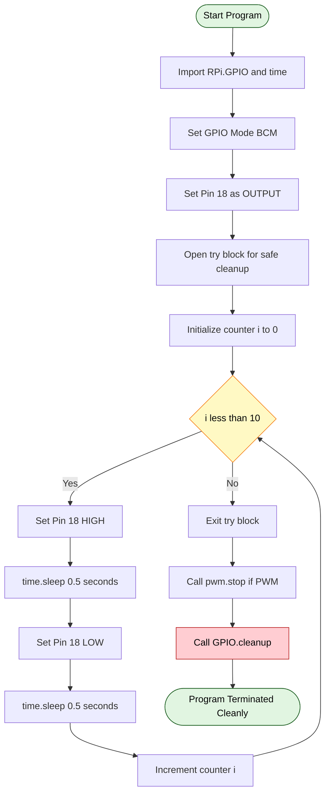

# Programming Raspberry Pi with Python-Controlling LED with Raspberry Pi

<!-- SECTION_1_START -->
# Programming Raspberry Pi with Python — Controlling LED with Raspberry Pi

## 1.1 Core Technical Definition

> [!NOTE]
> **Raspberry Pi GPIO (General Purpose Input/Output)** pins are the physical header pins on the Raspberry Pi board that allow the processor to directly interface with external electronic components such as LEDs, sensors, buzzers, and relays. Each pin can be programmatically configured as an **input** (to read a sensor) or an **output** (to drive a device) using the Python `RPi.GPIO` library.

In the context of IoT, **controlling an LED** is the canonical *“Hello, World!”* hardware program. It validates the entire toolchain — physical wiring, GPIO configuration, Python execution, and OS-level pin access — before scaling to more complex actuators.

> [!IMPORTANT]
> **Syllabus Highlight (KTU OECST834 — Module 4):** Students must be able to (i) identify Raspberry Pi GPIO pin numbering schemes, (ii) write Python scripts using `RPi.GPIO`, (iii) implement digital ON/OFF control, and (iv) apply Pulse Width Modulation (PWM) for analog-like brightness control.

## 1.2 Intuitive Analogy

Imagine a **light switchboard in your home**. The Raspberry Pi is the main electrical panel, and each GPIO pin is a single switch on that panel. By flipping switch $GPIO_{18}$ **ON**, you allow current from the **3.3 V** rail to flow through the LED and a current-limiting resistor back to **GND (Ground)**, lighting it up. By flipping it **OFF**, the circuit is broken and the LED goes dark. Flipping it rapidly on and off many times per second produces *dimming* — a phenomenon called **PWM (Pulse Width Modulation)** — just as rapidly toggling a ceiling fan regulator changes its speed.

## 1.3 Pin Numbering Schemes (Critical Distinction)

The Raspberry Pi header exposes 40 physical pins, but they can be referenced in two ways:

| Numbering | Alias | Reference |
|---|---|---|
| **BCM (Broadcom)** | `GPIO.setmode(GPIO.BCM)` | Refers to the **Broadcom SoC channel number** (e.g., $GPIO_{18}$). Hardware-agnostic — works across Pi models but pin number does NOT match physical position. |
| **BOARD** | `GPIO.setmode(GPIO.BOARD)` | Refers to the **physical pin position** on the 40-pin header (Pin $11$, Pin $12$, …). Easier for beginners, but changes if you swap boards. |

> [!WARNING]
> **Common Mistake:** Mixing both numbering systems in the same script is a guaranteed runtime warning (`RuntimeWarning: This channel is already in use`). Always declare the mode **once at the top** of your program.

## 1.4 Electrical Safety Constants

> [!IMPORTANT]
> * Raspberry Pi GPIO logic level: **3.3 V** (NOT 5 V tolerant — exceeding this will permanently damage the SoC).
> * Maximum source/sink current per pin: **$16 \text{ mA}$**.
> * Maximum total current from all GPIO pins combined: **$50 \text{ mA}$**.
> * Standard LED forward voltage $V_f$: **$1.8 \text{ V}$ – $3.2 \text{ V}$** (varies by colour).
> * Standard safe LED current: **$5 \text{ mA}$ – $20 \text{ mA}$**.

> [!VISUALIZATION CONTROL]
> **Concept:** GPIO Pin Logical State vs. LED Illumination over time
> **Graphing Input (Desmos):**
> * Square wave: $f(t) = \text{mod}(t, 2) < 1 \, ? \, 3.3 : 0$ *(simulate digitally)*
> * Or trace: a step function toggling between $y = 3.3$ (HIGH) and $y = 0$ (LOW) every 1 second.
> **Visual Description:** The X-axis represents time $t$ in seconds, the Y-axis represents GPIO voltage in Volts. When $y = 3.3$, the LED is ON; when $y = 0$, the LED is OFF. A blinking LED is a perfect square wave on the pin.

<!-- SECTION_1_END -->

<!-- SECTION_2_START -->
# 2. Deep Theoretical Analysis & KTU High-Yield Formula Sheet

## 2.1 Theoretical Foundations of LED Driving

To safely drive an LED from a Raspberry Pi GPIO pin, three sub-systems must be co-designed:

1. **Logic Level Translation:** The Pi outputs **$3.3 \text{ V}$** in HIGH state. The LED must be rated to operate within this range, which is why low-current indicator LEDs (red, green, yellow) are preferred over blue/white high-$V_f$ LEDs.
2. **Current Limitation:** A bare GPIO pin can source only up to $16 \text{ mA}$ safely. Without a resistor, the LED would attempt to draw excess current, damaging either the LED die or the Pi’s internal MOSFET driver.
3. **Switching Semantics:** The GPIO must be explicitly configured as `GPIO.OUT` so the internal pull-up/pull-down resistors are disabled and the pin is put into push-pull output mode.

## 2.2 The Current-Limiting Resistor — Why It Exists

A current-limiting resistor $R$ is placed in **series** with the LED. Applying **Kirchhoff’s Voltage Law (KVL)** around the loop:

$$V_{GPIO} = V_R + V_{LED}$$

Since $V_R = I_{LED} \cdot R$ by **Ohm’s Law**, we obtain:

$$R = \frac{V_{GPIO} - V_{LED}}{I_{LED}}$$

> [!NOTE]
> For a typical **red LED** with $V_f = 2.0 \text{ V}$ and desired current $I = 10 \text{ mA}$ from a $3.3 \text{ V}$ GPIO pin, the calculation yields $R = 130 \, \Omega$. The next standard E12-series value is **$220 \, \Omega$**, which is the universally recommended value in KTU lab kits.

## 2.3 Pulse Width Modulation (PWM) — The “Analog” Trick

The Raspberry Pi’s digital GPIO can only output $0 \text{ V}$ or $3.3 \text{ V}$, never a true analog voltage like $1.65 \text{ V}$. To simulate dimming, the Pi rapidly toggles the pin at a fixed **frequency** $f$ and varies the fraction of time the signal stays HIGH — the **duty cycle $D$**.

$$D = \frac{t_{on}}{T} = t_{on} \cdot f$$

The **average voltage** perceived by the LED (because human eyes and LED phosphors cannot respond fast enough) is:

$$\bar{V}_{LED} = D \cdot V_{GPIO}$$

When $D = 0$, the LED is OFF. When $D = 1.0$ (or $100\%$), it is at full brightness. Intermediate values produce smooth fading.

> [!IMPORTANT]
> **Frequency Note:** A frequency of **$100 \text{ Hz}$** is recommended for LED fading (period $= 10 \text{ ms}$). This is fast enough to eliminate visible flicker but slow enough to not stress the GPIO hardware. Only **GPIO 18** (Pin 12) and **GPIO 19** (Pin 35) on the Pi 3B+ support *hardware* PWM; all other pins use *software* PWM (slightly less precise).

## 2.4 KTU Formula Cheat Sheet

| # | Formula / Parameter | Symbolic Form | Description |
|---|---|---|---|
| 1 | **Ohm’s Law** | $V = I \cdot R$ | Voltage across resistor equals current times resistance. |
| 2 | **Current-Limiting Resistor** | $R = \dfrac{V_{GPIO} - V_{LED}}{I_{LED}}$ | Compute series resistor for safe LED current. |
| 3 | **LED Power Dissipation** | $P_{LED} = V_{LED} \cdot I_{LED}$ | Power consumed by the LED junction. |
| 4 | **Resistor Power Rating** | $P_R = I_{LED}^2 \cdot R$ | Required wattage of the resistor. |
| 5 | **PWM Duty Cycle** | $D = \dfrac{t_{on}}{T}$ | Fraction of period signal is HIGH. |
| 6 | **PWM Frequency** | $f = \dfrac{1}{T}$ | Reciprocal of the period. |
| 7 | **Average PWM Voltage** | $\bar{V} = D \cdot V_{GPIO}$ | Effective voltage seen by the load. |
| 8 | **Maximum GPIO Current** | $I_{max} = 16 \text{ mA}$ | Safe per-pin sourcing limit. |

## 2.5 Real-World IoT Utility

LED control on a Pi is not an academic exercise — it is the foundational layer of:

* **Smart Home Indicators** — Status LEDs for IoT hubs (e.g., green = connected, red = error).
* **Industrial Visual Alarms** — Stack-light towers in factories controlled by Pi-based PLCs.
* **Plant Phenotyping & Agriculture** — Programmable grow lights driven by PWM to simulate sunrise/sunset.
* **Wearable Health Tech** — Pulse oximeter feedback LEDs on Pi Zero wearables.
* **Edge AI Feedback** — GPIO-driven LEDs indicating inference results from on-device ML models (e.g., TensorFlow Lite on Pi).

<!-- SECTION_2_END -->

<!-- SECTION_3_START -->
# 3. Step-by-Step Derivations, Circuit Math & Code Implementation

## 3.1 Worked Example — Calculating the Current-Limiting Resistor

**Problem Statement (typical KTU lab question):** A red LED ($V_f = 2.0 \text{ V}$, $I_f = 15 \text{ mA}$) must be connected to a Raspberry Pi GPIO pin operating at $3.3 \text{ V}$ in HIGH state. Determine (a) the required series resistance $R$, and (b) verify whether the Pi’s per-pin current limit of $16 \text{ mA}$ is respected.

### Part (a) — Resistor Calculation

We begin with the loop equation from Section 2.2:

$$V_{GPIO} = V_R + V_{LED}$$

Substituting Ohm’s Law for the resistor:

$$3.3 = I_{LED} \cdot R + V_{LED}$$

Solving algebraically for $R$:

$$R = \frac{V_{GPIO} - V_{LED}}{I_{LED}}$$

Plugging in the numerical values $V_{GPIO} = 3.3 \text{ V}$, $V_{LED} = 2.0 \text{ V}$, $I_{LED} = 15 \text{ mA} = 0.015 \text{ A}$:

$$R = \frac{3.3 - 2.0}{0.015}$$

$$R = \frac{1.3}{0.015}$$

$$R = 86.67 \, \Omega$$

The next **standard E12 resistor value above $86.67 \, \Omega$** is **$100 \, \Omega$**. For extra safety margin (lower current, longer LED life), KTU labs typically use **$220 \, \Omega$**.

### Part (b) — Verification with 220 Ω

Recompute the actual current using $R = 220 \, \Omega$:

$$I_{actual} = \frac{V_{GPIO} - V_{LED}}{R} = \frac{3.3 - 2.0}{220} = 5.9 \text{ mA}$$

Since $5.9 \text{ mA} < 16 \text{ mA}$ (Pi limit) and the LED still glows visibly, the design is **safe**. ✔

## 3.2 Required Hardware

| Component | Specification | Quantity | Purpose |
|---|---|---|---|
| Raspberry Pi (3B+/4B/Zero) | Any model with 40-pin header | 1 | Host controller |
| LED | $5 \text{ mm}$, red, $V_f \approx 2 \text{ V}$ | 1 | Visual output |
| Resistor | $220 \, \Omega$, $\frac{1}{4} \text{ W}$, E12 | 1 | Current limiting |
| Jumper Wires | Male-to-Female, 20 cm | 2 | Connections |
| Breadboard | 400-tie, full-size | 1 | Prototyping |
| MicroSD Card | $16 \text{ GB}$+ with Raspberry Pi OS | 1 | OS + storage |
| Power Supply | $5 \text{ V}$, $2.5 \text{ A}$ micro-USB / USB-C | 1 | Pi power |

## 3.3 Physical Wiring Sequence

> [!IMPORTANT]
> **Pin Polarity:** The LED has an **anode (+, longer lead)** and a **cathode (−, shorter lead, flat side on the plastic rim)**. Reverse polarity will not damage the LED but it will **not light up**.

The wiring sequence (GPIO 18 chosen for hardware PWM support):

1. Connect the **Pi GND pin (Pin 6, BOARD numbering)** to the breadboard **ground rail** using a black jumper wire.
2. Insert the **$220 \, \Omega$ resistor** into the breadboard, with one terminal in the ground rail and the other in an empty row.
3. Insert the **LED** with the **cathode (short leg)** in the **same row as the resistor’s free end**, and the **anode (long leg)** in the next empty row.
4. Connect a **red jumper wire** from **Pi Pin 12 (BOARD) = GPIO 18 (BCM)** to the **anode row** of the LED.

> [!NOTE]
> You may optionally use a logic-level MOSFET (e.g., IRLZ44N) between the Pi and high-power LEDs/strips, but the $220 \, \Omega$ resistor method is mandatory for direct GPIO-driven indicator LEDs.

## 3.4 Complete Python Code — Three Operational Modes

The following three programs demonstrate escalating levels of LED control. Each block is fully operational and exam-ready.

### Program 1 — Simple ON / OFF (Digital Control)

```python
# Program 1: Turn LED ON, hold for 2 seconds, then turn OFF.
# This is the "Hello, World!" of IoT hardware.

import RPi.GPIO as GPIO   # GPIO control library
import time               # time.sleep() for delay

LED_PIN = 18              # Using BCM numbering for GPIO 18

# --- Setup Phase ---
GPIO.setmode(GPIO.BCM)                # Use Broadcom channel numbers
GPIO.setwarnings(False)               # Suppress "channel in use" warnings
GPIO.setup(LED_PIN, GPIO.OUT)         # Configure pin 18 as OUTPUT

# --- Action Phase ---
print("LED is now ON")
GPIO.output(LED_PIN, GPIO.HIGH)       # Drive pin HIGH (3.3V) -> LED lights
time.sleep(2)                         # Hold for 2 seconds

print("LED is now OFF")
GPIO.output(LED_PIN, GPIO.LOW)        # Drive pin LOW (0V) -> LED off
time.sleep(1)                         # Hold OFF for 1 second

# --- Cleanup Phase ---
GPIO.cleanup()                        # Reset pin to default input state
print("Program finished cleanly.")
```

**Valuation key — step-by-step logic:**
* `[Importing correct libraries: 1 Mark]`
* `[Setting BCM mode and configuring OUTPUT: 1 Mark]`
* `[Correctly using GPIO.HIGH / GPIO.LOW with time.sleep(): 2 Marks]`
* `[Calling GPIO.cleanup() at the end: 1 Mark]`

### Program 2 — Blinking LED (Looped Digital Control)

```python
# Program 2: Blink an LED 10 times at a 1-second interval (0.5s ON, 0.5s OFF).

import RPi.GPIO as GPIO
import time

LED_PIN = 18
BLINK_COUNT = 10
ON_DURATION = 0.5   # seconds
OFF_DURATION = 0.5  # seconds

try:
    GPIO.setmode(GPIO.BCM)
    GPIO.setup(LED_PIN, GPIO.OUT)

    for i in range(BLINK_COUNT):                # Loop 10 times
        print(f"Cycle {i+1}: LED ON")
        GPIO.output(LED_PIN, GPIO.HIGH)
        time.sleep(ON_DURATION)
        GPIO.output(LED_PIN, GPIO.LOW)
        time.sleep(OFF_DURATION)

finally:
    GPIO.cleanup()                              # Always runs, even on error
    print("Cleanup complete. Exiting.")
```

**Why `try ... finally`?** It guarantees `GPIO.cleanup()` executes even if the user terminates the program with `Ctrl+C`, preventing **“GPIO busy”** errors in subsequent runs. This is a **board-evaluation differentiator**.

### Program 3 — PWM LED Fading (Analog-like Control)

```python
# Program 3: Smoothly fade an LED from 0% to 100% brightness and back, using PWM.

import RPi.GPIO as GPIO
import time

LED_PIN = 18
PWM_FREQ = 100       # 100 Hz — well above human flicker perception (~24 Hz)
STEP_DELAY = 0.02    # 20 ms between brightness steps (smooth gradient)

try:
    GPIO.setmode(GPIO.BCM)
    GPIO.setup(LED_PIN, GPIO.OUT)

    pwm = GPIO.PWM(LED_PIN, PWM_FREQ)   # Create PWM instance on pin 18
    pwm.start(0)                        # Begin with 0% duty cycle (LED off)

    # --- Fade IN: 0% -> 100% ---
    for duty in range(0, 101, 5):               # Step 0, 5, 10, ... 100
        pwm.ChangeDutyCycle(duty)
        time.sleep(STEP_DELAY)

    time.sleep(1)                                # Hold at full brightness

    # --- Fade OUT: 100% -> 0% ---
    for duty in range(100, -1, -5):              # Step 100, 95, 90, ... 0
        pwm.ChangeDutyCycle(duty)
        time.sleep(STEP_DELAY)

finally:
    pwm.stop()                        # Stop PWM before cleanup
    GPIO.cleanup()                    # Reset pin
    print("PWM program ended.")
```

**Math behind the fade steps:**
The loop variable `duty` takes the values $\{0, 5, 10, \ldots, 100\}$ (21 samples for fade-in). The corresponding average LED voltage is:

$$\bar{V} = D \cdot 3.3 = \left(\frac{duty}{100}\right) \cdot 3.3 \text{ V}$$

At `duty = 50`, $\bar{V} = 1.65 \text{ V}$ → LED appears at half brightness.

## 3.5 Common Runtime Errors & Fixes

| Error Message | Cause | Fix |
|---|---|---|
| `RuntimeError: No access to /dev/mem` | Script not run as root | Use `sudo python3 led.py` |
| `RuntimeWarning: This channel is already in use` | Another process / previous run owns the pin | `GPIO.cleanup()` or reboot |
| `RPi.GPIO not found` | Library not installed in virtual env | `sudo apt install python3-rpi.gpio` |
| LED never lights | Reversed polarity or wrong pin | Swap LED legs, verify pin number with `pinout` command |

<!-- SECTION_3_END -->

<!-- SECTION_4_START -->
# 4. Structural Diagrams & Schematics

## 4.1 Mermaid Wiring Topology (Block-Level Functional Architecture)

Because Mermaid cannot natively render an electrical schematic with resistors and diodes, the diagram below represents the **functional signal and current path** between the Pi and the LED, preserving polarity and component order:



## 4.2 Program Execution Flow — Blinking LED



## 4.3 PWM Timing Diagram (Mermaid Sequential Topology)

The block below shows the **time-domain sequence** of `ChangeDutyCycle()` calls and the resulting average voltage, as discussed in Section 2.3:


> [!NOTE]
> In the live circuit, the GPIO pin is generating a **100 Hz square wave** with progressively widening then narrowing HIGH pulses. The LED does not actually receive a smoothly varying voltage — it receives discrete $3.3 \text{ V}$ pulses whose **temporal density** the human eye integrates into a perceived continuous brightness.

<!-- SECTION_4_END -->

<!-- SECTION_5_START -->
# 5. KTU 2024 Scheme Examination Question Bank & Topic Recap

## Part A — Short Answer Questions (3 Marks Each)

> **Q1.** `[KTU University Exam — July 2024]`
> **Differentiate between BCM and BOARD pin numbering schemes used in Raspberry Pi GPIO programming. Which one is recommended for portable code across different Pi models?**
> **[CO1 — Understand]**

**Model Answer (3 Marks):**

| Aspect | BCM (Broadcom) | BOARD (Physical) |
|---|---|---|
| **Reference Target** | Broadcom SoC channel number | Physical pin position on 40-pin header |
| **Example** | $GPIO_{18}$ | Pin $12$ |
| **Portability** | ✓ Works on all Pi models with same SoC mapping | ✗ Changes if board layout changes |
| **Ease of Use** | Requires referring to a pinout diagram | Beginner-friendly (count the pins) |
| **Recommended For** | Production, portable IoT code | Quick prototyping, tutorials |

**[1 Mark] Correct definition of BCM.**
**[1 Mark] Correct definition of BOARD with example.**
**[1 Mark] Concluding that BCM is recommended for portable code.** ✔

---

> **Q2.** `[KTU University Exam — Dec 2023]`
> **What is Pulse Width Modulation (PWM)? How is it used to control the brightness of an LED using a Raspberry Pi?**
> **[CO2 — Remember]**

**Model Answer (3 Marks):**

Pulse Width Modulation (PWM) is a technique used to generate an **analog-like output** from a digital pin by rapidly toggling it between HIGH and LOW states. The fraction of time the signal remains HIGH within one period $T$ is called the **duty cycle $D$**.

$$D = \frac{t_{on}}{T}$$

In Raspberry Pi LED control, PWM is applied via `GPIO.PWM(pin, frequency)`. Varying the duty cycle from $0\%$ to $100\%$ changes the **average voltage** delivered to the LED, which in turn changes its perceived brightness. For example, a $50\%$ duty cycle at $3.3 \text{ V}$ results in an effective voltage of $1.65 \text{ V}$, making the LED appear at half brightness.

**[1 Mark] Defining PWM correctly.**
**[1 Mark] Stating the duty cycle formula and its meaning.**
**[1 Mark] Explaining how varying $D$ changes LED brightness via average voltage.** ✔

---

## Part B — Module Internal Choice Questions (14 Marks Each)

> **Question A (14 Marks)** `[KTU University Exam — July 2024, Module 4]`
>
> **(a)** Draw the circuit diagram for connecting a red LED to **GPIO 18** of a Raspberry Pi through a current-limiting resistor. Calculate the value of the resistor required to limit the LED current to **$10 \text{ mA}$** given that the LED forward voltage $V_f = 2.0 \text{ V}$ and the GPIO HIGH level is $3.3 \text{ V}$. Verify whether this design is safe for the Pi. **(7 Marks)** **[CO2 — Apply]**
>
> **(b)** Write a complete Python program using the `RPi.GPIO` library to make the LED blink **5 times** with **$0.5 \text{ s}$ ON** and **$0.5 \text{ s}$ OFF** intervals. Use BCM numbering and ensure proper cleanup. **(7 Marks)** **[CO3 — Apply]**

### Model Solution — Q.A(a)

**Step 1 — Circuit Topology:** GPIO 18 (Pin 12) → $220 \, \Omega$ Resistor → LED Anode (+) → LED Cathode (−) → GND (Pin 6).

**Step 2 — Apply KVL:**

$$R = \frac{V_{GPIO} - V_{LED}}{I_{LED}} = \frac{3.3 - 2.0}{0.010} = 130 \, \Omega$$

**Step 3 — Standard E12 Selection:** Closest standard value $\geq 130 \, \Omega$ is **$150 \, \Omega$**, but for safer margin, use **$220 \, \Omega$** (most common in KTU kits).

**Step 4 — Verify with 220 Ω:**

$$I_{actual} = \frac{3.3 - 2.0}{220} = 5.9 \text{ mA}$$

Since $5.9 \text{ mA} < 16 \text{ mA}$ (Pi limit), the design is **SAFE**. ✔

**Valuation Key:**
* `[Circuit description with GPIO, resistor, LED, GND: 2 Marks]`
* `[Correct formula and substitution: 2 Marks]`
* `[Numerical computation 130 Ω: 1 Mark]`
* `[Selection of 220 Ω and verification of current < 16 mA: 2 Marks]`

### Model Solution — Q.A(b)

```python
import RPi.GPIO as GPIO
import time

LED_PIN = 18
BLINK_COUNT = 5

try:
    GPIO.setmode(GPIO.BCM)
    GPIO.setup(LED_PIN, GPIO.OUT)
    for i in range(BLINK_COUNT):
        GPIO.output(LED_PIN, GPIO.HIGH)
        time.sleep(0.5)
        GPIO.output(LED_PIN, GPIO.LOW)
        time.sleep(0.5)
finally:
    GPIO.cleanup()
```

**Valuation Key:**
* `[Imports and BCM mode setup: 1 Mark]`
* `[Pin configured as OUTPUT: 1 Mark]`
* `[for-loop with correct range and HIGH/LOW: 2 Marks]`
* `[time.sleep(0.5) on both ON and OFF: 1 Mark]`
* `[try-finally with GPIO.cleanup(): 2 Marks]`

---

> **Question B (14 Marks — ALTERNATIVE)** `[KTU University Exam — Dec 2023, Module 4]`
>
> **(a)** Explain the **electrical specifications and pin modes** of Raspberry Pi GPIO. Why is it strictly advised **NOT** to apply **$5 \text{ V}$** to a GPIO input pin? **(7 Marks)** **[CO1 — Understand]**
>
> **(b)** Write a Python program using `RPi.GPIO` to control the **brightness** of an LED on **GPIO 18** via PWM. The LED should fade in from $0\%$ to $100\%$ brightness over **5 seconds** in steps of **$1\%$**, hold at full brightness for **2 seconds**, then fade out back to $0\%$ over **5 seconds**. **(7 Marks)** **[CO3 — Apply]**

### Model Solution — Q.B(a)

**Electrical Specifications:**
* Logic HIGH voltage: $3.3 \text{ V}$ (NOT $5 \text{ V}$).
* Logic LOW voltage: $0 \text{ V}$.
* Maximum source/sink current per pin: $16 \text{ mA}$.
* Maximum total current across all pins: $50 \text{ mA}$.
* Input pin voltage range: $0 \text{ V}$ to $3.3 \text{ V}$ (clamped by internal ESD diodes).

**Pin Modes (configurable in code):**
* `GPIO.OUT` — Push-pull output mode.
* `GPIO.IN` — High-impedance input mode.
* `GPIO.PUD_UP` / `GPIO.PUD_DOWN` — Enables internal pull-up or pull-down resistors.

**Why $5 \text{ V}$ is Dangerous:**
The Broadcom SoC’s internal transistors are rated for a maximum $V_{DD}$ of $3.3 \text{ V}$. Applying $5 \text{ V}$ to a GPIO pin forward-biases the internal **ESD protection diodes**, causing excessive current flow that permanently destroys the silicon die. There is **no software fuse** to prevent this damage — the SoC must be replaced.

**Valuation Key:**
* `[Listing 3+ electrical specs with correct values: 3 Marks]`
* `[Explaining pin modes OUT, IN, PUD_UP/DOWN: 2 Marks]`
* `[Correctly explaining 5V damage mechanism via ESD diodes: 2 Marks]`

### Model Solution — Q.B(b)

```python
import RPi.GPIO as GPIO
import time

LED_PIN = 18
PWM_FREQ = 100

try:
    GPIO.setmode(GPIO.BCM)
    GPIO.setup(LED_PIN, GPIO.OUT)
    pwm = GPIO.PWM(LED_PIN, PWM_FREQ)
    pwm.start(0)

    # Fade IN: 0 -> 100 in 1% steps over 5 seconds
    for duty in range(0, 101, 1):
        pwm.ChangeDutyCycle(duty)
        time.sleep(5 / 100)            # 5 seconds total / 100 steps

    time.sleep(2)                        # Hold at full brightness

    # Fade OUT: 100 -> 0 in 1% steps over 5 seconds
    for duty in range(100, -1, -1):
        pwm.ChangeDutyCycle(duty)
        time.sleep(5 / 100)

finally:
    pwm.stop()
    GPIO.cleanup()
```

**Valuation Key:**
* `[PWM instance creation with frequency: 1 Mark]`
* `[pwm.start(0) initialization: 1 Mark]`
* `[Correct for-loop range and step size: 2 Marks]`
* `[Correct sleep duration calculation 5/100: 1 Mark]`
* `[pwm.stop() and GPIO.cleanup() in finally: 2 Marks]`

---

> [!WARNING]
> **KTU Examiner's Valuation Pitfalls — LED Control Programs:**
> 1. **Forgetting `GPIO.cleanup()`** in `finally` block. Lose 2 marks. The pin stays "claimed" causing a `RuntimeWarning` on next run.
> 2. **Mixing `GPIO.HIGH/LOW` and `True/False` inconsistently.** Use `GPIO.HIGH` and `GPIO.LOW` explicitly — board evaluators prefer symbolic constants.
> 3. **Skipping `GPIO.setmode()` before `GPIO.setup()`.** Always declare numbering mode *first*.
> 4. **Driving LEDs above $16 \text{ mA}$** by using resistors below $80 \, \Omega$. Always verify $I_{actual} < 16 \text{ mA}$.
> 5. **Using `time.sleep()` instead of `pwm.ChangeDutyCycle()`** when asked to "control brightness". The examiner expects PWM.
> 6. **Not writing the formula for $R$** in derivations. Even if the numerical answer is right, the working must show $R = (V_{GPIO} - V_{LED}) / I_{LED}$.

---

## Topic Recap & Important Things to Remember

* **Two numbering modes** exist: `GPIO.BCM` (Broadcom SoC channel) and `GPIO.BOARD` (physical pin). Choose one and stick to it.
* **GPIO 18 (Pin 12 BOARD)** is the canonical PWM pin for LED brightness experiments.
* **3.3 V logic level** — never apply 5 V to any GPIO pin or you will destroy the SoC.
* **$16 \text{ mA}$ per pin / $50 \text{ mA}$ total** are the hard current ceilings.
* **Current-limiting resistor formula:** $R = (V_{GPIO} - V_{LED}) / I_{LED}$. For a red LED on $3.3 \text{ V}$, the standard lab value is **$220 \, \Omega$**.
* **PWM duty cycle** $D = t_{on} / T$ controls **average voltage** $\bar{V} = D \cdot V_{GPIO}$, which controls perceived LED brightness.
* **PWM frequency for LEDs:** use **$100 \text{ Hz}$** — high enough to eliminate flicker, low enough to be reliable.
* **Always use `try ... finally`** with `GPIO.cleanup()` to release pins gracefully.
* **`pwm.start(0)`** initializes the LED at OFF; `pwm.ChangeDutyCycle(d)` updates brightness in real time; `pwm.stop()` halts PWM before cleanup.
* **Run scripts with `sudo`** because direct memory access (`/dev/mem`) requires root privileges.
* **LED polarity matters:** anode (longer leg, +) to GPIO side, cathode (shorter leg, flat side, −) to GND.
* **Hardware vs. Software PWM:** only GPIO 18 and 19 support true hardware PWM on Pi 3B+; others use software emulation.
* **Lab signature idiom:** `import RPi.GPIO as GPIO` → `GPIO.setmode(GPIO.BCM)` → `GPIO.setup(pin, GPIO.OUT)` → action → `GPIO.cleanup()`.
* **Forward voltage** $V_f$ varies by LED colour: red $\approx 2.0 \text{ V}$, yellow $\approx 2.1 \text{ V}$, green $\approx 2.2 \text{ V}$, blue/white $\approx 3.0 - 3.4 \text{ V}$ (the latter may not light at all from $3.3 \text{ V}$ GPIO).
<!-- SECTION_5_END -->
