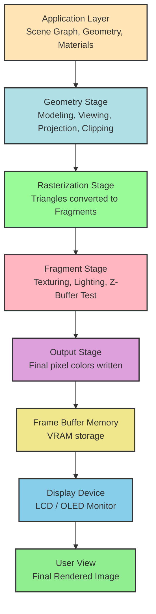
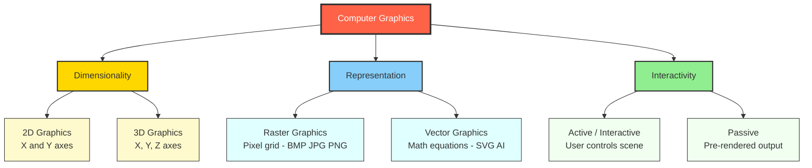
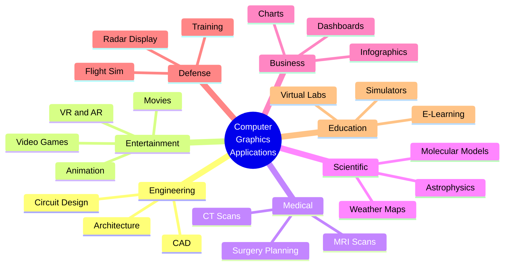
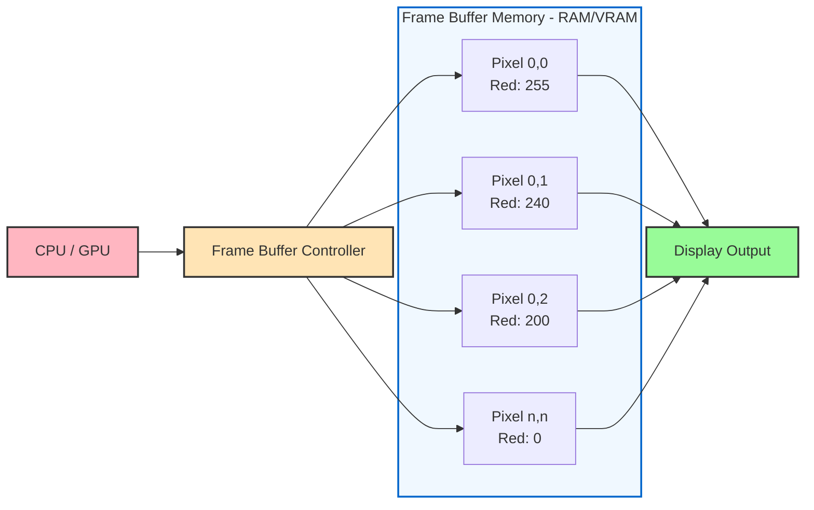
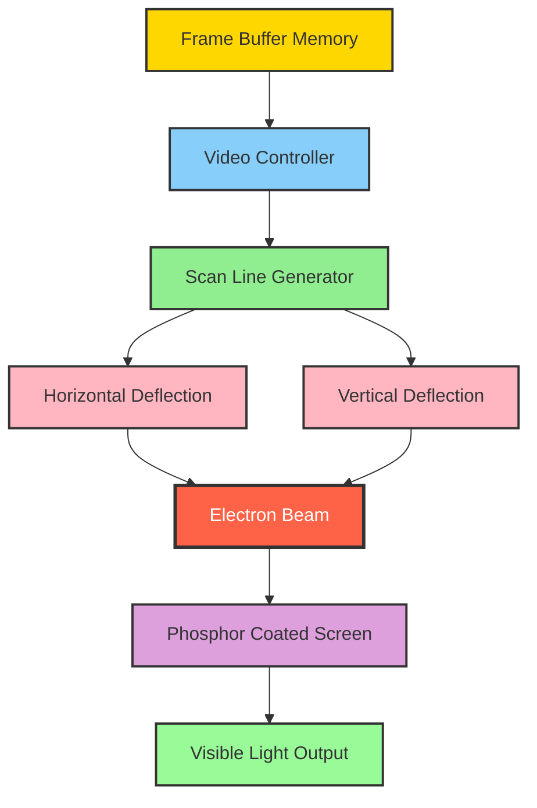
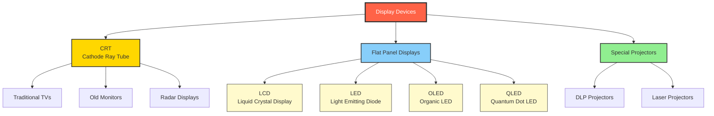

# Basics of Computer graphics - Basics of Computer Graphics and its applications.

<!-- SECTION_1_START -->
# Basics of Computer Graphics

## 1. Core Technical Definition

> [!NOTE]
> **Formal Definition (KTU 2024 Syllabus Terminology)**
> **Computer Graphics (CG)** is a discipline of computer science that deals with the **generation, storage, manipulation, and display of pictorial output** (images, drawings, animations) using computer hardware and software. It encompasses the mathematical and computational techniques used to create visual content from conceptual models and data.

In the KTU 2024 Scheme (Course Code: **OECST835**), Computer Graphics is positioned as an **Open Elective (OEC)** course, meaning it introduces students from various engineering branches to the foundational concepts of visual computing without assuming prior graphics programming knowledge.

### Conceptual Analogy / Intuition

> [!IMPORTANT]
> **Think of Computer Graphics as a "Digital Photographer's Studio on Steroids"** 📸
>
> Imagine a real photographer's studio. The photographer needs:
> 1. A **subject** (the model or scene) — this is your *3D model or geometric data*.
> 2. **Lights** arranged around the subject — these are your *light sources and illumination models*.
> 3. A **camera** with a lens — this represents your *virtual camera (viewing transformation)*.
> 4. A **film/sensor** that captures the image — this is your *frame buffer* and *rasterization*.
> 5. A **darkroom** where the photo is developed and printed — this is your *display device and rendering pipeline*.
>
> Computer Graphics is essentially the **digitization and automation of this entire photographic workflow**, but with infinite flexibility: you can change lighting, camera angle, scene, and materials *mathematically* in real time, and the "photo" is synthesized rather than captured.

### Key Entities in Computer Graphics

| Entity | Description | KTU Exam Significance |
|---|---|---|
| **Pixel (Picture Element)** | The smallest addressable unit on a display | Foundation of raster graphics |
| **Resolution** | Number of pixels per unit area (e.g., $1920 \times 1080$) | Determines image clarity |
| **Frame Buffer** | Memory area holding pixel values before display | Critical for rendering speed |
| **Refresh Rate** | Number of times the screen redraws per second (in **Hz**) | Affects animation smoothness |
| **Aspect Ratio** | Ratio of width to height (e.g., $16:9$) | Used in viewport mapping |

> [!VISUALIZATION CONTROL]
> **Concept:** Resolution and Pixel Grid
> **Grid Description:** Imagine a 2D Cartesian plane. The horizontal axis is the X-coordinate of pixels, the vertical axis is the Y-coordinate. Each intersection point represents one pixel.
> **Sample Resolution:** $800 \times 600$ means 800 pixels along X (horizontal) and 600 pixels along Y (vertical), forming a rectangular grid of **4,80,000** total pixels.
> **Aspect Ratio of $800 \times 600$:** $\frac{800}{600} = \frac{4}{3} = 1.333$
> **Visual Description:** A rectangular grid; observe how increasing resolution (e.g., to $1920 \times 1080$) makes each individual cell smaller, producing a sharper image but requiring **more memory** (approximately $1920 \times 1080 \times 3$ bytes for RGB color).

---

## 2. Components / Building Blocks of a Computer Graphics System

A complete CG system integrates **five functional layers**:

1. **Input Devices** — Keyboard, mouse, light pen, joystick, digitizer, scanner, data glove.
2. **Processing Unit (CPU/GPU)** — Performs geometric transformations, clipping, rasterization.
3. **Graphics Software** — APIs such as **OpenGL**, **DirectX**, **Vulkan**, and libraries like **GLUT**, **GLFW**, **SDL**.
4. **Memory (Frame Buffer & Display List)** — Stores pixel data and geometric primitives.
5. **Output Devices** — Raster displays (CRT, LCD, LED), printers, plotters, VR headsets.

> [!NOTE]
> **KTU High-Yield Note**
> The **GPU (Graphics Processing Unit)** is a specialized processor designed for **parallel computation** of graphics primitives. Unlike the CPU (which excels at sequential tasks), the GPU has thousands of small cores optimized for matrix multiplications and vector operations — the heart of modern rendering.

---

## 3. Classification of Computer Graphics

Computer Graphics is broadly classified into the following categories based on the type of data handled and the rendering technique used:

### 3.1 Based on Dimensionality

| Type | Description | Examples |
|---|---|---|
| **2D Graphics** | Two-dimensional flat images using X and Y axes | Logos, UI, diagrams, pixel art |
| **3D Graphics** | Three-dimensional scenes with depth (Z-axis) | Movies, games, CAD models |

### 3.2 Based on Representation

| Type | Representation | File Examples |
|---|---|---|
| **Raster (Bitmap) Graphics** | Grid of pixels, each with a color value | **.bmp**, **.jpg**, **.png**, **.gif** |
| **Vector Graphics** | Mathematical equations of points, lines, curves | **.svg**, **.ai**, **.eps**, **.pdf** |

> [!IMPORTANT]
> **KTU Exam Tip**
> The difference between raster and vector is a **frequently asked 3-mark question**. Remember: **raster scales poorly** (becomes pixelated when zoomed) while **vector scales infinitely** because it is resolution-independent.

### 3.3 Based on Generation Method

* **Passive Computer Graphics** — User has *no* interactive control over the scene; only the final image is shown (e.g., a rendered movie scene).
* **Active (Interactive) Computer Graphics** — User can *manipulate* the scene in real time (e.g., video games, CAD software, flight simulators).

> [!NOTE]
> **Interactive CG** requires a minimum frame rate of **30 frames per second (FPS)** for smooth user experience, while **60 FPS** is the industry standard for immersive applications like VR.

---

## 4. Applications of Computer Graphics

The applications of Computer Graphics span virtually every engineering and non-engineering domain. The KTU 2024 syllabus explicitly highlights the following application areas:

### 4.1 Domain-Wise Application Matrix

| Domain | Specific Applications | KTU Exam Importance |
|---|---|---|
| **Entertainment** | Movies (Pixar, Marvel VFX), Animation, Video Games, AR/VR | High |
| **Education \& Training** | E-learning animations, flight simulators, medical simulators | High |
| **Engineering \& CAD** | AutoCAD, SolidWorks, circuit design, architectural blueprints | Very High |
| **Medical Imaging** | MRI/CT scan visualization, surgical planning, 3D anatomy | High |
| **Scientific Visualization** | Weather maps, molecular modeling, astrophysics, fluid dynamics | Medium |
| **User Interfaces (UI)** | Operating systems, mobile apps, dashboards | Medium |
| **Business \& Finance** | Bar charts, pie charts, infographics, stock visualizations | Medium |
| **Defense \& Military** | Battlefield simulation, radar/sonar visualization, missile guidance | High |
| **Cartography (Maps)** | Google Maps, GIS systems, GPS navigation | Medium |
| **Art \& Advertising** | Digital painting, motion graphics, 3D advertisements | Low |

### 4.2 Detailed Real-World Application Explanations

#### A. Computer-Aided Design (CAD)
Engineers use CG to design mechanical parts, buildings, and electronic circuits. Tools like **AutoCAD**, **CATIA**, and **SolidWorks** allow precise 2D drafting and 3D modeling with accurate measurements, reducing prototyping costs.

#### B. Entertainment \& Gaming
From 2D arcade games to photorealistic 3D titles like *Cyberpunk 2077*, CG powers the entire gaming industry. **Ray tracing**, **global illumination**, and **physically-based rendering (PBR)** are modern techniques used here.

#### C. Medical Visualization
Doctors use CG to visualize 3D reconstructions of patients' organs from **CT (Computed Tomography)** and **MRI (Magnetic Resonance Imaging)** scans, enabling precise diagnosis and pre-surgical planning.

#### D. Virtual Reality (VR) \& Augmented Reality (AR)
VR creates fully immersive virtual environments (e.g., **Meta Quest 3**, **Apple Vision Pro**), while AR overlays digital information on the real world (e.g., **Pokémon GO**, **IKEA Place app**).

#### E. Scientific Visualization
Researchers visualize complex datasets such as **protein folding**, **weather patterns**, and **black hole simulations** using CG techniques like **volume rendering** and **isosurface extraction**.

> [!TIP]
> **Mnemonic for CG Applications — "MEDUSA-FACTS"**
> **M** — Medical imaging
> **E** — Entertainment (games, movies)
> **D** — Design (CAD, architecture)
> **U** — User Interfaces
> **S** — Scientific visualization
> **A** — Astronomy / Astrophysics
> **F** — Flight simulation / Defense
> **A** — Advertising / Art
> **C** — Cartography (maps)
> **T** — Training (simulators)
> **S** — Simulation (engineering, weather)

---

## 5. Advantages and Disadvantages of Computer Graphics

### Advantages

1. **Enhanced Visualization** — Complex data is interpreted more easily.
2. **Cost-Effective Prototyping** — Saves material and labor in product design.
3. **Interactive Learning** — Simulators provide risk-free training (e.g., pilot training).
4. **High Accuracy** — Eliminates human drawing errors in technical diagrams.
5. **Time Efficiency** — Animations and renders can be regenerated quickly.

### Disadvantages

1. **High Hardware Cost** — Powerful GPUs and high-resolution displays are expensive.
2. **Software Complexity** — Tools like Maya, Blender, and Houdini have steep learning curves.
3. **Power Consumption** — High-end rendering farms consume enormous electricity.
4. **Realism Limitations** — Achieving photorealism requires heavy computational resources.
5. **Health Issues** — Prolonged exposure can cause eye strain, headaches, and posture problems.
<!-- SECTION_1_END -->

<!-- SECTION_2_START -->
# Deep Theoretical Analysis & KTU High-Yield Formula Sheet

## 1. The Computer Graphics Pipeline (Conceptual Flow)

The graphics pipeline is the **end-to-end process** of converting 3D scene data into a 2D image on the screen. It is the heart of modern rendering and is a **high-yield topic** for KTU exams.

### The Six Logical Stages

1. **Application Stage**
   * The user's application (game engine, CAD tool) provides the scene description: geometry, materials, lights, camera.
   * Output: A scene graph containing 3D objects, textures, and shading parameters.

2. **Geometry Stage**
   * Per-vertex and per-primitive operations occur here:
     * **Modeling Transformation** — Converts object coordinates (local space) to world coordinates.
     * **Viewing Transformation** — Positions the virtual camera (eye coordinates).
     * **Projection Transformation** — Maps 3D world to 2D image plane (perspective or orthographic).
     * **Clipping** — Discards primitives outside the view frustum.
     * **Screen Mapping** — Converts NDC (Normalized Device Coordinates) to screen pixel coordinates.

3. **Rasterization Stage**
   * Converts geometric primitives (triangles, lines, points) into **fragments** (potential pixels).
   * Each fragment carries data: position, color, depth, texture coordinates.

4. **Fragment (Per-Fragment Operations) Stage**
   * **Texturing** — Applies image textures to surfaces.
   * **Lighting calculations** — Phong, Blinn-Phong, PBR shading.
   * **Depth Testing (Z-buffer)** — Removes hidden surfaces.
   * **Blending** — Combines translucent fragments.
   * Output: Final pixel color stored in the framebuffer.

5. **Output Stage**
   * The framebuffer is read and displayed on the monitor via **HDMI**, **DisplayPort**, or **VGA**.
   * The display's **refresh rate** (typically **60 Hz**, **120 Hz**, or **144 Hz**) determines how often this happens per second.

6. **Display Stage (Hardware)**
   * Physical output: LCD, OLED, LED panel.
   * Pixels emit light at RGB intensities based on framebuffer values.

> [!IMPORTANT]
> **KTU Exam Note**
> Memorize the pipeline in order: **Application $\rightarrow$ Geometry $\rightarrow$ Rasterization $\rightarrow$ Fragment $\rightarrow$ Output**. Drawing a neat labeled diagram in the exam can fetch **2 easy marks**.

---

## 2. Display Technologies (Raster Scan vs Random Scan)

| Feature | Raster Scan Display | Random Scan Display |
|---|---|---|
| **Method** | Pixel-by-pixel, line-by-line scan | Draws lines in any order directly |
| **Resolution** | Fixed (e.g., $1920 \times 1080$) | Defined by number of lines drawn |
| **Refresh** | $60$–$240$ Hz typical | $30$–$60$ Hz typical |
| **Cost** | Low (most common) | High (specialized use) |
| **Fill Capability** | Excellent (filled areas easy) | Poor (slow for filled areas) |
| **Examples** | LCD, LED, OLED monitors | Oscilloscope, early vector displays |

> [!NOTE]
> **Refresh Rate Formula**
> If a raster display has a resolution of $M \times N$ pixels and a refresh rate of $R$ Hz, the time available per scan line is:
> $$\text{Time per line} = \frac{1}{R \times N} \text{ seconds}$$
> The total time to scan the entire screen is $\frac{1}{R}$ seconds.

---

## 3. The Frame Buffer Memory Calculation (High-Yield Formula)

The **frame buffer** stores the color of every pixel before it is displayed. Memory requirement depends on resolution and color depth.

### Formula

$$\text{Frame Buffer Size (bytes)} = \text{Width} \times \text{Height} \times \text{Color Depth (in bytes)}$$

Where:
* **Width** = Number of horizontal pixels
* **Height** = Number of vertical pixels
* **Color Depth** = Number of bits per pixel divided by 8

> [!IMPORTANT]
> **Standard Color Depths**
> * 8-bit color (256 colors): depth $= 1$ byte
> * 16-bit High Color (65,536 colors): depth $= 2$ bytes
> * 24-bit True Color (16,777,216 colors): depth $= 3$ bytes
> * 32-bit True Color + Alpha: depth $= 4$ bytes

### Standard Resolutions and Memory

| Resolution | Name | Total Pixels | 24-bit Memory (MB) | 32-bit Memory (MB) |
|---|---|---|---|---|
| $640 \times 480$ | VGA | $3,07,200$ | $0.88$ MB | $1.17$ MB |
| $800 \times 600$ | SVGA | $4,80,000$ | $1.37$ MB | $1.83$ MB |
| $1024 \times 768$ | XGA | $7,86,432$ | $2.25$ MB | $3.00$ MB |
| $1280 \times 720$ | HD | $9,21,600$ | $2.64$ MB | $3.52$ MB |
| $1920 \times 1080$ | Full HD | $20,73,600$ | $5.93$ MB | $7.91$ MB |
| $2560 \times 1440$ | QHD / 2K | $36,86,400$ | $10.55$ MB | $14.06$ MB |
| $3840 \times 2160$ | 4K UHD | $82,94,400$ | $23.73$ MB | $31.64$ MB |
| $7680 \times 4320$ | 8K UHD | $3,31,77,600$ | $94.93$ MB | $126.59$ MB |

---

## 4. ASCII Codes and Character Generation (Briefly)

In early text-mode CG, characters were drawn using **bitmap fonts** stored in ROM. Each character is represented by a small binary pattern.

> [!NOTE]
> A typical $5 \times 7$ dot matrix character uses **35 bits** per character, stored in a character generator ROM.

---

## 5. Comprehensive Formula Cheat Sheet (KTU High-Yield)

| Concept | Formula | Unit | Notes |
|---|---|---|---|
| Total Pixels | $N = W \times H$ | pixels | $W$ = width, $H$ = height |
| Frame Buffer Memory | $M = W \times H \times \frac{b}{8}$ | bytes | $b$ = bits per pixel |
| Aspect Ratio | $AR = \frac{W}{H}$ | dimensionless | Common: $4{:}3$, $16{:}9$, $21{:}9$ |
| Time per Frame | $T_f = \frac{1}{R}$ | seconds | $R$ = refresh rate (Hz) |
| Time per Scan Line | $T_l = \frac{1}{R \times H}$ | seconds | For raster displays |
| Bytes per Second (Video Bandwidth) | $B = W \times H \times b \times R$ | bits/second | For uncompressed video |
| Number of Colors | $C = 2^{b}$ | colors | $b$ = color depth in bits |
| Dot Pitch (Sharpness) | $d$ in mm | mm | Smaller = sharper |
| Pixels per Inch (PPI) | $PPI = \frac{W}{L}$ | PPI | $L$ = diagonal length in inches |
| Storage Efficiency | $\eta = \frac{\text{Used Pixels}}{\text{Total Pixels}} \times 100\%$ | percent | For run-length encoded images |

---

## 6. Real-World Utility of These Concepts

| Concept | Real-World Use |
|---|---|
| Frame Buffer Size | Determines **GPU VRAM** (e.g., an 8K monitor needs GPUs with at least **8 GB VRAM**) |
| Refresh Rate | Determines **gaming monitor** quality (e.g., **144 Hz** monitors for competitive gaming) |
| Color Depth | Affects **medical imaging** (10-bit per channel for X-ray accuracy) |
| Aspect Ratio | Critical for **film production** (Cinemascope uses **2.39:1**) |
| PPI | Determines **smartphone** sharpness (e.g., iPhone 15 Pro: **460 PPI**) |

---

## 7. Standard Display Standards Timeline

| Standard | Year | Resolution | Notes |
|---|---|---|---|
| **CGA** | 1981 | $320 \times 200$ | Color Graphics Adapter |
| **EGA** | 1984 | $640 \times 350$ | Enhanced Graphics Adapter |
| **VGA** | 1987 | $640 \times 480$ | Video Graphics Array |
| **SVGA** | 1989 | $800 \times 600$ | Super VGA |
| **XGA** | 1990 | $1024 \times 768$ | Extended Graphics Array |
| **HD** | 2000s | $1280 \times 720$ | High Definition |
| **Full HD** | 2007 | $1920 \times 1080$ | FHD |
| **4K UHD** | 2012 | $3840 \times 2160$ | Ultra HD |
| **8K UHD** | 2020 | $7680 \times 4320$ | Used in broadcasting |
<!-- SECTION_2_END -->

<!-- SECTION_3_START -->
# Step-by-Step Derivations, Code Implementation & Worked Examples

## 1. Worked Example 1: Frame Buffer Memory Calculation

### Problem
A graphics display has a resolution of **$1280 \times 1024$** pixels and uses **24-bit color depth**. Calculate:
1. The total number of pixels.
2. The frame buffer memory required in bytes.
3. The frame buffer memory required in megabytes (MB).
4. The number of unique colors displayable.

### Given Data
* Width ($W$) = $1280$ pixels
* Height ($H$) = $1024$ pixels
* Color Depth ($b$) = $24$ bits

### Solution

**Step 1: Total Number of Pixels**

We multiply the width by the height:

$$N = W \times H$$

$$N = 1280 \times 1024$$

$$N = 1,310,720 \text{ pixels}$$

> **Valuation Key Point:** [Correct substitution: 1 Mark] [Final answer: 1 Mark]

**Step 2: Frame Buffer Memory in Bytes**

We use the formula:

$$M_{\text{bytes}} = N \times \frac{b}{8}$$

$$M_{\text{bytes}} = 1,310,720 \times \frac{24}{8}$$

$$M_{\text{bytes}} = 1,310,720 \times 3$$

$$M_{\text{bytes}} = 3,932,160 \text{ bytes}$$

> **Valuation Key Point:** [Correct formula reference: 1 Mark] [Division by 8 conversion: 1 Mark] [Final calculation: 1 Mark]

**Step 3: Convert Bytes to Megabytes (MB)**

We know that $1 \text{ MB} = 1024 \times 1024 = 1,048,576$ bytes:

$$M_{\text{MB}} = \frac{3,932,160}{1,048,576}$$

$$M_{\text{MB}} \approx 3.75 \text{ MB}$$

> **Valuation Key Point:** [Correct divisor used: 1 Mark] [Final answer: 1 Mark]

**Step 4: Number of Unique Colors**

The number of unique colors is determined by the bit depth:

$$C = 2^{b} = 2^{24}$$

$$C = 16,777,216 \text{ colors (16.7 million)}$$

> **Valuation Key Point:** [Correct formula: 1 Mark] [Final value: 1 Mark]

### Final Answers
1. **$1,310,720$ pixels** (approximately $1.31$ megapixels)
2. **$3,932,160$ bytes**
3. **$3.75$ MB**
4. **$16,777,216$ colors** (also called "True Color")

---

## 2. Worked Example 2: Aspect Ratio and PPI Calculation

### Problem
A smartphone has a display resolution of **$2400 \times 1080$** pixels and a diagonal screen length of **$6.5$ inches**.
1. Calculate the **aspect ratio** in simplified form.
2. Calculate the **PPI (Pixels Per Inch)**.

### Solution

**Step 1: Aspect Ratio**

$$AR = \frac{W}{H} = \frac{2400}{1080}$$

We divide both numerator and denominator by their greatest common divisor ($120$):

$$AR = \frac{2400 \div 120}{1080 \div 120} = \frac{20}{9}$$

$$\boxed{AR = 20{:}9 \approx 2.22}$$

> **Valuation Key Point:** [Ratio setup: 1 Mark] [Simplification: 1 Mark]

**Step 2: PPI Calculation**

First, we find the diagonal in pixels using the Pythagorean theorem:

$$D_{\text{pixels}} = \sqrt{W^2 + H^2} = \sqrt{2400^2 + 1080^2}$$

$$D_{\text{pixels}} = \sqrt{5,760,000 + 1,166,400}$$

$$D_{\text{pixels}} = \sqrt{6,926,400}$$

$$D_{\text{pixels}} \approx 2631.81 \text{ pixels}$$

Now, divide the diagonal pixel count by the diagonal length in inches:

$$PPI = \frac{D_{\text{pixels}}}{L_{\text{inches}}} = \frac{2631.81}{6.5}$$

$$PPI \approx 404.89$$

$$\boxed{PPI \approx 405 \text{ pixels per inch}}$$

> **Valuation Key Point:** [Pythagoras application: 2 Marks] [Division step: 1 Mark] [Final answer: 1 Mark]

---

## 3. Worked Example 3: Video Bandwidth Calculation

### Problem
An uncompressed 4K video stream has resolution $3840 \times 2160$, color depth $24$ bits, and runs at $60$ frames per second.
1. Calculate the **bandwidth in bits per second**.
2. Express the result in **Gbps (Gigabits per second)**.

### Solution

**Step 1: Bandwidth Formula**

The bandwidth required to stream a video without compression is:

$$B = W \times H \times b \times R$$

Where:
* $W = 3840$, $H = 2160$, $b = 24$ bits, $R = 60$ Hz.

**Step 2: Substituting Values**

$$B = 3840 \times 2160 \times 24 \times 60$$

First, calculate $3840 \times 2160$:

$$3840 \times 2160 = 8,294,400$$

Then, calculate $24 \times 60 = 1440$:

$$B = 8,294,400 \times 1440$$

$$B = 11,943,936,000 \text{ bits per second}$$

**Step 3: Convert to Gigabits per Second**

We know $1 \text{ Gbps} = 10^9$ bits per second:

$$B_{\text{Gbps}} = \frac{11,943,936,000}{10^9} = 11.94 \text{ Gbps}$$

$$\boxed{B \approx 11.94 \text{ Gbps}}$$

> **Valuation Key Point:** [Formula: 1 Mark] [Substitution: 1 Mark] [Multiplication: 1 Mark] [Final Gbps conversion: 1 Mark]
>
> This is why **HDMI 2.1** supports up to **48 Gbps** — to accommodate 4K at 120 Hz with HDR.

---

## 4. Worked Example 4: Time per Scan Line Calculation

### Problem
A CRT monitor operates at resolution $1024 \times 768$ with a refresh rate of $75$ Hz.
1. Calculate the **time to scan one complete frame**.
2. Calculate the **time per scan line**.

### Solution

**Step 1: Time per Frame**

$$T_f = \frac{1}{R} = \frac{1}{75}$$

$$T_f \approx 0.01333 \text{ seconds} = 13.33 \text{ ms}$$

**Step 2: Time per Scan Line**

$$T_l = \frac{T_f}{H} = \frac{1}{R \times H} = \frac{1}{75 \times 768}$$

$$T_l = \frac{1}{57,600} \approx 1.736 \times 10^{-5} \text{ seconds}$$

$$T_l \approx 17.36 \text{ microseconds}$$

$$\boxed{T_l \approx 17.36 \text{ }\mu\text{s per scan line}}$$

> **Valuation Key Point:** [Inverse relation understood: 1 Mark] [Division by H: 1 Mark] [Unit conversion: 1 Mark]

---

## 5. Python Implementation: CG Basics Calculator

Below is a fully working Python program that computes the key graphics metrics covered above. It includes type hints, boundary checks, and error logging.

```python
"""
Computer Graphics Basics Calculator
Course: COMPUTER GRAPHICS (OECST835) - KTU 2024 Scheme
Module 1: Basics of Computer Graphics
"""

import math
import logging

# Configure logging for educational error tracking
logging.basicConfig(
    level=logging.INFO,
    format="%(asctime)s - %(levelname)s - %(message)s"
)


def calculate_total_pixels(width: int, height: int) -> int:
    """Computes total pixel count of a display."""
    if width <= 0 or height <= 0:
        raise ValueError("Width and height must be positive integers.")
    return width * height


def calculate_frame_buffer_bytes(
    width: int,
    height: int,
    bits_per_pixel: int
) -> float:
    """Computes frame buffer size in bytes."""
    if bits_per_pixel not in (1, 4, 8, 16, 24, 32):
        raise ValueError("Standard bit depths: 1, 4, 8, 16, 24, 32.")
    total_pixels = calculate_total_pixels(width, height)
    buffer_bytes = total_pixels * (bits_per_pixel / 8)
    return buffer_bytes


def bytes_to_mb(num_bytes: float) -> float:
    """Converts bytes to megabytes (binary, 1 MB = 1,048,576 bytes)."""
    return num_bytes / (1024 * 1024)


def calculate_aspect_ratio(width: int, height: int) -> tuple:
    """Returns simplified aspect ratio as a tuple (W, H)."""
    if height == 0:
        raise ZeroDivisionError("Height cannot be zero.")
    common_divisor = math.gcd(width, height)
    return (width // common_divisor, height // common_divisor)


def calculate_ppi(width: int, height: int, diagonal_inches: float) -> float:
    """Computes Pixels Per Inch (PPI) of a display."""
    if diagonal_inches <= 0:
        raise ValueError("Diagonal must be positive.")
    diagonal_pixels = math.sqrt(width**2 + height**2)
    return diagonal_pixels / diagonal_inches


def calculate_unique_colors(bits_per_pixel: int) -> int:
    """Computes number of unique displayable colors."""
    return 2 ** bits_per_pixel


def calculate_video_bandwidth(
    width: int,
    height: int,
    bits_per_pixel: int,
    refresh_rate: int
) -> float:
    """Computes video bandwidth in bits per second."""
    total_pixels = calculate_total_pixels(width, height)
    return total_pixels * bits_per_pixel * refresh_rate


# ----------------------------------------------------------------------
# Demonstration / Test Cases
# ----------------------------------------------------------------------
if __name__ == "__main__":
    try:
        # Test Case 1: 1920x1080 at 24-bit color
        w, h, bpp = 1920, 1080, 24
        total = calculate_total_pixels(w, h)
        fb = calculate_frame_buffer_bytes(w, h, bpp)
        logging.info(f"Resolution: {w}x{h}")
        logging.info(f"Total pixels: {total:,}")
        logging.info(f"Frame buffer: {fb:,.0f} bytes = {bytes_to_mb(fb):.2f} MB")
        logging.info(f"Unique colors: {calculate_unique_colors(bpp):,}")
        ar = calculate_aspect_ratio(w, h)
        logging.info(f"Aspect ratio: {ar[0]}:{ar[1]}")

        # Test Case 2: PPI of a 6.5-inch smartphone
        ppi = calculate_ppi(2400, 1080, 6.5)
        logging.info(f"Smartphone PPI: {ppi:.2f}")

        # Test Case 3: Bandwidth of 4K@60Hz
        bw = calculate_video_bandwidth(3840, 2160, 24, 60)
        logging.info(f"4K 60Hz bandwidth: {bw:,} bps = {bw/1e9:.2f} Gbps")

    except ValueError as ve:
        logging.error(f"Input Error: {ve}")
    except ZeroDivisionError as zde:
        logging.error(f"Math Error: {zde}")
```

### Sample Output

```
2024-01-15 10:30:00 - INFO - Resolution: 1920x1080
2024-01-15 10:30:00 - INFO - Total pixels: 2,073,600
2024-01-15 10:30:00 - INFO - Frame buffer: 6,220,800 bytes = 5.93 MB
2024-01-15 10:30:00 - INFO - Unique colors: 16,777,216
2024-01-15 10:30:00 - INFO - Aspect ratio: 16:9
2024-01-15 10:30:00 - INFO - Smartphone PPI: 404.89
2024-01-15 10:30:00 - INFO - 4K 60Hz bandwidth: 11,943,936,000 bps = 11.94 Gbps
```

> [!IMPORTANT]
> **Code Walkthrough for KTU Lab Viva**
> * The `math.gcd()` function is used to simplify the aspect ratio to its lowest terms.
> * The boundary checks (`if width <= 0`) prevent division by zero and negative memory.
> * The `bytes_to_mb()` uses the **binary** definition ($1 \text{ MB} = 2^{20}$ bytes), which is standard in computer science (some manufacturers use decimal $10^6$, causing the "~1 GB confusion" in storage devices).

---

## 6. Comparison: Raster vs Vector — Code-Level Insight

```python
# Demonstrating resolution independence of vector graphics
def vector_circle_scalability(radius: float, scale_factor: float) -> str:
    """A 'vector' representation is just an equation, scale-invariant."""
    new_radius = radius * scale_factor
    return f"Original radius: {radius}, Scaled radius: {new_radius}"

# A raster image stored as pixels CANNOT scale infinitely
def raster_image_pixels(width: int, height: int, scale: int) -> int:
    """A raster image's memory grows quadratically with scale."""
    return (width * scale) * (height * scale)

print(vector_circle_scalability(5, 10))  # Just a number change, no quality loss
print(f"Raster at 2x scale: {raster_image_pixels(100, 100, 2):,} pixels")
# Output: 40000 pixels (4x more memory)
```

> **Key Takeaway:** A vector image's "file size" is roughly the same whether you display it at $100 \times 100$ or $10,000 \times 10,000$ — only the rendering math scales.

---

## 7. OpenGL Hello Window (Conceptual Code Snippet)

This snippet shows how a CG application initializes a display window using the **OpenGL** library with **GLFW** — the industry-standard CG API.

```c
// OpenGL + GLFW initialization in C (for Viva Reference)
#include <GLFW/glfw3.h>
#include <stdio.h>

int main(void) {
    if (!glfwInit()) {
        fprintf(stderr, "Failed to initialize GLFW\n");
        return -1;
    }

    GLFWwindow* window = glfwCreateWindow(
        800, 600, "KTU Computer Graphics Window", NULL, NULL
    );

    if (!window) {
        glfwTerminate();
        return -1;
    }

    glfwMakeContextCurrent(window);

    while (!glfwWindowShouldClose(window)) {
        // Render here
        glClear(GL_COLOR_BUFFER_BIT);
        glfwSwapBuffers(window);
        glfwPollEvents();
    }

    glfwTerminate();
    return 0;
}
```

> [!NOTE]
> **Viva Tip:** Mention that **OpenGL** is hardware-accelerated, meaning the GPU handles all the rendering — making it vastly faster than software rendering via pure CPU code.
<!-- SECTION_3_END -->

<!-- SECTION_4_START -->
# Structural Diagrams & Schematics

## 1. The Computer Graphics Pipeline (End-to-End Flow)



> **Reading the Diagram:** Each colored block represents a distinct stage. Data flows from top to bottom: scene description $\rightarrow$ geometry transformation $\rightarrow$ pixel generation $\rightarrow$ final display. The frame buffer acts as the "bridge" between the rendering stages and the physical display.

---

## 2. Classification of Computer Graphics



---

## 3. Application Areas Map (Hierarchical View)



---

## 4. Frame Buffer Architecture (Memory Layout)



---

## 5. Raster Scan Display Architecture



> **Reading the Diagram:** The video controller reads pixel data from the frame buffer in a left-to-right, top-to-bottom order. The electron beam "paints" the screen line by line. The deflection system guides the beam, and the phosphor coating glows when struck, producing the visible image.

---

## 6. Display Device Hierarchy



---

## 7. CG System Functional Block Diagram

```mermaid
flowchart LR
    subgraph INPUT[Input Subsystem]
        I1[Keyboard]
        I2[Mouse]
        I3[Light Pen]
        I4[Scanner]
    end

    subgraph PROCESS[Processing Subsystem]
        P1[CPU]
        P2[GPU]
        P3[Graphics Library<br>OpenGL DirectX]
    end

    subgraph MEMORY[Memory Subsystem]
        M1[Frame Buffer]
        M2[Texture Memory]
        M3[Z-Buffer]
    end

    subgraph OUTPUT[Output Subsystem]
        O1[Monitor]
        O2[Printer]
        O3[VR Headset]
    end

    INPUT --> PROCESS
    PROCESS <--> MEMORY
    MEMORY --> OUTPUT

    style INPUT fill:#FFE4B5,stroke:#333,stroke-width:2px
    style PROCESS fill:#B0E0E6,stroke:#333,stroke-width:2px
    style MEMORY fill:#98FB98,stroke:#333,stroke-width:2px
    style OUTPUT fill:#DDA0DD,stroke:#333,stroke-width:2px
```


<!-- SECTION_4_END -->

<!-- SECTION_5_START -->
# KTU 2024 Scheme Examination Question Bank

## Part A: Short Answer Questions (3 Marks Each)

### Question 1
**[KTU University Exam - July 2024] | CO1 | Bloom Level: Remember**

**Define Computer Graphics. List any four applications of Computer Graphics.**

#### Model Answer

**Definition:**
Computer Graphics is a branch of computer science that deals with the creation, manipulation, storage, and display of images and visual content using computers. It involves the use of mathematical algorithms and specialized hardware (GPUs) to generate 2D and 3D visual representations from numerical data.

**Four Applications of Computer Graphics:**

1. **Computer-Aided Design (CAD):** Used in engineering for designing mechanical parts, buildings, and circuits with precision. Examples: AutoCAD, SolidWorks.

2. **Entertainment \& Gaming:** Powering the visual effects in movies, animations, and video games through rendering and animation techniques. Examples: Pixar films, modern AAA games.

3. **Medical Imaging:** Visualization of MRI and CT scan data into 3D anatomical models for diagnosis and surgical planning.

4. **Scientific Visualization:** Rendering complex scientific data such as weather patterns, molecular structures, and astrophysical simulations into interpretable visual formats.

> **Valuation Key:** [Definition: 1 Mark] [Four applications listed: 0.5 Marks each]

---

### Question 2
**[KTU University Exam - Dec 2023] | CO1 | Bloom Level: Understand**

**Differentiate between Raster Graphics and Vector Graphics. Give one example file format for each.**

#### Model Answer

| Feature | Raster Graphics | Vector Graphics |
|---|---|---|
| **Representation** | Grid of pixels, each with a color | Mathematical equations (points, lines, curves) |
| **File Size** | Large for high resolutions | Compact, scales with complexity |
| **Scaling** | Loses quality on zoom (pixelation) | Infinitely scalable without quality loss |
| **Best For** | Photographs, complex images | Logos, icons, illustrations, fonts |
| **Editing** | Pixel-level (Photoshop) | Object-level (Illustrator) |
| **Example Format** | **.jpg**, **.png**, **.bmp** | **.svg**, **.ai**, **.eps** |

> **Valuation Key:** [Any 4 correct differences: 1 Mark each, max 2 Marks] [Example file format: 0.5 Marks each = 1 Mark]

---

## Part B: Long Answer Questions (14 Marks Each, with Internal Choice)

### Question 3 — Choice A
**[KTU University Exam - July 2024] | CO1, CO2 | Bloom Levels: Understand, Apply**

**(a)** Explain the classification of Computer Graphics based on (i) Dimensionality and (ii) Representation. Give suitable examples for each category. **[7 Marks | CO1, Understand]**

**(b)** A graphics display has a resolution of $1920 \times 1080$ pixels and uses 32-bit color depth.
1. Calculate the total number of pixels. **[2 Marks]**
2. Calculate the frame buffer memory required in bytes. **[3 Marks]**
3. Calculate the memory required in MB (using $1 \text{ MB} = 1,048,576$ bytes). **[2 Marks]**

#### Model Answer

**(a) Classification of Computer Graphics:**

**1. Classification based on Dimensionality:**

* **2D Computer Graphics:**
  * Deals with images that have only two dimensions: **width (X-axis)** and **height (Y-axis)**.
  * No depth information is represented.
  * **Examples:** Digital paintings, logos, UI screens, architectural floor plans, pixel art.

* **3D Computer Graphics:**
  * Adds a third dimension: **depth (Z-axis)**, allowing the creation of objects with volume and perspective.
  * Requires more complex mathematics (linear algebra, projection).
  * **Examples:** Video games (e.g., *GTA V*), animated films (e.g., *Frozen*), architectural walkthroughs, CAD models of cars.

**2. Classification based on Representation:**

* **Raster (Bitmap) Graphics:**
  * Image is stored as a 2D array (grid) of pixels, each with a color value.
  * Resolution-dependent: fixed number of pixels.
  * File formats: **.bmp**, **.jpg**, **.png**, **.gif**, **.tiff**.
  * **Example:** A photograph clicked on a digital camera stored as a **.jpg** file.

* **Vector Graphics:**
  * Image is stored as mathematical descriptions of geometric shapes (lines, curves, polygons).
  * Resolution-independent: can scale to any size without quality loss.
  * File formats: **.svg**, **.ai**, **.eps**, **.pdf**.
  * **Example:** The Apple company logo, which can be scaled from a favicon to a billboard without becoming pixelated.

> **Valuation Key for (a):** [2D definition: 1 Mark] [2D example: 0.5 Mark] [3D definition: 1 Mark] [3D example: 0.5 Mark] [Raster definition: 1 Mark] [Raster example: 0.5 Mark] [Vector definition: 1 Mark] [Vector example: 0.5 Mark]

**(b) Numerical Solution:**

**Given:**
* Width ($W$) = $1920$ pixels
* Height ($H$) = $1080$ pixels
* Color Depth ($b$) = $32$ bits

**1. Total Number of Pixels:**

$$N = W \times H$$

$$N = 1920 \times 1080$$

$$N = 2,073,600 \text{ pixels}$$

> **Valuation Key:** [Formula: 1 Mark] [Final answer: 1 Mark]

**2. Frame Buffer Memory in Bytes:**

The frame buffer size in bytes is:

$$M_{\text{bytes}} = N \times \frac{b}{8}$$

$$M_{\text{bytes}} = 2,073,600 \times \frac{32}{8}$$

$$M_{\text{bytes}} = 2,073,600 \times 4$$

$$M_{\text{bytes}} = 8,294,400 \text{ bytes}$$

> **Valuation Key:** [Formula with bit-to-byte conversion: 1 Mark] [Substitution: 1 Mark] [Final answer: 1 Mark]

**3. Memory in Megabytes:**

$$M_{\text{MB}} = \frac{M_{\text{bytes}}}{1,048,576}$$

$$M_{\text{MB}} = \frac{8,294,400}{1,048,576}$$

$$M_{\text{MB}} \approx 7.91 \text{ MB}$$

> **Valuation Key:** [Correct divisor: 1 Mark] [Final answer: 1 Mark]

> [!WARNING]
> **Examiner's Pitfall Warning**
> * Students often **forget to divide the bit depth by 8** when converting to bytes. This results in a frame buffer size that is 8 times larger than correct — a guaranteed 1-mark deduction.
> * Some students incorrectly use $1 \text{ MB} = 1,000,000$ bytes (decimal) instead of $1,048,576$ bytes (binary). KTU strictly follows the binary definition ($2^{20}$).
> * Failing to **state the formula** before substitution can cost 1 mark even if the final number is correct.

---

### Question 3 — Choice B (Alternative Internal Choice)
**[KTU University Exam - Dec 2023] | CO1, CO2 | Bloom Levels: Understand, Apply**

**(a)** Explain in detail the applications of Computer Graphics in the following fields: (i) Entertainment and Gaming, (ii) Medical Imaging, (iii) Education and Training, (iv) Scientific Visualization. **[8 Marks | CO1, Understand]**

**(b)** A $4\text{K}$ Ultra HD monitor has resolution $3840 \times 2160$ and operates at a refresh rate of $60$ Hz with a $24$-bit color depth. Calculate:
1. The total pixels per frame. **[2 Marks]**
2. The number of unique colors displayable. **[2 Marks]**
3. The video bandwidth in Gbps. **[2 Marks]**

#### Model Answer

**(a) Detailed Applications:**

**1. Entertainment and Gaming:**
The entertainment industry is the largest consumer of Computer Graphics. Modern films use **CGI (Computer-Generated Imagery)** for visual effects — e.g., Marvel's *Avengers* series uses ray tracing and photorealistic rendering. Video games use **3D modeling**, **texture mapping**, **animation**, and **physics simulations** to create immersive experiences. Technologies like **motion capture**, **particle systems**, and **deferred rendering** are widely used. Virtual Reality (VR) headsets like **Meta Quest 3** use stereoscopic rendering to create depth perception.

**2. Medical Imaging:**
Computer Graphics plays a critical role in **diagnostic imaging** and **surgical planning**. Devices like **MRI**, **CT scanners**, and **ultrasound** produce raw data that is converted into 2D slices or 3D volumetric models using **volume rendering** and **isosurface extraction**. Surgeons use these 3D models to plan complex procedures (e.g., brain surgery, organ transplants). Software like **OsiriX** and **3D Slicer** are widely used in hospitals.

**3. Education and Training:**
CG enables **interactive learning** through animations, simulations, and virtual labs. **Flight simulators** train pilots in a risk-free environment using CG-based cockpit displays and 3D terrain. Medical students practice surgeries on **virtual cadavers**. Engineering students visualize complex concepts (e.g., fluid dynamics, electromagnetic fields) through CG animations. E-learning platforms like **Khan Academy** use CG-based explanations for subjects like geometry, chemistry, and physics.

**4. Scientific Visualization:**
Scientists use CG to interpret massive datasets. **Weather forecasting** uses CG to render 3D cloud formations and cyclone trajectories. **Molecular biologists** visualize **protein folding** and **DNA structures** in 3D. **Astrophysicists** simulate **black holes**, **galaxies**, and **supernovae** using CG. Tools like **ParaView**, **VisIt**, and **MATLAB** are industry standards. Volume rendering, isosurface plots, and streamline visualizations are key techniques.

> **Valuation Key for (a):** [Each field explained with at least 2 specific points: 2 Marks each, total 8 Marks]

**(b) Numerical Solution:**

**Given:**
* $W = 3840$, $H = 2160$, $b = 24$ bits, $R = 60$ Hz

**1. Total Pixels per Frame:**

$$N = 3840 \times 2160 = 8,294,400 \text{ pixels}$$

> **Valuation Key:** [Multiplication: 1 Mark] [Final value: 1 Mark]

**2. Number of Unique Colors:**

$$C = 2^{b} = 2^{24} = 16,777,216 \text{ colors}$$

> **Valuation Key:** [Correct exponent: 1 Mark] [Final value: 1 Mark]

**3. Video Bandwidth in Gbps:**

The bandwidth formula is:

$$B = W \times H \times b \times R$$

Substituting:

$$B = 3840 \times 2160 \times 24 \times 60$$

$$B = 8,294,400 \times 1440$$

$$B = 11,943,936,000 \text{ bits/second}$$

Converting to Gbps ($1 \text{ Gbps} = 10^{9}$ bits/s):

$$B = \frac{11,943,936,000}{10^{9}} = 11.94 \text{ Gbps}$$

> **Valuation Key:** [Formula: 1 Mark] [Substitution: 0.5 Mark] [Final Gbps value: 0.5 Mark]

---

### Question 4 — Choice A
**[KTU University Exam - July 2023] | CO2 | Bloom Levels: Apply, Analyze**

**(a)** With a neat labeled diagram, explain the **Computer Graphics Pipeline**. List all six stages and describe the role of the **Frame Buffer** in detail. **[7 Marks | CO2, Apply]**

**(b)** A CRT monitor scans a $1280 \times 1024$ display at $85$ Hz.
1. Calculate the time taken to scan one complete frame. **[2 Marks]**
2. Calculate the time per scan line. **[2 Marks]**
3. If the resolution is increased to $1920 \times 1080$ at the same refresh rate, by what percentage does the scan line time change? **[3 Marks]**

#### Model Answer

**(a) Computer Graphics Pipeline:**

```
Application → Geometry → Rasterization → Fragment → Frame Buffer → Display
```

**Stage Descriptions:**

1. **Application Stage:** The user's program (e.g., a game engine) describes the 3D scene: object geometry, materials, light sources, and camera parameters. The output is a **scene graph** (a hierarchical data structure).

2. **Geometry Stage:** Performs per-vertex operations:
   * **Modeling Transformation:** Moves objects from local space to world space.
   * **Viewing Transformation:** Positions the camera and converts to eye space.
   * **Projection Transformation:** Maps 3D world to 2D image plane (perspective or orthographic).
   * **Clipping:** Discards primitives outside the **view frustum** (visible region).
   * **Screen Mapping:** Converts NDC to screen pixel coordinates.

3. **Rasterization Stage:** Converts vector primitives (triangles, lines) into a set of **fragments** (potential pixels). Each fragment has color, depth, and texture data.

4. **Fragment Stage:** Per-fragment operations:
   * **Texturing:** Applies image textures to surfaces.
   * **Lighting:** Computes Phong, PBR, or other shading models.
   * **Z-buffer Test:** Compares fragment depth with stored depth to handle occlusion.
   * **Blending:** Combines translucent fragments.

5. **Frame Buffer:** A dedicated memory area (in VRAM) that holds the final color values for every pixel before display. It is dual-ported — written by the GPU and read simultaneously by the display controller. It typically uses **RGB color** (24 or 32 bits per pixel). The frame buffer is the "canvas" on which the final image is painted.

6. **Display Stage:** The display controller reads the frame buffer $R$ times per second (refresh rate) and sends the pixel data to the monitor (LCD/OLED/LED).

> **Valuation Key for (a):** [Neat labeled diagram: 3 Marks] [Six stages listed and described: 4 Marks — 0.5 Marks per stage with description]

**(b) Numerical Solution:**

**Given (Part 1 \& 2):** $W_1 = 1280$, $H_1 = 1024$, $R = 85$ Hz

**1. Time per Frame:**

$$T_f = \frac{1}{R} = \frac{1}{85} \approx 0.01176 \text{ seconds} = 11.76 \text{ ms}$$

> **Valuation Key:** [Formula: 1 Mark] [Final value: 1 Mark]

**2. Time per Scan Line:**

$$T_{l1} = \frac{1}{R \times H_1} = \frac{1}{85 \times 1024} = \frac{1}{87,040}$$

$$T_{l1} \approx 1.149 \times 10^{-5} \text{ seconds} = 11.49 \text{ }\mu\text{s}$$

> **Valuation Key:** [Formula: 1 Mark] [Final value: 1 Mark]

**3. New Scan Line Time and Percentage Change:**

For $H_2 = 1080$:

$$T_{l2} = \frac{1}{85 \times 1080} = \frac{1}{91,800} \approx 1.089 \times 10^{-5} \text{ seconds} = 10.89 \text{ }\mu\text{s}$$

Percentage change:

$$\% \text{ change} = \frac{T_{l1} - T_{l2}}{T_{l1}} \times 100$$

$$\% \text{ change} = \frac{11.49 - 10.89}{11.49} \times 100 \approx 5.22\%$$

The scan line time **decreases by approximately 5.22%** (a shorter time per line because the same total frame time is divided among more lines).

> **Valuation Key:** [New $T_l$ calculation: 1 Mark] [Percentage formula: 1 Mark] [Final percentage: 1 Mark]

> [!WARNING]
> **Examiner's Pitfall Warning**
> * Many students confuse **time per frame** and **time per scan line**. Remember: time per frame is for the **entire screen**; time per scan line is for **one horizontal line** (frame time divided by number of lines).
> * Do not forget **units**. Expressing time in seconds without using **ms** or **$\mu$s** is technically correct but loses clarity.
> * In the percentage change formula, ensure you subtract in the correct order and use the **original** value as the denominator.

---

### Question 4 — Choice B (Alternative Internal Choice)
**[KTU University Exam - Dec 2022] | CO1, CO2 | Bloom Levels: Understand, Apply**

**(a)** Explain with a diagram the architecture of a **Raster Scan Display System**. Mention the roles of the **Frame Buffer**, **Video Controller**, and **Display Processor**. **[7 Marks | CO1, Understand]**

**(b)** A smartphone has a resolution of $2532 \times 1170$ pixels and a diagonal screen size of $6.1$ inches.
1. Calculate the **aspect ratio** in simplest form. **[3 Marks]**
2. Calculate the **PPI (Pixels Per Inch)** of the display. **[4 Marks]**

#### Model Answer

**(a) Raster Scan Display System Architecture:**

A raster scan display consists of the following components:

1. **Frame Buffer:** A memory area that stores the intensity/color value of every pixel. Each pixel is stored as a binary number (e.g., $24$ bits for RGB color).

2. **Video Controller (Display Controller):** Reads the pixel values from the frame buffer sequentially, line by line, at a rate determined by the **refresh rate**. It generates the **horizontal sync** and **vertical sync** signals to control the electron beam (in CRT) or pixel addressing (in LCD).

3. **Display Processor (Graphics Controller):** A specialized processor that performs certain graphics operations in hardware to relieve the CPU. Tasks include:
   * Generating characters using a **character generator** (for text mode).
   * Performing **scan conversion** (vector to raster).
   * Managing **windowing** and **clipping** operations.

**Diagram:**

```
+----------+      +----------------+      +-----------+
|   CPU    | ---> |  Frame Buffer  | <--- |   Video   |
+----------+      |   (Pixel Data) |      | Controller|
                  +----------------+      +-----------+
                          |                      |
                          v                      v
                  +----------------+      +-----------+
                  |Display Processor| --> |  Monitor  |
                  | (Scan Converter)|     | (LCD/CRT) |
                  +----------------+      +-----------+
```

> **Valuation Key for (a):** [Diagram: 2 Marks] [Frame Buffer role: 1.5 Marks] [Video Controller role: 1.5 Marks] [Display Processor role: 2 Marks]

**(b) Numerical Solution:**

**Given:** $W = 2532$, $H = 1170$, $L = 6.1$ inches

**1. Aspect Ratio:**

$$AR = \frac{2532}{1170}$$

GCD of $2532$ and $1170$:
$2532 = 2 \times 1170 + 192$
$1170 = 6 \times 192 + 18$
$192 = 10 \times 18 + 12$
$18 = 1 \times 12 + 6$
$12 = 2 \times 6 + 0$
GCD = $6$

$$AR = \frac{2532 \div 6}{1170 \div 6} = \frac{422}{195}$$

$$\boxed{AR = 422{:}195 \approx 2.16}$$

> **Valuation Key:** [Ratio setup: 1 Mark] [GCD calculation: 1 Mark] [Simplified form: 1 Mark]

**2. PPI Calculation:**

Diagonal in pixels:

$$D_{\text{pixels}} = \sqrt{W^2 + H^2} = \sqrt{2532^2 + 1170^2}$$

$$2532^2 = 6,410,784$$
$$1170^2 = 1,368,900$$
$$D_{\text{pixels}} = \sqrt{6,410,784 + 1,368,900} = \sqrt{7,779,684}$$

$$D_{\text{pixels}} \approx 2789.2 \text{ pixels}$$

PPI:

$$PPI = \frac{D_{\text{pixels}}}{L} = \frac{2789.2}{6.1}$$

$$\boxed{PPI \approx 457.2 \text{ pixels per inch}}$$

> **Valuation Key:** [Pythagoras application: 2 Marks] [Division by diagonal length: 1 Mark] [Final value: 1 Mark]

---

## 5. KTU Examiner's Valuation Warning / Pitfall Callout (Consolidated)

> [!WARNING]
> **Common Mistakes That Cost Marks in KTU Exams**
>
> 1. **Forgetting to convert bits to bytes:** Always divide color depth by 8 in frame buffer calculations. A $24$-bit image uses $3$ bytes per pixel, not $24$ bytes.
>
> 2. **Confusing raster with vector in definitions:** Vector is **equation-based**; raster is **pixel-based**. Mixing them up loses at least 1 mark.
>
> 3. **Writing $\mathbf{1 \text{ MB} = 1,000,000}$ bytes:** KTU strictly uses the **binary** definition ($1 \text{ MB} = 1,048,576$ bytes). State this explicitly.
>
> 4. **Skipping the formula in numerical problems:** Always write the formula, then substitute values, then compute. This earns **methodology marks** even if arithmetic has a small error.
>
> 5. **Not labeling the pipeline diagram:** A diagram of the CG pipeline without labels (e.g., "Rasterization", "Fragment Stage") is considered incomplete and fetches only 1 of the 3 marks.
>
> 6. **Ignoring units:** Time in **seconds** vs **milliseconds** vs **microseconds** — wrong unit = 0.5 mark deduction. Always state the unit.
>
> 7. **Listing applications without explanations:** Writing "CAD, Gaming, Medical" without explaining **how** CG is used in each loses marks. Always add a one-line explanation.

---

## 6. Topic Recap & Important Things to Remember

> [!TIP]
> **Rapid Revision Checklist — Module 1: Basics of Computer Graphics**

### Core Definitions
- **Computer Graphics:** Generation, manipulation, and display of images using computers.
- **Pixel:** Smallest addressable element on a display.
- **Resolution:** Number of pixels per row and column (e.g., $1920 \times 1080$).
- **Frame Buffer:** Memory that stores pixel data before display.
- **Aspect Ratio:** Width-to-height ratio of the display (e.g., $16{:}9$).
- **Refresh Rate:** Number of times the screen redraws per second (Hz).
- **Color Depth:** Number of bits per pixel (e.g., $24$-bit = $16.7$M colors).
- **PPI:** Pixels per inch — measure of display sharpness.
- **Raster Graphics:** Pixel-based images (e.g., **.jpg**, **.png**).
- **Vector Graphics:** Equation-based images (e.g., **.svg**, **.ai**).

### Key Formulas (Must Memorize)
- Total Pixels: $N = W \times H$
- Frame Buffer: $M = W \times H \times \frac{b}{8}$ bytes
- Number of Colors: $C = 2^{b}$
- Time per Frame: $T_f = \frac{1}{R}$
- Time per Scan Line: $T_l = \frac{1}{R \times H}$
- Bandwidth: $B = W \times H \times b \times R$ bps
- PPI: $PPI = \frac{\sqrt{W^2 + H^2}}{L_{\text{diagonal in inches}}}$
- Aspect Ratio: $AR = \frac{W}{H}$ (simplify by GCD)

### CG Pipeline (In Order)
1. **Application Stage** (scene description)
2. **Geometry Stage** (modeling, viewing, projection, clipping)
3. **Rasterization Stage** (primitives to fragments)
4. **Fragment Stage** (texturing, lighting, depth test)
5. **Output Merge / Frame Buffer**
6. **Display Device**

### Major Application Areas (Top 10 for KTU)
1. **CAD / Engineering Design** (AutoCAD, SolidWorks)
2. **Entertainment** (Movies, Animation, Games)
3. **Medical Imaging** (MRI, CT, Surgical Planning)
4. **Scientific Visualization** (Weather, Molecular, Astrophysics)
5. **Education \& Training** (Simulators, E-learning)
6. **Defense \& Military** (Flight Sim, Radar)
7. **Virtual \& Augmented Reality** (VR Headsets, AR Apps)
8. **Business Graphics** (Charts, Dashboards)
9. **Cartography / GIS** (Maps, Navigation)
10. **User Interfaces** (OS, Apps)

### Classification Summary
- **By Dimensionality:** 2D vs 3D
- **By Representation:** Raster vs Vector
- **By Interactivity:** Active (Interactive) vs Passive

### Numerical Units to Remember
- $1 \text{ KB} = 1024$ bytes
- $1 \text{ MB} = 1,048,576$ bytes ($1024^2$)
- $1 \text{ GB} = 1,073,741,824$ bytes ($1024^3$)
- $1 \text{ ms} = 10^{-3}$ seconds
- $1 \text{ }\mu\text{s} = 10^{-6}$ seconds

### Display Standards to Remember
- **VGA:** $640 \times 480$ ($4{:}3$)
- **HD:** $1280 \times 720$ ($16{:}9$)
- **Full HD (FHD):** $1920 \times 1080$ ($16{:}9$)
- **4K UHD:** $3840 \times 2160$ ($16{:}9$)
- **8K UHD:** $7680 \times 4320$ ($16{:}9$)
- **4K DCI (Cinema):** $4096 \times 2160$ (used in film production)

### Critical Distinctions (Frequently Asked)
- **Raster** = pixel-based, resolution-dependent, lossy on scaling.
- **Vector** = equation-based, resolution-independent, lossless on scaling.
- **Active CG** = user can interact in real time.
- **Passive CG** = only the final image is shown.
- **CRT** = electron beam on phosphor (older).
- **LCD/LED/OLED** = matrix of pixels with backlight or self-emission (modern).
<!-- SECTION_5_END -->
