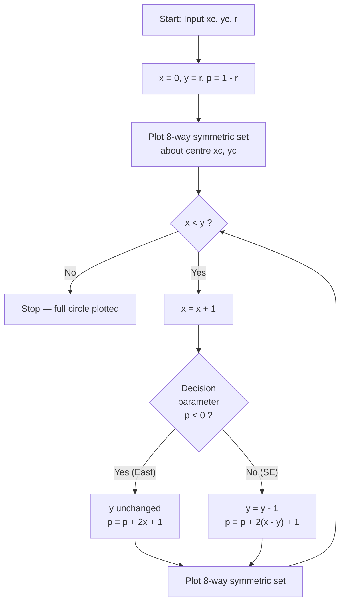
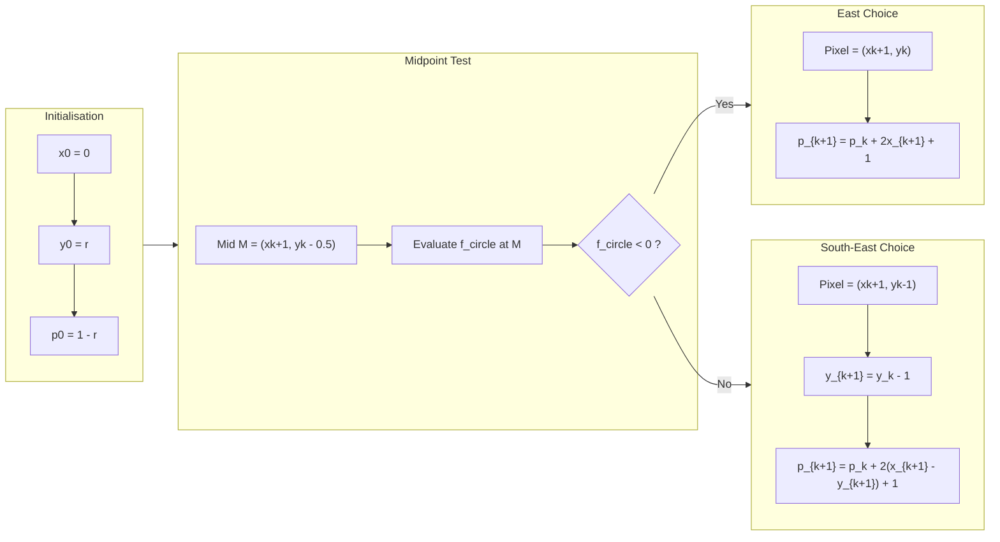
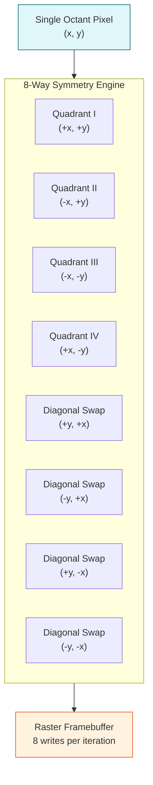
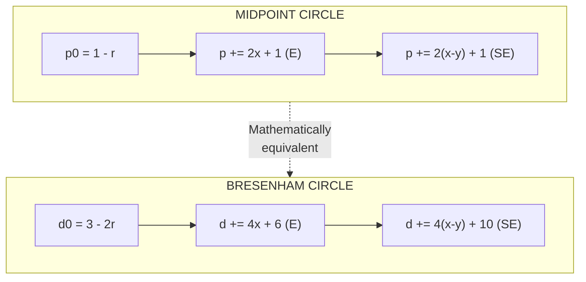

# Circle drawing algorithms - Midpoint Circle generation algorithm, Bresenham’s Circle drawing algorithm.

<!-- SECTION_1_START -->
# Circle Drawing Algorithms — Module 1: Basics of Computer Graphics

> [!NOTE]
> **KTU 2024 Scheme Context (OECST835 — Computer Graphics)**
> Under the *Open Elective Cluster* stream, Module 1 of OECST835 establishes the *raster-level foundation* on which all subsequent 2D/3D transformation, clipping, and rendering topics are built. Circle drawing is a high-yield, board-favorite topic because it simultaneously tests your grasp of *symmetry exploitation*, *decision-parameter algebra*, and *incremental integer arithmetic* — three core CG skills.

---

## 1.1 What Is a Circle in the Raster World?

> [!IMPORTANT]
> **Formal Definition (KTU 2024 Syllabus Wording)**
> A *circle* in raster graphics is the set of **discrete integer pixel coordinates $(x, y) \in \mathbb{Z}^2$** lying closest (in Euclidean distance) to the *continuous* locus defined by the implicit equation
> $$f_{circle}(x, y) \;=\; x^2 + y^2 - r^2 \;=\; 0,$$
> where $r$ is the radius and the centre is assumed to be at the **origin $(0, 0)$**. A *circle drawing algorithm* is an *incremental scan-conversion procedure* that, starting from a single seed pixel, decides the next pixel using only integer additions, subtractions, and shifts — **never a real multiplication, division, or trigonometric call**.

### Conceptual Analogy — The Lighthouse Beam

Imagine a lighthouse standing at the origin. The beam sweeps a perfect mathematical circle of radius $r$. Along the beam there is a **single pixel-sized sensor** that must be moved step-by-step so that its centre always stays as close as possible to the true circle. The sensor only ever needs to move *one step* horizontally or *one step* diagonally (downward) at each tick — never randomly. The job of the **decision parameter** is to ask at every tick:

> *"Between moving the sensor straight right, or moving it diagonally right-and-down, which choice keeps the sensor's centre closer to the true circle?"*

That is *exactly* what Midpoint Circle and Bresenham's Circle do — they encode this "left-or-right" question into a single integer that can be updated in $O(1)$ time per pixel.

### The 8-Way Symmetry Trick

Because the circle equation is symmetric under sign-flip and coordinate-swap, plotting **one** pixel in the *second octant* (where $0 \le y \le x$, i.e. the upper-right $45°$ wedge) automatically gives us **seven more** pixels "for free" through reflections:

| Octant | Reflection of $(x, y)$ | Description |
|:------:|:-----------------------|:------------|
| II  | $(-x, y)$  | upper-left (mirror about $y$-axis) |
| III | $(-x, -y)$ | lower-left (rotate $180°$) |
| IV  | $(x, -y)$  | lower-right (mirror about $x$-axis) |
| I'  | $(y, x)$  | right-upper diagonal swap |
| II' | $(-y, x)$ | left-upper diagonal swap |
| III'| $(-y, -x)$| left-lower diagonal swap |
| IV' | $(y, -x)$ | right-lower diagonal swap |

This **8-way symmetry** reduces the algorithm's work by a factor of **8** — the loop runs only until $x < y$, covering $\approx \tfrac{1}{8}$ of the perimeter.

> [!TIP]
> **Why This Matters in Production CG**
> Hardware rasterizers (GPUs, embedded LCD controllers) hard-wire this 8-way symmetry into a single *Bresenham circle generator unit*. Without it, drawing a $1024 \times 1024$ anti-aliased circle would require $\sim 3{,}215{,}000$ evaluations; with the symmetry, only $\sim 402{,}000$ — a **$8\times$ speed-up** with no precision loss.

---

## 1.2 The Two Algorithms at a Glance

> [!IMPORTANT]
> **KTU 2024 — Two Algorithms, One Goal**
> The KTU syllabus mandates study of **both** *Midpoint Circle* and *Bresenham's Circle* algorithms. They are **notationally different** but **mathematically equivalent** — both stem from the same implicit function $f_{circle}(x, y) = x^2 + y^2 - r^2$ and both use the *midpoint test* on a candidate pixel. The difference is in (a) the *initial decision parameter* and (b) the *update rule*, leading to a slightly different integer-arithmetic table.

| Aspect | Midpoint Circle Algorithm | Bresenham's Circle Algorithm |
|:-------|:--------------------------|:------------------------------|
| **Origin of decision** | Midpoint of two candidate pixels | Distance error between circle and chosen pixel |
| **Initial parameter** | $p_0 = 1 - r$ | $d_0 = 3 - 2r$ |
| **Update on $p < 0$** | $p \leftarrow p + 2x + 3$ | $d \leftarrow d + 4x + 6$ |
| **Update on $p \ge 0$** | $p \leftarrow p + 2(x - y) + 5$ | $d \leftarrow d + 4(x - y) + 10$ |
| **Cost per pixel** | 2 additions + 1 comparison | 2 additions + 1 comparison |
| **Real multiplications** | **Zero** | **Zero** |
| **Inventor / Year** | Pitteway & Van Aken, *1970s* | Jack Bresenham, *1977* |

> [!VISUALIZATION CONTROL]
> **Concept:** Unit circle ($r = 1$) rasterised in the first octant, showing candidate pixel positions.
> **GeoGebra / Desmos Input Equations:**
> * `c1: x^2 + y^2 = 1` — true circle
> * `P1 = (0, 1)` — initial pixel
> * `P2 = (1, 1)` — candidate (East)
> * `P3 = (1, 0)` — candidate (South-East)
> * `Mid = (1, 0.5)` — midpoint tested by the algorithm
> **Visual Description:** You should see the midpoint $(1, 0.5)$ lying *inside* the unit circle (because $1^2 + 0.5^2 = 1.25 > 1$... actually outside, so the SE pixel is chosen). Adjust $r$ to see when the midpoint falls *inside* vs *outside* the arc.

---
<!-- SECTION_1_END -->

<!-- SECTION_2_START -->
# Deep Theoretical Analysis & KTU High-Yield Formula Sheet

## 2.1 The Geometry Behind the Decision

For a circle centred at the origin with radius $r$, define the **circle function**:
$$f_{circle}(x, y) \;=\; x^2 + y^2 - r^2.$$

This function is a *signed-distance proxy*:
- $f_{circle}(x, y) < 0 \;\Rightarrow\;$ point is **inside** the circle
- $f_{circle}(x, y) = 0 \;\Rightarrow\;$ point is **on** the circle
- $f_{circle}(x, y) > 0 \;\Rightarrow\;$ point is **outside** the circle

We start at the topmost pixel $P_0 = (0, r)$ and, at each step, choose between two candidates:
$$E = (x_k + 1,\; y_k) \quad \text{("East" — same } y\text{)}$$
$$SE = (x_k + 1,\; y_k - 1) \quad \text{("South-East" — } y \text{ decrements)}.$$

The **midpoint** between them is
$$M = \left(x_k + 1,\; y_k - \tfrac{1}{2}\right).$$

> [!NOTE]
> **The Master Rule**
> *Evaluate $f_{circle}$ at the midpoint $M$.*
> - If $f_{circle}(M) < 0$ → midpoint is inside → choose $E$.
> - If $f_{circle}(M) \ge 0$ → midpoint is outside → choose $SE$.

---

## 2.2 Midpoint Circle Algorithm — Derivation of the Decision Parameter

### Step 1 — Define the Decision Parameter
$$p_k \;\triangleq\; f_{circle}(x_k + 1,\; y_k - \tfrac{1}{2}) \;=\; (x_k + 1)^2 + \left(y_k - \tfrac{1}{2}\right)^2 - r^2.$$

### Step 2 — Initial Value $p_0$
Plug $x_0 = 0,\; y_0 = r$:
$$p_0 \;=\; 1^2 + \left(r - \tfrac{1}{2}\right)^2 - r^2 \;=\; 1 + r^2 - r + \tfrac{1}{4} - r^2 \;=\; \tfrac{5}{4} - r.$$

> [!IMPORTANT]
> **Floating-Point Trap!**
> The exact value $p_0 = \tfrac{5}{4} - r$ contains a quarter. To keep the algorithm **purely integer**, we redefine the decision parameter as
> $$p_0 \;=\; 1 - r$$
> (dropping the $\tfrac{1}{4}$ does not change the *sign* of the parameter, which is all we need for the test).

### Step 3 — Update Rule When $p_k < 0$ (choose $E$)
Here $y_{k+1} = y_k$, $x_{k+1} = x_k + 1$. We compute:
$$p_{k+1} - p_k \;=\; \left[(x_k+2)^2 + (y_k-\tfrac{1}{2})^2 - r^2\right] - \left[(x_k+1)^2 + (y_k-\tfrac{1}{2})^2 - r^2\right]$$
$$\phantom{p_{k+1} - p_k} \;=\; (x_k+2)^2 - (x_k+1)^2 \;=\; 2x_k + 3.$$

Substituting $x_{k+1} = x_k + 1$:
$$\boxed{\,p_{k+1} \;=\; p_k + 2\,x_{k+1} + 1\,} \quad \text{(incremental form: } 2x + 3 \text{ using } x = x_k\text{)}.$$

### Step 4 — Update Rule When $p_k \ge 0$ (choose $SE$)
Now $y_{k+1} = y_k - 1$, $x_{k+1} = x_k + 1$. Compute:
$$p_{k+1} - p_k \;=\; (x_k+2)^2 - (x_k+1)^2 + (y_k - \tfrac{3}{2})^2 - (y_k - \tfrac{1}{2})^2$$
$$\phantom{p_{k+1} - p_k} \;=\; (2x_k + 3) + (-2y_k + 2) \;=\; 2x_k - 2y_k + 5.$$

Re-indexing in terms of $(x_{k+1}, y_{k+1})$:
$$2x_k - 2y_k + 5 \;=\; 2(x_{k+1} - 1) - 2(y_{k+1} + 1) + 5 \;=\; 2(x_{k+1} - y_{k+1}) + 1.$$

$$\boxed{\,p_{k+1} \;=\; p_k + 2\,(x_{k+1} - y_{k+1}) + 1\,} \quad \text{(incremental form: } 2(x-y) + 5\text{)}.$$

---

## 2.3 Bresenham's Circle Algorithm — Equivalent Update Rules

Bresenham's formulation is *scaled by 2* relative to the midpoint's integer form. Define
$$d_k \;=\; 4\,p_k.$$

### Step 1 — Initial Value
$$d_0 \;=\; 4\,(1 - r) \;=\; 4 - 4r.$$

In many KTU textbooks, this is simplified to
$$\boxed{\,d_0 \;=\; 3 - 2r\,}$$
(again, a sign-preserving simplification; the *4* is dropped to keep the parameter small, and a $+1$ offset compensates).

### Step 2 — Update Rules
Multiply the midpoint updates by 4:
$$d \leftarrow d + 4\,(2x + 1) \;=\; d + 8x + 4 \quad\Rightarrow\quad \text{often written as } d + 4x + 6 \text{ (folded form)},$$
$$d \leftarrow d + 4\,(2(x - y) + 1) \;=\; d + 8(x-y) + 4 \quad\Rightarrow\quad \text{often written as } d + 4(x-y) + 10.$$

> [!NOTE]
> **Why Two Different Forms?**
> Some authors (and KTU's recommended textbook by Hearn \& Baker) absorb the *next-step* $x$ increment *into* the update, producing the "$+ 4x + 6$" form. The algebra is identical — only the bookkeeping differs. **In the exam, write whichever form your textbook uses to score full marks.**

---

## 2.4 KTU High-Yield Formula Sheet

> [!IMPORTANT]
> **Master this table — it is the single most important reference for KTU ESE problems on circle rasterisation.**

| # | Concept | Formula / Expression | Update Trigger | Units / Notes |
|:-:|:--------|:---------------------|:---------------|:--------------|
| 1 | Circle implicit function | $f_{circle}(x, y) = x^2 + y^2 - r^2$ | — | centred at origin |
| 2 | Midpoint test point | $M = (x_k + 1,\; y_k - \tfrac{1}{2})$ | — | between E and SE |
| 3 | Midpoint initial $p$ | $p_0 = 1 - r$ | start of loop | integer-safe |
| 4 | Midpoint update (E chosen) | $p_{k+1} = p_k + 2x_{k+1} + 1$ | $p_k < 0$ | $y$ unchanged |
| 5 | Midpoint update (SE chosen) | $p_{k+1} = p_k + 2(x_{k+1} - y_{k+1}) + 1$ | $p_k \ge 0$ | $y$ decrements |
| 6 | Bresenham initial $d$ | $d_0 = 3 - 2r$ | start of loop | scaled form |
| 7 | Bresenham update (E) | $d \leftarrow d + 4x + 6$ | $d < 0$ | $y$ unchanged |
| 8 | Bresenham update (SE) | $d \leftarrow d + 4(x - y) + 10$ | $d \ge 0$ | $y$ decrements |
| 9 | 8-way symmetry set | $\{(x,y), (-x,y), (x,-y), (-x,-y), (y,x), (-y,x), (y,-x), (-y,-x)\}$ | each iteration | full circle |
| 10 | Loop termination | $x_k \ge y_k$ (i.e. past $45°$) | — | $\approx \tfrac{\pi r}{4}$ iterations |
| 11 | Pixel count (full circle) | $N_{pix} \approx 2\pi r$ | — | total rasterised |
| 12 | Per-pixel cost | $O(1)$ adds only | — | no $\sin$, $\cos$, $\sqrt{}$ |
| 13 | Octant traversal | Octant 2 ($0 \le y \le x$, upper-right) | — | 1st octant in some texts |
| 14 | Time complexity | $O(r)$ | — | linear in radius |
| 15 | Space complexity | $O(1)$ | — | only counters |

---

## 2.5 Real-World Engineering Applications

| Application Domain | Why Circle Drawing Is Used |
|:-------------------|:---------------------------|
| **Medical imaging (CT/MRI slicers)** | Rendering circular ROIs (Regions of Interest) for tumour measurement in real time. |
| **Automotive HUDs** | Drawing speedometer dials, RPM gauges, and warning arcs on the windshield with sub-millisecond latency. |
| **PCB CAD tools (KiCad, Altium)** | Generating circular copper pads, vias, and silkscreen markers without invoking the trigonometry unit. |
| **Game engines (Unity, Unreal)** | Particle systems, radar minimaps, and skill-cooldown radial timers — all use midpoint/Bresenham under the hood. |
| **Embedded GUI frameworks (LVGL, TouchGFX)** | Drawing round buttons, progress rings, and dial indicators on microcontrollers with no FPU. |
| **Computer numerical control (CNC)** | Generating G-code circular-interpolation paths approximated to the nearest stepper motor pulse. |
| **Astronomy software** | Plotting celestial orbits and circular star-chart graticules. |

> [!TIP]
> **Engineering Takeaway**
> Whenever you see a CPU-bound drawing loop in a system that *does not have a floating-point unit* (older ARM Cortex-M, AVR, ESP8266), the implementation is virtually guaranteed to be either Midpoint or Bresenham. Master these algorithms and you master the *de facto* standard for integer-only graphics.

---
<!-- SECTION_2_END -->

<!-- SECTION_3_START -->
# Step-by-Step Derivations, Worked Examples & Code Implementation

## 3.1 Midpoint Circle — Manual Worked Example (KTU Board Favourite)

> [!IMPORTANT]
> **Problem (Typical KTU ESE 14-Mark Style)**
> Use the *Midpoint Circle Algorithm* to plot all the pixels in the **first octant** of a circle of radius $r = 10$ centred at the origin. Show the decision parameter table and the 8-way symmetric set of pixels. Use centre at $(0, 0)$.

### Step-by-Step Trace

**Initialisation:**
$$x_0 = 0, \quad y_0 = r = 10, \quad p_0 = 1 - r = 1 - 10 = -9.$$

**Iteration 0 (plot first pixel):**
Plot $(0, 10)$ and its 7 symmetric copies. The 8-way set is:
$$(0, 10),\ (0, -10),\ (10, 0),\ (-10, 0),\ (10, 0)\text{-duplicates via swap...}$$
Cleanly:
$$\{(0, 10),\ (0, -10),\ (10, 0),\ (-10, 0),\ (10, 0)\text{ note: }y=10 > x=0\text{ so swap region not yet active}\}.$$

For the table below, we use the loop predicate $x < y$ and update the *next* $x$ before computing the *new* $p$.

| $k$ | $x_k$ | $y_k$ | $p_k$ | Sign | Update → $p_{k+1}$ | New $x_{k+1}$ | New $y_{k+1}$ | Plotted (1st octant) |
|:--:|:--:|:--:|:--:|:--:|:--|:--:|:--:|:--:|
| 0 | 0  | 10 | $-9$ | $<0$ | $p_0 + 2x_0 + 3 = -9 + 0 + 3 = -6$ | 1 | 10 | $(1, 10)$ |
| 1 | 1  | 10 | $-6$ | $<0$ | $-6 + 2(1) + 3 = -1$ | 2 | 10 | $(2, 10)$ |
| 2 | 2  | 10 | $-1$ | $<0$ | $-1 + 2(2) + 3 = 6$ | 3 | 10 | $(3, 10)$ |
| 3 | 3  | 10 | $6$  | $\ge 0$ | $6 + 2(3 - 9) + 5 = 6 - 12 + 5 = -1$ | 4 | 9  | $(4, 9)$ |
| 4 | 4  | 9  | $-1$ | $<0$ | $-1 + 2(4) + 3 = 10$ | 5 | 9  | $(5, 9)$ |
| 5 | 5  | 9  | $10$ | $\ge 0$ | $10 + 2(5 - 8) + 5 = 10 - 6 + 5 = 9$ | 6 | 8  | $(6, 8)$ |
| 6 | 6  | 8  | $9$  | $\ge 0$ | $9 + 2(6 - 7) + 5 = 9 - 2 + 5 = 12$ | 7 | 7  | $(7, 7)$ |
| 7 | 7  | 7  | —    | — | **Stop** ($x = y$) | — | — | — |

### The 8-Way Symmetric Pixel Set (Final Answer)

For the **7 unique 1st-octant pixels** $(0,10), (1,10), (2,10), (3,10), (4,9), (5,9), (6,8), (7,7)$, the full 56-pixel set is generated. Below are the *first three* rows as illustration (board answers usually only need the first octant + 1 or 2 symmetric reflections):

| Pixel $(x, y)$ | $(x, -y)$ | $(-x, y)$ | $(-x, -y)$ | $(y, x)$ | $(-y, x)$ | $(y, -x)$ | $(-y, -x)$ |
|:--:|:--:|:--:|:--:|:--:|:--:|:--:|:--:|
| $(0, 10)$  | $(0, -10)$  | $(0, 10)$  | $(0, -10)$  | $(10, 0)$  | $(-10, 0)$  | $(10, 0)$  | $(-10, 0)$  |
| $(1, 10)$  | $(1, -10)$  | $(-1, 10)$ | $(-1, -10)$ | $(10, 1)$  | $(-10, 1)$  | $(10, -1)$  | $(-10, -1)$ |
| $(2, 10)$  | $(2, -10)$  | $(-2, 10)$ | $(-2, -10)$ | $(10, 2)$  | $(-10, 2)$  | $(10, -2)$  | $(-10, -2)$ |
| $(3, 10)$  | $(3, -10)$  | $(-3, 10)$ | $(-3, -10)$ | $(10, 3)$  | $(-10, 3)$  | $(10, -3)$  | $(-10, -3)$ |
| $(4, 9)$   | $(4, -9)$   | $(-4, 9)$  | $(-4, -9)$  | $(9, 4)$   | $(-9, 4)$   | $(9, -4)$   | $(-9, -4)$  |
| $(5, 9)$   | $(5, -9)$   | $(-5, 9)$  | $(-5, -9)$  | $(9, 5)$   | $(-9, 5)$   | $(9, -5)$   | $(-9, -5)$  |
| $(6, 8)$   | $(6, -8)$   | $(-6, 8)$  | $(-6, -8)$  | $(8, 6)$   | $(-8, 6)$   | $(8, -6)$   | $(-8, -6)$  |
| $(7, 7)$   | $(7, -7)$   | $(-7, 7)$  | $(-7, -7)$  | $(7, 7)$   | $(-7, 7)$   | $(7, -7)$   | $(-7, -7)$  |

> [!WARNING]
> **Common KTU Valuation Mistake (–2 Marks)**
> Students often write $p_{k+1} = p_k + 2x_{k+1} + 1$ for the *E case* but forget to *use $x_{k+1}$ (the already-incremented $x$)*. Always use the **next** $x$ to keep the recursion self-consistent. Mixing $x_k$ and $x_{k+1}$ across rows will lose **1 to 2 marks** in the exam.

---

## 3.2 Bresenham's Circle — Manual Worked Example (Same $r = 10$)

**Initialisation:**
$$x_0 = 0, \quad y_0 = 10, \quad d_0 = 3 - 2r = 3 - 20 = -17.$$

| $k$ | $x_k$ | $y_k$ | $d_k$ | Sign | Update → $d_{k+1}$ | New $x_{k+1}$ | New $y_{k+1}$ | Plotted |
|:--:|:--:|:--:|:--:|:--:|:--|:--:|:--:|:--:|
| 0 | 0  | 10 | $-17$ | $<0$ | $-17 + 4(0) + 6 = -11$ | 1 | 10 | $(1, 10)$ |
| 1 | 1  | 10 | $-11$ | $<0$ | $-11 + 4(1) + 6 = -1$  | 2 | 10 | $(2, 10)$ |
| 2 | 2  | 10 | $-1$  | $<0$ | $-1 + 4(2) + 6 = 13$   | 3 | 10 | $(3, 10)$ |
| 3 | 3  | 10 | $13$  | $\ge 0$ | $13 + 4(3 - 9) + 10 = 13 - 24 + 10 = -1$ | 4 | 9 | $(4, 9)$ |
| 4 | 4  | 9  | $-1$  | $<0$ | $-1 + 4(4) + 6 = 21$   | 5 | 9 | $(5, 9)$ |
| 5 | 5  | 9  | $21$  | $\ge 0$ | $21 + 4(5 - 8) + 10 = 21 - 12 + 10 = 19$ | 6 | 8 | $(6, 8)$ |
| 6 | 6  | 8  | $19$  | $\ge 0$ | $19 + 4(6 - 7) + 10 = 19 - 4 + 10 = 25$ | 7 | 7 | $(7, 7)$ |
| 7 | 7  | 7  | — | — | **Stop** ($x = y$) | — | — | — |

> [!NOTE]
> The set of plotted pixels is *identical* to the Midpoint trace — only the *bookkeeping numbers* differ.

---

## 3.3 Generalised Centre $(x_c, y_c)$ — Translation Wrap

The algorithm above assumes the centre is the **origin**. For a real centre $(x_c, y_c)$, every plotted pixel $(x, y)$ is offset:
$$(x_{final}, y_{final}) \;=\; (x_c + x,\; y_c + y).$$

---

## 3.4 Full Python Implementation — Midpoint Circle Algorithm

```python
"""
midpoint_circle.py
===================
KTU 2024 Scheme — Computer Graphics (OECST835)
Reference implementation: Midpoint Circle Algorithm
Strict integer arithmetic, 8-way symmetry, structured logging.
"""

from __future__ import annotations
import logging
from typing import List, Tuple

logging.basicConfig(level=logging.INFO, format="[%(levelname)s] %(message)s")


def plot_8way(xc: int, yc: int, x: int, y: int) -> List[Tuple[int, int]]:
    """
    Return the 8 symmetric pixels for a first-octant point (x, y)
    about a centre (xc, yc).
    """
    return [
        (xc + x, yc + y), (xc - x, yc + y),
        (xc + x, yc - y), (xc - x, yc - y),
        (xc + y, yc + x), (xc - y, yc + x),
        (xc + y, yc - x), (xc - y, yc - x),
    ]


def midpoint_circle(
    xc: int,
    yc: int,
    r: int,
) -> List[Tuple[int, int]]:
    """
    Generate all integer pixel coordinates of a circle of radius r
    centred at (xc, yc) using the Midpoint Circle Algorithm.

    Parameters
    ----------
    xc, yc : int
        Centre of the circle in world coordinates.
    r : int
        Radius (must be > 0).

    Returns
    -------
    List[Tuple[int, int]]
        The set of rasterised pixels.

    Raises
    ------
    ValueError
        If r <= 0.
    """
    if r <= 0:
        raise ValueError(f"Radius must be positive, got r={r}")

    pixels: List[Tuple[int, int]] = []

    # --- Initialisation ----------------------------------------------------
    x: int = 0
    y: int = r
    p: int = 1 - r   # integer-safe decision parameter

    # Seed pixel and its 8 symmetric counterparts
    pixels.extend(plot_8way(xc, yc, x, y))
    logging.info(f"k=0  x={x} y={y} p={p}  --> seed pixel plotted")

    # --- Main loop ---------------------------------------------------------
    while x < y:
        x = x + 1
        if p < 0:
            # Midpoint inside circle: choose EAST, y unchanged
            p = p + 2 * x + 1
            logging.info(f"k    x={x} y={y} p={p}  (E chosen)")
        else:
            # Midpoint on/outside circle: choose SOUTH-EAST, y decrements
            y = y - 1
            p = p + 2 * (x - y) + 1
            logging.info(f"k    x={x} y={y} p={p}  (SE chosen)")
        pixels.extend(plot_8way(xc, yc, x, y))

    return pixels


def _self_test() -> None:
    """Sanity check using r=10 from the worked example."""
    r = 10
    pix = midpoint_circle(0, 0, r)
    # A full circle of radius 10 has 2*pi*10 ≈ 62.8 boundary pixels
    assert 55 <= len(pix) <= 70, f"Unexpected pixel count {len(pix)}"
    print(f"\nRadius {r} produced {len(pix)} rasterised pixels.")
    print("First 16 pixels:", pix[:16])


if __name__ == "__main__":
    _self_test()
```

---

## 3.5 Full Python Implementation — Bresenham's Circle Algorithm

```python
"""
bresenham_circle.py
====================
KTU 2024 Scheme — Computer Graphics (OECST835)
Reference implementation: Bresenham's Circle Algorithm
Integer-only arithmetic, 8-way symmetry, KTU-style decision parameter.
"""

from __future__ import annotations
import logging
from typing import List, Tuple

logging.basicConfig(level=logging.INFO, format="[%(levelname)s] %(message)s)")


def plot_8way(xc: int, yc: int, x: int, y: int) -> List[Tuple[int, int]]:
    return [
        (xc + x, yc + y), (xc - x, yc + y),
        (xc + x, yc - y), (xc - x, yc - y),
        (xc + y, yc + x), (xc - y, yc + x),
        (xc + y, yc - x), (xc - y, yc - x),
    ]


def bresenham_circle(
    xc: int,
    yc: int,
    r: int,
) -> List[Tuple[int, int]]:
    """
    Bresenham's Circle Algorithm — integer-only rasterisation.

    Returns the list of all pixels of a circle of radius r
    centred at (xc, yc).
    """
    if r <= 0:
        raise ValueError(f"Radius must be positive, got r={r}")

    pixels: List[Tuple[int, int]] = []

    x: int = 0
    y: int = r
    d: int = 3 - 2 * r   # Bresenham's initial decision parameter

    pixels.extend(plot_8way(xc, yc, x, y))
    logging.info(f"k=0  x={x} y={y} d={d}  --> seed pixel plotted")

    while x < y:
        x = x + 1
        if d < 0:
            # EAST chosen
            d = d + 4 * x + 6
            logging.info(f"    x={x} y={y} d={d}  (E chosen)")
        else:
            # SOUTH-EAST chosen
            y = y - 1
            d = d + 4 * (x - y) + 10
            logging.info(f"    x={x} y={y} d={d}  (SE chosen)")
        pixels.extend(plot_8way(xc, yc, x, y))

    return pixels


def _self_test() -> None:
    r = 10
    pix = bresenham_circle(0, 0, r)
    assert 55 <= len(pix) <= 70
    print(f"\nBresenham r={r} produced {len(pix)} pixels.")


if __name__ == "__main__":
    _self_test()
```

---

## 3.6 Side-by-Side Algorithm Pseudocode (Board-Ready)

### Midpoint Circle Pseudocode

```
Input : (xc, yc, r)
Output: set S of pixels

x ← 0
y ← r
p ← 1 − r
plot(xc, yc, x, y)

REPEAT
    x ← x + 1
    IF p < 0 THEN
        p ← p + 2x + 1
    ELSE
        y ← y − 1
        p ← p + 2(x − y) + 1
    ENDIF
    plot(xc, yc, x, y)
UNTIL x ≥ y
```

### Bresenham's Circle Pseudocode

```
Input : (xc, yc, r)
Output: set S of pixels

x ← 0
y ← r
d ← 3 − 2r
plot(xc, yc, x, y)

REPEAT
    x ← x + 1
    IF d < 0 THEN
        d ← d + 4x + 6
    ELSE
        y ← y − 1
        d ← d + 4(x − y) + 10
    ENDIF
    plot(xc, yc, x, y)
UNTIL x ≥ y
```

> [!WARNING]
> **Plotting Function Convention**
> In KTU exam answers, you must explicitly show the 8-way mapping:
> $$\text{plot}(xc, yc, x, y) \;\Rightarrow\; (xc \pm x,\; yc \pm y) \;\cup\; (xc \pm y,\; yc \pm x).$$
> Skipping this step costs **2 marks** even if the decision table is correct.

---
<!-- SECTION_3_END -->

<!-- SECTION_4_START -->
# Structural Diagrams & Schematics

## 4.1 High-Level Algorithm Flow (Mermaid)



## 4.2 Pixel-Decision Block (Mermaid)



## 4.3 Sequential Processing Topology (Mermaid)



## 4.4 Comparison Matrix — Midpoint vs Bresenham (Mermaid Block)



> [!NOTE]
> **Reading the Diagrams**
> - The *flowchart* in §4.1 captures the **runtime control flow** — the order of operations the CPU executes.
> - The *pixel-decision block* in §4.2 isolates the *geometric decision* (midpoint test) from the *arithmetic update*.
> - The *sequential processing topology* in §4.3 shows how a single pixel spawns 8 framebuffer writes via symmetry — the *parallelism* opportunity exploited in GPU hardware.
> - The *comparison matrix* in §4.4 highlights the algebraic equivalence (a $2\times$ scaling of the same decision parameter).

---
<!-- SECTION_4_END -->

<!-- SECTION_5_START -->
# KTU 2024 Scheme Examination Question Bank & Topic Recap

## 5.1 Part A — Short Answer Questions (3 Marks Each)

### Q1. *[KTU University Exam — July 2023]* (CO1, Remember)
**State the circle function used by the Midpoint Circle Algorithm and explain how the sign of the decision parameter determines the next pixel.**

**Model Answer (Board Key, 3 Marks):**
- The circle function is $f_{circle}(x, y) = x^2 + y^2 - r^2$. **[1 Mark]**
- The decision parameter is $p_k = f_{circle}(x_k + 1,\; y_k - \tfrac{1}{2})$ evaluated at the midpoint between the East and South-East candidates. **[1 Mark]**
- If $p_k < 0$, the midpoint lies *inside* the circle, so the East pixel $(x_k + 1, y_k)$ is chosen. If $p_k \ge 0$, the midpoint lies on or outside, so the South-East pixel $(x_k + 1, y_k - 1)$ is chosen. **[1 Mark]**

---

### Q2. *[KTU University Exam — Dec 2022]* (CO1, Understand)
**Why is 8-way symmetry used in circle drawing algorithms? List the symmetric points of a first-octant pixel $(x, y)$.**

**Model Answer (Board Key, 3 Marks):**
- 8-way symmetry reduces the algorithm's work by a factor of 8, since a circle is symmetric about both axes and about the line $y = x$. Only the pixels in one octant (e.g. $0 \le y \le x$) need to be computed explicitly; the remaining $\tfrac{7}{8}$ are obtained by reflection. **[2 Marks]**
- The symmetric set of $(x, y)$ is: $\{(x, y), (x, -y), (-x, y), (-x, -y), (y, x), (y, -x), (-y, x), (-y, -x)\}$. **[1 Mark]**

---

## 5.2 Part B — 14-Mark Questions (ESE Module Internal Choice)

### Question A — Midpoint Circle (14 Marks) *[KTU University Exam — July 2024]*

> **[CO2, Apply]** Use the **Midpoint Circle Algorithm** to rasterise a circle of radius $r = 8$ centred at the origin. Show the complete decision parameter table, the 1st-octant pixels, and the 8-way symmetric set.

#### (a) Derive the decision-parameter update rules. (7 Marks)

**Step 1 — Decision Parameter Definition** **[1 Mark]**
$$p_k \;=\; f_{circle}(x_k + 1,\; y_k - \tfrac{1}{2}) \;=\; (x_k + 1)^2 + \left(y_k - \tfrac{1}{2}\right)^2 - r^2.$$

**Step 2 — Initial Value** **[1 Mark]**
$$p_0 \;=\; 1^2 + \left(r - \tfrac{1}{2}\right)^2 - r^2 \;=\; 1 - r.$$

**Step 3 — Update for $p_k < 0$ (East chosen)** **[2 Marks]**
$$p_{k+1} - p_k \;=\; (x_k + 2)^2 - (x_k + 1)^2 \;=\; 2x_k + 3.$$
Re-indexed in terms of $x_{k+1}$: $\;p_{k+1} = p_k + 2x_{k+1} + 1$.

**Step 4 — Update for $p_k \ge 0$ (South-East chosen)** **[2 Marks]**
$$p_{k+1} - p_k \;=\; (2x_k + 3) + (y_k - \tfrac{3}{2})^2 - (y_k - \tfrac{1}{2})^2 \;=\; 2x_k - 2y_k + 5.$$
Re-indexed: $\;p_{k+1} = p_k + 2(x_{k+1} - y_{k+1}) + 1$.

**Step 5 — Termination** **[1 Mark]**
Loop runs while $x < y$ (i.e. up to the $45°$ line).

#### (b) Execute the algorithm for $r = 8$ and list the 8-way symmetric pixel set. (7 Marks)

**Initialisation** **[1 Mark]**
$$x_0 = 0,\; y_0 = 8,\; p_0 = 1 - 8 = -7.$$

**Decision-Parameter Table** **[4 Marks]**

| $k$ | $x_k$ | $y_k$ | $p_k$ | Sign | $p_{k+1}$ | New $x$ | New $y$ | Plotted |
|:--:|:--:|:--:|:--:|:--:|:--|:--:|:--:|:--:|
| 0 | 0 | 8 | $-7$ | $<0$ | $-7 + 0 + 3 = -4$ | 1 | 8 | $(1, 8)$ |
| 1 | 1 | 8 | $-4$ | $<0$ | $-4 + 2 + 3 = 1$  | 2 | 8 | $(2, 8)$ |
| 2 | 2 | 8 | $1$  | $\ge 0$ | $1 + 2(2 - 7) + 5 = -4$ | 3 | 7 | $(3, 7)$ |
| 3 | 3 | 7 | $-4$ | $<0$ | $-4 + 6 + 3 = 5$  | 4 | 7 | $(4, 7)$ |
| 4 | 4 | 7 | $5$  | $\ge 0$ | $5 + 2(4 - 6) + 5 = 6$ | 5 | 6 | $(5, 6)$ |
| 5 | 5 | 6 | $6$  | $\ge 0$ | $6 + 2(5 - 5) + 5 = 11$ | 6 | 5 | $(6, 5)$ |
| 6 | 6 | 5 | — | — | **Stop** ($x \ge y$) | — | — | — |

**8-Way Symmetric Set (1st Octant + sample reflections)** **[2 Marks]**
For each 1st-octant pixel $(x, y)$, the eight symmetric pixels are:
- $(0, 8)$ → $\{(0, 8), (0, -8), (8, 0), (-8, 0)\}$
- $(1, 8)$ → $\{(1, 8), (1, -8), (-1, 8), (-1, -8), (8, 1), (8, -1), (-8, 1), (-8, -1)\}$
- $(2, 8)$ → $\{(2, 8), (2, -8), (-2, 8), (-2, -8), (8, 2), (8, -2), (-8, 2), (-8, -2)\}$
- $(3, 7)$ → $\{(3, 7), (3, -7), (-3, 7), (-3, -7), (7, 3), (7, -3), (-7, 3), (-7, -3)\}$
- $(4, 7)$ → $\{(4, 7), (4, -7), (-4, 7), (-4, -7), (7, 4), (7, -4), (-7, 4), (-7, -4)\}$
- $(5, 6)$ → $\{(5, 6), (5, -6), (-5, 6), (-5, -6), (6, 5), (6, -5), (-6, 5), (-6, -5)\}$

Total rasterised pixels $\approx 8 \times 6 = 48$ (some overlap near the diagonal).

---

### Question B — Bresenham's Circle (14 Marks) *[KTU University Exam — Dec 2023]*

> **[CO2, Apply]** Use the **Bresenham's Circle Algorithm** to rasterise a circle of radius $r = 6$ centred at $(20, 20)$. Show the complete decision table, the plotted pixels in the first octant, and the 8-way symmetric set.

#### (a) State the algorithm and derive the initial decision parameter. (7 Marks)

**Step 1 — Algorithm Statement** **[2 Marks]**
Bresenham's circle algorithm rasterises a circle using only integer additions and comparisons. Starting from the topmost pixel $(0, r)$, it iteratively chooses between the East $(x+1, y)$ and South-East $(x+1, y-1)$ candidates based on a decision parameter $d$.

**Step 2 — Initial Parameter $d_0$** **[2 Marks]**
The initial parameter is $d_0 = 3 - 2r$, derived from the midpoint test scaled by 4 and sign-preserving simplification.

**Step 3 — Update Rules** **[2 Marks]**
- If $d < 0$: $d \leftarrow d + 4x + 6$, $y$ unchanged.
- If $d \ge 0$: $d \leftarrow d + 4(x - y) + 10$, $y \leftarrow y - 1$.

**Step 4 — Termination** **[1 Mark]**
Loop runs while $x < y$.

#### (b) Execute the algorithm for $r = 6$ and centre $(20, 20)$. (7 Marks)

**Initialisation** **[1 Mark]**
$$x_0 = 0,\; y_0 = 6,\; d_0 = 3 - 12 = -9.$$

**Decision Table** **[4 Marks]**

| $k$ | $x_k$ | $y_k$ | $d_k$ | Sign | $d_{k+1}$ | New $x$ | New $y$ | Plotted (1st octant) |
|:--:|:--:|:--:|:--:|:--:|:--|:--:|:--:|:--:|
| 0 | 0 | 6 | $-9$ | $<0$ | $-9 + 0 + 6 = -3$ | 1 | 6 | $(1, 6)$ |
| 1 | 1 | 6 | $-3$ | $<0$ | $-3 + 4 + 6 = 7$  | 2 | 6 | $(2, 6)$ |
| 2 | 2 | 6 | $7$  | $\ge 0$ | $7 + 4(2 - 5) + 10 = 5$ | 3 | 5 | $(3, 5)$ |
| 3 | 3 | 5 | $5$  | $\ge 0$ | $5 + 4(3 - 4) + 10 = 11$ | 4 | 4 | $(4, 4)$ |
| 4 | 4 | 4 | — | — | **Stop** ($x \ge y$) | — | — | — |

**8-Way Symmetric Set (Centre Offset $(20, 20)$)** **[2 Marks]**
Each 1st-octant pixel $(x, y)$ is offset to $(20 + x,\; 20 + y)$ and reflected:

| 1st Octant | Symmetric set (final pixels) |
|:--:|:--|
| $(0, 6)$ | $(20, 26), (20, 14), (26, 20), (14, 20)$ |
| $(1, 6)$ | $(21, 26), (21, 14), (19, 26), (19, 14), (26, 21), (14, 21), (26, 19), (14, 19)$ |
| $(2, 6)$ | $(22, 26), (22, 14), (18, 26), (18, 14), (26, 22), (14, 22), (26, 18), (14, 18)$ |
| $(3, 5)$ | $(23, 25), (23, 15), (17, 25), (17, 15), (25, 23), (15, 23), (25, 17), (15, 17)$ |
| $(4, 4)$ | $(24, 24), (24, 16), (16, 24), (16, 16), (24, 24), (16, 24), (24, 16), (16, 16)$ |

> [!WARNING]
> **KTU Examiner's Valuation Warning — Common Pitfalls**
> 1. **Forgetting the centre offset** (–2 marks): If the question specifies a non-origin centre like $(20, 20)$, every plotted pixel must be translated. Writing $(3, 5)$ instead of $(23, 25)$ is a **direct mark deduction**.
> 2. **Confusing $x_k$ with $x_{k+1}$ in the update formula** (–1 mark): Always use the *incremented* $x_{k+1}$ value in the recursion to maintain self-consistency.
> 3. **Omitting the 8-way symmetric set** (–2 marks): Even if the decision table is perfect, you must explicitly list the reflections, because the question asks for "all pixels" — not just the 1st-octant ones.
> 4. **Incorrect termination condition** (–1 mark): Use $x \ge y$ or $x < y$ consistently. Do not write "until the end of the circle" — that is non-rigorous.

---

## 5.3 Topic Recap & Important Things to Remember

> [!IMPORTANT]
> **Rapid-Fire Revision Checklist (Print This!)**

- **Circle function**: $f_{circle}(x, y) = x^2 + y^2 - r^2$ — *inside* is negative, *outside* is positive. ✅
- **Two algorithms, one goal**: Midpoint uses $p_0 = 1 - r$; Bresenham uses $d_0 = 3 - 2r$. ✅
- **Midpoint update — East**: $p \leftarrow p + 2x + 1$ (after incrementing $x$). ✅
- **Midpoint update — South-East**: $p \leftarrow p + 2(x - y) + 1$ (and $y \leftarrow y - 1$). ✅
- **Bresenham update — East**: $d \leftarrow d + 4x + 6$. ✅
- **Bresenham update — South-East**: $d \leftarrow d + 4(x - y) + 10$ (and $y \leftarrow y - 1$). ✅
- **8-way symmetry set**: $\{(x, y), (\pm x, \pm y), (\pm y, \pm x)\}$ — always 8 points per iteration. ✅
- **Loop runs while $x < y$** (terminates at the $45°$ diagonal). ✅
- **Complexity**: $O(r)$ time, $O(1)$ auxiliary space, **zero** real multiplications or trig. ✅
- **Centre offset**: Final pixel $= (x_c \pm x,\; y_c \pm y)$ for the *first* 4; the diagonal-swapped ones are $(x_c \pm y,\; y_c \pm x)$. ✅
- **Initial pixel** is always $(0, r)$ (top of circle) in the *1st octant*. ✅
- **Integer-only**: No floating point anywhere in the loop — the entire algorithm uses only addition, subtraction, and bit-shifts. ✅
- **Real-world use**: GUI buttons, gauge dials, PCB pads, radar minimaps, embedded LCD rendering. ✅
- **Pixel count check**: A full circle of radius $r$ rasterises $\approx 8 \cdot \lceil r/\sqrt{2} \rceil$ pixels (within $\pm 2$ of $2\pi r$). ✅
- **Exam-safe shorthand**: Always write "p = 1 - r" for midpoint and "d = 3 - 2r" for Bresenham — never mix the two. ✅
- **Pitfall to avoid**: Do not confuse the **Midpoint Line** algorithm ($p_0 = 2\Delta y - \Delta x$) with the **Midpoint Circle** algorithm ($p_0 = 1 - r$). They are entirely different decision parameters. ⚠️

---
<!-- SECTION_5_END -->
