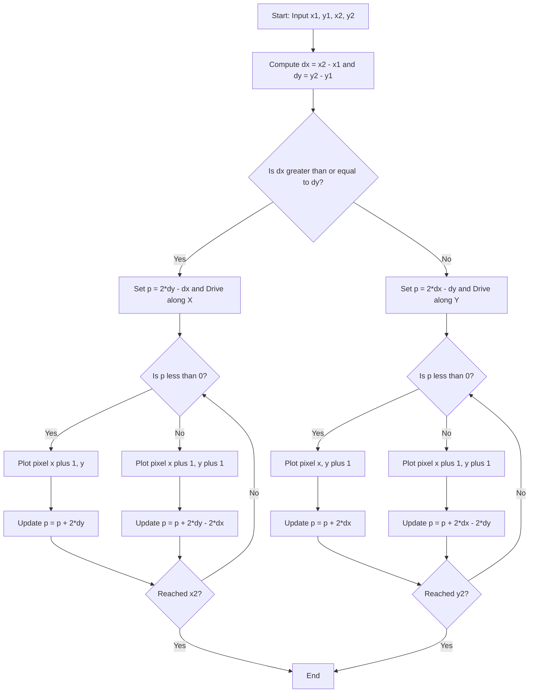
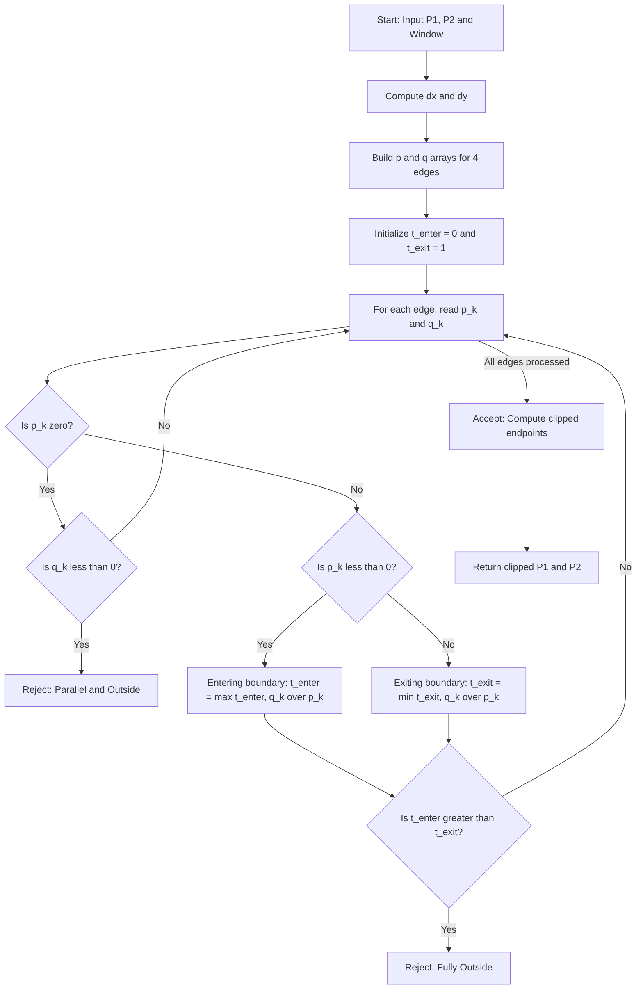

# Line and Circle drawing Algorithms - Line drawing algorithms- Bresenham’s algorithm, Liang-Barsky Algorithm

<!-- SECTION_1_START -->

# 🖥️ Line Drawing Algorithms — Bresenham's & Liang-Barsky

## 1.1 Formal KTU 2024 Syllabus Definition

> [!IMPORTANT]
> **Bresenham's Line Algorithm** is an *incremental*, *integer-only* raster scan-conversion algorithm that selects the optimal pixel positions approximating a straight line between two given endpoints $(x_1, y_1)$ and $(x_2, y_2)$ by evaluating a **decision parameter** at each step. It eliminates floating-point arithmetic, making it the industry standard for hardware-level line rendering.

> [!IMPORTANT]
> **Liang-Barsky Algorithm** is a parametric line-clipping algorithm that uses the *parametric form* of a line $P(t) = P_1 + t(P_2 - P_1)$ to efficiently clip a line segment against a rectangular clipping window by computing four scalar inequalities. It outperforms the older Cohen-Sutherland algorithm by reducing the number of clipping iterations required.

---

## 1.2 Conceptual Analogy / Intuition 🧠

### 🍕 Bresenham's Analogy — The Pizza Slice Method
Imagine you are a **chef cutting a diagonal slice of pizza** on a square grid. You start at the leftmost endpoint and must walk one step at a time — either **horizontally** (E), **diagonally** (NE), or **vertically** (N). At every step you ask: *"Is the true mathematical line currently closer to my current pixel or to the next pixel above?"* You make this choice using a simple **error term** you keep in your head — no calculator, no decimals, just integer math. That is exactly how Bresenham's algorithm walks the raster grid.

### 🪟 Liang-Barsky Analogy — The Window Gatekeeper
Picture a **photo frame on a wall**. A long ruler (the line) is sliding past the frame. The gatekeeper (the algorithm) checks **four logical "gates"** — left edge, right edge, bottom edge, top edge — and figures out two things:
- **Where the ruler enters** the frame ($t_{enter}$)
- **Where the ruler exits** the frame ($t_{exit}$)

Only the portion between these two times is **visible** — the rest is clipped. This is far more efficient than guessing and recoding the line repeatedly (as Cohen-Sutherland does).

---

## 1.3 Visualization Callout Block

> [!VISUALIZATION CONTROL]
> **Concept:** Bresenham's Line Decision Boundary Visualization
> **GeoGebra / Desmos Input Equations:**
> * True line: `y = 0.4 * x` (slope $m = 0.4$, from $x=0$ to $x=10$)
> * Lower pixel centers: `y = floor(0.4 * x)`
> * Upper pixel centers: `y = floor(0.4 * x) + 1`
> * Decision midpoint: `y = 0.4 * x + 0.5`
> **Visual Description:** The student should see a staircase of selected pixels hugging the straight line. At each $x$, the choice between the lower and upper pixel depends on whether the true line $y$ lies above or below the midpoint $y + 0.5$.

> [!VISUALIZATION CONTROL]
> **Concept:** Liang-Barsky Clipping Region
> **GeoGebra / Desmos Input Equations:**
> * Clipping window: rectangle $[x_{min}, x_{max}] \times [y_{min}, y_{max}]$
> * Line endpoints: $P_1 = (x_1, y_1)$, $P_2 = (x_2, y_2)$
> * Parametric: $x(t) = x_1 + t \cdot dx$, $y(t) = y_1 + t \cdot dy$
> **Visual Description:** Show a line entering one side of the rectangle and exiting another. The valid clip interval is $[t_{enter}, t_{exit}]$ mapped onto the visible segment.

<!-- SECTION_1_END -->

<!-- SECTION_2_START -->

# 📚 Deep Theoretical Analysis & KTU Formula Cheat Sheet

## 2.1 Bresenham's Line Algorithm — Logical Breakdown

### Pre-conditions
1. The line slope $m$ satisfies $\vert m \vert \leq 1$ (i.e., $0 \leq m \leq 1$ for the basic case, meaning $\Delta x \geq \Delta y$).
2. The starting point is the **left endpoint** (smaller $x$-coordinate).

### Core Logic Steps

* **Step 1 — Compute Deltas:**
  $\Delta x = x_2 - x_1$, $\Delta y = y_2 - y_1$ (both positive integers in the standard case).

* **Step 2 — Initialize Decision Parameter:**
  The decision variable $p_0 = 2 \Delta y - \Delta x$. This is derived from comparing the **midpoint** of the two candidate pixels against the true line position.

* **Step 3 — Pixel Selection Rule (for each $x_k$):**
  * If $p_k < 0$ → next pixel is $(x_k + 1, y_k)$ → update $p_{k+1} = p_k + 2 \Delta y$
  * If $p_k \geq 0$ → next pixel is $(x_k + 1, y_k + 1)$ → update $p_{k+1} = p_k + 2 \Delta y - 2 \Delta x$

* **Step 4 — Termination:** Stop when $x = x_2$.

> [!NOTE]
> **Why is this fast?** Every step uses only **integer addition and subtraction** — no multiplication, no division, no floating-point. This is exactly why it is implemented directly in GPU rasterizer hardware (e.g., Vulkan, OpenGL fixed-function pipelines).

---

### 🧠 Why the Decision Parameter $p_k$ Works (Geometric Intuition)

At step $k$, the true mathematical $y$ on the line at $x_k + 1$ is:

$$y = y_k + m = y_k + \frac{\Delta y}{\Delta x}$$

The two candidate pixels are at $y_k$ and $y_k + 1$. The **midpoint** is at $y_k + 0.5$.

* If $y \leq y_k + 0.5$ → pick lower pixel.
* If $y > y_k + 0.5$ → pick upper pixel.

Subtracting the line value and multiplying by $2 \Delta x$ (positive) preserves the inequality and removes the fraction, producing the **integer decision parameter** $p_k$.

---

## 2.2 Generalization: All Slopes (8 Octants)

For slopes outside the principal first octant, the algorithm is symmetric:

| Condition on Slope | Step Direction | Decision Update |
|---|---|---|
| $0 \leq m \leq 1$ | $x$ increments, $y$ stays or increments | $p = 2 \Delta y - \Delta x$ |
| $m > 1$ | $y$ increments, $x$ stays or increments | $p = 2 \Delta x - \Delta y$ |
| $-1 \leq m < 0$ | $x$ increments, $y$ stays or decrements | $p = 2 \Delta y + \Delta x$ |
| $m < -1$ | $y$ decrements, $x$ stays or increments | $p = -2 \Delta x - \Delta y$ |

---

## 2.3 Liang-Barsky Algorithm — Logical Breakdown

### Parametric Line Form
A line segment from $P_1$ to $P_2$ is expressed as:

$$P(t) = P_1 + t \cdot (P_2 - P_1), \quad t \in [0, 1]$$

Component-wise:

$$x(t) = x_1 + t \cdot \Delta x, \quad y(t) = y_1 + t \cdot \Delta y$$

where $\Delta x = x_2 - x_1$ and $\Delta y = y_2 - y_1$.

### Clipping Inequalities
The clipping window requires:

$$x_{min} \leq x(t) \leq x_{max} \quad \text{and} \quad y_{min} \leq y(t) \leq y_{max}$$

These produce **four** inequalities in standard form $p_k \cdot t \leq q_k$:

| Edge | $p_k$ | $q_k$ | Meaning |
|---|---|---|---|
| Left ($x \geq x_{min}$) | $-\Delta x$ | $x_1 - x_{min}$ | Entering from left |
| Right ($x \leq x_{max}$) | $\Delta x$ | $x_{max} - x_1$ | Entering from right |
| Bottom ($y \geq y_{min}$) | $-\Delta y$ | $y_1 - y_{min}$ | Entering from bottom |
| Top ($y \leq y_{max}$) | $\Delta y$ | $y_{max} - y_1$ | Entering from top |

### Update Rule (for each $p_k, q_k$)
* If $p_k = 0$:
  * If $q_k < 0$ → line is **parallel and outside** → **reject**.
  * Otherwise → ignore (inequality satisfied trivially).
* If $p_k < 0$ → this is a **potential entering** boundary → update $t_{enter} = \max(t_{enter}, \; q_k / p_k)$.
* If $p_k > 0$ → this is a **potential exiting** boundary → update $t_{exit} = \min(t_{exit}, \; q_k / p_k)$.

### Final Test
* If $t_{enter} > t_{exit}$ → line lies **completely outside** the window → **reject**.
* Otherwise → **clip** the segment from $t = t_{enter}$ to $t = t_{exit}$:

$$x_{enter} = x_1 + t_{enter} \cdot \Delta x, \quad y_{enter} = y_1 + t_{enter} \cdot \Delta y$$
$$x_{exit} = x_1 + t_{exit} \cdot \Delta x, \quad y_{exit} = y_1 + t_{exit} \cdot \Delta y$$

---

## 2.4 KTU Formula Cheat Sheet 📝

| Algorithm | Formula / Rule | Purpose |
|---|---|---|
| Bresenham Decision | $p_0 = 2 \Delta y - \Delta x$ | Initial decision parameter |
| Bresenham Update (lower) | $p_{k+1} = p_k + 2 \Delta y$ | When $p_k < 0$ |
| Bresenham Update (upper) | $p_{k+1} = p_k + 2 \Delta y - 2 \Delta x$ | When $p_k \geq 0$ |
| Bresenham Slope Range | $\vert m \vert \leq 1$ | Principal first octant |
| Parametric Line | $P(t) = P_1 + t(P_2 - P_1)$ | Liang-Barsky base form |
| Liang-Barsky $p_k$ Table | See four rows above | Edge coefficients |
| Liang-Barsky Update | $t_{enter} = \max(t_{enter}, q_k / p_k)$ | For $p_k < 0$ |
| Liang-Barsky Update | $t_{exit} = \min(t_{exit}, q_k / p_k)$ | For $p_k > 0$ |
| Clip Test | $t_{enter} \leq t_{exit}$ | Acceptance condition |
| Clipped Endpoint | $x = x_1 + t \cdot \Delta x$ | Visible boundary |

---

## 2.5 Real-World Engineering Utility 🏭

* **Bresenham's algorithm** — Used in early CAD systems, plotter firmware, embedded displays (OLED drivers), and still conceptually taught in modern GPU shader rasterization stages.
* **Liang-Barsky algorithm** — Used in **2D map rendering** (e.g., clipping roads to a viewport), **GUI windowing systems** (X11, Wayland), **CAD viewport culling**, and **game engine** camera frustum culling (in its 3D extension, Liang-Barsky/Cyrus-Beck family).

<!-- SECTION_2_END -->

<!-- SECTION_3_START -->

# 🛠️ Step-by-Step Derivations & Code Implementation

## 3.1 Bresenham's Algorithm — Full Algebraic Derivation

### Setup
Consider endpoints $A = (x_1, y_1)$ and $B = (x_2, y_2)$ with $0 \leq \Delta y \leq \Delta x$ (slope in $[0, 1]$).

### The Exact Test
At column $x_k + 1$, the true line $y$ coordinate is:

$$y_{true} = y_1 + m \cdot (x_k + 1 - x_1) = y_k + m = y_k + \frac{\Delta y}{\Delta x}$$

The two candidate pixels are at $y = y_k$ (lower) and $y = y_k + 1$ (upper). The midpoint is at $y_k + 0.5$.

* Pick **lower** if $y_{true} \leq y_k + 0.5$
* Pick **upper** if $y_{true} > y_k + 0.5$

### Removing the Fraction
Subtract $y_k$ from both sides:

$$\frac{\Delta y}{\Delta x} \leq 0.5 \quad \text{(lower)} \quad \text{or} \quad \frac{\Delta y}{\Delta x} > 0.5 \quad \text{(upper)}$$

Multiply by $2 \Delta x$ (positive — does not flip inequality):

$$2 \Delta y \leq \Delta x \quad \text{(lower)} \quad \text{or} \quad 2 \Delta y > \Delta x \quad \text{(upper)}$$

### Defining the Decision Parameter
We define the *signed* error of the lower choice:

$$p_k = 2 \Delta y \cdot (x_k - x_1) - \Delta x \cdot (2 y_k - 2 y_1 - 1)$$

But it is far simpler to use the **recursive form** that all board examiners recognize:

$$p_0 = 2 \Delta y - \Delta x$$

### Recurrence Derivation
We need the *change* in $p$ between steps. Compute $p_{k+1} - p_k$ algebraically.

**Case A — Lower pixel chosen ($p_k < 0$):**
The next column has $y_{k+1} = y_k$. Substituting into the full formula and subtracting:

$$p_{k+1} = p_k + 2 \Delta y$$

**Case B — Upper pixel chosen ($p_k \geq 0$):**
The next column has $y_{k+1} = y_k + 1$. Substituting:

$$p_{k+1} = p_k + 2 \Delta y - 2 \Delta x$$

> These two recurrences are the **core of Bresenham's algorithm** and must be written exactly as shown in the KTU answer key.

---

## 3.2 Worked Numerical Example — Bresenham

**Problem:** Draw a line from $P_1(2, 3)$ to $P_2(8, 6)$ using Bresenham's algorithm.

### Step 1: Compute deltas

$$\Delta x = 8 - 2 = 6, \quad \Delta y = 6 - 3 = 3$$

### Step 2: Initial decision parameter

$$p_0 = 2 \Delta y - \Delta x = 2(3) - 6 = 0$$

### Step 3: Iterate

| $k$ | $p_k$ | Sign | Plot Pixel $(x, y)$ | $p_{k+1}$ Formula | $p_{k+1}$ |
|---|---|---|---|---|---|
| 0 | 0 | $\geq 0$ (upper) | $(3, 4)$ | $p + 2 \Delta y - 2 \Delta x$ | $0 + 6 - 12 = -6$ |
| 1 | $-6$ | $< 0$ (lower) | $(4, 4)$ | $p + 2 \Delta y$ | $-6 + 6 = 0$ |
| 2 | $0$ | $\geq 0$ (upper) | $(5, 5)$ | $p + 2 \Delta y - 2 \Delta x$ | $0 + 6 - 12 = -6$ |
| 3 | $-6$ | $< 0$ (lower) | $(6, 5)$ | $p + 2 \Delta y$ | $-6 + 6 = 0$ |
| 4 | $0$ | $\geq 0$ (upper) | $(7, 6)$ | $p + 2 \Delta y - 2 \Delta x$ | $0 + 6 - 12 = -6$ |
| 5 | $-6$ | $< 0$ (lower) | $(8, 6)$ | (terminate) | — |

### Final Pixel Sequence:
$(2, 3) \rightarrow (3, 4) \rightarrow (4, 4) \rightarrow (5, 5) \rightarrow (6, 5) \rightarrow (7, 6) \rightarrow (8, 6)$ ✓

---

## 3.3 Liang-Barsky Algorithm — Full Algebraic Derivation

### Inequality Setup
The line $P(t)$ must satisfy the window $[x_{min}, x_{max}] \times [y_{min}, y_{max}]$:

$$x_{min} \leq x_1 + t \cdot \Delta x \leq x_{max}$$
$$y_{min} \leq y_1 + t \cdot \Delta y \leq y_{max}$$

### Rearranging into $p_k t \leq q_k$
Each inequality is split into two, giving four $p_k, q_k$ pairs:

| Edge | Inequality | Rearranged | $p_k$ | $q_k$ |
|---|---|---|---|---|
| Left | $x_1 + t \Delta x \geq x_{min}$ | $-t \Delta x \leq x_1 - x_{min}$ | $-\Delta x$ | $x_1 - x_{min}$ |
| Right | $x_1 + t \Delta x \leq x_{max}$ | $t \Delta x \leq x_{max} - x_1$ | $\Delta x$ | $x_{max} - x_1$ |
| Bottom | $y_1 + t \Delta y \geq y_{min}$ | $-t \Delta y \leq y_1 - y_{min}$ | $-\Delta y$ | $y_1 - y_{min}$ |
| Top | $y_1 + t \Delta y \leq y_{max}$ | $t \Delta y \leq y_{max} - y_1$ | $\Delta y$ | $y_{max} - y_1$ |

### Why the Sign of $p_k$ Determines Enter / Exit
For $t > 0$, dividing by a **negative** $p_k$ flips the inequality, giving an *upper bound* on $t$ for the line to remain inside — that is the **entering** constraint. Dividing by a **positive** $p_k$ gives a *lower bound* on $t$ — that is the **exiting** constraint. Hence:
* $p_k < 0$ → update $t_{enter} = \max(t_{enter}, q_k/p_k)$
* $p_k > 0$ → update $t_{exit} = \min(t_{exit}, q_k/p_k)$

If $t_{enter} > t_{exit}$ at any point, the line cannot enter before it exits → **reject**.

---

## 3.4 Worked Numerical Example — Liang-Barsky

**Problem:** Clip the line $P_1(1, 1) \rightarrow P_2(8, 6)$ against window $[x_{min}, x_{max}, y_{min}, y_{max}] = [2, 7, 2, 5]$.

### Step 1: Compute deltas

$$\Delta x = 7, \quad \Delta y = 5$$

### Step 2: Compute $(p_k, q_k)$

| Edge | $p_k$ | $q_k$ |
|---|---|---|
| Left | $-\Delta x = -7$ | $x_1 - x_{min} = 1 - 2 = -1$ |
| Right | $\Delta x = 7$ | $x_{max} - x_1 = 7 - 1 = 6$ |
| Bottom | $-\Delta y = -5$ | $y_1 - y_{min} = 1 - 2 = -1$ |
| Top | $\Delta y = 5$ | $y_{max} - y_1 = 5 - 1 = 4$ |

### Step 3: Initialize

$$t_{enter} = 0.0, \quad t_{exit} = 1.0$$

### Step 4: Iterate

**Edge 1 (Left, $p = -7 < 0$):** entering
$$t_{enter} = \max(0.0, \; -1/-7) = \max(0.0, 0.143) = 0.143$$

**Edge 2 (Right, $p = 7 > 0$):** exiting
$$t_{exit} = \min(1.0, \; 6/7) = \min(1.0, 0.857) = 0.857$$

**Edge 3 (Bottom, $p = -5 < 0$):** entering
$$t_{enter} = \max(0.143, \; -1/-5) = \max(0.143, 0.200) = 0.200$$

**Edge 4 (Top, $p = 5 > 0$):** exiting
$$t_{exit} = \min(0.857, \; 4/5) = \min(0.857, 0.800) = 0.800$$

### Step 5: Acceptance Test
$$t_{enter} = 0.200 \leq t_{exit} = 0.800 \quad \Rightarrow \text{ ACCEPT}$$

### Step 6: Compute Clipped Endpoints

$$x_{enter} = 1 + 0.200 \cdot 7 = 1 + 1.4 = 2.4$$
$$y_{enter} = 1 + 0.200 \cdot 5 = 1 + 1.0 = 2.0$$

$$x_{exit} = 1 + 0.800 \cdot 7 = 1 + 5.6 = 6.6$$
$$y_{exit} = 1 + 0.800 \cdot 5 = 1 + 4.0 = 5.0$$

**Clipped Segment:** $(2.4, 2.0) \rightarrow (6.6, 5.0)$ ✓

---

## 3.5 Python Code — Bresenham's Line Algorithm

```python
def bresenham_line(
    x1: int, y1: int, x2: int, y2: int
) -> list[tuple[int, int]]:
    """
    Bresenham's integer-only line drawing algorithm.
    Handles all 8 octants by symmetry. Returns a list of (x, y) pixel tuples.
    """
    points: list[tuple[int, int]] = []

    dx: int = abs(x2 - x1)
    dy: int = abs(y2 - y1)

    # Determine direction step signs
    sx: int = 1 if x2 >= x1 else -1
    sy: int = 1 if y2 >= y1 else -1

    # Choose the dominant axis
    if dx >= dy:
        # Drive along x
        p: int = 2 * dy - dx
        x, y = x1, y1
        for _ in range(dx + 1):
            points.append((x, y))
            x += sx
            if p < 0:
                p += 2 * dy
            else:
                y += sy
                p += 2 * dy - 2 * dx
    else:
        # Drive along y
        p = 2 * dx - dy
        x, y = x1, y1
        for _ in range(dy + 1):
            points.append((x, y))
            y += sy
            if p < 0:
                p += 2 * dx
            else:
                x += sx
                p += 2 * dx - 2 * dy

    return points


# --- Demonstration ---
if __name__ == "__main__":
    pixels = bresenham_line(2, 3, 8, 6)
    print("Bresenham pixels:", pixels)
```

---

## 3.6 Python Code — Liang-Barsky Clipping

```python
from dataclasses import dataclass


@dataclass
class Point:
    x: float
    y: float


def liang_barsky_clip(
    p1: Point, p2: Point,
    x_min: float, y_min: float,
    x_max: float, y_max: float
) -> tuple[Point, Point] | None:
    """
    Liang-Barsky parametric line clipping.
    Returns the clipped endpoints, or None if the line lies outside.
    """
    dx: float = p2.x - p1.x
    dy: float = p2.y - p1.y

    # p_k and q_k arrays in order: left, right, bottom, top
    p: list[float] = [-dx, dx, -dy, dy]
    q: list[float] = [
        p1.x - x_min,
        x_max - p1.x,
        p1.y - y_min,
        y_max - p1.y,
    ]

    t_enter: float = 0.0
    t_exit: float = 1.0

    for pk, qk in zip(p, q):
        if pk == 0:
            if qk < 0:
                return None  # Parallel and outside
            continue
        t_param: float = qk / pk
        if pk < 0:
            # Entering boundary
            if t_param > t_enter:
                t_enter = t_param
        else:
            # Exiting boundary
            if t_param < t_exit:
                t_exit = t_param

        # Early rejection check
        if t_enter > t_exit:
            return None

    clipped_start: Point = Point(
        p1.x + t_enter * dx,
        p1.y + t_enter * dy
    )
    clipped_end: Point = Point(
        p1.x + t_exit * dx,
        p1.y + t_exit * dy
    )
    return clipped_start, clipped_end


# --- Demonstration ---
if __name__ == "__main__":
    p1 = Point(1, 1)
    p2 = Point(8, 6)
    result = liang_barsky_clip(p1, p2, 2, 2, 7, 5)
    if result is None:
        print("Line rejected (fully outside window).")
    else:
        start, end = result
        print(f"Clipped segment: ({start.x:.2f}, {start.y:.2f}) -> "
              f"({end.x:.2f}, {end.y:.2f})")
```

<!-- SECTION_3_END -->

<!-- SECTION_4_START -->

# 🗺️ Structural Diagrams & Schematics

## 4.1 Bresenham's Algorithm — Processing Flow



## 4.2 Liang-Barsky Algorithm — Clipping Flow



## 4.3 Comparative Topology Matrix

| Feature | Bresenham (Rasterization) | Liang-Barsky (Clipping) |
|---|---|---|
| **Operation Type** | Scan conversion (pixel-by-pixel) | Geometric rejection/acceptance |
| **Line Representation** | Implicit slope + integer deltas | Parametric $P(t) = P_1 + t \cdot (P_2 - P_1)$ |
| **Core Variable** | Decision parameter $p_k$ | Parameter interval $[t_{enter}, t_{exit}]$ |
| **Arithmetic Cost** | Integer add/subtract | Floating-point division |
| **Output** | Pixel list | Clipped segment endpoints |
| **Use Case** | Drawing a line on screen | Restricting a line to a viewport |

<!-- SECTION_4_END -->

<!-- SECTION_5_START -->

# 📝 KTU 2024 Scheme Examination Question Bank

---

## Part A — Short Answer Questions (3 Marks Each)

### Q1. `[KTU University Exam - July 2024]`
**State the advantages of Bresenham's line drawing algorithm over the DDA algorithm.** *(CO1, Remember — 3 Marks)*

**Model Answer:**

> [!NOTE]
> * **Integer-only arithmetic** — Uses only addition, subtraction, and shifts, no floating-point operations. **(1 Mark)**
> * **Faster execution** — Eliminates the rounding error accumulation seen in DDA's repeated floating-point additions. **(1 Mark)**
> * **Hardware-friendly** — Directly maps to GPU rasterizer pipelines and embedded display controllers. **(1 Mark)**

---

### Q2. `[KTU University Exam - Dec 2023]`
**What is parametric representation of a line? Write the Liang-Barsky inequality form.** *(CO1, Understand — 3 Marks)*

**Model Answer:**

> [!NOTE]
> A **parametric representation** expresses a line as $P(t) = P_1 + t(P_2 - P_1)$ for $t \in [0, 1]$, so that every point on the segment is a linear blend of the two endpoints. **(1.5 Marks)**
>
> The Liang-Barsky clipping inequalities are written as $p_k \cdot t \leq q_k$ for the four window edges:
> * Left: $-\Delta x \cdot t \leq x_1 - x_{min}$
> * Right: $\Delta x \cdot t \leq x_{max} - x_1$
> * Bottom: $-\Delta y \cdot t \leq y_1 - y_{min}$
> * Top: $\Delta y \cdot t \leq y_{max} - y_1$ **(1.5 Marks)**

---

## Part B — Long Answer Questions (14 Marks Each, Internal Choice)

### Question A (14 Marks) — `[KTU University Exam - July 2024]`

**(a)** Explain Bresenham's line drawing algorithm with the decision parameter derivation. *(7 Marks, CO1, Understand)*

**(b)** Apply Bresenham's algorithm to rasterize the line from $(1, 1)$ to $(6, 4)$. Show the complete pixel sequence and the decision parameter table. *(7 Marks, CO2, Apply)*

---

#### Model Solution for (a) — 7 Marks

**Step 1 — Problem statement (1 Mark):** Given endpoints $(x_1, y_1)$ and $(x_2, y_2)$ with slope in $[0, 1]$, the algorithm must select the integer pixel closest to the true line at each integer $x$ value.

**Step 2 — Setup of the test (2 Marks):** At column $x_k + 1$, the true $y$ is $y_k + \Delta y / \Delta x$. The two candidate pixels are at $y_k$ and $y_k + 1$, with midpoint $y_k + 0.5$.

**Step 3 — Decision parameter derivation (2 Marks):** Multiplying the inequality $y_{true} \leq y_k + 0.5$ by $2 \Delta x$ (positive) and simplifying yields the integer decision parameter $p_k$. Initial value:

$$p_0 = 2 \Delta y - \Delta x$$

**Step 4 — Recurrence and pixel rule (2 Marks):**
* If $p_k < 0$: lower pixel chosen, $p_{k+1} = p_k + 2 \Delta y$
* If $p_k \geq 0$: upper pixel chosen, $p_{k+1} = p_k + 2 \Delta y - 2 \Delta x$

---

#### Model Solution for (b) — 7 Marks

**Step 1 — Deltas (1 Mark):**

$$\Delta x = 6 - 1 = 5, \quad \Delta y = 4 - 1 = 3$$

**Step 2 — Initial parameter (1 Mark):**

$$p_0 = 2 \Delta y - \Delta x = 2(3) - 5 = 1$$

**Step 3 — Iterative table (4 Marks):**

| $k$ | $p_k$ | Sign | Pixel | Update Formula | $p_{k+1}$ |
|---|---|---|---|---|---|
| 0 | 1 | $\geq 0$ (upper) | $(2, 2)$ | $p + 2 \Delta y - 2 \Delta x$ | $1 + 6 - 10 = -3$ |
| 1 | $-3$ | $< 0$ (lower) | $(3, 2)$ | $p + 2 \Delta y$ | $-3 + 6 = 3$ |
| 2 | 3 | $\geq 0$ (upper) | $(4, 3)$ | $p + 2 \Delta y - 2 \Delta x$ | $3 + 6 - 10 = -1$ |
| 3 | $-1$ | $< 0$ (lower) | $(5, 3)$ | $p + 2 \Delta y$ | $-1 + 6 = 5$ |
| 4 | 5 | $\geq 0$ (upper) | $(6, 4)$ | terminate | — |

**Step 4 — Final pixel sequence (1 Mark):**

$$(1,1) \rightarrow (2,2) \rightarrow (3,2) \rightarrow (4,3) \rightarrow (5,3) \rightarrow (6,4)$$

---

### Question B (14 Marks) — Alternative Choice

**(a)** Derive the Liang-Barsky line clipping algorithm. State the four $p_k$ and $q_k$ coefficients clearly. *(7 Marks, CO1, Understand)*

**(b)** Use Liang-Barsky to clip the line segment from $P_1(3, 2)$ to $P_2(10, 8)$ against the window $[x_{min}, x_{max}, y_{min}, y_{max}] = [4, 9, 3, 7]$. Show all intermediate $t$ values. *(7 Marks, CO2, Apply)*

---

#### Model Solution for (a) — 7 Marks

**Step 1 — Parametric form (1 Mark):**
$P(t) = P_1 + t(P_2 - P_1)$, with $t \in [0, 1]$.

**Step 2 — Clipping inequalities (2 Marks):** The window constraints are:
$x_{min} \leq x_1 + t \Delta x \leq x_{max}$ and $y_{min} \leq y_1 + t \Delta y \leq y_{max}$.

**Step 3 — $(p_k, q_k)$ table (2 Marks):**

| Edge | $p_k$ | $q_k$ |
|---|---|---|
| Left | $-\Delta x$ | $x_1 - x_{min}$ |
| Right | $\Delta x$ | $x_{max} - x_1$ |
| Bottom | $-\Delta y$ | $y_1 - y_{min}$ |
| Top | $\Delta y$ | $y_{max} - y_1$ |

**Step 4 — Update rules and acceptance test (2 Marks):**
For $p_k < 0$: $t_{enter} = \max(t_{enter}, q_k/p_k)$. For $p_k > 0$: $t_{exit} = \min(t_{exit}, q_k/p_k)$. If $t_{enter} > t_{exit}$, the line is rejected.

---

#### Model Solution for (b) — 7 Marks

**Step 1 — Deltas and $p_k, q_k$ table (2 Marks):**

$$\Delta x = 7, \quad \Delta y = 6$$

| Edge | $p_k$ | $q_k$ |
|---|---|---|
| Left | $-7$ | $3 - 4 = -1$ |
| Right | $7$ | $9 - 3 = 6$ |
| Bottom | $-6$ | $2 - 3 = -1$ |
| Top | $6$ | $7 - 2 = 5$ |

**Step 2 — Initialize (1 Mark):** $t_{enter} = 0.0$, $t_{exit} = 1.0$.

**Step 3 — Iterations (3 Marks):**
* Left ($p = -7$): $t_{enter} = \max(0, -1/-7) = 0.143$
* Right ($p = 7$): $t_{exit} = \min(1, 6/7) = 0.857$
* Bottom ($p = -6$): $t_{enter} = \max(0.143, -1/-6) = 0.167$
* Top ($p = 6$): $t_{exit} = \min(0.857, 5/6) = 0.833$

**Step 4 — Clipped endpoints (1 Mark):**

$$x_{enter} = 3 + 0.167 \cdot 7 \approx 4.17, \quad y_{enter} = 2 + 0.167 \cdot 6 = 3.00$$
$$x_{exit} = 3 + 0.833 \cdot 7 \approx 8.83, \quad y_{exit} = 2 + 0.833 \cdot 6 = 7.00$$

**Visible Segment:** $(4.17, 3.00) \rightarrow (8.83, 7.00)$ ✓

---

> [!WARNING]
> **KTU Examiner's Valuation Pitfalls ⚠️**
> * **Bresenham:** Students often write $p_0 = 2 \Delta y - \Delta x$ but **forget to state the sign convention** ($p_k < 0$ = lower pixel, $p_k \geq 0$ = upper pixel). **[-1 Mark]**
> * **Bresenham:** Mixing up the update rule for the slope greater than 1 case. Always clearly identify whether $x$ or $y$ is the driving axis. **[-1 Mark]**
> * **Liang-Barsky:** Confusing the sign convention — some students treat $p_k < 0$ as exiting. **Remember:** $p_k < 0$ means the inequality is *flipped* during division, yielding the *entering* boundary. **[-2 Marks]**
> * **Liang-Barsky:** Failing to perform the **early rejection check** after every update, leading to incorrect acceptance. **[-1 Mark]**

---

## 🧠 Topic Recap & Important Things to Remember

* **Bresenham's algorithm** uses only **integer arithmetic** — no floating-point at all. **[-1 Mark] penalty if you use floats in KTU exams]**
* The **decision parameter** is initialized as $p_0 = 2 \Delta y - \Delta x$ and updated by either $2 \Delta y$ or $2 \Delta y - 2 \Delta x$ depending on sign.
* Bresenham's algorithm is **valid for all 8 octants** by symmetric mirroring — examiners love asking this.
* **DDA** is slow and accumulates floating-point errors; **Bresenham** is the preferred rasterization method.
* **Liang-Barsky** uses **parametric form** $P(t) = P_1 + t(P_2 - P_1)$ — memorize the four $(p_k, q_k)$ pairs.
* **Sign of $p_k$ is critical:** negative $\Rightarrow$ entering, positive $\Rightarrow$ exiting, zero $\Rightarrow$ parallel test.
* **Acceptance condition** for Liang-Barsky: $t_{enter} \leq t_{exit}$ at the end of all four iterations.
* **Liang-Barsky vs Cohen-Sutherland:** Liang-Barsky typically requires **fewer iterations** and gives both clipped endpoints directly via a single parameter interval.
* **Real-world use:** Bresenham → GPU pixel pipelines, plotters. Liang-Barsky → viewport clipping in CAD, GUIs, and map renderers.
* **Common ratio trap:** Slope $m = \Delta y / \Delta x$ — when asked for the principal case, always confirm $\vert m \vert \leq 1$ first.

<!-- SECTION_5_END -->
