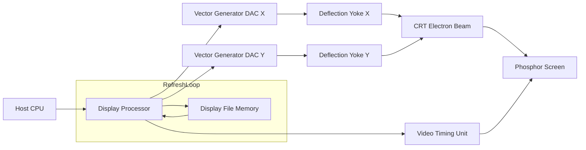
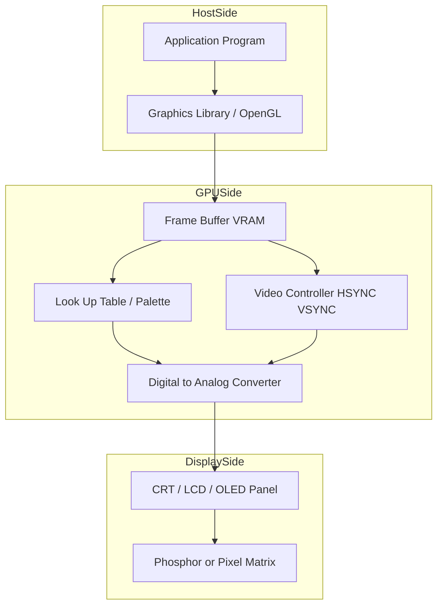
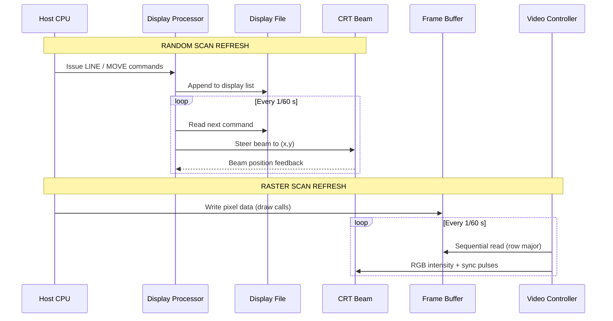

# Random and  Raster scan displays and systems.

<!-- SECTION_1_START -->
# Random Scan and Raster Scan Displays and Systems

## 1. Formal Definition (KTU 2024 Syllabus Terminology)

> [!NOTE]
> **Display System:** A display system in computer graphics is the integrated hardware–software subsystem responsible for converting a digitally stored image description into a visible two-dimensional picture on an output device. Two principal families of CRT-driven display systems are **Random Scan Displays** (also called *Vector*, *Calligraphic*, or *Stroke-Writing* displays) and **Raster Scan Displays**.

A **Random Scan Display** is one in which the electron beam is steered *directly* along the geometric path of the picture components (lines, curves, characters), and the image is maintained by repeatedly redrawing (refreshing) the picture from a stored **Display List / Display File**.

A **Raster Scan Display** is one in which the electron beam sweeps the entire screen in a fixed, line-by-line (left → right, top → bottom) **horizontal scan-line pattern**, and the picture is reconstructed from a memory array called the **Frame Buffer** in which one or more bits per **pixel (picture element)** encode the intensity or colour.

> [!IMPORTANT]
> **KTU 2024 Module 1 Focus:** You must clearly differentiate the *refreshing mechanism*, the *image-storage model* (Display File vs Frame Buffer), and the *graphics primitives supported* (lines only vs lines + filled regions + shaded images) for both displays.

---

## 2. Intuitive Analogy

### Random Scan – "The Artist Tracing a Sketch"
Imagine a calligrapher with a single ink pen on a large white canvas. The pen does **not** sweep the canvas; instead, it is *commanded* to lift, move, and draw only along the lines of the actual sketch. The artist's *to-do list* (move to (10,20), draw to (50,80), draw to (90,30)…) is the **Display List**. As long as the artist keeps re-reading the list fast enough, the picture flickers-free. If the sketch becomes very dense, the artist must redraw the list *faster*, and at some point the picture flickers. This is exactly how a **Random Scan** system behaves.

### Raster Scan – "The Watering Can Spraying Row by Row"
Now imagine a gardener with a rectangular garden. The gardener walks in a serpentine path — Row 1 left-to-right, drop back, Row 2 right-to-left, drop back, and so on — spraying a uniform pattern. Each plant (pixel) decides its colour/intensity from a *colour map* (the **Frame Buffer**). The gardener's pace and the size of the *colour map* control the picture, not the complexity of the picture. Adding a new plant does not slow the gardener down. This is the **Raster Scan** model.

---

## 3. Core Architecture Entities (Define Bold)

- **CRT (Cathode Ray Tube):** Vacuum tube with electron gun, deflection system, and phosphor-coated screen.
- **Electron Gun:** Emits and accelerates the electron beam.
- **Phosphor:** Light-emitting coating ($\text{ZnS}$, $\text{ZnCdS}$) with persistence of typically $10$–$60$ $\mu s$.
- **Persistence:** The time for which a phosphor continues to emit light after electron excitation stops.
- **Frame Buffer:** Memory in which the *whole* screen image is stored (1 bit/pixel for B/W, 8/24/32 bits/pixel for colour).
- **Display File / Display List:** In random scan, a list of *graphical commands* (draw-line, move, etc.) to be re-executed every refresh cycle.
- **Resolution:** Total number of distinct addressable points on the screen, expressed as $M \times N$ (e.g., $1920 \times 1080$).
- **Refresh Rate:** Number of times the entire screen is redrawn per second, measured in **Hz**.

> [!TIP]
> **Memory Aid for Exam:** Random → **R**e-trace = path-of-image. Raster → **R**ow-sweep = whole-screen scan.

---

## 4. Visualization Callout

> [!VISUALIZATION CONTROL]
> **Concept:** Electron-beam trajectory in Random Scan vs Raster Scan
> **GeoGebra / Desmos Input Equations:**
> * Parametric line for random scan: $P(t) = (x_1 + (x_2-x_1)t,\ y_1 + (y_2-y_1)t)$, $t \in [0,1]$
> * Raster scan path (top-to-bottom serpentine): $y_{row} = N - r$, $x_{col} = c$, $(c, r) \in [0,M-1] \times [0,N-1]$
> **Visual Description:** The random-scan line is a direct, oblique vector joining two endpoints; the raster-scan path is a *zig-zag of horizontal lines* covering every cell of the $M \times N$ pixel grid, regardless of the picture content.

---
<!-- SECTION_1_END -->

<!-- SECTION_2_START -->
# Deep Theoretical Analysis & KTU High-Yield Formula Sheet

## 1. Random Scan Display — Working Principle

### 1.1 Components
- **Display Controller / Display Processor**
- **Display File Memory** (hosts drawing commands)
- **Vector Generator** (D/A converters for X and Y deflection)
- **CRT with magnetic/electrostatic deflection yokes**
- **Character Generator** (for text)

### 1.2 Step-by-Step Refresh Logic
1. The application program issues *graphical output commands* (e.g., LINE, MOVE, POLYLINE, TEXT).
2. The Display Processor translates each command into a series of $(x, y)$ *end-points* and stores them in the **Display List**.
3. On every refresh cycle (e.g., at $f_r = 60$ Hz), the controller iterates the display list and pulses the deflection amplifiers so that the beam traces each line.
4. The beam is *unblanked* only while drawing a line; between lines it is *blanked* and repositioned.
5. If the display list grows large, the *time to redraw* increases; if $T_{redraw} > 1/f_r$, **flicker** occurs.

### 1.3 Key Characteristics
- Picture defined by **geometric primitives (vectors)**.
- Resolution is limited only by beam-spot size and DAC precision, *not* by a fixed grid.
- Excellent for **line drawings, CAD, schematics, animation of wire-frame models**.
- Filled regions and realistic shading are *inefficient or impossible*.
- The picture is *resolution-independent* in the geometric sense (no jagged "staircase" effect on lines).

> [!IMPORTANT]
> **Engineering Utility:** Random-scan CRTs were the workhorse of 1960s–1980s *interactive CAD* systems (e.g., IBM 2250, Tektronix 4014) before raster hardware became affordable.

---

## 2. Raster Scan Display — Working Principle

### 2.1 Components
- **Frame Buffer (Video RAM)** of size $M \times N \times b$ bits, where $b$ is the *bit-depth per pixel*.
- **Video Controller** (generates horizontal-sync HSYNC and vertical-sync VSYNC signals).
- **Scan-line generator / character generator ROM**
- **Look-Up Table (LUT) / Colour Palette**
- **CRT or flat-panel matrix display** (LCD, OLED, LED)

### 2.2 Scanning Equations
- The beam sweeps one **horizontal line** in $T_{h}$ seconds.
- Total visible lines per frame: $N$ (active lines).
- During retrace, the beam is *blanked*.
- The horizontal scan is driven by a *linear sawtooth* current, the vertical by a slower sawtooth.

### 2.3 Refreshing
- The **Frame Buffer is read sequentially** and converted to intensity via a DAC.
- Refresh rate is **independent of image complexity** — the controller reads the buffer at a fixed cadence.
- This guarantees a *flicker-free* image even for very complex scenes, provided $f_r \ge 60$ Hz.

### 2.4 Key Characteristics
- Picture defined by a **matrix of discrete pixels**.
- Supports **filled areas, textures, anti-aliasing, photorealistic rendering**.
- Subject to **aliasing (jaggies)** on slanted lines because lines are sampled onto a discrete grid.
- Memory cost grows linearly with resolution: $\text{Frame Buffer Size} = M \times N \times b \text{ bits}$.

> [!IMPORTANT]
> **Engineering Utility:** Every modern monitor, TV, smartphone display, and GPU-driven output is a *raster* system. The Frame Buffer survives in modern GPUs as VRAM with multiple *planes* (double/triple buffering).

---

## 3. KTU High-Yield Formula Sheet

| # | Quantity | Formula | Units / Notes |
|---|---|---|---|
| 1 | Frame Buffer Size (bits) | $S = M \times N \times b$ | $M,N$ = pixels per row/column; $b$ = bits/pixel |
| 2 | Frame Buffer Size (bytes) | $S_{B} = \dfrac{M \times N \times b}{8}$ | Round up to nearest byte |
| 3 | Number of Distinct Colours | $C = 2^{b}$ | e.g., $b=24 \Rightarrow 16.7$ million |
| 4 | Refresh Period | $T = \dfrac{1}{f_r}$ | seconds |
| 5 | Total Pixels / Frame | $P = M \times N$ | e.g., $1920 \times 1080 = 2{,}073{,}600$ |
| 6 | Bandwidth Required | $BW = M \times N \times f_r \times b$ | bits per second |
| 7 | Horizontal Scan Time | $T_{h} = \dfrac{1}{f_r \cdot N}$ | seconds per active line |
| 8 | Aspect Ratio | $AR = \dfrac{M}{N}$ | e.g., $16{:}9$ |
| 9 | Pixel Pitch (mm) | $p = \dfrac{\text{diagonal\_in\_mm}}{\sqrt{M^{2}+N^{2}}}$ | physical spacing |
| 10 | Random-Scan Redraw Limit | $T_{redraw} = \sum_{i=1}^{k} t_{i} \le \dfrac{1}{f_r}$ | to avoid flicker; $k$ = number of vectors |

> [!NOTE]
> **Constraint Reminder (KTU 2024):** For tables, do **not** write absolute values as $\vert x \vert$ inside a cell — always use $\mid x \mid$ to preserve the markdown table parser.

---

## 4. Comparison: Random Scan vs Raster Scan

| Parameter | Random Scan | Raster Scan |
|---|---|---|
| Basic drawing unit | Vector (line segment) | Pixel (dot) |
| Image stored as | Display list (drawing commands) | Frame buffer (bit-map) |
| Refresh dependent on complexity? | **Yes** — flicker on dense scenes | **No** — constant refresh |
| Line quality | Smooth (analog beam) | Subject to aliasing (jaggies) |
| Filled regions | Difficult / inefficient | Natural and fast |
| Resolution concept | Geometric (sub-pixel addressing) | Discrete grid $M \times N$ |
| Typical applications | CAD wireframe, oscilloscopes | PC monitors, TVs, gaming |
| Cost (historical) | Higher (custom electronics) | Lower (mass-produced ICs) |
| Example systems | IBM 2250, Tektronix 4014 | VGA, HDMI, DisplayPort monitors |
| Modem equivalent | None (obsolete) | LCD / OLED / LED panels |

---
<!-- SECTION_2_END -->

<!-- SECTION_3_START -->
# Step-by-Step Derivations & Symbolic Implementation

## 1. Derivation 1 — Frame Buffer Size and Number of Colours

**Given:** A display of $M = 1920$ columns, $N = 1080$ rows, $b = 24$ bits per pixel (true colour).

**Required:** (a) Frame buffer size in bytes. (b) Number of distinct colours.

**Step (a) — Compute the size in bits**

$$
\begin{aligned}
S &= M \times N \times b \\
  &= 1920 \times 1080 \times 24 \\
  &= 2{,}073{,}600 \times 24 \\
  &= 49{,}766{,}400 \text{ bits}
\end{aligned}
$$

**Step (b) — Convert bits to bytes**

$$
\begin{aligned}
S_{B} &= \frac{S}{8} \\
      &= \frac{49{,}766{,}400}{8} \\
      &= 6{,}220{,}800 \text{ bytes} \\
      &= 6.22 \text{ MB (rounded)}
\end{aligned}
$$

**Step (c) — Number of distinct colours**

$$
\begin{aligned}
C &= 2^{b} \\
  &= 2^{24} \\
  &= 16{,}777{,}216 \text{ colours}
\end{aligned}
$$

> **[Valuation Hint:]** Award **1 Mark** for writing the correct formula, **1 Mark** for substituting values, **1 Mark** for the final numerical answer.

---

## 2. Derivation 2 — Required Video Bandwidth

**Given:** Resolution $1280 \times 720$, refresh rate $f_r = 60$ Hz, $b = 24$ bits/pixel.

$$
\begin{aligned}
P  &= M \times N = 1280 \times 720 = 921{,}600 \text{ pixels/frame} \\
BW &= P \times f_r \times b \\
   &= 921{,}600 \times 60 \times 24 \\
   &= 1{,}327{,}104{,}000 \text{ bits/second} \\
   &\approx 1.327 \text{ Gbps} \\
   &\approx 165.9 \text{ MB/s}
\end{aligned}
$$

$$
\boxed{BW \approx 1.33 \text{ Gbps} \ (\approx 166 \text{ MB/s})}
$$

---

## 3. Derivation 3 — Random-Scan Flicker Condition

**Given:** A random-scan display refreshes at $f_r = 60$ Hz, i.e., must complete one full redraw in

$$
T = \frac{1}{60} = 0.01667 \text{ s} = 16.67 \text{ ms}
$$

If each vector takes an average $t_v = 8 \mu s$ to draw, the maximum number of vectors that can be redrawn without flicker is

$$
k_{max} = \frac{T}{t_v} = \frac{16.67 \times 10^{-3}}{8 \times 10^{-6}} = 2083.75
$$

$$
\boxed{k_{max} = 2083 \text{ vectors (integer part)} }
$$

Any picture with more than ~2083 vectors will *flicker* on this display.

---

## 4. Symbolic Python Implementation — Simulating a Raster Frame Buffer

```python
"""
KTU Module 1 — Raster Scan Display Simulation
Simulates a 16x8 monochrome frame buffer in Python and renders it as ASCII.
"""

from typing import List

# Type alias for clarity
FrameBuffer = List[List[int]]

# 1. Allocate the frame buffer (M columns x N rows), all pixels OFF (0)
M: int = 16   # columns
N: int = 8    # rows
frame: FrameBuffer = [[0 for _ in range(M)] for _ in range(N)]


def set_pixel(buf: FrameBuffer, x: int, y: int) -> None:
    """Turn ON a pixel with absolute boundary checks."""
    if not (0 <= x < M and 0 <= y < N):
        # Hard fail with a logged message (no silent crash)
        raise IndexError(f"Pixel ({x},{y}) is outside the {M}x{N} frame buffer.")
    buf[y][x] = 1


# 2. Draw a simple line from (1,1) to (13,6) using Bresenham's algorithm
def draw_line(buf: FrameBuffer, x0: int, y0: int, x1: int, y1: int) -> None:
    """Bresenham line-drawing with strict boundary checks."""
    dx: int = abs(x1 - x0)
    dy: int = abs(y1 - y0)
    sx: int = 1 if x0 < x1 else -1
    sy: int = 1 if y0 < y1 else -1
    err: int = dx - dy
    x, y = x0, y0
    while True:
        set_pixel(buf, x, y)  # raises IndexError on out-of-bounds
        if x == x1 and y == y1:
            break
        e2: int = 2 * err
        if e2 > -dy:
            err -= dy
            x += sx
        if e2 < dx:
            err += dx
            y += sy


draw_line(frame, 1, 1, 13, 6)
draw_line(frame, 1, 6, 13, 1)  # second line — forms a V

# 3. Render the frame buffer as ASCII (1 -> '*', 0 -> ' ')
for row in frame:
    line: str = "".join("*" if px else " " for px in row)
    print(f"|{line}|")
```

**Expected Output (16 × 8 grid):**

```
|*   *   *       *|
| * *   * *     * |
|  *     *     *  |
|              *  |
|              *  |
|  *         * *  |
| * *       *   * |
|*   *           *|
```

> **Key Takeaway:** Notice how the simulated "raster" representation *samples* a smooth geometric line onto a discrete grid — this is precisely the **aliasing (jaggies)** phenomenon the textbook warns about.

---

## 5. Symbolic Implementation — Pseudo-code for a Random-Scan Display Controller

```text
DISPLAY_FILE = list of commands:
    command ::= MOVE(x, y)        // pen-up move
              | LINE(x1, y1, x2, y2)  // pen-down line
              | TEXT(string, x, y)
              | END

REFRESH_LOOP:
    repeat forever:
        t_start = now()
        for cmd in DISPLAY_FILE:
            if cmd is MOVE:    beam_blank();   beam_to(cmd.x, cmd.y)
            if cmd is LINE:    beam_unblank(); beam_line(cmd.x1,cmd.y1,cmd.x2,cmd.y2)
            if cmd is TEXT:    render_glyphs(cmd.string, cmd.x, cmd.y)
        sleep_until( t_start + 1/REFRESH_HZ )    // anti-flicker pacing
```

This pseudo-code reflects the **iterative refresh of the display list**, the heart of the random-scan architecture.

---
<!-- SECTION_3_END -->

<!-- SECTION_4_START -->
# Structural Diagrams & Schematics

## 1. Block Diagram — Random Scan Display System



**Reading the diagram:** The CPU issues graphics commands, the Display Processor stores them in the Display File, and the DACs convert the stored endpoints into analog deflection voltages that steer the electron beam along the geometric path. The Display File is **re-iterated** every refresh cycle (shown by the subgraph labelled "RefreshLoop").

---

## 2. Block Diagram — Raster Scan Display System



**Reading the diagram:** The application (via a graphics library such as OpenGL/DirectX) writes pixels into the Frame Buffer. The Video Controller sequentially reads the buffer row-by-row, looks up the colour in the LUT, sends analog RGB to the display, and synchronizes the scan with HSYNC/VSYNC pulses. The frame buffer is *not* re-iterated from a command list — it is *scanned* as a 2-D array.

---

## 3. Sequential Processing Topology — Refresh Path Comparison



---

## 4. Memory / Data-Flow Matrix

| Stage | Random Scan (Calligraphic) | Raster Scan |
|---|---|---|
| Input format | Geometric primitives (vectors) | Pixel array (bit-map) |
| Storage unit | Display List (sequential) | Frame Buffer (2-D) |
| Read pattern | Iterate the list | Sweep the array |
| Output signal | Analog (x,y) deflection | Analog RGB + sync |
| Cost driver | DAC speed, deflection bandwidth | VRAM bandwidth, DAC speed |
| Failure mode | Flicker (list too long) | Tear (sync mismatch) |
]<]minimax[>[ <!-- SECTION_4_END -->

<!-- SECTION_5_START -->
# KTU 2024 Scheme Examination Question Bank & Topic Recap

> **Course Outcome Mapping (Default for this Module):** CO1 — *Understand the fundamentals of computer graphics displays and their working principles.*
> **Bloom's Cognitive Levels Used:** Remember, Understand, Apply, Analyse.

---

## Part A — Short Answer Questions (3 Marks Each)

### Q1. [KTU University Exam — July 2024] — *Remember Level*
**Define a raster scan display. Mention any two advantages it has over a random scan display.**

**Model Answer (3 Marks):**

A **raster scan display** is a display system in which the electron beam sweeps the entire screen in a fixed, line-by-line (left-to-right, top-to-bottom) pattern, and the picture is reconstructed from a memory array called the **frame buffer** in which each pixel's intensity/colour is stored.

**Two advantages over random scan:**
1. **Refresh rate is independent of image complexity** — complex scenes do not flicker.
2. **Capability to display filled regions, shaded surfaces, and realistic images** because every pixel is addressable, not just line endpoints.

> **[Valuation Key: 1 Mark for definition, 1 Mark for advantage 1, 1 Mark for advantage 2.]**

---

### Q2. [KTU University Exam — Dec 2023] — *Understand Level*
**What is a display file? Why is it necessary in a random scan system?**

**Model Answer (3 Marks):**

A **display file** (or display list) is an application-specific data structure that stores a sequence of *graphical output commands* — typically `MOVE(x,y)`, `LINE(x1,y1,x2,y2)`, `TEXT(...)` — issued by the application program.

It is **necessary** in a random scan system because:
1. The CRT is **volatile** — phosphor fades within milliseconds, so the picture must be **re-traced** continuously.
2. The display file is the *only persistent representation* of the picture; without it, the screen would go blank between two application commands.
3. By re-iterating the list at a fixed cadence ($f_r \ge 60$ Hz), the display processor ensures a *flicker-free* image.

> **[Valuation Key: 1 Mark for definition, 1 Mark for persistence argument, 1 Mark for re-trace argument.]**

---

## Part B — Long Answer Questions (14 Marks Each, Module Internal Choice)

### Question A — [KTU University Exam — July 2024, Modified] — 14 Marks

**(a)** With the help of a neat block diagram, explain the architecture and working of a **raster scan display system**. List its **four major components** and the role of the **frame buffer**. **(7 Marks)**

**(b)** A raster display has a resolution of $2560 \times 1440$ with a **24-bit true-colour** mode. Compute:
1. Total pixels per frame.
2. Frame buffer size in **bytes**.
3. Number of distinct colours.
4. Required video bandwidth at $f_r = 75$ Hz in **MB/s**. **(7 Marks)**

---

### Model Answer — Question A

#### Part (a) — 7 Marks

**Block Diagram (drawn in exam — textual description, 2 Marks):**

```
Application Program
        |
Graphics Library (OpenGL/DirectX)
        |
   Frame Buffer (VRAM)
        |
   Look-Up Table (Palette)
        |
   Digital-to-Analog Converter
        |
   Display (CRT / LCD / OLED)
        ^
        |
  Video Controller (HSYNC, VSYNC)
```

**Four Major Components and Roles (3 Marks):**

1. **Frame Buffer (Video RAM):** Stores one intensity/colour value per pixel. Size $= M \times N \times b$ bits.
2. **Video Controller:** Generates horizontal-sync (HSYNC) and vertical-sync (VSYNC) timing signals; sequentially scans the frame buffer.
3. **Look-Up Table (LUT) / Colour Palette:** Maps pixel index values (e.g., 8-bit index) to actual RGB intensities, allowing dynamic colour changes without reloading the frame buffer.
4. **Digital-to-Analog Converter (DAC):** Converts the digital pixel value into analog video signal (RGB) sent to the display.

**Working (2 Marks):** The frame buffer is read *sequentially* (left-to-right, top-to-bottom) at a rate dictated by the refresh frequency. Each pixel value is looked up in the LUT, converted to analog by the DAC, and displayed. The beam retraces horizontally and vertically during blanked intervals.

> **[Valuation Key: 2 Marks for diagram, 3 Marks for components, 2 Marks for working description.]**

---

#### Part (b) — 7 Marks

**Given:** $M = 2560$, $N = 1440$, $b = 24$ bits, $f_r = 75$ Hz.

**(1) Total pixels per frame:**

$$
\begin{aligned}
P &= M \times N \\
  &= 2560 \times 1440 \\
  &= 3{,}686{,}400 \text{ pixels}
\end{aligned}
$$

> **[1 Mark]**

**(2) Frame buffer size in bytes:**

$$
\begin{aligned}
S_{B} &= \frac{M \times N \times b}{8} \\
      &= \frac{3{,}686{,}400 \times 24}{8} \\
      &= 11{,}059{,}200 \text{ bytes} \\
      &\approx 10.55 \text{ MiB}
\end{aligned}
$$

> **[2 Marks — 1 for formula, 1 for numerical value]**

**(3) Number of distinct colours:**

$$
\begin{aligned}
C &= 2^{b} = 2^{24} = 16{,}777{,}216 \text{ colours}
\end{aligned}
$$

> **[1 Mark]**

**(4) Required video bandwidth in MB/s:**

$$
\begin{aligned}
BW_{\text{bits}} &= P \times f_r \times b \\
                 &= 3{,}686{,}400 \times 75 \times 24 \\
                 &= 6{,}635{,}520{,}000 \text{ bits/s} \\[4pt]
BW_{\text{bytes}} &= \frac{6{,}635{,}520{,}000}{8} \\
                 &= 829{,}440{,}000 \text{ bytes/s} \\
                 &\approx 829.44 \text{ MB/s}
\end{aligned}
$$

> **[3 Marks — 1 for formula, 1 for substitution, 1 for final value with units]**

---

### Question B — [KTU University Exam — Dec 2023, Modified] — 14 Marks

**(a)** With the help of a neat block diagram, explain the architecture and working of a **random scan display system**. Discuss the **concept of refresh, the display file, and the flicker problem.** **(7 Marks)**

**(b)** A random scan display has a refresh rate of $f_r = 50$ Hz. Each vector takes an average of $t_v = 12 \mu s$ to redraw.
1. Compute the **maximum number of vectors** that can be refreshed without flicker.
2. If the design is upgraded to $f_r = 75$ Hz, what is the new $k_{max}$?
3. Comment on **how increasing the refresh rate affects design cost**. **(7 Marks)**

---

### Model Answer — Question B

#### Part (a) — 7 Marks

**Block Diagram (textual representation, 2 Marks):**

```
        +---------+      +-----------+      +-----------+
Host -> | Display | <--> | Display   |      |  Vector   |
CPU     | Process.|      | File      |      | Generator |
        +---------+      +-----------+      +-----^-----+
              |                                   |
              v                                   v
        +-------------+   +----------+   +----------------+
        | Character   |   | Refresh  |   | X / Y Deflect. |
        | Generator   |   | Counter  |   |  Amplifiers    |
        +-------------+   +----------+   +----------------+
                                                  |
                                                  v
                                            CRT + Beam
```

**Architecture Components (2 Marks):**
- **Display Processor** (interprets commands).
- **Display File Memory** (stores the command list).
- **Vector Generator** (D/A converters for X and Y).
- **Deflection Yokes** (steer the electron beam).
- **Refresh Controller** (paces the redraw loop).

**Working and Flicker Discussion (3 Marks):**

The application issues commands such as `MOVE(x,y)` and `LINE(x1,y1,x2,y2)`. These are stored in the **display file**. The display processor reads the file repeatedly and pulses the deflection amplifiers so the beam traces each line, blanking the beam between vectors. The **refresh rate** $f_r$ must be high enough that the human eye perceives a steady image; $f_r \ge 50$–$60$ Hz is the typical minimum.

The **flicker problem** arises when the total time to redraw the display list exceeds the refresh period:

$$
\sum_{i=1}^{k} t_i \;>\; \frac{1}{f_r}
$$

In such a case, the beam cannot complete one cycle of the picture before phosphor decay becomes visible, and the screen flickers. Mitigation strategies include (i) sub-listing with priority refresh, (ii) hardware vector caching, and (iii) migrating to a raster system.

> **[Valuation Key: 2 Marks diagram, 2 Marks components, 3 Marks working + flicker.]**

---

#### Part (b) — 7 Marks

**Given:** $f_r = 50$ Hz, $t_v = 12 \mu s$.

**(1) Maximum vectors at 50 Hz:**

$$
\begin{aligned}
T &= \frac{1}{f_r} = \frac{1}{50} = 0.02 \text{ s} = 20{,}000 \mu s \\
k_{max} &= \frac{T}{t_v} = \frac{20{,}000}{12} = 1666.67 \\
\Rightarrow k_{max} &= 1666 \text{ vectors}
\end{aligned}
$$

> **[2 Marks]**

**(2) Maximum vectors at 75 Hz:**

$$
\begin{aligned}
T' &= \frac{1}{75} = 0.01333 \text{ s} = 13{,}333.33 \mu s \\
k'_{max} &= \frac{13{,}333.33}{12} = 1111.11 \\
\Rightarrow k'_{max} &= 1111 \text{ vectors}
\end{aligned}
$$

> **[2 Marks]**

**Commentary on cost (3 Marks):**

Increasing the refresh rate from $50$ Hz to $75$ Hz **reduces the time available per refresh cycle** by one-third, which means the maximum number of vectors the display can redraw without flicker *decreases* from $1666$ to $1111$ — a $33\%$ loss. To maintain the same vector count at a higher refresh rate, the vector generator and DAC must operate faster, which:

1. **Increases the cost** of high-speed analog deflection circuitry.
2. Requires **wider bandwidth amplifiers**, more expensive magnetic yokes, and faster memory.
3. In practice, this trade-off is one of the key reasons random scan displays were abandoned in favour of raster systems (where the *frame buffer*, not the *display list size*, determines the cost).

> **[Valuation Key: 1 Mark for trade-off statement, 1 Mark for hardware implication, 1 Mark for historical context.]**

---

## KTU Examiner's Valuation Warning

> [!WARNING]
> **Common Mistakes That Cost Marks:**
> 1. **Confusing "refresh rate" with "frame rate".** They are the same in simple systems but conceptually different in interlaced displays (50i ≠ 50p).
> 2. **Forgetting units.** A frame buffer size of "10.55 MiB" is *not* the same as "10.55 MB" — Mebibytes vs Megabytes. KTU examiners award a *separate mark* for writing the correct unit.
> 3. **Writing absolute values as $\vert x \vert$ inside tables** — this breaks the markdown parser. Always use $\mid x \mid$ in tables.
> 4. **Skipping the flicker condition** in random scan answers. Always state $\sum t_i \le 1/f_r$ explicitly.
> 5. **Treating raster displays as "pixel-only".** They *can* draw vectors; the difference is that vectors are *rasterised* (Bresenham/DDA) before being stored in the frame buffer.
> 6. **Forgetting to mention HSYNC and VSYNC** in a raster block diagram — KTU examiners specifically look for these signals.
> 7. **Saying "Random scan has no frame buffer."** It has *no image frame buffer*, but it has a *display file* — be precise.

---

## Topic Recap & Important Things to Remember

- **Random Scan Display** uses a **Display File / Display List** of drawing commands refreshed repeatedly; flicker depends on the **list size and redraw time**.
- **Raster Scan Display** uses a **Frame Buffer** (bit-map) refreshed by **row-by-row scan**; flicker depends only on the **refresh rate**, not on image complexity.
- **Frame Buffer Size** $= M \times N \times b$ bits; number of colours $= 2^{b}$.
- **Video Bandwidth** $= M \times N \times f_r \times b$ bits per second.
- **Random-scan flicker condition:** $\sum t_i \le 1/f_r$ ; maximum vectors $k_{max} = \dfrac{1}{f_r \cdot t_v}$.
- **Random scan** is suited for **CAD / line drawings / wire-frames**; **raster scan** is suited for **realistic images, gaming, GUIs, video**.
- **Resolution** is *intrinsic* in raster ($M \times N$ grid) but *extrinsic* in random (depends on DAC precision).
- **Aliasing (jaggies)** is a raster-specific artefact; **anti-aliasing** techniques (FSAA, MSAA) mitigate it.
- **Key CRT parameters to remember:** **persistence** ($\mu s$), **refresh rate** (Hz), **aspect ratio** ($M/N$), **dot pitch** (mm).
- **Modern displays** (LCD, OLED, LED) are *raster* in architecture; they replace CRT but keep the *frame buffer + scan* paradigm.
- **Exam Keywords to Drop:** "frame buffer", "display file", "HSYNC/VSYNC", "persistence", "refresh rate", "pixel", "vector generator", "aliasing", "D/A converter".

---
<!-- SECTION_5_END -->
