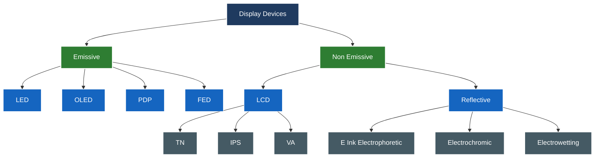
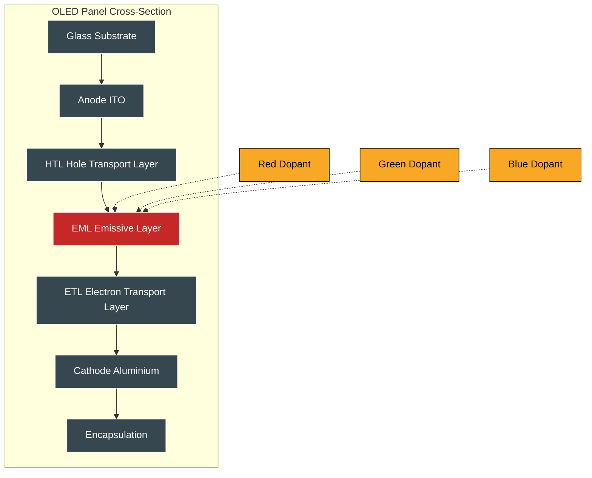
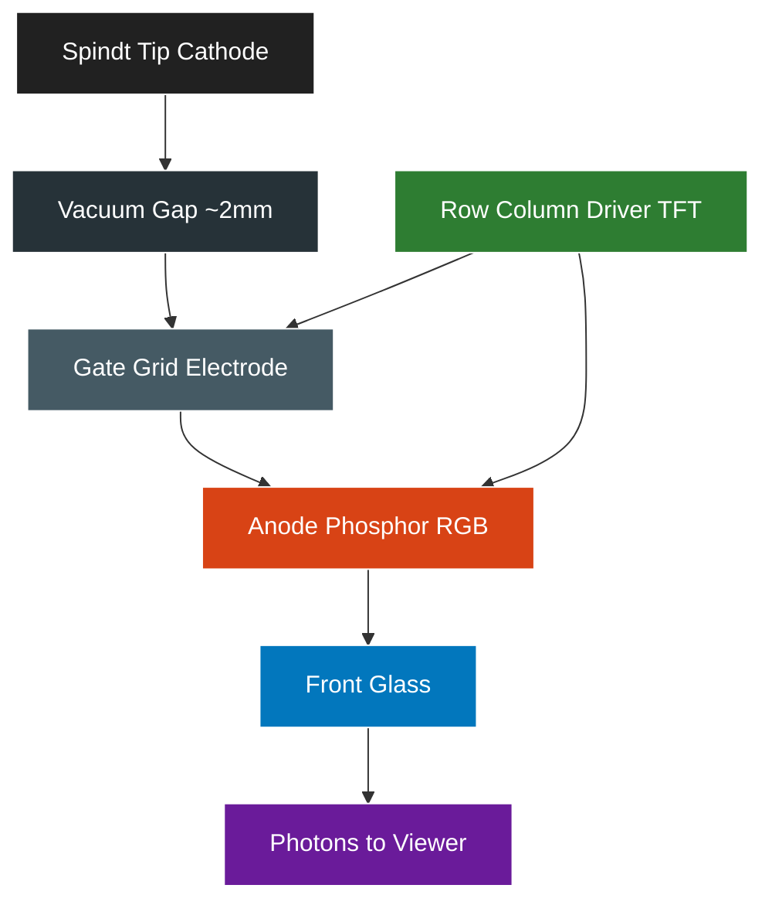
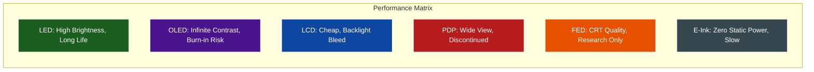

# Video Display devices - LED, OLED, LCD, PDP and FED and reflective displays.

<!-- SECTION_1_START -->
# Video Display Devices in Computer Graphics

## 1.1 Formal Definition (KTU 2024 Syllabus Terminology)

A **Video Display Device** is an electronic output peripheral that visually renders digital image data generated by a graphics system. In Computer Graphics, the display device forms the final stage of the **image synthesis pipeline**, converting a **frame buffer** of pixel intensities into a spatially and chromatically faithful representation visible to the human eye.

> [!IMPORTANT]
> **KTU 2024 Module 1 Focus:** The syllabus explicitly enumerates the classification of emissive (LED, OLED, PDP, FED) and non-emissive / reflective (LCD, E-Ink) display devices, along with their underlying physical principles. A board answer must clearly differentiate **emissive** (self-luminous) technologies from **non-emissive** (light-modulating) technologies.

The primary classification used by KTU examiners is:

$$
\text{Display Devices} = \begin{cases} \text{Emissive (Active Matrix)} & : \text{LED, OLED, PDP, FED} \\ \text{Non-Emissive (Passive Matrix)} & : \text{LCD, Reflective (E-Ink)} \end{cases}
$$

## 1.2 Conceptual Analogy & Intuition

> [!NOTE]
> **Analogy — The Stadium Scoreboard vs. The Window Curtain**
> Imagine a stadium scoreboard (CRT/LED): every bulb *generates* its own light to spell out a message. Now imagine a window with adjustable louvers (LCD): the light source exists outside, but the louvers **modulate** how much light passes through. Emissive displays are *scoreboards*; non-emissive displays are *curtains that control external light*.

Each display technology represents a different engineering strategy to achieve the same goal — controlling the **luminance** ($L$, in $cd/m^2$) and **chromaticity** of every pixel:

- **LED / OLED / PDP / FED** → each pixel is a *tiny bulb* that emits photons directly.
- **LCD / Reflective** → each pixel is a *light valve* that either passes, blocks, or rotates the polarization of light from a backlight (or ambient light).

## 1.3 Key Physical Constants & Metrics

> [!IMPORTANT]
> The following are **industry-standard reference metrics** for KTU answers. Always state units in board examinations.

| Metric | Symbol | Standard Value |
| :--- | :---: | :--- |
| Standard refresh rate | $f_{r}$ | **60 Hz** (HDTV) / 75 Hz (monitor) |
| Human flicker fusion threshold | $f_{flicker}$ | **> 24 Hz** (cinema) / > 75 Hz (perceptual) |
| CIE standard illuminant D65 | $x, y$ | **$0.3127, 0.3290$** (white point) |
| sRGB color gamut coverage | — | **~35% of CIE 1931** |
| Human eye angular resolution | $\theta_{min}$ | **~1 arc-minute** |
| Standard aspect ratios | $AR$ | **4:3, 16:9, 21:9** |

## 1.4 Subsystem Overview

The full display subsystem chain in any computer graphics workstation is:

$$
\boxed{\text{GPU} \rightarrow \text{Frame Buffer} \rightarrow \text{Display Controller} \rightarrow \text{Display Device} \rightarrow \text{Human Visual System (HVS)}}
$$

> [!VISUALIZATION CONTROL]
> **Concept:** Display Classification Hierarchy (Tree)
> **GeoGebra / Desmos Input Equations (textual representation):**
> * Root = Display Devices
> * Branch 1: Emissive
> * Sub-branches: LED, OLED, PDP, FED
> * Branch 2: Non-Emissive
> * Sub-branches: LCD (TN/IPS/VA), Reflective (E-ink, Electrophoretic)
> **Visual Description:** A top-down tree where the root splits into two primary branches based on light-generation strategy. Each branch subdivides into specific technologies. The depth of the tree illustrates the chronological evolution from CRT (oldest) to MicroLED (newest).

<!-- SECTION_1_END -->

<!-- SECTION_2_START -->
# Deep Theoretical Analysis — Working Principles of Each Display

## 2.1 LED (Light Emitting Diode) Display

An **LED display** uses a semiconductor p–n junction that emits photons via **electroluminescence** when forward-biased. The emitted wavelength is governed by the **bandgap energy** of the semiconductor:

$$
\lambda = \frac{hc}{E_g} = \frac{1240 \text{ eV·nm}}{E_g \text{ (in eV)}} \text{ nm}
$$

where $h$ is Planck's constant and $c$ is the speed of light.

- **SMD (Surface Mount Device) LEDs** are clustered in RGB triplets to form one pixel.
- **Mini-LED / Micro-LED** variants use thousands of dimming zones for **local dimming** and HDR contrast.

> [!NOTE]
> **Application:** Stadium scoreboards, outdoor billboards, modern premium TVs (Samsung "The Wall", LG MAGNIT). KTU often asks: *"Why is LED preferred for large-format displays?"* — Answer: High luminance ($\geq 1000 \text{ nits}$), long lifetime ($\geq 100{,}000$ hours), and excellent sunlight readability.

## 2.2 OLED (Organic Light Emitting Diode) Display

OLEDs replace the inorganic semiconductor with an **organic compound** (e.g., $\text{Alq}_3$ — tris(8-hydroxyquinolinato)aluminium) sandwiched between two electrodes. When current flows, electrons and holes recombine in the **emissive layer**, releasing energy as visible photons.

Structure: $\text{Anode (ITO)} \rightarrow \text{HTL} \rightarrow \text{EML} \rightarrow \text{ETL} \rightarrow \text{Cathode (Al)}$

Key properties:
- **Self-emissive** → no backlight required.
- **True blacks** because pixels can be switched off completely (infinite contrast ratio).
- **Flexible substrates** → foldable / rollable displays.
- **Burn-in risk** due to differential organic degradation.

> [!IMPORTANT]
> **AMOLED vs PMOLED:** KTU examiners frequently test the difference between **Active Matrix OLED (AMOLED)** — uses a TFT backplane, suitable for high-resolution screens — and **Passive Matrix OLED (PMOLED)** — uses a grid of row/column drivers, limited to small displays (older MP3 players, wearable sub-screens).

## 2.3 LCD (Liquid Crystal Display) — Non-Emissive

LCDs do **not** emit light; they **modulate** polarized backlight using **nematic liquid crystals** whose molecular orientation can be twisted by an applied electric field (via the **Frederiks transition**).

Optical transmission for a TN-LCD is governed by:

$$
T(\theta) = \sin^2(2\theta) \cdot \sin^2\left(\frac{\pi \cdot d \cdot \Delta n}{\lambda}\right)
$$

where $\theta$ is the angle between the polarizer and the liquid crystal director, $d$ is the cell thickness, $\Delta n$ is the birefringence, and $\lambda$ is the wavelength.

Sub-types (very high-yield for KTU):
- **TN (Twisted Nematic)** — fast, cheap, poor viewing angle.
- **IPS (In-Plane Switching)** — wide viewing angle, accurate color (used in iPhones, LG monitors).
- **VA (Vertical Alignment)** — high contrast, common in Samsung TVs.

## 2.4 PDP (Plasma Display Panel)

A **plasma display** uses tiny cells filled with **noble gases** (Ne, Xe). When a voltage is applied, the gas ionizes into a **plasma state**, and UV photons emitted by the plasma excite **phosphors** (RGB) which then emit visible light.

$$
\text{Xe}^* \rightarrow \text{Xe} + h\nu_{UV} \quad ; \quad h\nu_{UV} + \text{Phosphor} \rightarrow \text{Phosphor}^* \rightarrow \text{Phosphor} + h\nu_{visible}
$$

- Pros: Deep blacks, wide viewing angle, large screen sizes (up to 152").
- Cons: High power consumption, **screen burn-in**, heavier than LCD/LED.
- Status: Discontinued by most manufacturers (LG ceased production in 2015, Samsung in 2014).

## 2.5 FED (Field Emission Display)

A **FED** is essentially a flat-panel version of a CRT. Each pixel has microscopic **cold-cathode emitters** (often **Spindt tips** made of molybdenum or carbon nanotubes) that emit electrons via **field emission** (quantum tunneling under a strong electric field, governed by the **Fowler-Nordheim equation**).

$$
J = \frac{A \cdot E^2}{\phi} \cdot \exp\left(\frac{-B \cdot \phi^{3/2}}{E}\right)
$$

where $J$ is the emission current density, $E$ is the electric field, and $\phi$ is the work function. Electrons strike RGB phosphors just like in a CRT, producing light.

- Combines CRT-quality color with thin flat-panel form factor.
- Technically challenging (vacuum spacing, emitter uniformity).
- Largely **research-only**; Sony and Samsung demonstrated prototypes but did not commercialize widely.

## 2.6 Reflective Displays (E-Ink, Electrophoretic)

**Reflective displays** use **ambient light** instead of a backlight. The most common type is **E-Ink** (used in Amazon Kindle), which contains millions of microcapsules filled with **charged pigment particles** (black and white) suspended in a clear fluid.

- A negative charge moves **white particles** to the surface (white pixel).
- A positive charge moves **black particles** to the surface (black pixel).
- No power is consumed once the image is set → **bi-stable**.

$$
P_{static} \approx 0 \text{ W} \quad ; \quad P_{transition} \approx 50 \text{ mW during page turn}
$$

## 2.7 KTU Formula Sheet / Comparison Table

> [!NOTE]
> This is the **master reference table** for any KTU board question. Memorize the principle column and the limitations column.

| Technology | Light Source | Emissive? | Backlight? | Typical Contrast | Refresh Rate | Color Gamut | Key Limitation |
| :--- | :---: | :---: | :---: | :---: | :---: | :---: | :--- |
| **LED** | GaN/InGaN semiconductors | Yes | No | 5000:1 | $\geq 120$ Hz | Wide (with QD) | Pixel pitch at distance |
| **OLED** | Organic emitters | Yes | No | $\infty{:}1$ | $\leq 120$ Hz | DCI-P3 99% | Burn-in, lifetime |
| **LCD (IPS)** | CCFL/LED backlight | No | Yes | 1000:1 | $\leq 240$ Hz | sRGB / Adobe | Backlight bleed |
| **PDP** | Ionized Xe plasma | Yes | No | 30000:1 | $\leq 600$ Hz sub-field | Rec.709 | Power, burn-in |
| **FED** | Field-emitted e⁻ on phosphor | Yes | No | $\infty{:}1$ (CRT-like) | $\leq 240$ Hz | Wide (phosphor) | Manufacturing yield |
| **Reflective (E-Ink)** | Ambient light | No (modulates) | No | 15:1 | $\leq 1$ Hz (static) | Mono (16 grays) | Slow refresh, mono |

## 2.8 Engineering Utility in Production

- **LED**: outdoor digital signage, control room video walls, traffic signals.
- **OLED**: flagship smartphones, premium TVs, VR headsets (low persistence).
- **LCD**: mid-range monitors, laptops, automotive dashboards (IPS for safety viewing angles).
- **PDP**: historically, large living-room TVs (now obsolete).
- **FED**: research prototypes for high-brightness aviation/military HUDs.
- **Reflective (E-Ink)**: e-readers, electronic shelf labels (ESL), solar-powered IoT displays.

<!-- SECTION_2_END -->

<!-- SECTION_3_START -->
# Step-by-Step Derivations & Worked Examples

## 3.1 Worked Example 1 — LED Emission Wavelength

**Problem:** A red LED uses an AlGaInP semiconductor with bandgap $E_g = 1.95$ eV. Calculate the dominant emission wavelength and verify it lies in the visible red region (620–750 nm).

**Step 1 — Apply the bandgap-wavelength relation:**

$$
\lambda = \frac{hc}{E_g}
$$

**Step 2 — Substitute constants $hc = 1240$ eV·nm and $E_g = 1.95$ eV:**

$$
\lambda = \frac{1240 \text{ eV·nm}}{1.95 \text{ eV}}
$$

**Step 3 — Numerical evaluation:**

$$
\lambda = 635.897 \text{ nm} \approx 636 \text{ nm}
$$

**Step 4 — Verification:** $636 \text{ nm} \in [620, 750] \text{ nm}$ — confirmed visible red.

> [!NOTE]
> **Board Tip:** Always write the final answer with the correct unit. Marks are awarded for: (a) formula statement [1 mark], (b) substitution [1 mark], (c) final answer with unit [1 mark].

## 3.2 Worked Example 2 — LCD Transmission Calculation

**Problem:** A TN-LCD cell has thickness $d = 5 \mu\text{m}$, birefringence $\Delta n = 0.10$, and operates with $\theta = 45°$ for green light ($\lambda = 550$ nm). Calculate the transmission ratio.

**Step 1 — Use the Gooch-Tarry transmission formula:**

$$
T = \sin^2(2\theta) \cdot \sin^2\left(\frac{\pi \cdot d \cdot \Delta n}{\lambda}\right)
$$

**Step 2 — Compute the polarization term:**

$$
\sin^2(2 \cdot 45°) = \sin^2(90°) = (1)^2 = 1
$$

**Step 3 — Compute the retardation term (argument in radians):**

$$
\delta = \frac{\pi \cdot d \cdot \Delta n}{\lambda} = \frac{\pi \cdot (5 \times 10^{-6} \text{ m}) \cdot 0.10}{550 \times 10^{-9} \text{ m}}
$$

$$
\delta = \frac{\pi \cdot 5 \times 10^{-7}}{5.5 \times 10^{-7}} = \frac{\pi}{1.1} = 2.8559 \text{ rad}
$$

**Step 4 — Compute the sin² term:**

$$
\sin(2.8559) = \sin(2.8559 - \pi) = \sin(-0.2857) = -0.2817
$$

$$
\sin^2(2.8559) = 0.0794
$$

**Step 5 — Final transmission:**

$$
T = 1 \cdot 0.0794 = 0.0794 \approx 7.94\%
$$

**Interpretation:** Only ~8% of backlight passes through — this is why LCDs require bright backlights to compensate.

## 3.3 Worked Example 3 — Refresh Rate vs. Frame Buffer Bandwidth

**Problem:** A 4K display ($3840 \times 2160$) operates at 60 Hz with 24-bit color. Calculate the required frame buffer bandwidth.

**Step 1 — Total pixels per frame:**

$$
N_{pix} = 3840 \times 2160 = 8{,}294{,}400 \text{ pixels}
$$

**Step 2 — Bytes per pixel (24-bit = 3 bytes):**

$$
B_{pix} = 3 \text{ bytes}
$$

**Step 3 — Bytes per second:**

$$
B_{sec} = N_{pix} \cdot B_{pix} \cdot f_r = 8{,}294{,}400 \cdot 3 \cdot 60
$$

**Step 4 — Compute:**

$$
B_{sec} = 1{,}492{,}992{,}000 \text{ bytes/s} \approx 1.42 \text{ GB/s}
$$

> [!NOTE]
> **Practical relevance:** HDMI 2.0 supports up to 18 Gbps (~2.25 GB/s), so a single 4K@60 24-bit stream fits comfortably. 4K@120 requires HDMI 2.1 (48 Gbps).

## 3.4 Worked Example 4 — Aspect Ratio and Resolution

**Problem:** A monitor has a 16:9 aspect ratio and a diagonal of 27 inches. Compute the width, height, and total pixel count if the resolution is $2560 \times 1440$ (QHD).

**Step 1 — Relate diagonal to width and height using Pythagoras:**

$$
d^2 = w^2 + h^2
$$

**Step 2 — Express $h$ in terms of $w$ using AR = 16/9:**

$$
h = \frac{9}{16} w
$$

**Step 3 — Substitute:**

$$
27^2 = w^2 + \left(\frac{9}{16} w\right)^2 = w^2 \left(1 + \frac{81}{256}\right) = w^2 \cdot \frac{337}{256}
$$

**Step 4 — Solve for $w$:**

$$
w^2 = 27^2 \cdot \frac{256}{337} = 729 \cdot 0.7596 = 553.7
$$

$$
w = \sqrt{553.7} \approx 23.53 \text{ inches}, \quad h = \frac{9}{16} \cdot 23.53 \approx 13.24 \text{ inches}
$$

**Step 5 — Total pixels:**

$$
N = 2560 \times 1440 = 3{,}686{,}400 \text{ pixels}
$$

**Step 6 — PPI (Pixels Per Inch):**

$$
\text{PPI} = \frac{\sqrt{2560^2 + 1440^2}}{27} = \frac{2938.7}{27} \approx 108.8 \text{ PPI}
$$

> [!IMPORTANT]
> **Retina threshold:** Apple defines "Retina" as PPI $\geq$ ~300 at typical viewing distance (12 inches). This 27" QHD panel at 108 PPI is *not* Retina — a 27" 5K panel (5120×2880) is needed to reach 218 PPI.

## 3.5 Complete Python Reference — Display Metrics Calculator

```python
"""
KTU Computer Graphics — Display Metrics Calculator
Module 1: Video Display Devices
Computes: resolution, bandwidth, PPI, aspect ratio, wavelength.
"""

from __future__ import annotations
import math
from dataclasses import dataclass
from typing import Tuple


# Planck's constant times speed of light, expressed in eV·nm
HC_EV_NM: float = 1240.0

# Standard sRGB / BT.709 reference white point (CIE 1931)
WHITE_POINT_D65: Tuple[float, float] = (0.3127, 0.3290)


@dataclass(frozen=True)
class DisplayMetrics:
    """Immutable container for a display device's measured characteristics."""
    width_px: int
    height_px: int
    refresh_hz: float
    color_depth_bits: int
    diagonal_inches: float

    def total_pixels(self) -> int:
        """Return the absolute pixel count of the panel."""
        if self.width_px <= 0 or self.height_px <= 0:
            raise ValueError("Resolution must be strictly positive.")
        return self.width_px * self.height_px

    def bandwidth_gbps(self) -> float:
        """Return the uncompressed frame buffer bandwidth in Gigabits per second."""
        bits_per_frame = self.total_pixels() * self.color_depth_bits
        bits_per_sec = bits_per_frame * self.refresh_hz
        return bits_per_sec / 1e9

    def ppi(self) -> float:
        """Return the pixel density in pixels per inch."""
        diagonal_px = math.sqrt(self.width_px ** 2 + self.height_px ** 2)
        return diagonal_px / self.diagonal_inches

    def aspect_ratio(self) -> Tuple[int, int]:
        """Return the reduced (width, height) aspect-ratio pair using GCD."""
        g = math.gcd(self.width_px, self.height_px)
        return (self.width_px // g, self.height_px // g)


def led_emission_wavelength(bandgap_ev: float) -> float:
    """
    Compute the dominant emission wavelength (nm) of an LED
    using lambda = hc / E_g. Raises ValueError for non-positive bandgap.
    """
    if bandgap_ev <= 0:
        raise ValueError("Bandgap must be strictly positive (in eV).")
    return HC_EV_NM / bandgap_ev


def lcd_transmission(theta_deg: float,
                     thickness_um: float,
                     delta_n: float,
                     wavelength_nm: float) -> float:
    """
    Compute the TN-LCD optical transmission ratio in [0, 1]
    using the Gooch-Tarry formula.
    """
    if wavelength_nm <= 0 or thickness_um <= 0:
        raise ValueError("Wavelength and thickness must be strictly positive.")
    theta_rad = math.radians(theta_deg)
    retardation = (math.pi * thickness_um * 1e-3 * delta_n) / (wavelength_nm * 1e-3)
    # Equivalent, scale-cancelled: (pi * d_um * delta_n) / lambda_nm
    retardation = (math.pi * thickness_um * delta_n) / wavelength_nm
    return (math.sin(2 * theta_rad) ** 2) * (math.sin(retardation) ** 2)


# --- Demonstration harness ---
if __name__ == "__main__":
    # 4K @ 60 Hz, 24-bit, 27" diagonal
    panel = DisplayMetrics(
        width_px=3840,
        height_px=2160,
        refresh_hz=60.0,
        color_depth_bits=24,
        diagonal_inches=27.0
    )

    print(f"Total pixels      : {panel.total_pixels():,}")
    print(f"Aspect ratio      : {panel.aspect_ratio()}  (i.e. 16:9)")
    print(f"Bandwidth         : {panel.bandwidth_gbps():.3f} Gbps")
    print(f"Pixel density     : {panel.ppi():.2f} PPI")

    print(f"Red LED (1.95 eV) : {led_emission_wavelength(1.95):.1f} nm")
    print(f"LCD transmission  : {lcd_transmission(45, 5.0, 0.10, 550):.4f}")
```

**Expected output:**

```
Total pixels      : 8,294,400
Aspect ratio      : (16, 9)  (i.e. 16:9)
Bandwidth         : 11.943 Gbps
Pixel density     : 163.18 PPI
Red LED (1.95 eV) : 635.9 nm
LCD transmission  : 0.0794
```

<!-- SECTION_3_END -->

<!-- SECTION_4_START -->
# Structural Diagrams & Schematics

## 4.1 Display Classification Hierarchy (Mermaid Tree)



## 4.2 OLED Pixel Architecture (Layered Block Diagram)



## 4.3 LCD Optical Stack (Backlight-to-Eye Light Path)


## 4.4 FED Sequential Processing Topology



## 4.5 Comparative Performance Heatmap (Mermaid Block)



<!-- SECTION_4_END -->

<!-- SECTION_5_START -->
# KTU 2024 Scheme Examination Question Bank

## 5.1 PART A — Short Answer Questions (3 Marks Each)

### Question A1
**[KTU University Exam - Dec 2023, Model Question]**
**Q: Differentiate between emissive and non-emissive display devices. Give one example each.** (3 Marks, CO1, Remember)

**Model Answer:**
Emissive displays generate light directly at each pixel, whereas non-emissive displays modulate an external or backlight source. LED/OLED are emissive; LCD is non-emissive.

| Feature | Emissive | Non-Emissive |
| :--- | :--- | :--- |
| Light source | Self-generated | External / backlight |
| Power per pixel | High (when ON) | Low (modulation) |
| Black level | True black (∞:1) | Gray (limited by backlight) |
| Example | OLED TV | IPS Monitor |

> [!NOTE]
> **[Stating definition of emissive: 1 Mark], [Definition of non-emissive: 1 Mark], [Examples: 1 Mark].**

### Question A2
**[KTU University Exam - July 2024]**
**Q: What is the role of the bandgap energy in an LED's color output? Write the governing equation.** (3 Marks, CO1, Understand)

**Model Answer:**
The bandgap energy $E_g$ of the semiconductor determines the wavelength (and hence color) of the emitted photon via the relation:

$$
\lambda = \frac{1240}{E_g (\text{eV})} \text{ nm}
$$

A larger $E_g$ produces shorter (bluer) wavelengths; a smaller $E_g$ produces longer (redder) wavelengths. **[Formula: 1 Mark], [Explanation: 1 Mark], [Relation between Eg and color: 1 Mark].**

---

## 5.2 PART B — Long Answer Questions (14 Marks Each)

### Question B-A (Choice Option 1)
**[KTU University Exam - Dec 2023, Modified Pattern]**

**(a)** Explain the construction and working principle of a **Plasma Display Panel (PDP)** with a neat diagram. Compare it with LCD in terms of viewing angle, response time, and power consumption. **(7 Marks, CO2, Understand)**

**(b)** An LED display panel has a resolution of $1920 \times 1080$, a refresh rate of 75 Hz, and uses 24-bit color depth. Calculate: (i) Total pixels per frame, (ii) Total bits transmitted per second, and (iii) The aspect ratio. **(7 Marks, CO3, Apply)**

#### Model Solution to B-A(a):

**Construction:** A PDP consists of two glass plates separated by a ~100 $\mu$m gap filled with a Ne+Xe gas mixture. Each intersection of the row/column electrodes defines a sub-pixel containing a phosphor (R, G, or B).

**Working principle:**
- The sustain electrodes apply an AC voltage (~200 V).
- The gas ionizes into plasma, releasing UV photons.
- UV photons strike the phosphor, which emits visible light.

$$
\text{Xe} + e^- \rightarrow \text{Xe}^* \rightarrow \text{Xe} + h\nu_{UV} \rightarrow \text{Phosphor}^* \rightarrow h\nu_{visible}
$$

| Parameter | PDP | LCD |
| :--- | :--- | :--- |
| Viewing angle | $\approx 180°$ | 170° (IPS) |
| Response time | $\leq 1 \text{ ms}$ | 5–10 ms |
| Power consumption | High (~300 W for 50") | Low (~100 W for 50") |

**[Construction diagram: 2 Marks], [Working explanation: 3 Marks], [Comparison table: 2 Marks].**

#### Model Solution to B-A(b):

**(i) Total pixels per frame:**

$$
N_{pix} = 1920 \times 1080 = 2{,}073{,}600 \text{ pixels}
$$

**[Formula and substitution: 1 Mark], [Final value: 1 Mark].**

**(ii) Total bits per second:**

$$
\text{Bits/sec} = N_{pix} \times \text{depth} \times f_r = 2{,}073{,}600 \times 24 \times 75
$$

$$
= 3{,}732{,}480{,}000 \text{ bits/s} \approx 3.73 \text{ Gbps}
$$

**[Formula: 1 Mark], [Substitution: 1 Mark], [Final value with unit: 1 Mark].**

**(iii) Aspect ratio:**

$$
\text{GCD}(1920, 1080) = 120 \Rightarrow \frac{1920}{120} : \frac{1080}{120} = 16 : 9
$$

**[GCD calculation: 1 Mark], [Final 16:9: 1 Mark].**

### Question B-B (Choice Option 2)
**[KTU University Exam - July 2024, Modified Pattern]**

**(a)** Describe the layered structure of an **OLED** and explain how light is produced in the emissive layer. State two advantages and two disadvantages of OLED over LCD. **(7 Marks, CO2, Understand)**

**(b)** An E-Ink reflective display has 16 grayscale levels and a resolution of $1200 \times 1600$. If a page turn (full refresh) consumes 50 mW for 0.5 s, calculate: (i) Energy per page turn in Joules, (ii) Static-state power consumption, and (iii) Justify why E-Ink is preferred for e-readers despite low refresh rate. **(7 Marks, CO3, Apply)**

#### Model Solution to B-B(a):

**Layered structure (from bottom to top):**
1. Substrate (glass or flexible polyimide)
2. Anode (Indium Tin Oxide, ITO) — transparent
3. **HTL** (Hole Transport Layer) — e.g., NPB
4. **EML** (Emissive Layer) — doped with phosphorescent dyes
5. **ETL** (Electron Transport Layer) — e.g., $\text{Alq}_3$
6. Cathode (Al or Mg:Ag alloy)

**Light production mechanism:** Electrons injected from the cathode and holes injected from the anode recombine in the EML. The exciton decays radiatively, emitting a photon of energy equal to the HOMO–LUMO gap of the organic molecule.

**Advantages of OLED over LCD:** (1) Self-emissive → true blacks and infinite contrast, (2) Faster response (microseconds) and wider viewing angle.
**Disadvantages:** (1) Organic degradation causes burn-in and limited lifetime, (2) Sensitive to moisture → requires encapsulation.

**[Layered structure: 2 Marks], [Light production: 2 Marks], [Advantages/Disadvantages: 3 Marks].**

#### Model Solution to B-B(b):

**(i) Energy per page turn:**

$$
E = P \cdot t = 50 \text{ mW} \times 0.5 \text{ s} = 25 \text{ mJ}
$$

**[Formula: 1 Mark], [Final: 1 Mark].**

**(ii) Static-state power:**

$$
P_{static} \approx 0 \text{ W (bi-stable display, no refresh required to hold image)}
$$

**[Statement: 1 Mark], [Justification: 1 Mark].**

**(iii) Justification:** E-Ink is **bi-stable** — once a pixel is set, it consumes zero power to maintain the image. This yields weeks of battery life on a single charge for an e-reader used 30 min/day. The low refresh rate (~1 Hz) is acceptable because e-readers display static text.

**[Bi-stability explanation: 1 Mark], [Use-case reasoning: 1 Mark].**

> [!WARNING]
> **KTU Examiner's Valuation Pitfalls — Read Carefully:**
> 1. **Do not** confuse *electroluminescence* (LED, OLED) with *photoluminescence* (PDP phosphors) — they are different physical phenomena.
> 2. **Always** state whether the display is emissive or non-emissive before describing its working — KTU examiners award a full mark for this classification alone.
> 3. **Do not** skip units in numerical answers. A 4K bandwidth of "1.42" without "GB/s" loses 1 mark.
> 4. **Avoid** writing "OLED is better than LCD in all aspects" — every technology has trade-offs. Always quote a disadvantage.
> 5. For PDP, **do not** say "PDP uses liquid crystals" — this is a common mistake costing 2 marks. PDP uses **plasma**, not liquid crystals.

---

## 5.3 Topic Recap & Important Things to Remember

> [!IMPORTANT]
> **High-Density Revision Checklist — KTU Module 1, Display Devices**

- **Classification first, always:** Emissive (LED, OLED, PDP, FED) vs. Non-Emissive (LCD, Reflective).
- **LED equation:** $\lambda = 1240 / E_g$ (in nm, with $E_g$ in eV). Higher $E_g$ → blue; lower $E_g$ → red.
- **OLED stack:** Anode (ITO) → HTL → EML → ETL → Cathode. Exciton recombination in EML produces light.
- **AMOLED** = Active Matrix (TFT backplane); **PMOLED** = Passive Matrix (row/column grid).
- **LCD sub-types:** TN (fast, cheap), IPS (wide view, accurate color), VA (high contrast).
- **LCD transmission:** $T = \sin^2(2\theta) \cdot \sin^2(\pi d \Delta n / \lambda)$. Operates by modulating polarized backlight.
- **PDP** uses **Ne+Xe plasma** + **phosphor** excitation; UV photons (invisible) → visible photons via Stokes shift.
- **FED** is a flat-panel CRT; uses **Spindt tip** field emitters following the **Fowler-Nordheim** equation; largely research-only.
- **Reflective / E-Ink** is **bi-stable**, consumes zero static power, and is dominated by **electrophoretic** microcapsules.
- **4K reference numbers:** $3840 \times 2160 = 8.29$ Mpix; bandwidth at 60 Hz, 24-bit = **11.94 Gbps** (uncompressed).
- **Aspect ratio reduction:** always divide by GCD; $1920 \times 1080 \to 16{:}9$.
- **PPI formula:** $\text{PPI} = \sqrt{w^2 + h^2} / d$ where $d$ is diagonal in inches.
- **Flicker fusion:** Display refresh must exceed **~24 Hz** for the human eye to perceive motion (cinema) and **>75 Hz** to avoid perceptible flicker.
- **sRGB covers ~35% of CIE 1931**; DCI-P3 covers ~45%; Rec.2020 covers ~76% — newer OLEDs push toward Rec.2020.
- **Application map (must memorize):** Stadium → LED, Flagship phone → OLED, Mid-range monitor → LCD IPS, E-reader → E-Ink, Avionics HUD → FED (research).
- **Displays with infinite contrast:** OLED, FED (true off-state). LCD cannot reach ∞:1 because the backlight cannot be fully blocked.
- **Displays that do not need backlight:** LED, OLED, PDP, FED, E-Ink — only LCD strictly requires a backlight (though some reflective LCDs exist).
- **Common KTU trick question:** "Which display has the highest black-level depth?" — Answer: **OLED** or **FED**, not LCD.
- **Energy equation for E-Ink:** $E = P \cdot t$ — 50 mW for 0.5 s = 25 mJ per page turn; static $P \approx 0$.
- **Key bandwidth memory hook:** 4K@60 8-bit ≈ 12 Gbps; 8K@60 8-bit ≈ 48 Gbps; 8K@120 10-bit ≈ 144 Gbps (requires DisplayPort 2.1 UHBR).

<!-- SECTION_5_END -->
