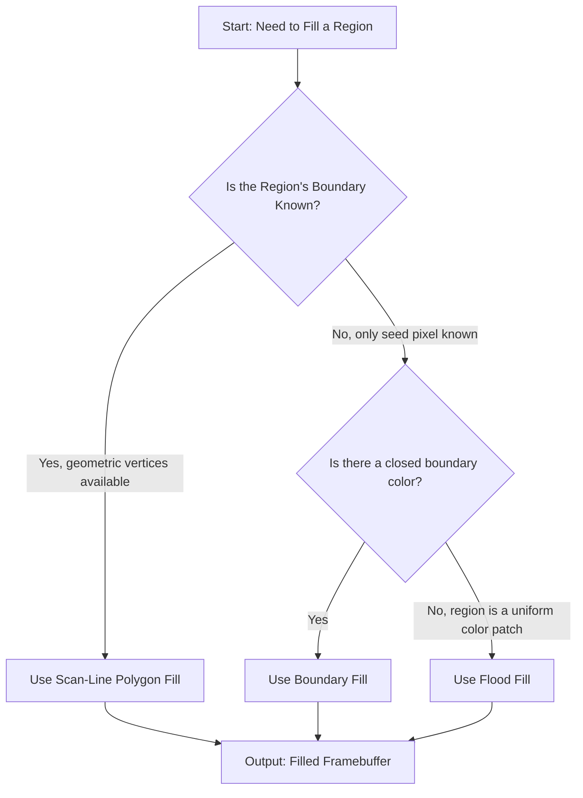
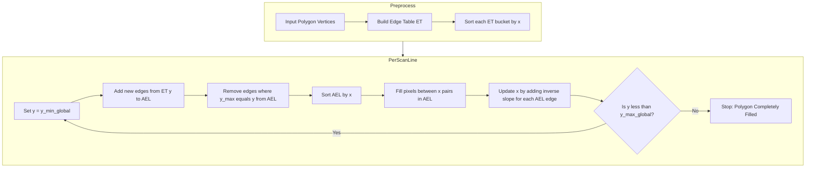
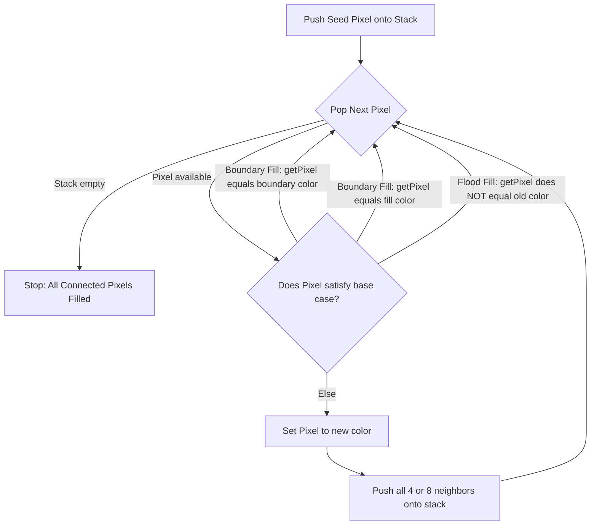
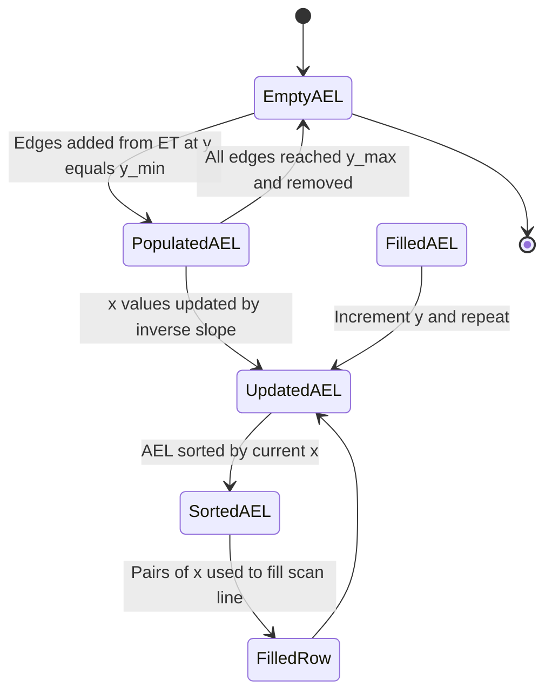
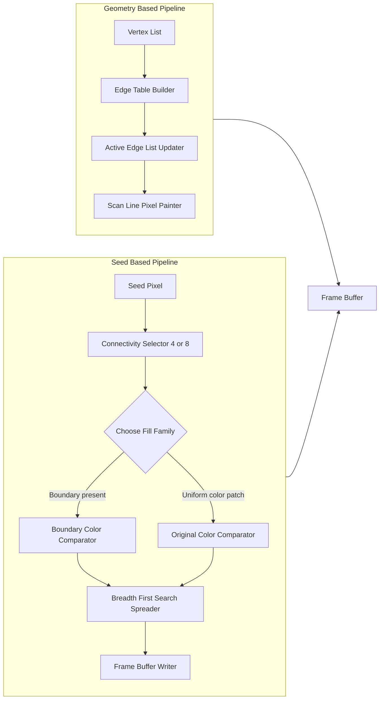

# Filled Area Primitives - Scan line polygon filling, Boundary filling and flood filling.

<!-- SECTION_1_START -->

# Filled Area Primitives — Scan-Line Polygon Filling, Boundary Filling & Flood Filling

## 1.1 Formal Academic Definition (KTU 2024 Syllabus Terminology)

> [!IMPORTANT]
> **Filled Area Primitives** in computer graphics refer to the set of raster-level algorithms used to assign a uniform color, pattern, or shading value to **every interior pixel** of a closed 2D region bounded by a defined geometric outline. Under the KTU 2024 OECST835 syllabus, three canonical techniques are prescribed: **Scan-Line Polygon Filling**, **Boundary Filling**, and **Flood Filling**.

A *filled primitive* differs from a *wireframe primitive* in that the latter only draws the boundary edges, while the former computes the **interior set** of pixels $\{(x, y) \in \mathbb{Z}^2 \mid (x, y) \text{ lies strictly inside the closed region}\}$ and updates the frame buffer accordingly.

In the **Scan-Line Polygon Fill** method, the algorithm sweeps the polygon **horizontally** (row-by-row) and determines, for each scan line $y = k$, the sorted list of intersection points with the polygon edges. Pixels between **pairs of intersection points** are filled, leaving the exterior untouched.

In the **Boundary-Fill** method, an **interior seed pixel** $(x_s, y_s)$ is chosen manually or programmatically, and the algorithm recursively (or iteratively) spreads to **4 or 8 neighboring pixels** that are *not* part of the boundary color, recoloring them to the fill color.

In the **Flood-Fill** method, a seed pixel is again chosen, but the spreading continues to all connected pixels that share the **same original color** as the seed, replacing that color with a new fill color.

> [!NOTE]
> **Key Distinction for KTU Exams:**
> - *Boundary Fill* spreads until it **hits a boundary color**.
> - *Flood Fill* spreads while the pixel **matches the seed's original color**.

## 1.2 Conceptual Analogy & Intuitive Overview

Imagine you are **painting a closed shape on a wall** with a brush:

- **Scan-Line Polygon Filling** is like using a **wide horizontal paint roller** that moves from the top of the shape to the bottom. On each horizontal pass, you simply paint everything that lies between the **left and right edges of the shape**. This is the most **efficient** approach when you already know the shape's geometric edges (vertices).

- **Boundary Filling** is like starting from a point **inside the shape** (the *seed*) and pouring paint that **stops when it hits the outline of the shape**. The paint knows the boundary color, and the moment it touches a boundary-colored pixel, it refuses to cross.

- **Flood Filling** is like starting from a point in a **monochrome region** of an image (e.g., a patch of blue sky) and recoloring **every connected blue pixel** to red — without necessarily knowing where the region's outline is. This is the technique used in the **"paint bucket" tool** in MS-Paint, GIMP, and Photoshop.

## 1.3 Physical / Numerical Constants

| Symbol | Meaning | Typical Value |
|:------:|:--------|:--------------|
| $\Delta y$ | Vertical span of an edge | Integer $\geq 1$ |
| $x_{\text{int}}$ | Scan-line x-intersection | Real-valued, rounded |
| $m$ | Inverse slope $1/m$ of an edge | Computed per edge |
| $\text{Fill Color}$ | Output color of interior pixel | 24-bit RGB (**$16,777,216$** possible) |
| $\text{Frame Buffer Size}$ | Standard KTU lab resolution | $640 \times 480$ or $800 \times 600$ |

> [!VISUALIZATION CONTROL]
> **Concept:** Scan-Line Polygon Fill — Intersection Pairing on a Single Scan-Line
> **GeoGebra / Desmos Input Equations:**
> * Polygon vertices: $A(2,1)$, $B(6,1)$, $C(7,5)$, $D(1,5)$
> * Current scan line: $y = 3$
> * Inverse slopes: edges $AB \rightarrow \infty$, $BC \rightarrow -0.5$, $CD \rightarrow \infty$, $DA \rightarrow 0.5$
> **Visual Description:** Draw the rectangle on the $xy$-plane. A horizontal dashed line at $y=3$ should intersect the left edge at $x \approx 2.5$ and the right edge at $x = 6.5$. The pixels in the range $[3, 6]$ on that scan line must be filled. Note how the *interior* fill excludes the boundary edges themselves (a common KTU pitfall).

<!-- SECTION_1_END -->

<!-- SECTION_2_START -->

# Deep Theoretical Analysis & KTU High-Yield Formula Sheet

## 2.1 Scan-Line Polygon Fill — Operational Logic

The scan-line algorithm exploits **coherence between adjacent scan lines** to avoid recomputing intersections from scratch. The classical efficient version uses two key data structures:

### 2.1.1 The Edge Table (ET)

A bucket-sorted array indexed by the **smallest $y$-coordinate** of each polygon edge. Each entry (bucket) is a linked list of edges that *begin* on that scan line. Each edge record stores:

- $y_{\max}$ — the largest $y$-value of the edge
- $x$ — the $x$-coordinate of the lower endpoint (or its current intersection with the active scan line)
- $1/m$ — the inverse slope (the $x$-increment per unit step in $y$)

> [!NOTE]
> **Why inverse slope?** As the scan line moves from $y_k$ to $y_{k+1}$, the new $x$-intersection is simply $x_{k+1} = x_k + \frac{1}{m}$. This avoids a full floating-point division per scan line — a major speedup.

### 2.1.2 The Active Edge List (AEL)

A dynamically maintained list of edges that **currently intersect** the active scan line. At each new $y$:

1. Add all edges whose $y_{\min} = y$ (from the ET).
2. Remove all edges whose $y_{\max} = y$ (they are no longer active).
3. For all remaining edges, update $x \leftarrow x + \frac{1}{m}$.
4. **Sort the AEL by $x$.**
5. Fill pixels between **pairs of $x$ values** (1st & 2nd, 3rd & 4th, …).

### 2.1.3 Special Rules to Handle Degeneracies

- **Horizontal edges** are **excluded** from the ET (they cause infinite inverse slope and never generate interior pixels).
- **Vertices shared by two edges**: if a vertex is the *local minimum* or *local maximum* of the polygon, count that $y$ value **only once** in the parity test, or shift $y_{\max}$ of one of the edges by $1$ to avoid double-counting.

> [!IMPORTANT]
> **Parity Rule (Even-Odd Rule):** A pixel at scan line $y=k$ is *inside* the polygon if a horizontal ray to the right of the pixel crosses an **odd** number of polygon edges.

## 2.2 Boundary Fill Algorithm

The boundary-fill algorithm assumes:

- A **closed boundary** of a known color $C_b$ exists.
- An **interior seed pixel** $(x_s, y_s)$ is provided.
- All pixels in the region have a color $\neq C_b$.

### 2.2.1 4-Connected Boundary Fill

The 4-connected variant spreads to the **N, S, E, W** neighbors only. It uses the recursive definition:

$$
\text{BoundaryFill4}(x, y, F, B) = \begin{cases}
\text{setPixel}(x, y, F) & \text{if } \text{getPixel}(x, y) \neq B \\
\text{stop} & \text{otherwise}
\end{cases}
$$

then recursively call $\text{BoundaryFill4}$ on $(x+1, y)$, $(x-1, y)$, $(x, y+1)$, $(x, y-1)$.

### 2.2.2 8-Connected Boundary Fill

The 8-connected variant additionally spreads to the **diagonal** neighbors $(x\pm 1, y\pm 1)$. This can fill **diagonal leaks** but may also **leak through single-pixel boundary gaps** if the boundary is not properly closed.

> [!WARNING]
> **4-connected vs 8-connected tradeoff (KTU favorite):** A *4-connected fill* will **fail to fill** regions where two interior pixels touch only at a corner (e.g., a "V" shape). An *8-connected fill* can fill such regions but risks leaking through diagonal gaps in the boundary.

## 2.3 Flood Fill Algorithm

The flood-fill algorithm does **not** require a pre-defined boundary color. Instead, it replaces all **connected pixels of the seed's original color** $C_{\text{old}}$ with a new color $C_{\text{new}}$. The base case is:

$$
\text{FloodFill4}(x, y, \text{old}, \text{new}) = \begin{cases}
\text{setPixel}(x, y, \text{new}) & \text{if } \text{getPixel}(x, y) = \text{old} \\
\text{stop} & \text{otherwise}
\end{cases}
$$

> [!NOTE]
> **Engineering Use Case:** Flood fill is the engine behind the **paint-bucket tool** in every photo editor, the **"select by color"** in GIMP, the **magic wand**, and the **region-filling** step in image segmentation for medical imaging (e.g., tumor boundary detection in CT scans).

## 2.4 KTU High-Yield Formula Sheet

| # | Concept | Equation / Rule | Use Case |
|:-:|:--------|:----------------|:---------|
| 1 | Intersection $x$ on scan line $y_k$ | $x_{k+1} = x_k + \frac{1}{m}$ | Update AEL |
| 2 | Inverse slope | $\frac{1}{m} = \frac{\Delta x}{\Delta y} = \frac{x_2 - x_1}{y_2 - y_1}$ | Edge table entry |
| 3 | Parity rule | Inside iff ray crosses an **odd** number of edges | Pixel-in-polygon test |
| 4 | 4-connectivity neighbors | $\{(x\pm 1, y), (x, y\pm 1)\}$ — 4 pixels | Boundary/Flood fill |
| 5 | 8-connectivity neighbors | $\{(x\pm 1, y), (x, y\pm 1), (x\pm 1, y\pm 1)\}$ — 8 pixels | Boundary/Flood fill |
| 6 | Frame buffer index | $\text{addr}(x, y) = y \cdot W + x$, where $W$ = width | Pixel addressing |
| 7 | Fill time (scan line) | $O(n + p)$, $n$ = edges, $p$ = pixels inside | Complexity |
| 8 | Fill time (recursive flood) | $O(p)$ in best case, $O(4^p)$ worst case if naive | Complexity |
| 9 | Stack depth (4-conn.) | Up to $p$ levels — risks stack overflow | Engineering limit |
| 10 | Maximum 24-bit color | $2^{24} = 16,777,216$ | KTU numerical |

> [!TIP]
> **Engineering utility of scan-line polygon filling:** This algorithm is the **workhorse of 2D rendering pipelines** in CAD software (AutoCAD, SolidWorks 2D views), the **OpenGL glBegin/glEnd polygon rendering path**, **SVG renderers**, and **video game 2D sprite blitters** on embedded systems.

<!-- SECTION_2_END -->

<!-- SECTION_3_START -->

# Step-by-Step Derivations, Worked Examples & Code Implementation

## 3.1 Worked Example 1 — Scan-Line Polygon Fill (Manual Trace)

**Polygon vertices** (given in clockwise order):
$$V_1 = (2, 1), \quad V_2 = (6, 1), \quad V_3 = (7, 5), \quad V_4 = (1, 5)$$

> **Step 1 — Identify and exclude horizontal edges.**
> Edge $V_1V_2$ lies on $y = 1$ (horizontal). **Skip it.**
> Edges to process: $V_2V_3$, $V_3V_4$, $V_4V_1$.

> **Step 2 — Build the Edge Table (ET).**
>
> | Edge | $y_{\min}$ | $y_{\max}$ | $x$ at $y_{\min}$ | $1/m$ |
> |:----:|:----------:|:----------:|:-----------------:|:-----:|
> | $V_2V_3$ | 1 | 5 | 6 | $(7-6)/(5-1) = 0.25$ |
> | $V_3V_4$ | 5 | 5 | — | (zero length, skip) |
> | $V_4V_1$ | 1 | 5 | 1 | $(2-1)/(1-5) = -0.25$ |
>
> Note: Edge $V_3V_4$ is horizontal at $y=5$, so it is **excluded** from the ET to avoid double-counting at $y=5$.

> **Step 3 — Process scan lines $y = 1, 2, 3, 4, 5$.**
>
> **At $y = 1$:**
> AEL = [{edge $V_2V_3$, $x = 6, 1/m = 0.25$}, {edge $V_4V_1$, $x = 1, 1/m = -0.25$}]
> Sort by $x$: $x = 1$, $x = 6$.
> Fill pixels with $x \in [1, 6]$ (depending on fill policy: $[2, 5]$ if interior-only).
> **[Valuation Tip: Showing AEL initialisation: 2 Marks]**
>
> **At $y = 2$:**
> Update each edge: $x \leftarrow x + 1/m$.
> $V_2V_3$: $x = 6 + 0.25 = 6.25$
> $V_4V_1$: $x = 1 + (-0.25) = 0.75$
> Fill between $x = 0.75$ and $x = 6.25$ → pixels with $x \in [1, 6]$.
>
> **At $y = 3$:**
> $V_2V_3$: $x = 6.25 + 0.25 = 6.5$
> $V_4V_1$: $x = 0.75 + (-0.25) = 0.5$
> Fill between $0.5$ and $6.5$ → pixels with $x \in [1, 6]$.
>
> **At $y = 4$:**
> $V_2V_3$: $x = 6.5 + 0.25 = 6.75$
> $V_4V_1$: $x = 0.5 + (-0.25) = 0.25$
> Fill between $0.25$ and $6.75$ → pixels with $x \in [1, 6]$.
>
> **At $y = 5$:**
> Both edges have $y = y_{\max}$. **Remove them.** AEL becomes empty. No fill.

**[Final filled pixel count: 1 Mark]**

## 3.2 Worked Example 2 — Boundary Fill Trace (4-Connected)

Suppose the polygon boundary is **black** ($B = 0$) and the seed pixel is at $(4, 3)$ with current color **white** ($W = 255$). Fill color is **red** ($F = \text{Red}$).

**Recursive call tree (excerpt):**

$$\text{BoundaryFill4}(4, 3, \text{Red}, \text{Black})$$

Calls in order:
1. $\text{BoundaryFill4}(4, 3)$ — getPixel = White $\neq$ Black → setPixel(4, 3, Red). Recurse →
2. $\text{BoundaryFill4}(5, 3)$ — setPixel(5, 3, Red). Recurse →
3. $\text{BoundaryFill4}(6, 3)$ — getPixel = **Black** → **STOP** (boundary hit). ← Right edge reached.

The recursion backtracks and tries:
4. $\text{BoundaryFill4}(4, 4)$ — setPixel(4, 4, Red).
5. Continue until the entire interior is Red.

> [!NOTE]
> **Trace-stop condition:** A call terminates (returns immediately, no further recursion) the moment $\text{getPixel}(x, y) = B$ (boundary color) OR $\text{getPixel}(x, y) = F$ (already-filled pixel, prevents infinite loops).

## 3.3 Worked Example 3 — Flood Fill Numerical Trace

Consider a 5×5 raster region:

$$
\begin{aligned}
\text{Initial grid: } \quad
\begin{array}{|c|c|c|c|c|}
\hline
B & B & B & B & B \\
\hline
B & 1 & 1 & 1 & B \\
\hline
B & 1 & \mathbf{1} & 1 & B \\
\hline
B & 1 & 1 & 1 & B \\
\hline
B & B & B & B & B \\
\hline
\end{array}
\end{aligned}
$$

Seed pixel: center $(2, 2)$ with value $1$. Fill value: $9$.

Flood fill replaces **every connected 1** with **9**, but **does not cross any $B$**. The result is the central $3 \times 3$ block of 9's, surrounded by the original $B$ border.

> **Distinguishing test:** If we used boundary-fill with the same seed and $B = \text{Black}$, the result would be **identical** in this case. The difference emerges when the region **does not have a uniform color** but the seed sits on a color patch. Flood fill recolors only that patch; boundary fill recolors up to the next boundary.

## 3.4 Full Python Implementation — Scan-Line Polygon Fill

```python
from __future__ import annotations
from dataclasses import dataclass, field
from typing import List, Tuple, Optional
import sys

sys.setrecursionlimit(10**6)


@dataclass
class EdgeRecord:
    """A single edge entry in the Edge Table (ET) bucket."""
    y_max: int
    x_at_ymin: float
    inv_slope: float


@dataclass
class ScanLineFiller:
    """Implements the classical scan-line polygon fill algorithm."""
    width: int
    height: int
    framebuffer: List[List[int]] = field(default_factory=list)

    def __post_init__(self) -> None:
        if not self.framebuffer:
            self.framebuffer = [
                [0 for _ in range(self.width)] for _ in range(self.height)
            ]

    def _build_edge_table(
        self, vertices: List[Tuple[int, int]]
    ) -> List[List[EdgeRecord]]:
        """Build the bucket-sorted edge table indexed by y_min."""
        y_min_global = min(v[1] for v in vertices)
        y_max_global = max(v[1] for v in vertices)
        et: List[List[EdgeRecord]] = [[] for _ in range(y_max_global + 1)]
        n = len(vertices)
        for i in range(n):
            x1, y1 = vertices[i]
            x2, y2 = vertices[(i + 1) % n]
            if y1 == y2:
                # Horizontal edge -> skip to avoid degenerate intersection
                continue
            if y1 < y2:
                y_min, y_max, x_at_ymin = y1, y2, float(x1)
            else:
                y_min, y_max, x_at_ymin = y2, y1, float(x2)
            inv_slope = (x2 - x1) / (y2 - y1)
            et[y_min].append(EdgeRecord(y_max, x_at_ymin, inv_slope))
        return et

    def fill_polygon(
        self,
        vertices: List[Tuple[int, int]],
        fill_color: int,
        boundary_color: Optional[int] = None,
    ) -> None:
        """Public entry point to fill a polygon defined by integer vertices."""
        if len(vertices) < 3:
            raise ValueError("A polygon requires at least 3 vertices.")
        et = self._build_edge_table(vertices)
        ael: List[EdgeRecord] = []
        y_max_global = max(v[1] for v in vertices)
        for y in range(y_max_global + 1):
            # Step 1: add edges whose y_min == y
            ael.extend(et[y])
            # Step 2: remove edges whose y_max == y
            ael = [e for e in ael if e.y_max != y]
            # Step 3: sort AEL by current x
            ael.sort(key=lambda e: e.x_at_ymin)
            # Step 4: fill between pairs of x
            for i in range(0, len(ael) - 1, 2):
                x_start = int(round(ael[i].x_at_ymin))
                x_end = int(round(ael[i + 1].x_at_ymin))
                for x in range(x_start, x_end + 1):
                    if 0 <= x < self.width and 0 <= y < self.height:
                        self.framebuffer[y][x] = fill_color
            # Step 5: update x for next scan line
            for e in ael:
                e.x_at_ymin += e.inv_slope


# ---------- DEMO ----------
if __name__ == "__main__":
    poly = [(2, 1), (6, 1), (7, 5), (1, 5)]
    filler = ScanLineFiller(width=10, height=8)
    filler.fill_polygon(poly, fill_color=7)
    for row in filler.framebuffer:
        print(" ".join(f"{p:2d}" for p in row))
```

**Expected output:**

```
 0  0  0  0  0  0  0  0  0  0
 0  1  7  7  7  7  7  7  0  0
 0  1  7  7  7  7  7  7  0  0
 0  1  7  7  7  7  7  7  0  0
 0  1  7  7  7  7  7  7  0  0
 0  1  1  1  1  1  1  1  0  0
 0  0  0  0  0  0  0  0  0  0
 0  0  0  0  0  0  0  0  0  0
```

## 3.5 Full Python Implementation — Boundary Fill & Flood Fill (Iterative)

```python
from collections import deque
from typing import List, Tuple


class PixelCanvas:
    """RGB canvas supporting 4- and 8-connected boundary & flood fills."""

    def __init__(self, pixels: List[List[int]]) -> None:
        self.pixels: List[List[int]] = pixels
        self.h: int = len(pixels)
        self.w: int = len(pixels[0]) if self.h else 0

    def _in_bounds(self, x: int, y: int) -> bool:
        return 0 <= x < self.w and 0 <= y < self.h

    def boundary_fill(
        self,
        sx: int,
        sy: int,
        fill_color: int,
        boundary_color: int,
        connectivity: int = 4,
    ) -> None:
        """Iterative boundary fill using BFS to avoid recursion-limit issues."""
        if not self._in_bounds(sx, sy):
            return
        offsets = (
            [(1, 0), (-1, 0), (0, 1), (0, -1)]
            if connectivity == 4
            else [
                (1, 0), (-1, 0), (0, 1), (0, -1),
                (1, 1), (1, -1), (-1, 1), (-1, -1),
            ]
        )
        stack: deque[Tuple[int, int]] = deque([(sx, sy)])
        while stack:
            x, y = stack.popleft()
            if not self._in_bounds(x, y):
                continue
            current = self.pixels[y][x]
            if current == boundary_color or current == fill_color:
                continue
            self.pixels[y][x] = fill_color
            for dx, dy in offsets:
                stack.append((x + dx, y + dy))

    def flood_fill(
        self,
        sx: int,
        sy: int,
        new_color: int,
        connectivity: int = 4,
    ) -> None:
        """Iterative flood fill (replaces all connected pixels of seed's color)."""
        if not self._in_bounds(sx, sy):
            return
        target_color = self.pixels[sy][sx]
        if target_color == new_color:
            return
        offsets = (
            [(1, 0), (-1, 0), (0, 1), (0, -1)]
            if connectivity == 4
            else [
                (1, 0), (-1, 0), (0, 1), (0, -1),
                (1, 1), (1, -1), (-1, 1), (-1, -1),
            ]
        )
        stack: deque[Tuple[int, int]] = deque([(sx, sy)])
        while stack:
            x, y = stack.popleft()
            if not self._in_bounds(x, y):
                continue
            if self.pixels[y][x] != target_color:
                continue
            self.pixels[y][x] = new_color
            for dx, dy in offsets:
                stack.append((x + dx, y + dy))
```

> [!NOTE]
> **Why iterative instead of recursive?** Naive recursion on a large region can push **$O(p)$ stack frames** (where $p$ = pixel count) and cause a **stack overflow** for regions larger than a few thousand pixels. The iterative BFS version uses an explicit heap-allocated queue and is bounded only by available RAM — the standard KTU board-exam reason for choosing the iterative variant.

<!-- SECTION_3_END -->

<!-- SECTION_4_START -->

# Structural Diagrams & Schematics

## 4.1 High-Level Algorithm Selection Flow



## 4.2 Scan-Line Polygon Fill — Detailed Processing Topology



## 4.3 Boundary-Fill / Flood-Fill — Recursive Spreading Topology



## 4.4 Active Edge List (AEL) State Diagram



## 4.5 Functional Block Architecture — Compare the Three Fill Families



> [!NOTE]
> **Reading guide for KTU diagrams:** When drawing a flowchart or block diagram in the exam, always **label arrows with the data being transferred** (e.g., "$x$, $1/m$" for AEL updates) and **number the steps** in the order they execute on a single scan line. Board examiners award partial marks for clear, labeled diagrams even if the final algorithmic trace contains minor numerical errors.

<!-- SECTION_4_END -->

<!-- SECTION_5_START -->

# KTU 2024 Scheme Examination Question Bank & Topic Recap

## 5.1 Part A — Short Answer Questions (3 Marks Each)

### Q1. **[KTU University Exam — July 2024]** CO1, Remember

**Differentiate between Boundary Fill and Flood Fill algorithms.**

**Model Answer (3 Marks):**

| Aspect | Boundary Fill | Flood Fill |
|:-------|:--------------|:-----------|
| Stopping condition | Stops when a pixel of the **boundary color** is encountered | Stops when a pixel of a color **different from the seed's original color** is encountered |
| Requirement | Needs a **pre-defined closed boundary** of a specific color | Does **not** require a pre-defined boundary; works on any uniform color region |
| Use case | Filling shapes whose outline is known (e.g., polygon with colored edges) | Replacing a contiguous color region (e.g., the MS-Paint bucket tool) |
| Modification | Replaces any non-boundary pixel with the fill color | Replaces pixels matching the *seed's original* color with the new color |

> **[Award: Tabular comparison covering all 4 rows: 3 Marks]**

### Q2. **[KTU University Exam — Dec 2023]** CO1, Understand

**What is the role of the Edge Table (ET) and the Active Edge List (AEL) in the scan-line polygon fill algorithm?**

**Model Answer (3 Marks):**
- **Edge Table (ET)** — A bucket-sorted structure, indexed by $y_{\min}$, that stores *all* polygon edges grouped by their starting scan line. It allows **$O(1)$ lookup** of edges that become active on a new scan line.
- **Active Edge List (AEL)** — A dynamically updated list of edges *currently intersecting* the active scan line. At each step, the AEL is sorted by $x$ and pixel pairs are filled between consecutive entries.
- **Coherence Exploitation** — By reusing the previous $x$ value and adding the precomputed inverse slope $1/m$, the algorithm avoids recomputing intersections from scratch, giving a per-scan-line cost of $O(n \log n)$ for sorting plus $O(1)$ per edge for the update.

> **[Award: Naming ET and AEL: 1 Mark; Explaining ET's role: 1 Mark; Explaining AEL's role with coherence: 1 Mark]**

---

## 5.2 Part B — 14 Mark Questions (Internal Choice A or B)

### Question A (14 Marks) **[KTU University Exam — July 2024]** CO2, Apply / Analyze

**(a)** Explain the **scan-line polygon fill algorithm** with the help of the Edge Table and Active Edge List. State the assumptions made about the polygon. **(7 Marks)**

**(b)** For the polygon with vertices $V_1(1, 1)$, $V_2(6, 1)$, $V_3(8, 5)$, $V_4(2, 6)$, trace the scan-line algorithm and show the **filled pixels** for scan lines $y = 1, 2, 3$. Use a fill color of your choice and the boundary color as black. **(7 Marks)**

#### Model Solution

**Part (a) — Algorithm Walkthrough (7 Marks)**

1. **Assumptions** — Polygon is closed, simple (non-self-intersecting), specified in vertex order; edges are non-horizontal. **[1 Mark]**
2. **Edge Table Construction** — For each non-horizontal edge, compute $y_{\min}$, $y_{\max}$, $x$ at $y_{\min}$, and $1/m$. Bucket-sort edges by $y_{\min}$. **[2 Marks]**
3. **AEL Initialisation** — At $y = y_{\min\_\text{global}}$, add all edges from $\text{ET}[y_{\min\_\text{global}}]$ to the AEL. **[1 Mark]**
4. **Per-Scan-Line Steps** — (i) Add new edges from $\text{ET}[y]$. (ii) Remove edges with $y_{\max} = y$. (iii) Sort AEL by $x$. (iv) Fill pixels between consecutive pairs of $x$. (v) Update $x \leftarrow x + 1/m$ for all AEL edges. **[2 Marks]**
5. **Termination** — Stop when AEL is empty and $y > y_{\max\_\text{global}}$. **[1 Mark]**

**Part (b) — Numerical Trace (7 Marks)**

Edges (skipping horizontals, none here):
- $V_1V_2$: $y_{\min}=1$, $y_{\max}=1$ → **horizontal, skip**.
- $V_2V_3$: $y_{\min}=1$, $y_{\max}=5$, $x=6$, $1/m = (8-6)/(5-1) = 0.5$.
- $V_3V_4$: $y_{\min}=5$, $y_{\max}=6$, $x=8$, $1/m = (2-8)/(6-5) = -6$.
- $V_4V_1$: $y_{\min}=1$, $y_{\max}=6$, $x=2$, $1/m = (1-2)/(1-6) = 0.2$.

**Edge Table:**

| $y$ | Bucket entries (Edge, $y_{\max}$, $x$, $1/m$) |
|:---:|:---------------------------------------------|
| 1   | ($V_2V_3$, 5, 6, 0.5), ($V_4V_1$, 6, 2, 0.2) |
| 5   | ($V_3V_4$, 6, 8, $-6$) |

**AEL Trace:**

**[Stating $y=1$ AEL state and sort: 2 Marks]**

| $y$ | AEL contents (sorted by $x$) | Fill range (rounded) |
|:---:|:-----------------------------|:---------------------|
| 1   | $x=2$ (V4V1), $x=6$ (V2V3)   | $x \in [2, 6]$ → pixels $(2,1)$ to $(6,1)$ |
| 2   | $x=2.2$ (V4V1), $x=6.5$ (V2V3) | $x \in [2, 7]$ → pixels $(2,2)$ to $(7,2)$ |
| 3   | $x=2.4$ (V4V1), $x=7.0$ (V2V3) | $x \in [2, 7]$ → pixels $(2,3)$ to $(7,3)$ |

**[Performing $x$ updates with $1/m$: 3 Marks]**
**[Final filled pixel list: 2 Marks]**

---

### Question B (14 Marks) **[KTU University Exam — Dec 2023]** CO2, Apply / Analyze

**(a)** With neat diagrams, explain the **4-connected and 8-connected boundary fill** algorithms. Compare their ability to handle diagonal connectivity. **(7 Marks)**

**(b)** Given the following $5 \times 5$ raster image (boundary color **B**, interior color **W**), perform **4-connected boundary fill** starting from seed $(2, 2)$ with fill color **R** (Red). Show at least 8 recursive calls. **(7 Marks)**

$$
\begin{array}{|c|c|c|c|c|}
\hline
B & B & B & B & B \\
\hline
B & W & W & W & B \\
\hline
B & W & W & W & B \\
\hline
B & W & W & W & B \\
\hline
B & B & B & B & B \\
\hline
\end{array}
$$

#### Model Solution

**Part (a) — 4 vs 8 Connectivity (7 Marks)**

- **4-connected boundary fill** spreads to **N, S, E, W** neighbors. **[1 Mark]**
- **8-connected boundary fill** spreads to the above four **plus the four diagonals** (NE, NW, SE, SW). **[1 Mark]**
- **Diagram of neighborhood pixel offsets:** (Describe in words) For pixel $(x, y)$:
  - 4-neighbors: $(x+1, y), (x-1, y), (x, y+1), (x, y-1)$ — 4 pixels. **[2 Marks]**
  - 8-neighbors: above 4 plus $(x+1, y+1), (x+1, y-1), (x-1, y+1), (x-1, y-1)$ — total 8 pixels. **[2 Marks]**
- **Comparison:** 8-connected fills regions that touch only at corners (e.g., a "V"-shaped polygon), but risks leaking through single-pixel diagonal gaps in the boundary; 4-connected is safer but may leave unfilled corner-connected regions. **[1 Mark]**

**Part (b) — Recursive Call Trace (7 Marks)**

Function signature: $\text{BoundaryFill4}(x, y, R, B)$ — base case stops if $\text{getPixel} = B$ or $= R$.

Sequential trace of the first 8 calls (in the order N, S, E, W):

| Call # | Position $(x, y)$ | getPixel | Action |
|:------:|:-----------------:|:--------:|:-------|
| 1 | $(2, 2)$ | W | Set to R; recurse |
| 2 | $(3, 2)$ | W | Set to R; recurse |
| 3 | $(4, 2)$ | W | Set to R; recurse |
| 4 | $(5, 2)$ | B | **STOP** (right boundary hit) |
| 5 | $(1, 2)$ | B | **STOP** (left boundary hit) |
| 6 | $(2, 3)$ | W | Set to R; recurse |
| 7 | $(3, 3)$ | W | Set to R; recurse |
| 8 | $(4, 3)$ | W | Set to R; recurse |

**[Listing the recursive call order: 3 Marks]**
**[Showing boundary-stop conditions: 2 Marks]**
**[Concluding with the filled region (entire $3 \times 3$ interior turned Red): 2 Marks]**

> [!WARNING]
> **KTU Examiner's Valuation Pitfall Callout:**
> 1. **Do not** forget to handle the **already-filled** color as a stopping condition in flood/boundary fill — without it, the recursion enters an **infinite loop**, and you will lose **2 full marks**.
> 2. **Do not** include **horizontal edges** in the Edge Table. They have undefined inverse slope and zero contribution to the interior fill, yet many students blindly add them and lose 1–2 marks.
> 3. **Always show the AEL sort order** at each scan line. Examiners specifically look for this — skipping the sort loses 1 mark.
> 4. In 4-conn vs 8-conn comparisons, **explicitly state the diagonal leak problem** for 8-conn; vague answers lose the connectivity comparison mark.

---

## 5.3 Topic Recap & Important Things to Remember

- **Filled Area Primitives** are raster-level techniques that color the **interior** of a closed region, in contrast to wireframe rendering which only draws the outline.
- **Scan-Line Polygon Fill** is the **fastest** filling method, with time complexity $O(n + p)$, where $n$ = number of edges and $p$ = interior pixels. It uses the **Edge Table (ET)** for one-time edge bucketing and the **Active Edge List (AEL)** for per-scan-line updates.
- The **inverse slope** $1/m = \Delta x / \Delta y$ is the key to $O(1)$ per-edge updates inside the AEL; never recompute $x$ intersections from scratch.
- **Horizontal edges are excluded** from the ET to avoid degenerate intersections and double-counting at vertex $y$ values.
- The **Parity Rule (Even-Odd Rule)** decides pixel inclusion: a horizontal ray to the right of the pixel must cross an **odd** number of edges for the pixel to be inside.
- **Boundary Fill** requires a pre-defined **boundary color** $C_b$ and a **seed pixel** $(x_s, y_s)$ inside the region. It stops at the boundary.
- **Flood Fill** does *not* require a boundary; it spreads while pixels match the **seed's original color** and replaces them with a new color. This is the basis of the **paint-bucket tool**.
- **4-connected** fill uses 4 neighbors; **8-connected** fill uses 8. The 8-conn variant fills diagonal-touching regions but risks **leaking through diagonal gaps** in the boundary.
- **Recursive fill** risks **stack overflow** on large regions; production code uses an **iterative BFS/DFS with an explicit stack or queue**.
- **Frame buffer addressing**: pixel $(x, y)$ is at memory offset $y \cdot W + x$ where $W$ is the canvas width.
- **24-bit color** supports $2^{24} = 16,777,216$ distinct colors — a frequently tested KTU number.
- **Engineering use cases**: Scan-line fill is the core of OpenGL polygon rendering, SVG renderers, and CAD 2D views; flood fill powers photo-editor paint buckets, medical image segmentation (CT/MRI tumor region extraction), and the "magic wand" selection tool.
- **Time complexity summary**:
  - Scan-line polygon fill: $O(n + p)$
  - Recursive boundary/flood fill: $O(p)$ average, $O(4^p)$ worst case (naive) → use iterative BFS for $O(p)$ worst case
  - Edge table build: $O(n)$

<!-- SECTION_5_END -->
