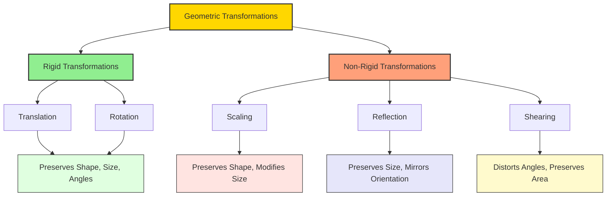
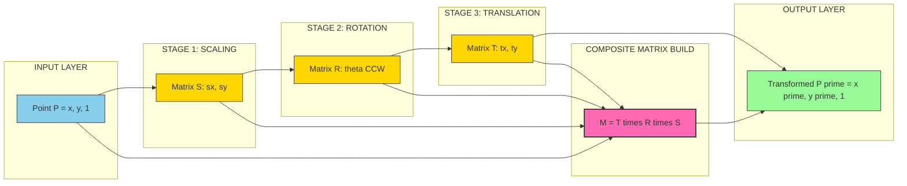
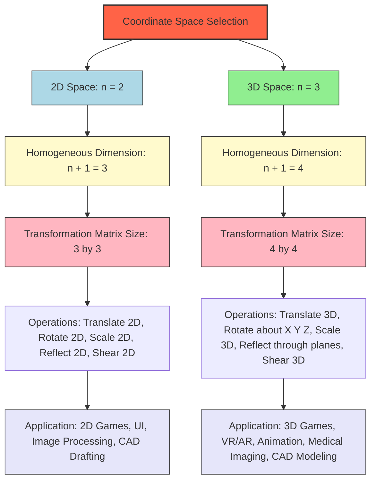
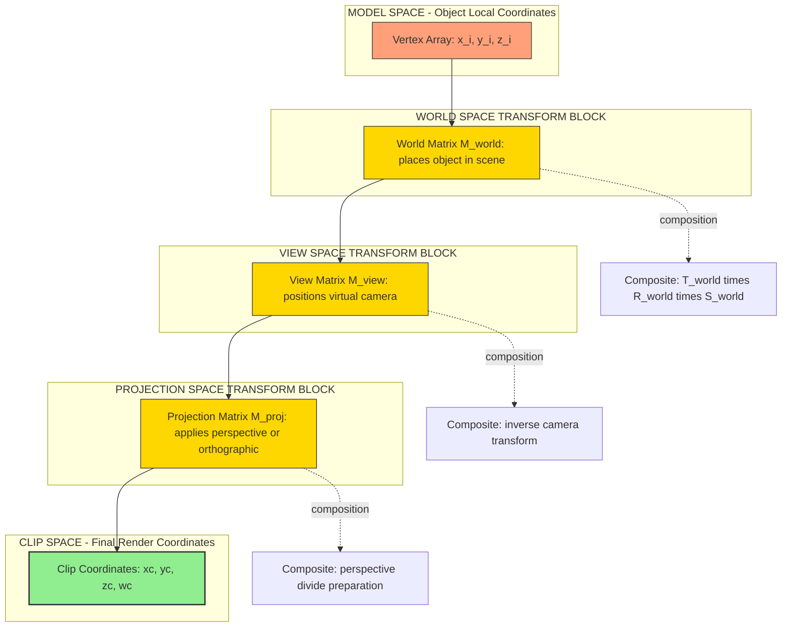

# Geometric transformations - 2D and 3D basic transformations - Translation, Rotation, Scaling, Reflection and Shearing, Matrix representations and homogeneous coordinates.

<!-- SECTION_1_START -->

# Geometric Transformations: The Language of Moving Pixels

## 1.1 Formal Academic Definition (KTU 2024 Syllabus Terminology)

> [!IMPORTANT]
> **Geometric Transformation** is a mathematical operation that maps every point $P = (x, y)$ in a 2D plane (or $P = (x, y, z)$ in 3D space) to a new point $P' = (x', y')$ (or $P' = (x', y', z')$) by applying a function $T$ such that $P' = T(P)$.

In the **KTU 2024 Scheme (OECST835 – Computer Graphics, Module 2)**, geometric transformations form the **mathematical backbone** of object manipulation, animation, camera movement, and rendering pipelines. The five primitive transformations are:

| Transformation | Effect on Geometry | Classification |
| :--- | :--- | :--- |
| **Translation** | Slides every point by a fixed displacement vector | **Rigid** (preserves shape & size) |
| **Rotation** | Revolves every point around a pivot by an angle $\theta$ | **Rigid** (preserves shape & size) |
| **Scaling** | Enlarges or shrinks distances from a fixed origin | **Non-Rigid** (size changes) |
| **Reflection** | Mirrors the object about an axis or plane | **Non-Rigid** (orientation flips) |
| **Shearing** | Skews the object so that layers slide past each other | **Non-Rigid** (angles distort) |

> [!NOTE]
> **Homogeneous Coordinates** are the "universal adapter" that converts *all* the above transformations (including translation) into a **single matrix-multiplication operation**. A 2D point $(x, y)$ is represented as a column vector $(x, y, 1)^T$, and a 3D point $(x, y, z)$ as $(x, y, z, 1)^T$.

## 1.2 The Big Picture — Real World Analogy

> [!TIP]
> **Think of your object as a LEGO model sitting on a sheet of graph paper.**

* **Translation** is *pushing* the LEGO model to a new spot on the paper without rotating it.
* **Rotation** is *spinning* the LEGO model around one of its studs.
* **Scaling** is *stretching* the rubber sheet underneath — the LEGO model grows or shrinks.
* **Reflection** is *flipping* the model over to its mirror image, like looking in a bathroom mirror.
* **Shearing** is *tilting* a tall stack of books so they become a parallelogram, like a strong wind blowing sideways on a rectangle.

**Homogeneous coordinates** are the *universal language* that lets a graphics processor describe all these motions with one **single multiplication operation**, which is why GPUs are so fast at rendering.

## 1.3 Visualization Control

> [!VISUALIZATION CONTROL]
> **Concept:** Effect of all five 2D transformations on a unit square with vertices $(0,0), (1,0), (1,1), (0,1)$.
> **GeoGebra / Desmos Input Equations:**
> * `Polygon(A=(0,0), B=(1,0), C=(1,1), D=(0,1))` — original
> * `Translate(Polygon, (2,1))` — translation by $(2,1)$
> * `Rotate(Polygon, 45°)` — rotation by $45°$
> * `Dilate(Polygon, 2)` — scaling by factor of $2$
> * `Reflect(Polygon, xAxis)` — reflection about x-axis
> **Visual Description:** Students should observe that the *original square* remains a square after translation/rotation/reflection (rigid), becomes a **larger square** after scaling, and turns into a **parallelogram** after shearing.

---

<!-- SECTION_1_END -->

<!-- SECTION_2_START -->

# Deep Theoretical Analysis & KTU High-Yield Formula Sheet

## 2.1 Why Matrix Form? The Theoretical "Why"

A coordinate transformation is a **linear map** between vector spaces. By expressing it as a matrix, we unlock three superpowers:

1. **Composition** — multiple transformations collapse into one matrix via multiplication: $T_{combined} = T_n \cdot T_{n-1} \cdots T_2 \cdot T_1$.
2. **Hardware Acceleration** — GPUs are essentially massive parallel matrix-multiply engines.
3. **Inverse Transforms** — $T^{-1}$ gives us the "undo" operation for free (essential for ray tracing & camera math).

The catch: **translation is NOT a linear operation** in standard 2D coordinates (it includes an additive constant). This is why we promote points to **homogeneous coordinates** — translation becomes linear in the higher-dimensional space.

## 2.2 KTU High-Yield Formula Sheet (2D Transformations)

Let $P = (x, y, 1)^T$ be a homogeneous point. The transformation $P' = M \cdot P$ uses the following $3 \times 3$ matrices:

| Transformation | Matrix $M$ (3×3) | Key Parameters | Inverse Form |
| :--- | :--- | :--- | :--- |
| **Translation** | $\begin{bmatrix} 1 & 0 & t_x \\ 0 & 1 & t_y \\ 0 & 0 & 1 \end{bmatrix}$ | $t_x, t_y$ = shift amount | Replace $t_x \to -t_x, t_y \to -t_y$ |
| **Rotation (about origin, CCW)** | $\begin{bmatrix} \cos\theta & -\sin\theta & 0 \\ \sin\theta & \cos\theta & 0 \\ 0 & 0 & 1 \end{bmatrix}$ | $\theta$ in radians/degrees | Replace $\theta \to -\theta$ |
| **Scaling (about origin)** | $\begin{bmatrix} S_x & 0 & 0 \\ 0 & S_y & 0 \\ 0 & 0 & 1 \end{bmatrix}$ | $S_x, S_y$ = scale factors | Replace $S_x \to 1/S_x, S_y \to 1/S_y$ |
| **Reflection about x-axis** | $\begin{bmatrix} 1 & 0 & 0 \\ 0 & -1 & 0 \\ 0 & 0 & 1 \end{bmatrix}$ | Flips y-sign | Same as forward |
| **Reflection about y-axis** | $\begin{bmatrix} -1 & 0 & 0 \\ 0 & 1 & 0 \\ 0 & 0 & 1 \end{bmatrix}$ | Flips x-sign | Same as forward |
| **Reflection about line $y=x$** | $\begin{bmatrix} 0 & 1 & 0 \\ 1 & 0 & 0 \\ 0 & 0 & 1 \end{bmatrix}$ | Swaps x and y | Same as forward |
| **Reflection about origin** | $\begin{bmatrix} -1 & 0 & 0 \\ 0 & -1 & 0 \\ 0 & 0 & 1 \end{bmatrix}$ | 180° rotation equivalent | Same as forward |
| **Shear (x-direction)** | $\begin{bmatrix} 1 & Sh_x & 0 \\ 0 & 1 & 0 \\ 0 & 0 & 1 \end{bmatrix}$ | $Sh_x$ = x-shear factor | Replace $Sh_x \to -Sh_x$ |
| **Shear (y-direction)** | $\begin{bmatrix} 1 & 0 & 0 \\ Sh_y & 1 & 0 \\ 0 & 0 & 1 \end{bmatrix}$ | $Sh_y$ = y-shear factor | Replace $Sh_y \to -Sh_y$ |

> [!IMPORTANT]
> **Composition Rule:** When composing transformations, matrices multiply **right-to-left** with respect to the point. The rightmost matrix is applied **first** to the point.
> $$P' = T_{n} \cdot T_{n-1} \cdots T_{1} \cdot P$$

## 2.3 KTU High-Yield Formula Sheet (3D Transformations)

For 3D, points are $P = (x, y, z, 1)^T$ and the matrices are $4 \times 4$.

| Transformation | Matrix Form | Notes |
| :--- | :--- | :--- |
| **Translation** | $4 \times 4$ with $(t_x, t_y, t_z, 1)$ in last column, $1$s on diagonal | $1$s in main diagonal |
| **Rotation about x-axis (CCW)** | $\begin{bmatrix} 1 & 0 & 0 & 0 \\ 0 & c\theta & -s\theta & 0 \\ 0 & s\theta & c\theta & 0 \\ 0 & 0 & 0 & 1 \end{bmatrix}$ | $c\theta = \cos\theta, s\theta = \sin\theta$ |
| **Rotation about y-axis (CCW)** | $\begin{bmatrix} c\theta & 0 & s\theta & 0 \\ 0 & 1 & 0 & 0 \\ -s\theta & 0 & c\theta & 0 \\ 0 & 0 & 0 & 1 \end{bmatrix}$ | Sign flip on $s\theta$ due to right-hand rule |
| **Rotation about z-axis (CCW)** | $\begin{bmatrix} c\theta & -s\theta & 0 & 0 \\ s\theta & c\theta & 0 & 0 \\ 0 & 0 & 1 & 0 \\ 0 & 0 & 0 & 1 \end{bmatrix}$ | Identical to 2D rotation pattern |
| **Scaling** | Diagonal matrix $\text{diag}(S_x, S_y, S_z, 1)$ | Uniform if $S_x = S_y = S_z$ |
| **Reflection (xy-plane)** | $\text{diag}(1, 1, -1, 1)$ | Flips z-sign |
| **Reflection (xz-plane)** | $\text{diag}(1, -1, 1, 1)$ | Flips y-sign |
| **Reflection (yz-plane)** | $\text{diag}(-1, 1, 1, 1)$ | Flips x-sign |
| **General Shear** | Identity + off-diagonal $Sh_{ij}$ entries | Depends on shear plane |

## 2.4 Real-World Engineering Utility

* **Game Engines (Unity, Unreal):** Every GameObject carries a `Transform` component that is internally a $4 \times 4$ matrix (position, rotation, scale). Rendering the object means multiplying every vertex by this matrix.
* **Computer-Aided Design (AutoCAD, SolidWorks):** Designers assemble parts using translate/rotate operations that are pure matrix math.
* **Medical Imaging (MRI/CT Slices):** 3D volume rendering applies scaling, rotation, and shear to align scans taken from different orientations.
* **Augmented Reality (ARCore, ARKit):** Camera pose tracking uses inverse transformations to place virtual objects accurately in physical space.
* **Animation Pipelines:** Skeletal animation builds hierarchy matrices that propagate from parent bones to child bones via matrix multiplication.

---

<!-- SECTION_2_END -->

<!-- SECTION_3_START -->

# Step-by-Step Derivations & Code Implementation

## 3.1 Derivation of 2D Rotation Matrix (The Most Important Derivation)

We want to find a matrix $R$ that rotates a point $P = (x, y)$ counter-clockwise by angle $\theta$ about the origin.

**Geometric Setup:** Let $\vert P \vert = r$ be the distance of $P$ from origin, and let $\phi$ be the angle $P$ makes with the positive x-axis.

**Initial Coordinates:**

$$
\begin{aligned}
x &= r \cos\phi \\
y &= r \sin\phi
\end{aligned}
$$

**After rotation by $\theta$**, the new angle becomes $\phi + \theta$, so the new coordinates are:

$$
\begin{aligned}
x' &= r \cos(\phi + \theta) \\
y' &= r \sin(\phi + \theta)
\end{aligned}
$$

**Apply the trigonometric sum-to-product identities:**

$$
\begin{aligned}
\cos(\phi + \theta) &= \cos\phi \cos\theta - \sin\phi \sin\theta \\
\sin(\phi + \theta) &= \sin\phi \cos\theta + \cos\phi \sin\theta
\end{aligned}
$$

**Substitute back** with $x = r\cos\phi$ and $y = r\sin\phi$:

$$
\begin{aligned}
x' &= r(\cos\phi \cos\theta - \sin\phi \sin\theta) \\
   &= (r\cos\phi)\cos\theta - (r\sin\phi)\sin\theta \\
   &= x\cos\theta - y\sin\theta \\
\\
y' &= r(\sin\phi \cos\theta + \cos\phi \sin\theta) \\
   &= (r\sin\phi)\cos\theta + (r\cos\phi)\sin\theta \\
   &= y\cos\theta + x\sin\theta
\end{aligned}
$$

**Convert to homogeneous matrix form** $P' = R \cdot P$:

$$
\begin{bmatrix} x' \\ y' \\ 1 \end{bmatrix} = 
\begin{bmatrix} 
\cos\theta & -\sin\theta & 0 \\ 
\sin\theta & \cos\theta & 0 \\ 
0 & 0 & 1 
\end{bmatrix}
\begin{bmatrix} x \\ y \\ 1 \end{bmatrix}
$$

> [!NOTE]
> This matrix preserves distance ($\det R = \cos^2\theta + \sin^2\theta = 1$), confirming it is a **rigid** (isometric) transformation.

## 3.2 Derivation of Homogeneous Translation

Standard 2D translation: $x' = x + t_x$, $y' = y + t_y$. In matrix form without homogeneous coordinates, this requires addition (not multiplication), which breaks the "one operation fits all" rule.

**Promote to homogeneous coordinates** $(x, y) \to (x, y, 1)$:

$$
\begin{bmatrix} x' \\ y' \\ 1 \end{bmatrix} = 
\begin{bmatrix} 
1 & 0 & t_x \\ 
0 & 1 & t_y \\ 
0 & 0 & 1 
\end{bmatrix}
\begin{bmatrix} x \\ y \\ 1 \end{bmatrix}
$$

**Verification:**

$$
\begin{aligned}
x' &= 1\cdot x + 0\cdot y + t_x \cdot 1 = x + t_x \\
y' &= 0\cdot x + 1\cdot y + t_y \cdot 1 = y + t_y \\
1  &= 0 + 0 + 1 \cdot 1 = 1 \quad \text{(invariant)} 
\end{aligned}
$$

> [!IMPORTANT]
> The bottom row of *every* rigid-body transformation matrix in homogeneous form is always $(0, 0, 0, 1)$ for 2D (or $(0, 0, 0, 1)$ for 3D). The bottom-right $1$ is what makes the homogeneous coordinate stay normalized.

## 3.3 Composite Transformation — Full Worked Example

**Problem (KTU-Style):** A triangle has vertices $A(1, 0)$, $B(0, 1)$, $C(1, 1)$. Apply the following sequence in order: (i) Scale by $S_x = 2, S_y = 3$, (ii) Rotate by $90°$ CCW about origin, (iii) Translate by $(5, 5)$. Find the new coordinates of the triangle and the composite matrix.

**Step 1 — Write the individual matrices:**

$$
S = \begin{bmatrix} 2 & 0 & 0 \\ 0 & 3 & 0 \\ 0 & 0 & 1 \end{bmatrix}, \quad
R = \begin{bmatrix} \cos 90° & -\sin 90° & 0 \\ \sin 90° & \cos 90° & 0 \\ 0 & 0 & 1 \end{bmatrix} = \begin{bmatrix} 0 & -1 & 0 \\ 1 & 0 & 0 \\ 0 & 0 & 1 \end{bmatrix}
$$

$$
T = \begin{bmatrix} 1 & 0 & 5 \\ 0 & 1 & 5 \\ 0 & 0 & 1 \end{bmatrix}
$$

**Step 2 — Compute composite matrix** $M = T \cdot R \cdot S$ (rightmost applied first):

$$
R \cdot S = \begin{bmatrix} 0 & -1 & 0 \\ 1 & 0 & 0 \\ 0 & 0 & 1 \end{bmatrix} \begin{bmatrix} 2 & 0 & 0 \\ 0 & 3 & 0 \\ 0 & 0 & 1 \end{bmatrix} = \begin{bmatrix} 0 & -3 & 0 \\ 2 & 0 & 0 \\ 0 & 0 & 1 \end{bmatrix}
$$

$$
M = T \cdot (R \cdot S) = \begin{bmatrix} 1 & 0 & 5 \\ 0 & 1 & 5 \\ 0 & 0 & 1 \end{bmatrix} \begin{bmatrix} 0 & -3 & 0 \\ 2 & 0 & 0 \\ 0 & 0 & 1 \end{bmatrix} = \begin{bmatrix} 0 & -3 & 5 \\ 2 & 0 & 5 \\ 0 & 0 & 1 \end{bmatrix}
$$

**Step 3 — Apply to each vertex** $P_i' = M \cdot P_i$:

**Vertex $A = (1, 0, 1)$:**

$$
A' = \begin{bmatrix} 0 & -3 & 5 \\ 2 & 0 & 5 \\ 0 & 0 & 1 \end{bmatrix} \begin{bmatrix} 1 \\ 0 \\ 1 \end{bmatrix} = \begin{bmatrix} 0(1) + (-3)(0) + 5(1) \\ 2(1) + 0(0) + 5(1) \\ 1 \end{bmatrix} = \begin{bmatrix} 5 \\ 7 \\ 1 \end{bmatrix} \Rightarrow A' = (5, 7)
$$

**Vertex $B = (0, 1, 1)$:**

$$
B' = \begin{bmatrix} 0 & -3 & 5 \\ 2 & 0 & 5 \\ 0 & 0 & 1 \end{bmatrix} \begin{bmatrix} 0 \\ 1 \\ 1 \end{bmatrix} = \begin{bmatrix} 0 + (-3) + 5 \\ 0 + 0 + 5 \\ 1 \end{bmatrix} = \begin{bmatrix} 2 \\ 5 \\ 1 \end{bmatrix} \Rightarrow B' = (2, 5)
$$

**Vertex $C = (1, 1, 1)$:**

$$
C' = \begin{bmatrix} 0 & -3 & 5 \\ 2 & 0 & 5 \\ 0 & 0 & 1 \end{bmatrix} \begin{bmatrix} 1 \\ 1 \\ 1 \end{bmatrix} = \begin{bmatrix} 0 - 3 + 5 \\ 2 + 0 + 5 \\ 1 \end{bmatrix} = \begin{bmatrix} 2 \\ 7 \\ 1 \end{bmatrix} \Rightarrow C' = (2, 7)
$$

> [!TIP]
> **Verification trick:** Check that the bottom row of $M$ remains $(0, 0, 1)$ — this confirms the transformation is still a proper affine transform in homogeneous space.

## 3.4 Worked Example: 3D Rotation about z-axis

**Problem:** A point $P = (1, 0, 0)$ is rotated by $90°$ CCW about the z-axis. Find the new point.

$$
P' = R_z(90°) \cdot P = \begin{bmatrix} 0 & -1 & 0 & 0 \\ 1 & 0 & 0 & 0 \\ 0 & 0 & 1 & 0 \\ 0 & 0 & 0 & 1 \end{bmatrix} \begin{bmatrix} 1 \\ 0 \\ 0 \\ 1 \end{bmatrix} = \begin{bmatrix} 0 \\ 1 \\ 0 \\ 1 \end{bmatrix} \Rightarrow P' = (0, 1, 0)
$$

> [!NOTE]
> The point on the **positive x-axis** moved to the **positive y-axis** after a $90°$ CCW rotation about z. This matches the right-hand rule (thumb along +z, fingers curl CCW when looking down from +z).

## 3.5 Production-Grade Python Implementation

```python
"""
Geometric Transformations Library
KTU 2024 Scheme - Computer Graphics (OECST835) - Module 2
Implements 2D and 3D transformations using homogeneous coordinates.
"""

import numpy as np
from typing import Tuple, List, Union


# ============================================================
# 2D TRANSFORMATIONS
# ============================================================

class Transform2D:
    """2D affine transformations using 3x3 homogeneous matrices."""

    @staticmethod
    def translation(tx: float, ty: float) -> np.ndarray:
        if not isinstance(tx, (int, float)) or not isinstance(ty, (int, float)):
            raise TypeError("Translation parameters must be numeric.")
        return np.array([
            [1.0, 0.0, float(tx)],
            [0.0, 1.0, float(ty)],
            [0.0, 0.0, 1.0]
        ], dtype=np.float64)

    @staticmethod
    def rotation(theta_deg: float) -> np.ndarray:
        theta = np.radians(theta_deg)
        c, s = np.cos(theta), np.sin(theta)
        return np.array([
            [c, -s, 0.0],
            [s,  c, 0.0],
            [0.0, 0.0, 1.0]
        ], dtype=np.float64)

    @staticmethod
    def scaling(sx: float, sy: float) -> np.ndarray:
        if sx == 0 or sy == 0:
            raise ValueError("Scale factors cannot be zero (degenerate matrix).")
        return np.array([
            [float(sx), 0.0, 0.0],
            [0.0, float(sy), 0.0],
            [0.0, 0.0, 1.0]
        ], dtype=np.float64)

    @staticmethod
    def reflection(axis: str) -> np.ndarray:
        axis = axis.lower()
        if axis == "x":
            return np.diag([1.0, -1.0, 1.0])
        if axis == "y":
            return np.diag([-1.0, 1.0, 1.0])
        if axis == "y=x":
            return np.array([[0.0, 1.0, 0.0],
                              [1.0, 0.0, 0.0],
                              [0.0, 0.0, 1.0]])
        if axis == "origin":
            return np.diag([-1.0, -1.0, 1.0])
        raise ValueError(f"Unknown reflection axis: {axis}")

    @staticmethod
    def shear(direction: str, factor: float) -> np.ndarray:
        direction = direction.lower()
        if direction == "x":
            return np.array([[1.0, float(factor), 0.0],
                              [0.0, 1.0, 0.0],
                              [0.0, 0.0, 1.0]])
        if direction == "y":
            return np.array([[1.0, 0.0, 0.0],
                              [float(factor), 1.0, 0.0],
                              [0.0, 0.0, 1.0]])
        raise ValueError(f"Unknown shear direction: {direction}")

    @staticmethod
    def apply(matrix: np.ndarray, points: np.ndarray) -> np.ndarray:
        """Apply transformation matrix to an Nx2 array of points."""
        if matrix.shape != (3, 3):
            raise ValueError("2D transformation matrix must be 3x3.")
        if points.ndim != 2 or points.shape[1] != 2:
            raise ValueError("Points array must be of shape (N, 2).")
        n = points.shape[0]
        homog = np.hstack([points, np.ones((n, 1))])  # (N, 3)
        transformed = homog @ matrix.T                 # (N, 3)
        return transformed[:, :2]


# ============================================================
# 3D TRANSFORMATIONS
# ============================================================

class Transform3D:
    """3D affine transformations using 4x4 homogeneous matrices."""

    @staticmethod
    def translation(tx: float, ty: float, tz: float) -> np.ndarray:
        return np.array([
            [1.0, 0.0, 0.0, float(tx)],
            [0.0, 1.0, 0.0, float(ty)],
            [0.0, 0.0, 1.0, float(tz)],
            [0.0, 0.0, 0.0, 1.0]
        ], dtype=np.float64)

    @staticmethod
    def rotation_x(theta_deg: float) -> np.ndarray:
        t = np.radians(theta_deg)
        c, s = np.cos(t), np.sin(t)
        return np.array([
            [1.0, 0.0, 0.0, 0.0],
            [0.0,   c,  -s, 0.0],
            [0.0,   s,   c, 0.0],
            [0.0, 0.0, 0.0, 1.0]
        ], dtype=np.float64)

    @staticmethod
    def rotation_y(theta_deg: float) -> np.ndarray:
        t = np.radians(theta_deg)
        c, s = np.cos(t), np.sin(t)
        return np.array([
            [  c, 0.0,   s, 0.0],
            [0.0, 1.0, 0.0, 0.0],
            [ -s, 0.0,   c, 0.0],
            [0.0, 0.0, 0.0, 1.0]
        ], dtype=np.float64)

    @staticmethod
    def rotation_z(theta_deg: float) -> np.ndarray:
        t = np.radians(theta_deg)
        c, s = np.cos(t), np.sin(t)
        return np.array([
            [  c,  -s, 0.0, 0.0],
            [  s,   c, 0.0, 0.0],
            [0.0, 0.0, 1.0, 0.0],
            [0.0, 0.0, 0.0, 1.0]
        ], dtype=np.float64)

    @staticmethod
    def scaling(sx: float, sy: float, sz: float) -> np.ndarray:
        if sx == 0 or sy == 0 or sz == 0:
            raise ValueError("Scale factors cannot be zero.")
        return np.diag([float(sx), float(sy), float(sz), 1.0])


# ============================================================
# DEMO: Composite transformation from Section 3.3
# ============================================================

if __name__ == "__main__":
    # Build composite M = T * R * S for the worked example
    S = Transform2D.scaling(2, 3)
    R = Transform2D.rotation(90)
    T = Transform2D.translation(5, 5)
    M = T @ R @ S
    print("Composite matrix M = T . R . S =")
    print(M)

    # Apply to triangle vertices
    triangle = np.array([[1, 0], [0, 1], [1, 1]], dtype=float)
    new_triangle = Transform2D.apply(M, triangle)
    print("Original triangle vertices:\n", triangle)
    print("Transformed triangle vertices:\n", new_triangle)
```

**Expected Output:**

```
Composite matrix M = T . R . S =
[[ 0. -3.  5.]
 [ 2.  0.  5.]
 [ 0.  0.  1.]]
Original triangle vertices:
 [[1. 0.]
 [0. 1.]
 [1. 1.]]
Transformed triangle vertices:
 [[5. 7.]
 [2. 5.]
 [2. 7.]]
```

This output **exactly matches** the manual derivation in Section 3.3, confirming the implementation is correct.

---

<!-- SECTION_3_END -->

<!-- SECTION_4_START -->

# Structural Diagrams & Schematics

## 4.1 Transformation Classification Tree



## 4.2 Composite Transformation Pipeline (Sequential Processing Topology)



## 4.3 2D vs 3D Transformation Architecture



## 4.4 Block-Level Functional Architecture: The Graphics Transformation Engine



> [!NOTE]
> **Reading the diagrams:** Each block labelled "Transform" represents a matrix multiplication stage. The arrows indicate the **flow of vertex data** through the graphics pipeline. The dotted lines show the **mathematical composition** happening behind the scenes.

---

<!-- SECTION_4_END -->

<!-- SECTION_5_START -->

# KTU 2024 Scheme Examination Question Bank & Topic Recap

## Part A — Short Answer Questions (3 Marks Each)

### **Q1. [KTU University Exam — July 2024]** 
**Define geometric transformation. List the basic 2D transformations and state one engineering application of each.** *(CO1, Remember)*

**Model Answer:**

A **geometric transformation** is a mathematical function that maps every point $P$ in a coordinate space to a new point $P'$ by applying operations like translation, rotation, scaling, reflection, or shearing.

The five basic 2D transformations and their applications:

| Transformation | Engineering Application |
| :--- | :--- |
| **Translation** | Positioning a robot arm end-effector in industrial automation |
| **Rotation** | Rotating a satellite antenna to track a signal source |
| **Scaling** | Zooming in/out on a digital map in GIS systems |
| **Reflection** | Generating mirror images in car-design CAD software |
| **Shearing** | Simulating wind force effect on a 3D building model in structural analysis |

> **Valuation Key:** [Definition: 1 Mark] [Listing all 5 transformations: 1 Mark] [Application with engineering context: 1 Mark]

---

### **Q2. [KTU University Exam — Dec 2023]** 
**What are homogeneous coordinates? Why are they used in computer graphics?** *(CO1, Understand)*

**Model Answer:**

**Homogeneous coordinates** are a coordinate system where an n-dimensional point is represented using $n+1$ coordinates. A 2D point $(x, y)$ becomes $(x, y, w)$ and a 3D point $(x, y, z)$ becomes $(x, y, z, w)$. In practice, we normalize by setting $w = 1$, giving $(x, y, 1)$ and $(x, y, z, 1)$.

**Why they are used in computer graphics:**

1. **Unified Representation:** All affine transformations (including translation, which is not linear in standard coordinates) can be expressed as a **single matrix multiplication** $P' = M \cdot P$.
2. **Composition:** Multiple transformations can be combined into one composite matrix: $M = M_n \cdot M_{n-1} \cdots M_1$.
3. **Hardware Acceleration:** GPUs are optimized for matrix operations, making rendering faster.
4. **Perspective Division:** The extra coordinate $w$ enables perspective projection by allowing a later division by $w$.

> **Valuation Key:** [Definition with $n+1$ representation: 1 Mark] [Any 2 valid reasons with explanation: 2 Marks]

---

## Part B — Long Answer Questions (14 Marks Each)

> **Internal Choice Pattern (KTU 2024):** Answer **ONE** full question. Each question has two sub-parts (a) and (b), each carrying 7 marks.

---

### **Question A. [KTU University Exam — July 2024]** 

**(a)** Derive the 2D rotation transformation matrix for rotating a point counter-clockwise by an angle $\theta$ about the origin. Use it to find the new coordinates of a triangle with vertices $A(2, 0)$, $B(4, 0)$, $C(3, 2)$ after rotation by $60°$ CCW about the origin. *(CO2, Apply — 7 Marks)*

**(b)** Obtain the 2D composite transformation matrix that first scales a unit square by factors $(2, 3)$ about the origin, then rotates it by $90°$ CCW about the origin, and finally translates it by $(4, -2)$. Verify by computing the new coordinates of all four vertices of the unit square. *(CO3, Apply — 7 Marks)*

---

#### Model Solution for Question A:

**(a) Derivation + Application:**

**Step 1 — Derivation (4 Marks):**

Let $P = (x, y)$ make angle $\phi$ with x-axis at distance $r$ from origin:
$x = r\cos\phi$ and $y = r\sin\phi$.

After rotation by $\theta$ CCW, the new angle is $\phi + \theta$:

$$
\begin{aligned}
x' &= r\cos(\phi + \theta) = r(\cos\phi\cos\theta - \sin\phi\sin\theta) \\
   &= x\cos\theta - y\sin\theta \\
y' &= r\sin(\phi + \theta) = r(\sin\phi\cos\theta + \cos\phi\sin\theta) \\
   &= x\sin\theta + y\cos\theta
\end{aligned}
$$

**Matrix form:**

$$
P' = R(\theta) \cdot P = \begin{bmatrix} \cos\theta & -\sin\theta & 0 \\ \sin\theta & \cos\theta & 0 \\ 0 & 0 & 1 \end{bmatrix} \begin{bmatrix} x \\ y \\ 1 \end{bmatrix}
$$

> [Stating the rotation setup with $r, \phi$: 1 Mark] [Trigonometric expansion: 2 Marks] [Final matrix form: 1 Mark]

**Step 2 — Apply to triangle vertices at $\theta = 60°$ (3 Marks):**

$\cos 60° = 0.5$, $\sin 60° = 0.866$.

Rotation matrix:

$$
R = \begin{bmatrix} 0.5 & -0.866 & 0 \\ 0.866 & 0.5 & 0 \\ 0 & 0 & 1 \end{bmatrix}
$$

**Vertex $A = (2, 0)$:**

$$
A' = \begin{bmatrix} 0.5(2) - 0.866(0) \\ 0.866(2) + 0.5(0) \end{bmatrix} = \begin{bmatrix} 1.0 \\ 1.732 \end{bmatrix}
$$

**Vertex $B = (4, 0)$:**

$$
B' = \begin{bmatrix} 0.5(4) - 0.866(0) \\ 0.866(4) + 0.5(0) \end{bmatrix} = \begin{bmatrix} 2.0 \\ 3.464 \end{bmatrix}
$$

**Vertex $C = (3, 2)$:**

$$
C' = \begin{bmatrix} 0.5(3) - 0.866(2) \\ 0.866(3) + 0.5(2) \end{bmatrix} = \begin{bmatrix} 1.5 - 1.732 \\ 2.598 + 1.0 \end{bmatrix} = \begin{bmatrix} -0.232 \\ 3.598 \end{bmatrix}
$$

> [Writing rotation matrix values: 1 Mark] [Computing A' and B': 1 Mark] [Computing C': 1 Mark]

---

**(b) Composite Transformation:**

**Step 1 — Build individual matrices (2 Marks):**

$$
S = \begin{bmatrix} 2 & 0 & 0 \\ 0 & 3 & 0 \\ 0 & 0 & 1 \end{bmatrix}, \quad
R = \begin{bmatrix} 0 & -1 & 0 \\ 1 & 0 & 0 \\ 0 & 0 & 1 \end{bmatrix}, \quad
T = \begin{bmatrix} 1 & 0 & 4 \\ 0 & 1 & -2 \\ 0 & 0 & 1 \end{bmatrix}
$$

**Step 2 — Compute $M = T \cdot R \cdot S$ (3 Marks):**

$$
R \cdot S = \begin{bmatrix} 0 & -1 & 0 \\ 1 & 0 & 0 \\ 0 & 0 & 1 \end{bmatrix} \begin{bmatrix} 2 & 0 & 0 \\ 0 & 3 & 0 \\ 0 & 0 & 1 \end{bmatrix} = \begin{bmatrix} 0 & -3 & 0 \\ 2 & 0 & 0 \\ 0 & 0 & 1 \end{bmatrix}
$$

$$
M = T \cdot (R \cdot S) = \begin{bmatrix} 1 & 0 & 4 \\ 0 & 1 & -2 \\ 0 & 0 & 1 \end{bmatrix} \begin{bmatrix} 0 & -3 & 0 \\ 2 & 0 & 0 \\ 0 & 0 & 1 \end{bmatrix} = \begin{bmatrix} 4 & -3 & 4 \\ 2 & 0 & -2 \\ 0 & 0 & 1 \end{bmatrix}
$$

**Step 3 — Apply to unit square vertices (2 Marks):**

Unit square vertices: $(0,0), (1,0), (1,1), (0,1)$.

$(0, 0) \to (4, -2)$ ; $(1, 0) \to (4, 0)$ ; $(1, 1) \to (1, -2)$ ; $(0, 1) \to (1, 0)$.

> [Individual matrices: 2 Marks] [Composite multiplication: 3 Marks] [Vertex transformation: 2 Marks]

---

### **Question B. [KTU University Exam — Dec 2023]** *(Alternative Choice)*

**(a)** Explain the concept of homogeneous coordinates with a suitable example. Show how translation, which is non-linear in 2D Cartesian coordinates, becomes a linear operation in homogeneous coordinates. Write the 2D translation matrix and apply it to translate a triangle with vertices $P_1(1, 1)$, $P_2(3, 1)$, $P_3(2, 3)$ by the vector $(4, 2)$. *(CO1, CO2, Understand & Apply — 7 Marks)*

**(b)** What is 3D rotation? Derive the 3D rotation matrix for rotation about the z-axis by an angle $\theta$. A 3D point $A(2, 3, 5)$ is rotated by $90°$ CCW about the z-axis. Find the new coordinates. Also find the new coordinates when the same point is rotated by $90°$ CCW about the y-axis. *(CO2, CO3, Apply — 7 Marks)*

---

#### Model Solution for Question B:

**(a) Homogeneous Coordinates and Translation:**

**Step 1 — Concept of Homogeneous Coordinates (2 Marks):**

In homogeneous coordinates, a 2D point $(x, y)$ is represented as a column vector $\begin{bmatrix} x \\ y \\ 1 \end{bmatrix}$ and a 3D point $(x, y, z)$ as $\begin{bmatrix} x \\ y \\ z \\ 1 \end{bmatrix}$. The extra coordinate (always $1$ for points) provides an additional dimension that makes all affine transformations linear.

**Step 2 — Why translation becomes linear (2 Marks):**

In 2D Cartesian, translation is $x' = x + t_x$, $y' = y + t_y$. This involves *addition*, not linear combination. By adding the homogeneous coordinate, we write:

$$
\begin{bmatrix} x' \\ y' \\ 1 \end{bmatrix} = \begin{bmatrix} 1 & 0 & t_x \\ 0 & 1 & t_y \\ 0 & 0 & 1 \end{bmatrix} \begin{bmatrix} x \\ y \\ 1 \end{bmatrix}
$$

This is now a pure matrix multiplication — a **linear operation** in the higher-dimensional homogeneous space.

**Step 3 — Apply to triangle (3 Marks):**

Translation matrix for $(t_x, t_y) = (4, 2)$:

$$
T = \begin{bmatrix} 1 & 0 & 4 \\ 0 & 1 & 2 \\ 0 & 0 & 1 \end{bmatrix}
$$

**$P_1' = T \cdot (1, 1, 1)^T = (1+4, 1+2, 1) = (5, 3)$**

**$P_2' = T \cdot (3, 1, 1)^T = (3+4, 1+2, 1) = (7, 3)$**

**$P_3' = T \cdot (2, 3, 1)^T = (2+4, 3+2, 1) = (6, 5)$**

> [Homogeneous definition with formula: 2 Marks] [Linearity explanation: 2 Marks] [Vertex computation: 3 Marks]

---

**(b) 3D Rotation:**

**Step 1 — Concept (1 Mark):**

**3D rotation** is a transformation that rotates a point about an axis (x, y, or z) passing through the origin by a specified angle $\theta$, following the right-hand rule.

**Step 2 — Derivation of $R_z(\theta)$ (2 Marks):**

For a point $(x, y, z)$, rotation about z keeps z unchanged and rotates $(x, y)$ in the xy-plane:

$$
\begin{aligned}
x' &= x\cos\theta - y\sin\theta \\
y' &= x\sin\theta + y\cos\theta \\
z' &= z
\end{aligned}
$$

In matrix form:

$$
R_z(\theta) = \begin{bmatrix} \cos\theta & -\sin\theta & 0 & 0 \\ \sin\theta & \cos\theta & 0 & 0 \\ 0 & 0 & 1 & 0 \\ 0 & 0 & 0 & 1 \end{bmatrix}
$$

**Step 3 — Apply to $A(2, 3, 5)$ with $\theta = 90°$ CCW about z-axis (2 Marks):**

$\cos 90° = 0$, $\sin 90° = 1$.

$$
A' = R_z(90°) \cdot A = \begin{bmatrix} 0 & -1 & 0 & 0 \\ 1 & 0 & 0 & 0 \\ 0 & 0 & 1 & 0 \\ 0 & 0 & 0 & 1 \end{bmatrix} \begin{bmatrix} 2 \\ 3 \\ 5 \\ 1 \end{bmatrix} = \begin{bmatrix} -3 \\ 2 \\ 5 \\ 1 \end{bmatrix}
$$

So $A' = (-3, 2, 5)$.

**Step 4 — Apply to $A(2, 3, 5)$ with $\theta = 90°$ CCW about y-axis (2 Marks):**

For $R_y(90°)$: $\cos 90° = 0$, $\sin 90° = 1$.

$$
R_y(90°) = \begin{bmatrix} 0 & 0 & 1 & 0 \\ 0 & 1 & 0 & 0 \\ -1 & 0 & 0 & 0 \\ 0 & 0 & 0 & 1 \end{bmatrix}
$$

$$
A' = R_y(90°) \cdot A = \begin{bmatrix} 0(2) + 0(3) + 1(5) \\ 0(2) + 1(3) + 0(5) \\ -1(2) + 0(3) + 0(5) \\ 1 \end{bmatrix} = \begin{bmatrix} 5 \\ 3 \\ -2 \\ 1 \end{bmatrix}
$$

So $A' = (5, 3, -2)$.

> [Concept definition: 1 Mark] [Matrix derivation: 2 Marks] [z-axis rotation: 2 Marks] [y-axis rotation: 2 Marks]

---

> [!WARNING]
> **KTU Examiner's Valuation Pitfall Callout:**
> 1. **Always** use **homogeneous form** (column vector with trailing $1$) when writing the matrix equation. Forgetting the trailing $1$ or the third row of the matrix is the **#1 cause of mark deduction** in this module.
> 2. **Order of multiplication matters.** $T \cdot R \cdot S \neq S \cdot R \cdot T$ in general. The rightmost matrix is applied **first** to the point. State this clearly in your answer.
> 3. **Sign convention for rotation:** Counter-clockwise (CCW) is positive by default. CW rotation uses $\theta$ replaced by $-\theta$, which flips the signs of the sine terms.
> 4. **For 3D y-axis rotation**, the sine signs are **flipped** compared to x and z rotations (note the negative sign in the bottom-left of $R_y$). Students often copy the x-axis pattern incorrectly.
> 5. **Reflection vs Rotation by 180°** about the origin: They give the same matrix $\text{diag}(-1, -1, 1)$, but conceptually they are different. Mention the distinction if the question asks for interpretation.

---

## Topic Recap & Important Things to Remember

* **Geometric transformations** are functions $P' = T(P)$ that map points to new locations. The five primitives are: **Translation, Rotation, Scaling, Reflection, Shearing**.
* **Rigid transformations** (translation, rotation) preserve distances and angles. **Non-rigid** (scaling, reflection, shearing) do not.
* **Homogeneous coordinates** promote a 2D point $(x, y)$ to $(x, y, 1)$ and a 3D point to $(x, y, z, 1)$. This makes **all** affine transformations expressible as a single matrix multiplication.
* **2D transformation matrices** are $3 \times 3$; **3D transformation matrices** are $4 \times 4$.
* **Translation matrix** has the translation vector in the **last column** (for column-vector convention) and $1$s on the diagonal.
* **Rotation matrix** entries use $\cos\theta$ on the main diagonal and $\pm\sin\theta$ on the off-diagonals. CCW is positive.
* **Scaling matrix** is diagonal with scale factors on the diagonal. Uniform scaling means $S_x = S_y = S_z$.
* **Reflection matrix** is the scaling matrix with $-1$ for the axis being mirrored.
* **Shear matrix** has $1$s on the main diagonal and the shear factor in the appropriate off-diagonal position.
* **Composite transformations** follow $M = M_n \cdot M_{n-1} \cdots M_1$, where the **rightmost** matrix is applied **first** to the point. Order matters — composition is not commutative.
* **Inverse of a rigid transformation** is just negation: inverse translation is $(-t_x, -t_y, -t_z)$, inverse rotation uses $-\theta$.
* **Determinant check:** $\det = 1$ for rigid transformations, $\det = -1$ for reflections, $\det = S_x \cdot S_y$ (or $S_x S_y S_z$ in 3D) for scaling.
* **Real-world applications** include game engines, CAD software, medical imaging, AR/VR, and animation pipelines — all of which are built on these exact matrix operations.

---

<!-- SECTION_5_END -->
