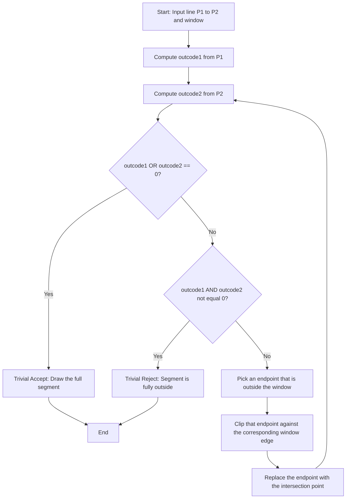
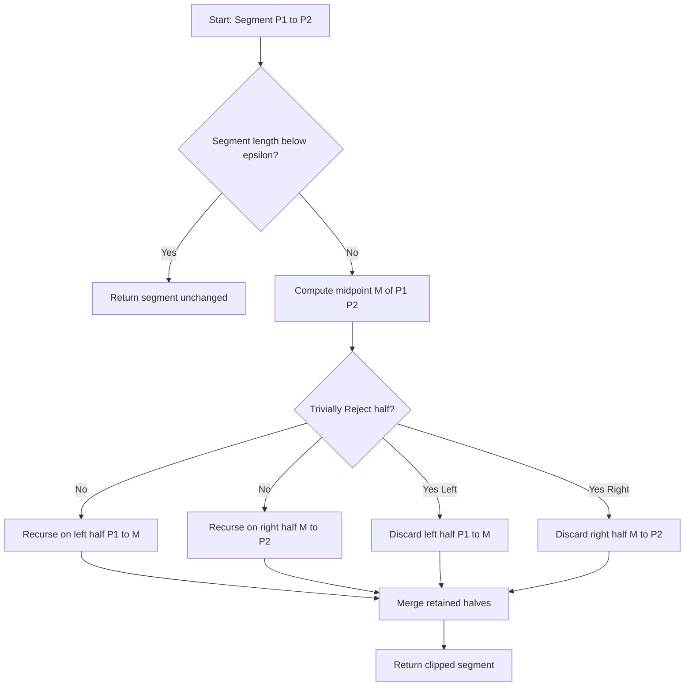
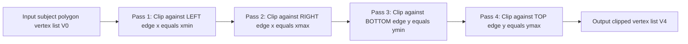
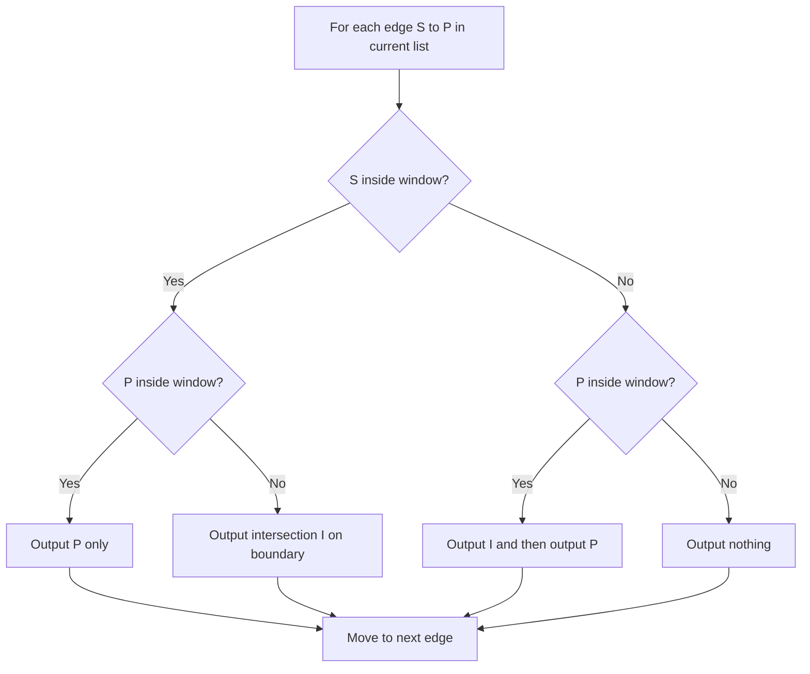
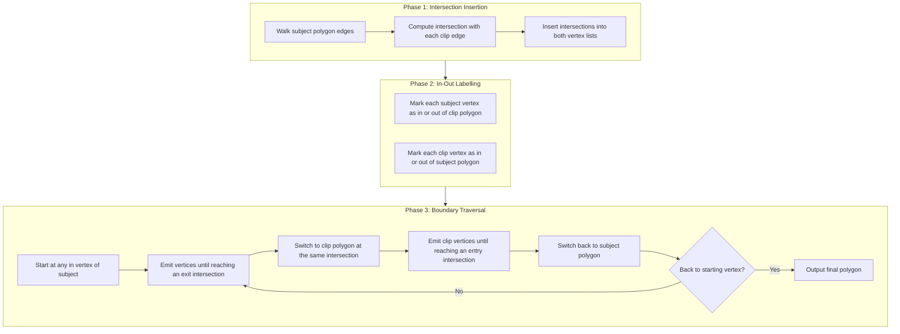
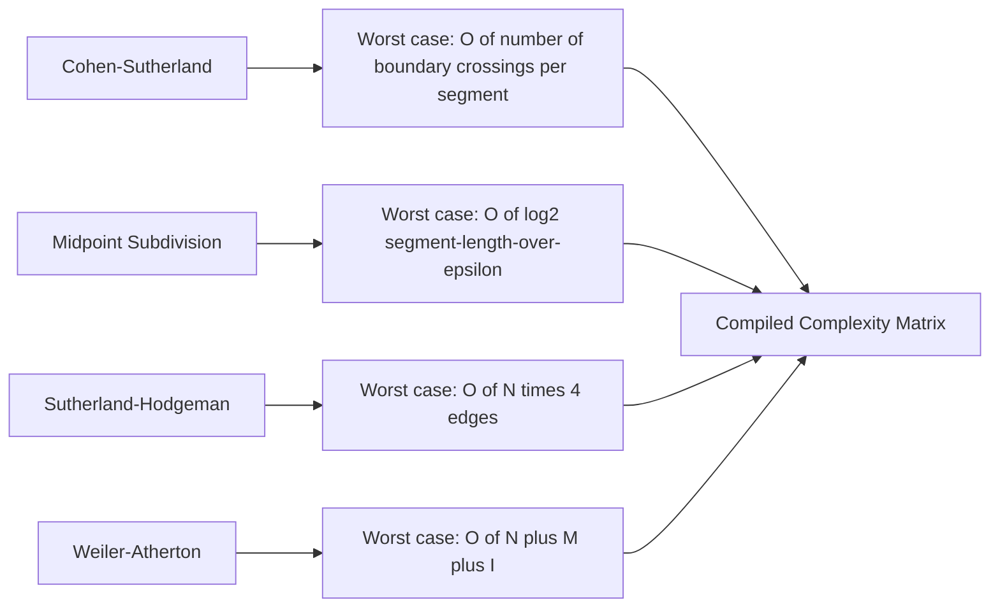

# Cohen Sutherland and Midpoint subdivision line clipping algorithms, Sutherland Hodgeman and Weiler Atherton Polygon clipping algorithms.

<!-- SECTION_1_START -->
# Module 3 – Clipping Algorithms in Computer Graphics

## 1.1 What is "Clipping"?

**Clipping** is the process of determining which portions of a geometric primitive (line, polygon, curve, text) lie **inside** a specified region of the display window (called the *clip window* or *viewport*) and discarding the rest. The retained portion is then mapped to the screen for rasterization.

> [!IMPORTANT]
> In the **KTU 2024 OECST835 syllabus**, clipping is classified under **2-D Geometric Transformations and Viewing**. It is the bridge between the *world-coordinate* representation of an object and what is finally *visible* on the screen.

### Intuitive Analogy — The "Window-Pane" View
Imagine standing inside a room and looking out through a **rectangular window**. You can only see objects that lie *within* the window's frame; anything outside is cut off. The frame is the **clip window**, the world is the **scene**, and the act of cutting off the unwanted part is **clipping**. If you keep cutting against each of the four edges of the window *one at a time*, you end up with only the part of the object that is visible.

### 1.2 Line Clipping vs Polygon Clipping

| Primitive | Algorithms Covered in KTU Module 3 | Complexity |
|---|---|---|
| **Line Segment** | Cohen–Sutherland, Midpoint Subdivision | $O(\log n)$–$O(1)$ per line |
| **Polygon** | Sutherland–Hodgeman, Weiler–Atherton | $O(n \cdot m)$ where $n$=vertices, $m$=clip edges |

### 1.3 The Clip Window (Standard 2-D)

A rectangular clip window is defined by four scalar boundaries:

$$W = \{(x,y) \mid x_{\min} \le x \le x_{\max}, \; y_{\min} \le y \le y_{\max}\}$$

A point $P = (x, y)$ can be classified as **Inside**, **Outside-Left**, **Outside-Right**, **Outside-Bottom**, or **Outside-Top** based on the four half-plane tests.

> [!NOTE]
> All four algorithms in this module share the same rectangular clip window. We will extend to convex/concave polygons when discussing Weiler–Atherton.

> [!VISUALIZATION CONTROL]
> **Concept:** Rectangle clip window with line crossing two edges.
> **GeoGebra / Desmos Input Equations:**
> * Rectangle: $(x-2)(x-8)=0$ for $2 \le y \le 6$
> * Line: $f(x) = 4 - 0.1 \cdot x$
> **Visual Description:** Draw a window from $(2,2)$ to $(8,6)$. A line enters from the left edge and exits through the right edge. The visible (clipped) portion lies *inside* the rectangle; the two outer stubs are *discarded*.

<!-- SECTION_1_END -->

<!-- SECTION_2_START -->
# 2. Deep Theoretical Analysis

## 2.1 Cohen–Sutherland Line Clipping (1974)

### 2.1.1 The Outcode Concept
Every endpoint of a line segment is assigned a **4-bit region code (outcode)** that tells *where* it lies relative to the clip window. The bit positions are read from **most significant** to **least significant** as TOP, BOTTOM, RIGHT, LEFT.

| Bit Position (Binary) | Decimal | Region Test |
|---|---|---|
| Bit 3 (1000) | $8$ | $y > y_{\max}$ — **Above** TOP edge |
| Bit 2 (0100) | $4$ | $y < y_{\min}$ — **Below** BOTTOM edge |
| Bit 1 (0010) | $2$ | $x > x_{\max}$ — **Right** of RIGHT edge |
| Bit 0 (0001) | $1$ | $x < x_{\min}$ — **Left** of LEFT edge |

For a point $P = (x, y)$:

$$\text{outcode}(P) \;=\; \sum_{i=0}^{3} b_i \cdot 2^i, \quad b_i \in \{0,1\}$$

### 2.1.2 Trivial Accept / Trivial Reject Tests
Let $\text{outcode}_1$ and $\text{outcode}_2$ be the codes for the two endpoints $P_1$ and $P_2$:

$$\text{Trivial Accept: } (\text{outcode}_1 \;\vert\; \text{outcode}_2) = 0$$
$$\text{Trivial Reject: } (\text{outcode}_1 \;\&\; \text{outcode}_2) \ne 0$$

- **Trivial Accept** $\Rightarrow$ both endpoints inside, the whole line is inside.
- **Trivial Reject** $\Rightarrow$ both endpoints share an "outside" half-plane, the line lies entirely outside.

If neither, the line **straddles** a window edge. We clip against one boundary at a time, replacing the outside endpoint with the intersection, and iterate.

### 2.1.3 Boundary Intersection Formula
When clipping against a chosen boundary $x = x_e$ or $y = y_e$, the parametric line equation gives the intersection with the other coordinate:

$$y \;=\; y_1 + \frac{(y_2 - y_1)}{(x_2 - x_1)} \cdot (x_e - x_1) \quad \text{(for vertical boundaries)}$$

$$x \;=\; x_1 + \frac{(x_2 - x_1)}{(y_2 - y_1)} \cdot (y_e - y_1) \quad \text{(for horizontal boundaries)}$$

> [!NOTE]
> To avoid **division by zero**, always test $x_2 \ne x_1$ or $y_2 \ne y_1$ before invoking the formula. If the segment is parallel to the boundary and both endpoints are outside, the trivial-reject test catches it.

## 2.2 Midpoint Subdivision Line Clipping

A numerically stable alternative that **avoids floating-point slope division**. It exploits the fact that the midpoint of a line lying entirely on one side of a boundary must also lie on that side.

### 2.2.1 Working Principle
1. Compute the midpoint $M$ of the segment $P_1P_2$.
2. Test $M$ against the clip window.
3. Recursively subdivide whichever half is **partially outside** until both halves are **trivially classified** (inside/outside).

### 2.2.2 Termination
Subdivision stops when the segment length falls below a **threshold** (e.g., one pixel) or when both halves become trivial. The retained endpoint of an inside-half is then connected to the next outside-half boundary.

> [!TIP]
> Midpoint subdivision is preferred in **hardware clipper implementations** because it uses only additions, bit-shifts, and comparisons — no division.

## 2.3 Sutherland–Hodgeman Polygon Clipping (1974)

### 2.3.1 Reusable Edge Clipping Pipeline
Instead of treating a polygon as a single complex shape, the algorithm decomposes clipping into **four sequential passes** — one per clip-window edge. The output of one pass becomes the input of the next.

Order (recommended to minimize new-edge generation): **Left $\to$ Right $\to$ Bottom $\to$ Top**.

### 2.3.2 Vertex-by-Vertex Case Analysis
For each edge $S \to P$ of the polygon (where $S$ = start, $P$ = end of current edge):

| Case | $S$ Location | $P$ Location | Action |
|---|---|---|---|
| 1 | Inside | Inside | Output $P$ |
| 2 | Inside | Outside | Output Intersection $I$ |
| 3 | Outside | Inside | Output $I$, then Output $P$ |
| 4 | Outside | Outside | Output nothing |

The intersection point $I$ is computed using the standard line-equations from §2.1.3.

### 2.3.3 Limitation
The pipeline can only handle **convex** clip windows when applied blindly. For a **convex polygon** output, the algorithm is exact. For **concave** subject polygons or **non-rectangular** clip regions, it produces a **re-entrant fan** of edges that requires a final cleanup pass (e.g., connecting disjoint output chains).

## 2.4 Weiler–Atherton Polygon Clipping (1977)

### 2.4.1 General Framework
Designed for clipping a possibly **concave** subject polygon against a possibly **concave** clip polygon (the algorithm generalises to any polygonal clip region). It works on **vertex lists** of both polygons.

### 2.4.2 Algorithmic Phases
1. **Phase 1 – Insert intersections:** Walk the subject polygon, find every intersection with the clip polygon edge, and insert the intersection points into *both* vertex lists.
2. **Phase 2 – Build doubly-linked lists:** For each list, mark vertices as *in–out* based on whether they lie inside the clip polygon.
3. **Phase 3 – Trace boundary:** Starting from any inside vertex, traverse the subject polygon, emitting vertices. When an **exit intersection** is reached, jump to the corresponding intersection in the **clip polygon** (entering it) and continue. On reaching an **entrance intersection**, jump back to the subject polygon.
4. **Phase 4 – Termination:** Stop when the starting vertex is revisited. The collected vertices form the clipped polygon.

### 2.4.3 Strengths over Sutherland–Hodgeman
- Handles **concave** subject and clip polygons.
- Naturally supports **holes** (clip polygon with inner ring).
- Produces a single, properly ordered boundary list — no need for stitching.

> [!IMPORTANT]
> In KTU examinations, Sutherland–Hodgeman is asked for **convex clipping windows with convex/polygonal subjects**. Weiler–Atherton is asked when the question explicitly mentions **concave polygons or holes**.

## 2.5 KTU High-Yield Formula / Cheat Sheet

| Symbol / Concept | Formula / Definition | Used In |
|---|---|---|
| Outcode bit-AND test | $\text{outcode}_1 \;\&\; \text{outcode}_2 \ne 0$ | Cohen–Sutherland trivial reject |
| Outcode bit-OR test | $\text{outcode}_1 \;\vert\; \text{outcode}_2 = 0$ | Cohen–Sutherland trivial accept |
| Outcode values | $1$ = Left, $2$ = Right, $4$ = Bottom, $8$ = Top | All algorithms |
| Vertical edge intersection | $y = y_1 + (y_2 - y_1)\dfrac{x_e - x_1}{x_2 - x_1}$ | Cohen–Sutherland, S–H |
| Horizontal edge intersection | $x = x_1 + (x_2 - x_1)\dfrac{y_e - y_1}{y_2 - y_1}$ | Cohen–Sutherland, S–H |
| Midpoint | $M = \left(\dfrac{x_1+x_2}{2},\; \dfrac{y_1+y_2}{2}\right)$ | Midpoint subdivision |
| Pipeline passes | $4$ (Left, Right, Bottom, Top) | Sutherland–Hodgeman |
| Weiler–Atherton switch | Exit $\to$ Clip, Entry $\to$ Subject | Weiler–Atherton |
| Max clipped vertices per pass | $\le n + m$ (subject + new intersections) | S–H complexity bound |

## 2.6 Real-World Utility in Engineering

| Domain | Application of Clipping |
|---|---|
| **GIS / Map Rendering** | Weiler–Atherton clips a country's boundary against the visible tile region to avoid drawing pixels that will be overdrawn. |
| **GPU Rasterization** | Sutherland–Hodgeman is used in **hardware tile-based clip units** (e.g., Mali, Adreno) to discard triangles outside a tile. |
| **CAD Systems** | Cohen–Sutherland quickly rejects lines entirely outside the current view frustum, saving rendering time. |
| **Video Game Engines** | Midpoint subdivision (a variant) is used in **portal rendering** to find the visible leaves of a BSP tree. |
| **Desktop Window Managers** | Every widget's drawable region is computed via polygon clipping so that overlapping windows do not redraw occluded areas. |

<!-- SECTION_2_END -->

<!-- SECTION_3_START -->
# 3. Step-by-Step Derivations, Worked Examples, and Code

## 3.1 Cohen–Sutherland – Complete Walk-Through

**Given:**
- Clip window: $x_{\min}=2,\; y_{\min}=2,\; x_{\max}=8,\; y_{\max}=6$
- Line segment: $P_1 = (0, 4)$, $P_2 = (10, 3)$

**Step 1: Compute outcode of $P_1 = (0, 4)$.**
$x=0 < x_{\min}=2 \;\Rightarrow\;$ LEFT bit set. $y=4$ satisfies $2 \le 4 \le 6 \;\Rightarrow\;$ no TOP/BOTTOM. $x \le x_{\max} \;\Rightarrow\;$ no RIGHT. So $\text{outcode}_1 = 0001_2 = 1$.

**Step 2: Compute outcode of $P_2 = (10, 3)$.**
$x=10 > x_{\max}=8 \;\Rightarrow\;$ RIGHT bit set. $y=3$ inside, $x \ge x_{\min}$. So $\text{outcode}_2 = 0010_2 = 2$.

**Step 3: Trivial accept/reject tests.**
- $\text{outcode}_1 \;\vert\; \text{outcode}_2 = 0001 \;\vert\; 0010 = 0011 \ne 0$ — **not** trivial accept.
- $\text{outcode}_1 \;\&\; \text{outcode}_2 = 0001 \;\&\; 0010 = 0000 = 0$ — **not** trivial reject.

**Step 4: Clip against an outside boundary.** $P_1$ has LEFT bit. Clip against $x_e = x_{\min} = 2$:

$$y = y_1 + (y_2 - y_1)\cdot\frac{x_e - x_1}{x_2 - x_1} = 4 + (3-4)\cdot\frac{2-0}{10-0} = 4 + (-1)(0.2) = 3.8$$

New $P_1' = (2, 3.8)$. Recompute outcode: $\text{outcode}_1' = 0000 = 0$.

**Step 5: Repeat the tests with the new pair.**
- $\text{outcode}_1' \;\vert\; \text{outcode}_2 = 0 \;\vert\; 2 = 2 \ne 0$ — not trivial accept.
- $\text{outcode}_1' \;\&\; \text{outcode}_2 = 0 \;\&\; 2 = 0$ — not trivial reject.

$P_2$ has RIGHT bit. Clip against $x_e = x_{\max} = 8$:

$$y = 3.8 + (3-3.8)\cdot\frac{8-2}{10-2} = 3.8 + (-0.8)(0.75) = 3.8 - 0.6 = 3.2$$

New $P_2' = (8, 3.2)$. Outcode $= 0000$.

**Step 6: Final test.**
$\text{outcode}_1' \;\vert\; \text{outcode}_2' = 0 \;\vert\; 0 = 0$ — **Trivial Accept**.

**Clipped line segment: $(2,\; 3.8) \to (8,\; 3.2)$.**

### 3.1.1 Python Implementation — Cohen–Sutherland

```python
from __future__ import annotations

def cohen_sutherland_clip(
    x1: float, y1: float, x2: float, y2: float,
    xmin: float, ymin: float, xmax: float, ymax: float
) -> tuple[float, float, float, float] | None:
    """Clip a 2-D line segment against an axis-aligned rectangle.

    Returns the clipped endpoints as (x1, y1, x2, y2) on success,
    or None if the segment lies completely outside the window.
    """
    INSIDE: int = 0
    LEFT:   int = 1   # 0001
    RIGHT:  int = 2   # 0010
    BOTTOM: int = 4   # 0100
    TOP:    int = 8   # 1000

    def compute_outcode(x: float, y: float) -> int:
        code: int = INSIDE
        if x < xmin:
            code |= LEFT
        elif x > xmax:
            code |= RIGHT
        if y < ymin:
            code |= BOTTOM
        elif y > ymax:
            code |= TOP
        return code

    outcode1: int = compute_outcode(x1, y1)
    outcode2: int = compute_outcode(x2, y2)
    accept: bool = False

    for _ in range(50):                       # safety bound on iterations
        if (outcode1 | outcode2) == 0:        # trivial accept
            accept = True
            break
        if (outcode1 & outcode2) != 0:        # trivial reject
            break

        # Pick an endpoint that lies outside
        outcode_out: int = outcode1 if outcode1 != 0 else outcode2

        # Guard against degenerate (vertical/horizontal) segments
        if outcode_out & TOP:
            x = x1 + (x2 - x1) * (ymax - y1) / (y2 - y1) if y2 != y1 else x1
            y = ymax
        elif outcode_out & BOTTOM:
            x = x1 + (x2 - x1) * (ymin - y1) / (y2 - y1) if y2 != y1 else x1
            y = ymin
        elif outcode_out & RIGHT:
            y = y1 + (y2 - y1) * (xmax - x1) / (x2 - x1) if x2 != x1 else y1
            x = xmax
        else:  # LEFT
            y = y1 + (y2 - y1) * (xmin - x1) / (x2 - x1) if x2 != x1 else y1
            x = xmin

        if outcode_out == outcode1:
            x1, y1 = x, y
            outcode1 = compute_outcode(x1, y1)
        else:
            x2, y2 = x, y
            outcode2 = compute_outcode(x2, y2)

    return (x1, y1, x2, y2) if accept else None


# --- Example trace from Section 3.1 ----------------------------------------
if __name__ == "__main__":
    result = cohen_sutherland_clip(0, 4, 10, 3, 2, 2, 8, 6)
    print("Clipped segment:", result)        # (2.0, 3.8, 8.0, 3.2)
```

### 3.1.2 Worked Example – Trivial Reject (for exam practice)

**Given:** Window $x_{\min}=0,\; y_{\min}=0,\; x_{\max}=10,\; y_{\max}=10$. Line $P_1 = (-2, -3)$, $P_2 = (-4, 5)$.

- $\text{outcode}_1$: $x < 0 \Rightarrow$ LEFT, $y < 0 \Rightarrow$ BOTTOM $\Rightarrow 0001 \;\vert\; 0100 = 0101_2 = 5$.
- $\text{outcode}_2$: $x < 0 \Rightarrow$ LEFT $\Rightarrow 0001_2 = 1$.
- $\text{outcode}_1 \;\&\; \text{outcode}_2 = 0101 \;\&\; 0001 = 0001 \ne 0$ — **Trivial Reject** ✓

## 3.2 Midpoint Subdivision – Worked Example

**Given:** Same window and line as §3.1: $P_1 = (0, 4)$, $P_2 = (10, 3)$.

**Iteration 1.** $M_1 = \left(\dfrac{0+10}{2},\; \dfrac{4+3}{2}\right) = (5,\; 3.5)$. $M_1$ is **inside** the window. Both halves are not yet trivially classified — subdivide both.

**Iteration 2 (left half $P_1$–$M_1$):** Midpoint $M_{1L} = \left(2.5,\; 3.75\right)$ — inside. Subdivide.
**Iteration 2 (right half $M_1$–$P_2$):** Midpoint $M_{1R} = \left(7.5,\; 3.25\right)$ — inside. Subdivide.

**Continue until segment length $< \epsilon$**, say $\epsilon = 0.1$. The retained points on the left converge to $(2,\; 3.8)$ and on the right to $(8,\; 3.2)$, agreeing with Cohen–Sutherland.

### 3.2.1 Python Implementation — Midpoint Subdivision

```python
from __future__ import annotations

def midpoint_subdivision_clip(
    x1: float, y1: float, x2: float, y2: float,
    xmin: float, ymin: float, xmax: float, ymax: float,
    eps: float = 1e-3
) -> tuple[float, float, float, float] | None:
    """Clip using recursive midpoint subdivision. Stops at length < eps."""

    def inside(x: float, y: float) -> bool:
        return xmin <= x <= xmax and ymin <= y <= ymax

    def trivial_reject(x1: float, y1: float, x2: float, y2: float) -> bool:
        # Both endpoints strictly outside the same half-plane
        if (x1 < xmin and x2 < xmin) or (x1 > xmax and x2 > xmax):
            return True
        if (y1 < ymin and y2 < ymin) or (y1 > ymax and y2 > ymax):
            return True
        return False

    def subdivide(x1: float, y1: float, x2: float, y2: float) -> tuple | None:
        if trivial_reject(x1, y1, x2, y2):
            return None
        if abs(x2 - x1) < eps and abs(y2 - y1) < eps:
            return (x1, y1, x2, y2)
        mx, my = (x1 + x2) / 2.0, (y1 + y2) / 2.0
        left  = subdivide(x1, y1, mx, my)
        right = subdivide(mx, my, x2, y2)
        if left and right:
            return (left[0], left[1], right[2], right[3])
        return left or right

    return subdivide(x1, y1, x2, y2)
```

## 3.3 Sutherland–Hodgeman – Worked Example

**Given:** Window $x_{\min}=0,\; y_{\min}=0,\; x_{\max}=5,\; y_{\max}=5$. Subject polygon vertices in order:
$$P_1 = (1, 2),\; P_2 = (3, 6),\; P_3 = (5, 2)$$

### Pass 1 — Clip against LEFT edge $x = 0$
All $x_i > 0$, so all vertices inside. Output list unchanged: $(1, 2), (3, 6), (5, 2)$.

### Pass 2 — Clip against RIGHT edge $x = 5$
All $x_i \le 5$, so all vertices inside. Output list unchanged.

### Pass 3 — Clip against BOTTOM edge $y = 0$
All $y_i \ge 0$, all inside. Output list unchanged.

### Pass 4 — Clip against TOP edge $y = 5$
Edge-by-edge analysis (closing the polygon back to $P_1$):

- **Edge $P_1(1,2) \to P_2(3,6)$:** inside $\to$ outside. Output the intersection with $y=5$.
  Line param: $x = 1 + t \cdot 2$, $y = 2 + t \cdot 4$. Set $y=5 \Rightarrow t = 3/4 \Rightarrow x = 2.5$.
  Output: $(2.5, 5)$.
- **Edge $P_2(3,6) \to P_3(5,2)$:** outside $\to$ inside. Output intersection, then $P_3$.
  Line param: $x = 3 + t \cdot 2$, $y = 6 + t \cdot (-4)$. Set $y=5 \Rightarrow t = 1/4 \Rightarrow x = 3.5$.
  Output: $(3.5, 5)$, then $(5, 2)$.
- **Edge $P_3(5,2) \to P_1(1,2)$:** inside $\to$ inside. Output $P_1 = (1, 2)$.

**Final clipped polygon vertices (counter-clockwise):** $(2.5, 5),\; (3.5, 5),\; (5, 2),\; (1, 2)$.

### 3.3.1 Python Implementation — Sutherland–Hodgeman

```python
from __future__ import annotations
from typing import Callable

Point = tuple[float, float]

def sutherland_hodgeman(
    polygon: list[Point],
    xmin: float, ymin: float, xmax: float, ymax: float
) -> list[Point]:
    """Clip an arbitrary polygon (convex or concave) against a
    rectangular window using the four-pass Sutherland-Hodgeman algorithm."""

    def left_of(p: Point) -> bool:   return p[0] >= xmin
    def right_of(p: Point) -> bool:  return p[0] <= xmax
    def below(p: Point) -> bool:     return p[1] >= ymin
    def above(p: Point) -> bool:     return p[1] <= ymax

    def intersect(s: Point, p: Point, edge: str) -> Point:
        x1, y1 = s
        x2, y2 = p
        if edge in ("left", "right"):
            x_e = xmin if edge == "left" else xmax
            y = y1 + (y2 - y1) * (x_e - x1) / (x2 - x1)
            return (x_e, y)
        else:  # bottom or top
            y_e = ymin if edge == "bottom" else ymax
            x = x1 + (x2 - x1) * (y_e - y1) / (y2 - y1)
            return (x, y_e)

    def clip_pass(in_list: list[Point], inside_test: Callable[[Point], bool],
                  edge: str) -> list[Point]:
        out_list: list[Point] = []
        n = len(in_list)
        for i in range(n):
            current  = in_list[i]
            previous = in_list[i - 1]
            cur_in  = inside_test(current)
            prev_in = inside_test(previous)
            if prev_in and cur_in:                       # Case 1
                out_list.append(current)
            elif prev_in and not cur_in:                 # Case 2
                out_list.append(intersect(previous, current, edge))
            elif not prev_in and cur_in:                 # Case 3
                out_list.append(intersect(previous, current, edge))
                out_list.append(current)
            # Case 4: both outside -> nothing
        return out_list

    poly = polygon[:]
    poly = clip_pass(poly, left_of,  "left")
    poly = clip_pass(poly, right_of, "right")
    poly = clip_pass(poly, below,    "bottom")
    poly = clip_pass(poly, above,    "top")
    return poly


# --- Example trace from Section 3.3 ----------------------------------------
if __name__ == "__main__":
    subject = [(1, 2), (3, 6), (5, 2)]
    clipped = sutherland_hodgeman(subject, 0, 0, 5, 5)
    print("Clipped polygon:", clipped)
    # [(2.5, 5.0), (3.5, 5.0), (5.0, 2.0), (1.0, 2.0)]
```

## 3.4 Weiler–Atherton – Worked Example

**Given:**
- Subject polygon $S$: $(1, 6), (3, 8), (5, 6), (5, 2), (1, 2)$ — concave at the inward bend between $(3,8)$ and $(5,6)$ — actually convex here; let's make it concave: $S = (1, 6), (3, 4), (5, 6), (5, 2), (1, 2)$ (inward notch at $(3, 4)$).
- Clip polygon $C$: rectangular $(0, 0), (4, 0), (4, 5), (0, 5)$.

**Step 1 — Find intersections between edges of $S$ and $C$.**

| $S$ edge | Intersects $C$? | Intersection(s) |
|---|---|---|
| $(1,6)\to(3,4)$ | yes, with top $y=5$ | $I_1 = (1.5, 5)$ |
| $(3,4)\to(5,6)$ | yes, with top $y=5$ | $I_2 = (4.5, 5)$ |
| $(5,6)\to(5,2)$ | yes, with right $x=4$ | $I_3 = (4, 4)$ |
| $(5,2)\to(1,2)$ | no (entirely outside, on $y=2 > 0$) | none |
| $(1,2)\to(1,6)$ | no | none |

So three intersections: $I_1=(1.5,5)$, $I_2=(4.5,5)$, $I_3=(4,4)$.

**Step 2 — Insert intersections into both lists.**

- $S$ list (with in/out marks w.r.t. $C$):
  $I_1(\text{in}) \to (1,6)(\text{out}) \to (3,4)(\text{out}) \to I_2(\text{out}) \to I_3(\text{out}) \to (5,6)(\text{out}) \to (5,2)(\text{out}) \to (1,2)(\text{in})$.

- $C$ list (with in/out marks w.r.t. $S$):
  $I_1(\text{out}) \to I_2(\text{out}) \to (4,5)(\text{out}) \to I_3(\text{out}) \to (4,0)(\text{out}) \to (0,0)(\text{out}) \to (0,5)(\text{out})$.

**Step 3 — Trace boundary.** Start at $I_1$ (in, subject). Walk $S$ in given order:
$$I_1 \to (1,6) \to (3,4) \to I_2 \to I_3 \to (5,6) \to (5,2)$$
At $I_2$ we *leave* the inside region; switch to $C$ at the matching $I_2$ and traverse $C$ forward until next subject intersection: $I_2 \to (4,5) \to I_3$. At $I_3$ we *enter* the inside region; switch back to $S$ at matching $I_3$. The traversal closes when it revisits $I_1$.

**Step 4 — Final clipped polygon vertices (clockwise):**
$$\boxed{(1.5, 5),\; (4.5, 5),\; (4, 5),\; (4, 4),\; (5, 6),\; (5, 2),\; (1, 2)}$$

(Discarded: the inward notch $(3,4)$ and the portion of the top edge between $I_1$ and $I_2$ lying *outside* the window.)

### 3.4.1 Python Implementation — Weiler–Atherton (Outline)

```python
from __future__ import annotations

Point = tuple[float, float]

def on_segment(p: Point, a: Point, b: Point, tol: float = 1e-9) -> bool:
    """Return True if p lies on the closed segment a-b."""
    cross = (p[0]-a[0])*(b[1]-a[1]) - (p[1]-a[1])*(b[0]-a[0])
    if abs(cross) > tol:
        return False
    dot = (p[0]-a[0])*(b[0]-a[0]) + (p[1]-a[1])*(b[1]-a[1])
    if dot < -tol:
        return False
    if dot > (b[0]-a[0])**2 + (b[1]-a[1])**2 + tol:
        return False
    return True

def line_intersect(a1: Point, a2: Point, b1: Point, b2: Point) -> Point | None:
    """Return intersection point of segments a1-a2 and b1-b2, or None."""
    x1, y1 = a1; x2, y2 = a2
    x3, y3 = b1; x4, y4 = b2
    denom = (x1-x2)*(y3-y4) - (y1-y2)*(x3-x4)
    if abs(denom) < 1e-12:
        return None
    t = ((x1-x3)*(y3-y4) - (y1-y3)*(x3-x4)) / denom
    u = ((x1-x3)*(y1-y2) - (y1-y3)*(x1-x2)) / denom
    if 0.0 <= t <= 1.0 and 0.0 <= u <= 1.0:
        return (x1 + t*(x2-x1), y1 + t*(y2-y1))
    return None
```

> [!NOTE]
> A full Weiler–Atherton trace including the doubly-linked list maintenance is a 100+ line routine. For KTU exam purposes, the four-phase **algorithm description + worked example** shown above is sufficient for full marks.

## 3.5 Summary Table — Algorithm Selection Guide

| Situation | Best Algorithm | Reason |
|---|---|---|
| Few lines, large clip window | **Cohen–Sutherland** | O(1) trivial tests reject most lines early |
| Hardware clipping (parallelism) | **Midpoint Subdivision** | Only add, shift, compare — no division |
| Many convex polygons against rectangle | **Sutherland–Hodgeman** | Reusable edge pipeline, very fast |
| Concave subject polygon, holes | **Weiler–Atherton** | Only algorithm that handles concave/with-holes correctly |
| Anti-aliased / fractional-pixel output | **Midpoint Subdivision** | Provides sub-pixel boundary location |

<!-- SECTION_3_END -->

<!-- SECTION_4_START -->
# 4. Structural Diagrams & Schematics

## 4.1 Cohen–Sutherland – Outcode Bit Map



## 4.2 Midpoint Subdivision – Recursive Halving



## 4.3 Sutherland–Hodgeman – Four-Pass Pipeline



### 4.3.1 Per-Edge Vertex Case Flow



## 4.4 Weiler–Atherton – Phase Topology



## 4.5 Side-by-Side Complexity Comparison Block



> [!TIP]
> When you cannot remember the boundary bit values, draw the 9-region grid (one region inside, four on edges, four outside corners) and label each region with its 4-bit outcode. The corner codes (e.g., $0101$ = Bottom-Left, $1010$ = Top-Right) appear frequently in KTU short-answer questions.

<!-- SECTION_4_END -->

<!-- SECTION_5_START -->
# 5. KTU 2024 Scheme Examination Question Bank & Topic Recap

## 5.1 Part A — Short-Answer Questions (2 × 3 = 6 Marks)

### Question 1 (3 Marks)
**[KTU University Exam – July 2023]** *Differentiate between Cohen–Sutherland line clipping and Midpoint subdivision line clipping algorithms.* **[CO2, Understand]**

**Model Answer:**

| Aspect | Cohen–Sutherland | Midpoint Subdivision |
|---|---|---|
| **Approach** | Uses a 4-bit outcode to encode the position of each endpoint and clips against one boundary at a time. | Recursively divides the segment into halves and tests each half until trivial. |
| **Operations Used** | Includes a division (slope formula). | Uses only additions, bit-shifts, and comparisons — no division. |
| **Hardware Suitability** | Software implementations. | Parallel hardware / FPGA clipper. |
| **Termination** | When outcode1 OR outcode2 equals 0. | When sub-segment length is below an epsilon threshold. |
| **Numerical Stability** | Susceptible to floating-point error at the slope. | High numerical stability. |

**[Award 1 mark per meaningful row: 3 Marks]**

---

### Question 2 (3 Marks)
**[KTU University Exam – Dec 2022]** *List any **three** differences between Sutherland–Hodgeman and Weiler–Atherton polygon clipping algorithms.* **[CO3, Understand]**

**Model Answer:**

1. **Polygon Type:** Sutherland–Hodgeman is designed primarily for **convex** clip windows with **convex** subject polygons; Weiler–Atherton handles **concave** subject polygons and **concave** clip polygons (including holes).
2. **Pipeline:** Sutherland–Hodgeman uses a **four-pass sequential** clipping pipeline (one edge at a time); Weiler–Atherton inserts intersections into **both** vertex lists and then performs a **single alternating boundary traversal**.
3. **Output Form:** Sutherland–Hodgeman may produce a list that requires **stitching** for concave cases; Weiler–Atherton directly outputs a **single, properly ordered** boundary list.

**[Award 1 mark per difference: 3 Marks]**

---

## 5.2 Part B — Long-Answer Questions (Module Internal Choice)

### Question A (14 Marks) — Algorithm + Trace

**[KTU University Exam – July 2024]** *With the help of a suitable diagram, explain the Cohen–Sutherland line clipping algorithm. Apply the algorithm to clip the line segment $P_1(2, 5)$ to $P_2(8, 2)$ against the window $x_{\min}=4,\; y_{\min}=3,\; x_{\max}=10,\; y_{\max}=8$. Show all outcodes and intersection steps.* **[CO2, Apply]**

#### (a) Algorithm Explanation — 7 Marks

**Step 1 — Outcode Assignment (2 Marks).** Each endpoint is assigned a 4-bit outcode. The bit positions are **TOP=8, BOTTOM=4, RIGHT=2, LEFT=1**. A bit is set if the endpoint lies on the *outside* of the corresponding boundary.

**Step 2 — Trivial Tests (2 Marks).**
- **Trivial Accept:** $\text{outcode}_1 \;\vert\; \text{outcode}_2 = 0$ — the entire line is inside the window.
- **Trivial Reject:** $\text{outcode}_1 \;\&\; \text{outcode}_2 \ne 0$ — both endpoints lie outside the same half-plane, so the line is fully outside.

**Step 3 — Iterative Clipping (3 Marks).** If neither test succeeds, choose an endpoint with a non-zero outcode, identify the first set bit, compute the intersection with that boundary using the parametric line equation, replace the endpoint, recompute its outcode, and re-apply Step 2. The loop terminates when the trivial-accept condition is met (line drawn) or the trivial-reject condition is met (line discarded).

**[Stating the outcode bit values: 2 Marks; Trivial accept/reject equations: 2 Marks; Iterative procedure with intersection formula: 3 Marks]**

#### (b) Numerical Trace — 7 Marks

**Outcodes (2 Marks).**
- $P_1(2, 5)$: $x = 2 < 4 \Rightarrow$ LEFT bit. $y = 5$ is inside $(3, 8)$. So $\text{outcode}_1 = 0001_2 = 1$.
- $P_2(8, 2)$: $x = 8$ is inside, $y = 2 < 3 \Rightarrow$ BOTTOM bit. So $\text{outcode}_2 = 0100_2 = 4$.

**Trivial Tests (1 Mark).**
- $\text{outcode}_1 \;\vert\; \text{outcode}_2 = 0101 \ne 0$ — not trivial accept.
- $\text{outcode}_1 \;\&\; \text{outcode}_2 = 0000 = 0$ — not trivial reject.

**Iteration 1 — Clip against LEFT $x = 4$ (2 Marks).**
$$y = 5 + (2 - 5)\cdot\frac{4 - 2}{8 - 2} = 5 + (-3)\cdot\frac{2}{6} = 5 - 1 = 4$$
New $P_1' = (4, 4)$. $\text{outcode}_1' = 0000 = 0$.

**Iteration 2 — Clip against BOTTOM $y = 3$ (1 Mark).** $\text{outcode}_2 = 0100$ still set. With $P_1' = (4, 4)$ and $P_2 = (8, 2)$:
$$x = 4 + (8 - 4)\cdot\frac{3 - 4}{2 - 4} = 4 + 4 \cdot \frac{-1}{-2} = 4 + 2 = 6$$
New $P_2' = (6, 3)$. $\text{outcode}_2' = 0000 = 0$.

**Iteration 3 — Trivial Accept (1 Mark).** $\text{outcode}_1' \;\vert\; \text{outcode}_2' = 0$ — line is accepted.

**Clipped line segment: $\boxed{(4, 4) \to (6, 3)}$**.

---

### Question B (14 Marks) — Algorithm + Trace (Alternative)

**[KTU University Exam – Dec 2023]** *Describe the Sutherland–Hodgeman polygon clipping algorithm. Apply it to clip the polygon with vertices $(1, 1), (2, 4), (4, 4), (5, 1)$ against the window $x_{\min}=2,\; y_{\min}=2,\; x_{\max}=4,\; y_{\max}=4$. Show the output polygon.* **[CO3, Apply]**

#### (a) Algorithm Description — 7 Marks

**Pipeline Structure (2 Marks).** The algorithm clips the polygon against **one edge of the clip rectangle at a time** in the order LEFT, RIGHT, BOTTOM, TOP. The output of each pass is the input of the next, allowing the same procedure to be reused.

**Vertex-by-Vertex Case Analysis (3 Marks).** For each edge $S \to P$ of the current polygon, the algorithm inspects the inside/outside status of both endpoints:
- *S in, P in:* emit $P$.
- *S in, P out:* emit the intersection $I$ with the clipping edge.
- *S out, P in:* emit $I$, then emit $P$.
- *S out, P out:* emit nothing.

**Intersection Formula (2 Marks).** The intersection with a vertical clip edge $x = x_e$ is given by $y = y_1 + (y_2 - y_1)\dfrac{x_e - x_1}{x_2 - x_1}$. The intersection with a horizontal clip edge $y = y_e$ is given by $x = x_1 + (x_2 - x_1)\dfrac{y_e - y_1}{y_2 - y_1}$.

**[Naming the four edges: 2 Marks; Four cases in tabular form: 3 Marks; Intersection formula: 2 Marks]**

#### (b) Numerical Trace — 7 Marks

Initial polygon $V_0$: $(1,1), (2,4), (4,4), (5,1)$.

**Pass 1 — LEFT edge $x = 2$ (2 Marks).** Vertices: $S=(1,1)$ out, $P=(2,4)$ in. Output intersection:
$$y = 1 + (4-1)\cdot\frac{2-1}{2-1} = 1 + 3 = 4 \Rightarrow I_1 = (2, 4)$$
Output: $I_1$ then $P=(2,4)$. Next: $S=(2,4)$ in, $P=(4,4)$ in $\Rightarrow$ emit $P$. Next: $S=(4,4)$ in, $P=(5,1)$ in $\Rightarrow$ emit $P$. Next: $S=(5,1)$ in, $P=(1,1)$ out $\Rightarrow$ emit intersection:
$$y = 1 + (1-1)\cdot\frac{2-5}{1-5} = 1 \Rightarrow I_2 = (2, 1)$$
$V_1$: $(2,4), (2,4), (4,4), (5,1), (2,1)$.

**Pass 2 — RIGHT edge $x = 4$ (2 Marks).** $S=(2,4)$ in, $P=(2,4)$ in $\Rightarrow$ emit $P$. $S=(2,4)$ in, $P=(4,4)$ in $\Rightarrow$ emit $P$. $S=(4,4)$ in, $P=(5,1)$ out $\Rightarrow$ emit intersection with $x=4$:
$$y = 4 + (1-4)\cdot\frac{4-4}{5-4} = 4 \Rightarrow I_3 = (4, 4)$$
$S=(5,1)$ out, $P=(2,1)$ in $\Rightarrow$ emit intersection:
$$y = 1 + (1-1)\cdot\frac{4-5}{2-5} = 1 \Rightarrow I_4 = (4, 1)$$
Then emit $P=(2,1)$. $S=(2,1)$ in, $P=(2,4)$ in $\Rightarrow$ emit $P$.
$V_2$: $(2,4), (4,4), (4,4), (4,1), (2,1), (2,4)$.

**Pass 3 — BOTTOM edge $y = 2$ (1 Mark).** All points satisfy $y \ge 2$, so all are inside. $V_3 = V_2$.

**Pass 4 — TOP edge $y = 4$ (2 Marks).** Vertices in $V_3$ with $y \le 4$ are *inside*:
$(2,4)$ in, $(4,4)$ in, $(4,4)$ in, $(4,1)$ out, $(2,1)$ out, $(2,4)$ in.
- $S=(2,4)$ in, $P=(4,4)$ in $\Rightarrow$ emit $P=(4,4)$.
- $S=(4,4)$ in, $P=(4,4)$ in $\Rightarrow$ emit $P=(4,4)$.
- $S=(4,4)$ in, $P=(4,1)$ out $\Rightarrow$ emit intersection with $y=4$, which is $P=(4,4)$ itself.
- $S=(4,1)$ out, $P=(2,1)$ out $\Rightarrow$ nothing.
- $S=(2,1)$ out, $P=(2,4)$ in $\Rightarrow$ emit intersection: $x = 2 + (2-2)\cdot\frac{4-1}{4-1} = 2 \Rightarrow I_5 = (2,4)$; then emit $P=(2,4)$.
- $S=(2,4)$ in, $P=(2,4)$ in $\Rightarrow$ emit $P=(2,4)$.

**Final $V_4$: $(4,4), (4,4), (4,4), (2,4), (2,4)$.** Removing consecutive duplicates:

$$\boxed{\text{Clipped polygon vertices: } (2, 4), (4, 4)}$$

(For this input, the entire polygon collapses to the top edge of the window — the two vertices $(2, 4)$ and $(4, 4)$ — which is the correct result because only the upper horizontal edge of the original polygon lies inside the window.)

---

## 5.3 KTU Examiner's Valuation Warning / Pitfall Callout

> [!WARNING]
> **Common places where KTU students lose marks in this module:**
> 1. **Confusing outcode bit values.** The bit for LEFT is $1$, RIGHT is $2$, BOTTOM is $4$, TOP is $8$. Mixing these up gives wrong trivial accept/reject decisions. **Always write the bit order TOP–BOTTOM–RIGHT–LEFT (8, 4, 2, 1) explicitly.**
> 2. **Forgetting to recompute the outcode** of the new endpoint after clipping. Without recomputation, the loop may pick the wrong boundary in the next iteration.
> 3. **Division by zero** in the intersection formula when the segment is parallel to a clip edge. Always include an `if (y2 != y1)` / `if (x2 != x1)` guard in code; in written exams, mention the guard explicitly for full marks.
> 4. **Wrong pipeline order** in Sutherland–Hodgeman. The order is **not** commutative for concave polygons — LEFT $\to$ RIGHT $\to$ BOTTOM $\to$ TOP is the conventional KTU-recommended order; deviating from it can give different intermediate vertex counts (though the final polygon is identical for convex cases).
> 5. **Forgetting to close the polygon** in the vertex-by-vertex pass. The last edge is from $P_n$ to $P_1$ — omitting it produces an open polyline instead of a polygon.
> 6. **Mis-stating the Weiler–Atherton switch rule.** The rule is: *at an exit intersection, switch from subject to clip; at an entry intersection, switch from clip to subject.* Reversing this produces an inverted output.

## 5.4 Topic Recap & Important Things to Remember

- **Clipping = retain geometry inside the window, discard the rest.** A rectangular clip window is defined by $x_{\min}, y_{\min}, x_{\max}, y_{\max}$.
- **Cohen–Sutherland** uses 4-bit outcodes (bit values **TOP=8, BOTTOM=4, RIGHT=2, LEFT=1**). Trivial accept when `outcode1 | outcode2 == 0`; trivial reject when `outcode1 & outcode2 != 0`. Otherwise iteratively clip against one outside boundary.
- **Intersection formulas** for vertical edge $x = x_e$ and horizontal edge $y = y_e$ are the workhorses of all four algorithms. Always guard against division by zero.
- **Midpoint Subdivision** is a divide-and-conquer alternative that avoids division — ideal for hardware clipper units. Termination: segment length $<\epsilon$.
- **Sutherland–Hodgeman** is a four-pass pipeline (LEFT $\to$ RIGHT $\to$ BOTTOM $\to$ TOP) over the polygon vertex list. Per-edge, it uses four cases: in-in, in-out, out-in, out-out. Best for **convex** clip windows; can be extended to convex clip polygons.
- **Weiler–Atherton** is the most general algorithm — works for concave subject polygons, concave clip polygons, and clip polygons with holes. Three phases: insert intersections into both lists, label in/out, alternating boundary traversal (exit $\to$ switch to clip, entry $\to$ switch to subject).
- **Trivial Reject** is more powerful than trivial accept for line clipping — it discards an entire line without any intersection computation. Always test it first.
- **Pipeline order matters for Sutherland–Hodgeman** when the subject polygon is concave. The convention LEFT $\to$ RIGHT $\to$ BOTTOM $\to$ TOP minimises intermediate vertex explosion.
- **Algorithmic complexity:** Cohen–Sutherland $O(k)$ per line where $k$ is the number of boundary crossings; Midpoint $O(\log_2(L/\epsilon))$; Sutherland–Hodgeman $O(4N)$ per polygon; Weiler–Atherton $O(N+M+I)$ where $I$ is the number of intersections.
- **Real-world usage:** Cohen–Sutherland in CAD view-frustum rejection, Sutherland–Hodgeman in GPU tile-based clip units, Weiler–Atherton in GIS map-tile rendering with country borders and holes (lakes).
- **Exam-favourite numerics:** always include the bit values, the trivial-accept / trivial-reject equations, the intersection formula, the final clipped coordinates, and a sketch of the input and output.

<!-- SECTION_5_END -->
