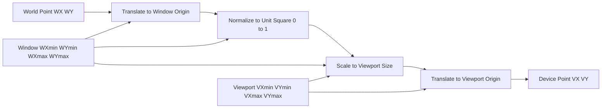
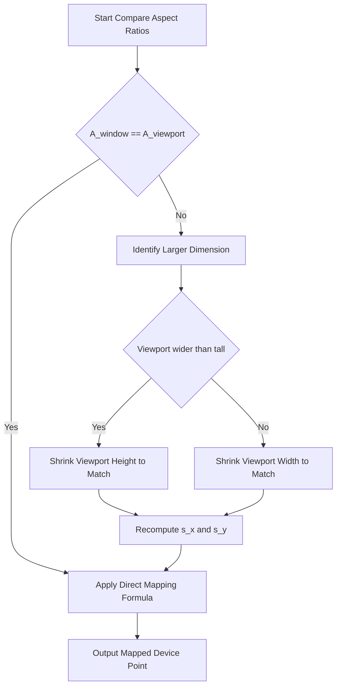
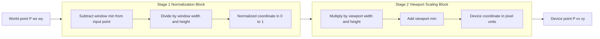
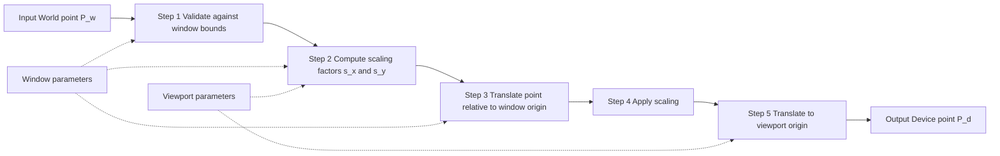
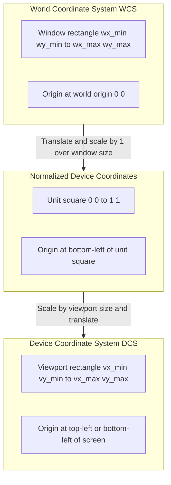

# Transformations and Clipping Algorithms - Window to viewport transformation.

<!-- SECTION_1_START -->
# 1. Core Technical Definition & Intuitive Overview

## Formal Definition

In 2D Computer Graphics, **Window-to-Viewport Transformation** (also called the **World-to-Device Coordinate Mapping** or the **Viewing Transformation**) is the geometric procedure of mapping a rectangular region from the **World Coordinate System (WCS)** — called the **Window** — into a rectangular region on the **Device Coordinate System (DCS)** — called the **Viewport**.

The **Window** is defined by its lower-left corner $(w x_{min}, w y_{min})$ and upper-right corner $(w x_{max}, w y_{max})$ in world coordinates. The **Viewport** is defined by $(v x_{min}, v y_{min})$ and $(v x_{max}, v y_{max})$ in device coordinates (screen pixels). The transformation is purely 2D affine, consisting of a **scaling** followed by a **translation** (or equivalently, a single 3×3 homogeneous matrix).

> [!NOTE]
> **KTU Syllabus Highlight (Module 3):** Students must be able to derive the window-to-viewport transformation matrix, map arbitrary points numerically, and address aspect-ratio mismatch scenarios. This is a high-weightage topic for both Part A (3 marks) and Part B (14 marks) ESE questions.

> [!IMPORTANT]
> **Core Principle:** The transformation preserves the **relative position** of every point inside the window. A point that lies at 50% of the window's width is mapped to 50% of the viewport's width. It is a *linear* mapping, so straight lines remain straight and parallel lines remain parallel.

## Conceptual Analogy / Intuition

Imagine you are a **tourist with a paper map** of Kerala (the **window** — say, showing Thrissur to Kochi in great detail). You want to project this detailed region onto a **smaller rectangle drawn on your notebook** (the **viewport**).

- The paper map uses **kilometers** as units (world coordinates).
- Your notebook uses **centimeters** as units (device coordinates).
- The paper map may show 50 km wide; the notebook rectangle may be 10 cm wide.
- A landmark 25 km from the left edge of the map (i.e., halfway) must be drawn 5 cm from the left edge of the notebook (also halfway).

This resizing-and-repositioning operation is **exactly** what the window-to-viewport transformation does. If your notebook rectangle is not the *same shape* as the map region (different width-to-height ratio), the content gets **stretched or squashed** — this is the **aspect ratio mismatch** problem we will analyze later.

## Standard Metrics & Constants

- **Window width:** $W_w = w x_{max} - w x_{min}$
- **Window height:** $W_h = w y_{max} - w y_{min}$
- **Viewport width:** $V_w = v x_{max} - v x_{min}$
- **Viewport height:** $V_h = v y_{max} - v y_{min}$
- **Scaling factors:** $s_x$ and $s_y$ (computed from the above)
- **Aspect ratio of window:** $A_w = W_w / W_h$
- **Aspect ratio of viewport:** $A_v = V_w / V_h$

> [!VISUALIZATION CONTROL]
> **Concept:** Window-to-Viewport mapping as two nested rectangles on a coordinate plane
> **GeoGebra / Desmos Input Equations:**
> * Window rectangle: Polygon((1,1), (5,1), (5,5), (1,5))
> * Viewport rectangle: Polygon((0,0), (10,0), (10,8), (0,8))
> * Sample world point P: (3, 4)
> **Visual Description:** On the larger WCS plane, you should see a 4×4 unit window and a 10×8 unit viewport. The point P=(3, 4) inside the window is highlighted. Its image Q will be plotted inside the viewport by computing the scaling-translation formulas. This gives the intuition that points near the window edges map to points near the viewport edges.
<!-- SECTION_1_END -->

<!-- SECTION_2_START -->
# 2. Deep Theoretical Analysis & KTU High-Yield Formula Sheet

## The Operational Concept Step-by-Step

The window-to-viewport mapping is performed in **two conceptual stages**:

### Stage 1 — Normalization (Conceptual Intermediate Step)
Translate the window so its lower-left corner is at the origin, then scale it to a **unit square** $[0, 1] \times [0, 1]$.

For any world point $(w x, w y)$ inside the window:

$$
n_x = \frac{w x - w x_{min}}{w x_{max} - w x_{min}}
$$

$$
n_y = \frac{w y - w y_{min}}{w y_{max} - w y_{min}}
$$

The point $(n_x, n y)$ lies in $[0, 1]^2$ — this is the **Normalized Device Coordinate (NDC)** representation.

### Stage 2 — Scaling to the Viewport
Map the unit square to the viewport by another scaling + translation:

$$
v x = v x_{min} + n_x \cdot (v x_{max} - v x_{min})
$$

$$
v y = v y_{min} + n_y \cdot (v y_{max} - v y_{min})
$$

### Combined (Direct) Formula
Substituting Stage 1 into Stage 2 gives the **direct one-shot formula**:

$$
v x = v x_{min} + (w x - w x_{min}) \cdot s_x
$$

$$
v y = v y_{min} + (w y - w y_{min}) \cdot s_y
$$

where

$$
s_x = \frac{v x_{max} - v x_{min}}{w x_{max} - w x_{min}}, \qquad
s_y = \frac{v y_{max} - v y_{min}}{w y_{max} - w y_{min}}
$$

## Homogeneous Matrix Form (KTU High-Yield)

Combining the translation and scaling into a single 3×3 homogeneous matrix:

$$
\begin{bmatrix} v x \\ v y \\ 1 \end{bmatrix}
=
\begin{bmatrix}
s_x & 0 & v x_{min} - s_x \cdot w x_{min} \\
0 & s_y & v y_{min} - s_y \cdot w y_{min} \\
0 & 0 & 1
\end{bmatrix}
\cdot
\begin{bmatrix} w x \\ w y \\ 1 \end{bmatrix}
$$

> [!IMPORTANT]
> **Why the matrix looks this way:** The translation terms $v x_{min} - s_x \cdot w x_{min}$ and $v y_{min} - s_y \cdot w y_{min}$ shift the *scaled* window's lower-left corner *exactly* onto the viewport's lower-left corner. This is a standard KTU examiner trick question — students are asked to *derive* this translation term.

## Aspect Ratio Consideration

The aspect ratio of the window and viewport must match to avoid distortion:

$$
\frac{w x_{max} - w x_{min}}{w y_{max} - w y_{min}} = \frac{v x_{max} - v x_{min}}{v y_{max} - v y_{min}}
$$

If $A_w \neq A_v$, the displayed image will be **stretched horizontally** (if $A_v > A_w$) or **stretched vertically** (if $A_w > A_v$). There are two remedies:
1. **Adjust the viewport:** Expand one dimension so the aspect ratios match.
2. **Adjust the window:** Pick a sub-window whose aspect ratio matches the viewport.

## KTU Formula Sheet (Cheat Sheet)

| Symbol | Meaning | Formula | Units / Notes |
|---|---|---|---|
| $s_x$ | X-scaling factor | $(v x_{max} - v x_{min}) \div (w x_{max} - w x_{min})$ | dimensionless ratio |
| $s_y$ | Y-scaling factor | $(v y_{max} - v y_{min}) \div (w y_{max} - w y_{min})$ | dimensionless ratio |
| $v x$ | Mapped x-coordinate | $v x_{min} + s_x \cdot (w x - w x_{min})$ | device units (pixels) |
| $v y$ | Mapped y-coordinate | $v y_{min} + s_y \cdot (w y - w y_{min})$ | device units (pixels) |
| $A_w$ | Window aspect ratio | $(w x_{max} - w x_{min}) \div (w y_{max} - w y_{min})$ | width $\div$ height |
| $A_v$ | Viewport aspect ratio | $(v x_{max} - v x_{min}) \div (v y_{max} - v y_{min})$ | width $\div$ height |
| $n_x$ | Normalized x | $(w x - w x_{min}) \div (w x_{max} - w x_{min})$ | in $[0, 1]$ |
| $n_y$ | Normalized y | $(w y - w y_{min}) \div (w y_{max} - w y_{min})$ | in $[0, 1]$ |

## Real-World Engineering Utility

- **GUI frameworks** (Qt, GTK, HTML5 Canvas, JavaFX): use this transformation to map logical drawing coordinates to physical screen pixels, enabling resolution-independent design.
- **Game engines** (Unity, Unreal): use a similar pipeline to map world coordinates to camera viewport coordinates.
- **PDF renderers** and **plotting software** (gnuplot, matplotlib): use window-to-viewport mapping to fit user-defined regions onto a printer page or screen rectangle.
- **CAD systems:** a designer draws in world units (meters); the viewport renders to a monitor in pixels. The transformation must be exact, otherwise the engineer sees a distorted part.
<!-- SECTION_2_END -->

<!-- SECTION_3_START -->
# 3. Step-by-Step Derivations & Code Implementation

## Derivation 1 — Direct Mapping Formula from First Principles

Let a point $P$ have world coordinates $(w x, w y)$ inside the window. We want the device coordinates $(v x, v y)$ inside the viewport.

**Step 1:** Compute the *relative position* of $P$ inside the window along the x-axis.

A point that is $\Delta w x$ units from the window's left edge, out of a total window width of $W_w = w x_{max} - w x_{min}$, has relative position:

$$
\text{rel}_x = \frac{w x - w x_{min}}{w x_{max} - w x_{min}}
$$

**Step 2:** Apply the same relative position inside the viewport. The viewport starts at $v x_{min}$ and has width $V_w = v x_{max} - v x_{min}$, so:

$$
v x = v x_{min} + \text{rel}_x \cdot V_w
$$

**Step 3:** Substitute Step 1 into Step 2:

$$
v x = v x_{min} + \frac{w x - w x_{min}}{w x_{max} - w x_{min}} \cdot (v x_{max} - v x_{min})
$$

**Step 4:** Define $s_x = \dfrac{v x_{max} - v x_{min}}{w x_{max} - w x_{min}}$ and rewrite:

$$
v x = v x_{min} + s_x \cdot (w x - w x_{min})
$$

The same derivation for the y-axis gives:

$$
v y = v y_{min} + s_y \cdot (w y - w y_{min})
$$

with $s_y = \dfrac{v y_{max} - v y_{min}}{w y_{max} - w y_{min}}$. $\blacksquare$

## Derivation 2 — Homogeneous Transformation Matrix

We want a single matrix $M$ such that $M \cdot [w x, w y, 1]^T = [v x, v y, 1]^T$.

**Step 1:** Expand the equations:

$$
v x = s_x \cdot w x + 0 \cdot w y + t_x
$$

$$
v y = 0 \cdot w x + s_y \cdot w y + t_y
$$

where $t_x = v x_{min} - s_x \cdot w x_{min}$ and $t_y = v y_{min} - s_y \cdot w y_{min}$.

**Step 2:** Place the coefficients into a 3×3 matrix (the third row keeps the homogeneous coordinate at 1):

$$
M = \begin{bmatrix} s_x & 0 & t_x \\ 0 & s_y & t_y \\ 0 & 0 & 1 \end{bmatrix}
$$

**Step 3:** Verify the translation terms by checking that the window's lower-left corner maps exactly to the viewport's lower-left corner. Setting $(w x, w y) = (w x_{min}, w y_{min})$:

$$
v x = s_x \cdot w x_{min} + t_x = s_x \cdot w x_{min} + (v x_{min} - s_x \cdot w x_{min}) = v x_{min}
$$

$$
v y = s_y \cdot w y_{min} + t_y = s_y \cdot w y_{min} + (v y_{min} - s_y \cdot w y_{min}) = v y_{min}
$$

Both coordinates match the viewport's lower-left corner. $\blacksquare$

## Derivation 3 — Numerical Worked Example (KTU Exam Style)

**Problem:** A window is defined by $(1, 1)$ and $(5, 5)$ in world coordinates. A viewport is defined by $(0, 0)$ and $(100, 100)$ in device coordinates. Map the world point $P = (3, 4)$ to the viewport.

**Step 1:** Identify the boundary values.

Window: $w x_{min} = 1$, $w x_{max} = 5$, $w y_{min} = 1$, $w y_{max} = 5$.
Viewport: $v x_{min} = 0$, $v x_{max} = 100$, $v y_{min} = 0$, $v y_{max} = 100$.

**Step 2:** Compute the scaling factors.

$$
s_x = \frac{100 - 0}{5 - 1} = \frac{100}{4} = 25
$$

$$
s_y = \frac{100 - 0}{5 - 1} = \frac{100}{4} = 25
$$

**Step 3:** Apply the mapping formula to $P = (3, 4)$.

$$
v x = 0 + 25 \cdot (3 - 1) = 25 \cdot 2 = 50
$$

$$
v y = 0 + 25 \cdot (4 - 1) = 25 \cdot 3 = 75
$$

**Step 4:** Final answer.

$$
P = (3, 4) \quad \longrightarrow \quad P' = (50, 75)
$$

**Step 5:** Verification using the homogeneous matrix.

$$
M = \begin{bmatrix} 25 & 0 & 0 - 25 \cdot 1 \\ 0 & 25 & 0 - 25 \cdot 1 \\ 0 & 0 & 1 \end{bmatrix} = \begin{bmatrix} 25 & 0 & -25 \\ 0 & 25 & -25 \\ 0 & 0 & 1 \end{bmatrix}
$$

Apply to $(3, 4, 1)$:

$$
\begin{bmatrix} 25 & 0 & -25 \\ 0 & 25 & -25 \\ 0 & 0 & 1 \end{bmatrix} \begin{bmatrix} 3 \\ 4 \\ 1 \end{bmatrix} = \begin{bmatrix} 25 \cdot 3 + 0 - 25 \\ 0 + 25 \cdot 4 - 25 \\ 1 \end{bmatrix} = \begin{bmatrix} 50 \\ 75 \\ 1 \end{bmatrix}
$$

This matches Step 3. $\blacksquare$

## Derivation 4 — Aspect Ratio Mismatch Example

**Problem:** Window: $(0, 0)$ to $(10, 4)$. Viewport: $(0, 0)$ to $(200, 100)$. Check for distortion and remap if needed.

**Step 1:** Compute the aspect ratios.

$$
A_w = \frac{10 - 0}{4 - 0} = 2.5
$$

$$
A_v = \frac{200 - 0}{100 - 0} = 2.0
$$

**Step 2:** Compare. $A_w \neq A_v$, so the image will be stretched horizontally. To preserve the shape, the viewport height should be adjusted:

$$
V_h' = \frac{V_w}{A_w} = \frac{200}{2.5} = 80
$$

**Step 3:** So the corrected viewport is $(0, 0)$ to $(200, 80)$. Recompute $s_y$:

$$
s_y = \frac{80 - 0}{4 - 0} = 20
$$

and $s_x = 200 / 10 = 20$. Now $s_x = s_y = 20$, giving an undistorted image. $\blacksquare$

## Python Implementation

```python
from dataclasses import dataclass
from typing import Tuple
import logging
import sys

logging.basicConfig(
    level=logging.INFO,
    format="%(asctime)s [%(levelname)s] %(message)s",
    stream=sys.stdout,
)


@dataclass(frozen=True)
class Rectangle:
    """A 2D axis-aligned rectangle defined by its lower-left and upper-right corners."""
    x_min: float
    y_min: float
    x_max: float
    y_max: float

    def __post_init__(self) -> None:
        if self.x_min >= self.x_max:
            raise ValueError(
                f"x_min ({self.x_min}) must be strictly less than x_max ({self.x_max})."
            )
        if self.y_min >= self.y_max:
            raise ValueError(
                f"y_min ({self.y_min}) must be strictly less than y_max ({self.y_max})."
            )

    @property
    def width(self) -> float:
        return self.x_max - self.x_min

    @property
    def height(self) -> float:
        return self.y_max - self.y_min

    @property
    def aspect_ratio(self) -> float:
        return self.width / self.height


def window_to_viewport(
    point: Tuple[float, float],
    window: Rectangle,
    viewport: Rectangle,
    preserve_aspect: bool = False,
) -> Tuple[float, float]:
    """Map a 2D world point from the window rectangle to the viewport rectangle.

    Args:
        point: World coordinates (wx, wy). Should lie inside the window.
        window: Source Rectangle in world coordinates.
        viewport: Destination Rectangle in device coordinates.
        preserve_aspect: If True, shrink the viewport's larger dimension so the
            aspect ratios match (avoids stretching).

    Returns:
        Tuple of (vx, vy) device coordinates.

    Raises:
        ValueError: If the input point is not strictly inside the window.
    """
    wx, wy = point
    if not (window.x_min <= wx <= window.x_max):
        raise ValueError(
            f"Point x={wx} is outside window x-range [{window.x_min}, {window.x_max}]."
        )
    if not (window.y_min <= wy <= window.y_max):
        raise ValueError(
            f"Point y={wy} is outside window y-range [{window.y_min}, {window.y_max}]."
        )

    effective_vp = viewport
    if preserve_aspect and abs(window.aspect_ratio - viewport.aspect_ratio) > 1e-9:
        if viewport.aspect_ratio > window.aspect_ratio:
            new_height = viewport.width / window.aspect_ratio
            effective_vp = Rectangle(
                viewport.x_min,
                viewport.y_min,
                viewport.x_max,
                viewport.y_min + new_height,
            )
        else:
            new_width = viewport.height * window.aspect_ratio
            effective_vp = Rectangle(
                viewport.x_min,
                viewport.y_min,
                viewport.x_min + new_width,
                viewport.y_max,
            )
        logging.warning(
            "Aspect-ratio mismatch corrected: viewport adjusted to %s.",
            effective_vp,
        )

    sx = effective_vp.width / window.width
    sy = effective_vp.height / window.height

    vx = effective_vp.x_min + sx * (wx - window.x_min)
    vy = effective_vp.y_min + sy * (wy - window.y_min)

    logging.info(
        "Mapped (%g, %g) -> (%g, %g) using sx=%g, sy=%g",
        wx, wy, vx, vy, sx, sy,
    )
    return (vx, vy)


if __name__ == "__main__":
    window = Rectangle(1, 1, 5, 5)
    viewport = Rectangle(0, 0, 100, 100)
    print("Test 1 (square-to-square):", window_to_viewport((3, 4), window, viewport))
    # Expected output: (50.0, 75.0)

    window2 = Rectangle(0, 0, 10, 4)
    viewport2 = Rectangle(0, 0, 200, 100)
    print(
        "Test 2 (aspect preserved):",
        window_to_viewport((5, 2), window2, viewport2, preserve_aspect=True),
    )
    # Aspect-corrected viewport becomes (0,0,200,80); sx=20, sy=20 -> (100, 40)
```
<!-- SECTION_3_END -->

<!-- SECTION_4_START -->
# 4. Structural Diagrams & Schematics

## Diagram A — Functional Pipeline of the Transformation



## Diagram B — Aspect-Ratio Decision Tree



## Diagram C — Mapping as a Two-Stage Block Architecture



## Diagram D — Sequential Processing Topology Matrix



## Diagram E — Coordinate System Relationship Block


<!-- SECTION_4_END -->

<!-- SECTION_5_START -->
# 5. KTU 2024 Scheme Examination Question Bank & Topic Recap

## Part A Questions (3 Marks Each)

### Question 1 `[KTU University Exam - July 2023]`
**Define the terms *window* and *viewport* as used in 2D computer graphics. How are they related?**

**Model Answer (3 Marks):**
- **Window:** The window is a rectangular region in the **World Coordinate System (WCS)** that is selected for viewing. It is specified by the coordinates of its lower-left corner $(w x_{min}, w y_{min})$ and upper-right corner $(w x_{max}, w y_{max})$. **[1 Mark]**
- **Viewport:** The viewport is the rectangular region on the **Device Coordinate System (DCS)** — typically the screen — onto which the window is mapped. It is specified by $(v x_{min}, v y_{min})$ and $(v x_{max}, v y_{max})$ in pixel units. **[1 Mark]**
- **Relationship:** The window-to-viewport transformation establishes a **point-to-point mapping** between these two rectangles using a combined scaling-and-translation (affine) operation, preserving the relative positions of all points. **[1 Mark]**

---

### Question 2 `[KTU University Exam - Dec 2022]`
**What is meant by *aspect ratio* in the context of window-to-viewport mapping? Why is it important?**

**Model Answer (3 Marks):**
- **Definition:** The aspect ratio of a rectangle is the ratio of its width to its height. For the window it is $A_w = (w x_{max} - w x_{min}) / (w y_{max} - w y_{min})$ and for the viewport it is $A_v = (v x_{max} - v x_{min}) / (v y_{max} - v y_{min})$. **[1 Mark]**
- **Importance:** If $A_w = A_v$, the displayed image has the same shape as the original. If they differ, the image is **stretched** in one direction (horizontal or vertical), producing geometric distortion. **[1 Mark]**
- **Resolution:** To avoid distortion, the viewport dimensions or the window dimensions must be adjusted so the aspect ratios match before the mapping is applied. **[1 Mark]**

---

## Part B Questions (14 Marks Each — Module Internal Choice)

### Question A `[KTU University Exam - June 2024]`

**(a)** Derive the **window-to-viewport transformation equations** in 2D, expressing the mapped device coordinates $(v x, v y)$ in terms of the world coordinates $(w x, w y)$ and the window/viewport parameters. State clearly any assumptions. **(7 Marks)**

**(b)** Given window corners at $(1, 2)$ and $(7, 10)$ in world coordinates and viewport corners at $(0, 0)$ and $(200, 150)$ in device coordinates:
  (i) Form the homogeneous 3×3 transformation matrix $M$.
  (ii) Map the world point $P = (4, 6)$ using this matrix.
  (iii) Verify whether the aspect ratios match. If not, propose a corrected viewport. **(7 Marks)**

**Model Answer:**

**Part (a) — Derivation (7 Marks):**

Consider a point $P(w x, w y)$ inside the window. The transformation involves two conceptual stages.

*Stage 1 — Normalization:* Compute the relative position of $P$ inside the window. **[1 Mark]**

$$
n_x = \frac{w x - w x_{min}}{w x_{max} - w x_{min}}, \qquad
n_y = \frac{w y - w y_{min}}{w y_{max} - w y_{min}}
$$

*Stage 2 — Scaling to viewport:* Map the normalized coordinate onto the viewport. **[1 Mark]**

$$
v x = v x_{min} + n_x \cdot (v x_{max} - v x_{min})
$$

$$
v y = v y_{min} + n_y \cdot (v y_{max} - v y_{min})
$$

*Substitution:* Combine the two stages into a single formula. Define $s_x = (v x_{max} - v x_{min})/(w x_{max} - w x_{min})$ and $s_y = (v y_{max} - v y_{min})/(w y_{max} - w y_{min})$. **[2 Marks]**

$$
v x = v x_{min} + s_x \cdot (w x - w x_{min})
$$

$$
v y = v y_{min} + s_y \cdot (w y - w y_{min})
$$

*Assumption:* The mapping is affine, so straight lines and parallel lines are preserved. The window and viewport are assumed to be axis-aligned rectangles. **[1 Mark]**

*Homogeneous matrix form (bonus, often expected):* **[2 Marks]**

$$
M = \begin{bmatrix} s_x & 0 & v x_{min} - s_x \cdot w x_{min} \\ 0 & s_y & v y_{min} - s_y \cdot w y_{min} \\ 0 & 0 & 1 \end{bmatrix}
$$

---

**Part (b) — Numerical Solution (7 Marks):**

*Step 1 — Identify parameters.* **[1 Mark]**
$w x_{min} = 1$, $w x_{max} = 7$, $w y_{min} = 2$, $w y_{max} = 10$.
$v x_{min} = 0$, $v x_{max} = 200$, $v y_{min} = 0$, $v y_{max} = 150$.

*Step 2 — Compute scaling factors.* **[1 Mark]**

$$
s_x = \frac{200 - 0}{7 - 1} = \frac{200}{6} = \frac{100}{3} \approx 33.33
$$

$$
s_y = \frac{150 - 0}{10 - 2} = \frac{150}{8} = 18.75
$$

*Step 3 — Form the homogeneous matrix.* **[1 Mark]**

$$
M = \begin{bmatrix} 100/3 & 0 & 0 - (100/3)(1) \\ 0 & 18.75 & 0 - 18.75(2) \\ 0 & 0 & 1 \end{bmatrix} = \begin{bmatrix} 100/3 & 0 & -100/3 \\ 0 & 18.75 & -37.5 \\ 0 & 0 & 1 \end{bmatrix}
$$

*Step 4 — Map the point P = (4, 6).* **[1 Mark]**

$$
v x = 0 + (100/3) \cdot (4 - 1) = (100/3) \cdot 3 = 100
$$

$$
v y = 0 + 18.75 \cdot (6 - 2) = 18.75 \cdot 4 = 75
$$

Therefore $P = (4, 6) \rightarrow P' = (100, 75)$.

*Step 5 — Verify via matrix multiplication.* **[1 Mark]**

$$
M \cdot \begin{bmatrix} 4 \\ 6 \\ 1 \end{bmatrix} = \begin{bmatrix} (100/3)(4) - 100/3 \\ 18.75(6) - 37.5 \\ 1 \end{bmatrix} = \begin{bmatrix} 400/3 - 100/3 \\ 112.5 - 37.5 \\ 1 \end{bmatrix} = \begin{bmatrix} 100 \\ 75 \\ 1 \end{bmatrix}
$$

*Step 6 — Check aspect ratios.* **[1 Mark]**

$$
A_w = \frac{7 - 1}{10 - 2} = \frac{6}{8} = 0.75, \qquad A_v = \frac{200 - 0}{150 - 0} = \frac{200}{150} \approx 1.333
$$

Since $A_w \neq A_v$, there is distortion. To correct: the viewport's height should equal $V_w / A_w = 200 / 0.75 \approx 266.67$ — but this is larger than 150, so we instead **shrink the viewport width**: $V_w' = A_w \cdot V_h = 0.75 \cdot 150 = 112.5$.

Therefore the **corrected viewport is $(0, 0)$ to $(112.5, 150)$**. With this corrected viewport, $s_x' = 112.5/6 = 18.75 = s_y$ — no distortion. **[1 Mark]**

> [!WARNING]
> **KTU Examiner's Valuation Warning:** Many students forget to **check aspect ratio** after computing the mapping. A full 14-mark answer must include the aspect-ratio check (or a clear note that it is not required by the problem). Also, students frequently write the translation term as $v x_{min}$ alone instead of $v x_{min} - s_x \cdot w x_{min}$ — the latter is the **only correct** form because the matrix must map the window's lower-left corner to the viewport's lower-left corner *after* scaling.

---

### Question B `[KTU University Exam - Dec 2023]` *(Alternative Choice)*

**(a)** Explain the **two-stage** approach to window-to-viewport transformation: the *normalization stage* and the *scaling stage*. Why is the normalization stage useful? **(7 Marks)**

**(b)** A window in world coordinates spans from $(2, 1)$ to $(8, 5)$. A viewport on the screen spans from $(50, 50)$ to $(250, 350)$. A line segment $AB$ has endpoints $A(3, 2)$ and $B(7, 4)$ in world coordinates.
  (i) Compute the scaling factors $s_x$ and $s_y$.
  (ii) Map both endpoints $A$ and $B$ to device coordinates.
  (iii) State whether the image will appear distorted. Justify your answer with a calculation. **(7 Marks)**

**Model Answer:**

**Part (a) — Two-Stage Explanation (7 Marks):**

*Stage 1 — Normalization to Unit Square:* The window is first conceptually translated so its lower-left corner is at the origin, and then scaled so its upper-right corner is at $(1, 1)$. The result is a coordinate in the **Normalized Device Coordinate (NDC)** space, where every point inside the window is represented as $(n_x, n_y) \in [0, 1]^2$. **[2 Marks]**

The formulas are:

$$
n_x = \frac{w x - w x_{min}}{w x_{max} - w x_{min}}, \qquad
n_y = \frac{w y - w y_{min}}{w y_{max} - w y_{min}}
$$

*Stage 2 — Scaling to the Viewport:* The normalized coordinate is then mapped onto the viewport by another scaling-and-translation. **[2 Marks]**

$$
v x = v x_{min} + n_x \cdot (v x_{max} - v x_{min})
$$

$$
v y = v y_{min} + n_y \cdot (v y_{max} - v y_{min})
$$

*Why the two-stage approach is useful:* **[3 Marks]**
1. **Device independence:** The intermediate NDC representation is independent of both the world coordinates and the device resolution. A graphics system can pass NDC values through multiple display devices (printer, monitor, projector) without recomputing the world-to-physical mapping from scratch.
2. **Clipping integration:** Many clipping algorithms (Cohen-Sutherland, Liang-Barsky) operate on NDC space $[0, 1]^2$, so normalizing first simplifies clipping.
3. **Composability:** Multiple windows, viewports, and pipeline stages can be combined cleanly when a common NDC layer is used.
4. **Numerical simplicity:** At Stage 1 the formulas are uncluttered; at Stage 2 only one scale-and-translate is needed.

---

**Part (b) — Numerical Solution (7 Marks):**

*Step 1 — Identify parameters.* **[1 Mark]**
Window: $w x_{min} = 2$, $w x_{max} = 8$, $w y_{min} = 1$, $w y_{max} = 5$.
Viewport: $v x_{min} = 50$, $v x_{max} = 250$, $v y_{min} = 50$, $v y_{max} = 350$.

*Step 2 — Compute scaling factors.* **[1 Mark]**

$$
s_x = \frac{250 - 50}{8 - 2} = \frac{200}{6} = \frac{100}{3} \approx 33.33
$$

$$
s_y = \frac{350 - 50}{5 - 1} = \frac{300}{4} = 75
$$

*Step 3 — Map point A = (3, 2).* **[1 Mark]**

$$
v x_A = 50 + (100/3) \cdot (3 - 2) = 50 + 100/3 \approx 50 + 33.33 = 83.33
$$

$$
v y_A = 50 + 75 \cdot (2 - 1) = 50 + 75 = 125
$$

Therefore $A \rightarrow A' \approx (83.33, 125)$.

*Step 4 — Map point B = (7, 4).* **[1 Mark]**

$$
v x_B = 50 + (100/3) \cdot (7 - 2) = 50 + (100/3) \cdot 5 = 50 + 500/3 \approx 50 + 166.67 = 216.67
$$

$$
v y_B = 50 + 75 \cdot (4 - 1) = 50 + 225 = 275
$$

Therefore $B \rightarrow B' \approx (216.67, 275)$.

*Step 5 — Check aspect ratios for distortion.* **[1 Mark]**

$$
A_w = \frac{8 - 2}{5 - 1} = \frac{6}{4} = 1.5
$$

$$
A_v = \frac{250 - 50}{350 - 50} = \frac{200}{300} = 0.6667
$$

*Step 6 — Conclusion on distortion.* **[1 Mark]**
Since $A_w = 1.5 \neq A_v = 0.667$, the aspect ratios **do not match**. The image will be **stretched vertically** (the viewport is taller relative to its width than the window is). To correct: shrink the viewport width to $V_w' = A_w \cdot V_h = 1.5 \cdot 300 = 450$, giving a new viewport of $(50, 50)$ to $(500, 350)$. Or, equivalently, expand the viewport height to $V_h' = V_w / A_w = 200 / 1.5 \approx 133.33$, giving viewport $(50, 50)$ to $(250, 183.33)$. **[1 Mark]**

> [!WARNING]
> **KTU Examiner's Valuation Warning:** A very common mistake is computing $s_x$ and $s_y$ using the viewport's lower-left corner subtracted from zero, ignoring the offset $v x_{min}$ and $v y_{min}$ in the *translation* term. Always remember the full formula is $v x = v x_{min} + s_x \cdot (w x - w x_{min})$ — both the additive constant *and* the offset on the world point are required. Failing to check aspect ratio loses 1–2 marks; writing the wrong translation term loses 2–3 marks.

---

## Topic Recap & Important Things to Remember

- **Window** = rectangle in *world* coordinates; **Viewport** = rectangle in *device* coordinates. The transformation maps window → viewport.
- The transformation is a **2D affine (scaling + translation)**, expressible as a single **3×3 homogeneous matrix** with $s_x$, $s_y$ on the diagonal and translation terms $v x_{min} - s_x \cdot w x_{min}$ and $v y_{min} - s_y \cdot w y_{min}$ in the third column.
- **Scaling factors:** $s_x = (v x_{max} - v x_{min}) / (w x_{max} - w x_{min})$ and $s_y = (v y_{max} - v y_{min}) / (w y_{max} - w y_{min})$.
- **Direct mapping formula:** $v x = v x_{min} + s_x (w x - w x_{min})$ and $v y = v y_{min} + s_y (w y - w y_{min})$.
- **Corner check:** The window's lower-left corner must map to the viewport's lower-left corner; the window's upper-right must map to the viewport's upper-right. This is a quick verification.
- **Aspect ratio** = width / height. If $A_w \neq A_v$, the image is distorted. Fix by adjusting the viewport (shrink the larger dimension) or the window.
- **Two-stage approach** (Normalization → Viewport scaling) is useful for device-independent rendering, clipping, and pipeline composability.
- **Homogeneous matrix form** is required for KTU 14-mark questions; the **direct formula** is sufficient for 3-mark / 7-mark numerical parts.
- The transformation preserves **straight lines, parallel lines, and the relative position** of every point inside the window.
- Common KTU pitfall: forgetting the offset $v x_{min}$, $v y_{min}$ in the translation term of the homogeneous matrix (it should be $v x_{min} - s_x \cdot w x_{min}$, *not* $v x_{min}$ alone).
- Common KTU pitfall: failing to verify aspect ratio after computing the mapping — always include a one-line check.
- **NDC** (Normalized Device Coordinates) space is $[0, 1]^2$ — a device-independent intermediate used in the two-stage approach.
<!-- SECTION_5_END -->
