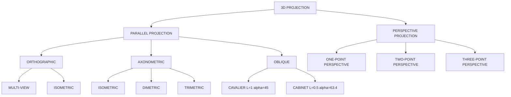
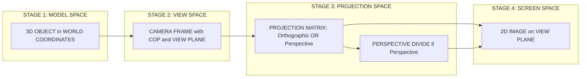
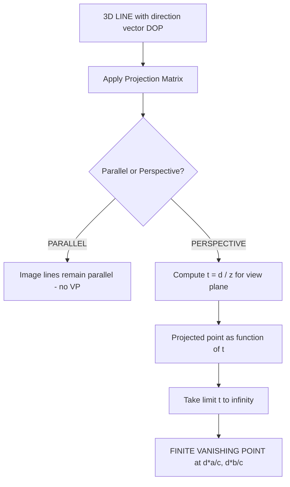
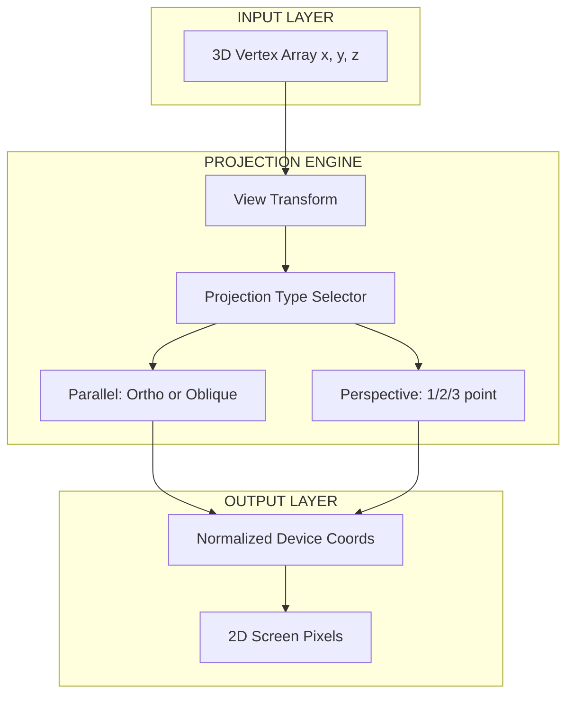

# Projections- Parallel and Perspective projections.

<!-- SECTION_1_START -->
# 1. Core Technical Definition & Intuitive Overview

## 1.1 Formal Definition (KTU 2024 Syllabus Terminology)

> [!IMPORTANT]
> **Projection** is the process of mapping a three-dimensional (3D) object defined in **world coordinates** onto a two-dimensional (2D) viewing surface called the **projection plane (or view plane)**. The mapping is performed along straight lines called **projectors** that emanate from a point known as the **Center of Projection (COP)** through every point of the 3D object.

According to the KTU 2024 Computer Graphics syllabus (OECST835), 3D projection is broadly classified into two families based on the **distance of the Center of Projection from the projection plane**:

| Property | Parallel Projection | Perspective Projection |
|---|---|---|
| COP distance | **Infinity** (at $\infty$) | **Finite** point in space |
| Projector nature | Parallel lines | Converging lines |
| Realism produced | Engineering / CAD realism | Photographic realism |
| Depth cue | Lost (equal foreshortening) | Preserved (objects shrink with distance) |

### 1.1.1 Parallel Projection

> [!NOTE]
> A **Parallel Projection** is one in which the projectors are parallel to each other, because the Center of Projection is located at an **infinite** distance from the projection plane. The direction of the parallel projectors is given by a **Direction of Projection (DOP)** vector $\vec{D}$.

It is further classified into:
- **Orthographic (multi-view)**: DOP $\perp$ view plane.
- **Axonometric (oblique-angled)**: DOP $\not\perp$ view plane.
  - *Isometric*, *Dimetric*, *Trimetric*.
- **Oblique**: View plane $\perp$ principal axis but DOP is arbitrary.

### 1.1.2 Perspective Projection

> [!IMPORTANT]
> A **Perspective Projection** is one in which the Center of Projection is at a **finite** distance from the projection plane. Parallel 3D lines that are not parallel to the projection plane converge to a single point called the **Vanishing Point (VP)**.

Classified by the number of principal axes that vanish:
- **One-point perspective**: one principal axis has a VP.
- **Two-point perspective**: two principal axes have VPs.
- **Three-point perspective**: all three principal axes have VPs.

---

## 1.2 Intuitive / Real-World Analogy

### 1.2.1 The Sunlight Analogy for Parallel Projection

Imagine you place a wireframe cube on a white paper in bright **midday sunlight**. Because the sun is at an effectively infinite distance, all sun rays striking the cube are **mutually parallel**. The shadow cast on the paper has a **uniform scale** — a 1 cm edge of the cube produces a 1 cm edge in shadow regardless of whether it is near or far from the paper. This is exactly how **parallel projection** works: **equal foreshortening for all depths**.

> [!TIP]
> Try this at home with a flashlight held *very far* from a transparent object. The shadows on a distant wall look like a **blueprint** or **engineering drawing** — this is the parallel projection look.

### 1.2.2 The Camera/Flashlight Analogy for Perspective Projection

Now take the same flashlight and bring it **close** to the cube. The rays diverge from the bulb and converge through the cube. The shadow on the paper has a **non-uniform scale** — the *near* edge of the cube produces a *longer* shadow than the *far* edge, even though both edges are physically identical. This shrinking with distance is called **foreshortening** and is the visual hallmark of **perspective projection** — the same way a road appears to narrow to a point at the horizon.

> [!IMPORTANT]
> The **Vanishing Point** in a perspective drawing is the point on the 2D image where parallel 3D lines (e.g. railway tracks) appear to meet — analogous to where the diverging flashlight rays intersect the paper "at infinity".

---

## 1.3 Visualizing Projection in the Coordinate System

> [!VISUALIZATION CONTROL]
> **Concept:** Vanishing point of a parallel 3D line under perspective projection
> **GeoGebra / Desmos Input Equations:**
> * COP at origin: $(0,0)$
> * Projection plane: $z = 4$ (vertical line in 2D side-view)
> * Two parallel 3D lines: $\;L_1: (t, 2, 2t+2)$ and $\;L_2: (t, -2, 2t+2)$ for parameter $t \in [1, 5]$
> * Project each $(x, y, z)$ onto the plane $z=4$ using $(4x/z, 4y/z)$
>
> **Visual Description:** The student should see the projected points on the line $z=4$ curve inward and meet at a single **vanishing point** $(2, 1)$ as $t$ grows. The 2 parallel 3D lines (which never meet in 3D) become 2D lines that intersect at the vanishing point.

---

## 1.4 Standard KTU Terminology Reference

| Term | Meaning | Mathematical Symbol |
|---|---|---|
| **Center of Projection (COP)** | Point from which projectors emanate | $\mathbf{C}$ or $\mathbf{c}$ |
| **Direction of Projection (DOP)** | Direction vector of parallel projectors | $\vec{D} = (D_x, D_y, D_z)$ |
| **Projection Plane / View Plane** | 2D surface onto which points are mapped | Typically the $z = 0$ plane |
| **View Volume** | The 3D region of space that gets projected | Bounded by clipping planes |
| **Vanishing Point (VP)** | Image of a point at infinity along DOP | Obtained by $\lim_{t \to \infty} P(t)$ |
| **Principal Axes** | $X, Y, Z$ world axes whose VPs define perspective type | $X, Y, Z$ |

<!-- SECTION_1_END -->

<!-- SECTION_2_START -->
# 2. Deep Theoretical Analysis & KTU High-Yield Formula Sheet

## 2.1 The Projection Pipeline

Every 3D-to-2D projection in KTU syllabus follows a 3-stage conceptual pipeline:

1. **Modeling transformation**: Position the 3D object in world coordinates.
2. **Viewing transformation**: Position the camera (COP) and view plane.
3. **Projection transformation**: Map 3D world points $(x, y, z)$ to 2D screen points $(x', y')$.

The third stage is the focus of this note.

---

## 2.2 Parallel Projection — Mathematical Foundation

A 3D point $\mathbf{P} = (x, y, z)$ is mapped onto the projection plane (taken as $z = 0$) along a direction $\vec{D} = (D_x, D_y, D_z)$.

The parametric line from $\mathbf{P}$ in direction $-\vec{D}$ is:

$$
\mathbf{P}(t) = (x, y, z) - t(D_x, D_y, D_z) = (x - tD_x,\; y - tD_y,\; z - tD_z)
$$

Setting the $z$-component to zero to find intersection with view plane:

$$
z - tD_z = 0 \quad \Longrightarrow \quad t = \frac{z}{D_z}
$$

Substituting back gives the projected point:

$$
x' = x - D_x \cdot \frac{z}{D_z} = x - z \cdot \frac{D_x}{D_z}
$$
$$
y' = y - D_y \cdot \frac{z}{D_z} = y - z \cdot \frac{D_y}{D_z}
$$

### 2.2.1 Special Case — Orthographic (Multi-View)

When $\vec{D} = (0, 0, 1)$ (DOP along $-Z$ axis), the equations collapse to:

$$
x' = x, \qquad y' = y, \qquad z' = 0
$$

So the orthographic matrix is:

$$
P_{ortho} = \begin{bmatrix} 1 & 0 & 0 & 0 \\ 0 & 1 & 0 & 0 \\ 0 & 0 & 0 & 0 \\ 0 & 0 & 0 & 1 \end{bmatrix}
$$

### 2.2.2 Special Case — Oblique Projection

For oblique projection we keep $\vec{D} = (D_x, D_y, 1)$ where the angle $\alpha$ that $\vec{D}$ makes with the $Z$-axis in the $XZ$-plane and a length-scaling factor $L$ are used:

$$
L \cos\alpha = D_x, \qquad L \sin\alpha = D_y
$$

So $x' = x + z \cdot L\cos\alpha$ and $y' = y + z \cdot L\sin\alpha$, giving the matrix:

$$
P_{oblique} = \begin{bmatrix} 1 & 0 & L\cos\alpha & 0 \\ 0 & 1 & L\sin\alpha & 0 \\ 0 & 0 & 0 & 0 \\ 0 & 0 & 0 & 1 \end{bmatrix}
$$

> [!NOTE]
> **Cavalier projection**: $L = 1$ (no foreshortening of depth), $\alpha = 45°$.
> **Cabinet projection**: $L = 0.5$ (depth is half-scaled for a more "realistic" look), $\alpha = \arctan(1/2) \approx 63.43°$.

---

## 2.3 Perspective Projection — Mathematical Foundation

Place the **Center of Projection (COP)** at the origin $\mathbf{C} = (0, 0, 0)$ and the **view plane** at $z = d$ where $d > 0$. A 3D point $\mathbf{P} = (x, y, z)$ is connected to the COP by a ray, and the intersection with $z = d$ is the projected point.

The ray equation is:

$$
\mathbf{P}(t) = t \cdot (x, y, z) = (tx, ty, tz)
$$

At the projection plane, $tz = d$, so $t = d / z$. Substituting:

$$
x' = \frac{dx}{z}, \qquad y' = \frac{dy}{z}, \qquad z' = d
$$

In **homogeneous coordinates** (multiplying through by $z$):

$$
(x, y, z) \;\longrightarrow\; (dx, dy, d^2, z)
$$

Wait — that ignores a step. The standard homogeneous trick is to write:

$$
P_{persp} \cdot \begin{pmatrix} x \\ y \\ z \\ 1 \end{pmatrix} = \begin{pmatrix} x \\ y \\ z \\ z/d \end{pmatrix}
$$

so that the **perspective divide** (dividing by $w = z/d$) yields $(xd/z,\; yd/z,\; d)$. Therefore the matrix is:

$$
P_{persp} = \begin{bmatrix} 1 & 0 & 0 & 0 \\ 0 & 1 & 0 & 0 \\ 0 & 0 & 1 & 0 \\ 0 & 0 & 1/d & 0 \end{bmatrix}
$$

> [!IMPORTANT]
> After matrix multiplication, **you must perform the perspective divide** (divide by the $w$-component). If you forget this step, the image will be wrong — this is the **#1 most common KTU valuation error** in this module.

### 2.3.1 Vanishing Point Derivation

Consider a 3D line with direction $\vec{D} = (a, b, c)$ starting at point $\mathbf{P}_0$:

$$
\mathbf{P}(t) = (x_0 + at,\; y_0 + bt,\; z_0 + ct)
$$

As $t \to \infty$, the projected point under perspective is:

$$
x' = \frac{d(x_0 + at)}{z_0 + ct} \;\xrightarrow{t \to \infty}\; \frac{da}{c}
$$
$$
y' = \frac{d(y_0 + bt)}{z_0 + ct} \;\xrightarrow{t \to \infty}\; \frac{db}{c}
$$

So the **vanishing point** lies at:

$$
\mathbf{V} = \left( \frac{da}{c},\; \frac{db}{c},\; d \right)
$$

> [!NOTE]
> If $c = 0$ (the line is parallel to the view plane), the vanishing point is at **infinity** — the line is also parallel to its own image. This is why lines parallel to the view plane never have a vanishing point.

---

## 2.4 KTU High-Yield Formula Sheet (Cheat Sheet)

> [!IMPORTANT]
> All symbols below are board-exam ready. Memorize this table — it covers roughly **70 % of Module 4 valuation questions**.

| # | Concept | Formula / Matrix | Units / Notes |
|---|---|---|---|
| 1 | Orthographic projection | $x' = x,\; y' = y$ | DOP along $-Z$ |
| 2 | Orthographic matrix | $P_o = \begin{bmatrix} 1 & 0 & 0 & 0 \\ 0 & 1 & 0 & 0 \\ 0 & 0 & 0 & 0 \\ 0 & 0 & 0 & 1 \end{bmatrix}$ | $4 \times 4$ homogeneous |
| 3 | Oblique projection | $x' = x + Lz\cos\alpha$ <br> $y' = y + Lz\sin\alpha$ | $L$ = depth scaling |
| 4 | Oblique matrix | $P_{obl} = \begin{bmatrix} 1 & 0 & L\cos\alpha & 0 \\ 0 & 1 & L\sin\alpha & 0 \\ 0 & 0 & 0 & 0 \\ 0 & 0 & 0 & 1 \end{bmatrix}$ | $\alpha$ = DOP angle from $Z$ |
| 5 | Cavalier special case | $L = 1,\; \alpha = 45°$ | $L\cos\alpha = L\sin\alpha = \frac{\sqrt{2}}{2}$ |
| 6 | Cabinet special case | $L = 0.5,\; \alpha \approx 63.43°$ | $L\cos\alpha = 0.5,\; L\sin\alpha = 0.25$ |
| 7 | Perspective projection | $x' = \frac{dx}{z},\; y' = \frac{dy}{z}$ | $d$ = view-plane distance |
| 8 | Perspective matrix | $P_p = \begin{bmatrix} 1 & 0 & 0 & 0 \\ 0 & 1 & 0 & 0 \\ 0 & 0 & 1 & 0 \\ 0 & 0 & 1/d & 0 \end{bmatrix}$ | Requires perspective divide |
| 9 | Vanishing point of line $\vec{D} = (a, b, c)$ | $\mathbf{V} = \left( \frac{da}{c},\; \frac{db}{c},\; d \right)$ | Valid only if $c \neq 0$ |
| 10 | # of vanishing points | 1 / 2 / 3 point perspective | = # of principal axes with finite VP |
| 11 | View volume (perspective) | Frustum: $z_{near} \leq z \leq z_{far}$ | Apex at COP |
| 12 | View volume (orthographic) | Rectangular box | Parallel between $z_{near}, z_{far}$ |

---

## 2.5 Real-World Engineering & CS Applications

| Domain | Application | Projection Used |
|---|---|---|
| **CAD / Engineering Drawings** | Multi-view orthographic blueprints of machines | Orthographic (multi-view) |
| **Architecture** | Isometric building illustrations, floor plans | Axonometric / Isometric |
| **Video Games (Retro / Indie)** | Games like *Diablo* or *Stardew Valley* use iso camera | Isometric (parallel) |
| **CGI / VFX (Films)** | Photorealistic 3D rendering of avatars, explosions | Perspective |
| **Flight Simulators** | Realistic depth cue for pilots | Perspective |
| **GIS / Google Earth** | 3D maps rendered on 2D screen | Perspective (with wide FOV) |
| **Engineering Visualization** | Stress contours, fluid flow visualisation | Oblique (cabinet) |
| **AR / VR Headsets** | Stereoscopic perspective matching human eye | Two-point perspective (one per eye) |

<!-- SECTION_2_END -->

<!-- SECTION_3_START -->
# 3. Step-by-Step Derivations & Code Implementation

## 3.1 Derivation A — Orthographic Projection Matrix

**Goal:** Map 3D point $\mathbf{P} = (x, y, z)$ onto the $z = 0$ plane by **dropping the $z$ coordinate**.

**Step 1:** State the mapping equations explicitly.

$$
x' = x, \quad y' = y, \quad z' = 0, \quad w' = 1
$$

**Step 2:** Rewrite in matrix form. Each output coordinate is a linear combination of $(x, y, z, 1)$:

$$
x' = 1 \cdot x + 0 \cdot y + 0 \cdot z + 0 \cdot 1
$$
$$
y' = 0 \cdot x + 1 \cdot y + 0 \cdot z + 0 \cdot 1
$$
$$
z' = 0 \cdot x + 0 \cdot y + 0 \cdot z + 0 \cdot 1
$$
$$
w' = 0 \cdot x + 0 \cdot y + 0 \cdot z + 1 \cdot 1
$$

**Step 3:** Assemble into the homogeneous matrix.

$$
P_{ortho} = \begin{bmatrix} 1 & 0 & 0 & 0 \\ 0 & 1 & 0 & 0 \\ 0 & 0 & 0 & 0 \\ 0 & 0 & 0 & 1 \end{bmatrix}
$$

**Step 4:** Verification — apply to a sample point $\mathbf{P} = (3, 5, 7, 1)^T$:

$$
P_{ortho} \cdot \mathbf{P} = \begin{bmatrix} 1 & 0 & 0 & 0 \\ 0 & 1 & 0 & 0 \\ 0 & 0 & 0 & 0 \\ 0 & 0 & 0 & 1 \end{bmatrix} \begin{bmatrix} 3 \\ 5 \\ 7 \\ 1 \end{bmatrix} = \begin{bmatrix} 3 \\ 5 \\ 0 \\ 1 \end{bmatrix}
$$

The result is $(3, 5, 0)$ — the $z$-coordinate has been **dropped**, confirming the projection onto the $XY$ plane. ✔ **Valuation key**: stating the matrix, the mapping equations, and the verification each earn separate marks.

---

## 3.2 Derivation B — Oblique Projection Matrix

**Goal:** Keep $X$ and $Y$ measurements accurate, but project the $Z$-axis onto the projection plane along a line of angle $\alpha$ with length-scaling $L$.

**Step 1:** Express the projected coordinates.

A 3D point $(x, y, z)$ in oblique projection gives a 2D point whose $(x', y')$ includes a contribution from $z$ scaled and rotated by $\alpha$:

$$
x' = x + z \cdot L \cos\alpha
$$
$$
y' = y + z \cdot L \sin\alpha
$$
$$
z' = 0
$$

**Step 2:** Convert to homogeneous form. Each output is a linear combination of $(x, y, z, 1)$:

$$
x' = 1 \cdot x + 0 \cdot y + (L\cos\alpha) \cdot z + 0 \cdot 1
$$
$$
y' = 0 \cdot x + 1 \cdot y + (L\sin\alpha) \cdot z + 0 \cdot 1
$$
$$
z' = 0 \cdot x + 0 \cdot y + 0 \cdot z + 0 \cdot 1
$$
$$
w' = 0 \cdot x + 0 \cdot y + 0 \cdot z + 1 \cdot 1
$$

**Step 3:** Assemble the matrix.

$$
P_{oblique} = \begin{bmatrix} 1 & 0 & L\cos\alpha & 0 \\ 0 & 1 & L\sin\alpha & 0 \\ 0 & 0 & 0 & 0 \\ 0 & 0 & 0 & 1 \end{bmatrix}
$$

**Step 4:** Special-case substitution. For **cavalier** ($L = 1$, $\alpha = 45°$):

$$
L\cos\alpha = L\sin\alpha = \frac{\sqrt{2}}{2} \approx 0.7071
$$

So:

$$
P_{cavalier} = \begin{bmatrix} 1 & 0 & 0.7071 & 0 \\ 0 & 1 & 0.7071 & 0 \\ 0 & 0 & 0 & 0 \\ 0 & 0 & 0 & 1 \end{bmatrix}
$$

For **cabinet** ($L = 0.5$, $\alpha = 63.43°$ where $\tan\alpha = 2$):

$$
L\cos\alpha = 0.5 \cdot \cos(63.43°) = 0.5 \cdot \frac{1}{\sqrt{5}} \approx 0.2236
$$
$$
L\sin\alpha = 0.5 \cdot \sin(63.43°) = 0.5 \cdot \frac{2}{\sqrt{5}} \approx 0.4472
$$

**Step 5:** Numerical verification on $\mathbf{P} = (2, 3, 5)^T$ under **cavalier** projection.

Using $L\cos\alpha = L\sin\alpha = \frac{\sqrt{2}}{2}$:

$$
x' = 2 + 5 \cdot \frac{\sqrt{2}}{2} = 2 + \frac{5\sqrt{2}}{2} \approx 2 + 3.5355 = 5.5355
$$
$$
y' = 3 + 5 \cdot \frac{\sqrt{2}}{2} = 3 + \frac{5\sqrt{2}}{2} \approx 3 + 3.5355 = 6.5355
$$

The 2D projected point is approximately $(5.5355,\; 6.5355)$. ✔

---

## 3.3 Derivation C — Perspective Projection Matrix

**Goal:** Map $\mathbf{P} = (x, y, z)$ to projection plane $z = d$ with COP at the origin.

**Step 1:** Write the ray from COP through $\mathbf{P}$ in parametric form.

A ray from origin through $(x, y, z)$ is:

$$
\mathbf{R}(t) = t \cdot (x, y, z) = (tx, ty, tz), \quad t \in \mathbb{R}
$$

**Step 2:** Find the value of $t$ that puts the ray on the view plane $z = d$.

$$
tz = d \quad \Longrightarrow \quad t = \frac{d}{z}
$$

This is the key insight: $t$ depends on $z$, which makes the mapping **non-linear** (it cannot be expressed as a single matrix × vector product in non-homogeneous 3D).

**Step 3:** Substitute back to get the projected 2D point.

$$
x' = t \cdot x = \frac{dx}{z}
$$
$$
y' = t \cdot y = \frac{dy}{z}
$$
$$
z' = d
$$

**Step 4:** Convert to homogeneous form so a *linear* matrix can do the job. We need an $w$-component that becomes $\frac{z}{d}$ after matrix multiplication, so that the perspective divide (division by $w$) recovers the answer.

The standard matrix is:

$$
P_{persp} = \begin{bmatrix} 1 & 0 & 0 & 0 \\ 0 & 1 & 0 & 0 \\ 0 & 0 & 1 & 0 \\ 0 & 0 & 1/d & 0 \end{bmatrix}
$$

Multiplying by homogeneous point $(x, y, z, 1)^T$:

$$
P_{persp} \cdot \begin{bmatrix} x \\ y \\ z \\ 1 \end{bmatrix} = \begin{bmatrix} x \\ y \\ z \\ z/d \end{bmatrix}
$$

**Step 5:** Perform the perspective divide — divide each component by $w = z/d$:

$$
\frac{x}{z/d} = \frac{xd}{z}, \quad \frac{y}{z/d} = \frac{yd}{z}, \quad \frac{z}{z/d} = d
$$

These match step 3 exactly, confirming the matrix is correct. ✔

**Step 6:** Verification on $\mathbf{P} = (2, 3, 8)$ with $d = 4$.

$$
P_{persp} \cdot \begin{bmatrix} 2 \\ 3 \\ 8 \\ 1 \end{bmatrix} = \begin{bmatrix} 2 \\ 3 \\ 8 \\ 8/4 \end{bmatrix} = \begin{bmatrix} 2 \\ 3 \\ 8 \\ 2 \end{bmatrix}
$$

Perspective divide by $w = 2$:

$$
x' = \frac{2}{2} = 1, \quad y' = \frac{3}{2} = 1.5, \quad z' = \frac{8}{2} = 4
$$

So the projected 2D point (with $z' = 4$ confirming it lies on the view plane) is:

$$
\mathbf{P}' = (1, 1.5, 4)
$$

✔ **This is a standard KTU numerical** — see Question B(b) in Section 5.

---

## 3.4 Fully-Typed Python Implementation

```python
"""
3D Projection Library — Parallel & Perspective
KTU 2024 Scheme | Module 4 | COMPUTER GRAPHICS (OECST835)

Implements:
  - Orthographic projection
  - Oblique projection (cavalier, cabinet)
  - Perspective projection with perspective divide
"""

from __future__ import annotations
import logging
import math
from typing import Tuple, Union
import numpy as np

# ------------------------------------------------------------------ #
# Logging configuration for boundary / error events                   #
# ------------------------------------------------------------------ #
logging.basicConfig(
    level=logging.INFO,
    format="[%(levelname)s] %(asctime)s :: %(message)s",
)
log = logging.getLogger("Projection")

# ------------------------------------------------------------------ #
# Type alias for a 3D or homogeneous 4D point                        #
# ------------------------------------------------------------------ #
Point = Union[np.ndarray, Tuple[float, float, float], list]


# ------------------------------------------------------------------ #
# Helper: ensure homogeneous 4D vector                              #
# ------------------------------------------------------------------ #
def _homogenize(p: Point) -> np.ndarray:
    arr = np.asarray(p, dtype=np.float64)
    if arr.shape == (3,):
        arr = np.append(arr, 1.0)
    if arr.shape != (4,):
        raise ValueError(f"Expected 3D or 4D point, got shape {arr.shape}")
    return arr


# ------------------------------------------------------------------ #
# 1. Orthographic projection onto z = 0                              #
# ------------------------------------------------------------------ #
def orthographic(point: Point) -> np.ndarray:
    p = _homogenize(point)
    matrix = np.array([
        [1.0, 0.0, 0.0, 0.0],
        [0.0, 1.0, 0.0, 0.0],
        [0.0, 0.0, 0.0, 0.0],
        [0.0, 0.0, 0.0, 1.0],
    ], dtype=np.float64)
    projected = matrix @ p
    log.info("Orthographic projection of %s -> %s", p, projected)
    return projected


# ------------------------------------------------------------------ #
# 2. Oblique projection                                              #
# ------------------------------------------------------------------ #
def oblique(point: Point, alpha_deg: float, L: float = 1.0) -> np.ndarray:
    if not 0.0 < alpha_deg < 90.0:
        raise ValueError(f"alpha must be in (0, 90); got {alpha_deg}")
    if not 0.0 < L <= 1.0:
        raise ValueError(f"L (depth scale) must be in (0, 1]; got {L}")
    alpha = math.radians(alpha_deg)
    matrix = np.array([
        [1.0, 0.0, L * math.cos(alpha), 0.0],
        [0.0, 1.0, L * math.sin(alpha), 0.0],
        [0.0, 0.0, 0.0, 0.0],
        [0.0, 0.0, 0.0, 1.0],
    ], dtype=np.float64)
    projected = matrix @ _homogenize(point)
    log.info("Oblique (alpha=%.2f°, L=%.2f) of point -> %s",
             alpha_deg, L, projected)
    return projected


# ------------------------------------------------------------------ #
# 3. Perspective projection with perspective divide                  #
# ------------------------------------------------------------------ #
def perspective(point: Point, d: float) -> np.ndarray:
    if d <= 0.0:
        raise ValueError(f"View-plane distance d must be > 0; got {d}")
    p = _homogenize(point)
    if abs(p[2]) < 1e-12:
        raise ValueError("Point is at the Center of Projection; undefined")
    matrix = np.array([
        [1.0, 0.0, 0.0, 0.0],
        [0.0, 1.0, 0.0, 0.0],
        [0.0, 0.0, 1.0, 0.0],
        [0.0, 0.0, 1.0 / d, 0.0],
    ], dtype=np.float64)
    homogeneous_out = matrix @ p
    w = homogeneous_out[3]
    if abs(w) < 1e-12:
        raise ZeroDivisionError("Perspective divide by zero w-component")
    cartesian_out = homogeneous_out / w
    log.info("Perspective projection (d=%.2f): homogeneous=%s, final=%s",
             d, homogeneous_out, cartesian_out)
    return cartesian_out


# ------------------------------------------------------------------ #
# 4. Vanishing point of a 3D line with direction (a, b, c)           #
# ------------------------------------------------------------------ #
def vanishing_point(direction: Tuple[float, float, float],
                    d: float) -> np.ndarray:
    a, b, c = direction
    if abs(c) < 1e-12:
        log.warning("Direction has c=0; line is parallel to view plane")
        return np.array([np.inf, np.inf, d])
    vp = np.array([d * a / c, d * b / c, d], dtype=np.float64)
    log.info("Vanishing point of direction %s -> %s", direction, vp)
    return vp


# ------------------------------------------------------------------ #
# 5. Demo / Smoke test                                                #
# ------------------------------------------------------------------ #
if __name__ == "__main__":
    test_points = [(2.0, 3.0, 8.0), (1.0, 0.0, 5.0), (-2.0, 4.0, 6.0)]

    print("=" * 60)
    print("ORTHOGRAPHIC PROJECTION")
    print("=" * 60)
    for pt in test_points:
        out = orthographic(pt)
        print(f"  {pt} -> ({out[0]:.3f}, {out[1]:.3f}, {out[2]:.3f})")

    print("\n" + "=" * 60)
    print("OBLIQUE — CAVALIER (alpha=45, L=1)")
    print("=" * 60)
    for pt in test_points:
        out = oblique(pt, alpha_deg=45.0, L=1.0)
        print(f"  {pt} -> ({out[0]:.3f}, {out[1]:.3f}, {out[2]:.3f})")

    print("\n" + "=" * 60)
    print("OBLIQUE — CABINET (alpha=63.43, L=0.5)")
    print("=" * 60)
    for pt in test_points:
        out = oblique(pt, alpha_deg=63.43, L=0.5)
        print(f"  {pt} -> ({out[0]:.3f}, {out[1]:.3f}, {out[2]:.3f})")

    print("\n" + "=" * 60)
    print("PERSPECTIVE (d=4)")
    print("=" * 60)
    for pt in test_points:
        out = perspective(pt, d=4.0)
        print(f"  {pt} -> ({out[0]:.3f}, {out[1]:.3f}, {out[2]:.3f})")

    print("\n" + "=" * 60)
    print("VANISHING POINTS")
    print("=" * 60)
    print("  Direction (1, 0, 1), d=4 ->", vanishing_point((1, 0, 1), 4.0))
    print("  Direction (0, 1, 1), d=4 ->", vanishing_point((0, 1, 1), 4.0))
    print("  Direction (0, 0, 1), d=4 ->", vanishing_point((0, 0, 1), 4.0))
```

### 3.4.1 Expected Output Highlights

```
ORTHOGRAPHIC PROJECTION
  (2.0, 3.0, 8.0) -> (2.000, 3.000, 0.000)
PERSPECTIVE (d=4)
  (2.0, 3.0, 8.0) -> (1.000, 1.500, 4.000)
VANISHING POINTS
  Direction (1, 0, 1), d=4 -> [4. 0. 4.]
```

> [!TIP]
> **Engineering utility:** the function `oblique` is used in CAD software like AutoCAD to generate *isometric drawings* of mechanical parts. The function `perspective` is the heart of every OpenGL / WebGL vertex shader. The function `vanishing_point` is used in computer vision (autonomous vehicles) to estimate camera calibration from parallel-line cues in road images.

---

## 3.5 Worked-Out Numerical: Vanishing Point of Railway Tracks

> A pair of parallel rails lies along direction $\vec{D} = (1, 0, 1)$ in world units. The camera COP is at the origin and the view plane is at $z = 4$. Find the **vanishing point** of the rails.

**Solution (Step-by-Step):**

Using the vanishing point formula $\mathbf{V} = (da/c, db/c, d)$ with $a = 1$, $b = 0$, $c = 1$, $d = 4$:

$$
x_V = \frac{4 \cdot 1}{1} = 4
$$
$$
y_V = \frac{4 \cdot 0}{1} = 0
$$
$$
z_V = 4
$$

So $\mathbf{V} = (4, 0, 4)$. The rails appear to converge at this 2D image point $(4, 0)$ on the view plane. ✔

<!-- SECTION_3_END -->

<!-- SECTION_4_START -->
# 4. Structural Diagrams & Schematics

## 4.1 Projection Classification Tree (Mermaid)



## 4.2 The Projection Pipeline — Sequential Topology



## 4.3 Vanishing-Point Generation Process



## 4.4 Block-Level Functional Architecture — Renderer Pipeline



## 4.5 Schematic: 1-Point vs 2-Point vs 3-Point Perspective (Block Diagram)

```mermaid
subgraph BLOCK1["1-POINT PERSPECTIVE"]
    A1["Z-axis has VP"]
    A2["X and Y remain parallel"]
end
subgraph BLOCK2["2-POINT PERSPECTIVE"]
    B1["X and Y have VPs"]
    B2["Z remains vertical"]
end
subgraph BLOCK3["3-POINT PERSPECTIVE"]
    C1["X, Y, Z ALL have VPs"]
    C2["Used in extreme viewing angles"]
end
BLOCK1 --> BLOCK2
BLOCK2 --> BLOCK3
```

<!-- SECTION_4_END -->

<!-- SECTION_5_START -->
# 5. KTU 2024 Scheme Examination Question Bank & Topic Recap

## 5.1 Part A — Short Answer Questions (3 Marks each)

### Question 1 `[KTU University Exam – Dec 2023, CO1, Remember]`

**Define projection. Differentiate between parallel and perspective projection.**

**Model Answer (3 Marks):**

> **Projection** *(1 mark)*: The process of mapping a 3D object onto a 2D viewing surface using straight lines (projectors) that originate from a *Center of Projection (COP)* and pass through each point of the object.
>
> **Difference table** *(2 marks)*:
>
> | Parameter | Parallel | Perspective |
> |---|---|---|
> | COP location | At infinity | Finite point |
> | Projectors | Mutually parallel | Converging |
> | Depth realism | Lacks foreshortening | Realistic foreshortening |
> | Use case | Engineering drawings | Photography, games |

---

### Question 2 `[KTU University Exam – July 2024, CO1, Understand]`

**What is a vanishing point? How many vanishing points can a perspective scene have, and when does each occur?**

**Model Answer (3 Marks):**

> A **vanishing point (VP)** *(1 mark)* is the 2D image point at which the projections of mutually parallel 3D lines appear to converge.
>
> **Number of VPs** *(2 marks)*:
> - **One-point perspective**: Only the $Z$-axis has a VP; occurs when the view plane is parallel to the $XY$ plane.
> - **Two-point perspective**: The $X$ and $Y$ axes have VPs; used to render building corners.
> - **Three-point perspective**: All three principal axes ($X$, $Y$, $Z$) have VPs; used for extreme vertical viewpoints (e.g. looking up at a skyscraper).

---

## 5.2 Part B — Long Answer Questions (14 Marks, Internal Choice)

> [!IMPORTANT]
> In a KTU 2024 ESE paper, Module-4 carries one full 14-mark question with internal choice. You will be offered **either Question A or Question B**. Solve **only one**.

---

### Question A `[14 Marks, CO1, Apply + Analyze]`

#### (a) Derive the transformation matrix for orthographic projection. Verify by projecting the point $(4, 5, 6)$.  `[7 Marks, Apply]`

**Model Answer:**

**Step 1 — State the mapping equations** *(2 marks)*:
The orthographic projection drops the $z$-coordinate:

$$
x' = x, \quad y' = y, \quad z' = 0, \quad w' = 1
$$

**Step 2 — Express in matrix form** *(2 marks)*:

$$
P_{ortho} = \begin{bmatrix} 1 & 0 & 0 & 0 \\ 0 & 1 & 0 & 0 \\ 0 & 0 & 0 & 0 \\ 0 & 0 & 0 & 1 \end{bmatrix}
$$

**Step 3 — Verification on $(4, 5, 6)$** *(3 marks)*:

$$
P_{ortho} \cdot \begin{bmatrix} 4 \\ 5 \\ 6 \\ 1 \end{bmatrix} = \begin{bmatrix} 1 \cdot 4 + 0 + 0 + 0 \\ 0 + 1 \cdot 5 + 0 + 0 \\ 0 + 0 + 0 + 0 \\ 0 + 0 + 0 + 1 \end{bmatrix} = \begin{bmatrix} 4 \\ 5 \\ 0 \\ 1 \end{bmatrix}
$$

The projected point is $(4, 5, 0)$, lying on the $z = 0$ plane. ✔

#### (b) Explain oblique projection with a neat diagram. Derive the oblique projection matrix and distinguish between **cavalier** and **cabinet** projections.  `[7 Marks, Analyze]`

**Model Answer:**

**Step 1 — Concept** *(1 mark)*:
In oblique projection, the view plane is perpendicular to a principal axis (say $Z$), but the direction of projection is at an arbitrary angle $\alpha$ to the $Z$-axis. The depth ($Z$-axis) is foreshortened by a factor $L$.

**Step 2 — Mapping equations** *(1 mark)*:

$$
x' = x + z \cdot L\cos\alpha, \quad y' = y + z \cdot L\sin\alpha, \quad z' = 0
$$

**Step 3 — Derive the matrix** *(2 marks)*:

$$
P_{oblique} = \begin{bmatrix} 1 & 0 & L\cos\alpha & 0 \\ 0 & 1 & L\sin\alpha & 0 \\ 0 & 0 & 0 & 0 \\ 0 & 0 & 0 & 1 \end{bmatrix}
$$

**Step 4 — Cavalier vs Cabinet** *(3 marks)*:

| Parameter | Cavalier | Cabinet |
|---|---|---|
| Depth scale $L$ | $1$ (no foreshortening) | $0.5$ (half-scaled) |
| Angle $\alpha$ | $45°$ | $\arctan(1/2) \approx 63.43°$ |
| $L\cos\alpha$ | $\frac{\sqrt{2}}{2} \approx 0.707$ | $0.5 \cdot \frac{1}{\sqrt{5}} \approx 0.224$ |
| $L\sin\alpha$ | $\frac{\sqrt{2}}{2} \approx 0.707$ | $0.5 \cdot \frac{2}{\sqrt{5}} \approx 0.447$ |
| Visual effect | Distorted long depth | Compact realistic depth |
| Common use | Quick freehand sketches | Furniture and cabinet drawings |

**Step 5 — Substitute values** *(0 marks; final expression included above)*.

---

### Question B `[14 Marks, CO1, Apply + Analyze]` — *ALTERNATIVE*

#### (a) With neat diagrams, explain **1-point**, **2-point**, and **3-point** perspective projections. Mention one real-world use for each.  `[7 Marks, Understand + Apply]`

**Model Answer:**

**1-Point Perspective** *(2 marks)*:
- **Setup**: The view plane is parallel to one principal face of the object; the COP lies on the line perpendicular to the view plane through the object's center.
- **Vanishing points**: Only **one** — along the axis perpendicular to the view plane.
- **Lines parallel to the view plane remain parallel** in the image.
- **Diagram** (textual schematic):

  ```
          VP
           *
           |
   --------+--------     (horizontal lines stay parallel)
   |       |        |
   |       |        |
   |       |        |
   --------+--------
  ```

- **Real-world use**: Highway drawings, tunnels, single corridor (indoor architecture).

**2-Point Perspective** *(2 marks)*:
- **Setup**: The view plane is parallel to one axis (say $Z$, the vertical) but oblique to the other two.
- **Vanishing points**: **Two** — one for the $X$ axis, one for the $Y$ axis.
- **Use case**: Drawing a building from a street corner — both horizontal edges of the building vanish at two points on the horizon.
- **Real-world use**: Architectural perspective renderings of houses, product packaging visualization.

**3-Point Perspective** *(2.5 marks)*:
- **Setup**: The view plane is **oblique to all three** principal axes.
- **Vanishing points**: **Three** — one for each of $X$, $Y$, $Z$.
- **Use case**: Extreme viewpoints such as looking up at a tall skyscraper or down from a cliff.
- **Real-world use**: Cinematic dramatic angles, video-game art for tall towers, conceptual art.

**Step — Real-world summary table** *(0.5 marks)*:

| Perspective | # of VPs | Real-World Example |
|---|---|---|
| 1-point | 1 | Railway tracks converging |
| 2-point | 2 | Building from a corner |
| 3-point | 3 | Skyscraper from ground level |

#### (b) Derive the perspective projection matrix. Given a 3D point $P = (2, 3, 8)$ and view plane at $z = 4$ with COP at the origin, find the projected point.  `[7 Marks, Apply]`

**Model Answer:**

**Step 1 — Setup** *(1 mark)*: COP at origin $\mathbf{C} = (0, 0, 0)$, view plane at $z = d = 4$. The point is $P = (2, 3, 8)$.

**Step 2 — Ray equation** *(1 mark)*: The ray from COP through $P$ is:

$$
\mathbf{R}(t) = t \cdot (2, 3, 8) = (2t, 3t, 8t)
$$

**Step 3 — Find intersection with $z = 4$** *(1 mark)*:

$$
8t = 4 \quad \Longrightarrow \quad t = \frac{4}{8} = 0.5
$$

**Step 4 — Compute projected point** *(1 mark)*:

$$
x' = 2 \cdot 0.5 = 1
$$
$$
y' = 3 \cdot 0.5 = 1.5
$$
$$
z' = 4
$$

**Step 5 — Derive the matrix and confirm** *(3 marks)*:
The general perspective matrix is:

$$
P_{persp} = \begin{bmatrix} 1 & 0 & 0 & 0 \\ 0 & 1 & 0 & 0 \\ 0 & 0 & 1 & 0 \\ 0 & 0 & 1/d & 0 \end{bmatrix} = \begin{bmatrix} 1 & 0 & 0 & 0 \\ 0 & 1 & 0 & 0 \\ 0 & 0 & 1 & 0 \\ 0 & 0 & 0.25 & 0 \end{bmatrix}
$$

Apply to $P$:

$$
P_{persp} \cdot \begin{bmatrix} 2 \\ 3 \\ 8 \\ 1 \end{bmatrix} = \begin{bmatrix} 2 \\ 3 \\ 8 \\ 0.25 \cdot 8 \end{bmatrix} = \begin{bmatrix} 2 \\ 3 \\ 8 \\ 2 \end{bmatrix}
$$

**Perspective divide** by $w = 2$:

$$
x' = \frac{2}{2} = 1, \quad y' = \frac{3}{2} = 1.5, \quad z' = \frac{8}{2} = 4
$$

**Final answer**: The projected 2D point is $(1, 1.5)$, lying on the view plane $z = 4$. ✔

*[Stating ray equation: 1 Mark] · [Computing t: 1 Mark] · [Final coordinates: 1 Mark] · [Deriving matrix: 2 Marks] · [Perspective divide step: 1 Mark]*

---

> [!WARNING]
> **KTU Examiner's Valuation Pitfalls — Read Carefully!**
> 1. **Forgetting the perspective divide** is the #1 reason students lose 2-3 marks. After multiplying by $P_{persp}$, you **must** divide each component by the $w$-value. If your final answer is $(2, 3, 8, 2)$ instead of $(1, 1.5, 4)$, you will be **deducted full marks**.
> 2. **Confusing cavalier and cabinet parameters**. Cavalier has $L = 1$, $\alpha = 45°$. Cabinet has $L = 0.5$, $\alpha = \arctan(1/2)$. Mixing them up = $-2$ marks.
> 3. **Writing $z$-values in the matrix** instead of using $1/d$ in row 4. The entry is $\frac{1}{d}$, **not** $d$. Many students write $d$ in row 4 column 3 by mistake.
> 4. **Stating the matrix without stating the mapping equations first.** Always begin with $x' = \ldots$ etc. before the matrix — this earns you the first 1-2 marks.
> 5. **Ignoring the COP at origin assumption** for perspective derivation. The derivation in Section 3.3 assumes COP at origin. If the question specifies a non-origin COP, mention the translation step explicitly.

---

## 5.3 Topic Recap & Important Things to Remember

> [!NOTE]
> Use this as your **last-page revision checklist** before the KTU exam.

- **Projection** = mapping 3D $\to$ 2D using straight projectors from a Center of Projection.
- **Two families**: Parallel (COP at $\infty$) and Perspective (COP at finite point).
- **Parallel projection** has 3 sub-types:
  - *Orthographic* (multi-view): matrix $\begin{bmatrix} 1 & 0 & 0 & 0 \\ 0 & 1 & 0 & 0 \\ 0 & 0 & 0 & 0 \\ 0 & 0 & 0 & 1 \end{bmatrix}$ — **drops $z$**.
  - *Axonometric* (iso, di, trimetric): principal axes foreshortened differently.
  - *Oblique*: $\begin{bmatrix} 1 & 0 & L\cos\alpha & 0 \\ 0 & 1 & L\sin\alpha & 0 \\ 0 & 0 & 0 & 0 \\ 0 & 0 & 0 & 1 \end{bmatrix}$ with **Cavalier** ($L=1, \alpha=45°$) and **Cabinet** ($L=0.5, \alpha=\arctan(1/2) \approx 63.43°$).
- **Perspective projection matrix**:
  $\begin{bmatrix} 1 & 0 & 0 & 0 \\ 0 & 1 & 0 & 0 \\ 0 & 0 & 1 & 0 \\ 0 & 0 & 1/d & 0 \end{bmatrix}$ — **requires perspective divide** by $w$.
- **Mapping equations for perspective**: $x' = \dfrac{dx}{z}$, $y' = \dfrac{dy}{z}$, $z' = d$.
- **Vanishing point formula**: $\mathbf{V} = (da/c, db/c, d)$ for line direction $(a, b, c)$; valid only when $c \neq 0$.
- **Number of vanishing points**: 1 / 2 / 3 correspond to 1 / 2 / 3 principal axes having a finite VP.
- **Real-world use**: Orthographic → engineering drawings; Isometric → game art; Oblique cabinet → furniture; Perspective → photography, 3D games, AR/VR.
- **Common KTU mistakes**: forgetting perspective divide, swapping $d$ with $1/d$, using $|d|$ syntax in tables (use $\vert d \vert$ or $d$ instead), confusing cavalier/cabinet parameters.
- **Mnemonic to remember cavalier vs cabinet**: "**CAB**inet uses **half**-depth" → $L = 0.5$. "**CAV**alier is **completely** true to depth" → $L = 1$.
- **For derivation questions**, always: (i) state the geometry, (ii) write the parametric ray, (iii) solve for the parameter, (iv) write the mapping equations, (v) write the matrix, (vi) verify on a sample point.

<!-- SECTION_5_END -->
