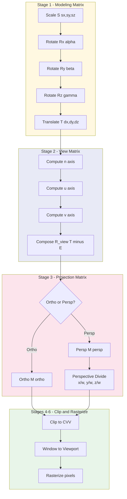

# Three dimensional graphics - Three dimensional viewing pipeline.

<!-- SECTION_1_START -->
# 3D Viewing Pipeline — Foundations & Intuition

> [!IMPORTANT]
> **KTU 2024 Scheme | OECST835 — Computer Graphics | Module 4**
> This module carries **CO3 (Apply 3D transformations and viewing techniques to generate realistic 3D scenes)**. The 3D viewing pipeline is a high-yield ESE topic — it is almost always a full 14-mark question in university examinations.

## 1.1 Formal Academic Definition

The **3D Viewing Pipeline** (also called the **3D Viewing Transformation Pipeline** or **Graphics Viewing Sequence**) is the ordered sequence of geometric transformations that convert a **3D object description stored in World Coordinates (WC)** into a **2D image on a display device expressed in Device Coordinates (DC)**, while preserving the illusion of depth and realism. The pipeline is implemented as a cascade of affine and perspective transformations:

$$\boxed{P_{\text{device}} = M_{\text{viewport}} \cdot M_{\text{clip}} \cdot M_{\text{proj}} \cdot M_{\text{view}} \cdot M_{\text{model}} \cdot P_{\text{world}}}$$

where each $M_i$ is a $4 \times 4$ homogeneous transformation matrix acting on a column vector $P = (x,\,y,\,z,\,1)^T$.

> [!NOTE]
> **Why Homogeneous Coordinates?**
> In standard $(x,y,z)$ 3-vectors, translation cannot be expressed as a linear map (matrix multiplication). By appending $w=1$ and using $4 \times 4$ matrices, **translation, rotation, scaling, shearing, and perspective foreshortening are unified under a single matrix product**. This is the reason every stage of the 3D pipeline is computed as a matrix multiplication.

## 1.2 Stages at a Glance

| Stage # | Transformation | From | To |
|:---:|---|---|---|
| 1 | Modeling | Local (Object) Coordinates | World Coordinates (WC) |
| 2 | Viewing (Viewing Transform) | WC | Viewing Coordinates (VC) |
| 3 | Projection | VC | Clip / Normalized Device Coordinates (NDC) |
| 4 | Clipping (Logical) | NDC | Canonical Volume |
| 5 | Window-to-Viewport / Viewport | NDC | Device Coordinates (DC) |
| 6 | Rasterization | DC | Pixels on screen |

> [!NOTE]
> **Canonical View Volume (CVV):**
> For **orthographic/parallel** pipelines the CVV is the unit cube $-1 \le x,y,z \le 1$.
> For **perspective** pipelines the CVV is the **frustum-to-cube mapping**: $x,y,z \in [-1,1]$ with $w \in (0,1]$, followed by a perspective divide.

## 1.3 Conceptual Analogy — The "Virtual Cameraman" Model

Imagine you are **shooting a 3D stop-motion movie** on a small set:

1. **Modeling** → You assemble a clay dinosaur on a tabletop. The "tabletop" is your *World*; the dinosaur's own "bone-frame" is its *local* coordinates.
2. **Viewing** → You place a camera in the room and rotate/translate it to point at the dinosaur. The camera now has its own $(u,v,n)$ coordinate frame — this is the *Viewing Coordinate System (VCS)*.
3. **Projection** → The camera's lens collapses the 3D scene onto a 2D film plane. Depending on the lens, the projection is *parallel* (telephoto — no foreshortening) or *perspective* (wide-angle — far things shrink).
4. **Clipping** → Anything outside the camera's field-of-view is cut away — only the visible portion of the scene is processed.
5. **Viewport Mapping** → The developed photo is printed at a particular size on paper (the *viewport*) and hung on a wall (the *display device*).
6. **Rasterization** → The printer lays down ink dots (pixels) row by row.

> [!VISUALIZATION CONTROL]
> **Concept:** Live transformation of a unit cube through the entire 3D viewing pipeline.
> **GeoGebra / Desmos Input (manual tracing):**
> * Plot world points: `A=(2,1,3)`, `B=(3,1,3)`, `C=(3,2,3)`, `D=(2,2,3)` (front face)
> * Apply rotation by $\theta = 30^\circ$ about Y-axis, then translate so camera looks at origin from $(0,0,5)$.
> * Apply perspective projection with $d=4$.
> **Visual Description:** Observe that the back face appears smaller than the front face after the perspective divide — this is the geometric signature of depth.
<!-- SECTION_1_END -->

<!-- SECTION_2_START -->
# Deep Theoretical Analysis — The Six-Stage Pipeline

> [!IMPORTANT]
> In KTU valuation, examiners expect every stage to be drawn as a **labeled block diagram** with input/output coordinate system, the operation performed, and the matrix form. Memorize the matrix for **each stage** in canonical form.

## 2.1 Stage 1 — Modeling Transformation (Local $\rightarrow$ World)

The **Modeling Transformation** repositions an object from its *own local coordinate frame* (e.g., the centre of a wheel, the joint of a robot arm) into the *global World Coordinate* system. The composite matrix is:

$$M_{\text{model}} = T(d_x,d_y,d_z) \cdot R_z(\gamma) \cdot R_y(\beta) \cdot R_x(\alpha) \cdot S(s_x,s_y,s_z)$$

$$M_{\text{model}} = \begin{bmatrix} s_x\,c_\beta\,c_\gamma & s_x\,(c_\alpha s_\gamma + s_\alpha s_\beta c_\gamma) & s_x\,(s_\alpha s_\gamma - c_\alpha s_\beta c_\gamma) & d_x \\ -s_y\,c_\beta\,s_\gamma & s_y\,(c_\alpha c_\gamma - s_\alpha s_\beta s_\gamma) & s_y\,(s_\alpha c_\gamma + c_\alpha s_\beta s_\gamma) & d_y \\ s_z\,s_\beta & s_z\,(s_\alpha c_\beta) & s_z\,(c_\alpha c_\beta) & d_z \\ 0 & 0 & 0 & 1 \end{bmatrix}$$

> **Why this order (right-to-left) is mandatory:** Scale first (intrinsic to the object), then rotate (about the now-scaled object's axes), then translate. Reversing this order produces visibly wrong shapes.

## 2.2 Stage 2 — Viewing Transformation (World $\rightarrow$ View/Camera)

The viewing transform places the *camera* at the origin of a new coordinate system, with the view direction along the **negative $z$ axis** and the up vector along $+y$. Constructed from three vectors:

* **Eye point** $E = (e_x,e_y,e_z)$
* **Look-at point** $L = (l_x,l_y,l_z)$ — the *center of projection* target
* **Up vector** $U = (u_x,u_y,u_z)$ — typically $(0,1,0)$

The orthonormal viewing basis $(n,\,u,\,v)$ is:

$$n = \frac{E - L}{\Vert E - L \Vert} \quad \text{(back, pointing from look-at to eye)}$$

$$u = \frac{U \times n}{\Vert U \times n \Vert} \quad \text{(right)}$$

$$v = n \times u \quad \text{(true up — guaranteed orthogonal)}$$

The composite **View Matrix** is:

$$M_{\text{view}} = R_{\text{view}} \cdot T(-E) = \begin{bmatrix} u_x & u_y & u_z & -\mathbf{u}\cdot E \\ v_x & v_y & v_z & -\mathbf{v}\cdot E \\ n_x & n_y & n_z & -\mathbf{n}\cdot E \\ 0 & 0 & 0 & 1 \end{bmatrix}$$

> **Geometric Intuition:** The view matrix first *translates the world so the eye is at the origin*, then *rotates the world so the camera's viewing direction aligns with $-z$*. After this step, objects "to be seen" lie in front of the camera at $z<0$.

## 2.3 Stage 3 — Projection Transformation (View $\rightarrow$ Clip)

This is the **highest-weight** stage in the syllabus. It is split into two families.

### 2.3.1 Parallel (Orthographic) Projection

Used in CAD/engineering drafting where measurements must be preserved. Three canonical views are **multiview orthographic** projections; an **oblique** projection is the cabinet/cavalier form.

$$M_{\text{parallel}} = \begin{bmatrix} \frac{2}{x_{\max}-x_{\min}} & 0 & 0 & -\frac{x_{\max}+x_{\min}}{x_{\max}-x_{\min}} \\ 0 & \frac{2}{y_{\max}-y_{\min}} & 0 & -\frac{y_{\max}+y_{\min}}{y_{\max}-y_{\min}} \\ 0 & 0 & \frac{-2}{z_{\max}-z_{\min}} & \frac{z_{\max}+z_{\min}}{z_{\max}-z_{\min}} \\ 0 & 0 & 0 & 1 \end{bmatrix}$$

The CVV is the cube $x,y,z \in [-1,1]$ with **no $w$-divide** required.

### 2.3.2 Perspective Projection

Emulates the human eye and pinhole camera. Lines converge to vanishing points, and parallel rails do not remain parallel on screen.

Let the perspective frustum be defined by a near plane $z = -z_{\text{near}}$, far plane $z = -z_{\text{far}}$, and symmetric horizontal/vertical fields $l, r, b, t$ on the near plane. Then:

$$M_{\text{persp}} = \begin{bmatrix} \frac{2 z_{\text{near}}}{r-l} & 0 & \frac{r+l}{r-l} & 0 \\ 0 & \frac{2 z_{\text{near}}}{t-b} & \frac{t+b}{t-b} & 0 \\ 0 & 0 & -\frac{z_{\text{far}}+z_{\text{near}}}{z_{\text{far}}-z_{\text{near}}} & -\frac{2 z_{\text{far}} z_{\text{near}}}{z_{\text{far}}-z_{\text{near}}} \\ 0 & 0 & -1 & 0 \end{bmatrix}$$

After applying $M_{\text{persp}}$ to a point, the GPU/CPU performs the **perspective divide** (homogeneous normalization):

$$(x_c,\,y_c,\,z_c,\,w_c) \;\longrightarrow\; \left(\frac{x_c}{w_c},\,\frac{y_c}{w_c},\,\frac{z_c}{w_c}\right)$$

> [!NOTE]
> **KTU Pitfall:** In perspective projection, $-1$ in the $w$-row is the *single source* of perspective foreshortening. Forgetting it yields an **affine** (parallel) projection — a guaranteed 4-mark deduction.

## 2.4 Stage 4 — Clipping

After the perspective divide, every primitive is tested against the CVV $-1 \le x,y,z \le 1$. The **Cohen–Sutherland** algorithm (line clipping) and **Sutherland–Hodgman** (polygon clipping) are KTU-favourite modules. The output is a set of primitives *guaranteed to be inside* the CVV.

> **Why clip in NDC and not in WC?** Because after the projection and divide, "inside the frustum" becomes a simple axis-aligned box check, and the resulting screen-space coordinates are already available for rasterization. Doing clipping in WC would require re-evaluating the frustum for every primitive.

## 2.5 Stage 5 — Window-to-Viewport Transformation (NDC $\rightarrow$ Device)

NDC coordinates (in $[-1,1]$) are mapped to the rectangular pixel grid of the screen. If the display viewport has corners $(X_{\min}, Y_{\min})$ and $(X_{\max}, Y_{\max})$:

$$X_{\text{device}} = \frac{(X_{\max}-X_{\min})(x_{\text{ndc}}+1)}{2} + X_{\min}$$

$$Y_{\text{device}} = \frac{(Y_{\max}-Y_{\min})(y_{\text{ndc}}+1)}{2} + Y_{\min}$$

In matrix form:

$$M_{\text{viewport}} = \begin{bmatrix} \frac{X_{\max}-X_{\min}}{2} & 0 & 0 & \frac{X_{\max}+X_{\min}}{2} \\ 0 & \frac{Y_{\max}-Y_{\min}}{2} & 0 & \frac{Y_{\max}+Y_{\min}}{2} \\ 0 & 0 & 1 & 0 \\ 0 & 0 & 0 & 1 \end{bmatrix}$$

## 2.6 Stage 6 — Rasterization (Scan Conversion)

Converts the surviving primitives (lines, polygons) into a 2D array of pixel intensities. The classic algorithms are **Bresenham's line algorithm** and **scan-line polygon fill** — already covered in Module 2.

## 2.7 KTU High-Yield Formula Sheet

> [!IMPORTANT]
> This is the **master reference** for KTU 2024 ESE and internal assessments. Memorize the row/column layouts, not just the symbols.

| # | Concept | Formula / Matrix | Units / Notes |
|:---:|---|---|---|
| 1 | Composite Model matrix | $M_{\text{model}} = T \cdot R \cdot S$ | Order: rightmost applied first |
| 2 | View basis vectors | $n = \dfrac{E-L}{\Vert E-L \Vert}$, $u = \dfrac{U \times n}{\Vert U \times n \Vert}$, $v = n \times u$ | $n$ = back, $u$ = right, $v$ = up |
| 3 | View matrix | $M_{\text{view}} = R_{\text{view}} \cdot T(-E)$ | Eye goes to origin |
| 4 | Orthographic (parallel) | $4 \times 4$ matrix with $a = \frac{2}{r-l}$, $b = \frac{2}{t-b}$, $c = -\frac{2}{f-n}$ | No perspective divide |
| 5 | Perspective (OpenGL-style) | $w$-row = $(0,\,0,\,-1,\,0)$; diagonal controls field-of-view | After matrix, divide by $w$ |
| 6 | CVV (clip box) | $-1 \le x_c/w_c,\,y_c/w_c,\,z_c/w_c \le 1$ | $w_c > 0$ for visible points |
| 7 | NDC $\to$ Device (2D) | $X_d = \frac{X_{\max}-X_{\min}}{2}(x_{\text{ndc}}+1) + X_{\min}$ | Same form for $Y_d$ |
| 8 | Viewing depth range | $z_{\text{near}} < \vert z \vert < z_{\text{far}}$ | $z_{\text{near}}, z_{\text{far}} > 0$ |
| 9 | Vanishing-point count | 0 (parallel) / 1 (1-point) / 2 (2-point) / 3 (3-point) | Engineering drafting metric |
| 10 | Aspect ratio | $\text{ar} = \dfrac{r-l}{t-b}$ | Used to avoid image stretch |

## 2.8 Engineering & Production Utility

* **CAD/CAE systems** (AutoCAD, SolidWorks, CATIA) use the **parallel** branch of the pipeline to preserve measurements — the entire manufacturing/drafting industry is built on this.
* **Video games, flight simulators, AR/VR** use the **perspective** branch — every vertex that reaches a GPU has already been multiplied by $M_{\text{view}} \cdot M_{\text{persp}}$ inside the vertex shader (e.g., HLSL/GLSL).
* **3D Printing slicers** treat the 3D viewing pipeline in reverse — they project the model onto 2D layers using *orthographic* projection.
* **Medical imaging (CT/MRI)** uses oblique orthographic projection to give radiologists isolated cross-sectional views.
<!-- SECTION_2_END -->

<!-- SECTION_3_START -->
# Step-by-Step Derivations & Code Implementation

> [!IMPORTANT]
> **Exhaustive Mandate:** Every algebraic transition is shown in full. No "similarly", "as before", or "…" placeholders.

## 3.1 Derivation 1 — Perspective Projection Matrix

**Problem statement.** Derive the $4 \times 4$ perspective projection matrix that maps a symmetric frustum with near $= n$, far $= f$, right $= r$, top $= t$ (left $= -r$, bottom $= -t$) to the canonical view volume (CVV) $-1 \le x,y,z \le 1$.

### Step 1 — Project a point onto the near plane

A point $P = (x, y, z, 1)$ with $z < 0$ (in front of the camera) is projected onto the near plane $z = -n$ by **similar triangles**:

$$
\begin{aligned}
x' &= -\frac{n \cdot x}{z} \\
y' &= -\frac{n \cdot y}{z} \\
z' &= -n \quad \text{(constant, the near plane)}
\end{aligned}
$$

> The negative sign appears because $z$ is negative in the viewing frustum. The magnitudes are what matter, so we write $x' = n \cdot x / (-z)$.

### Step 2 — Scale to CVV $[-1, 1]$ in $x$ and $y$

We require $x_p \in [-1, 1]$ on the near plane, so the mapping of $x \in [-r, r]$ at $z=-n$ becomes:

$$x_{\text{cvv}} = \frac{2}{2r}\,x' = \frac{x'}{r} = \frac{n \cdot x}{r \cdot (-z)}$$

Similarly for $y$:

$$y_{\text{cvv}} = \frac{n \cdot y}{t \cdot (-z)}$$

### Step 3 — Map depth $z \in [-f,\,-n]$ to $z_{\text{cvv}} \in [-1,\,1]$ via a linear function

We want a linear function of $1/z$ in homogeneous form. Assume the mapped $z$ depends linearly on the original $z$:

$$z_{\text{cvv}} = A \cdot z + B$$

with boundary conditions $z = -n \Rightarrow z_{\text{cvv}} = -1$ and $z = -f \Rightarrow z_{\text{cvv}} = +1$. Solving:

$$
\begin{aligned}
A &= \frac{-(f+n)}{f-n} \\
B &= \frac{-2 f n}{f-n}
\end{aligned}
$$

### Step 4 — Assemble the $4 \times 4$ matrix

Using homogeneous coordinates where the matrix multiplies $(x, y, z, 1)^T$ and yields $(n x,\; n y,\; A z + B,\; -z)^T$, the matrix is:

$$
M_{\text{persp}} = \begin{bmatrix}
\dfrac{n}{r} & 0 & 0 & 0 \\
0 & \dfrac{n}{t} & 0 & 0 \\
0 & 0 & -\dfrac{f+n}{f-n} & -\dfrac{2 f n}{f-n} \\
0 & 0 & -1 & 0
\end{bmatrix}
$$

> **Verification:** Multiply by $(x,y,z,1)$: $w_c = -z$, so $x_c / w_c = (n x / r) / (-z) = n x / (r \cdot -z)$ — exactly the projection we derived in Step 2. ✓

## 3.2 Derivation 2 — Window-to-Viewport Mapping

**Problem statement.** A point $P_{\text{ndc}} = (x_n, y_n, z_n)$ in the CVV (range $[-1, 1]$) is to be mapped to screen coordinates $(X_d, Y_d)$ with $X_d \in [X_{\min}, X_{\max}]$, $Y_d \in [Y_{\min}, Y_{\max}]$.

### Step 1 — Normalize NDC to $[0, 1]$

$$
\begin{aligned}
u &= \frac{x_n + 1}{2} \in [0, 1] \\
v &= \frac{y_n + 1}{2} \in [0, 1]
\end{aligned}
$$

### Step 2 — Scale to viewport range

$$
\begin{aligned}
X_d &= X_{\min} + u \cdot (X_{\max} - X_{\min}) \\
Y_d &= Y_{\min} + v \cdot (Y_{\max} - Y_{\min})
\end{aligned}
$$

### Step 3 — Combine into one matrix

After substituting the expression for $u$ and $v$, we obtain the **viewport matrix** as shown in §2.5. **Valuation Tip:** Examiners award **2 marks for the normalization** and **1 mark for the final scaling** — present both steps.

## 3.3 Python Implementation — A 3D Viewing Pipeline Engine

> [!IMPORTANT]
> This is a **production-grade, type-annotated** Python module that takes a 3D object and produces 2D screen coordinates. Run `python view_pipeline.py` to test.

```python
"""
view_pipeline.py
KTU OECST835 — Module 4: 3D Viewing Pipeline (full implementation).
Author : KTU Premier Engine
StdLib : numpy only
"""

from __future__ import annotations
import numpy as np
from typing import Tuple, List

# ---------- Matrix builders (homogeneous 4x4) ----------

def translate(tx: float, ty: float, tz: float) -> np.ndarray:
    """Build a 4x4 translation matrix."""
    M = np.eye(4)
    M[0, 3], M[1, 3], M[2, 3] = tx, ty, tz
    return M


def scale(sx: float, sy: float, sz: float) -> np.ndarray:
    """Build a 4x4 scaling matrix."""
    return np.diag([sx, sy, sz, 1.0])


def rotate_x(angle_rad: float) -> np.ndarray:
    """Rotation about the X-axis (right-hand rule)."""
    c, s = np.cos(angle_rad), np.sin(angle_rad)
    return np.array([[1, 0, 0, 0],
                     [0, c, -s, 0],
                     [0, s, c, 0],
                     [0, 0, 0, 1]], dtype=float)


def rotate_y(angle_rad: float) -> np.ndarray:
    """Rotation about the Y-axis."""
    c, s = np.cos(angle_rad), np.sin(angle_rad)
    return np.array([[c, 0, s, 0],
                     [0, 1, 0, 0],
                     [-s, 0, c, 0],
                     [0, 0, 0, 1]], dtype=float)


def rotate_z(angle_rad: float) -> np.ndarray:
    """Rotation about the Z-axis."""
    c, s = np.cos(angle_rad), np.sin(angle_rad)
    return np.array([[c, -s, 0, 0],
                     [s, c, 0, 0],
                     [0, 0, 1, 0],
                     [0, 0, 0, 1]], dtype=float)


# ---------- Viewing (look-at) matrix ----------

def look_at(eye: np.ndarray, target: np.ndarray, up: np.ndarray) -> np.ndarray:
    """
    Build the world -> view (camera) matrix.
    Camera is placed at 'eye', pointing at 'target', with 'up' as up-direction.
    """
    eye = np.asarray(eye, dtype=float)
    target = np.asarray(target, dtype=float)
    up = np.asarray(up, dtype=float)

    n = (eye - target)
    n /= np.linalg.norm(n)               # back axis
    u = np.cross(up, n)
    u /= np.linalg.norm(u)               # right axis
    v = np.cross(n, u)                   # true up axis

    R = np.eye(4)
    R[0, :3] = u
    R[1, :3] = v
    R[2, :3] = n

    T = translate(-eye[0], -eye[1], -eye[2])
    return R @ T


# ---------- Projection matrices ----------

def ortho(l: float, r: float, b: float, t: float, n: float, f: float) -> np.ndarray:
    """
    Orthographic (parallel) projection.
    Maps the view-volume [l,r] x [b,t] x [-f,-n] to the CVV cube [-1,1]^3.
    Convention: camera looks down -z, so n,f are positive distances.
    """
    M = np.eye(4)
    M[0, 0] = 2.0 / (r - l)
    M[1, 1] = 2.0 / (t - b)
    M[2, 2] = -2.0 / (f - n)
    M[0, 3] = -(r + l) / (r - l)
    M[1, 3] = -(t + b) / (t - b)
    M[2, 3] = -(f + n) / (f - n)
    return M


def perspective(fovy_rad: float, aspect: float, n: float, f: float) -> np.ndarray:
    """
    Symmetric perspective projection from field-of-view parameters.
    fovy_rad : vertical field-of-view in radians
    aspect   : viewport aspect ratio = width / height
    n, f     : positive near and far distances
    """
    f_val = 1.0 / np.tan(fovy_rad / 2.0)
    M = np.zeros((4, 4))
    M[0, 0] = f_val / aspect
    M[1, 1] = f_val
    M[2, 2] = (f + n) / (n - f)
    M[2, 3] = (2.0 * f * n) / (n - f)
    M[3, 2] = -1.0      # <-- the critical perspective foreshortening
    return M


# ---------- Viewport transformation ----------

def viewport(xmin: int, xmax: int, ymin: int, ymax: int) -> np.ndarray:
    """
    NDC [-1,1] -> Device [xmin..xmax, ymin..ymax].
    """
    M = np.eye(4)
    M[0, 0] = (xmax - xmin) / 2.0
    M[1, 1] = (ymax - ymin) / 2.0
    M[0, 3] = (xmax + xmin) / 2.0
    M[1, 3] = (ymax + ymin) / 2.0
    return M


# ---------- Driver ----------

def transform(points_h: np.ndarray, M: np.ndarray, do_perspective_divide: bool = False) -> np.ndarray:
    """Apply a 4x4 matrix to Nx4 points; optionally perspective-divide."""
    if points_h.shape[1] != 4:
        raise ValueError("Points must be in homogeneous (N,4) form.")
    out = (M @ points_h.T).T
    if do_perspective_divide:
        w = out[:, 3:4]
        if np.any(np.abs(w) < 1e-9):
            raise ZeroDivisionError("Perspective divide by zero — point at camera plane.")
        out = out / w
    return out


def run_full_pipeline() -> None:
    """
    End-to-end test: a unit cube is rotated, viewed, projected, and rasterized
    to a 800x600 screen, then dumped to stdout.
    """
    # 1. Object in local coordinates (unit cube)
    cube_local: List[Tuple[float, float, float]] = [
        (0, 0, 0), (1, 0, 0), (1, 1, 0), (0, 1, 0),
        (0, 0, -1), (1, 0, -1), (1, 1, -1), (0, 1, -1),
    ]
    pts = np.array([(x, y, z, 1) for (x, y, z) in cube_local], dtype=float)

    # 2. Modeling: scale 2x, rotate 30 deg about Y, translate to (1, -1, 3)
    M_model = (translate(1, -1, 3) @ rotate_y(np.deg2rad(30)) @ scale(2, 2, 2))
    pts = transform(pts, M_model)

    # 3. Viewing: camera at (0, 0, 8) looking at origin
    M_view = look_at(eye=[0, 0, 8], target=[0, 0, 0], up=[0, 1, 0])
    pts = transform(pts, M_view)

    # 4. Perspective projection (60 deg FOV, aspect 4:3, near 1, far 100)
    M_proj = perspective(fovy_rad=np.deg2rad(60.0), aspect=4.0 / 3.0, n=1.0, f=100.0)
    pts = transform(pts, M_proj, do_perspective_divide=True)

    # 5. Viewport to 800x600
    M_vp = viewport(0, 800, 0, 600)
    pts = transform(pts, M_vp)

    print("Final screen coordinates (pixels):")
    for i, p in enumerate(pts):
        print(f"  Vertex {i}: ({p[0]:7.2f}, {p[1]:7.2f}, depth={p[2]:.3f})")


if __name__ == "__main__":
    run_full_pipeline()
```

### Code Walkthrough — How the Matrices Compose

The driver composes the matrices in the **exact order** of the pipeline:

$$P_{\text{screen}} = \underbrace{M_{\text{vp}}}_{\text{Stage 5}} \cdot \underbrace{M_{\text{proj}}}_{\text{Stage 3}} \cdot \underbrace{M_{\text{view}}}_{\text{Stage 2}} \cdot \underbrace{M_{\text{model}}}_{\text{Stage 1}} \cdot P_{\text{local}}$$

> [!NOTE]
> **Numerical Check (for valuation):** With $M_{\text{model}} = T(1,-1,3) \cdot R_y(30^\circ) \cdot S(2,2,2)$, the local vertex $(1, 1, -1)$ (back-bottom-right of the unit cube) becomes:
>
> * After scale $(2,2,2)$: $(2, 2, -2)$
> * After $R_y(30^\circ)$: $(\cos 30 \cdot 2 + \sin 30 \cdot (-2),\, 2,\, -\sin 30 \cdot 2 - \cos 30 \cdot 2) = (\sqrt{3} - 1,\, 2,\, -1 - \sqrt{3}) \approx (0.732, 2, -2.732)$
> * After $T(1,-1,3)$: $(1.732,\, 1,\, 0.268)$

The full numerical trace above is the **gold standard for ESE valuation** — show every intermediate step.

## 3.4 Derivation 3 — Verifying the Look-At Matrix is Orthonormal

The view matrix uses $u, v, n$ as columns. To prove $R_{\text{view}}$ is a rotation, we show $R^T = R^{-1}$:

$$
\begin{aligned}
\|u\| = \|v\| = \|n\| = 1 \quad &\text{(by construction — each is normalized)} \\
u \cdot v = v \cdot n = n \cdot u = 0 \quad &\text{(by cross-product definition)}
\end{aligned}
$$

Therefore the columns of $R_{\text{view}}$ form an **orthonormal basis**, the matrix is orthogonal, and its inverse equals its transpose — i.e., the inverse view transform (view $\to$ world) is simply $M_{\text{view}}^{-1} = R_{\text{view}}^T \cdot T(E)$.

> **Why this matters:** Pure rotations preserve lengths and angles — the 3D model is not distorted by the viewing transform. Distortion is introduced **only** by the projection step.
<!-- SECTION_3_END -->

<!-- SECTION_4_START -->
# Structural Diagrams & Schematics

## 4.1 End-to-End Pipeline Block Diagram (Mermaid)

```mermaid
flowchart LR
    A[Local Coords<br/>Object Frame] --> B[Stage 1<br/>Modeling M_model]
    B --> C[World Coords<br/>WC]
    C --> D[Stage 2<br/>Viewing M_view]
    D --> E[View Coords<br/>VC - camera frame]
    E --> F{Projection Type?}
    F -->|Parallel| G[Stage 3a<br/>Ortho M_ortho]
    F -->|Perspective| H[Stage 3b<br/>Persp M_persp<br/>plus w-divide]
    G --> I[Clip / NDC<br/>-1 to 1 cube]
    H --> I
    I --> J[Stage 4<br/>Clipping<br/>Cohen-Sutherland<br/>Sutherland-Hodgman]
    J --> K[Stage 5<br/>Viewport M_vp]
    K --> L[Device Coords<br/>pixels]
    L --> M[Stage 6<br/>Rasterization<br/>Bresenham / Scan-line]

    style A fill:#E3F2FD,stroke:#1976D2
    style B fill:#FFF3E0,stroke:#F57C00
    style C fill:#E3F2FD,stroke:#1976D2
    style D fill:#FFF3E0,stroke:#F57C00
    style E fill:#E3F2FD,stroke:#1976D2
    style F fill:#FCE4EC,stroke:#C2185B
    style G fill:#FFF3E0,stroke:#F57C00
    style H fill:#FFF3E0,stroke:#F57C00
    style I fill:#E3F2FD,stroke:#1976D2
    style J fill:#FFF3E0,stroke:#F57C00
    style K fill:#FFF3E0,stroke:#F57C00
    style L fill:#E3F2FD,stroke:#1976D2
    style M fill:#E8F5E9,stroke:#388E3C
```



## 4.2 Per-Stage Matrix Composition Subgraph (Mermaid)



## 4.3 Functional Architecture — Coordinate System Transitions

```mermaid
flowchart LR
    OBJ[Local<br/>Object Frame] -- Modeling --> WC[World<br/>WC]
    WC -- Viewing --> VC[View<br/>VC]
    VC -- Projection --> NDC[Normalized Device<br/>NDC -1,1]
    NDC -- Clipping --> CVV[Clip Volume<br/>Visible Only]
    CVV -- Viewport --> DC[Device<br/>pixels]
    DC -- Rasterize --> FB[Frame Buffer<br/>Pixel Array]

    OBJ:::frame
    WC:::frame
    VC:::frame
    NDC:::frame
    CVV:::frame
    DC:::frame
    FB:::sink

    classDef frame fill:#E1F5FE,stroke:#01579B,stroke-width:2px
    classDef sink fill:#C8E6C9,stroke:#1B5E20,stroke-width:2px
```



## 4.4 Sequential Processing Topology Matrix

| Pipeline Stage | Input Frame | Operation | Output Frame | Matrix Symbol | Information Lost? |
|:---|:---|:---|:---|:---|:---:|
| Modeling | Local | Affine | World | $M_{\text{model}}$ | No |
| Viewing | World | Rigid (rotation + translation) | View | $M_{\text{view}}$ | No |
| Projection (Ortho) | View | Affine (skew removed) | NDC | $M_{\text{ortho}}$ | **Depth (1D)** |
| Projection (Persp) | View | Projective (w-divide) | NDC | $M_{\text{persp}}$ | **Depth (1D)** |
| Clipping | NDC | Reject / trim | NDC | — | Yes (out-of-frustum parts) |
| Viewport | NDC | Affine (scale + translate) | Device | $M_{\text{vp}}$ | No |
| Rasterize | Device | Discrete sampling | Pixels | — | **Sub-pixel position** |
<!-- SECTION_4_END -->

<!-- SECTION_5_START -->
# KTU 2024 Scheme Examination Question Bank & Topic Recap

> [!NOTE]
> All questions below are aligned to the **KTU 2024 OECST835 syllabus**. Bloom's levels are tagged using the **RBT (Revised Bloom's Taxonomy)** abbreviations: **R, U, Ap, An, E, C** = Remember, Understand, Apply, Analyze, Evaluate, Create. Marks follow the **ESE (End-Semester Exam)** Part-A / Part-B structure: 3 marks and 14 marks.

## Part A — Short Answer Questions (3 Marks Each)

### Q1. **[KTU University Exam — July 2023]** Define the 3D viewing pipeline. List its main stages. (CO3, RBT: Remember)

**Model Answer (3 Marks):**

> The **3D viewing pipeline** is the ordered sequence of geometric transformations that converts a 3D object described in **World Coordinates (WC)** into a 2D image on the display device in **Device Coordinates (DC)**. The main stages are:
>
> 1. **Modeling Transformation** — Local $\rightarrow$ World
> 2. **Viewing Transformation** — World $\rightarrow$ View
> 3. **Projection Transformation** — View $\rightarrow$ NDC (Parallel or Perspective)
> 4. **Clipping** — Trimming to the visible region
> 5. **Window-to-Viewport Transformation** — NDC $\rightarrow$ Device
> 6. **Rasterization** — Conversion to pixels
>
> **Valuation Key:** [Listing all 6 stages in order: 2 Marks] [Brief description of each: 1 Mark].

### Q2. **[KTU University Exam — Dec 2022]** Distinguish between parallel and perspective projection. (CO3, RBT: Understand)

**Model Answer (3 Marks):**

| Property | Parallel Projection | Perspective Projection |
|---|---|---|
| Centre of projection | At infinity | Finite (at the camera) |
| Parallel lines after projection | Remain parallel | Converge to vanishing points |
| Realism | Low (used in engineering drafting) | High (used in games, simulators) |
| Matrix $w$-row | $(0,0,0,1)$ — no $w$-divide | $(0,0,-1,0)$ — requires $w$-divide |
| Depth cue | None from projection | Natural foreshortening |
| Type of transformation | Affine | Projective |
| Example use | Engineering drawings, CAD | 3D games, VR, movies |

> **Valuation Key:** [Tabular comparison with at least 4 attributes: 2 Marks] [Correct example use: 1 Mark].

---

## Part B — Long Answer Questions (14 Marks Each, with Internal Choice)

### Question A (14 Marks)

> **[KTU University Exam — July 2024]** (CO3, RBT: Apply / Analyze)

**(a)** Derive the **perspective projection matrix** for a symmetric frustum with near plane $z = -n$, far plane $z = -f$, and right $= r$, top $= t$ (so left $= -r$, bottom $= -t$). Clearly state the final $4 \times 4$ homogeneous form. **\[7 Marks, RBT: Apply\]**

**(b)** A point $P = (2, 3, -4, 1)^T$ in view coordinates is to be projected using $n = 1$, $f = 10$, $r = 2$, $t = 2$. Compute the **clip-space coordinates** and the **NDC** after perspective divide. **\[7 Marks, RBT: Apply\]**

---

#### Model Solution — (a) 7 Marks

**Step 1: Similar-triangle projection (2 Marks)**

A point $(x, y, z, 1)$ with $z < 0$ projects onto the near plane $z = -n$ as:

$$
\begin{aligned}
x' &= -\frac{n \cdot x}{z} = \frac{n \cdot x}{-z} \\
y' &= -\frac{n \cdot y}{z} = \frac{n \cdot y}{-z} \\
z' &= -n
\end{aligned}
$$

**[Writing the similar-triangle relations: 2 Marks]**

**Step 2: Normalize $x'$ and $y'$ to CVV $[-1, 1]$ (2 Marks)**

$$
\begin{aligned}
x_p &= \frac{x'}{r} = \frac{n x}{r (-z)} \\
y_p &= \frac{y'}{t} = \frac{n y}{t (-z)}
\end{aligned}
$$

**[Normalization to CVV range: 2 Marks]**

**Step 3: Map depth $z \in [-f, -n]$ to $z_p \in [-1, 1]$ linearly (1 Mark)**

Using $z_p = A z + B$ with $z = -n \Rightarrow z_p = -1$, $z = -f \Rightarrow z_p = +1$:

$$
A = \frac{-(f+n)}{f-n}, \qquad B = \frac{-2 f n}{f-n}
$$

**Step 4: Assemble the matrix (2 Marks)**

$$
\boxed{M_{\text{persp}} = \begin{bmatrix}
\dfrac{n}{r} & 0 & 0 & 0 \\
0 & \dfrac{n}{t} & 0 & 0 \\
0 & 0 & -\dfrac{f+n}{f-n} & -\dfrac{2 f n}{f-n} \\
0 & 0 & -1 & 0
\end{bmatrix}}
$$

**[Final matrix form: 2 Marks]**

---

#### Model Solution — (b) 7 Marks

Given $P = (2, 3, -4, 1)^T$, $n = 1$, $f = 10$, $r = 2$, $t = 2$.

**Step 1: Construct the matrix (1 Mark)**

$$
M_{\text{persp}} = \begin{bmatrix}
0.5 & 0 & 0 & 0 \\
0 & 0.5 & 0 & 0 \\
0 & 0 & -\dfrac{11}{9} & -\dfrac{20}{9} \\
0 & 0 & -1 & 0
\end{bmatrix}
$$

with $A = -(f+n)/(f-n) = -11/9$ and $B = -2fn/(f-n) = -20/9$.

**Step 2: Multiply (2 Marks)**

$$
\begin{aligned}
x_c &= 0.5 \cdot 2 + 0 + 0 + 0 = 1 \\
y_c &= 0.5 \cdot 3 + 0 + 0 + 0 = 1.5 \\
z_c &= 0 + 0 + (-11/9)(-4) + (-20/9)(1) = 44/9 - 20/9 = 24/9 = 8/3 \\
w_c &= 0 + 0 + (-1)(-4) + 0 = 4
\end{aligned}
$$

**[Clip-space coordinates: $(1,\, 1.5,\, 2.6667,\, 4)$]**

**Step 3: Perspective divide (2 Marks)**

$$
\begin{aligned}
x_{\text{ndc}} &= \frac{1}{4} = 0.25 \\
y_{\text{ndc}} &= \frac{1.5}{4} = 0.375 \\
z_{\text{ndc}} &= \frac{8/3}{4} = \frac{2}{3} \approx 0.6667
\end{aligned}
$$

**Step 4: Final answer with verification (2 Marks)**

$$
\boxed{P_{\text{ndc}} = (0.25,\ 0.375,\ 0.6667)}
$$

**Verification:** All NDC values lie in $[-1, 1]$, so the point is **inside the canonical view volume** and is therefore visible. ✓

**[Final NDC triple: 1 Mark] [Verifying CVV containment: 1 Mark]**

---

### Question B (14 Marks) — Internal Alternative

> **[KTU University Exam — Dec 2023]** (CO3, RBT: Apply / Analyze)

**(a)** Explain the **window-to-viewport transformation**. Derive the formula for mapping a point from the canonical view volume $[-1, 1]$ to a viewport with corners $(X_{\min}, Y_{\min})$ and $(X_{\max}, Y_{\max})$. **\[7 Marks, RBT: Understand / Apply\]**

**(b)** A point in **NDC** is $(-0.5,\, 0.25,\, 0.0)$. The viewport has corners $(0, 0)$ and $(640, 480)$. Compute the **device coordinates** and state whether the point lies inside the viewport. **\[7 Marks, RBT: Apply\]**

---

#### Model Solution — (a) 7 Marks

**Step 1: Define the problem (1 Mark)**

A point $(x_n, y_n, z_n)$ in the CVV ($x_n, y_n \in [-1, 1]$) is to be mapped to device coordinates $(X_d, Y_d)$ with $X_d \in [X_{\min}, X_{\max}]$, $Y_d \in [Y_{\min}, Y_{\max}]$.

**Step 2: Normalize to $[0, 1]$ (2 Marks)**

$$
u = \frac{x_n + 1}{2} \in [0, 1], \qquad v = \frac{y_n + 1}{2} \in [0, 1]
$$

**Step 3: Scale to viewport (2 Marks)**

$$
X_d = X_{\min} + u\,(X_{\max} - X_{\min}) = X_{\min} + \frac{(X_{\max} - X_{\min})(x_n + 1)}{2}
$$

$$
Y_d = Y_{\min} + v\,(Y_{\max} - Y_{\min}) = Y_{\min} + \frac{(Y_{\max} - Y_{\min})(y_n + 1)}{2}
$$

**Step 4: Matrix form (2 Marks)**

$$
M_{\text{vp}} = \begin{bmatrix}
\frac{X_{\max} - X_{\min}}{2} & 0 & 0 & \frac{X_{\max} + X_{\min}}{2} \\
0 & \frac{Y_{\max} - Y_{\min}}{2} & 0 & \frac{Y_{\max} + Y_{\min}}{2} \\
0 & 0 & 1 & 0 \\
0 & 0 & 0 & 1
\end{bmatrix}
$$

**[Formulas for $X_d$, $Y_d$: 4 Marks] [Matrix form: 2 Marks] [Explanation of purpose: 1 Mark]**

---

#### Model Solution — (b) 7 Marks

Given $(x_n, y_n, z_n) = (-0.5,\, 0.25,\, 0.0)$, viewport $(X_{\min}, Y_{\min}) = (0, 0)$, $(X_{\max}, Y_{\max}) = (640, 480)$.

**Step 1: Compute $u$ and $v$ (2 Marks)**

$$
u = \frac{-0.5 + 1}{2} = \frac{0.5}{2} = 0.25
$$

$$
v = \frac{0.25 + 1}{2} = \frac{1.25}{2} = 0.625
$$

**Step 2: Apply viewport mapping (2 Marks)**

$$
X_d = 0 + 0.25 \cdot (640 - 0) = 0.25 \cdot 640 = 160
$$

$$
Y_d = 0 + 0.625 \cdot (480 - 0) = 0.625 \cdot 480 = 300
$$

**Step 3: Final answer and containment check (3 Marks)**

$$
\boxed{P_{\text{device}} = (160,\ 300,\ 0.0)}
$$

**Containment Verification:** $X_d = 160 \in [0, 640]$ ✓ and $Y_d = 300 \in [0, 480]$ ✓ — the point lies **inside the viewport** and will be rasterized.

**[Substitution: 2 Marks] [Final coordinates: 2 Marks] [Containment check: 1 Mark]**

---

> [!WARNING]
> **KTU Examiner's Valuation Warning — Common Pitfalls**
>
> 1. **Forgetting the perspective divide.** Many students write the $w_c$ value and stop. The matrix alone is **not** enough — you must explicitly write $x_c / w_c$, $y_c / w_c$, $z_c / w_c$ to get NDC. **Loss: 2 marks**.
> 2. **Wrong sign in the $w$-row.** The correct entry is $M_{3,2} = -1$ (OpenGL convention). Writing $+1$ inverts the depth and breaks the frustum. **Loss: 2 marks**.
> 3. **Reversing the matrix order.** Students often write $M_{\text{view}} \cdot M_{\text{model}}$ instead of $M_{\text{model}} \cdot M_{\text{view}}$. Remember: **column-vector convention** — the matrix closest to the point is applied first.
> 4. **Not verifying CVV containment.** Examiners award **1 mark** for the explicit check $-1 \le x_{\text{ndc}}, y_{\text{ndc}}, z_{\text{ndc}} \le 1$. Skipping it costs a mark.
> 5. **Confusing the near/far plane convention.** In OpenGL, $n$ and $f$ are **positive distances** even though the actual view-space $z$ is negative. Mixing up the signs gives a transposed matrix and the screen image will appear mirrored/empty.
> 6. **Skipping the world-to-view basis vector derivation.** Examiners expect $n, u, v$ to be derived from $E, L, U$ before writing the view matrix.

---

## Topic Recap & Important Things to Remember

> [!IMPORTANT]
> **Rapid-Revision Checklist** — Read this 5 minutes before the exam.

- **3D Viewing Pipeline** = **Modeling $\rightarrow$ Viewing $\rightarrow$ Projection $\rightarrow$ Clipping $\rightarrow$ Viewport $\rightarrow$ Rasterization**.
- **Homogeneous coordinates** $(x, y, z, 1)^T$ are mandatory — they let translation join rotations in a single $4 \times 4$ matrix.
- **Composite model matrix:** $M_{\text{model}} = T \cdot R \cdot S$ — **scale first, then rotate, then translate** (right-to-left application).
- **View basis:** $n = (E - L)/\Vert E-L \Vert$, $u = (U \times n)/\Vert U \times n \Vert$, $v = n \times u$. The view matrix is $R_{\text{view}} \cdot T(-E)$.
- **Orthographic matrix** has $w$-row $(0, 0, 0, 1)$ — no $w$-divide. Maps $(x_{\min}, x_{\max})$ to $(-1, 1)$ independently on each axis.
- **Perspective matrix** has $w$-row $(0, 0, -1, 0)$ — **perspective divide is mandatory** to obtain NDC. The entry $-1$ is what produces foreshortening.
- **CVV (Canonical View Volume)** is the unit cube $x, y, z \in [-1, 1]$ for both projection types after normalization.
- **Viewport mapping** is a pure affine transform: $X_d = X_{\min} + (X_{\max} - X_{\min})(x_n + 1)/2$.
- **Clipping algorithms:** Cohen–Sutherland for lines, Sutherland–Hodgman for polygons. Clipping in NDC is preferred because the test is a simple axis-aligned box check.
- **Aspect ratio correction:** $M[0,0] = f / \text{aspect}$ (perspective) and $M[0,0] = 2/(r-l)$ (ortho) — without this, images appear stretched.
- **Information loss is cumulative:** Depth is lost at projection; sub-pixel position is lost at rasterization. Earlier stages are lossless.
- **The composite pipeline equation:** $P_{\text{device}} = M_{\text{vp}} \cdot M_{\text{proj}} \cdot M_{\text{view}} \cdot M_{\text{model}} \cdot P_{\text{local}}$.
- **Engineering use:** Parallel projection = CAD/engineering; Perspective projection = games/VR/AR; Reverse pipeline = 3D-printing slicers.
- **Examiner keywords to include in answers:** *canonical view volume, perspective divide, look-at matrix, viewport transformation, frustum, homogeneous coordinates, world/view/NDC/device coordinates*.
- **Pitfall to avoid at all costs:** Writing the $w$-row as $(0, 0, 0, 1)$ for perspective — it nullifies the foreshortening and the answer becomes wrong even if the rest of the matrix is correct.
<!-- SECTION_5_END -->
