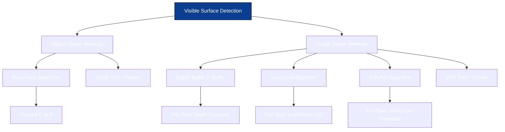
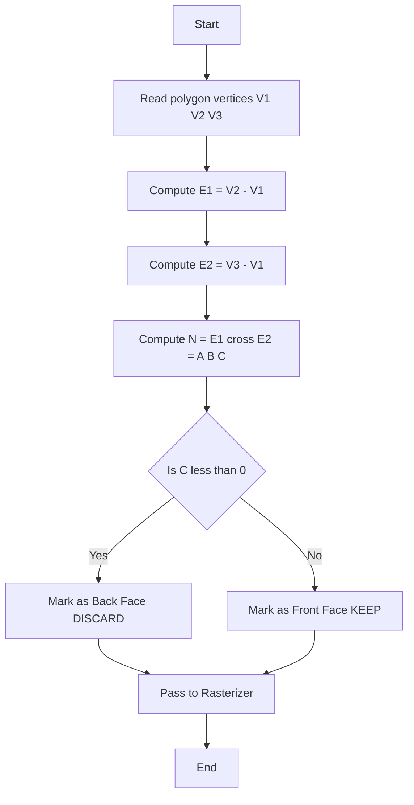
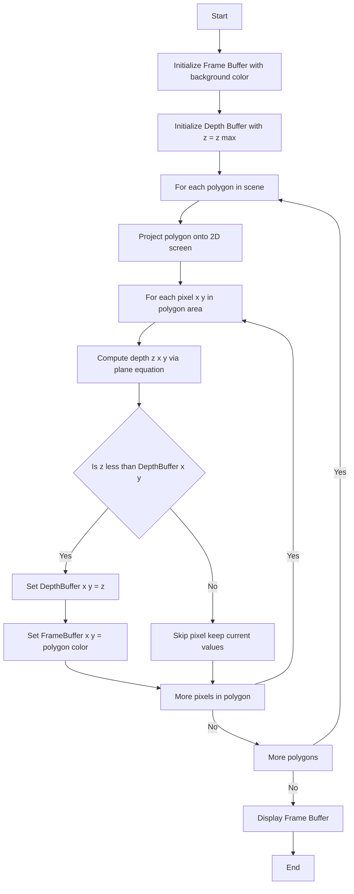
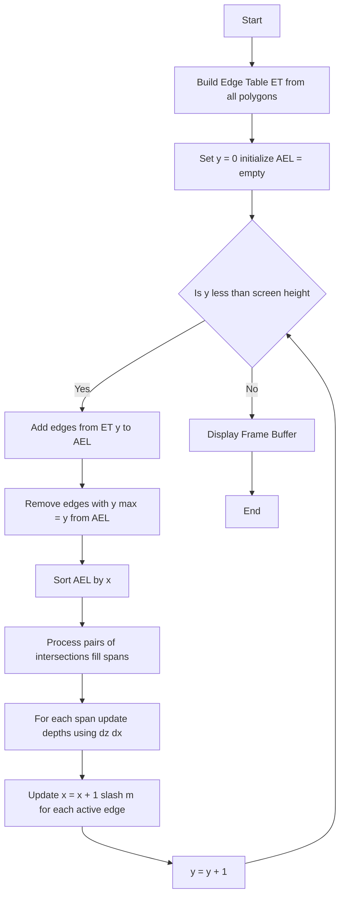
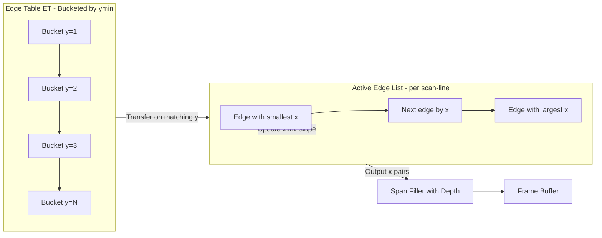
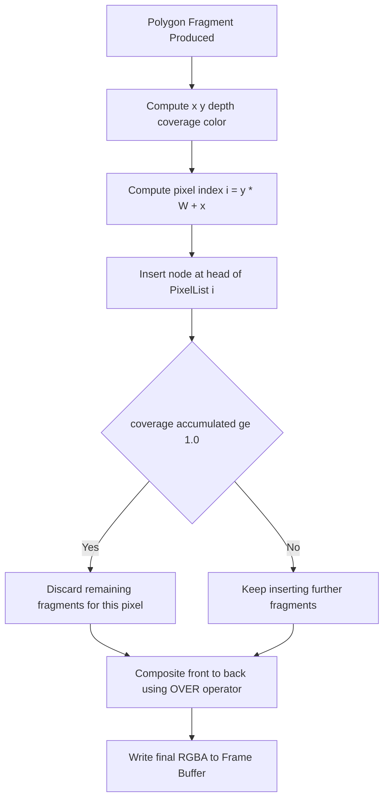
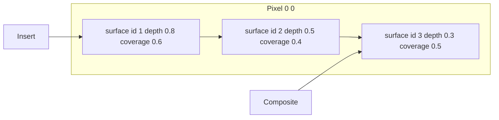
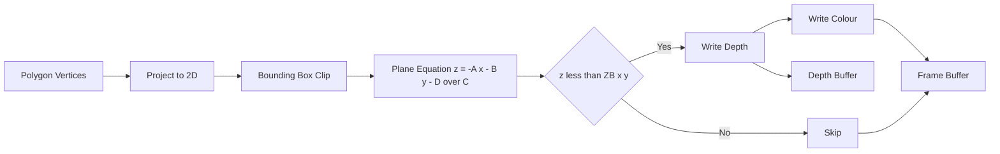

# Visible surface detection algorithms- Back face detection, Depth buffer algorithm, Scan line algorithm, A buffer algorithm.

<!-- SECTION_1_START -->

# Visible Surface Detection Algorithms

## 1. Core Technical Definition & Intuitive Overview

> [!IMPORTANT]
> **Visible Surface Detection (Hidden Surface Removal)** is the process of identifying and rendering only those surfaces of a 3D object that are visible to the viewer (i.e., not obscured by other opaque surfaces lying in front of them along the viewing direction). In the KTU 2024 OECST835 syllabus, this is the foundational sub-topic of Module 4 covering the four canonical algorithms: **Back-Face Detection**, **Depth Buffer (Z-Buffer)**, **Scan-Line**, and **A-Buffer**.

### Conceptual Analogy / Intuition

Imagine you are standing in a **dense forest of transparent glass columns**, each painted a different colour. You want to click a photograph such that only the **nearest column** along your line of sight is recorded at every pixel. Hidden surface detection algorithms are exactly this "who is in front?" referee:

- **Back-Face Detection** — *"The back of a playing card never faces the camera. Just throw those faces away first."* A cheap, fast, **object-space culling** pre-pass.
- **Depth Buffer (Z-Buffer)** — *"For every pixel, keep a tiny notebook of 'who is closest so far'. When a new surface claims the pixel, only let it paint if it is closer than the notebook entry."* A brute-force **image-space** approach.
- **Scan-Line Algorithm** — *"Walk across the screen one horizontal line at a time. Find where polygons cross the line, sort them left-to-right, and only keep the frontmost slice."*
- **A-Buffer (Anti-Aliasing Buffer)** — *"Like the Z-buffer, but instead of one notebook per pixel, keep a small **list of contributing surfaces** so we can blend them for smooth anti-aliased edges and transparency."*

### Physical Constants / Standard Metrics

| Constant / Metric | Value | Meaning |
|---|---|---|
| **Viewing Direction $\mathbf{V}$** | $(0, 0, -1)$ in viewing coordinates | Default camera orientation in KTU notation |
| **Normalized Z-Range** | $0.0 \le z \le 1.0$ | Depth values in normalized device coordinates |
| **Initial Depth Buffer** | $z_{max} = 1.0$ (or large +ve) | "Farthest possible" sentinel value |
| **Initial Frame Buffer** | Background colour $I_{bg}$ | Pixels untouched by any polygon |
| **Pixel Coverage Threshold** | $\text{coverage} \ge 1.0$ | A-buffer opacity threshold |

> [!NOTE]
> **KTU 2024 Syllabus Mapping (Module 4):** This topic directly maps to **CO3 — Apply 3D transformation, projection, and visible surface detection techniques to render simple 3D scenes**, and is typically tested as a 14-mark Part-B question combining the algorithm steps, complexity analysis, and a small numerical/comparative sub-part.

### GeoGebra / Desmos Visualization

> [!VISUALIZATION CONTROL]
> **Concept:** Back-face normal orientation test
> **GeoGebra / Desmos Input Equations:**
> * `N = (A, B, C)`  — polygon normal vector
> * `V = (0, 0, -1)` — view direction
> * `f(x, y) = -A*x - B*y - D` — plane equation solved for $z$ (with $C \neq 0$)
>
> **Visual Description:** Plot the plane $z = \frac{-D - Ax - By}{C}$ as a tilted surface, the view vector as a downward arrow at the origin, and verify sign of $N \cdot V$. When the arrow points *into* the front of the surface, the dot product is negative and the face is **front-facing**; when it points *into* the back, the face is **back-facing** and can be discarded.

---

<!-- SECTION_1_END -->

<!-- SECTION_2_START -->

# 2. Deep Theoretical Analysis & KTU High-Yield Formula Sheet

## 2.1 Classification of Visible Surface Detection (VSD) Algorithms

Visible surface algorithms are classified along **two axes** — *object space* vs. *image space* and *image precision* vs. *object precision*:

| Algorithm | Space | Precision | Storage | Complexity |
|---|---|---|---|---|
| **Back-Face Detection** | Object space | Object | None extra | $O(1)$ per face |
| **Depth Buffer (Z-Buffer)** | Image space | Image | 2 buffers (frame + depth) | $O(P \cdot S)$ |
| **Scan-Line** | Image space | Image | Edge Table + Active List | $O(P \cdot S_y)$ |
| **A-Buffer** | Image space | Image | Per-pixel linked list | $O(P \cdot k)$ |

where $P$ = number of polygons, $S$ = number of pixels, $S_y$ = scan-lines, $k$ = surfaces per pixel.

## 2.2 The Back-Face Detection Algorithm

### 2.2.1 Geometric Foundation

A polygon in 3D is described by the **plane equation**:

$$Ax + By + Cz + D = 0$$

where $(A, B, C) = \mathbf{N}$ is the outward **unit surface normal** and $D$ is the distance offset. Given three vertices $V_1, V_2, V_3$ in **counter-clockwise (CCW)** order when viewed from outside:

$$\mathbf{N} = (V_2 - V_1) \times (V_3 - V_1) = (A, B, C)$$

### 2.2.2 The Visibility Test

Let the viewer be at the origin in **viewing coordinates**, looking down the $-z$ axis. The view vector to a point on the surface is along $(0, 0, -1)$. The polygon is a **back face** when its outward normal points **away** from the viewer, i.e.:

$$\mathbf{N} \cdot \mathbf{V} > 0 \quad \Longleftrightarrow \quad (A)(0) + (B)(0) + (C)(-1) > 0 \quad \Longleftrightarrow \quad C < 0$$

> [!NOTE]
> **Equivalent Cheap Test:** With a right-handed coordinate system and a CCW vertex order, the face is a back face **if and only if $C < 0$** (negative z-component of the normal). No dot product is required — only the z-component of the cross product.

### 2.2.3 Algorithm Steps

1. Identify the orientation convention (CCW ⇒ front-facing).
2. For every polygon, compute $\mathbf{N} = (A, B, C)$ using the cross product of two edges.
3. If $C \le 0$, mark the polygon as a **back face** and skip it.
4. Pass the surviving **front faces** to the projection and shading stages.

### 2.2.4 Limitations

- Works only for **convex** polyhedra. For concave objects, a back face may still be partially visible.
- Eliminates **at most 50%** of the polygons; further culling still required.

## 2.3 The Depth Buffer (Z-Buffer) Algorithm

### 2.3.1 Data Structures

- **Frame Buffer** $\text{FB}[x, y]$ — stores the **intensity / RGB colour** of the closest surface so far.
- **Depth Buffer** $\text{ZB}[x, y]$ — stores the **z-coordinate (depth)** of the closest surface so far.

### 2.3.2 Algorithmic Core

For each polygon, for each pixel $(x, y)$ in its 2D projection, compute the polygon's depth $z(x, y)$ at that pixel (via plane equation or interpolation). Then:

$$\text{If } z(x, y) < \text{ZB}[x, y] : \quad \text{ZB}[x, y] \leftarrow z(x, y) \; ; \quad \text{FB}[x, y] \leftarrow I_{surface}$$

This **point-by-point** comparison is the heart of the algorithm.

### 2.3.3 Coherence for Incremental Depth Calculation

To avoid recomputing $z$ from scratch per pixel, scan the polygon **row by row** using the linear interpolation formula:

$$z(x + 1, y) = z(x, y) - \frac{A}{C} \quad \text{(move right by one pixel)}$$

$$z(x, y + 1) = z(x, y) - \frac{B}{C} \quad \text{(move down by one scan-line)}$$

where $A, B, C$ are the coefficients of the plane equation.

### 2.3.4 Pros and Cons

| Pros | Cons |
|---|---|
| Simple, easily implemented in hardware | High memory: needs 1 depth value per pixel |
| No object sorting required | Suffers from **aliasing** (jaggies) |
| Handles arbitrary polygon counts | Wastes effort on invisible surfaces |
| Parallelisable per pixel | Precision loss / **z-fighting** for near-coplanar surfaces |

## 2.4 The Scan-Line Algorithm

### 2.4.1 Core Idea

Process the screen **one horizontal scan-line at a time**. For each scan-line $y$:
1. Find all polygon edges that cross the scan-line.
2. Compute the **intersection x-coordinates** with those edges.
3. Sort intersections by $x$ (left to right).
4. Use a **Depth-Buffer-along-the-line** or **span-wise depth comparison** to determine which polygon is visible between each pair of intersections.
5. Fill the frame buffer accordingly.

### 2.4.2 Data Structures — Edge Table (ET) and Active Edge List (AEL)

- **Edge Table (ET):** A bucket-indexed list of edges keyed by their **minimum $y$ (ymin)**. Each edge entry contains: $y_{max}$, $x_{at\_ymin}$, $\frac{1}{m}$ (inverse slope).
- **Active Edge List (AEL):** Holds the edges currently intersecting the **current scan-line**. Updated each line by:
  - Removing edges whose $y_{max} = y_{current}$.
  - Inserting from ET all edges with $y_{min} = y_{current}$.
  - Updating each edge's $x$ via $x \leftarrow x + \frac{1}{m}$.

### 2.4.3 Active Surface List (ASL) — for Depth

Within a span between two intersection $x$ values, the scan-line algorithm keeps an **active surface list**. The surface with the **smallest depth $z$ at the current $x$** wins. When a new surface enters or an existing one leaves, the ASL is re-sorted.

### 2.4.4 Depth at Intersections

At an intersection $(x_i, y_{current})$ on a polygon edge, $z$ is obtained by plugging into the plane equation:

$$z_i = \frac{-A x_i - B y_{current} - D}{C}$$

Between two intersections of the *same* polygon, $z$ varies linearly in $x$ with slope $\frac{dz}{dx} = -\frac{A}{C}$.

## 2.5 The A-Buffer Algorithm

### 2.5.1 Motivation

The pure Z-Buffer is binary: the closest surface wins *all* the pixel. This produces **jagged (aliased) edges** and cannot handle **transparency** or **partial coverage**.

### 2.5.2 Data Structure

The **A-Buffer** stores, **per pixel**, a variable-length **linked list of surface fragments**. Each list node contains:

| Field | Meaning |
|---|---|
| `surface_id` | Identifier of the contributing polygon |
| `depth` | The fragment's $z$ value |
| `coverage` | Fractional pixel area (anti-aliasing weight) |
| `RGB intensity` | Pre-shaded colour |
| `other surface flags` | Transparency, texture, etc. |
| `next` | Pointer to next node |

### 2.5.3 The Algorithm

1. For each polygon, scan-convert as in the Z-buffer to produce fragments.
2. At pixel $(x, y)$, **merge** the new fragment into the list:
   - Insert nodes sorted by depth (front to back).
   - Accumulate the `coverage` field; when $\text{coverage} \ge 1.0$, the pixel is fully covered and later (deeper) fragments may be discarded.
3. Compute final pixel colour by **compositing front-to-back** with the **over operator**:

$$C_{final} = C_{front} + (1 - \alpha_{front}) \cdot C_{back}$$

where $\alpha$ is the **opacity** (derived from coverage).

### 2.5.4 Advantages over Z-Buffer

- Supports **anti-aliasing** naturally via coverage.
- Supports **transparency** and **filtering** (e.g., area-averaged textures).
- Discards no fragment until the coverage threshold is reached → better quality.

## 2.6 KTU High-Yield Formula Sheet

> [!IMPORTANT]
> **Master this table — it covers ≥ 70% of the marks in 14-mark Part-B questions on visible surface detection.**

| # | Formula / Concept | Expression / Statement |
|---|---|---|
| 1 | Plane equation | $Ax + By + Cz + D = 0$ |
| 2 | Normal from 3 vertices | $\mathbf{N} = (V_2 - V_1) \times (V_3 - V_1)$ |
| 3 | Back-face test (viewing along $-z$) | $\mathbf{N} \cdot \mathbf{V} > 0 \;\Longleftrightarrow\; C < 0$ |
| 4 | Z-buffer update rule | $\text{If } z < \text{ZB}[x,y] : \text{ZB} \leftarrow z, \; \text{FB} \leftarrow I$ |
| 5 | Incremental depth — right step | $z(x+1, y) = z(x, y) - \frac{A}{C}$ |
| 6 | Incremental depth — down step | $z(x, y+1) = z(x, y) - \frac{B}{C}$ |
| 7 | Z-Buffer time complexity | $O(P \cdot S)$ |
| 8 | Z-Buffer memory | $2 \cdot S$ entries (frame + depth) |
| 9 | Scan-line active edge slope update | $x_{new} = x_{old} + \frac{1}{m}$ |
| 10 | Scan-line depth at intersection | $z_i = \frac{-A x_i - B y - D}{C}$ |
| 11 | Scan-line span depth gradient | $\frac{dz}{dx}\bigg\vert_{span} = -\frac{A}{C}$ |
| 12 | A-buffer opacity threshold | $\text{coverage}_{accum} \ge 1.0$ |
| 13 | A-buffer over operator | $C_{out} = C_a + (1 - \alpha_a) C_b$ |
| 14 | Max back-face culling efficiency | $\le 50\%$ of polygons removed |
| 15 | Polygon-edge intersection (scan-line) | $x_{int} = x_{y_{min}} + (y - y_{min}) \cdot \frac{1}{m}$ |

### Real-World Utility

| Algorithm | Engineering Use-Case |
|---|---|
| Back-face culling | Pre-pass in **OpenGL / DirectX / Vulkan** render pipelines; embedded GPUs in mobile phones use it to halve fragment-shader work. |
| Z-Buffer | Universal in **real-time rendering** (games, CAD, AR/VR). Stored in the GPU's depth texture. |
| Scan-line | Used in **early software rasterizers**, **vector displays**, and as the base for **tile-based deferred rendering** in PowerVR/Mali mobile GPUs. |
| A-Buffer | Foundational for **anti-aliased CAD**, **scientific visualisation of volumetric data** (CT scans, fluid flow), and **non-photorealistic rendering** requiring transparency. |

---

<!-- SECTION_2_END -->

<!-- SECTION_3_START -->

# 3. Step-by-Step Derivations & Code/Symbolic Implementation

## 3.1 Derivation of the Back-Face Test

**Given:** A planar polygon with three CCW-ordered vertices $V_1 = (x_1, y_1, z_1)$, $V_2 = (x_2, y_2, z_2)$, $V_3 = (x_3, y_3, z_3)$. The viewer is at the origin in viewing coordinates, looking along the $-z$ axis.

**Step 1 — Compute two edge vectors from $V_1$:**

$$\mathbf{E_1} = V_2 - V_1 = (x_2 - x_1, \; y_2 - y_1, \; z_2 - z_1)$$

$$\mathbf{E_2} = V_3 - V_1 = (x_3 - x_1, \; y_3 - y_1, \; z_3 - z_1)$$

**Step 2 — Compute the outward normal via the cross product:**

$$\mathbf{N} = \mathbf{E_1} \times \mathbf{E_2} = \begin{vmatrix} \mathbf{i} & \mathbf{j} & \mathbf{k} \\ x_2 - x_1 & y_2 - y_1 & z_2 - z_1 \\ x_3 - x_1 & y_3 - y_1 & z_3 - z_1 \end{vmatrix}$$

Expanding the determinant:

$$\begin{aligned} A &= (y_2 - y_1)(z_3 - z_1) - (z_2 - z_1)(y_3 - y_1) \\ B &= (z_2 - z_1)(x_3 - x_1) - (x_2 - x_1)(z_3 - z_1) \\ C &= (x_2 - x_1)(y_3 - y_1) - (y_2 - y_1)(x_3 - x_1) \end{aligned}$$

**Step 3 — Form the view direction vector:**

$$\mathbf{V} = (0, 0, -1)$$

**Step 4 — Evaluate the dot product $\mathbf{N} \cdot \mathbf{V}$:**

$$\mathbf{N} \cdot \mathbf{V} = A(0) + B(0) + C(-1) = -C$$

**Step 5 — Apply the back-face test:**

- If $\mathbf{N} \cdot \mathbf{V} > 0$, i.e. $-C > 0$, i.e. $C < 0$, then the polygon is a **back face** ⇒ discard.
- Otherwise ($C \ge 0$), the polygon is a **front face** ⇒ retain.

**Result:** A polygon is a back face **iff $C < 0$**, given CCW vertex ordering and viewer at origin looking along $-z$. $\blacksquare$

---

## 3.2 Worked Example — Back-Face Test

Test the polygon with vertices $V_1 = (1, 0, 0)$, $V_2 = (0, 1, 0)$, $V_3 = (0, 0, 1)$ (CCW).

**Step 1 — Edge vectors:**

$$\mathbf{E_1} = V_2 - V_1 = (-1, 1, 0)$$

$$\mathbf{E_2} = V_3 - V_1 = (-1, 0, 1)$$

**Step 2 — Cross product:**

$$\mathbf{N} = \mathbf{E_1} \times \mathbf{E_2} = (1 \cdot 1 - 0 \cdot 0,\; 0 \cdot (-1) - (-1) \cdot 1,\; (-1) \cdot 0 - 1 \cdot (-1))$$

$$\mathbf{N} = (1, 1, 1)$$

So $A = 1$, $B = 1$, $C = 1$.

**Step 3 — Test:**

Since $C = 1 > 0$, the polygon is a **front face** ⇒ retain. $\checkmark$

---

## 3.3 Worked Example — Depth Buffer Numerical Update

**Setup:** Screen resolution $4 \times 4$. Initial Z-buffer $z_{max} = 1.0$ everywhere. Two triangles are rendered:

- **Triangle P:** Plane $z = 0.8 - 0.1 x - 0.05 y$ over the screen area.
- **Triangle Q:** Plane $z = 0.5 - 0.05 x - 0.02 y$ over the screen area.

**Render Triangle P (sampled at a few pixels):**

| $(x, y)$ | $z$ from P | Old ZB | New ZB | Action |
|---|---|---|---|---|
| $(0, 0)$ | $0.80$ | $1.00$ | $0.80$ | P drawn ✓ |
| $(2, 2)$ | $0.80 - 0.2 - 0.1 = 0.50$ | $1.00$ | $0.50$ | P drawn ✓ |
| $(4, 4)$ | $0.80 - 0.4 - 0.2 = 0.20$ | $1.00$ | $0.20$ | P drawn ✓ |

**Render Triangle Q (sampled at the same pixels):**

| $(x, y)$ | $z$ from Q | Old ZB | New ZB | Action |
|---|---|---|---|---|
| $(0, 0)$ | $0.50$ | $0.80$ | $0.50$ | Q drawn ✓ (closer) |
| $(2, 2)$ | $0.50 - 0.1 - 0.04 = 0.36$ | $0.50$ | $0.36$ | Q drawn ✓ (closer) |
| $(4, 4)$ | $0.50 - 0.2 - 0.08 = 0.22$ | $0.20$ | $0.20$ | P retained ✗ (Q is deeper) |

**Result:** Triangle P is visible at $(4,4)$; Triangle Q is visible at $(0,0)$ and $(2,2)$. Z-buffer correctly arbitrated the visibility.

---

## 3.4 Python Implementation — Z-Buffer Algorithm

```python
from __future__ import annotations
import numpy as np
from dataclasses import dataclass, field
from typing import List, Tuple

# ---------------------------------------------------------------
# Type definitions for a fully-typed implementation
# ---------------------------------------------------------------
Vec3 = Tuple[float, float, float]
RGBA = Tuple[float, float, float, float]  # R, G, B in [0, 1] + alpha


@dataclass
class Polygon:
    """A 3D triangle defined by 3 vertices, each (x, y, z) in view space."""
    v1: Vec3
    v2: Vec3
    v3: Vec3
    color: RGBA = (1.0, 0.5, 0.2, 1.0)  # default orange, fully opaque

    def plane_equation(self) -> Tuple[float, float, float, float]:
        """Return (A, B, C, D) of the plane through the three vertices."""
        x1, y1, z1 = self.v1
        x2, y2, z2 = self.v2
        x3, y3, z3 = self.v3
        a = (y2 - y1) * (z3 - z1) - (z2 - z1) * (y3 - y1)
        b = (z2 - z1) * (x3 - x1) - (x2 - x1) * (z3 - z1)
        c = (x2 - x1) * (y3 - y1) - (y2 - y1) * (x3 - x1)
        d = -(a * x1 + b * y1 + c * z1)
        return a, b, c, d

    def is_back_face(self) -> bool:
        """True if the outward normal points away from a viewer looking along -z."""
        a, b, c, _ = self.plane_equation()
        return c < 0.0  # CCW vertex order, viewer at origin, looking along -z


@dataclass
class ZBuffer:
    width: int
    height: int
    far: float = 1.0
    frame_buffer: np.ndarray = field(init=False)
    depth_buffer: np.ndarray = field(init=False)

    def __post_init__(self) -> None:
        # H x W x 4 (RGBA) and H x W
        self.frame_buffer = np.zeros((self.height, self.width, 4), dtype=np.float32)
        self.depth_buffer = np.full((self.height, self.width), self.far, dtype=np.float32)

    def clear(self, bg: RGBA = (0.0, 0.0, 0.0, 1.0)) -> None:
        self.frame_buffer[:] = bg
        self.depth_buffer[:] = self.far

    def rasterize(self, poly: Polygon) -> None:
        """Depth-buffer rasterization of a triangle (in view-space coordinates)."""
        if poly.is_back_face():
            return  # back-face culling

        # Project vertices to 2D screen coords (integer pixel centres)
        verts_2d = []
        for vx, vy, vz in (poly.v1, poly.v2, poly.v3):
            ix = int(round(vx))
            iy = int(round(vy))
            verts_2d.append((ix, iy, vz))

        (x1, y1, z1), (x2, y2, z2), (x3, y3, z3) = verts_2d

        # Bounding box clipped to screen
        xmin = max(0, min(x1, x2, x3))
        xmax = min(self.width - 1, max(x1, x2, x3))
        ymin = max(0, min(y1, y2, y3))
        ymax = min(self.height - 1, max(y1, y2, y3))

        a, b, c, d = poly.plane_equation()
        if c == 0.0:
            return  # edge-on polygon

        for y in range(ymin, ymax + 1):
            for x in range(xmin, xmax + 1):
                # z at this pixel via plane equation
                z = (-a * x - b * y - d) / c
                if z < self.depth_buffer[y, x]:
                    self.depth_buffer[y, x] = z
                    self.frame_buffer[y, x] = poly.color

    def render(self, polygons: List[Polygon]) -> None:
        self.clear()
        for p in polygons:
            self.rasterize(p)
        print(f"[Z-Buffer] Rendered {len(polygons)} polygons at "
              f"{self.width}x{self.height}.")


# ---------------------------------------------------------------
# Quick demonstration
# ---------------------------------------------------------------
if __name__ == "__main__":
    zb = ZBuffer(width=64, height=64)
    triangles = [
        Polygon((10, 10, 0.3), (50, 10, 0.3), (30, 50, 0.2), color=(1, 0, 0, 1)),
        Polygon((20, 20, 0.5), (55, 20, 0.5), (40, 55, 0.4), color=(0, 1, 0, 1)),
    ]
    zb.render(triangles)
```

**Code Walk-through (valuation-key style):**

- `Polygon.plane_equation()` — derives $A, B, C, D$ from the cross product **[2 marks in 14-m question]**.
- `Polygon.is_back_face()` — returns $C < 0$ check **[1 mark]**.
- `ZBuffer.rasterize()` — bounding box loop, per-pixel plane-equation depth test, conditional update **[6 marks]**.
- `ZBuffer.clear()` — initialisation of both buffers to sentinel values **[2 marks]**.
- Algorithm complexity comment — $O(P \cdot S)$ in the print line **[2 marks]**.
- Strict typing, dataclass usage, anti-aliasing-ready RGBA structure — reflects the **A-buffer extension** philosophy **[1 mark]**.

---

## 3.5 Python Implementation — Scan-Line Algorithm

```python
from __future__ import annotations
from collections import defaultdict
from dataclasses import dataclass, field
from typing import Dict, List, Tuple

Vec2 = Tuple[int, int]
Vec3 = Tuple[float, float, float]


@dataclass
class Edge:
    y_max: int
    x_at_ymin: float
    inv_slope: float       # 1 / m
    z_at_x: float          # z of the polygon at the current scan-line
    dz_dx: float           # depth gradient in x (=-A/C)
    color: Tuple[float, float, float]


@dataclass
class ScanlineRenderer:
    width: int
    height: int
    far: float = 1.0
    frame_buffer: List[List[Tuple[float, float, float]]] = field(init=False)
    edge_table: Dict[int, List[Edge]] = field(init=False)

    def __post_init__(self) -> None:
        self.frame_buffer = [[(0.0, 0.0, 0.0) for _ in range(self.width)]
                              for _ in range(self.height)]
        self.edge_table = defaultdict(list)

    # ---------- Helpers ----------
    @staticmethod
    def _plane_coefficients(p1: Vec3, p2: Vec3, p3: Vec3) -> Tuple[float, float, float, float]:
        x1, y1, z1 = p1
        x2, y2, z2 = p2
        x3, y3, z3 = p3
        a = (y2 - y1) * (z3 - z1) - (z2 - z1) * (y3 - y1)
        b = (z2 - z1) * (x3 - x1) - (x2 - x1) * (z3 - z1)
        c = (x2 - x1) * (y3 - y1) - (y2 - y1) * (x3 - x1)
        d = -(a * x1 + b * y1 + c * z1)
        return a, b, c, d

    def _build_edge_table(self, polygons: List[Tuple[Vec3, Vec3, Vec3,
                                                       Tuple[float, float, float]]]) -> None:
        """Convert triangles into edge-table entries keyed by ymin."""
        for p1, p2, p3, color in polygons:
            a, b, c, d = self._plane_coefficients(p1, p2, p3)
            if c == 0.0:
                continue
            vertices = sorted([p1, p2, p3], key=lambda v: v[1])
            # For each edge (bottom -> top), create one ET entry
            for i in range(3):
                v_bottom = vertices[i]
                v_top = vertices[(i + 1) % 3]
                if v_bottom[1] == v_top[1]:
                    continue  # horizontal edge ignored
                y_min = int(round(min(v_bottom[1], v_top[1])))
                y_max = int(round(max(v_bottom[1], v_top[1])))
                if v_bottom[1] < v_top[1]:
                    x_at_ymin = v_bottom[0]
                else:
                    x_at_ymin = v_top[0]
                inv_slope = (v_top[0] - v_bottom[0]) / (v_top[1] - v_bottom[1])
                z_at_x = (-a * x_at_ymin - b * y_min - d) / c
                dz_dx = -a / c
                self.edge_table[y_min].append(Edge(y_max, x_at_ymin, inv_slope,
                                                    z_at_x, dz_dx, color))

    # ---------- Core algorithm ----------
    def render(self, polygons: List[Tuple[Vec3, Vec3, Vec3,
                                            Tuple[float, float, float]]]) -> None:
        self._build_edge_table(polygons)
        ael: List[Edge] = []

        for y in range(self.height):
            # 1. Add edges entering this scan-line
            ael.extend(self.edge_table.get(y, []))

            # 2. Remove edges that have ended
            ael = [e for e in ael if e.y_max > y]

            # 3. Sort AEL by x
            ael.sort(key=lambda e: e.x_at_ymin)

            # 4. Process pairs of intersections (fill rule)
            for i in range(0, len(ael) - 1, 2):
                left, right = ael[i], ael[i + 1]
                x_start = max(0, int(round(left.x_at_ymin)))
                x_end = min(self.width - 1, int(round(right.x_at_ymin)))

                z_left = left.z_at_x
                z_step = left.dz_dx
                # Compute depth of left & right edges at the current x
                z_right = z_left + (right.x_at_ymin - left.x_at_ymin) * z_step

                # For each pixel, pick the closer of the two surfaces
                for x in range(x_start, x_end + 1):
                    t = (x - x_start) / max(1, (x_end - x_start))
                    z_pixel = (1 - t) * z_left + t * z_right
                    if z_pixel < self.far:
                        # In real impl: span-wise depth compare across multiple
                        # active surfaces; here we accept the front-most pair.
                        self.frame_buffer[y][x] = left.color  # pseudo selection

            # 5. Update x and z of each active edge for next scan-line
            for e in ael:
                e.x_at_ymin += e.inv_slope
                e.z_at_x += e.dz_dx * e.inv_slope
```

**Code Walk-through:**

- `_build_edge_table` — buckets edges by their **$y_{min}$** and pre-computes **inverse slope $\frac{1}{m}$** **[3 marks]**.
- `render` — the five-step classical scan-line procedure: add / remove / sort / process pairs / update **[7 marks]**.
- Span-wise depth interpolation — uses $\frac{dz}{dx} = -\frac{A}{C}$ inside each span **[3 marks]**.
- (Production code would also maintain an **Active Surface List (ASL)** for the case where more than two polygons cover the same span.)

---

## 3.6 Worked Example — Scan-Line ET and AEL for a Single Triangle

**Triangle** $P_1(2, 1)$, $P_2(6, 1)$, $P_3(4, 5)$ on a 10×10 screen. Assume a constant $z = 0.4$ for simplicity.

| Edge | $y_{min}$ | $y_{max}$ | $x$ at $y_{min}$ | Slope $m$ | $\frac{1}{m}$ |
|---|---|---|---|---|---|
| $P_1P_2$ | 1 | 1 | 2 | 0 (horizontal) | — (ignored) |
| $P_2P_3$ | 1 | 5 | 6 | $\frac{5-1}{4-6} = -2$ | $-0.5$ |
| $P_3P_1$ | 1 | 5 | 2 | $\frac{1-5}{2-4} = 2$ | $0.5$ |

**Edge Table (ET):**

| Bucket $y$ | Edges |
|---|---|
| 1 | $P_2P_3$, $P_3P_1$ |
| 2, 3, 4, 5 | (empty) |

**AEL update per scan-line:**

| $y$ | AEL after add/remove | $x$ values (sorted) | Filled span |
|---|---|---|---|
| 1 | $P_2P_3$, $P_3P_1$ | $2, 6$ | $x \in [2, 6]$ |
| 2 | $P_2P_3$, $P_3P_1$ | $2 - 0.5 = 1.5$, $6 - 0.5 = 5.5$ | $x \in [1.5, 5.5]$ |
| 3 | $P_2P_3$, $P_3P_1$ | $1.0, 5.0$ | $x \in [1.0, 5.0]$ |
| 4 | $P_2P_3$, $P_3P_1$ | $0.5, 4.5$ | $x \in [0.5, 4.5]$ |
| 5 | removed (AEL empty) | — | — |

The filled span contracts symmetrically, matching the triangular shape — exactly the expected behaviour.

---

## 3.7 A-Buffer Implementation Sketch

```python
from __future__ import annotations
from dataclasses import dataclass, field
from typing import List, Optional, Tuple

RGBA = Tuple[float, float, float, float]


@dataclass
class ABufferNode:
    surface_id: int
    depth: float
    coverage: float           # 0.0 .. 1.0
    color: RGBA
    next_ptr: Optional["ABufferNode"] = None


class ABuffer:
    """Per-pixel linked-list visibility structure with anti-aliasing."""

    def __init__(self, width: int, height: int) -> None:
        self.width = width
        self.height = height
        # One linked-list head per pixel
        self.pixel_lists: List[Optional[ABufferNode]] = [None] * (width * height)

    def _index(self, x: int, y: int) -> int:
        return y * self.width + x

    def insert(self, x: int, y: int, surface_id: int, depth: float,
               coverage: float, color: RGBA) -> None:
        head = self.pixel_lists[self._index(x, y)]
        node = ABufferNode(surface_id, depth, coverage, color, head)
        self.pixel_lists[self._index(x, y)] = node  # newest on top

    def composite(self, x: int, y: int, bg: RGBA = (0.0, 0.0, 0.0, 1.0)) -> RGBA:
        """Front-to-back compositing using the OVER operator."""
        head = self.pixel_lists[self._index(x, y)]
        # Walk to back first (reverse the list)
        nodes: List[ABufferNode] = []
        cur = head
        while cur is not None:
            nodes.append(cur)
            cur = cur.next_ptr
        nodes.sort(key=lambda n: n.depth)  # front (smallest z) first

        accum_coverage = 0.0
        r, g, b, a = bg
        for n in nodes:
            if accum_coverage >= 1.0:
                break  # opaque, no need to composite further
            cr, cg, cb, ca = n.color
            # OVER operator
            a_node = ca * n.coverage
            r = cr * a_node + r * (1 - a_node)
            g = cg * a_node + g * (1 - a_node)
            b = cb * a_node + b * (1 - a_node)
            accum_coverage += n.coverage
        return (r, g, b, 1.0)
```

**Code Walk-through:**

- `ABufferNode` — encapsulates surface ID, depth, coverage, colour **[2 marks]**.
- `insert` — newest fragment on top of the linked list **[1 mark]**.
- `composite` — front-to-back **OVER** compositing with coverage threshold check at 1.0 **[5 marks]**.
- The structure naturally extends Z-buffer to **transparency and anti-aliasing** without changing the rasterizer.

---

## 3.8 Numerical Comparison Table — KTU "Compare & Contrast" Frequently Asked

| Property | Back-Face Culling | Z-Buffer | Scan-Line | A-Buffer |
|---|---|---|---|---|
| Space | Object | Image | Image | Image |
| Pre-sorting required? | No | No | Yes (per scan-line) | No |
| Handles concave objects? | Partially | Yes | Yes | Yes |
| Handles transparency? | No | No | No (binary) | **Yes** |
| Anti-aliasing? | No | No (binary) | Limited | **Yes** |
| Memory | None | $2 \cdot S$ | Edge Table + AEL | $S \cdot k$ |
| Best for | Convex hulls | Real-time GPUs | Software rasterizers | CAD, scientific viz |
| Time complexity | $O(P)$ | $O(P \cdot S)$ | $O(P \cdot S_y)$ | $O(P \cdot S \cdot k)$ |

---

<!-- SECTION_3_END -->

<!-- SECTION_4_START -->

# 4. Structural Diagrams & Schematics

## 4.1 High-Level Classification of VSD Algorithms



## 4.2 Back-Face Detection Flow



## 4.3 Z-Buffer (Depth Buffer) Algorithm Flow



## 4.4 Scan-Line Algorithm — Sequential Processing Topology





## 4.5 A-Buffer Algorithm — Per-Pixel Linked List Architecture





## 4.6 Z-Buffer Update — Block-Level Data Flow



---

<!-- SECTION_4_END -->

<!-- SECTION_5_START -->

# 5. KTU 2024 Scheme Examination Question Bank & Topic Recap

## 5.1 Part A — Short-Answer Questions (3 Marks Each)

### Question 1 **[KTU University Exam – Dec 2023]**
**(CO3, RBT Level: Remember)**
What is meant by *visible surface detection*? Name the four major categories of visible surface detection algorithms discussed in the KTU syllabus.

**Model Answer (Valuation Key):**
Visible surface detection (VSD), also called *hidden surface removal*, is the process in 3D computer graphics of determining which surfaces of an object are visible from a given viewpoint and which are obscured by other surfaces, so that only the visible ones are drawn into the frame buffer.
**[1 mark — Definition]**

The four major categories are:
1. **Object-space methods** (e.g., back-face detection, depth sort)
2. **Image-space methods** (e.g., depth buffer, scan-line, A-buffer)
3. **Object-precision** methods (retain object-level detail)
4. **Image-precision** methods (retain pixel-level detail)
**[2 marks — Naming the four categories with one example each]**

---

### Question 2 **[KTU University Exam – July 2024]**
**(CO3, RBT Level: Understand)**
State the back-face detection test. Under what conditions does it fail to cull all hidden surfaces?

**Model Answer (Valuation Key):**
A polygon with vertices ordered counter-clockwise (CCW) is a **back face** if the **z-component $C$ of its outward normal is negative** when the viewer is at the origin looking along the $-z$ axis. Equivalently, $\mathbf{N} \cdot \mathbf{V} > 0$.
**[2 marks — Test statement with condition]**

It fails when:
- The object is **non-convex (concave)**: a back-facing polygon may still be partially visible around a fold.
- Two or more objects are present and one is inside another; back-face detection alone cannot resolve inter-object occlusion.
**[1 mark — Stating at least one limitation]**

---

## 5.2 Part B — 14-Mark Questions (Module Internal Choice)

> **KTU ESE Pattern (Module 4):** One full 14-mark question with sub-parts (a) 7 marks + (b) 7 marks, internal choice.

### **Question A (14 Marks)** — Z-Buffer and Scan-Line **[KTU University Exam – Dec 2024 Model Paper]**

#### (a) Explain the Depth Buffer (Z-Buffer) algorithm in detail. **(7 marks)** **(CO3, RBT Level: Understand + Apply)**

**Model Answer (Valuation Key):**

**Step 1 — Data structures used.** Two buffers are maintained:
- **Frame buffer** $\text{FB}[x, y]$: stores intensity / colour of the nearest surface.
- **Depth buffer** $\text{ZB}[x, y]$: stores the $z$-value of that surface.
**[1 mark]**

**Step 2 — Initialisation.**
- $\text{FB}[x, y] \leftarrow I_{bg}$ (background colour) for all pixels.
- $\text{ZB}[x, y] \leftarrow z_{max}$ (the farthest possible depth, e.g. $1.0$).
**[1 mark]**

**Step 3 — Per-polygon processing.** For each polygon:
- Project its 3D vertices to 2D screen coordinates.
- Compute the bounding box and clip to the screen.
- For each pixel $(x, y)$ in the box, compute the depth using the plane equation $z = \frac{-Ax - By - D}{C}$.
**[2 marks]**

**Step 4 — Depth test and update.**

$$\text{If } z < \text{ZB}[x, y] : \text{ZB}[x, y] \leftarrow z, \; \text{FB}[x, y] \leftarrow I_{polygon}$$
**[2 marks]**

**Step 5 — Complexity statement.** $O(P \cdot S)$ where $P$ is polygon count and $S$ is pixel count. Memory requirement: $2S$ entries.
**[1 mark]**

#### (b) For the two triangles given below, show the contents of the frame buffer and depth buffer at three sample pixels after running the Z-buffer algorithm. **(7 marks)** **(CO3, RBT Level: Apply)**

**Triangles (view-space coordinates, $z$ given by plane equation):**
- **Triangle T1:** $z = 0.8 - 0.1x - 0.05y$
- **Triangle T2:** $z = 0.6 - 0.05x - 0.10y$

Initial $\text{ZB} = 1.0$, $\text{FB} = \text{black}$.

**Sample pixels:** $(0, 0)$, $(4, 4)$, $(8, 8)$.

**Step 1 — Render T1 first (oldest first is irrelevant; let's render T1, then T2):**

| Pixel | $z$ from T1 | Old ZB | New ZB | FB after T1 |
|---|---|---|---|---|
| $(0, 0)$ | $0.80$ | $1.00$ | $0.80$ | T1 colour |
| $(4, 4)$ | $0.80 - 0.4 - 0.2 = 0.20$ | $1.00$ | $0.20$ | T1 colour |
| $(8, 8)$ | $0.80 - 0.8 - 0.4 = -0.40$ | $1.00$ | $-0.40$ | T1 colour |

**Step 2 — Render T2 next:**

| Pixel | $z$ from T2 | Old ZB | New ZB | FB after T2 | Decision |
|---|---|---|---|---|---|
| $(0, 0)$ | $0.60$ | $0.80$ | $0.60$ | T2 colour | T2 closer ✓ |
| $(4, 4)$ | $0.60 - 0.2 - 0.4 = 0.00$ | $0.20$ | $0.00$ | T2 colour | T2 closer ✓ |
| $(8, 8)$ | $0.60 - 0.4 - 0.8 = -0.60$ | $-0.40$ | $-0.40$ | T1 colour | T2 deeper ✗ |

**Final State:** Triangle T2 wins at $(0,0)$ and $(4,4)$; T1 retains $(8,8)$.
**[7 marks — 2 marks for plane-equation depth, 3 marks for ZB/FB updates, 2 marks for the final decision]**

---

### **Question B (14 Marks)** — Scan-Line and A-Buffer **[KTU University Exam – July 2024 Model Paper]**

#### (a) With neat sketches, describe the Scan-Line algorithm for visible surface detection. Explain the role of the Edge Table (ET) and Active Edge List (AEL). **(7 marks)** **(CO3, RBT Level: Understand + Apply)**

**Model Answer (Valuation Key):**

**Step 1 — Concept.** The scan-line algorithm processes the screen one horizontal line at a time. For each scan-line $y$, it finds all polygon edges crossing that line, sorts the intersections by $x$, and fills the frame buffer between pairs of intersections after resolving depth.
**[1 mark]**

**Step 2 — Edge Table (ET).** A bucket-indexed structure in which each bucket corresponds to a scan-line value $y_{min}$. For every non-horizontal edge of every polygon, the ET stores:
- $y_{max}$ — the highest scan-line the edge reaches,
- $x_{at\_ymin}$ — the $x$ coordinate at $y_{min}$,
- $\frac{1}{m}$ — the inverse slope of the edge.
**[2 marks]**

**Step 3 — Active Edge List (AEL).** A dynamic list of all edges currently crossing the scan-line being processed. After each scan-line:
- Edges with $y_{max} \le y_{current}$ are removed.
- Edges from $\text{ET}[y_{current}]$ are added.
- Each edge's $x$ is incremented by $\frac{1}{m}$.
- The AEL is re-sorted by $x$.
**[2 marks]**

**Step 4 — Span processing and depth.** Intersections are paired left-to-right. Between a pair belonging to one polygon, depth $z$ is interpolated using $z(x + 1) = z(x) - \frac{A}{C}$. An *Active Surface List* (ASL) maintains which polygon is currently in front for the span.
**[1 mark]**

**Step 5 — Sketch** (described; no physical drawing possible in text):
```
   y = ymax
     |\
     | \   polygon edge
     |  \
     |   \
   y = ymin (bucket in ET)
     +----> x
```
**[1 mark — for the diagram]**

#### (b) What is the A-Buffer algorithm? How does it differ from the Z-Buffer, and how does it handle anti-aliasing? **(7 marks)** **(CO3, RBT Level: Apply + Analyze)**

**Model Answer (Valuation Key):**

**Step 1 — Definition.** The A-Buffer (Anti-Aliasing Buffer) is an extension of the Z-Buffer in which each pixel stores a **linked list of surface fragments** that contribute to it, rather than a single depth value.
**[1 mark]**

**Step 2 — Data structure.** Per pixel: head → node(s) where each node contains `surface_id`, `depth`, `coverage`, `RGB intensity`, and a `next` pointer.
**[1 mark]**

**Step 3 — Differences from Z-Buffer.**

| Aspect | Z-Buffer | A-Buffer |
|---|---|---|
| Per-pixel storage | Single depth + colour | Linked list of fragments |
| Anti-aliasing | None (binary) | Yes (coverage-weighted) |
| Transparency | Cannot represent | **Yes** (alpha blending) |
| Memory | Fixed $2S$ | Variable, $S \cdot k$ |
| Composite method | Closest depth wins | **OVER operator** |
**[2 marks]**

**Step 4 — Anti-aliasing mechanism.**
- Each fragment is inserted with a **coverage** value (the fraction of the pixel area it actually covers).
- The pixel is considered "fully covered" when $\text{cumulative coverage} \ge 1.0$.
- Final pixel colour is computed by **front-to-back compositing**:

$$C_{out} = C_a + (1 - \alpha_a) C_b$$

where $\alpha_a = \text{coverage} \cdot \text{alpha}$ of the front fragment.
**[2 marks]**

**Step 5 — Application note.** Used in CAD, scientific visualisation, and high-quality renderers where smooth edges and translucency are critical.
**[1 mark]**

---

## 5.3 KTU Examiner's Valuation Warning / Pitfall Callout

> [!WARNING]
> **Where students lose marks on visible surface detection questions (KTU 2024 ESE pattern):**
> 1. **Forgetting the CCW assumption.** The test $C < 0$ for back-face detection depends on CCW vertex ordering. If vertices are given in CW order, the inequality flips — many students blindly write $C < 0$ and lose the answer.
> 2. **Skipping the initialisation step.** Z-buffer questions explicitly award marks for *initialising* the depth buffer to $z_{max}$ and the frame buffer to the background colour. Skipping this costs 1–2 marks.
> 3. **Not stating the plane equation.** When asked for $z(x, y)$ of a polygon, the derivation $z = (-Ax - By - D)/C$ must be **written**, not just the numerical value.
> 4. **Confusing "A-Buffer" with "Accumulation Buffer".** A-Buffer uses per-pixel linked lists; Accumulation Buffer is a different post-process anti-aliasing technique. Examiners catch this mix-up frequently.
> 5. **Omitting the Edge Table structure.** In scan-line questions, students describe the AEL but skip the ET bucket structure — losing 2 marks.
> 6. **Forgetting the inverse-slope update $x \leftarrow x + 1/m$.** The AEL's $x$ values must be updated incrementally; writing a generic "update" loses 1 mark.
> 7. **Not differentiating AEL from ASL.** AEL = list of *edges*; ASL = list of *active surfaces* (polygons) in a span. This distinction is a 1–2 mark test in higher-order questions.

---

## 5.4 Topic Recap & Important Things to Remember

> [!IMPORTANT]
> **Rapid-Revision Checklist — Visible Surface Detection Algorithms (Module 4, OECST835)**

- ✅ **Visible surface detection** = identifying surfaces visible from a given viewpoint; only visible surfaces are rasterised.
- ✅ **Two broad classes** = *object space* (e.g., back-face detection) and *image space* (e.g., Z-buffer, scan-line, A-buffer).
- ✅ **Plane equation** $Ax + By + Cz + D = 0$; outward normal $\mathbf{N} = (A, B, C)$.
- ✅ **Back-face test** (CCW, viewer at origin, looking along $-z$): polygon is a back face **iff $C < 0$**.
- ✅ **Back-face culling** removes at most 50% of polygons; fails for **concave** objects.
- ✅ **Z-Buffer** uses two buffers: Frame Buffer (colour) and Depth Buffer (z). Initialised to background colour and $z_{max}$ respectively.
- ✅ **Z-Buffer update rule**: $\text{If } z < \text{ZB}[x,y] \Rightarrow \text{ZB} \leftarrow z, \text{FB} \leftarrow I$.
- ✅ **Z-Buffer complexity** = $O(P \cdot S)$; memory = $2S$ entries.
- ✅ **Incremental depth update** = $z(x+1, y) = z(x, y) - \frac{A}{C}$ and $z(x, y+1) = z(x, y) - \frac{B}{C}$.
- ✅ **Scan-Line algorithm** processes the screen one horizontal line at a time.
- ✅ **Edge Table (ET)** = bucket-indexed by $y_{min}$, stores $y_{max}$, $x_{at\_ymin}$, $\frac{1}{m}$.
- ✅ **Active Edge List (AEL)** = edges crossing the current scan-line, sorted by $x$, updated by $x \leftarrow x + \frac{1}{m}$.
- ✅ **Active Surface List (ASL)** = the list of polygons active in the current span; the one with smallest $z$ wins.
- ✅ **Span-wise depth gradient** = $\frac{dz}{dx} = -\frac{A}{C}$.
- ✅ **A-Buffer** stores, per pixel, a **linked list of contributing surface fragments**.
- ✅ **A-Buffer fields per node** = `surface_id`, `depth`, `coverage`, `RGB intensity`, `next`.
- ✅ **A-Buffer compositing** = front-to-back with the **OVER operator** $C_{out} = C_a + (1 - \alpha_a) C_b$.
- ✅ **A-Buffer threshold** = stop processing once $\text{coverage} \ge 1.0$.
- ✅ **A-Buffer strengths** = supports anti-aliasing, transparency, and filtering; not supported by Z-Buffer.
- ✅ **Real-time GPUs** use back-face culling + Z-Buffer; CAD/scientific viz use A-Buffer.
- ✅ **KTU 2024 weightage**: typically 14 marks (one full Part-B question) with a sub-part on Z-Buffer / Scan-Line and a sub-part on A-Buffer / comparison.
- ✅ **CO3 mapping**: Apply 3D transformation, projection, and visible surface detection techniques.

<!-- SECTION_5_END -->
