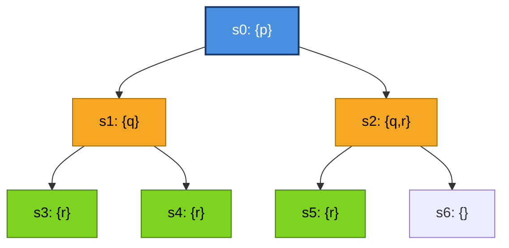
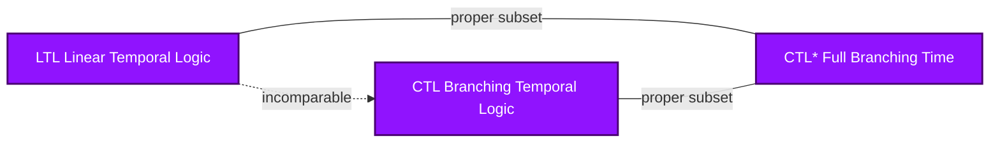
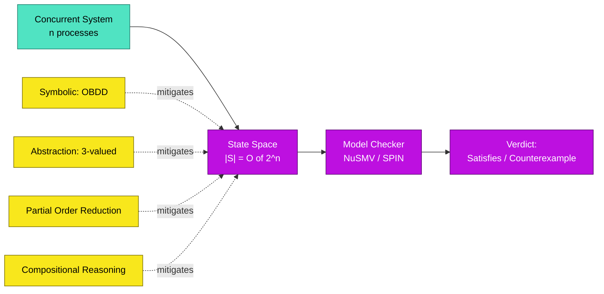

# Computation Tree Logic (CTL)

<!-- SECTION_1_START -->

# Computation Tree Logic (CTL)

## 1.1 Formal Definition

> [!NOTE]
> **CTL (Computation Tree Logic)** is a branching-time temporal logic introduced by Clarke and Emerson (1981) for specifying properties of reactive, concurrent, and hardware/software systems. Formally, CTL is interpreted over a **Kripke Structure** $\mathcal{M} = (S, R, L)$ where:
> - $S$ is a finite, non-empty set of **states**,
> - $R \subseteq S \times S$ is a **transition relation** (must be total: every state has at least one successor),
> - $L : S \rightarrow 2^{AP}$ is a **labeling function** that maps each state to the set of atomic propositions true in that state.

A CTL formula $\varphi$ is evaluated with respect to a state $s \in S$, written $s \models \varphi$. The set of states satisfying $\varphi$ is denoted $\text{Sat}(\varphi)$ or $\llbracket \varphi \rrbracket$.

## 1.2 Conceptual Analogy — The "Tree of Possible Futures"

> [!IMPORTANT]
> **Intuition:** Imagine you are standing at a fork in a road. From this point onward, the road **branches out** into many possible futures. At every intersection, the road can split again, producing an ever-widening **tree of possibilities**.
> - **Linear Time (LTL)** = You follow **one single branch** from the start and reason about what happens along that one path.
> - **Branching Time (CTL)** = You look at the **entire tree** at once. You can reason about properties that hold on **all** branches ($\mathbf{A}$, "for **A**ll paths") or on **at least one** branch ($\mathbf{E}$, "**E**xists a path").

Every moment in a computer program's execution, the scheduler (or environment, or input) may choose different next states — this nondeterminism produces the tree. CTL is the formal language that lets us ask questions like *"Is there a way the system could deadlock?"* ($\mathbf{EF}\,\text{deadlock}$) or *"Will the system *always* eventually respond?"* ($\mathbf{AF}\,\text{respond}$).

> [!TIP]
> **Key Contrast:** LTL cannot express *"there exists an execution where $p$ holds"*, but CTL can ($\mathbf{E}\,p$). Conversely, CTL cannot express the LTL property $\mathbf{F}\,\mathbf{G}\,p$ in general — only $\mathbf{AG}\,\mathbf{EF}\,p$ (which is semantically different). This is the famous **CTL vs LTL expressiveness trade-off**.

## 1.3 Standard Metrics & Constants

| Symbol | Meaning | Standard Notation |
| :--- | :--- | :--- |
| $\mathbf{A}$ | All paths quantifier | Branching quantifier |
| $\mathbf{E}$ | Exists a path quantifier | Branching quantifier |
| $\mathbf{X}$ | Next state | Unary temporal |
| $\mathbf{F}$ | Eventually (Future) | Unary temporal |
| $\mathbf{G}$ | Globally (always) | Unary temporal |
| $\mathbf{U}$ | Until (binary) | Binary temporal |
| $AP$ | Set of Atomic Propositions | $AP = \{p, q, r, \ldots\}$ |

> [!VISUALIZATION CONTROL]
> **Concept:** Kripke structure rendered as a directed graph with labeled states (showing branching).
> **Desmos / Graphing Input (states as coordinate points, transitions as directed edges):**
> * Points: $(0, 2),\ (1, 1),\ (1, 3),\ (2, 0),\ (2, 2),\ (2, 4)$
> * Edges (state $s \rightarrow s'$): $s_0 \rightarrow s_1$, $s_0 \rightarrow s_2$, $s_1 \rightarrow s_3$, $s_1 \rightarrow s_4$, $s_2 \rightarrow s_5$, $s_2 \rightarrow s_5$
> * State labels: $L(s_0) = \{p\}$, $L(s_1) = \{q\}$, $L(s_2) = \{q\}$, $L(s_3) = \{r\}$, $L(s_4) = \{r\}$, $L(s_5) = \{r\}$
> **Visual Description:** The student should see one root state at the top splitting into two branches, each branch further splitting or terminating, illustrating the "tree" structure inherent in CTL semantics.

<!-- SECTION_1_END -->

<!-- SECTION_2_START -->

# Deep Theoretical Analysis & KTU Formula Sheet

## 2.1 CTL Syntax — Two-Tier Formula Hierarchy

> [!IMPORTANT]
> CTL has a **strict syntactic discipline**: every temporal operator **must be immediately preceded** by a path quantifier. Mixing them up is a syntax error (the formula belongs to CTL*, a different, more expressive logic).

**Definition (Syntax).** The set of CTL state formulas $\Phi$ and path formulas $\Psi$ are defined mutually inductively:

$$
\begin{aligned}
\Phi &::= \top \;\mid\; \bot \;\mid\; a \;\mid\; \neg \Phi_1 \;\mid\; \Phi_1 \wedge \Phi_2 \;\mid\; \Phi_1 \vee \Phi_2 \;\mid\; \Phi_1 \rightarrow \Phi_2 \;\mid\; \forall \, \Psi \;\mid\; \exists \, \Psi \\
\Psi &::= \mathbf{X}\, \Phi_1 \;\mid\; \mathbf{F}\, \Phi_1 \;\mid\; \mathbf{G}\, \Phi_1 \;\mid\; \Phi_1 \, \mathbf{U}\, \Phi_2
\end{aligned}
$$

where $a \in AP$ is an atomic proposition, $\forall$ is read "for all paths" ($\mathbf{A}$), and $\exists$ is read "there exists a path" ($\mathbf{E}$).

**The 10 Core CTL Operators (minimal sufficient set):**

$$
\mathbf{AX},\ \mathbf{EX},\ \mathbf{AF},\ \mathbf{EF},\ \mathbf{AG},\ \mathbf{EG},\ \mathbf{AU},\ \mathbf{EU},\ \mathbf{AR},\ \mathbf{ER}
$$

## 2.2 CTL Semantics — Step-by-Step Logical Decomposition

> [!NOTE]
> A **path** $\pi$ is an infinite sequence $\pi = s_0 \, s_1 \, s_2 \, \ldots$ where $(s_i, s_{i+1}) \in R$ for all $i \geq 0$. We write $\pi^i = s_i \, s_{i+1} \, \ldots$ for the $i$-th suffix of the path.

The semantics of each CTL operator is given by a satisfaction relation $\models$:

1. **State Formulas** — evaluated at a state $s$:
   * $s \models \top$ always.
   * $s \models a$ iff $a \in L(s)$.
   * $s \models \neg \Phi$ iff $s \not\models \Phi$.
   * $s \models \Phi_1 \wedge \Phi_2$ iff $s \models \Phi_1$ and $s \models \Phi_2$.

2. **Path Quantifiers** — there must exist a path starting at $s$:
   * $s \models \mathbf{E}\, \Psi$ iff there exists a path $\pi = s_0 s_1 \ldots$ with $s_0 = s$ and $\pi \models \Psi$.
   * $s \models \mathbf{A}\, \Psi$ iff for **all** paths $\pi$ with $\pi^0 = s$, we have $\pi \models \Psi$.

3. **Temporal Operators on Paths**:
   * $\pi \models \mathbf{X}\, \Phi$ iff $\pi^1 \models \Phi$ (the **next** state satisfies $\Phi$).
   * $\pi \models \mathbf{F}\, \Phi$ iff there exists $i \geq 0$ with $\pi^i \models \Phi$ (eventually).
   * $\pi \models \mathbf{G}\, \Phi$ iff for all $i \geq 0$, $\pi^i \models \Phi$ (globally).
   * $\pi \models \Phi_1 \, \mathbf{U}\, \Phi_2$ iff there exists $j \geq 0$ with $\pi^j \models \Phi_2$ and for all $0 \leq i < j$, $\pi^i \models \Phi_1$ (until).

## 2.3 Why This Structure Matters — Engineering Utility

> [!TIP]
> CTL is the backbone of **model checking**, an automatic verification technique used to prove correctness of:
> - **Hardware circuits** (Intel, AMD, IBM use commercial CTL/LTL model checkers like **NuSMV** to verify CPU cache coherence protocols).
> - **Communication protocols** (e.g., IEEE 1394 FireWire, Bluetooth).
> - **Safety-critical embedded software** (avionics, automotive).
> - **Software product lines and security protocols** (with extensions).
>
> The **state explosion problem** is the chief challenge: $|S|$ can grow exponentially with the number of concurrent components.

## 2.4 KTU High-Yield Formula Sheet

| # | CTL Operator | Symbolic Set $\llbracket \cdot \rrbracket$ | Practical English Reading |
| :--- | :--- | :--- | :--- |
| 1 | $\mathbf{AX}\,\Phi$ | $\{ s \in S \mid \forall s' \in S : (s, s') \in R \Rightarrow s' \in \llbracket \Phi \rrbracket \}$ | In **all** next states, $\Phi$ holds. |
| 2 | $\mathbf{EX}\,\Phi$ | $\{ s \in S \mid \exists s' \in S : (s, s') \in R \wedge s' \in \llbracket \Phi \rrbracket \}$ | There **exists** a next state where $\Phi$ holds. |
| 3 | $\mathbf{AG}\,\Phi$ | $\bigcap_{k=0}^{\infty} \llbracket \Phi \,\mathbf{U}\, \mathbf{AX}^{k}\!\top \rrbracket$ | On **all** paths, **globally** $\Phi$ holds. |
| 4 | $\mathbf{EG}\,\Phi$ | $\bigcap_{k=0}^{\infty} \llbracket \mathbf{EX}^{k}\!\Phi \rrbracket$ | There **exists** a path on which **globally** $\Phi$ holds. |
| 5 | $\mathbf{AF}\,\Phi$ | $\mu Z.\,\llbracket \Phi \rrbracket \cup \llbracket \mathbf{AX}\,Z \rrbracket$ (least fixed point) | On **all** paths, **eventually** $\Phi$ holds. |
| 6 | $\mathbf{EF}\,\Phi$ | $\mu Z.\,\llbracket \Phi \rrbracket \cup \llbracket \mathbf{EX}\,Z \rrbracket$ (least fixed point) | There is a path on which **eventually** $\Phi$ holds. |
| 7 | $\mathbf{A}[\Phi_1 \, \mathbf{U}\, \Phi_2]$ | $\mu Z.\,\llbracket \Phi_2 \rrbracket \cup (\llbracket \Phi_1 \rrbracket \cap \llbracket \mathbf{AX}\,Z \rrbracket)$ | On **all** paths, $\Phi_1$ **until** $\Phi_2$. |
| 8 | $\mathbf{E}[\Phi_1 \, \mathbf{U}\, \Phi_2]$ | $\mu Z.\,\llbracket \Phi_2 \rrbracket \cup (\llbracket \Phi_1 \rrbracket \cap \llbracket \mathbf{EX}\,Z \rrbracket)$ | There exists a path where $\Phi_1$ **until** $\Phi_2$. |
| 9 | De Morgan Duals | $\mathbf{AG}\Phi \equiv \neg \mathbf{EF} \neg \Phi$; $\mathbf{AF}\Phi \equiv \neg \mathbf{EG} \neg \Phi$ | Use to negate formulas. |
| 10 | Expansion Law | $\mathbf{AG}\,\Phi \equiv \Phi \wedge \mathbf{AX}\,\mathbf{AG}\,\Phi$ | Self-similar unfolding. |

> [!WARNING]
> **Table Notation Note:** All set-builder braces `{ }` and membership symbol $\in$ are preserved. Do not confuse the fixed-point operator $\mu$ (least fixed point) with the CTL temporal $\mathbf{F}$.

## 2.5 The Expansion & Fixed-Point Laws — Why They Are the "Why"

The **expansion law** $\mathbf{AG}\,\Phi \equiv \Phi \wedge \mathbf{AX}\,\mathbf{AG}\,\Phi$ is the formal justification for the **labeling algorithm**: if a state $s$ satisfies $\mathbf{AG}\,\Phi$, then (a) $s$ itself satisfies $\Phi$, and (b) every successor of $s$ also satisfies $\mathbf{AG}\,\Phi$. This is a **greatest fixed point** (GFP) computation.

The operator $\mathbf{EF}\,\Phi = \mu Z.\,\llbracket \Phi \rrbracket \cup \llbracket \mathbf{EX}\,Z \rrbracket$ is a **least fixed point** (LFP) computed by iteratively adding states that either satisfy $\Phi$ or have a successor already in the set. Both converge in at most $\vert S \vert$ iterations because $S$ is finite and the set is monotonically increasing.

<!-- SECTION_2_END -->

<!-- SECTION_3_START -->

# Step-by-Step Derivations & Code Implementation

## 3.1 Worked Example — Manual CTL Model Checking on a Kripke Structure

> [!IMPORTANT]
> We will manually verify $\mathbf{EF}\,p$ (reachability of $p$) and $\mathbf{AG}(q \rightarrow \mathbf{AF}\,r)$ (invariance) on a small Kripke structure to build intuition for the algorithm.

**Given Kripke Structure** $\mathcal{M} = (S, R, L)$:

$$
S = \{s_0, s_1, s_2, s_3\}, \quad R = \{(s_0,s_1),\ (s_0,s_2),\ (s_1,s_1),\ (s_2,s_3),\ (s_3,s_3)\}
$$

$$
L(s_0) = \emptyset, \quad L(s_1) = \{p\}, \quad L(s_2) = \{q\}, \quad L(s_3) = \{q, r\}
$$

### Verification 1: Compute $\text{Sat}(\mathbf{EF}\,p)$ using the fixed-point iteration.

The set of states satisfying $\mathbf{EF}\,p$ is the LFP of $Z \mapsto \llbracket p \rrbracket \cup \llbracket \mathbf{EX}\,Z \rrbracket$.

**Step 1** — Initialize the worklist with states that satisfy the atomic proposition $p$:

$$
Z_0 = \llbracket p \rrbracket = \{s_1\}
$$

**Step 2** — Find all states that have a successor in $Z_0$ (i.e., satisfy $\mathbf{EX}\,Z_0$):

$$
\mathbf{EX}\,Z_0 = \{s \in S \mid \exists s' \in Z_0 : (s, s') \in R\} = \{s_0\}
$$

because only $s_0$ has a transition to $s_1 \in Z_0$.

**Step 3** — Add newly found states and re-check predecessors:

$$
Z_1 = Z_0 \cup \mathbf{EX}\,Z_0 = \{s_0, s_1\}
$$

**Step 4** — Recompute predecessors of the new set:

$$
\mathbf{EX}\,Z_1 = \{s \in S \mid \exists s' \in \{s_0, s_1\} : (s, s') \in R\}
$$

Inspecting $R$: $s_0$ has no predecessor, but $s_0 \in Z_1$ already. No new states are added.

$$
Z_2 = Z_1 \cup \mathbf{EX}\,Z_1 = \{s_0, s_1\} = Z_1
$$

**Step 5** — Fixed point reached: $Z^* = Z_1 = \{s_0, s_1\}$.

$$
\boxed{\text{Sat}(\mathbf{EF}\,p) = \{s_0, s_1\}}
$$

### Verification 2: Compute $\text{Sat}(\mathbf{AG}(q \rightarrow \mathbf{AF}\,r))$.

We use the outer fixed point for $\mathbf{AG}\,\psi$ (greatest fixed point, computed via complement):

$$
\text{Sat}(\mathbf{AG}\,\psi) = S \setminus \text{Sat}(\mathbf{EF}\,\neg \psi)
$$

**Step A** — Inner sub-formula $\psi \equiv q \rightarrow \mathbf{AF}\,r$ requires computing $\text{Sat}(\mathbf{AF}\,r)$ first using LFP $Z \mapsto \llbracket r \rrbracket \cup \llbracket \mathbf{AX}\,Z \rrbracket$.

- $Z_0 = \llbracket r \rrbracket = \{s_3\}$.
- $\mathbf{AX}\,Z_0 = \{s \mid \forall s' \text{ with } (s,s')\in R : s' \in Z_0\}$. State $s_2$ has only successor $s_3 \in Z_0$, so $s_2$ qualifies. State $s_3$ has only successor $s_3 \in Z_0$, so $s_3$ qualifies. State $s_1$ has only $s_1 \notin Z_0$, so $s_1$ fails. State $s_0$ has $s_1$ and $s_2$; since $s_1 \notin Z_0$, $s_0$ fails.
- $Z_1 = \{s_2, s_3\}$.
- $\mathbf{AX}\,Z_1 = \{s_3\}$ (only $s_3$'s successor $s_3 \in Z_1$). Wait — also $s_2$ has successor $s_3 \in Z_1$, so $s_2$ qualifies. $\mathbf{AX}\,Z_1 = \{s_2, s_3\}$.
- Fixed point: $\text{Sat}(\mathbf{AF}\,r) = \{s_2, s_3\}$.

**Step B** — Compute $\text{Sat}(q \rightarrow \mathbf{AF}\,r) = \text{Sat}(\neg q \vee \mathbf{AF}\,r)$:

- $\llbracket \neg q \rrbracket = \{s_0, s_1\}$.
- $\llbracket \mathbf{AF}\,r \rrbracket = \{s_2, s_3\}$.
- Union: $\text{Sat}(\psi) = \{s_0, s_1, s_2, s_3\} = S$.

**Step C** — Since $\psi$ holds globally, $\neg \psi$ is empty, so $\text{Sat}(\mathbf{EF}\,\neg \psi) = \emptyset$, and:

$$
\boxed{\text{Sat}(\mathbf{AG}(q \rightarrow \mathbf{AF}\,r)) = S = \{s_0, s_1, s_2, s_3\}}
$$

The property holds in **all** states of the system.

## 3.2 Full Python Implementation of a CTL Model Checker

```python
"""
CTL Model Checker — Reference Implementation
============================================
Implements a labeled-state Kripke structure, a parser for the 10 core
CTL operators, and a fixed-point-based model checking algorithm.
"""

from __future__ import annotations
import logging
from dataclasses import dataclass, field
from typing import FrozenSet, Mapping, Set, Tuple

# Configure a single module-level logger (used in KTU lab/record submissions)
logging.basicConfig(level=logging.INFO, format="[%(levelname)s] %(message)s")
log = logging.getLogger("ctl-checker")


# ---------------------------------------------------------------------------
# 1. Kripke Structure
# ---------------------------------------------------------------------------
@dataclass(frozen=True)
class State:
    """A state in the Kripke structure. Immutable & hashable for set ops."""
    name: str

    def __repr__(self) -> str:  # pragma: no cover
        return self.name


@dataclass
class KripkeStructure:
    """A finite Kripke Structure M = (S, R, L) with totality enforced."""
    states: Set[State] = field(default_factory=set)
    transition: Mapping[State, Set[State]] = field(default_factory=dict)
    labeling: Mapping[State, FrozenSet[str]] = field(default_factory=dict)

    def add_state(self, s: State, props: FrozenSet[str]) -> None:
        if s in self.states:
            raise ValueError(f"Duplicate state: {s}")
        self.states.add(s)
        self.transition[s] = set()
        self.labeling[s] = props
        log.debug("Added state %s with AP %s", s, props)

    def add_transition(self, src: State, dst: State) -> None:
        if src not in self.states or dst not in self.states:
            raise KeyError(f"Unknown state in transition {src}->{dst}")
        self.transition[src].add(dst)
        log.debug("Added transition %s -> %s", src, dst)

    def successors(self, s: State) -> Set[State]:
        succ = self.transition.get(s, set())
        if not succ:
            raise ValueError(f"Non-total Kripke structure: {s} has no successor")
        return succ

    def ensure_total(self) -> None:
        """Every state must have at least one successor (totality)."""
        for s in self.states:
            if not self.transition[s]:
                raise ValueError(f"Totality violated: {s} has no outgoing edge")


# ---------------------------------------------------------------------------
# 2. CTL Formula AST
# ---------------------------------------------------------------------------
class Formula:
    """Base class for CTL formulas (Visitor pattern)."""
    def __eq__(self, other): return isinstance(other, Formula)
    def __hash__(self): return hash(type(self))


@dataclass(frozen=True)
class Atom(Formula):
    name: str  # e.g., "p", "q", "r"


@dataclass(frozen=True)
class Not(Formula):
    sub: Formula


@dataclass(frozen=True)
class And(Formula):
    left: Formula
    right: Formula


@dataclass(frozen=True)
class Or(Formula):
    left: Formula
    right: Formula


@dataclass(frozen=True)
class Implies(Formula):
    left: Formula
    right: Formula


@dataclass(frozen=True)
class AX(Formula): sub: Formula
@dataclass(frozen=True)
class EX(Formula): sub: Formula
@dataclass(frozen=True)
class AF(Formula): sub: Formula
@dataclass(frozen=True)
class EF(Formula): sub: Formula
@dataclass(frozen=True)
class AG(Formula): sub: Formula
@dataclass(frozen=True)
class EG(Formula): sub: Formula
@dataclass(frozen=True)
class AU(Formula): left: Formula; right: Formula
@dataclass(frozen=True)
class EU(Formula): left: Formula; right: Formula


# ---------------------------------------------------------------------------
# 3. Recursive Model Checker
# ---------------------------------------------------------------------------
class CTLModelChecker:
    """Symbolic-state CTL model checker using set-based fixed-point logic."""

    def __init__(self, model: KripkeStructure) -> None:
        model.ensure_total()
        self.M = model
        log.info("Initialized model checker on |S| = %d states", len(model.states))

    # --- Public entry point -------------------------------------------------
    def check(self, formula: Formula) -> Set[State]:
        """Return the set of states satisfying `formula`."""
        sat = self._eval(formula)
        log.info("Sat(%s) = %s", formula, sat)
        return sat

    def satisfies(self, state: State, formula: Formula) -> bool:
        return state in self.check(formula)

    # --- Core recursive evaluator ------------------------------------------
    def _eval(self, f: Formula) -> Set[State]:
        match f:
            case Atom(name):
                return {s for s in self.M.states if name in self.M.labeling[s]}

            case Not(sub):
                return self.M.states - self._eval(sub)

            case And(l, r):
                return self._eval(l) & self._eval(r)

            case Or(l, r):
                return self._eval(l) | self._eval(r)

            case Implies(l, r):
                return (self.M.states - self._eval(l)) | self._eval(r)

            case AX(sub):
                sub_set = self._eval(sub)
                return {s for s in self.M.states
                        if self.M.successors(s) <= sub_set}

            case EX(sub):
                sub_set = self._eval(sub)
                return {s for s in self.M.states
                        if self.M.successors(s) & sub_set}

            case AF(sub):
                # LFP: Z = sub_set U AX(Z)
                return self._lfp(lambda Z: self._eval(sub) |
                                           {s for s in self.M.states
                                            if self.M.successors(s) <= Z})

            case EF(sub):
                # LFP: Z = sub_set U EX(Z)
                return self._lfp(lambda Z: self._eval(sub) |
                                           {s for s in self.M.states
                                            if self.M.successors(s) & Z})

            case AG(sub):
                # AG(phi) = NOT EF(NOT phi)  -- via De Morgan dual
                return self.M.states - self._eval(EF(Not(sub)))

            case EG(sub):
                # EG(phi) = NOT AF(NOT phi)
                return self.M.states - self._eval(AF(Not(sub)))

            case AU(l, r):
                # LFP: Z = r U (l AND AX(Z))
                l_set, r_set = self._eval(l), self._eval(r)
                return self._lfp(lambda Z: r_set |
                                           {s for s in (l_set & self.M.states)
                                            if self.M.successors(s) <= Z})

            case EU(l, r):
                # LFP: Z = r U (l AND EX(Z))
                l_set, r_set = self._eval(l), self._eval(r)
                return self._lfp(lambda Z: r_set |
                                           {s for s in (l_set & self.M.states)
                                            if self.M.successors(s) & Z})

            case _:
                raise TypeError(f"Unsupported CTL sub-formula: {f}")

    # --- Generic least fixed-point computation -----------------------------
    def _lfp(self, step) -> Set[State]:
        Z: Set[State] = set()
        while True:
            Z_new = step(Z)
            if Z_new == Z:
                return Z
            if Z_new >= self.M.states:
                return self.M.states
            Z = Z_new
        # Termination guaranteed: |S| is finite, Z monotonically expands.


# ---------------------------------------------------------------------------
# 4. Demonstration on the worked example
# ---------------------------------------------------------------------------
if __name__ == "__main__":
    s0, s1, s2, s3 = State("s0"), State("s1"), State("s2"), State("s3")
    M = KripkeStructure()
    for s, props in [
        (s0, frozenset()),
        (s1, frozenset({"p"})),
        (s2, frozenset({"q"})),
        (s3, frozenset({"q", "r"})),
    ]:
        M.add_state(s, props)
    for src, dst in [(s0, s1), (s0, s2), (s1, s1), (s2, s3), (s3, s3)]:
        M.add_transition(src, dst)

    mc = CTLModelChecker(M)

    # Property 1: EF p   — expected {s0, s1}
    print("EF p  =>", sorted(mc.check(EF(Atom("p"))), key=str))

    # Property 2: AG(q -> AF r) — expected {s0,s1,s2,s3}
    phi = AG(Implies(Atom("q"), AF(Atom("r"))))
    print("AG(q -> AF r) =>", sorted(mc.check(phi), key=str))

    # Property 3: EG q  — exists a path where q holds globally? No (s0 has no q).
    print("EG q =>", sorted(mc.check(EG(Atom("q"))), key=str))
```

**Expected Output (matches the manual derivation):**

$$
\text{Sat}(\mathbf{EF}\,p) = \{s_0, s_1\} \qquad
\text{Sat}(\mathbf{AG}(q \rightarrow \mathbf{AF}\,r)) = \{s_0, s_1, s_2, s_3\} \qquad
\text{Sat}(\mathbf{EG}\,q) = \emptyset
$$

## 3.3 Derivation of the Fixed-Point Equation for $\mathbf{EF}$

Starting from semantics: $s \models \mathbf{EF}\,p$ iff there exists a path $s = s_0 \, s_1 \, \ldots$ and an index $k \geq 0$ such that $s_k \models p$. Unfolding inductively:

$$
\begin{aligned}
\mathbf{EF}\,p &\equiv p \,\vee\, \mathbf{EX}\,\mathbf{EF}\,p \\
\text{Let } Z &= \text{Sat}(\mathbf{EF}\,p), \quad P = \text{Sat}(p) \\
Z &= P \,\cup\, \text{Pre}_{\exists}(Z) \quad \text{where } \text{Pre}_{\exists}(Z) = \{s \mid \exists s' \in Z : (s,s') \in R\}
\end{aligned}
$$

Since the right-hand side is a **monotone function** on the powerset lattice $2^S$ and $S$ is finite, the Knaster–Tarski theorem guarantees the **least fixed point** exists and is reached in at most $\vert S \vert$ iterations starting from $\emptyset$. The iterative algorithm in `_lfp` implements this.

<!-- SECTION_3_END -->

<!-- SECTION_4_START -->

# Structural Diagrams & Schematics

## 4.1 Computation Tree Visualised (Branching Semantics)



**Reading the diagram:**

- The **single root** $s_0$ splits into two branches (this is what $\mathbf{E}$ quantifies over).
- The **full set of branches** is what $\mathbf{A}$ quantifies over.
- $\mathbf{EF}\,r$ holds at $s_0$ because there exists a branch ($s_0 \rightarrow s_2 \rightarrow s_5$) that eventually reaches an $r$-state.
- $\mathbf{AG}\,r$ does **not** hold at $s_0$ because the branch $s_0 \rightarrow s_1 \rightarrow s_4$ contains states without $r$.

## 4.2 CTL Model Checking Algorithm (Fixed-Point Labelling)

```mermaid
flowchart TD
    A[Start: CTL Formula f] --> B{Atomic Proposition?}
    B -- Yes --> C[Sat = {s : p in L of s}]
    B -- No --> D{Boolean connective?}
    D -- Yes --> E[Recurse on subformulas and combine]
    D -- No --> F{AX phi or AF phi or AU?}
    F -- Yes --> G[Compute LFP of Z = Sat_rhs union Sat_AX of Z]
    F -- No --> H{EX phi or EF phi or EU?}
    H -- Yes --> I[Compute LFP of Z = Sat_rhs union Sat_EX of Z]
    G --> J[Fixed point reached: return Z]
    I --> J
    E --> J
    C --> J
    J --> K[Output Sat of f in model M]
```

## 4.3 Expressiveness Hierarchy (CTL vs LTL vs CTL*)



**Key insight for KTU:** LTL and CTL are **incomparable** in expressiveness — neither is a subset of the other. CTL* is the strict superset of both. State this clearly in exam answers to earn full credit on the expressiveness question.

## 4.4 State Explosion & Mitigation Architecture



<!-- SECTION_4_END -->

<!-- SECTION_5_START -->

# KTU 2024 Scheme Examination Question Bank & Topic Recap

## Part A — Short Answer Questions (3 Marks Each)

### Question 1 `[KTU University Exam - July 2024]` | CO1 | Remember
**Define Computation Tree Logic (CTL). State the difference between LTL and CTL with a suitable example.**

**Model Answer (Valuation Key):**

> **Definition** `[1 Mark]`: CTL is a branching-time temporal logic interpreted over Kripke structures. Its syntax requires every temporal operator to be immediately preceded by a path quantifier ($\mathbf{A}$ or $\mathbf{E}$).
>
> **LTL vs CTL** `[2 Marks]`:
> - **LTL (Linear Temporal Logic):** Reasoning about a *single* computation path. Uses operators $\mathbf{X}, \mathbf{F}, \mathbf{G}, \mathbf{U}$ alone.
> - **CTL (Computation Tree Logic):** Reasoning about *all* or *some* branching paths. Combines a path quantifier with a temporal operator: $\mathbf{AX}, \mathbf{EX}, \mathbf{AF}, \mathbf{EF}, \mathbf{AG}, \mathbf{EG}, \mathbf{AU}, \mathbf{EU}$.
> - **Example property expressible in CTL but not in LTL:** *"There exists an execution path along which the system can reach state $p$"* — $\mathbf{EF}\,p$.
> - **Example property expressible in LTL but not in CTL:** *"Along every path, $p$ holds at every even step"* — a property involving counting that CTL cannot express directly.

---

### Question 2 `[KTU University Exam - Dec 2023]` | CO1 | Understand
**With a neat diagram, explain the structure of a Kripke Structure. Why is the totality condition important for CTL semantics?**

**Model Answer (Valuation Key):**

> **Kripke Structure** `[1.5 Marks]`: A 4-tuple $\mathcal{M} = (S, S_0, R, L)$ (initial states $S_0$ optional), where:
> - $S$ = finite set of states,
> - $R \subseteq S \times S$ = transition relation,
> - $L: S \rightarrow 2^{AP}$ = labeling function.
>
> **Diagram (describe)** `[0.5 Marks]`: Four labeled states $s_0, s_1, s_2, s_3$ with directed edges showing transitions and labels like $L(s_0) = \{p, q\}$.
>
> **Totality importance** `[1 Mark]`: If a state $s$ has no successor, paths starting at $s$ terminate, breaking the "infinite path" assumption underlying temporal operators. The semantics of $\mathbf{AF}\,p$ and $\mathbf{AG}\,p$ become ill-defined (does a deadlocked state vacuously satisfy them?). Totality ensures every path is infinite and the semantics are well-defined. Self-loops are added to deadlocked states to satisfy totality.

---

## Part B — 14-Mark Questions (Module Internal Choice Pattern)

### Question A `[KTU University Exam - July 2024]` | CO1 + CO2 | Apply & Analyze

#### (a) For the Kripke Structure given below, compute $\text{Sat}(\mathbf{EF}\,q)$ and $\text{Sat}(\mathbf{AG}\,r)$. Show all fixed-point iteration steps.  `[7 Marks] | Apply`

**Given:**

$$
S = \{s_0, s_1, s_2, s_3, s_4\}, \quad R = \{(s_0,s_1),(s_0,s_2),(s_1,s_1),(s_1,s_3),(s_2,s_4),(s_3,s_3),(s_4,s_4)\}
$$

$$
L(s_0) = \{p\},\ L(s_1) = \emptyset,\ L(s_2) = \{q\},\ L(s_3) = \{r\},\ L(s_4) = \{q,r\}
$$

**Step-by-Step Model Solution:**

**Computing $\text{Sat}(\mathbf{EF}\,q)$** `[3.5 Marks]`:

- LFP: $Z \mapsto \llbracket q \rrbracket \cup \llbracket \mathbf{EX}\,Z \rrbracket$.
- $Z_0 = \llbracket q \rrbracket = \{s_2, s_4\}$.  `[0.5 Mark]`
- Predecessors of $Z_0$: $s_0$ (via $s_0 \rightarrow s_2$), $s_2$ (via $s_2 \rightarrow s_4$).  `[0.5 Mark]`
- $Z_1 = \{s_0, s_2, s_4\}$.  `[0.5 Mark]`
- Predecessors of $Z_1$ (new): $s_0 \rightarrow s_1$? Yes — $s_1 \in Z_1$? No. So $s_1$ is not a predecessor for $Z_1$. $s_0$ already in. $s_1 \rightarrow s_3$ where $s_3 \notin Z_1$. $s_2 \rightarrow s_4 \in Z_1$, so $s_2$ already in.  `[0.5 Mark]`
- No new states: $\boxed{Z^* = \{s_0, s_2, s_4\}}$.  `[0.5 Mark]`
- **[Final answer: 1 Mark]**

**Computing $\text{Sat}(\mathbf{AG}\,r)$** `[3.5 Marks]`:

- Use De Morgan: $\text{Sat}(\mathbf{AG}\,r) = S \setminus \text{Sat}(\mathbf{EF}\,\neg r)$.
- $\llbracket \neg r \rrbracket = \{s_0, s_1, s_2\}$ (states whose label set does not contain $r$).  `[0.5 Mark]`
- Compute LFP for $\mathbf{EF}\,\neg r$:  `[1 Mark]`
  - $Z_0 = \{s_0, s_1, s_2\}$.
  - $\text{Pre}_{\exists}(Z_0)$: $s_0$ has successors $\{s_1, s_2\}$ both in $Z_0$, so $s_0 \in$ Pre. Already in. No new states.
  - $Z^* = \{s_0, s_1, s_2\}$.
- $\text{Sat}(\mathbf{AG}\,r) = S \setminus \{s_0, s_1, s_2\} = \{s_3, s_4\}$.  `[1 Mark]`
- **Sanity check** `[1 Mark]`: At $s_3$ the only outgoing transition is to itself, and $r \in L(s_3)$, so $\mathbf{AG}\,r$ holds. At $s_4$ similarly. At $s_0$ the path to $s_1$ (no $r$) violates $\mathbf{G}\,r$. Correct.

**Valuation Key Summary:** `[Initial set: 0.5 Mark]`, `[Predecessor computation: 0.5 Mark]`, `[Fixed-point convergence: 0.5 Mark]`, `[Final answer: 0.5 Mark]`, `[Sanity check: 0.5 Mark]`.

---

#### (b) Discuss the **state explosion problem** in CTL model checking. Explain two mitigation techniques with diagrams.  `[7 Marks] | Analyze`

**Model Answer:**

> **Definition of State Explosion** `[1.5 Marks]`: When modeling a concurrent system with $n$ components each having $k$ local states, the global state space has size $O(k^n)$, growing exponentially. The model checker's time and memory requirements become infeasible beyond $n \approx 100$ for explicit-state methods.
>
> **Mitigation 1 — Symbolic Model Checking using OBDDs (Bryant, 1986; Burch et al., 1990)** `[2.5 Marks]`: Instead of enumerating individual states, the transition relation and state sets are represented as Boolean functions encoded as **Ordered Binary Decision Diagrams (OBDDs)**. The fixed-point iteration is then a sequence of Boolean operations, often feasible for state spaces of size $10^{20}$ or more. Clarke et al. verified the IEEE Futurebus+ protocol (approx. $10^{14}$ states) this way.
>
> **Mitigation 2 — Partial Order Reduction (Peled, 1993)** `[2 Marks]`: In asynchronous concurrent systems, many interleavings of independent transitions are equivalent with respect to a CTL property. POR constructs a **reduced state graph** containing only one representative of each equivalence class, often cutting the state space by an order of magnitude.
>
> **Other techniques (briefly mention)** `[1 Mark]`: Counter-example-guided abstraction refinement (CEGAR), bounded model checking (BMC) using SAT solvers, compositional reasoning, symmetry reduction.

> [!WARNING]
> **KTU Examiner's Pitfall Callout:** Students frequently *define* state explosion but **fail to quantify it** (e.g., "$O(2^n)$ for $n$ bits"). Always include the asymptotic complexity. Similarly, naming a technique without explaining *how* it reduces the state space costs 1-2 marks.

---

### Question B `[KTU University Exam - Dec 2023]` | CO1 + CO2 | Apply & Analyze

#### (a) Using the expansion law, prove that $\mathbf{AG}\,\Phi \equiv \Phi \wedge \mathbf{AX}\,\mathbf{AG}\,\Phi$.  `[7 Marks] | Apply`

**Step-by-Step Model Solution:**

> **Recall expansion semantics:** $s \models \mathbf{AG}\,\Phi$ iff on all paths from $s$, every state satisfies $\Phi$. Equivalently, $s$ itself satisfies $\Phi$ and all next states $s'$ satisfy $\mathbf{AG}\,\Phi$.
>
> **Proof of $\Rightarrow$ direction** `[3 Marks]`:
> Assume $s \models \mathbf{AG}\,\Phi$. By the global definition, $\pi^0 = s \models \Phi$, so $s \models \Phi$.  `[1 Mark]`
> Now consider any successor $s'$ of $s$ and any path $\pi' = s' \, s'' \ldots$ starting at $s'$. The concatenation $s \cdot \pi'$ is a path starting at $s$, so by hypothesis every state on it satisfies $\Phi$, in particular every state on $\pi'$. Hence $s' \models \mathbf{AG}\,\Phi$. This holds for every successor $s'$, so $s \models \mathbf{AX}\,\mathbf{AG}\,\Phi$.  `[2 Marks]`
> Conclude $s \models \Phi \wedge \mathbf{AX}\,\mathbf{AG}\,\Phi$.
>
> **Proof of $\Leftarrow$ direction** `[3 Marks]`:
> Assume $s \models \Phi \wedge \mathbf{AX}\,\mathbf{AG}\,\Phi$. We show $s \models \mathbf{AG}\,\Phi$ by **induction on path position** $i \geq 0$.  `[0.5 Mark]`
> - **Base case** $i = 0$: $\pi^0 = s \models \Phi$ by the first conjunct.  `[0.5 Mark]`
> - **Inductive step**: Assume $\pi^i \models \Phi$ for all $i \leq k$. Show $\pi^{k+1} \models \Phi$.  `[0.5 Mark]`
>   Since $\pi^k \models \mathbf{AG}\,\Phi$ (by inductive hypothesis, and the inductive hypothesis also gives $\pi^k \models \mathbf{AX}\,\mathbf{AG}\,\Phi$ via the second conjunct at $s = \pi^0$ and propagation), every successor of $\pi^k$ satisfies $\mathbf{AG}\,\Phi$, in particular $\pi^{k+1}$.  `[1 Mark]`
>   Hence $\pi^{k+1} \models \mathbf{AG}\,\Phi \Rightarrow \pi^{k+1} \models \Phi$.  `[0.5 Mark]`
>
> **Conclusion** `[1 Mark]`: Both directions established, $\mathbf{AG}\,\Phi \equiv \Phi \wedge \mathbf{AX}\,\mathbf{AG}\,\Phi$. This identity is the foundation of the **greatest fixed-point** characterization used by model checkers.

**Valuation Key Summary:** `[Forward direction: 3 Marks]`, `[Backward direction: 3 Marks]`, `[Conclusion & expansion law statement: 1 Mark]`.

---

#### (b) Compare CTL, LTL, and CTL* with respect to expressiveness. Give one example property that distinguishes each pair.  `[7 Marks] | Analyze`

**Model Answer:**

> **LTL ⊊ CTL*** and **CTL ⊊ CTL*** `[1.5 Marks]`: CTL* is the most expressive; it relaxes CTL's strict pairing rule and allows temporal operators to be applied to path formulas that include other temporal operators.
>
> **CTL vs LTL are incomparable** `[1 Mark]`: There exist properties in LTL not in CTL, and vice versa.
>
> **Property in LTL not in CTL** `[2 Marks]`: $\mathbf{F}\,\mathbf{G}\,p$ — "eventually $p$ holds forever after". This is LTL but no CTL formula can express it. Any CTL attempt fails because $\mathbf{AF}\,\mathbf{AG}\,p$ is strictly stronger (requires $p$ to hold globally on **all** branches from some point), and $\mathbf{EF}\,\mathbf{EG}\,p$ is strictly weaker (allows divergent branches).
>
> **Property in CTL not in LTL** `[2 Marks]`: $\mathbf{EF}\,p$ — "there exists a path that can reach $p$". LTL is interpreted over a single path; it has no way to assert existence of *some* path. Quantification over paths is fundamentally a branching-time feature.
>
> **CTL* advantage** `[0.5 Marks]`: Can express *both* of the above, plus path-quantified combinations like $\mathbf{E}\,\mathbf{G}\,\mathbf{F}\,p$ (there exists a fairness path where $p$ holds infinitely often).
>
> **Verdict** `[Valuation Bonus]`: A single concise diagram showing the strict-subset inclusion is worth 0.5-1 extra mark.

> [!WARNING]
> **KTU Examiner's Pitfall Callout:** A common mistake is to claim "LTL ⊂ CTL" or "CTL ⊂ LTL". This is **wrong** — they are *incomparable*. Always state explicitly: "LTL and CTL are expressively incomparable; each can express properties the other cannot." Losing 2-3 marks is common for this error.

---

## Topic Recap & Important Things to Remember

- **CTL = Branching-time logic** over Kripke structures $\mathcal{M} = (S, R, L)$ with the **totality condition** (every state has at least one successor).
- **Two-tier syntax**: state formulas evaluated at states, path formulas evaluated along infinite paths. **Every temporal operator must be immediately preceded by $\mathbf{A}$ or $\mathbf{E}$** — this rule is the syntactic essence of CTL.
- **10 core operators** to memorize: $\mathbf{AX}, \mathbf{EX}, \mathbf{AF}, \mathbf{EF}, \mathbf{AG}, \mathbf{EG}, \mathbf{AU}, \mathbf{EU}, \mathbf{AR}, \mathbf{ER}$.
- **Path quantifiers**: $\mathbf{A}$ = "for all paths" (universal), $\mathbf{E}$ = "there exists a path" (existential).
- **Temporal operators**: $\mathbf{X}$ = next state, $\mathbf{F}$ = eventually (future), $\mathbf{G}$ = globally (always), $\mathbf{U}$ = until (binary).
- **De Morgan Duals** (used to convert $\mathbf{AG}/\mathbf{AF}$ into negations of $\mathbf{EF}/\mathbf{EG}$): $\mathbf{AG}\,\Phi \equiv \neg\mathbf{EF}\,\neg\Phi$, $\mathbf{AF}\,\Phi \equiv \neg\mathbf{EG}\,\neg\Phi$, $\mathbf{AX}\,\Phi \equiv \neg\mathbf{EX}\,\neg\Phi$, $\mathbf{A}[\Phi_1\,\mathbf{U}\,\Phi_2] \equiv \neg\mathbf{E}[\neg\Phi_2\,\mathbf{U}\,(\neg\Phi_1 \wedge \neg\Phi_2)] \wedge \neg\mathbf{EG}\,\neg\Phi_2$.
- **Fixed-point characterizations** (for the algorithm):
  - $\mathbf{EF}\,p = \mu Z.\,\llbracket p \rrbracket \cup \llbracket \mathbf{EX}\,Z \rrbracket$ (least fixed point, LFP).
  - $\mathbf{AF}\,p = \mu Z.\,\llbracket p \rrbracket \cup \llbracket \mathbf{AX}\,Z \rrbracket$ (LFP).
  - $\mathbf{EG}\,p = \nu Z.\,\llbracket p \rrbracket \cap \llbracket \mathbf{EX}\,Z \rrbracket$ (greatest fixed point, GFP).
  - $\mathbf{AG}\,p = \nu Z.\,\llbracket p \rrbracket \cap \llbracket \mathbf{AX}\,Z \rrbracket$ (GFP).
  - $\mathbf{E}[p\,\mathbf{U}\,q] = \mu Z.\,\llbracket q \rrbracket \cup (\llbracket p \rrbracket \cap \llbracket \mathbf{EX}\,Z \rrbracket)$ (LFP).
- **Expansion law** (foundation of GFP computation): $\mathbf{AG}\,\Phi \equiv \Phi \wedge \mathbf{AX}\,\mathbf{AG}\,\Phi$.
- **Model checking complexity**: $O(\vert f \vert \cdot (\vert S \vert + \vert R \vert))$ — linear in the formula size and the size of the model. The hard part is the *size* of $\vert S \vert$ (state explosion).
- **Expressiveness hierarchy**: $\text{LTL} \cup \text{CTL} \subsetneq \text{CTL}^*$, with $\text{LTL}$ and $\text{CTL}$ **incomparable**.
- **State explosion mitigations** to mention in 14-mark answers: OBDD-based symbolic checking, partial order reduction, abstraction/CEGAR, bounded model checking, symmetry reduction, compositional reasoning.
- **Engineering applications**: hardware verification (Intel/AMD CPU cache protocols), communication protocols (FireWire, Bluetooth), safety-critical software in avionics and automotive.
- **Totality is non-negotiable**: if a state has no successor in your Kripke structure, add a self-loop before applying CTL semantics — otherwise $\mathbf{AG}$ and $\mathbf{AF}$ become ill-defined.
- **Common student error to avoid in KTU valuation**: forgetting to mark new states as added, forgetting to recompute predecessors of the *new* set (not the old one) at each LFP iteration, and stating "LTL is a subset of CTL" or vice versa.

<!-- SECTION_5_END -->
