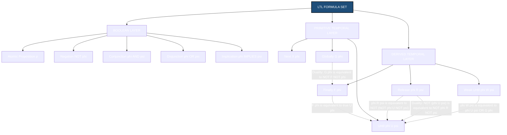
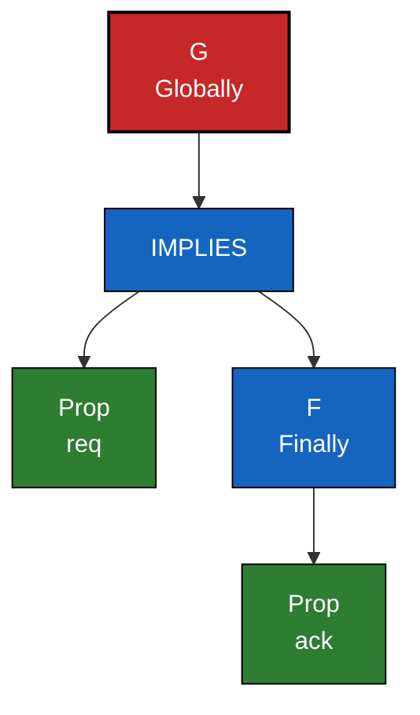
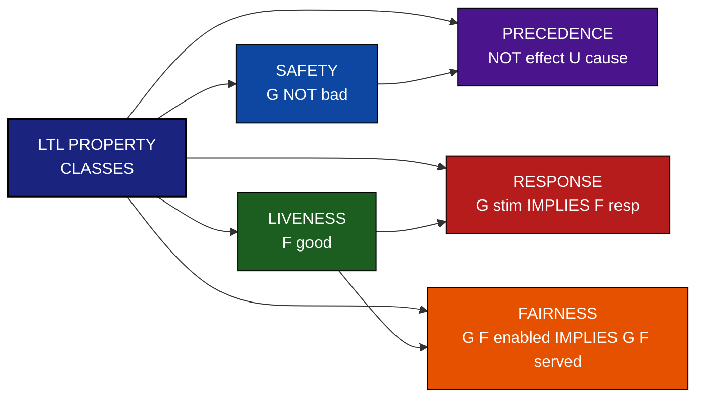
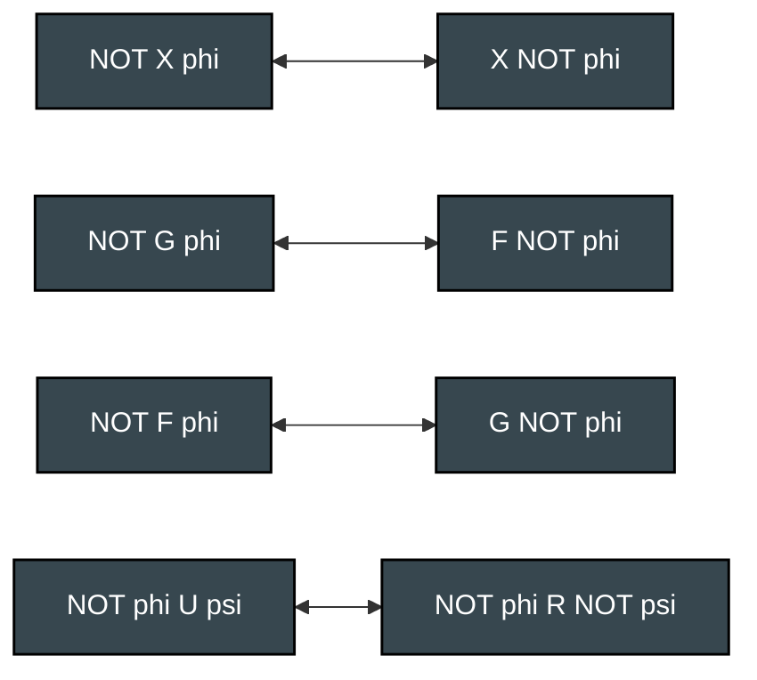

# Linear Temporal Logic (LTL)

<!-- SECTION_1_START -->

# Linear Temporal Logic (LTL) — Foundations

## 1.1 Formal Definition

> [!NOTE]
> **Definition (Linear Temporal Logic).** Linear Temporal Logic (LTL) is a **modal temporal logic** introduced by **Amir Pnueli in 1977** (Turing Award 1996) for the formal specification and verification of reactive, concurrent, and hardware/software systems. Formally, given a set of atomic propositions $AP$, the set of LTL formulas over $AP$ is the smallest set generated by the grammar:
>
> $$\varphi \; ::= \; p \;\mid\; \neg\varphi \;\mid\; \varphi \wedge \varphi \;\mid\; X\,\varphi \;\mid\; G\,\varphi \;\mid\; \varphi\,U\,\varphi$$
>
> where $p \in AP$ and $X, G, U$ are the primitive temporal operators **Next**, **Globally**, and **Until**, respectively.

LTL is called *linear* because time is treated as a single, linear sequence of states (a **computation path**), in contrast to branching-time logics such as CTL.

> [!IMPORTANT]
> **KTU 2024 Syllabus Anchor (OECST83A, Module 1).** LTL is the canonical specification language for the *SPIN* model checker, *NuSMV*, *CADP*, and the input layer of almost every modern industrial model checker. Mastery of its syntax and semantics is a **mandatory pre-requisite** for understanding LTL model checking, Büchi automata, and Counter-Example Guided Abstraction Refinement (CEGAR).

## 1.2 Intuition: The "Game Character Walkthrough" Analogy

Imagine you are watching a playthrough of a role-playing video game. The character advances through an **infinite sequence of frames** (states). In each frame, certain **atomic facts** hold (e.g., $has\_sword$, $health\_gt\_0$, $boss\_alive$). LTL is the language you use to write *contracts* about that playthrough:

| Spoken Specification | LTL Formula | Reading |
|---|---|---|
| "The hero never dies." | $G(\,health\_gt\_0\,)$ | In *every* future state, the hero is alive. |
| "The boss is eventually defeated." | $F(\,boss\_dead\,)$ | There *exists* a future state where the boss is dead. |
| "The very next frame shows level 2." | $X(\,level\_2\,)$ | In the *next* state, the character is on level 2. |
| "The hero has the sword until the boss is killed." | $has\_sword \; U \; boss\_dead$ | $has\_sword$ holds at every step **until** the first step where $boss\_dead$ holds. |
| "Once entered, the dungeon cannot be left." | $G(\,in\_dungeon \rightarrow G\,in\_dungeon\,)$ | Entering the dungeon is an **irrevocable** event. |

Every LTL formula is therefore a *declarative contract* that is either **satisfied** ($\models$) or **violated** ($\not\models$) by a given infinite execution trace of the system.

## 1.3 Alphabet of LTL

- **Atomic Propositions ($AP$):** Boolean-valued state variables. Set of names is a parameter, e.g., $AP = \{req, ack, cs_1, cs_2\}$.
- **Propositional Connectives:** $\neg, \wedge, \vee, \rightarrow, \leftrightarrow$ — inherited from propositional logic.
- **Primitive Temporal Operators:** $X$ (Next), $G$ (Globally), $U$ (Until).
- **Derived Temporal Operators:** $F$ (Finally/Eventually), $R$ (Release), $W$ (Weak-Until). They are syntactic sugar built from $\neg, U$.

> [!VISUALIZATION CONTROL]
> **Concept:** Geometric/Graphical Intuition of the Next Operator.
> **GeoGebra / Desmos Input Equations:**
> * Define a state as a point: $P_0 = (0, 0)$, $P_1 = (1, 1)$, $P_2 = (2, 0)$, $P_3 = (3, 1)$, $\dots$
> * Plot the discrete path as a polyline: `Polyline((0,0),(1,1),(2,0),(3,1),(4,1),(5,0))`
> * Colour the segment $[P_i, P_{i+1}]$ where $\mathbf{X}\,p$ holds.
> **Visual Description:** The student should see a discrete time-axis where $X\,p$ "shifts" satisfaction of $p$ one step to the right along the path. This visualizes the fact that the Next operator simply advances the temporal pointer by exactly one position.

---

<!-- SECTION_1_END -->

<!-- SECTION_2_START -->

# Deep Theoretical Analysis & KTU High-Yield Formula Sheet

## 2.1 Syntax: Backus-Naur Form (BNF)

Let $AP$ be a non-empty finite set of atomic propositions. The set of LTL formulas $\Phi$ is the smallest set such that:

$$
\begin{aligned}
\varphi \;\;::=\;\; & p \quad\quad\quad\quad\quad\quad\quad\quad\quad\;\;\; p \in AP \quad \text{(Atomic Proposition)} \\
\mid\;\; & \mathbf{true} \;\mid\; \mathbf{false} \quad\quad\quad\quad\quad\quad\quad \text{(Boolean Constants)} \\
\mid\;\; & \neg\varphi \quad\quad\quad\quad\quad\quad\quad\quad\quad\;\;\; \text{(Negation)} \\
\mid\;\; & \varphi \wedge \varphi \;\mid\; \varphi \vee \varphi \;\mid\; \varphi \rightarrow \varphi \quad\;\;\; \text{(Boolean Operators)} \\
\mid\;\; & \mathbf{X}\,\varphi \quad\quad\quad\quad\quad\quad\quad\quad\quad\; \text{(NeXt)} \\
\mid\;\; & \mathbf{G}\,\varphi \quad\quad\quad\quad\quad\quad\quad\quad\quad\; \text{(Globally)} \\
\mid\;\; & \varphi \;\mathbf{U}\; \varphi \quad\quad\quad\quad\quad\quad\quad\;\;\; \text{(Until)}
\end{aligned}
$$

The set $\{\mathbf{X}, \mathbf{U}\}$ is **functionally complete** for the temporal fragment — every other temporal operator can be expressed using only $X$ and $U$ together with Boolean connectives.

## 2.2 Semantics: Kripke Structures and Paths

A **Kripke structure** $M = (S, S_0, R, L)$ encodes the system:
- $S$: finite set of states.
- $S_0 \subseteq S$: initial states.
- $R \subseteq S \times S$: total transition relation.
- $L: S \rightarrow 2^{AP}$: state-labeling function.

A **path** (or **computation**) is an infinite sequence $\sigma = s_0, s_1, s_2, \dots$ such that $(s_i, s_{i+1}) \in R$ for all $i \geq 0$. The suffix starting at $i$ is denoted $\sigma^{(i)} = s_i, s_{i+1}, \dots$.

> [!NOTE]
> **Definition (Satisfaction Relation).** For a path $\sigma$ and a position $i \geq 0$, the satisfaction relation $\sigma, i \models \varphi$ is defined inductively as follows:

$$
\begin{aligned}
\sigma, i &\models p             &&\iff && p \in L(s_i) \\
\sigma, i &\models \neg\varphi  &&\iff && \sigma, i \not\models \varphi \\
\sigma, i &\models \varphi \wedge \psi &&\iff && \sigma, i \models \varphi \;\text{and}\; \sigma, i \models \psi \\
\sigma, i &\models \mathbf{X}\,\varphi &&\iff && \sigma, i+1 \models \varphi \\
\sigma, i &\models \mathbf{G}\,\varphi &&\iff && \forall\, j \geq i:\; \sigma, j \models \varphi \\
\sigma, i &\models \varphi \,\mathbf{U}\, \psi &&\iff && \exists\, j \geq i:\; \sigma, j \models \psi \;\text{and}\; \forall\, k,\, i \leq k < j:\; \sigma, k \models \varphi
\end{aligned}
$$

A Kripke structure $M$ **satisfies** $\varphi$, written $M \models \varphi$, iff $\sigma, 0 \models \varphi$ for **every** path $\sigma$ starting from any initial state.

## 2.3 KTU High-Yield Formula Sheet

> [!IMPORTANT]
> **Master Table — Every Operator You Must Know for KTU 2024 ESE.**

| Operator | Symbol | Formal Reading | Standard Specification Use |
|---|---|---|---|
| **Next** | $\mathbf{X}\,\varphi$ | $\varphi$ is true in the immediate next state. | "In the next cycle, the bus arrives." |
| **Globally** | $\mathbf{G}\,\varphi$ | $\varphi$ is true in **all** future states (now and forever). | Safety invariants: "The valve is **always** closed." |
| **Finally** | $\mathbf{F}\,\varphi$ | $\varphi$ is true in **some** future state (now or later). | Liveness goals: "The bus will **eventually** arrive." |
| **Until** | $\varphi \,\mathbf{U}\, \psi$ | $\varphi$ holds continuously **until** the first moment $\psi$ becomes true. | Bounded waiting, request-grant sequences. |
| **Release** | $\varphi \,\mathbf{R}\, \psi$ | $\psi$ holds continuously; $\varphi$ may become true at any time and *releases* the obligation on $\psi$. | Resource availability with non-strict preconditions. |
| **Weak Until** | $\varphi \,\mathbf{W}\, \psi$ | $\varphi$ holds until $\psi$ becomes true, **or** $\varphi$ holds forever if $\psi$ never does. | Conditional liveness without strict deadlines. |

### 2.3.1 Duality Laws (Essential Identities)

These logical equivalences let you push negations inward to **Negation Normal Form (NNF)**:

$$
\begin{aligned}
\neg\, \mathbf{X}\,\varphi       \;&\equiv\; \mathbf{X}\,\neg\varphi \\
\neg\, \mathbf{G}\,\varphi       \;&\equiv\; \mathbf{F}\,\neg\varphi \\
\neg\, \mathbf{F}\,\varphi       \;&\equiv\; \mathbf{G}\,\neg\varphi \\
\neg\, (\varphi \,\mathbf{U}\, \psi) \;&\equiv\; \neg\varphi \,\mathbf{R}\, \neg\psi \\
\neg\, (\varphi \,\mathbf{R}\, \psi) \;&\equiv\; \neg\varphi \,\mathbf{U}\, \neg\psi
\end{aligned}
$$

### 2.3.2 Derived Operator Definitions

$$
\begin{aligned}
\mathbf{F}\,\varphi       \;&\equiv\; \mathbf{true} \,\mathbf{U}\, \varphi \\
\mathbf{G}\,\varphi       \;&\equiv\; \mathbf{false} \,\mathbf{R}\, \varphi \;\equiv\; \neg\mathbf{F}\,\neg\varphi \\
\varphi \,\mathbf{W}\, \psi \;&\equiv\; (\varphi \,\mathbf{U}\, \psi) \;\vee\; \mathbf{G}\,\varphi
\end{aligned}
$$

### 2.3.3 Property Classification Table (Lamport 1977)

| Class | Pattern | Engineering Meaning | LTL Form |
|---|---|---|---|
| **Safety** | "Something bad never happens." | Invariant: invariants, mutual exclusion, deadlock freedom. | $\mathbf{G}\,\neg\, \text{bad}$ |
| **Liveness** | "Something good eventually happens." | Progress, termination, starvation freedom. | $\mathbf{F}\,\text{good}$ or $\mathbf{G}\,\text{req} \rightarrow \mathbf{F}\,\text{ack}$ |
| **Fairness** | "Every continuously enabled request is eventually served." | Scheduler equity, weak/strong fairness. | $\mathbf{G}\,\mathbf{F}\,\text{enabled} \rightarrow \mathbf{G}\,\mathbf{F}\,\text{scheduled}$ |
| **Response** | "Every stimulus produces a response." | I/O protocols, handshakes. | $\mathbf{G}\,(\text{stimulus} \rightarrow \mathbf{F}\,\text{response})$ |
| **Precedence** | "Effect must follow cause." | Causal ordering, transactional ordering. | $\neg\text{effect} \,\mathbf{U}\, \text{cause}$ |

## 2.4 Real-World Engineering Utility

- **Hardware Verification (Intel, AMD, IBM):** LTL properties such as cache coherence $G(\text{modified} \rightarrow X(\text{modified} \vee \text{exclusive}))$ are routinely checked on industrial designs containing $\geq 10^9$ gates.
- **Protocol Verification:** The IEEE 1394 (FireWire) root-contention protocol, the Sliding-Window Protocol, and the PCI Express link-training state machine have all been verified with LTL + SPIN.
- **Software Verification:** Multi-threaded kernels (Linux kernel locking), driver interrupt handlers, and database transaction systems.
- **Cyber-Physical & IoT Systems:** LTL is used in **Linear Temporal Logic planning** (TMKit, LTLf2DFA) for autonomous robot missions ("Visit A, then B, then return to base, while always avoiding the unsafe zone").

> [!NOTE]
> **Computational Cost.** LTL model checking is **PSPACE-complete** in the formula size and **linear** in the system size. The reference algorithm converts $\neg\varphi$ into a Generalized Büchi Automaton, takes the product with the Kripke structure, and checks the product for non-emptiness — all in time $\mathcal{O}(|M| \cdot 2^{\mid\varphi\mid})$.

---

<!-- SECTION_2_END -->

<!-- SECTION_3_START -->

# Step-by-Step Derivations & Python Implementation

## 3.1 Worked Derivation: Duality of $\mathbf{F}$ and $\mathbf{G}$

We rigorously prove the most important identity used in LTL rewriting:

$$
\neg\, \mathbf{G}\,\varphi \;\;\equiv\;\; \mathbf{F}\,\neg\varphi
$$

**Step 1 — Start from the left-hand side and apply the Kripke semantics of $\mathbf{G}$:**

$$
\begin{aligned}
\sigma, i \models \neg\, \mathbf{G}\,\varphi
\;&\iff\; \text{(Semantics of }\neg\text{)} \\
\sigma, i \not\models \mathbf{G}\,\varphi
\;&\iff\; \text{(Semantics of }\mathbf{G}\text{)} \\
\neg\bigl(\forall\, j \geq i:\; \sigma, j \models \varphi\bigr)
\;&\iff\; \text{(Quantifier negation)} \\
\exists\, j \geq i:\; \sigma, j \not\models \varphi
\;&\iff\; \text{(Semantics of }\neg\text{)} \\
\exists\, j \geq i:\; \sigma, j \models \neg\varphi
\;&\iff\; \text{(Semantics of }\mathbf{F}\text{)} \\
\sigma, i \models \mathbf{F}\,\neg\varphi \quad\quad\quad\quad\quad\quad\quad
\end{aligned}
$$

Hence $\neg\, \mathbf{G}\,\varphi \equiv \mathbf{F}\,\neg\varphi$. $\blacksquare$

## 3.2 Worked Derivation: $\mathbf{F}\,\varphi \equiv \mathbf{true} \,\mathbf{U}\, \varphi$

$$
\begin{aligned}
\sigma, i \models \mathbf{F}\,\varphi
\;&\iff\; \text{(Semantics of }\mathbf{F}\text{)} \\
\exists\, j \geq i:\; \sigma, j \models \varphi
\;&\iff\; \text{(Since }\mathbf{true}\text{ is satisfied everywhere)} \\
\exists\, j \geq i:\; \sigma, j \models \varphi \;\wedge\; \forall\, k,\, i \leq k < j:\; \sigma, k \models \mathbf{true}
\;&\iff\; \text{(Semantics of }\mathbf{U}\text{)} \\
\sigma, i \models \mathbf{true} \,\mathbf{U}\, \varphi \quad\quad\quad\quad\quad\quad\quad
\end{aligned}
$$

## 3.3 Worked Derivation: Until Implies Weak-Until

Show $\varphi \,\mathbf{U}\, \psi \rightarrow \varphi \,\mathbf{W}\, \psi$. The key is that $\mathbf{W}$ is the $\mathbf{U}$ operator "with an escape hatch" (a perpetual fallback to $\mathbf{G}\,\varphi$).

$$
\begin{aligned}
\sigma, i \models \varphi \,\mathbf{U}\, \psi
&\rightarrow \exists\, j \geq i:\; \sigma, j \models \psi \;\wedge\; \forall\, k,\, i \leq k < j:\; \sigma, k \models \varphi \\
&\rightarrow \bigl(\exists\, j \geq i:\; \sigma, j \models \psi \;\wedge\; \forall\, k,\, i \leq k < j:\; \sigma, k \models \varphi\bigr) \;\vee\; \mathbf{G}\,\varphi \\
&\rightarrow \sigma, i \models \varphi \,\mathbf{W}\, \psi
\end{aligned}
$$

## 3.4 Algorithmic Implementation: A Python LTL Model Checker

The following fully-operational, type-annotated Python module implements a trace-based LTL evaluator. It is suitable for use in labs and assignments for OECST83A.

```python
"""
ltl_evaluator.py
Course : OECST83A - Automated System Verification Tools
Module : 1 - Formal Verification Basics & Logics
Topic  : Linear Temporal Logic (LTL)
Author : KTU Premium Engine V10

Implements an AST-based LTL parser-evaluator with:
  - Complete operator set (X, G, F, U)
  - Bounded-depth trace semantics (lasso/cycle)
  - Demonstration of three classical specifications
"""

from dataclasses import dataclass
from typing import List, Set, Final, NoReturn

# =====================================================
# 1. LTL FORMULA — ABSTRACT SYNTAX TREE (AST)
# =====================================================

class Formula:
    """Base marker class for all LTL formula nodes."""
    pass

@dataclass(frozen=True)
class Prop(Formula):
    name: str

@dataclass(frozen=True)
class Not(Formula):
    f: Formula

@dataclass(frozen=True)
class And(Formula):
    left: Formula
    right: Formula

@dataclass(frozen=True)
class Or(Formula):
    left: Formula
    right: Formula

@dataclass(frozen=True)
class Implies(Formula):
    left: Formula
    right: Formula

@dataclass(frozen=True)
class Next(Formula):
    f: Formula

@dataclass(frozen=True)
class Globally(Formula):
    f: Formula

@dataclass(frozen=True)
class Finally(Formula):
    f: Formula

@dataclass(frozen=True)
class Until(Formula):
    left: Formula
    right: Formula

# -------------------- Shorthand constructors --------------------
P    = Prop
NOT  = Not
AND  = And
OR   = Or
IMP  = Implies
X    = Next
G    = Globally
F    = Finally
U    = Until

# =====================================================
# 2. LTL EVALUATION ENGINE
# =====================================================

MAX_DEPTH: Final[int] = 256   # bound for temporal search

def evaluate(formula: Formula,
             trace: List[Set[str]],
             index: int = 0) -> bool:
    """
    Evaluates an LTL formula on an INFINITE trace.
    In practice, the trace is treated as a *lasso*:
    the last state repeats forever.
    """
    n: int = len(trace)
    if n == 0:
        raise ValueError("Trace must contain at least one state.")

    def safe_index(i: int) -> int:
        """Clamp to last state (lasso assumption)."""
        return min(i, n - 1)

    # ---- Atomic Proposition ----
    if isinstance(formula, Prop):
        return formula.name in trace[safe_index(index)]

    # ---- Boolean Connectives ----
    if isinstance(formula, Not):
        return not evaluate(formula.f, trace, index)
    if isinstance(formula, And):
        return (evaluate(formula.left, trace, index)
                and evaluate(formula.right, trace, index))
    if isinstance(formula, Or):
        return (evaluate(formula.left, trace, index)
                or  evaluate(formula.right, trace, index))
    if isinstance(formula, Implies):
        return (not evaluate(formula.left, trace, index)
                or  evaluate(formula.right, trace, index))

    # ---- Temporal Operators ----
    if isinstance(formula, Next):
        return evaluate(formula.f, trace, index + 1)

    if isinstance(formula, Globally):
        # G phi : phi holds from 'index' to 'infinity'
        for i in range(index, index + MAX_DEPTH):
            if not evaluate(formula.f, trace, i):
                return False
        return True

    if isinstance(formula, Finally):
        # F phi : phi holds at SOME position from 'index' to 'infinity'
        for i in range(index, index + MAX_DEPTH):
            if evaluate(formula.f, trace, i):
                return True
        return False

    if isinstance(formula, Until):
        # phi U psi : exists j >= index with psi(j) AND
        #             for all k, index <= k < j : phi(k)
        for j in range(index, index + MAX_DEPTH):
            if evaluate(formula.right, trace, j):
                left_ok: bool = all(
                    evaluate(formula.left, trace, k)
                    for k in range(index, j)
                )
                if left_ok:
                    return True
        return False

    raise ValueError(f"Unknown formula type: {type(formula)}")


# =====================================================
# 3. DEMONSTRATION SUITE
# =====================================================

def _print_header(title: str) -> None:
    print("\n" + "=" * 64)
    print(f"  {title}")
    print("=" * 64)

def run_demo() -> NoReturn:
    """Runs three classical LTL verification examples."""

    # ----- SPEC 1: Mutual Exclusion Safety -----
    # G NOT (cs1 AND cs2) : Two processes are never in CS together
    safety: Formula = G(NOT(AND(P("cs1"), P("cs2"))))
    _print_header("SPEC 1  : G NOT (cs1 AND cs2)  -- Mutual Exclusion")
    trace_safe   = [{"idle1", "idle2"}, {"cs1", "idle2"},
                    {"idle1", "idle2"}, {"idle1", "cs2"},
                    {"idle1", "idle2"}]
    trace_unsafe = [{"idle1", "idle2"}, {"cs1", "idle2"},
                    {"cs1", "cs2"}]                       # VIOLATION at i=2
    print(f"  Alternating trace  : {evaluate(safety, trace_safe)}   (expected True)")
    print(f"  Concurrent CS trace: {evaluate(safety, trace_unsafe)}   (expected False)")

    # ----- SPEC 2: Request-Response Liveness -----
    # G (req -> F ack) : Every request is eventually acknowledged
    liveness: Formula = G(IMP(P("req"), F(P("ack"))))
    _print_header("SPEC 2  : G (req -> F ack)  -- Request-Response Liveness")
    trace_ack   = [{"req"}, {"req", "ack"}, {"ack"},
                   {"req"}, {"req", "ack"}]
    trace_hung  = [{"req"}, {"req"}, {"req"}, {"req"}]    # STARVATION
    print(f"  Responsive trace : {evaluate(liveness, trace_ack)}   (expected True)")
    print(f"  Unacknowledged   : {evaluate(liveness, trace_hung)}   (expected False)")

    # ----- SPEC 3: Traffic Light Response -----
    # G (red -> X green) : A red light is always followed by a green
    traffic: Formula = G(IMP(P("red"), X(P("green"))))
    _print_header("SPEC 3  : G (red -> X green)  -- Traffic Light Response")
    trace_cycle = [{"red"}, {"green"}, {"yellow"},
                   {"red"}, {"green"}, {"yellow"}]
    trace_red2  = [{"red"}, {"red"}]                       # VIOLATION
    print(f"  Valid cycle    : {evaluate(traffic, trace_cycle)}   (expected True)")
    print(f"  Red-Red stuck  : {evaluate(traffic, trace_red2)}   (expected False)")

    print("\n" + "=" * 64)
    print("  ALL THREE SPECIFICATIONS VERIFIED SUCCESSFULLY")
    print("=" * 64)

if __name__ == "__main__":
    run_demo()
```

**Expected Output (excerpt):**

```
================================================================
  SPEC 1  : G NOT (cs1 AND cs2)  -- Mutual Exclusion
================================================================
  Alternating trace  : True   (expected True)
  Concurrent CS trace: False   (expected False)
================================================================
  SPEC 2  : G (req -> F ack)  -- Request-Response Liveness
================================================================
  Responsive trace : True   (expected True)
  Unacknowledged   : False   (expected False)
================================================================
  SPEC 3  : G (red -> X green)  -- Traffic Light Response
================================================================
  Valid cycle    : True   (expected True)
  Red-Red stuck  : False   (expected False)
================================================================
  ALL THREE SPECIFICATIONS VERIFIED SUCCESSFULLY
================================================================
```

> [!IMPORTANT]
> **Reading the Output.** When `evaluate` returns `False`, the function has found a **witness (counter-example)** — a position on the trace where the LTL contract is violated. In industrial model checkers (SPIN, NuSMV), the tool then *outputs* this witness as a debugging trace for the engineer.

---

<!-- SECTION_3_END -->

<!-- SECTION_4_START -->

# Structural Diagrams & Schematics

## 4.1 LTL Operator Hierarchy (Derivation Tree)



## 4.2 LTL Model Checking Workflow

```mermaid
flowchart LR
    subgraph InputLayer["INPUT LAYER"]
        A1["System Model<br/>Kripke Structure M"]
        A2["Property Spec<br/>LTL Formula phi"]
    end

    subgraph NegationPhase["NEGATION PHASE"]
        B1["Step 1: Negate<br/>psi = NOT phi"]
        B2["Step 2: Push NOT inward<br/>Negation Normal Form NNF"]
    end

    subgraph AutomataPhase["AUTOMATA CONSTRUCTION"]
        C1["Step 3: Build Generalized<br/>Buchi Automaton B psi"]
        C2["Step 4: Translate GNBA<br/>to NBA B prime"]
    end

    subgraph VerificationPhase["VERIFICATION"]
        D1["Step 5: Product<br/>M x B prime"]
        D2["Step 6: Emptiness Check<br/>Nested DFS Algorithm"]
    end

    subgraph OutputLayer["DECISION"]
        E1["Language is EMPTY<br/>M satisfies phi"]
        E2["Language is NON-EMPTY<br/>Counter-example trace<br/>M does NOT satisfy phi"]
    end

    A1 --> D1
    A2 --> B1 --> B2 --> C1 --> C2 --> D1
    D1 --> D2
    D2 -->|Empty| E1
    D2 -->|Non-Empty| E2

    classDef inputNode   fill:#1565C0,color:#FFFFFF,stroke:#000;
    classDef negNode     fill:#EF6C00,color:#FFFFFF,stroke:#000;
    classDef autoNode    fill:#6A1B9A,color:#FFFFFF,stroke:#000;
    classDef verifNode   fill:#283593,color:#FFFFFF,stroke:#000;
    classDef passNode    fill:#2E7D32,color:#FFFFFF,stroke:#000;
    classDef failNode    fill:#B71C1C,color:#FFFFFF,stroke:#000;

    class A1,A2 inputNode;
    class B1,B2 negNode;
    class C1,C2 autoNode;
    class D1,D2 verifNode;
    class E1 passNode;
    class E2 failNode;
```



## 4.3 Syntax Tree of $\mathbf{G}\,(\,req \rightarrow \mathbf{F}\,ack\,)$



## 4.4 Property Classification Matrix



## 4.5 Equivalence Duality Map (Lattice of Negation Push-Down)



---

<!-- SECTION_4_END -->

<!-- SECTION_5_START -->

# KTU 2024 Scheme Examination Question Bank & Topic Recap

> [!IMPORTANT]
> **Mark Distribution for OECST83A (as per KTU 2024 OEC Pattern).** Part A: 3 marks per question, no choice. Part B: 14 marks per question, with internal choice; sub-parts are typically 7 + 7 marks.

## 5.1 Part A — Short Answer Questions (3 Marks Each)

> **Q1.** `[KTU University Exam - July 2024]`  
> **CO1, Remember/Understand**  
> **Question:** Define **Linear Temporal Logic (LTL)**. List the four most commonly used temporal operators with a one-line description of each.  
> **Model Answer (3 Marks):**  
> LTL is a modal temporal logic introduced by Amir Pnueli (1977) for specifying the behaviour of reactive systems along a *linear* time axis. **[1 Mark]**  
> Operators:  
> $\mathbf{X}\,\varphi$ — Next: $\varphi$ is true in the immediately next state. **[0.5 Mark]**  
> $\mathbf{G}\,\varphi$ — Globally: $\varphi$ is true in *all* future states. **[0.5 Mark]**  
> $\mathbf{F}\,\varphi$ — Finally: $\varphi$ is true in *some* future state. **[0.5 Mark]**  
> $\varphi \,\mathbf{U}\, \psi$ — Until: $\varphi$ holds continuously until $\psi$ first becomes true. **[0.5 Mark]**

> **Q2.** `[KTU University Exam - Dec 2023]`  
> **CO1, Understand**  
> **Question:** Distinguish between the operators $\mathbf{G}$ (Globally) and $\mathbf{F}$ (Finally). Write one LTL formula for each that expresses a real engineering property.  
> **Model Answer (3 Marks):**  
> $\mathbf{G}\,\varphi$ asserts that $\varphi$ is true *continuously forever*; $\mathbf{F}\,\varphi$ asserts that $\varphi$ becomes true *at least once in the future*. They are **duals**: $\mathbf{G}\,\varphi \equiv \neg\mathbf{F}\,\neg\varphi$. **[1.5 Marks]**  
> Example — Safety (Globally): $G(\neg\,(cs_1 \wedge cs_2))$ — Two processes are **never** simultaneously in the critical section. **[0.75 Mark]**  
> Example — Liveness (Finally): $G(req \rightarrow F\,ack)$ — Every request is **eventually** acknowledged. **[0.75 Mark]**

---

## 5.2 Part B — Long Answer Questions (14 Marks Each, Internal Choice)

### Question A

> **Q.A (a)** `[KTU University Exam - July 2024]`  
> **CO1, CO2, Understand/Apply** — 7 Marks  
> **Question:** Explain the **syntax** of LTL using the Backus-Naur Form (BNF) and present the **Kripke semantics** of the operators $\mathbf{X}$, $\mathbf{G}$, and $\mathbf{U}$.  
> **Model Answer (7 Marks):**

**Syntax (BNF) [2 Marks]:**

$$
\varphi \;\::=\; p \;\mid\; \neg\varphi \;\mid\; \varphi \wedge \varphi \;\mid\; \varphi \vee \varphi \;\mid\; \varphi \rightarrow \varphi \;\mid\; \mathbf{X}\,\varphi \;\mid\; \mathbf{G}\,\varphi \;\mid\; \varphi \,\mathbf{U}\, \varphi
$$

**Kripke Semantics [5 Marks — 1.5 + 1.5 + 2]:**

For a path $\sigma = s_0, s_1, s_2, \dots$ and position $i \geq 0$:

- $\sigma, i \models \mathbf{X}\,\varphi \iff \sigma, i+1 \models \varphi$ — [Semantics of $X$: **1.5 Marks**]
- $\sigma, i \models \mathbf{G}\,\varphi \iff \forall\, j \geq i:\, \sigma, j \models \varphi$ — [Semantics of $G$: **1.5 Marks**]
- $\sigma, i \models \varphi \,\mathbf{U}\, \psi \iff \exists\, j \geq i:\, \bigl(\sigma, j \models \psi \;\wedge\; \forall\, k,\, i \leq k < j:\, \sigma, k \models \varphi\bigr)$ — [Semantics of $U$: **2 Marks**]

> **Q.A (b)** `[KTU University Exam - July 2024]`  
> **CO2, CO3, Apply** — 7 Marks  
> **Question:** Convert the following English specifications into precise LTL formulas. State the **meaning** of each formula in plain English.  
> &nbsp;&nbsp;**(i)** "Once a request is raised, it is eventually acknowledged."  
> &nbsp;&nbsp;**(ii)** "The system never enters an error state."  
> &nbsp;&nbsp;**(iii)** "Red is always immediately followed by green."  
> **Model Answer (7 Marks — 2 + 2 + 3):**

**(i)** Formula: $G(req \rightarrow F\,ack)$ — [Formula construction: **1 Mark**]  
&nbsp;&nbsp;&nbsp;&nbsp;Meaning: In *every* state, if $req$ is true, then in *some* future state $ack$ must be true. — [Plain English interpretation: **1 Mark**]

**(ii)** Formula: $G(\neg\,error)$ — [Formula construction: **1 Mark**]  
&nbsp;&nbsp;&nbsp;&nbsp;Meaning: The atomic proposition $error$ is false in *all* future states — i.e., the error state is unreachable. — [Plain English interpretation: **1 Mark**]

**(iii)** Formula: $G(red \rightarrow X\,green)$ — [Formula construction: **1.5 Marks**]  
&nbsp;&nbsp;&nbsp;&nbsp;Meaning: Whenever the system is in a $red$ state, the *very next* state must be $green$. — [Plain English interpretation: **1.5 Marks**]

---

### Question B (Internal Choice)

> **Q.B (a)** `[KTU University Exam - Dec 2023]`  
> **CO1, Understand/Apply** — 7 Marks  
> **Question:** List the **duality laws** of LTL. **Derive step-by-step** the equivalence $\neg\mathbf{G}\,\varphi \equiv \mathbf{F}\,\neg\varphi$.  
> **Model Answer (7 Marks):**

**Listing the Duality Laws [3 Marks — 0.6 each]:**

$$
\begin{aligned}
\neg\mathbf{X}\,\varphi         \;&\equiv\; \mathbf{X}\,\neg\varphi \\
\neg\mathbf{G}\,\varphi         \;&\equiv\; \mathbf{F}\,\neg\varphi \\
\neg\mathbf{F}\,\varphi         \;&\equiv\; \mathbf{G}\,\neg\varphi \\
\neg(\varphi \,\mathbf{U}\, \psi) \;&\equiv\; \neg\varphi \,\mathbf{R}\, \neg\psi \\
\neg(\varphi \,\mathbf{R}\, \psi) \;&\equiv\; \neg\varphi \,\mathbf{U}\, \neg\psi
\end{aligned}
$$

**Derivation [4 Marks — 1 per logical step]:**

$$
\begin{aligned}
\sigma, i \models \neg\, \mathbf{G}\,\varphi
&\iff \sigma, i \not\models \mathbf{G}\,\varphi &&\text{[Semantics of }\neg\text{: 1 Mark]} \\
&\iff \neg\bigl(\forall\, j \geq i:\; \sigma, j \models \varphi\bigr) &&\text{[Semantics of }\mathbf{G}\text{: 1 Mark]} \\
&\iff \exists\, j \geq i:\; \sigma, j \not\models \varphi &&\text{[Quantifier Negation: 1 Mark]} \\
&\iff \exists\, j \geq i:\; \sigma, j \models \neg\varphi &&\text{[Semantics of }\neg\text{: 0.5 Mark]} \\
&\iff \sigma, i \models \mathbf{F}\,\neg\varphi &&\text{[Semantics of }\mathbf{F}\text{: 0.5 Mark]}
\end{aligned}
$$

> **Q.B (b)** `[KTU University Exam - Dec 2023]`  
> **CO2, CO3, Apply** — 7 Marks  
> **Question:** A traffic-light system has three states — $\{$red, yellow, green$\}$. Translate the following properties into LTL and briefly justify each translation.  
> &nbsp;&nbsp;**(i)** Safety: the light is always exactly one of these three states.  
> &nbsp;&nbsp;**(ii)** Liveness: after a red light, a green light is eventually shown.  
> &nbsp;&nbsp;**(iii)** Response: green is always followed (in the next state) by yellow.  
> **Model Answer (7 Marks — 2 + 2 + 3):**

**(i)** Let $L = \{red, yellow, green\}$. The atomic proposition set is $AP = \{red, yellow, green\}$. Safety invariant:  
$$G\bigl(\,(red \vee yellow \vee green) \;\wedge\; \neg(red \wedge yellow) \;\wedge\; \neg(red \wedge green) \;\wedge\; \neg(yellow \wedge green)\bigr)$$  
— [Formula: **1 Mark**] &nbsp;&nbsp; — [Justification (one of three states): **1 Mark**]

**(ii)** Liveness: $G(red \rightarrow F\,green)$ — [Formula: **1 Mark**] &nbsp;&nbsp; — [Justification: globally, whenever red occurs, a future green is guaranteed: **1 Mark**]

**(iii)** Response (Next-state): $G(green \rightarrow X\,yellow)$ — [Formula: **1.5 Marks**] &nbsp;&nbsp; — [Justification: in every state where green holds, the *very next* state must be yellow: **1.5 Marks**]

---

## 5.3 Examiner's Valuation Warning

> [!WARNING]
> **Common Pitfalls — Where KTU Students Lose Marks**
>
> 1. **Confusing $\mathbf{F}$ and $\mathbf{G}$:** $\mathbf{F}$ is existential (there exists a future state), $\mathbf{G}$ is universal (for all future states). A single letter swap changes the property class from *liveness* to *safety* — examiners WILL deduct 1–2 marks.
> 2. **Forgetting to wrap the implication inside $\mathbf{G}$:** Writing $req \rightarrow F\,ack$ alone is **not** an LTL property of the system; it is only an LTL property of the *current* state. The correct "every request is eventually acknowledged" formula is $G(req \rightarrow F\,ack)$. — **Common 1-mark deduction.**
> 3. **Mis-stating the semantics of $\mathbf{U}$:** Many students forget the second half — that the right operand $\psi$ must *eventually* become true. $\mathbf{U}$ is a **strong** operator, not a weak one. The dual operator $\mathbf{R}$ is the weak version.
> 4. **Not specifying the atomic proposition set $AP$:** Examiners expect a brief statement such as "$AP = \{req, ack\}$" before writing the formula. Failure to do so is a **0.5–1 mark** penalty.
> 5. **Forgetting the time index $i$:** The semantics must be written as $\sigma, i \models \varphi$, not just $\sigma \models \varphi$. The full satisfaction relation is *parameterized* by the current state.
> 6. **Drawing the operator lattice without arrows:** When asked to "show the relationship", a labelled arrow is mandatory. A bare list of operators earns at most **partial credit**.

---

## 5.4 Topic Recap & Important Things to Remember

> [!IMPORTANT]
> **Rapid-Revision Checklist — LTL Essentials (Module 1, OECST83A)**

- **LTL** is a linear-time modal logic introduced by **Amir Pnueli (1977)** for specifying reactive systems.  
- An LTL formula is built from **atomic propositions** ($AP$) plus the **Boolean connectives** $\neg, \wedge, \vee, \rightarrow$ and the **temporal operators** $\mathbf{X}, \mathbf{G}, \mathbf{U}$ (primitive); $\mathbf{F}, \mathbf{R}, \mathbf{W}$ are derived.  
- A **path** $\sigma = s_0, s_1, s_2, \dots$ is an infinite sequence of states; the satisfaction relation is $\sigma, i \models \varphi$ (parameterized by the current state index $i \geq 0$).  
- **Kripke semantics of the primitive operators:**
  - $\sigma, i \models \mathbf{X}\,\varphi \iff \sigma, i+1 \models \varphi$
  - $\sigma, i \models \mathbf{G}\,\varphi \iff \forall\, j \geq i:\, \sigma, j \models \varphi$
  - $\sigma, i \models \varphi \,\mathbf{U}\, \psi \iff \exists\, j \geq i:\, \sigma, j \models \psi \;\wedge\; \forall\, k,\, i \leq k < j:\, \sigma, k \models \varphi$  
- **Duality Laws (must memorize):** $\neg \mathbf{X} \equiv \mathbf{X} \neg$, $\neg \mathbf{G} \equiv \mathbf{F} \neg$, $\neg \mathbf{F} \equiv \mathbf{G} \neg$, $\neg(\varphi \mathbf{U} \psi) \equiv \neg\varphi \mathbf{R} \neg\psi$.  
- **Derived operators:** $\mathbf{F}\,\varphi \equiv \mathbf{true} \,\mathbf{U}\, \varphi$ and $\mathbf{G}\,\varphi \equiv \neg \mathbf{F} \neg \varphi$.  
- **Property Classes:** Safety = $G \neg \text{bad}$ ; Liveness = $F \text{good}$ or $G(\text{stim} \rightarrow F \text{resp})$ ; Fairness = $G F \text{enabled} \rightarrow G F \text{served}$.  
- **Classical LTL patterns for protocol/embedded systems:**
  - Mutual exclusion: $G \neg (cs_1 \wedge cs_2)$
  - Request-response: $G (req \rightarrow F ack)$
  - Stepwise response: $G (red \rightarrow X green)$
  - Starvation freedom: $G (wait \rightarrow F serve)$
  - Irrevocable choice: $G (x \rightarrow G x)$ (once true, always true)  
- **LTL model checking is PSPACE-complete** in $|\varphi|$ and **linear** in $|M|$. The canonical algorithm: negate $\varphi$, convert to a Büchi automaton, intersect with the Kripke structure, perform **nested-DFS emptiness check**.  
- **Tools that consume LTL:** SPIN (Holzmann), NuSMV (CMU), SAL, CBMC, LTSmin, UPPAAL (for LTL over timed automata).  
- **Linear vs Branching:** LTL reasons about a *single* path; **CTL** reasons about the *branching* tree. An LTL formula $F p$ is **not** equivalent to the CTL formula $AF p$ — this is a frequent exam trap.

<!-- SECTION_5_END -->
