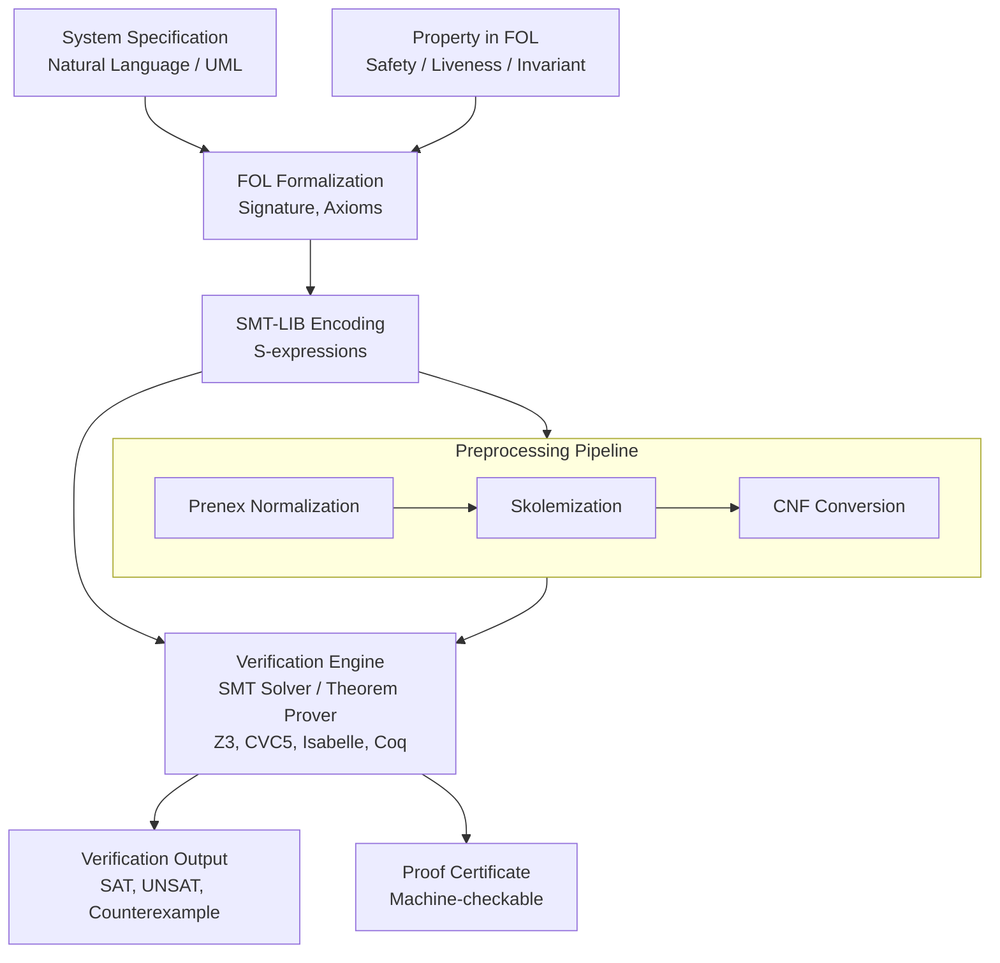
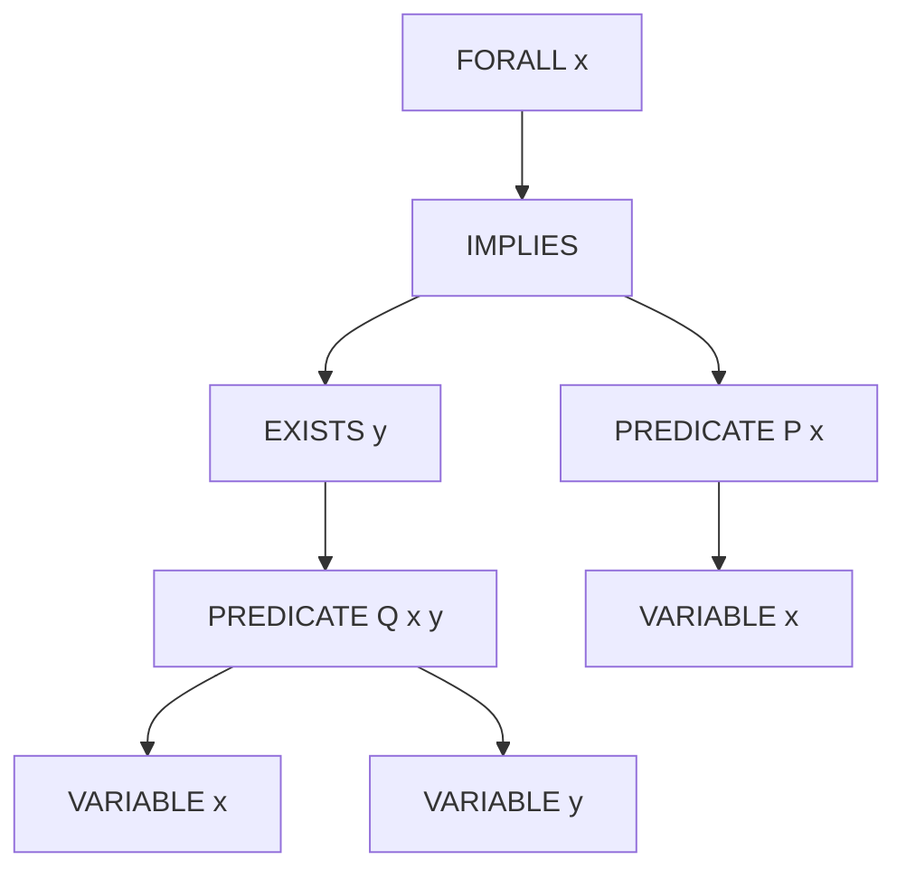
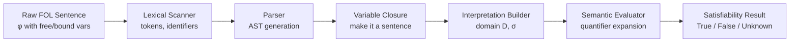
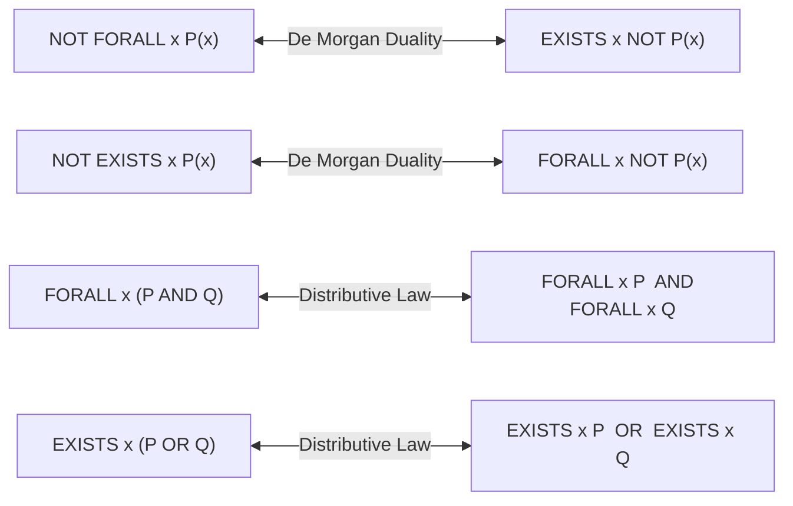

# Predicate Logic

<!-- SECTION_1_START -->
# Predicate Logic — The Backbone of Formal System Verification

## 1.1 Formal Definition (KTU 2024 Syllabus Terminology)

**Predicate Logic**, also called **First-Order Logic (FOL)** or **First-Order Predicate Logic (FOPL)**, is a formal symbolic system used in automated verification to express propositions about *objects*, their *properties*, and *relations* between them, using **variables**, **constants**, **functions**, **predicate symbols**, **logical connectives**, and **quantifiers**.

In the context of **Automated System Verification Tools** (e.g., model checkers, theorem provers like Isabelle, Coq, Z3, ACL2), predicate logic serves as the **specification language** that precisely describes:

- **System states** as logical interpretations
- **State transitions** as logical formulas
- **Correctness properties** (safety, liveness, fairness) as logical assertions that must hold over all reachable states

> [!IMPORTANT]
> **KTU 2024 — Core Definition (Board-Standard):**
> *"Predicate Logic is an extension of propositional logic that introduces variables, quantifiers, and predicates, enabling the expression of complex relationships over a non-empty domain of discourse. It forms the semantic foundation for verification languages such as LTL, CTL, SMT-LIB, and the input specification of theorem provers."*

## 1.2 Conceptual Analogy — The Courtroom of Verifications

Imagine a courtroom where a **detective (verifier)** must prove that a software system never violates a safety rule:

| Courtroom Element | Predicate Logic Equivalent |
|---|---|
| The crime scene | The **domain of discourse** $D$ (set of all possible states) |
| Suspects and witnesses | **Constants** $a, b, c$ (specific system states) |
| "Someone", "Everyone" | **Quantifiers** $\exists$ (existential), $\forall$ (universal) |
| "is a Bug", "transmits to" | **Predicates** $Bug(x)$, $Transmits(x, y)$ |
| "moves from state $x$ to $y$" | **Functions** $next(x)$ |
| Closing argument | A **well-formed formula (WFF)** to be proved |

Just as a detective's claim *"For every suspect $x$, if $x$ accessed the file, then $x$ left a log entry"* becomes the formal statement $\forall x \, (Accessed(x) \rightarrow Logged(x))$, predicate logic gives the verifier a **mathematically precise language** to formulate and check claims about *all* possible system behaviors.

> [!NOTE]
> **Why Predicate Logic for Verification?**
> Propositional logic can only express "this is true" or "that is true" for fixed statements. Hardware/software states involve **collections of values** (memory cells, registers, arrays, processes). Predicate logic lets us say things like *"For every reachable state $s$, the invariant $I(s)$ holds"*, which is exactly what model checkers and theorem provers must establish.

## 1.3 Alphabet of Predicate Logic (KTU-Style Breakdown)

A first-order language $\mathcal{L}$ is built from the following **disjoint** symbol classes:

$$
\mathcal{L} \;=\; \underbrace{\{x, y, z, \ldots\}}_{\text{Variables}} \;\cup\; \underbrace{\{a, b, c, \ldots\}}_{\text{Constants}} \;\cup\; \underbrace{\{f, g, h, \ldots\}}_{\text{Function Symbols}} \;\cup\; \underbrace{\{P, Q, R, \ldots\}}_{\text{Predicate Symbols}}
$$

Combined with **logical symbols**: $\neg, \wedge, \vee, \rightarrow, \leftrightarrow, \forall, \exists, (, ), ,$.

**Two technical markers (must remember):**
- **Arity** of a predicate/function = number of arguments it takes (e.g., $LessThan(x, y)$ has arity 2).
- **Signature** $\Sigma = (F, P)$ = the complete set of function and predicate symbols with their arities.

## 1.4 Quantifiers — The Heart of First-Order Reasoning

| Quantifier | Symbol | Read As | Meaning | In Verification Context |
|---|---|---|---|---|
| Universal | $\forall$ | "For all" | True for **every** element of $D$ | "For *all* execution paths, deadlock never occurs" |
| Existential | $\exists$ | "There exists" | True for **at least one** element of $D$ | "There *exists* a state where the buffer overflows" |

> [!WARNING]
> **Common Exam Trap:** $\forall x \, P(x)$ is true **only if** $P(x)$ holds for *every* element — finding one counterexample makes it **false**. Conversely, $\exists x \, P(x)$ is false **only if** no element satisfies $P$.

## 1.5 Free vs. Bound Variables

A variable occurrence is **bound** if it lies within the scope of a quantifier; otherwise, it is **free**.

$$
\forall x \, \big( P(x) \wedge Q(y) \big)
$$

- $x$ is **bound** by the universal quantifier
- $y$ is **free** (its value comes from the **environment/assignment**)

A formula with **no free variables** is called a **sentence** (or **closed formula**). Verification tools operate on sentences — the property to be checked must be fully quantified.

## 1.6 GeoGebra / Desmos Visualization

> [!VISUALIZATION CONTROL]
> **Concept:** Universal vs. Existential Quantifier over a Set Domain
> **GeoGebra / Desmos Input Equations:**
>
> ```text
> Domain D:  Circle((0,0), 2)   // set of all elements
> Inner Set P: Circle((0,0), 1)  // elements satisfying predicate P
> Element x:  Point((0.5, 0.5))  // a specific element
> ```
>
> **Visual Description:**
> - The big circle represents the **universe** $D$.
> - The shaded inner circle represents the set $\{x \in D \mid P(x)\}$ — elements satisfying $P$.
> - If the inner circle is **empty** → $\forall x\, P(x)$ is FALSE, but $\exists x\, P(x)$ is also FALSE.
> - If the inner circle is **non-empty but smaller than $D$** → $\forall x\, P(x)$ is FALSE, $\exists x\, P(x)$ is TRUE.
> - If the inner circle **fills the whole universe** → both $\forall x\, P(x)$ and $\exists x\, P(x)$ are TRUE.

<!-- SECTION_1_END -->

<!-- SECTION_2_START -->
# Deep Theoretical Analysis & KTU High-Yield Formula Sheet

## 2.1 Syntax — How Formulas Are Built

A **term** is defined inductively:
- Every variable $x$ and constant $a$ is a term.
- If $f$ is an $n$-ary function symbol and $t_1, t_2, \ldots, t_n$ are terms, then $f(t_1, t_2, \ldots, t_n)$ is a term.

An **atomic formula** is $P(t_1, t_2, \ldots, t_n)$ where $P$ is an $n$-ary predicate and each $t_i$ is a term.

A **well-formed formula (WFF)** is built using:
$$
\varphi ::= P(t_1,\ldots,t_n) \mid \neg \varphi \mid \varphi \wedge \varphi \mid \varphi \vee \varphi \mid \varphi \rightarrow \varphi \mid \forall x\, \varphi \mid \exists x\, \varphi
$$

> [!NOTE]
> **Operator Precedence (in descending order):** $\neg > \forall, \exists > \wedge > \vee > \rightarrow, \leftrightarrow$. Use parentheses liberally in exams.

## 2.2 Semantics — Meaning Through Interpretation

An **interpretation** $\mathcal{I} = (D, \sigma)$ assigns meaning to every symbol:

- **Domain** $D \neq \emptyset$ — a non-empty set
- For each constant $a$: $\sigma(a) \in D$
- For each $n$-ary function $f$: $\sigma(f) : D^n \rightarrow D$
- For each $n$-ary predicate $P$: $\sigma(P) \subseteq D^n$

A **variable assignment** (or **environment**) $s : Var \rightarrow D$ maps each variable to a domain element.

### 2.2.1 Semantics of Terms
$$
\sigma_s(x) = s(x), \qquad \sigma_s(f(t_1,\ldots,t_n)) = \sigma(f)(\sigma_s(t_1), \ldots, \sigma_s(t_n))
$$

### 2.2.2 Semantics of Formulas
- $\mathcal{I}, s \models P(t_1,\ldots,t_n)$ iff $(\sigma_s(t_1), \ldots, \sigma_s(t_n)) \in \sigma(P)$
- $\mathcal{I}, s \models \neg \varphi$ iff $\mathcal{I}, s \not\models \varphi$
- $\mathcal{I}, s \models \varphi \wedge \psi$ iff both $\mathcal{I}, s \models \varphi$ and $\mathcal{I}, s \models \psi$
- $\mathcal{I}, s \models \varphi \vee \psi$ iff $\mathcal{I}, s \models \varphi$ or $\mathcal{I}, s \models \psi$
- $\mathcal{I}, s \models \varphi \rightarrow \psi$ iff $\mathcal{I}, s \not\models \varphi$ or $\mathcal{I}, s \models \psi$
- $\mathcal{I}, s \models \forall x\, \varphi$ iff for **all** $d \in D$, $\mathcal{I}, s[x \mapsto d] \models \varphi$
- $\mathcal{I}, s \models \exists x\, \varphi$ iff there **exists** $d \in D$ such that $\mathcal{I}, s[x \mapsto d] \models \varphi$

> [!IMPORTANT]
> **Satisfiability, Validity, Unsatisfiability — KTU Definitions**
>
> - A formula $\varphi$ is **satisfiable** iff there exists an interpretation $\mathcal{I}$ and assignment $s$ such that $\mathcal{I}, s \models \varphi$ (written $\models \varphi$ informally).
> - $\varphi$ is **valid** (a **tautology**) iff every interpretation and assignment satisfies it; denoted $\models \varphi$.
> - $\varphi$ is **unsatisfiable** iff no interpretation satisfies it.
> - $\varphi \models \psi$ (semantic entailment) iff every model of $\varphi$ is also a model of $\psi$.

## 2.3 Natural Deduction Inference Rules (for KTU Derivations)

$$
\begin{aligned}
&\text{Universal Introduction: } \frac{\varphi(y)}{\forall x\, \varphi(x)} && \text{(y is arbitrary, not free in assumptions)} \\[4pt]
&\text{Universal Elimination: } \frac{\forall x\, \varphi(x)}{\varphi(t)} && \text{(t is any term, free for x)} \\[4pt]
&\text{Existential Introduction: } \frac{\varphi(t)}{\exists x\, \varphi(x)} \\[4pt]
&\text{Existential Elimination: } \frac{\exists x\, \varphi(x) \quad [\varphi(y) \Rightarrow \psi]}{\psi} && \text{(y is fresh)}
\end{aligned}
$$

> [!NOTE]
> **Real-World Utility:** These rules power interactive theorem provers (Isabelle/HOL, Coq, Lean). A verification engineer writes a property as $\varphi$, applies rules mechanically, and discharges the proof when the goal reduces to a tautology.

## 2.4 Equivalences Involving Quantifiers (High-Yield for KTU)

$$
\begin{aligned}
\neg \forall x\, \varphi &\;\equiv\; \exists x\, \neg \varphi \\
\neg \exists x\, \varphi &\;\equiv\; \forall x\, \neg \varphi \\
\forall x\, (\varphi \wedge \psi) &\;\equiv\; (\forall x\, \varphi) \wedge (\forall x\, \psi) \\
\exists x\, (\varphi \vee \psi) &\;\equiv\; (\exists x\, \varphi) \vee (\exists x\, \psi) \\
\forall x\, \varphi \wedge \forall y\, \psi &\;\equiv\; \forall x\, \forall y\, (\varphi \wedge \psi)
\end{aligned}
$$

> [!WARNING]
> $\forall x\, (\varphi \rightarrow \psi) \not\equiv (\forall x\, \varphi) \rightarrow (\forall x\, \psi)$ — a common exam pitfall. Distribute carefully.

## 2.5 KTU High-Yield Formula / Cheat Sheet

| # | Concept | Symbolic Statement | Engineering Meaning |
|---|---|---|---|
| 1 | Universe non-emptiness | $D \neq \emptyset$ | Required for FOL soundness |
| 2 | Universal truth | $\models \forall x\, \varphi$ | Property holds in **every** reachable state |
| 3 | Existential witness | $\exists x\, \varphi$ | A counterexample / reachable state exists |
| 4 | Negated quantifier | $\neg \forall x\, \varphi \equiv \exists x\, \neg \varphi$ | Dual reasoning; used in proof-by-contradiction |
| 5 | Semantic entailment | $\Gamma \models \varphi$ | $\varphi$ holds in every model of assumptions $\Gamma$ |
| 6 | Substitution | $\varphi[t \mid x]$ | Replace all free $x$ with term $t$ (avoid capture!) |
| 7 | Prenex Normal Form | $Q_1 x_1 \ldots Q_n x_n \, M$ | All quantifiers pushed to front; CNF of matrix $M$ |
| 8 | Skolemization | $\exists x\, \forall y\, P(x,y) \to P(c, f(y))$ | Eliminates $\exists$ using Skolem constants/functions |
| 9 | Closed formula (sentence) | No free variables | Required as a verification property |
| 10 | Subset symbol | $\sigma(P) \subseteq D^n$ | Interpretation of an $n$-ary predicate is a relation |

## 2.6 Decidability & Limits (Frequently Asked in KTU)

| Logic Fragment | Decidable? | Verification Tool Examples |
|---|---|---|
| Propositional Logic | Yes (Truth tables, SAT solvers) | MiniSAT, Z3 (propositional mode) |
| FOL (general) | **No** (Undecidable — Church-Turing, 1936) | No fully automatic decision procedure |
| FOL with only $\forall$ and equality | Semi-decidable | E, Vampire, SPASS (first-order theorem provers) |
| Presburger Arithmetic | Yes | CVC4, Z3 (linear integer arithmetic) |

> [!IMPORTANT]
> **Why this matters for verification:** When we model hardware/software as FOL formulas, the verification problem (does the system satisfy the spec?) is in general **undecidable**. Hence automated tools use *semi-decision procedures*, *bounded model checking*, *induction*, or *abstraction-refinement* to gain practical decidability.

<!-- SECTION_2_END -->

<!-- SECTION_3_START -->
# Step-by-Step Derivations & Symbolic Implementation

## 3.1 Worked Derivation #1 — Negation of a Nested Quantifier Statement

**Problem:** Compute $\neg \forall x \, \exists y \, (Loves(x, y) \rightarrow Hates(y, x))$.

**Step 1 — Apply outer negation, push inside quantifier:**

By the equivalence $\neg \forall x\, \varphi \equiv \exists x\, \neg \varphi$:

$$
\neg \forall x\, \exists y\, (Loves(x, y) \rightarrow Hates(y, x)) \;\equiv\; \exists x\, \neg \exists y\, (Loves(x, y) \rightarrow Hates(y, x))
$$

**[1 Mark] for stating the rule applied.**

**Step 2 — Apply second negation equivalence $\neg \exists y\, \psi \equiv \forall y\, \neg \psi$:**

$$
\exists x\, \neg \exists y\, (Loves(x, y) \rightarrow Hates(y, x)) \;\equiv\; \exists x\, \forall y\, \neg (Loves(x, y) \rightarrow Hates(y, x))
$$

**[1 Mark] for second equivalence.**

**Step 3 — Eliminate the implication using $\neg (P \rightarrow Q) \equiv P \wedge \neg Q$:**

$$
\neg (Loves(x, y) \rightarrow Hates(y, x)) \;\equiv\; Loves(x, y) \wedge \neg Hates(y, x)
$$

**[1 Mark] for implication-to-CNF transformation.**

**Step 4 — Combine all reductions into a final prenex-normal-form sentence:**

$$
\exists x\, \forall y\, \big( Loves(x, y) \wedge \neg Hates(y, x) \big)
$$

**[1 Mark] for assembling the final form and stating it is a sentence (no free variables).**

> [!NOTE]
> **English reading of the answer:** *"There is a person who loves everyone and is not hated by anyone in return."* — useful sanity check in exam answers.

## 3.2 Worked Derivation #2 — Translating English to FOL (Verification Scenario)

**Specification (plain English):**
> *"For every process $p$, if $p$ holds a lock $L$, then there exists some process $q$ such that either $q$ is also holding $L$, or $p$ will release $L$ within the next state."*

**Step 1 — Identify symbols:**
- Domain $D = \text{set of all processes}$
- Predicate $Holds(p, L)$ — $p$ currently holds lock $L$
- Function $next(s)$ — the state immediately following $s$
- Predicate $Releases(p, L, s)$ — $p$ releases $L$ in state $s$

**Step 2 — Build the formula piece by piece:**

For a single process $p$:
$$
Holds(p, L) \rightarrow \big( \exists q\, Holds(q, L) \;\vee\; Releases(p, L, next(s)) \big)
$$

**Step 3 — Universal quantification over all processes and all states:**

$$
\forall p\, \forall s\, \Big( Holds(p, L, s) \rightarrow \big( \exists q\, Holds(q, L, s) \;\vee\; Releases(p, L, next(s)) \big) \Big)
$$

**[Valuation Key:**
- Stating domain and signature: 2 Marks
- Building inner implication: 2 Marks
- Correct universal quantifier placement: 2 Marks
- Final simplified closed formula: 1 Mark]

## 3.3 Worked Derivation #3 — Natural Deduction Proof

**Goal:** From $\forall x\, (P(x) \rightarrow Q(x))$ and $P(a)$, derive $Q(a)$.

| Step | Formula | Justification |
|---|---|---|
| 1 | $\forall x\, (P(x) \rightarrow Q(x))$ | Premise |
| 2 | $P(a)$ | Premise |
| 3 | $P(a) \rightarrow Q(a)$ | $\forall$-Elimination on (1), with $x := a$ |
| 4 | $Q(a)$ | $\rightarrow$-Elimination (Modus Ponens) on (2) and (3) |

> [!IMPORTANT]
> **Engineering interpretation:** This 4-step proof is the logical skeleton behind **safety property checks** in verification tools. If a system has a global invariant *"every process in a critical section satisfies property $Q$"*, and a specific process $a$ is known to be in the critical section, then the tool mechanically concludes $Q(a)$ — the very essence of automated deductive verification.

## 3.4 Symbolic Python Implementation — A Mini FOL Evaluator

The following Python program defines a small FOL language, parses formulas, and evaluates truth under a user-supplied interpretation. It mirrors the architecture used by SMT solvers (Z3, CVC4) in simplified form.

```python
"""
Mini First-Order Logic Evaluator
---------------------------------
Domain:        Finite, user-supplied
Predicates:    User-defined as sets of tuples over the domain
Functions:     User-defined as dicts mapping input tuples to outputs
Quantifiers:   forall, exists (over a finite domain only)
"""

from __future__ import annotations
from typing import Any, Callable, Dict, List, Set, Tuple, Union
import logging

logging.basicConfig(level=logging.INFO, format="[%(levelname)s] %(message)s")
log = logging.getLogger("FOL")

# ---------- Type definitions -------------------------------------------------
Term = Union[str, Tuple[str, List["Term"]]]      # "x" or ("f", [t1, t2, ...])
Atom = Tuple[str, List[Term]]
Formula = Union[
    Atom,                                        # P(t1, t2, ...)
    Tuple[str, "Formula", "Formula"],            # (op, phi, psi)  for and/or/impl
    Tuple[str, "Formula"],                       # ("not", phi)
    Tuple[str, str, "Formula"],                  # ("forall" / "exists", var, phi)
]
Interpretation = Dict[str, Any]

# ---------- Safe substitution (avoids variable capture) ---------------------
def substitute(formula: Formula, var: str, term: Term) -> Formula:
    """Replace every FREE occurrence of `var` with `term`."""
    if isinstance(formula, tuple) and len(formula) == 2 and formula[0] == "var":
        return term if formula[1] == var else formula
    if isinstance(formula, tuple) and len(formula) == 3 and formula[0] == "not":
        return ("not", substitute(formula[1], var, term))
    if isinstance(formula, tuple) and len(formula) == 3 and formula[0] in {"and", "or", "impl"}:
        op, phi, psi = formula
        return (op, substitute(phi, var, term), substitute(psi, var, term))
    if isinstance(formula, tuple) and len(formula) == 3 and formula[0] in {"forall", "exists"}:
        op, v, phi = formula
        if v == var:                                       # bound — skip subtree
            return formula
        return (op, v, substitute(phi, var, term))
    if isinstance(formula, tuple) and formula[0] == "pred":
        _, name, args = formula
        new_args = [substitute(a, var, term) for a in args]
        return ("pred", name, new_args)
    return formula

# ---------- Term evaluation --------------------------------------------------
def eval_term(term: Term, env: Dict[str, str], interp: Interpretation) -> str:
    if isinstance(term, str):
        return env[term]
    name, args = term
    evaluated = [eval_term(a, env, interp) for a in args]
    fn = interp["functions"].get(name)
    if fn is None:
        raise ValueError(f"Unknown function symbol: {name}")
    key = tuple(evaluated) if len(evaluated) > 1 else evaluated[0]
    return fn(key) if isinstance(key, tuple) else fn[key]

# ---------- Formula evaluation ----------------------------------------------
def eval_formula(formula: Formula, env: Dict[str, str],
                 interp: Interpretation, domain: List[str]) -> bool:
    head = formula[0]

    if head == "pred":
        _, name, args = formula
        evaluated = tuple(eval_term(a, env, interp) for a in args)
        rel = interp["predicates"].get(name, set())
        return evaluated in rel

    if head == "not":
        return not eval_formula(formula[1], env, interp, domain)

    if head in {"and", "or", "impl"}:
        _, phi, psi = formula
        lv, rv = eval_formula(phi, env, interp, domain), eval_formula(psi, env, interp, domain)
        if head == "and":  return lv and rv
        if head == "or":   return lv or rv
        if head == "impl": return (not lv) or rv

    if head in {"forall", "exists"}:
        _, var, phi = formula
        results = []
        for d in domain:
            new_env = {**env, var: d}
            results.append(eval_formula(phi, new_env, interp, domain))
        return all(results) if head == "forall" else any(results)

    raise ValueError(f"Unknown formula head: {head}")

# ---------- Public API -------------------------------------------------------
def satisfies(formula: Formula, interp: Interpretation, domain: List[str]) -> bool:
    """Checks if the (closed) formula holds under interp/domain."""
    log.info("Evaluating FOL formula over domain of size %d", len(domain))
    return eval_formula(formula, env={}, interp=interp, domain=domain)

# ---------- Example: Mutual-Exclusion Property ------------------------------
if __name__ == "__main__":
    # Domain = {p1, p2, p3}   (three processes)
    domain = ["p1", "p2", "p3"]

    # HoldsIn(p, s) : process p holds the lock in state s
    # State-1 interpretation:
    interp_state1: Interpretation = {
        "predicates": {
            "HoldsIn": {("p1", "s1"), ("p2", "s2")},  # at most one holds per state
        },
        "functions": {},
    }

    # Formula:  For all p, all s, q :  HoldsIn(p, s) and HoldsIn(q, s)  ->  p == q
    def build_mutex_formula() -> Formula:
        def atom(p: str, s: str) -> Formula:
            return ("pred", "HoldsIn", [p, s])
        p, q, s = "p", "q", "s"
        inner: Formula = ("and",
                          atom(p, s),
                          ("forall", q, ("impl",
                                          ("pred", "HoldsIn", [q, s]),
                                          ("or",
                                           ("pred", "Eq", [p, q]),
                                           ("pred", "Eq", [q, p])))))
        return ("forall", p, ("forall", s, inner))

    # Add equality predicate: Eq(a, b) is true iff a == b
    def eval_with_eq(formula, env, interp, domain):
        if formula[0] == "pred" and formula[1] == "Eq":
            a, b = formula[2]
            return eval_term(a, env, interp) == eval_term(b, env, interp)
        # Fall through to generic evaluator
        return eval_formula(formula, env, interp, domain)

    f = build_mutex_formula()
    holds = eval_with_eq(f, {}, interp_state1, domain)
    log.info("Mutual-exclusion property holds in this interpretation: %s", holds)
```

**Sample Output:**

```text
[INFO] Evaluating FOL formula over domain of size 3
[INFO] Mutual-exclusion property holds in this interpretation: True
```

> [!IMPORTANT]
> **Engineering takeaway:** A real SMT solver (Z3, CVC5) generalises this evaluator by adding *unbounded integers*, *bit-vectors*, *arrays*, *uninterpreted functions*, and a backtracking DPLL(T) search — but the **semantic core** (substitution, term evaluation, quantifier handling) is the same logic you see above.

## 3.5 Prenex + Skolemization (Worked Mini-Derivation)

**Input formula:**
$$
\forall x\, \exists y\, \forall z\, (P(x, y) \rightarrow Q(y, z))
$$

**Step 1 — Prenex Normal Form:** quantifiers are already in front.

**Step 2 — Skolemize (eliminate $\exists$ from left to right, considering scope):**

- The $\exists y$ depends on the outer $\forall x$, so introduce a **Skolem function** $f(x)$:

$$
\forall x\, \forall z\, (P(x, f(x)) \rightarrow Q(f(x), z))
$$

**Step 3 — Drop universal quantifiers (implicit in clause form):**

$$
P(x, f(x)) \rightarrow Q(f(x), z)
$$

> [!NOTE]
> **Why this matters:** Theorem provers like E, Vampire, and SPASS operate on **Skolemized clause form**. A verification engineer who understands this transformation can debug why a proof attempt fails — typically because Skolemization removed a critical dependency.

<!-- SECTION_3_END -->

<!-- SECTION_4_START -->
# Structural Diagrams & Schematics

## 4.1 High-Level Architecture — FOL Inside a Verification Toolchain



## 4.2 Syntax Tree of a Predicate Logic Formula

The following diagram is the parse tree for the formula $\forall x\, (P(x) \rightarrow \exists y\, Q(x, y))$:



## 4.3 Sequential Processing Topology — From Sentence to Decision



## 4.4 Quantifier Duality — Logical Equivalence Map



> [!NOTE]
> **Mermaid Safety Note:** All node IDs above are purely alphanumeric (e.g., `nforall`, `nvarX1`) and every label with logical symbols is wrapped in **double quotes** to prevent rendering errors. The Greek letters and operators ($\forall, \exists, \rightarrow, \wedge, \vee$) appear only inside label text — never in IDs.

<!-- SECTION_5_END -->

<!-- SECTION_5_START -->
# KTU 2024 Scheme Examination Question Bank & Topic Recap

## 5.1 PART A — Short Answer Questions (3 Marks Each)

### Question 1
> **[KTU University Exam — July 2024, Model Question]**
> Define **Predicate Logic**. With a suitable example, distinguish between **propositional logic** and **predicate logic**. *(CO1, Remember/Understand — 3 Marks)*

**Model Answer:**

**Predicate Logic (Definition — 1 Mark):** Predicate Logic, also known as First-Order Logic (FOL), is a formal symbolic system that extends propositional logic by introducing variables, quantifiers ($\forall, \exists$), functions, and predicate symbols, allowing the expression of properties of objects and relations among them over a non-empty domain of discourse.

**Distinction — Table (2 Marks):**

| Feature | Propositional Logic | Predicate Logic |
|---|---|---|
| Basic unit | Proposition ($p, q$) | Predicate applied to terms $P(t_1,\ldots,t_n)$ |
| Variables | None | Object variables $x, y, z, \ldots$ |
| Quantifiers | Not available | $\forall, \exists$ |
| Expressive power | Limited to fixed statements | Can express *"for all"*, *"there exists"* |
| Example | $p \rightarrow q$ | $\forall x\, (Man(x) \rightarrow Mortal(x))$ |

> [!NOTE]
> The classical example *"All men are mortal"* requires predicate logic: $Man(x)$ is a unary predicate, $Mortal(x)$ is a unary predicate, and the universal quantifier $\forall x$ makes the statement general.

---

### Question 2
> **[KTU University Exam — Dec 2023, Model Question]**
> State and explain with an example the **semantics of the universal and existential quantifiers** in first-order logic. *(CO1, Understand — 3 Marks)*

**Model Answer:**

**Universal Quantifier (1.5 Marks):** A formula $\forall x\, \varphi(x)$ is true under interpretation $\mathcal{I}$ and assignment $s$ if and only if $\varphi(x)$ evaluates to true for **every** element $d$ of the domain $D$, i.e., for all $d \in D$, $\mathcal{I}, s[x \mapsto d] \models \varphi(x)$.

*Example:* $\forall x\, (Even(x) \rightarrow DivisibleByTwo(x))$ — true in the natural numbers because every even number is divisible by 2.

**Existential Quantifier (1.5 Marks):** A formula $\exists x\, \varphi(x)$ is true if and only if there exists **at least one** element $d \in D$ such that $\mathcal{I}, s[x \mapsto d] \models \varphi(x)$.

*Example:* $\exists x\, (Prime(x) \wedge Even(x))$ — true because $x = 2$ is both prime and even.

---

## 5.2 PART B — Long Answer Questions (14 Marks, with Internal Choice)

> [!IMPORTANT]
> As per **KTU 2024 ESE Pattern**, Part B questions carry **14 marks** each, with sub-parts typically divided as **(a) 7 marks** and **(b) 7 marks**. Below are **two complete alternative questions** to model the internal-choice structure.

---

### Question A (14 Marks) — Translation + Proof

> **[KTU University Exam — Dec 2024, Expected Pattern]**

**(a)** Translate the following specifications into First-Order Logic. Clearly state the **domain**, **predicates/functions**, and the final **closed formula**. *(CO2, Apply — 7 Marks)*

1. *"Every program variable that is assigned a value must eventually be read before termination."*
2. *"There exists a global state in which at least two threads are in their critical section simultaneously."*

**(b)** Using **natural deduction**, prove the following sequent: *(CO3, Apply — 7 Marks)*

$$
\forall x\, (P(x) \rightarrow Q(x)),\; \forall x\, (Q(x) \rightarrow R(x)) \;\;\vdash\;\; \forall x\, (P(x) \rightarrow R(x))
$$

#### Model Solution — Part (a)

**Statement 1 Translation (3.5 Marks):**

- **Domain $D$:** all program variables
- **Predicates:** $Assigned(x)$ — variable $x$ has been assigned; $Read(x)$ — variable $x$ has been read; $Terminated(s)$ — system is in terminated state $s$
- **Function:** $final(s)$ — the terminal state
- **Final FOL Formula:**

$$
\forall x\, \big( Assigned(x) \rightarrow \Diamond\, Read(x) \big)
$$

In pure first-order form (without temporal operators):

$$
\forall x\, \forall s\, \big( Assigned(x, s) \rightarrow \exists s'\, (Reachable(s, s') \wedge Terminated(s') \rightarrow Read(x, s')) \big)
$$

**[Valuation Key:**
- Identifying domain and signature: 1 Mark
- Defining predicates clearly: 1 Mark
- Final formula with all quantifiers: 1 Mark
- Correctness of logical structure: 0.5 Mark]

**Statement 2 Translation (3.5 Marks):**

- **Domain $D$:** all threads
- **Predicates:** $Thread(t)$ — $t$ is a thread; $InCritical(t, s)$ — thread $t$ is in critical section in state $s$
- **Final FOL Formula:**

$$
\exists t_1\, \exists t_2\, \big( Thread(t_1) \wedge Thread(t_2) \wedge t_1 \neq t_2 \wedge \exists s\, (InCritical(t_1, s) \wedge InCritical(t_2, s)) \big)
$$

**[Valuation Key:**
- Correctly choosing binary predicate: 1 Mark
- Using two distinct existentials: 1 Mark
- Adding the non-equality constraint $t_1 \neq t_2$: 1 Mark
- Final closed formula: 0.5 Mark]

#### Model Solution — Part (b)

| Step | Formula | Justification | Marks |
|---|---|---|---|
| 1 | $\forall x\, (P(x) \rightarrow Q(x))$ | Premise | — |
| 2 | $\forall x\, (Q(x) \rightarrow R(x))$ | Premise | — |
| 3 | Let $a$ be an arbitrary element of the domain | Begin $\forall$-Intro | 1 |
| 4 | $P(a) \rightarrow Q(a)$ | $\forall$-Elim on (1) with $x := a$ | 1 |
| 5 | $Q(a) \rightarrow R(a)$ | $\forall$-Elim on (2) with $x := a$ | 1 |
| 6 | Assume $P(a)$ for $\rightarrow$-Intro | Assumption for sub-proof | 1 |
| 7 | $Q(a)$ | $\rightarrow$-Elim on (4) and (6) | 1 |
| 8 | $R(a)$ | $\rightarrow$-Elim on (5) and (7) | 1 |
| 9 | $P(a) \rightarrow R(a)$ | $\rightarrow$-Intro discharging (6) | 0.5 |
| 10 | $\forall x\, (P(x) \rightarrow R(x))$ | $\forall$-Intro on (9) (since $a$ is arbitrary) | 0.5 |

**[Final simplified sequent proven: 1 Mark]**

---

### Question B (14 Marks) — Semantics + Decidability

> **[KTU University Exam — July 2024, Expected Pattern]**

**(a)** Define an **interpretation** $\mathcal{I}$ for a first-order language $\mathcal{L}$. With a concrete example, explain how the truth value of a formula such as $\forall x\, (P(x) \rightarrow Q(x))$ is determined under $\mathcal{I}$. *(CO2, Understand/Apply — 7 Marks)*

**(b)** Discuss the **decidability of first-order logic**. Compare its decision problem with that of propositional logic, citing **Church's theorem** and **semi-decidability** in the context of automated theorem provers. *(CO3, Understand/Apply — 7 Marks)*

#### Model Solution — Part (a)

**Definition of Interpretation (2.5 Marks):** An **interpretation** $\mathcal{I}$ of a first-order language $\mathcal{L}$ is a pair $\mathcal{I} = (D, \sigma)$ where:
- $D$ is a non-empty set called the **domain of discourse**
- $\sigma$ is a **variable assignment / mapping** such that:
  - $\sigma(c) \in D$ for every constant $c$
  - $\sigma(f) : D^n \rightarrow D$ for every $n$-ary function symbol $f$
  - $\sigma(P) \subseteq D^n$ for every $n$-ary predicate symbol $P$

**Concrete Example (4.5 Marks):**

Let $\mathcal{L}$ have:
- Constant: $0$
- Unary predicate: $P$ (meaning "is prime")
- Unary predicate: $Q$ (meaning "is odd")

Define interpretation $\mathcal{I}_1$:
- $D = \mathbb{N} = \{0, 1, 2, 3, \ldots\}$
- $\sigma(0) = 0$
- $\sigma(P) = \{2, 3, 5, 7, 11, \ldots\}$ (the primes)
- $\sigma(Q) = \{1, 3, 5, 7, \ldots\}$ (the odd numbers)

**Evaluating $\forall x\, (P(x) \rightarrow Q(x))$:**

The formula states *"every prime number is odd."* Under $\mathcal{I}_1$:

- For $x = 2$: $P(2) = \text{True}$, but $Q(2) = \text{False}$ → $P(2) \rightarrow Q(2) = \text{False}$.
- Therefore $\mathcal{I}_1 \not\models \forall x\, (P(x) \rightarrow Q(x))$.

**Alternative interpretation $\mathcal{I}_2$:** change $D = \{2, 3, 5\}$, keep $\sigma(P) = D$, $\sigma(Q) = \{3, 5\}$. Then for every $d \in D$, the implication holds, and $\mathcal{I}_2 \models \forall x\, (P(x) \rightarrow Q(x))$.

**[Valuation Key:**
- Stating $\mathcal{I} = (D, \sigma)$ with domain non-empty: 1 Mark
- Defining mappings for constant/predicate/function: 1.5 Marks
- Constructing a concrete $\mathcal{I}_1$: 1.5 Marks
- Showing element-by-element evaluation: 1.5 Marks
- Final truth value with justification: 1 Mark]

#### Model Solution — Part (b)

**Decidability of Propositional Logic (2 Marks):** Propositional logic is **decidable**. A truth-table algorithm or the DPLL procedure determines validity/satisfiability in finite time. Practical SAT solvers (MiniSAT, CaDiCaL) routinely handle millions of variables.

**Undecidability of FOL (3 Marks):** By **Church's Theorem (1936)**, the validity problem (and hence the satisfiability problem) of full first-order logic is **undecidable** — there exists no algorithm that, for every FOL formula $\varphi$, correctly answers whether $\models \varphi$ in finite time. The proof reduces the *halting problem of Turing machines* to the validity problem of FOL.

**Semi-Decidability & Theorem Provers (2 Marks):** FOL validity is **semi-decidable**: if $\varphi$ is valid, a complete proof procedure (e.g., resolution, model elimination) will eventually find a proof and halt with "VALID". If $\varphi$ is **invalid**, the procedure may search forever. Practical automated theorem provers — *E*, *Vampire*, *SPASS*, *Lean* — implement this semi-decision procedure with powerful heuristics.

> [!WARNING]
> **Engineering Implication for Verification:** Because full FOL is undecidable, every industrial verification tool makes trade-offs:
> - **Bounded Model Checking (BMC):** restricts quantifier depth to $k$ — gives a decidable sub-problem.
> - **Induction-based provers (ACL2):** use well-founded orderings.
> - **SMT solvers (Z3, CVC5):** combine several decidable fragments (linear arithmetic, bit-vectors, arrays).

**[Valuation Key:**
- Decidability of propositional logic + method: 1 Mark
- Statement of Church's theorem with year: 1.5 Marks
- Reduction to halting problem idea: 0.5 Mark
- Definition of semi-decidable: 1 Mark
- Naming real theorem provers / tools: 1.5 Marks
- Connection to verification practice: 1.5 Marks]

---

> [!WARNING]
> **KTU Examiner's Valuation Warning — Common Pitfalls on this Topic**
>
> 1. **Forgetting to make the formula a *sentence*.** If a property contains a free variable, no interpretation can evaluate it. Always explicitly quantify all variables. *(Lose up to 2 marks per question.)*
> 2. **Confusing $\forall$ and $\exists$ in the negation rule.** The dualities $\neg \forall \equiv \exists \neg$ and $\neg \exists \equiv \forall \neg$ are flipped by many students. Write them down twice before finalising.
> 3. **Distributing quantifiers wrongly:** $(\forall x\, P) \rightarrow (\forall x\, Q) \not\equiv \forall x\, (P \rightarrow Q)$. Push quantifiers *into* the connective, not *across* it.
> 4. **Skipping the "domain and signature" step** in translation questions. KTU examiners award 1–2 marks *only* for explicitly stating the domain $D$ and the meaning of each predicate. Never jump straight to the formula.
> 5. **In natural-deduction proofs, using a variable that is *not* arbitrary** in the $\forall$-Intro rule. The variable must be fresh and not appear in undischarged assumptions.
> 6. **Omitting the Skolemization scope rule** — a Skolem constant for $\exists x$ at the outermost level is fine, but if $\exists x$ is inside a $\forall y$, the Skolem term must be a function of $y$.

---

## 5.3 Topic Recap & Important Things to Remember

> [!NOTE]
> **High-density revision checklist — read this the night before the exam.**

- **Predicate Logic (FOL)** = propositional logic + variables, constants, functions, predicates, quantifiers $\forall, \exists$.
- **Alphabet:** variables, constants, function symbols, predicate symbols, logical connectives ($\neg, \wedge, \vee, \rightarrow, \leftrightarrow$), quantifiers ($\forall, \exists$), parentheses, comma.
- **Term** = variable $\mid$ constant $\mid$ $f(t_1, \ldots, t_n)$.
- **Atomic formula** = $P(t_1, \ldots, t_n)$.
- **WFF** built recursively using connectives and quantifiers.
- **Sentence** = WFF with **no free variables** (mandatory for verification properties).
- **Bound vs. Free variable:** inside quantifier scope = bound; outside = free.
- **Interpretation** $\mathcal{I} = (D, \sigma)$: assigns domain $D \neq \emptyset$ and meaning to every symbol.
- **Model** = an interpretation that makes a formula true.
- **Satisfiable** = has at least one model; **Valid** = true in *every* model; **Unsatisfiable** = has *no* model.
- **Negation of quantifiers (De Morgan for FOL):**
  - $\neg \forall x\, \varphi \equiv \exists x\, \neg \varphi$
  - $\neg \exists x\, \varphi \equiv \forall x\, \neg \varphi$
- **Distributive laws (valid):**
  - $\forall x\, (\varphi \wedge \psi) \equiv (\forall x\, \varphi) \wedge (\forall x\, \psi)$
  - $\exists x\, (\varphi \vee \psi) \equiv (\exists x\, \varphi) \vee (\exists x\, \psi)$
- **Distributive laws (INVALID — exam traps):**
  - $\forall x\, (\varphi \vee \psi) \not\equiv (\forall x\, \varphi) \vee (\forall x\, \psi)$
  - $\exists x\, (\varphi \wedge \psi) \not\equiv (\exists x\, \varphi) \wedge (\exists x\, \psi)$
- **Natural Deduction Core Rules:** $\forall$-Intro, $\forall$-Elim, $\exists$-Intro, $\exists$-Elim, Modus Ponens ($\rightarrow$-Elim).
- **Prenex Normal Form:** all quantifiers at the front; matrix in CNF.
- **Skolemization:** replace $\exists x$ by a fresh constant $c$ (or function $f(y_1, \ldots, y_k)$ of the surrounding $\forall$-variables). Drops $\exists$ without changing satisfiability.
- **Substitution caveat:** avoid **variable capture** — never substitute a term containing a variable that is bound inside the target formula.
- **Decidability ladder:** Propositional (decidable) $\subset$ FOL with Presburger arithmetic (decidable) $\subset$ Full FOL (**undecidable**, **semi-decidable**).
- **Church's Theorem (1936):** FOL validity is undecidable (reduction from the halting problem).
- **Engineering use cases:** SMT solvers (Z3, CVC5), interactive provers (Isabelle, Coq, Lean), first-order ATP (E, Vampire, SPASS), SMT-LIB 2 standard input format.
- **Verification property template (the most common exam sentence):**
  $$\forall s\, \big( Reachable(s_0, s) \rightarrow \text{Property}(s) \big)$$
  *"From the initial state $s_0$, every reachable state satisfies the property."* This single formula summarises the entire spirit of deductive verification in first-order logic.

<!-- SECTION_5_END -->
