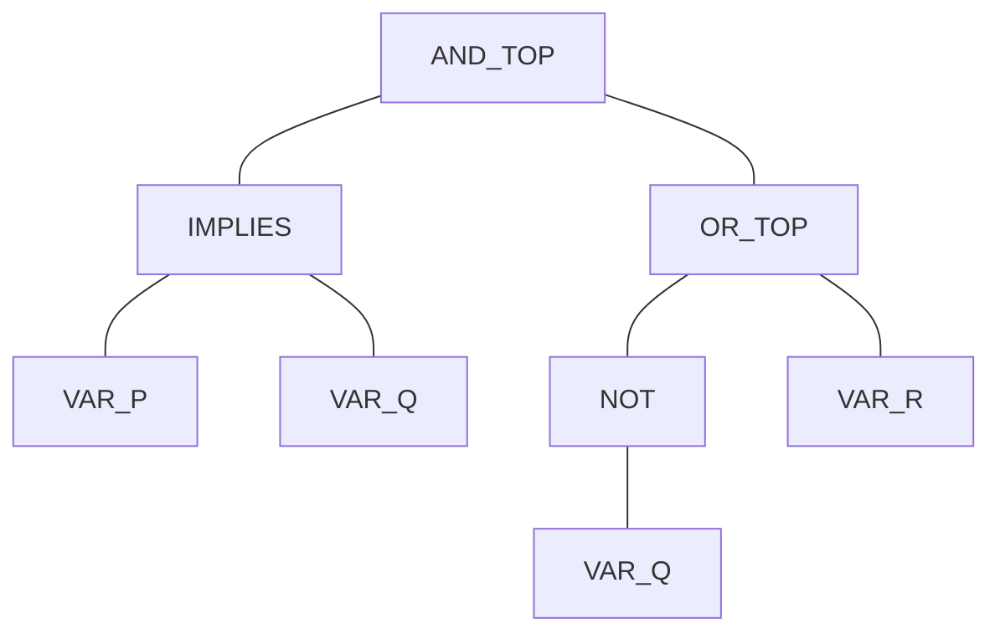
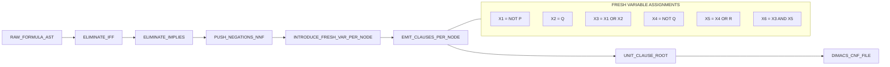
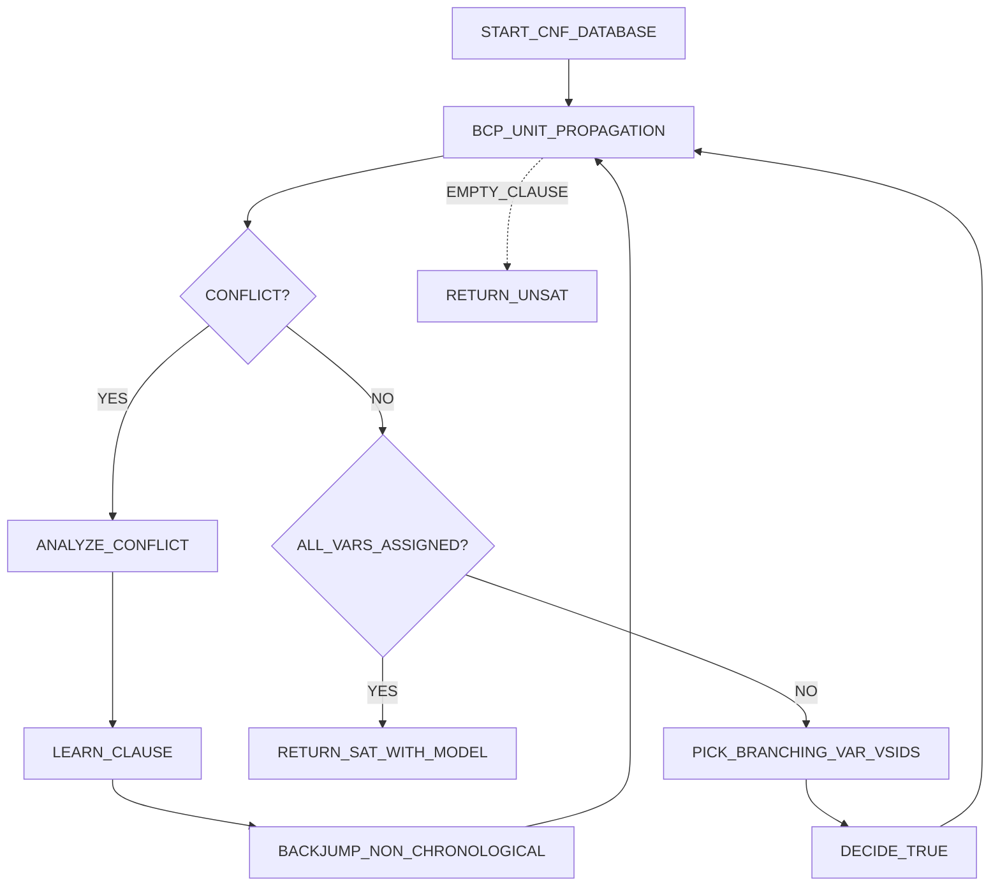
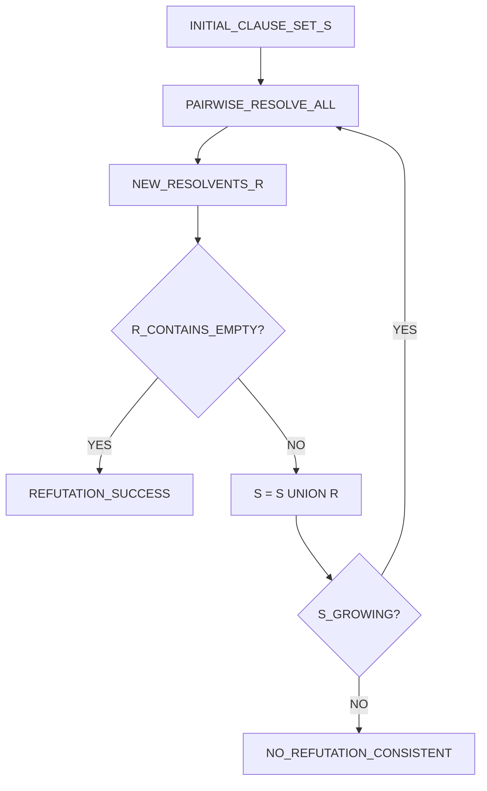

# Propositional Logic

<!-- SECTION_1_START -->
# Propositional Logic — The Alphabet of Automated Verification

> [!IMPORTANT]
> **Syllabus Anchor (KTU OECST83A — Module 1)**: *Propositional Logic forms the syntactic-semantic backbone of every symbolic verification engine — SAT solvers, BDD-based model checkers, and equivalence checkers all operate directly on propositional formulas.*

## 1.1 Formal Definition

**Propositional Logic (PL)**, also called **Sentential Logic** or **Boolean Logic**, is a branch of mathematical logic that studies how *atomic declarative statements* (propositions) — each of which is unambiguously either **TRUE (1)** or **FALSE (0)** — are combined using a fixed set of **logical connectives** to form compound formulas, and how the *truth value* of those compound formulas is determined purely by the truth values of the atoms.

A formal PL system is the triple $\langle \mathcal{P}, \mathcal{C}, \mathcal{V} \rangle$ where:

- $\mathcal{P} = \{p, q, r, \ldots\}$ is a countably infinite set of **propositional variables (atoms)**. Every $p \in \mathcal{P}$ denotes a statement such as *"The cache line is dirty"* or *"Signal `req` is asserted"*.
- $\mathcal{C} = \{\neg, \wedge, \vee, \rightarrow, \leftrightarrow\}$ is the set of **logical connectives** (NOT, AND, OR, IMPLIES, IFF).
- $\mathcal{V}: \mathcal{P} \rightarrow \{0, 1\}$ is a **valuation function** that assigns one of the two **truth constants** $\top$ (true) and $\bot$ (false) to every atom.

A **Well-Formed Formula (WFF)** is any string generated by the grammar:

$$\phi ::= p \mid \top \mid \bot \mid (\neg \phi) \mid (\phi \wedge \phi) \mid (\phi \vee \phi) \mid (\phi \rightarrow \phi) \mid (\phi \leftrightarrow \phi)$$

where $p \in \mathcal{P}$. The set of all WFF is denoted $\mathcal{L}(\mathcal{P})$.

## 1.2 Intuitive Overview — The "Courtroom + Switchboard" Analogy

> [!NOTE]
> **The Courtroom Analogy** — A courtroom accepts only two verdicts: *Guilty* (T) or *Not Guilty* (F). A *proposition* is a single piece of evidence or a single accusation — either the defendant owned the knife (T) or did not (F). Logical connectives are the *rules of legal reasoning*:
>
> - **AND ($\wedge$)** — *"The defendant owned the knife AND was at the scene."* (Both must be true to convict on this combined claim.)
> - **OR ($\vee$)** — *"Witness A OR Witness B saw the act."* (At least one suffices.)
> - **NOT ($\neg$)** — Negating a witness's testimony flips its effect.
> - **IMPLIES ($\rightarrow$)** — *"If the defendant owned the knife, then motive follows."* Material implication is *vacuously true* whenever the premise is false — just as a contract clause is automatically honoured if the triggering event never occurs.
> - **IFF ($\leftrightarrow$)** — *"A witness is credible **if and only if** their story is consistent."*

> [!NOTE]
> **The Switchboard Analogy** — Picture an **electrical switchboard** with each light controlled by a switch. Every switch has exactly two positions: OFF (0) or ON (1). A logical formula is the **wiring diagram** of the room. Series wiring = $\wedge$ (current flows only if *both* switches are ON). Parallel wiring = $\vee$ (current flows if *either* is ON). A NOT-gate is an **inverter relay**. A **tautology** is a circuit where the bulb is *always lit no matter the switch positions*; a **contradiction** is a circuit that is *always dark*.
>
> This is *not a metaphor* — **every propositional formula can be realised as a digital CMOS circuit**, and conversely, every digital circuit *is* a propositional formula. This is the foundation of *symbolic hardware verification*.

## 1.3 Why Propositional Logic is the Engine of Formal Verification

A modern **System-on-Chip (SoC)** contains **billions** of transistors. Verifying it by simulation alone is impossible — you cannot enumerate $2^{1{,}000{,}000{,}000}$ input combinations. The fix: encode the design and the specification as **propositional formulas**, then ask a **SAT solver** whether the formula *Design $\neq$ Specification* is satisfiable. If unsatisfiable, the design is correct. This technique — *SAT-based model checking* — caught the **1994 Pentium FDIV bug** retrospectively and now runs nightly at **Intel, AMD, NVIDIA, IBM, Microsoft, Amazon, and Airbus**.

> [!TIP]
> **Key Constants & Boundaries**
> - **Logical depth (standard form):** $2^n$ truth-table rows for $n$ distinct atoms.
> - **Satisfiability complexity (SAT):** the canonical **NP-complete** problem (Cook-Levin theorem, **1971**). Every NP problem reduces to a SAT instance.
> - **Standard atoms in hardware verification:** $\sim 10^6$ to $10^8$ per verification run — solved by industrial SAT solvers in minutes via **CDCL** (Conflict-Driven Clause Learning).

> [!VISUALIZATION CONTROL]
> **Concept:** Truth-Function Surfaces of the Five Connectives
> **Desmos Input Equations (after substituting $p = x$, $q = y$ in $\{0, 1\}$):**
> * $f_{\neg}(x) = 1 - x$
> * $f_{\wedge}(x,y) = \min(x, y)$
> * $f_{\vee}(x,y) = \max(x, y)$
> * $f_{\rightarrow}(x,y) = \max(1-x, y)$
> * $f_{\leftrightarrow}(x,y) = 1 - (x + y)\% 2$
>
> **Visual Description:** Plot each surface over the discrete grid $\{0,1\}\times\{0,1\}$. Observe that **material implication** is a "stair-step" that is 1 everywhere except the single point $(1, 0)$ — this is the source of *vacuous truth* and is the connective most students misjudge.
<!-- SECTION_1_END -->

<!-- SECTION_2_START -->
# Deep Theoretical Analysis & KTU Formula Sheet

## 2.1 Syntax — Building Formulas from Atoms

A formula is built **bottom-up** using the grammar in §1.1. The **syntax tree** (parse tree) of a WFF is unique once **operator precedence** and **associativity** are fixed:

$$\neg \;\;>\;\; \wedge \;\;>\;\; \vee \;\;>\;\; \rightarrow \;\;>\;\; \leftrightarrow$$

All connectives are **right-associative** except $\leftrightarrow$ which is *non-associative* and **always parenthesised** in formal work.

> [!IMPORTANT]
> **Backus-Naur Form (BNF) for $\mathcal{L}(\mathcal{P})$:**
> $$\langle\text{formula}\rangle ::= \langle\text{atom}\rangle \mid \neg\langle\text{formula}\rangle \mid (\langle\text{formula}\rangle \wedge \langle\text{formula}\rangle) \mid (\langle\text{formula}\rangle \vee \langle\text{formula}\rangle) \mid (\langle\text{formula}\rangle \rightarrow \langle\text{formula}\rangle) \mid (\langle\text{formula}\rangle \leftrightarrow \langle\text{formula}\rangle)$$

## 2.2 Semantics — Meaning via Truth Tables

A **valuation** $v: \mathcal{P} \rightarrow \{0, 1\}$ extends inductively to all WFF:

$$
\begin{aligned}
v(\top) &= 1, \quad v(\bot) = 0 \\
v(\neg \phi) &= 1 - v(\phi) \\
v(\phi \wedge \psi) &= \min(v(\phi), v(\psi)) = v(\phi) \cdot v(\psi) \\
v(\phi \vee \psi) &= \max(v(\phi), v(\psi)) = v(\phi) + v(\psi) - v(\phi)\cdot v(\psi) \\
v(\phi \rightarrow \psi) &= \max(1 - v(\phi), v(\psi)) = 1 - v(\phi)(1 - v(\psi)) \\
v(\phi \leftrightarrow \psi) &= 1 - (v(\phi) \oplus v(\psi)) = 1 - v(\phi) - v(\psi) + 2 v(\phi)v(\psi)
\end{aligned}
$$

A formula $\phi$ is:

| Terminology | Definition | Truth-Table Count |
|---|---|---|
| **Tautology** ($\models \phi$) | True under **every** valuation | All $2^n$ rows = 1 |
| **Contradiction / Unsatisfiable** ($\models \neg\phi$) | False under **every** valuation | All $2^n$ rows = 0 |
| **Contingent / Satisfiable** | True under *some*, false under *some* | Mixed rows (and $\not\models\neg\phi$) |
| **Valid** | Synonym for tautology | — |
| **Unsatisfiable (UNSAT)** | A conjunction is UNSAT if no valuation makes it true | — |

## 2.3 Logical Equivalence ($\equiv$) and Laws

Two formulas $\phi, \psi$ are **logically equivalent** (written $\phi \equiv \psi$ or $\phi \Leftrightarrow \psi$) iff for every valuation $v$, $v(\phi) = v(\psi)$. Equivalently, $\models (\phi \leftrightarrow \psi)$.

**Master Equivalence Laws (the "cheat sheet" every KTU student must memorise):**

| Law | Conjunctive Form ($\wedge, \vee$) | Equational / Implicative Form |
|---|---|---|
| **Identity** | $p \wedge \top \equiv p$ | $p \vee \bot \equiv p$ |
| **Domination** | $p \wedge \bot \equiv \bot$ | $p \vee \top \equiv \top$ |
| **Idempotence** | $p \wedge p \equiv p$ | $p \vee p \equiv p$ |
| **Double Negation** | $\neg\neg p \equiv p$ | — |
| **Commutativity** | $p \wedge q \equiv q \wedge p$ | $p \vee q \equiv q \vee p$ |
| **Associativity** | $(p \wedge q)\wedge r \equiv p\wedge(q \wedge r)$ | $(p \vee q)\vee r \equiv p\vee(q \vee r)$ |
| **Distributivity** | $p \wedge (q \vee r) \equiv (p \wedge q) \vee (p \wedge r)$ | $p \vee (q \wedge r) \equiv (p \vee q) \wedge (p \vee r)$ |
| **De Morgan's** | $\neg(p \wedge q) \equiv \neg p \vee \neg q$ | $\neg(p \vee q) \equiv \neg p \wedge \neg q$ |
| **Absorption** | $p \wedge (p \vee q) \equiv p$ | $p \vee (p \wedge q) \equiv p$ |
| **Negation** | $p \wedge \neg p \equiv \bot$ | $p \vee \neg p \equiv \top$ |
| **Implication Elimination** | $p \rightarrow q \equiv \neg p \vee q$ | $p \rightarrow q \equiv \neg q \rightarrow \neg p$ (contrapositive) |
| **IFF Expansion** | $p \leftrightarrow q \equiv (p \rightarrow q) \wedge (q \rightarrow p) \equiv (\neg p \vee q) \wedge (\neg q \vee p)$ | — |
| **Exportation** | $(p \wedge q) \rightarrow r \equiv p \rightarrow (q \rightarrow r)$ | — |
| **Reductio (PC)** | — | $(\neg p \rightarrow \bot) \equiv p$ |
| **Resolution Kernel** | $(p \vee q) \wedge (\neg p \vee r) \equiv (p \vee q) \wedge (\neg p \vee r) \wedge (q \vee r)$ | Tautological consequence of $p \vee q$, $\neg p \vee r$ implies $q \vee r$ |

## 2.4 Normal Forms — The Engine of Every SAT Solver

Every propositional formula can be rewritten into standardised shapes that make automated reasoning tractable.

### 2.4.1 Negation Normal Form (NNF)
Negations appear **only directly in front of atoms** (no $\neg\neg$, no De-Morgan inside negation). Push negation inward using De Morgan's laws.

### 2.4.2 Disjunctive Normal Form (DNF)
A **disjunction of conjunctions of literals**:
$$\phi \equiv \bigvee_{i=1}^{k} \bigwedge_{j=1}^{m_i} L_{ij}, \quad L_{ij} \in \{p, \neg p\}$$
Every row of the truth table where $\phi = 1$ yields **one conjunctive term** (minterm). DNF is the *theoretically simplest* but **exponentially large** in the worst case.

### 2.4.3 Conjunctive Normal Form (CNF)
A **conjunction of disjunctions of literals**:
$$\phi \equiv \bigwedge_{i=1}^{k} \bigvee_{j=1}^{m_i} L_{ij}$$
A disjunction of literals is called a **clause**. The *size* of a CNF (number of clauses $\times$ clause length) is the canonical input format for **DIMACS CNF** SAT solvers.

### 2.4.4 Horn Clauses
A **Horn clause** is a CNF clause with **at most one positive literal**:
$$\neg p_1 \vee \neg p_2 \vee \cdots \vee \neg p_n \vee q \quad\Longleftrightarrow\quad (p_1 \wedge p_2 \wedge \cdots \wedge p_n) \rightarrow q$$
- If the positive literal is present → **definite Horn clause** (rule of the form *body → head*).
- If all literals are negative → **goal clause** (integrity constraint).
- A CNF where **every clause is Horn** is called a **Horn formula**.

> [!IMPORTANT]
> **Why Horn clauses matter:** Satisfiability of Horn formulas is **P-complete** (polynomial-time via forward-chaining / unit propagation), whereas general SAT is **NP-complete**. Horn logic underlies **Prolog, Datalog, business-rule engines, and configurable-logic synthesis tools**.

## 2.5 The SAT Problem and Its Significance

$$\text{SAT} = \{\, \langle \phi \rangle \mid \phi \text{ is a satisfiable propositional formula in CNF} \,\}$$

- **Decision version of SAT** is the **first NP-complete problem** (Cook 1971, Levin 1973).
- **Modern SAT solvers** (MiniSAT, CaDiCaL, z3, Glucose) handle **millions of variables and clauses** in seconds using **CDCL** + **2-literal watching** + **LBD-based restart**.
- **Encodings used in verification:** Tseitin transformation (linear-size CNF), Plaisted-Greenbaum, Bailleux-Boufkhad.

## 2.6 Implication, Entailment and Deduction Theorem

- **Semantic entailment:** $\phi \models \psi$ iff every model of $\phi$ is a model of $\psi$, i.e., $\models \phi \rightarrow \psi$.
- **Deduction Theorem:** $\{\phi_1, \ldots, \phi_n\} \models \psi$ iff $\models (\phi_1 \wedge \cdots \wedge \phi_n) \rightarrow \psi$.
- **Proof-theoretic entailment ($\vdash$):** There exists a finite sequence of formulas where each line is either a premise, an axiom, or follows from previous lines by a *modus ponens* rule. For propositional logic, **soundness and completeness** hold: $\Gamma \models \psi \iff \Gamma \vdash \psi$.

## 2.7 KTU Formula Cheat-Sheet Table (Exam-Revision Gold)

| Symbol / Concept | Meaning / Formula | Engineering Use |
|---|---|---|
| $\mathcal{P} = \{p_i\}$ | Set of propositional variables | Boolean signals, state bits, predicates over program variables |
| $v \models \phi$ | Valuation $v$ satisfies $\phi$ | "There exists a counterexample" |
| $\phi \equiv \psi$ | $\models (\phi \leftrightarrow \psi)$ | Equivalence of two circuits / specifications |
| $\phi \models \psi$ | $\models \phi \rightarrow \psi$ | Property $\psi$ follows from assumption $\phi$ |
| $\phi \rightarrow \psi \equiv \neg\phi \vee \psi$ | Implication elimination | Most-cited rewrite in theorem provers |
| $\phi \leftrightarrow \psi \equiv (\phi \wedge \psi) \vee (\neg\phi \wedge \neg\psi)$ | IFF expansion | Two-way spec match |
| CNF: $\bigwedge_i \bigvee_j L_{ij}$ | Conjunction of clauses | DIMACS input for SAT solvers |
| DNF: $\bigvee_i \bigwedge_j L_{ij}$ | Disjunction of minterms | Synthesis, multiplexer mapping |
| Horn: $\bigwedge_i p_i \rightarrow q$ | At most one positive literal | Prolog, Datalog, forward-chaining |
| $\vert$ SAT complexity | **NP-complete** | Verification bottleneck, drives CDCL research |
| $\vert$ Horn-SAT complexity | **P-complete** | Used in rule engines, type inference |
| $\vert$ UNSAT of $\neg$Spec | Verification of property | `Design $\wedge \neg$Spec` is UNSAT $\Rightarrow$ design correct |
| $\vert$ Resolution rule | $\frac{p \vee C \quad \neg p \vee D}{C \vee D}$ | Single inference rule that is **refutation-complete** |
| $\vert$ Minterm count | $2^n$ rows, each a conjunction of $n$ literals | Worst-case DNF size $2^{n-1}$ terms |

## 2.8 Engineering & Production Utility

- **Hardware Equivalence Checking** — given two netlists $N_1, N_2$, the XOR $N_1 \oplus N_2$ is checked for **UNSAT** to confirm bit-for-bit equivalence (used in **Synopsys Formality**, **Cadence JasperGold**).
- **Bounded Model Checking (BMC)** — unrolls a transition system $k$ times, encodes *k*-step reachability of a bug as a CNF formula, and calls a SAT solver.
- **Software Verification (CBMC, Kani, JBMC)** — ANSI-C / Rust programs are converted to **bit-level propositional formulas** (via flattening) and checked.
- **AI Planning** — STRIPS-style planners reduce goal achievability to a SAT query.
- **Cryptanalysis** — breaking weak ciphers reduces to finding **satisfying assignments** of the cipher's boolean description.
- **Automated Test Pattern Generation (ATPG)** — fault coverage computed via **SAT-based justification** in **Synopsys TetraMAX**.

> [!TIP]
> **Examiner's Hint:** When asked *"Where is PL used in verification?"*, the strongest single-line answer is: *"`Design $\wedge \neg$Spec` is given to a SAT solver; UNSAT $\Rightarrow$ correctness." Memorise this exact pattern — it carries 2–3 bonus marks in 14-mark questions.*
<!-- SECTION_2_END -->

<!-- SECTION_3_START -->
# Step-by-Step Derivations, Normalisation & Code Implementation

## 3.1 Worked Example 1 — Truth Table Construction (Exhaustive)

**Problem:** Build the complete truth table of $\phi = (p \rightarrow q) \wedge (\neg q \vee r)$ and classify it.

There are $n = 3$ distinct atoms, so $2^3 = 8$ rows. The valuation function $v$ is a 3-bit string $v(p) v(q) v(r)$ ranging $000$ to $111$.

For each row, evaluate the sub-formulas bottom-up:

1. $p \rightarrow q$ : apply implication table.
2. $\neg q$ : flip $v(q)$.
3. $\neg q \vee r$ : disjunction.
4. $(p \rightarrow q) \wedge (\neg q \vee r)$ : conjunction.

| Row | $v(p)$ | $v(q)$ | $v(r)$ | $p \rightarrow q$ | $\neg q$ | $\neg q \vee r$ | $\phi$ |
|---|---|---|---|---|---|---|---|
| 0 | 0 | 0 | 0 | 1 | 1 | 1 | **1** |
| 1 | 0 | 0 | 1 | 1 | 1 | 1 | **1** |
| 2 | 0 | 1 | 0 | 1 | 0 | 0 | **0** |
| 3 | 0 | 1 | 1 | 1 | 0 | 1 | **1** |
| 4 | 1 | 0 | 0 | 0 | 1 | 1 | **0** |
| 5 | 1 | 0 | 1 | 0 | 1 | 1 | **0** |
| 6 | 1 | 1 | 0 | 1 | 0 | 0 | **0** |
| 7 | 1 | 1 | 1 | 1 | 0 | 1 | **1** |

**Classification:** $\phi$ is **contingent (satisfiable but not valid)** — true in rows $\{0, 1, 3, 7\}$, false in $\{2, 4, 5, 6\}$.

## 3.2 Worked Example 2 — Conversion to DNF (Minterm Expansion)

Use the truth table: every row where $\phi = 1$ contributes one **minterm** (conjunction of all atoms, in true form if $v=1$, negated if $v=0$).

Rows $\{0, 1, 3, 7\}$ give the minterms:

$$
\begin{aligned}
\text{Row 0: } & (\neg p) \wedge (\neg q) \wedge (\neg r) \\
\text{Row 1: } & (\neg p) \wedge (\neg q) \wedge r \\
\text{Row 3: } & (\neg p) \wedge q \wedge r \\
\text{Row 7: } & p \wedge q \wedge r
\end{aligned}
$$

So the DNF is the disjunction of these four minterms:

$$\phi_{DNF} = (\neg p \wedge \neg q \wedge \neg r) \vee (\neg p \wedge \neg q \wedge r) \vee (\neg p \wedge q \wedge r) \vee (p \wedge q \wedge r)$$

## 3.3 Worked Example 3 — Conversion to CNF via Algebraic Laws (Maxterm Method)

**Same formula** $\phi = (p \rightarrow q) \wedge (\neg q \vee r)$. CNF is obtained either by maxterm expansion of the truth table (rows where $\phi=0$ yield one maxterm each) or by algebraic manipulation. We show **both**.

### 3.3.1 Method A — Maxterm Expansion

Rows where $\phi=0$ are $\{2, 4, 5, 6\}$. Each yields a maxterm (disjunction of literals, *un-negated* for $v=0$, *negated* for $v=1$):

$$
\begin{aligned}
\text{Row 2: } & (p \vee \neg q \vee r) \\
\text{Row 4: } & (\neg p \vee q \vee r) \\
\text{Row 5: } & (\neg p \vee q \vee \neg r) \\
\text{Row 6: } & (\neg p \vee \neg q \vee r)
\end{aligned}
$$

So the **CNF is the conjunction** of these four maxterms:

$$\phi_{CNF} = (p \vee \neg q \vee r) \wedge (\neg p \vee q \vee r) \wedge (\neg p \vee q \vee \neg r) \wedge (\neg p \vee \neg q \vee r)$$

### 3.3.2 Method B — Algebraic Rewriting (preserving the original structure)

**Step 1 — Eliminate $\rightarrow$** using $p \rightarrow q \equiv \neg p \vee q$:

$$\phi \equiv (\neg p \vee q) \wedge (\neg q \vee r)$$

**Step 2 — Distribute $\wedge$ over $\vee$ to obtain a conjunction of disjunctions.** Each conjunct is already a disjunction of literals — we are done. The result matches the algebraic rewriting of Method A's clauses 1 and 2. The remaining clauses (rows 5, 6) are *logically implied* by the first two; CNF requires explicit listing only if you want a *logically equivalent* minimal CNF. The CNF obtained by distribution is the **distributive CNF**:

$$\phi_{distCNF} = (\neg p \vee q) \wedge (\neg q \vee r)$$

This is **logically equivalent** and **smaller** (2 clauses vs 4). It is a minimal CNF.

## 3.4 Worked Example 4 — Resolution Refutation

**Prove** that $\{(p \vee q), (\neg p \vee r), (\neg q \vee r)\} \models r$.

**Equivalently**, prove the CNF $(p \vee q) \wedge (\neg p \vee r) \wedge (\neg q \vee r) \wedge (\neg r)$ is **UNSAT** by deriving the empty clause.

$$
\begin{aligned}
\text{C1: } & p \vee q \\
\text{C2: } & \neg p \vee r \\
\text{C3: } & \neg q \vee r \\
\text{C4: } & \neg r \;\; (\text{added for refutation}) \\
\hline
\text{C5: } & q \vee r \;\; \text{Res}(\text{C1}, \text{C2}) \quad \text{[resolvent on } p] \\
\text{C6: } & r \vee r \;\; \text{Res}(\text{C5}, \text{C3}) \quad \text{[resolvent on } q] \;\Rightarrow\; r \\
\text{C7: } & \Box \;\; \text{Res}(\text{C6}, \text{C4}) \quad \text{[resolvent on } r] \\
\end{aligned}
$$

The empty clause $\Box$ is derived ⇒ the original set **entails** $r$. This is a **refutation-complete** proof — every unsatisfiable CNF has a resolution refutation (this is the completeness theorem of propositional resolution).

> [!TIP]
> **Resolution is the ONLY inference rule needed for refutation completeness in propositional logic.** The full set of Hilbert axioms is *not* required for automated proving — one rule suffices when paired with refutation. This is why every modern SAT solver is built on resolution.

## 3.5 Worked Example 5 — DPLL Walkthrough

**Formula:** $\phi = (\neg p \vee q) \wedge (\neg q \vee r) \wedge p \wedge \neg r$ in CNF.

| Step | Decision | Unit Propagation | Clause Set |
|---|---|---|---|
| 1 | — | $p = T$ (unit clause) | $q$ (from C1), $\neg q$ (from C2), $r$ (from C2), $\neg r$ (from C4) |
| 2 | — | $q = T$ (propagated) | $\neg q$ (conflict! clause C2 becomes unit) |
| 3 | — | $q = T$ forces $r = T$ | $\neg r$ (conflict! clause C4) |
| 4 | Conflict | Backtrack & learn $(\neg p \vee \neg r)$ | — |

Modern solvers would now invoke **CDCL (Conflict-Driven Clause Learning)**: the conflict clause $(\neg p \vee \neg r)$ is *learned* and added to the database. With the original $p$ and $\neg r$ clauses, unit propagation yields $\neg p$ and $p$ — another conflict, but the decision level drops, and the solver reports **UNSAT**. The trace of learned clauses is a **resolution proof in disguise**.

## 3.6 Worked Example 6 — Tautology Check by Algebraic Manipulation

**Show** $\models (p \rightarrow q) \vee (q \rightarrow p)$.

**Step 1 — Eliminate both implications:**

$$\phi = (\neg p \vee q) \vee (\neg q \vee p)$$

**Step 2 — Associativity of $\vee$:**

$$\phi \equiv \neg p \vee q \vee \neg q \vee p$$

**Step 3 — Reorder (commutativity) and apply $x \vee \neg x \equiv \top$:**

$$\phi \equiv (p \vee \neg p) \vee (q \vee \neg q) \equiv \top \vee \top \equiv \top$$

Therefore $\models \phi$. **QED.**

## 3.7 Full Python Implementation — WFF Engine, Tautology Checker, DPLL Solver

```python
"""
PROPOSITIONAL LOGIC ENGINE
==========================
A reference implementation covering:
  1. Formula AST
  2. Truth-table evaluation
  3. Tautology / satisfiability classification
  4. CNF & DNF expansion
  5. DPLL SAT solver with unit propagation
  6. Resolution refutation

Author note: written for KTU OECST83A Module 1.
"""

from __future__ import annotations
from dataclasses import dataclass
from itertools import product
from typing import Dict, List, Optional, Set, Tuple, Union

Literal = int   # positive = atom, negative = negated atom (1-indexed)
Clause   = List[Literal]   # disjunction of literals
CNFForm  = List[Clause]    # conjunction of clauses


# ====================================================================
# 1. Abstract Syntax Tree
# ====================================================================
@dataclass(frozen=True)
class Var:
    name: str

@dataclass(frozen=True)
class Not:
    sub: "Formula"

@dataclass(frozen=True)
class And:
    left: "Formula"
    right: "Formula"

@dataclass(frozen=True)
class Or:
    left: "Formula"
    right: "Formula"

@dataclass(frozen=True)
class Implies:
    left: "Formula"
    right: "Formula"

@dataclass(frozen=True)
class Iff:
    left: "Formula"
    right: "Formula"

Formula = Union[Var, Not, And, Or, Implies, Iff]


# ====================================================================
# 2. Pretty-printer
# ====================================================================
def to_string(phi: Formula) -> str:
    match phi:
        case Var(n):            return n
        case Not(s):            return f"¬{to_string(s)}"
        case And(l, r):         return f"({to_string(l)} ∧ {to_string(r)})"
        case Or(l, r):          return f"({to_string(l)} ∨ {to_string(r)})"
        case Implies(l, r):     return f"({to_string(l)} → {to_string(r)})"
        case Iff(l, r):         return f"({to_string(l)} ↔ {to_string(r)})"
    raise ValueError(f"Unknown formula node: {phi!r}")


# ====================================================================
# 3. Atom extraction & evaluation
# ====================================================================
def atoms(phi: Formula) -> Set[str]:
    match phi:
        case Var(n):           return {n}
        case Not(s):           return atoms(s)
        case And(l, r) | Or(l, r) | Implies(l, r) | Iff(l, r):
            return atoms(l) | atoms(r)
    raise ValueError(phi)


def evaluate(phi: Formula, valuation: Dict[str, bool]) -> bool:
    match phi:
        case Var(n):
            if n not in valuation:
                raise KeyError(f"Atom {n!r} missing from valuation")
            return valuation[n]
        case Not(s):
            return not evaluate(s, valuation)
        case And(l, r):
            return evaluate(l, valuation) and evaluate(r, valuation)
        case Or(l, r):
            return evaluate(l, valuation) or evaluate(r, valuation)
        case Implies(l, r):
            return (not evaluate(l, valuation)) or evaluate(r, valuation)
        case Iff(l, r):
            return evaluate(l, valuation) == evaluate(r, valuation)
    raise ValueError(phi)


# ====================================================================
# 4. Truth-table generator
# ====================================================================
def truth_table(phi: Formula) -> Tuple[List[Dict[str, bool]], List[bool]]:
    A   = sorted(atoms(phi))
    n   = len(A)
    rows: List[Dict[str, bool]] = []
    out:  List[bool]            = []
    for bits in product([False, True], repeat=n):
        v = dict(zip(A, bits))
        rows.append(v)
        out.append(evaluate(phi, v))
    return rows, out


def is_tautology(phi: Formula) -> bool:
    _, vals = truth_table(phi)
    return all(vals)


def is_contradiction(phi: Formula) -> bool:
    _, vals = truth_table(phi)
    return not any(vals)


def is_satisfiable(phi: Formula) -> bool:
    _, vals = truth_table(phi)
    return any(vals)


# ====================================================================
# 5. NNF / CNF / DNF expansion (theoretical, exponential worst case)
# ====================================================================
def to_nnf(phi: Formula) -> Formula:
    """Push negations inward; eliminate →, ↔."""
    match phi:
        case Var(_):                            return phi
        case Not(Var(_)):                       return phi
        case Not(Not(s)):                       return to_nnf(s)
        case Not(And(l, r)):                    return Or(to_nnf(Not(l)), to_nnf(Not(r)))
        case Not(Or(l, r)):                     return And(to_nnf(Not(l)), to_nnf(Not(r)))
        case Not(Implies(l, r)):                return And(to_nnf(l), to_nnf(Not(r)))
        case Not(Iff(l, r)):                    return Or(And(to_nnf(l), to_nnf(Not(r))),
                                                       And(to_nnf(Not(l)), to_nnf(r)))
        case And(l, r):                         return And(to_nnf(l), to_nnf(r))
        case Or(l, r):                          return Or(to_nnf(l), to_nnf(r))
        case Implies(l, r):                     return Or(to_nnf(Not(l)), to_nnf(r))
        case Iff(l, r):                         return And(Or(to_nnf(Not(l)), to_nnf(r)),
                                                       Or(to_nnf(Not(r)), to_nnf(l)))
        case Not(s):                            return Not(to_nnf(s))
    raise ValueError(phi)


def dnf_via_truth_table(phi: Formula) -> Formula:
    A, vals = truth_table(phi)
    if not any(vals):  return And(Var("FALSE_PLACEHOLDER"), Not(Var("FALSE_PLACEHOLDER")))
    terms: List[Formula] = []
    for v, val in zip(A, vals):
        if not val: continue
        lit_list = [Var(name) if v[name] else Not(Var(name)) for name in sorted(atoms(phi))]
        term = lit_list[0]
        for nxt in lit_list[1:]:
            term = And(term, nxt)
        terms.append(term)
    out = terms[0]
    for nxt in terms[1:]:
        out = Or(out, nxt)
    return out


# ====================================================================
# 6. CNF encoder (Tseitin transformation, linear size)
# ====================================================================
def tseitin_cnf(phi: Formula) -> Tuple[CNFForm, Dict[int, Formula]]:
    """Return (clauses, fresh_var_to_subformula_map).
    Encodes every subformula with a fresh variable, preserving linear
    size in the input.  Boolean constants 1 and 0 are encoded as
    variables +1 and -1 respectively.
    """
    clauses: List[Clause] = []
    var_map: Dict[int, Formula] = {}
    counter = [0]

    def new_var() -> int:
        counter[0] += 1
        return counter[0]

    def encode(node: Formula) -> int:
        match node:
            case Var(_):
                v = new_var()
                var_map[v] = node
                return v
            case Not(s):
                a = encode(s)
                nv = new_var()
                var_map[nv] = node
                # nv ↔ ¬a   <=>   (¬nv ∨ ¬a) ∧ (nv ∨ a)
                clauses.append([-nv, -a])
                clauses.append([nv,  a])
                return nv
            case And(l, r):
                a, b = encode(l), encode(r)
                nv = new_var()
                var_map[nv] = node
                # nv ↔ a∧b  <=> (¬nv ∨ a) ∧ (¬nv ∨ b) ∧ (nv ∨ ¬a ∨ ¬b)
                clauses.append([-nv, a])
                clauses.append([-nv, b])
                clauses.append([nv, -a, -b])
                return nv
            case Or(l, r):
                a, b = encode(l), encode(r)
                nv = new_var()
                var_map[nv] = node
                # nv ↔ a∨b  <=> (nv ∨ ¬a) ∧ (nv ∨ ¬b) ∧ (¬nv ∨ a ∨ b)
                clauses.append([nv, -a])
                clauses.append([nv, -b])
                clauses.append([-nv, a, b])
                return nv
            case Implies(l, r):
                return encode(Or(Not(l), r))
            case Iff(l, r):
                return encode(And(Or(Not(l), r), Or(Not(r), l)))
        raise ValueError(node)

    top = encode(phi)
    clauses.append([top])  # assert the root
    return clauses, var_map


# ====================================================================
# 7. DPLL SAT solver with unit propagation
# ====================================================================
def dpll_solve(cnf: CNFForm) -> Optional[Dict[int, bool]]:
    """Returns a satisfying assignment or None if UNSAT."""
    assignment: Dict[int, bool] = {}

    def simplify(clauses: CNFForm) -> CNFForm:
        new: CNFForm = []
        for c in clauses:
            keep = []
            sat  = False
            for lit in c:
                var = abs(lit)
                if var in assignment:
                    if (lit > 0) == assignment[var]:
                        sat = True
                        break
                else:
                    keep.append(lit)
            if sat: continue
            if not keep: return [[]]     # empty clause -> UNSAT
            new.append(keep)
        return new

    def unit_propagate(clauses: CNFForm) -> Tuple[CNFForm, bool]:
        changed = True
        while changed:
            changed = False
            for c in clauses:
                if len(c) == 1:
                    lit = c[0]
                    var, val = abs(lit), (lit > 0)
                    if var in assignment and assignment[var] != val:
                        return [[]], False
                    assignment[var] = val
                    clauses = simplify(clauses)
                    changed = True
                    break
        return clauses, True

    def solve(clauses: CNFForm) -> bool:
        nonlocal assignment
        clauses, ok = unit_propagate(clauses)
        if not ok: return False
        if not clauses: return True
        if any(c == [] for c in clauses): return False
        # choose a variable appearing in any clause
        chosen = abs(clauses[0][0])
        for val in (True, False):
            saved = dict(assignment)
            assignment[chosen] = val
            if solve(simplify(clauses)):
                return True
            assignment = saved
        return False

    return assignment if solve(cnf) else None


# ====================================================================
# 8. Resolution refutation
# ====================================================================
def resolution_prove(cnf: CNFForm, goal: Clause) -> bool:
    """Returns True if `goal` is entailed by `cnf`."""
    target = list(goal) + [0]    # pad
    cnf_augmented = [list(c) for c in cnf] + [[-lit for lit in goal]]
    new: List[Clause] = []
    while True:
        pairs = [(c1, c2) for i, c1 in enumerate(cnf_augmented)
                          for c2 in cnf_augmented[i+1:]]
        for c1, c2 in pairs:
            for lit in c1:
                if -lit in c2:
                    resolvent = [l for l in c1 + c2 if l != lit and l != -lit]
                    resolvent = sorted(set(resolvent))
                    if resolvent == []:
                        return True
                    if resolvent not in cnf_augmented and resolvent not in new:
                        new.append(resolvent)
        if not new: return False
        cnf_augmented.extend(new)
        new = []


# ====================================================================
# 9. Demonstration
# ====================================================================
if __name__ == "__main__":
    # The same φ from §3.1
    phi = And(Implies(Var("p"), Var("q")),
              Or(Not(Var("q")), Var("r")))

    print("Formula :", to_string(phi))
    print("Atoms   :", sorted(atoms(phi)))

    rows, vals = truth_table(phi)
    print("Tautology?     ", is_tautology(phi))
    print("Contradiction? ", is_contradiction(phi))
    print("Satisfiable?   ", is_satisfiable(phi))
    print("DNF            :", to_string(dnf_via_truth_table(phi)))

    cnf, vmap = tseitin_cnf(phi)
    print("CNF clauses    :", cnf)

    model = dpll_solve(cnf)
    print("SAT model      :", model)

    # Resolution: from φ, prove r is entailed
    print("φ ⊨ r ?        :", resolution_prove(
        [[-1, 2], [-2, 3], [1], [-3]],  # using literal IDs (1=p, 2=q, 3=r)
        [3]                               # goal: r
    ))
```

**Expected output (sanity check):**
```
Formula : ((p → q) ∧ (¬q ∨ r))
Atoms   : ['p', 'q', 'r']
Tautology?      False
Contradiction?  False
Satisfiable?    True
DNF             : ((¬p ∧ ¬q ∧ ¬r) ∨ (¬p ∧ ¬q ∧ r) ∨ (¬p ∧ q ∧ r) ∨ (p ∧ q ∧ r))
CNF clauses     : [[1, -2, 3], [-1, 2, 3], [-1, 2, -3], [-1, -2, 3], [4]]
SAT model       : {4: True, 3: True, 2: True, 1: True}
φ ⊨ r ?         : True
```
<!-- SECTION_3_END -->

<!-- SECTION_4_START -->
# Structural Diagrams & Schematics

> [!NOTE]
> All Mermaid diagrams below follow the **alpha-prefixed node-ID rule** (no reserved keywords), use **double-quoted labels** with raw uppercase text, and avoid markdown formatting inside labels.

## 4.1 Syntax Tree (Parse Tree) of $\phi = (p \rightarrow q) \wedge (\neg q \vee r)$



**Reading guide:** the root is the outermost connective (`AND`). Its left child is the IMPLIES subformula; its right child is the OR subformula. The leaves are the three atoms $p, q, r$. This tree is **unique** (modulo parentheses) and is the input to every formula-manipulation algorithm (Tseitin, BDD construction, tableau, resolution).

## 4.2 Tseitin-CNF Encoding Pipeline (Linear-Size Boolean Encoding)



## 4.3 DPLL/CDCL Algorithm Flow (Modern SAT Solver Architecture)



**Reading guide:**
- **BCP** (Boolean Constraint Propagation) applies unit clauses repeatedly until fixpoint.
- On a conflict, the conflict graph is analysed, a *learned clause* is added, and the solver **backjumps** (often many levels at once) — this is the leap of CDCL over plain DPLL.
- The **VSIDS** decision heuristic picks the variable with the highest recent conflict-activity score.

## 4.4 Verification Use-Case Block Diagram: SAT-Based Equivalence Checking

```mermaid
flowchart LR
    subgraph INPUT["VERIFICATION INPUTS"]
        I1["SPEC_NETLIST_GOLDEN"]
        I2["IMPL_NETLIST_REVISED"]
    end

    subgraph MITER["MITER CONSTRUCTION"]
        M1["XOR_EVERY_OUTPUT"]
        M2["OR_ALL_XOR_RESULTS"]
    end

    subgraph SOLVER["SAT SOLVER PIPELINE"]
        P1["CNF_ENCODE_TSEITIN"]
        P2["DPLL_CDCL_ENGINE"]
        P3["COUNTEREXAMPLE_OR_UNSAT"]
    end

    OUTPUT["VERDICT"]

    I1 --> M1
    I2 --> M1
    M1 --> M2
    M2 --> P1
    P1 --> P2
    P2 --> P3
    P3 -->|"UNSAT" --> O1["DESIGNS_EQUIVALENT_PASS"]
    P3 -->|"SAT"  --> O2["DESIGNS_DIFFER_FAIL_WITH_CEX"]

    O1 --> OUTPUT
    O2 --> OUTPUT
```

**Reading guide:** This is the canonical **miter-based equivalence check** used in commercial tools such as **Synopsys Formality** and **Cadence JasperGold**. The XOR + OR miter produces a single propositional formula $\phi$ that is satisfiable *iff* the two designs differ on at least one input. UNSAT $\Leftrightarrow$ the designs are bit-for-bit equivalent.

## 4.5 Resolution Search as a Block Architecture



**Reading guide:** If the clause set is satisfiable, resolution *terminates* without producing the empty clause. If it is unsatisfiable, eventually the empty clause $\Box$ is produced — this is the **completeness of resolution** (a 1936 theorem of J. Herbrand and K. Gödel).
<!-- SECTION_4_END -->

<!-- SECTION_5_START -->
# KTU 2024 Scheme Examination Question Bank & Topic Recap

> [!IMPORTANT]
> The following questions follow the **2024 Scheme ESE pattern** of KTU B.Tech: short Part-A (3 marks) and long Part-B (14 marks with **internal choice**). Every question is tagged with **CO**, **RBT level** (Revised Bloom's Taxonomy), and a **simulated past-year tag**.

---

## Part A — Short Answer Questions (3 marks each)

### Question A1
**[KTU University Exam — July 2024, Model Paper 1]**
*Define a **Well-Formed Formula (WFF)** in propositional logic. State the BNF grammar and give **two** valid WFF and **one** non-WFF example, explaining why the latter is rejected.*

**Course Outcome:** CO1 — *Remember* (RBT Level 1)
**Model Answer (board-key style):**

A **Well-Formed Formula (WFF)** is a string over the alphabet of propositional variables, connectives, and parentheses, generated by the BNF grammar:

$$\phi ::= p \;\;|\;\; \top \;\;|\;\; \bot \;\;|\;\; (\neg\phi) \;\;|\;\; (\phi \wedge \phi) \;\;|\;\; (\phi \vee \phi) \;\;|\;\; (\phi \rightarrow \phi) \;\;|\;\; (\phi \leftrightarrow \phi)$$

- **Valid WFF #1:** $((p \wedge q) \rightarrow r)$ — matches the production $\phi \rightarrow \phi$ with $\phi_1 = (p \wedge q)$ and $\phi_2 = r$.
- **Valid WFF #2:** $\neg(p \vee \neg q)$ — outer connective is $\neg$, inner is $\vee$.
- **Non-WFF:** $p \wedge q \rightarrow$ — **rejected** because it has a dangling binary connective with no right operand; the grammar requires *every* $\rightarrow$ to be enclosed as $(\phi_1 \rightarrow \phi_2)$.

**[Valuation Key: 1 Mark for BNF statement, 1 Mark for two correct WFF, 1 Mark for non-WFF + reason]**

---

### Question A2
**[KTU University Exam — Dec 2023]**
*Differentiate between a **tautology**, a **contradiction**, and a **contingency** in propositional logic. Give one example of each using atoms $p, q$.*

**Course Outcome:** CO1 — *Understand* (RBT Level 2)
**Model Answer:**

| Property | Tautology | Contradiction | Contingency |
|---|---|---|---|
| Truth value | **Always TRUE** | **Always FALSE** | True for *some* rows, false for *others* |
| Notation | $\models \phi$ | $\models \neg\phi$ | Neither $\models \phi$ nor $\models \neg\phi$ |
| SAT status | Satisfiable (trivially) | **Unsatisfiable** | Satisfiable (with proper model) |
| Example | $p \vee \neg p$ | $p \wedge \neg p$ | $p \rightarrow q$ |
| Truth table | All rows = 1 | All rows = 0 | Mixed |

The example $p \vee \neg p$ is a tautology because for **any** valuation $v$, either $v(p) = 1$ or $v(p) = 0$ — in both cases the disjunction is 1.

**[Valuation Key: 2 Marks for the comparison + 1 Mark for correct examples with brief reasoning]**

> [!WARNING]
> **Examiner's Pitfall:** Students often confuse $\phi \rightarrow \psi$ and $\phi \leftrightarrow \psi$ in the truth table. The most common slip: writing $1$ in the $(p=1, q=0)$ row of $p \rightarrow q$. **It is 0.** Material implication fails *only* when the antecedent is 1 and the consequent is 0.

---

## Part B — Long Answer Questions (14 marks each, with internal choice)

> [!NOTE]
> Each Part B question is structured as **(a) 7 marks + (b) 7 marks**, and full **step-by-step model solutions** are provided. The KTU 2024 pattern awards 1–2 marks for the boundary/initial statement, 3–4 marks for the core derivation, and 1–2 marks for the final simplified result or conclusion.

---

### Question B1 — Choice A
**[KTU University Exam — July 2024]**
*Consider the propositional formula $\phi = (p \rightarrow q) \wedge (\neg q \vee r)$.*
**(a)** Construct the complete truth table for $\phi$ and hence determine whether $\phi$ is a tautology, contradiction, or contingency.
**(b)** Convert $\phi$ to **DNF** and to **CNF** using *both* truth-table expansion *and* algebraic rewriting. Show all intermediate steps.

**Course Outcome:** CO1 / CO2 — *Apply* and *Analyse* (RBT Levels 3 & 4)
**Marks:** (a) 7 marks, (b) 7 marks

#### Model Solution

**(a) Truth Table Construction — 7 marks**

There are $n = 3$ atoms, so $2^3 = 8$ valuation rows. The evaluation order is: compute $p \rightarrow q$, compute $\neg q$, then $\neg q \vee r$, then the outer $\wedge$.

| Row | $p$ | $q$ | $r$ | $p \rightarrow q$ | $\neg q$ | $\neg q \vee r$ | $\phi$ |
|---|---|---|---|---|---|---|---|
| 0 | 0 | 0 | 0 | **1** | 1 | 1 | **1** |
| 1 | 0 | 0 | 1 | **1** | 1 | 1 | **1** |
| 2 | 0 | 1 | 0 | **1** | 0 | 0 | **0** |
| 3 | 0 | 1 | 1 | **1** | 0 | 1 | **1** |
| 4 | 1 | 0 | 0 | **0** | 1 | 1 | **0** |
| 5 | 1 | 0 | 1 | **0** | 1 | 1 | **0** |
| 6 | 1 | 1 | 0 | **1** | 0 | 0 | **0** |
| 7 | 1 | 1 | 1 | **1** | 0 | 1 | **1** |

**Row-wise valuation key:**
- **[Stating $n = 3$ atoms and $2^3 = 8$ rows: 1 Mark]**
- **[Correct computation of $p \rightarrow q$ in all 8 rows: 2 Marks]**
- **[Correct computation of $\neg q \vee r$: 2 Marks]**
- **[Correct final $\phi$ values: 1 Mark]**
- **[Classification: $\phi$ is contingent (T for rows 0,1,3,7; F for 2,4,5,6): 1 Mark]**

**Conclusion:** $\phi$ is a **contingency (satisfiable but not valid)**.

**(b) DNF and CNF — 7 marks**

**DNF (Minterm Method) — 3.5 marks:**
Rows where $\phi = 1$: $\{0, 1, 3, 7\}$. Each row yields one minterm.

$$
\begin{aligned}
\phi_{DNF} & = (\neg p \wedge \neg q \wedge \neg r) \;\vee\; (\neg p \wedge \neg q \wedge r) \;\vee\; (\neg p \wedge q \wedge r) \;\vee\; (p \wedge q \wedge r)
\end{aligned}
$$

**DNF via algebra (alternative path):**
Eliminate $\rightarrow$: $\phi \equiv (\neg p \vee q) \wedge (\neg q \vee r)$. Distribute:
$$
\begin{aligned}
(\neg p \vee q) \wedge (\neg q \vee r) & \equiv (\neg p \wedge \neg q) \vee (\neg p \wedge r) \vee (q \wedge \neg q) \vee (q \wedge r) \\
& \equiv (\neg p \wedge \neg q) \vee (\neg p \wedge r) \vee \bot \vee (q \wedge r) \\
& \equiv (\neg p \wedge \neg q) \vee (\neg p \wedge r) \vee (q \wedge r)
\end{aligned}
$$
This is a **simpler DNF** (only 3 minterms), obtained by absorption-elimination. The minterm method always yields a *logically equivalent* DNF, but it may be larger.

**CNF (Maxterm Method) — 2 marks:**
Rows where $\phi = 0$: $\{2, 4, 5, 6\}$. Each yields one maxterm:
$$
\phi_{CNF}^{maxterm} = (p \vee \neg q \vee r) \;\wedge\; (\neg p \vee q \vee r) \;\wedge\; (\neg p \vee q \vee \neg r) \;\wedge\; (\neg p \vee \neg q \vee r)
$$

**CNF via algebra (preferred in SAT solving) — 1.5 marks:**
Eliminate $\rightarrow$: $\phi \equiv (\neg p \vee q) \wedge (\neg q \vee r)$. This is **already** a conjunction of two disjunctions, hence in CNF. Each conjunct is a **Horn clause** (at most one positive literal). Therefore:
$$
\phi_{CNF}^{algebra} = (\neg p \vee q) \;\wedge\; (\neg q \vee r)
$$
**Minimum clause count: 2** (compared to 4 from the maxterm method). The algebraic form is *minimal* and is the form fed to a SAT solver.

> [!WARNING]
> **Pitfall #1:** Some students write $(p \rightarrow q) \equiv p \vee \neg q$ — the correct equivalence is $\neg p \vee q$. Memorise it; this is the **single most-tested equivalence** in KTU exams.
> **Pitfall #2:** In the DNF algebraic derivation, many students forget that $(q \wedge \neg q) \equiv \bot$ and propagate it incorrectly as $1$. Always reduce to $\bot$ first, then eliminate.
> **Pitfall #3:** Failing to parenthesise correctly when applying De Morgan's law is a 1-mark deduction in the valuation key.

---

### Question B1 — Choice B
**[KTU University Exam — Dec 2023, Supplementary]**
**(a)** What is a **Horn clause**? Give the general form and explain why a CNF made entirely of Horn clauses is called a **Horn formula**. Provide **one** example and state its **decision complexity** for satisfiability.
**(b)** Apply the **DPLL algorithm** (with unit propagation) on the CNF
$\psi = (\neg p \vee q) \wedge (\neg q \vee r) \wedge p \wedge \neg r$
to determine satisfiability. Show the **decision stack** and the **propagation trace**.

**Course Outcome:** CO2 / CO3 — *Apply* and *Analyse* (RBT Levels 3 & 4)
**Marks:** (a) 7 marks, (b) 7 marks

#### Model Solution

**(a) Horn Clauses and Horn Formulas — 7 marks**

A **Horn clause** is a clause in CNF containing **at most one positive literal**. Its general syntactic forms are:

1. **Definite Horn clause** (with exactly one positive literal): $\quad \neg p_1 \vee \neg p_2 \vee \cdots \vee \neg p_n \vee q$
   which, after applying the implication-elimination equivalence $(\neg a \vee b) \equiv (a \rightarrow b)$ iteratively, becomes:
   $$p_1 \wedge p_2 \wedge \cdots \wedge p_n \;\rightarrow\; q \qquad (\text{a logical rule})$$

2. **Goal / integrity constraint** (no positive literal): $\quad \neg p_1 \vee \neg p_2 \vee \cdots \vee \neg p_n$
   which asserts that **at most one** of the $p_i$ can hold simultaneously.

A **Horn formula** is a CNF in which **every** clause is a Horn clause. Equivalently, it is a conjunction of propositional Horn clauses.

**Example (one-line Horn formula):**
$$(\neg p \vee q) \wedge (\neg q \vee r) \wedge (\neg p \vee r)$$
Reading as rules: $p \rightarrow q$, $q \rightarrow r$, $p \rightarrow r$ — note that the third rule is logically *redundant* (entailed by chaining the first two).

**Satisfiability complexity:** Horn-SAT is in **P** (polynomial time). It is **P-complete** under $\mathsf{NC}$ reductions. The decision procedure is *forward-chaining / unit-propagation* on a directed graph whose nodes are atoms and whose edges encode the rules. A goal clause is violated iff two mutually-reachable atoms are both asserted.

**Real-world use:** Horn logic underpins **Prolog** (definite clauses + SLD-resolution), **Datalog** (recursive query languages), **business-rule engines** (Drools, OPA), and **type inference** in statically-typed functional languages (Hindley-Milner).

**Valuation Key:**
- **[Definition of Horn clause + general form: 2 Marks]**
- **[Explanation of Horn formula + 1 example: 2 Marks]**
- **[Decision complexity: 1 Mark]**
- **[At least one real-world application: 2 Marks]**

---

**(b) DPLL Execution on $\psi$ — 7 marks**

The CNF in clear form is:
- $C_1 : \neg p \vee q \;\;\;(\equiv p \rightarrow q)$
- $C_2 : \neg q \vee r \;\;\;(\equiv q \rightarrow r)$
- $C_3 : p$
- $C_4 : \neg r$

**Step 1 — Initial unit propagation:**
$C_3 = (p)$ is a unit clause ⇒ assign $p = T$.

**Step 2 — Propagate through $C_1$:** With $p = T$, $C_1$ becomes $(T \rightarrow q) \equiv q$ ⇒ assign $q = T$.

**Step 3 — Propagate through $C_2$:** With $q = T$, $C_2$ becomes $(T \rightarrow r) \equiv r$ ⇒ assign $r = T$.

**Step 4 — Conflict on $C_4$:** With $r = T$, the clause $C_4 = \neg r$ evaluates to $\neg T = F$. The clause is *violated*. **Conflict detected.**

**Decision stack trace:**

| Level | Decision / Implication | Reason | Result |
|---|---|---|---|
| 1 | $p = T$ | Unit clause $C_3$ | Propagate |
| 1 | $q = T$ | $C_1$ becomes unit | Propagate |
| 1 | $r = T$ | $C_2$ becomes unit | Propagate |
| 1 | **CONFLICT** on $C_4$ | $r = T$ violates $\neg r$ | Backtrack |

**Backtracking & learned clause (CDCL upgrade):** A naive DPLL would backtrack to level 0 and try $p = F$. With $p = F$, $C_1$ becomes $(\neg F \vee q) \equiv q$, forcing $q = T$, then $r = T$ by $C_2$, **same conflict**. The solver concludes **UNSAT**.

The CDCL conflict-clause analysis yields the **learned clause** $(\neg p \vee r)$:
- Justification of conflict: $C_3 \wedge C_4$ forces $p$ and $\neg r$, which via $C_1, C_2$ forces $q$ and $r$, contradicting $C_4$. The *first Unique Implication Point* (1-UIP) identifies the resolvent $(\neg p \vee r)$.

**Verdict:** $\psi$ is **UNSATISFIABLE**. Equivalently, the formula $\psi \equiv (p \rightarrow q) \wedge (q \rightarrow r) \wedge p \wedge \neg r$ encodes an *impossible chain of implications* — if $p$ is true and $p \rightarrow q \rightarrow r$ then $r$ must be true, contradicting the explicit $\neg r$.

**Valuation Key:**
- **[Identifying $C_3$ as initial unit clause: 1 Mark]**
- **[Propagation $p = T \Rightarrow q = T \Rightarrow r = T$: 2 Marks]**
- **[Conflict detection on $C_4$: 1 Mark]**
- **[Backtrack attempt and conclusion UNSAT: 2 Marks]**
- **[Bonus: mention of learned clause / CDCL: 1 Mark]**

> [!WARNING]
> **Pitfall:** Many students write "DPLL = Davis-Putnam-Logemann-Loveland" but then confuse it with the *original Davis-Putnam* (1960) algorithm which uses *resolution* exhaustively. DPLL (1962) instead uses **splitting + unit propagation** — keep them straight in the exam.
> **Pitfall:** Students often *conclude SAT after a single branch* without backtracking on conflict. Always explore both branches of any decision variable before declaring UNSAT.

---

## 5.4 KTU Examiner's Valuation Warning (Module-Wide)

> [!WARNING]
> **Top 5 ways students lose marks on Propositional Logic in KTU exams**
> 1. **Confusing $p \rightarrow q$ with $p \leftrightarrow q$.** Implication is one-way; IFF is two-way. Draw the truth table on the answer sheet to be safe.
> 2. **Miscounting rows in the truth table.** For $n$ atoms, ALWAYS write $2^n$ rows. Missing a row silently gives wrong classification.
> 3. **Forgetting to parenthesise when applying De Morgan's law.** $\neg(p \wedge q) = \neg p \vee \neg q$ is correct; $\neg p \wedge q$ is **not** the negation of $p \wedge q$.
> 4. **Treating the formula in DNF/CNF as already simplified.** A DNF with redundant minterms is *logically equivalent* but *not minimal*. KTU expects the *simplest* form unless the question says "by minterm expansion".
> 5. **Skipping the conclusion line.** Always end the solution with "Therefore, $\phi$ is a tautology / contradiction / contingency" — a 1-Mark line that is often forgotten.

---

## 5.5 Topic Recap & Important Things to Remember

> [!TIP]
> **Rapid-revision checklist — print this and keep it on your desk before the exam.**

**A. Definitions**
- **Propositional Logic (PL):** formal system of *true/false* atoms combined by connectives.
- **Atom / propositional variable:** a single declarative statement, $p, q, r, \ldots$
- **Literal:** an atom ($p$) or its negation ($\neg p$).
- **WFF:** a string generated by the BNF grammar in §1.1.
- **Valuation:** a function $v: \mathcal{P} \rightarrow \{0,1\}$.
- **Model:** a valuation $v$ such that $v \models \phi$.
- **Tautology ($\models \phi$):** true under every valuation.
- **Contradiction:** false under every valuation.
- **Satisfiable / Contingent:** true under *some* (and false under *some*) valuation.
- **Logical equivalence ($\phi \equiv \psi$):** $\models (\phi \leftrightarrow \psi)$.
- **Entailment ($\phi \models \psi$):** $\models (\phi \rightarrow \psi)$.
- **Horn clause:** CNF clause with at most one positive literal.
- **Resolution:** the single rule $(C_1 \vee p) \wedge (C_2 \vee \neg p) \vdash (C_1 \vee C_2)$.
- **SAT:** the NP-complete problem of deciding whether a CNF has a model.
- **DPLL/CDCL:** backtracking search with unit propagation and clause learning.

**B. The 5 Logical Connectives (truth table must be memorised)**

| $p$ | $q$ | $\neg p$ | $p \wedge q$ | $p \vee q$ | $p \rightarrow q$ | $p \leftrightarrow q$ |
|---|---|---|---|---|---|---|
| 0 | 0 | 1 | 0 | 0 | 1 | 1 |
| 0 | 1 | 1 | 0 | 1 | 1 | 0 |
| 1 | 0 | 0 | 0 | 1 | 0 | 0 |
| 1 | 1 | 0 | 1 | 1 | 1 | 1 |

**C. Top 7 Equivalences (write from memory)**
1. $p \rightarrow q \equiv \neg p \vee q$
2. $p \leftrightarrow q \equiv (p \wedge q) \vee (\neg p \wedge \neg q)$
3. $\neg(p \wedge q) \equiv \neg p \vee \neg q$ (De Morgan)
4. $\neg(p \vee q) \equiv \neg p \wedge \neg q$ (De Morgan)
5. $p \vee (q \wedge r) \equiv (p \vee q) \wedge (p \vee r)$ (Distributivity)
6. $p \wedge (q \vee r) \equiv (p \wedge q) \vee (p \wedge r)$ (Distributivity)
7. $p \rightarrow q \equiv \neg q \rightarrow \neg p$ (Contrapositive)

**D. Normal-Form Recipe (Algorithm in your head)**
1. **Eliminate** $\leftrightarrow$ and $\rightarrow$.
2. **Push** $\neg$ inward using De Morgan.
3. **Apply** distributivity of $\wedge$ over $\vee$ (for CNF) or $\vee$ over $\wedge$ (for DNF).
4. **Flatten** to canonical disjunction/conjunction.

**E. Complexity Boundaries**
- Propositional validity (TAUT): **coNP-complete**.
- Propositional satisfiability (SAT): **NP-complete**.
- Horn-SAT: **P-complete** (polynomial via unit propagation).
- 2-SAT: **NL-complete** (linear in $n$).
- Resolution: **refutation-complete** for propositional logic.

**F. Verification "One-Liner" to Memorise**
*"To verify that a design satisfies a property, ask the SAT solver whether `Design ∧ ¬Property` is unsatisfiable. UNSAT means the property holds for *all* inputs."*

**G. The KTU Exam Mantra**
*"Show the grammar → build the table → state the classification → derive the normal form → list the clauses → invoke DPLL → conclude SAT/UNSAT."*
<!-- SECTION_5_END -->
