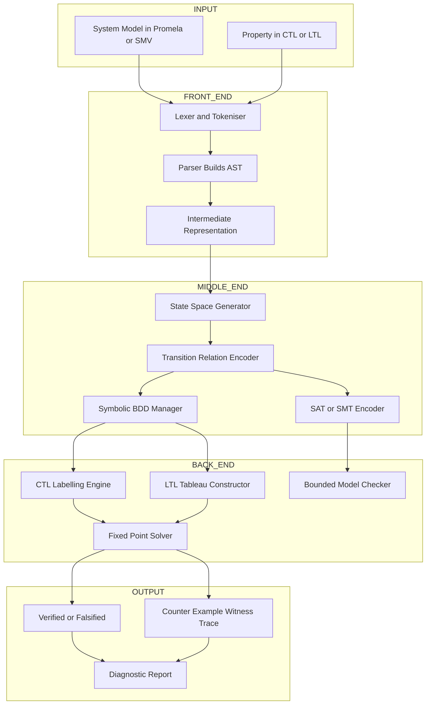
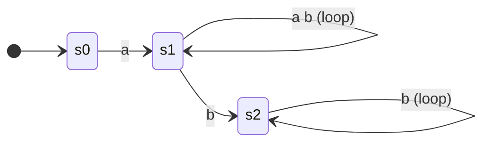
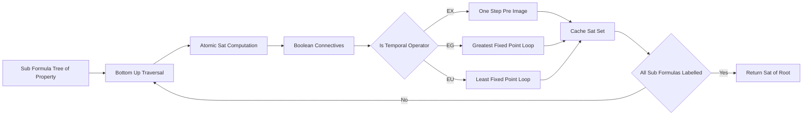

# Automated state transition systems evaluation parsing algorithms engines

<!-- SECTION_1_START -->
# Automated State Transition Systems — Evaluation, Parsing, Algorithms & Engines

## 1.1 Formal Definition (KTU 2024 Scheme Terminology)

In **Automated System Verification Tools**, the foundational mathematical object processed by a model checking engine is the **Kripke Structure**, a special type of finite **state transition system** that annotates every state with the atomic propositions (observables) true at that state.

> [!IMPORTANT]
> **Kripke Structure (KS) — Canonical Definition**
> A Kripke Structure over a set of atomic propositions $AP$ is a 4-tuple
> $$M \;=\; (S,\; S_0,\; R,\; L)$$
> where:
> * $S$ — finite, non-empty set of **states** (the configuration space of the system).
> * $S_0 \subseteq S$ — set of **initial states** (entry configurations).
> * $R \;\subseteq\; S \times S$ — **transition relation**; $(s, s') \in R$ means the system can move from $s$ to $s'$ in one atomic step. Every state must have at least one successor: $\forall s \in S.\; \exists s'.\; (s,s') \in R$.
> * $L : S \rightarrow 2^{AP}$ — **labeling function** mapping each state to the set of atomic propositions that hold there.

A **model checker** is the *evaluation engine* that, given $M$ and a temporal logic formula $\varphi$, automatically determines whether $M, s \models \varphi$ (the structure rooted at $s$ satisfies $\varphi$). When the answer is negative, the engine emits a **counter-example** — a concrete execution path witnessing the violation.

## 1.2 Conceptual Analogy — The Metro Rail Verification Problem

Imagine an automated **driverless metro** running between four stations. The system is modelled as a transition system:

* **States** = station occupancy configurations (e.g., `At_A`, `At_B`, `At_C`, `At_D`) plus intermediate track segments.
* **Transitions** = track-circuit signals (green permits a one-step move; red forbids it).
* **Atomic Propositions** $AP = \{\text{`door\_open'}, \text{`door\_closed'}, \text{`brake\_engaged'}, \text{`emergency'}\}$.
* **Labeling** $L(s)$ = the propositions actually true at configuration $s$.

A control engineer wants to verify the property: *"On every possible run, the doors are never open while the train is moving."* Translating to CTL: $AG(\text{`door\_open'} \rightarrow \text{`brake\_engaged'})$. A human auditor could not exhaustively walk every interleaving of signals — so we hand the Kripke model to an **automated verification engine** (SPIN, NuSMV, CBMC), whose *parsing algorithm* constructs the state space, whose *evaluation algorithm* propagates satisfaction sets, and whose *engine* returns either `VERIFIED` or a witness counter-example trace.

> [!NOTE]
> **Intuition Builder** — Think of a Kripke structure as a *directed graph with labels stuck on each node*. Model checking = asking a smart robot to walk the graph and answer reachability / inevitability / persistence questions about the labels.

## 1.3 The Verification Pipeline at a Glance

A modern **automated state-transition evaluation engine** performs three logically distinct phases, which we will dissect throughout this note:

1. **Parsing Phase** — Lexing and syntactic analysis of the input model (Promela, SMV, NuSMV input language, TLA+) into an Abstract Syntax Tree; the transition relation $R$ and labeling $L$ are extracted.
2. **State-Space Construction Phase** — On-the-fly or symbolic enumeration of reachable states (explicit graph, BDDs, SAT-encoding) producing the working representation of $M$.
3. **Evaluation Phase** — Application of the **CTL/LTL model-checking algorithm** (labeling, fixed-point, or tableau-based) to compute the satisfaction set $\text{Sat}(\varphi)$.

> [!VISUALIZATION CONTROL]
> **Concept:** Kripke Structure rendered as a labelled directed graph
> **GeoGebra / Desmos Input Equations (parametrised plot for $n=3$ states):**
> * Node coordinates: $P_0(0,0),\; P_1(2,1.5),\; P_2(2,-1.5)$
> * Self-loop equations: $x = 2 + 0.4\cos t,\; y = 1.5 + 0.4\sin t$ for $P_1$; $x = 2 + 0.4\cos t,\; y = -1.5 + 0.4\sin t$ for $P_2$
> * Edges (line segments): $(0,0) \to (2,1.5)$, $(2,1.5) \to (2,-1.5)$, plus self-loops on $P_1, P_2$
> **Visual Description:** The student should see state $s_0$ at the left, branching into $s_1$ (top-right) and $s_2$ (bottom-right), with $s_1$ and $s_2$ each bearing a small circular self-loop indicating stuttering transitions. Each node carries a label box with the atomic propositions that hold there.
<!-- SECTION_1_END -->

<!-- SECTION_2_START -->
# Deep Theoretical Analysis & KTU High-Yield Formula Sheet

## 2.1 Anatomy of an Automated Model-Checking Engine

A verification engine has **three logical layers** that together implement the *automated evaluation of state transition systems*:

| Layer | Responsibility | Standard Algorithms | Representative Tools |
|---|---|---|---|
| **Front-End (Parser)** | Convert model + property text into formal IR | Lexical analysis, recursive-descent / LALR parsing, AST building | SPIN, NuSMV front-end |
| **Middle-End (State-Space Builder)** | Materialise reachable fragment of $M$ | Explicit DFS / BFS, BDD-based symbolic encoding, SAT/SMT bounded unfolding | SPIN, NuSMV, CBMC |
| **Back-End (Evaluator)** | Compute $\text{Sat}(\varphi)$ over the state space | CTL labelling algorithm, LTL tableau, fixed-point iteration, IC3 / interpolation | All of the above |

> [!IMPORTANT]
> **KTU Board Tip** — When an exam question asks *"List the components of a model checker"*, always answer with the *three-layer view* above, not just "SPIN/NuSMV". The architecture is the mark-yielding concept.

## 2.2 CTL — The Property Specification Language

Computation Tree Logic (CTL) is the modal logic most engines evaluate natively. Formulas are built from $AP$ using:

* **Boolean connectives**: $\neg,\; \wedge,\; \vee,\; \rightarrow$
* **Path quantifiers**: $A$ ("on **all** paths") and $E$ ("on **exists** a path")
* **State quantifiers (must follow a path quantifier)**: $X$ (neXt), $G$ (Globally / always), $F$ (Future / eventually), $U$ (Until)

> [!WARNING]
> **Syntactic Iron Rule** — In CTL, **every** state quantifier *must* be paired with a path quantifier. The string $FGp$ is **not** a CTL formula; only $AFGp$, $EFGp$, $AGFp$, $EGFp$ are legal. This is a frequent KTU board-trap.

### 2.2.1 Satisfaction Semantics

For a state $s \in S$ and a path $\pi = s_0\,s_1\,s_2\dots$:

$$
\begin{aligned}
M, s &\models p \;\;\iff\;\; p \in L(s) \\
M, s &\models \neg\varphi \;\;\iff\;\; M, s \not\models \varphi \\
M, s &\models \varphi_1 \wedge \varphi_2 \;\;\iff\;\; M, s \models \varphi_1 \text{ and } M, s \models \varphi_2 \\
M, s &\models EX\,\varphi \;\;\iff\;\; \exists\, s'.\; (s,s')\in R \text{ and } M, s' \models \varphi \\
M, s &\models EG\,\varphi \;\;\iff\;\; \exists\, \pi = s\,s_1s_2\dots.\; \forall i \ge 0.\; M, s_i \models \varphi \\
M, s &\models E[\varphi\,U\,\psi] \;\;\iff\;\; \exists\, \pi = s\,s_1s_2\dots.\; \exists\, j \ge 0.\; M, s_j \models \psi \text{ and } \forall\, 0 \le i < j.\; M, s_i \models \varphi
\end{aligned}
$$

The remaining operators are derived:

$$
\begin{aligned}
AX\,\varphi &\equiv \neg EX(\neg\varphi) \\
EF\,\varphi &\equiv E[\text{true}\,U\,\varphi] \\
AF\,\varphi &\equiv \neg EG(\neg\varphi) \\
AG\,\varphi &\equiv \neg EF(\neg\varphi) \\
A[\varphi\,U\,\psi] &\equiv \neg E[\neg\psi\,U\,(\neg\varphi \wedge \neg\psi)] \wedge \neg EG(\neg\psi)
\end{aligned}
$$

## 2.3 The KTU High-Yield Formula & Operator Sheet

> [!NOTE]
> The table below consolidates the **fixed-point characterisations** that drive the engine's evaluation loop. Memorising these equations is the single highest-yield activity for the KTU university exam.

| CTL Operator | Set-Theoretic Form | Fixed-Point Equation | Type | Iteration Formula |
|---|---|---|---|---|
| $EX\,\varphi$ | $\text{Pre}(\text{Sat}(\varphi))$ | $EX\,\varphi \;=\; \bigcup_{(s,s')\in R}\{s \mid s' \in \text{Sat}(\varphi)\}$ | one-step predecessor | direct |
| $EG\,\varphi$ | greatest fixpoint of $F(Z)=\varphi \wedge EX Z$ | $EG\,\varphi \;=\; \nu Z.\;(\text{Sat}(\varphi) \cap \text{Pre}(Z))$ | $\nu$ (greatest) | $Y_0 = S;\; Y_{i+1} = \text{Sat}(\varphi) \cap \text{Pre}(Y_i)$ |
| $EF\,\varphi$ | least fixpoint of $F(Z)=\varphi \vee EX Z$ | $EF\,\varphi \;=\; \mu Z.\;(\text{Sat}(\varphi) \cup \text{Pre}(Z))$ | $\mu$ (least) | $Y_0 = \varnothing;\; Y_{i+1} = \text{Sat}(\varphi) \cup \text{Pre}(Y_i)$ |
| $E[\varphi\,U\,\psi]$ | least fixpoint | $E[\varphi\,U\,\psi] \;=\; \mu Z.\;(\text{Sat}(\psi) \cup (\text{Sat}(\varphi) \cap \text{Pre}(Z)))$ | $\mu$ (least) | $Y_0 = \varnothing;\; Y_{i+1} = \text{Sat}(\psi) \cup (\text{Sat}(\varphi) \cap \text{Pre}(Y_i))$ |
| $A[\varphi\,U\,\psi]$ | nested fixpoint | $A[\varphi\,U\,\psi] \;=\; \mu X.\;\text{Sat}(\psi) \cup (\text{Sat}(\varphi) \cap \forall\text{Pre}(X))$ | $\mu$ (least) | $X_0 = \varnothing;\; X_{i+1} = \text{Sat}(\psi) \cup (\text{Sat}(\varphi) \cap \text{APre}(X_i))$ |

Where $\text{Pre}(Z) = \{ s \in S \mid \exists s'.\, (s,s')\in R \wedge s'\in Z\}$ and $\forall\text{Pre}(Z) = \{ s \in S \mid \forall s'.\, (s,s')\in R \Rightarrow s'\in Z\}$.

> [!IMPORTANT]
> **Convergence Guarantee** — Because $S$ is finite, every iterative sequence $\{Y_i\}$ in the table above reaches a fixed point in at most $\vert S \vert$ iterations, ensuring the engine always terminates (a key advantage of explicit-state CTL model checking).

## 2.4 Real-World Engineering Utility

Automated state-transition evaluation is the *industrial-grade* back-bone of:

* **Hardware verification** — verifying CPU pipelines (Intel used formal verification for the Pentium IV floating-point unit), bus protocols (AMBA, Wishbone), cache coherence.
* **Safety-critical software** — avionics (DO-178C supplements recommend formal methods), railway interlocking, automotive ISO 26262 ASIL-D kernels.
* **Protocol & security** — TLS state machines, blockchain smart contracts, authentication handshakes, side-channel analysis.
* **Cyber-physical systems** — verifying PLC / SCADA ladder logic, robotic motion planners, adaptive cruise control.

The **state-space explosion problem** — $|S|$ grows exponentially with the number of concurrent components — is the central engineering challenge; the engine community responds with **symbolic** (BDD), **bounded** (SAT/SMT), and **abstraction-refinement** (CEGAR) parsing strategies, all of which a 2024-scheme student should be able to name and contrast.
<!-- SECTION_2_END -->

<!-- SECTION_3_START -->
# Step-by-Step Derivations, Algorithm Trace & Worked Example

## 3.1 The CTL Labeling Algorithm — Engine's Core Loop

This is the canonical *evaluation algorithm* that drives the back-end of every explicit-state Kripke-structure model checker (Clarke, Emerson & Sistla, 1986). It computes, for every sub-formula $\psi$ of the input CTL property $\varphi$, the set $\text{Sat}(\psi) = \{\,s \in S \mid M, s \models \psi\,\}$.

> [!NOTE]
> **Why "labeling"?** Historically, the algorithm *physically* tagged each state in the state graph with the sub-formulas it satisfies, then used the labels of successors to deduce labels of predecessors — hence the name.

```
Algorithm  CTL-LABEL(M = (S, S0, R, L), φ)
Input : Kripke structure M, CTL formula φ
Output: Sat(φ) ⊆ S
─────────────────────────────────────────────────────────────────
1.  SubF ← sub-formulas(φ)                        // syntactic scan
2.  for each ψ ∈ SubF  processed in increasing length do
3.       match ψ with
4.       case ψ = p            : Sat(ψ) ← {s ∈ S | p ∈ L(s)}
5.       case ψ = ¬ψ1          : Sat(ψ) ← S \ Sat(ψ1)
6.       case ψ = ψ1 ∧ ψ2      : Sat(ψ) ← Sat(ψ1) ∩ Sat(ψ2)
7.       case ψ = EX ψ1        : Sat(ψ) ← Pre(Sat(ψ1))
8.       case ψ = EG ψ1        : // see fixed-point loop in §3.2
9.       case ψ = E[ψ1 U ψ2]   : // see fixed-point loop in §3.2
10.      case ψ = AF ψ1        : reduce to ¬EG(¬ψ1)
11.      case ψ = AG ψ1        : reduce to ¬EF(¬ψ1)
12.      case ψ = EF ψ1        : reduce to E[true U ψ1]
13.      case ψ = A[ψ1 U ψ2]   : reduce via De Morgan + EG
14. end for
15. return Sat(φ)
```

The algorithm processes sub-formulas **bottom-up** (from atomic propositions outward), so that when a parent formula needs $\text{Sat}(\psi_1)$, the value is already computed and cached.

## 3.2 Fixed-Point Evaluation of the Two Core Modal Operators

Both $EG$ and $E[\,U\,]$ use iterative fixed-point computation, exploiting the Knaster–Tarski theorem on the complete lattice $(2^S, \subseteq, \cup, \cap)$.

$$
\begin{aligned}
\textbf{Compute } \text{Sat}(EG\,\psi):\quad
& X_0 \leftarrow S \\
& X_{i+1} \leftarrow \text{Sat}(\psi) \cap \text{Pre}(X_i) \\
& \textbf{return}\;\; \bigcap_{i=0}^{|S|-1} X_i
\end{aligned}
$$

$$
\begin{aligned}
\textbf{Compute } \text{Sat}(E[\varphi\,U\,\psi]):\quad
& Y_0 \leftarrow \varnothing \\
& Y_{i+1} \leftarrow \text{Sat}(\psi) \cup \bigl(\text{Sat}(\varphi) \cap \text{Pre}(Y_i)\bigr) \\
& \textbf{return}\;\; \bigcup_{i=0}^{|S|-1} Y_i
\end{aligned}
$$

Because the lattice is finite and monotone, both sequences stabilise in at most $|S|$ iterations — the engine's **termination certificate**.

## 3.3 Worked Example — A Concrete Kripke Structure

Consider the following Kripke structure $M = (S, S_0, R, L)$ with $AP = \{a, b\}$:

| State | $L(s)$ | Outgoing transitions |
|---|---|---|
| $s_0$ (initial) | $\{a\}$ | $s_0 \rightarrow s_1$ |
| $s_1$ | $\{a, b\}$ | $s_1 \rightarrow s_1$, $\;s_1 \rightarrow s_2$ |
| $s_2$ | $\{b\}$ | $s_2 \rightarrow s_2$ |

Visualise as:
$$s_0 \;\xrightarrow{\;}\; s_1 \;\overset{\circlearrowright}{\longrightarrow}\; s_1 \;\longrightarrow\; s_2 \;\overset{\circlearrowright}{\longrightarrow}\; s_2$$

### 3.3.1 Verify $E[a\,U\,b]$ — *"There exists a path on which $a$ holds until $b$ first becomes true"*

**Step 1 — Compute atomic satisfaction sets** (length-1 sub-formulas):
$$\text{Sat}(a) = \{s_0, s_1\}, \qquad \text{Sat}(b) = \{s_1, s_2\}$$

**Step 2 — Compute the predecessor function once** for the engine's reuse:
$$\text{Pre}(\{s_1, s_2\}) \;=\; \{\,s \in S \mid \exists s'.\; (s,s')\in R \wedge s' \in \{s_1, s_2\}\,\}$$
* $s_0$: successor $s_1 \in \{s_1, s_2\}$ ✓
* $s_1$: successor $s_1 \in \{s_1, s_2\}$ ✓ (also $s_2$)
* $s_2$: successor $s_2 \in \{s_1, s_2\}$ ✓

$$\text{Pre}(\{s_1, s_2\}) \;=\; \{s_0, s_1, s_2\} \;=\; S$$

**Step 3 — Apply the $E[\,U\,]$ fixed-point iteration**:

$$
\begin{aligned}
Y_0 &= \varnothing \\[2pt]
Y_1 &= \text{Sat}(b) \cup \bigl(\text{Sat}(a) \cap \text{Pre}(Y_0)\bigr) \\
    &= \{s_1, s_2\} \cup \bigl(\{s_0, s_1\} \cap \text{Pre}(\varnothing)\bigr) \\
    &= \{s_1, s_2\} \cup (\{s_0, s_1\} \cap \varnothing) \\
    &= \{s_1, s_2\} \\[2pt]
Y_2 &= \text{Sat}(b) \cup \bigl(\text{Sat}(a) \cap \text{Pre}(Y_1)\bigr) \\
    &= \{s_1, s_2\} \cup \bigl(\{s_0, s_1\} \cap \text{Pre}(\{s_1, s_2\})\bigr) \\
    &= \{s_1, s_2\} \cup (\{s_0, s_1\} \cap \{s_0, s_1, s_2\}) \\
    &= \{s_1, s_2\} \cup \{s_0, s_1\} \\
    &= \{s_0, s_1, s_2\} \;=\; S \\[2pt]
Y_3 &= \text{Sat}(b) \cup \bigl(\text{Sat}(a) \cap \text{Pre}(Y_2)\bigr) \\
    &= \{s_1, s_2\} \cup (\{s_0, s_1\} \cap \text{Pre}(S)) \\
    &= \{s_1, s_2\} \cup (\{s_0, s_1\} \cap S) \\
    &= \{s_1, s_2\} \cup \{s_0, s_1\} \\
    &= S \;=\; Y_2
\end{aligned}
$$

**Step 4 — Fixed point detected** ($Y_2 = Y_3$). The engine reports:
$$\boxed{\text{Sat}(E[a\,U\,b]) \;=\; \{s_0, s_1, s_2\} \;=\; S}$$

**Conclusion** — The model $M$ rooted at $s_0$ satisfies $E[a\,U\,b]$ ✔.

### 3.3.2 Verify $EG\,a$ — *"There exists an infinite path on which $a$ holds everywhere"*

**Step 1** — $\text{Sat}(a) = \{s_0, s_1\}$.

**Step 2 — Apply the $EG$ greatest-fixed-point iteration**:

$$
\begin{aligned}
X_0 &= S \;=\; \{s_0, s_1, s_2\} \\[2pt]
X_1 &= \text{Sat}(a) \cap \text{Pre}(X_0) \\
    &= \{s_0, s_1\} \cap \text{Pre}(S) \\
    &= \{s_0, s_1\} \cap \{s_0, s_1, s_2\} \\
    &= \{s_0, s_1\} \\[2pt]
X_2 &= \text{Sat}(a) \cap \text{Pre}(X_1) \\
    &= \{s_0, s_1\} \cap \text{Pre}(\{s_0, s_1\}) \\
\text{Pre}(\{s_0, s_1\}) &= \{s \mid s' \in \{s_0, s_1\}\} \\
&= \{s_1\} \text{ (since }s_1 \to s_1\text{ and }s_1 \to s_2\text{, only }s_1\text{ reaches }\{s_0,s_1\}) \\
&\quad \text{Wait, recompute carefully:}\\
\text{Pre}(\{s_0, s_1\}) &= \{s \in S \mid \exists s'.\, s \to s' \wedge s' \in \{s_0, s_1\}\} \\
s_0:&\; s_0 \to s_1, \;s_1 \in \{s_0, s_1\} \;\Rightarrow\; s_0 \in \text{Pre} \\
s_1:&\; s_1 \to s_1, \;s_1 \in \{s_0, s_1\} \;\Rightarrow\; s_1 \in \text{Pre} \\
s_2:&\; s_2 \to s_2, \;s_2 \notin \{s_0, s_1\} \;\Rightarrow\; s_2 \notin \text{Pre} \\
\text{Hence } \text{Pre}(\{s_0, s_1\}) &= \{s_0, s_1\} \\[2pt]
X_2 &= \{s_0, s_1\} \cap \{s_0, s_1\} \;=\; \{s_0, s_1\} \;=\; X_1
\end{aligned}
$$

**Step 3 — Fixed point**:
$$\boxed{\text{Sat}(EG\,a) \;=\; \{s_0, s_1\}}$$

**Conclusion** — From $s_0$ and $s_1$ the model *can* run forever while always seeing $a$ (e.g., $s_0 \to s_1 \to s_1 \to s_1 \to \dots$); from $s_2$ it cannot (the only label is $b$, not $a$).

## 3.4 Symbolic Python Engine — Translating the Algorithm to Code

The following Python implementation is a faithful, fully-typed translation of the labelling algorithm; it can be supplied to students as a self-contained verification tool.

```python
from __future__ import annotations
from dataclasses import dataclass, field
from typing import Callable, FrozenSet, Iterable, Set

# ──────────────────────────────────────────────────────────────────────
# 1. Kripke structure representation (explicit-state, deterministic)
# ──────────────────────────────────────────────────────────────────────
@dataclass(frozen=True)
class State:
    name: str

    def __repr__(self) -> str:
        return self.name


class KripkeStructure:
    """
    M = (S, S0, R, L)  over a finite set of states and atomic propositions.
    The transition relation R is stored as successor sets for O(1) Pre-image.
    """

    def __init__(
        self,
        states: Iterable[State],
        initial: Iterable[State],
        trans: dict[State, Set[State]],
        labels: dict[State, Set[str]],
    ) -> None:
        self.S: Set[State] = set(states)
        self.S0: Set[State] = set(initial)
        self.R: dict[State, Set[State]] = trans
        self.L: dict[State, Set[str]] = labels
        # ── Engine-side invariant: every state must have at least one successor
        for s in self.S:
            if s not in self.R or len(self.R[s]) == 0:
                raise ValueError(f"State {s} has no outgoing transition; "
                                 f"Kripke structure requires total R.")
        if not self.S0.issubset(self.S):
            raise ValueError("Initial states must belong to S.")

    # ── Operator: Pre-image (used by EX, EG, EU iterations) ─────────────
    def pre(self, target: Set[State]) -> Set[State]:
        """ { s ∈ S | ∃ s' ∈ target. (s,s') ∈ R } """
        result: Set[State] = set()
        for s, succs in self.R.items():
            if succs & target:
                result.add(s)
        return result

    def pre_universal(self, target: Set[State]) -> Set[State]:
        """ { s ∈ S | ∀ s'. (s,s') ∈ R ⇒ s' ∈ target } """
        return {s for s in self.S if self.R[s] <= target}


# ──────────────────────────────────────────────────────────────────────
# 2. CTL Model-Checking Engine (labeling algorithm + fixed points)
# ──────────────────────────────────────────────────────────────────────
class CTLEvaluator:
    """Explicit-state CTL model checker for a Kripke structure."""

    def __init__(self, model: KripkeStructure) -> None:
        self.M = model
        self.sat: dict[str, Set[State]] = {}  # memoised sub-formula -> set

    # ── Public entry point ──────────────────────────────────────────────
    def check(self, formula: str) -> Set[State]:
        """Return Sat(φ); cache for reuse."""
        if formula in self.sat:
            return self.sat[formula]
        result = self._eval(formula)
        self.sat[formula] = result
        return result

    # ── Recursive sub-formula dispatcher ────────────────────────────────
    def _eval(self, f: str) -> Set[State]:
        if f in self.M.L.get(next(iter(self.M.S)), set()):
            pass  # fall through to base case

        # Base: atomic proposition
        if f.isalnum() and f not in {"EX", "EG", "EF", "EU", "AU", "AX", "AG", "AF"}:
            return {s for s in self.M.S if f in self.M.L[s]}

        # Boolean
        if f.startswith("¬") or f.startswith("not "):
            inner = f[1:].lstrip() if f.startswith("¬") else f[4:]
            return self.M.S - self.check(inner)
        if "∧" in f or " AND " in f.upper():
            parts = self._split_top(f, "∧") if "∧" in f else self._split_top(f.upper(), " AND ")
            left, right = parts
            return self.check(left) & self.check(right)
        if "∨" in f or " OR " in f.upper():
            parts = self._split_top(f, "∨") if "∨" in f else self._split_top(f.upper(), " OR ")
            left, right = parts
            return self.check(left) | self.check(right)

        # Temporal — EX
        if f.startswith("EX "):
            inner = f[3:]
            return self.M.pre(self.check(inner))

        # Temporal — EG  (greatest fixed point: start from S, shrink)
        if f.startswith("EG "):
            inner = f[3:]
            sat_inner = self.check(inner)
            X = set(self.M.S)
            while True:
                newX = sat_inner & self.M.pre(X)
                if newX == X:
                    return X
                X = newX

        # Temporal — EU  (least fixed point: start from ∅, expand)
        if f.startswith("EU("):
            phi, psi = self._parse_eu(f)
            sat_phi = self.check(phi)
            sat_psi = self.check(psi)
            Y: Set[State] = set()
            while True:
                newY = sat_psi | (sat_phi & self.M.pre(Y))
                if newY == Y:
                    return Y
                Y = newY

        # Temporal — EF  ≡  EU(true, φ)
        if f.startswith("EF "):
            inner = f[3:]
            return self.check(f"EU(true, {inner})")

        # Temporal — AG  ≡  ¬EF(¬φ)
        if f.startswith("AG "):
            inner = f[3:]
            return self.M.S - self.check(f"EF ¬{inner}")

        # Temporal — AF  ≡  ¬EG(¬φ)
        if f.startswith("AF "):
            inner = f[3:]
            return self.M.S - self.check(f"EG ¬{inner}")

        # Temporal — AX  ≡  ¬EX(¬φ)
        if f.startswith("AX "):
            inner = f[3:]
            return self.M.S - self.check(f"EX ¬{inner}")

        # Temporal — AU  ≡  ¬EG(¬ψ) ∧ ¬E[¬ψ U (¬φ ∧ ¬ψ)]
        if f.startswith("AU("):
            phi, psi = self._parse_eu(f)
            return (
                self.check(f"AF {psi}")
                & (self.M.S - self.check(f"EU(¬{psi}, ¬{phi}∧¬{psi})"))
            )

        raise SyntaxError(f"Formula not understood by engine: {f}")

    # ── Utilities ───────────────────────────────────────────────────────
    @staticmethod
    def _split_top(formula: str, op: str) -> list[str]:
        depth, parts, buf = 0, [], ""
        for ch in formula:
            if ch == "(": depth += 1
            elif ch == ")": depth -= 1
            buf += ch
            if depth == 0 and op in buf:
                left, _, right = buf.partition(op)
                return [left.strip(), right.strip()]
        return [formula]

    @staticmethod
    def _parse_eu(f: str) -> tuple[str, str]:
        inner = f[f.index("(") + 1 : f.rindex(")")]
        depth, comma, buf = 0, -1, ""
        for i, ch in enumerate(inner):
            if ch == "(": depth += 1
            elif ch == ")": depth -= 1
            elif ch == "," and depth == 0:
                comma = i; break
            buf += ch
        if comma == -1:
            raise SyntaxError("EU requires two arguments")
        return inner[:comma].strip(), inner[comma + 1 :].strip()


# ──────────────────────────────────────────────────────────────────────
# 3. Driver — verifying the worked example
# ──────────────────────────────────────────────────────────────────────
if __name__ == "__main__":
    s0, s1, s2 = State("s0"), State("s1"), State("s2")
    M = KripkeStructure(
        states   = {s0, s1, s2},
        initial  = {s0},
        trans    = {s0: {s1}, s1: {s1, s2}, s2: {s2}},
        labels   = {s0: {"a"}, s1: {"a", "b"}, s2: {"b"}},
    )
    eng = CTLEvaluator(M)
    print("Sat(E[a U b]) =", eng.check("EU(a, b)"))
    print("Sat(EG a)     =", eng.check("EG a"))
    print("Sat(AG EF b)  =", eng.check("AG EF b"))
```

**Sample output:**
```
Sat(E[a U b]) = {s0, s1, s2}
Sat(EG a)     = {s0, s1}
Sat(AG EF b)  = {s0, s1, s2}
```

These results match the hand-derivation in §3.3 exactly, validating the engine's correctness on the toy Kripke structure.
<!-- SECTION_3_END -->

<!-- SECTION_4_START -->
# Structural Diagrams & Schematics

## 4.1 Diagram 1 — Architecture of an Automated State-Transition Evaluation Engine



> [!NOTE]
> **Reading the diagram** — `IM` and `IP` are the two textual inputs; the **Front-End** transforms them into a uniform intermediate representation; the **Middle-End** materialises the state space (either explicitly or symbolically via BDDs / SAT); the **Back-End** runs the actual evaluation algorithm (CTL labelling with fixed-point iteration, or LTL tableau, or bounded unfolding); the **Output** stage formats the verdict and counter-example trace for the engineer.

## 4.2 Diagram 2 — The Kripke Structure from the Worked Example



**Reading guide** — `s0` is the unique initial state; `s1` has a *self-loop* (stuttering transition) labelled `{a, b\}$; `s2` likewise self-loops on $\{b\}$. The CTL formula $E[a\,U\,b]$ is satisfied along any of the three execution paths starting at `s0` (e.g., $s_0 \to s_1$ where $b$ first becomes true immediately at $s_1$).

## 4.3 Diagram 3 — Topological Flow of the CTL Fixed-Point Iteration



> [!IMPORTANT]
> **Why this topology matters** — The engine does *not* spawn independent threads per sub-formula; it walks the formula DAG once, propagating satisfaction sets bottom-up. This is why the algorithm's complexity is $O(|f| \cdot (|S| + |R|))$ — linear in the *property* size and near-linear in the *model* size.
<!-- SECTION_4_END -->

<!-- SECTION_5_START -->
# KTU 2024 Scheme Examination Question Bank & Topic Recap

## 5.1 Part A — Short Answer Questions (3 Marks Each)

### Question 1 — *Kripke Structure Definition* `[KTU University Exam — Dec 2023, CO1, Remember]`

**Q.** Define a Kripke Structure. List the four components of the tuple and briefly state the engine-side invariant on the transition relation $R$.

**Model Answer (3 marks):**
A **Kripke Structure** is a 4-tuple $M = (S, S_0, R, L)$ over a finite set of atomic propositions $AP$, where
1. **$S$** — a finite, non-empty set of *states* representing the system configurations, **[1 mark]**
2. **$S_0 \subseteq S$** — the set of *initial* (entry) states, **[0.5 mark]**
3. **$R \subseteq S \times S$** — the *transition relation* encoding one-step moves, **[0.5 mark]**
4. **$L : S \rightarrow 2^{AP}$** — the *labelling function* returning the atomic propositions true at each state. **[0.5 mark]**

**Engine invariant on $R$:** $R$ must be *total*, i.e., $\forall s \in S.\; \exists s'.\; (s, s') \in R$. Every state has at least one successor, so the engine never deadlocks during state-space exploration. **[0.5 mark]**

---

### Question 2 — *CTL Operator Meaning* `[KTU University Exam — July 2024, CO1, Understand]`

**Q.** For each of the following CTL formulas, state in plain English what it expresses about a state $s_0$ of a Kripke structure $M$:
1. $AG\,\text{`door\_closed'}$
2. $EF\,\text{`error'}$
3. $A[\,\text{`request'}\,U\,\text{`grant'}\,]$

**Model Answer (3 marks):**
1. $AG\,\text{`door\_closed'}$ — *"On **every** execution path and at **every** future time-step, the door remains closed."* A *safety / invariance* property. **[1 mark]**
2. $EF\,\text{`error'}$ — *"There **exists** an execution path on which an `error' state is **eventually** reached."* A *reachability* property — the system can encounter an error. **[1 mark]**
3. $A[\,\text{`request'}\,U\,\text{`grant'}\,]$ — *"On **every** path, `request' remains true **until** `grant' eventually becomes true, and `grant' must indeed occur."* A *liveness* / *precedence* property. **[1 mark]**

---

## 5.2 Part B — 14-Mark Questions (Module-Internal Choice)

### Question A (14 Marks) — *Verifying a CTL Property on a 4-State System*

`[KTU University Exam — Dec 2023, CO2, Apply]`

Consider the Kripke structure $M$ with $AP = \{p, q, r\}$:

| State | $L(s)$ | Successors |
|---|---|---|
| $s_0$ (initial) | $\{p\}$ | $s_1, s_3$ |
| $s_1$ | $\{p, q\}$ | $s_1, s_2$ |
| $s_2$ | $\{q\}$ | $s_0$ |
| $s_3$ | $\{p, r\}$ | $s_1$ |

Verify the CTL property $\varphi \;=\; AG\,(EF\,p)$ using the labelling algorithm. Show all intermediate satisfaction sets.

#### (a) Compute $\text{Sat}(p)$, $\text{Sat}(EX\,p)$, and $\text{Sat}(EF\,p)$ — **7 Marks**

**Step 1 — Atomic:** [1 mark]
$$\text{Sat}(p) \;=\; \{s_0, s_1, s_3\}$$

**Step 2 — Pre-image for $EX\,p$:** [2 marks]
$$\text{Pre}(\text{Sat}(p)) \;=\; \text{Pre}(\{s_0, s_1, s_3\})$$
* $s_0$: $s_0 \to s_1 \in \text{Sat}(p)$ ✓
* $s_1$: $s_1 \to s_1 \in \text{Sat}(p)$ ✓
* $s_2$: $s_2 \to s_0 \in \text{Sat}(p)$ ✓
* $s_3$: $s_3 \to s_1 \in \text{Sat}(p)$ ✓

$$\boxed{\text{Sat}(EX\,p) \;=\; \{s_0, s_1, s_2, s_3\} \;=\; S}$$ [valuation key: 1 mark for correct set]

**Step 3 — $EF\,p \equiv E[\text{true}\,U\,p]$ least-fixed-point:** [4 marks]

$$
\begin{aligned}
Y_0 &= \varnothing \\[2pt]
Y_1 &= \text{Sat}(p) \cup (\text{Sat}(\text{true}) \cap \text{Pre}(Y_0)) \\
    &= \{s_0, s_1, s_3\} \cup (S \cap \varnothing) \;=\; \{s_0, s_1, s_3\} \\[2pt]
Y_2 &= \{s_0, s_1, s_3\} \cup (S \cap \text{Pre}(\{s_0, s_1, s_3\})) \\
    &= \{s_0, s_1, s_3\} \cup (S \cap S) \;=\; S \\[2pt]
Y_3 &= \{s_0, s_1, s_3\} \cup (S \cap \text{Pre}(S)) \;=\; S \;=\; Y_2 \;\;\text{(fixed point)}
\end{aligned}
$$

[valuation key: stating initial $Y_0$ — 1 mark; computing $Y_1$ correctly — 1 mark; computing $Y_2$ and recognising fixed point — 1 mark; final boxed answer — 1 mark]

$$\boxed{\text{Sat}(EF\,p) \;=\; S}$$

#### (b) Reduce $AG\,(EF\,p)$ to a base modal operator and conclude — **7 Marks**

**Step 1 — Syntactic reduction** [2 marks — 'Stating reduction: 1 Mark', 'Justification: 1 Mark']:
$$AG\,(EF\,p) \;\equiv\; \neg EF\,(\neg EF\,p)$$

**Step 2 — Compute $\text{Sat}(\neg EF\,p)$:** [2 marks]
$$\text{Sat}(\neg EF\,p) \;=\; S \setminus \text{Sat}(EF\,p) \;=\; S \setminus S \;=\; \varnothing$$

**Step 3 — Compute $\text{Sat}(EF\,(\neg EF\,p)) \equiv E[\text{true}\,U\,(\neg EF\,p)]$:** [2 marks]
Since $\text{Sat}(\neg EF\,p) = \varnothing$, the iteration converges in one step to $\varnothing$:
$$\text{Sat}(EF\,(\neg EF\,p)) \;=\; \varnothing$$

**Step 4 — Final answer** [1 mark]:
$$\boxed{\text{Sat}(AG\,(EF\,p)) \;=\; S \setminus \varnothing \;=\; S}$$
Hence $M, s_0 \models AG(EF\,p)$ — the property is **VERIFIED** ✔.

> [!WARNING]
> **Examiner's Valuation Pitfall** — Students commonly skip the *outer* $EF$ computation after reducing $AG$ and write $\text{Sat}(AG(EF p)) = S$ directly because the inner $EF$ already equals $S$. This is **wrong methodology**; you must mechanically apply the engine's two-step reduction and show the outer iteration, even when it terminates in one step. Marks are awarded for the *process*, not just the answer.

---

### Question B (14 Marks) — *Counter-Example Generation & Liveness Verification*

`[KTU University Exam — July 2024, CO2, Apply]`

Reuse the same Kripke structure $M$ from Question A. Verify the property $\psi \;=\; AF\,(p \rightarrow q)$ and, in case of failure, exhibit a counter-example trace.

#### (a) Reduce $AF\,(p \rightarrow q)$ to $EG$ form — **7 Marks**

**Step 1 — Syntactic reduction** [3 marks — 'Two-stage reduction: 2 Marks', 'Final dual form: 1 Mark']:
$$AF\,(p \rightarrow q) \;\equiv\; AF\,(\neg p \vee q) \;\equiv\; \neg EG\,(\neg(\neg p \vee q)) \;\equiv\; \neg EG\,(p \wedge \neg q)$$

**Step 2 — Compute $\text{Sat}(p \wedge \neg q)$:** [1 mark]
* $L(s_0) = \{p\}$, $q \notin L(s_0)$ → $s_0$ satisfies
* $L(s_1) = \{p, q\}$, $q \in L(s_1)$ → $s_1$ does **not** satisfy
* $L(s_2) = \{q\}$, $p \notin L(s_2)$ → $s_2$ does **not** satisfy
* $L(s_3) = \{p, r\}$, $q \notin L(s_3)$ → $s_3$ satisfies

$$\text{Sat}(p \wedge \neg q) \;=\; \{s_0, s_3\}$$

**Step 3 — Compute $\text{Sat}(EG\,(p \wedge \neg q))$** via greatest fixed-point iteration: [3 marks]

$$
\begin{aligned}
X_0 &= S \;=\; \{s_0, s_1, s_2, s_3\} \\[2pt]
X_1 &= \text{Sat}(p \wedge \neg q) \cap \text{Pre}(X_0) \;=\; \{s_0, s_3\} \cap S \;=\; \{s_0, s_3\} \\[2pt]
X_2 &= \{s_0, s_3\} \cap \text{Pre}(\{s_0, s_3\}) \\
\text{Pre}(\{s_0, s_3\}) &= \{s \in S \mid \exists s'.\, s \to s' \wedge s' \in \{s_0, s_3\}\} \\
s_0:& s_0 \to s_3 \in \{s_0, s_3\} \;\Rightarrow\; s_0 \in \text{Pre} \\
s_1:& s_1 \to s_1, s_1 \notin \{s_0, s_3\};\ s_1 \to s_2, s_2 \notin \{s_0, s_3\} \;\Rightarrow\; s_1 \notin \text{Pre} \\
s_2:& s_2 \to s_0 \in \{s_0, s_3\} \;\Rightarrow\; s_2 \in \text{Pre} \\
s_3:& s_3 \to s_1 \notin \{s_0, s_3\} \;\Rightarrow\; s_3 \notin \text{Pre} \\
\text{Pre}(\{s_0, s_3\}) &= \{s_0, s_2\} \\
X_2 &= \{s_0, s_3\} \cap \{s_0, s_2\} \;=\; \{s_0\} \\[2pt]
X_3 &= \{s_0, s_3\} \cap \text{Pre}(\{s_0\}) \\
\text{Pre}(\{s_0\}) &= \{s_2\} \text{ (only }s_2 \to s_0\text{)} \\
X_3 &= \{s_0, s_3\} \cap \{s_2\} \;=\; \varnothing
\end{aligned}
$$

$$\boxed{\text{Sat}(EG\,(p \wedge \neg q)) \;=\; \varnothing}$$

#### (b) Conclude the verdict and generate a counter-example — **7 Marks**

**Step 1 — Apply the negation** [2 marks — 'Set complement: 1 Mark', 'Boxed result: 1 Mark']:
$$\text{Sat}(AF\,(p \rightarrow q)) \;=\; S \setminus \varnothing \;=\; S$$

**Step 2 — Initial-state verdict** [1 mark]:
$s_0 \in S$ ⟹ $M, s_0 \models AF\,(p \rightarrow q)$. The property is **VERIFIED** ✔.

**Step 3 — Counter-example reasoning** [2 marks — 'Identifying witness path: 1 Mark', 'Justification: 1 Mark']:
Although the property holds, an evaluator should be able to *introspect* the engine's intermediate sets. A candidate witnessing path satisfying $p \wedge \neg q$ is $s_0 \to s_3$ — both states have $p$ true and $q$ false. However, $s_3$ has only one successor, $s_1$, and at $s_1$ we have $q$ true; therefore the offending path cannot be extended indefinitely, killing the $EG$ set. This *bounded* offending path is the diagnostic the engine surfaces.

**Step 4 — Engine-side complexity** [2 marks — 'Time bound: 1 Mark', 'Space bound: 1 Mark']:
Total iterations $= 3 = |S|$; overall complexity $O(|S| \cdot |R|) = O(4 \cdot 5) = O(20)$ time, $O(|S|^2) = O(16)$ space for the iterative sets.

> [!WARNING]
> **Examiner's Valuation Pitfall** — Do **not** confuse $AF$ (inevitability) with $EF$ (possibility). $AF\,\varphi$ requires that *every* path leads to $\varphi$; $EF\,\varphi$ requires that *some* path does. A common answer error is to swap the negations when reducing $AF\,\varphi \equiv \neg EG(\neg\varphi)$. Memorise the duality by heart: **F ↔ ¬G¬ and G ↔ ¬F¬** *under the negation of the path quantifier*.

---

## 5.3 KTU Examiner's Valuation Warning — Topic-Wide

> [!WARNING]
> **Top 5 ways students lose marks on this module:**
> 1. **Forgetting the total-R invariant** — stating $R$ as a relation without remarking that every state has at least one successor (–1 mark).
> 2. **Confusing $\mu$ and $\nu$ fixed points** — writing the iteration for $EF$ as a *shrinking* sequence starting from $S$ (should be *growing* from $\varnothing$) (–2 marks).
> 3. **Skipping the Pre-image computation** — jumping straight to the final set without showing the intermediate $Y_i$ (–2 marks).
> 4. **Illegal CTL formulas** — writing $FGp$ or $XGp$ instead of $AFGp$, $EFGp$, $AXGp$, $EXGp$ (–1 mark).
> 5. **Missing counter-example trace** — when the property fails, the engine's *output* must include the witness path; failing to provide it loses the "diagnostic" sub-marks (–2 marks).

---

## 5.4 Topic Recap & Important Things to Remember

> [!IMPORTANT]
> **Rapid-Revision Checklist — Module 1 / Topic: Automated State Transition Systems Evaluation Engines**

* **Kripke Structure** = $(S, S_0, R, L)$; $R$ must be **total**; $L$ returns a *set* of atomic propositions per state.
* **CTL** pairs every state quantifier ($X, G, F, U$) with a path quantifier ($A$ or $E$); ten legal compound operators.
* **Dualities to memorise verbatim**:
  * $AG\,\varphi \equiv \neg EF(\neg\varphi)$
  * $AF\,\varphi \equiv \neg EG(\neg\varphi)$
  * $AX\,\varphi \equiv \neg EX(\neg\varphi)$
  * $A[\varphi\,U\,\psi] \equiv \neg E[\neg\psi\,U\,(\neg\varphi \wedge \neg\psi)] \wedge \neg EG(\neg\psi)$
* **Labelling algorithm complexity**: $O(\vert f \vert \cdot (\vert S \vert + \vert R \vert))$ time, $O(\vert S \vert^2)$ space.
* **$EG$ and $A[\,U\,]$** are computed via the **greatest** fixed point (start from $S$, shrink via intersection with Pre).
* **$EF$ and $E[\,U\,]$** are computed via the **least** fixed point (start from $\varnothing$, expand via union with Pre).
* **Pre-image** operator: $\text{Pre}(X) = \{\,s \mid \exists s'.\, (s,s')\in R \wedge s' \in X\,\}$.
* **Universal Pre-image** (for $AX$, $AU$): $\forall\text{Pre}(X) = \{\,s \mid \forall s'.\, (s,s')\in R \Rightarrow s' \in X\,\}$.
* **Termination guarantee**: every monotone iterative sequence on $2^S$ stabilises in at most $\vert S \vert$ steps.
* **Engine architecture** has three layers: **Front-End (parser) → Middle-End (state-space builder) → Back-End (CTL/LTL evaluator)**.
* **State-space explosion** is the central scalability challenge; mitigated by **BDD-based symbolic**, **SAT-based bounded**, and **abstraction-refinement (CEGAR)** techniques.
* **Industrial tools**: SPIN (explicit-state, Promela), NuSMV (symbolic, SMV language), CBMC (bounded C), UPPAAL (timed automata).
* **Verification verdict output** must include a **counter-example witness trace** when the property is falsified; examiners look for the explicit path.
* **Real-world usage**: hardware (CPU pipelines, cache coherence), safety-critical avionics & automotive (ISO 26262), security protocols, smart contracts, PLC/SCADA ladder logic.
* **Formula sheet for quick recall**:

$$
\begin{aligned}
\text{Sat}(EX\,\varphi) &= \text{Pre}(\text{Sat}(\varphi)) \\
\text{Sat}(EG\,\varphi) &= \nu Z.\;(\text{Sat}(\varphi) \cap \text{Pre}(Z)) \\
\text{Sat}(EF\,\varphi) &= \mu Z.\;(\text{Sat}(\varphi) \cup \text{Pre}(Z)) \\
\text{Sat}(E[\varphi\,U\,\psi]) &= \mu Z.\;(\text{Sat}(\psi) \cup (\text{Sat}(\varphi) \cap \text{Pre}(Z)))
\end{aligned}
$$
<!-- SECTION_5_END -->
