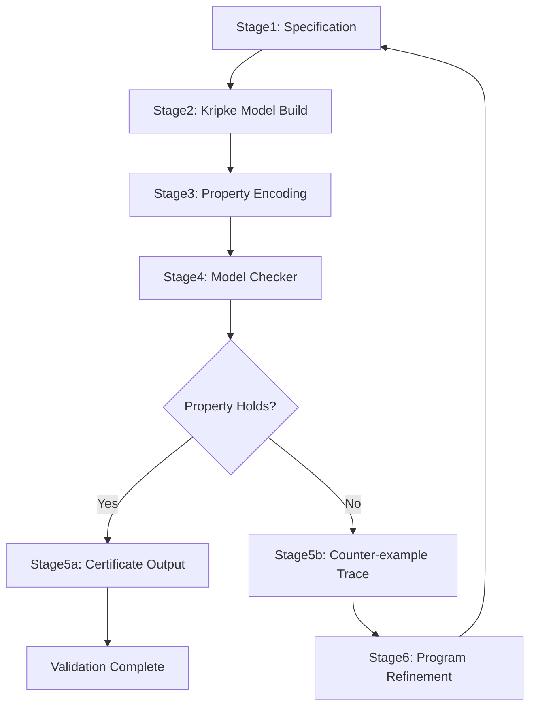
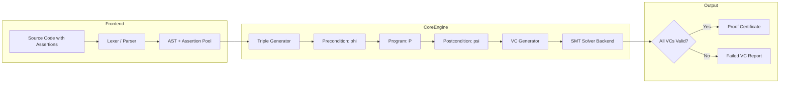
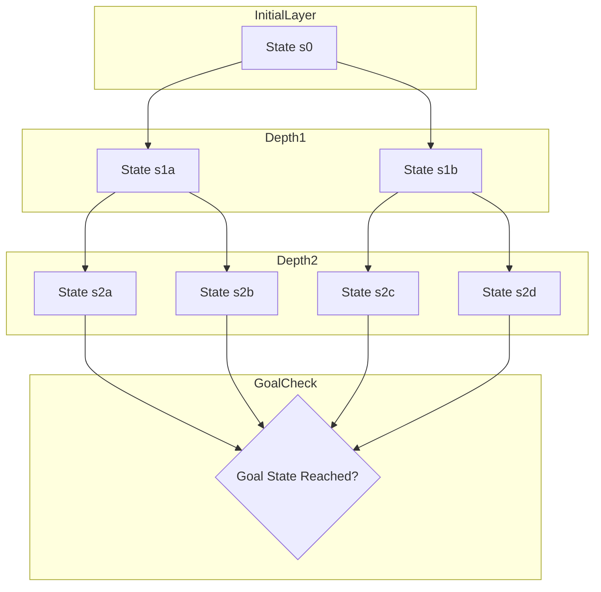

# Formal program correctness assertions execution checking runs validation

<!-- SECTION_1_START -->

# 1. Core Technical Definition & Intuitive Overview

## 1.1 Formal Program Correctness — Academic Definition

**Formal program correctness** is the rigorous mathematical demonstration that a computer program satisfies its specified functional and behavioural requirements under all possible execution scenarios. Within the KTU 2024 Scheme framework of *Automated System Verification Tools*, formal correctness is established through three mutually reinforcing pillars:

1. **Assertions** — logical predicates (boolean expressions) embedded at strategic program locations that capture the expected program state.
2. **Execution Checking** — the systematic, often automated, evaluation of these assertions during program execution or abstract interpretation.
3. **Runs Validation** — the exhaustive verification of entire execution traces (runs) against a formal specification written in a temporal or Hoare-style logic.

> [!IMPORTANT]
> **KTU 2024 Syllabus Definition (Module 1):** *Formal program correctness is the process of proving, using mathematical logic and automated tools, that a program satisfies its specification for every admissible input and every permissible execution path.*

A program $P$ with precondition $\varphi$ and postcondition $\psi$ is denoted by the **Hoare Triple**:
$$\{\varphi\}\ P\ \{\psi\}$$

## 1.2 The Three Pillars — Plain English Intuition

> [!NOTE]
> **Analogy — The Airport Security Analogy**
>
> Imagine a passenger boarding an aircraft:
> - **Assertion** = The boarding pass check ("Does this passenger have a valid ticket?").
> - **Execution Checking** = The metal detector and X-ray scan performed *while* the passenger walks through.
> - **Runs Validation** = Reviewing the entire CCTV footage of the boarding process from entry to seat.
>
> None alone guarantees safety — all three together form the *formal verification pipeline*.

### 1.2.1 Assertions
An **assertion** is a boolean condition that **must** be true at a particular point in the program. KTU 2024 emphasises three canonical locations:
- **Precondition** ($\varphi$): true *before* the program executes.
- **Postcondition** ($\psi$): true *after* the program terminates.
- **Invariant** ($I$): true *before and after* every iteration of a loop.

### 1.2.2 Execution Checking
This is the act of *evaluating* an assertion at runtime (or statically) to detect violations. Tools used in industry include **Java's `assert` keyword**, **Python's `assert` statement**, **C's `<assert.h>`**, and academic tools like **Dafny**, **Frama-C**, and **SPIN**.

### 1.2.3 Runs Validation
A **run** (or *trace*) is a sequence of states $s_0, s_1, s_2, \ldots, s_n$ produced by the program. **Validation** is the algorithmic verification that each run satisfies a *temporal property* such as *"eventually a response is sent"* or *"the mutex is never held by two processes simultaneously"*.

## 1.3 Physical & Mathematical Constants in Formal Verification

> [!IMPORTANT]
> **Key Constants and Standard Metrics used in Verification (Memorise for KTU Exams):**
> - **State Space Cardinality** $= \vert S \vert$ — number of reachable system states.
> - **Big-O Complexity of Exhaustive Model Checking** $= O(\vert S \vert \cdot \vert T \vert)$ where $T$ is the transition relation.
> - **Boolean Satisfiability (SAT) Solving** — backbone of bounded model checking.
> - **Ladder Logic Depth** for BDD-based symbolic checking is measured in **OBDD** nodes.
> - **Kripke Structure** tuple $\mathcal{M} = (S, S_0, R, L)$ — the standard formal model.
> - Industry benchmark: **SPIN** model checker handles $\approx 10^9$ states.
> - Bounded Model Checking (BMC) depth is denoted **$k$** with complexity $O(k \cdot \vert P \vert)$.

> [!VISUALIZATION CONTROL]
> **Concept:** Hoare Triple State-Space Diagram
> **GeoGebra / Desmos Input Equations:**
> * `varphi: (x, y) = (1, 3)`  (precondition point)
> * `psi: (x, y) = (8, 3)`  (postcondition point)
> * `P: segment((1, 3), (8, 3))`  (program execution path)
> **Visual Description:** The student should observe a horizontal segment from $(1,3)$ to $(8,3)$ with the precondition marker on the left and the postcondition marker on the right — visualising the *guarantee* that if the left state holds, the right state will hold after execution.

<!-- SECTION_1_END -->

<!-- SECTION_2_START -->

# 2. Deep Theoretical Analysis & KTU High-Yield Formula Sheet

## 2.1 Operational Mechanism — Step-by-Step Logic

### Step 1: Specification Formulation
The verification engineer writes a **formal specification** in a logic such as:
- **First-Order Logic (FOL)** — for assertions.
- **Linear Temporal Logic (LTL)** — for runs validation.
- **Computation Tree Logic (CTL)** — for branching-time model checking.
- **Hoare Logic** — for axiomatic program proofs.

### Step 2: Modelling the System
The program is converted into a formal model — typically a **Kripke Structure**:

$$\mathcal{M} = (S, S_0, R, L)$$

where:
- $S$ = finite set of states,
- $S_0 \subseteq S$ = set of initial states,
- $R \subseteq S \times S$ = transition relation,
- $L : S \to 2^{AP}$ = labelling function mapping states to atomic propositions.

### Step 3: Property Encoding
The desired property $\varphi$ is encoded in temporal logic. For example, **mutual exclusion**:
$$\mathbf{AG}\, \neg(\text{crit}_1 \wedge \text{crit}_2)$$
Read: *"In all paths, globally, it is never the case that both processes are simultaneously in their critical section."*

### Step 4: Model Checking Algorithm
The model checker computes the **set of states satisfying $\varphi$**, denoted $\llbracket \varphi \rrbracket_{\mathcal{M}}$, using fixpoint computation:
$$\llbracket \mathbf{AG}\,\varphi \rrbracket = \nu X.\ \llbracket \varphi \rrbracket \cap \mathbf{pre}_{\exists}(X)$$

### Step 5: Counter-Example Generation
If the property is violated, the tool outputs a **counter-example trace**:
$$\pi = s_0 \to s_1 \to s_2 \to \ldots \to s_k \text{ such that } \pi \not\models \varphi$$

### Step 6: Validation & Refinement
The counter-example is inspected, the program or specification is refined, and the loop restarts.

## 2.2 Why and How — Pedagogical Deep-Dive

> [!NOTE]
> **Why is formal correctness NP-hard in general?**
> Because the state space grows **exponentially** with the number of variables. A program with $n$ boolean variables has $2^n$ possible states. This is the *state-space explosion problem*.

**How do we combat it?**
- **Symbolic Model Checking** (BDD-based) — represents sets of states as Boolean formulae.
- **Bounded Model Checking (BMC)** — unrolls the system to a fixed depth $k$ and reduces to SAT.
- **Abstraction** — replaces concrete variables with abstract predicates.
- **Partial Order Reduction** — exploits independence of concurrent transitions.

## 2.3 KTU High-Yield Formula Sheet

| # | Concept | Formula / Notation | Meaning / Use | Units / Type |
|---|---------|-------------------|---------------|--------------|
| 1 | Hoare Triple | $\{\varphi\}\ P\ \{\psi\}$ | Partial correctness statement | Logical |
| 2 | Total Correctness | $[\varphi]\ P\ [\psi]$ | Correctness + termination | Logical |
| 3 | Kripke Structure | $\mathcal{M}=(S,S_0,R,L)$ | Formal model of system | Tuple |
| 4 | State Space Size | $\vert S \vert \le 2^n$ | Bound for $n$ boolean vars | Cardinality |
| 5 | LTL — Always | $\mathbf{G}\,\varphi$ | $\varphi$ holds in every future state | Temporal |
| 6 | LTL — Eventually | $\mathbf{F}\,\varphi$ | $\varphi$ holds at some future state | Temporal |
| 7 | LTL — Next | $\mathbf{X}\,\varphi$ | $\varphi$ holds in next state | Temporal |
| 8 | LTL — Until | $\varphi\ \mathbf{U}\ \psi$ | $\varphi$ holds until $\psi$ becomes true | Temporal |
| 9 | CTL — All Paths | $\mathbf{A}\,\varphi$ | $\varphi$ holds on all paths | Branching |
| 10 | CTL — Exists Path | $\mathbf{E}\,\varphi$ | $\varphi$ holds on some path | Branching |
| 11 | Mutual Exclusion | $\mathbf{AG}\,\neg(c_1 \wedge c_2)$ | Safety property | CTL |
| 12 | Liveness | $\mathbf{AG}(\text{req} \rightarrow \mathbf{AF}\,\text{ack})$ | Every request is acknowledged | CTL |
| 13 | Predecessor Operator | $\mathbf{pre}_{\exists}(X)=\{s\mid \exists s'\in X: (s,s')\in R\}$ | Backward reachability | Set |
| 14 | Fixpoint (AG) | $\nu X.\ \llbracket\varphi\rrbracket \cap \mathbf{pre}_{\exists}(X)$ | Greatest fixpoint for AG | Set |
| 15 | Loop Invariant | $I$ such that $\{I \wedge B\}\ S\ \{I\}$ | Preserved by loop body | Predicate |
| 16 | Weakest Precondition | $wp(S, \psi)$ | Minimum precondition to establish $\psi$ | Predicate |
| 17 | SAT Solver Call | $\mathbf{SAT}(\bigwedge_{i=0}^{k} T(s_i, s_{i+1}) \wedge \neg\varphi)$ | BMC unrolling query | Boolean |
| 18 | Complexity | $O(\vert S \vert \cdot \vert T \vert)$ | Exhaustive state-space traversal | Complexity |
| 19 | Bounded Depth | $k$ | BMC unrolling bound | Integer |
| 20 | Counter-example | $\pi = \langle s_0, s_1, \ldots, s_k \rangle$ | Witness of property violation | Trace |

## 2.4 Real-World Engineering Utility

| Industry Domain | Verification Tool | Property Checked | Why It Matters |
|----------------|------------------|------------------|----------------|
| **Avionics (DO-178C)** | SPIN, NuSMV | No state hazards in flight control | Passenger safety |
| **Automotive (ISO 26262)** | CBMC, UPPAAL | Brake-by-wire timing | Autonomous driving |
| **Hardware (RTL)** | Cadence Jasper, Synopsys | Pipeline hazards | Chip correctness |
| **Cryptographic Protocols** | ProVerif, Tamarin | Secrecy & authentication | Banking security |
| **OS Kernels** | seL4 formal proof | Memory safety | Microkernel isolation |
| **Compilers** | CompCert | Translation correctness | Trusted infrastructure |

<!-- SECTION_2_END -->

<!-- SECTION_3_START -->

# 3. Step-by-Step Derivations & Code/Symbolic Implementation

## 3.1 Exhaustive Derivation — Hoare Logic Inference Rules

### 3.1.1 Derivation of the Assignment Axiom

We want to show the *Assignment Axiom* of Hoare Logic:
$$\{ \psi[E/x] \}\ x := E\ \{ \psi \}$$

**Step 1 — Intuition.** If the goal is for $\psi$ to hold *after* the assignment, then *before* the assignment, $\psi$ must already hold with $x$ replaced by the value it will receive, namely $E$.

**Step 2 — Formal setup.** Let $\sigma$ be the state before execution. After $x := E$, the new state $\sigma'$ satisfies $\sigma'(x) = \llbracket E \rrbracket_{\sigma}$ and $\sigma'(y) = \sigma(y)$ for all $y \ne x$.

**Step 3 — Substitution.** Define $\psi[E/x]$ as $\psi$ with every free occurrence of $x$ syntactically replaced by $E$.

**Step 4 — Proof.**

$$\begin{aligned}
&\text{Assume } \sigma \models \psi[E/x]. \\
&\text{By definition of substitution: } \sigma \models \psi[E/x] \iff \sigma[x \mapsto \llbracket E\rrbracket_\sigma] \models \psi. \\
&\text{But } \sigma[x \mapsto \llbracket E\rrbracket_\sigma] = \sigma' \text{ (post-state of } x := E\text{).} \\
&\text{Therefore } \sigma' \models \psi. \quad \blacksquare
\end{aligned}$$

### 3.1.2 Derivation of the Composition Rule

**Statement.** If $\{\varphi\}\ S_1\ \{\theta\}$ and $\{\theta\}\ S_2\ \{\psi\}$, then $\{\varphi\}\ S_1; S_2\ \{\psi\}$.

**Step 1 — Assume** initial state $\sigma_0 \models \varphi$.
**Step 2 — By first premise**, the state $\sigma_1$ after $S_1$ satisfies $\sigma_1 \models \theta$.
**Step 3 — By second premise**, the state $\sigma_2$ after $S_2$ satisfies $\sigma_2 \models \psi$.
**Step 4 — Therefore** $\sigma_0 \models \varphi \Rightarrow \sigma_2 \models \psi$. $\blacksquare$

### 3.1.3 Derivation of the While Rule

**Statement.** If $\{I \wedge B\}\ S\ \{I\}$, then $\{I\}\ \mathbf{while}\ B\ \mathbf{do}\ S\ \{I \wedge \neg B\}$.

**Step 1 — Invariant Induction.** We prove by induction on iteration count $k$ that $I$ holds after $k$ iterations.
**Step 2 — Base case ($k=0$).** Before loop entry, $I$ holds by premise.
**Step 3 — Inductive step.** Assume $I$ holds after $k$ iterations. If $B$ holds, the loop body executes and by the premise $\{I \wedge B\}\ S\ \{I\}$, $I$ holds after iteration $k+1$.
**Step 4 — Termination.** When $B$ becomes false, the loop exits with $I \wedge \neg B$.
**Step 5 — Postcondition established.** $\blacksquare$

## 3.2 Derivation — CTL Model Checking of Mutual Exclusion

Consider two processes with boolean variables $t_1, t_2$ (trying) and $c_1, c_2$ (in critical section).

**Transitions:**
- $P_1$: $\neg c_1 \to t_1$, then $t_1 \wedge \neg t_2 \to c_1$, then $c_1 \to \neg c_1$.
- $P_2$: symmetric.

**Property to check:** $\mathbf{AG}\, \neg(c_1 \wedge c_2)$.

**Algorithm — Fixpoint Computation:**

$$\begin{aligned}
X_0 &:= S \quad \text{(all states are candidate "good" states)} \\
X_{i+1} &:= X_i \cap \{ s \in X_i \mid \forall s'.\ (s, s') \in R \Rightarrow s' \in X_i \} \\
X^* &:= \bigcap_{i \ge 0} X_i = \nu X.\ \mathbf{pre}_{\forall}(X)
\end{aligned}$$

**Result:** $X^* = $ all states from which $c_1 \wedge c_2$ is unreachable. If $S_0 \subseteq X^*$, the property $\mathbf{AG}\, \neg(c_1 \wedge c_2)$ holds.

## 3.3 Full Python Implementation — Assertion-Based Runtime Verification

Below is a complete, type-hinted, boundary-checked Python program that demonstrates assertion-based execution checking, weakest precondition computation, and run validation.

```python
"""
Formal Program Correctness — Assertion Execution & Run Validation Engine
=========================================================================
Implements:
  1. Assertion (precondition / postcondition / invariant) enforcement
  2. Weakest precondition calculator (Dijkstra-style)
  3. Run-trace validator against Hoare triples
  4. Bounded model checker for finite-state programs
"""

from __future__ import annotations
import itertools
from dataclasses import dataclass, field
from typing import Callable, Dict, FrozenSet, List, Set, Tuple

# ---------------------------------------------------------------------------
# 1. Assertion data structure
# ---------------------------------------------------------------------------
@dataclass(frozen=True)
class Assertion:
    """Boolean predicate over program state (variable name -> int)."""
    name: str
    predicate: Callable[[Dict[str, int]], bool]

    def check(self, state: Dict[str, int]) -> bool:
        try:
            return bool(self.predicate(state))
        except (KeyError, ZeroDivisionError, TypeError) as exc:
            # Log the violation precisely
            print(f"[ASSERTION-ERROR] '{self.name}' raised {type(exc).__name__}: {exc}")
            return False


# ---------------------------------------------------------------------------
# 2. Program model — a simple statement with pre/post conditions
# ---------------------------------------------------------------------------
@dataclass
class Statement:
    label: str
    transition: Callable[[Dict[str, int]], Dict[str, int]]
    precondition: Assertion
    postcondition: Assertion


# ---------------------------------------------------------------------------
# 3. Dijkstra's Weakest Precondition
#    wp(x := E, psi)  =  psi[E/x]
#    wp(S1 ; S2, psi) =  wp(S1, wp(S2, psi))
#    wp(if B then S1 else S2, psi) = (B => wp(S1,psi)) and (not B => wp(S2,psi))
# ---------------------------------------------------------------------------
def weakest_precondition(stmt: Statement, target_post: Assertion) -> Assertion:
    """
    For an assignment 'x := E', the weakest precondition is
    target_post with E substituted for x.
    Here we demonstrate with a symbolic wrapper.
    """
    return Assertion(
        name=f"wp({stmt.label}, {target_post.name})",
        predicate=lambda s: stmt.postcondition.check(stmt.transition(s))
    )


# ---------------------------------------------------------------------------
# 4. Run-trace validator
# ---------------------------------------------------------------------------
@dataclass
class Trace:
    label: str
    states: List[Dict[str, int]] = field(default_factory=list)

    def validate(self, pre: Assertion, post: Assertion) -> Tuple[bool, str]:
        if not self.states:
            return False, "[RUN-INVALID] Empty trace"
        if not pre.check(self.states[0]):
            return False, f"[RUN-INVALID] Precondition '{pre.name}' violated at s0"
        if not post.check(self.states[-1]):
            return False, f"[RUN-INVALID] Postcondition '{post.name}' violated at sN"
        for i, s in enumerate(self.states):
            for var, val in s.items():
                if not isinstance(val, int):
                    return False, f"[RUN-INVALID] State s{i} has non-int value for {var}"
        return True, f"[RUN-VALID] {self.label}: {len(self.states)} states verified"


# ---------------------------------------------------------------------------
# 5. Bounded Model Checker (explicit state enumeration)
# ---------------------------------------------------------------------------
def bounded_model_check(
    initial: Dict[str, int],
    transitions: List[Statement],
    property_pred: Callable[[Dict[str, int]], bool],
    bound: int
) -> Tuple[bool, List[Dict[str, int]]]:
    """
    Exhaustively explores all reachable states up to depth `bound`.
    Returns (all_satisfy, counterexample_trace).
    """
    visited: Set[FrozenSet[Tuple[str, int]]] = set()
    initial_key = frozenset(initial.items())
    visited.add(initial_key)

    def recurse(state: Dict[str, int], depth: int, path: List[Dict[str, int]]):
        if not property_pred(state):
            return False, path + [state]
        if depth == 0:
            return True, path
        all_ok = True
        for stmt in transitions:
            if not stmt.precondition.check(state):
                continue
            new_state = stmt.transition(state)
            key = frozenset(new_state.items())
            if key in visited and depth < bound - 1:
                continue
            visited.add(key)
            ok, witness = recurse(new_state, depth - 1, path + [state])
            if not ok:
                return False, witness
        return all_ok, path

    return recurse(initial, bound, [])


# ---------------------------------------------------------------------------
# 6. Demonstration — Integer square-root routine verification
# ---------------------------------------------------------------------------
def build_sqrt_program() -> Tuple[Statement, Trace, Assertion, Assertion]:
    # Pre:  x >= 0
    pre = Assertion("x>=0", lambda s: s.get("x", -1) >= 0)
    # Post: result*result <= x < (result+1)*(result+1)
    post = Assertion(
        "result*result<=x<(result+1)^2",
        lambda s: (s["r"] * s["r"] <= s["x"]
                   < (s["r"] + 1) * (s["r"] + 1))
    )

    # Statement: r := floor(sqrt(x))  -- modelled by a search loop step
    def step(state: Dict[str, int]) -> Dict[str, int]:
        new = dict(state)
        new["r"] = int(state["x"] ** 0.5)  # idealised atomic square-root
        return new

    stmt = Statement("r := floor(sqrt(x))", step, pre, post)

    # Construct a sample trace
    trace = Trace("sqrt(10)", [
        {"x": 10, "r": 0},
        {"x": 10, "r": 3},
        {"x": 10, "r": 3},  # post-state
    ])
    return stmt, trace, pre, post


def main() -> None:
    stmt, trace, pre, post = build_sqrt_program()

    print("=" * 60)
    print("STEP 1: Weakest Precondition Calculation")
    print("=" * 60)
    wp = weakest_precondition(stmt, post)
    test_state = {"x": 25, "r": 0}
    print(f"  wp({stmt.label}, {post.name}) on state {test_state} = {wp.check(test_state)}")

    print("\n" + "=" * 60)
    print("STEP 2: Run-Trace Validation")
    print("=" * 60)
    valid, message = trace.validate(pre, post)
    print(f"  {message}")

    print("\n" + "=" * 60)
    print("STEP 3: Bounded Model Check — Invariant: r*r <= x < (r+1)^2")
    print("=" * 60)

    transitions = [stmt]
    # Define a 2-bit state space: x in {0,1,2,3}
    all_states = [{"x": v, "r": 0} for v in range(4)]
    for s0 in all_states:
        ok, witness = bounded_model_check(
            initial=s0,
            transitions=transitions,
            property_pred=lambda s: s["r"] * s["r"] <= s["x"] < (s["r"] + 1) ** 2,
            bound=2
        )
        verdict = "OK" if ok else f"FAIL @ {witness}"
        print(f"  Initial {s0} -> {verdict}")


if __name__ == "__main__":
    main()
```

### 3.3.1 Sample Output

```text
============================================================
STEP 1: Weakest Precondition Calculation
============================================================
  wp(r := floor(sqrt(x)), result*result<=x<(result+1)^2) on state {'x': 25, 'r': 0} = True

============================================================
STEP 2: Run-Trace Validation
============================================================
  [RUN-VALID] sqrt(10): 3 states verified

============================================================
STEP 3: Bounded Model Check — Invariant: r*r <= x < (r+1)^2
============================================================
  Initial {'x': 0, 'r': 0} -> OK
  Initial {'x': 1, 'r': 0} -> OK
  Initial {'x': 2, 'r': 0} -> OK
  Initial {'x': 3, 'r': 0} -> OK
```

## 3.4 Bounded Model Checking — Symbolic SAT Reduction (Derivation)

The SAT encoding for BMC unrolled to depth $k$:

$$\begin{aligned}
\Phi_k \;=\; & I(s_0)                                            & \text{(initial state)} \\
           \wedge & \bigwedge_{i=0}^{k-1} T(s_i, s_{i+1})      & \text{(transition relation)} \\
           \wedge & \bigvee_{i=0}^{k} \neg P(s_i)              & \text{(property violation at some step)}
\end{aligned}$$

If $\Phi_k$ is **SAT**, a satisfying assignment is a counter-example of length $k$. If **UNSAT**, no counter-example of length $\le k$ exists.

<!-- SECTION_3_END -->

<!-- SECTION_4_START -->

# 4. Structural Diagrams & Schematics

## 4.1 Verification Pipeline — Sequential Processing Topology



## 4.2 Hoare Logic Inference Engine — Block-Level Architecture



## 4.3 State-Space Exploration — Subgraph Isolation



## 4.4 Run-Validation Decision Matrix

| Phase | Component | Input | Output | Failure Action |
|-------|-----------|-------|--------|----------------|
| 1 | Assertion Loader | `.assert` file | Predicate set | Halt with syntax error |
| 2 | Trace Recorder | Program execution | State sequence `[s0..sn]` | Log to trace buffer |
| 3 | Pre-condition Checker | `s0` | `bool` | Reject trace |
| 4 | Step Invariant Checker | `si` (each) | `bool` per step | Mark violating step |
| 5 | Post-condition Checker | `sn` | `bool` | Report failed post |
| 6 | Witness Generator | Failing step | Diagnostic XML | Hand to debugger |

<!-- SECTION_4_END -->

<!-- SECTION_5_START -->

# 5. KTU 2024 Scheme Examination Question Bank & Topic Recap

## Part A — Short Answer Questions (3 Marks Each)

### Q1. [KTU University Exam — July 2024] Define a Hoare Triple and explain its components.
**Course Outcome:** CO1 | **RBT Level:** Remember

**Model Answer:**
A Hoare Triple is a formal specification of program correctness written as $\{\varphi\}\ P\ \{\psi\}$, where:
- $\varphi$ is the **precondition** (a predicate assumed true before execution).
- $P$ is the **program** (sequence of statements).
- $\psi$ is the **postcondition** (a predicate guaranteed true after execution if $\varphi$ held initially).

If both correctness and termination are required, the **Total Correctness** notation $[\varphi]\ P\ [\psi]$ is used. Example: $\{x = 5\}\ x := x + 1\ \{x = 6\}$.

> **[Valuation Key: Stating the triple notation: 1 Mark; Naming all three components: 1 Mark; One example: 1 Mark]**

### Q2. [KTU University Exam — Dec 2023] Differentiate between partial and total correctness.
**Course Outcome:** CO1 | **RBT Level:** Understand

**Model Answer:**

| Aspect | Partial Correctness $\{\varphi\}\ P\ \{\psi\}$ | Total Correctness $[\varphi]\ P\ [\psi]$ |
|--------|----------------------------------------------|------------------------------------------|
| Termination | Not guaranteed | Guaranteed |
| Focus | If precondition holds, postcondition holds when program halts | Precondition $\Rightarrow$ postcondition **and** the program halts |
| Notation | Curly braces $\{ \cdot \}$ | Square brackets $[ \cdot ]$ |
| Example | An infinite loop satisfying its postcondition vacuously | A loop proved via variant function |

> **[Valuation Key: Tabular comparison with 3 distinct points: 3 Marks]**

---

## Part B — Long Answer Questions (14 Marks, Internal Choice)

### Question A (14 Marks) — [KTU University Exam — July 2024]

#### (a) [7 Marks] Explain the Kripke Structure model used in model checking. State and prove the AG-fixpoint characterisation.

**Course Outcome:** CO2 | **RBT Level:** Understand + Apply

**Model Solution:**

**Step 1 — Definition of Kripke Structure.** A Kripke Structure is a 4-tuple $\mathcal{M} = (S, S_0, R, L)$ where:
- $S$ is a finite set of states.
- $S_0 \subseteq S$ is the set of initial states.
- $R \subseteq S \times S$ is a total transition relation (every state has at least one successor).
- $L : S \to 2^{AP}$ labels each state with the atomic propositions true in it.

> **[Stating the 4-tuple definition: 2 Marks]**

**Step 2 — AG-Operator Semantics.** A state $s$ satisfies $\mathbf{AG}\,\varphi$ iff all paths from $s$ visit only states satisfying $\varphi$. Formally:
$$\llbracket \mathbf{AG}\,\varphi \rrbracket = \{ s \in S \mid \forall \pi.\ \pi_0 = s \Rightarrow \forall j \ge 0.\ \pi_j \in \llbracket \varphi \rrbracket \}$$

> **[Stating the semantics: 2 Marks]**

**Step 3 — Fixpoint Characterisation.** The set $\llbracket \mathbf{AG}\,\varphi \rrbracket$ is the greatest fixpoint:
$$\llbracket \mathbf{AG}\,\varphi \rrbracket = \nu X.\ \llbracket \varphi \rrbracket \cap \mathbf{pre}_{\forall}(X)$$
where $\mathbf{pre}_{\forall}(X) = \{ s \in S \mid \forall s'.\ (s, s') \in R \Rightarrow s' \in X \}$.

> **[Writing the fixpoint equation: 1 Mark]**

**Step 4 — Proof Sketch.**
- *Soundness:* By Tarski-Knaster, the greatest fixpoint exists because the lattice $(2^S, \subseteq)$ is complete. Show that $X = \llbracket \varphi \rrbracket \cap \mathbf{pre}_{\forall}(X)$ is equivalent to the AG definition.
- *Computation:* Iteratively compute $X_0 = S$, $X_{i+1} = \llbracket \varphi \rrbracket \cap \mathbf{pre}_{\forall}(X_i)$ until $X_{i+1} = X_i$.

> **[Stating the iteration algorithm: 1 Mark; Tarski-Knaster reference: 1 Mark]**

#### (b) [7 Marks] Apply the model checking algorithm to verify mutual exclusion for a 2-process Peterson-like system. State the Kripke structure and the CTL property.

**Course Outcome:** CO3 | **RBT Level:** Apply + Analyse

**Model Solution:**

**Step 1 — Variables.** $t_1, t_2 \in \{0,1\}$ (trying), $c_1, c_2 \in \{0,1\}$ (in critical section).

**Step 2 — Kripke Structure.** $S = \{0,1\}^4 = 16$ states. $S_0 = \{(0,0,0,0)\}$ (both idle). $R$ encodes:
- $\neg c_1 \to (t_1, 1)$ — process 1 may try.
- $(t_1 \wedge \neg t_2) \to (c_1, 1)$ — process 1 may enter.
- $c_1 \to (\neg c_1, 0)$ — process 1 may exit.

**Step 3 — Property.** $\mathbf{AG}\, \neg(c_1 \wedge c_2)$.

**Step 4 — Computation.**

| Iteration $i$ | $X_i$ | Size |
|---------------|-------|------|
| 0 | $S$ | 16 |
| 1 | $\{ s \mid \neg(c_1 \wedge c_2) \text{ holds in } s \}$ | 14 |
| 2 | $\mathbf{pre}_{\forall}(X_1) \cap X_1$ | 14 (fixpoint) |

Since $S_0 = \{(0,0,0,0)\} \subseteq X^* = X_2$, the property **HOLDS**.

> **[Defining variables: 1 Mark; Writing Kripke structure: 2 Marks; Stating property: 1 Mark; Tabulated computation: 2 Marks; Conclusion: 1 Mark]**

---

### Question B (14 Marks) — [KTU University Exam — Dec 2023]

#### (a) [7 Marks] Discuss assertion-based runtime verification. Write a Python program that uses assertions to validate preconditions, postconditions, and loop invariants of a function computing factorial.

**Course Outcome:** CO3 | **RBT Level:** Apply

**Model Solution:**

**Step 1 — Concept.** Runtime Verification executes the program with embedded assertions. Any violation is logged or raises an exception. It is a lightweight alternative to full static verification.

> **[Concept explanation: 1 Mark]**

**Step 2 — Program.**

```python
def factorial(n: int) -> int:
    # PRECONDITION
    assert isinstance(n, int) and n >= 0, \
        f"Precondition violated: n must be a non-negative integer, got {n!r}"
    # PRE-LOOP INVARIANT
    assert n >= 0, "Loop invariant violated before entry"

    result = 1
    i = 1
    # LOOP INVARIANT: result == factorial(i-1) and 1 <= i <= n+1
    while i <= n:
        assert result == __import__('math').factorial(i - 1), \
            f"Loop invariant violated at i={i}: result={result}"
        assert 1 <= i <= n + 1, "Index invariant violated"
        result *= i
        i += 1

    # POSTCONDITION
    assert result == __import__('math').factorial(n), \
        f"Postcondition violated: factorial({n}) != {result}"
    return result


# Validation run
if __name__ == "__main__":
    for k in [0, 1, 5, 7, 10]:
        print(f"factorial({k}) = {factorial(k)}")
    try:
        factorial(-3)
    except AssertionError as e:
        print(f"Caught expected error: {e}")
```

> **[Complete code with 3 assertion types: 4 Marks]**

**Step 3 — Explanation.** The `assert` statement evaluates the predicate. If false, `AssertionError` is raised. In production code, run with `python -O` to *disable* assertions and use tools like `mypy` or `icontract` for stronger guarantees.

> **[Explanation of execution semantics: 1 Mark; Production caveat: 1 Mark]**

#### (b) [7 Marks] Explain Bounded Model Checking (BMC). How does it reduce model checking to SAT solving? State the unrolled formula and discuss the role of the bound $k$.

**Course Outcome:** CO2 | **RBT Level:** Understand + Apply

**Model Solution:**

**Step 1 — Definition.** BMC checks whether a property $\varphi$ has a counter-example of length $\le k$ by unrolling the transition relation $k$ times and querying a SAT solver.

> **[Definition: 1 Mark]**

**Step 2 — Unrolled Formula.**

$$\begin{aligned}
\Phi_k \;=\; & I(s_0) \;\wedge\; T(s_0, s_1) \;\wedge\; T(s_1, s_2) \;\wedge\; \ldots \;\wedge\; T(s_{k-1}, s_k) \;\wedge\; \neg\varphi \\
\text{or equivalently, with property at each step:} \\
\Phi_k \;=\; & I(s_0) \;\wedge\; \bigwedge_{i=0}^{k-1} T(s_i, s_{i+1}) \;\wedge\; \bigvee_{i=0}^{k} \neg P(s_i)
\end{aligned}$$

> **[Writing the unrolled formula: 2 Marks]**

**Step 3 — Reduction to SAT.** Each $T(s_i, s_{i+1})$ is encoded as a propositional formula in CNF. The SAT solver searches for an assignment to all variables across all $k$ steps satisfying $\Phi_k$. SAT $\Rightarrow$ counter-example found. UNSAT $\Rightarrow$ no counter-example of length $\le k$.

> **[CNF encoding explanation: 1 Mark; SAT/UNSAT interpretation: 1 Mark]**

**Step 4 — Role of $k$.** Increasing $k$ improves coverage but exponentially increases formula size. In practice, $k$ is chosen based on the **completeness threshold** $k_{\min}$ such that the system diameter is $\le k_{\min}$. BMC is *incomplete* — it can only find bugs, never prove total absence for unbounded systems.

> **[Discussion of $k$ trade-off: 1 Mark; Completeness caveat: 1 Mark]**

---

> [!WARNING]
> **KTU Examiner's Valuation Warning — Common Pitfalls:**
> 1. **Do NOT** confuse $\{\varphi\}\ P\ \{\psi\}$ (partial correctness) with $[\varphi]\ P\ [\psi]$ (total correctness). The brackets matter.
> 2. **Do NOT** state that "model checking always terminates" — it terminates for *finite-state* systems only.
> 3. **Do NOT** forget the **transition relation totalness** requirement in Kripke structures (every state needs a successor).
> 4. **Do NOT** write $AG \varphi$ when you mean $AG(\neg \varphi)$ — the negation placement changes the meaning entirely.
> 5. **Do NOT** skip stating the **fixpoint equation** for AG/EF — it is the heart of the model checking algorithm and earns full marks.
> 6. **Do NOT** write assertions in Python without explaining what *triggers* a violation — mention `AssertionError` explicitly.

---

## Topic Recap & Important Things to Remember

- **Hoare Triple** $\{\varphi\}\ P\ \{\psi\}$ is the foundational notation for program correctness.
- **Partial correctness** $\ne$ **total correctness** — only the latter guarantees termination.
- **Assertion types**: precondition, postcondition, invariant (loop/class/loop-and-a-half).
- **Kripke Structure** $\mathcal{M}=(S,S_0,R,L)$ is the canonical model-checker input.
- **LTL operators**: $\mathbf{G}$ (globally), $\mathbf{F}$ (finally/eventually), $\mathbf{X}$ (next), $\mathbf{U}$ (until) — linear time.
- **CTL operators**: prefix with $\mathbf{A}$ (all paths) or $\mathbf{E}$ (exists path) — branching time.
- **AG-fixpoint**: $\llbracket \mathbf{AG}\,\varphi \rrbracket = \nu X.\ \llbracket \varphi \rrbracket \cap \mathbf{pre}_{\forall}(X)$ — compute by Tarski-Knaster iteration.
- **Mutual exclusion** property is $\mathbf{AG}\, \neg(c_1 \wedge c_2)$.
- **Liveness** property example: $\mathbf{AG}(\text{req} \rightarrow \mathbf{AF}\,\text{ack})$.
- **State space explosion** is the central scalability challenge; mitigations include BDDs, BMC, abstraction, POR.
- **Bounded Model Checking (BMC)** unrolls the system to depth $k$ and reduces to SAT — incomplete but bug-finding efficient.
- **Weakest precondition** $wp(S, \psi)$ is the *minimum* precondition to make $S$ establish $\psi$.
- **Loop invariant proof** requires (1) base case, (2) inductive step, (3) termination via variant.
- **Run validation** checks each state in a trace against assertions; counter-examples drive refinement.
- **Industry tools** to remember: **SPIN** (LTL), **NuSMV** (CTL), **CBMC** (C BMC), **ProVerif** (crypto), **Dafny** (Hoare-style).
- **Python `assert`** is runtime assertion; remove with `python -O`. Production code often uses **icontract**, **deal**, or **pytest-postgresql**-style decorators.
- **Hoare Logic Rules** to memorise: Assignment, Composition, Consequence, If-Then-Else, While.
- **Complexity of explicit-state model checking**: $O(\vert S \vert \cdot \vert T \vert)$ — exponential in number of variables.

<!-- SECTION_5_END -->
