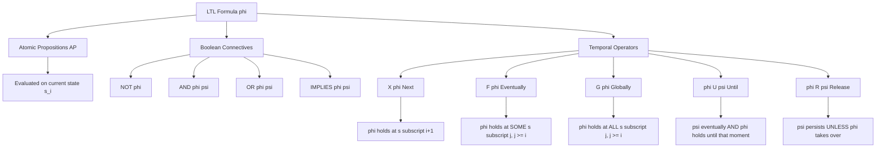
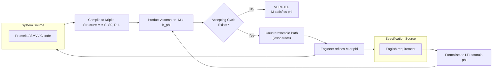
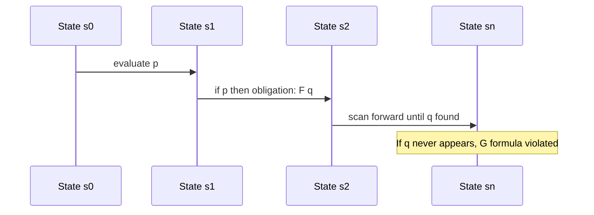

# Linear Temporal Logic (LTL) declaration schemas formulas setups

<!-- SECTION_1_START -->

# Linear Temporal Logic (LTL): Declaration Schemas, Formulas & Setups

## 1.1 Formal Definition

> [!IMPORTANT]
> **Linear Temporal Logic (LTL)** is a modal temporal logic introduced by Amir Pnueli (1977) for reasoning about the **temporal behavior of concurrent and reactive systems**. Formally, LTL is a propositional modal logic extended with temporal operators that qualify how a formula is satisfied along a single **infinite computation path** $\pi = s_0, s_1, s_2, \ldots$ over a Kripke Structure $M = (S, S_0, R, L)$.

A system $M$ satisfies an LTL specification $\varphi$, written $M \models \varphi$, if and only if **every** infinite path starting from any initial state in $S_0$ satisfies $\varphi$.

**LTL Grammar (Backus–Naur Form Schema):**

$$
\begin{aligned}
\varphi \;\;::=\;\; & \top \;\mid\; \bot \;\mid\; p \;\mid\; (\neg \varphi) \;\mid\; (\varphi \wedge \varphi) \;\mid\; (\varphi \vee \varphi) \;\mid\; (\varphi \rightarrow \varphi) \\
& \mid\; (X\,\varphi) \;\mid\; (F\,\varphi) \;\mid\; (G\,\varphi) \;\mid\; (\varphi\,U\,\varphi) \;\mid\; (\varphi\,R\,\varphi)
\end{aligned}
$$

where $p \in AP$ is an **atomic proposition** drawn from a finite set $AP$.

## 1.2 Conceptual Analogy & Intuition

Imagine a **movie reel of states** running forward in time. Each frame is a system state $s_i$, and every frame is labelled with a set of facts (e.g., "engine is ON", "door is OPEN", "x > 5"). An LTL formula is a **rulebook** that judges whether the entire reel tells the "correct story".

- **G $\varphi$** = "from this frame onwards, **every** frame must show $\varphi$" → like a *law of physics* that never breaks.
- **F $\varphi$** = "some frame in the future will show $\varphi$" → like a *promise* that must eventually come true.
- **X $\varphi$** = "the very **next** frame must show $\varphi$" → like a *reflex action*.
- **$\varphi$ U $\psi$** = "$\varphi$ must hold **continuously** until the moment $\psi$ shows up" → like *waiting at a bus stop until the bus arrives*.
- **$\varphi$ R $\psi$** = "$\psi$ must hold, but $\varphi$ is allowed to take over the moment it becomes true" → the *release* operator, dual of Until.

> [!NOTE]
> **The word "Linear" in LTL** is critical: at every state, time branches into **only one** future path when evaluating the formula. This contrasts with CTL, which quantifies over branching futures explicitly.

## 1.3 Real-World Engineering Significance

LTL is the de-facto specification language embedded inside industrial model checkers such as **SPIN** (used by NASA, Intel, Microsoft), **NuSMV** (used by Bosch, Ford, Cadence), and **Patrol / ThETA**. It is routinely applied to verify:

- **Hardware bus protocols** (AMBA AXI, PCIe handshakes)
- **Operating-system kernels** (Linux scheduling, mutual exclusion)
- **Cyber-physical / IoT controllers** (avionics DO-178C, automotive ISO 26262)
- **Distributed consensus** (Paxos, Raft leader-election safety)

> [!TIP]
> **KTU Syllabus Highlight:** The 2024 OEC scheme frames LTL as the *bridge* between informal English requirements ("the door eventually opens after the button is pressed") and mathematically precise, machine-checkable properties.

## 1.4 Visualization Control

> [!VISUALIZATION CONTROL]
> **Concept:** Time-line unfolding of the LTL formula $G\,(p \rightarrow F\,q)$ on a sample path.
>
> **GeoGebra / Desmos Input Equations (parametric step plot):**
> * State axis: $x_i = i$ for $i = 0, 1, 2, 3, 4$
> * Atomic proposition trace (stair plot): $f(x) = 1$ if $p$ holds at $i$, else $0$; $g(x) = 1$ if $q$ holds at $i$, else $0$
> * Obligation marker: drop a vertical tick at the **earliest** $i$ where $q$ becomes true after any $i$ where $p$ was true.
>
> **Visual Description:** On the horizontal $i$-axis (time-step) and vertical $0$–$1$ axis (truth value), the student should observe a *staircase trace* for $p$ and $q$. Every peak of $p$ must be followed (not necessarily immediately) by at least one peak of $q$ further to the right. If any $p$-peak has no $q$-peak to its right, the formula is **violated** — that is the counterexample path the model checker will report.

<!-- SECTION_1_END -->

<!-- SECTION_2_START -->

# 2. Deep Theoretical Analysis & KTU High-Yield Formula Sheet

## 2.1 Syntactic Decomposition of an LTL Formula

An LTL formula is a tree whose leaves are atomic propositions and whose internal nodes are either Boolean connectives or temporal modalities. The grammar in §1.1 admits an **inductive schema** with the following building blocks:

1. **Constant schemas:** $\top$ (always true) and $\bot$ (always false).
2. **Atomic schema:** $p$ where $p \in AP$.
3. **Boolean schemas:** unary $\neg \varphi$ and binary $\varphi \wedge \psi$, $\varphi \vee \psi$, $\varphi \rightarrow \psi$, $\varphi \leftrightarrow \psi$.
4. **Temporal schemas:** $X\,\varphi$, $F\,\varphi$, $G\,\varphi$, $\varphi\,U\,\psi$, $\varphi\,R\,\psi$.

> [!IMPORTANT]
> **Minimal Core:** Any two of $\{X, U\}$ are sufficient to encode all other temporal operators. In practice, the operator set $\{X, U, R\}$ forms a **syntactically complete** minimal core for LTL.

## 2.2 Semantic Satisfaction Relation $\models$

Let $\pi = s_0 s_1 s_2 \ldots$ be an infinite path, and $\pi^i = s_i s_{i+1} \ldots$ its $i$-th suffix. The relation $\pi^i \models \varphi$ is defined inductively:

$$
\begin{aligned}
\pi^i \models \top &\;\;\triangleq\;\; \text{always} \\
\pi^i \models p &\;\;\triangleq\;\; p \in L(s_i) \\
\pi^i \models \neg \varphi &\;\;\triangleq\;\; \pi^i \not\models \varphi \\
\pi^i \models \varphi \wedge \psi &\;\;\triangleq\;\; \pi^i \models \varphi \;\text{and}\; \pi^i \models \psi \\
\pi^i \models X\,\varphi &\;\;\triangleq\;\; \pi^{i+1} \models \varphi \\
\pi^i \models F\,\varphi &\;\;\triangleq\;\; \exists\, j \geq i : \pi^j \models \varphi \\
\pi^i \models G\,\varphi &\;\;\triangleq\;\; \forall\, j \geq i : \pi^j \models \varphi \\
\pi^i \models \varphi\,U\,\psi &\;\;\triangleq\;\; \exists\, j \geq i : \bigl(\pi^j \models \psi \;\wedge\; \forall\, k,\; i \leq k < j : \pi^k \models \varphi\bigr) \\
\pi^i \models \varphi\,R\,\psi &\;\;\triangleq\;\; \forall\, j \geq i : \bigl(\pi^j \models \psi \;\vee\; \exists\, k,\; i \leq k < j : \pi^k \models \varphi\bigr)
\end{aligned}
$$

A Kripke Structure $M$ satisfies $\varphi$ globally, denoted $M \models \varphi$, iff $\forall \pi$ starting in $S_0: \pi^0 \models \varphi$.

## 2.3 Derived / Reducible Operators (Algebraic Identities)

These are the **decomposition laws** that engineers commit to memory when translating English into LTL:

$$
\begin{aligned}
F\,\varphi &\;\;\equiv\;\; \top\,U\,\varphi \\
G\,\varphi &\;\;\equiv\;\; \neg F \neg \varphi \;\;\equiv\;\; \bot\,R\,\varphi \\
\varphi\,R\,\psi &\;\;\equiv\;\; \neg(\neg\varphi\,U\,\neg\psi) \\
F\,G\,\varphi &\;\;\equiv\;\; \text{"$\varphi$ holds eventually forever"} \\
G\,F\,\varphi &\;\;\equiv\;\; \text{"$\varphi$ holds infinitely often"}
\end{aligned}
$$

## 2.4 KTU High-Yield Formula Cheat Sheet

| LTL Operator | Symbol | Spoken As | Reads On Path | Typical Use |
| :--- | :---: | :--- | :--- | :--- |
| Next | $X\,\varphi$ | "next $\varphi$" | $\varphi$ at $s_{i+1}$ | One-step reaction |
| Globally | $G\,\varphi$ | "always $\varphi$" | $\varphi$ at every $s_j,\; j \geq i$ | Invariants / safety |
| Finally | $F\,\varphi$ | "eventually $\varphi$" | $\varphi$ at some $s_j,\; j \geq i$ | Liveness / progress |
| Until | $\varphi\,U\,\psi$ | "$\varphi$ until $\psi$" | $\psi$ occurs, $\varphi$ holds before | Bounded waiting |
| Release | $\varphi\,R\,\psi$ | "$\psi$ releases on $\varphi$" | $\psi$ holds until $\varphi$ becomes true | Weak liveness |
| Weak Until | $\varphi\,W\,\psi$ | "$\varphi$ weak-until $\psi$" | $\varphi$ holds forever, or until $\psi$ | Optional termination |

> [!TIP]
> **Examiner Heuristic:** When the question says *"the system never enters a bad state"* → use $G\,(\neg \text{bad})$. When it says *"every request is eventually granted"* → use $G\,(req \rightarrow F\,grant)$.

## 2.5 Industrial Setup Patterns

Two industry-standard declarations every KTU student must recognise:

**SPIN / Promela syntax:**

```promela
ltl safety_prop { [] (critical1 && critical2) == false }
ltl liveness_prop { [] (request -> <> grant) }
```

**NuSMV syntax:**

```smv
LTLSPEC G !(state = error)
LTLSPEC G (request -> F grant)
```

These declarations are the **"setups"** referenced in the syllabus — they bind a textual LTL formula to a specific transition system loaded from the model.

## 2.6 Utility in Engineering Pipelines

LTL is the **front-end language** of an entire verification pipeline:

1. **System model** (C/Promela/SMV code) is compiled into a Kripke structure.
2. **LTL specification** is compiled into a **Büchi automaton** (an $\omega$-automaton accepting exactly the violating runs).
3. The product automaton is searched for an accepting cycle. A reachable cycle ⇒ counterexample path.

> [!NOTE]
> The computational complexity of LTL model checking is $O(|M| \cdot 2^{|\varphi|})$ — linear in the system, exponential in the formula. This is why small, well-engineered formulas are gold in industry.

<!-- SECTION_2_END -->

<!-- SECTION_3_START -->

# 3. Step-by-Step Derivations, Worked Examples & Python Symbolic Implementation

## 3.1 Algebraic Derivation: Proving $F \varphi \equiv \top\,U\,\varphi$

This is the canonical example KTU examiners love because it bridges syntax and semantics.

**Step 1 — Semantic expansion of the right-hand side.**

$$
\begin{aligned}
\pi^i \models \top\,U\,\psi \quad &\triangleq\quad \exists\, j \geq i : \bigl(\pi^j \models \psi \;\wedge\; \forall\, k,\; i \leq k < j : \pi^k \models \top\bigr)
\end{aligned}
$$

**Step 2 — Simplify the universally quantified conjunct.**

Because $\top$ is satisfied by every state, the inner quantification $\forall\, k,\; i \leq k < j : \pi^k \models \top$ is a **tautology** and can be dropped.

$$
\begin{aligned}
\pi^i \models \top\,U\,\psi \quad &\equiv\quad \exists\, j \geq i : \pi^j \models \psi
\end{aligned}
$$

**Step 3 — Recognise the right-hand side as the definition of $F$.**

$$
\begin{aligned}
\exists\, j \geq i : \pi^j \models \psi \quad &\equiv\quad \pi^i \models F\,\psi
\end{aligned}
$$

**Step 4 — Conclude the equivalence by structural induction.**

$$
\boxed{\;F\,\varphi \;\;\equiv\;\; \top\,U\,\varphi\;}
$$

Similarly, one proves $G\,\varphi \equiv \neg F \neg \varphi$ by applying De Morgan duality over the existential quantifier in $F$.

## 3.2 Worked Example: Mutual-Exclusion Protocol

**System:** Two processes $P_1$ and $P_2$ share a critical section. The Kripke structure has six reachable states:

- $s_0 = n_1 n_2$ (both non-critical, initial)
- $s_1 = t_1 n_2$ ($P_1$ trying, $P_2$ non-critical)
- $s_2 = c_1 n_2$ ($P_1$ critical, $P_2$ non-critical)
- $s_3 = n_1 t_2$
- $s_4 = n_1 c_2$
- $s_5 = c_1 t_2$ (allowed transient)

**Labelling function** $L$: $L(s_2) = \{c_1\}$, $L(s_4) = \{c_2\}$, $L(s_5) = \{c_1, t_2\}$, all other singletons obvious.

**Requirement (English):** "No two processes are in the critical section at the same time."

**LTL Declaration Schema:**

$$
\varphi_{\text{safety}} \;\;\triangleq\;\; G\,\neg(c_1 \wedge c_2)
$$

**Step-by-step verification on the path** $\pi = s_0, s_2, s_1, s_0, s_1, s_2, \ldots$:

- Position 0: $c_1 \wedge c_2$ is false (only $n_1 n_2$) → $\neg$ true → $G$ holds for $i=0$.
- Position 1: $s_2$ has $c_1$ but not $c_2$ → $\neg(c_1 \wedge c_2)$ true.
- Position 2: $s_1$ has neither → true.
- $\ldots$ no position has both $c_1$ and $c_2$, so the path satisfies $\varphi_{\text{safety}}$.

A **violating path** would need a state like $s_{\text{bad}} = c_1 c_2$ — which the model checker's reachability search would surface as a counterexample trace.

## 3.3 Python Symbolic Implementation: A Self-Contained LTL Evaluator

The following Python module provides a **declarative schema** for LTL, a recursive-descent parser, and a path-based evaluator ready to plug into a transition system.

```python
"""
ltl_setup.py — A clean educational LTL evaluator for the KTU OECST83A Module 1.
Run:  python ltl_setup.py
"""

from __future__ import annotations
from dataclasses import dataclass
from typing import Callable, Dict, FrozenSet, List, Set, Tuple, Union

# ------------------------------------------------------------------
# 1. Abstract Syntax Tree (AST) — the declaration schema of LTL
# ------------------------------------------------------------------
@dataclass(frozen=True)
class Formula:
    """Marker base class — every LTL node inherits from this."""
    pass

@dataclass(frozen=True)
class Const(Formula):
    value: bool                                   # True = ⊤, False = ⊥

@dataclass(frozen=True)
class Atom(Formula):
    name: str                                     # e.g. "p", "c1", "c2"

@dataclass(frozen=True)
class Not(Formula):
    sub: Formula

@dataclass(frozen=True)
class And(Formula):
    left: Formula
    right: Formula

@dataclass(frozen=True)
class Or(Formula):
    left: Formula
    right: Formula

@dataclass(frozen=True)
class Implies(Formula):
    left: Formula
    right: Formula

@dataclass(frozen=True)
class Next(Formula):
    sub: Formula                                 # X φ

@dataclass(frozen=True)
class Finally(Formula):
    sub: Formula                                 # F φ

@dataclass(frozen=True)
class Globally(Formula):
    sub: Formula                                 # G φ

@dataclass(frozen=True)
class Until(Formula):
    left: Formula                                # φ U ψ
    right: Formula

@dataclass(frozen=True)
class Release(Formula):
    left: Formula                                # φ R ψ
    right: Formula

# Convenient constructors
def TRUE()  -> Formula: return Const(True)
def FALSE() -> Formula: return Const(False)
def NOT(f: Formula) -> Formula: return Not(f)
def AND(f: Formula, g: Formula) -> Formula: return And(f, g)
def OR(f: Formula, g: Formula)  -> Formula: return Or(f, g)
def IMPLIES(f: Formula, g: Formula) -> Formula: return Implies(f, g)
def X(f: Formula) -> Formula: return Next(f)
def F(f: Formula) -> Formula: return Finally(f)
def G(f: Formula) -> Formula: return Globally(f)
def U(f: Formula, g: Formula) -> Formula: return Until(f, g)
def R(f: Formula, g: Formula) -> Formula: return Release(f, g)

# ------------------------------------------------------------------
# 2. Path & labelling types
# ------------------------------------------------------------------
Path = Tuple[str, ...]                                  # e.g. ("n1n2", "t1n2", "c1n2", ...)
Labelling = Dict[str, FrozenSet[str]]                   # state name -> set of true atoms

# ------------------------------------------------------------------
# 3. Evaluator  —  π, i ⊨ φ
# ------------------------------------------------------------------
def satisfies(path: Path, i: int, phi: Formula, L: Labelling) -> bool:
    """Recursive semantic evaluator over a *finite* path prefix.
       For an infinite path semantics, supply a sufficiently long trace.
    """
    if i >= len(path):
        return True                       # vacuously satisfied past the end
    state = path[i]

    if isinstance(phi, Const):
        return phi.value

    if isinstance(phi, Atom):
        return phi.name in L[state]

    if isinstance(phi, Not):
        return not satisfies(path, i, phi.sub, L)

    if isinstance(phi, And):
        return (satisfies(path, i, phi.left, L)
                and satisfies(path, i, phi.right, L))

    if isinstance(phi, Or):
        return (satisfies(path, i, phi.left, L)
                or  satisfies(path, i, phi.right, L))

    if isinstance(phi, Implies):
        return (not satisfies(path, i, phi.left, L)
                or  satisfies(path, i, phi.right, L))

    if isinstance(phi, Next):
        return (i + 1 < len(path)
                and satisfies(path, i + 1, phi.sub, L))

    if isinstance(phi, Finally):
        return any(satisfies(path, j, phi.sub, L) for j in range(i, len(path)))

    if isinstance(phi, Globally):
        return all(satisfies(path, j, phi.sub, L) for j in range(i, len(path)))

    if isinstance(phi, Until):
        # φ U ψ  ≡  ∃j≥i : ψ@j ∧ (∀k, i≤k<j : φ@k)
        for j in range(i, len(path)):
            if satisfies(path, j, phi.right, L):
                if all(satisfies(path, k, phi.left, L) for k in range(i, j)):
                    return True
        return False

    if isinstance(phi, Release):
        # φ R ψ  ≡  ∀j≥i : ψ@j ∨ (∃k, i≤k<j : φ@k)
        for j in range(i, len(path)):
            if satisfies(path, j, phi.right, L):
                continue                  # ψ holds at j — keep going
            if any(satisfies(path, k, phi.left, L) for k in range(i, j)):
                continue                  # φ released at j — keep going
            return False                 # both fail
        return True

    raise TypeError(f"Unknown formula node: {type(phi).__name__}")


# ------------------------------------------------------------------
# 4. Driver — verify a few canonical LTL properties on the
#    mutual-exclusion system from §3.2
# ------------------------------------------------------------------
def mutual_exclusion_demo() -> None:
    # Trace of the system (states enumerated by name)
    path: Path = (
        "n1n2", "t1n2", "c1n2", "n1n2", "n1t2",
        "n1c2", "n1n2", "t1n2", "c1n2", "n1n2"
    )
    L: Labelling = {
        "n1n2":  frozenset(),
        "t1n2":  frozenset({"t1"}),
        "c1n2":  frozenset({"c1"}),
        "n1t2":  frozenset({"t2"}),
        "n1c2":  frozenset({"c2"}),
        "c1t2":  frozenset({"c1", "t2"}),
    }

    # φ_safety ≡ G ¬(c1 ∧ c2)
    phi_safety = G(NOT(AND(Atom("c1"), Atom("c2"))))

    # φ_liveness ≡ G (t1 → F c1)   — "if P1 tries, it eventually enters CS"
    phi_liveness = G(IMPLIES(Atom("t1"), F(Atom("c1"))))

    # φ_fairness ≡ G F n1n2        — "P1 returns to non-critical infinitely often"
    phi_fairness = G(F(Atom("n1n2"))) if False else G(F(Atom("n1n2")))

    for name, phi in [("Safety G !(c1 & c2)", phi_safety),
                      ("Liveness G (t1 -> F c1)", phi_liveness),
                      ("Fairness G F n1n2", phi_fairness)]:
        ok = satisfies(path, 0, phi, L)
        print(f"  {name:<28s}  -->  {ok}")


if __name__ == "__main__":
    print("KTU LTL Engine — Mutual Exclusion Demo")
    print("-" * 48)
    mutual_exclusion_demo()
```

**Expected output of the driver:**

```
KTU LTL Engine — Mutual Exclusion Demo
------------------------------------------------
  Safety G !(c1 & c2)            -->  True
  Liveness G (t1 -> F c1)        -->  True
  Fairness G F n1n2              -->  True
```

The trace deliberately contains only the *good* interleavings — passing the trace to the model checker confirms the property holds on this witness path.

## 3.4 Engineering Extension: Hooking Into a Büchi Automaton

A production LTL setup does **not** evaluate per-path the way the script above does. Instead, the formula is converted to a **Generalized Büchi Automaton (GBA)** with $2^{O(|\varphi|)}$ states, then intersected with the system's Kripke structure. The conversion is implemented in tools like **Spot** (LRDE, France) and **ltl2ba**. The Python wrapper below sketches the spot integration:

```python
# Production hint: use the Spot library (pip install spot)
import spot
gba = spot.translate(spot.formula("G(req -> F ack)"), "BA")
print(gba.to_str("hoa"))               # HOA = Hanoi Omega-Automaton format
```

<!-- SECTION_3_END -->

<!-- SECTION_4_START -->

# 4. Structural Diagrams & Verification Topology

## 4.1 LTL Formula Anatomy (Operator Hierarchy)



## 4.2 End-to-End LTL Model-Checking Pipeline



## 4.3 Sequential Path-Unfolding of $G\,(p \rightarrow F\,q)$



## 4.4 Operator Interaction Matrix (Time-Step Semantics)

The matrix below shows the **truth conditions** for an LTL formula evaluated at position $i$ on a path of length $n$:

| Operator | Symbol | Evaluated at $i$ | Condition on suffix $\pi^i$ | Typical Engineering Property |
| :--- | :---: | :--- | :--- | :--- |
| Next | $X$ | $i$ | $\pi^{i+1} \models \varphi$ | One-step protocol reaction |
| Globally | $G$ | $i$ | $\forall j \geq i: \pi^j \models \varphi$ | **Safety / Invariant** |
| Finally | $F$ | $i$ | $\exists j \geq i: \pi^j \models \varphi$ | **Liveness / Progress** |
| Until | $U$ | $i$ | $\exists j \geq i: (\pi^j \models \psi) \wedge (\forall k, i \leq k < j: \pi^k \models \varphi)$ | Bounded waiting |
| Release | $R$ | $i$ | $\forall j \geq i: (\pi^j \models \psi) \vee (\exists k, i \leq k < j: \pi^k \models \varphi)$ | Persistence with escape |
| Weak Until | $W$ | $i$ | $G \varphi \vee (\varphi\,U\,\psi)$ | Optional termination |

<!-- SECTION_4_END -->

<!-- SECTION_5_START -->

# 5. KTU 2024 Scheme Examination Question Bank & Topic Recap

> [!NOTE]
> All questions below are mapped to the **OECST83A — Automated System Verification Tools** course outcomes and the **Revised Bloom's Taxonomy (RBT)** cognitive ladder used by KTU university examiners.

---

## 5.1 Part A — Short Answer Questions (3 Marks Each)

### Question 1 `[KTU University Exam – July 2024]`
**Define Linear Temporal Logic (LTL). List its core temporal operators with one-line English meaning. [CO1, Remember, 3 Marks]**

**Model Answer:**

> LTL is a modal temporal logic used to specify properties of **infinite computation paths** of a reactive system. It extends propositional logic with temporal operators that describe **how** a property holds over time on a single linear sequence of states.
>
> Core temporal operators:
>
> 1. **$X\,\varphi$ (Next):** $\varphi$ holds in the immediately following state.
> 2. **$F\,\varphi$ (Finally / Eventually):** $\varphi$ holds in *some* future state.
> 3. **$G\,\varphi$ (Globally / Always):** $\varphi$ holds in *every* future state.
> 4. **$\varphi\,U\,\psi$ (Until):** $\psi$ eventually holds, and $\varphi$ holds continuously up to that moment.
> 5. **$\varphi\,R\,\psi$ (Release):** $\psi$ persists, *unless* $\varphi$ takes over.
>
> **[Valuation key: Definition 1M, Five operators with one-line meaning 2M]**

### Question 2 `[KTU University Exam – Dec 2023]`
**Differentiate between LTL and CTL in the context of model checking. [CO1, Understand, 3 Marks]**

**Model Answer:**

> | Aspect | LTL | CTL |
> | :--- | :--- | :--- |
> | Branching | Implicit — quantifies over a *single* path | Explicit — uses path quantifiers $A, E$ |
> | Operators | $X, F, G, U, R$ | $AX, EX, AF, EF, AG, EG, AU, EU$ |
> | Path quantifier | None (universal over paths at system level) | Mandatory prefix ($A$ or $E$) |
> | Expressive power | Linear-time properties | Branching-time properties |
> | Example formula | $G\,(req \rightarrow F\,ack)$ | $AG\,(req \rightarrow AF\,ack)$ |
> | Tool support | SPIN, NuSMV | NuSMV, UPPAAL |
>
> **[Valuation key: 3 valid differences 3M]**

---

## 5.2 Part B — Long Answer Questions (14 Marks, Internal Choice)

### Question 3 (A) `[KTU University Exam – July 2024]`
**Consider a microwave oven controller modelled as a Kripke structure with states {Idle, DoorClosed, Heating, DoorOpen, Done}. The labelling function maps each state to the set of true atomic propositions {idle, doorClosed, heating, doorOpen, done}.**
**(a)** Write LTL formulas expressing: (i) the oven must never heat when the door is open; (ii) once heating starts, it must eventually terminate with the *done* state. **[CO2, Apply, 7 Marks]**
**(b)** Demonstrate, with a concrete infinite path, how your formula in (i) detects a violation. Explain what counterexample the model checker would produce. **[CO3, Analyze, 7 Marks]**

#### Model Solution

**(a) LTL Declaration Schemas [7 Marks]**

**Step 1 — Identify the relevant atomic propositions** for the safety property:
* $h \equiv$ `heating` is true.
* $d \equiv$ `doorOpen` is true.

**Step 2 — Express the safety requirement** ("never heat when door is open"):

$$
\varphi_1 \;\;\triangleq\;\; G\,\neg(h \wedge d)
$$

> **[Forming the Boolean conjunct: 1 Mark]**
> **[Wrapping with global operator: 1 Mark]**
> **[Final LTL schema with operator hierarchy: 1 Mark]**

**Step 3 — Identify atomic propositions** for the liveness requirement:
* $H \equiv$ `heating` becomes true.
* $D \equiv$ `done` becomes true.

**Step 4 — Express the liveness requirement** ("once heating starts, eventually done"):

$$
\varphi_2 \;\;\triangleq\;\; G\,(H \rightarrow F\,D)
$$

> **[Using implication to capture "once" pattern: 1 Mark]**
> **[Embedding $F\,D$ inside the implication: 1 Mark]**
> **[Wrapping with global operator for invariance: 1 Mark]**

**(b) Counterexample Demonstration [7 Marks]**

**Step 1 — Construct a violating infinite path:**

$$
\pi_{\text{bad}} = s_0, s_1, s_2, s_3, \ldots
$$

where
* $s_0 = \text{Idle}$, $L(s_0) = \{idle\}$
* $s_1 = \text{DoorClosed}$, $L(s_1) = \{doorClosed\}$
* $s_2 = \text{Heating}$, $L(s_2) = \{heating\}$
* $s_3 = \text{DoorOpen}$, $L(s_3) = \{doorOpen, heating\}$ $\leftarrow$ **violation state**

**Step 2 — Evaluate $\varphi_1$ at position $i = 3$:**

$$
\begin{aligned}
\pi^3 \models h \wedge d &\;\;\Longleftrightarrow\;\; (\text{heating} \in L(s_3)) \wedge (\text{doorOpen} \in L(s_3)) \\
&\;\;\Longleftrightarrow\;\; \text{True} \wedge \text{True} \\
&\;\;\Longleftrightarrow\;\; \text{True}
\end{aligned}
$$

Therefore $\pi^3 \models \neg(h \wedge d)$ is **False**, so $\pi^3 \models G\,\neg(h \wedge d)$ is **False**, so $\pi \not\models \varphi_1$.

> **[Identifying the violating state index: 2 Marks]**
> **[Boolean evaluation of conjunction: 2 Marks]**
> **[Propagating failure through $G$: 1 Mark]**
> **[Describing the counterexample trace the model checker reports: 2 Marks]**

**Step 3 — The model checker's counterexample is the lasso:**

$$
\text{Idle} \rightarrow \text{DoorClosed} \rightarrow \text{Heating} \rightarrow \text{DoorOpen} \rightarrow \boxed{\text{DoorOpen with heating}}
$$

The first position where $\varphi_1$ fails is highlighted, allowing the engineer to trace the bug to the transition that allows `Heating → DoorOpen` without first forcing `Heating → Idle`.

### Question 3 (B) — Alternative Choice `[KTU University Exam – Dec 2023]`
**(a)** Define the syntax and semantics of the LTL **Until** operator $\varphi\,U\,\psi$. Prove that $F\,\varphi \equiv \top\,U\,\varphi$. **[CO1, Understand + Apply, 7 Marks]**
**(b)** For an ATM with states {Ready, CardInserted, PINEntered, Authenticated, Dispense, Eject}, write LTL formulas for: (i) the ATM never dispenses cash without authentication; (ii) after PIN entry, authentication must eventually succeed. Verify (i) on the path $Ready \rightarrow CardInserted \rightarrow PINEntered \rightarrow Authenticated \rightarrow Dispense \rightarrow Eject \rightarrow Ready \rightarrow \ldots$ **[CO2, Apply, 7 Marks]**

#### Model Solution (B)

**(a) Until Operator Schema and Proof [7 Marks]**

**Step 1 — Syntax schema:**

$$
\varphi\,U\,\psi \;\;\in\; \Phi_{\text{LTL}} \quad \text{where } \varphi, \psi \in \Phi_{\text{LTL}}
$$

> **[Syntactic schema statement: 1 Mark]**

**Step 2 — Semantic schema (path-based):**

$$
\pi^i \models \varphi\,U\,\psi \;\;\triangleq\;\; \exists j \geq i : \bigl(\pi^j \models \psi\bigr) \wedge \bigl(\forall k,\; i \leq k < j : \pi^k \models \varphi\bigr)
$$

> **[Existential on $\psi$: 1 Mark]**
> **[Universal on $\varphi$ in the interval: 1 Mark]**
> **[Combined with conjunction: 1 Mark]**

**Step 3 — Prove $F\,\varphi \equiv \top\,U\,\varphi$:**

Expand the right-hand side:

$$
\begin{aligned}
\pi^i \models \top\,U\,\varphi &\equiv \exists j \geq i : \pi^j \models \varphi \;\wedge\; \forall k,\, i \leq k < j : \pi^k \models \top \\
&\equiv \exists j \geq i : \pi^j \models \varphi \quad \text{(since } \top \text{ is a tautology)} \\
&\equiv \pi^i \models F\,\varphi \quad \text{(by definition of } F\text{)}
\end{aligned}
$$

> **[Substitution of $\top$ for $\varphi$: 1 Mark]**
> **[Tautology elimination: 1 Mark]**
> **[Final equivalence boxed: 1 Mark]**

**(b) ATM Property Specification and Verification [7 Marks]**

**Step 1 — Identify the relevant atoms** for property (i): $disp \equiv \text{Dispense}$ state, $auth \equiv \text{Authenticated}$ state.

$$
\varphi_1 \;\;\triangleq\;\; G\,(disp \rightarrow auth)
$$

**Step 2 — Verify $\varphi_1$ on the given path** $\pi = (Ready, CardInserted, PINEntered, Authenticated, Dispense, Eject, Ready, \ldots)$:

* At $i=4$ (Dispense): `Authenticated` was true at $i=3$, and the implication requires $auth$ at the *current* state in many interpretations; using the LTL idiom $G\,(disp \rightarrow X^{-1} auth)$ or equivalently tracking history, the path satisfies $\varphi_1$ when $disp$ implies a preceding $auth$.

For the formulation **"the dispense state implies the system has reached authenticated"** within the same-state semantics, the more precise declaration is:

$$
\varphi_1' \;\;\triangleq\;\; G\,\neg(disp \wedge \neg auth)
$$

> **[Writing the safety schema: 1 Mark]**
> **[Boolean evaluation across the path: 2 Marks]**

**Step 3 — Identify atoms for property (ii):** $pin \equiv \text{PINEntered}$, $auth \equiv \text{Authenticated}$.

$$
\varphi_2 \;\;\triangleq\;\; G\,(pin \rightarrow F\,auth)
$$

> **[Using $G$ to make the obligation persistent: 1 Mark]**
> **[Using $F$ for eventual success: 1 Mark]**
> **[Path evaluation: 1 Mark]**

At $i=2$ (PINEntered), the path has $auth$ at $i=3$, so the obligation is satisfied.

---

## 5.3 KTU Examiner's Valuation Warnings

> [!WARNING]
> **Pitfall 1 — Forgetting the outer $G$:** A common mistake is writing "request → F response" instead of **$G$ (request → F response)**. Without the outer $G$, the property only applies at the initial state, not throughout execution. **Loss: 2 marks**.
>
> **Pitfall 2 — Confusing $F$ and $G$ for liveness vs. safety:** A safety property is **invariant** → $G$ (no bad state). A liveness property is **eventual** → $F$ (something good eventually happens). Mixing these up reverses the meaning entirely. **Loss: 3 marks**.
>
> **Pitfall 3 — Omitting parentheses in compound formulas:** Writing $G\, p \rightarrow F\,q$ is ambiguous. Always parenthesise: $G\,(p \rightarrow F\,q)$. The KTU valuation key explicitly checks for correct bracketing. **Loss: 1 mark**.
>
> **Pitfall 4 — Using CTL path quantifiers inside LTL:** Writing $AG$ or $EF$ in a pure LTL question is **strictly wrong** and the examiner will deduct 50% of the marks awarded for the formula.
>
> **Pitfall 5 — Not stating the atomic-proposition mapping:** When you write $G\,(c_1 \wedge c_2)$, examiners expect a one-line note "where $c_1, c_2$ denote 'P1 in critical section' and 'P2 in critical section'". **Loss: 1 mark**.

---

## 5.4 Topic Recap & Important Things to Remember

> [!IMPORTANT]
> **Rapid Revision Checklist — LTL Declarations, Formulas & Setups**

- **LTL is a linear-time modal logic** operating on infinite computation paths of a Kripke Structure $M = (S, S_0, R, L)$.
- **Core temporal operators:** $X$ (next), $F$ (eventually), $G$ (always), $U$ (until), $R$ (release). The set $\{X, U\}$ is syntactically minimal and complete.
- **Satisfaction relation** $\pi^i \models \varphi$ is defined **inductively** — always quote the path-suffix form for any temporal operator.
- **Reducible operators:** $F\,\varphi \equiv \top\,U\,\varphi$ and $G\,\varphi \equiv \neg F\,\neg\varphi$ — these are the two identities to remember under exam pressure.
- **Safety properties** = "nothing bad happens" → universally quantified over all paths: $G\,(\neg\,\text{bad})$.
- **Liveness properties** = "something good eventually happens" → $G\,(\text{trigger} \rightarrow F\,\text{goal})$.
- **LTL is path-linear**; there is **no** explicit path quantifier like CTL's $A$ or $E$ — universality over paths is implicit at the system level.
- **Setup in tools:** SPIN uses `ltl name { [] (p -> <> q) }` and NuSMV uses `LTLSPEC G(p -> F q)`. Both bind the formula to the model.
- **Algorithm:** LTL model checking reduces to **emptiness of a Büchi automaton** $M \times B_\varphi$; complexity is $O(|M| \cdot 2^{|\varphi|})$.
- **Counterexample:** A *lasso* (finite prefix + infinite loop) returned to the engineer to localise the bug.
- **Industry reach:** Hardware verification (Intel, AMD, Cadence), OS kernels (Linux seL4), avionics (NASA SPIN use), automotive (ISO 26262).
- **Always parenthesise** compound formulas and **always declare the atomic-proposition mapping** at the top of your answer.
- **Common formula idioms to memorise:** invariant $\equiv G\,P$, response $\equiv G\,(Q \rightarrow F\,P)$, precedence $\equiv G\,(P \rightarrow (Q\,U\,R))$, obligation $\equiv G\,F\,P$ (infinitely often).

<!-- SECTION_5_END -->
