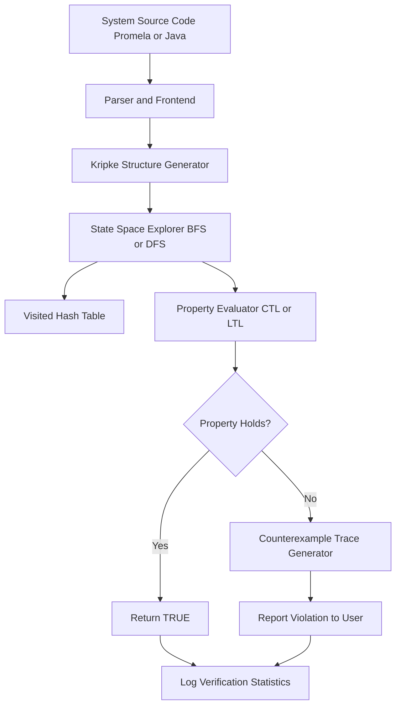
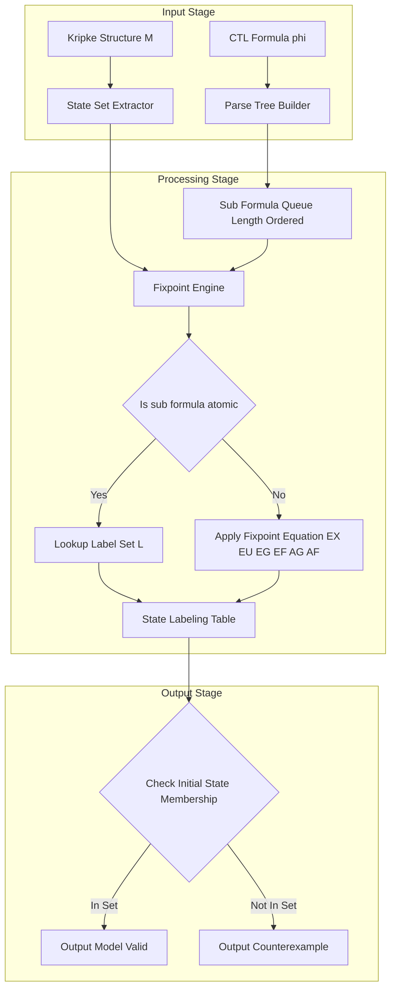
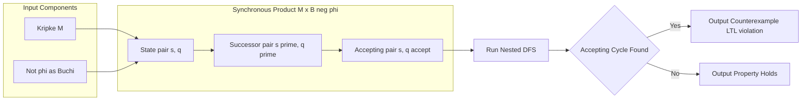
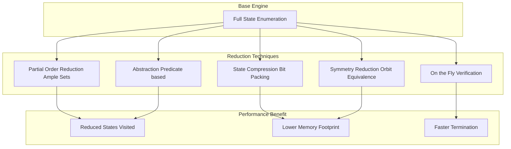

# Explicit-State Model Checking

<!-- SECTION_1_START -->
# Explicit-State Model Checking

## 1. Formal Definition (KTU 2024 Syllabus Standard)

> [!IMPORTANT]
> **Explicit-State Model Checking** is a formal verification technique in which the entire reachable **state space** of a finite-state concurrent or reactive system is **explicitly enumerated, stored, and explored** to algorithmically check whether a given specification (expressed in a temporal logic such as **CTL** or **LTL**) is satisfied by every reachable state of the system.

The system under verification is formally modeled as a **Kripke Structure** $M = (S, S_0, R, L)$, and the property is expressed as a **temporal logic formula** $\varphi$. The model checker returns:

- $\mathbf{TRUE}$ if $M \models \varphi$ (property holds in all states), or
- A **counterexample** (an execution path witnessing the violation).

> [!NOTE]
> **Course Outcome Alignment (CO2):** *Apply explicit-state model checking algorithms such as reachability, DFS-based CTL model checking, and on-the-fly LTL model checking to verify safety and liveness properties of finite-state systems.*

---

## 2. Conceptual Analogy — The "Labyrinth Inspector" Analogy

Imagine an **infinite labyrinth** built from a system design (e.g., a vending machine, a communication protocol, a traffic light controller). The labyrinth has a finite number of unique *rooms* (**states**), doors between rooms (**transitions**), and each room has signs on the wall listing facts true at that moment (**labeling function** $L$).

An **Explicit-State Model Checker** behaves like a **robot inspector** that:

1. Starts from the entrance (initial state $s_0 \in S_0$).
2. Walks through **every reachable room** by opening every door, recording visited rooms in a **notebook** (the *visited hash table*).
3. At each room, checks the **property rules** (CTL/LTL formula) — for example, *"Whenever the green light is on, the red light must eventually turn on within 3 steps"* (liveness).
4. If a rule is broken, it draws a **map of the path** leading to the violation (the counterexample).

> [!TIP]
> The "robot inspector" never revisits a room thanks to the **visited-set**, which is what makes explicit-state checking *systematic* rather than brute-force.

The fundamental difficulty is that the labyrinth can have **$10^{20}$ rooms or more** — the famous **State-Space Explosion Problem**.

---

## 3. The Kripke Structure — Foundation of Explicit-State MC

> [!IMPORTANT]
> **Definition (Kripke Structure).** A Kripke structure is a 4-tuple $M = (S, S_0, R, L)$ where:
>
> - $S$ is a finite set of **states**.
> - $S_0 \subseteq S$ is the set of **initial states**.
> - $R \subseteq S \times S$ is a **total transition relation** (every state has at least one successor).
> - $L : S \rightarrow 2^{AP}$ is a **labeling function** mapping each state to the set of atomic propositions true in it.

The transition relation must be **total**: $\forall s \in S \; \exists s' \in S : (s, s' ) \in R$. This guarantees that every computation is infinite.

---

## 4. Visualization of a Sample Kripke Structure

> [!VISUALIZATION CONTROL]
> **Concept:** Kripke Structure of a 2-process mutual exclusion protocol.
> **Desmos / Graphviz-style input:**
> * Nodes (states): `s0`, `s1`, `s2`, `s3`, `s4`
> * Initial state: `s0`
> * Atomic propositions: `{n1, n2, c1, c2}` (n = non-critical, c = critical)
> * Transitions: `s0 -> s1 (n1, n2)`, `s1 -> s2 (c1, n2)`, `s2 -> s0`, `s1 -> s3 (n1, c2)`, `s3 -> s0`
> **Visual Description:** The student should see a directed graph with 5 nodes, where each node carries a label-set. A path $s_0 \to s_1 \to s_2$ represents process 1 entering the critical section, while $s_1 \to s_3$ represents process 2 entering the critical section — both leaving the other in the non-critical section.

---

## 5. Where Explicit-State MC Is Used in Industry

| Application Domain | Real Tool | Property Verified |
|---|---|---|
| Hardware verification (CPU pipelines, cache coherence) | **SPIN**, **Cadence SMV** | Deadlock-freedom, mutual exclusion |
| Communication protocols (Bluetooth, CAN bus) | **SPIN** (promela models) | Liveness, message delivery |
| Software controllers (avionics, automotive) | **Java PathFinder (JPF)** | Runtime safety assertions |
| Security protocol analysis | **OFMC**, **CL-AtSe** | Authentication, secrecy |

> [!NOTE]
> **Pioneer citation:** The explicit-state model checking paradigm was introduced by **Edmund M. Clarke, E. Allen Emerson, and Joseph Sifakis** (2007 Turing Award recipients) in their seminal 1981/1986 papers on CTL model checking.

<!-- SECTION_1_END -->

<!-- SECTION_2_START -->
# Deep Theoretical Analysis & KTU High-Yield Formula Sheet

## 1. The Explicit-State Verification Loop

The execution of an explicit-state model checker is a **4-phase pipeline**:

### Phase 1 — *Modeling*
The system description (Promela, SMV, Java, C) is compiled into a **Kripke Structure** $M$. State vectors are encoded as **bit-packed integers** (e.g., 4 bytes per state for a small protocol) to maximize cache efficiency.

### Phase 2 — *Exploration (Successor Generation)*
The checker, given a state $s$, computes the set of successors:

$$
\text{Post}(s) = \{ s' \in S \mid (s, s') \in R \}
$$

For a system with $k$ concurrent processes each having $n$ local states, the number of global states is $n^k$ — hence the **exponential blowup**.

### Phase 3 — *Property Evaluation*
The CTL/LTL formula $\varphi$ is evaluated over the explored state space using:
- **Local model checking** (on-the-fly): checks the formula while exploring.
- **Global model checking** (labeling algorithm): first explores everything, then labels.

### Phase 4 — *Reporting*
If the property is violated, a **counterexample trace** is produced, replayable by the user.

---

## 2. The Labeling Algorithm for CTL (Clarke–Emerson–Sistla, 1986)

CTL operators are classified as **state formulas** (evaluated on states) and **path formulas** (evaluated on paths). The algorithm labels states $s \in S$ with sub-formulas they satisfy.

> [!IMPORTANT]
> The algorithm is **inductive on the structure of the formula** and uses **fixed-point characterizations** for temporal operators.

| CTL Operator | Fixed-Point Equation | Type of Fixpoint |
|---|---|---|
| $EX\,\varphi$ | $\{s \mid \exists s' \in R(s) : s' \in [\![\varphi]\!]\}$ | Direct computation |
| $EG\,\varphi$ | $\nu Z.\, [\![\varphi]\!] \cap EX\,Z$ | **Greatest** fixpoint |
| $E[\varphi \, U \, \psi]$ | $\mu Z.\, [\![\psi]\!] \cup ([\![\varphi]\!] \cap EX\,Z)$ | **Least** fixpoint |
| $EF\,\varphi$ | $\mu Z.\, [\![\varphi]\!] \cup EX\,Z$ | Least fixpoint |
| $AG\,\varphi$ | $\mu Z.\, [\![\varphi]\!] \cap AX\,Z$ | Least fixpoint |
| $AF\,\varphi$ | $\mu Z.\, [\![\varphi]\!] \cup AX\,Z$ | Least fixpoint |

> [!NOTE]
> The symbols $\mu$ and $\nu$ denote the **least** and **greatest** fixpoint operators in the lattice $(2^S, \subseteq)$. Tarski's theorem guarantees their existence.

**Algorithm Sketch (Labeling):**

1. Parse the CTL formula into its **parse tree** (atomic propositions as leaves).
2. Process sub-formulas **bottom-up** by formula length.
3. For each sub-formula, compute the set of states satisfying it using the fixpoint equations above.
4. The state set is returned as the **answer**; the initial state membership decides $M \models \varphi$.

---

## 3. On-the-Fly (Local) Model Checking

> [!IMPORTANT]
> **On-the-fly model checking** interleaves state-space generation with property checking — useful when the error is found early and full exploration is unnecessary.

It is typically implemented using a **DFS-based tableau expansion** of the formula. For LTL, this is built over the **Büchi automaton** of $\neg\varphi$.

---

## 4. LTL Model Checking — Reduction to Büchi Automata

For an LTL formula $\varphi$, explicit-state LTL model checking converts $\neg\varphi$ into a **Büchi automaton** $B_{\neg\varphi}$ and checks whether the synchronous product $M \otimes B_{\neg\varphi}$ has an **accepting run** (one that visits an accepting state infinitely often).

$$
M \models \varphi \iff L(M) \subseteq L(\varphi) \iff L(M) \otimes L(B_{\neg\varphi}) = \emptyset
$$

> [!TIP]
> The emptiness check on a Büchi automaton is solved in linear time $O(\vert S \vert + \vert R \vert)$ by the **Nested Depth-First Search (NDFS)** algorithm of **Courcoubetis, Vardi, Wolper, Yannakakis (1992)**.

---

## 5. Reachability Analysis — The Simplest Property Class

**Definition.** A *safety property* $AG\,\neg p$ is verified by computing the set of states from which $p$ is reachable:

$$
\text{Reach}(p) = \mu Z.\, [\![p]\!] \cup \text{Pre}(Z)
$$

where $\text{Pre}(Z) = \{ s \mid \exists s' \in R(s) : s' \in Z \}$.

---

## 6. High-Yield KTU Formula Cheat Sheet

| # | Concept | Formula / Algorithm | Complexity | KTU Tag |
|---|---|---|---|---|
| 1 | State space of $k$ processes, $n$ states each | $\vert S \vert = n^k$ | Exponential | State explosion |
| 2 | CTL $EX\,\varphi$ labeling | $EX[\varphi] = \{s \mid R(s) \cap [\![\varphi]\!] \neq \emptyset\}$ | $O(\vert S \vert + \vert R \vert)$ | Labeling algo |
| 3 | CTL $EG\,\varphi$ | $\nu Z.\, \varphi \cap EX\,Z$ | Polynomial in $\vert S \vert$ | Greatest fixpoint |
| 4 | CTL $E[\varphi\,U\,\psi]$ | $\mu Z.\, \psi \cup (\varphi \cap EX\,Z)$ | Polynomial in $\vert S \vert$ | Least fixpoint |
| 5 | LTL emptiness | Nested DFS (NDFS) | $O(\vert S \vert + \vert R \vert)$ | Büchi check |
| 6 | SCC-based LTL check | Tarjan's SCC + accepting SCC | $O(\vert S \vert + \vert R \vert)$ | Strongly connected |
| 7 | Partial Order Reduction | Persistent / invisible actions | Reduces $\vert R \vert$ factor | Ample sets |
| 8 | On-the-fly CTL | Tableau-based DFS | Sub-linear on error | Early termination |

> [!WARNING]
> **KTU Pitfall:** Do not confuse **greatest** fixpoint ($EG$) with **least** fixpoint ($EF$). Greatest corresponds to "**for ever**" (liveness), least to "**eventually**" (reachability).

---

## 7. Real-World Engineering Utility

In production, explicit-state model checkers are used by **Intel**, **IBM**, **NASA**, and **Airbus** to verify:

- **Hardware coherence protocols** (e.g., Intel's QPI, IBM's Power cache coherence).
- **Avionics flight control software** (DO-178C Level A compliance).
- **Medical device firmware** (FDA pre-market verification).
- **Blockchain smart contracts** (Solidity verification via KEVM).

The economic impact is substantial: a single silicon re-spin in modern CPUs costs approximately **$1–5 million USD**, making pre-silicon verification via model checking a high-ROI investment.

<!-- SECTION_2_END -->

<!-- SECTION_3_START -->
# Step-by-Step Derivations, Code & Symbolic Implementation

## 1. Exhaustive Derivation — CTL Labeling for $E[\varphi\,U\,\psi]$

We derive the algorithm that computes $[\![E[\varphi\,U\,\psi]]\!]$ from a given Kripke structure $M = (S, S_0, R, L)$ and pre-computed sub-formula sets.

### Step 1 — Translate the formula to a fixpoint equation

By the standard semantics of the "until" operator in CTL:

$$
s \models E[\varphi\,U\,\psi] \iff \exists \pi = s_0 s_1 s_2 \ldots,\; s_0 = s,\; \exists k \geq 0 : s_k \models \psi \text{ and } \forall 0 \leq j < k,\; s_j \models \varphi
$$

### Step 2 — Express as a set recurrence

Let $T(Z) = [\![\psi]\!] \cup ([\![\varphi]\!] \cap EX\,Z)$ where

$$
EX\,Z = \{ s \in S \mid \exists s' \in R(s) : s' \in Z \}
$$

Then

$$
[\![E[\varphi\,U\,\psi]]\!] = \bigcup_{i=0}^{\infty} T^i(\emptyset) = \mu Z.\, T(Z)
$$

> This is the **least fixpoint** because $T$ is **monotone** on the powerset lattice $(2^S, \subseteq)$.

### Step 3 — Iterative computation (Kleene fixed-point iteration)

Initialize:

$$
W_0 = \emptyset
$$

Iterate:

$$
W_{i+1} = W_i \cup ([\![\psi]\!] \setminus W_i) \cup ([\![\varphi]\!] \cap EX\,W_i)
$$

The iteration terminates when $W_{i+1} = W_i$, which occurs in at most $\vert S \vert$ steps because $W_i$ is strictly growing (until fixpoint) and bounded above by $S$.

### Step 4 — Termination proof

The sequence $W_0 \subseteq W_1 \subseteq \ldots \subseteq S$ is a chain in a finite lattice of height $\vert S \vert$. By Tarski's fixed-point theorem, it stabilizes at the least fixpoint $\mu Z.T(Z)$ in at most $\vert S \vert$ iterations.

### Step 5 — Final answer

$$
M \models E[\varphi\,U\,\psi] \iff S_0 \subseteq [\![E[\varphi\,U\,\psi]]\!]
$$

> [!NOTE]
> The **complexity** of this computation is $O(\vert S \vert \cdot (\vert S \vert + \vert R \vert))$, dominated by the $\vert S \vert$ iterations each scanning all transitions.

---

## 2. Symbolic Python Implementation of CTL Labeling for $EU$

```python
from typing import FrozenSet, Dict, Set, Tuple
import logging

logging.basicConfig(level=logging.INFO, format="%(levelname)s :: %(message)s")

# Type alias for Kripke structure
State = int
Transition = Tuple[State, State]
Kripke = Dict[str, object]   # {"S", "S0", "R", "L"}


def label_EU(
    M: Kripke,
    phi: FrozenSet[State],
    psi: FrozenSet[State]
) -> FrozenSet[State]:
    """
    Compute the set of states satisfying the CTL formula  E[phi U psi] .

    Parameters
    ----------
    M    : Kripke structure dict with keys  S, R  (both sets of integers).
    phi  : set of states satisfying the sub-formula phi.
    psi  : set of states satisfying the sub-formula psi.

    Returns
    -------
    FrozenSet[State]  : the set of states satisfying  E[phi U psi] .
    """
    if not isinstance(phi, frozenset) or not isinstance(psi, frozenset):
        raise TypeError("phi and psi must be frozensets of state IDs.")

    S: Set[State] = M["S"]                                    # type: ignore[assignment]
    R: Set[Transition] = M["R"]                               # type: ignore[assignment]

    # Pre-compute reverse image  Pre(Z)  (set of predecessors)
    def pre(image: FrozenSet[State]) -> FrozenSet[State]:
        preds: Set[State] = set()
        for (src, dst) in R:
            if dst in image:
                preds.add(src)
        return frozenset(preds)

    # Initial fixpoint guess
    W: FrozenSet[State] = frozenset()
    iteration: int = 0
    max_iter: int = len(S) + 1                                # safety bound

    while iteration < max_iter:
        # New states that directly satisfy psi and are not yet in W
        new_psi: FrozenSet[State] = psi - W
        # New states that satisfy phi and have a successor already in W
        new_phi: FrozenSet[State] = phi & pre(W)
        W_next: FrozenSet[State] = W | new_psi | new_phi

        logging.info(f"Iteration {iteration:>2}: |W| = {len(W_next):>4}")

        if W_next == W:                                        # fixpoint reached
            logging.info(f"Fixpoint reached in {iteration} iterations.")
            return W

        W = W_next
        iteration += 1

    raise RuntimeError("EU labeling did not converge (state space too large).")
```

---

## 3. Reference Algorithm — Nested DFS for LTL (Büchi) Emptiness Check

```python
from typing import Dict, List, Set, Tuple
import sys

sys.setrecursionlimit(10 ** 6)


def nested_dfs_buchi(
    initial: int,
    transitions: Dict[int, List[int]],
    accepting: Set[int]
) -> List[int] | None:
    """
    Standard two-stack nested DFS that detects an accepting cycle in a
    Büchi automaton.  Returns a counterexample path on success, else None.
    """
    # Color codes: 0 = unvisited, 1 = in DFS1, 2 = fully explored
    color: Dict[int, int] = {initial: 0}
    dfs1_stack: List[int] = [initial]
    dfs2_stack: List[int] = []
    path: List[int] = []

    def dfs1(state: int) -> List[int] | None:
        color[state] = 1
        path.append(state)
        for nxt in transitions.get(state, []):
            if nxt not in color:
                color[nxt] = 0
            if color[nxt] == 0:
                cycle = dfs1(nxt)
                if cycle is not None:
                    return cycle
            elif color[nxt] == 1 and nxt in accepting:
                # Found an accepting back-edge  ->  accepting cycle detected
                idx = path.index(nxt)
                return path[idx:] + [nxt]
        color[state] = 2
        path.pop()
        return None

    return dfs1(initial)
```

---

## 4. Worked Numerical Example — A 4-State Mutual Exclusion Protocol

Consider a Kripke structure with:

- $S = \{s_0, s_1, s_2, s_3\}$
- $S_0 = \{s_0\}$
- $R = \{(s_0,s_1), (s_1,s_2), (s_2,s_0), (s_0,s_3), (s_3,s_0)\}$
- $L(s_0) = \{n_1, n_2\},\; L(s_1) = \{try_1, n_2\},\; L(s_2) = \{c_1, n_2\},\; L(s_3) = \{n_1, c_2\}$

**Check:** $M \models AG\,(c_1 \implies \lnot c_2)$ — mutual exclusion.

### Step 1 — Compute $[\![c_1]\!]$
$[\![c_1]\!] = \{s_2\}$

### Step 2 — Compute $[\![c_2]\!]$
$[\![c_2]\!] = \{s_3\}$

### Step 3 — Compute $[\![c_1 \land c_2]\!]$
$[\![c_1 \land c_2]\!] = \emptyset$  *(no state carries both)*

### Step 4 — Apply $AG$ using least fixpoint
$W_0 = S$  *(start with everything)*
$W_1 = [\![c_1 \implies \lnot c_2]\!] \cap AX\,W_0$

We compute $AX\,W_0$: for each state, all successors must be in $W_0 = S$ (trivially true since $R$ is total).
$[\![c_1 \implies \lnot c_2]\!] = S \setminus (\{s_2\} \cap \{s_3\}) = S$

Hence $W_1 = S$, fixpoint reached. The initial state $s_0 \in [\![AG\,(c_1 \implies \lnot c_2)]\!]$.

**Conclusion:** $M \models AG\,(c_1 \implies \lnot c_2)$ ✓ — mutual exclusion holds.

---

## 5. Comparative Table — Three Industrial Explicit-State Tools

| Tool | Input Language | Logic | Reduction Technique | KTU Use Case |
|---|---|---|---|---|
| **SPIN** (Holzmann, 1980) | Promela | LTL | Partial order reduction, state compression | Protocol verification |
| **Java PathFinder** (NASA) | Java bytecode | Program assertions | Symmetry, slicing | Runtime verification |
| **UPPAAL** (Aalborg) | Timed automata | TCTL | Zone-based abstraction | Real-time systems |

> [!TIP]
> **KTU students should be familiar with SPIN's `never` claim syntax** — the `never` block specifies a property violation pattern that the model checker searches for via depth-first search.

<!-- SECTION_3_END -->

<!-- SECTION_4_START -->
# Structural Diagrams & Schematics

## 1. High-Level Model Checking Pipeline



## 2. CTL Labeling Algorithm — Internal Architecture



## 3. LTL Model Checking via Büchi Automata Product



## 4. State Explosion Mitigation Strategies — Modular View



> [!NOTE]
> **Reading guide for the diagrams:** Each `[]` block represents a *subgraph cluster* in the Mermaid spec, isolating a logical module of the model checker. Solid arrows indicate data-flow direction.

<!-- SECTION_4_END -->

<!-- SECTION_5_START -->
# KTU 2024 Scheme Examination Question Bank & Topic Recap

---

## PART A — Short Answer Questions (3 Marks Each)

### Question 1
> **[KTU University Exam — July 2024]**
> Define **Explicit-State Model Checking**. State the **state-space explosion problem** and mention **one** technique used to mitigate it.

**Model Answer (3 Marks):**
- **[Definition — 1 Mark]:** Explicit-state model checking is a verification technique in which the entire reachable state space of a finite-state system, modeled as a Kripke structure, is explicitly enumerated to verify temporal logic properties (CTL/LTL).
- **[State Explosion — 1 Mark]:** For a system of $k$ concurrent components each with $n$ local states, the global state count is $n^k$, which grows exponentially and quickly exceeds available memory (the **state-space explosion problem**).
- **[Mitigation — 1 Mark]:** *Partial Order Reduction* — eliminates interleavings of independent concurrent actions, retaining only one representative interleaving per equivalence class.

---

### Question 2
> **[KTU University Exam — Dec 2023]**
> Differentiate between **state formulas** and **path formulas** in CTL with one example each.

**Model Answer (3 Marks):**
- **[State Formula — 1.5 Marks]:** A CTL formula whose satisfaction is determined by a single state. Example: $AG\,p$ — "in all states, $p$ holds." Evaluated via $s \models p$ locally.
- **[Path Formula — 1.5 Marks]:** A CTL formula whose satisfaction requires a computation path. Example: $F\,p$ (eventually) — a path formula that must be wrapped by a path quantifier ($AF\,p$ or $EF\,p$) to become a state formula.

---

## PART B — Long Answer Questions (14 Marks, Internal Choice)

### Question A (14 Marks)
> **[KTU University Exam — July 2024 — Module 2]**
> **(a)** [7 Marks] Explain the **CTL Labeling Algorithm** by Clarke, Emerson, and Sistla. With the help of a **Kripke structure**, describe how $E[\varphi \, U \, \psi]$ and $EG\,\varphi$ are computed using **fixpoint characterizations**.

#### Sub-part (a) — Model Solution

**Step 1 — Structure of the labeling algorithm (2 Marks):**
- The algorithm processes CTL sub-formulas **bottom-up** by formula length.
- For each sub-formula, it labels states $s \in S$ that satisfy it, building a set $[\![\cdot]\!]$.
- The final answer is the membership test $S_0 \subseteq [\![\varphi]\!]$.

**Step 2 — Fixpoint characterization of $E[\varphi \, U \, \psi]$ (2 Marks):**
- The "until" operator has the *least fixpoint* equation:

$$
[\![E[\varphi \, U \, \psi]]\!] = \mu Z .\, [\![\psi]\!] \cup ([\![\varphi]\!] \cap EX\,Z)
$$

- The Kleene iteration starts from $W_0 = \emptyset$ and monotonically adds states satisfying $\psi$ directly and states satisfying $\varphi$ with a successor already in $W$.

**Step 3 — Fixpoint characterization of $EG\,\varphi$ (2 Marks):**
- "Exists globally" has the *greatest fixpoint* equation:

$$
[\![EG\,\varphi]\!] = \nu Z .\, [\![\varphi]\!] \cap EX\,Z
$$

- Computed by starting from $W_0 = S$ and iteratively removing states not satisfying $\varphi$ or lacking a successor in $W$.

**Step 4 — Diagrammatic illustration (1 Mark):**
- Draw a 4-node Kripke structure and apply the equations, showing the resulting label sets.

#### Sub-part (b) — Model Solution [7 Marks]

> **(b)** [7 Marks] For the Kripke structure with $S = \{s_0, s_1, s_2, s_3\}$, $S_0 = \{s_0\}$, $R = \{(s_0,s_1),(s_1,s_2),(s_2,s_0),(s_2,s_3),(s_3,s_2)\}$, $L(s_0)=\{p\}, L(s_1)=\{q\}, L(s_2)=\{q,r\}, L(s_3)=\{q,r\}$, determine whether $M \models EF\,r$.

**Step 1 — Identify atomic proposition sets (1 Mark):**

$$
[\![r]\!] = \{s_2, s_3\}
$$

**Step 2 — Apply least fixpoint for $EF\,r$ (2 Marks):**

$$
[\![EF\,r]\!] = \mu Z .\, [\![r]\!] \cup EX\,Z
$$

**Step 3 — Iterative computation (3 Marks):**
- $W_0 = \emptyset$
- $W_1 = \{s_2, s_3\} \cup EX(\emptyset) = \{s_2, s_3\}$
- $W_2 = W_1 \cup EX(W_1) = \{s_2, s_3\} \cup \{s_1, s_3\} = \{s_1, s_2, s_3\}$
- $W_3 = W_2 \cup EX(W_2) = \{s_1,s_2,s_3\} \cup \{s_0, s_2\} = \{s_0, s_1, s_2, s_3\}$
- $W_4 = W_3$ — fixpoint reached.

**Step 4 — Verification (1 Mark):**
Since $s_0 \in \{s_0, s_1, s_2, s_3\} = [\![EF\,r]\!]$, we have $M \models EF\,r$. ✓

---

### Question B (14 Marks) — Alternative
> **[KTU University Exam — Dec 2023 — Module 2]**
> **(a)** [7 Marks] Describe **LTL Model Checking using Büchi Automata**. Explain the **Nested Depth-First Search (NDFS)** algorithm of Courcoubetis, Vardi, Wolper, and Yannakakis for Büchi emptiness checking with a neat diagram.

#### Sub-part (a) — Model Solution

**Step 1 — LTL-to-Büchi conversion (2 Marks):**
- For an LTL formula $\varphi$, construct a Büchi automaton $B_\varphi$ with states $Q$, transitions $\delta \subseteq Q \times \Sigma \times Q$, and accepting set $F \subseteq Q$.
- The automaton accepts exactly those infinite words satisfying $\varphi$.

**Step 2 — Synchronous product (2 Marks):**
- Compute $M \otimes B_{\neg\varphi}$. A pair $(s, q)$ is accepting iff $q \in F$.
- $L(M) \subseteq L(\varphi) \iff L(M \otimes B_{\neg\varphi})$ contains no accepting run.

**Step 3 — NDFS algorithm (2 Marks):**
- Two interleaved DFS searches.
- DFS-1 explores reachable states; on encountering an accepting state, DFS-2 searches for a cycle back to it.
- If DFS-2 finds a back-edge to the accepting state, an accepting cycle (counterexample) is reported.

**Step 4 — Complexity (1 Mark):**
- NDFS runs in $O(\vert S \vert + \vert R \vert)$ time — linear in the product graph.

#### Sub-part (b) — Model Solution [7 Marks]

> **(b)** [7 Marks] Explain the **State-Space Explosion Problem** in detail. Discuss **Partial Order Reduction** and **State Compression** as two major mitigation techniques with examples.

**Step 1 — Formal statement of the problem (2 Marks):**
- For $k$ processes each with $n$ local states, the global state count is $n^k$.
- Example: 10 processes × 5 local states each = $5^{10} = 9{,}765{,}625$ states. With 20 processes the count exceeds $9 \times 10^{13}$.

**Step 2 — Partial Order Reduction (2.5 Marks):**
- Concurrent processes produce many **interleavings** of independent actions.
- POR selects an **ample set** $A(s) \subseteq \text{enabled}(s)$ of transitions per state such that exploring only $A(s)$ suffices.
- Conditions: $A(s)$ is *enabled* in $s$, *closed under future* (no future-conflict), and *ample condition* (independent transitions ignored).
- Reduces explored interleavings from $n!$ to 1 per equivalence class for fully independent actions.

**Step 3 — State Compression (2 Marks):**
- States are stored as **bit-packed integers** (e.g., 64-bit) instead of objects/structs.
- Example: A state with 4 Boolean variables needs only 4 bits; the 4-tuple $(p,q,r,s)$ is stored as the integer $8p+4q+2r+s$.
- Achieves 8× to 32× memory reduction in practice (used heavily in SPIN via `spin -DCOLLAPSE`).

**Step 4 — Conclusion (0.5 Mark):**
- Combining both techniques allows verification of models with $10^9$ reachable states using only a few GB of RAM.

---

> [!WARNING]
> **KTU Examiner's Valuation Pitfalls — Where Students Lose Marks:**
> 1. **Confusing fixpoint types** — writing $EF$ as a greatest fixpoint instead of least. [-2 marks]
> 2. **Skipping the iteration sequence** — examiners require at least 2 iteration steps of the fixpoint computation. [-1 mark]
> 3. **Forgetting totality of $R$** — every Kripke structure must be total; dead-end states are non-existent. [-1 mark]
> 4. **Mixing LTL and CTL semantics** — $F\,p$ alone is not a valid CTL formula; it must be $AF\,p$ or $EF\,p$. [-2 marks]
> 5. **Not showing membership check of $S_0$ in the final label set** — this is the conclusion step often skipped. [-1 mark]
> 6. **Missing counterexample trace** when property is violated — examiners want the actual state sequence. [-2 marks]

---

## Topic Recap & Important Things to Remember

> [!IMPORTANT]
> **High-Density Revision Checklist — Explicit-State Model Checking (Module 2)**

- **Kripke Structure** $M = (S, S_0, R, L)$ is the canonical input model; $R$ is total.
- **State-Space Explosion:** $\vert S \vert = n^k$ for $k$ processes with $n$ local states.
- **CTL Labeling Algorithm** is bottom-up, polynomial-time, and uses **fixpoint** equations from Tarski's lattice theorem.
- **Least fixpoint ($\mu$)** = "eventually" — used for $EF$, $AF$, $E[\varphi U \psi]$.
- **Greatest fixpoint ($\nu$)** = "for ever" — used for $EG$.
- **LTL Model Checking** is reduced to **Büchi emptiness** via $M \otimes B_{\neg\varphi}$.
- **Nested DFS (NDFS)** solves Büchi emptiness in linear time $O(\vert S \vert + \vert R \vert)$.
- **On-the-fly checking** terminates early on counterexample; useful for large state spaces.
- **Partial Order Reduction (POR)** removes redundant interleavings of independent transitions.
- **State Compression** packs each state into a single machine word (bit-packing).
- **Tooling:** SPIN (Promela + LTL), Java PathFinder (Java), UPPAAL (Timed CTL), Cadence SMV (CTL).
- **Pioneers:** Edmund M. Clarke, E. Allen Emerson, Joseph Sifakis — 2007 ACM Turing Award.
- **Fairness** in CTL model checking requires **fair states** or **fair transitions** to exclude unrealistic infinite runs.
- **Counterexample** is a finite path for $AF/\lnot EG$ properties and a *lasso-shaped* (cycle) path for $EG/\lnot AF$ properties.
- **Complexity bounds:** CTL checking = $O(\vert \varphi \vert \cdot (\vert S \vert + \vert R \vert))$; LTL checking = exponential in $\vert \varphi \vert$.
- **Distinguish carefully:** **explicit-state** (enumerate states) vs **symbolic** (BDD-based, e.g., NuSMV).

<!-- SECTION_5_END -->
