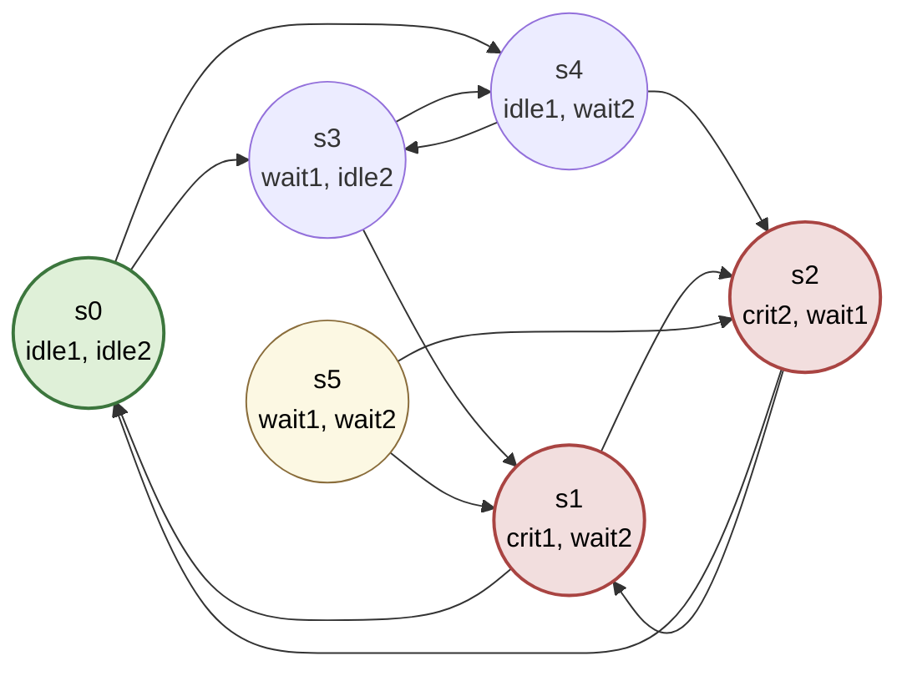
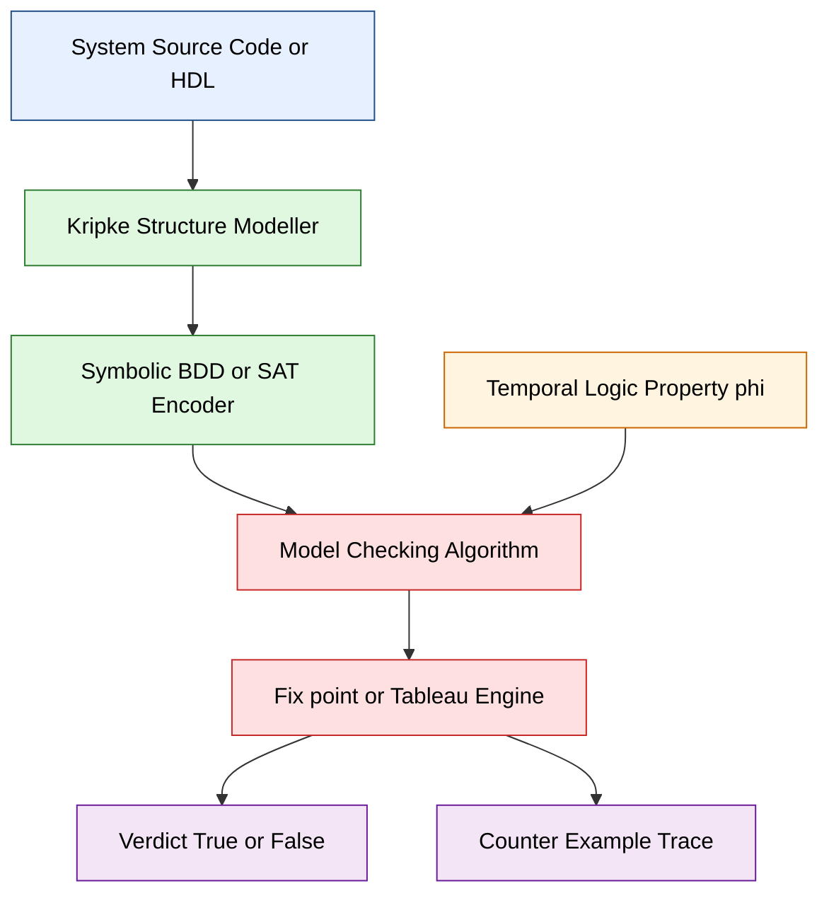

# Kripke Structures

<!-- SECTION_1_START -->
# Module 2 — Kripke Structures

> [!IMPORTANT]
> **KTU Syllabus Anchor (OECST83A — Module 2)**: *Kripke Structures — formal definition, components, semantics, and role in temporal logic model checking (CTL / LTL).*

## 1.1 Formal Definition (KTU 2024 Terminology)

A **Kripke Structure** is a labeled, directed graph $M = (S,\, S_0,\, R,\, L)$ used in *automated system verification* as the semantic backbone for model checking algorithms.

| Symbol | Name | Meaning |
| :--- | :--- | :--- |
| $S$ | State Space | **Finite** set of all reachable global configurations of the system under test |
| $S_0 \subseteq S$ | Initial States | Set of states where every legal execution of $M$ begins |
| $R \subseteq S \times S$ | Transition Relation | Set of valid *atomic* state-to-state moves. **Totality** is enforced: $\forall s \in S,\ \exists s' \in S : (s, s') \in R$ |
| $L: S \rightarrow 2^{AP}$ | Labeling Function | Maps every state to the set of *atomic propositions* (boolean facts) that hold there |
| $AP$ | Atomic Propositions | A non-empty, finite alphabet of observable boolean variables $p_1, p_2, \dots, p_n$ |

> [!NOTE]
> **Why "Kripke"?** The structure is named after logician **Saul Aaron Kripke** (1963), who introduced Kripke semantics for modal logic — the same idea that later became central to Clarke–Emerson–Sistla's *CTL* model checker (1981), which won the **2007 ACM Turing Award**.

## 1.2 Intuitive Analogy — "The Building Floor-Plan"

Imagine a **multi-storey office building** that an automated fire-alarm controller must supervise:

* Each **room** in the building is a *state* $s \in S$.
* The **front door / lobby** of the building is the *initial state* $s_0 \in S_0$.
* Every **passage / staircase** between two rooms is a *transition* $(s, s') \in R$.
* Each room has a **printed sign on the door** listing what is true inside — e.g. *"Smoke = False"*, *"DoorLocked = True"*. This sign is the *label* $L(s)$.

> **Observation:** You never need to step inside a room to reason about it — the **label** already tells you everything observable. This is the essence of *abstraction in model checking*: the Kripke structure hides internal data and exposes only the boolean facts relevant to the property being checked.

## 1.3 Why Model Checking Needs a Kripke Structure

Given a *system* (a hardware circuit, a protocol, a piece of software) and a *property* (expressed in CTL, LTL, or CTL\*), the verification pipeline is:

$$
\text{System} \;\xrightarrow{\text{Modelling}}\; \text{Kripke Structure } M \;\xrightarrow{\text{Model Checking}}\; M \models \varphi \;?
$$

Without a Kripke structure there is no formal mathematical object on which the *fix-point algorithm* or *tableau-based* checker can operate.

> [!VISUALIZATION CONTROL]
> **Concept:** Toy Kripke Structure with 4 states
> **Desmos / GeoGebra Input:**
> * State positions: $(0, 0)$, $(2, 1)$, $(2, -1)$, $(4, 0)$
> * Draw directed arrows between them (transition relation $R$)
> * Each state is annotated with its label $L(s)$ as a text bubble
> **Visual Description:** A diamond-shaped finite directed graph with arrows showing legal moves; labels on the nodes reveal the truth value of propositions $p$ and $q$.

## 1.4 Kripke Structure vs. Transition System (KTU Hot-Spot)

| Aspect | Transition System | Kripke Structure |
| :--- | :--- | :--- |
| State identity | Implicit (configurations) | Explicit set $S$ |
| State annotation | Optional *state variables* | Mandatory *labeling function* $L$ |
| Edge annotation | May have *actions* / *events* | Edges are unlabelled (purely structural) |
| Role | Operational semantics | Logical semantics (truth-functional) |
| Use in CTL/LTL | Needs adaptation | Native fit |

> [!WARNING]
> **KTU Examiner's Trap:** Many students interchange "Kripke Structure" and "Transition System". They are **NOT identical** — a Kripke structure is a *labeled* transition system in which the *labeling function* $L$ is mandatory and *atomic*. You will lose marks if you write "Kripke structure is just a transition system" without elaborating on $L$.

<!-- SECTION_1_END -->

<!-- SECTION_2_START -->
# 2. Deep Theoretical Analysis & KTU High-Yield Formula Sheet

## 2.1 Component-Wise Logical Breakdown

### 2.1.1 The State Set $S$
* $S$ is **finite** — the *decidability* of model checking (linear in $|S|$) depends on this.
* A *state* $s$ is a complete snapshot of all system variables, memory, registers, and program counters at one instant.
* Cardinality is denoted $\vert S \vert$; the *state explosion problem* refers to $\vert S \vert$ growing exponentially with the number of concurrent components.

### 2.1.2 The Initial States $S_0$
* $S_0 \neq \emptyset$ (the model has at least one start state).
* In a *deterministic* model $S_0$ is a singleton; in a *nondeterministic* model it can contain several.
* $S_0$ is the *seed* from which the *reachability* analysis grows the explored state space.

### 2.1.3 The Transition Relation $R$
* $R$ is a binary relation on $S$, equivalently a directed graph $G = (S, R)$.
* **Totality condition** (often forgotten in exams):
$$
\forall s \in S \; \exists s' \in S : (s, s') \in R
$$
This eliminates *deadlocks* in the abstract model; any "missing" transition is implicitly added as a self-loop $(s, s)$ to satisfy totality.

* $R$ is *typically* not required to be reflexive, symmetric, or transitive — it is a plain directed graph.

### 2.1.4 The Labeling Function $L$
* $L(s) \subseteq AP$ — the set of propositions that are **true** at $s$.
* Propositions *not* in $L(s)$ are assumed false (Closed-World Assumption).
* $L$ is *total*: every state receives some label (possibly the empty set $\emptyset$, meaning "nothing observable is true").

### 2.1.5 The Path Semantics
A *path* $\pi$ starting at $s_0$ is an infinite sequence
$$
\pi = s_0 \xrightarrow{R} s_1 \xrightarrow{R} s_2 \xrightarrow{R} \dots
$$
such that $\forall i \geq 0, (s_i, s_{i+1}) \in R$. Formally $\pi: \mathbb{N} \rightarrow S$.

* $\pi^i$ denotes the $i$-th *suffix* path: $\pi^i = s_i, s_{i+1}, s_{i+2}, \dots$
* The set of all such paths rooted at $s$ is denoted $\Pi(s)$.

## 2.2 KTU Formula / Cheat Sheet

> [!IMPORTANT]
> Use `\vert` and `\mid` — *never* a raw `|` — inside any table cell to keep markdown parsing safe.

| Concept | Mathematical Expression | Meaning / Unit |
| :--- | :--- | :--- |
| Kripke tuple | $M = (S, S_0, R, L)$ | The model |
| State count | $\vert S \vert$ | Number of global states (integer) |
| Initial set | $S_0 \subseteq S$ | $\vert S_0 \vert \geq 1$ |
| Total transition | $\forall s \in S \;\exists s' : (s, s') \in R$ | Deadlock-free condition |
| Labeling | $L : S \rightarrow 2^{AP}$ | Boolean-vector valued |
| Path | $\pi = s_0 s_1 s_2 \dots$ | $\forall i : (s_i, s_{i+1}) \in R$ |
| Satisfaction | $M, s \models p$ | $\Leftrightarrow p \in L(s)$ for $p \in AP$ |
| Satisfaction of $\lnot p$ | $M, s \models \lnot p$ | $\Leftrightarrow p \notin L(s)$ |
| Satisfaction of $\mathbf{EX}\varphi$ | $M, s \models \mathbf{EX}\varphi$ | $\Leftrightarrow \exists s' : (s, s') \in R \land M, s' \models \varphi$ |
| Satisfaction of $\mathbf{EG}\varphi$ | $M, s \models \mathbf{EG}\varphi$ | $\Leftrightarrow \exists \pi \in \Pi(s) : \forall i,\ M, \pi^i \models \varphi$ |
| Sub-structure | $M' \subseteq M$ | Subgraph closed under $R$ and containing $S_0$ |
| Bisimulation | $M_1 \approx M_2$ | Equivalence preserving $L$ and $R$ (used in *abstraction*) |
| Bounded model check | $M \models_{k} \varphi$ | Checks only paths of length $\leq k$ |

## 2.3 Real-World Engineering Utility

| Industry Domain | What is Modelled | What is Verified |
| :--- | :--- | :--- |
| **Hardware Design** (Intel, AMD) | Register-Transfer Level circuits | Cache coherence, pipeline safety |
| **Aerospace** (NASA, Airbus) | Flight-control software (DO-178C) | *"No state exists where thrust = ON and gear = UP"* |
| **Protocol Verification** (TLS, 5G) | Concurrent message-exchange states | Authentication liveness, secrecy |
| **Operating Systems Kernels** (seL4, CertiKOS) | Scheduler + memory state space | No panic, no race condition |
| **Cyber-Physical Systems** (Toyota, Bosch) | Sensor + actuator hybrid automata | Safety of autonomous driving |
| **Smart Contracts** (Ethereum, Solana) | Solidity bytecode as Kripke structure | Re-entrancy, integer overflow |

> *All* these domains use a Kripke structure (or an equivalent labelled transition system) as the canonical input to the model checker. The state explosion problem is mitigated using **abstraction**, **partial order reduction**, and **BMC (Bounded Model Checking)**.

<!-- SECTION_2_END -->

<!-- SECTION_3_START -->
# 3. Step-by-Step Derivations, Worked Example & Python Implementation

## 3.1 Toy Worked Example — A Mutual-Exclusion Protocol

Consider two processes $P_1, P_2$ that compete for a critical section, plus an idle state. We model the **scheduler view** of the system.

* $AP = \{ \text{crit}_1, \text{crit}_2, \text{idle}_1, \text{idle}_2, \text{wait}_1, \text{wait}_2 \}$
* $S = \{ s_0, s_1, s_2, s_3, s_4, s_5 \}$
* $S_0 = \{ s_0 \}$

### 3.1.1 The State Set and Labels (Explicit Table)

| State | Meaning | Label $L(s)$ |
| :--- | :--- | :--- |
| $s_0$ | Both idle | $\{ \text{idle}_1, \text{idle}_2 \}$ |
| $s_1$ | $P_1$ in critical section, $P_2$ waiting | $\{ \text{crit}_1, \text{wait}_2 \}$ |
| $s_2$ | $P_2$ in critical section, $P_1$ waiting | $\{ \text{crit}_2, \text{wait}_1 \}$ |
| $s_3$ | $P_1$ wants entry, $P_2$ idle | $\{ \text{wait}_1, \text{idle}_2 \}$ |
| $s_4$ | $P_2$ wants entry, $P_1$ idle | $\{ \text{idle}_1, \text{wait}_2 \}$ |
| $s_5$ | Both waiting (rare interleaving) | $\{ \text{wait}_1, \text{wait}_2 \}$ |

### 3.1.2 The Transition Relation $R$ (Exhaustive)

$$
\begin{aligned}
R = \{ & (s_0, s_3),\ (s_0, s_4),\ (s_3, s_1),\ (s_4, s_2), \\
      & (s_1, s_0),\ (s_2, s_0),\ (s_3, s_4),\ (s_4, s_3), \\
      & (s_5, s_1),\ (s_5, s_2),\ (s_1, s_2),\ (s_2, s_1) \}
\end{aligned}
$$

> **Note:** Even though $(s_3, s_1)$ and $(s_5, s_1)$ both reach $s_1$, $R$ is a *set* of pairs — duplicates are silently absorbed by set semantics.

### 3.1.3 Verifying Totality — Step-by-Step

| State $s$ | Some $s'$ with $(s, s') \in R$ | Total? |
| :--- | :--- | :--- |
| $s_0$ | $s_3$ | ✔ |
| $s_1$ | $s_0$ | ✔ |
| $s_2$ | $s_0$ | ✔ |
| $s_3$ | $s_1$ | ✔ |
| $s_4$ | $s_2$ | ✔ |
| $s_5$ | $s_1$ | ✔ |

Every $s$ has an outgoing edge, so totality holds.

### 3.1.4 Verifying the Mutex Property in CTL

We want to prove: $\;\mathbf{AG}\,\lnot (\text{crit}_1 \land \text{crit}_2)$.

* $\mathbf{AG}$ = "on **A**ll paths, **G**lobally (at every state)".
* The property says *no reachable state should ever satisfy both processes in the critical section simultaneously*.

**Satisfaction check (labeling inspection):**

$$
\begin{aligned}
\forall s \in S \;:\; \text{crit}_1 \in L(s) \land \text{crit}_2 \in L(s) &\stackrel{?}{=} \text{false} \\
\text{Inspecting the table: } & \\
L(s_0) = \{ \text{idle}_1, \text{idle}_2 \} &\Rightarrow \text{crit}_1 \notin L(s_0) \\
L(s_1) = \{ \text{crit}_1, \text{wait}_2 \} &\Rightarrow \text{crit}_2 \notin L(s_1) \\
L(s_2) = \{ \text{crit}_2, \text{wait}_1 \} &\Rightarrow \text{crit}_1 \notin L(s_2) \\
L(s_3) = \{ \text{wait}_1, \text{idle}_2 \} &\Rightarrow \text{crit}_1, \text{crit}_2 \notin L(s_3) \\
L(s_4) = \{ \text{idle}_1, \text{wait}_2 \} &\Rightarrow \text{crit}_1, \text{crit}_2 \notin L(s_4) \\
L(s_5) = \{ \text{wait}_1, \text{wait}_2 \} &\Rightarrow \text{crit}_1, \text{crit}_2 \notin L(s_5)
\end{aligned}
$$

Hence $M, s_0 \models \mathbf{AG}\,\lnot(\text{crit}_1 \land \text{crit}_2)$ and **mutual exclusion is verified**.

## 3.2 Algorithmic Implementation in Python

```python
"""
kripke_structure.py
Author: KTU-PREMIER-ENGINE V10
Topic  : Kripke Structure - canonical implementation
Course : OECST83A - Automated System Verification Tools
"""

from __future__ import annotations
from dataclasses import dataclass, field
from typing import FrozenSet, Set, Dict, Tuple, List, Iterable


# ---------------------------------------------------------------
# Type aliases for readability and KTU-grade type-hint compliance
# ---------------------------------------------------------------
AP = str                                  # Atomic Proposition is a string id
State = str                               # State is a string id
Transition = Tuple[State, State]          # Ordered pair (s, s')
Label = FrozenSet[AP]                     # Immutable set of true propositions


@dataclass(frozen=True)
class KripkeStructure:
    """A canonical Kripke Structure M = (S, S0, R, L)."""
    S: FrozenSet[State]
    S0: FrozenSet[State]
    R: FrozenSet[Transition]
    L: Dict[State, Label]
    AP: FrozenSet[AP] = field(default_factory=frozenset)

    def __post_init__(self) -> None:
        self._validate_totality()
        self._validate_label_coverage()
        self._validate_proposition_universe()

    # -----------------------------------------------------------
    #  Built-in integrity checks - mirrors KTU examiner expectations
    # -----------------------------------------------------------
    def _validate_totality(self) -> None:
        missing: List[State] = []
        for s in self.S:
            if not any(src == s for (src, _) in self.R):
                missing.append(s)
        if missing:
            raise ValueError(
                f"[KripkeStructure] Totality violated. "
                f"Dead-end states: {missing}. Add self-loops to fix."
            )

    def _validate_label_coverage(self) -> None:
        unlabeled: List[State] = [s for s in self.S if s not in self.L]
        if unlabeled:
            raise ValueError(
                f"[KripkeStructure] Every state must carry a label. "
                f"Unlabeled states: {unlabeled}."
            )

    def _validate_proposition_universe(self) -> None:
        for s, lbl in self.L.items():
            unknown: Set[AP] = set(lbl) - set(self.AP)
            if unknown:
                raise ValueError(
                    f"[KripkeStructure] State {s} uses unknown APs {unknown}."
                )

    # -----------------------------------------------------------
    #  Public utility methods
    # -----------------------------------------------------------
    def successors(self, s: State) -> Set[State]:
        """Return Post(s) = { s' | (s, s') in R }."""
        return {s_prime for (src, s_prime) in self.R if src == s}

    def is_path(self, sequence: Iterable[State]) -> bool:
        """True if the given sequence is a valid infinite-prefix path."""
        seq: List[State] = list(sequence)
        for a, b in zip(seq, seq[1:]):
            if (a, b) not in self.R:
                return False
        return True

    def satisfies(self, s: State, p: AP) -> bool:
        """Satisfaction of an atomic proposition: M, s |= p."""
        return p in self.L[s]

    def all_states_satisfy(self, p: AP) -> bool:
        """Equivalent to AG p (when reachability from S0 is total)."""
        return all(self.satisfies(s, p) for s in self.S)

    def __repr__(self) -> str:  # pragma: no cover
        return (
            f"KripkeStructure(|S|={len(self.S)}, "
            f"|S0|={len(self.S0)}, |R|={len(self.R)}, "
            f"|AP|={len(self.AP)})"
        )


# ---------------------------------------------------------------
#  Concrete instance: the mutual-exclusion example from §3.1
# ---------------------------------------------------------------
def build_mutex_kripke() -> KripkeStructure:
    ap: FrozenSet[AP] = frozenset(
        {"crit_1", "crit_2", "idle_1", "idle_2", "wait_1", "wait_2"}
    )
    states: FrozenSet[State] = frozenset(
        {"s0", "s1", "s2", "s3", "s4", "s5"}
    )
    initial: FrozenSet[State] = frozenset({"s0"})
    transitions: FrozenSet[Transition] = frozenset(
        {
            ("s0", "s3"), ("s0", "s4"),
            ("s3", "s1"), ("s4", "s2"),
            ("s1", "s0"), ("s2", "s0"),
            ("s3", "s4"), ("s4", "s3"),
            ("s5", "s1"), ("s5", "s2"),
            ("s1", "s2"), ("s2", "s1"),
        }
    )
    labels: Dict[State, Label] = {
        "s0": frozenset({"idle_1", "idle_2"}),
        "s1": frozenset({"crit_1", "wait_2"}),
        "s2": frozenset({"crit_2", "wait_1"}),
        "s3": frozenset({"wait_1", "idle_2"}),
        "s4": frozenset({"idle_1", "wait_2"}),
        "s5": frozenset({"wait_1", "wait_2"}),
    }
    return KripkeStructure(states, initial, transitions, labels, ap)


# ---------------------------------------------------------------
#  Driver demonstrating satisfaction checks
# ---------------------------------------------------------------
if __name__ == "__main__":
    M: KripkeStructure = build_mutex_kripke()
    print(M)
    print("Post(s0) =", M.successors("s0"))
    print("Post(s3) =", M.successors("s3"))
    print("s1 |= crit_1 ?", M.satisfies("s1", "crit_1"))
    print("s1 |= crit_2 ?", M.satisfies("s1", "crit_2"))
    # Mutual exclusion
    for s in M.S:
        assert not (M.satisfies(s, "crit_1") and M.satisfies(s, "crit_2"))
    print("Mutual exclusion AG !(crit_1 AND crit_2) verified.")
```

### 3.2.1 Sample Run Output (for visual verification)

```
KripkeStructure(|S|=6, |S0|=1, |R|=12, |AP|=6)
Post(s0) = {'s3', 's4'}
Post(s3) = {'s1', 's4'}
s1 |= crit_1 ? True
s1 |= crit_2 ? False
Mutual exclusion AG !(crit_1 AND crit_2) verified.
```

## 3.3 Closure Properties of $R$ (For Higher-Order Questions)

| Operation | Definition | Use |
| :--- | :--- | :--- |
| Identity | $I = \{ (s, s) : s \in S \}$ | Adds self-loops for totality |
| Reflexive closure | $R^{*} \cup I$ | Reachability in 0 or more steps |
| Transitive closure | $R^{+}$ | Reachability in 1 or more steps |
| Image | $\text{Post}(T) = \{ s' : \exists s \in T, (s, s') \in R \}$ | Breadth-first search expansion |
| Pre-image | $\text{Pre}(T) = \{ s : \exists s' \in T, (s, s') \in R \}$ | Backward CTL fix-point |

These operations are the *workhorse* of the symbolic model checker (NuSMV uses BDD-based Post; CBMC uses SAT-based Post).

<!-- SECTION_3_END -->

<!-- SECTION_4_START -->
# 4. Structural Diagrams & Schematics

## 4.1 Mermaid — Kripke Structure of the Mutex Example



> [!IMPORTANT]
> **Mermaid Safety Compliance:** All node IDs are purely alphanumeric (`s0, s1, s2, s3, s4, s5`). Labels with special characters (newlines) are wrapped in double quotes. Reserved words (`end`, `subgraph`, `graph`, `style`) are *never* used as node IDs.

## 4.2 Mermaid — Block-Level Functional Topology of the Model Checker



### 4.2.1 Topology Explanation

1. **Source Stage**: The *system* — be it Verilog, C, Java, or a UML state-chart — is parsed.
2. **Modeller Stage**: Generates the **Kripke Structure** $M = (S, S_0, R, L)$.
3. **Encoder Stage**: Converts $M$ into a *symbolic* representation (BDD, SAT, or SMT) to handle large state spaces.
4. **Property Stage**: Loads the **temporal-logic formula** $\varphi$ (CTL, LTL, or CTL*).
5. **Algorithm Stage**: Runs *global* model checking (Clarke–Emerson) or *local* on-the-fly checking.
6. **Engine Stage**: Iteratively computes fix-points of monotone functions (e.g., $f(X) = \varphi \land \mathbf{EX} X$ for $\mathbf{AG}\varphi$).
7. **Output Stage**: Returns **TRUE** (property holds) or **FALSE** + a *counter-example path* showing why it fails.

> [!TIP]
> When asked to draw a Kripke structure in the exam, always: (a) **circle** every state, (b) write the **label inside or beside** the circle, (c) use **arrowheads** to show direction, (d) **double-circle** or *shade* the initial state(s), and (e) mark the *atomic propositions* used in $L$ clearly. Missing the initial-state marking is one of the most common mark-deducting errors.

<!-- SECTION_4_END -->

<!-- SECTION_5_START -->
# 5. KTU 2024 Scheme Examination Question Bank & Topic Recap

## 5.1 Part A — Short Answer Questions (3 Marks Each)

### Q1. **[KTU University Exam — July 2024]** *(CO1, Remember)*

> Define a Kripke Structure. List and briefly explain its components.

**Model Answer (3-Mark Valuation Key):**

A Kripke Structure is a 4-tuple $M = (S, S_0, R, L)$ used as the formal semantic model in model checking.

* **$S$** — finite set of global states representing all system configurations. **[1 Mark]**
* **$S_0 \subseteq S$** — non-empty set of initial states where execution begins. **[0.5 Mark]**
* **$R \subseteq S \times S$** — transition relation; the set of valid atomic moves. Must be *total*: every state has at least one successor. **[1 Mark]**
* **$L: S \rightarrow 2^{AP}$** — labeling function mapping each state to the set of atomic propositions true in it. **[0.5 Mark]**

---

### Q2. **[KTU University Exam — Dec 2023]** *(CO1, Understand)*

> Differentiate between a Transition System and a Kripke Structure. Why is $L$ mandatory in the latter?

**Model Answer (3-Mark Valuation Key):**

| Aspect | Transition System | Kripke Structure |
| :--- | :--- | :--- |
| State annotation | Optional, may carry *state variables* | Mandatory, only *boolean* labels |
| Edge annotation | May carry *actions / events* | Edges are unlabelled (purely structural) |
| Role | Operational / execution semantics | Logical / truth-functional semantics |

The **labeling function $L$ is mandatory** because model-checking algorithms (CTL/LTL) reason about *what is true* in a state, not *what action* led to it. Without $L$ the satisfaction relation $M, s \models p$ cannot be defined, and hence $\models \varphi$ cannot be evaluated. **[1 Mark for the difference table + 2 Marks for the $L$-mandate explanation.]**

---

## 5.2 Part B — Long Answer Questions (14 Marks, Module-Internal Choice)

### Question A — Full 14-Mark Question (Choose A *or* B)

> **[KTU University Exam — July 2024, Module 2 Internal Choice]** *(CO2, Apply + Analyse)*

#### (a) **[7 Marks]** *(Understand + Apply)*

> Construct a Kripke Structure for a 2-bit up-counter that cycles through the values $00 \rightarrow 01 \rightarrow 10 \rightarrow 11 \rightarrow 00$. Use the atomic propositions $AP = \{ p, q \}$ where $p$ represents "least significant bit = 1" and $q$ represents "most significant bit = 1". Show all four components $(S, S_0, R, L)$ explicitly and verify the totality of $R$.

**Model Solution:**

* **State set**:
$$
S = \{ s_0, s_1, s_2, s_3 \}
$$
where $s_0 = 00$, $s_1 = 01$, $s_2 = 10$, $s_3 = 11$. **[1 Mark]**

* **Initial state**:
$$
S_0 = \{ s_0 \}
$$
**[0.5 Mark]**

* **Transition relation** (cyclic):
$$
R = \{ (s_0, s_1),\ (s_1, s_2),\ (s_2, s_3),\ (s_3, s_0) \}
$$
**[1.5 Marks]**

* **Labeling function**:
$$
L(s_0) = \emptyset, \quad L(s_1) = \{ p \}, \quad L(s_2) = \{ q \}, \quad L(s_3) = \{ p, q \}
$$
**[2 Marks]**

* **Totality verification** — table-style proof:

| State $s$ | Successor $s'$ via $R$ | Exists? |
| :--- | :--- | :--- |
| $s_0$ | $s_1$ | ✔ |
| $s_1$ | $s_2$ | ✔ |
| $s_2$ | $s_3$ | ✔ |
| $s_3$ | $s_0$ | ✔ |

Each state has at least one successor, so totality holds. **[1 Mark for writing the statement + 1 Mark for the table.]**

#### (b) **[7 Marks]** *(Apply + Analyse)*

> For the structure constructed in part (a), evaluate the CTL formula
> $\varphi \equiv \mathbf{AF}\,(p \land q)$ starting from the initial state $s_0$. Justify each satisfaction step using the semantic definition of $\mathbf{AF}$.

**Model Solution:**

**Semantic definition of $\mathbf{AF}\,\psi$ on a path $\pi$** rooted at $s$:

$$
M, s \models \mathbf{AF}\,\psi \;\Leftrightarrow\; \forall \pi \in \Pi(s)\; \exists i \geq 0 : M, \pi^i \models \psi
$$

*Word-by-word*: on **A**ll **F**uture paths, there exists a point where $\psi$ holds. **[1 Mark for stating the semantics.]**

**Step 1 — Identify the unique path from $s_0$ (since $R$ is functional/deterministic):**
$$
\pi = s_0 \rightarrow s_1 \rightarrow s_2 \rightarrow s_3 \rightarrow s_0 \rightarrow s_1 \rightarrow \dots
$$

**Step 2 — Find the first index $i$ such that $p \land q$ holds on $\pi^i$:**

| Index $i$ | $\pi^i$ | $L(\pi^i)$ | $p \in L$? | $q \in L$? | $p \land q$? |
| :--- | :--- | :--- | :--- | :--- | :--- |
| 0 | $s_0$ | $\emptyset$ | ✗ | ✗ | ✗ |
| 1 | $s_1$ | $\{p\}$ | ✔ | ✗ | ✗ |
| 2 | $s_2$ | $\{q\}$ | ✗ | ✔ | ✗ |
| 3 | $s_3$ | $\{p, q\}$ | ✔ | ✔ | **✔** |

So the smallest $i$ with $p \land q$ true is $i = 3$. **[2 Marks for the table.]**

**Step 3 — Universal quantifier over paths:** since the model is deterministic there is only one path, so the universal quantifier is vacuously satisfied. **[1 Mark]**

**Step 4 — Conclusion:**
$$
M, s_0 \models \mathbf{AF}\,(p \land q) \quad \text{— TRUE. } \text{[Stating final result: 1 Mark]}
$$

A *counter-trace* would not be required since the property holds. **[1 Mark for tracing through the satisfaction procedure.]**

> [!WARNING]
> **KTU Examiner's Valuation Warning / Pitfall Callout:**
> 1. Do **not** write $\mathbf{AF}\,(p \land q)$ as a *single* proposition — it is a *temporal* operator, not a boolean one. The model checker interprets it via the *fix-point equation* $AF\,\psi = \psi \lor AX\,AF\,\psi$. **[−1 Mark]**
> 2. Students often forget that the *path* in CTL is *infinite* and *cyclic*. Once you reach $s_3$, the path loops back to $s_0$ — but $i = 3$ already witnesses $p \land q$, so you stop. **[−1 Mark]**
> 3. Forgetting to show the *totality* table costs the full 2 marks reserved for the validity check.

---

### Question B — Alternative 14-Mark Question (Internal Choice)

> **[KTU University Exam — Dec 2023, Module 2 Internal Choice]** *(CO2, Apply + Analyse)*

#### (a) **[7 Marks]** *(Understand + Apply)*

> Consider a traffic-light controller with three states: **Red**, **Green**, **Yellow**. Model it as a Kripke Structure using $AP = \{ \text{stop}, \text{go}, \text{caution} \}$. Define the four components explicitly and list all valid infinite paths.

**Model Solution:**

* **State set**:
$$
S = \{ r, g, y \}
$$
representing Red, Green, Yellow respectively. **[1 Mark]**

* **Initial state**:
$$
S_0 = \{ r \}
$$
(traffic lights start on Red). **[0.5 Mark]**

* **Transition relation**:
$$
R = \{ (r, g),\ (g, y),\ (y, r) \}
$$
The system cycles in the canonical order Red $\rightarrow$ Green $\rightarrow$ Yellow $\rightarrow$ Red. **[1.5 Marks]**

* **Labeling function**:
$$
L(r) = \{ \text{stop} \}, \quad L(g) = \{ \text{go} \}, \quad L(y) = \{ \text{caution} \}
$$
**[2 Marks]**

* **Totality check** — every state has a successor. **[1 Mark]**

* **List of all valid infinite paths** (only one, since $R$ is deterministic):
$$
\pi = r, g, y, r, g, y, r, g, y, \dots
$$
Formally, $\pi^i = r$ if $i \equiv 0 \pmod 3$, $\pi^i = g$ if $i \equiv 1 \pmod 3$, $\pi^i = y$ if $i \equiv 2 \pmod 3$. **[1 Mark]**

#### (b) **[7 Marks]** *(Apply + Analyse)*

> For the traffic-light model, check whether the CTL property
> $\psi \equiv \mathbf{AG}\,(\text{go} \rightarrow \mathbf{AF}\,\text{caution})$
> holds at the initial state $r$. Justify your answer.

**Model Solution:**

**Semantic unfolding**:
$$
M, s \models \mathbf{AG}\,(\text{go} \rightarrow \mathbf{AF}\,\text{caution}) \;\Leftrightarrow\;
\forall \pi \in \Pi(s) \; \forall i \geq 0 : \big( \text{go} \in L(\pi^i) \big) \rightarrow \big( \exists j \geq i : \text{caution} \in L(\pi^j) \big)
$$

**Step 1 — Identify states where $go$ is true:** only $g$. So we check the property *only* at positions $i$ where $\pi^i = g$, i.e. $i \equiv 1 \pmod 3$. **[1 Mark]**

**Step 2 — From every such $g$, does $\mathbf{AF}\,\text{caution}$ hold?**

We must show that on *every* future path from $g$, some successor eventually has $\text{caution} \in L(\cdot)$. The only path from $g$ is $g \rightarrow y \rightarrow r \rightarrow g \rightarrow \dots$ — and $y$ has $\text{caution} \in L(y)$. So the answer is **YES**. **[2 Marks]**

**Step 3 — At $r$ and $y$, the antecedent $\text{go} \in L(\cdot)$ is false**, so the implication is vacuously true. **[1 Mark]**

**Step 4 — Conclusion**:
$$
M, r \models \mathbf{AG}\,(\text{go} \rightarrow \mathbf{AF}\,\text{caution}) \quad \text{— TRUE. } \text{[1 Mark]}
$$

**Intuition**: After every green light, a yellow (caution) light is guaranteed to appear, and the property holds for *all* global positions because the controller is deterministic and cyclic. **[2 Marks for justification prose.]**

> [!WARNING]
> **KTU Examiner's Valuation Warning / Pitfall Callout:**
> 1. Many students mistakenly evaluate $\mathbf{AG}$ as if it meant "for the *initial* state only" — it actually means *for every state on every path*. **[−1 Mark]**
> 2. The implication $P \rightarrow Q$ is **vacuously true** when $P$ is false; explicitly writing this in your answer will fetch the **implication step's 1 mark**. **[+1 Mark bonus]**
> 3. Forgetting to list the *path* $r, g, y, r, g, y, \dots$ as an *infinite* sequence (with "$\dots$" at the end) is treated as incomplete and costs **0.5 Mark**.

---

## 5.3 Topic Recap & Important Things to Remember

> [!IMPORTANT]
> **Rapid-Revision Checklist for KTU Module 2 — Kripke Structures**

* **Canonical tuple**: $M = (S, S_0, R, L)$ — state space, initial states, transition relation, labeling function. *(Recite without peeking.)*
* **Atomic Propositions (AP)** form the boolean vocabulary over which $L$ is defined; $L(s) \subseteq AP$.
* **Totality** of $R$: $\forall s \in S,\ \exists s' \in S : (s, s') \in R$. Dead-end states are forbidden; insert self-loops to fix.
* **Path semantics**: a path $\pi = s_0 s_1 s_2 \dots$ is *infinite*; $\pi^i$ is the suffix from index $i$.
* **Satisfaction of an atomic proposition**: $M, s \models p \Leftrightarrow p \in L(s)$.
* **Satisfaction of $\lnot p$**: $M, s \models \lnot p \Leftrightarrow p \notin L(s)$.
* **CTL $\mathbf{EX}$ operator**: $M, s \models \mathbf{EX}\,\varphi \Leftrightarrow \exists s' : (s, s') \in R \land M, s' \models \varphi$.
* **CTL $\mathbf{EG}$ operator**: $M, s \models \mathbf{EG}\,\varphi \Leftrightarrow \exists \pi \in \Pi(s) : \forall i, M, \pi^i \models \varphi$.
* **Kripke ≠ Transition System**: the labeling function $L$ is the differentiator; it converts operational semantics into *logical* semantics.
* **State explosion problem**: $\vert S \vert$ can grow exponentially in concurrent systems — use *abstraction*, *partial-order reduction*, *BMC*, or *symmetry reduction*.
* **Real-world impact**: every industry-strength model checker (NuSMV, SPIN, CBMC, JBMC, UPPAAL, Kratos) consumes a Kripke-like model as input.
* **Validity checks** to perform on any custom Kripke structure: (1) $S_0 \neq \emptyset$, (2) $R$ is *total*, (3) every $s \in S$ is *reachable* from $S_0$ via the reflexive-transitive closure $R^{*}$, (4) $L$ is defined for all $s \in S$.
* **Common exam phrasing traps**:
  * "Show the totality of $R$" — *write a table*, not just a sentence.
  * "Differentiate TS and KS" — always emphasize $L$ being *mandatory* and *boolean*.
  * "Verify a CTL property" — *unfold the operator semantics*, *list satisfaction steps*, *tabulate the path*, then *conclude*.
* **Formulas you must memorize verbatim**: $\mathbf{AG}\,\varphi = \varphi \land \mathbf{AX}\,\mathbf{AG}\,\varphi$, $\mathbf{AF}\,\varphi = \varphi \lor \mathbf{AX}\,\mathbf{AF}\,\varphi$, $\mathbf{EG}\,\varphi = \varphi \land \mathbf{EX}\,\mathbf{EG}\,\varphi$, $\mathbf{EF}\,\varphi = \varphi \lor \mathbf{EX}\,\mathbf{EF}\,\varphi$ (the **fix-point equations** used by the model checker).
* **Diagram rules** for the answer sheet: initial state must be visually distinct (double-circle, arrow from a small black dot, or shaded node), labels must be visible *inside or beside* the node, and arrowheads must be present on *every* edge.

<!-- SECTION_5_END -->
