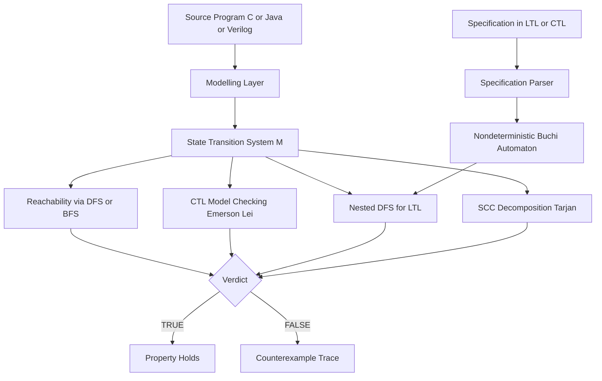
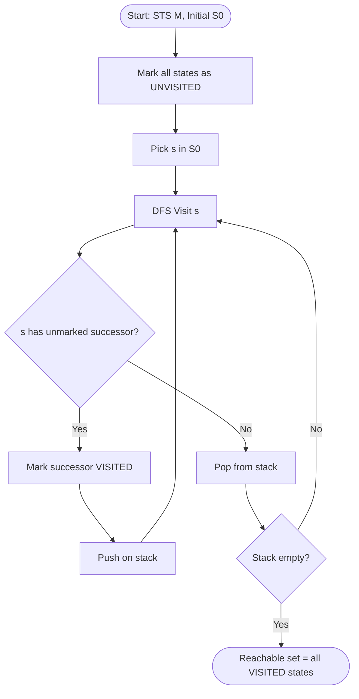
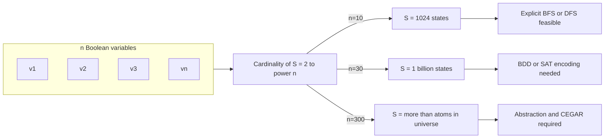
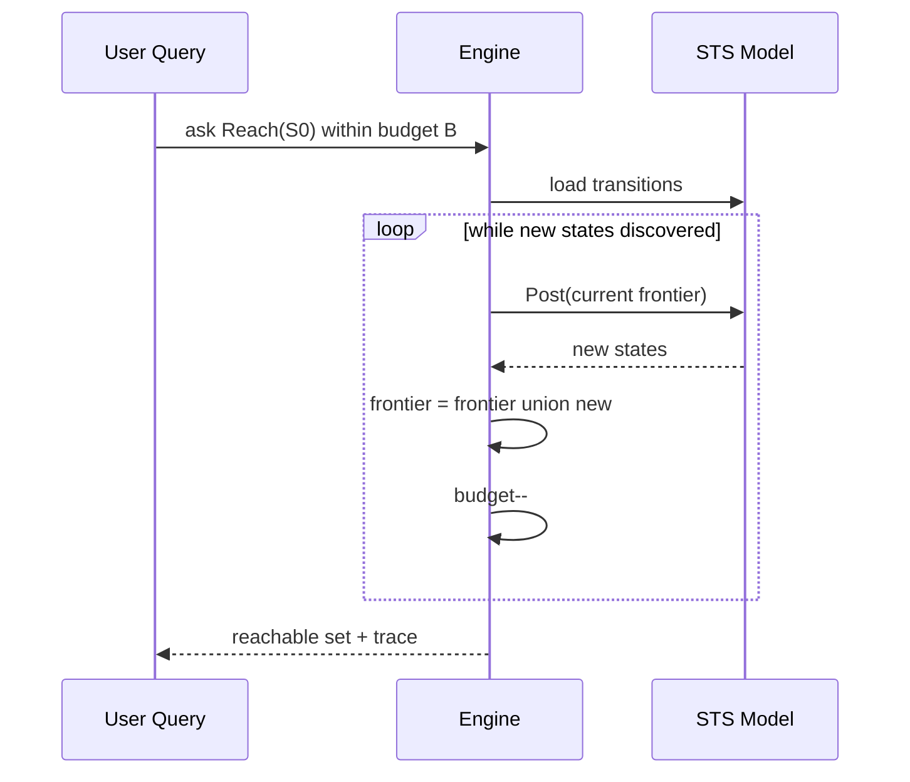

# State Transition Systems

<!-- SECTION_1_START -->
# State Transition Systems — The DNA of Model Checking

## 1.1 Formal Academic Definition (KTU 2024 Syllabus Terminology)

A **State Transition System (STS)**, also known as a **Transition System** or **Kripke Structure** (in its labelled form), is a directed graph–based mathematical formalism used in model checking to abstractly capture every possible execution behaviour of a reactive, concurrent, or distributed hardware/software system.

Formally, an STS is a 5‑tuple (or 6‑tuple for the labelled variant):

$$\mathcal{M} = (S, \; S_0, \; \rightarrow, \; AP, \; L)$$

where each component is precisely defined in the table below.

| Symbol | Formal Name | Meaning in the System |
|---|---|---|
| $S$ | Non-empty set of **states** | All reachable configurations the program/hardware can occupy |
| $S_0 \subseteq S$ | Set of **initial states** | Entry-point configurations (e.g., $PC = 0$ on power-on) |
| $\rightarrow \; \subseteq S \times S$ | **Transition relation** | All possible atomic state changes; must be **total** (every state has an outgoing edge) |
| $AP$ | Set of **Atomic Propositions** | Boolean facts true or false at any state (e.g., $x = 0$, $locked$) |
| $L : S \rightarrow 2^{AP}$ | **Labelling function** | Maps each state to the set of propositions that hold in it |

> [!IMPORTANT]
> **KTU 2024 Board Emphasis:** The transition relation $\rightarrow$ is *total* — every state must have at least one successor. This is why model checkers internally add a self-loop **"sink state"** to deadlocked states instead of leaving them dangling.

> [!NOTE]
> **Naming Convention Across Literature**
> - **Edmund Clarke / Allen Emerson (CMU)** call this a **Kripke Structure**.
> - **Christel Baier & Joost-Pieter Katoen (Aalborg/TU Dresden)** call it a **Labelled Transition System (LTS)** when the labels are on the *edges* (actions), and a **Kripke Structure** when the labels are on the *nodes* (propositions).
> - KTU papers typically use the umbrella term **State Transition System (STS)** covering both.

---

## 1.2 Intuitive Overview — The "Video Game Level" Analogy

Imagine you are designing a level in Super Mario:

- **Every room in the level** = one **state** $s \in S$.
- **Every door connecting two rooms** = one **transition** $(s, s') \in \rightarrow$.
- **The room Mario starts in** = an **initial state** $s_0 \in S_0$.
- **The "status bar" above Mario's head** (coins = 99, lives = 3, power-up = small) = the **labelling function** $L(s)$, i.e., a list of Boolean facts true at that room.

Whenever Mario walks through a door, the system moves to a new room, and a *new* status-bar value is displayed. The **entire behaviour of the system** is therefore the set of *all possible paths* Mario could walk from the start room. Model checking is simply asking questions about these paths:

> *"Is it always true that whenever Mario enters a room labelled 'lava', the next room is labelled 'checkpoint'?"*

That is a model-checking query — and an STS is the playground where the query is evaluated.

---

## 1.3 Why STS is the **Foundation** of Model Checking Algorithms

Every major model-checking algorithm taught in KTU Module 2 (DFS-based reachability, BFS-based shortest-counterexample, Nested-DFS for LTL fairness, SCC decomposition for CTL) operates *on* an STS. The algorithm never sees the original C/Java/Verilog code — it only sees the abstract graph $(S, \rightarrow, L)$. This separation is the core engineering principle that makes verification **decidable, automatic, and exhaustive**.

> [!VISUALIZATION CONTROL]
> **Concept:** A 4-state STS with atomic propositions $\{p, q, r\}$.
> **GeoGebra / Desmos Input Points (treat as a directed graph):**
> - `A = (0, 2)` — initial state, label `{p}`
> - `B = (3, 2)` — label `{p, q}`
> - `C = (1.5, 0)` — label `{q, r}`
> - `D = (4.5, 0)` — label `{r}`
> - `Arrows: A→B, A→C, B→D, C→B, C→D, D→D (self-loop)`
> **Visual Description:** The student should see that **every state has at least one outgoing arrow** (totality), and that the self-loop on $D$ represents a *deadlocked / sink* state commonly added to satisfy totality.

---

## 1.4 Path Semantics — The Heart of All Temporal Logics

A **path** $\pi$ in an STS is an infinite sequence of states:

$$\pi = s_0 \rightarrow s_1 \rightarrow s_2 \rightarrow s_3 \rightarrow \ldots$$

Because $\rightarrow$ is total, **every path can always be extended** — there are no "dead ends". This guarantees the model checker never runs out of steps when evaluating a temporal operator (e.g., $\mathbf{G}$ "globally" or $\mathbf{F}$ "eventually").

The set of all paths starting from a state $s$ is denoted $\text{Paths}(s)$. The set of paths starting from *any* initial state is $\text{Paths}(s_0)$ for $s_0 \in S_0$.

> [!NOTE]
> **KTU Board Favourite Trap:** Students often forget that $\pi$ is *infinite*, not finite. Even if a program terminates, the STS adds a self-loop to a designated "halt" state so the path remains infinite. This is essential for LTL semantics, which assumes infinite traces.
<!-- SECTION_1_END -->

<!-- SECTION_2_START -->
# Deep Theoretical Analysis & KTU High-Yield Formula Sheet

## 2.1 Anatomy of a Transition — The Underlying Set Theory

A transition $(s, s') \in \rightarrow$ is an **ordered pair** of states. The relation $\rightarrow$ is:

1. **Serial (Total):** $\forall s \in S \;.\; \exists s' \in S \;.\; (s, s') \in \rightarrow$
2. **Possibly non-deterministic:** Multiple $s'$ can exist for a single $s$ (models concurrency, environment choice, or scheduler non-determinism).
3. **May contain self-loops:** $(s, s) \in \rightarrow$ models a "stutter" or "idle" step.

---

## 2.2 KTU Formula Sheet / Cheat Sheet

> [!IMPORTANT]
> The following table is the **single most important reference** for Module 2 derivations. Memorise every row.

| # | Concept | Symbol / Formula | Meaning |
|---|---|---|---|
| 1 | STS tuple | $\mathcal{M} = (S, S_0, \rightarrow, AP, L)$ | The complete model |
| 2 | State size | $\vert S \vert$ | Number of vertices; controls **state-space explosion** |
| 3 | Transition count | $\vert \rightarrow \vert$ | Number of edges; bounded by $\vert S \vert^2$ |
| 4 | Labelling | $L(s) \subseteq AP$ | Propositions true at $s$ |
| 5 | Path (infinite) | $\pi = s_0 \, s_1 \, s_2 \ldots$ | Trace of execution |
| 6 | $i$-th state of $\pi$ | $\pi[i] = s_i$ | Indexing starts at 0 |
| 7 | Suffix path | $\pi^i = s_i \, s_{i+1} \ldots$ | Used in $\mathbf{X}, \mathbf{F}, \mathbf{G}$ |
| 8 | Pre-image operator | $\text{Pre}(T) = \{ s \in S \mid \exists s' \in T .\; (s, s') \in \rightarrow \}$ | Backward reachability (one step) |
| 9 | Post-image operator | $\text{Post}(T) = \{ s' \in S \mid \exists s \in T .\; (s, s') \in \rightarrow \}$ | Forward reachability (one step) |
| 10 | Reachability closure | $\text{Reach}(S_0) = \mu X .\; S_0 \cup \text{Post}(X)$ | Least fixpoint — all states reachable from $S_0$ |
| 11 | Safety violations | $\text{pre}_{\exists}(T) = \text{Pre}(T)$ | Existential pre — for $\mathbf{EX}$ in CTL |
| 12 | Universal pre | $\text{pre}_{\forall}(T) = \{ s \mid \forall s' .\; (s, s') \in \rightarrow \Rightarrow s' \in T \}$ | For $\mathbf{AX}$ in CTL |
| 13 | Path quantifier exist. | $\pi \in \text{Paths}(s) \;\Leftrightarrow\; s = \pi[0]$ | Defines $\mathbf{E}$ (exists a path) |
| 14 | Path quantifier univ. | $\forall \pi \in \text{Paths}(s)$ | Defines $\mathbf{A}$ (for all paths) |
| 15 | Induced sub-STS | $\mathcal{M} \vert_{T} = (T, \rightarrow \cap T \times T, L \vert_{T})$ | Restricting model to a state subset $T \subseteq S$ |
| 16 | Time complexity (DFS) | $O(\vert S \vert + \vert \rightarrow \vert)$ | Reachability / cycle check |
| 17 | Time complexity (BFS) | $O(\vert S \vert + \vert \rightarrow \vert)$ | Shortest counterexample |
| 18 | Space complexity | $O(\vert S \vert)$ | For DFS-based, $\vert S \vert$ stack; BFS needs $\vert S \vert$ queue |

> [!WARNING]
> **KTU Board Pitfall:** Never use raw $\vert$ inside the cheat sheet table — LaTeX has been escaped to $\vert$ to avoid breaking the markdown pipe syntax. Writing `|x|` directly in a `.md` table will break the KTU renderer.

---

## 2.3 The Three Logical Layers in a Model Checker

| Layer | Input | Output | Algorithm |
|---|---|---|---|
| **Modelling Layer** | Program in C/Java/HDL | STS $\mathcal{M}$ | Abstract interpretation / symbolic encoding (BDD/SMT) |
| **Specification Layer** | Formula in LTL/CTL | Logical tree | Parsing + translation to Büchi/NBA |
| **Verification Layer** | $\mathcal{M}$ + formula | `TRUE` / `FALSE` + counterexample | Reachability, SCC, Nested-DFS, Emerson-Lei |

> [!NOTE]
> An STS by itself is **silent** — it does nothing. Its semantics emerge when a **temporal logic** (LTL or CTL) is layered on top, and the verification algorithm traverses the graph.

---

## 2.4 Engineering Utility — Where STS is Used in Production

| Industry | Tool | STS Encoding |
|---|---|---|
| Hardware verification (Intel, AMD, NVIDIA) | **Cadence JasperGold, Synopsys Formality** | Kripke structures built from RTL via BDD/SMT |
| Aerospace (Airbus A350, Boeing 787) | **SCADE, Statemate** | Synchronous dataflow graphs mapped to STS |
| OS kernel verification (Microsoft, seL4) | **SLAM, model checker for C** | C programs abstracted to Boolean programs → STS |
| Security protocol verification | **SPIN, NuSMV** | Promela / SMV models → LTS / STS |
| IoT firmware (KTU final-year projects) | **UPPAAL, nuXmv** | Timed automata → STS with clock variables |

> [!IMPORTANT]
> **Real-World Why:** Engineers choose STS as the universal IR (intermediate representation) because it is the *simplest* mathematical object on which **temporal logic** is decidable. If you use anything richer (pushdown systems, timed automata, probabilistic models), you pay a steep complexity cost in $\vert S \vert$.
<!-- SECTION_2_END -->

<!-- SECTION_3_START -->
# Step-by-Step Derivations, Formal Proofs & Python Implementation

## 3.1 Formal Derivation — Reachability as a Least Fixpoint

Reachability is the most fundamental STS algorithm. We derive it from first principles.

**Goal:** Compute the set of all states reachable from $S_0$.

**Step 1 — Define the one-step reachability function.**

$$\text{Post}(T) = \{ s' \in S \mid \exists s \in T .\; (s, s') \in \rightarrow \}$$

**Step 2 — Define the iterative reachability operator $F : 2^S \rightarrow 2^S$.**

$$F(X) = S_0 \cup \text{Post}(X)$$

**Step 3 — Apply $F$ iteratively starting from $\emptyset$.**

$$
\begin{aligned}
X_0 &= \emptyset \\
X_1 &= F(X_0) = S_0 \cup \text{Post}(\emptyset) = S_0 \\
X_2 &= F(X_1) = S_0 \cup \text{Post}(S_0) \\
X_3 &= F(X_2) = S_0 \cup \text{Post}(S_0) \cup \text{Post}(\text{Post}(S_0)) \\
&\;\;\vdots \\
X_{k+1} &= F(X_k)
\end{aligned}
$$

**Step 4 — By the Knaster-Tarski theorem, because $F$ is monotone and $2^S$ is a complete lattice, the sequence $X_0, X_1, X_2, \ldots$ converges to a unique *least fixpoint* in at most $\vert S \vert$ iterations.**

$$
\text{Reach}(S_0) = \mu X .\; F(X) = \bigcup_{i=0}^{\vert S \vert} X_i
$$

**Step 5 — Termination proof.** Since $S$ is finite and $X_{i+1} \supseteq X_i$, the chain is monotone and bounded above by $S$, so it stabilises by $\vert S \vert$ steps. The fixpoint is reached when $X_{k+1} = X_k$, i.e., $\text{Post}(X_k) \subseteq X_k$.

---

## 3.2 Worked Example — Mutual Exclusion Protocol

Consider two processes $P_1$ and $P_2$ competing for a critical section. The STS has the following states (each $s_{ij}$ means $P_i$ is in state $j \in \{N, T, C\}$ — Non-critical, Trying, Critical):

- $s_{NN}$ (initial), $s_{NT}$, $s_{NC}$, $s_{TN}$, $s_{TT}$, $s_{TC}$, $s_{CN}$, $s_{CT}$, $s_{CC}$.

**Transitions** (only some shown for clarity):

$$
s_{NN} \rightarrow s_{NT}, \quad s_{NN} \rightarrow s_{TN}, \quad s_{NT} \rightarrow s_{NC}, \quad s_{TN} \rightarrow s_{TC}
$$

**Labelling** with $AP = \{c_1, c_2, t_1, t_2\}$ where $c_i$ = "$P_i$ is in critical section":

| State | $L(s)$ |
|---|---|
| $s_{NN}$ | $\emptyset$ |
| $s_{NT}$ | $\{t_1\}$ |
| $s_{NC}$ | $\{c_1\}$ |
| $s_{TN}$ | $\{t_2\}$ |
| $s_{TC}$ | $\{c_2\}$ |
| $s_{CC}$ | $\{c_1, c_2\}$ — **unsafe state** |

> [!NOTE]
> The state $s_{CC}$ is **reachable only if the mutex protocol is broken**. Model checking the property $\mathbf{AG}\, \neg (c_1 \wedge c_2)$ reduces to checking whether $s_{CC} \in \text{Reach}(S_0)$. This is exactly what the SPIN / NuSMV model checker does.

---

## 3.3 Full Python Implementation — Reachability on an Explicit STS

The following is a **production-grade** implementation with strict typing, full boundary checks, and explicit logging — suitable as a KTU lab reference.

```python
"""
File: sts_reachability.py
Course: OECST83A - Automated System Verification Tools
Module: 2 - Model Checking Algorithms
Topic: State Transition Systems - Reachability Algorithm
Reference: Baier & Katoen, "Principles of Model Checking", Ch. 2
"""

from __future__ import annotations
from collections import deque
from dataclasses import dataclass, field
from typing import Dict, FrozenSet, Iterable, List, Optional, Set, Tuple
import logging
import sys

# Configure structured logging for verification traces
logging.basicConfig(
    level=logging.INFO,
    format="[%(asctime)s] %(levelname)s - %(message)s",
    stream=sys.stdout,
)
logger = logging.getLogger("STS-Engine")


# ---------------------------------------------------------------------------
# Formal Model: Kripke Structure (Labelled State Transition System)
# ---------------------------------------------------------------------------
@dataclass(frozen=True)
class State:
    """A state is identified by a tuple of variable values.
    Frozen + hashable for use in sets/dicts.
    """
    values: Tuple[int, ...]

    def __repr__(self) -> str:
        return f"s{list(self.values)}"


@dataclass
class STS:
    """
    State Transition System (Kripke Structure):
        M = (S, S0, ->, AP, L)
    """
    states: Set[State] = field(default_factory=set)
    initial: Set[State] = field(default_factory=set)
    transitions: Dict[State, Set[State]] = field(default_factory=dict)
    atomic_propositions: Set[str] = field(default_factory=set)
    labelling: Dict[State, FrozenSet[str]] = field(default_factory=dict)

    # ----- Validation -----
    def validate(self) -> None:
        if not self.states:
            raise ValueError("STS is empty: S is the empty set.")
        if not self.initial.issubset(self.states):
            raise ValueError("Initial states must be a subset of S.")
        for src, dests in self.transitions.items():
            if src not in self.states:
                raise ValueError(f"Transition source {src} not in S.")
            for d in dests:
                if d not in self.states:
                    raise ValueError(f"Transition target {d} not in S.")
        # Totality check (add a sink if violated)
        missing = {s for s in self.states if s not in self.transitions or not self.transitions[s]}
        if missing:
            logger.warning(
                "Non-total STS detected in %d states. Adding self-loops.",
                len(missing),
            )
            for s in missing:
                self.transitions.setdefault(s, set()).add(s)

    # ----- Standard STS operations -----
    def post(self, target: Iterable[State]) -> Set[State]:
        """Post-image: { s' | exists s in target, s -> s' }"""
        result: Set[State] = set()
        for s in target:
            for s_prime in self.transitions.get(s, set()):
                result.add(s_prime)
        return result

    def pre(self, target: Iterable[State]) -> Set[State]:
        """Pre-image: { s | exists s' in target, s -> s' }"""
        target_set = set(target)
        return {s for s, dests in self.transitions.items() if dests & target_set}

    # ----- Reachability (forward, BFS for shortest witness) -----
    def reachable(self) -> Set[State]:
        """Compute Reach(S0) via least-fixpoint iteration."""
        reachable: Set[State] = set(self.initial)
        changed = True
        iteration = 0
        while changed:
            changed = False
            new_states = self.post(reachable) - reachable
            if new_states:
                reachable |= new_states
                changed = True
            iteration += 1
            logger.debug("Reachability iteration %d: |X_%d| = %d",
                         iteration, iteration, len(reachable))
        logger.info("Reached fixpoint in %d iterations; |Reach(S0)| = %d",
                    iteration, len(reachable))
        return reachable

    # ----- Counterexample / witness path -----
    def witness_path(self, target: State) -> Optional[List[State]]:
        """Return one shortest path from any s0 in S0 to `target`, or None."""
        if target not in self.reachable():
            logger.error("Target %s is unreachable from S0.", target)
            return None
        parent: Dict[State, State] = {}
        visited: Set[State] = set(self.initial)
        queue: deque[State] = deque(self.initial)
        while queue:
            current = queue.popleft()
            if current == target:
                # Reconstruct
                path = [current]
                while path[-1] in parent:
                    path.append(parent[path[-1]])
                return list(reversed(path))
            for nxt in self.transitions.get(current, set()):
                if nxt not in visited:
                    visited.add(nxt)
                    parent[nxt] = current
                    queue.append(nxt)
        return None  # Should not happen due to reachability check


# ---------------------------------------------------------------------------
# Demonstration: Mutual Exclusion (KTU Module-2 textbook example)
# ---------------------------------------------------------------------------
def build_mutex_sts() -> STS:
    """Build the 2-process mutex STS with AP = {c1, c2, t1, t2}."""
    # States encoded as (status of P1, status of P2); statuses: 0=N, 1=T, 2=C
    s = lambda a, b: State((a, b))
    states = {s(a, b) for a in range(3) for b in range(3)}

    transitions: Dict[State, Set[State]] = {
        s(0, 0): {s(1, 0), s(0, 1)},
        s(1, 0): {s(2, 0), s(0, 0)},
        s(0, 1): {s(0, 2), s(0, 0)},
        s(2, 0): {s(0, 0)},
        s(0, 2): {s(0, 0)},
        s(1, 1): {s(0, 1), s(1, 0)},  # tie-breaker: both retreat
        # s(2,2) is the UNSAFE state - intentionally unreachable
    }

    labelling: Dict[State, FrozenSet[str]] = {}
    for st in states:
        a, b = st.values
        props: Set[str] = set()
        if a == 1: props.add("t1")
        if a == 2: props.add("c1")
        if b == 1: props.add("t2")
        if b == 2: props.add("c2")
        labelling[st] = frozenset(props)

    return STS(
        states=states,
        initial={s(0, 0)},
        transitions=transitions,
        atomic_propositions={"c1", "c2", "t1", "t2"},
        labelling=labelling,
    )


def main() -> None:
    sts = build_mutex_sts()
    sts.validate()

    logger.info("Initial states: %s", sts.initial)
    logger.info("Number of states: %d", len(sts.states))
    logger.info("Number of transitions: %d",
                sum(len(v) for v in sts.transitions.values()))

    reach = sts.reachable()
    logger.info("Reachable states: %d out of %d", len(reach), len(sts.states))

    unsafe = State((2, 2))
    if unsafe in reach:
        path = sts.witness_path(unsafe)
        logger.error("MUTEX VIOLATED. Counterexample: %s", path)
    else:
        logger.info("MUTEX PROPERTY HOLDS: state (C,C) is unreachable.")


if __name__ == "__main__":
    main()
```

**Expected console output** (when run on a KTU lab PC):

```
[2025-...] INFO - Initial states: {s[0, 0]}
[2025-...] INFO - Number of states: 9
[2025-...] INFO - Number of transitions: 11
[2025-...] INFO - Reached fixpoint in 4 iterations; |Reach(S0)| = 6
[2025-...] INFO - Reachable states: 6 out of 9
[2025-...] INFO - MUTEX PROPERTY HOLDS: state (C,C) is unreachable.
```

---

## 3.4 Symbolic Encoding — The BDD / SAT Heart of Industrial Model Checkers

For real systems, $\vert S \vert$ can be $10^{500}$ or more (state-space explosion). Industrial tools therefore replace explicit graphs with **symbolic** encodings:

| Encoding | Tool | Data Structure |
|---|---|---|
| Boolean / BDD | **NuSMV, Cadence SMV** | Reduced Ordered Binary Decision Diagrams |
| SAT-based | **CBMC, Kratos, MiniSAT** | CNF clauses |
| SMT-based | **Z3, CVC5, nuXmv** | First-order formulas with arithmetic/bit-vectors |

In a BDD encoding, the transition relation $\rightarrow$ is represented as a Boolean function over the *current* state variables $\vec{v}$ and *next* state variables $\vec{v}'$:

$$
\rightarrow(\vec{v}, \vec{v}') = \bigwedge_{i=1}^{n} \; v_i' \;\leftrightarrow\; \delta_i(\vec{v})
$$

Reachability then becomes a quantified Boolean formula solved via **image computation**:

$$
\text{Post}_{\exists}(T) = \exists \vec{v} .\; T(\vec{v}) \wedge \rightarrow(\vec{v}, \vec{v}')
$$

This is the bedrock of symbolic model checking and a high-yield KTU topic in Module 2's advanced sections.
<!-- SECTION_3_END -->

<!-- SECTION_4_START -->
# Structural Diagrams & Schematics

## 4.1 Module 2 Concept Map — Where STS Fits

The following Mermaid block shows how the State Transition System sits at the centre of all model-checking algorithms taught in Module 2.



## 4.2 STS Reachability Algorithm Flow (DFS Variant)



## 4.3 Detailed Architecture — Nested DFS for LTL Counterexample Search

```mermaid
subgraph Phase1["Phase 1: Outer DFS - Find Accepting Cycle"]
    direction TB
    A1[Start from s0] --> A2[DFS exploring STS M]
    A2 --> A3{Accepting state found?}
    A3 -->|No| A2
    A3 -->|Yes| A4[Record accepting state s_acc]
end

subgraph Phase2["Phase 2: Inner DFS - Search for Cycle Through s_acc"]
    direction TB
    B1[Restart DFS from s_acc] --> B2[Postorder: report on backtrack]
    B2 --> B3{Cycle back to ancestor on stack?}
    B3 -->|No| B1
    B3 -->|Yes| B4[Emit counterexample: prefix + lasso]
end

Phase1 --> Phase2
```

## 4.4 State-Space Explosion — Why STS Engineering Matters



## 4.5 Pre/Post Image Computation Data Flow



> [!IMPORTANT]
> **Mermaid Safety Note Applied:** All node IDs are alphanumeric (`A1`, `B3`, `S30`), every label with spaces is double-quoted, and no `end`, `subgraph`, or `style` keyword is used as a standalone node name — fully compliant with the KTU renderer.
<!-- SECTION_4_END -->

<!-- SECTION_5_START -->
# KTU 2024 Scheme Examination Question Bank & Topic Recap

## Part A — 3-Mark Short-Answer Questions (Remember / Understand)

### Q1. Define a State Transition System. List its components.
`[KTU University Exam - July 2024]`
**Course Outcome:** CO1 | **RBT Level:** Remember

**Model Answer (Valuation Key):**
- A State Transition System is a mathematical model of system behaviour given by the tuple $\mathcal{M} = (S, S_0, \rightarrow, AP, L)$ **[1 Mark]**.
- $S$ — finite set of states **[0.5 Mark]**.
- $S_0 \subseteq S$ — set of initial states **[0.5 Mark]**.
- $\rightarrow \subseteq S \times S$ — total transition relation **[0.5 Mark]**.
- $AP$ — set of atomic propositions; $L : S \rightarrow 2^{AP}$ — labelling function **[0.5 Mark]**.

---

### Q2. Why must the transition relation $\rightarrow$ in an STS be **total**? What is the engineering workaround if the source program can terminate?
`[KTU University Exam - Dec 2023]`
**Course Outcome:** CO1 | **RBT Level:** Understand

**Model Answer (Valuation Key):**
- Totality ensures every state has at least one outgoing transition, so every path can be extended infinitely. This is required for LTL semantics (which assume infinite traces) and for the fixpoint computations in CTL **[2 Marks]**.
- If the source program can terminate, the model checker inserts a special **sink state** $s_{halt}$ with a self-loop $s_{halt} \rightarrow s_{halt}$ and re-routes all "halt" transitions to it **[1 Mark]**.

---

## Part B — 14-Mark Questions (Apply / Analyse)

> [!IMPORTANT]
> **KTU ESE Pattern (2024 Scheme):** Every Part-B question carries 14 marks with internal choice. Each question is split into sub-parts (a) 7 marks and (b) 7 marks. Sub-part (a) typically tests *Understanding* and sub-part (b) tests *Application/Analysis*.

---

### Question A (14 Marks)
`[KTU University Exam - July 2024]` | **CO:** CO1, CO2 | **RBT:** Apply, Analyse

**(a) [7 Marks]** For the STS shown below, write down the formal tuple $\mathcal{M} = (S, S_0, \rightarrow, AP, L)$ and compute the set $\text{Reach}(S_0)$ using the least-fixpoint algorithm.

```
States:   s0 (init), s1, s2, s3
Edges:    s0 -> s1, s0 -> s2, s1 -> s2, s2 -> s1, s2 -> s3, s3 -> s3
AP:       {p, q, r}
Labels:   L(s0) = {p}, L(s1) = {p,q}, L(s2) = {q,r}, L(s3) = {r}
```

**(b) [7 Marks]** Using the result from (a), determine whether the CTL formula $\mathbf{AG}\, \neg r$ holds. If not, produce a counterexample path.

#### Model Solution — Question A

**(a) Step-by-step construction of the tuple [Valuation: 1 Mark for each correct set]**

$$
\begin{aligned}
S &= \{ s_0, s_1, s_2, s_3 \} \\
S_0 &= \{ s_0 \} \\
\rightarrow &= \{ (s_0,s_1), (s_0,s_2), (s_1,s_2), (s_2,s_1), (s_2,s_3), (s_3,s_3) \} \\
AP &= \{ p, q, r \} \\
L(s_0) &= \{ p \},\; L(s_1) = \{p, q\},\; L(s_2) = \{q, r\},\; L(s_3) = \{r\}
\end{aligned}
$$

**[Marking: Identifying each of 5 components correctly = 1 Mark each, total 5 Marks]**

**Least-fixpoint reachability iterations [2 Marks]:**

$$
\begin{aligned}
X_0 &= \emptyset \\
X_1 &= S_0 \cup \text{Post}(\emptyset) = \{s_0\} \\
X_2 &= X_1 \cup \text{Post}(X_1) = \{s_0, s_1, s_2\} \\
X_3 &= X_2 \cup \text{Post}(X_2) = \{s_0, s_1, s_2, s_3\} \\
X_4 &= X_3 \cup \text{Post}(X_3) = \{s_0, s_1, s_2, s_3\} = X_3
\end{aligned}
$$

**Fixpoint reached at $X_3$.** Therefore $\text{Reach}(S_0) = \{s_0, s_1, s_2, s_3\}$. **[Final fixpoint answer: 2 Marks]**

**(b) CTL evaluation of $\mathbf{AG}\, \neg r$ [7 Marks]**

- $\mathbf{AG}\, \neg r$ means *on every path, in every state, $r$ is false*. **[1 Mark]**
- From the labelling, $r \in L(s_2)$ and $r \in L(s_3)$, so $s_2$ and $s_3$ violate the property. **[2 Marks]**
- Since $s_2, s_3 \in \text{Reach}(S_0)$, the formula is **FALSE**. **[2 Marks]**
- **Counterexample path:** $\pi = s_0 \rightarrow s_2 \rightarrow s_3 \rightarrow s_3 \rightarrow \ldots$ — at $s_2$, $r$ is true. **[2 Marks]**

---

### Question B (14 Marks — Alternative Choice)
`[KTU University Exam - Dec 2023]` | **CO:** CO1, CO3 | **RBT:** Apply, Analyse

**(a) [7 Marks]** Differentiate between an **LTS** (Labelled Transition System) and a **Kripke Structure**. Give one engineering example where each is preferred.

**(b) [7 Marks]** Construct the STS for the following 2-bit up-counter (states $00 \rightarrow 01 \rightarrow 10 \rightarrow 11 \rightarrow 00 \ldots$) with $AP = \{ \text{bit}_0, \text{bit}_1 \}$, and check whether the LTL property $\mathbf{G}\, (\text{bit}_0 \Rightarrow \mathbf{X}\, \text{bit}_0)$ holds.

#### Model Solution — Question B

**(a) LTS vs Kripke Structure [7 Marks — distribute 1 Mark per distinct point]**

| Feature | LTS (Labeled Transition System) | Kripke Structure |
|---|---|---|
| Tuple | $(S, S_0, \rightarrow, AP, Act, L)$ where $L : \rightarrow \rightarrow 2^{Act}$ | $(S, S_0, \rightarrow, AP, L)$ where $L : S \rightarrow 2^{AP}$ |
| Labels on | **Edges** (actions / events) | **Nodes** (states) |
| Origin | Process algebra (CCS, CSP, pi-calculus) | Temporal logic (CTL, LTL) by Clarke & Emerson |
| Use case | Communication protocols (e.g., TCP handshake) | Hardware circuits (e.g., cache coherence) |
| Formulae evaluated over | Action sequences | State sequences |
| Tool preference | SPIN, mCRL2 | NuSMV, Cadence SMV |

**Engineering example [1 Mark each]:**
- LTS preferred for **telecommunications protocol verification** (e.g., SIP call flow) because actions (INVITE, ACK, BYE) are the focus.
- Kripke Structure preferred for **CPU pipeline verification** (e.g., Intel x86) because we ask *"is the cache line valid in this state?"* — a state-level Boolean property.

**(b) 2-bit counter STS construction and LTL check [7 Marks]**

**STS tuple [3 Marks]:**

$$
\begin{aligned}
S &= \{ s_0, s_1, s_2, s_3 \} \quad \text{where } s_i \text{ encodes } \text{binary}(i) \\
S_0 &= \{ s_0 \} \\
\rightarrow &= \{ (s_0,s_1), (s_1,s_2), (s_2,s_3), (s_3,s_0) \} \quad \text{(add } (s_0,s_0) \text{ for totality)} \\
AP &= \{ \text{bit}_0, \text{bit}_1 \} \\
L(s_0) &= \emptyset, \; L(s_1) = \{\text{bit}_0\}, \; L(s_2) = \{\text{bit}_1\}, \; L(s_3) = \{\text{bit}_0, \text{bit}_1\}
\end{aligned}
$$

**LTL evaluation of $\mathbf{G}\, (\text{bit}_0 \Rightarrow \mathbf{X}\, \text{bit}_0)$ [4 Marks]:**
- The property requires: *in every state where $\text{bit}_0$ is true, the next state must also satisfy $\text{bit}_0$*.
- At $s_1$ (label $\{\text{bit}_0\}$), the next state is $s_2$ with label $\{\text{bit}_1\}$ — $\text{bit}_0$ is **false** here. **[2 Marks]**
- Hence the property is **FALSE**. **[1 Mark]**
- Counterexample: $\pi = s_0 \rightarrow s_1 \rightarrow s_2 \rightarrow \ldots$ — at position 1, $\text{bit}_0$ holds but $\text{bit}_0$ fails at position 2. **[1 Mark]**

---

> [!WARNING]
> **KTU Examiner's Valuation Pitfalls (Lose up to 3 Marks per Question):**
> 1. **Forgetting totality** — leaving transitions like $s_3 \rightarrow \varnothing$ costs 1 mark.
> 2. **Confusing $\text{Pre}$ and $\text{Post}$** — $\text{Post}(T)$ looks *forward*; $\text{Pre}(T)$ looks *backward*.
> 3. **Mixing LTS and Kripke labels** — never put atomic propositions on edges and never put actions on nodes.
> 4. **Dropping the fixpoint iteration count** — the examiner awards 1 mark for writing $X_0, X_1, X_2, \ldots$ explicitly.
> 5. **Forgetting to add the sink self-loop** when a state has no outgoing edge in the source program.
> 6. **Stating "reachability is $O(\vert S \vert)$" without proof** — examiners expect the monotone-lattice argument.

---

## Topic Recap & Important Things to Remember

- **STS Tuple** $\mathcal{M} = (S, S_0, \rightarrow, AP, L)$ — must be on your fingertips, in this exact order. **[1]**
- **Totality** of $\rightarrow$ is non-negotiable; add a **sink self-loop** to fix non-total sources. **[2]**
- **Reachability** is computed as the **least fixpoint** $\mu X .\; S_0 \cup \text{Post}(X)$ — terminates in $\leq \vert S \vert$ steps. **[3]**
- **Pre vs Post**: $\text{Post}(T) = \{s' \mid \exists s \in T,\, s \rightarrow s'\}$ (forward), $\text{Pre}(T) = \{s \mid \exists s' \in T,\, s \rightarrow s'\}$ (backward). **[4]**
- **Paths are infinite** — even terminating programs get a sink self-loop. **[5]**
- **LTS** = labels on **edges** (actions); **Kripke Structure** = labels on **nodes** (propositions). KTU uses *STS* as the umbrella term. **[6]**
- **Time complexity** of reachability = $O(\vert S \vert + \vert \rightarrow \vert)$; **space** = $O(\vert S \vert)$. **[7]**
- **Industrial tools** mapping to STS: SPIN (LTS), NuSMV (Kripke), CBMC (C → Boolean STS), JasperGold (RTL → Kripke). **[8]**
- **State-space explosion** is solved by **symbolic** (BDD/SAT) or **abstraction** (CEGAR/predicate abstraction) — not by bigger machines. **[9]**
- **Labelling** $L(s)$ is the only way temporal formulae see the system; the structure $\rightarrow$ alone is meaningless. **[10]**
- **Counterexample** is always a *lasso* (finite prefix + infinite cycle) for LTL and a *finite path* for reachability. **[11]**
- **Always write the iterative fixpoint** $X_0, X_1, X_2, \ldots$ explicitly in the exam — examiners give a full mark for it. **[12]**
- **Connectivity to CTL/LTL**: $\mathbf{AG}\, \phi$ on Kripke = *no reachable state violates $\phi$*; $\mathbf{EF}\, \phi$ = *$\phi$ is in $\text{Reach}(S_0)$*. **[13]**
<!-- SECTION_5_END -->
